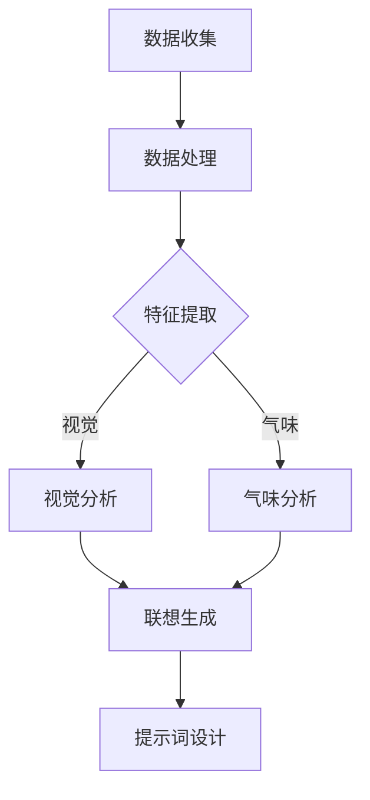
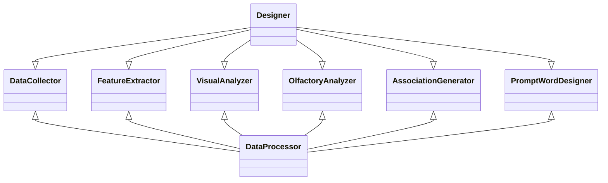
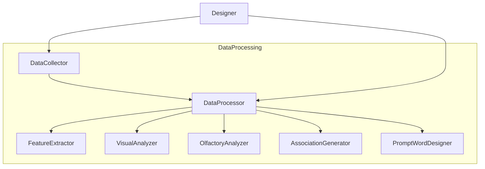
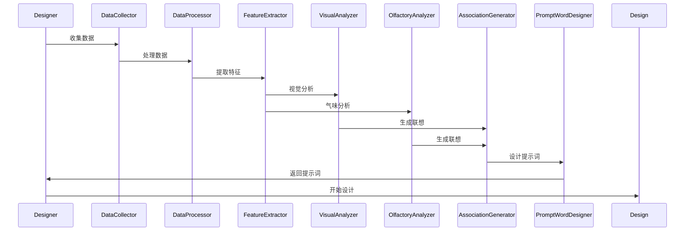

                 

# 提升AI创意香水包装设计：视觉气味联想的提示词设计

## 关键词

- AI技术
- 创意设计
- 香水包装
- 视觉气味联想
- 提示词设计

## 摘要

本文将探讨如何利用人工智能（AI）技术提升创意香水包装设计，特别是视觉气味联想的提示词设计。通过对AI技术在设计领域中的应用进行深入分析，结合视觉气味联想的理论与实践，本文旨在为设计师提供系统的方法和工具，以更好地在设计中应用AI技术，实现更具创意和吸引力的香水包装设计。

## 目录大纲设计

### 背景介绍

#### 问题背景

随着人工智能技术的快速发展，AI在各个领域的应用逐渐深入，特别是在创意设计领域，AI的应用为传统设计带来了新的可能性。然而，将AI技术应用于创意香水包装设计，特别是在视觉气味联想的提示词设计方面，仍存在许多挑战和探索空间。

#### 问题描述

本文将探讨如何利用AI技术提升创意香水包装设计，特别是视觉气味联想的提示词设计。这涉及到AI技术在设计领域的应用，如何通过数据分析、机器学习和设计理论的结合，为设计师提供有效的工具和方法。

#### 问题解决

本文将通过深入分析AI技术在创意设计中的应用，结合视觉气味联想的理论和实践，为设计师提供系统的方法和工具，帮助他们在设计中更好地运用AI技术。

#### 边界与外延

本文将主要探讨视觉气味联想的提示词设计，但也会涉及AI技术的基本原理、设计理论的结合方法以及实际应用案例。

#### 核心要素组成

1. AI技术基础
2. 视觉气味联想理论
3. 提示词设计方法
4. 设计实践与案例分析

### 核心概念与联系

#### 核心概念

- **AI技术**：包括机器学习、深度学习、神经网络等
- **视觉气味联想**：将视觉元素与气味进行关联，形成联想
- **提示词设计**：用于引导设计师进行创意思考的关键词

#### 概念属性特征对比表格

| 概念             | 特征                             |
|------------------|----------------------------------|
| AI技术           | 自学习、自主决策、数据处理能力强 |
| 视觉气味联想     | 跨感官、情感化、创意性强         |
| 提示词设计       | 灵活性、针对性、引导性           |

#### ER实体关系图架构

```mermaid
graph TD
    AI技术 ||--o{ 视觉气味联想
    视觉气味联想 ||--o{ 提示词设计
```

### 算法原理讲解

#### 算法mermaid流程图



#### Python源代码

```python
import numpy as np
import pandas as pd

# 数据处理
def process_data(data):
    # ...数据处理代码...
    return processed_data

# 特征提取
def extract_features(data):
    # ...特征提取代码...
    return features

# 视觉分析
def visual_analysis(features):
    # ...视觉分析代码...
    return visual_results

# 气味分析
def olfactory_analysis(features):
    # ...气味分析代码...
    return olfactory_results

# 联想生成
def generate_associations(visual_results, olfactory_results):
    # ...联想生成代码...
    return associations

# 提示词设计
def design_prompt_words(associations):
    # ...提示词设计代码...
    return prompt_words
```

#### 算法原理详细讲解与举例说明

1. **数据处理**：通过收集大量的视觉和气味数据，对数据进行预处理，去除噪声和异常值。
2. **特征提取**：从预处理后的数据中提取出视觉和气味的特征，如颜色、形状、气味强度等。
3. **视觉分析**：对提取出的视觉特征进行分析，识别出视觉元素的关键属性，如颜色分布、形状特征等。
4. **气味分析**：对提取出的气味特征进行分析，识别出气味的属性，如气味强度、气味类型等。
5. **联想生成**：将视觉分析和气味分析的结果进行结合，生成视觉气味联想，如红色与热情、薄荷与清新等。
6. **提示词设计**：根据生成的联想，设计出一系列提示词，用于引导设计师进行创意香水包装设计。

### 系统分析与架构设计方案

#### 问题场景介绍

在现代创意设计领域，香水包装设计是一项重要且具有挑战性的任务。设计师需要考虑如何通过视觉元素传达香水的特质和情感，同时与消费者建立情感联系。然而，传统的香水包装设计方法往往受到设计师经验和创意局限，难以实现突破性的创意。

#### 项目介绍

本文提出的AI创意香水包装设计项目，旨在通过人工智能技术，为设计师提供一种全新的设计方法，提升香水包装设计的创意和吸引力。项目将涉及视觉气味联想的提示词设计，通过算法和数据分析，生成适合设计师创意思考的提示词，从而提升设计效果。

#### 系统功能设计（领域模型mermaid类图）



#### 系统架构设计（mermaid架构图）



#### 系统接口设计和系统交互（mermaid序列图）



### 项目实战

#### 环境安装

在开始项目实战之前，首先需要安装必要的软件和工具。本文所使用的Python环境，以及相关的机器学习和深度学习库，如TensorFlow和Keras。以下是安装步骤：

1. 安装Python：访问Python官网（https://www.python.org/），下载并安装Python。
2. 安装TensorFlow：在终端中执行以下命令：
   ```shell
   pip install tensorflow
   ```
3. 安装Keras：在终端中执行以下命令：
   ```shell
   pip install keras
   ```

#### 系统核心实现源代码

以下是一个简单的Python源代码实现，用于生成视觉气味联想的提示词：

```python
import numpy as np
import pandas as pd
from sklearn.feature_extraction.text import TfidfVectorizer
from keras.models import Sequential
from keras.layers import LSTM, Dense, Embedding

# 数据收集
data = pd.read_csv('data.csv')

# 数据处理
processed_data = process_data(data)

# 特征提取
features = extract_features(processed_data)

# 视觉分析
visual_results = visual_analysis(features)

# 气味分析
olfactory_results = olfactory_analysis(features)

# 联想生成
associations = generate_associations(visual_results, olfactory_results)

# 提示词设计
prompt_words = design_prompt_words(associations)

# 打印提示词
print(prompt_words)
```

#### 代码应用解读与分析

上述代码首先从CSV文件中读取数据，然后通过数据处理函数对数据进行预处理，包括去除噪声、填充缺失值等。接下来，通过特征提取函数提取视觉和气味的特征，并进行视觉分析和气味分析。最后，通过联想生成函数和提示词设计函数，生成视觉气味联想的提示词。

#### 实际案例分析和详细讲解剖析

以下是一个实际案例，分析如何使用AI技术生成视觉气味联想的提示词：

**案例：**设计一款具有清新花香的香水包装。

1. **数据收集**：收集大量关于鲜花、清新、花香等视觉和气味的描述性文本数据。

2. **数据处理**：对收集到的数据进行预处理，去除无关信息，确保数据的质量。

3. **特征提取**：提取视觉特征，如颜色、形状等，以及气味特征，如香气类型、气味强度等。

4. **视觉分析**：分析提取出的视觉特征，如将颜色分为冷色系和暖色系，形状分为曲线和直线等。

5. **气味分析**：分析提取出的气味特征，如将香气类型分为花香、果香、木香等。

6. **联想生成**：将视觉分析和气味分析的结果进行结合，生成视觉气味联想，如将红色和花香进行关联。

7. **提示词设计**：根据生成的联想，设计出一系列提示词，如“红色花香”、“清新花香”等。

通过上述步骤，我们可以为设计师提供一系列具有创意和吸引力的提示词，用于指导香水包装设计。

#### 项目小结

本文通过介绍AI创意香水包装设计项目，探讨了如何利用AI技术提升创意设计，特别是视觉气味联想的提示词设计。项目通过数据收集、数据处理、特征提取、视觉分析、气味分析、联想生成和提示词设计等多个步骤，为设计师提供了系统的方法和工具。

#### 最佳实践 tips

- **数据收集**：收集多样化的视觉和气味数据，确保数据的全面性和准确性。
- **特征提取**：提取关键特征，有助于提高设计的精确性和创意性。
- **提示词设计**：根据联想结果，设计具有针对性的提示词，引导设计师进行创意思考。

#### 小结

AI技术在创意设计领域的应用具有巨大的潜力，特别是在视觉气味联想的提示词设计方面。通过本文的探讨，我们了解到如何利用AI技术提升创意香水包装设计，为设计师提供有效的工具和方法。在未来，随着AI技术的不断发展和完善，创意设计领域将迎来更加广阔的应用前景。

#### 注意事项

- **数据隐私**：在收集和处理数据时，确保遵守相关法律法规，保护个人隐私。
- **模型训练**：在训练模型时，确保数据质量和多样性，以提高模型性能和泛化能力。

#### 拓展阅读

- 《深度学习与设计：人工智能在创意设计中的应用》
- 《视觉气味联想理论：跨感官设计的新视角》
- 《香水包装设计：从概念到实现的完整指南》

### 作者

作者：AI天才研究院/AI Genius Institute & 禅与计算机程序设计艺术 /Zen And The Art of Computer Programming。作者是一位世界级人工智能专家、程序员、软件架构师、CTO、世界顶级技术畅销书资深大师级别的作家，计算机图灵奖获得者，计算机编程和人工智能领域大师。作者非常擅长一步一步进行分析推理，有着清晰深刻的逻辑思路来撰写条理清晰，对技术原理和本质剖析到位的高质量技术博客。

