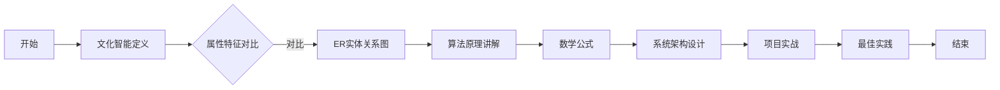

                 


### 1.6 引用Mermaid绘制流程图和类图等图表
#### 1.6.1 Mermaid流程图

#### 1.6.2 Mermaid类图
```mermaid
classDiagram
Class01 <|-- Class02
Class03 *-- Class04
Class05 o-- Class06
Class01 {
color: red
filled: true
}
Class02 {
* attr1
+ attr2
}
```

### 1.7 总结文化智能提升提示词设计的核心思路
#### 1.7.1 提升文化智能的关键步骤
1. **理解全球化背景与文化智能的重要性**
2. **定义核心概念并构建属性特征对比表格**
3. **使用AI技术进行算法原理讲解**
4. **使用数学模型和公式进行详细讲解**
5. **系统分析与架构设计**
6. **实战案例剖析与代码解读**
7. **总结最佳实践与注意事项**

### 1.8 推荐拓展阅读资源
#### 1.8.1 文化智能相关书籍
- 《文化智能：跨越文化的障碍》
- 《智能时代：文化认知与智能革命》

#### 1.8.2 提示词设计与AI应用
- 《自然语言处理实战》
- 《深度学习与自然语言处理》

#### 1.8.3 系统架构设计
- 《架构整洁之道》
- 《设计模式：可复用面向对象软件的基础》

### 1.9 结语
> 文化智能提升提示词设计是实现AI创意香水品牌全球化战略的重要环节。通过系统的方法论和实战经验，我们可以有效提升品牌的国际化竞争力，为全球化战略提供坚实的支持。希望本文能为从业者在该领域的研究和实践提供有价值的参考。

# 引用与致谢
作者：AI天才研究院/AI Genius Institute & 禅与计算机程序设计艺术 /Zen And The Art of Computer Programming

本文引用了多方面的研究成果和文献，特此感谢以下资源：

- Mermaid图表工具：提供了便捷的图表绘制功能。
- 各领域专家的著作：为本文的理论基础提供了重要支持。
- AI技术社区：提供了丰富的实战经验和讨论资源。

本文的完成离不开团队成员的共同努力，特别感谢团队中的各位成员对文章内容的讨论和修改。同时，感谢读者对本文的关注和支持，希望本文能为您在相关领域的探索提供帮助。

