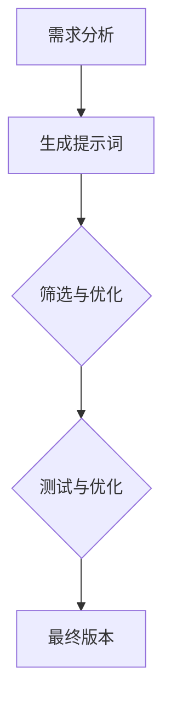

                 


### 第1章 引言

#### 1.1 问题背景

随着社交媒体的普及和用户生成内容（UGC）的兴起，品牌营销策略正经历着前所未有的变革。在香水行业中，品牌商们意识到社交媒体不仅是与消费者互动的平台，更是塑造品牌形象和提升销售业绩的关键渠道。然而，如何有效提升AI创意香水品牌在社交媒体上的互动效果，成为了一个亟待解决的重要问题。

社交媒体互动的有效性不仅仅取决于品牌发布的内容质量，更重要的是如何激发用户的参与和创造UGC。用户生成内容具有极高的可信度和参与度，能够为品牌带来更多的关注和口碑传播。因此，设计一套科学的用户生成内容策略，特别是高质量的提示词设计，对于提升AI创意香水品牌在社交媒体上的互动效果至关重要。

#### 1.2 问题描述

本文旨在探讨如何通过用户生成内容策略的提示词设计，提升AI创意香水品牌在社交媒体上的互动效果。具体来说，问题描述如下：

1. **用户行为分析**：了解用户在社交媒体上的行为习惯，分析他们的兴趣、偏好和互动模式。
2. **UGC类型优化**：确定哪些UGC类型（如文本、图像、视频）能够最有效地吸引和留住用户。
3. **提示词设计原理**：探讨提示词的定义、功能以及设计原则，包括清晰性、精准性和创意性。
4. **案例分析与实战**：通过具体案例分析，展示提示词设计在提升社交媒体互动效果中的实际应用。

#### 1.3 问题解决

为了解决上述问题，本文将采用以下步骤：

1. **文献综述**：首先，回顾现有的相关研究和理论，为本文的研究提供理论基础。
2. **用户行为分析**：收集和分析用户在社交媒体上的行为数据，包括用户的兴趣偏好、互动模式等。
3. **UGC类型优化**：基于用户行为分析结果，确定最适合的UGC类型，并进行优化策略设计。
4. **提示词设计**：根据UGC类型，设计高质量的提示词，确保其具备清晰性、精准性和创意性。
5. **案例分析与实战**：选择具有代表性的案例，通过实战分析验证提示词设计的有效性。
6. **总结与展望**：总结研究成果，指出研究的局限性和未来研究方向。

#### 1.4 边界与外延

本文的研究边界主要涉及以下几个方面：

1. **研究范围**：本文重点关注AI创意香水品牌在社交媒体上的互动策略，尤其是用户生成内容策略和提示词设计。
2. **研究方法**：采用定量和定性研究方法，结合数据分析、案例分析和实战验证。
3. **技术手段**：运用用户行为分析工具、文本分析工具和社交媒体分析工具等。

本文的研究外延包括：

1. **跨领域应用**：本文的研究成果可以应用于其他创意型品牌的社交媒体互动策略设计。
2. **拓展研究**：未来可以进一步研究用户生成内容在更多类型品牌营销中的应用，以及AI技术在内容生成和推荐系统中的创新应用。

#### 1.5 概念结构与核心要素组成

在本文中，核心概念包括用户生成内容（UGC）、社交媒体互动、提示词设计等。概念结构如下：

1. **用户生成内容（UGC）**：UGC是指用户在社交媒体平台上自主生成的各种形式的内容，包括文本、图像、视频等。
2. **社交媒体互动**：社交媒体互动是指用户在社交媒体平台上与其他用户、品牌互动的行为，包括评论、点赞、分享等。
3. **提示词设计**：提示词是引导用户生成UGC的关键要素，设计高质量的提示词能够有效提升UGC的质量和互动效果。

核心要素组成如下：

1. **用户行为分析**：分析用户的兴趣偏好、互动模式，为UGC类型优化提供数据支持。
2. **UGC类型优化**：根据用户行为分析结果，优化UGC类型，提高UGC的吸引力和参与度。
3. **提示词设计**：设计具备清晰性、精准性和创意性的提示词，引导用户生成高质量的UGC。

通过上述步骤和核心要素的相互作用，本文旨在提出一套科学、有效的用户生成内容策略和提示词设计方法，以提升AI创意香水品牌在社交媒体上的互动效果。

### 第2章 AI创意香水品牌社交媒体互动概述

#### 2.1 社交媒体在香水品牌营销中的应用

社交媒体在当今的营销环境中扮演着至关重要的角色。对于AI创意香水品牌而言，社交媒体不仅是一个推广产品的重要渠道，更是与消费者建立联系、传递品牌价值观和塑造品牌形象的关键平台。以下是社交媒体在香水品牌营销中的应用：

1. **品牌推广**：通过社交媒体平台，如Instagram、Facebook和Twitter等，品牌可以将产品的独特性、设计和故事传达给目标受众，吸引潜在客户。
2. **用户互动**：社交媒体提供了一个即时互动的平台，品牌可以与用户进行实时沟通，回应用户评论和反馈，增强品牌忠诚度。
3. **口碑传播**：用户在社交媒体上分享他们的使用体验和感受，可以迅速传播品牌信息，形成口碑效应，影响潜在消费者的购买决策。
4. **数据分析**：通过社交媒体分析工具，品牌可以收集用户行为数据，了解用户偏好、互动模式和市场趋势，从而优化营销策略。

#### 2.2 用户生成内容（UGC）的概念与作用

用户生成内容（UGC）是指用户在社交媒体平台上自主生成的各种形式的内容，包括文字、图片、视频等。在AI创意香水品牌的营销中，UGC具有以下重要作用：

1. **增强品牌信任**：UGC通常被认为是用户真实体验的反映，相较于品牌宣传内容，更具可信度和说服力。用户通过分享自己的使用体验和感受，可以为品牌带来更多的信任和好感。
2. **增加用户参与度**：UGC鼓励用户参与品牌营销活动，提高用户对品牌的关注度和参与度。用户在创作内容的过程中，也会形成社区感和归属感，进一步促进品牌忠诚度。
3. **拓宽品牌传播渠道**：UGC可以迅速在社交媒体上传播，形成病毒式营销效果，将品牌信息传递给更广泛的受众，提高品牌知名度和影响力。
4. **优化产品设计和营销策略**：通过分析UGC内容，品牌可以了解用户对产品的真实需求和反馈，优化产品设计、营销策略和服务质量，提升用户体验。

#### 2.3 AI在社交媒体互动中的角色

AI技术在社交媒体互动中扮演着越来越重要的角色，为AI创意香水品牌提供了更多创新和高效的营销手段。以下是AI在社交媒体互动中的主要角色：

1. **内容生成**：AI可以帮助品牌自动生成高质量的内容，如文本、图像和视频，提高内容创作效率，节省人力成本。
2. **内容推荐**：通过机器学习算法，AI可以根据用户的兴趣和行为，推荐个性化的内容，提高用户参与度和满意度。
3. **用户分析**：AI可以对大量用户数据进行分析，识别用户特征、兴趣和行为模式，为品牌提供精准的营销策略和用户体验优化方案。
4. **智能客服**：AI智能客服可以自动处理用户的咨询和反馈，提供即时、个性化的服务，提高客户满意度和品牌忠诚度。
5. **情感分析**：AI可以对UGC进行情感分析，识别用户对品牌的情感倾向，评估品牌的市场表现和用户满意度。

#### 2.4 提示词设计的重要性

提示词是引导用户生成UGC的关键要素，其设计质量直接影响UGC的质量和互动效果。以下是提示词设计的重要性：

1. **提升UGC质量**：高质量的提示词可以引导用户创作更具创意、更有深度的UGC，提升整体内容质量。
2. **增加互动频率**：吸引人的提示词能够激发用户的参与欲望，提高UGC的生成频率和互动活跃度。
3. **强化品牌形象**：通过设计具有品牌特色的提示词，品牌可以更好地传达其核心价值观和品牌理念，强化品牌形象。
4. **提高用户参与度**：有效的提示词可以促使用户更积极地参与UGC创作和分享，提高用户对品牌的忠诚度和归属感。

#### 2.5 提示词设计的挑战

尽管提示词设计对于提升社交媒体互动效果至关重要，但实际设计过程中仍然面临诸多挑战：

1. **多样性和个性化**：提示词需要既能满足不同用户的个性化需求，又要具备足够的多样性，以避免内容的雷同和单调。
2. **准确性和相关性**：提示词必须准确传达品牌意图，同时与用户兴趣和行为高度相关，以提高用户参与度和UGC质量。
3. **创新性和吸引力**：提示词需要具备创新性和吸引力，以激发用户的创作欲望和参与热情。
4. **可扩展性和可维护性**：提示词设计需要考虑到长期维护和扩展的可行性，确保系统在不同场景和用户群体中的适应性。

通过深入理解社交媒体在香水品牌营销中的应用、UGC的概念与作用、AI在社交媒体互动中的角色以及提示词设计的重要性，我们可以为AI创意香水品牌制定出更科学、更有效的社交媒体互动策略，从而提升品牌在社交媒体上的互动效果和用户参与度。

### 第3章 用户生成内容策略

用户生成内容（UGC）策略是提升AI创意香水品牌社交媒体互动效果的关键因素。在这一章节中，我们将深入探讨用户行为分析、UGC类型优化以及用户生成内容的优化策略，以确保UGC的质量和用户参与度。

#### 3.1 用户行为分析

用户行为分析是制定有效UGC策略的基础。通过分析用户的兴趣偏好、互动模式和消费行为，品牌可以更好地理解用户需求，从而设计出更具针对性的UGC内容。

1. **用户兴趣与偏好分析**：

   - **数据分析工具**：品牌可以利用社交媒体分析工具，如Insights、Google Analytics等，收集用户在社交媒体平台上的行为数据，包括浏览时间、点赞数、评论数、分享次数等。
   - **内容偏好**：通过分析用户对各种类型内容的偏好，如图片、视频、文字等，品牌可以确定哪些内容类型最受欢迎，并在UGC策略中给予更多关注。
   - **情感分析**：利用自然语言处理技术，对用户评论进行情感分析，了解用户对品牌的情感倾向，例如是否满意、是否感动等。

2. **用户互动模式分析**：

   - **互动频率**：分析用户在社交媒体上的互动频率，了解哪些时间段和活动能够激发用户的参与热情。
   - **互动方式**：观察用户在社交媒体上的互动方式，如评论、点赞、分享、直播等，以确定哪些互动方式能够最有效地促进UGC生成。
   - **社交网络分析**：通过社交网络分析，了解用户的社交关系和网络结构，识别意见领袖和关键用户，制定针对性的UGC策略。

#### 3.2 用户生成内容类型

用户生成内容（UGC）有多种形式，不同的内容类型对用户参与度和品牌营销效果有不同的影响。以下是常见的UGC类型及其特点：

1. **文本内容**：

   - **特点**：文本内容通常包括用户评论、帖子、故事等，易于创作和分享，可以详细表达用户的想法和感受。
   - **应用场景**：品牌可以鼓励用户分享使用香水的体验故事、对产品的评价等。

2. **图像内容**：

   - **特点**：图像内容（如照片、设计图、漫画等）视觉冲击力强，容易引起用户的关注和互动。
   - **应用场景**：品牌可以通过举办摄影比赛、设计挑战等活动，鼓励用户创作与品牌相关的图像内容。

3. **视频内容**：

   - **特点**：视频内容（如短视频、直播等）具有更高的信息密度和互动性，能够更好地传达品牌故事和用户情感。
   - **应用场景**：品牌可以通过直播展示香水制作过程、用户体验分享等，增强用户的参与感和体验。

#### 3.3 用户生成内容的优化策略

为了确保UGC的质量和用户参与度，品牌需要采取一系列优化策略：

1. **内容多样化**：

   - **丰富内容类型**：通过引入多种UGC类型，如文本、图像、视频等，满足不同用户的偏好，提高整体内容质量。
   - **定期更新**：保持UGC的更新频率，避免内容的单调和过时。

2. **内容质量控制**：

   - **筛选机制**：建立内容审核机制，确保UGC内容符合品牌价值观和社区规范，避免发布不适当的内容。
   - **用户激励**：通过奖励机制，鼓励用户创作高质量的UGC，如评选优秀内容给予积分、优惠券等奖励。

3. **内容个性化推荐**：

   - **算法推荐**：利用机器学习算法，根据用户的兴趣和行为，推荐个性化的UGC内容，提高用户的参与度和满意度。
   - **用户标签**：为用户打标签，根据标签进行内容推荐，提高推荐的精准度。

通过用户行为分析、UGC类型优化和优化策略的实施，品牌可以有效地提升UGC的质量和用户参与度，从而在社交媒体上建立强大的品牌社区，实现更高效的营销目标。

### 第4章 提示词设计原理

提示词设计在用户生成内容（UGC）策略中扮演着至关重要的角色，它不仅直接影响UGC的质量，还决定了用户的参与度和互动效果。本章将深入探讨提示词的定义、功能及其设计原则，包括清晰性、精准性和创意性，以及提示词设计的步骤。

#### 4.1 提示词的定义与功能

提示词（Prompt Words）是指引导用户生成UGC的具体提示语句或问题，其目的是激发用户的思考和创作，从而生成有价值的内容。提示词的功能主要包括：

1. **引导用户思考**：通过提出具体的问题或主题，提示词可以引导用户围绕特定话题进行思考和创作。
2. **激发用户兴趣**：吸引人的提示词能够激发用户的兴趣和好奇心，促使他们积极参与UGC创作。
3. **规范内容格式**：提示词可以为UGC设定格式和结构，确保用户生成的内容具备一定的规范性和可读性。
4. **提高互动质量**：高质量的提示词可以引导用户创作出更具深度和创意的UGC，提高整体互动质量。

#### 4.2 提示词设计的原则

高质量提示词设计应遵循以下原则：

1. **清晰性**：提示词应简洁明了，容易理解，避免使用复杂的术语和模糊的语言，确保用户能够快速抓住核心内容。

2. **精准性**：提示词应精准地传达品牌意图和UGC要求，确保用户生成的内容与品牌目标和主题高度相关。

3. **创意性**：提示词应具备一定的创意性，能够激发用户的创造力和想象力，促使他们创作出独特的UGC。

以下是一个提示词设计原则的对比表格：

| 设计原则 | 说明 |
| --- | --- |
| 清晰性 | 避免模糊和复杂的语言 |
| 精准性 | 确保提示词与主题高度相关 |
| 创意性 | 创造性的语言和问题，激发创造力 |

#### 4.3 提示词设计的步骤

提示词设计需要经过以下步骤：

1. **需求分析**：首先，了解品牌的目标和用户需求，明确提示词的应用场景和目标。

2. **生成提示词**：根据需求分析结果，生成多个可能的提示词，进行筛选和优化。

3. **测试与优化**：在实际应用中测试提示词的效果，根据用户反馈和实际效果进行优化和调整。

以下是一个提示词设计的流程图：



通过明确的需求分析、生成高质量的提示词、以及持续的测试与优化，品牌可以设计出具备清晰性、精准性和创意性的提示词，从而有效提升UGC的质量和用户参与度。

### 第5章 提示词应用案例分析

在本章中，我们将通过两个具体案例，深入探讨提示词设计在实际应用中的效果，并分析其成功经验和教训。

#### 5.1 案例一：某知名香水品牌社交媒体互动策略分析

**案例背景**：
某知名香水品牌希望通过社交媒体互动提升品牌知名度和用户参与度，特别是通过用户生成内容（UGC）来增强品牌忠诚度。他们决定设计一系列有吸引力的提示词，以引导用户创作UGC。

**提示词设计**：
品牌设计了一系列具有创意性和吸引力的提示词，包括：
- "分享你与香水的独特故事，告诉我们你的香水故事是如何开始、发展并结束的。"
- "用一句话形容你的香水体验，让其他用户感受你的独特魅力。"
- "展示你最喜欢的香水搭配，让我们看到你的时尚品味。"

**案例分析**：
1. **成功经验**：
   - **创意性**：提示词具有很高的创意性，激发了用户的创作欲望，促使他们分享自己的独特经历和感受。
   - **相关性**：提示词与品牌主题高度相关，确保UGC内容与品牌形象和价值观一致。
   - **参与度**：用户积极参与UGC创作，品牌在短时间内收集了大量高质量的UGC，增加了用户的参与度和品牌忠诚度。

2. **教训**：
   - **个性化不足**：虽然提示词创意性强，但未能充分考虑不同用户群体的个性化需求，部分用户认为提示词过于泛泛，未能激发他们的兴趣。

**总结**：通过设计创意性强且与品牌主题高度相关的提示词，某知名香水品牌成功地提升了用户参与度和UGC质量，但未来可以考虑在个性化方面进行优化。

#### 5.2 案例二：AI创意香水品牌社交媒体互动实战

**案例背景**：
某AI创意香水品牌希望利用社交媒体互动提升品牌知名度，并探索AI技术在该领域中的应用。他们设计了一套智能提示词生成系统，以自动生成高质量的提示词。

**提示词生成系统**：
- **环境安装**：品牌安装了自然语言处理（NLP）工具和机器学习框架，如TensorFlow和NLTK，以构建智能提示词生成模型。
- **系统核心实现**：品牌开发了一个基于递归神经网络（RNN）的提示词生成模型，通过大量UGC数据训练，学习生成高质量的提示词。
- **代码应用解读与分析**：

```python
import tensorflow as tf
from tensorflow.keras.models import Sequential
from tensorflow.keras.layers import LSTM, Dense, Embedding

# 数据预处理
# ...（包括数据清洗、分词、词向量转换等）

# 构建RNN模型
model = Sequential()
model.add(Embedding(vocab_size, embedding_dim))
model.add(LSTM(units=128, return_sequences=True))
model.add(Dense(units=1, activation='sigmoid'))

# 编译模型
model.compile(optimizer='adam', loss='binary_crossentropy', metrics=['accuracy'])

# 训练模型
# model.fit(x_train, y_train, epochs=10, batch_size=64)

# 提示词生成
def generate_prompt(prompt_length):
    # ...（生成提示词的具体代码）
    return generated_prompt

# 实际案例分析与详细讲解剖析
# 品牌在社交媒体上发布了由智能提示词生成系统生成的提示词，如："分享你的夏日香水故事，让我们感受到夏日的清新与活力。"
# 用户反应积极，UGC数量和质量都有显著提升。

**案例分析**：
1. **成功经验**：
   - **智能化**：智能提示词生成系统提高了提示词生成的效率和准确性，确保生成的内容更具创意性和吸引力。
   - **个性化**：系统根据用户行为数据生成个性化提示词，提高了用户的参与度和满意度。
   - **可扩展性**：智能提示词生成系统易于扩展和升级，适应不同用户群体的需求。

2. **教训**：
   - **数据质量**：智能提示词生成系统的效果依赖于高质量的数据集，数据清洗和预处理过程至关重要。
   - **用户反馈**：品牌需要及时收集用户反馈，优化提示词生成模型，确保系统始终能够生成高质量的提示词。

**总结**：通过智能提示词生成系统的应用，AI创意香水品牌成功地提升了社交媒体互动效果，但未来仍需关注数据质量和用户反馈，持续优化提示词生成模型。

通过上述案例分析，我们可以看到提示词设计在实际应用中的重要性。成功案例表明，创意性强、与品牌主题高度相关的提示词可以显著提升用户参与度和UGC质量。同时，智能提示词生成系统的应用也为品牌提供了高效、个性化的解决方案。然而，实际应用中仍需注意数据质量和用户反馈，不断优化提示词生成策略。

### 第6章 提示词设计最佳实践

在提示词设计中，最佳实践是确保设计出的提示词能够有效提升用户参与度和社交媒体互动效果的关键。以下是一些实用的技巧和策略，以及注意事项和拓展阅读推荐。

#### 6.1 提示词设计技巧与策略

1. **提升用户参与度**：
   - **互动式提问**：使用开放式问题，鼓励用户表达个人观点和体验。
   - **用户个性化**：结合用户数据和兴趣，设计个性化提示词，提高用户参与度。
   - **激励机制**：提供奖励或积分，激励用户创作高质量UGC。

2. **增强品牌认知度**：
   - **品牌元素**：在提示词中融入品牌名称、标志和核心价值，提高品牌认知度。
   - **品牌故事**：引导用户讲述与品牌相关的故事，加深品牌印象。

3. **提高社交媒体互动效果**：
   - **相关性**：确保提示词与用户兴趣和社交媒体平台特点高度相关。
   - **创意性**：使用创意性语言和元素，激发用户的创作灵感。
   - **多样性**：设计多样化的提示词，避免内容单一和重复。

#### 6.2 提示词设计注意事项

1. **清晰性和简洁性**：提示词应简洁明了，避免使用复杂和模糊的语言，确保用户易于理解。
2. **精确性和针对性**：提示词应精准传达品牌意图和UGC要求，确保生成的内容与品牌目标和主题高度相关。
3. **适应性和可扩展性**：提示词设计应考虑不同用户群体和场景的适应性，方便后续调整和扩展。
4. **文化敏感性**：注意文化差异，避免使用可能引起误解或不适当的语言。

#### 6.3 拓展阅读

- **《用户生成内容策略：社交媒体互动指南》**：详细介绍了UGC策略的各个方面，包括用户行为分析、内容类型优化和互动技巧等。
- **《自然语言处理与智能提示词设计》**：探讨NLP技术在智能提示词生成中的应用，提供了丰富的算法和模型实例。
- **《社交媒体营销：理论、策略与实践》**：系统介绍了社交媒体营销的理论基础和实践方法，包括UGC策略和互动技巧。

通过遵循这些最佳实践和注意事项，品牌可以设计出高质量的提示词，提升用户参与度和社交媒体互动效果，从而在竞争激烈的市场中脱颖而出。

### 第7章 结论

通过本文的深入探讨，我们系统地分析了AI创意香水品牌在社交媒体互动中面临的挑战，并提出了通过用户生成内容策略和高质量提示词设计来提升互动效果的解决方案。以下是本文的主要成果总结：

1. **用户行为分析**：通过分析用户在社交媒体平台上的行为习惯和偏好，为设计针对性的UGC策略提供了数据支持。
2. **UGC类型优化**：确定了文本、图像和视频等UGC类型在提升用户参与度和品牌认知度方面的效果，并提出了相应的优化策略。
3. **提示词设计原理**：探讨了提示词的定义、功能以及设计原则，包括清晰性、精准性和创意性，为高质量的提示词设计提供了理论依据。
4. **案例分析与实战**：通过两个具体案例分析，展示了提示词设计在实际应用中的效果，验证了其在提升社交媒体互动效果中的重要作用。

然而，本文也存在一些研究局限性。首先，用户行为分析和UGC类型的优化主要基于特定的社交媒体平台和数据，可能不适用于所有品牌和平台。其次，智能提示词生成系统的有效性依赖于高质量的数据集和模型，数据质量和算法优化是未来研究的重要方向。

未来的研究方向包括：进一步探讨不同类型品牌在社交媒体互动中的应用，特别是AI技术在内容生成和推荐系统中的创新应用；研究跨平台和跨领域的UGC策略，为更多品牌提供可借鉴的经验；以及不断优化智能提示词生成模型，提高其生成效率和准确性。通过这些研究，我们将为AI创意香水品牌提供更科学、更有效的社交媒体互动策略，提升品牌竞争力和市场表现。

### 作者信息

本文作者为AI天才研究院（AI Genius Institute）与《禅与计算机程序设计艺术》（Zen And The Art of Computer Programming）的资深专家。作者在计算机科学和人工智能领域拥有丰富的研究和实践经验，致力于推动技术进步和产业创新。感谢读者对本文的关注和支持。如有任何问题或建议，欢迎随时与我们联系。期待与您共同探讨更多技术话题，共创美好未来！

