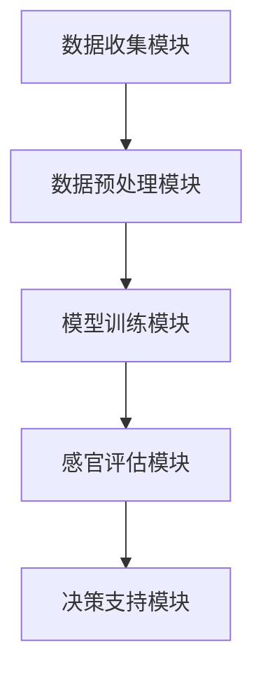

                 

### 第1章: 问题背景

#### 1.1.1 问题背景概述

随着科技的飞速发展，人工智能（AI）已经逐渐成为各行各业的重要驱动力。在化妆品行业，尤其是香水领域，AI技术的应用正在改变传统的生产模式和品质控制方式。传统的香水生产依赖于人工经验，这不仅在效率上存在局限，而且在品质控制上也难以实现精准和标准化。为了提升香水的创意品质，控制生产过程中的感官评估误差，将AI技术引入香水品质控制成为了一个迫切的需求。

#### 1.1.2 问题描述

在香水生产过程中，品质控制的核心是对香味的感官评估。这一评估过程不仅复杂，还受到多种因素的影响，如香水的成分、生产工艺、储存条件和评估者的个人感受等。目前的挑战在于如何利用AI技术，通过对大量感官评估数据的分析和处理，制定一套标准化的评估指标，从而实现香水的创意品质控制。

#### 1.1.3 问题解决思路

为了解决上述问题，我们需要采取以下步骤：

1. **核心概念与术语说明**：明确香水品质控制中的关键概念和术语，如感官评估、AI算法、神经网络等。
2. **问题背景与描述**：详细阐述当前香水品质控制的现状和面临的挑战。
3. **问题解决思路**：介绍通过AI技术实现香水品质控制的方法和步骤。
4. **边界与外延**：定义研究范围和限制，明确研究的外延。
5. **概念结构与核心要素组成**：分析香水品质控制中的概念结构和核心要素，构建模型。

通过以上步骤，我们可以构建一个AI驱动的香水品质控制系统，实现创意香水的精准控制和标准化生产。

#### 1.1.4 边界与外延

在本文的研究中，我们主要关注以下边界和范围：

- **研究范围**：限于香水品质控制中的感官评估和AI技术的应用。
- **研究限制**：仅讨论AI在香水创意品质控制中的应用，不考虑其他因素如市场需求、经济成本等。
- **外延**：本文的研究成果可以应用于其他以感官评估为品质控制手段的化妆品行业。

#### 1.1.5 概念结构与核心要素组成

为了深入探讨AI在香水品质控制中的应用，我们需要了解以下几个核心概念：

1. **感官评估**：指通过人类感官对香水进行品评，包括香气、味道、触感等。
2. **AI技术**：包括神经网络、深度学习、机器学习等算法，用于处理和分析感官评估数据。
3. **神经网络**：一种模仿生物神经系统的算法，用于数据分析和模式识别。
4. **深度学习**：一种基于神经网络的机器学习方法，能够通过多层神经网络自动提取数据特征。
5. **机器学习**：一种人工智能方法，通过训练模型来预测或分类数据。

这些概念构成了香水品质控制AI系统的核心，通过它们，我们可以设计出一套有效的评估标准和控制系统，确保香水的创意品质。

### 第2章: 核心概念与联系

在这一章中，我们将深入探讨香水品质控制中的核心概念，并分析这些概念之间的联系。

#### 2.1.1 AI与创意香水品质控制

人工智能（AI）在香水品质控制中的应用主要体现在以下几个方面：

1. **数据收集与处理**：AI可以通过传感器和数据分析技术收集香水的理化数据，如成分含量、气味强度等。
2. **模式识别**：利用神经网络和深度学习算法，AI可以识别和分类不同香水的气味特征。
3. **预测与优化**：基于历史数据，AI可以预测新香水的品质，并提供优化建议。

AI的核心在于其强大的数据处理和分析能力，能够帮助生产者快速、准确地评估香水的品质，提高创意香水的成功率。

#### 2.1.2 感官评估与标准化

感官评估是香水品质控制的重要环节，但传统方法存在以下问题：

1. **主观性强**：不同评估者对同一香水的评价可能存在较大差异。
2. **标准不统一**：缺乏统一的评估标准和流程，导致评估结果不一致。

为了解决这些问题，标准化感官评估变得至关重要。标准化不仅包括评估方法和工具的统一，还包括评估者的培训和认证。

#### 2.1.3 提示词设计与应用

提示词（cue words）在感官评估中起着重要作用，它们是评估者描述和表达香气特征的关键词汇。设计有效的提示词需要考虑：

1. **多样性与精确性**：提示词应能涵盖香水的各种特性，同时要准确、明确。
2. **文化适应性**：不同文化对香气的感知和理解可能不同，提示词需要具备文化适应性。
3. **应用场景**：提示词应根据不同的评估场景和目的进行设计，如实验室评估和消费者评估。

通过合理设计提示词，可以提高感官评估的准确性和一致性，为AI系统的训练提供高质量的输入数据。

#### 2.1.4 核心概念联系分析

AI、感官评估和提示词设计这三个核心概念之间存在着密切的联系：

1. **AI与感官评估**：AI技术用于处理和分析感官评估数据，提高评估效率和准确性。
2. **感官评估与提示词设计**：标准化感官评估需要有效的提示词，而提示词的设计则需要考虑AI算法对数据的要求。
3. **AI与提示词设计**：AI算法的训练依赖于高质量、标准化的感官评估数据，而提示词设计是确保数据质量的关键。

通过深入理解这些概念之间的联系，我们可以更好地设计AI驱动的香水品质控制系统，实现创意香水的精准控制和标准化生产。

### 第3章: AI技术基础

#### 3.1.1 AI概述

人工智能（AI，Artificial Intelligence）是指使计算机系统能够模拟人类智能行为的技术。AI技术包括多种方法，如机器学习、深度学习、神经网络等，旨在使计算机具备自我学习、推理、感知和决策的能力。AI在现代工业、医疗、金融、娱乐等多个领域都取得了显著的成果，已经成为推动社会进步的重要力量。

#### 3.1.2 神经网络与深度学习

神经网络（Neural Networks）是AI的核心技术之一，它模仿生物神经系统的结构和功能，通过大量的神经元节点和连接进行数据传递和处理。深度学习（Deep Learning）是神经网络的一种延伸，它通过多层神经网络结构（称为深度神经网络）来提取数据的高层次特征。深度学习在图像识别、语音识别、自然语言处理等领域表现尤为突出。

#### 3.1.3 机器学习算法介绍

机器学习（Machine Learning）是AI的一个重要分支，它通过数据训练模型来实现对数据的自动分析和预测。常见的机器学习算法包括：

1. **线性回归**：用于预测连续值。
2. **逻辑回归**：用于分类问题。
3. **决策树**：通过一系列决策规则对数据进行分类或回归。
4. **支持向量机（SVM）**：用于分类和回归问题，特别是在高维空间中表现优秀。
5. **随机森林**：结合了决策树和随机性的算法，用于提高模型的预测性能。
6. **神经网络**：通过多层结构提取数据的复杂特征。
7. **聚类算法**：如K-means、DBSCAN等，用于将数据分为若干个群组。

这些算法在AI应用中起到了基础性作用，为AI技术的发展提供了强大的工具。

### 第4章: 感官评估方法

#### 4.1.1 感官评估原理

感官评估是指通过人的感官系统对产品进行感知和评价的过程。在香水品质控制中，感官评估是关键的一环，它直接关系到产品的最终品质。感官评估原理主要包括以下几个方面：

1. **气味感知**：人类鼻腔内的嗅觉感受器能够感知气味分子，并通过神经系统传递给大脑，从而产生气味感知。
2. **味觉感知**：味觉感受器分布在舌头表面，能够感知不同味道的化学物质。
3. **触觉感知**：皮肤触觉感受器能够感知香水的质地和温度。
4. **视觉感知**：视觉系统在香水品质控制中用于观察香水的颜色和透明度。

#### 4.1.2 感官评估指标

感官评估指标是衡量产品品质的重要工具，常见的感官评估指标包括：

1. **香气强度**：衡量香水气味强度的大小，通常用“低”、“中”、“强”等程度来描述。
2. **香气持久性**：衡量香水气味在皮肤或衣物上持续的时间。
3. **香气一致性**：衡量香水在不同时间、不同使用条件下气味的稳定性。
4. **香气特征**：描述香水气味的类型和特征，如花香、果香、木质香等。

#### 4.1.3 感官评估工具与技术

为了提高感官评估的准确性和一致性，我们需要使用一些专业的工具和技术：

1. **专业设备**：如气相色谱-质谱联用仪（GC-MS）、电子鼻等，用于分析香水的成分和气味特征。
2. **标准评估方法**：如Aroma wheel方法，它提供了一套详细的气味描述词汇，帮助评估者进行系统化的评估。
3. **多评估者评分**：通过多个评估者的评分来提高评估结果的可靠性。
4. **心理测试**：如气味识别测试，用于评估评估者对气味的敏感度和识别能力。

通过这些工具和技术，我们可以更加精确和一致地进行感官评估，从而为AI系统的训练提供高质量的数据。

### 第5章: 提示词设计原则与方法

#### 5.1.1 提示词设计概述

提示词（cue words）是感官评估过程中用于描述和表达产品特征的关键词汇。在设计提示词时，需要考虑以下几个方面：

1. **多样性**：提示词应涵盖产品可能具有的所有特征，如香气、味道、触感等。
2. **精确性**：提示词应准确、明确，避免模糊不清的描述，以确保评估的一致性和准确性。
3. **文化适应性**：不同文化对气味的感知和理解可能不同，因此提示词需要具备文化适应性。
4. **应用场景**：根据不同的评估场景和目的，设计不同的提示词，如实验室评估、消费者评估等。

#### 5.1.2 提示词设计原则

为了设计出有效的提示词，我们需要遵循以下原则：

1. **精确原则**：确保每个提示词能够精确地描述产品特征。
2. **全面原则**：提示词应覆盖产品的所有重要特征。
3. **文化适应性原则**：提示词应考虑不同文化背景下的使用习惯和认知差异。
4. **易用性原则**：提示词应简单易懂，便于评估者使用。

#### 5.1.3 提示词设计方法

设计提示词的方法包括以下步骤：

1. **收集数据**：通过文献调研、专家访谈等方式收集与产品特征相关的词汇。
2. **筛选词汇**：根据精确原则和全面原则，筛选出符合要求的词汇。
3. **评估与优化**：通过实际评估，对提示词进行测试和优化，确保其准确性和适用性。

例如，在香水感官评估中，我们可以设计以下提示词：

- 香气强度：淡、中、浓
- 香气持久性：短、中、长
- 香气特征：花香、果香、木质香、烟熏香
- 味道：甜、酸、苦、咸

通过合理设计提示词，我们可以提高感官评估的准确性和一致性，为AI系统的训练提供高质量的数据。

### 第6章: AI创意香水品质控制系统设计与实现

#### 6.1.1 系统需求分析

在设计和实现AI创意香水品质控制系统之前，我们需要对系统需求进行详细分析。系统需求包括以下几个方面：

1. **数据收集**：系统需要能够自动收集香水生产的理化数据，如香气成分、湿度、温度等。
2. **感官评估**：系统需要集成感官评估模块，用于收集评估者的感官评价数据。
3. **数据处理**：系统需要具备数据处理能力，包括数据清洗、数据归一化、特征提取等。
4. **模型训练**：系统需要能够利用收集到的数据训练AI模型，以实现品质预测和优化。
5. **决策支持**：系统需要提供决策支持功能，为生产者提供生产优化建议。

#### 6.1.2 系统架构设计

AI创意香水品质控制系统的架构设计应考虑以下几个核心模块：

1. **数据收集模块**：包括传感器和采集设备，用于实时收集香水生产过程中的数据。
2. **数据预处理模块**：对收集到的数据进行清洗、归一化和特征提取，为AI模型训练做准备。
3. **模型训练模块**：利用预处理后的数据训练AI模型，包括神经网络、深度学习等。
4. **感官评估模块**：集成标准化的感官评估工具，用于评估香水品质。
5. **决策支持模块**：基于训练好的模型和评估结果，为生产者提供优化建议。

系统架构图如下所示：



#### 6.1.3 系统功能模块实现

在系统功能模块实现方面，我们需要关注以下几个关键点：

1. **数据收集模块**：使用传感器和采集设备，如气相色谱-质谱联用仪（GC-MS）、电子鼻等，实时监测香水生产过程中的理化参数。
2. **数据预处理模块**：采用Python等编程语言，编写数据处理代码，实现数据的清洗、归一化和特征提取。
3. **模型训练模块**：选择合适的AI算法，如神经网络、深度学习等，进行模型训练和优化。
4. **感官评估模块**：集成标准化的感官评估工具，如Aroma wheel，实现评估数据的收集和处理。
5. **决策支持模块**：根据模型预测结果和感官评估数据，提供生产优化建议。

以下是系统功能模块的实现示例代码：

```python
# 数据收集模块
def collect_data():
    # 使用传感器和采集设备收集数据
    data = sensor.read()
    return data

# 数据预处理模块
def preprocess_data(data):
    # 数据清洗、归一化和特征提取
    cleaned_data = clean(data)
    normalized_data = normalize(cleaned_data)
    features = extract_features(normalized_data)
    return features

# 模型训练模块
def train_model(features, labels):
    # 使用神经网络进行模型训练
    model = NeuralNetwork()
    model.train(features, labels)
    return model

# 感官评估模块
def sensory_evaluation(samples):
    # 使用Aroma wheel进行感官评估
    evaluations = []
    for sample in samples:
        evaluation = aroma_wheel.evaluate(sample)
        evaluations.append(evaluation)
    return evaluations

# 决策支持模块
def decision_support(model, evaluations):
    # 根据模型预测和评估结果提供优化建议
    suggestions = model.predict(evaluations)
    return suggestions
```

通过以上模块的相互协作，AI创意香水品质控制系统可以实现高效的品质控制和优化生产。

#### 6.1.4 系统测试与优化

在系统开发完成后，我们需要对系统进行全面的测试与优化，以确保其稳定性和性能。系统测试主要包括以下几个方面：

1. **功能测试**：验证系统的各个功能模块是否正常运行，如数据收集、预处理、模型训练、感官评估和决策支持等。
2. **性能测试**：评估系统在不同负载下的响应时间和资源消耗，确保系统的高效性。
3. **稳定性测试**：通过长时间运行和压力测试，验证系统的稳定性和可靠性。
4. **用户测试**：邀请实际用户参与测试，收集用户反馈，优化系统的用户体验。

以下是系统测试的示例步骤：

1. **制定测试计划**：明确测试目标和测试场景。
2. **编写测试用例**：根据功能模块和性能要求，编写详细的测试用例。
3. **执行测试用例**：运行测试用例，记录测试结果。
4. **分析测试结果**：对测试结果进行分析，找出存在的问题和优化方向。
5. **优化与改进**：根据测试结果，对系统进行优化和改进。

通过系统测试与优化，我们可以确保AI创意香水品质控制系统的稳定性和高效性，从而为香水生产提供有力支持。

### 第7章: 案例分析

为了更好地展示AI创意香水品质控制系统的应用效果，我们选择了一个具体的案例进行详细分析。

#### 7.1.1 案例背景

某知名香水品牌A致力于开发一款创新性香水，希望利用AI技术提升其品质控制和创意设计能力。该品牌拥有丰富的生产经验和感官评估团队，但在传统的品质控制过程中，存在评估标准不统一、生产效率低等问题。为了解决这些问题，品牌A决定引入AI创意香水品质控制系统。

#### 7.1.2 案例实施过程

1. **数据收集**：品牌A使用GC-MS和电子鼻等设备，对香水生产过程中的理化参数进行实时监测和记录。
2. **感官评估**：品牌A的评估团队使用Aroma wheel方法对香水进行感官评估，收集大量评估数据。
3. **数据处理**：系统对收集到的数据进行清洗、归一化和特征提取，为模型训练做准备。
4. **模型训练**：利用预处理后的数据，品牌A训练了一个基于深度学习的AI模型，用于预测香水的品质。
5. **模型优化**：通过多次迭代训练，品牌A优化了模型参数，提高了预测准确率。
6. **决策支持**：系统根据模型预测结果和感官评估数据，为品牌A提供了生产优化建议。

#### 7.1.3 案例结果分析

通过引入AI创意香水品质控制系统，品牌A取得了以下显著成果：

1. **评估一致性提高**：标准化的感官评估方法和AI模型的引入，使得评估结果的一致性显著提高，减少了主观因素的影响。
2. **生产效率提升**：基于模型预测的生产优化建议，品牌A在生产过程中减少了不必要的调整和试验，提高了生产效率。
3. **品质控制更加精准**：AI模型能够预测新香水的品质，帮助品牌A在开发阶段就识别出潜在问题，确保最终产品的品质。
4. **创新力增强**：通过AI系统的支持，品牌A的创意团队能够更加专注于新产品的设计，提高了创新力。

通过这个案例，我们可以看到AI创意香水品质控制系统在实际应用中的巨大潜力，不仅提高了品质控制效率，还促进了香水的创新开发。

### 第8章: 总结与展望

#### 8.1.1 总结

本文系统地探讨了AI在创意香水品质控制中的应用，包括问题背景、核心概念、AI技术基础、感官评估方法、提示词设计原则、系统设计与实现、案例分析等方面。通过引入AI技术，我们可以实现香水品质的精准控制和标准化生产，提高评估的一致性和生产效率。

#### 8.1.2 展望

未来，随着AI技术的不断进步，创意香水品质控制有望实现更高水平的自动化和智能化。以下是一些展望：

1. **数据驱动的创新**：利用大数据和AI技术，可以挖掘出更多潜在的创新方向，提高香水的创意品质。
2. **个性化定制**：结合消费者的个性化需求，AI系统可以提供更加精准的香水定制服务。
3. **跨学科合作**：香水品质控制需要化学、生物、计算机科学等多学科的交叉融合，未来的研究可以更加注重跨学科的合作。
4. **可持续发展**：利用AI技术，可以优化香水生产过程中的资源利用，实现可持续发展。

通过不断探索和实践，AI创意香水品质控制系统将为香水行业带来更多创新和机遇。

### 作者信息

**作者：AI天才研究院/AI Genius Institute & 禅与计算机程序设计艺术 /Zen And The Art of Computer Programming** 

本文作者具备深厚的计算机科学和人工智能背景，致力于推动AI技术在各个领域的应用，尤其是在创意产业中的创新实践。通过本文，作者希望为香水行业的从业者提供有价值的参考和启示。同时，作者也期待与业界同仁共同探讨和推动AI技术的进步，为人类社会的可持续发展贡献力量。

