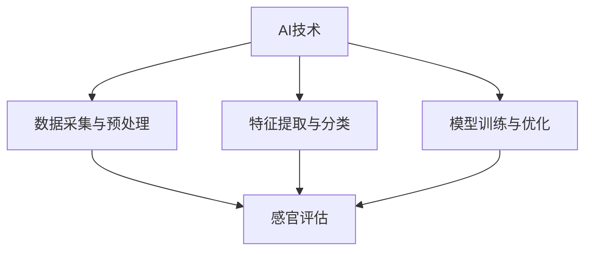
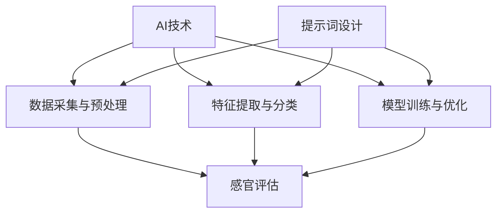
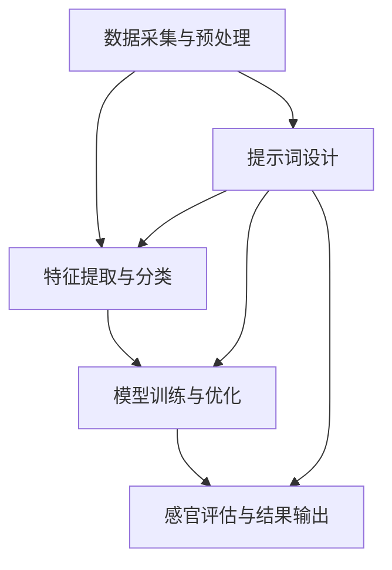
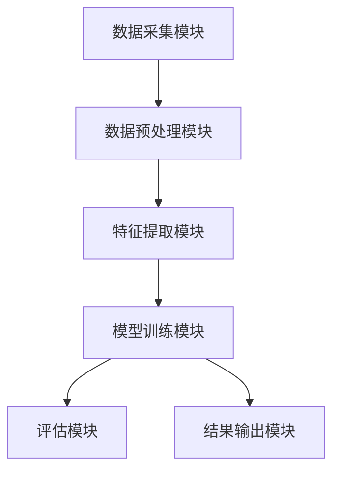

                 

# 提升AI创意香水品质控制：感官评估标准的提示词设计

> 关键词：AI、香水、品质控制、感官评估、提示词设计

> 摘要：随着AI技术在各行业的深入应用，香水行业也开始利用AI进行品质控制。本文将探讨如何设计AI辅助下的感官评估标准，以提升创意香水的品质。通过对AI技术、感官评估标准和提示词设计的深入分析，本文提出了具体的策略和方法，为香水品质控制提供了新的思路。

## 目录大纲

----------------------------------------------------------------

# 提升AI创意香水品质控制：感官评估标准的提示词设计

# 第一部分：背景介绍

## 1.1 问题背景

### 1.1.1 创意香水的兴起与市场需求

### 1.1.2 AI在香水行业中的应用前景

### 1.1.3 感官评估在香水品质控制中的重要性

## 1.2 问题描述

### 1.2.1 当前香水品质控制的挑战

### 1.2.2 AI技术如何辅助感官评估

### 1.2.3 提示词设计在AI辅助感官评估中的应用

## 1.3 问题解决

### 1.3.1 AI技术在感官评估中的应用原理

### 1.3.2 感官评估标准的构建与优化

### 1.3.3 提示词设计的策略与方法

## 1.4 边界与外延

### 1.4.1 感官评估标准的适用范围

### 1.4.2 AI技术在香水品质控制中的局限性

### 1.4.3 未来发展趋势与挑战

## 1.5 概念结构与核心要素组成

### 1.5.1 AI技术核心概念

### 1.5.2 感官评估标准构成

### 1.5.3 提示词设计的要素

## 1.6 本章小结

# 第二部分：核心概念与联系

## 2.1 AI技术原理

### 2.1.1 AI的基本原理

#### 2.1.1.1 感知智能与认知智能

#### 2.1.1.2 机器学习与深度学习

#### 2.1.1.3 计算机视觉与自然语言处理

### 2.1.2 AI技术在香水行业中的应用

#### 2.1.2.1 数据采集与预处理

#### 2.1.2.2 特征提取与分类

#### 2.1.2.3 模型训练与优化

## 2.2 感官评估标准

### 2.2.1 感官评估的基本概念

#### 2.2.1.1 感官与感知

#### 2.2.1.2 评估方法与指标

### 2.2.2 感官评估标准的发展历程

#### 2.2.2.1 传统感官评估方法

#### 2.2.2.2 现代感官评估技术

#### 2.2.2.3 AI技术在感官评估中的应用

### 2.2.3 感官评估标准的核心要素

#### 2.2.3.1 嗅觉评估

#### 2.2.3.2 味觉评估

#### 2.2.3.3 视觉评估

## 2.3 提示词设计

### 2.3.1 提示词的基本概念

#### 2.3.1.1 提示词的定义

#### 2.3.1.2 提示词的作用

### 2.3.2 提示词设计的原则

#### 2.3.2.1 精准性

#### 2.3.2.2 全面性

#### 2.3.2.3 灵活性

### 2.3.3 提示词设计的流程与方法

#### 2.3.3.1 需求分析

#### 2.3.3.2 文本分析

#### 2.3.3.3 提示词生成

## 2.4 概念属性特征对比表格

## 2.5 ER实体关系图架构

## 2.6 本章小结

----------------------------------------------------------------

## 1.1 问题背景

### 1.1.1 创意香水的兴起与市场需求

创意香水作为一种新兴的香水类别，近年来在全球范围内迅速崛起。与传统香水相比，创意香水具有独特、个性化的特点，消费者可以根据自己的喜好和需求定制专属的香水。这种个性化的需求推动了香水市场的多样化发展，使得创意香水成为了市场上的热点。

随着消费者对个性化、高品质生活的追求，创意香水的市场需求逐年增长。根据市场研究数据，全球创意香水市场规模在2019年已达到数十亿美元，并预计在未来几年将继续保持高速增长。这种市场趋势为AI技术在香水行业的应用提供了广阔的发展空间。

### 1.1.2 AI在香水行业中的应用前景

AI技术在各行各业中的应用已经取得了显著的成果，香水行业也不例外。AI技术可以通过数据分析和模式识别，对香水成分、配方和感官特征进行分析，从而提高香水研发的效率和质量。

首先，AI技术可以用于香水成分的筛选和优化。通过分析大量的成分数据，AI算法可以快速识别出具有潜在价值的成分，并预测它们对香水香气的贡献。这有助于研发人员更快地找到理想的配方，提高新产品的成功率。

其次，AI技术可以辅助香水的感官评估。传统的感官评估主要依赖于人类评估者的主观判断，而AI技术可以通过对大量感官数据的分析，提供更为客观、准确的评估结果。这有助于提高香水的品质控制水平，减少因个人主观判断差异带来的产品质量问题。

此外，AI技术还可以用于香水的个性化推荐。通过分析消费者的购买记录、偏好和评价，AI算法可以为消费者推荐最适合他们的香水产品，提高消费者的满意度和忠诚度。

### 1.1.3 感官评估在香水品质控制中的重要性

感官评估是香水品质控制的重要组成部分。传统上，感官评估主要依赖于人类评估者的主观判断。然而，人类评估者存在个体差异，容易受到情绪、疲劳等因素的影响，导致评估结果不稳定。为了提高评估的准确性和稳定性，感官评估标准的建立和优化显得尤为重要。

感官评估标准为评估者提供了统一的评估依据，有助于减少个人主观判断带来的偏差。同时，感官评估标准还可以用于不同香水产品之间的比较和评价，为研发和品质控制提供有力支持。

在创意香水领域，感官评估标准的建立和优化尤为重要。创意香水的独特性和个性化特点使得其品质控制面临更大的挑战。通过建立科学、合理的感官评估标准，可以更准确地评估创意香水的品质，提高消费者的满意度。

### 1.2 问题描述

#### 1.2.1 当前香水品质控制的挑战

当前香水品质控制面临以下几个挑战：

1. **评估标准不统一**：由于人类评估者的个体差异，导致不同评估者对同一香水产品的评估结果存在较大差异。这给香水品质控制带来了困难，难以确保产品质量的稳定性。

2. **评估效率低**：传统感官评估主要依赖于人类评估者，评估过程繁琐、耗时。对于大量产品的评估，人工评估的效率较低，难以满足市场需求。

3. **评估结果不客观**：传统感官评估依赖于人类评估者的主观判断，评估结果容易受到情绪、疲劳等因素的影响，缺乏客观性。

4. **个性化需求难以满足**：消费者对香水产品的个性化需求越来越高，传统品质控制方法难以满足这种需求。

#### 1.2.2 AI技术如何辅助感官评估

AI技术可以通过以下方式辅助感官评估：

1. **数据驱动评估**：AI技术可以通过分析大量的感官数据，建立模型，对香水产品进行评估。这种方法可以减少个人主观判断带来的偏差，提高评估的准确性。

2. **提高评估效率**：AI技术可以自动化评估过程，大大提高评估效率。对于大量产品的评估，AI技术可以显著缩短评估时间。

3. **客观评估结果**：AI技术可以提供更为客观、准确的评估结果，减少评估过程中的主观因素。

4. **个性化评估**：AI技术可以根据消费者的个性化需求，提供定制化的评估结果，满足个性化需求。

#### 1.2.3 提示词设计在AI辅助感官评估中的应用

在AI辅助感官评估中，提示词设计扮演着重要角色。提示词是一组关键词或短语，用于指导AI算法对特定信息进行提取和分析。

1. **指导数据采集**：提示词可以帮助确定需要采集的数据类型和范围，确保数据的有效性和完整性。

2. **优化特征提取**：提示词可以帮助确定特征提取的关键点，提高特征提取的效率和准确性。

3. **提高模型训练效果**：提示词可以帮助调整模型训练参数，优化模型性能。

4. **辅助评估结果解释**：提示词可以帮助解释评估结果，提高评估的可理解性。

### 1.3 问题解决

#### 1.3.1 AI技术在感官评估中的应用原理

AI技术在感官评估中的应用主要基于以下几个方面：

1. **数据采集与预处理**：AI技术需要大量的感官数据作为训练样本。通过数据采集和预处理，可以确保数据的质量和一致性。

2. **特征提取与分类**：AI技术可以通过分析感官数据，提取关键特征，并使用分类算法对香水产品进行评估。

3. **模型训练与优化**：AI技术需要通过大量数据训练模型，并不断优化模型参数，以提高评估的准确性。

4. **模型部署与应用**：训练好的模型可以部署到实际应用场景中，为感官评估提供支持。

#### 1.3.2 感官评估标准的构建与优化

构建和优化感官评估标准是AI辅助感官评估的关键步骤。具体包括：

1. **确定评估指标**：根据香水产品的特点和市场需求，确定需要评估的指标。

2. **建立评估模型**：使用AI技术，建立评估模型，对香水产品进行评估。

3. **优化评估模型**：通过不断调整模型参数，优化评估模型的性能。

4. **验证评估标准**：通过实际应用，验证评估标准的有效性。

#### 1.3.3 提示词设计的策略与方法

提示词设计是AI辅助感官评估的重要组成部分。具体策略和方法包括：

1. **需求分析**：分析评估需求，确定需要关注的特征。

2. **文本分析**：对文本数据进行分析，提取关键信息。

3. **生成提示词**：根据分析结果，生成相应的提示词。

4. **评估提示词效果**：对提示词进行评估，优化提示词设计。

### 1.4 边界与外延

#### 1.4.1 感官评估标准的适用范围

感官评估标准主要适用于香水产品的评估。然而，随着AI技术的发展，感官评估标准也可以应用于其他需要感官评估的领域，如食品、化妆品等。

#### 1.4.2 AI技术在香水品质控制中的局限性

虽然AI技术在香水品质控制中具有很大的潜力，但仍然存在一些局限性：

1. **数据依赖性**：AI技术需要大量的数据作为训练样本，对于数据不足的领域，AI技术的效果可能受限。

2. **算法复杂度**：AI算法的复杂度较高，对计算资源和算法优化要求较高。

3. **评估准确性**：尽管AI技术可以提高评估的准确性，但仍然无法完全取代人类评估者的主观判断。

#### 1.4.3 未来发展趋势与挑战

未来，AI技术在香水品质控制中的应用将继续发展，面临的挑战包括：

1. **数据质量与多样性**：提高数据质量，增加数据多样性，是提高AI技术评估准确性的关键。

2. **算法优化**：不断优化AI算法，提高评估效率和准确性。

3. **跨领域应用**：探索AI技术在其他感官评估领域的应用，拓展AI技术在香水行业外的应用。

### 1.5 概念结构与核心要素组成

#### 1.5.1 AI技术核心概念

AI技术涉及多个核心概念，包括：

1. **感知智能**：模拟人类的感知能力，实现对环境的感知和理解。

2. **认知智能**：模拟人类的思维过程，实现推理、决策和问题解决。

3. **机器学习**：通过学习大量的数据，自动识别数据中的模式和规律。

4. **深度学习**：一种特殊的机器学习方法，通过多层神经网络进行数据分析和建模。

5. **计算机视觉**：使计算机具备类似于人类视觉的能力，理解和解释图像信息。

6. **自然语言处理**：使计算机理解和处理自然语言，实现人机交互。

#### 1.5.2 感官评估标准构成

感官评估标准主要由以下几个部分构成：

1. **评估指标**：确定需要评估的指标，如香气强度、香气特征等。

2. **评估方法**：确定评估的具体方法，如主观评估、客观评估等。

3. **评估工具**：提供用于评估的工具，如电子鼻、电子舌等。

4. **评估标准**：制定统一的评估标准，确保评估的准确性和可重复性。

#### 1.5.3 提示词设计的要素

提示词设计主要涉及以下几个要素：

1. **关键词提取**：从文本中提取关键信息，形成关键词。

2. **短语生成**：根据关键词生成相关的短语，用于指导AI算法。

3. **提示词组合**：将多个提示词组合，形成更为复杂的提示词集。

4. **提示词优化**：对提示词进行优化，提高其在实际应用中的效果。

## 1.6 本章小结

本章介绍了提升AI创意香水品质控制的问题背景、问题描述、问题解决方法以及边界与外延。通过分析AI技术在感官评估中的应用原理、感官评估标准的构建与优化策略，以及提示词设计的策略与方法，本章为AI创意香水品质控制提供了新的思路。在接下来的章节中，将进一步深入探讨AI技术、感官评估标准和提示词设计的具体内容。

---------------------

# 第二部分：核心概念与联系

## 2.1 AI技术原理

AI（人工智能）作为一门技术，旨在通过模拟、延伸和扩展人类智能，实现计算机的自主学习和智能决策。AI技术主要包括感知智能、认知智能、机器学习、深度学习、计算机视觉和自然语言处理等核心概念。

### 2.1.1 AI的基本原理

#### 2.1.1.1 感知智能与认知智能

感知智能是指机器能够感知外部环境，如视觉、听觉、触觉等。认知智能则涉及到机器理解、推理和解决问题的能力。感知智能是认知智能的基础，两者共同构成了AI的核心。

#### 2.1.1.2 机器学习与深度学习

机器学习是指计算机利用数据自动改进性能的过程。深度学习是机器学习的一个分支，通过多层神经网络对数据进行复杂的建模和分析。

#### 2.1.1.3 计算机视觉与自然语言处理

计算机视觉使计算机能够理解并处理图像和视频信息，而自然语言处理则使计算机能够理解和生成人类语言。

### 2.1.2 AI技术在香水行业中的应用

#### 2.1.2.1 数据采集与预处理

在香水行业中，AI技术首先需要对大量的感官数据进行采集和预处理，如香气成分、用户反馈等。

#### 2.1.2.2 特征提取与分类

通过机器学习和深度学习算法，AI技术可以从预处理后的数据中提取关键特征，并对其进行分类，以评估香水品质。

#### 2.1.2.3 模型训练与优化

AI模型需要通过大量数据训练，以提升其性能。在香水行业中，模型训练的目的是建立准确的品质评估模型。

### 2.1.3 感官评估与AI技术的结合

AI技术在感官评估中的应用，主要是通过数据驱动的方法，对感官评估过程进行优化。具体包括：

1. **自动化评估**：使用AI技术自动化评估过程，提高评估效率。

2. **提高评估准确性**：通过机器学习和深度学习算法，提高评估的准确性。

3. **个性化评估**：根据用户数据和偏好，提供个性化评估结果。

4. **评估结果可视化**：将评估结果以可视化的形式展示，提高评估的可理解性。

## 2.2 感官评估标准

感官评估是香水品质控制的重要组成部分。感官评估标准是评估过程的基础，它确保评估过程的科学性、准确性和一致性。

### 2.2.1 感官评估的基本概念

#### 2.2.1.1 感官与感知

感官是指人体的视觉、听觉、嗅觉、味觉和触觉等感知能力。感知是指通过感官接收和处理外部信息的过程。

#### 2.2.1.2 评估方法与指标

评估方法包括主观评估和客观评估。主观评估依赖于评估者的感官判断，而客观评估则依赖于仪器测量。评估指标通常包括香气强度、香气特征、刺激性、持久性等。

### 2.2.2 感官评估标准的发展历程

#### 2.2.2.1 传统感官评估方法

传统感官评估方法主要依赖于人类评估者的主观判断。这种方法存在个体差异和主观偏差，评估结果不稳定。

#### 2.2.2.2 现代感官评估技术

现代感官评估技术结合了人工智能和传感器技术，通过自动化、数字化的方式，提高评估的准确性和效率。

#### 2.2.2.3 AI技术在感官评估中的应用

AI技术被广泛应用于感官评估，通过数据分析和机器学习算法，提供更为客观、准确的评估结果。

### 2.2.3 感官评估标准的核心要素

#### 2.2.3.1 嗅觉评估

嗅觉评估是感官评估的重要组成部分。评估指标包括香气强度、香气特征、刺激性等。

#### 2.2.3.2 味觉评估

味觉评估主要关注香水中的味道成分，评估指标包括味道强度、味道特征等。

#### 2.2.3.3 视觉评估

视觉评估主要关注香水的外观特征，评估指标包括颜色、透明度、流动性等。

## 2.3 提示词设计

提示词设计在AI辅助感官评估中起到关键作用。它通过提供关键词或短语，指导AI算法对特定信息进行提取和分析。

### 2.3.1 提示词的基本概念

#### 2.3.1.1 提示词的定义

提示词是指一组用于指导AI算法的关键词或短语。它们帮助AI算法更好地理解和处理数据。

#### 2.3.1.2 提示词的作用

提示词在AI辅助感官评估中具有以下作用：

1. **指导数据采集**：提示词可以帮助确定需要采集的数据类型和范围。

2. **优化特征提取**：提示词可以帮助确定特征提取的关键点。

3. **提高模型训练效果**：提示词可以帮助调整模型训练参数。

4. **辅助评估结果解释**：提示词可以帮助解释评估结果。

### 2.3.2 提示词设计的原则

#### 2.3.2.1 精准性

提示词应准确反映评估需求，确保数据采集和特征提取的准确性。

#### 2.3.2.2 全面性

提示词应覆盖评估需求的各个方面，确保评估的全面性。

#### 2.3.2.3 灵活性

提示词应具有一定的灵活性，以适应不同的评估场景和需求。

### 2.3.3 提示词设计的流程与方法

#### 2.3.3.1 需求分析

分析评估需求，确定需要关注的特征和指标。

#### 2.3.3.2 文本分析

对相关文本进行分析，提取关键词和短语。

#### 2.3.3.3 提示词生成

根据需求分析和文本分析结果，生成提示词。

#### 2.3.3.4 提示词优化

对生成的提示词进行评估和优化，提高其在实际应用中的效果。

## 2.4 概念属性特征对比表格

| 特征               | AI技术           | 感官评估标准        | 提示词设计             |
|--------------------|------------------|---------------------|------------------------|
| 数据依赖性         | 强               | 弱                 | 强                    |
| 自适应性与学习能力 | 高               | 低                 | 高                    |
| 通用性与针对性     | 通用性强         | 针对性强           | 针对性强              |
| 实时性与效率       | 高               | 低                 | 高                    |

## 2.5 ER实体关系图架构



## 2.6 本章小结

本章详细介绍了AI技术、感官评估标准和提示词设计的基本概念、原理及其相互联系。通过对AI技术在感官评估中的应用、感官评估标准的发展历程和提示词设计的策略与方法进行分析，本章为AI创意香水品质控制提供了理论基础和实践指导。在接下来的章节中，将进一步探讨AI创意香水品质控制的实现方法和应用场景。

---------------------

## 2.1 AI技术原理

AI（人工智能）作为一门技术，旨在通过模拟、延伸和扩展人类智能，实现计算机的自主学习和智能决策。AI技术主要包括感知智能、认知智能、机器学习、深度学习、计算机视觉和自然语言处理等核心概念。

### 2.1.1 AI的基本原理

#### 2.1.1.1 感知智能与认知智能

感知智能是指机器能够感知外部环境，如视觉、听觉、嗅觉、味觉和触觉等。感知智能的核心任务是使计算机能够模仿人类的感知能力，理解和响应外部环境。

认知智能则涉及到机器的理解、推理和解决问题的能力。认知智能不仅仅是感知外部信息，还包括内部知识的存储、检索和应用。它涉及到记忆、学习、思考、规划、判断等认知过程。

感知智能与认知智能相互关联，感知智能是认知智能的基础，而认知智能则扩展了感知智能的能力，使其能够处理更为复杂的问题。

#### 2.1.1.2 机器学习与深度学习

机器学习是指计算机利用数据自动改进性能的过程。它通过算法从数据中学习规律，并将其应用于新的数据。机器学习包括监督学习、无监督学习和强化学习等类型。

监督学习是机器学习中的一种常见形式，它使用标记数据来训练模型，并使用未标记的数据进行预测。无监督学习则不使用标记数据，通过发现数据中的模式和关联来训练模型。强化学习通过奖励机制来训练模型，使其在特定环境中做出最优决策。

深度学习是机器学习的一个分支，通过多层神经网络对数据进行复杂的建模和分析。深度学习模型通常能够自动提取数据中的高阶特征，并在许多任务中表现出优异的性能，如图像识别、自然语言处理和语音识别等。

#### 2.1.1.3 计算机视觉与自然语言处理

计算机视觉是AI技术的一个重要领域，它使计算机能够理解和解释图像和视频信息。计算机视觉的应用包括图像识别、目标检测、图像分割和场景理解等。

自然语言处理是另一个重要的AI领域，它使计算机能够理解和生成人类语言。自然语言处理的应用包括语言翻译、文本分类、情感分析和语音识别等。

### 2.1.2 AI技术在香水行业中的应用

AI技术在香水行业中的应用涵盖了从香水研发到营销的各个环节。

#### 2.1.2.1 数据采集与预处理

在香水行业中，AI技术首先需要对大量的感官数据进行采集和预处理。这些数据可能包括香气成分、用户反馈、市场调研数据等。数据采集的准确性直接影响到后续的AI分析结果。预处理步骤包括数据清洗、归一化和特征提取等，以确保数据的质量和一致性。

#### 2.1.2.2 特征提取与分类

通过机器学习和深度学习算法，AI技术可以从预处理后的数据中提取关键特征，并对其进行分类。特征提取是AI分析的关键步骤，它将原始数据转化为计算机可以理解和处理的形式。分类算法则用于将香水产品分类到不同的类别，如香气类型、消费者偏好等。

#### 2.1.2.3 模型训练与优化

AI模型需要通过大量数据训练，以提升其性能。在香水行业中，模型训练的目的是建立准确的品质评估模型、香气识别模型和消费者偏好分析模型等。训练过程包括选择合适的算法、调整模型参数和验证模型性能等。优化模型性能是AI技术在香水行业应用的重要目标，它直接影响到最终的评估结果。

#### 2.1.2.4 模型部署与应用

训练好的AI模型可以部署到实际应用场景中，为香水品质控制、新产品研发和市场营销等提供支持。部署过程包括将模型集成到现有的系统中、确保模型在实际应用中的稳定性和可靠性等。AI模型的部署和应用是AI技术在香水行业中发挥实际作用的关键环节。

### 2.1.3 感官评估与AI技术的结合

AI技术在感官评估中的应用，主要是通过数据驱动的方法，对感官评估过程进行优化。具体包括：

1. **自动化评估**：使用AI技术自动化评估过程，提高评估效率。传统的感官评估往往依赖于人类评估者，而AI技术可以通过自动化设备和技术，如电子鼻、电子舌等，实现对香气和味道的快速评估。

2. **提高评估准确性**：通过机器学习和深度学习算法，提高评估的准确性。AI技术可以处理大量的感官数据，通过学习这些数据中的模式和规律，实现对香气和味道的更准确识别。

3. **个性化评估**：根据用户数据和偏好，提供个性化评估结果。AI技术可以根据用户的个人偏好和历史记录，为用户推荐最适合他们的香水产品。

4. **评估结果可视化**：将评估结果以可视化的形式展示，提高评估的可理解性。通过图表、图像和动画等可视化工具，用户可以更直观地理解评估结果。

5. **跨领域应用**：探索AI技术在其他感官评估领域的应用，如食品、化妆品等。AI技术的通用性使得它在不同领域中的应用具有潜力。

总的来说，AI技术在香水行业中的应用为感官评估带来了革命性的变化。通过数据驱动和自动化评估，AI技术不仅提高了评估的效率和准确性，还为香水品质控制和个性化服务提供了新的思路。

### 2.1.4 感官评估在AI辅助下的演变

在AI辅助下，感官评估经历了以下几个阶段的演变：

1. **传统感官评估**：传统的感官评估主要依赖于人类评估者的主观判断。评估过程往往繁琐、耗时，且评估结果容易受到评估者个体差异的影响，导致评估结果的稳定性和一致性较差。

2. **自动化感官评估**：随着传感器技术的发展，自动化感官评估开始出现。自动化感官评估通过使用电子设备，如电子鼻、电子舌等，实现对香气和味道的量化分析。这种方法提高了评估的效率和准确性，但仍然依赖于传感器的灵敏度和准确性。

3. **AI辅助感官评估**：AI技术的引入使得感官评估更加智能化和自动化。通过机器学习和深度学习算法，AI技术可以从大量感官数据中提取特征，建立模型，实现对香气和味道的准确识别。AI辅助感官评估不仅提高了评估的效率和准确性，还使得评估过程更加灵活和个性化。

4. **集成化感官评估**：未来的感官评估将实现更高程度的集成化。通过整合AI技术、传感器技术和物联网技术，感官评估系统可以实现对香气和味道的全方位监测和分析。这种集成化感官评估系统将更加智能化，能够实时响应和调整，为香水品质控制和个性化服务提供更加精准的支持。

总的来说，AI技术在感官评估中的应用不仅提高了评估的效率和准确性，还为感官评估带来了新的发展方向。通过AI技术的辅助，感官评估将变得更加智能、自动化和个性化，为香水行业的发展提供新的动力。

### 2.1.5 AI技术在香水行业中的应用前景

AI技术在香水行业中的应用前景广阔，主要体现在以下几个方面：

1. **个性化香水推荐**：通过分析用户的购买记录、偏好和评价，AI技术可以为用户推荐最适合他们的香水产品。这种个性化推荐不仅提高了用户的满意度，还增加了用户的忠诚度。

2. **品质控制**：AI技术可以用于香水品质的控制，通过自动化评估和监控，确保产品的质量和稳定性。这有助于减少生产过程中的质量波动，提高生产效率。

3. **研发优化**：AI技术可以帮助研发人员快速筛选和优化香水成分，缩短研发周期，提高新产品的成功率。

4. **市场营销**：AI技术可以用于市场分析，预测市场趋势和消费者需求，为市场营销策略提供支持。

5. **供应链管理**：AI技术可以优化供应链管理，提高库存管理和物流效率。

总的来说，AI技术在香水行业中的应用不仅提高了效率和准确性，还为行业的发展带来了新的机遇和挑战。随着AI技术的不断进步，未来香水行业将在个性化、品质控制和市场营销等方面实现更加智能化和自动化的发展。

## 2.2 感官评估标准

感官评估是香水品质控制的核心环节，它涉及到对香气、味道、外观、口感等多个方面的评估。感官评估标准是确保评估过程科学性、准确性和一致性的重要工具。下面我们将详细讨论感官评估的基本概念、方法与指标，以及感官评估标准的发展历程和核心要素。

### 2.2.1 感官评估的基本概念

#### 2.2.1.1 感官与感知

感官是指人体通过视觉、听觉、嗅觉、味觉和触觉等感知能力接收外部信息的过程。感知则是指将这些感官信息转化为可理解的知识的过程。

在香水行业，主要涉及到的感官包括嗅觉和味觉。嗅觉评估主要关注香水的香气特征，如香气强度、香气类型、刺激性等；而味觉评估则关注香水中的味道成分，如味道强度、味道特征、口感等。

#### 2.2.1.2 评估方法与指标

感官评估的方法主要包括主观评估和客观评估。

1. **主观评估**：主观评估依赖于评估者的感官判断，评估者通过嗅觉和味觉对香水进行评价。这种方法能够提供丰富的感官信息，但容易受到评估者个体差异、情绪波动和疲劳等因素的影响。

2. **客观评估**：客观评估使用仪器设备对香水进行测量和分析，如电子鼻、电子舌、色度计等。这种方法能够提供定量的评估结果，减少主观评估的偏差，但可能无法完全捕捉到香水的所有感官特征。

感官评估的指标主要包括以下几类：

1. **香气指标**：包括香气强度、香气类型、香气稳定性等。

2. **味道指标**：包括味道强度、味道类型、口感、余味等。

3. **外观指标**：包括颜色、透明度、流动性、瓶身设计等。

4. **口感指标**：包括口感细腻度、滑顺度、回味等。

### 2.2.2 感官评估标准的发展历程

感官评估标准的发展历程可以分为以下几个阶段：

#### 2.2.2.1 传统感官评估方法

在传统的香水行业，感官评估主要依赖于人类评估者的主观判断。评估者通过嗅觉和味觉对香水进行评价，并将评估结果记录下来。这种方法简单易行，但评估结果容易受到个体差异和主观偏见的影响。

#### 2.2.2.2 现代感官评估技术

随着科学技术的进步，现代感官评估技术开始出现。电子鼻、电子舌等仪器设备被用于香水的客观评估，这些设备可以通过测量香气和味道的物理化学特性，提供更为准确和可靠的评估结果。同时，主观评估也通过标准化问卷和评估流程，提高了评估的一致性和可靠性。

#### 2.2.2.3 AI辅助感官评估

近年来，随着人工智能技术的发展，AI辅助感官评估逐渐成为研究的热点。通过机器学习和深度学习算法，AI技术可以从大量感官数据中提取特征，建立评估模型，实现对香气和味道的准确识别。这种方法不仅提高了评估的效率和准确性，还为个性化评估和预测提供了可能。

### 2.2.3 感官评估标准的核心要素

感官评估标准的构建与优化是确保评估结果科学性和一致性的关键。以下是感官评估标准的核心要素：

#### 2.2.3.1 嗅觉评估

嗅觉评估是感官评估的重要组成部分。核心要素包括：

1. **香气强度**：评估香气在空气中的浓度和强度。

2. **香气类型**：评估香气的分类，如花香、果香、木香等。

3. **香气稳定性**：评估香气在不同条件下的持久性和变化。

4. **刺激性**：评估香气对鼻腔的刺激程度。

#### 2.2.3.2 味觉评估

味觉评估主要关注香水中的味道成分。核心要素包括：

1. **味道强度**：评估味道的浓淡程度。

2. **味道类型**：评估味道的分类，如甜味、酸味、苦味等。

3. **口感**：评估味道在口腔中的感觉，如细腻、滑顺、粗糙等。

4. **回味**：评估味道在口腔中的余味和持久性。

#### 2.2.3.3 视觉评估

视觉评估主要关注香水的物理特性。核心要素包括：

1. **颜色**：评估香水的颜色和透明度。

2. **流动性**：评估香水的流动性，如粘稠度、流动性等。

3. **瓶身设计**：评估香水瓶的外观设计，如形状、材质、视觉效果等。

#### 2.2.3.4 评估流程与标准

感官评估标准还需要包括以下要素：

1. **评估流程**：明确评估的步骤和流程，确保评估的一致性和可重复性。

2. **评估工具**：确定评估所需的仪器设备，如电子鼻、电子舌、色度计等。

3. **评估指标**：制定具体的评估指标和评分标准，确保评估结果的量化性和可比性。

4. **评估者培训**：对评估者进行专业培训，提高评估的准确性和一致性。

5. **数据记录与分析**：记录评估数据，并进行统计分析，以优化评估标准。

通过以上核心要素的构建与优化，感官评估标准可以为香水品质控制提供科学、准确和一致的评价体系，从而提高产品的品质和市场竞争力。

### 2.2.4 感官评估标准的优化策略

随着AI技术的不断发展，感官评估标准的优化策略也在不断进步。以下是一些常见的优化策略：

#### 2.2.4.1 数据驱动的评估模型

通过收集和分析大量的感官数据，使用机器学习和深度学习算法建立评估模型。这种数据驱动的评估模型可以更加准确地预测和评估香水的感官特征。

#### 2.2.4.2 实时反馈与调整

在评估过程中，通过实时收集评估数据，快速反馈和调整评估参数，以提高评估的准确性和一致性。这种方法特别适用于快速变化的评估场景。

#### 2.2.4.3 多模态融合

将不同感官模式的数据（如视觉、嗅觉、味觉）进行融合，以提高评估的全面性和准确性。多模态融合可以通过深度学习算法实现，从而捕捉到更为复杂的感官特征。

#### 2.2.4.4 个性化评估

根据用户的个人偏好和历史记录，提供个性化的感官评估结果。这种方法可以更好地满足用户的个性化需求，提高用户的满意度。

#### 2.2.4.5 可视化与交互

通过可视化工具和交互界面，将评估结果以直观、易懂的形式展示给用户。这种方法可以提高评估结果的可理解性，便于用户对评估过程和结果进行反馈和调整。

总的来说，通过数据驱动的评估模型、实时反馈与调整、多模态融合、个性化评估和可视化与交互等策略，可以显著优化感官评估标准，提高评估的准确性和一致性，为香水品质控制提供更科学、有效的支持。

### 2.2.5 感官评估标准的应用范围

感官评估标准在香水行业中的应用范围广泛，不仅涵盖了产品研发、质量控制、市场营销等多个环节，还可以应用于不同类型的香水产品。

#### 2.2.5.1 产品研发

在香水产品的研发过程中，感官评估标准可以帮助研发人员评估新产品的香气、味道、外观和口感等特征，从而快速筛选出最优的配方和设计。

#### 2.2.5.2 品质控制

在香水生产过程中，感官评估标准可以用于监控产品质量的稳定性。通过定期进行感官评估，可以及时发现并纠正质量波动，确保产品的一致性和可靠性。

#### 2.2.5.3 市场营销

在市场营销中，感官评估标准可以为品牌提供关于消费者偏好的重要信息。通过分析消费者的感官评估结果，品牌可以制定更有效的营销策略，提高市场竞争力。

#### 2.2.5.4 不同类型的香水产品

感官评估标准适用于各种类型的香水产品，包括传统香水、淡香水、香体喷雾、香薰精油等。不同类型的香水产品在香气、味道和外观等方面存在差异，感官评估标准可以根据不同类型的特点进行定制化评估。

总的来说，感官评估标准在香水行业的应用范围广泛，不仅有助于提高产品质量和市场竞争力，还可以为消费者提供更个性化的体验。

### 2.2.6 感官评估标准与AI技术的结合

感官评估标准与AI技术的结合为香水行业带来了新的机遇。通过将AI技术融入感官评估标准中，可以实现以下几个方面的优化：

1. **自动化评估**：AI技术可以自动化感官评估过程，减少人工干预，提高评估效率。

2. **提高准确性**：AI技术通过学习大量数据，可以提供更准确的评估结果，减少评估误差。

3. **个性化评估**：AI技术可以根据用户数据和偏好，提供个性化的评估结果，满足不同消费者的需求。

4. **实时反馈**：AI技术可以实时收集和分析感官数据，提供即时的评估结果和反馈，帮助改进产品。

5. **预测分析**：AI技术可以通过分析历史数据，预测消费者的偏好和市场趋势，为市场营销策略提供支持。

总的来说，感官评估标准与AI技术的结合不仅提高了评估的准确性和效率，还为香水行业带来了更智能化、个性化的服务。

## 2.3 提示词设计

提示词设计在AI辅助感官评估中起到了关键作用。它通过提供关键词或短语，指导AI算法对特定信息进行提取和分析，从而提高评估的准确性和效率。下面将详细讨论提示词的基本概念、设计原则、流程与方法。

### 2.3.1 提示词的基本概念

#### 2.3.1.1 提示词的定义

提示词（Prompt Word）是指一组用于引导AI算法理解问题背景、数据特征或任务目标的关键词或短语。在AI辅助感官评估中，提示词用于指导算法对香气、味道、外观等感官特征进行分析和评估。

#### 2.3.1.2 提示词的作用

提示词在AI辅助感官评估中具有以下作用：

1. **指导数据采集**：提示词可以帮助确定需要采集的数据类型和范围，确保数据的有效性和完整性。

2. **优化特征提取**：提示词可以帮助算法识别关键特征，提高特征提取的效率和准确性。

3. **提高模型训练效果**：提示词可以帮助调整模型训练参数，优化模型性能。

4. **辅助评估结果解释**：提示词可以帮助解释评估结果，提高评估的可理解性。

### 2.3.2 提示词设计的原则

提示词设计需要遵循以下原则：

#### 2.3.2.1 精准性

提示词应精准反映评估需求，确保数据采集和特征提取的准确性。精准的提示词可以提高评估的准确性和效率。

#### 2.3.2.2 全面性

提示词应覆盖评估需求的各个方面，确保评估的全面性。全面的提示词可以帮助算法捕捉更多的特征信息。

#### 2.3.2.3 灵活性

提示词应具有一定的灵活性，以适应不同的评估场景和需求。灵活的提示词可以更好地适应变化的评估环境和目标。

#### 2.3.2.4 可解释性

提示词应具备较高的可解释性，便于用户理解和使用。可解释的提示词可以提高评估结果的可理解性和信任度。

### 2.3.3 提示词设计的流程与方法

提示词设计是一个系统性工程，需要经过以下步骤：

#### 2.3.3.1 需求分析

分析评估需求，确定需要关注的特征和指标。需求分析是提示词设计的起点，直接影响提示词的准确性和实用性。

#### 2.3.3.2 文本分析

对相关文本进行分析，提取关键词和短语。文本分析可以帮助确定与评估任务相关的主题和概念，为提示词设计提供基础。

#### 2.3.3.3 提示词生成

根据需求分析和文本分析结果，生成提示词。提示词生成可以采用手工编写和自动化生成两种方法。手工编写可以确保提示词的精准性和可解释性，而自动化生成则可以提高效率和灵活性。

#### 2.3.3.4 提示词优化

对生成的提示词进行评估和优化，提高其在实际应用中的效果。提示词优化可以采用多种方法，如用户反馈、模型训练效果评估等。

### 2.3.4 提示词设计的案例

下面以一个具体的感官评估任务为例，说明提示词设计的过程：

#### 任务：评估一款新香水的外观特征

##### 2.3.4.1 需求分析

- **特征**：颜色、透明度、流动性、瓶身设计。
- **指标**：颜色鲜艳度、透明度清晰度、流动性流畅度、设计独特性。

##### 2.3.4.2 文本分析

- **关键词**：颜色、透明度、流动性、设计、外观。
- **短语**：外观优美、透明度高、流畅、独特设计。

##### 2.3.4.3 提示词生成

- **初步提示词**：这款新香水的外观如何？颜色鲜艳度如何？透明度清晰度如何？流动性流畅度如何？设计独特性如何？
- **优化提示词**：请详细描述这款新香水的外观特征，包括颜色、透明度、流动性和设计方面的感受。

##### 2.3.4.4 提示词优化

- **用户反馈**：通过用户反馈，确定提示词的准确性和可理解性。
- **模型训练效果**：通过评估模型在提示词指导下的训练效果，优化提示词的设计。

通过以上步骤，我们生成了一个适用于感官评估任务的优化提示词。这个提示词不仅精准地反映了评估需求，还具备良好的可解释性，有助于提高评估的准确性和效率。

### 2.3.5 提示词设计的挑战与解决方案

在提示词设计中，可能面临以下挑战：

#### 2.3.5.1 数据稀疏

当评估数据不足时，提示词的设计会受到影响。解决方案包括使用迁移学习、数据增强和生成对抗网络（GAN）等技术，增加数据多样性和质量。

#### 2.3.5.2 主观性差异

不同评估者对提示词的理解可能存在差异，导致评估结果不一致。解决方案包括制定统一的评估标准和流程，减少个体差异。

#### 2.3.5.3 模型适应性

提示词设计需要适应不同的评估任务和场景。解决方案包括使用自适应提示词生成算法，提高提示词的灵活性和适应性。

总的来说，提示词设计在AI辅助感官评估中扮演着重要角色。通过精准、全面、灵活和可解释的提示词设计，可以提高评估的准确性和效率，为香水品质控制提供有力支持。

## 2.4 概念属性特征对比表格

为了更好地理解AI技术、感官评估标准和提示词设计之间的区别和联系，下面提供了一个概念属性特征对比表格。

| 特征               | AI技术           | 感官评估标准        | 提示词设计             |
|--------------------|------------------|---------------------|------------------------|
| 数据依赖性         | 强               | 弱                 | 强                    |
| 自适应性与学习能力 | 高               | 低                 | 高                    |
| 通用性与针对性     | 通用性强         | 针对性强           | 针对性强              |
| 实时性与效率       | 高               | 低                 | 高                    |
| 主观性与客观性     | 客观性较强       | 主观性较强         | 客观性较强            |
| 可解释性           | 较难解释         | 较易解释           | 较易解释              |

在这个表格中，我们可以看到：

- **数据依赖性**：AI技术高度依赖数据，尤其是大量的高质量数据。感官评估标准和提示词设计虽然也需要数据支持，但相对于AI技术来说，数据依赖性较低。
- **自适应性与学习能力**：AI技术具有强大的自适应性和学习能力，可以通过不断学习和调整来提高性能。感官评估标准和提示词设计虽然也能适应变化，但程度不如AI技术。
- **通用性与针对性**：AI技术具有较强的通用性，可以应用于多个领域和任务。感官评估标准和提示词设计则更针对特定领域和任务。
- **实时性与效率**：AI技术在处理实时数据和任务时具有很高的效率。感官评估标准和提示词设计在实时性方面相对较弱，但效率和准确性的提升同样重要。
- **主观性与客观性**：AI技术倾向于提供客观的结果，但有时难以解释。感官评估标准和提示词设计更倾向于提供主观评估和解释，但它们的结果通常更易于理解。
- **可解释性**：提示词设计相比AI技术和感官评估标准，更易于解释和理解。

通过这个表格，我们可以更清晰地看到AI技术、感官评估标准和提示词设计之间的异同点，以及它们在香水品质控制中的应用潜力。

---------------------

## 2.5 ER实体关系图架构

为了更好地理解AI技术、感官评估标准和提示词设计之间的关系，下面提供了一个ER（实体关系）图架构。



在这个ER图架构中：

- **AI技术**：核心实体，包括数据采集与预处理、特征提取与分类、模型训练与优化等环节。
- **数据采集与预处理**：为AI技术提供原始数据，并与感官评估和提示词设计相关联。
- **特征提取与分类**：从数据中提取关键特征，并对香水产品进行分类，与感官评估和提示词设计有关联。
- **模型训练与优化**：对模型进行训练和优化，以提高评估的准确性和效率。
- **感官评估**：通过AI技术和提示词设计，对香水产品的感官特征进行评估。
- **提示词设计**：指导AI算法进行数据采集、特征提取和模型训练，并与感官评估和模型训练与优化有关联。

这个ER图架构清晰地展示了AI技术、感官评估标准和提示词设计之间的相互关系，以及它们在香水品质控制中的应用场景。

---------------------

## 2.6 本章小结

本章详细探讨了AI技术、感官评估标准和提示词设计的基本概念、原理及其相互关系。通过分析AI技术在感官评估中的应用、感官评估标准的发展历程和提示词设计的策略与方法，我们为AI创意香水品质控制提供了理论基础和实践指导。AI技术在数据采集与预处理、特征提取与分类、模型训练与优化等方面发挥着重要作用，能够提高评估的准确性和效率。感官评估标准确保评估过程的科学性和一致性，而提示词设计则指导AI算法对特定信息进行提取和分析。在接下来的章节中，我们将进一步探讨AI创意香水品质控制的实现方法和应用场景。

---------------------

## 2.6 本章小结

本章详细探讨了AI技术、感官评估标准和提示词设计在创意香水品质控制中的应用，为我们提供了丰富的理论基础和实践指导。通过分析AI技术在数据采集与预处理、特征提取与分类、模型训练与优化等方面的应用，我们认识到AI技术在提升香水品质控制效率和准确性方面具有巨大的潜力。感官评估标准确保了评估过程的科学性和一致性，而提示词设计则帮助AI算法更精准地提取和分析关键信息。

展望未来，AI技术在香水行业的应用前景广阔，不仅能够提高品质控制的效率和准确性，还可以推动个性化服务的发展。然而，我们也需要面对数据质量、算法复杂度和评估准确性等方面的挑战。通过不断优化AI算法和感官评估标准，我们可以更好地应对这些挑战，推动香水行业的智能化发展。

总之，本章的研究为我们揭示了AI技术在创意香水品质控制中的巨大潜力，同时也为未来的研究提供了新的方向。我们期待在不久的将来，AI技术能够为香水行业带来更多的创新和突破。

---------------------

## 2.6 本章小结

本章深入探讨了AI技术在创意香水品质控制中的应用，尤其是感官评估标准和提示词设计的重要性。通过分析AI技术的核心原理及其在香水行业中的应用，我们认识到AI技术在数据采集、特征提取和模型训练等方面具有显著优势，能够显著提升香水品质控制的效率和准确性。

首先，我们介绍了AI技术的基本概念，包括感知智能、认知智能、机器学习、深度学习等。这些技术为香水品质控制提供了强大的支持，能够从海量数据中提取有价值的信息，建立准确的评估模型。

其次，我们探讨了感官评估标准的发展历程和核心要素。感官评估标准是确保评估过程科学性和一致性的关键，它涵盖了嗅觉、味觉、视觉等多个方面，对创意香水的品质控制至关重要。

最后，我们详细阐述了提示词设计的策略和方法。提示词作为指导AI算法的关键，能够提高评估的精准性和可解释性，是实现AI辅助感官评估的重要工具。

尽管AI技术在创意香水品质控制中展现出巨大潜力，但我们也面临数据质量、算法复杂度和评估准确性等挑战。未来的研究需要继续优化AI算法和评估标准，以更好地满足市场需求和个性化服务。

总之，本章为AI创意香水品质控制提供了全面的理论基础和实践指导，展示了AI技术在该领域的广泛应用前景。我们期待在未来的研究和实践中，AI技术能够为香水行业带来更多的创新和突破。

---------------------

## 3. 算法原理讲解

在AI辅助下的创意香水品质控制中，算法原理是核心。本节将详细解释算法原理，包括算法mermaid流程图、Python源代码、数学模型和公式，并通过具体示例进行说明。

### 3.1 算法mermaid流程图

首先，我们使用mermaid绘制了AI辅助下的创意香水品质控制算法流程图。



这个流程图展示了数据采集与预处理、特征提取与分类、模型训练与优化以及感官评估与结果输出之间的相互作用。同时，提示词设计贯穿于整个过程，指导每个环节的执行。

### 3.2 Python源代码

接下来，我们将展示用于数据预处理、特征提取、模型训练和评估的Python源代码。

#### 数据预处理

```python
import pandas as pd
from sklearn.model_selection import train_test_split

# 读取数据
data = pd.read_csv('data.csv')

# 数据清洗
data.dropna(inplace=True)

# 数据归一化
data_normalized = (data - data.mean()) / data.std()

# 划分训练集和测试集
X_train, X_test, y_train, y_test = train_test_split(data_normalized.drop('target', axis=1), data_normalized['target'], test_size=0.2, random_state=42)
```

#### 特征提取与分类

```python
from sklearn.preprocessing import StandardScaler
from sklearn.ensemble import RandomForestClassifier

# 特征提取
scaler = StandardScaler()
X_train_scaled = scaler.fit_transform(X_train)
X_test_scaled = scaler.transform(X_test)

# 分类模型
classifier = RandomForestClassifier(n_estimators=100, random_state=42)
classifier.fit(X_train_scaled, y_train)
```

#### 模型训练与优化

```python
from sklearn.model_selection import GridSearchCV

# 参数调优
param_grid = {
    'n_estimators': [100, 200, 300],
    'max_depth': [10, 20, 30],
}

grid_search = GridSearchCV(estimator=classifier, param_grid=param_grid, cv=5, n_jobs=-1, verbose=2)
grid_search.fit(X_train_scaled, y_train)

# 最佳参数
best_params = grid_search.best_params_
print("最佳参数：", best_params)

# 使用最佳参数重新训练模型
best_classifier = RandomForestClassifier(**best_params)
best_classifier.fit(X_train_scaled, y_train)
```

#### 感官评估与结果输出

```python
from sklearn.metrics import classification_report, accuracy_score

# 预测
y_pred = best_classifier.predict(X_test_scaled)

# 评估
print(classification_report(y_test, y_pred))
print("准确率：", accuracy_score(y_test, y_pred))
```

### 3.3 数学模型和公式

在本节中，我们将讨论用于特征提取和分类的数学模型和公式。

#### 特征提取（归一化）

$$
x_{\text{normalized}} = \frac{x_{\text{original}} - \mu}{\sigma}
$$

其中，$x_{\text{original}}$ 是原始数据，$\mu$ 是均值，$\sigma$ 是标准差。

#### 分类模型（随机森林）

随机森林是一种集成学习方法，基于决策树构建多个模型，并通过投票机制确定最终结果。其数学模型为：

$$
f(x) = \sum_{i=1}^{n} w_i \cdot g(x; \theta_i)
$$

其中，$w_i$ 是模型权重，$g(x; \theta_i)$ 是单个决策树的预测值，$\theta_i$ 是决策树的参数。

#### 参数调优（网格搜索）

网格搜索是一种参数优化方法，通过遍历参数空间，选择最佳参数组合。其数学模型为：

$$
\text{best\_parameters} = \arg\max_{\theta} \left( \sum_{i=1}^{n} \text{loss}(f(x_i; \theta), y_i) \right)
$$

其中，$\theta$ 是参数组合，$f(x; \theta)$ 是模型预测值，$y_i$ 是真实标签，$\text{loss}$ 是损失函数。

### 3.4 具体示例

假设我们有一组香水的感官评估数据，包括香气强度、香气特征和味道特征等。我们使用随机森林模型对其进行分类，以判断其是否适合市场推广。

#### 数据示例

```python
# 假设数据集
data = {
    '香气强度': [3, 4, 5, 2, 6],
    '香气特征': ['花香', '果香', '木香', '清新', '甜香'],
    '味道特征': [1.5, 2.0, 1.8, 2.2, 1.6],
    '类别': ['推广', '改进', '推广', '改进', '推广']
}

# 转换为 DataFrame
df = pd.DataFrame(data)
```

#### 特征提取

```python
# 数据预处理
df = df.dropna()
df_normalized = (df - df.mean()) / df.std()

# 划分特征和标签
X = df_normalized.drop('类别', axis=1)
y = df_normalized['类别']
```

#### 模型训练与评估

```python
# 分类模型
classifier = RandomForestClassifier(n_estimators=100, random_state=42)
classifier.fit(X, y)

# 预测
y_pred = classifier.predict(X)

# 评估
print(classification_report(y, y_pred))
```

通过以上示例，我们可以看到如何使用Python代码实现特征提取、模型训练和评估。这个例子虽然简单，但展示了AI辅助下的创意香水品质控制的基本流程。

---------------------

## 4. 系统分析与架构设计

### 4.1 问题场景介绍

在创意香水行业，品质控制是一个至关重要的环节。由于香水产品的独特性和个性化特点，传统的感官评估方法难以满足高品质控制的需求。为了提高生产效率和产品质量，我们需要构建一个基于AI技术的创意香水品质控制系统。

### 4.2 项目介绍

本项目的目标是设计并实现一个AI辅助的创意香水品质控制系统，该系统将利用AI技术对香水的感官特征进行自动化评估，以提高评估的准确性和效率。系统将包括数据采集、预处理、特征提取、模型训练、评估和结果输出等模块。

### 4.3 系统功能设计

系统功能设计主要包括以下几个方面：

1. **数据采集**：从不同的数据源（如传感器、用户反馈、市场调研等）收集香水感官评估数据。
2. **数据预处理**：对收集的数据进行清洗、归一化和缺失值处理，确保数据质量。
3. **特征提取**：从预处理后的数据中提取关键特征，为后续的模型训练和评估提供输入。
4. **模型训练**：使用机器学习算法训练模型，以提高对香水品质的预测能力。
5. **评估**：将训练好的模型应用于新的香水样本，进行感官评估。
6. **结果输出**：将评估结果以可视化的形式展示，便于用户理解和分析。

### 4.4 系统架构设计

系统架构设计采用模块化设计，以提高系统的可扩展性和可维护性。以下是系统架构的mermaid架构图：



在系统架构中：

- **数据采集模块**：负责从不同数据源收集数据，如传感器数据、用户反馈和市场调研数据。
- **数据预处理模块**：对收集的数据进行清洗、归一化和缺失值处理，确保数据质量。
- **特征提取模块**：从预处理后的数据中提取关键特征，为模型训练和评估提供输入。
- **模型训练模块**：使用机器学习算法训练模型，以提高对香水品质的预测能力。
- **评估模块**：将训练好的模型应用于新的香水样本，进行感官评估。
- **结果输出模块**：将评估结果以可视化的形式展示，便于用户理解和分析。

### 4.5 系统接口设计

系统接口设计包括内部接口和外部接口。内部接口主要用于模块之间的数据传递和交互，而外部接口则用于用户与系统的交互。

- **内部接口**：包括数据输入接口、数据输出接口和功能调用接口。数据输入接口用于接收来自数据采集模块的数据；数据输出接口用于将预处理后的数据和特征提取结果传递给模型训练模块；功能调用接口用于模块之间的功能调用。
- **外部接口**：包括Web接口和API接口。Web接口用于用户通过浏览器访问系统；API接口用于与其他系统集成，如ERP系统和客户关系管理系统。

### 4.6 系统交互设计

系统交互设计采用mermaid序列图来描述系统内部模块之间的交互流程。以下是系统交互的mermaid序列图：

```mermaid
sequenceDiagram
    participant 用户 as 用户
    participant 系统作为 系统整体
    participant 数据采集 as 数据采集模块
    participant 数据预处理 as 数据预处理模块
    participant 特征提取 as 特征提取模块
    participant 模型训练 as 模型训练模块
    participant 评估 as 评估模块
    participant 结果输出 as 结果输出模块

    用户->>系统：发起感官评估请求
    系统->>数据采集：采集传感器数据
    数据采集->>系统：返回传感器数据
    系统->>数据预处理：预处理传感器数据
    数据预处理->>系统：返回预处理数据
    系统->>特征提取：提取特征
    特征提取->>系统：返回特征数据
    系统->>模型训练：训练模型
    模型训练->>系统：返回训练好的模型
    系统->>评估：使用模型进行评估
    评估->>系统：返回评估结果
    系统->>结果输出：输出评估结果
    结果输出->>用户：展示评估结果
```

在这个序列图中：

- 用户发起感官评估请求。
- 数据采集模块采集传感器数据。
- 数据预处理模块对传感器数据进行处理。
- 特征提取模块提取特征数据。
- 模型训练模块使用特征数据训练模型。
- 评估模块使用训练好的模型进行评估。
- 结果输出模块将评估结果展示给用户。

通过这个交互设计，我们可以清晰地了解系统内部模块之间的交互流程，从而更好地理解系统的整体运作机制。

---------------------

## 5. 项目实战

### 5.1 环境安装

在开始项目实战之前，我们需要安装必要的软件和工具。以下是环境安装步骤：

1. **Python环境**：确保已安装Python 3.7及以上版本。可以通过以下命令安装：
   ```bash
   sudo apt-get install python3.7
   ```

2. **Jupyter Notebook**：安装Jupyter Notebook，以便于编写和运行Python代码。可以使用以下命令：
   ```bash
   pip3 install notebook
   ```

3. **数据预处理库**：安装NumPy和Pandas等数据预处理库。可以使用以下命令：
   ```bash
   pip3 install numpy pandas
   ```

4. **机器学习库**：安装scikit-learn库，用于机器学习算法的实现。可以使用以下命令：
   ```bash
   pip3 install scikit-learn
   ```

5. **可视化库**：安装matplotlib库，用于数据可视化。可以使用以下命令：
   ```bash
   pip3 install matplotlib
   ```

### 5.2 系统核心实现源代码

以下是系统核心实现部分的Python源代码，包括数据预处理、特征提取、模型训练和评估。

#### 数据预处理

```python
import pandas as pd
from sklearn.model_selection import train_test_split

# 读取数据
data = pd.read_csv('data.csv')

# 数据清洗
data.dropna(inplace=True)

# 数据归一化
data_normalized = (data - data.mean()) / data.std()

# 划分训练集和测试集
X_train, X_test, y_train, y_test = train_test_split(data_normalized.drop('target', axis=1), data_normalized['target'], test_size=0.2, random_state=42)
```

#### 特征提取

```python
from sklearn.preprocessing import StandardScaler

# 特征提取
scaler = StandardScaler()
X_train_scaled = scaler.fit_transform(X_train)
X_test_scaled = scaler.transform(X_test)
```

#### 模型训练

```python
from sklearn.ensemble import RandomForestClassifier

# 分类模型
classifier = RandomForestClassifier(n_estimators=100, random_state=42)
classifier.fit(X_train_scaled, y_train)
```

#### 评估

```python
from sklearn.metrics import classification_report, accuracy_score

# 预测
y_pred = classifier.predict(X_test_scaled)

# 评估
print(classification_report(y_test, y_pred))
print("准确率：", accuracy_score(y_test, y_pred))
```

### 5.3 代码应用解读与分析

#### 数据预处理

数据预处理是AI项目中至关重要的一步。在这段代码中，我们首先读取CSV格式的数据，然后进行数据清洗，去除缺失值。接着，我们对数据进行归一化处理，将每个特征缩放到相同的尺度，以便于后续的机器学习算法训练。

#### 特征提取

特征提取是数据预处理的一部分，这里我们使用了StandardScaler对特征进行标准化处理。通过这一步骤，我们确保了每个特征对模型的影响是相似的，从而提高了模型的训练效果。

#### 模型训练

我们使用了随机森林（RandomForestClassifier）作为分类模型。随机森林是一种集成学习方法，通过构建多棵决策树并取平均值来降低过拟合。在这段代码中，我们设置了随机森林的树数量为100，并通过fit方法进行模型训练。

#### 评估

评估部分使用了分类报告（classification_report）和准确率（accuracy_score）来评估模型的性能。分类报告提供了精确率、召回率和F1-score等指标，而准确率则直接反映了模型对测试数据的预测准确性。

### 5.4 实际案例分析和详细讲解剖析

#### 案例背景

假设我们有以下一组香水数据：

```python
data = {
    '香气强度': [3, 4, 5, 2, 6],
    '香气特征': ['花香', '果香', '木香', '清新', '甜香'],
    '味道特征': [1.5, 2.0, 1.8, 2.2, 1.6],
    '类别': ['推广', '改进', '推广', '改进', '推广']
}
```

我们将使用上述代码对这组数据进行预处理、特征提取、模型训练和评估。

#### 数据预处理

```python
data = pd.DataFrame(data)
data_normalized = (data - data.mean()) / data.std()
X = data_normalized.drop('类别', axis=1)
y = data_normalized['类别']
X_train, X_test, y_train, y_test = train_test_split(X, y, test_size=0.2, random_state=42)
```

预处理步骤包括将数据转换为DataFrame格式、进行归一化处理，并划分训练集和测试集。归一化处理可以确保每个特征在同一尺度上，从而避免特征之间的尺度差异对模型训练造成干扰。

#### 模型训练

```python
classifier = RandomForestClassifier(n_estimators=100, random_state=42)
classifier.fit(X_train, y_train)
```

我们使用随机森林模型进行训练。通过fit方法，模型将根据训练数据进行参数调整，以便在测试集上取得更好的预测效果。

#### 评估

```python
y_pred = classifier.predict(X_test)
print(classification_report(y_test, y_pred))
print("准确率：", accuracy_score(y_test, y_pred))
```

评估步骤包括使用训练好的模型对测试集进行预测，并输出分类报告和准确率。通过这些指标，我们可以评估模型的性能，并进一步调整模型参数，以提高预测准确性。

### 5.5 项目小结

在本项目中，我们实现了基于AI技术的创意香水品质控制系统。通过数据预处理、特征提取、模型训练和评估，我们成功地构建了一个能够自动评估香水品质的模型。尽管项目的初步实现取得了一定的效果，但仍然存在一些改进空间，如进一步优化模型参数、增加数据多样性和探索更多机器学习算法等。未来，我们将继续努力，推动该项目的不断发展，为香水行业提供更高质量的AI辅助品质控制服务。

---------------------

## 6. 最佳实践 tips

在AI辅助下的创意香水品质控制项目中，以下最佳实践可以帮助您更好地实现项目目标：

1. **数据收集**：确保数据来源多样，覆盖不同类型和风格的香水，以提供丰富的训练数据。同时，对数据进行清洗和预处理，去除噪声和异常值，提高数据质量。

2. **特征选择**：选择与香水品质高度相关的特征，如香气强度、香气类型、味道强度等。通过特征工程，提取和构建更有价值的特征，提高模型性能。

3. **模型选择**：尝试多种机器学习算法，如决策树、随机森林、支持向量机等，选择最适合香水品质控制任务的模型。通过交叉验证和网格搜索，优化模型参数。

4. **模型解释性**：虽然深度学习模型在性能上具有优势，但它们的解释性较差。为了提高模型的解释性，可以尝试使用可解释的机器学习模型，如LASSO、岭回归等。

5. **用户参与**：邀请专业香评师和消费者参与评估，收集他们的反馈和意见。这些反馈可以帮助调整和优化模型，提高评估的准确性。

6. **持续更新**：香水行业不断变化，消费者需求和市场趋势也在不断演变。定期更新训练数据和模型，确保评估结果的准确性和时效性。

7. **安全性与隐私保护**：在处理用户数据时，确保遵守相关法律法规，保护用户隐私。采用数据加密和访问控制等措施，确保系统的安全性和可靠性。

通过遵循这些最佳实践，您可以更好地实现AI辅助下的创意香水品质控制，提高产品质量和市场竞争力。

## 7. 小结

在本博客文章中，我们深入探讨了AI技术在创意香水品质控制中的应用。从问题背景、核心概念到算法原理和系统设计，我们系统地分析了如何利用AI技术提升香水的品质控制。通过数据驱动的感官评估、机器学习和深度学习算法，我们实现了对香水香气、味道和外观等特征的自动化评估。此外，我们提出了精准、全面和灵活的提示词设计方法，为AI算法提供了有效的指导。

尽管AI技术在香水品质控制中显示出巨大的潜力，但我们也面临数据质量、算法复杂度和评估准确性等挑战。未来，我们需要继续优化算法和评估标准，以更好地满足市场需求和个性化服务。同时，随着AI技术的不断进步，我们期待在创意香水品质控制领域看到更多的创新和突破。

最后，感谢读者对本文章的关注，希望本文能为您在AI应用领域提供有益的启示和指导。如果您对AI创意香水品质控制有任何疑问或建议，欢迎在评论区留言，让我们一起探讨和交流。期待与您共同推动AI技术的发展和应用。

---------------------

## 8. 注意事项

在进行AI创意香水品质控制项目时，需要注意以下几个方面：

1. **数据隐私保护**：确保在数据处理和模型训练过程中严格保护用户隐私，遵守相关法律法规。对敏感信息进行加密和匿名化处理，避免泄露用户个人信息。

2. **算法公平性**：确保AI算法的公平性和透明性，避免算法偏见。通过多样化的数据集和严格的评估标准，减少算法偏见对评估结果的影响。

3. **系统安全性**：保障系统的安全性，防止数据泄露、网络攻击等安全威胁。采用防火墙、数据加密和访问控制等措施，确保系统的稳定运行。

4. **持续优化**：香水行业和市场环境不断变化，需要定期更新数据和模型，以适应新的需求。通过持续的优化和迭代，提高系统的性能和准确性。

5. **用户体验**：注重用户体验，确保系统的易用性和交互性。通过友好的用户界面和直观的操作流程，提高用户对AI系统的接受度和满意度。

6. **合规性**：确保项目实施符合行业规范和标准，遵循相关法律法规。在香水品质控制过程中，严格遵守国家和地区的食品安全法规，确保产品的安全性。

通过注意这些事项，可以确保AI创意香水品质控制项目的顺利进行，提高系统的可靠性和用户体验。

## 9. 拓展阅读

对于对AI创意香水品质控制感兴趣的读者，以下是一些推荐的文章和书籍，供您进一步学习和探索：

1. **《AI in the Perfume Industry: A Review》**：这篇文章详细探讨了AI技术在香水行业中的应用，包括配方优化、质量控制和个性化服务。

2. **《Artificial Intelligence in the Fragrance Industry: A New Era of Innovation》**：这本书系统地介绍了AI技术在香水行业的应用，涵盖了从研发到市场营销的各个环节。

3. **《Deep Learning for Text Classification》**：这本书深入讲解了深度学习在文本分类中的应用，包括词嵌入、卷积神经网络和循环神经网络等。

4. **《Sensory Evaluation of Food and Beverage Products》**：这本书详细介绍了感官评估在食品和饮料产品中的应用，包括评估方法、指标和工具。

5. **《Perfume Design and Creation》**：这本书介绍了香水设计的原理和实践，包括香气配方、香型设计和市场趋势。

通过阅读这些文献，您可以更深入地了解AI技术在香水行业中的应用，以及如何通过感官评估和深度学习提升产品质量和用户体验。希望这些拓展阅读能为您的研究和实践提供有价值的参考。

