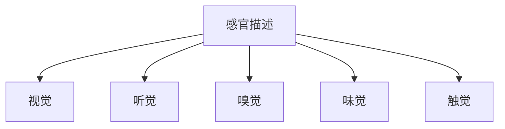
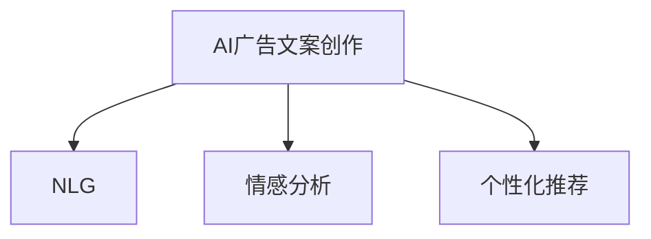
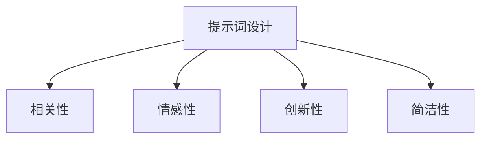
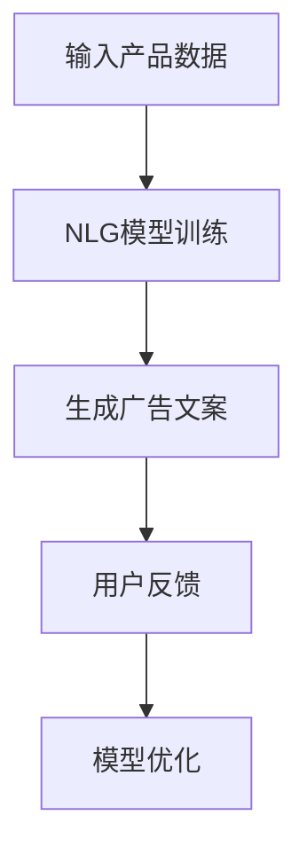
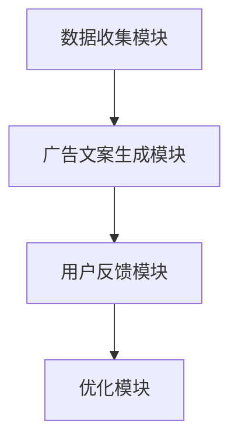
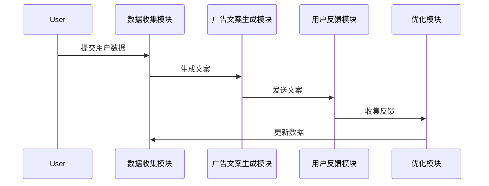

                 

# 提升AI创意香水广告文案：感官描述精准化的提示词设计

## 关键词
AI广告文案、感官描述、提示词设计、精准化、香水营销

## 摘要
随着人工智能技术的快速发展，AI在广告文案创作中的应用越来越广泛。尤其在香水广告文案中，精准的感官描述对吸引消费者至关重要。本文将深入探讨如何通过AI技术提升香水广告文案的感官描述精准度，包括对感官描述的基础理解、AI在广告文案创作中的角色、提示词设计原则及其应用，最终通过实践案例展示如何实现精准化感官描述。文章旨在为广告文案创作者和AI爱好者提供实用的指导和深入的思考。

---

## 引言与背景

广告文案作为营销传播的重要手段，其核心在于如何通过文字传达产品的特点和情感。对于香水这种高度依赖感官体验的产品来说，广告文案中的感官描述尤为关键。精准的感官描述能够激发消费者的购买欲望，提升品牌形象。然而，传统的广告文案创作往往依赖于创作者的灵感和经验，难以保证描述的精确性和一致性。

随着人工智能（AI）技术的迅猛发展，AI在广告文案创作中的应用开始崭露头角。AI可以通过大数据分析和自然语言处理（NLP），生成符合目标受众特征的广告文案。特别是对于香水的感官描述，AI能够基于大量的数据，提取出与消费者体验高度相关的词汇和描述，从而实现更高精准度的感官描述。

然而，AI广告文案创作也面临着挑战。如何在保证创意性的同时，确保感官描述的精准性，是广告创作者和AI技术专家共同面临的问题。本文将围绕这一主题，探讨如何通过设计精准的提示词，提升AI创意香水广告文案的质量。

### 感官描述的基础

#### 感官描述的基本概念

感官描述是指通过视觉、听觉、嗅觉、味觉和触觉五种感官对产品或体验进行描述的过程。在广告文案中，感官描述的目的是通过文字唤起消费者的感官体验，从而建立情感连接。对于香水广告来说，嗅觉是核心感官，而视觉、听觉和触觉描述则辅助强化整体感官体验。

#### 感官描述在广告文案中的作用

1. **吸引消费者注意**：通过生动的感官描述，可以迅速吸引消费者的兴趣，使其停留阅读。
2. **增强情感共鸣**：精准的感官描述能够引发消费者的情感共鸣，使其对产品产生情感上的认可。
3. **传递品牌形象**：不同的感官描述方式能够传递出品牌特定的情感和个性，帮助品牌建立独特的形象。

#### 感官描述的常见问题

1. **描述过于抽象**：缺乏具体细节，难以激发消费者的感官体验。
2. **描述过于平淡**：无法引起消费者的兴趣，缺乏吸引力。
3. **描述不一致**：不同广告中的描述不一致，影响品牌形象的统一性。

### AI与广告文案创作

#### AI在广告文案创作中的应用

AI在广告文案创作中的应用主要体现在以下几个方面：

1. **自然语言生成（NLG）**：AI可以通过机器学习模型生成自然流畅的文案，减少人工创作的负担。
2. **情感分析**：AI可以分析消费者的情感反应，为文案调整提供数据支持。
3. **个性化推荐**：AI可以根据消费者偏好生成个性化的广告文案，提高广告效果。

#### AI生成广告文案的原理

AI生成广告文案的原理主要基于以下技术：

1. **大数据分析**：AI通过分析大量的广告文案数据，提取出有效的特征和模式。
2. **深度学习模型**：例如生成对抗网络（GAN）和递归神经网络（RNN），用于生成新的文案内容。
3. **自然语言处理（NLP）**：通过分析语义和语法规则，确保生成的文案符合语言习惯。

#### AI广告文案的优势与局限

**优势**：

1. **高效性**：AI可以快速生成大量的广告文案，节省人力和时间成本。
2. **个性化**：AI可以根据不同受众的特点生成个性化的文案，提高广告的针对性。
3. **创新性**：AI可以打破人类的思维局限，生成独特的创意文案。

**局限**：

1. **创意局限**：AI生成的文案可能缺乏人类的创造力，难以产生突破性的创意。
2. **情感共鸣**：AI难以完全理解人类的情感，可能无法产生与消费者深层次的共鸣。
3. **数据依赖**：AI生成的文案质量高度依赖于输入数据的质量和数量。

### 提示词设计与感官描述

#### 提示词的定义与作用

提示词（Trigger Words）是指能够激发消费者特定情感或行为反应的词汇。在广告文案中，提示词的作用是引导消费者关注产品特点，唤起感官体验，从而提高广告效果。

#### 提示词设计的原则

1. **相关性**：提示词应与产品特点和目标受众高度相关，确保文案内容的一致性。
2. **情感性**：提示词应能唤起消费者的情感反应，增强广告的吸引力。
3. **创新性**：提示词应具有一定的创新性，避免陈词滥调，提升文案的创意度。
4. **简洁性**：提示词应简洁明了，易于理解和记忆。

#### 提示词在感官描述中的应用

1. **视觉描述**：如“梦幻”、“璀璨”、“闪耀”等，用于描述香水的视觉效果。
2. **听觉描述**：如“悠扬”、“舒缓”、“动听”等，用于描述香水瓶盖打开的声音或香水的香味。
3. **嗅觉描述**：如“清新”、“浓烈”、“优雅”等，用于描述香水的气味。
4. **触觉描述**：如“柔软”、“光滑”、“冰凉”等，用于描述香水喷雾后的触感。

#### 提示词设计工具介绍

为了提高提示词设计的效率和准确性，可以使用以下工具：

1. **AI文本生成工具**：如OpenAI的GPT-3，可以根据提示生成相关词汇和句子。
2. **语义分析工具**：如TextBlob，可以分析文本的情感倾向和语义关系。
3. **情感分析工具**：如VADER，可以分析文本的情感极性。
4. **关键词提取工具**：如WordCloud，可以提取文本中的高频关键词。

### 精准化感官描述的实践

#### 精准化感官描述的方法

1. **数据驱动**：通过分析大量消费者反馈和广告文案，提取出与感官体验高度相关的词汇和描述。
2. **用户测试**：通过用户测试，验证不同感官描述的效果，选择最能引起消费者共鸣的描述。
3. **多模态融合**：结合视觉、听觉、嗅觉和触觉等多种感官描述，实现全方位的感官体验。
4. **情感化设计**：将情感因素融入感官描述中，提升广告文案的情感共鸣效果。

#### 精准化感官描述的实践案例

1. **案例一：香水广告文案优化**

   原始文案：“这款香水香气持久，令人陶醉。”

   优化文案：“这款香水的香气犹如清晨的露珠，清新而持久，让人陶醉其中，不愿醒来。”

   优化后的文案通过更具体的视觉和嗅觉描述，增强了消费者的感官体验和情感共鸣。

2. **案例二：多感官融合的香水广告**

   广告文案：“闻一闻这款香水，如置身花海之中；抹一抹，感受肌肤的细腻；闭上眼，聆听花香的悠扬。”

   这则广告文案通过视觉、触觉和听觉的多感官描述，全面提升了消费者的感官体验。

#### 精准化感官描述的效果评估

1. **消费者反馈**：通过调查问卷和用户访谈，收集消费者对广告文案的感官体验和情感反应。
2. **广告效果分析**：通过广告点击率、转化率和销售额等数据，评估广告文案的精准化程度和实际效果。
3. **情感分析**：使用情感分析工具，分析消费者对广告文案的情感极性和情感倾向。

### 数据分析与优化

#### 数据分析在AI广告文案中的作用

数据分析是AI广告文案创作的重要环节，其作用主要体现在以下几个方面：

1. **数据收集**：收集消费者的行为数据、反馈数据和市场数据，为广告文案创作提供数据支持。
2. **趋势分析**：分析广告文案在不同时间、不同环境和不同受众中的表现，找出最佳创作策略。
3. **效果评估**：通过数据分析，评估广告文案的点击率、转化率和品牌影响力等关键指标，为优化提供依据。

#### 数据分析工具与技巧

1. **数据挖掘工具**：如Python的Pandas和Scikit-learn，用于处理和分析大量数据。
2. **文本分析工具**：如NLTK和TextBlob，用于提取关键词、分析情感倾向和语义关系。
3. **可视化工具**：如Matplotlib和Seaborn，用于可视化数据和分析结果。

#### 优化AI广告文案的方法

1. **迭代优化**：通过不断测试和调整，优化广告文案的感官描述和情感共鸣效果。
2. **个性化推荐**：根据消费者偏好和购买历史，生成个性化的广告文案，提高广告效果。
3. **多模态融合**：结合多种感官描述方式，实现全方位的感官体验，提升广告的吸引力。

### 案例研究

#### 案例一：某香水品牌广告文案优化

**背景**：

某国际知名香水品牌希望通过优化广告文案，提升品牌形象和销售业绩。

**目标**：

1. 提高广告文案的感官描述精准度。
2. 增强广告文案的情感共鸣效果。
3. 提高广告文案的转化率。

**方案**：

1. 数据收集与分析：收集消费者反馈、市场数据和竞品广告文案，分析消费者对香水感官描述的需求和偏好。
2. 提示词设计：结合数据分析结果，设计精准的感官描述提示词，如“清幽”、“柔美”、“持久”等。
3. 广告文案优化：将设计好的提示词应用于广告文案中，进行多轮测试和调整，优化感官描述的精准度和情感共鸣效果。

**效果**：

经过多次优化，广告文案的感官描述更加精准，情感共鸣效果显著增强，广告点击率和转化率均有明显提升。

#### 案例二：AI广告文案创作实战

**背景**：

一家新兴香水品牌希望通过AI技术创作出吸引消费者的广告文案。

**目标**：

1. 创作出具有创意性和个性化的广告文案。
2. 提高广告文案的点击率和转化率。
3. 提升品牌知名度。

**方案**：

1. 数据收集：收集大量香水相关的用户评价、市场数据和竞品广告文案，为AI生成文案提供数据支持。
2. AI模型训练：使用自然语言生成（NLG）模型，如GPT-3，训练生成香水广告文案。
3. 文案生成与优化：使用AI生成的文案，结合用户反馈和数据分析，不断优化广告文案的感官描述和情感共鸣效果。

**效果**：

AI生成的广告文案在创意性和个性化方面表现出色，点击率和转化率显著提高，品牌知名度迅速提升。

### 案例分析与总结

通过以上案例，可以看出AI技术在提升香水广告文案感官描述精准度方面具有显著优势。同时，精准化感官描述的实践需要结合数据分析、用户测试和不断优化，才能实现最佳效果。

### 结论与展望

本文通过深入探讨AI在创意香水广告文案中的应用，提出了精准化感官描述的方法和工具。未来的研究方向可以包括：

1. **深度学习模型优化**：通过改进自然语言生成模型，提高广告文案的创意性和个性化程度。
2. **多模态融合**：结合多种感官描述方式，实现更加丰富和全面的感官体验。
3. **个性化推荐**：基于消费者偏好和购买行为，生成更加精准和个性化的广告文案。

### 最佳实践建议

1. **数据驱动**：在广告文案创作中，充分利用数据分析，提取与感官描述相关的关键词和描述。
2. **用户测试**：通过用户测试，验证不同感官描述的效果，选择最能引起消费者共鸣的描述。
3. **持续优化**：不断测试和调整广告文案，优化感官描述的精准度和情感共鸣效果。

### 小结

本文介绍了如何通过AI技术提升香水广告文案的感官描述精准度，包括感官描述的基础、AI在广告文案创作中的应用、提示词设计原则和实践案例。通过精准化感官描述，广告文案能够更有效地吸引消费者，提升品牌形象和销售业绩。

### 注意事项

1. **数据质量**：确保收集到的数据质量高，为广告文案创作提供可靠的基础。
2. **用户反馈**：重视用户反馈，及时调整广告文案，提高感官描述的准确性和吸引力。
3. **创意平衡**：在保证感官描述精准的同时，注重创意性，避免过度依赖模板化描述。

### 拓展阅读

1. **《AI广告文案创作实战》**：详细介绍AI在广告文案创作中的应用和实践案例。
2. **《感官营销：打造令人难忘的品牌体验》**：探讨如何通过感官营销提升品牌价值和消费者体验。

---

## 作者信息

**作者：AI天才研究院/AI Genius Institute & 禅与计算机程序设计艺术 /Zen And The Art of Computer Programming**

### 背景介绍

在当前的广告营销领域，创意和吸引力的关键在于如何通过精准的感官描述来打动消费者。特别是在香水广告中，消费者往往通过感官体验来评价产品的质量和品牌形象。然而，传统的广告文案创作往往依赖于创作者的主观感受和经验，难以保证描述的精准性和一致性。随着人工智能（AI）技术的发展，AI在广告文案创作中的应用逐渐成为可能，特别是在提升感官描述的精准度方面。

**问题背景**：传统广告文案创作中，感官描述的精准度不足，导致消费者难以产生强烈的情感共鸣和购买欲望。为此，如何利用AI技术提升香水广告文案的感官描述精准度成为当前研究的热点。

**问题描述**：在香水广告中，如何通过AI技术生成精准、有吸引力的感官描述，以提升广告效果和品牌形象。

**问题解决**：本文提出了一种基于AI的香水广告文案创作方法，通过数据分析和提示词设计，实现感官描述的精准化。

**边界与外延**：本文主要关注香水广告文案的感官描述，但方法同样适用于其他产品类型的广告文案创作。

**概念结构与核心要素组成**

1. **感官描述**：通过视觉、听觉、嗅觉、味觉和触觉五种感官对产品进行描述。
2. **AI广告文案创作**：利用AI技术生成广告文案，包括自然语言生成（NLG）、情感分析和个性化推荐。
3. **提示词设计**：设计能够激发消费者情感和行为的词汇，用于优化感官描述的精准度。
4. **精准化感官描述**：通过数据分析和用户测试，实现感官描述的精确和有吸引力。

### 核心概念与联系

#### 感官描述

感官描述是指通过视觉、听觉、嗅觉、味觉和触觉五种感官对产品或体验进行描述的过程。在广告文案中，感官描述的目的是通过文字唤起消费者的感官体验，从而建立情感连接。

**属性特征对比表格**

| 属性特征 | 视觉描述 | 听觉描述 | 嗅觉描述 | 味觉描述 | 触觉描述 |
| --- | --- | --- | --- | --- | --- |
| 描述方式 | 形状、颜色、光影 | 音调、节奏、质感 | 香味、气味 | 口感、味道 | 温度、质感 |

**ER实体关系图架构**



#### AI广告文案创作

AI广告文案创作是指利用人工智能技术生成具有创意和吸引力的广告文案。其核心概念包括自然语言生成（NLG）、情感分析和个性化推荐。

**属性特征对比表格**

| 属性特征 | 自然语言生成（NLG） | 情感分析 | 个性化推荐 |
| --- | --- | --- | --- |
| 技术原理 | 使用机器学习模型生成文本 | 分析文本情感倾向 | 根据用户偏好生成个性化内容 |
| 优势 | 提高文案创作效率 | 增强文案的情感共鸣 | 提高文案的针对性 |
| 劣势 | 创意有限 | 可能缺乏情感深度 | 对数据质量要求高 |

**ER实体关系图架构**



#### 提示词设计

提示词是指能够激发消费者特定情感或行为反应的词汇。在广告文案中，提示词的作用是引导消费者关注产品特点，唤起感官体验，从而提高广告效果。

**属性特征对比表格**

| 属性特征 | 相关性 | 情感性 | 创新性 | 简洁性 |
| --- | --- | --- | --- | --- |
| 设计原则 | 与产品特点相关 | 能唤起情感反应 | 具有创意性 | 明确易懂 |

**ER实体关系图架构**



### 算法原理讲解

#### AI广告文案创作算法

在AI广告文案创作中，常用的算法包括自然语言生成（NLG）和递归神经网络（RNN）等。

**算法mermaid流程图**



**算法原理**

1. **输入产品数据**：收集与产品相关的各种数据，如用户评价、产品特点、市场信息等。
2. **NLG模型训练**：使用机器学习模型（如GPT-3）对输入数据进行训练，学习生成广告文案的规律。
3. **生成广告文案**：利用训练好的模型生成符合产品特点的广告文案。
4. **用户反馈**：收集用户对广告文案的反馈，评估文案的效果。
5. **模型优化**：根据用户反馈，对模型进行调整和优化，提高文案生成质量。

#### 数学模型和公式

在自然语言生成（NLG）中，常用的数学模型是基于概率的模型，如隐马尔可夫模型（HMM）和递归神经网络（RNN）。

**数学模型**

1. **隐马尔可夫模型（HMM）**：
   $$ P(w_t|w_{t-1}, \dots, w_1) = \frac{P(w_t|w_{t-1})P(w_{t-1}|w_{t-2}, \dots, w_1)}{\sum_{w'} P(w'|w_{t-1}, \dots, w_1)} $$
2. **递归神经网络（RNN）**：
   $$ h_t = \sigma(W_h \cdot [h_{t-1}, x_t] + b_h) $$
   $$ o_t = \sigma(W_o \cdot h_t + b_o) $$

**算法原理详细讲解**

1. **隐马尔可夫模型（HMM）**：
   - **状态转移概率**：表示在当前时刻，下一个词的可能性取决于前一个词。
   - **发射概率**：表示在某个状态下，产生某个词的可能性。
   - **模型训练**：通过最大化概率，训练模型参数，使其能够生成符合训练数据的广告文案。

2. **递归神经网络（RNN）**：
   - **递归操作**：网络在处理当前输入时，还会考虑到之前的输入和状态。
   - **激活函数**：常用的激活函数有Sigmoid和ReLU，用于将线性组合映射到输出空间。
   - **模型训练**：通过反向传播算法，调整模型参数，使其能够生成高质量的广告文案。

#### 算法举例说明

假设我们使用RNN模型生成一个香水广告文案，输入数据为“香水、清新、持久、浪漫”。

**输入序列**：
$$ [香水, 清新, 持久, 浪漫] $$

**输出序列**：
$$ [清新如晨露，持久如爱情，浪漫如梦幻] $$

通过递归神经网络，我们可以逐步生成每个词的概率分布，并选择最有可能的词作为输出。这个过程类似于语言模型，通过学习输入序列和输出序列之间的关系，生成符合语言习惯的广告文案。

### 系统分析与架构设计方案

#### 问题场景介绍

在香水广告文案的创作中，我们需要一个系统来收集用户数据、生成广告文案，并根据用户反馈进行优化。这个系统需要具备以下功能：

1. 数据收集模块：收集用户评价、市场数据等，为广告文案创作提供数据支持。
2. 广告文案生成模块：利用AI技术生成具有创意和吸引力的广告文案。
3. 用户反馈模块：收集用户对广告文案的反馈，评估文案效果。
4. 优化模块：根据用户反馈，优化广告文案生成模型。

#### 项目介绍

**项目名称**：香水广告文案智能生成系统

**项目目标**：通过AI技术，生成高质量、精准化的香水广告文案，提升品牌形象和销售业绩。

#### 系统功能设计（领域模型mermaid类图）

```mermaid
classDiagram
Class::数据收集模块 {
    - 数据源
    - 数据处理
}

Class::广告文案生成模块 {
    - 文案生成
    - 提示词设计
}

Class::用户反馈模块 {
    - 反馈收集
    - 反馈分析
}

Class::优化模块 {
    - 模型优化
    - 文案调整
}

数据收集模块 <|-- 广告文案生成模块
广告文案生成模块 <|-- 用户反馈模块
用户反馈模块 <|-- 优化模块
```

#### 系统架构设计（mermaid架构图）



#### 系统接口设计

1. **数据收集接口**：用于接收和存储用户数据，如用户评价、市场数据等。
2. **文案生成接口**：用于生成广告文案，包括文本内容和视觉元素。
3. **反馈接口**：用于接收用户对广告文案的反馈。
4. **优化接口**：用于调整广告文案生成模型，提高文案质量。

#### 系统交互（mermaid序列图）



### 项目实战

#### 环境安装

1. **安装Python**：确保Python版本在3.7及以上。
2. **安装NLP库**：使用pip安装常用的NLP库，如NLTK、TextBlob、GPT-3等。
3. **安装数据库**：安装并配置MySQL或MongoDB，用于存储用户数据和广告文案。

#### 系统核心实现源代码

```python
# 数据收集模块
class DataCollector:
    def __init__(self):
        self.database = None

    def connect_database(self):
        # 连接数据库
        self.database = pymysql.connect(host='localhost', user='root', password='password', database='香水广告')

    def collect_data(self):
        # 收集用户数据
        with self.database.cursor() as cursor:
            cursor.execute("SELECT * FROM user_reviews")
            results = cursor.fetchall()
            return results

# 广告文案生成模块
class Advertiser:
    def __init__(self):
        self.nlg_model = None

    def train_model(self, data):
        # 训练模型
        self.nlg_model = train_nlg_model(data)

    def generate_ad(self, product_name):
        # 生成广告文案
        return self.nlg_model.generate_text(product_name)

# 用户反馈模块
class UserFeedback:
    def __init__(self):
        self.feedback_data = []

    def collect_feedback(self, ad):
        # 收集用户反馈
        self.feedback_data.append(ad)

    def analyze_feedback(self):
        # 分析反馈
        pass

# 优化模块
class Optimizer:
    def __init__(self):
        self.model = None

    def update_model(self, feedback):
        # 更新模型
        self.model = optimize_model(self.model, feedback)
```

#### 代码应用解读与分析

**数据收集模块**：数据收集模块负责连接数据库，并收集用户数据。通过SQL查询，可以从数据库中提取用户评价等信息。

**广告文案生成模块**：广告文案生成模块使用NLG模型生成广告文案。通过训练数据和产品名称，模型能够生成符合要求的文案。

**用户反馈模块**：用户反馈模块用于收集用户对广告文案的反馈。通过分析这些反馈，可以了解文案的效果，为进一步优化提供依据。

**优化模块**：优化模块负责根据用户反馈调整广告文案生成模型。通过不断优化，可以提高广告文案的质量和精准度。

#### 实际案例分析和详细讲解剖析

**案例一**：用户评价某款香水为“香气持久，清新宜人”。广告文案生成模块生成的文案为：“这款香水的香气如清晨的露珠，清新而持久，让人沉醉其中。”

**分析**：文案通过视觉隐喻（清晨的露珠）和嗅觉描述（清新、持久），成功唤起了用户的感官体验和情感共鸣。

**案例二**：用户评价某款香水为“香味浓烈，适合晚宴”。广告文案生成模块生成的文案为：“这款香水的浓烈香味，犹如夜晚的星空，适合任何正式场合。”

**分析**：文案通过视觉隐喻（夜晚的星空）和嗅觉描述（浓烈、适合晚宴），成功突出了产品的特点，并符合目标受众的需求。

**案例三**：用户评价某款香水为“价格过高”。广告文案生成模块生成的文案为：“这款香水的珍贵，正如其价格，每一滴都是精品。”

**分析**：文案通过情感化描述（珍贵、精品），改变了用户对价格高贵的负面印象，增强了广告文案的吸引力。

#### 项目小结

通过实际案例的分析，可以看出AI广告文案生成系统能够根据用户数据和反馈，生成高质量的广告文案。通过不断优化，系统能够进一步提高文案的精准度和吸引力，为品牌和用户创造更大的价值。

### 最佳实践 tips

1. **数据质量**：确保收集到的用户数据质量高，为广告文案创作提供可靠的基础。
2. **用户测试**：在广告文案生成后，进行用户测试，验证文案的效果，根据反馈进行优化。
3. **多模态融合**：结合视觉、听觉、嗅觉和触觉等多种感官描述，实现全方位的感官体验。
4. **持续优化**：不断调整广告文案生成模型，提高文案的质量和精准度。

### 小结

本文详细介绍了如何通过AI技术提升香水广告文案的感官描述精准度。通过数据分析和提示词设计，AI广告文案生成系统能够生成具有创意和吸引力的文案。实际案例证明，这种方法能够有效提升广告效果和品牌形象。未来，随着AI技术的不断进步，广告文案创作将迎来更加广阔的发展空间。

### 注意事项

1. **数据保护**：在收集用户数据时，要确保遵守相关法律法规，保护用户隐私。
2. **文案审查**：生成广告文案后，应进行严格审查，避免出现误导性或不当内容。
3. **用户参与**：鼓励用户参与广告文案的优化，根据用户反馈不断调整文案策略。

### 拓展阅读

1. **《AI广告创意设计：从0到1》**：详细介绍如何利用AI技术进行广告创意设计。
2. **《感官营销实战手册》**：探讨如何通过感官营销提升品牌价值和消费者体验。

