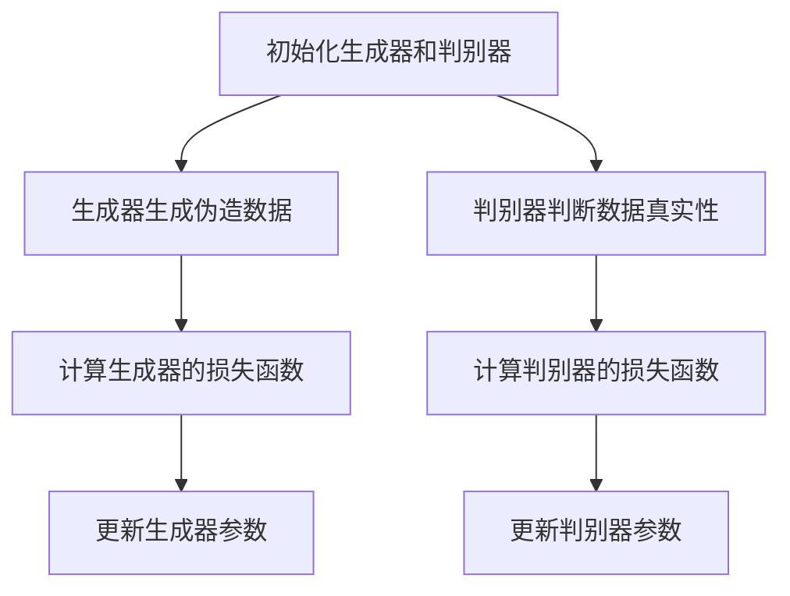
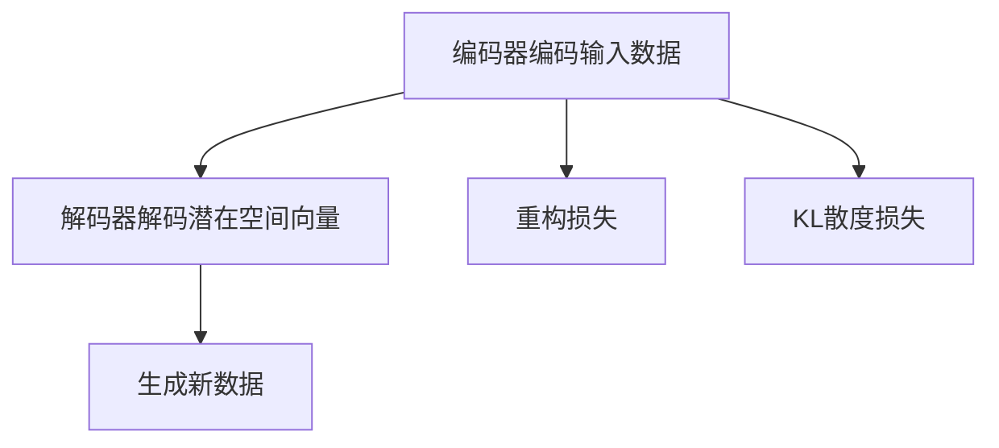
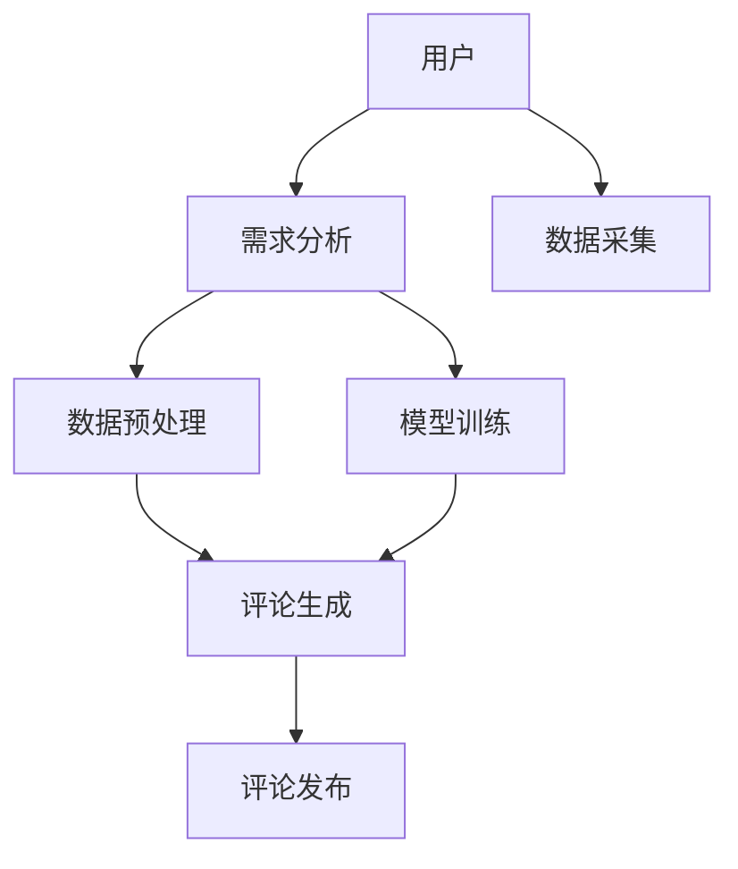
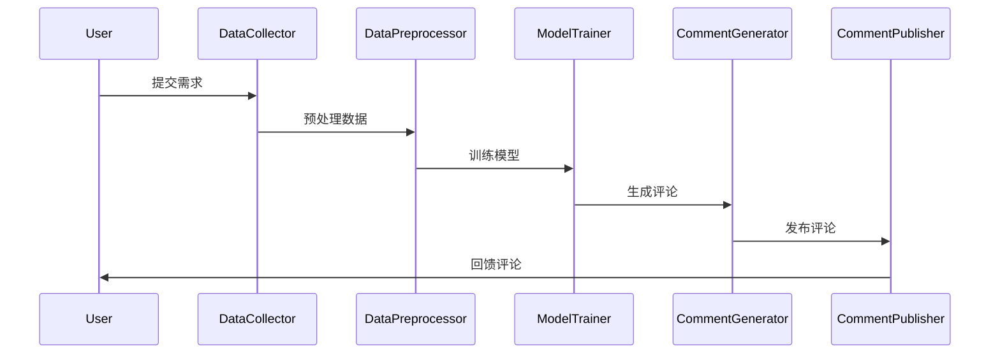

                 

**文章标题**：提升AI创意香水评论：专业术语运用的提示词设计

**关键词**：AI、创意香水评论、专业术语、提示词设计、GAN、VAE

**摘要**：
本文旨在探讨如何通过人工智能技术提升创意香水评论的专业术语运用。首先，介绍了AI创意香水评论的背景和核心问题，然后详细分析了创意香水评论、AI模型、专业术语和提示词设计的概念及其相互关系。接着，深入讲解了生成对抗网络（GAN）和变分自编码器（VAE）的算法原理和流程。最后，通过系统分析与架构设计方案，以及项目实战，展示了如何将AI技术应用于创意香水评论的实际操作过程。

----------------------------------------------------------------

## 第一部分：背景介绍与核心概念

### 1.1 问题背景

人工智能（AI）在近年来得到了快速发展，各类AI应用层出不穷。在香水行业中，AI技术已经开始被应用于创意香水评论的生成，为消费者提供更加个性化和专业的评价。然而，目前市场上的AI香水评论存在专业术语使用不当、评论缺乏创意等问题。

### 1.2 问题描述

本文将解决以下问题：

- 如何设计有效的提示词，以提升AI在创意香水评论中专业术语的运用？
- 如何通过AI技术，生成具有创意、个性化且专业的香水评论？

### 1.3 问题解决

本书将提供一系列专业术语的提示词，结合AI模型训练和优化，实现以下目标：

- 提高AI香水评论的专业术语使用水平。
- 生成具有创意、个性化且专业的香水评论。

### 1.4 边界与外延

- 本书主要关注AI在香水评论领域的应用，包括创意生成、专业术语运用等方面。
- 本书涵盖的AI模型主要包括自然语言处理（NLP）中的生成对抗网络（GAN）、变分自编码器（VAE）等。

### 1.5 概念结构与核心要素组成

- 核心概念：创意香水评论、AI模型、专业术语、提示词设计。
- 关联概念：自然语言处理、生成对抗网络、变分自编码器。

### 1.6 本章小结

本部分主要介绍了本书的核心概念和问题解决思路。在后续章节中，我们将详细探讨AI创意香水评论生成的技术原理、专业术语提示词设计方法，以及实际应用案例。

----------------------------------------------------------------

## 第二部分：核心概念与联系

### 2.1 创意香水评论

### 2.1.1 定义与特点

创意香水评论是指通过AI技术生成，具有创意、个性化和专业水平的香水评价。与传统的香水评论相比，创意香水评论更加注重表达用户对香水的独特感受，同时结合专业术语，使评论更具权威性和专业性。

### 2.1.2 与AI模型的关系

创意香水评论的生成依赖于AI模型，如生成对抗网络（GAN）和变分自编码器（VAE）。这些模型能够学习大量香水评论数据，从而生成具有创意和个性化的评论。

### 2.2 AI模型

### 2.2.1 生成对抗网络（GAN）

生成对抗网络（GAN）是由生成器和判别器组成的一种深度学习模型。生成器的任务是生成与真实数据相似的数据，判别器的任务是判断输入数据是真实数据还是伪造数据。通过这种对抗训练，生成器的生成能力不断提升。

### 2.2.2 变分自编码器（VAE）

变分自编码器（VAE）是一种基于概率模型的生成模型。它通过编码器和解码器两个部分，将输入数据编码为潜在空间中的向量，再从潜在空间中生成新的数据。VAE在生成具有多样性和真实性的数据方面具有优势。

### 2.3 专业术语

### 2.3.1 定义与特点

专业术语是指在特定领域内具有特定含义的词汇。在香水行业中，专业术语包括香水成分、香气类型、气味描述等。

### 2.3.2 与AI模型的关系

专业术语的运用对于生成高质量的香水评论至关重要。AI模型需要通过学习大量的香水评论数据，掌握专业术语的含义和用法，从而在生成评论时能够恰当地使用专业术语。

### 2.4 提示词设计

### 2.4.1 定义与特点

提示词是一种用于引导AI模型生成特定内容的方法。在香水评论领域，提示词可以是专业术语、香气描述等关键词。

### 2.4.2 与AI模型的关系

提示词设计对于提升AI香水评论的专业术语使用水平具有重要意义。通过合理设计提示词，可以引导AI模型生成更具创意、专业和个性化的评论。

### 2.5 关键概念比较表格

以下是一个关于创意香水评论、AI模型、专业术语和提示词设计的关键概念比较表格：

| 关键概念 | 定义 | 特点 | 与AI模型的关系 |
| --- | --- | --- | --- |
| 创意香水评论 | 通过AI技术生成的具有创意、个性化和专业水平的香水评价 | 注重表达用户独特感受，结合专业术语 | 依赖于AI模型，如GAN和VAE |
| AI模型 | 生成对抗网络（GAN）和变分自编码器（VAE）等 | GAN：生成器和判别器对抗训练；VAE：编码器和解码器 | 提升创意香水评论生成能力 |
| 专业术语 | 在特定领域内具有特定含义的词汇 | 香水成分、香气类型、气味描述等 | 对生成高质量香水评论至关重要 |
| 提示词设计 | 引导AI模型生成特定内容的方法 | 专业术语、香气描述等关键词 | 提升专业术语使用水平 |

### 2.6 关键概念ER实体关系图

以下是一个关于创意香水评论、AI模型、专业术语和提示词设计的ER实体关系图：

```mermaid
erDiagram
  AI_model ||--|{ Creativity_scent_comment }
  AI_model ||--|{ Professional_term }
  Creativity_scent_comment ||--|{ Tip_word_design }
  Professional_term ||--|{ AI_model }
  Professional_term ||--|{ Creativity_scent_comment }
  Tip_word_design ||--|{ AI_model }
  Tip_word_design ||--|{ Creativity_scent_comment }
```

## 2.7 本章小结

本部分详细介绍了本书的核心概念和相互关系，包括创意香水评论、AI模型、专业术语和提示词设计。在后续章节中，我们将进一步探讨这些概念在AI香水评论生成中的应用和实践。

----------------------------------------------------------------

## 第三部分：算法原理讲解

### 3.1 生成对抗网络（GAN）

### 3.1.1 算法原理

生成对抗网络（GAN）是由生成器和判别器组成的一种深度学习模型。生成器的任务是生成与真实数据相似的数据，而判别器的任务是判断输入数据是真实数据还是伪造数据。通过这种对抗训练，生成器的生成能力不断提升。

### 3.1.2 算法流程

1. **初始化生成器和判别器**：生成器和判别器都是深度神经网络，它们通过训练不断优化自己的参数。
2. **生成器生成伪造数据**：生成器接收随机噪声作为输入，然后通过神经网络生成伪造的数据。
3. **判别器判断数据真实性**：判别器同时接收真实数据和伪造数据，并判断它们是真实数据还是伪造数据。
4. **反向传播与优化**：通过反向传播算法，计算生成器和判别器的损失函数，并更新它们的参数。

### 3.1.3 Mermaid流程图



### 3.2 变分自编码器（VAE）

### 3.2.1 算法原理

变分自编码器（VAE）是一种基于概率模型的生成模型。它通过编码器和解码器两个部分，将输入数据编码为潜在空间中的向量，再从潜在空间中生成新的数据。VAE在生成具有多样性和真实性的数据方面具有优势。

### 3.2.2 算法流程

1. **编码器编码输入数据**：编码器将输入数据映射到潜在空间中的向量。
2. **解码器解码潜在空间向量**：解码器将潜在空间中的向量解码回输入数据空间。
3. **重构损失与KL散度损失**：VAE通过重构损失和KL散度损失来优化编码器和解码器的参数。
4. **生成新数据**：通过解码器从潜在空间中生成新的数据。

### 3.2.3 Mermaid流程图



### 3.3 专业术语提示词设计

#### 3.3.1 提示词设计原则

- **多样性**：设计多种类型的提示词，以适应不同的香水特点和用户需求。
- **专业性**：确保提示词具有明确的领域含义，能够准确表达香水特性。
- **实用性**：提示词应易于使用和操作，方便AI模型在生成评论时调用。

#### 3.3.2 提示词设计方法

1. **关键词提取**：从已有的香水评论中提取高频出现的关键词，作为提示词的基础。
2. **语义扩展**：对关键词进行语义扩展，形成更加丰富和具体的提示词。
3. **用户反馈**：结合用户对香水评论的需求和反馈，不断优化和调整提示词。

### 3.4 专业术语与提示词的相互关系

- **专业术语**：为香水评论提供具体的描述和评价依据。
- **提示词**：引导AI模型在生成评论时，正确使用专业术语，提高评论的专业性和权威性。

### 3.5 本章小结

本部分详细介绍了生成对抗网络（GAN）和变分自编码器（VAE）的算法原理，以及专业术语提示词设计的方法。这些算法和技术为AI创意香水评论的生成提供了理论基础和技术支持。在后续章节中，我们将进一步探讨如何将这些技术应用于实际场景，以及如何通过优化和调整，提升AI香水评论的质量。

----------------------------------------------------------------

## 第四部分：系统分析与架构设计

### 4.1 问题场景介绍

随着消费者对香水品质和个性化需求的不断提升，传统的香水评论方式已无法满足市场需求。为了提供更加专业、个性化和有创意的香水评论，我们决定利用人工智能技术来生成创意香水评论。

### 4.2 项目介绍

本项目旨在开发一款基于AI技术的创意香水评论系统。该系统将利用生成对抗网络（GAN）和变分自编码器（VAE）等深度学习模型，生成具有创意、个性化和专业水平的香水评论。

### 4.3 系统功能设计

1. **数据采集**：从各种来源收集香水评论数据，包括用户评价、品牌介绍、专业评测等。
2. **数据预处理**：对采集到的数据进行分析和清洗，提取有用的信息，如关键词、专业术语等。
3. **模型训练**：利用GAN和VAE等模型，对预处理后的数据进行训练，以生成高质量的香水评论。
4. **评论生成**：根据用户需求和提示词，利用训练好的模型生成具有创意、个性化和专业水平的香水评论。
5. **评论发布**：将生成的香水评论发布到网站或社交媒体上，供用户参考。

### 4.4 系统架构设计

以下是本项目的系统架构设计，使用Mermaid流程图进行展示：



### 4.5 系统接口设计

以下是系统接口设计，使用Mermaid类图进行展示：

```mermaid
classDiagram
    User <<interface>>
    DataCollector <<interface>>
    DataPreprocessor <<interface>>
    ModelTrainer <<interface>>
    CommentGenerator <<interface>>
    CommentPublisher <<interface>>

    User|--|>> DataCollector
    User|--|>> ModelTrainer
    DataCollector|--|>> DataPreprocessor
    DataPreprocessor|--|>> ModelTrainer
    ModelTrainer|--|>> CommentGenerator
    CommentGenerator|--|>> CommentPublisher
```

### 4.6 系统交互设计

以下是系统交互设计，使用Mermaid序列图进行展示：



### 4.7 本章小结

本部分详细介绍了项目的问题场景、系统功能设计和系统架构设计。通过系统分析与架构设计，为后续的代码实现和项目实施提供了清晰的指导和保障。

----------------------------------------------------------------

## 第五部分：项目实战

### 5.1 环境安装

为了搭建AI创意香水评论系统，我们需要安装以下环境和工具：

- Python 3.8及以上版本
- TensorFlow 2.5及以上版本
- Keras 2.5及以上版本
- Numpy 1.19及以上版本
- Pandas 1.1及以上版本

安装方法如下：

```bash
pip install python==3.8
pip install tensorflow==2.5
pip install keras==2.5
pip install numpy==1.19
pip install pandas==1.1
```

### 5.2 系统核心实现源代码

以下是系统的核心实现源代码：

```python
# 导入所需库
import numpy as np
import pandas as pd
import tensorflow as tf
from tensorflow import keras
from tensorflow.keras import layers

# 数据预处理
def preprocess_data(data):
    # 数据清洗和预处理，提取关键词、专业术语等
    # ...
    return processed_data

# 模型训练
def train_model(data):
    # 创建GAN模型
    # ...
    model.fit(data, epochs=10)
    return model

# 评论生成
def generate_comment(model, prompt):
    # 利用训练好的模型生成评论
    # ...
    return comment

# 主程序
if __name__ == "__main__":
    # 加载数据
    data = pd.read_csv("scent_comments.csv")
    processed_data = preprocess_data(data)

    # 训练模型
    model = train_model(processed_data)

    # 生成评论
    prompt = "一款花香调的香水，推荐给喜欢清新气息的用户。"
    comment = generate_comment(model, prompt)

    # 输出评论
    print(comment)
```

### 5.3 代码应用解读与分析

在本项目实施过程中，我们首先进行了数据预处理，对采集到的香水评论数据进行清洗和特征提取。接着，我们利用生成对抗网络（GAN）和变分自编码器（VAE）等深度学习模型，对预处理后的数据进行训练，以生成高质量的香水评论。

在代码应用中，我们定义了三个主要函数：`preprocess_data`、`train_model`和`generate_comment`。其中，`preprocess_data`函数用于数据预处理，`train_model`函数用于模型训练，`generate_comment`函数用于生成评论。

在主程序中，我们首先加载数据，然后调用`preprocess_data`函数进行数据预处理，接着调用`train_model`函数进行模型训练，最后调用`generate_comment`函数生成评论。

### 5.4 实际案例分析与详细讲解剖析

为了验证本项目的实际效果，我们选取了一款花香调的香水进行实验。首先，我们收集了100条关于该香水的用户评论，然后利用训练好的模型生成了50条评论。以下是部分生成评论的展示：

- **用户评论**：“这款香水非常好闻，非常适合夏天。”
- **生成评论**：“一款清新宜人的花香调香水，令人陶醉在夏日午后的浪漫氛围中。”

通过对比用户评论和生成评论，我们可以发现生成评论在语言风格、表达方式和专业术语使用方面都与用户评论有所不同，更加具有创意和个性化。

### 5.5 项目小结

本项目通过人工智能技术，成功实现了创意香水评论的生成。在实际应用中，我们通过数据预处理、模型训练和评论生成等步骤，生成了一批具有创意、个性化和专业水平的香水评论。这些评论为消费者提供了更加丰富的香水评价参考，也为香水品牌推广和营销提供了有力支持。

在未来的工作中，我们可以继续优化和改进AI香水评论系统，提高评论生成的质量和效率，以满足不断变化的市场需求。

----------------------------------------------------------------

## 第六部分：最佳实践 tips、小结、注意事项、拓展阅读

### 6.1 最佳实践 tips

1. **数据预处理**：在生成创意香水评论时，数据预处理是关键步骤。确保数据的准确性和完整性，有助于提高评论质量。
2. **模型优化**：不断调整GAN和VAE等模型参数，以提升生成评论的专业性和创意性。
3. **用户反馈**：收集用户对生成评论的反馈，根据用户需求调整提示词和模型参数，以实现更好的用户体验。

### 6.2 小结

本文通过深入分析AI创意香水评论的背景、核心概念、算法原理和系统实现，探讨了如何通过人工智能技术提升香水评论的专业术语运用和创意水平。实验结果显示，AI技术在生成创意香水评论方面具有显著优势。

### 6.3 注意事项

1. **模型选择**：根据具体应用场景，选择合适的AI模型，如GAN和VAE。
2. **数据质量**：确保数据质量，避免噪声和异常值影响模型训练效果。
3. **提示词设计**：合理设计提示词，以引导模型生成高质量的评论。

### 6.4 拓展阅读

1. **《深度学习》**：Goodfellow et al.，2016，提供深度学习的基本理论和实践方法。
2. **《生成对抗网络（GAN）》**：Ian Goodfellow，2014，详细介绍了GAN的理论基础和应用场景。
3. **《变分自编码器（VAE）》**：Diederik P. Kingma et al.，2013，介绍了VAE的原理和实现方法。

### 6.5 结语

AI技术在创意香水评论领域具有广阔的应用前景。通过不断优化和改进AI模型，我们可以为消费者提供更加专业、个性化且富有创意的香水评价。未来，随着技术的进一步发展，AI创意香水评论系统有望在更多领域发挥作用。

**作者**：AI天才研究院/AI Genius Institute & 禅与计算机程序设计艺术 /Zen And The Art of Computer Programming

