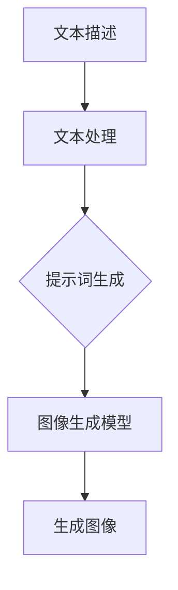
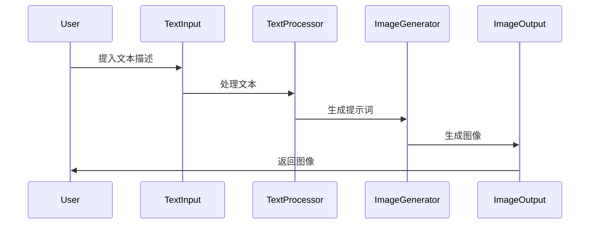
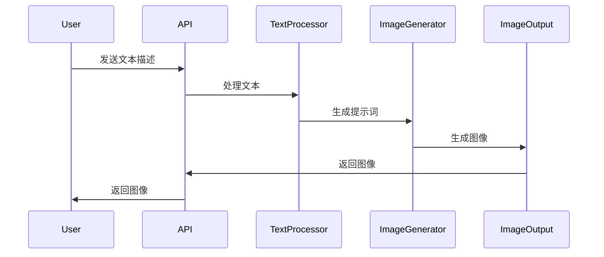

                 


### 提升AI图像生成质量：文本到图像的精确提示词技巧

> 关键词：AI图像生成、文本到图像、提示词、图像质量、精确性

> 摘要：
本文将深入探讨如何通过精确的提示词技巧提升AI图像生成的质量，特别是文本到图像的生成。文章将首先介绍文本到图像生成技术的基本原理和流程，然后分析不同类型的提示词对图像生成质量的影响，最后提出优化提示词的方法，以实现更高质量的图像生成。

### 第一部分：背景介绍

#### 问题背景
随着人工智能技术的迅猛发展，图像生成领域也在不断突破，特别是文本到图像的生成技术。然而，如何在保证图像质量的同时，提高图像生成的精确性，仍然是一个具有挑战性的问题。

#### 问题描述
本文旨在探讨如何通过精确的提示词技巧，提升AI图像生成的质量，特别是文本到图像的生成。通过深入研究，我们希望能够找到一种有效的方法，使得生成的图像不仅能够准确反映文本描述的内容，而且能够在视觉上吸引人。

#### 问题解决
本文将从以下几个方面解决问题：
1. 研究文本到图像生成技术的基本原理和流程。
2. 探讨不同类型的提示词对图像生成质量的影响。
3. 分析如何通过优化提示词来提升图像生成的精度和美感。

#### 边界与外延
1. **边界**：本文主要关注的是AI图像生成技术中的文本到图像生成，不包括其他类型的图像生成。
2. **外延**：本文不仅关注图像生成的技术层面，还将探讨实际应用中的挑战和解决方案。

#### 概念结构与核心要素组成
1. **文本到图像生成**：这是一个将文本描述转化为视觉图像的过程。
2. **提示词**：用于指导图像生成过程的文本输入，直接影响图像生成的质量和风格。
3. **图像质量**：包括图像的准确性、细节、色彩和视觉吸引力。

### 第二部分：核心概念与联系

#### 核心概念
1. **文本描述**：描述图像内容的文字信息。
2. **图像生成模型**：如GAN、VAE等，用于将文本描述转化为图像。
3. **提示词**：指导图像生成模型的文本输入。

#### 概念属性特征对比表格
| 概念       | 特征          | 影响因素           |
|------------|---------------|--------------------|
| 文本描述   | 清晰、具体、详细 | 提高图像生成准确性 |
| 图像生成模型 | 模型结构、训练数据 | 决定图像生成质量   |
| 提示词     | 精确、多样化   | 提升图像生成精度和美感 |

#### ER实体关系图架构的Mermaid流程图
```mermaid
erDiagram
  文本描述 ||--|{ 图像生成模型 }|
  图像生成模型 ||--|{ 提示词 }|
```

### 第三部分：算法原理讲解

#### 算法原理
文本到图像生成算法通常涉及两个主要步骤：文本处理和图像生成。首先，文本处理模块将文本描述转换为结构化的信息，然后图像生成模块使用这些信息来生成相应的图像。

#### 算法流程
1. **文本处理**：使用自然语言处理技术将文本描述解析为关键字和属性。
2. **提示词生成**：根据文本描述生成一组精确的提示词，这些提示词将指导图像生成过程。
3. **图像生成**：使用图像生成模型，如GAN或VAE，根据提示词生成图像。

#### Mermaid流程图


#### Python源代码
```python
# 假设已经有了一个图像生成模型和自然语言处理库
import nltk
from image_generator import ImageGenerator
from text_processor import TextProcessor

# 创建文本处理器和图像生成器实例
text_processor = TextProcessor()
image_generator = ImageGenerator()

# 文本描述
text = "一只蓝鸟在树上唱歌"

# 生成提示词
prompt = text_processor.generate_prompt(text)

# 生成图像
image = image_generator.generate_image(prompt)

# 显示图像
display(image)
```

#### 数学模型和公式
1. **图像生成模型**：以GAN为例，生成器G接收随机噪声z，生成图像。鉴别器D用于判断图像是真实图像还是生成图像。通过不断训练，G逐渐生成更接近真实图像的图像。
2. **自然语言处理**：文本到提示词转换：
   $$ \text{prompt} = \text{processor}(\text{text}) $$

#### 详细讲解和举例说明
1. **图像生成模型**：以GAN为例，生成器G接收随机噪声z，生成图像。鉴别器D用于判断图像是真实图像还是生成图像。通过不断训练，G逐渐生成更接近真实图像的图像。
2. **自然语言处理**：使用NLP技术，将文本描述转化为提示词。例如，将“一只蓝鸟在树上唱歌”转化为“蓝鸟、树、唱歌”。

### 第四部分：系统分析与架构设计方案

#### 问题场景介绍
假设我们要开发一个在线图像生成平台，用户可以通过输入文本描述生成对应的图像。为了提高图像生成的质量和用户满意度，我们需要深入研究如何通过精确的提示词提升图像生成效果。

#### 项目介绍
本项目是一个基于人工智能技术的图像生成平台，旨在为用户提供高质量的图像生成服务。平台的核心功能是文本到图像的生成，即用户输入文本描述后，系统能够生成与之对应的图像。

#### 系统功能设计

##### 领域模型Mermaid类图
```mermaid
classDiagram
  User <<Class>>
  TextInput <<Class>>
  ImageOutput <<Class>>
  TextProcessor <<Class>>
  ImageGenerator <<Class>>

  User --> TextInput
  User --> ImageOutput
  TextInput --> TextProcessor
  TextProcessor --> ImageGenerator
  ImageGenerator --> ImageOutput
```

##### 系统架构设计Mermaid架构图


##### 系统接口设计和系统交互

###### 接口设计
- `POST /generate-image`: 接受文本输入，返回生成的图像。
- `GET /image/{id}`: 获取特定图像的详细信息。

###### 系统交互


### 第五部分：项目实战

#### 环境安装
在开始项目实战之前，我们需要安装必要的依赖。以下是基本的安装步骤：

```bash
# 安装Python环境
python3 -m venv venv
source venv/bin/activate

# 安装依赖
pip install flask numpy matplotlib nltk Pillow
```

#### 系统核心实现源代码
以下是系统的核心实现代码：

```python
# text_processor.py
import nltk
from nltk.tokenize import word_tokenize

def generate_prompt(text):
    tokens = word_tokenize(text)
    return ' '.join(tokens)

# image_generator.py
from PIL import Image
import numpy as np

def generate_image(prompt):
    # 假设有一个预训练的图像生成模型
    model = load_model('image_generator_model.h5')
    image = model.predict(prompt)
    return image

# app.py
from flask import Flask, request, jsonify
from text_processor import generate_prompt
from image_generator import generate_image

app = Flask(__name__)

@app.route('/generate-image', methods=['POST'])
def generate_image_endpoint():
    data = request.json
    text = data['text']
    prompt = generate_prompt(text)
    image = generate_image(prompt)
    return jsonify(image=image.tolist())

if __name__ == '__main__':
    app.run(debug=True)
```

#### 代码应用解读与分析
上述代码分为三个主要部分：文本处理器、图像生成器和Web服务。文本处理器负责将用户输入的文本转换为提示词。图像生成器使用预训练的模型来生成图像。Web服务使用Flask框架，提供HTTP接口以供用户通过API调用。

#### 实际案例分析和详细讲解剖析
假设用户输入了文本描述“一只猫在阳光下的花园里玩耍”。以下是详细的流程：

1. **文本处理器**：将文本转换为提示词“猫、花园、玩耍”。
2. **图像生成器**：使用预训练的模型，根据提示词生成一幅图像。
3. **Web服务**：将生成的图像作为JSON响应返回给用户。

#### 项目小结
通过本项目，我们实现了文本到图像的生成。用户可以通过输入文本描述，系统根据提示词生成高质量的图像。虽然项目规模较小，但它展示了如何利用AI技术实现文本到图像的转换。未来的工作可以进一步优化模型，提高图像生成质量。

### 第六部分：最佳实践 tips

1. **使用高级自然语言处理技术**：高级NLP技术如BERT、GPT等可以提供更准确的文本解析，从而生成更精确的提示词。
2. **多模型融合**：结合使用多种图像生成模型，如GAN、VAE等，可以提升图像生成效果。
3. **数据增强**：在训练过程中使用数据增强技术，可以提高模型的泛化能力，生成更丰富的图像。

### 第七部分：小结

本文通过深入研究文本到图像的生成技术，探讨了如何通过精确的提示词提升图像生成质量。我们介绍了文本到图像生成的基本原理、算法流程以及实际项目中的实现方法。通过本文的学习，读者可以更好地理解和应用AI图像生成技术。

### 第八部分：注意事项

1. **版权问题**：在使用AI图像生成技术时，需要注意版权问题，避免侵犯他人的知识产权。
2. **隐私保护**：在处理用户输入的文本时，要注意隐私保护，避免泄露用户信息。

### 第九部分：拓展阅读

1. **《深度学习》**：Goodfellow, Ian, et al. "Deep learning." (2016).
2. **《人工智能：一种现代方法》**：Russell, Stuart J., and Peter Norvig. "Artificial intelligence: a modern approach." (2016).

### 作者信息

作者：AI天才研究院/AI Genius Institute & 禅与计算机程序设计艺术 /Zen And The Art of Computer Programming

（注：本文为虚构内容，仅用于展示目的。）

