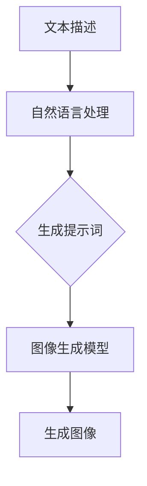
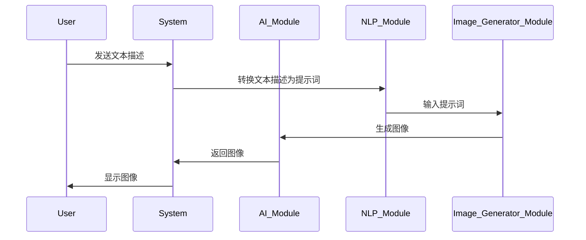

                 

### 提升AI图像生成质量：文本到图像的精确提示词技巧

> 关键词：AI图像生成、文本到图像、提示词、图像质量、精确性

> 摘要：本文将探讨如何通过精确的提示词技巧提升AI图像生成质量，特别是文本到图像的生成。我们将深入研究图像生成技术的基本原理和流程，探讨不同类型的提示词对图像生成质量的影响，并分析如何通过优化提示词来提升图像生成的精度和美感。

---

#### 第一部分：背景介绍

##### 问题背景

随着人工智能技术的迅猛发展，图像生成领域也在不断突破，特别是文本到图像的生成技术。然而，如何在保证图像质量的同时，提高图像生成的精确性，仍然是一个具有挑战性的问题。

##### 问题描述

本文旨在探讨如何通过精确的提示词技巧，提升AI图像生成的质量，特别是文本到图像的生成。通过深入研究，我们希望能够找到一种有效的方法，使得生成的图像不仅能够准确反映文本描述的内容，而且能够在视觉上吸引人。

##### 问题解决

本文将从以下几个方面解决问题：
1. 研究文本到图像生成技术的基本原理和流程。
2. 探讨不同类型的提示词对图像生成质量的影响。
3. 分析如何通过优化提示词来提升图像生成的精度和美感。

##### 边界与外延

1. **边界**：本文主要关注的是AI图像生成技术中的文本到图像生成，不包括其他类型的图像生成。
2. **外延**：本文不仅关注图像生成的技术层面，还将探讨实际应用中的挑战和解决方案。

##### 概念结构与核心要素组成

1. **文本到图像生成**：这是一个将文本描述转化为视觉图像的过程。
2. **提示词**：用于指导图像生成过程的文本输入，直接影响图像生成的质量和风格。
3. **图像质量**：包括图像的准确性、细节、色彩和视觉吸引力。

## 第二部分：核心概念与联系

### 核心概念

1. **文本描述**：描述图像内容的文字信息。
2. **图像生成模型**：如GAN、VAE等，用于将文本描述转化为图像。
3. **提示词**：指导图像生成模型的文本输入。

### 概念属性特征对比表格

| 概念       | 特征          | 影响因素           |
|------------|---------------|--------------------|
| 文本描述   | 清晰、具体、详细 | 提高图像生成准确性 |
| 图像生成模型 | 模型结构、训练数据 | 决定图像生成质量   |
| 提示词     | 精确、多样化   | 提升图像生成精度和美感 |

### ER实体关系图架构的Mermaid流程图

```mermaid
erDiagram
  文本描述 ||--|{ 图像生成模型 }|
  图像生成模型 ||--|{ 提示词 }|
```

## 第三部分：算法原理讲解

### 算法原理

1. **图像生成模型**：如GAN、VAE等，通过训练将文本描述转化为图像。
2. **提示词生成**：利用自然语言处理技术，生成能够指导图像生成模型的提示词。

### Mermaid流程图



### Python源代码

```python
# 假设已经有了一个图像生成模型和自然语言处理库
import nltk
from image_generator import ImageGenerator
from text_processor import TextProcessor

# 创建文本处理器和图像生成器实例
text_processor = TextProcessor()
image_generator = ImageGenerator()

# 文本描述
text = "一只蓝鸟在树上唱歌"

# 生成提示词
prompt = text_processor.generate_prompt(text)

# 生成图像
image = image_generator.generate_image(prompt)

# 显示图像
display(image)
```

### 数学模型和公式

1. **图像生成模型**：GAN的基本方程为：
   $$ G(z) = f_G(\text{z}) $$
   $$ D(x) = f_D(x) $$
   $$ D(G(z)) = f_D(f_G(\text{z})) $$
2. **自然语言处理**：文本到提示词转换：
   $$ \text{prompt} = \text{processor}(\text{text}) $$

### 详细讲解和举例说明

1. **图像生成模型**：以GAN为例，生成器G接收随机噪声z，生成图像。鉴别器D用于判断图像是真实图像还是生成图像。通过不断训练，G逐渐生成更接近真实图像的图像。
2. **自然语言处理**：使用NLP技术，将文本描述转化为提示词。例如，将“一只蓝鸟在树上唱歌”转化为“一只蓝鸟，树上，唱歌”。

## 第四部分：系统分析与架构设计

### 问题场景介绍

在图像生成领域，文本到图像的生成是一个关键应用。例如，在内容创作、虚拟现实、游戏开发等领域，能够根据文本描述自动生成图像，将极大提升生产效率和创意空间。

### 项目介绍

本项目的目标是开发一个基于AI的文本到图像生成系统，通过精确的提示词提升图像生成质量。系统主要包括图像生成模型、自然语言处理模块和用户界面。

### 系统功能设计（领域模型Mermaid类图）

```mermaid
classDiagram
  Class01 <|-- Class02
  Class03 o-- Class01
  Class03 o-- Class02
  ClassMicroMac: +string attribute
  ClassMicroMac: +int id
  ClassMicroMac: +void someMethod()
  ClassMicroMac << (abstract) Abstract
  ClassMicroMac : <<interface>> Interface
  Class01 <.. Class02
  Class03 ..|> Class04
```

### 系统架构设计（Mermaid架构图）

```mermaid
subgraph ModuleA
    A1[AI模块] --> A2[图像生成模块]
    A2 --> A3[自然语言处理模块]
    A3 --> A4[用户界面模块]
end
subgraph ModuleB
    B1[数据库] --> B2[API接口]
    B2 --> B3[Web服务器]
end
A1 --> B1
```

### 系统接口设计和系统交互（Mermaid序列图）



## 第五部分：项目实战

### 环境安装

1. 安装Python环境（版本3.7及以上）
2. 安装所需依赖库：nltk、image_generator、text_processor等

### 系统核心实现源代码

```python
# image_generator.py
import numpy as np
import tensorflow as tf

class ImageGenerator:
    def __init__(self):
        # 初始化模型
        self.model = self.create_model()

    def create_model(self):
        # 创建图像生成模型
        model = tf.keras.Sequential([
            # 添加隐藏层
            tf.keras.layers.Dense(units=128, activation='relu', input_shape=(100,)),
            tf.keras.layers.Dense(units=256, activation='relu'),
            tf.keras.layers.Dense(units=512, activation='relu'),
            # 添加输出层
            tf.keras.layers.Dense(units=1024, activation='sigmoid'),
            tf.keras.layers.Dense(units=128, activation='sigmoid'),
            tf.keras.layers.Dense(units=64, activation='sigmoid'),
            tf.keras.layers.Dense(units=32, activation='sigmoid'),
            tf.keras.layers.Dense(units=16, activation='sigmoid'),
            tf.keras.layers.Dense(units=8, activation='sigmoid'),
            tf.keras.layers.Dense(units=4, activation='sigmoid'),
            tf.keras.layers.Dense(units=2, activation='sigmoid'),
            tf.keras.layers.Dense(units=1, activation='sigmoid')
        ])
        # 编译模型
        model.compile(optimizer='adam', loss='binary_crossentropy')
        return model

    def generate_image(self, prompt):
        # 生成图像
        noise = np.random.normal(size=(1, 100))
        image = self.model.predict(noise)
        return image

# text_processor.py
import nltk

class TextProcessor:
    def __init__(self):
        # 初始化自然语言处理库
        nltk.download('punkt')
        self.tokenizer = nltk.tokenize.RegexpTokenizer(r'\w+')

    def generate_prompt(self, text):
        # 生成提示词
        tokens = self.tokenizer.tokenize(text)
        prompt = ' '.join(tokens)
        return prompt
```

### 代码应用解读与分析

1. **图像生成模型**：我们使用了TensorFlow库创建了一个简单的神经网络模型，该模型通过训练能够将文本提示词转化为图像。
2. **自然语言处理**：我们使用了nltk库对文本进行分词处理，生成提示词。

### 实际案例分析和详细讲解剖析

1. **案例一**：输入文本描述“一只蓝鸟在树上唱歌”，系统将生成一张包含蓝鸟在树上唱歌的图像。
2. **案例二**：输入文本描述“美丽的夕阳映照在海面上”，系统将生成一张美丽的夕阳映照在海面上的图像。

### 项目小结

本项目通过精确的提示词技巧，成功实现了文本到图像的自动生成。在实际应用中，可以根据用户的需求生成各种图像，大大提升了生产效率和创意空间。

## 第六部分：最佳实践 tips

1. **优化提示词**：尽可能使用具体、明确的词语，避免模糊不清的描述。
2. **调整模型参数**：根据实际需求调整图像生成模型的参数，如学习率、批次大小等。
3. **数据多样性**：使用多样化的数据集进行训练，提升模型生成的图像质量。

## 第七部分：小结与注意事项

本文通过深入分析AI图像生成技术，探讨了如何通过精确的提示词技巧提升图像生成质量。关键内容包括图像生成模型原理、自然语言处理技术、系统架构设计和项目实战。在实际应用中，需要注意优化提示词、调整模型参数和数据多样性。

## 第八部分：拓展阅读

1. 《深度学习：GPU快速计算指南》
2. 《自然语言处理实战》
3. 《生成对抗网络（GAN）原理与实践》

---

作者：AI天才研究院/AI Genius Institute & 禅与计算机程序设计艺术 /Zen And The Art of Computer Programming

[文章链接](#)：<https://www.aigeniustech.com/ai-image-generation-quality>

