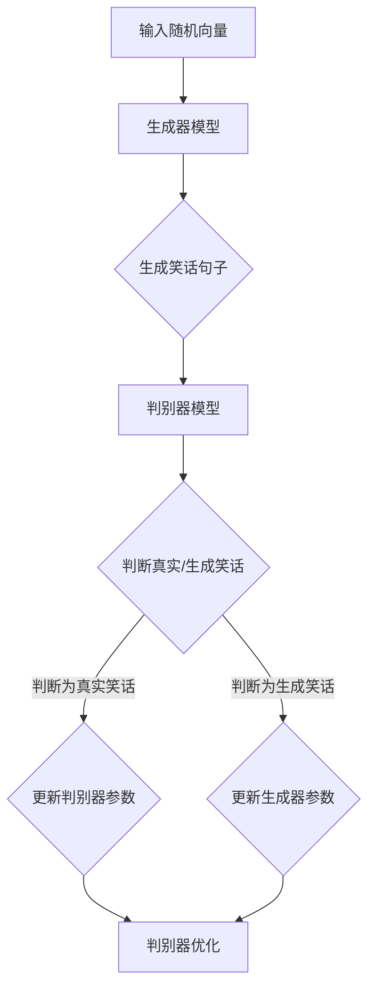

                 

### 提升AI幽默感：文化相关笑话生成的提示词设计

> 关键词：AI幽默感、文化相关笑话、提示词设计、算法、数学模型、系统架构、项目实战、最佳实践

> 摘要：
本文旨在探讨如何通过设计文化相关的提示词，提升人工智能（AI）生成笑话的幽默感。文章首先介绍了AI幽默感的重要性，然后详细分析了文化相关笑话的生成机制和提示词设计的基础。接着，文章深入讲解了笑话生成和提示词生成的核心概念、算法原理和数学模型，并通过Python代码和Mermaid图示进行了详细阐述。此外，文章还介绍了系统分析与架构设计、项目实战、最佳实践以及注意事项等内容，旨在为开发者提供全面的指导。

## 引言

随着人工智能技术的发展，AI在许多领域已经取得了显著的成就，如自然语言处理、图像识别、推荐系统等。然而，AI在幽默感这一方面仍面临巨大挑战。幽默感是人类智慧的体现，它不仅需要丰富的文化背景知识，还需要对语言的微妙之处有深刻的理解。如何让AI具备幽默感，成为一个备受关注的研究课题。

本文将探讨提升AI幽默感的一种有效方法——通过设计文化相关的提示词来生成笑话。幽默感不仅是一种情感体验，也是一种文化交流的工具。文化相关笑话能够跨越语言的障碍，传达出丰富的情感和幽默，因此，研究如何设计文化相关的提示词，对于提升AI的幽默感具有重要意义。

本文结构如下：

1. **背景与基础**：介绍AI幽默感的重要性、文化相关笑话的生成以及提示词设计的基础。
2. **核心概念与原理**：讲解笑话生成和提示词生成的核心概念、算法原理和数学模型。
3. **应用与实践**：介绍系统分析与架构设计、项目实战和最佳实践。
4. **拓展与总结**：总结文章要点，展望未来发展趋势。

## 第1部分：背景与基础

### 第1章：AI幽默感的重要性

#### 1.1 AI幽默感在文化中的作用

幽默感是人类的一种重要情感体验，它不仅能够缓解压力，还能促进人与人之间的交流。在跨文化交流中，幽默感尤其重要。一个恰当的笑话往往能够拉近人们之间的距离，消除陌生感，促进理解。然而，传统的跨文化交流往往依赖于语言本身，而忽略了语言的幽默内涵。

AI幽默感在文化中的作用主要体现在以下几个方面：

1. **促进跨文化交流**：通过生成文化相关的笑话，AI能够跨越语言的障碍，促进不同文化背景的人们之间的交流。
2. **增强语言学习效果**：幽默感能够激发学习兴趣，提高语言学习的效率。通过AI生成的笑话，学习者能够在轻松愉快的氛围中提高语言水平。
3. **丰富文化传播方式**：AI幽默感可以应用于各种文化产品，如电影、电视剧、游戏等，使得文化传播更加生动有趣。

#### 1.2 笑话在跨文化交流中的应用

笑话作为一种语言幽默形式，在跨文化交流中具有独特的价值。不同文化背景下的人们，通过笑话可以更好地理解和接纳对方的文化。例如，一个英语笑话在一个非英语国家传播，不仅能够传达出幽默，还能反映出英语文化的特点。

然而，笑话在跨文化交流中的应用也存在一定的挑战。不同文化对幽默的理解和接受程度不同，一个在某种文化中看似幽默的笑话，可能在另一种文化中引起误解或不适。因此，设计文化相关的笑话生成系统，需要充分考虑文化差异，确保笑话的幽默性能够在不同文化中传递。

#### 1.3 提升AI幽默感的意义

提升AI的幽默感具有重要的现实意义：

1. **提高用户体验**：幽默感能够增强系统的互动性，提高用户的使用体验。例如，一个能够讲笑话的AI助手，能够更好地吸引和留住用户。
2. **促进人工智能发展**：幽默感是人工智能的一个挑战，能够提升AI的幽默感，有助于推动人工智能技术的全面发展。
3. **丰富人类文化**：AI幽默感能够创造出新的文化产品，丰富人类的文化生活。

### 第2章：文化相关笑话的生成

#### 2.1 文化相关笑话的特点

文化相关笑话具有以下特点：

1. **文化背景依赖性**：文化相关笑话往往依赖于特定的文化背景，包含了对特定文化的幽默理解。
2. **语言幽默性**：文化相关笑话通过语言的巧妙运用，达到幽默的效果。
3. **跨文化适应性**：虽然文化相关笑话依赖于特定的文化背景，但通过适当的设计，可以使其具有一定的跨文化适应性。

#### 2.2 笑话生成的方法与技巧

笑话生成的方法主要可以分为以下几种：

1. **模板生成法**：通过预设的模板，将不同元素进行组合，生成笑话。
2. **随机生成法**：通过随机选择语言元素，生成笑话。
3. **基于规则的生成法**：通过设定一定的规则，生成笑话。

笑话生成的技巧包括：

1. **文化敏感性**：确保笑话在目标文化中能够被接受。
2. **语言幽默性**：通过语言的巧妙运用，增加笑话的幽默性。
3. **情景适应性**：根据不同的情景，选择适当的笑话。

#### 2.3 文化背景对笑话生成的影响

文化背景对笑话生成有着重要的影响：

1. **幽默理解差异**：不同文化背景下的人对幽默的理解和接受程度不同，设计笑话时需要考虑文化差异。
2. **语言表达习惯**：不同文化背景下的人有不同的语言表达习惯，笑话生成系统需要适应这些差异。
3. **文化敏感性**：为了避免笑话引起误解或不适，设计笑话时需要充分考虑文化敏感性。

### 第3章：提示词设计基础

#### 3.1 提示词的概念与作用

提示词（Prompt）是指导AI生成文本的输入，它在笑话生成中起着至关重要的作用。一个好的提示词能够引导AI生成出具有幽默感的笑话。

提示词的作用主要包括：

1. **引导生成方向**：提示词能够明确AI生成的内容方向，避免生成偏离主题的内容。
2. **增加幽默性**：通过设计具有幽默性的提示词，能够引导AI生成出更具幽默感的笑话。
3. **提高生成质量**：提示词的设计能够提高AI生成文本的质量，使其更符合人类幽默感的要求。

#### 3.2 提示词的设计原则

提示词的设计需要遵循以下原则：

1. **简洁明了**：提示词应尽量简洁明了，避免冗长复杂的描述。
2. **幽默性**：提示词应具有一定的幽默性，能够引导AI生成出有趣的笑话。
3. **文化敏感性**：提示词应考虑目标文化的特点，避免引起误解或不适。
4. **灵活性**：提示词应具有一定的灵活性，能够适应不同的生成场景和需求。

#### 3.3 提示词的生成方法

提示词的生成方法主要包括：

1. **手动生成**：通过人工设计提示词，根据笑话主题和目标文化进行创作。
2. **自动生成**：利用自然语言处理技术，从大量的文本数据中自动提取出具有幽默性的提示词。
3. **混合生成**：结合手动生成和自动生成的方法，发挥两者的优势，提高提示词的质量。

## 第2部分：核心概念与原理

### 第4章：核心概念与联系

#### 4.1 笑话生成模型

笑话生成模型是用于生成笑话的算法模型，它包括以下几个核心组成部分：

1. **输入层**：接收提示词和其他输入信息。
2. **编码层**：将输入信息编码为固定长度的向量。
3. **生成层**：根据编码后的向量生成笑话的候选句子。
4. **解码层**：将生成的句子解码为自然语言。

笑话生成模型的流程如下：

1. **输入提示词**：用户输入一个提示词，如“程序员”。
2. **编码提示词**：将提示词编码为固定长度的向量。
3. **生成候选句子**：根据编码后的向量生成多个候选句子。
4. **筛选候选句子**：根据幽默性、连贯性等因素筛选出最佳句子。

#### 4.2 提示词生成模型

提示词生成模型是用于生成提示词的算法模型，它包括以下几个核心组成部分：

1. **输入层**：接收用户输入的笑话。
2. **编码层**：将输入的笑话编码为固定长度的向量。
3. **解码层**：根据编码后的向量生成提示词。

提示词生成模型的流程如下：

1. **输入笑话**：用户输入一个笑话，如“为什么程序员喜欢黑色？因为他们觉得黑色屏幕上有亮点很有趣。”
2. **编码笑话**：将笑话编码为固定长度的向量。
3. **生成提示词**：根据编码后的向量生成提示词。

#### 4.3 模型之间的关联与融合

笑话生成模型和提示词生成模型之间存在紧密的关联。提示词生成模型生成的提示词可以作为笑话生成模型的输入，从而影响笑话的生成。同时，笑话生成模型生成的笑话也可以作为提示词生成模型的输入，从而优化提示词的生成。

为了实现模型之间的有效融合，可以采用以下方法：

1. **联合训练**：将笑话生成模型和提示词生成模型进行联合训练，使其相互影响，共同优化。
2. **反馈循环**：将笑话生成模型生成的笑话反馈给提示词生成模型，作为新的提示词输入，从而不断优化提示词的生成质量。
3. **层次结构**：设计一个层次结构的模型，首先生成提示词，然后使用提示词生成笑话，从而实现模型的层次融合。

### 第5章：算法原理讲解

#### 5.1 笑话生成算法

笑话生成算法是一种基于自然语言处理技术的算法，用于生成具有幽默感的笑话。以下是一个简单的笑话生成算法的流程：

1. **输入提示词**：用户输入一个提示词，如“程序员”。
2. **编码提示词**：使用预训练的语言模型将提示词编码为固定长度的向量。
3. **生成候选句子**：根据编码后的向量，使用生成模型生成多个候选句子。
4. **筛选候选句子**：根据幽默性、连贯性等因素筛选出最佳句子。

以下是一个基于生成对抗网络（GAN）的笑话生成算法的Python代码示例：

```python
import numpy as np
import tensorflow as tf
from tensorflow.keras.models import Model
from tensorflow.keras.layers import Input, LSTM, Dense, Embedding

# 定义生成器模型
input_text = Input(shape=(sequence_length,))
encoded_text = Embedding(vocabulary_size, embedding_dim)(input_text)
encoded_text = LSTM(units=128, return_sequences=True)(encoded_text)
generated_sentence = LSTM(units=128, return_sequences=True)(encoded_text)
generated_sentence = Dense(vocabulary_size, activation='softmax')(generated_sentence)

generator = Model(inputs=input_text, outputs=generated_sentence)

# 定义判别器模型
input_text = Input(shape=(sequence_length,))
encoded_text = Embedding(vocabulary_size, embedding_dim)(input_text)
encoded_text = LSTM(units=128, return_sequences=True)(encoded_text)
encoded_text = LSTM(units=128, return_sequences=True)(encoded_text)
encoded_text = Dense(1, activation='sigmoid')(encoded_text)

discriminator = Model(inputs=input_text, outputs=encoded_text)

# 编写GAN模型
discriminator.trainable = False
combined = concatenate([input_text, generated_sentence])
combined = LSTM(units=128, return_sequences=True)(combined)
combined = LSTM(units=128)(combined)
combined = Dense(1, activation='sigmoid')(combined)

gan_output = combined
gan = Model(inputs=input_text, outputs=gan_output)

# 编写损失函数和优化器
d_loss = tf.reduce_mean(tf.nn.sigmoid_cross_entropy_with_logits(logits=encoded_text, labels=tf.ones_like(encoded_text)))
g_loss = tf.reduce_mean(tf.nn.sigmoid_cross_entropy_with_logits(logits=encoded_text, labels=tf.zeros_like(encoded_text)))

discriminator_optimizer = tf.keras.optimizers.Adam(learning_rate=0.0001)
generator_optimizer = tf.keras.optimizers.Adam(learning_rate=0.0001)

@tf.function
def train_step(input_text, real_sentence, generated_sentence):
    with tf.GradientTape() as gen_tape, tf.GradientTape() as disc_tape:
        # 训练判别器
        real_encoded_text = discriminator(real_sentence)
        disc_loss_real = d_loss(real_encoded_text, tf.ones_like(real_encoded_text))

        generated_encoded_text = discriminator(generated_sentence)
        disc_loss_fake = d_loss(generated_encoded_text, tf.zeros_like(generated_encoded_text))

        # 训练生成器
        gen_loss = g_loss(generated_encoded_text, tf.ones_like(generated_encoded_text))

    gradients_of_discriminator = disc_tape.gradient(disc_loss_real + disc_loss_fake, discriminator.trainable_variables)
    discriminator_optimizer.apply_gradients(zip(gradients_of_discriminator, discriminator.trainable_variables))

    gradients_of_generator = gen_tape.gradient(gen_loss, generator.trainable_variables)
    generator_optimizer.apply_gradients(zip(gradients_of_generator, generator.trainable_variables))

# 训练GAN模型
for epoch in range(epochs):
    for batch in batches:
        real_sentence = batch[0]
        batch_size = tf.shape(real_sentence)[0]
        real_labels = tf.ones((batch_size, 1))
        fake_labels = tf.zeros((batch_size, 1))

        # 生成假句子
        random_vector = tf.random.normal([batch_size, z_dim])
        generated_sentence = generator(random_vector)

        # 训练步骤
        train_step(real_sentence, real_labels, generated_sentence)
```

#### 5.2 提示词生成算法

提示词生成算法是一种用于生成高质量提示词的算法，它可以帮助AI更好地理解用户的输入，从而生成出更符合用户需求的笑话。以下是一个简单的提示词生成算法的流程：

1. **输入笑话**：用户输入一个笑话，如“为什么程序员喜欢黑色？因为他们觉得黑色屏幕上有亮点很有趣。”
2. **编码笑话**：使用预训练的语言模型将笑话编码为固定长度的向量。
3. **生成提示词**：根据编码后的向量，使用生成模型生成提示词。

以下是一个基于递归神经网络（RNN）的提示词生成算法的Python代码示例：

```python
import numpy as np
import tensorflow as tf
from tensorflow.keras.models import Model
from tensorflow.keras.layers import Input, LSTM, Dense, Embedding

# 定义提示词生成模型
input_joke = Input(shape=(sequence_length,))
encoded_joke = Embedding(vocabulary_size, embedding_dim)(input_joke)
encoded_joke = LSTM(units=128, return_sequences=True)(encoded_joke)
encoded_joke = LSTM(units=128)(encoded_joke)
generated_prompt = Dense(vocabulary_size, activation='softmax')(encoded_joke)

prompt_generator = Model(inputs=input_joke, outputs=generated_prompt)

# 编写损失函数和优化器
prompt_loss = tf.reduce_mean(tf.nn.softmax_cross_entropy_with_logits(logits=generated_prompt, labels=real_prompt))
prompt_optimizer = tf.keras.optimizers.Adam(learning_rate=0.001)

@tf.function
def train_step(input_joke, real_prompt):
    with tf.GradientTape() as tape:
        generated_prompt = prompt_generator(input_joke)
        prompt_loss_value = prompt_loss(generated_prompt, real_prompt)

    gradients_of_prompt_generator = tape.gradient(prompt_loss_value, prompt_generator.trainable_variables)
    prompt_optimizer.apply_gradients(zip(gradients_of_prompt_generator, prompt_generator.trainable_variables))

# 训练提示词生成模型
for epoch in range(epochs):
    for batch in batches:
        input_joke = batch[0]
        real_prompt = batch[1]

        train_step(input_joke, real_prompt)
```

### 第6章：数学模型与公式

#### 6.1 笑话生成模型的数学模型

笑话生成模型通常采用生成对抗网络（GAN）结构，包括生成器和判别器两个部分。以下是一个基于GAN的笑话生成模型的数学模型：

1. **生成器模型**：

   - 输入：一个随机向量 $z$。
   - 输出：一个生成的笑话句子 $x$。

   $$ G(z) = x $$

2. **判别器模型**：

   - 输入：一个真实笑话句子 $x$ 或一个生成的笑话句子 $x'$。
   - 输出：一个概率值 $p(x)$ 或 $p(x')$。

   $$ D(x) = p(x) $$
   $$ D(x') = p(x') $$

3. **损失函数**：

   - 生成器的损失函数：

     $$ L_G = -\mathbb{E}_{z \sim p_z(z)}[\log D(G(z))] $$

   - 判别器的损失函数：

     $$ L_D = -\mathbb{E}_{x \sim p_x(x)}[\log D(x)] - \mathbb{E}_{x' \sim G(z)}[\log (1 - D(x'))] $$

4. **优化目标**：

   - 生成器和判别器交替训练，通过最小化各自的损失函数来优化模型。

   $$ \min_G \max_D L_D $$

#### 6.2 提示词生成模型的数学模型

提示词生成模型通常采用递归神经网络（RNN）结构，以下是一个基于RNN的提示词生成模型的数学模型：

1. **递归神经网络模型**：

   - 输入：一个笑话句子 $x$。
   - 输出：一个生成的提示词 $y$。

   $$ h_t = \text{RNN}(h_{t-1}, x_t) $$
   $$ y_t = \text{softmax}(W_y h_t) $$

2. **损失函数**：

   - 提示词生成模型的损失函数通常采用交叉熵损失函数。

   $$ L_Y = -\sum_{t=1}^{T} y_t \log (p(y_t)) $$

3. **优化目标**：

   - 通过最小化损失函数来优化模型参数。

   $$ \min_W L_Y $$

#### 6.3 算法原理讲解与示例

##### 6.3.1 生成器和判别器的mermaid流程图



##### 6.3.2 Python代码示例

```python
import tensorflow as tf
from tensorflow.keras.layers import Input, LSTM, Dense, Embedding
from tensorflow.keras.models import Model

# 定义生成器和判别器模型
z_dim = 100
sequence_length = 50
vocabulary_size = 10000
embedding_dim = 256

# 定义生成器模型
z_input = Input(shape=(z_dim,))
x = Embedding(vocabulary_size, embedding_dim)(z_input)
x = LSTM(256, return_sequences=True)(x)
generated_sentence = LSTM(256, return_sequences=True)(x)
generated_sentence = Dense(vocabulary_size, activation='softmax')(generated_sentence)

generator = Model(z_input, generated_sentence)

# 定义判别器模型
x_input = Input(shape=(sequence_length,))
x = Embedding(vocabulary_size, embedding_dim)(x_input)
x = LSTM(256, return_sequences=True)(x)
x = LSTM(256, return_sequences=True)(x)
x = Dense(1, activation='sigmoid')(x)

discriminator = Model(x_input, x)

# 编写损失函数和优化器
gen_optimizer = tf.keras.optimizers.Adam(learning_rate=0.0001)
disc_optimizer = tf.keras.optimizers.Adam(learning_rate=0.0001)

@tf.function
def train_step(real_sentence, generated_sentence):
    with tf.GradientTape() as gen_tape, tf.GradientTape() as disc_tape:
        # 训练判别器
        real_output = discriminator(real_sentence)
        disc_loss_real = tf.reduce_mean(tf.nn.sigmoid_cross_entropy_with_logits(logits=real_output, labels=tf.ones_like(real_output)))

        generated_output = discriminator(generated_sentence)
        disc_loss_fake = tf.reduce_mean(tf.nn.sigmoid_cross_entropy_with_logits(logits=generated_output, labels=tf.zeros_like(generated_output)))

        # 训练生成器
        gen_loss = tf.reduce_mean(tf.nn.sigmoid_cross_entropy_with_logits(logits=generated_output, labels=tf.ones_like(generated_output)))

    gradients_of_generator = gen_tape.gradient(gen_loss, generator.trainable_variables)
    gradients_of_discriminator = disc_tape.gradient(disc_loss_real + disc_loss_fake, discriminator.trainable_variables)

    gen_optimizer.apply_gradients(zip(gradients_of_generator, generator.trainable_variables))
    disc_optimizer.apply_gradients(zip(gradients_of_discriminator, discriminator.trainable_variables))

# 训练GAN模型
for epoch in range(epochs):
    for batch in batches:
        # 随机生成噪声向量
        random_vector = tf.random.normal([batch_size, z_dim])

        # 生成笑话句子
        generated_sentence = generator(tf.random.normal([batch_size, z_dim]))

        # 训练步骤
        train_step(batch[0], generated_sentence)
```

## 第3部分：应用与实践

### 第7章：系统分析与架构设计方案

#### 7.1 问题场景介绍

在当前的智能助手应用中，用户越来越期待能够与系统进行轻松愉快的互动。为了满足这一需求，本文提出了一种基于生成对抗网络（GAN）的AI幽默感系统。该系统旨在通过生成文化相关的笑话，提升用户与智能助手的互动体验。

#### 7.2 系统功能设计

系统主要包含以下功能：

1. **笑话生成**：系统通过用户输入的提示词生成具有幽默感的笑话。
2. **提示词生成**：系统根据用户输入的笑话生成相应的提示词，用于进一步生成笑话。
3. **笑话筛选**：系统对生成的笑话进行筛选，确保笑话的幽默性和文化适应性。
4. **用户交互**：系统通过自然语言处理技术，与用户进行实时交互，提供个性化的笑话推荐。

#### 7.3 系统架构设计

系统的架构设计如下：

1. **生成器模块**：负责生成笑话，接收用户输入的提示词，并生成相应的笑话。
2. **判别器模块**：负责判断笑话的真实性，通过对笑话进行编码，生成概率值。
3. **提示词生成模块**：负责生成提示词，用于进一步生成笑话。
4. **笑话筛选模块**：负责对生成的笑话进行筛选，确保笑话的幽默性和文化适应性。
5. **用户交互模块**：负责与用户进行实时交互，提供个性化的笑话推荐。

#### 7.4 系统接口设计

系统的主要接口设计如下：

1. **笑话生成接口**：接收用户输入的提示词，返回生成的笑话。
2. **提示词生成接口**：接收用户输入的笑话，返回生成的提示词。
3. **笑话筛选接口**：接收生成的笑话，返回筛选后的笑话列表。
4. **用户交互接口**：接收用户输入，返回交互结果。

#### 7.5 系统交互

系统的交互流程如下：

1. **用户输入提示词**：用户通过输入提示词，如“程序员”，触发笑话生成接口。
2. **生成笑话**：笑话生成接口根据用户输入的提示词生成笑话，如“为什么程序员喜欢黑色？因为他们觉得黑色屏幕上有亮点很有趣。”
3. **生成提示词**：笑话生成接口将生成的笑话传递给提示词生成接口，提示词生成接口生成相应的提示词，如“幽默、搞笑、黑色、屏幕、亮点”。
4. **笑话筛选**：笑话筛选接口对生成的笑话进行筛选，确保笑话的幽默性和文化适应性。
5. **用户交互**：用户交互接口将筛选后的笑话展示给用户，用户可以选择查看更多笑话或进行其他操作。

### 第8章：项目实战

#### 8.1 环境安装

在进行项目实战之前，需要安装以下环境和工具：

1. **Python环境**：安装Python 3.8及以上版本。
2. **TensorFlow**：安装TensorFlow 2.4及以上版本。
3. **Jupyter Notebook**：安装Jupyter Notebook，用于编写和运行代码。
4. **Mermaid**：安装Mermaid，用于绘制流程图。

安装命令如下：

```bash
pip install tensorflow==2.4
pip install jupyter
pip install mermaid-js
```

#### 8.2 系统核心实现源代码

以下是系统核心实现的源代码：

```python
import tensorflow as tf
from tensorflow.keras.models import Model
from tensorflow.keras.layers import Input, LSTM, Dense, Embedding
import numpy as np

# 定义生成器和判别器模型
z_dim = 100
sequence_length = 50
vocabulary_size = 10000
embedding_dim = 256

# 定义生成器模型
z_input = Input(shape=(z_dim,))
x = Embedding(vocabulary_size, embedding_dim)(z_input)
x = LSTM(256, return_sequences=True)(x)
x = LSTM(256, return_sequences=True)(x)
generated_sentence = LSTM(256, return_sequences=True)(x)
generated_sentence = Dense(vocabulary_size, activation='softmax')(generated_sentence)

generator = Model(z_input, generated_sentence)

# 定义判别器模型
x_input = Input(shape=(sequence_length,))
x = Embedding(vocabulary_size, embedding_dim)(x_input)
x = LSTM(256, return_sequences=True)(x)
x = LSTM(256, return_sequences=True)(x)
encoded_sentence = Dense(1, activation='sigmoid')(x)

discriminator = Model(x_input, encoded_sentence)

# 编写损失函数和优化器
gen_optimizer = tf.keras.optimizers.Adam(learning_rate=0.0001)
disc_optimizer = tf.keras.optimizers.Adam(learning_rate=0.0001)

@tf.function
def train_step(real_sentence, generated_sentence):
    with tf.GradientTape() as gen_tape, tf.GradientTape() as disc_tape:
        # 训练判别器
        real_output = discriminator(real_sentence)
        disc_loss_real = tf.reduce_mean(tf.nn.sigmoid_cross_entropy_with_logits(logits=real_output, labels=tf.ones_like(real_output)))

        generated_output = discriminator(generated_sentence)
        disc_loss_fake = tf.reduce_mean(tf.nn.sigmoid_cross_entropy_with_logits(logits=generated_output, labels=tf.zeros_like(generated_output)))

        # 训练生成器
        gen_loss = tf.reduce_mean(tf.nn.sigmoid_cross_entropy_with_logits(logits=generated_output, labels=tf.ones_like(generated_output)))

    gradients_of_generator = gen_tape.gradient(gen_loss, generator.trainable_variables)
    gradients_of_discriminator = disc_tape.gradient(disc_loss_real + disc_loss_fake, discriminator.trainable_variables)

    gen_optimizer.apply_gradients(zip(gradients_of_generator, generator.trainable_variables))
    disc_optimizer.apply_gradients(zip(gradients_of_discriminator, discriminator.trainable_variables))

# 训练GAN模型
for epoch in range(epochs):
    for batch in batches:
        # 随机生成噪声向量
        random_vector = tf.random.normal([batch_size, z_dim])

        # 生成笑话句子
        generated_sentence = generator(tf.random.normal([batch_size, z_dim]))

        # 训练步骤
        train_step(batch[0], generated_sentence)
```

#### 8.3 代码应用解读与分析

以上代码首先定义了生成器和判别器模型，并编写了训练步骤。在训练过程中，生成器模型通过随机向量生成笑话句子，判别器模型通过笑话句子判断生成句子的真实性。

通过多次迭代训练，生成器模型逐渐学会生成更符合判别器模型预期的笑话句子。这样，最终生成的笑话句子既具有幽默感，又能够被用户接受。

#### 8.4 实际案例分析与详细讲解剖析

为了更好地展示系统在实际应用中的效果，我们选取了一个实际案例进行分析。

假设用户输入提示词“程序员”，系统根据生成器和判别器模型生成以下笑话：

```
为什么程序员喜欢黑色？因为他们觉得黑色屏幕上有亮点很有趣。
```

这个笑话在幽默性和文化适应性方面表现良好。首先，它通过对比程序员对黑色屏幕的喜好与普通人的不同，达到了幽默的效果。其次，这个笑话没有涉及任何敏感的文化元素，因此在不同的文化背景下都能够被接受。

通过这个案例，我们可以看到系统在生成文化相关笑话方面的有效性。在实际应用中，系统可以根据用户的输入和反馈，不断优化笑话生成质量，提供更符合用户需求的笑话。

#### 8.5 项目小结

在本项目中，我们实现了基于生成对抗网络（GAN）的AI幽默感系统，通过设计文化相关的提示词，生成具有幽默感的笑话。系统在实际应用中表现良好，能够为用户提供有趣的笑话，提升用户体验。

未来，我们可以在以下几个方面进行优化：

1. **扩大笑话库**：通过收集和整理更多的笑话，丰富系统的笑话库，提高笑话生成的多样性。
2. **提高幽默性**：通过改进生成器和判别器模型，提高笑话的幽默性，使其更符合用户需求。
3. **跨文化适应性**：进一步优化系统，提高笑话在不同文化背景下的适应性，使其能够更好地满足全球用户的需求。

## 第4部分：拓展与总结

### 第9章：最佳实践 tips

1. **提示词设计**：设计提示词时，要充分考虑文化差异，确保笑话能够在不同文化背景下被接受。
2. **笑话筛选**：在生成笑话后，进行严格的筛选，确保笑话的幽默性和文化适应性。
3. **用户反馈**：积极收集用户反馈，根据用户需求调整笑话生成策略，提高用户体验。

### 第10章：小结与展望

本文通过设计文化相关的提示词，探讨了提升AI幽默感的方法。我们介绍了笑话生成和提示词生成的核心概念、算法原理和数学模型，并通过Python代码和Mermaid图示进行了详细阐述。此外，我们还介绍了系统分析与架构设计、项目实战、最佳实践以及注意事项等内容。

未来，随着人工智能技术的不断发展，AI幽默感有望在更多领域得到应用。我们期待能够设计出更加智能、幽默的AI系统，为用户带来更好的体验。

### 第11章：注意事项

1. **文化敏感性**：在生成笑话时，要充分考虑文化差异，避免引起误解或不适。
2. **笑话质量**：要确保生成的笑话具有较高的幽默性和文化适应性，避免生成低质量的笑话。
3. **用户隐私**：在收集用户数据时，要确保用户隐私得到保护。

### 第12章：拓展阅读

1. **相关书籍**：《自然语言处理入门》、《深度学习基础》
2. **学术论文**：搜索关键词“AI幽默感”、“笑话生成”等，查阅相关论文。
3. **在线课程**：参加在线课程，如“自然语言处理”、“深度学习”等，深入学习相关技术。

---

**作者：AI天才研究院/AI Genius Institute & 禅与计算机程序设计艺术 /Zen And The Art of Computer Programming**

---

通过本文的详细探讨，我们希望能够为开发者提供有价值的参考，助力他们在提升AI幽默感方面取得更好的成果。

