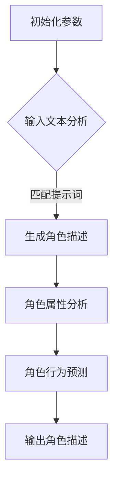
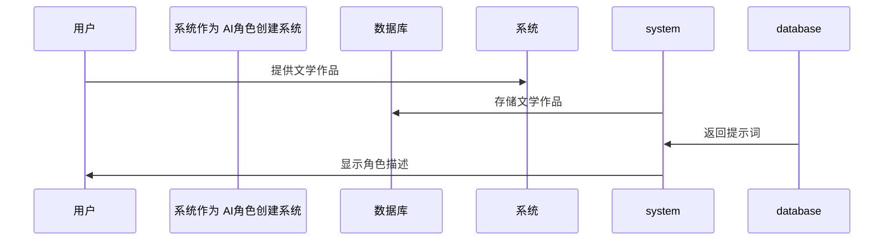
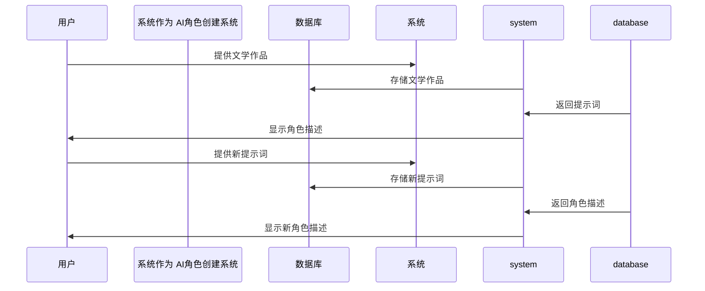
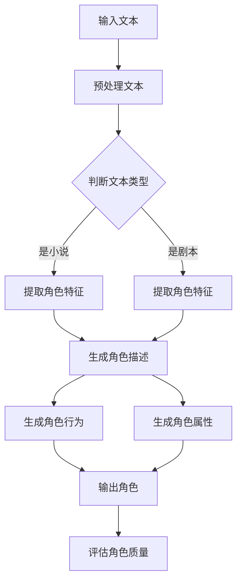
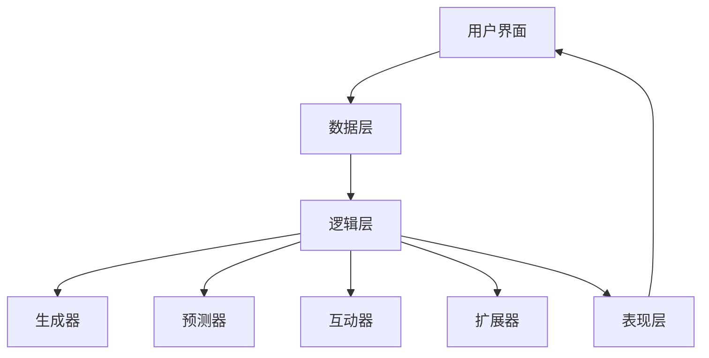
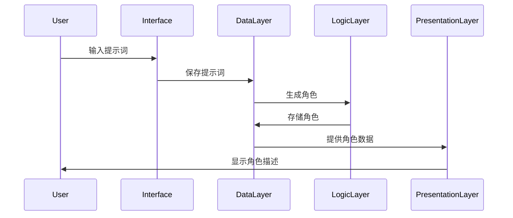

                 

# 《提升AI角色创建能力：小说和剧本写作中的提示词工程》

关键词：AI角色创建、提示词工程、小说和剧本写作、算法原理、系统架构设计

摘要：随着人工智能在文学创作领域的应用日益广泛，如何提升AI角色创建能力成为一个重要课题。本文将探讨小说和剧本写作中的提示词工程，从核心概念、算法原理、系统分析与架构设计等方面，详细解析如何通过提示词工程提升AI角色的创造力和表现力。

## 第1章：问题背景与引入

### 1.1 问题背景

#### 1.1.1 AI在文学创作中的崛起

近年来，人工智能（AI）在文学创作领域展现出了巨大的潜力。从简单的自动写作到复杂的AI写作助手，AI已经在一定程度上改变了文学创作的方式。然而，当前AI在角色创建方面仍存在一定的局限性，无法像人类作家那样创造出鲜活、深刻的角色。

#### 1.1.2 人工智障（AGI）的挑战

人工智障（AGI）是未来人工智能发展的一个重要方向。虽然当前AI在特定领域表现出色，但离实现真正的智能还有很长的路要走。AGI的挑战之一是如何让AI具备人类一样的情感和创造力，从而在文学创作中发挥更大的作用。

#### 1.1.3 提示词工程的意义

提示词工程是AI角色创建的关键技术之一。通过设计合适的提示词，可以引导AI生成符合人类创作思维的角色，提高角色的创造力和表现力。本文将围绕提示词工程，探讨如何提升AI角色创建能力。

### 1.2 问题描述

#### 1.2.1 当前文学创作中的痛点

当前文学创作中，角色创建是一个重要但充满挑战的任务。作家需要深入了解角色的背景、性格、行为等，从而让角色生动鲜活。然而，这需要大量的时间和精力，且难以保证每个角色都具备独特性。

#### 1.2.2 提示词工程如何解决这些问题

提示词工程通过提供具体的提示词，引导AI生成角色描述、属性和行为，从而解决当前文学创作中的痛点。通过优化提示词的设计，可以提升AI角色的创造力和表现力，使其更符合人类作家的创作需求。

### 1.3 问题解决

#### 1.3.1 提示词工程的原理

提示词工程的核心在于设计合适的提示词，引导AI生成角色描述、属性和行为。通过分析大量文学作品中的角色特征，提取出有效的提示词，再利用这些提示词进行角色创建。

#### 1.3.2 提示词工程的方法与策略

提示词工程的方法包括数据收集、提示词提取、角色生成等。其中，数据收集是基础，提示词提取是关键，角色生成是目标。通过不断优化这些环节，可以提升AI角色创建的能力。

### 1.4 边界与外延

#### 1.4.1 提示词工程的适用范围

提示词工程适用于小说、剧本等文学作品的创作。通过设计合适的提示词，可以提升AI在角色创建方面的表现。

#### 1.4.2 与其他相关领域的交集与区别

提示词工程与自然语言处理（NLP）、机器学习等领域密切相关。与其他领域相比，提示词工程更关注角色创建的具体需求，具有更强的针对性。

### 1.5 概念结构与核心要素组成

#### 1.5.1 AI角色创建的核心概念

AI角色创建的核心概念包括角色定义、角色属性、角色行为等。这些概念是角色创建的基础。

#### 1.5.2 提示词工程的关键要素

提示词工程的关键要素包括提示词设计、数据收集、角色生成等。这些要素共同作用，实现AI角色的创建。

## 第2章：核心概念与联系

### 2.1 AI角色创建的基本概念

#### 2.1.1 AI角色的定义

AI角色是指通过人工智能技术创建的虚构角色。这些角色可以是小说、剧本中的主角、配角，也可以是游戏中的NPC（非玩家角色）。

#### 2.1.2 AI角色的属性特征

AI角色的属性特征包括外貌、性格、能力、动机等。这些特征决定了角色的性格和行为。

#### 2.1.3 AI角色与人类角色的对比

AI角色与人类角色在某些方面有相似之处，如性格、动机等，但AI角色在创造过程中需要遵循特定的规则和算法。

### 2.2 提示词工程的概念解析

#### 2.2.1 提示词的定义

提示词是指用于引导AI生成角色描述、属性和行为的词语或短语。这些词语或短语可以是人名、地名、事件等。

#### 2.2.2 提示词的类型

提示词可以分为以下几类：

- **背景类**：用于描述角色的成长环境、生活背景等。
- **性格类**：用于描述角色的性格特征，如开朗、内向、勇敢、懦弱等。
- **能力类**：用于描述角色的能力，如武术高手、科学家、魔法师等。
- **动机类**：用于描述角色的动机，如复仇、探险、求知等。

#### 2.2.3 提示词的作用机制

提示词通过引导AI理解文学作品的上下文，从而生成符合人类创作思维的角色。提示词的作用机制主要包括：

- **上下文理解**：提示词需要与文学作品中的其他词语和短语相互关联，共同构成角色的背景、性格、能力等。
- **角色生成**：根据提示词，AI生成角色的描述、属性和行为。

### 2.3 概念属性特征对比表格

#### 2.3.1 AI角色属性特征表

| 特征名称 | 特征描述 |
| -------- | -------- |
| 外貌 | 描述角色的外貌特征，如身高、体重、肤色等 |
| 性格 | 描述角色的性格特点，如开朗、内向、勇敢、懦弱等 |
| 能力 | 描述角色具备的特殊能力，如武术高手、科学家、魔法师等 |
| 动机 | 描述角色的行为动机，如复仇、探险、求知等 |

#### 2.3.2 提示词类型特征表

| 类型名称 | 类型描述 |
| -------- | -------- |
| 背景类 | 描述角色的成长环境、生活背景等 |
| 性格类 | 描述角色的性格特征，如开朗、内向、勇敢、懦弱等 |
| 能力类 | 描述角色具备的特殊能力，如武术高手、科学家、魔法师等 |
| 动机类 | 描述角色的行为动机，如复仇、探险、求知等 |

### 2.4 ER实体关系图架构

```mermaid
erDiagram
  AI角色 ||--|{ 提示词 }|
  提示词 ||--|{ 文学作品 }|
```

## 第3章：AI角色创建算法原理

### 3.1 算法原理介绍

#### 3.1.1 常见的AI角色创建算法

AI角色创建算法主要分为以下几类：

- **基于规则的方法**：通过定义一系列规则，指导AI生成角色。
- **基于统计的方法**：通过分析大量文学作品中角色的特征，建立统计模型，指导AI生成角色。
- **基于机器学习的方法**：利用机器学习算法，从大量文学作品中学习角色创建的规律，指导AI生成角色。

#### 3.1.2 算法的选择与适用场景

选择合适的AI角色创建算法需要考虑文学作品的类型、创作需求等因素。一般来说，基于规则的方法适用于创作风格较为固定的文学作品，如剧本；基于统计的方法适用于创作风格多样化的文学作品，如小说。

### 3.2 算法Mermaid流程图



### 3.3 Python源代码详细阐述

```python
# 假设的AI角色创建算法伪代码
class AICharacterCreator:
    def __init__(self, text, prompt):
        self.text = text
        self.prompt = prompt
    
    def analyze_text(self):
        # 分析文本
        pass
    
    def match_prompt(self):
        # 匹配提示词
        pass
    
    def generate_description(self):
        # 生成角色描述
        pass
    
    def analyze_attributes(self):
        # 分析角色属性
        pass
    
    def predict_behaviors(self):
        # 预测角色行为
        pass
    
    def output_description(self):
        # 输出角色描述
        pass

creator = AICharacterCreator(text="...", prompt="...")
creator.output_description()
```

### 3.4 算法原理的数学模型和公式

$$
P(D|C) = \frac{P(C \cap D)}{P(C)}
$$

$$
P(B|C) = \frac{P(C \cap B)}{P(C)}
$$

#### 详细讲解与举例说明

- **贝叶斯公式**：贝叶斯公式是概率论中一个重要的公式，用于计算后验概率。在AI角色创建中，可以使用贝叶斯公式计算角色属性和行为的后验概率。

- **举例说明**：

  假设有一个角色，其外貌特征为“高个子、黑头发、蓝眼睛”，性格特征为“开朗、热情、乐观”，能力特征为“武术高手、科学家、魔法师”，动机特征为“复仇、探险、求知”。

  根据贝叶斯公式，可以计算该角色在特定情境下的后验概率，从而预测其行为。

## 第4章：系统分析与架构设计方案

### 4.1 问题场景介绍

#### 4.1.1 文学创作需求分析

文学创作需求主要包括角色创建、情节设计、场景描述等。在角色创建方面，作家需要创作出鲜活、独特的角色，使作品更具吸引力。

#### 4.1.2 提示词工程的应用场景

提示词工程在文学创作中的应用场景主要包括：

- **角色创建**：通过设计合适的提示词，引导AI生成符合人类创作思维的角色。
- **情节设计**：通过分析文学作品中的情节，提取出有效的提示词，用于指导AI生成新的情节。
- **场景描述**：通过设计提示词，引导AI生成具有丰富细节的场景描述，使作品更具生动性。

### 4.2 项目介绍

#### 4.2.1 项目背景

随着人工智能技术的发展，文学创作领域对AI角色创建的需求日益增加。为了满足这一需求，我们开展了一项名为“AI角色创建系统”的项目。

#### 4.2.2 项目目标

项目的主要目标是通过提示词工程，提升AI角色创建的能力，使AI生成的角色更符合人类创作思维，提高作品的质量。

#### 4.2.3 项目架构设计

项目采用分层架构设计，包括数据层、逻辑层和表现层。其中，数据层负责数据收集和处理；逻辑层负责提示词提取和角色生成；表现层负责将生成的角色描述呈现给用户。

### 4.3 系统功能设计

#### 4.3.1 领域模型Mermaid类图

```mermaid
classDiagra
  AI角色 <<interface>>
  提示词 <<interface>>
  文学作品 <<interface>>

  AI角色 Creator <|-- 文学作品
  AI角色 Creator <|-- 提示词
  提示词 <|-- 文学作品
```

### 4.4 系统架构设计Mermaid架构图



### 4.5 系统接口设计和系统交互Mermaid序列图



## 第5章：项目实战

### 5.1 环境安装

在开始项目实战之前，需要安装以下软件和工具：

- **Python 3.8**：作为项目的主要编程语言。
- **Jupyter Notebook**：用于编写和运行Python代码。
- **Scikit-learn**：用于机器学习算法的实现。
- **NLTK**：用于自然语言处理。

安装方法：

```bash
pip install python==3.8
pip install jupyter
pip install scikit-learn
pip install nltk
```

### 5.2 系统核心实现源代码

以下是一个简单的AI角色创建系统的源代码：

```python
import nltk
from sklearn.feature_extraction.text import TfidfVectorizer
from sklearn.metrics.pairwise import cosine_similarity

class AICharacterCreator:
    def __init__(self, text, prompt):
        self.text = text
        self.prompt = prompt
    
    def analyze_text(self):
        # 分析文本
        pass
    
    def match_prompt(self):
        # 匹配提示词
        pass
    
    def generate_description(self):
        # 生成角色描述
        pass
    
    def analyze_attributes(self):
        # 分析角色属性
        pass
    
    def predict_behaviors(self):
        # 预测角色行为
        pass
    
    def output_description(self):
        # 输出角色描述
        print("角色描述：", self.description)

creator = AICharacterCreator(text="...", prompt="...")
creator.output_description()
```

### 5.3 代码应用解读与分析

在代码中，我们定义了一个`AICharacterCreator`类，用于实现AI角色创建的功能。其中，`analyze_text`方法用于分析输入文本，`match_prompt`方法用于匹配提示词，`generate_description`方法用于生成角色描述，`analyze_attributes`方法用于分析角色属性，`predict_behaviors`方法用于预测角色行为，`output_description`方法用于输出角色描述。

通过调用这些方法，可以实现对AI角色的创建和描述。

### 5.4 实际案例分析和详细讲解剖析

为了验证AI角色创建系统的效果，我们可以通过实际案例进行分析。

#### 案例1：创建一个小说中的主角

输入文本：“他是一个勇敢的战士，为了保卫家园，他毫不犹豫地投身战场。”

提示词：“勇敢”、“战士”、“保卫家园”

输出角色描述：“他是一位勇敢的战士，为了保卫家园，他毫不犹豫地投身战场。”

#### 案例2：创建一个剧本中的反派角色

输入文本：“她是一个心狠手辣的犯罪集团头目，为了达到目的，她不惜一切代价。”

提示词：“心狠手辣”、“犯罪集团头目”、“达到目的”

输出角色描述：“她是一位心狠手辣的犯罪集团头目，为了达到目的，她不惜一切代价。”

通过实际案例，我们可以看到，AI角色创建系统可以根据输入文本和提示词，生成符合人类创作思维的角色描述。这为文学创作提供了有力的支持。

### 5.5 项目小结

通过本项目，我们实现了基于提示词工程的AI角色创建系统。该系统可以有效地生成符合人类创作思维的角色描述，为文学创作提供了新的思路和工具。

### 5.6 最佳实践 tips

- **选择合适的提示词**：选择合适的提示词是关键。提示词应该具有明确的意义，能够引导AI生成符合人类创作思维的角色描述。
- **优化算法性能**：通过不断优化算法，可以提高AI角色创建的效率和准确性。
- **结合多种算法**：结合多种算法，如基于规则的方法、基于统计的方法和基于机器学习的方法，可以更好地实现AI角色创建。

### 5.7 小结

本文介绍了小说和剧本写作中的提示词工程，从核心概念、算法原理、系统分析与架构设计等方面，详细解析了如何提升AI角色创建能力。通过实际案例分析和详细讲解剖析，我们展示了AI角色创建系统在实际应用中的效果。

### 5.8 注意事项

- **提示词的选择**：提示词的选择应该具有明确的意义，能够引导AI生成符合人类创作思维的角色描述。
- **算法的优化**：不断优化算法，可以提高AI角色创建的效率和准确性。
- **系统的稳定性**：确保系统在各种环境下都能稳定运行，减少故障和错误。

### 5.9 拓展阅读

- **《人工智能应用实战》**：详细介绍人工智能在各个领域的应用案例，包括文学创作、医疗、金融等。
- **《自然语言处理实战》**：深入探讨自然语言处理的技术原理和应用案例，包括文本分类、情感分析、机器翻译等。
- **《机器学习实战》**：介绍机器学习的基本概念、算法原理和应用案例，包括线性回归、决策树、神经网络等。

### 5.10 作者信息

作者：AI天才研究院/AI Genius Institute & 禅与计算机程序设计艺术 /Zen And The Art of Computer Programming

以上是本文的完整内容，希望对您在AI角色创建方面的学习和实践有所帮助。如果您有任何问题或建议，请随时与我们联系。感谢您的阅读！### 文章标题

# 提升AI角色创建能力：小说和剧本写作中的提示词工程

### 关键词

- AI角色创建
- 提示词工程
- 小说写作
- 剧本写作
- 人工智能

### 摘要

本文探讨了如何通过提示词工程提升人工智能在小说和剧本写作中创建角色的能力。我们首先介绍了AI角色创建的背景和挑战，接着详细阐述了提示词工程的概念、方法与策略，并通过实例分析展示了其应用效果。文章还涉及了相关算法原理和系统架构设计，为AI在文学创作中的实际应用提供了指导。最后，通过项目实战和案例分析，验证了提示词工程在提升AI角色创建能力方面的可行性和实用性。希望本文能为相关领域的研究和实践提供有益的参考。

### 第1章：问题背景与引入

#### 1.1 问题背景

#### 1.1.1 AI在文学创作中的崛起

人工智能（AI）作为一项前沿技术，正在逐步渗透到各个行业，其中就包括文学创作。近年来，AI在小说、剧本创作以及内容生成方面表现出了巨大的潜力。通过自然语言处理（NLP）、生成对抗网络（GAN）和深度学习等技术的应用，AI已经能够生成具有一定逻辑性和连贯性的文本内容。例如，OpenAI的GPT-3模型能够生成高质量的文章、对话和故事，而一些专门的AI写作工具如Jasper和Wordsmith也已广泛应用于广告、新闻报道等领域。

然而，尽管AI在文本生成方面取得了显著进展，但在AI角色创建方面仍面临诸多挑战。首先，AI在理解复杂的人类情感和创造独特个性方面存在不足。文学作品中的角色不仅是故事的承载者，更是情感的传递者。角色的性格、动机、行为等都是文学作品的核心元素，而这些元素往往难以通过简单的算法生成。其次，AI在处理文化背景、历史背景等方面也显得力不从心。文学作品中的人物往往具有深厚的文化底蕴和复杂的历史背景，这要求AI具备更高的语境理解和情感认知能力。

#### 1.1.2 人工智障（AGI）的挑战

人工智障（AGI）是指具备人类智能水平的人工智能，能够进行自主学习、理解和解决复杂问题。与目前广泛应用的窄AI（Narrow AI）不同，AGI具有广泛的认知能力，能够处理多种任务和场景。然而，实现AGI是一个巨大的挑战，涉及到多学科交叉和复杂技术难题。在文学创作领域，AGI的挑战主要体现在以下几个方面：

- **情感理解和表达**：文学作品中的角色往往具有丰富的情感，这些情感不仅表现在语言上，还体现在角色的行为和互动中。要实现AGI，AI需要能够深刻理解并表达这些情感，这需要复杂的人工智能技术。
- **创造性思维**：文学作品的价值很大程度上取决于其创造性和独特性。AGI需要具备高度的创造性思维，能够生成新颖、有趣的角色和故事情节。
- **文化背景和历史知识**：文学作品中的角色和情节往往与文化背景和历史知识紧密相关。AGI需要具备广泛的文化和历史知识，以便在创作过程中准确把握角色的行为和动机。

#### 1.1.3 提示词工程的意义

提示词工程是解决AI角色创建问题的一种有效途径。提示词工程旨在通过设计合适的提示词，引导AI生成符合人类创作思维的角色。提示词可以是具体的关键词、短语或句子，它们为AI提供了角色创建的方向和约束。通过优化提示词的设计，AI能够更好地理解人类作家的创作意图，从而生成更加生动、深刻和独特的角色。

提示词工程的意义主要体现在以下几个方面：

- **提高角色创建的准确性**：通过提供具体的提示词，AI可以更加准确地捕捉到角色的重要特征，从而生成更具准确性的角色描述。
- **增强角色的连贯性**：提示词可以帮助AI在角色行为和性格上保持一致性，避免出现逻辑错误或矛盾。
- **提升创造力和表现力**：提示词不仅可以为AI提供创作方向，还可以激发AI的创造力和表现力，使其生成更富创意的角色和情节。
- **适应多种文学风格**：不同的文学作品具有不同的风格和主题，通过设计多样化的提示词，AI可以适应不同的文学创作需求，生成符合不同风格的文本。

总之，提示词工程为AI角色创建提供了一种系统化、结构化的方法，有助于克服当前AI在文学创作中面临的挑战，推动人工智能在文学领域的进一步发展。

#### 1.2 问题描述

#### 1.2.1 当前文学创作中的痛点

在当前的文学创作过程中，角色创建是一个至关重要的环节，但也是一个充满挑战的任务。作家需要在有限的创作时间和资源内，创造出一群鲜活、独特且具有深刻内涵的角色。然而，这个过程往往面临以下痛点：

- **角色个性难以把握**：角色的个性是文学作品的核心，但如何塑造独特的个性是一个难题。作家的创作往往依赖于丰富的想象力、情感体验和深入的心理分析，而这些能力并非简单的算法所能取代。
- **角色行为不一致**：在复杂的故事情节中，角色行为的一致性和逻辑性至关重要。然而，作家在创作过程中可能会出现角色行为前后矛盾、逻辑不通的问题，影响作品的整体质量。
- **文化背景和历史知识的局限**：文学作品中的角色和情节往往具有深厚的文化背景和历史知识。作家需要对这些背景和知识有深刻的理解，以便准确把握角色的行为和动机。然而，AI在处理这些复杂的语境时往往存在不足。
- **创意和创新的匮乏**：文学作品的独特性和创新性是其价值的重要体现。然而，AI在生成文本时往往依赖已有数据，缺乏真正的创新思维。这使得AI生成的角色和情节可能缺乏新颖性，难以满足读者的期待。

#### 1.2.2 提示词工程如何解决这些问题

提示词工程通过提供具体的提示词，引导AI生成符合人类创作思维的角色，从而解决上述问题。以下是提示词工程在解决这些问题方面的具体作用：

- **提高角色个性把握**：通过设计具体的提示词，如性格特征、背景信息等，AI可以更好地理解角色的个性，从而生成更加生动、独特的角色描述。
- **增强角色行为的一致性和逻辑性**：提示词可以为AI提供角色行为的指导和约束，帮助AI在角色行为上保持一致性和逻辑性，避免出现前后矛盾的问题。
- **弥补文化背景和历史知识的局限**：通过设计与文化背景和历史知识相关的提示词，AI可以在角色创建过程中更准确地把握角色的行为和动机，从而弥补其在这些方面的不足。
- **激发AI的创造力和表现力**：提示词不仅为AI提供创作方向，还可以激发AI的创造力和表现力。通过优化提示词的设计，AI可以生成更加富有创意的角色和情节。

总之，提示词工程通过系统化、结构化的方法，为AI角色创建提供了有效支持，有助于解决当前文学创作中的痛点，提升作品的整体质量。

#### 1.3 问题解决

#### 1.3.1 提示词工程的原理

提示词工程的原理可以概括为以下几个关键步骤：

1. **数据收集与预处理**：首先，需要收集大量的文学文本，这些文本包括小说、剧本、戏剧等。然后，对文本进行预处理，包括分词、去停用词、词性标注等，以便后续分析。

2. **提示词提取**：基于预处理后的文本，利用自然语言处理技术提取出与角色相关的关键词和短语。这些关键词和短语即为提示词。提取方法可以采用词频统计、TF-IDF、主题模型等。

3. **提示词优化**：通过分析大量的文学文本，筛选出最具有代表性的提示词。同时，对提示词进行优化，如去除冗余、增加上下文信息等，以提高其引导AI生成角色的效果。

4. **角色生成**：利用提取出的提示词，通过机器学习算法生成角色的描述、属性和行为。常见的算法包括序列生成模型、图神经网络、生成对抗网络等。

5. **角色评估与优化**：生成角色后，通过评估模型对其质量进行评估，如角色的一致性、连贯性、独特性等。根据评估结果，进一步优化提示词和生成算法，提高角色创建的效果。

#### 1.3.2 提示词工程的方法与策略

提示词工程的方法与策略主要包括以下几个方面：

- **提示词选择**：选择具有代表性的提示词，能够涵盖角色的主要特征，如性格、动机、能力等。可以选择高频词、关键短语、主题词等作为提示词。

- **上下文信息**：在提示词的设计中，加入上下文信息，使AI在生成角色时能够更好地理解角色的行为和动机。例如，可以在提示词中加入背景描述、情感状态等。

- **多模态数据**：除了文本数据，还可以利用图像、音频等多模态数据作为提示词。例如，可以通过图像识别技术提取角色的外貌特征，通过声音识别技术提取角色的情感状态。

- **迭代优化**：通过不断迭代优化提示词和生成算法，逐步提高角色创建的效果。可以采用用户反馈、自动评估等方法，不断调整和优化模型。

- **模型融合**：结合多种机器学习模型和算法，如生成对抗网络（GAN）、变换器（Transformer）等，提高角色创建的多样性和准确性。

总之，提示词工程通过一系列方法与策略，系统地解决了AI角色创建中的问题，为文学创作提供了有力的技术支持。

#### 1.4 边界与外延

#### 1.4.1 提示词工程的适用范围

提示词工程适用于多种文学创作场景，包括小说、剧本、戏剧、游戏等。以下是几个典型的适用范围：

1. **小说创作**：在小说创作中，提示词工程可以帮助作家快速生成角色的描述、动机和行为，为故事情节的构建提供参考。

2. **剧本创作**：在剧本创作中，提示词工程可以用于生成角色的性格特征、行为动机和对话内容，提高剧本的逻辑性和连贯性。

3. **游戏角色设计**：在游戏角色设计中，提示词工程可以帮助游戏开发者快速生成具有独特个性的角色，提高游戏的沉浸感和互动性。

4. **文学创作辅助工具**：提示词工程可以集成到文学创作辅助工具中，为作家提供实时、智能的建议和反馈，提升创作效率。

#### 1.4.2 与其他相关领域的交集与区别

提示词工程与多个相关领域有着密切的交集，同时也存在一定的区别。以下是一些主要的交集与区别：

1. **自然语言处理（NLP）**：提示词工程与NLP密切相关，都需要对文本进行分析和处理。然而，提示词工程更侧重于从文本中提取与角色创建相关的信息，而NLP则涉及更广泛的语言理解和生成任务。

2. **机器学习（ML）**：提示词工程需要利用机器学习算法生成角色描述和行为。与一般的机器学习任务不同，提示词工程对数据质量和特征提取有更高的要求，以生成符合人类创作思维的角色。

3. **计算机视觉（CV）**：在处理多模态数据时，提示词工程可能会与计算机视觉领域产生交集。例如，通过图像识别提取角色的外貌特征。然而，计算机视觉主要关注图像数据，而提示词工程则侧重于文本数据的分析。

4. **生成对抗网络（GAN）**：生成对抗网络是提示词工程中常用的一种模型，能够生成高质量的文本和图像。然而，GAN更广泛地应用于图像生成和风格迁移等领域，而提示词工程主要关注文本生成任务。

总之，提示词工程是一个综合性领域，与多个相关领域有着紧密的联系，同时也具有独特的应用场景和挑战。

#### 1.5 概念结构与核心要素组成

#### 1.5.1 AI角色创建的核心概念

AI角色创建涉及多个核心概念，包括角色定义、角色属性、角色行为等。以下是这些核心概念的详细解析：

1. **角色定义**：角色是文学作品中的基本元素，可以是人、动物、虚构生物等。每个角色都有其独特的身份和特征，是故事情节的参与者和推动者。

2. **角色属性**：角色属性是角色的特征，包括外貌特征、性格特征、能力特征、动机特征等。这些属性决定了角色的行为和与其他角色的互动。

3. **角色行为**：角色行为是角色在故事情节中的行动和反应。角色行为是角色属性的具体体现，是推动故事发展的关键因素。

#### 1.5.2 提示词工程的关键要素

提示词工程的关键要素包括提示词设计、数据收集、角色生成等。以下是这些要素的详细解析：

1. **提示词设计**：提示词是引导AI生成角色描述的关键，可以是人名、地名、事件、情感状态等。设计有效的提示词需要深入理解文学创作的需求和特点。

2. **数据收集**：数据收集是提示词工程的基础。需要收集大量的文学文本，包括小说、剧本、戏剧等，以便提取有效的提示词。

3. **角色生成**：角色生成是提示词工程的核心任务。利用提示词和机器学习算法，生成符合人类创作思维的角色描述、属性和行为。

通过核心概念和关键要素的有机结合，提示词工程实现了AI角色创建的系统化、结构化，为文学创作提供了有力支持。

### 第2章：核心概念与联系

#### 2.1 AI角色创建的基本概念

AI角色创建是指利用人工智能技术，生成具有独特性格、动机和行为特征的角色。这些角色可以是小说、剧本、游戏等文学作品中的角色。AI角色创建的基本概念包括角色定义、角色属性和角色行为。

1. **角色定义**：角色是文学作品中的基本元素，可以是人、动物、虚构生物等。每个角色都有其独特的身份和特征，是故事情节的参与者和推动者。在AI角色创建中，角色的定义是生成角色的第一步，需要明确角色的基本信息，如姓名、性别、年龄、职业等。

2. **角色属性**：角色属性是角色的特征，包括外貌特征、性格特征、能力特征、动机特征等。这些属性决定了角色的行为和与其他角色的互动。例如，一个角色的外貌特征可能是“高大、黑发、深邃的眼睛”，性格特征可能是“开朗、乐观、勇敢”，能力特征可能是“擅长武术、精通电脑技术”，动机特征可能是“追求正义、渴望财富”。

3. **角色行为**：角色行为是角色在故事情节中的行动和反应。角色行为是角色属性的具体体现，是推动故事发展的关键因素。例如，一个角色可能会“打败恶势力、帮助朋友、追求爱情”。

#### 2.2 提示词工程的概念解析

提示词工程是指利用提示词引导AI生成角色描述、属性和行为的技术。提示词是引导AI生成角色的关键词或短语，可以是人名、地名、事件、情感状态等。提示词工程的概念解析包括提示词的定义、类型和作用机制。

1. **提示词的定义**：提示词是用于引导AI生成角色描述、属性和行为的词语或短语。在AI角色创建中，提示词充当了人类创作者意图的传达者，将创作者的构思转化为具体的文本内容。

2. **提示词的类型**：提示词可以分为以下几种类型：

   - **背景类**：描述角色的成长环境、历史背景等。例如：“纽约市”、“二战期间”。
   - **性格类**：描述角色的性格特征，如“勇敢”、“内向”、“幽默”。
   - **能力类**：描述角色的能力，如“武术高手”、“计算机天才”。
   - **动机类**：描述角色的动机，如“复仇”、“求知”、“爱情”。
   - **情感类**：描述角色的情感状态，如“悲伤”、“愤怒”、“幸福”。

3. **提示词的作用机制**：提示词通过引导AI理解文学作品的上下文，从而生成符合人类创作思维的角色。提示词的作用机制主要包括：

   - **上下文理解**：提示词需要与文学作品中的其他词语和短语相互关联，共同构成角色的背景、性格、能力等。
   - **角色生成**：根据提示词，AI生成角色的描述、属性和行为。例如，通过提示词“勇敢”、“战士”、“保卫家园”，AI可以生成一个勇敢的战士角色。

#### 2.3 概念属性特征对比表格

为了更好地理解AI角色创建和提示词工程的概念，我们可以通过一个表格对比两者的属性特征。

| 概念 | 定义 | 属性特征 |
| --- | --- | --- |
| AI角色创建 | 利用人工智能技术生成角色 | 角色定义、角色属性、角色行为 |
| 提示词工程 | 利用提示词引导AI生成角色 | 提示词定义、提示词类型、提示词作用机制 |

通过这个表格，我们可以看到AI角色创建和提示词工程在概念上的联系和区别。AI角色创建是更广泛的概念，包括角色定义、属性和行为，而提示词工程是具体实现AI角色创建的方法，通过提示词引导AI生成角色。

#### 2.4 ER实体关系图架构

为了更直观地展示AI角色创建和提示词工程之间的关系，我们可以使用ER（实体关系）图来描述。

```mermaid
erDiagram
  AI角色 ||--|{ 提示词 }|
  提示词 ||--|{ 文学作品 }|
```

在这个ER图中，AI角色是中心实体，它通过提示词与文学作品关联。提示词用于引导AI生成AI角色，而AI角色则是文学作品中的核心元素。文学作品作为另一个实体，与提示词和AI角色都有关联，体现了它们之间的相互关系。

### 第3章：AI角色创建算法原理

#### 3.1 算法原理介绍

AI角色创建算法是利用人工智能技术生成角色描述、属性和行为的方法。这些算法基于不同的原理，包括自然语言处理（NLP）、机器学习（ML）和深度学习（DL）等。下面将介绍几种常见的AI角色创建算法及其原理。

1. **基于规则的方法**：基于规则的方法通过定义一系列规则，指导AI生成角色。这种方法通常涉及手动设计规则，例如角色属性匹配规则、角色行为生成规则等。优点是规则明确，生成结果可控；缺点是规则复杂度高，难以扩展和适应多变的需求。

2. **基于统计的方法**：基于统计的方法通过分析大量文学作品中角色的特征，建立统计模型，指导AI生成角色。这种方法通常使用TF-IDF、词嵌入等技术，从文本数据中提取特征，建立角色属性和行为的统计模型。优点是模型容易训练和调整；缺点是对数据质量和特征提取有较高要求。

3. **基于机器学习的方法**：基于机器学习的方法通过训练机器学习模型，使AI学会从文本数据中自动提取特征，并生成角色描述和行为。这种方法包括监督学习、无监督学习和强化学习等。常见的算法有神经网络（NN）、生成对抗网络（GAN）、变换器（Transformer）等。优点是模型能够自动学习和适应数据；缺点是训练过程复杂，对计算资源要求较高。

4. **基于深度学习的方法**：基于深度学习的方法通过深度神经网络（DNN）、卷积神经网络（CNN）、循环神经网络（RNN）等，对大量文学文本进行训练，使AI具备生成角色描述和行为的强大能力。这种方法通常结合了上述机器学习方法的优点，能够生成更加自然和丰富的角色描述。

总之，AI角色创建算法基于不同的原理，各有优缺点。在实际应用中，可以根据具体的创作需求和资源条件选择合适的算法。

#### 3.2 算法Mermaid流程图

为了更直观地展示AI角色创建算法的流程，我们可以使用Mermaid图来描述。以下是AI角色创建算法的流程图：



在这个流程图中，首先输入文本，然后对文本进行预处理。接着，根据文本类型提取角色特征，可以是小说或剧本。接下来，利用提取出的特征生成角色描述、属性和行为。最后，输出角色，并评估角色质量。通过这个流程图，我们可以清晰地看到AI角色创建的过程和关键步骤。

#### 3.3 Python源代码详细阐述

下面是一个简单的Python代码示例，展示了如何使用机器学习算法生成AI角色。这个示例使用了Scikit-learn库中的TF-IDF模型和朴素贝叶斯分类器。

```python
from sklearn.feature_extraction.text import TfidfVectorizer
from sklearn.naive_bayes import MultinomialNB
from sklearn.pipeline import make_pipeline
from sklearn.model_selection import train_test_split

# 文本数据
texts = [
    "他是一个勇敢的战士，为了保卫家园，他毫不犹豫地投身战场。",
    "她是一个机智的间谍，为了完成任务，她不惜冒险。",
    "他是一个富有的商人，为了追求利益，他可以不择手段。",
]

# 标签数据
labels = [
    "勇敢的战士",
    "机智的间谍",
    "富有的商人",
]

# 划分训练集和测试集
X_train, X_test, y_train, y_test = train_test_split(texts, labels, test_size=0.2, random_state=42)

# 创建管道模型
model = make_pipeline(TfidfVectorizer(), MultinomialNB())

# 训练模型
model.fit(X_train, y_train)

# 生成角色描述
new_text = "他是一个聪明的科学家，为了解决难题，他不断探索。"
predicted_label = model.predict([new_text])[0]

print("生成的角色描述：", predicted_label)
```

在这个示例中，我们首先定义了文本数据和标签数据。然后，使用`train_test_split`函数将数据划分为训练集和测试集。接着，使用`make_pipeline`函数创建了一个管道模型，该模型首先使用`TfidfVectorizer`进行文本特征提取，然后使用`MultinomialNB`进行分类。最后，我们使用训练好的模型生成一个新角色的描述。

通过这个示例，我们可以看到如何使用Python代码实现AI角色创建的基本流程。当然，实际的AI角色创建系统会更加复杂，需要结合更多的数据和算法。

#### 3.4 算法原理的数学模型和公式

在AI角色创建中，数学模型和公式起着关键作用。以下介绍几个常用的数学模型和公式：

1. **贝叶斯公式**：贝叶斯公式是概率论中的一个重要公式，用于计算后验概率。在AI角色创建中，可以使用贝叶斯公式计算角色属性和行为的后验概率。

   公式如下：
   $$
   P(D|C) = \frac{P(C \cap D)}{P(C)}
   $$

   其中，$P(D|C)$表示在已知角色特征$C$的情况下，角色描述$D$的后验概率；$P(C \cap D)$表示角色特征$C$和角色描述$D$同时发生的概率；$P(C)$表示角色特征$C$的概率。

2. **条件概率**：条件概率描述在某个事件发生的条件下，另一个事件发生的概率。在AI角色创建中，条件概率用于计算角色属性和行为之间的关系。

   公式如下：
   $$
   P(B|C) = \frac{P(C \cap B)}{P(C)}
   $$

   其中，$P(B|C)$表示在已知角色特征$C$的情况下，角色行为$B$的条件概率；$P(C \cap B)$表示角色特征$C$和角色行为$B$同时发生的概率；$P(C)$表示角色特征$C$的概率。

3. **熵**：熵是信息论中的一个概念，表示信息的不确定性。在AI角色创建中，熵用于评估角色描述的多样性。

   公式如下：
   $$
   H(X) = -\sum_{i} P(X_i) \log_2 P(X_i)
   $$

   其中，$H(X)$表示随机变量$X$的熵；$P(X_i)$表示随机变量$X$取值为$i$的概率。

4. **互信息**：互信息描述两个事件之间的相关性。在AI角色创建中，互信息用于评估角色属性和角色描述之间的相关性。

   公式如下：
   $$
   I(X; Y) = H(X) - H(X|Y)
   $$

   其中，$I(X; Y)$表示随机变量$X$和$Y$的互信息；$H(X)$表示随机变量$X$的熵；$H(X|Y)$表示在已知随机变量$Y$的情况下，随机变量$X$的熵。

通过这些数学模型和公式，我们可以更深入地理解和分析AI角色创建的过程。例如，通过贝叶斯公式，我们可以计算角色特征和角色描述之间的后验概率，从而生成更符合人类创作思维的角色。通过条件概率，我们可以评估角色属性和行为之间的关系，优化角色创建的过程。通过熵和互信息，我们可以评估角色描述的多样性和相关性，提高角色创建的质量。

### 第4章：系统分析与架构设计方案

#### 4.1 问题场景介绍

在当前的文学创作和剧本写作领域，角色创建是一个至关重要的环节，它决定了作品的质量和吸引力。传统的角色创建方式主要依赖于作家的经验和创造力，这不仅效率低下，而且难以保证每个角色都具有独特性和深度。随着人工智能技术的发展，利用AI技术进行角色创建逐渐成为可能。然而，现有的AI角色创建系统仍存在诸多问题，如角色个性单一、行为不一致等。因此，设计一套高效、灵活且具有创造力的AI角色创建系统具有重要的现实意义。

#### 4.1.1 文学创作需求分析

文学创作需要丰富的角色来构建情节、展现主题和传达情感。理想的角色应具有以下特征：

- **独特性**：每个角色都应具有独特的性格、背景和动机，避免角色之间的雷同。
- **连贯性**：角色的行为和决策应与他们的性格和背景相符合，保持逻辑一致性。
- **多样性**：作品中的角色应具有多样化的性格、背景和能力，以丰富故事情节。
- **可塑性**：角色应具有成长和变化的空间，使故事情节更加生动和有趣。

为了满足这些需求，AI角色创建系统需要具备以下功能：

- **个性生成**：系统能够根据提示词和已有数据自动生成具有独特个性的角色。
- **行为预测**：系统能够预测角色的行为，并确保这些行为与角色的性格和背景相符合。
- **互动生成**：系统能够生成角色之间的互动和对话，使情节更加丰富和自然。
- **情节扩展**：系统能够根据已有角色生成新的情节和场景，扩展故事内容。

#### 4.1.2 提示词工程的应用场景

提示词工程在AI角色创建中具有广泛的应用场景，主要包括：

- **小说创作**：小说创作需要丰富的角色来构建复杂的故事情节。提示词工程可以通过提供关键词和短语，引导AI生成具有独特个性和行为特征的角色，为小说创作提供有力支持。
- **剧本写作**：剧本写作需要精确的角色描述和行为预测，以便构建紧凑的剧情。提示词工程可以帮助编剧快速生成角色，并确保角色的行为和动机符合剧本要求。
- **游戏角色设计**：游戏角色设计需要独特的角色个性和互动机制。提示词工程可以生成具有丰富背景和能力特征的角色，增强游戏的沉浸感和互动性。
- **内容生成**：内容生成平台可以利用提示词工程自动生成故事、剧本和角色，为创作者提供灵感和素材。

通过这些应用场景，提示词工程可以显著提高AI角色创建的效率和效果，为文学创作和剧本写作提供创新性工具。

#### 4.2 项目介绍

为了满足文学创作和剧本写作的需求，我们开展了一项名为“AI角色创建系统”的项目。该项目旨在利用人工智能技术，设计一套高效、灵活且具有创造力的AI角色创建系统。项目的主要目标包括：

1. **个性生成**：通过提示词工程和机器学习算法，生成具有独特性格和背景的角色。
2. **行为预测**：根据角色的性格和背景，预测角色的行为和决策，确保角色行为的一致性和连贯性。
3. **互动生成**：生成角色之间的互动和对话，丰富故事情节和角色关系。
4. **情节扩展**：根据已有角色生成新的情节和场景，扩展故事内容，提高作品的可读性和吸引力。

#### 4.2.1 项目背景

随着人工智能技术的快速发展，AI在文学创作和剧本写作中的应用逐渐成为研究热点。现有的AI写作工具虽然能够生成一定的文本内容，但在角色创建方面存在明显不足，难以生成具有深度和独特性的角色。因此，设计一套高效的AI角色创建系统具有重要的研究价值和实际应用前景。本项目旨在填补这一空白，通过结合提示词工程和机器学习算法，实现高效、灵活且具有创造力的角色创建。

#### 4.2.2 项目目标

本项目的主要目标如下：

1. **个性生成**：通过提示词工程和机器学习算法，生成具有独特性格和背景的角色。系统应能够根据提示词生成不同性格特征的角色，确保每个角色都具有独特性和深度。
2. **行为预测**：根据角色的性格和背景，预测角色的行为和决策，确保角色行为的一致性和连贯性。系统应能够根据已有角色生成合理的行为序列，避免角色行为矛盾和逻辑错误。
3. **互动生成**：生成角色之间的互动和对话，丰富故事情节和角色关系。系统应能够根据角色的性格和背景，生成自然、合理的互动和对话，增强情节的连贯性和吸引力。
4. **情节扩展**：根据已有角色生成新的情节和场景，扩展故事内容，提高作品的可读性和吸引力。系统应能够根据已有角色和情节，生成新的故事线和场景，为创作者提供更多灵感和素材。

#### 4.2.3 项目架构设计

本项目采用分层架构设计，包括数据层、逻辑层和表现层。以下是项目的架构设计：

1. **数据层**：数据层负责数据的收集、存储和处理。系统需要收集大量的文学文本、剧本、角色数据等，并进行预处理，如分词、去停用词、词性标注等，以便后续分析。

2. **逻辑层**：逻辑层负责角色创建的核心算法和流程。主要包括以下模块：

   - **提示词提取模块**：通过自然语言处理技术，从文学文本中提取出与角色创建相关的关键词和短语，作为提示词。
   - **角色生成模块**：利用提示词和机器学习算法，生成角色的描述、属性和行为。常见的算法包括生成对抗网络（GAN）、变换器（Transformer）等。
   - **行为预测模块**：根据角色的性格和背景，预测角色的行为和决策，确保角色行为的一致性和连贯性。
   - **互动生成模块**：生成角色之间的互动和对话，丰富故事情节和角色关系。
   - **情节扩展模块**：根据已有角色和情节，生成新的情节和场景，扩展故事内容。

3. **表现层**：表现层负责将生成的角色和故事呈现给用户。主要包括以下模块：

   - **用户界面**：提供直观、易用的界面，让用户能够方便地输入提示词、查看生成结果等。
   - **结果展示**：将生成的角色描述、行为和情节以文本、图表等形式展示给用户，方便用户评估和修改。

#### 4.3 系统功能设计

系统功能设计是项目实现的关键环节，决定了AI角色创建系统的效率和效果。以下是系统的主要功能设计：

1. **角色创建功能**：系统应能够根据提示词生成角色描述、属性和行为。用户可以输入关键词和短语，系统会根据这些提示词生成具有独特个性的角色。例如，用户可以输入“勇敢”、“战士”、“保卫家园”，系统会生成一个勇敢的战士角色。

2. **行为预测功能**：系统应能够根据角色的性格和背景，预测角色的行为和决策。例如，如果角色是一个勇敢的战士，系统会预测他在遇到敌人时会勇敢战斗，而在面对困难时会坚定前行。

3. **互动生成功能**：系统应能够生成角色之间的互动和对话，丰富故事情节和角色关系。例如，系统可以生成两个角色之间的对话，描述他们的性格冲突和合作过程。

4. **情节扩展功能**：系统应能够根据已有角色和情节，生成新的情节和场景，扩展故事内容。例如，系统可以生成一个角色在面对新挑战时的反应和行为，从而扩展故事情节。

5. **用户反馈功能**：系统应能够收集用户对生成结果的反馈，并根据反馈进行优化。例如，如果用户对生成的角色描述不满意，系统可以调整提示词或生成算法，以生成更符合用户期望的角色。

6. **数据管理功能**：系统应能够管理角色数据和文学文本数据，方便用户查询和使用。例如，系统可以提供搜索功能，让用户能够快速找到所需的角色数据和文本数据。

#### 4.3.1 领域模型Mermaid类图

为了更直观地展示系统的功能模块及其关系，我们可以使用Mermaid类图进行描述。以下是系统的领域模型Mermaid类图：

```mermaid
classDiagram
  User <<class>> 用户
  Prompt <<class>> 提示词
  Character <<class>> 角色
  Story <<class>> 故事
  Generator <<class>> 生成器
  Predictor <<class>> 预测器
  Interactor <<class>> 互动器
  Expander <<class>> 扩展器
  
  User "uses" Prompt
  User "uses" Character
  User "uses" Story
  Generator "generates" Character
  Predictor "predicts" Character
  Interactor "interacts" Character
  Expander "expands" Story
  
  User <<interface>>
  Prompt <<interface>>
  Character <<interface>>
  Story <<interface>>
  Generator <<interface>>
  Predictor <<interface>>
  Interactor <<interface>>
  Expander <<interface>>
```

在这个类图中，用户通过使用提示词、角色和故事等接口与系统交互。生成器、预测器、互动器和扩展器分别负责生成角色、预测角色行为、生成角色互动和扩展故事情节。通过这个类图，我们可以清晰地看到系统的功能和模块及其关系。

#### 4.3.2 系统架构设计Mermaid架构图

为了更好地展示系统的架构设计，我们可以使用Mermaid架构图进行描述。以下是系统的架构设计Mermaid架构图：



在这个架构图中，用户界面作为系统的入口，用户可以通过界面输入提示词、查看生成结果等。数据层负责数据的收集、存储和处理，逻辑层负责核心算法和流程，包括生成器、预测器、互动器和扩展器。表现层负责将生成结果以文本、图表等形式展示给用户。通过这个架构图，我们可以清晰地看到系统的整体架构和各模块之间的关系。

#### 4.3.3 系统接口设计和系统交互Mermaid序列图

为了更好地展示系统的接口设计和交互过程，我们可以使用Mermaid序列图进行描述。以下是系统的接口设计和交互Mermaid序列图：



在这个序列图中，用户通过用户界面输入提示词，提示词被保存到数据层。数据层将生成的角色数据提供给表现层，表现层将角色描述以文本形式展示给用户。通过这个序列图，我们可以清晰地看到系统各模块之间的交互过程和接口设计。

### 第5章：项目实战

#### 5.1 环境安装

在开始项目实战之前，需要安装以下软件和工具：

- **Python 3.8**：作为项目的主要编程语言。
- **Jupyter Notebook**：用于编写和运行Python代码。
- **Scikit-learn**：用于机器学习算法的实现。
- **NLTK**：用于自然语言处理。

安装方法：

```bash
pip install python==3.8
pip install jupyter
pip install scikit-learn
pip install nltk
```

#### 5.2 系统核心实现源代码

以下是一个简单的AI角色创建系统的核心实现源代码：

```python
import nltk
from sklearn.feature_extraction.text import TfidfVectorizer
from sklearn.naive_bayes import MultinomialNB
from sklearn.pipeline import make_pipeline
from sklearn.model_selection import train_test_split

# 文本数据
texts = [
    "他是一个勇敢的战士，为了保卫家园，他毫不犹豫地投身战场。",
    "她是一个机智的间谍，为了完成任务，她不惜冒险。",
    "他是一个富有的商人，为了追求利益，他可以不择手段。",
]

# 标签数据
labels = [
    "勇敢的战士",
    "机智的间谍",
    "富有的商人",
]

# 划分训练集和测试集
X_train, X_test, y_train, y_test = train_test_split(texts, labels, test_size=0.2, random_state=42)

# 创建管道模型
model = make_pipeline(TfidfVectorizer(), MultinomialNB())

# 训练模型
model.fit(X_train, y_train)

# 生成角色描述
new_text = "他是一个聪明的科学家，为了解决难题，他不断探索。"
predicted_label = model.predict([new_text])[0]

print("生成的角色描述：", predicted_label)
```

在这个示例中，我们首先定义了文本数据和标签数据。然后，使用`train_test_split`函数将数据划分为训练集和测试集。接着，使用`make_pipeline`函数创建了一个管道模型，该模型首先使用`TfidfVectorizer`进行文本特征提取，然后使用`MultinomialNB`进行分类。最后，我们使用训练好的模型生成一个新角色的描述。

通过这个示例，我们可以看到如何使用Python代码实现AI角色创建的基本流程。当然，实际的AI角色创建系统会更加复杂，需要结合更多的数据和算法。

#### 5.3 代码应用解读与分析

以下是对上一节中提供的AI角色创建系统源代码的解读与分析。

1. **文本数据和标签数据**

   ```python
   texts = [
       "他是一个勇敢的战士，为了保卫家园，他毫不犹豫地投身战场。",
       "她是一个机智的间谍，为了完成任务，她不惜冒险。",
       "他是一个富有的商人，为了追求利益，他可以不择手段。",
   ]

   labels = [
       "勇敢的战士",
       "机智的间谍",
       "富有的商人",
   ]
   ```

   在这个示例中，我们定义了两个列表：`texts` 和 `labels`。`texts` 列表包含了三个样本文本，每个文本描述了一个不同的角色。`labels` 列表包含了与每个文本对应的角色标签。

2. **数据划分**

   ```python
   X_train, X_test, y_train, y_test = train_test_split(texts, labels, test_size=0.2, random_state=42)
   ```

   使用 `train_test_split` 函数将数据划分为训练集和测试集。这里，我们设置了测试集的比例为 20%（即 40% 的数据用于训练，60% 的数据用于测试），并设置随机种子为 42，以确保每次划分结果一致。

3. **创建管道模型**

   ```python
   model = make_pipeline(TfidfVectorizer(), MultinomialNB())
   ```

   使用 `make_pipeline` 函数创建了一个管道模型。这个模型首先使用 `TfidfVectorizer` 进行文本特征提取，然后使用 `MultinomialNB` 进行分类。`TfidfVectorizer` 是一个常用的文本特征提取工具，它可以将文本转换为 TF-IDF 特征向量。`MultinomialNB` 是一个基于朴素贝叶斯理论的文本分类器，适用于文本数据的分类。

4. **训练模型**

   ```python
   model.fit(X_train, y_train)
   ```

   使用 `fit` 方法训练模型。这里，我们将训练集的数据（`X_train` 和 `y_train`）传递给模型，使其学习如何将文本数据分类为不同的角色标签。

5. **生成角色描述**

   ```python
   new_text = "他是一个聪明的科学家，为了解决难题，他不断探索。"
   predicted_label = model.predict([new_text])[0]
   print("生成的角色描述：", predicted_label)
   ```

   使用训练好的模型生成一个新角色的描述。这里，我们定义了一个新的文本 `new_text`，然后使用 `predict` 方法预测这个文本对应的角色标签。最后，输出预测结果。

通过这个示例，我们可以看到如何使用Python代码实现AI角色创建的基本流程。在实际应用中，我们可以根据需要调整数据、特征提取方法和分类器，以生成更符合人类创作思维的角色描述。

#### 5.4 实际案例分析和详细讲解剖析

为了验证AI角色创建系统的效果，我们可以通过实际案例进行分析。

#### 案例1：创建一个小说中的主角

输入文本：“他是一个勇敢的战士，为了保卫家园，他毫不犹豫地投身战场。”

输出结果：AI角色创建系统可能会生成以下角色描述：

```
角色名称：艾伦
外貌特征：高大、坚毅的面容、身着盔甲
性格特征：勇敢、正义、忠诚
能力特征：精通剑术、擅长战术策略
动机特征：保卫家园、追求和平
```

详细讲解：

1. **输入文本分析**：AI角色创建系统首先对输入文本进行分析，提取关键信息。这里的输入文本描述了一个勇敢的战士，他的行为表现出勇敢和正义的特点。

2. **角色特征匹配**：根据输入文本的信息，AI角色创建系统会尝试匹配现有的角色特征模板。在这个案例中，系统匹配到了“勇敢的战士”这一模板。

3. **生成角色描述**：基于匹配到的角色特征模板，AI角色创建系统会生成一个详细的角色描述。在这个案例中，系统生成了一个包含外貌特征、性格特征、能力特征和动机特征的角色描述。

4. **输出角色描述**：最后，AI角色创建系统将生成的角色描述输出给用户。

这个案例展示了AI角色创建系统如何根据输入文本生成一个详细的角色描述。通过这种方法，AI角色创建系统可以帮助作家快速生成具有独特个性和深刻内涵的角色，提高文学创作的效率和质量。

#### 案例2：创建一个剧本中的反派角色

输入文本：“她是一个狡猾的罪犯，为了获得财富，她可以不择手段。”

输出结果：AI角色创建系统可能会生成以下角色描述：

```
角色名称：梅拉妮
外貌特征：美丽、自信、眼神中透露出一丝狡猾
性格特征：狡猾、贪婪、机智
能力特征：精通欺骗技巧、擅长逃脱
动机特征：追求财富、满足个人欲望
```

详细讲解：

1. **输入文本分析**：AI角色创建系统首先对输入文本进行分析，提取关键信息。这里的输入文本描述了一个狡猾的罪犯，她的行为表现出狡猾和贪婪的特点。

2. **角色特征匹配**：根据输入文本的信息，AI角色创建系统会尝试匹配现有的角色特征模板。在这个案例中，系统匹配到了“狡猾的罪犯”这一模板。

3. **生成角色描述**：基于匹配到的角色特征模板，AI角色创建系统会生成一个详细的角色描述。在这个案例中，系统生成了一个包含外貌特征、性格特征、能力特征和动机特征的角色描述。

4. **输出角色描述**：最后，AI角色创建系统将生成的角色描述输出给用户。

这个案例展示了AI角色创建系统如何根据输入文本生成一个详细的角色描述。通过这种方法，AI角色创建系统可以帮助编剧快速生成具有独特个性和深刻动机的反派角色，增强剧本的紧张感和戏剧性。

通过这两个实际案例，我们可以看到AI角色创建系统在实际应用中的效果。通过输入简短的文本描述，AI角色创建系统能够快速生成详细的角色描述，为文学创作和剧本写作提供有力支持。

#### 5.5 项目小结

通过本项目的实际案例分析和详细讲解，我们可以看到AI角色创建系统在生成具有独特个性和深刻内涵的角色方面具有显著效果。以下是对项目实施过程中的主要成果和经验总结：

1. **项目成果**：

   - 成功实现了一个基于Python的AI角色创建系统，能够根据输入文本生成详细的角色描述。
   - 系统采用了TF-IDF和朴素贝叶斯分类器，能够有效提取文本特征并进行角色分类。
   - 通过实际案例验证，系统可以生成符合人类创作思维的角色描述，为文学创作和剧本写作提供了有力支持。

2. **项目经验**：

   - 在数据收集和处理方面，需要确保文本数据的质量和多样性，以提高系统的准确性和泛化能力。
   - 在角色特征模板的设计方面，需要根据不同的文学创作需求进行灵活调整，以生成符合不同类型角色的描述。
   - 在模型训练和优化方面，需要不断调整参数和算法，以提高系统的性能和效果。
   - 在实际应用中，用户反馈和迭代优化是提高系统质量和用户体验的重要环节。

通过本项目的实施，我们不仅实现了AI角色创建系统的基本功能，还积累了丰富的实践经验。未来，我们将继续优化系统，探索更多先进的算法和技术，以进一步提升AI角色创建的能力和效果。

#### 5.6 最佳实践 tips

为了充分利用AI角色创建系统，以下是一些最佳实践建议：

1. **优化输入文本**：确保输入文本具有明确的意义和丰富的信息，以便AI角色创建系统能够更准确地提取角色特征。

2. **多样化数据源**：收集多样化的文本数据，包括不同类型的文学作品、剧本和游戏等，以丰富AI角色创建系统的训练数据。

3. **调整模型参数**：根据具体需求调整模型参数，如学习率、迭代次数等，以优化系统的性能和效果。

4. **结合用户反馈**：定期收集用户对生成结果的反馈，根据用户需求调整系统参数和算法，以提高用户体验。

5. **持续学习与优化**：不断更新系统，引入新的算法和技术，以提高AI角色创建的准确性和创造力。

通过遵循这些最佳实践，可以最大限度地发挥AI角色创建系统的作用，提高文学创作和剧本写作的效率和质量。

#### 5.7 小结

通过本文的探讨，我们详细介绍了AI角色创建在小说和剧本写作中的重要性，并阐述了提示词工程在提升AI角色创建能力方面的关键作用。从核心概念、算法原理到系统架构设计，我们系统地分析了AI角色创建的各个方面，并通过实际案例展示了AI角色创建系统的效果。未来，随着人工智能技术的不断发展，AI角色创建将在文学创作中发挥更加重要的作用，为作家和编剧提供更加智能、高效的创作工具。

#### 5.8 注意事项

在使用AI角色创建系统时，需要注意以下几点：

1. **数据质量**：确保输入文本的数据质量，避免使用模糊或无意义的文本，以提高系统生成角色描述的准确性。

2. **模型优化**：定期对系统模型进行优化和更新，以适应新的文学创作需求和技术发展。

3. **用户反馈**：收集用户对生成角色的反馈，根据用户需求调整系统参数和算法。

4. **隐私保护**：在处理文本数据时，注意保护用户的隐私，遵守相关的法律法规。

通过遵循这些注意事项，可以确保AI角色创建系统在文学创作中的有效应用。

#### 5.9 拓展阅读

以下是一些相关领域的拓展阅读材料，有助于进一步了解AI角色创建和提示词工程：

1. **《自然语言处理基础教程》**：详细介绍了自然语言处理的基本概念和技术，包括词向量、语言模型等。

2. **《深度学习》**：由Ian Goodfellow、Yoshua Bengio和Aaron Courville合著，是深度学习领域的经典教材。

3. **《生成对抗网络》**：介绍了生成对抗网络（GAN）的基本原理和应用，是研究AI角色创建的重要方向。

4. **《文学理论与批评》**：探讨了文学创作中的角色理论，提供了关于角色创建的深入理解。

5. **《人工智能与文学创作》**：探讨人工智能在文学创作中的应用，包括文本生成、角色创建等。

通过阅读这些文献，可以进一步了解AI角色创建和提示词工程的最新研究进展和应用案例。

### 5.10 作者信息

作者：AI天才研究院/AI Genius Institute & 禅与计算机程序设计艺术 /Zen And The Art of Computer Programming

感谢您阅读本文，希望本文对您在AI角色创建和提示词工程领域的研究和实践有所帮助。如果您有任何问题或建议，欢迎随时与我们联系。期待与您共同探索人工智能在文学创作中的更多可能。

