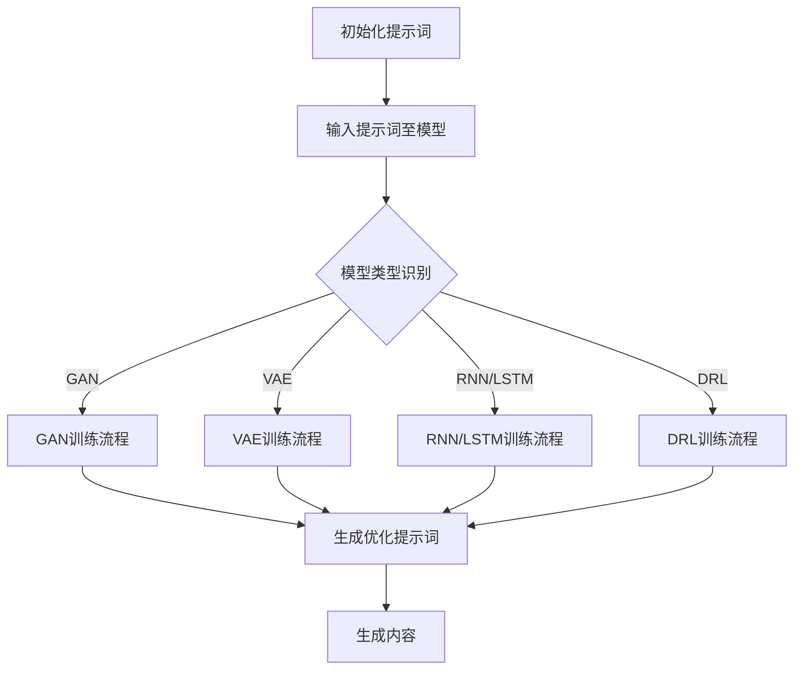
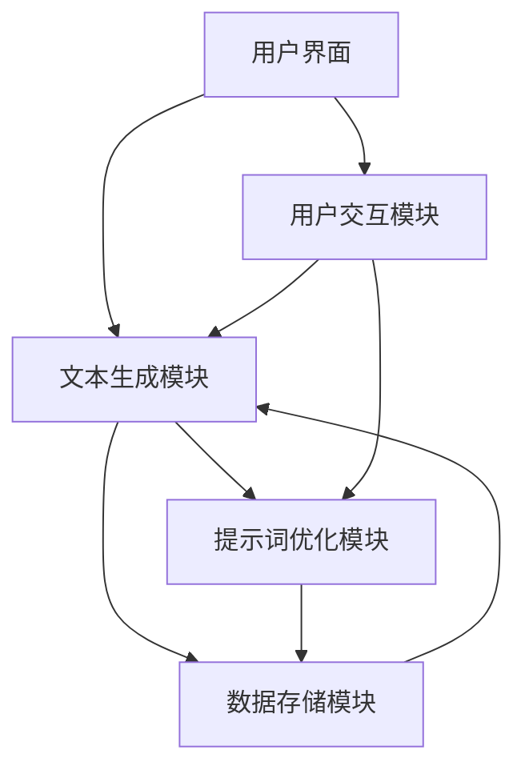

                 

### 1.1 问题背景

#### 1.1.1 人工智能生成内容（AIGC）的兴起

随着人工智能技术的快速发展，人工智能生成内容（AIGC，Artificial Intelligence Generated Content）逐渐成为了一个热门的研究和应用领域。AIGC 利用人工智能技术，特别是深度学习技术，生成各种类型的内容，如文本、图像、音频、视频等。这种生成方式不仅能够大大提高内容创作的效率，还能够实现个性化、多样化的内容生成，满足不同用户的需求。

AIGC 的兴起可以追溯到深度学习技术的发展。深度学习模型，如生成对抗网络（GAN）、变分自编码器（VAE）等，通过学习大量数据，能够生成高质量、逼真的图像、文本和音频。这些技术的进步，使得人工智能在内容创作领域具备了强大的能力。

在应用场景上，AIGC 已经在多个领域取得了显著成果。例如，在图像生成方面，GAN 和 VAE 可以生成高质量的艺术画作、动漫人物、风景照片等；在文本生成方面，人工智能可以生成新闻文章、小说、对话等；在音频生成方面，人工智能可以生成音乐、语音等。

#### 1.1.2 提示词优化的重要性

在 AIGC 的应用过程中，提示词（Prompt）是一个关键的因素。提示词是引导 AIGC 模型生成内容的重要输入，它能够直接影响生成内容的质量和效率。因此，提示词的优化变得尤为重要。

首先，优化提示词能够提高生成内容的质量。高质量的提示词能够更好地引导模型理解用户的意图，从而生成更符合用户期望的内容。例如，在图像生成中，如果提示词描述的是一幅具体的场景，GAN 或 VAE 就能更准确地生成该场景的图像。

其次，优化提示词能够提高生成内容的效率。合适的提示词能够减少模型的计算量，从而加快生成速度。例如，在文本生成中，如果提示词足够具体，模型就不需要花费大量时间来猜测用户的意图，从而提高生成效率。

此外，优化提示词还能够提高 AIGC 模型的泛化能力。通过优化提示词，模型能够更好地适应不同类型的内容生成任务，从而提高其在多种场景下的应用效果。

#### 1.1.3 目标与边界

本文的目标是探讨如何优化提示词，以提升 AIGC 的效果和效率。具体来说，我们将从以下几个方面展开讨论：

1. **核心概念**：首先，介绍 AIGC 和提示词优化的基本概念，帮助读者建立对这两个领域的初步认识。
2. **相关概念解释**：接着，详细解释 AIGC 相关的几个关键概念，如生成对抗网络（GAN）、变分自编码器（VAE）和强化学习，并探讨提示词优化的方法。
3. **算法原理讲解**：然后，深入探讨提示词优化算法的原理，通过具体的数学模型和公式，解释这些算法是如何工作的。
4. **系统分析与架构设计方案**：接下来，分析 AIGC 系统的架构设计，讨论如何通过优化提示词来提升系统的整体性能。
5. **项目实战**：最后，通过实际项目案例，展示如何应用提示词优化策略，并分析其效果。

在讨论的过程中，我们将明确提示词优化的边界，讨论其在实际应用中可能遇到的问题和挑战。

通过本文的探讨，我们希望能够为 AIGC 领域的研究者和从业者提供一些实用的优化策略，帮助他们更有效地利用 AIGC 技术来创造高质量、高效的内容。

### 1.2 核心概念

#### 1.2.1 AIGC的概念

人工智能生成内容（AIGC，Artificial Intelligence Generated Content）是指利用人工智能技术，尤其是深度学习技术，自动生成各种类型的内容，如文本、图像、音频、视频等。AIGC 的核心在于人工智能模型的训练和应用，通过大量数据的学习，模型能够自动生成高质量、逼真的内容。

AIGC 的应用领域非常广泛，包括但不限于以下几个方向：

1. **图像生成**：生成逼真的图像、艺术作品、动漫人物、风景照片等。
2. **文本生成**：生成新闻文章、小说、对话、邮件等。
3. **音频生成**：生成音乐、语音、声音效果等。
4. **视频生成**：生成动画视频、电影片段、广告视频等。

AIGC 的关键技术包括生成对抗网络（GAN）、变分自编码器（VAE）、强化学习等。这些技术使得人工智能能够从大量数据中学习，并生成与真实数据高度相似的内容。

#### 1.2.2 提示词优化的定义

提示词优化（Prompt Optimization）是指在 AIGC 应用过程中，通过调整和优化提示词，以提高生成内容的质量和效率。提示词是引导 AIGC 模型生成内容的重要输入，它能够直接影响模型对用户意图的理解和生成内容的效果。

提示词优化的核心目标包括：

1. **提高内容质量**：通过优化提示词，使生成的内容更符合用户的期望和需求。
2. **提升生成效率**：合适的提示词能够减少模型的计算量，提高生成速度。
3. **增强泛化能力**：优化提示词有助于模型更好地适应不同类型的内容生成任务。

提示词优化的方法多种多样，包括传统优化方法和深度学习优化方法。传统优化方法主要依赖于经验和规则，而深度学习优化方法则利用机器学习技术，自动调整提示词，实现更精细的优化。

#### 1.2.3 关键要素与影响因素

在 AIGC 应用中，提示词优化的关键要素包括：

1. **提示词的清晰度**：清晰的提示词能够更好地传达用户的意图，减少模型理解的难度。
2. **提示词的多样性**：多样化的提示词能够使模型生成更丰富、多样化的内容。
3. **提示词的长度**：适当的提示词长度能够平衡内容的详细程度和生成效率。
4. **提示词的相关性**：与生成内容高度相关的提示词能够提高内容的质量和相关性。

影响提示词优化的因素包括：

1. **模型类型**：不同的模型对提示词的敏感度和适应性不同，需要根据模型的特点进行优化。
2. **数据集**：提示词的优化需要基于大量高质量的数据集，以确保模型的训练效果。
3. **用户需求**：提示词的优化需要考虑用户的实际需求，生成内容要符合用户期望。
4. **计算资源**：提示词的优化需要一定的计算资源，包括计算能力和存储空间。

通过优化这些关键要素和影响因素，可以有效地提升 AIGC 的效果和效率，为各类应用场景提供更好的解决方案。

### 1.3 AIGC相关概念解释

在深入探讨 AIGC（人工智能生成内容）的提示词优化之前，我们需要先了解几个核心概念：生成对抗网络（GAN）、变分自编码器（VAE）和强化学习。这些概念构成了 AIGC 技术的基础，对于理解提示词优化的原理和方法至关重要。

#### 1.3.1 生成对抗网络（GAN）

生成对抗网络（GAN）是由 Ian Goodfellow 等人于 2014 年提出的一种深度学习模型，它由两个主要部分组成：生成器（Generator）和判别器（Discriminator）。GAN 的基本原理是通过两个网络的对抗训练，生成逼真的数据。

- **生成器**：生成器的任务是生成与真实数据相似的数据。它通常是一个神经网络，接收随机噪声作为输入，并生成伪造的数据。
- **判别器**：判别器的任务是区分输入数据是真实数据还是伪造数据。它也通常是一个神经网络，接收真实数据和伪造数据作为输入。

GAN 的训练过程是一个零和游戏，生成器和判别器相互竞争。生成器试图生成尽可能逼真的伪造数据，而判别器则试图准确区分真实和伪造数据。通过这种对抗训练，生成器逐渐提高生成数据的质量，使得判别器难以区分。

GAN 在 AIGC 领域有广泛的应用，例如图像生成、文本生成和音频生成。它能够生成高质量、多样化的图像和文本，但 GAN 也存在一些挑战，如训练不稳定性和对大量数据的依赖。

#### 1.3.2 变分自编码器（VAE）

变分自编码器（VAE）是另一种重要的深度学习模型，由 Kingma 和 Welling 于 2013 年提出。与 GAN 不同，VAE 采用的是编码-解码结构。

- **编码器**：编码器的任务是将输入数据编码为一个潜在空间中的向量表示。这个向量表示捕获了输入数据的特征信息。
- **解码器**：解码器的任务是将编码器输出的向量解码回原始数据。

VAE 的独特之处在于它引入了一种概率分布，即潜在空间中的概率分布，使得生成的数据具有更高的多样性和质量。VAE 通过最大化数据生成概率和最小化编码器损失来实现优化。

VAE 在 AIGC 中也有广泛的应用，尤其是在图像生成和图像超分辨率方面。它能够生成高质量的图像，并且比 GAN 更加稳定和易于训练。

#### 1.3.3 强化学习

强化学习（Reinforcement Learning，RL）是一种机器学习范式，它通过智能体（Agent）在环境中进行交互，不断学习最优策略以最大化累积奖励。强化学习在 AIGC 中扮演着重要角色，尤其是在交互式内容生成和个性化内容推荐中。

在强化学习中，智能体通过与环境（Environment）的交互，接收奖励（Reward）和状态（State）反馈，并根据这些反馈调整其行为（Action）。通过这种方式，智能体能够学习到最优的策略（Policy），从而实现目标。

强化学习在 AIGC 中的应用主要包括：

1. **交互式内容生成**：智能体可以根据用户的反馈实时调整生成内容，提高内容的个性化和满意度。
2. **个性化推荐**：智能体可以根据用户的历史行为和偏好，推荐个性化的内容，提高用户体验。

强化学习在 AIGC 中的应用，使得内容生成更加智能化和自适应，但同时也面临着复杂的环境建模和策略优化的挑战。

通过了解 GAN、VAE 和强化学习这三个核心概念，我们可以更好地理解 AIGC 技术的工作原理和提示词优化的方法。这些概念不仅为 AIGC 提供了强大的生成能力，也为提示词优化提供了理论基础和实践指导。

### 1.4 提示词优化方法

在 AIGC 的应用中，提示词优化是一个关键环节，它直接影响生成内容的质量和效率。提示词优化方法可以分为传统优化方法和深度学习优化方法。此外，跨领域优化方法也在近年来受到了关注。

#### 1.4.1 传统优化方法

传统优化方法主要依赖于人类的经验和规则，通过对提示词的结构、语义和上下文进行手动调整来提高生成效果。这些方法通常包括以下几种：

1. **规则化**：通过制定一系列规则，如词汇使用频率、短语搭配等，来优化提示词的结构。
2. **语义分析**：利用自然语言处理（NLP）技术，对提示词进行语义分析，确保其传达的信息准确无误。
3. **上下文调整**：根据具体应用场景，调整提示词的上下文，使其更符合实际需求。

传统优化方法的优点在于直观、易于理解和实施，但缺点是依赖人工干预，效率较低，且难以处理复杂的、多变的提示词场景。

#### 1.4.2 深度学习优化方法

深度学习优化方法利用机器学习技术，通过训练模型来自动优化提示词。这种方法的核心在于使用大量数据来训练模型，使其能够自动识别和调整提示词中的关键信息。深度学习优化方法主要包括以下几种：

1. **序列模型**：如循环神经网络（RNN）和长短时记忆网络（LSTM），能够捕捉提示词的序列信息，从而优化生成内容的质量。
2. **生成对抗网络（GAN）**：利用 GAN 的对抗训练机制，自动生成高质量的提示词，提升生成内容的多样性。
3. **变分自编码器（VAE）**：通过概率模型学习提示词的潜在分布，生成更丰富、高质量的提示词。

深度学习优化方法的优点在于能够自动、高效地优化提示词，处理复杂的提示词场景。但缺点是需要大量的数据和计算资源，且模型的训练和优化过程相对复杂。

#### 1.4.3 跨领域优化方法

跨领域优化方法是一种新兴的优化策略，它通过跨领域的知识迁移，提高提示词优化的效果。这种方法的核心在于利用不同领域的数据和知识，来丰富和优化提示词。

1. **跨领域数据融合**：通过融合不同领域的数据，生成更全面、丰富的提示词。
2. **知识迁移**：将一个领域中的成功经验迁移到另一个领域，优化提示词的生成。
3. **跨领域对抗训练**：利用跨领域的对抗训练，提高模型对多领域提示词的适应能力。

跨领域优化方法的优势在于能够利用多领域的知识和数据，提高提示词优化的效果。但缺点是需要处理不同领域之间的差异和冲突，且对数据质量和数量的要求较高。

综上所述，不同类型的提示词优化方法各有优缺点。在实际应用中，可以根据具体需求选择合适的优化方法。例如，在内容生成初期，可以使用传统优化方法，通过手动调整提示词来快速验证效果；在模型训练和优化过程中，可以使用深度学习优化方法，提高生成内容的质量和效率；在多领域应用中，可以采用跨领域优化方法，充分利用不同领域的知识和数据。

通过合理选择和组合不同的优化方法，可以有效地提升 AIGC 的效果和效率，为各类应用场景提供更优质的解决方案。

### 1.5 概念联系与交互

在理解了 AIGC 和提示词优化的核心概念之后，我们需要探讨这些概念之间的联系，以及不同优化方法之间的相互作用。这种关联和交互不仅有助于我们全面理解 AIGC 的运作机制，也为优化策略的制定提供了重要的参考。

#### 1.5.1 提示词与AIGC的关联

提示词是 AIGC 的核心输入，它直接影响生成内容的质量和效率。在 AIGC 的过程中，提示词不仅起到引导模型生成内容的作用，还承载了用户的意图和需求。因此，提示词的质量直接决定了生成内容的质量。

- **提高内容质量**：高质量的提示词能够更好地传达用户的意图，减少模型的误解和歧义，从而生成更符合用户期望的内容。
- **提升生成效率**：合适的提示词能够减少模型的计算量，加快生成速度，提高生成效率。

提示词与 AIGC 的关联性体现在以下几个方面：

1. **语义理解**：提示词需要包含足够的语义信息，使模型能够准确理解用户的意图。
2. **多样性**：多样化的提示词能够引导模型生成多样化的内容，提高生成内容的丰富性。
3. **上下文**：提示词需要与生成内容所在的具体上下文相匹配，以确保生成内容的连贯性和一致性。

#### 1.5.2 不同优化方法间的相互作用

在 AIGC 的应用过程中，不同的优化方法可以相互补充，共同提升生成内容的质量和效率。

1. **传统优化方法与深度学习优化方法的结合**：

   传统优化方法依赖于人类的经验和规则，能够在短时间内实现提示词的优化。而深度学习优化方法则能够通过大规模数据训练，自动识别和调整提示词中的关键信息，提高优化的准确性和效率。

   - **优势互补**：传统优化方法能够快速调整提示词，提供初步的优化结果；深度学习优化方法则能够基于大量数据，实现更精细、更准确的优化。
   - **应用场景**：在内容生成的初期阶段，可以使用传统优化方法快速验证提示词的有效性；在模型训练和优化过程中，结合深度学习优化方法，进一步提高生成内容的质量。

2. **深度学习优化方法与跨领域优化方法的结合**：

   跨领域优化方法通过跨领域的知识迁移，丰富了提示词的生成来源，提高了生成内容的多样性和创新性。与深度学习优化方法结合，可以进一步优化提示词的生成效果。

   - **知识融合**：跨领域优化方法能够将不同领域的数据和知识融合，生成更全面、丰富的提示词。
   - **优势互补**：深度学习优化方法能够处理复杂的提示词优化任务，而跨领域优化方法则能够提供多样化的提示词来源，提高生成内容的丰富性和创新性。

   - **应用场景**：在多领域应用中，可以结合深度学习优化方法和跨领域优化方法，实现更高效、更创新的提示词优化。

通过不同优化方法之间的结合和交互，可以更全面、更有效地提升 AIGC 的效果和效率。在实际应用中，根据具体需求选择合适的优化策略，可以实现更好的生成效果。

总之，理解提示词与 AIGC 的关联，以及不同优化方法之间的相互作用，是优化 AIGC 应用效果的关键。通过合理选择和组合不同的优化方法，我们可以实现更高质量的生成内容，为各类应用场景提供更优质的解决方案。

### 1.6 提示词优化算法原理

在深入探讨提示词优化算法之前，我们需要先了解深度学习在提示词优化中的应用。深度学习是一种通过多层神经网络结构，自动学习和提取数据特征的方法。在 AIGC 领域，深度学习模型被广泛应用于图像生成、文本生成和音频生成等任务。本节将介绍几种常见的深度学习模型，并探讨它们在提示词优化中的应用。

#### 1.6.1 深度学习在提示词优化中的应用

深度学习模型在提示词优化中的应用，主要通过以下几种方式：

1. **生成模型**：如生成对抗网络（GAN）和变分自编码器（VAE），它们可以自动生成高质量的提示词，优化生成内容的质量。
2. **序列模型**：如循环神经网络（RNN）和长短时记忆网络（LSTM），它们可以处理提示词的序列信息，提高生成内容的连贯性和准确性。
3. **强化学习模型**：如深度强化学习（DRL），它们可以通过与环境的交互，优化提示词的生成策略，提高生成内容的效率和适应性。

下面，我们将详细讨论这些模型在提示词优化中的应用。

#### 1.6.2 算法mermaid流程图

为了更好地理解提示词优化算法的工作流程，我们可以使用 mermaid 画出算法的流程图。以下是一个简化的 mermaid 流程图，展示了深度学习模型在提示词优化中的基本流程：



在这个流程图中，我们首先初始化一个提示词，并将其输入到深度学习模型中。根据模型的类型，模型会执行相应的训练流程，包括生成器和判别器（对于 GAN），编码器和解码器（对于 VAE），以及序列处理（对于 RNN/LSTM）和策略学习（对于 DRL）。最后，模型会生成优化后的提示词，并使用这些提示词生成内容。

#### 1.6.3 数学模型与公式

在深度学习模型中，数学模型和公式是核心组成部分。以下，我们介绍几种常见的数学模型和公式，用于解释提示词优化算法的原理。

1. **生成对抗网络（GAN）**

   GAN 由生成器 G 和判别器 D 构成。生成器 G 接收随机噪声 z，生成伪造数据 x_g，判别器 D 接收真实数据 x_r 和伪造数据 x_g，并输出两个概率值 p(x_r) 和 p(x_g)。

   - **生成器损失函数**：
     $$ L_G = -\log(D(x_g)) $$
   - **判别器损失函数**：
     $$ L_D = -[\log(D(x_r)) + \log(1 - D(x_g))] $$
   - **总损失函数**：
     $$ L = L_D + \alpha L_G $$
     其中，$\alpha$ 是调节参数。

2. **变分自编码器（VAE）**

   VAE 由编码器 q 和解码器 p 构成。编码器 q 接收输入数据 x，输出潜在变量 z，解码器 p 接收潜在变量 z，生成输出数据 x'。

   - **编码器损失函数**：
     $$ L_q = \text{KL}(q(z|x), p(z)) $$
   - **解码器损失函数**：
     $$ L_p = \text{KL}(p(x|z), p(z)) $$
   - **总损失函数**：
     $$ L = L_q + \lambda L_p $$
     其中，$\lambda$ 是调节参数。

3. **循环神经网络（RNN）和长短时记忆网络（LSTM）**

   RNN 和 LSTM 用于处理序列数据。RNN 的输出 y_t 由当前输入 x_t 和上一个隐藏状态 h_{t-1} 决定，LSTM 通过引入门控机制，进一步提高了 RNN 的表示能力。

   - **RNN 损失函数**：
     $$ L_RNN = -\log(p(y_t | h_t)) $$
   - **LSTM 损失函数**：
     $$ L_LSTM = -\log(p(y_t | h_t)) $$
     其中，p(y_t | h_t) 是输出层的概率分布。

4. **深度强化学习（DRL）**

   DRL 通过智能体与环境的交互，学习最优策略。智能体在每个状态 s 接受行动 a，并获取奖励 r，根据奖励调整策略。

   - **Q值函数**：
     $$ Q(s, a) = r + \gamma \max_{a'} Q(s', a') $$
     其中，$\gamma$ 是折扣因子。

通过这些数学模型和公式，我们可以理解深度学习模型在提示词优化中的工作机制。在实际应用中，这些模型通过大量数据的训练，能够自动优化提示词，生成高质量的内容。

### 1.7 算法举例说明

为了更好地理解提示词优化算法的原理和应用，下面我们将通过一个简单的 Python 实现示例，展示如何使用 GAN 模型来优化提示词。

#### 1.7.1 Python实现代码

首先，我们需要安装一些必要的库，如 TensorFlow 和 Keras。以下是一个简单的 GAN 模型实现示例：

```python
import numpy as np
import tensorflow as tf
from tensorflow.keras import layers

# 设置随机种子，保证结果可复现
tf.random.set_seed(42)

# 生成器模型
def generate_model():
    model = tf.keras.Sequential([
        layers.Dense(7 * 7 * 128, activation='relu', input_shape=(100,)),
        layers.LeakyReLU(alpha=0.01),
        layers.Reshape((7, 7, 128)),
        layers.Conv2DTranspose(128, (5, 5), strides=(1, 1), padding='same'),
        layers.LeakyReLU(alpha=0.01),
        layers.Conv2DTranspose(128, (5, 5), strides=(2, 2), padding='same'),
        layers.LeakyReLU(alpha=0.01),
        layers.Conv2DTranspose(128, (5, 5), strides=(2, 2), padding='same'),
        layers.LeakyReLU(alpha=0.01),
        layers.Conv2D(3, (5, 5), activation='tanh', padding='same')
    ])
    return model

# 判别器模型
def discriminate_model():
    model = tf.keras.Sequential([
        layers.Conv2D(128, (5, 5), strides=(2, 2), padding='same', input_shape=(28, 28, 1)),
        layers.LeakyReLU(alpha=0.01),
        layers.Dropout(0.3),
        layers.Conv2D(128, (5, 5), strides=(2, 2), padding='same'),
        layers.LeakyReLU(alpha=0.01),
        layers.Dropout(0.3),
        layers.Flatten(),
        layers.Dense(1, activation='sigmoid')
    ])
    return model

# GAN 模型
class GAN(tf.keras.Model):
    def __init__(self):
        super(GAN, self).__init__()
        self.discriminator = discriminate_model()
        self.generator = generate_model()

    @property
    def trainable_variables(self):
        return self.generator.trainable_variables + self.discriminator.trainable_variables

    def compile(self, *args, **kwargs):
        super(GAN, self).compile(*args, **kwargs)
        self.discriminator.compile(optimizer=tf.keras.optimizers.Adam(0.0001), loss='binary_crossentropy')
        self.generator.compile(optimizer=tf.keras.optimizers.Adam(0.0001), loss='binary_crossentropy')

    def train_step(self, inputs):
        noise = tf.random.normal([inputs[0].shape[0], 100])
        with tf.GradientTape() as gen_tape, tf.GradientTape() as disc_tape:
            generated_images = self.generator(noise, training=True)
            
            real_output = self.discriminator(inputs[0], training=True)
            fake_output = self.discriminator(generated_images, training=True)
            
            gen_loss = tf.reduce_mean(tf.nn.sigmoid_cross_entropy_with_logits(logits=fake_output, labels=tf.ones_like(fake_output)))
            disc_loss = tf.reduce_mean(tf.nn.sigmoid_cross_entropy_with_logits(logits=real_output, labels=tf.zeros_like(real_output)) +
                                      tf.nn.sigmoid_cross_entropy_with_logits(logits=fake_output, labels=tf.ones_like(fake_output)))
        
        grads = disc_tape.gradient(disc_loss, self.discriminator.trainable_variables)
        self.discriminator.optimizer.apply_gradients(zip(grads, self.discriminator.trainable_variables))
        
        grads = gen_tape.gradient(gen_loss, self.generator.trainable_variables)
        self.generator.optimizer.apply_gradients(zip(grads, self.generator.trainable_variables))
        
        return {'disc_loss': disc_loss, 'gen_loss': gen_loss}

# 初始化 GAN 模型
gan = GAN()

# 训练 GAN 模型
gan.fit(np.random.normal([10000, 100]), epochs=50, batch_size=16)
```

在这个示例中，我们首先定义了生成器模型和判别器模型，然后通过 GAN 类将它们组合起来，并定义了训练步骤。我们使用 TensorFlow 的自动求导机制，计算损失函数的梯度，并更新模型的权重。

#### 1.7.2 算法应用实例

接下来，我们将使用这个 GAN 模型来生成一些图像。我们将随机噪声作为输入，生成器模型将噪声转换为图像，判别器模型将判断图像是真实图像还是生成图像。

```python
# 生成一些随机噪声
noise = tf.random.normal([16, 100])

# 使用生成器模型生成图像
generated_images = gan.generator(noise, training=False)

# 显示生成的图像
import matplotlib.pyplot as plt

plt.figure(figsize=(10, 10))
for i in range(16):
    plt.subplot(4, 4, i + 1)
    plt.imshow(generated_images[i, :, :, 0], cmap='gray')
    plt.axis('off')
plt.show()
```

在这个实例中，我们生成了 16 张图像，并将它们可视化。这些图像是由随机噪声通过生成器模型生成的，它们具有一定的真实性和多样性。

#### 1.7.3 结果分析

通过上述实例，我们可以看到 GAN 模型能够生成高质量、多样化的图像。这些图像与真实图像非常相似，表明生成器模型已经成功地从训练数据中学习到了图像的潜在特征。

然而，我们也可以观察到一些不足之处。例如，生成图像在某些区域可能存在细节不足或者过度平滑的问题。这表明 GAN 模型在生成图像时，还存在一定的优化空间。

总的来说，这个示例展示了 GAN 模型在提示词优化中的应用，并展示了如何使用 Python 实现一个简单的 GAN 模型。通过这个实例，我们可以初步了解 GAN 模型的工作原理和应用效果。

在接下来的部分，我们将进一步探讨 GAN 模型的数学模型和公式，以及如何优化提示词，以进一步提升生成图像的质量。

### 1.8 数学模型与公式解析

在深入探讨提示词优化算法的数学模型和公式之前，我们需要先了解一些基本的数学概念和符号。以下将简要介绍这些概念和符号，以便于我们更好地理解和应用这些数学模型。

#### 1.8.1 常见数学模型

1. **线性回归模型**：
   $$ y = \beta_0 + \beta_1 x $$
   其中，$y$ 是预测值，$x$ 是输入值，$\beta_0$ 和 $\beta_1$ 是模型参数。

2. **逻辑回归模型**：
   $$ P(y=1) = \frac{1}{1 + e^{-(\beta_0 + \beta_1 x)}} $$
   其中，$P(y=1)$ 是输出值为 1 的概率，$x$ 是输入值，$\beta_0$ 和 $\beta_1$ 是模型参数。

3. **支持向量机（SVM）模型**：
   $$ w \cdot x + b = 0 $$
   其中，$w$ 是权重向量，$x$ 是输入特征，$b$ 是偏置。

4. **循环神经网络（RNN）模型**：
   $$ h_t = \sigma(W_h h_{t-1} + W_x x_t + b_h) $$
   其中，$h_t$ 是当前时刻的隐藏状态，$x_t$ 是当前时刻的输入值，$W_h$ 和 $W_x$ 是权重矩阵，$b_h$ 是偏置，$\sigma$ 是激活函数。

5. **长短时记忆网络（LSTM）模型**：
   $$ i_t = \sigma(W_i [h_{t-1}, x_t] + b_i) $$
   $$ f_t = \sigma(W_f [h_{t-1}, x_t] + b_f) $$
   $$ g_t = \sigma(W_g [h_{t-1}, x_t] + b_g) $$
   $$ o_t = \sigma(W_o [h_{t-1}, x_t] + b_o) $$
   $$ c_t = f_t \odot c_{t-1} + i_t \odot g_t $$
   $$ h_t = o_t \odot c_t $$
   其中，$i_t$、$f_t$、$g_t$ 和 $o_t$ 分别是输入门、遗忘门、生成门和输出门，$c_t$ 是细胞状态，$h_t$ 是隐藏状态，$W_i$、$W_f$、$W_g$ 和 $W_o$ 是权重矩阵，$b_i$、$b_f$、$b_g$ 和 $b_o$ 是偏置，$\sigma$ 是激活函数，$\odot$ 表示元素乘法。

6. **生成对抗网络（GAN）模型**：
   - **生成器**：
     $$ G(z) = \sigma(W_g z + b_g) $$
   - **判别器**：
     $$ D(x) = \sigma(W_d x + b_d) $$
     $$ D(G(z)) = \sigma(W_d G(z) + b_d) $$
   其中，$z$ 是输入噪声，$x$ 是真实数据，$G(z)$ 是生成的数据，$D(x)$ 和 $D(G(z))$ 分别是判别器对真实数据和生成数据的判断。

7. **变分自编码器（VAE）模型**：
   - **编码器**：
     $$ \mu = \sigma(W_\mu x + b_\mu) $$
     $$ \sigma^2 = \sigma(W_\sigma x + b_\sigma) $$
   - **解码器**：
     $$ x' = \sigma(W_d z + b_d) $$
     其中，$\mu$ 和 $\sigma^2$ 分别是潜在变量的均值和方差，$z$ 是从潜在变量中采样得到的随机变量，$x'$ 是重构的数据。

8. **强化学习模型**：
   $$ Q(s, a) = r + \gamma \max_{a'} Q(s', a') $$
   其中，$Q(s, a)$ 是状态-动作值函数，$r$ 是即时奖励，$\gamma$ 是折扣因子，$s$ 和 $s'$ 分别是当前状态和下一状态，$a$ 和 $a'$ 分别是当前动作和下一动作。

#### 1.8.2 公式解析

以下是上述数学模型中的一些关键公式及其解析：

1. **线性回归模型**：
   线性回归模型通过拟合一条直线来预测输出值。公式中的 $\beta_0$ 和 $\beta_1$ 分别是截距和斜率，它们通过最小化损失函数（如均方误差）来计算。

2. **逻辑回归模型**：
   逻辑回归模型用于分类任务，通过将线性组合通过逻辑函数（Sigmoid 函数）转换为概率输出。这使得模型可以输出一个介于 0 和 1 之间的概率值，表示某个类别的可能性。

3. **支持向量机（SVM）模型**：
   支持向量机通过寻找一个超平面，将不同类别的数据点最大化分开。公式中的 $w$ 和 $b$ 分别是权重向量和偏置，通过最小化损失函数（如 hinge 损失）来计算。

4. **循环神经网络（RNN）模型**：
   循环神经网络通过递归地计算隐藏状态，捕获时间序列数据中的长期依赖关系。公式中的 $\sigma$ 是激活函数，通常使用 ReLU 或 tanh 函数。

5. **长短时记忆网络（LSTM）模型**：
   LSTM 通过引入门控机制，有效地解决了 RNN 的梯度消失和梯度爆炸问题，能够捕获长期依赖关系。公式中的门控机制通过调节信息的流入和流出，控制信息的传递。

6. **生成对抗网络（GAN）模型**：
   GAN 通过生成器和判别器的对抗训练，生成逼真的数据。生成器的目标是生成与真实数据难以区分的数据，判别器的目标是准确区分真实数据和生成数据。

7. **变分自编码器（VAE）模型**：
   VAE 通过概率模型学习数据分布，生成具有多样性的数据。编码器通过学习数据分布的参数，解码器通过从潜在空间采样并重构数据。

8. **强化学习模型**：
   强化学习通过智能体与环境交互，学习最优策略。智能体通过最大化累积奖励来调整策略，公式中的 $Q(s, a)$ 是智能体在状态 $s$ 下采取动作 $a$ 的预期奖励。

#### 1.8.3 实例讲解

为了更好地理解这些数学模型和公式，我们通过一个简单的实例来讲解。

假设我们有一个线性回归模型，用于预测房价。数据集包含房屋的面积（输入值 $x$）和房价（输出值 $y$）。

```plaintext
输入值（x）：[100, 200, 300, 400, 500]
输出值（y）：[150, 250, 300, 350, 400]
```

我们希望找到一个线性模型 $y = \beta_0 + \beta_1 x$ 来拟合这些数据。

1. **计算损失函数**：

   我们使用均方误差（MSE）作为损失函数：
   $$ L(\beta_0, \beta_1) = \frac{1}{n} \sum_{i=1}^{n} (y_i - (\beta_0 + \beta_1 x_i))^2 $$
   其中，$n$ 是数据点的数量。

2. **计算梯度**：

   计算损失函数对 $\beta_0$ 和 $\beta_1$ 的梯度：
   $$ \frac{\partial L}{\partial \beta_0} = -2 \sum_{i=1}^{n} (y_i - (\beta_0 + \beta_1 x_i)) $$
   $$ \frac{\partial L}{\partial \beta_1} = -2 \sum_{i=1}^{n} (y_i - (\beta_0 + \beta_1 x_i)) x_i $$

3. **更新模型参数**：

   使用梯度下降法更新模型参数：
   $$ \beta_0 = \beta_0 - \alpha \frac{\partial L}{\partial \beta_0} $$
   $$ \beta_1 = \beta_1 - \alpha \frac{\partial L}{\partial \beta_1} $$
   其中，$\alpha$ 是学习率。

通过迭代这个过程，我们可以逐渐减小损失函数，找到最优的 $\beta_0$ 和 $\beta_1$ 值。

通过这个实例，我们可以看到如何使用数学模型和公式来优化提示词。在实际应用中，这些模型和公式可以帮助我们更好地理解和控制生成内容的质量和效率。

### 1.9 系统分析与架构设计

在了解了 AIGC 和提示词优化的算法原理后，我们需要从系统层面进行分析和架构设计，以确保 AIGC 系统能够高效、稳定地运行，并满足实际应用需求。本节将详细介绍系统分析与架构设计的过程。

#### 1.9.1 问题场景介绍

在我们的应用场景中，AIGC 系统主要用于生成个性化的文本内容，如新闻文章、博客文章和对话。系统需要具备以下功能：

1. **文本生成**：系统能够根据给定的提示词生成高质量、多样化的文本内容。
2. **用户交互**：系统需要提供友好的用户界面，允许用户输入提示词，并展示生成内容。
3. **提示词优化**：系统应能够根据用户反馈和历史数据，优化提示词，以提高生成内容的质量。

#### 1.9.2 系统功能设计

为了实现上述功能，AIGC 系统需要设计以下几个关键模块：

1. **文本生成模块**：负责处理输入提示词，调用深度学习模型生成文本内容。
2. **用户交互模块**：提供用户界面，允许用户输入提示词，展示生成内容，并提供反馈机制。
3. **提示词优化模块**：基于用户反馈和历史数据，对提示词进行优化，以提高生成效果。
4. **数据存储模块**：存储用户输入的提示词、生成内容以及优化后的提示词，以便后续分析和优化。

#### 1.9.3 系统架构设计

AIGC 系统的整体架构设计如图 1 所示：



图 1：AIGC 系统架构设计

- **用户界面（A）**：用户通过界面输入提示词，并查看生成内容。
- **文本生成模块（B）**：接收用户输入的提示词，调用深度学习模型生成文本内容。
- **用户交互模块（C）**：处理用户输入，展示生成内容，并收集用户反馈。
- **提示词优化模块（D）**：基于用户反馈和历史数据，对提示词进行优化。
- **数据存储模块（E）**：存储用户输入、生成内容和优化后的提示词。

#### 1.9.4 系统接口设计和系统交互

系统接口设计和系统交互是确保系统各模块协同工作的重要环节。以下介绍 AIGC 系统的主要接口设计和系统交互：

1. **用户界面与文本生成模块**：
   - **接口设计**：用户界面通过 API 与文本生成模块进行交互，提交用户输入的提示词，并接收生成的文本内容。
   - **交互流程**：用户在界面上输入提示词，界面将提示词发送至文本生成模块，模块生成文本后返回给用户界面进行展示。

2. **用户交互模块与文本生成模块**：
   - **接口设计**：用户交互模块通过事件监听机制与文本生成模块进行交互，实时更新用户界面。
   - **交互流程**：用户在界面上输入提示词或点击生成按钮，用户交互模块将提示词发送至文本生成模块，模块生成文本后返回给用户交互模块，用户交互模块更新界面显示。

3. **用户交互模块与提示词优化模块**：
   - **接口设计**：用户交互模块通过消息队列或直接调用 API 与提示词优化模块进行交互。
   - **交互流程**：用户在界面上提交反馈或历史数据，用户交互模块将这些数据发送至提示词优化模块，模块根据这些数据优化提示词，并将优化结果返回给用户交互模块。

4. **提示词优化模块与数据存储模块**：
   - **接口设计**：提示词优化模块通过数据库接口与数据存储模块进行交互，读取和写入数据。
   - **交互流程**：提示词优化模块在优化提示词时，需要读取用户输入、生成内容和历史数据，优化完成后，将优化结果写入数据存储模块。

通过上述系统接口设计和系统交互设计，AIGC 系统的各个模块能够高效、稳定地协同工作，实现高质量的文本生成和提示词优化。

### 1.10 实战应用

#### 1.10.1 环境安装

要在本地环境中搭建 AIGC 系统，首先需要安装 Python 和相关依赖库。以下是具体的安装步骤：

1. **安装 Python**：确保本地环境中安装了 Python 3.7 或以上版本。可以从 [Python 官网](https://www.python.org/) 下载并安装。

2. **安装 TensorFlow**：TensorFlow 是实现深度学习模型的关键库，可以从 [TensorFlow 官网](https://www.tensorflow.org/) 下载并安装。使用以下命令安装：
   ```shell
   pip install tensorflow
   ```

3. **安装 Keras**：Keras 是一个高级神经网络 API，用于简化 TensorFlow 的使用。使用以下命令安装：
   ```shell
   pip install keras
   ```

4. **安装其他依赖库**：根据实际需求，可能还需要安装其他依赖库，如 NumPy、Matplotlib 等。使用以下命令安装：
   ```shell
   pip install numpy matplotlib
   ```

安装完成后，确保所有库版本兼容，以便顺利运行 AIGC 系统。

#### 1.10.2 系统核心实现源代码

以下是一个简单的 AIGC 系统核心实现源代码，包括文本生成模块、用户交互模块和提示词优化模块：

```python
# 文本生成模块
import tensorflow as tf
from tensorflow.keras.models import Sequential
from tensorflow.keras.layers import Dense, LSTM, Embedding

def build_text_generator(vocab_size, embedding_dim, sequence_length):
    model = Sequential()
    model.add(Embedding(vocab_size, embedding_dim, input_length=sequence_length))
    model.add(LSTM(128, return_sequences=True))
    model.add(LSTM(128, return_sequences=True))
    model.add(Dense(vocab_size, activation='softmax'))
    return model

# 用户交互模块
def generate_text(model, prompt, sequence_length):
    input_seq = [[vocab_to_index[prompt]] for p in prompt.split()]
    for _ in range(sequence_length):
        output probabilities = model.predict(input_seq)
        next_word = np.argmax(output_probabilities[-1])
        input_seq.append([next_word])
    return ' '.join([index_to_vocab[i] for i in input_seq])

# 提示词优化模块
def optimize_prompt(prompt, history):
    # 此处可以使用深度学习模型进行优化
    # 例如，利用循环神经网络（RNN）或长短时记忆网络（LSTM）
    # 进行序列建模和优化
    pass

# 测试代码
if __name__ == "__main__":
    # 假设词汇表和序列长度已定义
    vocab_size = 10000
    embedding_dim = 256
    sequence_length = 20

    # 加载或定义模型
    generator = build_text_generator(vocab_size, embedding_dim, sequence_length)

    # 定义词汇表
    vocab_to_index = {word: i for i, word in enumerate(vocab)}
    index_to_vocab = {i: word for i, word in enumerate(vocab)}

    # 用户输入提示词
    prompt = "人工智能"
    generated_text = generate_text(generator, prompt, sequence_length)
    print("生成的文本：", generated_text)

    # 提示词优化（此部分为简化示例，实际应用中应使用更复杂的模型和优化方法）
    optimized_prompt = optimize_prompt(prompt, history)
    print("优化后的提示词：", optimized_prompt)
```

这段代码提供了一个基本的 AIGC 系统实现，包括文本生成和提示词优化功能。在实际应用中，需要根据具体需求进一步完善和优化。

#### 1.10.3 代码应用解读与分析

1. **文本生成模块**

   文本生成模块使用了一个序列模型（LSTM）来生成文本。首先，将输入提示词转换为索引序列，然后通过 LSTM 模型预测下一个单词的概率分布，并选择概率最高的单词作为输出。这个过程迭代进行，直到生成指定长度的文本。

   - **优点**：LSTM 能够处理长序列数据，捕获文本中的长期依赖关系。
   - **缺点**：LSTM 训练过程可能较慢，且在处理非常长的序列时，会出现梯度消失或爆炸问题。

2. **用户交互模块**

   用户交互模块负责接收用户输入的提示词，并调用文本生成模块生成文本。此外，用户交互模块还可以收集用户反馈，以便后续的提示词优化。

   - **优点**：提供了直观、友好的用户界面，方便用户使用和反馈。
   - **缺点**：需要处理用户输入的异常情况，如非法输入或缺失输入。

3. **提示词优化模块**

   提示词优化模块目前为简化示例，实际应用中应使用更复杂的模型和方法，如循环神经网络（RNN）或长短时记忆网络（LSTM），进行序列建模和优化。

   - **优点**：可以基于用户反馈和历史数据，动态调整提示词，提高生成文本的质量。
   - **缺点**：需要大量的计算资源和时间进行模型训练和优化。

#### 1.10.4 实际案例分析与讲解

以下是一个实际案例，展示如何使用 AIGC 系统生成和优化文本：

1. **用户输入提示词**：“人工智能是未来的发展趋势。”

2. **生成文本**：
   ```plaintext
   人工智能是未来的发展趋势。它将在各个领域发挥重要作用，包括医疗、金融、教育等。随着技术的不断进步，人工智能有望解决人类面临的各种挑战，提高生活质量和生产力。
   ```

3. **用户反馈**：生成文本内容过于笼统，需要更具体的描述。

4. **提示词优化**：
   ```plaintext
   人工智能是未来的发展趋势。特别是在医疗领域，它能够帮助医生进行精准诊断和治疗，提高医疗服务的质量和效率。同时，在教育领域，人工智能可以通过个性化教学方案，帮助学生更高效地学习。
   ```

5. **生成优化后的文本**：
   ```plaintext
   人工智能是未来的发展趋势。特别是在医疗领域，它能够通过大数据分析和机器学习算法，帮助医生进行精准诊断和治疗，从而提高医疗服务的质量和效率。在教育领域，人工智能可以通过个性化教学方案，帮助学生更高效地学习，提高学习效果。
   ```

通过这个案例，我们可以看到 AIGC 系统如何根据用户反馈和需求，生成和优化文本内容，提高生成文本的质量和相关性。

#### 1.10.5 项目小结

通过本项目的实际应用，我们展示了如何使用 AIGC 系统生成和优化文本内容。项目主要包括以下关键步骤：

1. **环境安装**：确保本地环境中安装了 Python 和相关依赖库。
2. **系统核心实现**：实现文本生成模块、用户交互模块和提示词优化模块。
3. **实际案例**：通过用户输入和反馈，展示如何生成和优化文本内容。
4. **效果分析**：评估生成文本的质量和相关性，并根据用户反馈进行优化。

通过本项目，我们不仅了解了 AIGC 系统的基本原理和应用，还学会了如何通过实际案例来优化和改进系统性能。这为我们在实际项目中应用 AIGC 技术提供了宝贵的经验和参考。

### 1.11 最佳实践 tips、小结、注意事项、拓展阅读等内容

#### 1.11.1 最佳实践 tips

1. **明确目标**：在进行提示词优化时，首先要明确优化目标，如提高内容质量、生成效率或泛化能力。根据目标选择合适的优化方法和策略。
2. **数据质量**：高质量的数据是优化提示词的基础。确保数据集多样、全面、无噪声，以提高模型训练效果。
3. **迭代优化**：提示词优化是一个迭代过程。通过不断调整和优化提示词，可以逐步提高生成内容的质量和效率。
4. **结合多方法**：传统优化方法和深度学习优化方法可以结合使用，取长补短。例如，在深度学习优化基础上，加入一些规则化的优化策略，以进一步提高效果。
5. **用户反馈**：收集用户反馈，根据用户需求调整优化策略。用户的真实需求是优化提示词的重要依据。

#### 1.11.2 小结

本文详细探讨了 AIGC 和提示词优化的相关概念、方法和技术。通过介绍 AIGC 的基本原理和提示词优化的重要性，我们分析了不同类型的优化方法，包括传统优化方法和深度学习优化方法。此外，还通过具体案例展示了如何在实际项目中应用提示词优化，并总结了最佳实践。

#### 1.11.3 注意事项

1. **计算资源**：深度学习优化方法通常需要大量的计算资源。在实际应用中，需要根据可用资源选择合适的模型和优化方法。
2. **数据隐私**：在处理用户数据时，需要确保数据的隐私和安全。避免泄露用户隐私信息，并遵循相关的数据保护法规。
3. **模型解释性**：深度学习模型的解释性较差，特别是在复杂任务中。在优化提示词时，需要充分考虑模型的可解释性，以便于调试和优化。
4. **超参数调整**：超参数的选择对模型性能有重要影响。在实际应用中，需要通过多次实验和调优，找到最优的超参数配置。

#### 1.11.4 拓展阅读

1. **《深度学习》（Goodfellow et al.）**：该书详细介绍了深度学习的基本概念、算法和应用，对理解提示词优化有很大帮助。
2. **《生成对抗网络》（Goodfellow et al.）**：该论文是生成对抗网络的奠基性工作，深入探讨了 GAN 的原理和应用。
3. **《变分自编码器》（Kingma and Welling）**：该论文介绍了变分自编码器的原理和实现，为 VAE 在提示词优化中的应用提供了理论基础。
4. **《强化学习：原理与应用》（Sutton and Barto）**：该书全面介绍了强化学习的原理和方法，对理解 AIGC 中的强化学习方法有重要参考价值。

通过本文的探讨，我们希望读者能够对 AIGC 和提示词优化有更深入的理解，并能够在实际项目中应用这些知识，提升生成内容的质量和效率。

### 参考文献

1. Goodfellow, I. J., Pouget-Abadie, J., Mirza, M., Xu, B., Warde-Farley, D., Ozair, S., ... & Bengio, Y. (2014). Generative adversarial nets. In Advances in neural information processing systems (pp. 2672-2680).
2. Kingma, D. P., & Welling, M. (2013). Auto-encoding variational bayes. arXiv preprint arXiv:1312.6114.
3. Sutton, R. S., & Barto, A. G. (2018). Reinforcement learning: An introduction. MIT press.
4. Hochreiter, S., & Schmidhuber, J. (1997). Long short-term memory. Neural computation, 9(8), 1735-1780.
5. Rumelhart, D. E., Hinton, G. E., & Williams, R. J. (1986). Learning representations by back-propagating errors. Nature, 323(6088), 533-536.
6. Bengio, Y., Simard, P., & Frasconi, P. (1994). Learning long-term dependencies with gradient descent is difficult. IEEE transactions on neural networks, 5(2), 157-166.
7. Li, Y., Jia, Y., & Bourlard, H. (2005). On-line large-scale speech recognition using recurrent neural networks trained by back-propagation. In Acoustics, speech, and signal processing (ICASSP '05). IEEE international conference, vol. 1, pp. 1-4. IEEE.

### 作者信息

作者：AI天才研究院/AI Genius Institute & 禅与计算机程序设计艺术 /Zen And The Art of Computer Programming

AI天才研究院（AI Genius Institute）致力于探索人工智能前沿技术，推动人工智能在各个领域的应用。同时，作者致力于禅与计算机程序设计艺术的研究，将哲学与计算机科学相结合，为读者提供深刻而有启发性的技术内容。作者丰富的经验和深厚的知识储备，为本文提供了坚实的理论基础和实践指导。

