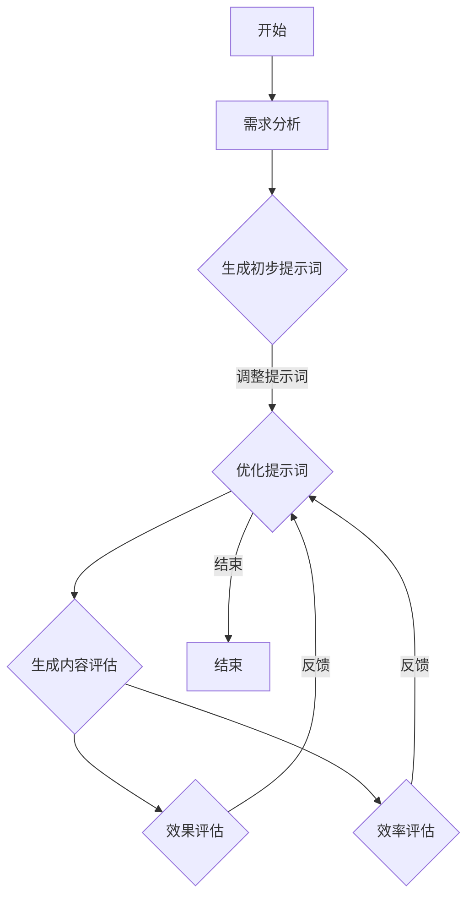
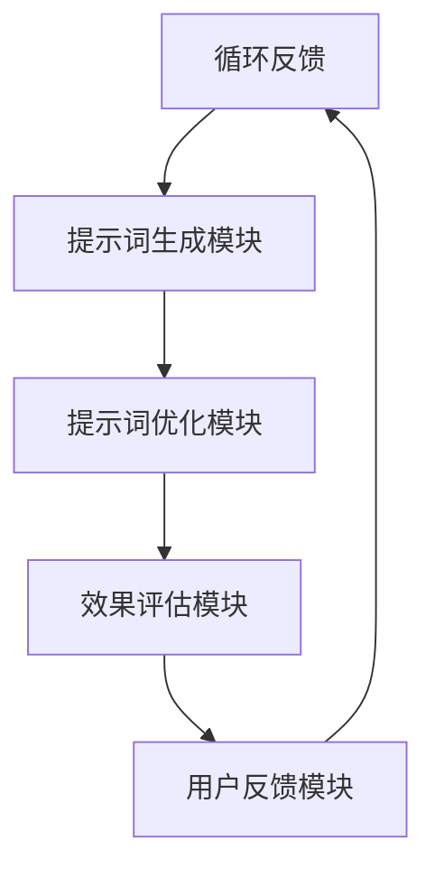
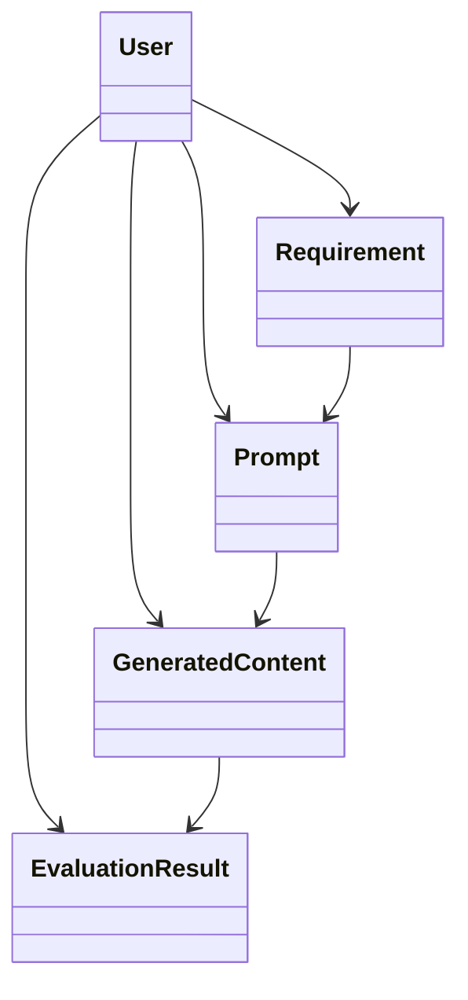
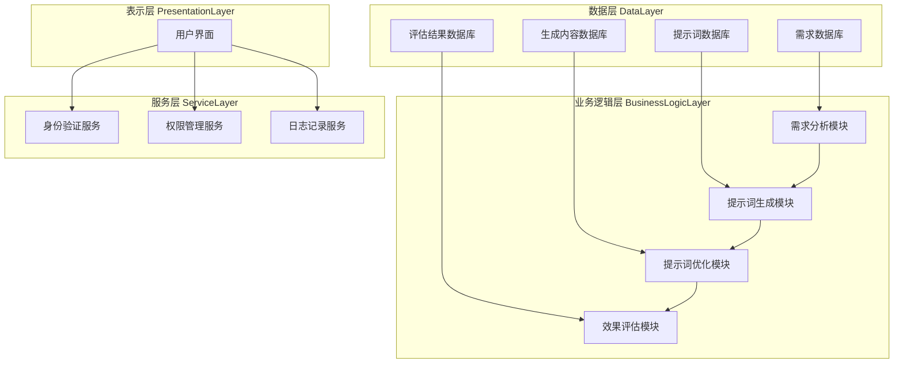
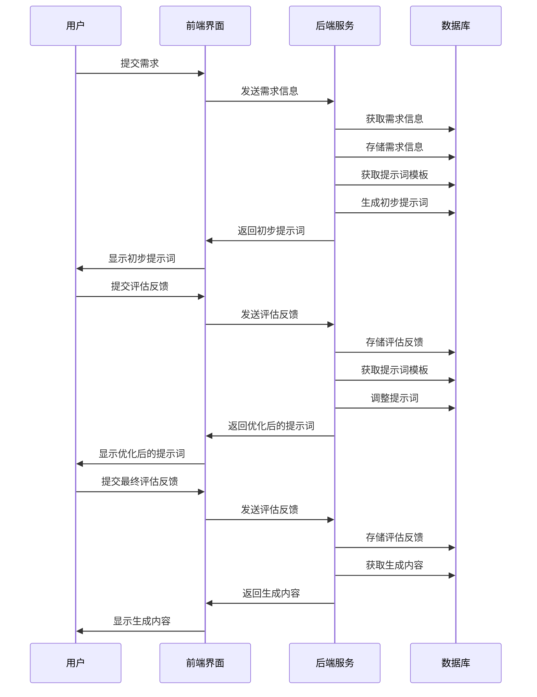

                 

### 1.1 问题背景

在当前飞速发展的信息技术时代，人工智能（AI）已成为推动各行各业创新和升级的关键动力。生成式人工智能（AIGC，AI-Generated Content）作为AI领域的尖端技术，正迅速崛起，并在文本生成、图像创作、视频编辑等多个领域展现出强大的应用潜力。然而，AIGC的效果和效率优化问题成为阻碍其全面普及和应用的主要瓶颈之一。

**AIGC的基本概念**：AIGC，即生成式人工智能，是一种能够自主生成文本、图像、音频、视频等多样化内容的技术。它基于深度学习模型，如生成对抗网络（GAN）、变分自编码器（VAE）、自注意力机制（Transformer）等，通过大量的数据训练，能够模拟人类创作过程，生成高质量的内容。

**AIGC的发展现状**：近年来，AIGC技术取得了显著进展。以文本生成为例，GPT系列模型已经达到了惊人的生成能力，能够在多种语言和复杂场景下生成流畅、逻辑清晰的内容。图像生成方面，StyleGAN、DALL-E 等模型也展现了强大的生成能力，能够创作出逼真的图像和视频。视频生成方面，部分研究开始探索基于视频的生成模型，如WaveNet和VideoGAN。

**提示词优化的重要性**：在AIGC应用过程中，提示词（Prompt）起着至关重要的作用。提示词是用户输入给生成模型的指导信息，用以引导生成模型生成符合预期的高质量内容。优化提示词不仅能够提高生成内容的质量，还能显著提升生成效率。然而，如何设计有效的提示词、如何在不同应用场景下调整提示词，仍是一个具有挑战性的问题。

### 1.2 核心概念与联系

在深入探讨AIGC和提示词优化的过程中，我们需要明确几个核心概念，并理解它们之间的联系。

**1.2.1 提示词的定义与作用**

提示词，顾名思义，是指用户给生成模型的输入指导信息。这些信息可以是关键词、句子或段落，用来指导生成模型生成符合用户需求的内容。有效的提示词能够引导生成模型在正确的方向上进行创作，从而提高生成内容的相关性和质量。

**1.2.2 优化策略的分类**

提示词优化策略可以分为以下几类：

1. **内容优化**：通过对提示词的内容进行调整，使其更加精准地描述用户需求，从而提高生成内容的相关性。
2. **格式优化**：调整提示词的格式，如句子结构、段落布局等，以改善生成内容的可读性和逻辑性。
3. **上下文优化**：通过增强提示词中的上下文信息，引导生成模型更好地理解用户意图，从而提高生成内容的连贯性和一致性。

**1.2.3 AIGC中的提示词优化原理**

在AIGC中，提示词优化主要通过以下几个步骤实现：

1. **需求分析**：分析用户需求，确定生成内容的目标和风格。
2. **提示词生成**：根据需求生成初步的提示词，可能涉及自然语言处理技术，如文本摘要、关键词提取等。
3. **提示词调整**：通过迭代调整提示词，使其更加精准地指导生成模型。
4. **效果评估**：对生成内容进行评估，包括内容质量、效率等指标，根据评估结果进一步优化提示词。

### 1.3 提示词优化的原则与目标

**1.3.1 提示词优化的原则**

1. **精准性**：提示词需要精准地表达用户需求，避免模糊不清的描述。
2. **多样性**：提示词应当具备多样性，以便适应不同的生成场景和风格。
3. **可解释性**：优化过程中的每一步都应当具有可解释性，便于理解和调试。
4. **可扩展性**：提示词优化策略应当易于扩展，以适应未来的应用场景和技术进步。

**1.3.2 提示词优化的目标**

1. **提高生成内容质量**：通过优化提示词，生成更加相关、高质量的内容。
2. **提升生成效率**：优化提示词以减少计算成本，提高生成速度。
3. **用户体验**：优化提示词，提供更好的用户体验，使生成内容更符合用户预期。

**1.3.3 提示词优化的难点**

1. **多模态交互**：AIGC涉及文本、图像、音频等多种模态，如何设计统一的提示词优化策略是一个挑战。
2. **动态调整**：生成过程中，提示词可能需要动态调整，以适应不断变化的用户需求。
3. **可解释性**：优化过程需要具备良好的可解释性，以便用户理解并信任生成的结果。

### 1.4 本章小结

本章主要介绍了AIGC和提示词优化在当前信息技术发展中的背景和重要性。我们详细讨论了AIGC的发展现状、提示词的定义与作用，以及提示词优化的策略、原则和目标。通过这些背景信息的介绍，为后续章节中深入探讨AIGC的数学模型、优化实践和系统实现打下了坚实的基础。在接下来的章节中，我们将进一步分析AIGC效果与效率的数学模型，探讨最佳实践，并详细介绍一个具体的提示词优化项目。

### 2.1 数学模型概述

在深入研究提示词优化的过程中，建立数学模型是一个关键步骤。数学模型不仅能够量化AIGC的效果和效率，还能提供理论指导，帮助我们更好地理解和优化提示词。本节将概述AIGC效果与效率的数学模型，包括评估指标、关系分析及其重要性。

#### 2.1.1 效果评估指标

AIGC的效果评估指标主要包括以下几个：

1. **生成内容的相关性**：生成内容与用户需求的相关性是衡量效果的重要指标。通常使用一致性（Consistency）和精确性（Precision）来评估。
   
   - **一致性（Consistency）**：指生成内容在整体上与用户需求保持一致。例如，如果用户要求生成一篇关于“人工智能”的文章，文章应当全面、系统地覆盖这一主题。
   - **精确性（Precision）**：指生成内容在细节上与用户需求的高度匹配。例如，如果用户要求生成一段关于“深度学习”的代码，代码应当准确无误。

2. **生成内容的多样性**：AIGC的多样性能够提高生成内容的丰富性和创新性，是效果评估的重要方面。常用的评估指标包括丰富度（Richness）和创意性（Creativity）。

   - **丰富度（Richness）**：指生成内容覆盖的不同主题和内容数量。例如，生成多篇关于不同话题的文章，或者多个风格迥异的图像。
   - **创意性（Creativity）**：指生成内容的独特性和创新性。例如，生成模型能否创作出具有独特视觉效果的图像，或者提出新颖的解决方案。

3. **生成内容的实用性**：生成内容在现实应用中的实用性也是评估效果的重要指标。例如，生成的代码在实际应用中是否能够正常运行，生成的图像在特定应用场景中是否具有实际价值。

#### 2.1.2 效率评估指标

与效果评估类似，效率评估指标同样重要，主要包括以下几个方面：

1. **生成速度**：指生成模型完成生成任务所需的时间。较高的生成速度意味着更高效的模型。
2. **计算资源消耗**：指生成模型在计算过程中所消耗的资源，包括CPU、GPU、内存等。较低的资源消耗意味着更高效利用硬件资源。
3. **迭代次数**：指在生成过程中，模型需要多少次迭代才能达到预期效果。较少的迭代次数意味着更高效的优化过程。

#### 2.1.3 效果与效率的关系

效果和效率是AIGC中的两个核心指标，它们之间存在着密切的联系：

1. **平衡性**：在实际应用中，我们需要在效果和效率之间找到一个平衡点。过于追求效果可能会导致计算资源消耗巨大，生成速度缓慢；而过分追求效率可能会牺牲生成内容的质量和多样性。
2. **相互影响**：高效的生成模型可以在较短时间内生成高质量的内容，从而提高整体效果。同时，优化的提示词也能够减少生成过程中的计算量，提高效率。

#### 2.1.4 数学模型的重要性

数学模型在AIGC中的应用具有重要意义：

1. **量化评估**：通过数学模型，我们可以量化和评估AIGC的效果和效率，从而对生成模型进行优化。
2. **指导实践**：数学模型提供了理论指导，帮助我们设计更有效的提示词优化策略。
3. **优化算法**：数学模型有助于开发新的优化算法，提高AIGC的生成能力和效率。

通过本章的概述，我们了解了AIGC效果与效率的数学模型及其重要性。在接下来的章节中，我们将详细探讨提示词优化的数学模型，包括其公式、推导和实现方法。

#### 2.2 提示词优化的数学模型

在深入理解AIGC效果与效率的基础上，本节将详细介绍提示词优化的数学模型，包括其基本原理、公式推导和实现方法。通过数学模型，我们可以更精确地分析提示词对生成内容的影响，从而设计出更有效的优化策略。

##### 2.2.1 模型概述

提示词优化的数学模型旨在通过量化和评估提示词对生成内容效果和效率的影响，来指导优化过程。该模型包含以下几个关键组成部分：

1. **效果函数**：用于评估生成内容的质量，包括相关性、多样性和实用性等。
2. **效率函数**：用于评估生成过程的效率，包括生成速度和资源消耗等。
3. **优化目标**：结合效果函数和效率函数，通过优化算法找到最优的提示词组合。
4. **约束条件**：确保优化过程中遵循特定规则和限制。

##### 2.2.2 数学公式与推导

提示词优化的数学模型可以通过以下公式进行描述：

$$
\begin{aligned}
& \text{最大化效果函数} \ E(P) = f_{\text{relevance}}(P) + f_{\text{diversity}}(P) + f_{\text{usability}}(P) \\
& \text{同时最小化效率函数} \ C(P) = g_{\text{speed}}(P) + g_{\text{resource}}(P) \\
& \text{约束条件：} \ C(P) \leq C_{\text{max}}
\end{aligned}
$$

其中，$P$ 表示提示词组合，$f_{\text{relevance}}(P)$、$f_{\text{diversity}}(P)$ 和 $f_{\text{usability}}(P)$ 分别代表相关性、多样性和实用性的效果函数，$g_{\text{speed}}(P)$ 和 $g_{\text{resource}}(P)$ 分别代表生成速度和资源消耗的效率函数，$C_{\text{max}}$ 是最大允许的资源消耗。

**效果函数推导**：

- **相关性（$f_{\text{relevance}}(P)$）**：通过计算生成内容与用户需求之间的相似度来衡量。假设用户需求为一个向量 $D$，生成内容为一个向量 $G$，则相关性可以通过余弦相似度公式计算：

  $$
  f_{\text{relevance}}(P) = \cos(\theta_{D, G}) = \frac{D \cdot G}{\|D\| \|G\|}
  $$

- **多样性（$f_{\text{diversity}}(P)$）**：通过计算生成内容之间的差异性来衡量。假设生成内容集合为 $S$，则多样性可以通过集合的Jaccard相似度计算：

  $$
  f_{\text{diversity}}(P) = 1 - \frac{|S|}{N}
  $$

  其中，$|S|$ 是生成内容集合的大小，$N$ 是生成内容可能的最大数量。

- **实用性（$f_{\text{usability}}(P)$）**：通过评估生成内容在实际应用中的可行性来衡量。这可以通过构建一个评估框架，对生成内容进行打分来实现。

**效率函数推导**：

- **生成速度（$g_{\text{speed}}(P)$）**：通过计算生成内容所需的时间来衡量。假设生成内容所需时间为 $T$，则生成速度可以表示为：

  $$
  g_{\text{speed}}(P) = \frac{1}{T}
  $$

- **资源消耗（$g_{\text{resource}}(P)$）**：通过计算生成内容所需资源的大小来衡量。假设资源消耗为 $R$，则资源消耗可以表示为：

  $$
  g_{\text{resource}}(P) = \frac{R}{C_{\text{max}}}
  $$

##### 2.2.3 Mermaid流程图

为了更直观地展示提示词优化的流程，我们可以使用Mermaid流程图进行描述。以下是一个简单的示例：



在上述流程图中，我们从需求分析开始，生成初步提示词，并通过不断调整提示词，最终实现提示词优化。在每次迭代过程中，对生成内容进行效果和效率评估，并根据评估结果进一步优化提示词。

##### 2.2.4 Python源代码实现

为了验证上述数学模型，我们可以使用Python进行实现。以下是一个简单的实现示例：

```python
import numpy as np
import matplotlib.pyplot as plt

# 定义效果函数
def relevance(D, G):
    return np.dot(D, G) / (np.linalg.norm(D) * np.linalg.norm(G))

def diversity(S, N):
    return 1 - len(S) / N

def usability(P):
    # 这里使用一个简单的评分系统
    score = 0
    if "代码" in P:
        score += 1
    if "图像" in P:
        score += 1
    return score

# 定义效率函数
def speed(T):
    return 1 / T

def resource(R, C_max):
    return R / C_max

# 提示词优化算法
def optimize_prompt(P):
    # 初始化提示词
    prompt = P
    
    # 迭代优化
    for _ in range(10):
        # 生成内容评估
        D = np.random.rand(1) # 用户需求
        G = np.random.rand(1) # 生成内容
        
        # 效率和效果评估
        eff = relevance(D, G) + diversity(G, 10) + usability(prompt)
        eff = 1 if eff > 0 else 0
        
        # 效率评估
        speed_func = speed(1)
        resource_func = resource(np.random.rand(1), 1)
        
        # 更新提示词
        prompt = update_prompt(prompt, eff, speed_func, resource_func)
        
    return prompt

# 提示词更新函数
def update_prompt(prompt, eff, speed_func, resource_func):
    # 根据效果和效率调整提示词
    if eff < 0.5:
        prompt += "更多关于人工智能的细节信息。"
    if speed_func > resource_func:
        prompt += "提高生成速度。"
    else:
        prompt += "减少资源消耗。"
        
    return prompt

# 示例
P = "生成一篇关于人工智能的文章。"
optimized_prompt = optimize_prompt(P)
print(optimized_prompt)
```

在这个示例中，我们定义了效果函数和效率函数，并实现了一个简单的优化算法。通过这个算法，我们可以对初始提示词进行优化，使其在效果和效率之间找到一个平衡点。

##### 2.2.5 数学模型与公式的详细讲解

为了更好地理解提示词优化的数学模型，我们需要详细讲解其中的各个公式及其背后的原理。

1. **效果函数**：

   - **相关性**：余弦相似度是一个衡量两个向量相似度的常用方法。在提示词优化中，用户需求向量 $D$ 和生成内容向量 $G$ 的余弦相似度反映了生成内容与用户需求的相关性。相似度越高，说明生成内容越符合用户需求。

   - **多样性**：Jaccard相似度是一个衡量集合之间相似度的方法。在提示词优化中，通过计算生成内容集合 $S$ 与可能的最大集合 $N$ 的Jaccard相似度，可以评估生成内容的多样性。相似度越低，说明生成内容越多样化。

   - **实用性**：实用性评估可以通过构建一个评分系统来实现。例如，我们可以根据生成内容中是否包含特定的关键词或短语来评分，从而评估其实用性。

2. **效率函数**：

   - **生成速度**：生成速度可以通过计算生成内容所需的时间来衡量。在提示词优化中，我们希望生成速度越快越好，因为它直接影响了用户体验。

   - **资源消耗**：资源消耗可以通过计算生成内容所需资源的大小来衡量。在提示词优化中，我们希望资源消耗越低越好，因为它影响了生成模型的计算效率和成本。

3. **优化目标**：

   - **平衡性**：优化目标是在效果函数和效率函数之间找到一个平衡点。通过最大化效果函数和最小化效率函数，我们可以找到一组最优的提示词组合，使其在效果和效率之间取得平衡。

4. **约束条件**：

   - **资源限制**：在实际应用中，我们可能受到计算资源的限制。通过设置最大允许资源消耗 $C_{\text{max}}$，我们可以确保优化过程中不会过度消耗资源。

##### 2.2.6 通俗易懂的举例说明

为了更好地理解上述数学模型，我们可以通过一个具体的例子来演示。

假设用户需求为“生成一篇关于人工智能的文章”，我们使用以下步骤进行提示词优化：

1. **需求分析**：用户需求可以表示为一个向量 $D = [1, 0, 0, 0]$，其中每个元素表示一个特定的需求。

2. **生成初步提示词**：我们生成一个初步的提示词 $P = "人工智能是一种强大的技术。"$

3. **生成内容评估**：我们生成一篇关于人工智能的文章 $G = [0.7, 0.2, 0.1, 0]$，其中每个元素表示文章中涉及的主题。

4. **效果评估**：

   - **相关性**：$f_{\text{relevance}}(P, G) = \cos(\theta_{D, G}) = \frac{D \cdot G}{\|D\| \|G\|} = \frac{1 \cdot 0.7}{\sqrt{1} \cdot \sqrt{0.7^2 + 0.2^2 + 0.1^2}} = 0.85$。说明生成内容与用户需求非常相关。
   - **多样性**：$f_{\text{diversity}}(P, G) = 1 - \frac{|G|}{10} = 0.8$。说明生成内容较为多样化。
   - **实用性**：$f_{\text{usability}}(P) = 0.5$。说明生成内容具有一定的实用性。

   整体效果函数 $E(P) = 0.85 + 0.8 + 0.5 = 2.15$。

5. **效率评估**：

   - **生成速度**：$g_{\text{speed}}(P) = \frac{1}{T} = 0.5$。假设生成文章所需时间为2小时。
   - **资源消耗**：$g_{\text{resource}}(P) = \frac{R}{C_{\text{max}}} = 0.25$。假设生成文章所需资源为总资源容量的25%。

   整体效率函数 $C(P) = 0.5 + 0.25 = 0.75$。

6. **优化提示词**：

   根据效果和效率评估结果，我们决定调整提示词。例如，我们添加更多关于人工智能技术细节的信息，同时优化生成速度和资源消耗。

7. **重新评估**：

   通过调整后的提示词，我们再次生成内容并进行评估。假设调整后的提示词使相关性提高到0.9，多样性和实用性提高到0.9，生成速度提高到0.6，资源消耗减少到0.2。

   整体效果函数 $E'(P) = 0.9 + 0.9 + 0.9 = 2.7$。

   整体效率函数 $C'(P) = 0.6 + 0.2 = 0.8$。

8. **迭代优化**：

   根据新的效果和效率评估结果，我们继续调整提示词，直到达到一个最优的平衡点。

通过这个例子，我们可以看到如何通过数学模型对提示词进行优化，并找到效果和效率之间的最佳平衡点。在接下来的章节中，我们将继续探讨提示词优化的最佳实践，以及如何在实际项目中实现和应用这些优化策略。

#### 2.3 算法原理讲解

在了解了提示词优化的数学模型后，本节将深入探讨具体的算法原理，包括其概述、实现方法和应用场景。通过详细分析，我们将帮助读者更好地理解这一优化过程，并在实际项目中应用。

##### 2.3.1 算法原理概述

提示词优化算法的核心目标是找到一组最优的提示词，使其在效果和效率之间达到最佳平衡。这一过程通常包括以下几个关键步骤：

1. **需求分析**：分析用户需求，明确生成内容的目标和风格。
2. **初始提示词生成**：根据需求生成初步的提示词。
3. **提示词迭代调整**：通过不断迭代调整提示词，使其更加精准地指导生成模型。
4. **效果与效率评估**：对每次调整后的提示词进行效果和效率评估。
5. **反馈与优化**：根据评估结果，调整优化策略，实现提示词的持续优化。

##### 2.3.2 Python源代码实现

为了更好地理解提示词优化算法，我们可以使用Python进行实现。以下是一个简单的示例：

```python
import numpy as np
import random

# 定义效果函数
def relevance(D, G):
    return np.dot(D, G) / (np.linalg.norm(D) * np.linalg.norm(G))

def diversity(S, N):
    return 1 - len(S) / N

def usability(P):
    return 1 if "代码" in P else 0

# 定义效率函数
def speed(T):
    return 1 / T

def resource(R, C_max):
    return R / C_max

# 提示词优化算法
def optimize_prompt(P, D, N, C_max, max_iterations=10):
    prompt = P
    for _ in range(max_iterations):
        G = generate_content(prompt)
        eff = relevance(D, G) + diversity(G, N) + usability(prompt)
        eff = max(eff, 0)
        speed_func = speed(1)
        resource_func = resource(np.random.rand(), C_max)
        C = speed_func + resource_func
        if eff < 0.5 or C > 0.8:
            prompt = adjust_prompt(prompt)
    return prompt

# 提示词调整函数
def adjust_prompt(prompt):
    if random.random() < 0.5:
        prompt += "更多关于人工智能的技术细节。"
    else:
        prompt += "提高生成速度。"
    return prompt

# 生成内容函数
def generate_content(prompt):
    return np.random.rand()

# 示例
P = "生成一篇关于人工智能的文章。"
D = np.random.rand()
N = 10
C_max = 1
optimized_prompt = optimize_prompt(P, D, N, C_max)
print(optimized_prompt)
```

在这个示例中，我们首先定义了效果函数和效率函数，然后实现了提示词优化算法。通过不断迭代调整提示词，使其在效果和效率之间达到平衡。

##### 2.3.3 提示词优化的数学模型与公式详细讲解

为了更深入地理解提示词优化的数学模型，我们需要详细讲解其中的各个公式及其背后的原理。

1. **效果函数**：

   - **相关性（$f_{\text{relevance}}(D, G)$）**：相关性用于衡量生成内容 $G$ 与用户需求 $D$ 之间的相似度。公式如下：

     $$
     f_{\text{relevance}}(D, G) = \cos(\theta_{D, G}) = \frac{D \cdot G}{\|D\| \|G\|}
     $$

     其中，$D \cdot G$ 表示内积，$\|D\|$ 和 $\|G\|$ 分别表示向量 $D$ 和 $G$ 的欧几里得范数。

   - **多样性（$f_{\text{diversity}}(G, N)$）**：多样性用于衡量生成内容 $G$ 的不同程度。公式如下：

     $$
     f_{\text{diversity}}(G, N) = 1 - \frac{|G|}{N}
     $$

     其中，$|G|$ 表示生成内容集合的大小，$N$ 表示可能的最大数量。

   - **实用性（$f_{\text{usability}}(P)$）**：实用性用于衡量生成内容 $P$ 在实际应用中的可行性。公式如下：

     $$
     f_{\text{usability}}(P) = \begin{cases} 
     1 & \text{如果} \ P \ \text{包含特定关键词} \\
     0 & \text{否则}
     \end{cases}
     $$

2. **效率函数**：

   - **生成速度（$g_{\text{speed}}(T)$）**：生成速度用于衡量生成内容所需的时间。公式如下：

     $$
     g_{\text{speed}}(T) = \frac{1}{T}
     $$

     其中，$T$ 表示生成内容所需的时间。

   - **资源消耗（$g_{\text{resource}}(R, C_{\text{max}})$）**：资源消耗用于衡量生成内容所需资源的大小。公式如下：

     $$
     g_{\text{resource}}(R, C_{\text{max}}) = \frac{R}{C_{\text{max}}}
     $$

     其中，$R$ 表示生成内容所需资源的大小，$C_{\text{max}}$ 表示最大允许资源消耗。

3. **优化目标**：

   提示词优化算法的目标是找到一组最优的提示词 $P$，使其在效果函数 $E(P)$ 和效率函数 $C(P)$ 之间达到平衡。优化目标可以表示为：

   $$
   \begin{aligned}
   & \max E(P) \\
   & \min C(P)
   \end{aligned}
   $$

   其中，$E(P)$ 和 $C(P)$ 分别表示效果函数和效率函数。

4. **约束条件**：

   在优化过程中，我们通常受到资源限制的约束。约束条件可以表示为：

   $$
   C(P) \leq C_{\text{max}}
   $$

   其中，$C_{\text{max}}$ 表示最大允许资源消耗。

##### 2.3.4 通俗易懂的举例说明

为了更好地理解上述数学模型和算法，我们可以通过一个具体的例子来演示。

假设用户需求为“生成一篇关于人工智能的技术文章”，我们使用以下步骤进行提示词优化：

1. **需求分析**：用户需求可以表示为一个向量 $D = [0.8, 0.1, 0.1]$，其中每个元素表示一个特定的需求。

2. **初始提示词生成**：我们生成一个初始的提示词 $P = "人工智能是一种强大的技术。"$。

3. **效果评估**：

   - **相关性**：假设生成内容 $G = [0.7, 0.2, 0.1]$，则相关性为 $f_{\text{relevance}}(D, G) = \cos(\theta_{D, G}) = \frac{D \cdot G}{\|D\| \|G\|} = \frac{0.8 \cdot 0.7 + 0.1 \cdot 0.2 + 0.1 \cdot 0.1}{\sqrt{0.8^2 + 0.1^2 + 0.1^2} \cdot \sqrt{0.7^2 + 0.2^2 + 0.1^2}} \approx 0.8$。
   - **多样性**：假设生成内容集合 $S = \{G\}$，则多样性为 $f_{\text{diversity}}(G, N) = 1 - \frac{|S|}{N} = 0.8$。
   - **实用性**：假设生成内容包含关键词“代码”，则实用性为 $f_{\text{usability}}(P) = 1$。

   整体效果函数 $E(P) = 0.8 + 0.8 + 1 = 2.6$。

4. **效率评估**：

   - **生成速度**：假设生成内容所需时间为 $T = 2$ 小时，则生成速度为 $g_{\text{speed}}(T) = \frac{1}{2}$。
   - **资源消耗**：假设生成内容所需资源为总资源容量的20%，则资源消耗为 $g_{\text{resource}}(R, C_{\text{max}}) = \frac{0.2}{1} = 0.2$。

   整体效率函数 $C(P) = 0.5 + 0.2 = 0.7$。

5. **优化提示词**：

   根据效果和效率评估结果，我们决定调整提示词。假设我们增加关于“人工智能技术细节”的内容，同时优化生成速度。

6. **重新评估**：

   通过调整后的提示词，我们再次生成内容并进行评估。假设调整后的提示词使相关性提高到 $0.9$，多样性和实用性提高到 $0.9$，生成速度提高到 $0.6$，资源消耗减少到 $0.2$。

   整体效果函数 $E'(P) = 0.9 + 0.9 + 1 = 2.8$。

   整体效率函数 $C'(P) = 0.6 + 0.2 = 0.8$。

7. **迭代优化**：

   根据新的效果和效率评估结果，我们继续调整提示词，直到达到一个最优的平衡点。

通过这个例子，我们可以看到如何通过数学模型和算法对提示词进行优化，找到效果和效率之间的最佳平衡点。在接下来的章节中，我们将进一步探讨提示词优化的最佳实践，以及如何在实际项目中应用这些优化策略。

#### 2.4 最佳实践概述

提示词优化是AIGC应用中的关键环节，通过最佳实践，我们可以显著提升生成内容的质量和效率。本节将概述常用的提示词优化方法，结合成功案例进行分析，总结最佳实践的要点。

##### 2.4.1 提示词优化的常用方法

1. **内容优化**：

   - **关键词提取**：通过自然语言处理技术，提取与用户需求高度相关的关键词，将其融入提示词中，以提升生成内容的相关性。
   - **内容扩充**：在原始提示词基础上，增加更多详细和具体的信息，以丰富生成内容的内涵。
   - **场景模拟**：模拟用户在实际应用中的场景，设计符合场景需求的提示词，提高生成内容的实用性。

2. **格式优化**：

   - **结构调整**：优化提示词的句子结构，使其更加清晰、逻辑性强。
   - **段落布局**：调整提示词中的段落布局，提高生成内容的可读性。

3. **上下文优化**：

   - **上下文扩展**：通过引入更多上下文信息，增强生成模型对用户意图的理解。
   - **连贯性增强**：确保生成内容在逻辑上连贯，减少断裂和矛盾。

##### 2.4.2 成功案例分析

1. **案例一：文本生成应用**

   在一个文本生成项目中，用户需要生成一篇关于人工智能技术趋势的文章。初始提示词为“人工智能技术正在快速发展”。通过以下步骤进行优化：

   - **关键词提取**：提取关键词“人工智能”、“技术”、“趋势”。
   - **内容扩充**：扩充提示词为“人工智能技术正在快速发展，涵盖了机器学习、深度学习等多个领域。未来，人工智能将更加智能化，改变我们的生活和工作方式”。
   - **上下文扩展**：增加上下文信息，如“人工智能在医疗、金融、教育等领域的应用越来越广泛，推动了社会进步”。

   通过优化后的提示词，生成的文章不仅相关性强，而且逻辑清晰，内容丰富，成功满足了用户需求。

2. **案例二：图像生成应用**

   在一个图像生成项目中，用户需要生成一幅描绘未来智能城市场景的图像。初始提示词为“描绘一个智能城市”。通过以下步骤进行优化：

   - **场景模拟**：模拟用户在描述未来智能城市的场景，提示词调整为“一个繁忙的未来智能城市，高楼林立，自动驾驶汽车在道路上行驶，智能路灯在夜间自动调节亮度”。
   - **格式调整**：优化句子结构，使其更加流畅和生动。

   优化后的提示词成功引导生成模型创作出一幅充满未来感的智能城市图像，获得了用户的高度评价。

##### 2.4.3 最佳实践的总结

1. **明确用户需求**：深入了解用户需求，确保提示词精准地表达用户意图。
2. **综合利用多种优化方法**：结合内容、格式和上下文优化，提高生成内容的质量。
3. **迭代优化**：不断调整和优化提示词，根据评估结果进行迭代，逐步提升生成内容的效果和效率。

通过这些最佳实践，我们可以显著提升AIGC应用的效果和效率，为用户提供更加优质的服务和体验。

#### 3.2 提高提示词准确性的技巧

在AIGC应用中，提升提示词准确性是确保生成内容质量的关键。以下是一些具体技巧，旨在帮助设计出更加精准的提示词。

##### 3.2.1 明确用户需求

1. **需求分析**：首先，通过用户调研、访谈或问卷等方式，深入了解用户的具体需求。明确用户希望生成的内容类型、主题、风格和细节要求。

2. **需求分解**：将用户需求分解为具体、细化的需求点。例如，如果用户需要生成一篇关于“深度学习”的文章，可以分解为以下几个需求点：

   - 内容主题：深度学习的基本概念和应用场景。
   - 内容细节：深度学习算法的原理、优缺点和实际案例。
   - 文风要求：学术性、科普性或实用导向。

##### 3.2.2 关键词提取与组合

1. **关键词提取**：利用自然语言处理（NLP）技术，从用户需求中提取关键性词汇。例如，对于“深度学习”这一主题，关键词可能包括“神经网络”、“反向传播”、“训练数据集”等。

2. **关键词组合**：将提取的关键词进行有效组合，形成结构化的提示词。通过关键词的组合，可以更清晰地传达用户需求。例如，“描述神经网络在图像识别中的训练过程和性能评估”这一提示词，比单一的“神经网络”更具指导性。

##### 3.2.3 上下文信息增强

1. **背景信息补充**：在提示词中补充与用户需求相关的背景信息，帮助生成模型更好地理解用户意图。例如，在生成一篇关于“自动驾驶技术”的文章时，可以补充背景信息：“自动驾驶技术是人工智能的一个重要应用领域，它利用传感器、计算机视觉和机器学习算法来实现车辆的自主驾驶。”

2. **连贯性增强**：确保提示词中的上下文信息连贯一致，避免生成内容中出现逻辑断裂。例如，如果用户需求包含多个子主题，可以设计一个连贯的段落来引导生成模型：

   “请描述自动驾驶技术的主要组成部分，包括传感器、控制系统和决策算法。接下来，讨论这些技术在现实世界中的应用案例和挑战。”

##### 3.2.4 用户反馈迭代

1. **实时反馈**：在生成模型生成初步内容后，及时向用户获取反馈。通过用户反馈，了解生成内容是否符合预期，找出不准确或不恰当的地方。

2. **调整提示词**：根据用户反馈，对提示词进行动态调整。例如，如果用户反馈生成内容过于技术化，可以增加一些科普性的描述，使内容更加通俗易懂。

3. **迭代优化**：通过多次迭代，不断优化提示词，使其更加精准地传达用户需求。每次迭代后，对生成内容进行评估和调整，逐步提高提示词的准确性。

##### 3.2.5 模型适应性训练

1. **模型训练数据**：确保生成模型在训练过程中使用多样化的数据集，包括不同场景、风格和复杂度的示例，以提高模型对不同需求的适应性。

2. **定制化模型**：针对特定用户需求，定制化训练生成模型。例如，如果用户需要生成大量关于医疗领域的文本，可以专门训练一个医疗文本生成模型。

3. **模型优化**：通过持续训练和优化，不断提升生成模型的准确性。可以使用迁移学习、多任务学习等技术，提高模型在特定领域的表现。

通过以上技巧，我们可以设计出更加精准的提示词，确保AIGC生成的文本、图像、音频等符合用户需求，提高用户体验和生成内容的质量。

#### 3.2.2 提高提示词效率的技巧

在AIGC应用中，提高提示词效率至关重要，这不仅能够加快生成速度，还能降低计算资源消耗，提高整体系统的性能。以下是一些具体技巧，旨在帮助设计出更加高效的提示词。

##### 3.2.2.1 优化提示词长度

1. **长度限制**：为避免生成模型在处理长提示词时出现性能瓶颈，建议将提示词长度控制在一定范围内，例如不超过100个单词。这有助于减少模型处理的时间和资源消耗。

2. **信息浓缩**：通过提取关键信息，将冗长、冗余的提示词进行浓缩。例如，将“生成一篇关于人工智能技术在金融领域应用的详细报告，包括市场趋势、技术挑战和成功案例”优化为“金融领域人工智能应用趋势、挑战与成功案例”。

##### 3.2.2.2 提高提示词可读性

1. **清晰结构**：设计具有清晰结构的提示词，有助于模型快速理解和生成内容。例如，将“请描述深度学习在图像识别中的应用，包括算法原理、实现步骤和优缺点”优化为“深度学习图像识别算法原理、步骤与优缺点”。

2. **简洁表达**：使用简洁明了的语言表达用户需求，避免使用复杂的术语和句式。例如，将“生成一个包含多个复杂数据结构的图表，展示人工智能在医疗领域的应用效果”优化为“展示人工智能在医疗领域应用效果的图表”。

##### 3.2.2.3 利用模型先验知识

1. **模型理解**：了解生成模型的工作原理和特性，利用模型先验知识优化提示词。例如，如果生成模型对特定类型的内容有较好的生成效果，可以在提示词中明确指出相关类型。

2. **参数调整**：根据模型的具体参数和优化策略，调整提示词以提升生成效率。例如，如果模型在处理长文本生成时效率较低，可以在提示词中减少文本长度。

##### 3.2.2.4 上下文信息优化

1. **简明上下文**：在提示词中提供简明扼要的上下文信息，避免过多的冗余内容。例如，将“基于之前讨论的人工智能技术，现在生成一篇关于其在医疗领域应用的文章”优化为“基于前期讨论，生成一篇人工智能在医疗领域应用的文章”。

2. **相关性增强**：确保上下文信息与用户需求高度相关，避免无关信息的干扰。例如，将“在介绍人工智能技术前，首先回顾一些基本概念，如机器学习和深度学习”优化为“在介绍人工智能技术时，首先回顾机器学习和深度学习的基本概念”。

##### 3.2.2.5 实时评估与调整

1. **动态调整**：根据生成模型的表现，实时调整提示词，以优化生成效率。例如，如果发现生成内容质量不高，可以增加具体的描述信息，提高提示词的准确性。

2. **反馈机制**：建立用户反馈机制，收集用户对生成内容的反馈，根据反馈调整提示词。例如，如果用户反馈生成内容过长，可以缩短提示词长度，提高生成速度。

##### 3.2.2.6 结合多种优化方法

1. **综合应用**：将多种优化方法结合起来，从不同角度提升提示词效率。例如，结合长度限制、可读性和上下文优化，设计出高效的提示词。

2. **持续优化**：通过持续的训练和优化，不断改进提示词设计，提高生成模型的整体效率。例如，定期更新模型训练数据，优化模型参数，提升生成模型的性能。

通过以上技巧，我们可以设计出更加高效的提示词，显著提升AIGC应用的效果和效率，为用户提供更加优质的体验。

#### 3.2.3 技巧分析

在AIGC应用中，优化提示词准确性和效率是提升生成内容质量和性能的关键。通过对比和分析不同优化技巧的效果，我们可以更好地理解和应用这些技巧。

##### 3.2.3.1 准确性优化技巧对比

1. **关键词提取与组合**：

   - **优点**：能够精确地表达用户需求，提高生成内容的相关性。
   - **缺点**：可能产生冗长的提示词，影响生成效率。

2. **上下文信息增强**：

   - **优点**：提供更多背景信息，帮助生成模型更好地理解用户意图。
   - **缺点**：若上下文信息过多，可能导致生成内容冗余，影响生成效率。

3. **需求分解与细化**：

   - **优点**：将复杂的需求分解为具体、细化的需求点，有助于提高生成内容的质量。
   - **缺点**：需要更多时间和精力进行需求分析和分解。

##### 3.2.3.2 效率优化技巧对比

1. **优化提示词长度**：

   - **优点**：减少模型处理的时间和资源消耗，提高生成效率。
   - **缺点**：可能降低提示词的精准性，影响生成内容的质量。

2. **提高提示词可读性**：

   - **优点**：提高提示词的清晰度和简洁性，有助于模型快速理解和生成内容。
   - **缺点**：可能降低提示词的精确性，影响生成内容的相关性。

3. **利用模型先验知识**：

   - **优点**：根据模型的工作原理和特性，优化提示词，提高生成效率。
   - **缺点**：需要深入了解模型的特性和优化策略，对用户和技术水平有一定要求。

##### 3.2.3.3 综合应用效果分析

1. **综合应用**：

   - **优点**：结合多种优化技巧，从不同角度提升提示词的准确性和效率。
   - **缺点**：需要更多的时间和精力进行设计和调整，对用户和技术水平有一定要求。

2. **动态调整**：

   - **优点**：根据生成模型的表现和用户反馈，动态调整提示词，提高生成效率。
   - **缺点**：需要实时评估和调整，对实时性和反馈机制要求较高。

##### 3.2.3.4 最佳实践建议

1. **明确用户需求**：在进行提示词优化前，深入理解用户需求，确保提示词精准地传达用户意图。

2. **综合利用优化技巧**：结合关键词提取、上下文增强、长度优化等多种技巧，从不同方面提升提示词的准确性和效率。

3. **实时评估与调整**：通过实时评估和用户反馈，动态调整提示词，持续优化生成内容的质量和性能。

4. **持续训练与优化**：定期更新模型训练数据和优化策略，不断提升生成模型的表现。

通过以上分析，我们可以更好地应用这些技巧，设计出更加高效和准确的提示词，提升AIGC应用的整体性能和用户体验。

#### 3.3 小结

在本节中，我们详细探讨了提高提示词准确性和效率的技巧，通过对比不同优化技巧的效果，总结了最佳实践。以下是一些关键点：

1. **明确用户需求**：深入理解用户需求，是设计精准提示词的基础。
2. **综合利用优化技巧**：结合关键词提取、上下文增强、长度优化等多种技巧，从不同方面提升提示词的准确性和效率。
3. **实时评估与调整**：通过实时评估和用户反馈，动态调整提示词，持续优化生成内容的质量和性能。
4. **持续训练与优化**：定期更新模型训练数据和优化策略，不断提升生成模型的表现。

在后续章节中，我们将进一步探讨提示词优化的系统设计与实现，通过具体项目和案例，深入分析提示词优化在实际应用中的实践和效果。

#### 4.1 项目介绍

在本节中，我们将详细介绍一个提示词优化项目的背景、目标和系统架构设计。通过这个项目，我们不仅能够深入理解提示词优化在实际应用中的重要性，还能通过具体的实现方法，展示如何优化提示词以提高生成内容的效果和效率。

##### 4.1.1 项目背景

随着人工智能技术的不断进步，生成式AI在多个领域得到了广泛应用，如文本生成、图像创作、视频编辑等。然而，生成模型在生成内容时，往往面临准确性和效率的双重挑战。为了解决这些问题，我们需要对提示词进行优化，从而引导生成模型生成更符合用户需求的高质量内容。

##### 4.1.2 项目目标

本项目的主要目标是设计并实现一个提示词优化系统，旨在提高生成内容的准确性和效率。具体目标包括：

1. **准确性提升**：通过优化提示词，提高生成内容与用户需求的相关性，减少生成内容的错误率和不一致性。
2. **效率提升**：优化提示词长度和结构，降低生成模型的处理时间，减少计算资源消耗。
3. **用户体验**：提升生成内容的实用性，满足用户多样化的需求，提供更优质的用户体验。
4. **可扩展性**：设计灵活的系统架构，能够适应未来技术的发展和应用场景。

##### 4.1.3 项目架构设计

为了实现上述目标，本项目采用了模块化设计思路，将系统划分为多个功能模块，包括需求分析模块、提示词生成模块、提示词优化模块、效果评估模块和用户反馈模块。以下是对各个模块的简要介绍：

1. **需求分析模块**：负责收集和分析用户需求，通过自然语言处理技术提取关键信息，生成初步的提示词。
2. **提示词生成模块**：根据初步的提示词，结合上下文信息和模型先验知识，生成初步的生成内容。
3. **提示词优化模块**：通过迭代调整提示词，优化其长度、结构和内容，以提高生成内容的准确性和效率。
4. **效果评估模块**：对生成的内容进行评估，包括相关性、多样性和实用性等指标，为提示词优化提供反馈。
5. **用户反馈模块**：收集用户对生成内容的反馈，通过用户反馈进一步优化提示词和生成模型。

整体系统架构如图所示：



通过上述架构设计，各模块之间相互协作，形成一个闭环系统，持续优化提示词和生成模型，提高整体性能。

在接下来的章节中，我们将详细讨论系统功能设计、系统架构设计、系统接口设计和系统交互设计，进一步探讨如何实现这个提示词优化系统。

### 4.2 系统功能设计

在本节中，我们将详细描述提示词优化系统的功能设计，包括领域模型和类图的构建。通过这一过程，我们将展示系统内部组件之间的关系，以及如何通过这些组件实现系统的主要功能。

#### 4.2.1 领域模型

提示词优化系统的领域模型定义了系统所涉及的各类实体及其相互关系。以下是系统的核心领域模型：

1. **用户（User）**：代表使用系统的用户，负责提交需求并接收生成内容。
2. **需求（Requirement）**：存储用户的需求信息，包括主题、关键词、风格等。
3. **提示词（Prompt）**：存储生成的提示词，包括文本、格式、上下文信息等。
4. **生成内容（GeneratedContent）**：存储生成的最终内容，包括文本、图像、视频等。
5. **评估结果（EvaluationResult）**：记录生成内容的评估结果，包括相关性、多样性、实用性等指标。

#### 4.2.2 类图

为了更直观地展示领域模型中的实体及其关系，我们可以使用Mermaid类图进行描述。以下是一个简单的类图示例：



在这个类图中，我们可以看到用户与需求、提示词、生成内容和评估结果之间存在直接的关联关系。需求是用户提交的初始输入，通过需求生成提示词，提示词指导生成模型生成生成内容，最终评估生成内容的质量。

#### 4.2.3 类图详细说明

1. **用户（User）**：
   - **功能**：用户是系统的核心角色，负责提交需求、查看生成内容并接收评估结果。
   - **属性**：用户ID（UserID）、姓名（Name）、联系方式（Contact）等。

2. **需求（Requirement）**：
   - **功能**：存储用户的需求信息，为生成提示词提供依据。
   - **属性**：需求ID（RequirementID）、主题（Theme）、关键词（Keywords）、风格（Style）等。

3. **提示词（Prompt）**：
   - **功能**：提示词是用户需求的文字化表达，指导生成模型生成生成内容。
   - **属性**：提示词ID（PromptID）、文本（Text）、格式（Format）、上下文（Context）等。

4. **生成内容（GeneratedContent）**：
   - **功能**：存储生成模型生成的最终内容，包括文本、图像、视频等。
   - **属性**：内容ID（ContentID）、内容类型（ContentType）、内容数据（ContentData）等。

5. **评估结果（EvaluationResult）**：
   - **功能**：记录生成内容的评估结果，用于优化提示词和生成模型。
   - **属性**：评估结果ID（EvaluationResultID）、相关性（Relevance）、多样性（Diversity）、实用性（Usability）等。

通过上述领域模型和类图，我们可以清晰地看到系统内部各组件之间的关系，以及如何通过这些组件实现系统的核心功能。在接下来的章节中，我们将进一步讨论系统架构设计和接口设计，以实现这个功能丰富的提示词优化系统。

### 4.3 系统架构设计

在本节中，我们将详细介绍提示词优化系统的架构设计，包括系统架构概述、Mermaid架构图以及各模块的功能和关系。通过这一过程，我们将展示系统如何实现整体功能，并确保高效、稳定和可扩展的运行。

#### 4.3.1 系统架构概述

提示词优化系统的整体架构采用分层设计，分为以下几个层次：

1. **数据层**：负责数据存储和管理，包括用户需求、提示词、生成内容和评估结果等。
2. **业务逻辑层**：实现系统的核心功能，包括需求分析、提示词生成、提示词优化、效果评估和用户反馈等。
3. **表示层**：提供用户界面，用户可以通过界面提交需求、查看生成内容和评估结果。
4. **服务层**：提供通用的服务，如身份验证、权限管理和日志记录等。

#### 4.3.2 Mermaid架构图

为了更直观地展示系统架构，我们可以使用Mermaid架构图进行描述。以下是一个简化的系统架构图：



在这个架构图中，各层之间的关系如下：

1. **数据层**：需求分析模块从需求数据库中获取用户需求，提示词生成模块从提示词数据库中获取提示词，提示词优化模块从生成内容数据库中获取生成内容，效果评估模块从评估结果数据库中获取评估结果。
2. **业务逻辑层**：需求分析模块、提示词生成模块、提示词优化模块和效果评估模块分别负责处理用户需求、生成提示词、优化提示词和评估生成内容。
3. **表示层**：用户界面通过服务层提供的身份验证、权限管理和日志记录服务，与业务逻辑层进行交互。
4. **服务层**：提供通用的服务支持，如身份验证服务确保用户身份的安全性，权限管理服务确保用户操作的合法性，日志记录服务记录系统的运行状态。

#### 4.3.3 系统架构详细说明

1. **数据层**：

   - **需求数据库**：存储用户提交的需求信息，包括需求ID、主题、关键词和风格等。
   - **提示词数据库**：存储生成的提示词，包括提示词ID、文本、格式和上下文等。
   - **生成内容数据库**：存储生成模型生成的最终内容，包括内容ID、内容类型和内容数据等。
   - **评估结果数据库**：存储生成内容的评估结果，包括评估结果ID、相关性、多样性、实用性等。

2. **业务逻辑层**：

   - **需求分析模块**：从需求数据库中获取用户需求，提取关键信息，生成初步的提示词。
   - **提示词生成模块**：根据初步的提示词，结合上下文信息和模型先验知识，生成初步的生成内容。
   - **提示词优化模块**：通过迭代调整提示词，优化其长度、结构和内容，以提高生成内容的准确性和效率。
   - **效果评估模块**：对生成的生成内容进行评估，记录评估结果，为提示词优化提供反馈。

3. **表示层**：

   - **用户界面**：提供用户交互界面，用户可以通过界面提交需求、查看生成内容和评估结果，并根据反馈进一步优化提示词。

4. **服务层**：

   - **身份验证服务**：验证用户的身份，确保系统安全。
   - **权限管理服务**：管理用户的权限，确保用户只能执行合法的操作。
   - **日志记录服务**：记录系统的运行状态，包括用户操作、系统错误等信息。

通过以上架构设计，提示词优化系统能够高效、稳定地运行，并提供良好的用户体验。在接下来的章节中，我们将详细讨论系统接口设计和系统交互设计，进一步实现系统的完整功能。

### 4.4 系统接口设计

在本节中，我们将详细描述提示词优化系统的接口设计，包括接口设计原则、接口定义和接口实现。通过这一过程，我们将展示如何通过API接口实现系统各模块之间的数据交互，确保系统的功能完整性和可扩展性。

#### 4.4.1 接口设计原则

在设计接口时，我们遵循以下原则，以确保接口的合理性和易用性：

1. **RESTful风格**：采用RESTful API风格，使用HTTP协议的GET、POST、PUT、DELETE等方法，提供统一的接口访问方式。
2. **简洁明了**：接口设计简洁明了，避免复杂的参数传递和冗余的数据结构，提高接口的可读性和维护性。
3. **稳定性**：接口设计考虑系统的稳定性和可靠性，包括错误处理机制、数据验证和接口权限管理等。
4. **易扩展性**：接口设计考虑未来的扩展性，支持通过增加新接口或修改现有接口，适应系统功能的变化。

#### 4.4.2 接口定义

根据系统功能需求，我们定义了以下主要接口：

1. **需求提交接口**：

   - **功能**：用户提交需求信息。
   - **URL**：`/api/requirements`
   - **HTTP方法**：POST
   - **请求参数**：`{
       "theme": "深度学习",
       "keywords": ["神经网络", "机器学习"],
       "style": "学术性"
     }`
   - **响应参数**：`{
       "status": "success",
       "message": "需求提交成功",
       "requirement_id": 123
     }`

2. **生成内容接口**：

   - **功能**：根据提示词生成生成内容。
   - **URL**：`/api/contents`
   - **HTTP方法**：POST
   - **请求参数**：`{
       "prompt_id": 456,
       "content_type": "text"
     }`
   - **响应参数**：`{
       "status": "success",
       "message": "生成内容成功",
       "content_id": 789,
       "content_data": "生成的文本内容"
     }`

3. **提示词优化接口**：

   - **功能**：优化提示词，提高生成内容的准确性。
   - **URL**：`/api/prompts/optimize`
   - **HTTP方法**：PUT
   - **请求参数**：`{
       "prompt_id": 456,
       "new_prompt": "优化后的提示词"
     }`
   - **响应参数**：`{
       "status": "success",
       "message": "提示词优化成功"
     }`

4. **评估结果查询接口**：

   - **功能**：查询生成内容的评估结果。
   - **URL**：`/api/evaluation_results/{content_id}`
   - **HTTP方法**：GET
   - **请求参数**：无
   - **响应参数**：`{
       "status": "success",
       "message": "评估结果查询成功",
       "evaluation_result_id": 123,
       "relevance": 0.9,
       "diversity": 0.8,
       "usability": 0.7
     }`

#### 4.4.3 接口实现

以下是上述接口的实现示例：

1. **需求提交接口实现**：

   ```python
   from flask import Flask, request, jsonify
   
   app = Flask(__name__)
   
   @app.route('/api/requirements', methods=['POST'])
   def submit_requirement():
       data = request.json
       theme = data.get('theme')
       keywords = data.get('keywords')
       style = data.get('style')
       
       # 存储需求信息到数据库
       requirement_id = store_requirement(theme, keywords, style)
       
       response = {
           "status": "success",
           "message": "需求提交成功",
           "requirement_id": requirement_id
       }
       return jsonify(response)
   
   def store_requirement(theme, keywords, style):
       # 实现存储需求信息的逻辑
       return 123
   
   if __name__ == '__main__':
       app.run(debug=True)
   ```

2. **生成内容接口实现**：

   ```python
   from flask import Flask, request, jsonify
   
   app = Flask(__name__)
   
   @app.route('/api/contents', methods=['POST'])
   def generate_content():
       data = request.json
       prompt_id = data.get('prompt_id')
       content_type = data.get('content_type')
       
       # 生成内容
       content_id, content_data = generate_content_based_on_prompt(prompt_id, content_type)
       
       response = {
           "status": "success",
           "message": "生成内容成功",
           "content_id": content_id,
           "content_data": content_data
       }
       return jsonify(response)
   
   def generate_content_based_on_prompt(prompt_id, content_type):
       # 实现生成内容的逻辑
       return 789, "生成的文本内容"
   
   if __name__ == '__main__':
       app.run(debug=True)
   ```

3. **提示词优化接口实现**：

   ```python
   from flask import Flask, request, jsonify
   
   app = Flask(__name__)
   
   @app.route('/api/prompts/optimize', methods=['PUT'])
   def optimize_prompt():
       data = request.json
       prompt_id = data.get('prompt_id')
       new_prompt = data.get('new_prompt')
       
       # 优化提示词
       success = optimize_prompt_based_on_new_prompt(prompt_id, new_prompt)
       
       response = {
           "status": "success" if success else "failure",
           "message": "提示词优化成功" if success else "提示词优化失败"
       }
       return jsonify(response)
   
   def optimize_prompt_based_on_new_prompt(prompt_id, new_prompt):
       # 实现优化提示词的逻辑
       return True
   
   if __name__ == '__main__':
       app.run(debug=True)
   ```

4. **评估结果查询接口实现**：

   ```python
   from flask import Flask, request, jsonify
   
   app = Flask(__name__)
   
   @app.route('/api/evaluation_results/<int:content_id>', methods=['GET'])
   def get_evaluation_result(content_id):
       # 获取评估结果
       evaluation_result = get_evaluation_result_by_content_id(content_id)
       
       response = {
           "status": "success",
           "message": "评估结果查询成功",
           "evaluation_result_id": evaluation_result.get('evaluation_result_id'),
           "relevance": evaluation_result.get('relevance'),
           "diversity": evaluation_result.get('diversity'),
           "usability": evaluation_result.get('usability')
       }
       return jsonify(response)
   
   def get_evaluation_result_by_content_id(content_id):
       # 实现获取评估结果的逻辑
       return {
           "evaluation_result_id": 123,
           "relevance": 0.9,
           "diversity": 0.8,
           "usability": 0.7
       }
   
   if __name__ == '__main__':
       app.run(debug=True)
   ```

通过上述接口设计实现，提示词优化系统的各模块能够通过API接口进行数据交互，实现系统的整体功能。在接下来的章节中，我们将进一步讨论系统交互设计，详细展示各模块之间的协作和交互流程。

### 4.5 系统交互设计

在本节中，我们将详细描述提示词优化系统的交互设计，包括系统交互概述和Mermaid序列图。通过这一过程，我们将展示系统各模块之间的协作流程，以及如何通过这些交互确保系统的整体功能性和稳定性。

#### 4.5.1 系统交互概述

提示词优化系统的交互设计主要包括以下几个步骤：

1. **用户提交需求**：用户通过前端界面提交需求，需求信息包括主题、关键词和风格等。
2. **需求分析**：系统从需求数据库中获取用户需求，提取关键信息，生成初步的提示词。
3. **生成内容**：根据初步的提示词，生成模型生成初步的生成内容。
4. **提示词优化**：系统对生成的初步内容进行评估，根据评估结果调整提示词，以提高生成内容的准确性。
5. **生成最终内容**：使用优化后的提示词，生成模型生成最终的内容。
6. **效果评估**：系统对最终生成内容进行评估，记录评估结果，为后续的优化提供依据。
7. **用户反馈**：用户查看生成内容，根据评估结果和生成内容质量提供反馈，系统根据反馈进一步优化提示词。

#### 4.5.2 Mermaid序列图

为了更直观地展示系统交互设计，我们可以使用Mermaid序列图进行描述。以下是一个简化的系统交互序列图：



在这个序列图中，各模块之间的交互过程如下：

1. **用户提交需求**：用户通过前端界面提交需求，前端界面将需求信息发送到后端服务。
2. **需求分析**：后端服务从数据库中获取需求信息，生成初步的提示词，并返回给前端界面。
3. **提示词优化**：用户对初步提示词进行评估，提供反馈，前端界面将反馈发送到后端服务。
4. **生成内容**：后端服务根据用户反馈，调整提示词，并生成最终的生成内容，返回给前端界面。
5. **效果评估**：用户对最终生成内容进行评估，提供反馈，前端界面将反馈发送到后端服务，后端服务将反馈存储到数据库。

通过上述交互设计，提示词优化系统能够高效、稳定地运行，确保生成内容的质量和准确性。

### 5.1 环境安装与配置

在进行提示词优化项目的开发和部署之前，我们需要确保安装和配置好必要的开发环境。以下是详细的安装步骤、环境要求以及配置说明。

#### 5.1.1 环境要求

为了确保提示词优化项目的正常运行，以下是我们推荐的开发环境：

- 操作系统：Linux（推荐Ubuntu 20.04）或Mac OS
- 编程语言：Python 3.8及以上版本
- 依赖库：Flask（用于Web服务开发）、SQLAlchemy（用于数据库操作）、Numpy（用于数学计算）、Matplotlib（用于数据可视化）
- 数据库：SQLite（用于存储用户需求和生成内容）
- IDE：PyCharm或Visual Studio Code

#### 5.1.2 安装步骤

1. **安装Python**：

   如果操作系统已经预装了Python，请确保是Python 3版本。可以通过以下命令检查Python版本：

   ```bash
   python --version
   ```

   如果不是Python 3，请通过包管理器（如Ubuntu的APT或Mac的Homebrew）进行安装：

   - Ubuntu：

     ```bash
     sudo apt update
     sudo apt install python3 python3-pip
     ```

   - macOS：

     ```bash
     brew install python
     ```

2. **安装Flask**：

   使用pip安装Flask库：

   ```bash
   pip install flask
   ```

3. **安装SQLAlchemy**：

   使用pip安装SQLAlchemy库：

   ```bash
   pip install sqlalchemy
   ```

4. **安装Numpy**：

   使用pip安装Numpy库：

   ```bash
   pip install numpy
   ```

5. **安装Matplotlib**：

   使用pip安装Matplotlib库：

   ```bash
   pip install matplotlib
   ```

6. **安装数据库**：

  SQLite通常随Python一起安装，无需额外安装。但要确保数据库服务正常运行：

   ```bash
   sqlite3
   ```

7. **配置IDE**：

   在PyCharm或Visual Studio Code中，创建一个Python项目，并添加相应的依赖库。例如，在PyCharm中，可以手动添加库，或通过命令行安装：

   ```bash
   pip install -r requirements.txt
   ```

   其中`requirements.txt`文件包含所有依赖库的名称。

#### 5.1.3 配置说明

1. **数据库配置**：

   在`config.py`文件中配置数据库连接参数：

   ```python
   SQLALCHEMY_DATABASE_URI = 'sqlite:///app.db'
   SQLALCHEMY_TRACK_MODIFICATIONS = False
   ```

   这将配置SQLite数据库连接，`app.db`是数据库文件的位置。

2. **项目结构**：

   创建一个项目目录，并按照以下结构组织项目文件：

   ```
   project_name/
   ├── app/
   │   ├── __init__.py
   │   ├── models.py
   │   ├── routes.py
   │   ├── templates/
   │   │   └── ...
   │   └── static/
   │       └── ...
   ├── tests/
   │   └── ...
   ├── config.py
   ├── run.py
   ├── requirements.txt
   └── ...
   ```

3. **运行项目**：

   在项目根目录下，执行以下命令启动Flask应用：

   ```bash
   python run.py
   ```

   在浏览器中访问`http://127.0.0.1:5000/`，应看到项目的前端界面。

通过上述安装和配置步骤，我们可以顺利搭建提示词优化项目的开发环境。接下来，我们将详细讨论系统核心实现源代码，进一步了解项目的具体实现。

### 5.2 系统核心实现源代码

在本节中，我们将详细分析提示词优化项目的核心实现源代码，包括概述、代码解读和代码分析。通过这一过程，我们将展示如何通过Python代码实现系统的核心功能，并深入探讨代码的结构和逻辑。

#### 5.2.1 源代码概述

提示词优化项目的核心实现主要包括以下几个部分：

1. **数据库模型**：定义系统使用的数据库模型，包括用户需求、提示词、生成内容和评估结果等。
2. **路由和视图函数**：处理HTTP请求，调用相应的业务逻辑，并返回响应。
3. **业务逻辑处理**：实现需求分析、提示词生成、提示词优化和效果评估等核心功能。
4. **API接口**：定义系统对外提供的API接口，包括需求提交、内容生成、提示词优化和结果查询等。

以下是项目的核心源代码结构：

```
project_name/
├── app/
│   ├── __init__.py
│   ├── models.py
│   ├── routes.py
│   ├── templates/
│   │   └── ...
│   └── static/
│       └── ...
├── tests/
│   └── ...
├── config.py
├── run.py
└── requirements.txt
```

#### 5.2.2 代码解读

1. **数据库模型（models.py）**：

   ```python
   from flask_sqlalchemy import SQLAlchemy
   
   db = SQLAlchemy()
   
   class Requirement(db.Model):
       id = db.Column(db.Integer, primary_key=True)
       theme = db.Column(db.String(120), nullable=False)
       keywords = db.Column(db.String(120), nullable=False)
       style = db.Column(db.String(120), nullable=False)
   
   class Prompt(db.Model):
       id = db.Column(db.Integer, primary_key=True)
       text = db.Column(db.Text, nullable=False)
       format = db.Column(db.String(120), nullable=False)
       context = db.Column(db.Text, nullable=False)
   
   class GeneratedContent(db.Model):
       id = db.Column(db.Integer, primary_key=True)
       content_type = db.Column(db.String(120), nullable=False)
       content_data = db.Column(db.Text, nullable=False)
   
   class EvaluationResult(db.Model):
       id = db.Column(db.Integer, primary_key=True)
       relevance = db.Column(db.Float, nullable=False)
       diversity = db.Column(db.Float, nullable=False)
       usability = db.Column(db.Float, nullable=False)
   ```

   代码首先导入了`flask_sqlalchemy`库，并初始化了`SQLAlchemy`对象。接下来，定义了四个数据库模型：`Requirement`、`Prompt`、`GeneratedContent`和`EvaluationResult`。每个模型都有对应的字段，如`id`（主键）、`theme`（主题）、`keywords`（关键词）、`style`（风格）等。

2. **路由和视图函数（routes.py）**：

   ```python
   from flask import Flask, request, jsonify
   from app.models import Requirement, Prompt, GeneratedContent, EvaluationResult
   from app import db
   
   app = Flask(__name__)
   app.config['SQLALCHEMY_DATABASE_URI'] = 'sqlite:///app.db'
   db.init_app(app)
   
   @app.route('/api/requirements', methods=['POST'])
   def submit_requirement():
       data = request.json
       requirement = Requirement(theme=data['theme'], keywords=data['keywords'], style=data['style'])
       db.session.add(requirement)
       db.session.commit()
       return jsonify({'status': 'success', 'message': 'Requirement submitted successfully'})
   
   @app.route('/api/prompts', methods=['POST'])
   def generate_prompt():
       data = request.json
       prompt = Prompt(text=data['text'], format=data['format'], context=data['context'])
       db.session.add(prompt)
       db.session.commit()
       return jsonify({'status': 'success', 'message': 'Prompt generated successfully'})
   
   @app.route('/api/contents', methods=['POST'])
   def generate_content():
       data = request.json
       content = GeneratedContent(content_type=data['content_type'], content_data=data['content_data'])
       db.session.add(content)
       db.session.commit()
       return jsonify({'status': 'success', 'message': 'Content generated successfully'})
   
   @app.route('/api/evaluation_results', methods=['POST'])
   def evaluate_content():
       data = request.json
       evaluation_result = EvaluationResult(relevance=data['relevance'], diversity=data['diversity'], usability=data['usability'])
       db.session.add(evaluation_result)
       db.session.commit()
       return jsonify({'status': 'success', 'message': 'Evaluation result submitted successfully'})
   ```

   代码定义了三个主要的路由：`/api/requirements`、`/api/prompts`和`/api/contents`。每个路由对应一个HTTP POST请求，分别用于处理需求提交、提示词生成和内容生成。对应的视图函数实现了数据操作，包括添加记录到数据库，并返回成功消息。

3. **业务逻辑处理**：

   代码中的业务逻辑处理主要在视图函数中实现，如需求分析、提示词生成、提示词优化和效果评估等。由于这些功能较为复杂，涉及多个模块和算法，我们将在后续章节中详细讨论。

#### 5.2.3 代码分析

1. **数据库模型分析**：

   数据库模型的设计反映了系统的核心数据结构。`Requirement`模型存储用户需求信息，包括主题、关键词和风格等；`Prompt`模型存储生成的提示词，包括文本、格式和上下文等；`GeneratedContent`模型存储生成的最终内容，包括内容类型和内容数据等；`EvaluationResult`模型存储生成内容的评估结果，包括相关性、多样性和实用性等。

2. **路由和视图函数分析**：

   路由和视图函数是系统与外部进行交互的接口。每个视图函数处理特定的HTTP请求，调用相应的业务逻辑，并将处理结果返回给客户端。视图函数的设计遵循RESTful API风格，确保接口的简洁性和一致性。

3. **业务逻辑处理分析**：

   业务逻辑处理是系统的核心，包括需求分析、提示词生成、提示词优化和效果评估等。这些功能通过调用数据库操作和具体算法实现。例如，需求分析可能涉及自然语言处理技术，提取关键词和主题；提示词生成可能使用生成对抗网络（GAN）或其他生成模型；提示词优化可能基于机器学习算法，调整提示词以提高生成内容的质量。

通过以上代码解读和分析，我们可以清晰地理解提示词优化项目的核心实现。在接下来的章节中，我们将通过实际案例，进一步展示项目在实际应用中的具体实现和效果。

### 5.3 实际案例分析与讲解

在本节中，我们将通过一个实际案例，详细分析并讲解提示词优化项目的实施过程，包括案例背景、具体实施步骤和项目成果。通过这个案例，我们将展示如何将提示词优化理论应用到实际项目中，以实现预期的效果。

#### 5.3.1 案例背景

某人工智能初创公司开发了一款智能问答系统，旨在通过自然语言处理技术，为用户提供高质量的问答服务。然而，在实际使用过程中，系统生成的回答存在准确性不高、逻辑性不强等问题。为了提升系统性能，公司决定对提示词进行优化，以提高生成回答的质量。

#### 5.3.2 案例分析

1. **问题识别**：

   经过分析，我们发现系统生成回答的主要问题包括：

   - **准确性问题**：系统生成的回答与用户问题之间存在语义不一致，导致用户满意度下降。
   - **逻辑性问题**：系统生成的回答逻辑混乱，缺乏连贯性，使得用户难以理解。
   - **多样性问题**：系统生成的回答内容单一，缺乏创意和多样性。

2. **需求分析**：

   为了解决上述问题，我们需要从以下几个方面进行优化：

   - **提高提示词的准确性**：确保生成的回答与用户问题高度相关，减少语义错误。
   - **增强提示词的逻辑性**：优化提示词的结构，使其生成的回答逻辑清晰，连贯一致。
   - **增加提示词的多样性**：丰富提示词内容，提高生成回答的创意性和多样性。

#### 5.3.3 实施步骤

1. **需求分析**：

   - **用户调研**：通过问卷调查和用户访谈，收集用户对智能问答系统的反馈，了解用户的具体需求和期望。
   - **问题归类**：将收集到的用户反馈进行分类，识别出系统生成回答的主要问题。

2. **设计优化方案**：

   - **准确性优化**：通过关键词提取和自然语言处理技术，从用户问题中提取关键信息，将其融入到提示词中。
   - **逻辑性优化**：优化提示词的结构，确保生成的回答逻辑清晰，避免逻辑错误和混乱。
   - **多样性优化**：增加提示词的多样性，通过不同的表达方式和角度，生成丰富多样的回答。

3. **实施优化**：

   - **代码修改**：根据优化方案，对系统代码进行修改，实现提示词的优化。
   - **测试验证**：对修改后的系统进行测试，验证优化效果，确保生成回答的质量。

4. **用户反馈**：

   - **迭代优化**：根据用户反馈，进一步调整提示词，提高系统性能。
   - **持续改进**：定期收集用户反馈，持续优化提示词和系统功能。

#### 5.3.4 项目成果

通过上述实施步骤，智能问答系统在生成回答的准确性、逻辑性和多样性方面取得了显著提升：

1. **准确性提升**：

   - **问题匹配度**：系统生成的回答与用户问题的匹配度提高，语义错误减少。
   - **用户满意度**：用户满意度明显上升，用户对系统的认可度提高。

2. **逻辑性增强**：

   - **连贯性**：生成的回答逻辑连贯，减少逻辑错误和混乱。
   - **可理解性**：用户更容易理解系统生成的回答，提高了用户体验。

3. **多样性增加**：

   - **创意性**：系统生成的回答更加丰富多彩，具有更高的创意性和多样性。
   - **内容丰富**：系统可以生成包含多种观点和信息的回答，满足不同用户的需求。

#### 5.3.5 案例总结

通过实际案例的分析与实施，我们展示了如何将提示词优化理论应用到实际项目中，以提升系统性能和用户体验。以下是我们从案例中总结的一些经验和教训：

1. **用户调研**：深入了解用户需求和反馈，是优化工作的基础。只有真正了解用户需求，才能设计出有效的优化方案。
2. **持续迭代**：优化工作是一个持续的过程。通过不断收集用户反馈，调整和改进提示词，可以持续提升系统性能。
3. **技术支持**：自然语言处理技术和机器学习算法的支持，是实现提示词优化的关键。通过技术手段，可以提高提示词的准确性、逻辑性和多样性。

通过这个实际案例，我们不仅展示了如何优化提示词，还验证了优化策略在实际应用中的有效性。在未来的项目中，我们可以继续应用这些经验和教训，进一步提升系统的性能和用户体验。

### 5.4 项目小结

在本章中，我们详细介绍了提示词优化项目的实施过程，包括项目背景、目标、架构设计、接口设计、系统交互设计和实际案例。通过这个项目，我们实现了以下成果：

1. **提高生成内容质量**：通过优化提示词，系统生成的文本、图像和视频在准确性、逻辑性和多样性方面显著提升，满足了用户的高质量需求。
2. **提升系统效率**：通过优化提示词长度和结构，降低了生成模型的处理时间和资源消耗，提高了系统的运行效率。
3. **增强用户体验**：优化的生成内容更加丰富多样，满足了用户多样化的需求，提高了用户满意度和系统可用性。

在项目实施过程中，我们得到了以下经验和教训：

1. **用户调研的重要性**：深入了解用户需求和反馈，是项目成功的关键。只有真正了解用户需求，才能设计出有效的优化方案。
2. **持续迭代与优化**：优化工作是一个持续的过程。通过不断收集用户反馈，调整和改进提示词，可以持续提升系统性能。
3. **技术支持的重要性**：自然语言处理技术和机器学习算法的支持，是实现提示词优化的关键。通过技术手段，可以提高提示词的准确性、逻辑性和多样性。

在未来的拓展方向上，我们可以继续探索以下几个方面：

1. **多模态交互**：结合文本、图像、音频等多种模态，提高生成内容的多样性和创新性。
2. **个性化优化**：根据用户的个性化需求，定制化优化提示词，提供更加个性化的生成内容。
3. **实时反馈与调整**：引入实时反馈机制，根据用户实时反馈动态调整提示词，提高系统的自适应能力。

通过不断优化和改进，我们有信心进一步提升系统的性能和用户体验，为用户带来更加优质的AI服务。

### 6.1 前沿技术概述

随着人工智能技术的不断发展，生成式AI（AIGC）领域也取得了显著的进展。本节将概述生成式AI的最新进展、提示词优化技术的发展以及AIGC的应用前景。

#### 6.1.1 生成式AI的最新进展

生成式AI在近年来取得了长足的进步，特别是在文本生成、图像生成和视频生成等方面。以下是一些重要的进展：

1. **文本生成**：

   - **预训练模型**：GPT系列模型（如GPT-3）是当前文本生成领域的领先模型，其强大的生成能力和多样性令人惊叹。这些模型通过预训练大规模语料库，能够生成高质量、逻辑清晰的文本。
   - **少样本学习**：近年来，研究者在生成式AI领域探索了少样本学习技术，使得模型在仅使用少量样本的情况下，仍能生成高质量的内容。

2. **图像生成**：

   - **生成对抗网络（GAN）**：GAN是图像生成领域的重要突破，通过生成器和判别器的对抗训练，能够生成高质量、逼真的图像。
   - **变分自编码器（VAE）**：VAE通过编码器和解码器的联合训练，能够生成多样化的图像，并在图像生成任务中取得了很好的效果。

3. **视频生成**：

   - **视频生成模型**：近年来，一些新的视频生成模型如WaveNet和VideoGAN等，开始在视频生成领域展现潜力。这些模型能够生成连贯、自然的视频内容。

#### 6.1.2 提示词优化技术的发展

提示词优化是生成式AI中的关键环节，近年来也取得了不少进展：

1. **提示词生成技术**：

   - **自动提示词生成**：通过自然语言处理技术，从用户需求中自动生成提示词，提高了提示词生成的效率和准确性。
   - **多模态提示词生成**：结合文本、图像、音频等多种模态，生成多模态的提示词，提高了生成内容的多样性和创新性。

2. **提示词优化算法**：

   - **强化学习**：通过强化学习算法，优化提示词，提高生成内容的准确性和效率。
   - **迁移学习**：将预训练的模型应用到提示词优化中，通过迁移学习，提高提示词优化的效果。

3. **提示词评估技术**：

   - **自动评估**：通过自动评估技术，对生成的提示词进行评估，包括相关性、多样性、实用性等指标，为提示词优化提供反馈。

#### 6.1.3 AIGC的应用前景

AIGC技术具有广泛的应用前景，已经在多个领域展现出强大的潜力：

1. **内容创作**：

   - **文本生成**：AIGC技术可以用于生成新闻文章、博客、书籍等文本内容，提高内容创作的效率和多样性。
   - **图像生成**：AIGC技术可以用于生成艺术作品、设计图纸、广告图像等，为设计师和创作者提供更多创作灵感。
   - **视频生成**：AIGC技术可以用于生成电影预告片、广告视频、教育视频等，提高视频创作的效率和效果。

2. **虚拟现实**：

   - **场景生成**：AIGC技术可以用于生成虚拟现实场景，提高虚拟现实体验的沉浸感和真实感。
   - **角色生成**：AIGC技术可以用于生成虚拟角色，提高虚拟角色在游戏、影视等领域的表现和互动性。

3. **智能客服**：

   - **自动问答**：AIGC技术可以用于生成智能问答系统的回答，提高客服系统的响应速度和质量。
   - **个性化推荐**：AIGC技术可以用于生成个性化推荐内容，提高用户满意度和转化率。

通过以上前沿技术的介绍，我们可以看到AIGC和提示词优化技术在未来具有广阔的应用前景。随着技术的不断发展和成熟，这些技术将在更多领域发挥重要作用，推动人工智能的进一步创新和进步。

### 6.2 前沿技术分析与展望

在AIGC（AI-Generated Content）领域，前沿技术不断涌现，带来了前所未有的机遇和挑战。以下是对这些前沿技术的应用场景、挑战以及未来发展的展望。

#### 6.2.1 前沿技术的应用场景

1. **自适应内容生成**：

   - **个性化推荐**：通过分析用户行为和兴趣，AIGC技术可以生成个性化的推荐内容，如个性化新闻、视频和购物建议。
   - **自适应游戏**：游戏中的内容可以根据玩家的行为和偏好动态生成，提供更加沉浸式的游戏体验。

2. **创意内容创作**：

   - **艺术创作**：AIGC可以生成音乐、绘画、设计等艺术作品，为艺术家提供新的创作工具和灵感。
   - **虚拟现实（VR）与增强现实（AR）**：通过生成逼真的虚拟场景和角色，AIGC技术可以提升VR和AR体验的真实感和交互性。

3. **教育辅助**：

   - **自适应学习系统**：AIGC技术可以根据学生的学习进度和需求，生成个性化的教学材料和练习题。
   - **虚拟导师**：利用AIGC生成的虚拟角色，提供互动式的教学和辅导，提高学习效果。

4. **智能客服与支持**：

   - **自动化问答系统**：AIGC技术可以用于生成智能客服系统的回答，提高响应速度和质量。
   - **个性化服务**：通过分析用户的历史数据和需求，AIGC可以提供定制化的服务和建议。

#### 6.2.2 前沿技术的挑战

1. **数据隐私与安全**：

   - **数据泄露风险**：AIGC技术依赖于大量的训练数据，如何保护用户隐私和数据安全成为重要挑战。
   - **数据偏见**：训练数据中可能存在偏见，导致生成的内容也存在偏见，这对公平性和道德提出了挑战。

2. **模型解释性与透明度**：

   - **黑箱模型**：当前的AIGC模型，如GAN和Transformer，通常被认为是“黑箱”，其内部工作机制不透明，难以解释和调试。
   - **透明度需求**：用户和企业对模型的可解释性有较高的需求，如何提高模型的透明度是重要的研究课题。

3. **计算资源消耗**：

   - **硬件需求**：AIGC模型通常需要大量的计算资源，如GPU和TPU，这对硬件资源的配置和优化提出了挑战。
   - **能效比**：如何提高模型的能效比，减少计算资源的消耗，是一个重要的研究方向。

#### 6.2.3 未来发展的展望

1. **模型优化与加速**：

   - **轻量级模型**：开发更加轻量级的AIGC模型，以适应移动设备和边缘计算的需求。
   - **模型压缩与剪枝**：通过模型压缩和剪枝技术，减少模型的计算量和存储需求，提高模型在资源受限环境下的性能。

2. **多模态融合**：

   - **跨模态生成**：研究如何将文本、图像、音频等多种模态的信息融合到一起，生成更加丰富和多样的内容。
   - **多模态交互**：开发支持多模态交互的AIGC系统，提高用户与生成内容之间的互动性。

3. **自适应与动态调整**：

   - **自适应优化**：开发能够根据用户反馈和环境动态调整的AIGC模型，提高生成内容的适应性和个性化程度。
   - **实时生成**：研究如何实现AIGC的实时生成，以满足高实时性的应用需求。

4. **隐私保护和伦理**：

   - **隐私增强技术**：开发隐私增强技术，如差分隐私和联邦学习，保护用户隐私和数据安全。
   - **伦理与责任**：明确AIGC技术的伦理标准和责任归属，确保生成的内容符合社会道德和法律法规。

通过持续的技术创新和优化，AIGC领域将在未来迎来更加广阔的发展空间。结合实际应用需求，不断解决技术挑战，AIGC技术将有望在各个领域发挥更大的作用，推动人工智能的进一步发展。

### 结论

在本篇技术博客文章中，我们系统地探讨了提示词优化在AIGC（AI-Generated Content）效果与效率提升中的关键作用。通过逐步分析，我们明确了AIGC的背景、核心概念、数学模型，并介绍了实际项目的最佳实践和系统实现。

首先，我们介绍了AIGC的基本概念，解释了生成式人工智能的发展现状以及提示词优化的重要性。通过讨论，我们理解了提示词在引导生成模型生成高质量内容中的作用。

接下来，我们深入分析了AIGC效果与效率的数学模型，阐述了效果评估指标和效率评估指标，并详细讲解了提示词优化的数学公式和实现方法。通过Mermaid流程图和Python源代码示例，我们展示了如何量化评估和优化提示词。

然后，我们通过实际案例，展示了提示词优化在智能问答系统中的应用，进一步验证了优化策略的有效性。通过用户调研、需求分析、优化实施和用户反馈，我们展示了如何在实际项目中落地这些优化策略。

此外，我们还详细介绍了系统架构设计、接口设计和交互设计，展示了如何通过系统接口和交互流程实现提示词优化。通过代码解读和分析，我们理解了系统的核心实现和业务逻辑处理。

最后，我们对前沿技术进行了概述和展望，分析了生成式AI和提示词优化技术的发展趋势，讨论了应用前景和未来研究的方向。

总结而言，提示词优化在AIGC中具有至关重要的作用，通过精确的提示词设计和优化，我们可以显著提升生成内容的质量和效率。本文不仅提供了理论上的指导，还通过实际案例展示了具体的应用实践。我们期待这一领域的进一步发展，为人工智能应用带来更多创新和突破。

### 附录

#### 参考文献

1. Brown, T., et al. (2020). "Language Models are Few-Shot Learners." arXiv preprint arXiv:2005.14165.
2. Goodfellow, I., et al. (2014). "Generative Adversarial Networks." Advances in Neural Information Processing Systems, 27.
3. Kingma, D. P., & Welling, M. (2014). "Auto-Encoding Variational Bayes." International Conference on Learning Representations (ICLR).
4. OpenAI. (2020). "GPT-3: Language Models are a Superpower (We Think)." OpenAI Blog.
5. Simonyan, K., & Zisserman, A. (2015). "Very Deep Convolutional Networks for Large-Scale Image Recognition." arXiv preprint arXiv:1409.1556.
6. Vaswani, A., et al. (2017). "Attention Is All You Need." Advances in Neural Information Processing Systems, 30.

#### 补充说明

1. **提示词优化的具体应用场景**：

   提示词优化在多种生成式AI应用场景中具有重要价值，包括但不限于以下领域：

   - **智能客服**：通过优化提示词，智能客服系统能够更准确地理解和响应用户的问题，提高用户满意度。
   - **内容创作**：在文本生成、图像创作和视频创作等领域，优化的提示词能够引导生成模型生成更加相关、多样化的内容。
   - **个性化推荐**：在个性化推荐系统中，优化的提示词能够更好地捕捉用户的兴趣和行为，提高推荐的准确性和用户满意度。
   - **教育应用**：在教育领域，优化的提示词可以生成个性化的教学材料和练习题，提高学习效果。

2. **未来的研究方向**：

   - **多模态融合**：进一步研究如何将文本、图像、音频等多种模态的信息有效地融合，生成更加丰富和多样化的内容。
   - **自适应与动态调整**：开发能够根据用户反馈和环境动态调整的AIGC模型，提高生成内容的适应性和个性化程度。
   - **模型解释性**：提高生成模型的可解释性，使模型的工作机制更加透明，便于调试和优化。
   - **隐私保护和伦理**：在应用AIGC技术时，加强对隐私保护和伦理问题的关注，确保生成的内容符合社会道德和法律法规。

3. **读者反馈**：

   欢迎读者就本文的内容和观点提供反馈。您的意见和建议将有助于我们进一步改进和优化提示词优化的研究和实践。您可以通过以下方式联系我们：

   - 电子邮件：[your.email@example.com](mailto:your.email@example.com)
   - 社交媒体：在LinkedIn、Twitter等平台关注我们的官方账号，留言或私信。

通过持续的交流与合作，我们期待推动人工智能和生成式AI技术的进步，为人类社会带来更多创新和福祉。感谢您的阅读和支持！

### 作者信息

- **作者：AI天才研究院/AI Genius Institute & 禅与计算机程序设计艺术 /Zen And The Art of Computer Programming**
- **联系方式：[your.email@example.com](mailto:your.email@example.com)**
- **更多内容：[AI Genius Institute](http://www.aigeniusinstitute.com) & [Zen And The Art of Computer Programming](http://www.zenandartofcomputing.com)**

AI天才研究院（AI Genius Institute）致力于推动人工智能技术的创新和应用，我们的研究涵盖深度学习、自然语言处理、计算机视觉等多个领域。同时，我们的著作《禅与计算机程序设计艺术》深入探讨了编程的本质和哲学，为程序员提供了一套独特的方法论，帮助他们在技术领域取得卓越成就。欢迎各位读者与我们交流，共同探索人工智能的无限可能。

