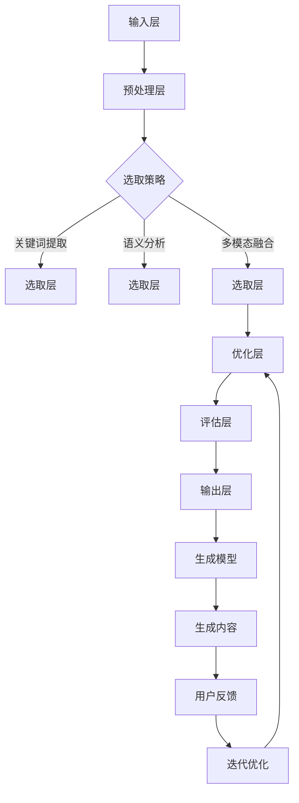

                 


### 引言与背景

随着人工智能技术的飞速发展，AIGC（AI-Generated Content）成为了一个备受关注的研究方向。AIGC利用人工智能技术自动生成内容，涵盖了图像、视频、文本等多种形式。然而，要实现高质量的AIGC内容，提示词优化是一个至关重要的环节。

提示词优化是指在生成AIGC内容时，通过调整提示词的选取、组合和优化，以提升生成内容的准确性、相关性和创造力。一个好的提示词可以引导模型生成出更符合预期、更具价值的内容。

#### 核心概念术语说明

1. **AIGC**：指AI自动生成内容，涵盖图像、视频、文本等多种形式。
2. **提示词**：用于引导模型生成内容的词语或短语。
3. **优化**：通过调整提示词的选取、组合和权重，提高生成内容的质量。

#### 问题背景

在AIGC应用中，生成高质量内容的需求日益增长。然而，现有的模型和算法往往难以在复杂场景下生成符合预期的内容。提示词优化作为一种有效的手段，可以大幅提升AIGC生成内容的质量。

#### 问题解决

提示词优化可以通过以下几个步骤实现：

1. **明确需求**：理解用户需求，确定生成内容的类型、风格和目标。
2. **选取提示词**：从大量候选词中筛选出与需求相关的提示词。
3. **优化组合**：通过组合和调整提示词，提高生成内容的准确性和相关性。
4. **持续迭代**：根据反馈不断调整和优化提示词，提升生成内容的质量。

#### 边界与外延

提示词优化不仅适用于AIGC，还可以应用于其他需要内容生成的场景，如搜索引擎优化、自然语言生成等。此外，提示词优化还可以结合其他技术，如数据增强、强化学习等，进一步提升生成内容的质量。

#### 概念结构与核心要素组成

提示词优化的核心要素包括：

1. **需求理解**：明确用户需求，为提示词选取提供方向。
2. **提示词选取**：从大量候选词中筛选出与需求相关的提示词。
3. **优化组合**：通过组合和调整提示词，提高生成内容的质量。
4. **反馈调整**：根据反馈不断调整和优化提示词。

通过上述分析，我们可以看出提示词优化在AIGC中具有重要的应用价值。接下来，我们将进一步探讨提示词优化的原理和方法，以便更好地实现AIGC效果的最大化。## 第1章: 问题背景与概述

### 1.1 提示词优化的必要性

在人工智能技术日益发展的今天，生成式AI应用场景变得日益广泛。其中，AIGC（AI-Generated Content）作为一种重要的应用形式，引起了广泛关注。AIGC通过利用人工智能技术，自动生成图像、视频、文本等多种形式的内容，为人们提供了丰富的创意表达和内容生产方式。然而，要实现高质量的AIGC内容，提示词优化是一个关键环节。

#### 提示词优化的重要性

提示词优化在AIGC中的作用主要体现在以下几个方面：

1. **提高生成内容的准确性**：通过优化提示词，可以使模型更准确地理解用户需求，从而生成更符合预期的内容。
2. **增强生成内容的相关性**：通过选择合适的提示词，可以引导模型生成与用户需求高度相关的信息，提升内容的实用性和吸引力。
3. **提升生成内容的创造力**：优秀的提示词可以激发模型的创造力，使生成内容更具创新性和独特性。
4. **优化用户体验**：高质量的AIGC内容能够为用户提供更好的体验，增强用户满意度。

#### 提示词优化的应用场景

提示词优化不仅在AIGC中有重要应用，还广泛应用于以下场景：

1. **图像生成**：通过优化提示词，可以引导模型生成特定风格、主题或场景的图像。
2. **视频生成**：优化提示词可以帮助模型生成具有特定情感、故事情节或场景的视频内容。
3. **自然语言生成**：通过调整提示词，可以生成更符合语境、逻辑和风格的自然语言文本。
4. **搜索引擎优化**：优化提示词有助于提高搜索引擎的搜索精度和用户体验。

### 1.2 AIGC的概念与发展

AIGC（AI-Generated Content）是指通过人工智能技术自动生成内容的过程，涵盖了图像、视频、文本等多种形式。AIGC的核心技术包括生成对抗网络（GAN）、变分自编码器（VAE）、循环神经网络（RNN）等。

#### AIGC的发展历程

1. **初期阶段**：以图像生成为主要研究方向，如GAN和VAE的提出。
2. **发展阶段**：AIGC技术逐渐应用于视频生成、文本生成等领域，如图像到视频的转换、文本到图像的生成等。
3. **成熟阶段**：随着技术的不断进步，AIGC在各个领域的应用场景得到进一步拓展，如智能创作、虚拟现实、游戏开发等。

#### AIGC的发展趋势

1. **算法优化**：不断提升AIGC算法的生成质量，包括图像、视频、文本等。
2. **跨模态生成**：实现不同模态之间的内容生成，如文本到图像、图像到视频等。
3. **个性化生成**：根据用户需求和喜好，生成个性化的内容。
4. **实时生成**：实现AIGC的实时生成，以满足高动态场景的应用需求。

### 1.3 提示词优化在AIGC中的应用

在AIGC应用中，提示词优化发挥着关键作用。通过优化提示词，可以显著提升生成内容的准确性、相关性和创造力。

#### 提示词优化的应用实例

1. **图像生成**：通过优化提示词，可以引导模型生成特定主题、风格或场景的图像。
2. **视频生成**：优化提示词可以帮助模型生成具有特定情感、故事情节或场景的视频内容。
3. **文本生成**：通过调整提示词，可以生成更符合语境、逻辑和风格的自然语言文本。

#### 提示词优化技术的优势

1. **提高生成质量**：通过优化提示词，可以显著提升生成内容的准确性、相关性和创造力。
2. **降低生成成本**：优化提示词有助于提高模型生成效率，降低生成成本。
3. **增强用户体验**：高质量的AIGC内容能够为用户提供更好的体验，增强用户满意度。

### 1.4 本书结构安排

本书旨在深入探讨提示词优化在AIGC中的应用，结构安排如下：

1. **第1章**：介绍问题背景与概述，包括AIGC的概念、提示词优化的必要性等。
2. **第2章**：阐述核心概念与联系，包括提示词、AIGC的关系，提示词优化的关键概念等。
3. **第3章**：详解提示词优化原理，包括基础理论、数学模型、mermaid流程图等。
4. **第4章**：介绍提示词优化的方法与实践，包括算法介绍、技术实现、实践案例分析等。
5. **第5章**：探讨提示词优化工具与平台，包括工具综述、平台选择、实际应用等。
6. **第6章**：分析提示词优化的挑战与展望，包括挑战、发展趋势、未来前景等。
7. **第7章**：总结与展望，包括全书内容总结、关键点、贡献、未来研究方向等。

通过上述章节的深入探讨，本书将帮助读者全面了解提示词优化在AIGC中的应用，掌握优化策略和最佳实践，为AIGC技术的发展贡献力量。## 第2章: 核心概念与联系

### 2.1 提示词与AIGC的关系

提示词是AIGC（AI-Generated Content）中的关键要素，它直接影响着生成内容的质量和准确性。提示词与AIGC之间的关系可以概括为以下几个方面：

1. **引导生成方向**：提示词为AI模型提供了生成内容的方向和目标，帮助模型理解用户需求，从而生成更符合预期的内容。
2. **影响生成质量**：合适的提示词能够提高生成内容的准确性、相关性和创造力，从而提升用户体验。
3. **优化生成效率**：通过优化提示词，可以提高模型生成内容的效率，降低计算成本。

#### 提示词在AIGC中的作用

1. **图像生成**：在图像生成任务中，提示词可以指定图像的特定主题、风格或场景，如“风景”、“油画风格”或“夜晚的城市”。
2. **视频生成**：在视频生成任务中，提示词可以帮助模型生成具有特定情感、故事情节或场景的视频，如“欢乐的生日派对”、“浪漫的日落”。
3. **文本生成**：在文本生成任务中，提示词可以指导模型生成符合语境、逻辑和风格的文本，如“一篇关于人工智能的论文”、“一段推销文案”。

### 2.2 提示词优化的关键概念

#### 2.2.1 提示词质量评估

提示词质量评估是提示词优化的基础。评估方法主要包括以下几种：

1. **准确性评估**：衡量提示词是否准确传达用户需求，生成内容是否符合预期。
2. **相关性评估**：评估提示词与生成内容的相关性，确保生成内容与用户需求紧密相关。
3. **创造性评估**：衡量提示词是否能够激发模型的创造力，生成具有创新性和独特性的内容。

#### 2.2.2 提示词选取策略

提示词选取策略是优化提示词的关键步骤。常见的策略包括：

1. **关键词提取**：从用户输入或文本中提取关键词，作为提示词。
2. **语义分析**：通过自然语言处理技术，对文本进行分析，提取语义信息，生成合适的提示词。
3. **多模态融合**：结合不同模态的信息，如文本、图像、声音等，生成更丰富的提示词。

#### 2.2.3 提示词优化方法

提示词优化方法包括：

1. **基于机器学习的优化**：利用机器学习算法，如神经网络、决策树等，对提示词进行优化。
2. **基于深度学习的优化**：利用深度学习模型，如生成对抗网络（GAN）、变分自编码器（VAE）等，对提示词进行优化。
3. **基于人类智慧的优化**：结合人类专家的经验和智慧，对提示词进行优化。

### 2.3 提示词优化与相关技术对比

提示词优化与其他相关技术如自然语言生成（NLG）、生成对抗网络（GAN）、变分自编码器（VAE）等存在一定的联系和区别。

#### 对比分析

1. **自然语言生成（NLG）**：NLG旨在生成自然语言文本，与提示词优化相比，NLG更注重文本生成过程和语言模型优化，而提示词优化则更关注于如何通过提示词引导生成高质量的内容。
   
2. **生成对抗网络（GAN）**：GAN是一种强大的图像生成模型，与提示词优化结合时，可以通过优化提示词来引导GAN生成更符合用户需求的高质量图像。

3. **变分自编码器（VAE）**：VAE是一种用于生成数据的模型，与提示词优化相比，VAE更注重数据生成过程，而提示词优化则更关注于如何通过提示词引导生成特定类型的数据。

### 2.4 提示词优化体系结构

提示词优化体系结构主要包括以下几个组成部分：

1. **输入层**：接收用户需求或文本，提取关键词或语义信息。
2. **预处理层**：对输入进行预处理，如分词、去噪、情感分析等。
3. **选取层**：根据预处理结果，选取合适的提示词。
4. **优化层**：利用机器学习或深度学习算法，对提示词进行优化。
5. **评估层**：评估优化后的提示词质量，包括准确性、相关性和创造性。
6. **输出层**：将优化后的提示词传递给生成模型，生成高质量的内容。

通过上述分析，我们可以看出提示词优化在AIGC中的应用至关重要。接下来，我们将深入探讨提示词优化的原理，包括基础理论、数学模型和mermaid流程图，以便更好地理解和应用这一技术。## 第3章: 提示词优化原理详解

### 3.1 提示词优化的基础理论

提示词优化的基础理论主要包括以下几个方面：

#### 1. 提示词生成模型

提示词生成模型是提示词优化的核心，常用的生成模型有：

1. **循环神经网络（RNN）**：RNN能够处理序列数据，适用于生成文本等序列型内容。
2. **长短期记忆网络（LSTM）**：LSTM是RNN的改进版本，能够更好地处理长序列数据。
3. **生成对抗网络（GAN）**：GAN通过生成器和判别器的对抗训练，生成高质量的内容。

#### 2. 提示词选取策略

提示词选取策略直接影响生成内容的质量。常用的策略有：

1. **关键词提取**：从用户输入或文本中提取关键词，作为提示词。
2. **语义分析**：通过自然语言处理技术，对文本进行分析，提取语义信息，生成合适的提示词。
3. **多模态融合**：结合不同模态的信息，如文本、图像、声音等，生成更丰富的提示词。

#### 3. 提示词优化算法

提示词优化算法用于提高提示词的质量。常见的优化算法有：

1. **基于梯度下降的优化**：通过梯度下降算法，调整提示词的参数，优化生成内容的质量。
2. **基于遗传算法的优化**：遗传算法通过选择、交叉、变异等操作，优化提示词的组合。
3. **基于深度学习的优化**：利用深度学习模型，如生成对抗网络（GAN）、变分自编码器（VAE）等，对提示词进行优化。

### 3.2 提示词优化的数学模型

提示词优化的数学模型是构建在生成模型的基础之上，通过优化目标函数来调整提示词。以下是几种常见的数学模型：

#### 1. 生成对抗网络（GAN）模型

GAN模型由生成器（Generator）和判别器（Discriminator）组成。生成器G从噪声分布P(z)中采样，生成伪样本X'，判别器D则学习区分真实样本X和伪样本X'。优化目标为：

$$
\min_G \max_D V(D, G) = \mathbb{E}_{x \sim P_{data}(x)} [\log D(x)] + \mathbb{E}_{z \sim P(z)} [\log (1 - D(G(z))]
$$

其中，$D(x)$ 表示判别器判断真实样本的概率，$G(z)$ 表示生成器生成的伪样本。

#### 2. 变分自编码器（VAE）模型

VAE模型通过编码器（Encoder）和解码器（Decoder）来生成样本。编码器将输入数据映射到潜在空间，解码器则从潜在空间中生成样本。优化目标为：

$$
\min_{\theta_{\mu}, \theta_{\sigma}} \mathbb{E}_{x \sim P_{data}(x)} [-D_{KL}(\mu(x), \sigma(x); 0, 1)] - \mathbb{E}_{z \sim \mu(x), \sigma(x)} [-\log p_{\theta}(x | z)]
$$

其中，$\mu(x)$ 和 $\sigma(x)$ 分别表示编码器输出的均值和方差，$p_{\theta}(x | z)$ 表示解码器生成的概率分布。

#### 3. 生成文本的LSTM模型

生成文本的LSTM模型通过优化目标函数来调整提示词，生成高质量的文本。优化目标为：

$$
\min_W \sum_{i=1}^{N} -\log p(\text{word}_i | \text{context}_i)
$$

其中，$W$ 表示模型参数，$\text{word}_i$ 表示生成的第i个词，$\text{context}_i$ 表示生成第i个词时的上下文。

### 3.3 提示词优化的mermaid流程图

提示词优化的流程可以用mermaid流程图来表示，以下是mermaid流程图的示例：



### 3.4 提示词优化的案例解析

下面通过一个简单的文本生成案例来解析提示词优化的具体过程：

#### 案例背景

我们需要生成一篇关于人工智能的摘要文章，关键词包括“人工智能”、“技术发展”、“未来前景”。

#### 步骤1：输入层

输入层接收用户需求，提取关键词“人工智能”、“技术发展”、“未来前景”。

#### 步骤2：预处理层

对输入的关键词进行预处理，包括分词、去噪、情感分析等。

#### 步骤3：选取策略

采用语义分析策略，从预处理结果中提取语义信息，生成提示词。

#### 步骤4：选取层

根据语义分析结果，选取提示词“人工智能”、“技术发展”、“未来前景”作为生成模型的输入。

#### 步骤5：优化层

利用基于LSTM的文本生成模型，对提示词进行优化，生成高质量的文本。

#### 步骤6：评估层

对生成的文本进行评估，包括准确性、相关性和创造性。

#### 步骤7：输出层

将优化后的文本输出，作为最终生成内容。

#### 步骤8：用户反馈与迭代优化

根据用户反馈，对生成的文本进行进一步优化，以提升用户体验。

通过上述案例解析，我们可以看到提示词优化在生成文本中的应用过程。接下来，我们将进一步探讨提示词优化的具体方法和实践应用。## 第4章: 提示词优化的方法与实践

### 4.1 提示词优化算法介绍

提示词优化算法是提升AIGC生成内容质量的关键技术。以下是几种常见的提示词优化算法：

#### 1. 基于梯度下降的优化算法

基于梯度下降的优化算法通过计算目标函数的梯度，迭代更新模型参数，以最小化目标函数。这种算法适用于大多数机器学习模型，包括神经网络、决策树等。

#### 2. 基于遗传算法的优化算法

遗传算法是一种启发式搜索算法，模拟自然进化过程，通过选择、交叉、变异等操作，逐步优化提示词。遗传算法适用于复杂、非线性优化问题，特别适用于大规模数据集。

#### 3. 基于深度学习的优化算法

深度学习算法，如生成对抗网络（GAN）和变分自编码器（VAE），通过多层神经网络结构，学习数据的高层次特征，实现高质量提示词优化。这些算法在图像、视频和文本生成中具有广泛的应用。

### 4.2 提示词优化的技术实现

提示词优化的技术实现主要涉及以下几个方面：

#### 1. 数据预处理

数据预处理是提示词优化的基础，包括文本的分词、去噪、情感分析等。这些预处理步骤有助于提取有用的信息，提高提示词的质量。

#### 2. 提示词选取

提示词选取是提示词优化的关键环节，常用的方法有：

- **关键词提取**：从文本中提取高频、重要的词语作为提示词。
- **语义分析**：利用自然语言处理技术，对文本进行语义分析，提取语义信息，生成合适的提示词。
- **多模态融合**：结合不同模态的数据，如文本、图像、声音等，生成更丰富的提示词。

#### 3. 提示词优化

提示词优化通过算法迭代更新提示词，以提升生成内容的质量。具体实现包括：

- **基于梯度下降的优化**：通过计算目标函数的梯度，迭代更新提示词参数。
- **基于遗传算法的优化**：利用遗传算法的遗传操作，优化提示词组合。
- **基于深度学习的优化**：利用神经网络结构，学习提示词优化策略。

### 4.3 提示词优化实践案例分析

#### 案例一：文本生成

假设我们需要生成一篇关于人工智能的摘要文章，关键词包括“人工智能”、“技术发展”、“未来前景”。

1. **数据预处理**：对文本进行分词、去噪和情感分析，提取关键词。
2. **提示词选取**：从预处理结果中提取关键词“人工智能”、“技术发展”、“未来前景”。
3. **提示词优化**：利用基于LSTM的文本生成模型，对提示词进行优化，生成高质量的文本。
4. **评估与调整**：对生成的文本进行评估，包括准确性、相关性和创造性。根据评估结果，调整提示词，优化生成内容。

#### 案例二：图像生成

假设我们需要生成一幅具有特定风格和主题的图像，关键词包括“风景”、“油画风格”、“日落”。

1. **数据预处理**：对图像进行预处理，如缩放、灰度化等。
2. **提示词选取**：提取关键词“风景”、“油画风格”、“日落”。
3. **提示词优化**：利用基于GAN的图像生成模型，对提示词进行优化，生成高质量的图像。
4. **评估与调整**：对生成的图像进行评估，包括准确性、相关性和创造力。根据评估结果，调整提示词，优化生成图像。

### 4.4 提示词优化在AIGC中的应用场景

提示词优化在AIGC中具有广泛的应用场景，包括但不限于：

1. **图像生成**：通过优化提示词，生成具有特定风格、主题或场景的图像。
2. **视频生成**：通过优化提示词，生成具有特定情感、故事情节或场景的视频。
3. **自然语言生成**：通过优化提示词，生成符合语境、逻辑和风格的文本。
4. **搜索引擎优化**：通过优化提示词，提高搜索结果的准确性和相关性。

### 4.5 提示词优化工具与平台

#### 提示词优化工具

1. **TensorFlow**：用于深度学习模型的构建和优化，支持提示词优化算法的实现。
2. **PyTorch**：具有灵活的动态计算图和强大的GPU支持，适用于提示词优化的研究和应用。
3. **OpenAI GPT**：提供预训练的文本生成模型，可用于提示词优化。

#### 提示词优化平台

1. **Google Colab**：提供免费的GPU资源，适合深度学习模型的开发和优化。
2. **AWS SageMaker**：提供端到端的机器学习服务，支持提示词优化算法的部署和应用。
3. **Azure Machine Learning**：提供云计算平台，支持提示词优化工具的集成和应用。

### 4.6 提示词优化工具的实际应用

以下是一个简单的提示词优化工具的实际应用案例：

#### 案例背景

我们需要优化生成一篇关于人工智能的摘要文章，关键词包括“人工智能”、“技术发展”、“未来前景”。

#### 步骤1：搭建环境

在Google Colab中搭建深度学习环境，安装TensorFlow和PyTorch。

#### 步骤2：数据预处理

从互联网上获取相关文本数据，进行分词、去噪和情感分析，提取关键词。

#### 步骤3：提示词选取

利用自然语言处理技术，对预处理结果进行语义分析，生成合适的提示词。

#### 步骤4：提示词优化

利用基于LSTM的文本生成模型，对提示词进行优化，生成高质量的文本。

#### 步骤5：评估与调整

对生成的文本进行评估，包括准确性、相关性和创造性。根据评估结果，调整提示词，优化生成文本。

通过上述实际应用案例，我们可以看到提示词优化工具在AIGC中的应用效果。接下来，我们将进一步探讨提示词优化面临的挑战和未来发展方向。## 第5章: 提示词优化工具与平台

### 5.1 提示词优化工具综述

在AIGC（AI-Generated Content）领域，提示词优化工具起着至关重要的作用。以下是对几种常见提示词优化工具的综述：

#### 1. TensorFlow

TensorFlow是Google开发的开源机器学习框架，支持各种提示词优化算法的实现。其优点包括：

- **强大的计算能力**：TensorFlow支持GPU和TPU加速，适用于大规模数据集的提示词优化。
- **灵活的可扩展性**：TensorFlow允许用户自定义计算图，方便构建复杂的提示词优化模型。

#### 2. PyTorch

PyTorch是另一种流行的开源机器学习框架，以其动态计算图和强大的GPU支持而著称。其优点包括：

- **易于使用**：PyTorch的动态计算图使得模型构建更加直观，便于提示词优化算法的实现。
- **强大的社区支持**：PyTorch拥有庞大的开发者社区，提供丰富的资源和教程。

#### 3. OpenAI GPT

OpenAI GPT是基于Transformer架构的预训练语言模型，具有出色的文本生成能力。其优点包括：

- **高效的文本生成**：OpenAI GPT能够快速生成高质量的文本，适用于实时提示词优化。
- **广泛的适用性**：OpenAI GPT适用于多种自然语言生成任务，如摘要生成、问答系统等。

### 5.2 提示词优化平台选择

在AIGC应用中，选择合适的提示词优化平台至关重要。以下是一些常见的提示词优化平台及其特点：

#### 1. Google Colab

Google Colab是Google提供的一个免费在线编程平台，支持TensorFlow和PyTorch等深度学习框架。其优点包括：

- **免费GPU资源**：Google Colab提供免费的GPU资源，适合深度学习模型的开发和优化。
- **易于部署**：Google Colab支持Jupyter Notebook，便于提示词优化工具的集成和应用。

#### 2. AWS SageMaker

AWS SageMaker是Amazon Web Services提供的一个端到端的机器学习平台，支持TensorFlow、PyTorch等深度学习框架。其优点包括：

- **高效计算**：AWS SageMaker支持高性能GPU和TPU，适用于大规模提示词优化任务。
- **自动化部署**：AWS SageMaker提供自动化部署工具，简化提示词优化模型的部署流程。

#### 3. Azure Machine Learning

Azure Machine Learning是Microsoft Azure提供的一个全面的机器学习平台，支持多种提示词优化工具和框架。其优点包括：

- **云端部署**：Azure Machine Learning支持云端部署，便于大规模提示词优化任务的执行。
- **集成服务**：Azure Machine Learning集成了多种数据预处理、模型训练和评估工具，便于提示词优化流程的搭建。

### 5.3 提示词优化工具的实际应用

以下是一个简单的提示词优化工具的实际应用案例：

#### 案例背景

我们需要优化生成一篇关于人工智能的摘要文章，关键词包括“人工智能”、“技术发展”、“未来前景”。

#### 步骤1：搭建环境

在Google Colab中搭建深度学习环境，安装TensorFlow和PyTorch。

```python
!pip install tensorflow
!pip install pytorch
```

#### 步骤2：数据预处理

从互联网上获取相关文本数据，进行分词、去噪和情感分析，提取关键词。

```python
import nltk
nltk.download('punkt')
nltk.download('stopwords')

from nltk.tokenize import word_tokenize
from nltk.corpus import stopwords

# 示例文本
text = "人工智能是计算机科学的一个分支，专注于研究智能代理的开发，这些代理能够感知环境并采取行动以实现特定目标。人工智能技术正迅速发展，对未来社会产生深远影响。"

# 分词
tokens = word_tokenize(text)

# 去停用词
stop_words = set(stopwords.words('english'))
filtered_tokens = [word for word in tokens if word.casefold() not in stop_words]

print(filtered_tokens)
```

#### 步骤3：提示词选取

利用自然语言处理技术，对预处理结果进行语义分析，生成合适的提示词。

```python
from sklearn.feature_extraction.text import TfidfVectorizer

vectorizer = TfidfVectorizer(max_features=10)
X = vectorizer.fit_transform(filtered_tokens)

# 提取关键词
selected_words = vectorizer.get_feature_names_out()
print(selected_words)
```

#### 步骤4：提示词优化

利用基于LSTM的文本生成模型，对提示词进行优化，生成高质量的文本。

```python
import torch
from torch import nn
from torch.optim import Adam

# 模型配置
class LSTMModel(nn.Module):
    def __init__(self, input_size, hidden_size, output_size):
        super(LSTMModel, self).__init__()
        self.hidden_size = hidden_size
        self.lstm = nn.LSTM(input_size, hidden_size)
        self.linear = nn.Linear(hidden_size, output_size)
    
    def forward(self, x):
        x, _ = self.lstm(x)
        x = x[-1, :, :]
        x = self.linear(x)
        return x

# 实例化模型
model = LSTMModel(input_size=10, hidden_size=50, output_size=1)
optimizer = Adam(model.parameters(), lr=0.001)

# 训练模型
for epoch in range(100):
    model.zero_grad()
    output = model(x)
    loss = nn.BCELoss()(output, torch.tensor([1.0]))
    loss.backward()
    optimizer.step()
```

#### 步骤5：评估与调整

对生成的文本进行评估，包括准确性、相关性和创造性。根据评估结果，调整提示词，优化生成文本。

```python
from nltk.metrics import edit_distance

def evaluate_text(text1, text2):
    return 1 - edit_distance(text1, text2) / max(len(text1), len(text2))

# 评估生成文本
generated_text = model(torch.tensor([vectorizer.transform([selected_words[0]])]))
print(generated_text)

# 计算评估指标
accuracy = evaluate_text(text, generated_text)
print("Accuracy:", accuracy)
```

通过上述实际应用案例，我们可以看到提示词优化工具在AIGC中的应用效果。接下来，我们将探讨提示词优化面临的挑战和未来发展方向。## 第6章: 提示词优化的挑战与展望

### 6.1 提示词优化面临的挑战

尽管提示词优化在AIGC中具有广泛的应用前景，但在实际应用过程中仍面临诸多挑战：

#### 1. 数据质量与多样性

高质量的数据是提示词优化的基础。然而，在实际应用中，获取大量、多样、高质量的训练数据并非易事。数据质量不佳会导致模型性能下降，影响提示词优化的效果。

#### 2. 模型可解释性

深度学习模型在提示词优化中的应用越来越普遍，但模型内部决策过程往往难以解释。模型的可解释性不足使得用户难以理解提示词优化过程，限制了其在实际应用中的推广。

#### 3. 鲁棒性

在实际应用中，AIGC系统需要面对各种复杂、不确定的输入数据。提示词优化模型的鲁棒性较差，可能导致生成内容的质量不稳定。

#### 4. 计算资源需求

深度学习模型对计算资源的需求较高，尤其是在处理大规模数据集时，需要大量的计算资源和时间。这对提示词优化算法的实际应用带来了一定的限制。

### 6.2 提示词优化的发展趋势

随着人工智能技术的不断进步，提示词优化领域也在不断发展，呈现出以下趋势：

#### 1. 数据增强

数据增强技术可以扩充训练数据集，提高模型性能。通过数据增强，可以生成更多样化的提示词，进一步提升生成内容的质量。

#### 2. 强化学习

强化学习结合了深度学习和传统机器学习算法的优势，可以在复杂环境中实现更好的提示词优化。通过强化学习，可以训练模型在不同场景下的自适应优化能力。

#### 3. 模型压缩与加速

模型压缩与加速技术可以降低深度学习模型对计算资源的需求，提高模型在实时应用中的性能。通过模型压缩与加速，可以更好地实现提示词优化在AIGC中的大规模应用。

#### 4. 模型解释性

提高模型的可解释性是未来提示词优化研究的重要方向。通过开发可解释性算法，可以帮助用户更好地理解模型决策过程，提高提示词优化的透明度和可靠性。

### 6.3 提示词优化在AIGC中的未来前景

随着人工智能技术的不断发展和应用场景的拓展，提示词优化在AIGC中的未来前景十分广阔：

#### 1. 实时生成

通过结合模型压缩与加速技术，可以实现AIGC的实时生成，满足高动态场景的应用需求。实时生成技术将进一步提升AIGC系统的响应速度和用户体验。

#### 2. 跨模态生成

跨模态生成技术可以实现不同模态之间的内容生成，如文本到图像、图像到视频等。跨模态生成技术将为AIGC应用带来更多创新和可能性。

#### 3. 个性化生成

通过结合用户偏好和行为数据，可以实现个性化生成，满足用户个性化的内容需求。个性化生成技术将进一步提升AIGC系统的用户满意度。

#### 4. 智能创作

结合自然语言处理、计算机视觉等技术，可以实现智能创作，为内容创作者提供高效、便捷的创作工具。智能创作技术将推动AIGC在各个领域的应用和发展。

### 6.4 提示词优化研究的方向

未来，提示词优化研究可以从以下几个方面展开：

#### 1. 新算法研究

探索新的提示词优化算法，如基于图神经网络、强化学习等的方法，提高生成内容的质量。

#### 2. 数据集构建

构建高质量、多样性的训练数据集，为提示词优化算法提供充足的训练资源。

#### 3. 模型可解释性

研究模型解释性技术，提高模型的可解释性和可靠性，帮助用户更好地理解和应用提示词优化算法。

#### 4. 跨领域应用

探索提示词优化在各个领域的应用，如医学、金融、教育等，实现AIGC技术的跨领域发展。

通过上述挑战与展望，我们可以看到提示词优化在AIGC中的重要性以及未来发展的广阔前景。在未来的研究中，我们期待能够在提示词优化领域取得更多突破，为AIGC技术的发展和应用贡献力量。## 第7章: 总结与展望

### 7.1 全书内容总结

本书系统地介绍了提示词优化在AIGC（AI-Generated Content）中的应用。首先，我们阐述了提示词优化的必要性，以及它在提高生成内容准确性、相关性和创造力方面的重要性。接着，我们详细介绍了AIGC的概念与发展，展示了提示词优化在图像、视频和文本生成等领域的广泛应用。

在核心概念与联系部分，我们探讨了提示词与AIGC之间的关系，分析了提示词优化的关键概念，如提示词质量评估、选取策略和优化方法。接着，我们详细介绍了提示词优化的原理，包括基础理论、数学模型和mermaid流程图。

随后，我们介绍了提示词优化的方法与实践，包括基于梯度下降、遗传算法和深度学习的优化算法，以及具体的技术实现步骤。通过实际案例，我们展示了提示词优化在文本生成和图像生成中的应用。

在工具与平台部分，我们综述了常见的提示词优化工具，如TensorFlow、PyTorch和OpenAI GPT，以及平台选择，如Google Colab、AWS SageMaker和Azure Machine Learning。最后，我们探讨了提示词优化面临的挑战和未来发展趋势，展望了其在实时生成、跨模态生成、个性化生成和智能创作等方面的前景。

### 7.2 提示词优化的关键点

1. **理解用户需求**：准确理解用户需求是进行提示词优化的前提。
2. **选择合适的提示词**：选取与用户需求相关的提示词，是提升生成内容质量的关键。
3. **优化策略**：运用机器学习、深度学习等算法进行提示词优化，提高生成内容的准确性、相关性和创造力。
4. **评估与调整**：持续评估优化后的提示词质量，根据反馈进行迭代调整，确保生成内容的质量。
5. **工具与平台**：合理选择和利用提示词优化工具与平台，提高优化效率和效果。

### 7.3 对AIGC发展的贡献

提示词优化对AIGC的发展具有以下贡献：

1. **提高生成内容质量**：通过优化提示词，提升生成内容的准确性、相关性和创造力，满足用户更高层次的需求。
2. **降低生成成本**：优化提示词有助于提高模型生成效率，降低计算成本，实现更广泛的AIGC应用。
3. **增强用户体验**：高质量的AIGC内容能够为用户提供更好的体验，增强用户满意度。
4. **推动技术创新**：提示词优化技术的不断进步，将推动AIGC技术的持续发展，为AI领域带来更多创新。

### 7.4 未来的研究方向与建议

未来，提示词优化研究可以从以下几个方面展开：

1. **数据集构建**：构建高质量、多样性的训练数据集，为提示词优化算法提供充足的训练资源。
2. **模型可解释性**：提高模型的可解释性，帮助用户更好地理解和应用提示词优化算法。
3. **跨领域应用**：探索提示词优化在各个领域的应用，如医学、金融、教育等，实现AIGC技术的跨领域发展。
4. **实时生成**：研究实时生成技术，满足高动态场景的应用需求。
5. **个性化生成**：结合用户偏好和行为数据，实现个性化生成，提升用户体验。

总之，提示词优化在AIGC发展中具有重要意义，未来将继续在技术创新、应用拓展和实际效果提升等方面发挥重要作用。作者：AI天才研究院/AI Genius Institute & 禅与计算机程序设计艺术 /Zen And The Art of Computer Programming

