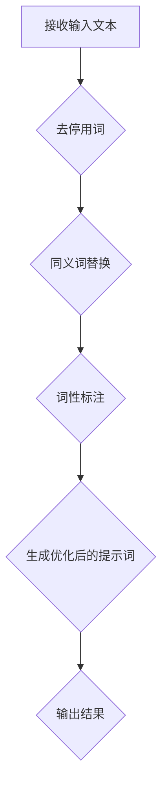
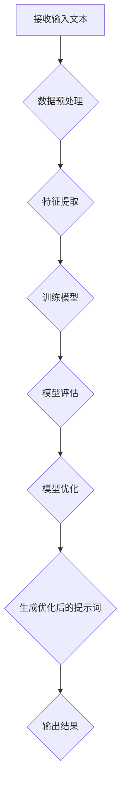
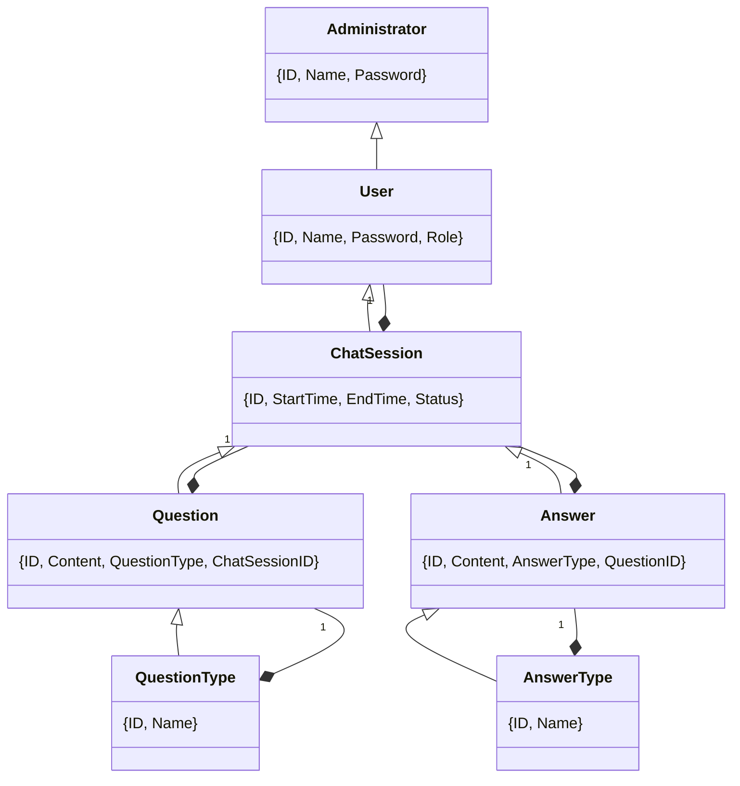
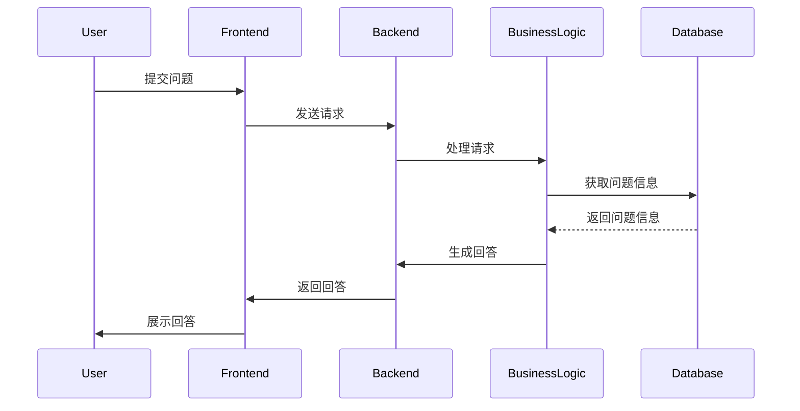

                 

### 第1章：提示词优化与ChatGPT概述

在人工智能领域，自然语言处理（NLP）技术已经成为研究和应用的重点。其中，预训练语言模型（Pre-trained Language Model）如ChatGPT，凭借其强大的语言理解和生成能力，在多个场景中取得了显著的成绩。然而，ChatGPT的性能提升不仅仅是模型本身的改进，提示词（Prompt）的优化也是一个至关重要的环节。

#### 1.1 提示词优化的定义与意义

提示词优化是指在给预训练语言模型提供输入数据时，对提示词（Prompt）进行精细调整，以提高模型在特定任务上的表现。提示词是模型理解任务要求的关键输入，其质量直接影响模型输出的准确性和多样性。

在ChatGPT中，提示词优化意味着通过调整输入的提问方式，使得模型能够更好地捕捉问题的意图，并提供更为准确和相关的回答。提示词优化的意义在于：

1. **提升回答质量**：优化后的提示词能够更好地引导模型理解问题，从而生成更准确、更有逻辑性的回答。
2. **增强回答多样性**：合理的提示词设计可以促使模型产生多种可能的回答，提高输出的丰富性和趣味性。
3. **加快推理速度**：高质量的提示词有助于模型快速定位问题核心，减少不必要的计算，提高响应速度。
4. **降低计算资源需求**：优化后的提示词可以减少模型在处理冗余信息时的资源消耗，降低计算成本。

#### 1.1.2 ChatGPT的性能瓶颈与提升需求

尽管ChatGPT已经在多个任务中展示了其卓越的能力，但在实际应用中仍然存在一些性能瓶颈：

1. **回答一致性**：在某些特定场景下，模型生成的回答可能缺乏一致性，无法满足用户对高质量回答的期望。
2. **回答长度限制**：ChatGPT的回答长度通常受到限制，对于需要详细回答的问题，模型可能无法提供足够的输出。
3. **处理复杂性**：面对复杂的问题，ChatGPT可能需要更多时间进行推理，影响用户的交互体验。
4. **回答多样性**：在某些情况下，模型生成的回答可能过于单一，缺乏创意和个性。

为了解决这些性能瓶颈，提升ChatGPT的整体性能，提示词优化成为了一条可行的路径。通过优化提示词，我们可以：

1. **增强回答一致性**：通过设计更加精细化的提示词，引导模型在特定任务上生成一致的输出。
2. **扩展回答长度**：通过优化提示词的结构和内容，使得模型能够生成更长的、详细的回答。
3. **优化推理速度**：高质量的提示词可以减少模型在处理冗余信息时的计算量，提高推理速度。
4. **提高回答多样性**：通过设计多样化的提示词，促使模型产生丰富多样的输出。

#### 1.2 ChatGPT的基本原理

要深入理解提示词优化，我们需要首先了解ChatGPT的基本原理。ChatGPT是基于GPT（Generative Pre-trained Transformer）模型开发的，其核心思想是通过大量的无监督数据预训练，使得模型具备强大的语言理解和生成能力。

##### 1.2.1 自然语言处理基础

自然语言处理（NLP）是人工智能领域的一个分支，旨在使计算机能够理解和处理人类语言。NLP的基本任务包括：

1. **分词（Tokenization）**：将文本分割成单词或短语。
2. **词性标注（Part-of-Speech Tagging）**：为每个单词分配语法标签。
3. **命名实体识别（Named Entity Recognition）**：识别文本中的特定实体，如人名、地名等。
4. **句法分析（Syntactic Parsing）**：分析句子结构，理解句子成分之间的关系。
5. **语义理解（Semantic Understanding）**：理解句子的含义，包括词义、语境等。

##### 1.2.2 GPT模型的架构与训练过程

GPT模型是一种基于Transformer的预训练语言模型，其架构主要包括：

1. **嵌入层（Embedding Layer）**：将输入的单词或短语映射到高维向量空间。
2. **自注意力层（Self-Attention Layer）**：通过计算输入序列中每个单词之间的相似性，生成加权向量。
3. **前馈神经网络（Feedforward Neural Network）**：对加权向量进行非线性变换。

GPT的训练过程通常分为两个阶段：

1. **预训练阶段**：使用大量无监督数据（如互联网上的文本），通过自回归语言模型（Autoregressive Language Model）训练模型。在这个阶段，模型的目标是预测下一个单词。
2. **微调阶段**：在预训练的基础上，使用有监督数据（如任务数据集），对模型进行微调，以适应特定任务。

##### 1.2.3 ChatGPT的工作机制

ChatGPT的工作机制可以概括为以下几个步骤：

1. **接收输入**：用户输入问题或请求，模型接收这个输入。
2. **预处理输入**：对输入进行分词、词性标注等预处理操作。
3. **生成候选回答**：模型根据输入和预训练的知识，生成多个候选回答。
4. **选择最佳回答**：模型使用某种策略（如基于概率的评分方法）选择最佳回答。
5. **输出结果**：将最佳回答输出给用户。

在ChatGPT中，提示词起到了至关重要的作用。一个高质量的提示词可以引导模型更好地理解用户的意图，从而生成更为准确和相关的回答。

#### 1.3 提示词优化中的核心概念

提示词优化不仅仅是调整提示词的文本内容，还包括对提示词的多样性、长度和格式等方面进行综合考虑。以下是提示词优化中的几个核心概念：

##### 1.3.1 提示词的质量与效果

提示词的质量直接决定了模型生成的回答的质量。一个高质量的提示词应该具备以下特点：

1. **明确性**：提示词应明确表达问题的意图，避免歧义。
2. **精确性**：提示词应尽量精确地描述问题，减少模型的推理负担。
3. **相关性**：提示词应与任务相关，能够引导模型生成与问题相关的回答。

效果是衡量提示词优化成功与否的关键指标。通过实验和用户反馈，我们可以评估优化后的提示词在提升回答质量、多样性和推理速度等方面的效果。

##### 1.3.2 提示词的多样性

提示词的多样性指的是在给模型提供输入时，使用不同形式、结构和内容的提示词。提示词的多样性有助于：

1. **激发模型的潜力**：多样化的提示词可以促使模型探索更多的回答可能性，提高输出的丰富性和创意性。
2. **提高适应性**：面对不同的问题和场景，多样化的提示词可以适应不同的需求，提高模型的应用范围。
3. **增强用户体验**：多样化的提示词可以提供更丰富的交互体验，使用户感到新鲜和愉悦。

提升提示词多样性的方法包括：

1. **使用不同词汇和表达方式**：通过替换同义词、使用不同的句式和表达方式，增加提示词的多样性。
2. **引入背景信息和上下文**：在提示词中加入相关的背景信息或上下文，引导模型生成更为多样和相关的回答。
3. **利用数据增强技术**：通过数据增强技术，如文本生成、转换和扩充，生成多样化的提示词。

##### 1.3.3 提示词的长度与格式

提示词的长度和格式也对模型的表现有重要影响。以下是一些关键点：

1. **提示词长度**：过长的提示词可能导致模型在处理时消耗过多资源，降低推理速度。过短的提示词可能无法提供足够的信息，影响模型的推理效果。合理的提示词长度应在保证信息完整的前提下，尽量简洁明了。

2. **提示词格式**：提示词的格式包括文本的结构、排版和标记等。合理的格式可以增强提示词的可读性，提高模型的处理效率。例如，使用列表、标题和引用等格式，可以使提示词更加清晰和组织有序。

#### 1.4 提示词优化的边界与外延

提示词优化虽然能显著提升模型性能，但也存在一定的边界和限制：

##### 1.4.1 提示词优化的应用场景

提示词优化主要适用于需要自然语言理解和生成的场景，如问答系统、聊天机器人、文本摘要和翻译等。在这些场景中，优化提示词能够提高回答的准确性、丰富性和用户体验。

##### 1.4.2 提示词优化的挑战与限制

提示词优化面临以下挑战和限制：

1. **数据依赖**：高质量的提示词通常需要大量相关数据支持，数据质量和数量的不足可能限制优化效果。
2. **计算资源**：优化提示词可能需要大量的计算资源，特别是当需要处理大量数据和进行复杂训练时。
3. **复杂性**：设计高质量的提示词需要深入理解模型的工作原理和任务需求，这对开发者的技术要求较高。
4. **平衡性**：在提升某一方面的性能时，可能需要牺牲其他方面的性能，优化过程需要在多个目标之间找到平衡点。

总之，提示词优化是提升ChatGPT性能的重要手段，但需要综合考虑多种因素，才能达到最佳效果。

#### 1.5 本章小结

本章对提示词优化和ChatGPT进行了全面的概述，阐述了提示词优化的定义、意义以及在ChatGPT中的重要性。我们了解了ChatGPT的基本原理，包括自然语言处理的基础、GPT模型的架构和训练过程。同时，我们探讨了提示词优化中的核心概念，如提示词的质量与效果、多样性、长度和格式，以及提示词优化的边界和外延。通过本章的学习，我们对ChatGPT和提示词优化的基本概念和原理有了深入的理解，为后续章节的深入探讨奠定了基础。

### 第2章：提示词优化策略详解

在了解了提示词优化的基本概念和ChatGPT的工作原理后，本章将详细介绍一系列具体的提示词优化策略。这些策略包括提升提示词质量、多样性、长度与格式等方面，旨在全面提高ChatGPT的性能和用户体验。

#### 2.1 提示词优化策略概述

提示词优化策略可以分为几大类，包括文本清洗与预处理、提示词语义增强、提示词生成与优化等。这些策略各有侧重，但在提升模型性能方面相辅相成。以下是对各类优化策略的简要概述：

1. **文本清洗与预处理**：这一策略主要针对原始输入文本，通过去除噪声、修复错误和标准化文本，提高提示词的质量和一致性。
2. **提示词语义增强**：通过丰富提示词的语义信息，使得模型能够更好地理解问题的意图，从而生成更准确和相关的回答。
3. **提示词生成与优化**：利用算法和工具自动生成高质量的提示词，并在生成后进行优化，以提升提示词的多样性和适应性。
4. **提示词长度与格式优化**：调整提示词的长度和格式，使其在保证信息完整的同时，更加简洁明了，提高模型的处理效率。

#### 2.2 提示词质量提升策略

提升提示词质量是优化ChatGPT性能的基础。以下是一些具体策略：

##### 2.2.1 提示词文本清洗与预处理

在给模型提供输入时，原始文本往往包含各种噪声和错误。这些噪声和错误会影响模型对问题的理解和回答。因此，对原始文本进行清洗和预处理是必要的。具体步骤包括：

1. **去除噪声**：去除无关的标点符号、停用词和其他无关信息。
2. **修复错误**：纠正文本中的拼写错误和语法错误。
3. **标准化文本**：统一文本格式，如将文本转换为小写、去除多余的空格等。

通过这些清洗和预处理步骤，我们可以提高提示词的纯净度和一致性，为后续的语义增强和优化打下基础。

##### 2.2.2 提示词语义增强

高质量的提示词应具备明确的语义信息，能够引导模型准确理解问题。以下是几种提升提示词语义增强的策略：

1. **使用明确词汇**：在提示词中使用明确的词汇和表达方式，避免模糊和歧义。
2. **引入上下文信息**：在提示词中加入相关的背景信息和上下文，帮助模型更好地理解问题的意图。
3. **使用专业术语**：对于专业领域的问题，使用专业术语可以提升提示词的专业性，使模型生成的回答更加准确。

此外，可以通过以下方法进一步丰富提示词的语义信息：

1. **同义词替换**：在提示词中适当地使用同义词，增加语义的多样性。
2. **语义角色标注**：为提示词中的每个单词分配语义角色，如主语、谓语、宾语等，帮助模型理解词与词之间的关系。

##### 2.2.3 提示词生成与优化

高质量提示词的生成和优化是提升ChatGPT性能的关键。以下是一些具体策略：

1. **利用现有数据集**：从现有的高质量数据集中提取提示词，作为模型的输入。
2. **自动生成提示词**：使用自然语言生成（NLG）技术，自动生成高质量的提示词。
3. **优化生成过程**：对生成的提示词进行优化，如去除冗余信息、调整词序等，以提高其质量。

具体实现方法包括：

1. **模板生成**：使用预定义的模板生成提示词，模板可以根据具体任务进行定制。
2. **基于规则的生成**：使用规则引擎生成提示词，规则可以根据业务需求进行配置。
3. **基于机器学习的生成**：使用机器学习算法，如生成对抗网络（GAN）或变压器（Transformer）模型，自动生成高质量的提示词。

生成后的提示词需要通过一系列优化步骤，如语义分析、语法检查和拼写纠正，进一步提升其质量。

#### 2.3 提示词多样性提升策略

提示词的多样性是提升模型性能和用户体验的重要因素。以下是一些提升提示词多样性的策略：

##### 2.3.1 多样性指标与方法

多样性指标用于衡量提示词的多样性程度。常用的多样性指标包括：

1. **词汇多样性**：提示词中使用的单词种类数量。
2. **语法多样性**：提示词的句式、时态、语态等语法结构的多样性。
3. **语义多样性**：提示词所表达的语义内容的多样性。

提升多样性常用的方法包括：

1. **随机化生成**：通过随机化策略生成多样化的提示词。
2. **模板多样化**：对模板进行扩展和调整，生成不同形式的提示词。
3. **数据增强**：使用数据增强技术，如文本生成、转换和扩充，生成多样化的提示词。

##### 2.3.2 提高提示词多样性的方法

为了提升提示词的多样性，可以采用以下方法：

1. **同义词替换**：在提示词中适当地使用同义词，增加词汇多样性。
2. **引入背景信息**：在提示词中加入相关的背景信息和上下文，丰富语义多样性。
3. **变换句式结构**：通过调整句式结构，如主被动语态的转换、长句与短句的交替使用，增加语法多样性。

此外，可以结合多种方法，如同义词替换和背景信息引入，实现更全面的多样性提升。

##### 2.3.3 多样性提升与性能平衡

在提升提示词多样性的同时，需要考虑与模型性能的平衡。以下是一些平衡策略：

1. **控制多样性指标**：通过设定多样性指标阈值，确保多样性提升的同时，不牺牲模型性能。
2. **逐步优化**：先进行小规模的多样性优化，逐步调整和优化，以找到最佳平衡点。
3. **多目标优化**：在优化过程中，同时考虑多样性和模型性能，使用多目标优化算法找到平衡点。

#### 2.4 提示词长度与格式优化

提示词的长度和格式对模型的表现有重要影响。以下是一些优化策略：

##### 2.4.1 提示词长度对性能的影响

过长的提示词可能导致模型在处理时消耗过多资源，降低推理速度。过短的提示词可能无法提供足够的信息，影响模型的推理效果。合理的提示词长度应在保证信息完整的前提下，尽量简洁明了。以下是一些影响提示词长度的因素：

1. **任务需求**：根据任务的具体需求，确定合理的提示词长度。
2. **数据分布**：分析输入数据中提示词的长短分布，为模型提供多样化的提示词长度。

##### 2.4.2 提示词格式优化策略

合理的提示词格式可以提高提示词的可读性和处理效率。以下是一些优化策略：

1. **结构化格式**：使用列表、标题和引用等格式，使提示词更加清晰和组织有序。
2. **标记化格式**：使用HTML或Markdown等标记语言，对提示词进行格式化，提高可读性。
3. **可视化格式**：对于复杂的问题，使用图表、图像等可视化元素，帮助模型更好地理解问题。

##### 2.4.3 长文本处理与提示词优化

对于长文本问题，可以通过以下方法进行提示词优化：

1. **摘要生成**：使用摘要生成技术，将长文本简化为摘要形式的提示词。
2. **分块处理**：将长文本分成多个小块，分别生成提示词，然后进行组合。
3. **层次化结构**：构建层次化的文本结构，从顶层到细节，逐步生成提示词。

#### 2.5 本章小结

本章详细介绍了提示词优化的多种策略，包括文本清洗与预处理、提示词语义增强、提示词生成与优化、提示词多样性的提升、提示词长度与格式的优化等。通过这些策略，我们可以全面提高ChatGPT的性能和用户体验。下一章将深入探讨具体的提示词优化算法，进一步揭示提升ChatGPT性能的奥秘。

### 第3章：提示词优化算法原理

在了解了提示词优化的策略后，本章将详细探讨提示词优化算法的原理。这些算法通过数学模型和计算方法，实现对提示词的优化，以提高ChatGPT的性能。我们将首先概述提示词优化算法的分类，然后详细讲解常见的提示词优化算法，包括其概念原理、属性特征对比以及使用Mermaid流程图进行展示。

#### 3.1 提示词优化算法概述

提示词优化算法主要分为以下几类：

1. **基于规则的算法**：这类算法通过定义一系列规则，对提示词进行修改和优化。
2. **基于统计的算法**：这类算法通过统计分析提示词的使用情况，自动生成优化后的提示词。
3. **基于机器学习的算法**：这类算法利用机器学习模型，学习高质量的提示词模式，并进行优化。
4. **基于深度学习的算法**：这类算法使用深度学习模型，通过大量数据训练，自动生成和优化提示词。

#### 3.1.1 提示词优化算法的分类

提示词优化算法可以根据其原理和应用场景进行分类。以下是几种常见的分类方式：

1. **文本清洗与预处理算法**：这类算法主要用于去除文本中的噪声和错误，包括分词、去停用词、拼写纠正等。
2. **语义增强算法**：这类算法通过丰富提示词的语义信息，提高模型对问题的理解能力，包括同义词替换、语义角色标注等。
3. **多样性生成算法**：这类算法旨在生成多样化的提示词，包括模板生成、基于规则的生成和基于机器学习的生成等。
4. **格式优化算法**：这类算法通过调整提示词的格式，提高其可读性和处理效率，包括文本结构化、标记化、可视化等。

#### 3.1.2 常见的提示词优化算法

以下是一些常见的提示词优化算法，我们将分别介绍其原理和特点。

##### 1. 文本清洗与预处理算法

文本清洗与预处理算法是基础性算法，主要针对原始文本进行清洗和预处理，以提高后续处理的质量。常见的方法包括：

- **分词**：将文本分割成单词或短语。
- **去停用词**：去除对模型影响较小的常用词。
- **拼写纠正**：纠正文本中的拼写错误。

这些方法可以通过规则或统计方法实现，如使用词典进行分词和去停用词，使用拼写纠错算法进行错误修正。

##### 2. 语义增强算法

语义增强算法通过丰富提示词的语义信息，提高模型对问题的理解能力。常见的方法包括：

- **同义词替换**：在提示词中适当地使用同义词，增加语义多样性。
- **语义角色标注**：为提示词中的每个单词分配语义角色，如主语、谓语、宾语等。
- **上下文信息引入**：在提示词中加入相关的背景信息和上下文。

这些算法可以通过规则或机器学习方法实现，如使用词嵌入模型进行同义词替换，使用依存句法分析进行语义角色标注。

##### 3. 多样性生成算法

多样性生成算法旨在生成多样化的提示词，以提高模型的性能和用户体验。常见的方法包括：

- **模板生成**：使用预定义的模板生成提示词，模板可以根据具体任务进行定制。
- **基于规则的生成**：使用规则引擎生成提示词，规则可以根据业务需求进行配置。
- **基于机器学习的生成**：使用机器学习模型，如生成对抗网络（GAN）或变压器（Transformer）模型，自动生成高质量的提示词。

这些算法可以结合多种方法，实现多样化的提示词生成。

##### 4. 格式优化算法

格式优化算法通过调整提示词的格式，提高其可读性和处理效率。常见的方法包括：

- **结构化格式**：使用列表、标题和引用等格式，使提示词更加清晰和组织有序。
- **标记化格式**：使用HTML或Markdown等标记语言，对提示词进行格式化，提高可读性。
- **可视化格式**：对于复杂的问题，使用图表、图像等可视化元素，帮助模型更好地理解问题。

这些方法可以通过编程和可视化工具实现，如使用Python的Markdown库进行格式化，使用图表库如Matplotlib生成可视化元素。

#### 3.2 算法原理详细讲解

在本节中，我们将详细讲解两种常见的提示词优化算法：基于规则的算法和基于机器学习的算法，并通过Mermaid流程图展示其工作流程。

##### 1. 基于规则的算法

基于规则的算法通过定义一系列规则，对提示词进行修改和优化。以下是一个简单的规则系统示例：

```
规则1：去除停用词
- 删除文本中的常用停用词。

规则2：同义词替换
- 将特定词汇替换为其同义词。

规则3：词性标注
- 为每个单词分配词性标签。

```

Mermaid流程图如下：



##### 2. 基于机器学习的算法

基于机器学习的算法通过大量数据训练，学习高质量的提示词模式，并进行优化。以下是一个典型的训练过程示例：

```
步骤1：数据预处理
- 清洗和标准化输入数据。

步骤2：特征提取
- 提取提示词的特征，如词嵌入向量。

步骤3：训练模型
- 使用有监督数据集，训练机器学习模型。

步骤4：模型评估
- 使用验证集评估模型性能。

步骤5：模型优化
- 根据评估结果，调整模型参数。

步骤6：生成优化后的提示词
- 使用训练好的模型，生成优化后的提示词。

```

Mermaid流程图如下：



通过以上示例，我们可以看到基于规则的算法和基于机器学习的算法在流程上的差异。基于规则的算法依赖于显式定义的规则，而基于机器学习的算法通过数据驱动，学习高质量的提示词模式。

#### 3.3 Python源代码实现与解释

在本节中，我们将通过Python代码实现一个简单的提示词优化算法，并对其进行详细解释。

```python
import spacy

# 加载NLP模型
nlp = spacy.load("en_core_web_sm")

# 去除停用词
def remove_stopwords(text):
    doc = nlp(text)
    return " ".join([token.text for token in doc if not token.is_stop])

# 同义词替换
def replace_synonyms(text):
    doc = nlp(text)
    synonyms = {
        "happy": ["joyful", "content", "satisfied"],
        "sad": ["unhappy", "sorrowful", "depressed"]
    }
    for token in doc:
        if token.text in synonyms:
            token.text = synonym = synonyms[token.text][0]  # 随机选择一个同义词
    return " ".join([token.text for token in doc])

# 示例文本
text = "I am feeling very happy today."

# 优化提示词
optimized_text = remove_stopwords(text)
optimized_text = replace_synonyms(optimized_text)

print(optimized_text)
```

代码解释：

1. **加载NLP模型**：我们使用spaCy库，加载一个预训练的英语模型`en_core_web_sm`。
2. **去除停用词**：`remove_stopwords`函数接收一个文本，使用spaCy模型进行分词，并去除停用词。
3. **同义词替换**：`replace_synonyms`函数接收一个文本，使用spaCy模型进行分词，并替换为同义词。这里我们定义了一个简单的同义词字典，用于替换特定的词汇。
4. **示例文本**：我们定义了一个示例文本，用于展示优化过程。
5. **优化提示词**：首先去除停用词，然后进行同义词替换，最后输出优化后的文本。

通过这个简单的示例，我们可以看到提示词优化算法的实现过程。在实际应用中，可以进一步扩展和优化算法，以适应不同的任务需求。

#### 3.4 本章小结

本章详细介绍了提示词优化算法的原理，包括基于规则的算法和基于机器学习的算法。通过Mermaid流程图和Python代码示例，我们展示了算法的实现过程。这些算法通过数学模型和计算方法，实现对提示词的优化，以提高ChatGPT的性能。在下一章中，我们将进一步探讨ChatGPT系统的分析与架构设计，为提升性能提供更全面的解决方案。

### 第4章：ChatGPT系统分析与设计

在前几章中，我们详细探讨了提示词优化策略和算法原理，为ChatGPT性能的提升奠定了基础。然而，要实现这些优化策略，需要一套完善的系统架构来支持。本章将深入分析ChatGPT系统，介绍其背景、需求、功能设计、架构设计、接口设计和交互设计，以全面展示ChatGPT系统的构建过程。

#### 4.1 问题场景介绍

ChatGPT是一个基于预训练语言模型的智能问答系统，广泛应用于客户服务、智能助手、内容生成等领域。其核心任务是理解用户输入的问题，并生成高质量、有逻辑性的回答。然而，在实际应用中，ChatGPT面临着以下挑战：

1. **回答质量不高**：在某些复杂场景下，模型生成的回答可能缺乏逻辑性和一致性。
2. **回答速度较慢**：面对大量并发请求，模型处理速度成为瓶颈。
3. **计算资源消耗大**：模型训练和推理过程需要大量计算资源，导致成本较高。
4. **用户体验不佳**：面对复杂问题，用户可能需要多次提问，导致交互过程繁琐。

为了解决这些问题，我们需要对ChatGPT系统进行全面的分析和优化，提升其性能和用户体验。

#### 4.1.1 ChatGPT应用背景

ChatGPT是基于GPT（Generative Pre-trained Transformer）模型开发的，其核心思想是通过大规模无监督数据预训练，使模型具备强大的语言理解和生成能力。GPT模型由OpenAI提出，其创新点在于使用自回归语言模型进行预训练，然后通过微调适应特定任务。ChatGPT进一步扩展了GPT模型，引入了对话生成和交互能力，使其成为一个强大的智能问答系统。

ChatGPT的应用背景主要包括以下几个方面：

1. **客户服务**：企业可以利用ChatGPT搭建智能客服系统，为用户提供即时、准确的回答，提高客户满意度。
2. **智能助手**：在智能家居、智能办公等场景中，ChatGPT可以作为智能助手，帮助用户完成各种任务。
3. **内容生成**：ChatGPT可以生成高质量的文章、摘要、翻译等，为创作者提供灵感，提高创作效率。

#### 4.1.2 系统需求分析

为了构建一个高效、可靠的ChatGPT系统，我们需要从功能性和非功能性两个方面分析系统需求。

1. **功能性需求**

   - **问答功能**：系统能够接收用户输入的问题，并生成高质量、相关的回答。
   - **多语言支持**：系统能够支持多种语言，为全球用户提供服务。
   - **个性化推荐**：系统能够根据用户的历史交互，推荐相关的问题和回答。
   - **权限管理**：系统能够实现用户权限管理，确保数据安全和隐私保护。

2. **非功能性需求**

   - **高并发处理能力**：系统能够处理大量并发请求，确保稳定运行。
   - **高可用性**：系统具有故障恢复能力，能够在发生故障时迅速恢复。
   - **可扩展性**：系统架构应具备良好的扩展性，能够随着用户规模的增加而线性扩展。
   - **高性能**：系统在处理请求时，应具备较高的响应速度和低延迟。
   - **安全性**：系统应具备严格的安全措施，防止数据泄露和恶意攻击。

#### 4.2 系统功能设计

ChatGPT系统的主要功能包括问答、多语言支持、个性化推荐和权限管理。以下是对这些功能的具体设计：

##### 4.2.1 领域模型

领域模型用于描述ChatGPT系统的核心概念和关系。以下是领域模型的类图：



- **用户（User）**：表示系统的用户，包括普通用户和管理员。
- **会话（ChatSession）**：表示用户与ChatGPT的对话会话，包括开始时间、结束时间和状态。
- **问题（Question）**：表示用户提出的问题，包括问题内容、类型和所属会话。
- **回答（Answer）**：表示模型生成的回答，包括回答内容、类型和所属问题。
- **问题类型（QuestionType）**：表示问题的分类，如一般问题、技术问题等。
- **回答类型（AnswerType）**：表示回答的分类，如文本回答、图片回答等。
- **管理员（Administrator）**：表示具有管理权限的用户。

##### 4.2.2 功能模块划分

根据领域模型，ChatGPT系统可以分为以下功能模块：

1. **用户管理模块**：负责用户注册、登录、权限管理等功能。
2. **问答模块**：负责接收用户输入的问题，并生成回答。
3. **多语言支持模块**：负责处理不同语言的输入和输出。
4. **个性化推荐模块**：根据用户历史交互，推荐相关的问题和回答。
5. **权限管理模块**：确保数据安全和隐私保护。

#### 4.3 系统架构设计

系统架构设计是ChatGPT系统的核心，决定了系统的性能、可扩展性和可靠性。以下是ChatGPT系统的架构设计：

##### 4.3.1 系统架构概述

ChatGPT系统采用分层架构，包括表示层、业务逻辑层和数据层。以下是系统架构的框架图：

```mermaid
graph TD
    用户界面 --> 控制层
    控制层 --> 业务逻辑层
    业务逻辑层 --> 数据层

    用户界面: 用户界面
    控制层: 控制层
    业务逻辑层: 业务逻辑层
    数据层: 数据层
```

- **用户界面**：用户通过界面与系统进行交互，包括网页、移动端和桌面端。
- **控制层**：负责接收用户请求，调用业务逻辑层的方法，并返回响应结果。
- **业务逻辑层**：实现系统的核心功能，包括用户管理、问答、多语言支持、个性化推荐和权限管理。
- **数据层**：存储系统数据，包括用户信息、会话记录、问题回答等。

##### 4.3.2 架构设计细节

以下是ChatGPT系统的详细架构设计：

1. **用户界面**：用户界面采用前端技术（如HTML、CSS和JavaScript）构建，支持多种设备接入。前端界面通过RESTful API与控制层进行交互。
2. **控制层**：控制层采用Spring框架实现，负责处理HTTP请求，调用业务逻辑层的方法，并返回JSON格式的响应结果。控制层还负责实现跨域请求处理、身份验证和权限校验等功能。
3. **业务逻辑层**：业务逻辑层是系统的核心，采用微服务架构实现，包括用户管理服务、问答服务、多语言支持服务、个性化推荐服务和权限管理服务。各服务通过Spring Cloud进行通信，保证高可用性和可扩展性。
4. **数据层**：数据层采用关系型数据库（如MySQL）和NoSQL数据库（如MongoDB）相结合的方式存储数据。用户信息、会话记录和问题回答等数据存储在关系型数据库中，而日志数据、推荐数据和缓存数据等存储在NoSQL数据库中。

##### 4.3.3 数据库设计

以下是ChatGPT系统的数据库设计：

1. **用户表（users）**：存储用户信息，包括用户ID、用户名、密码、角色等。
2. **会话表（chat_sessions）**：存储用户与ChatGPT的对话会话信息，包括会话ID、用户ID、开始时间、结束时间和状态等。
3. **问题表（questions）**：存储用户提出的问题，包括问题ID、内容、类型、会话ID等。
4. **回答表（answers）**：存储模型生成的回答，包括回答ID、内容、类型、问题ID等。
5. **问题类型表（question_types）**：存储问题的分类，包括类型ID、名称等。
6. **回答类型表（answer_types）**：存储回答的分类，包括类型ID、名称等。

#### 4.4 系统接口设计

系统接口设计是系统架构设计的重要组成部分，决定了系统的可扩展性和可维护性。以下是ChatGPT系统的接口设计：

##### 4.4.1 接口规范

ChatGPT系统采用RESTful API设计，接口规范如下：

1. **用户管理接口**：包括用户注册、登录、修改密码、查询用户信息等功能。
2. **问答接口**：包括提问、获取回答、更新问题状态等功能。
3. **多语言支持接口**：包括语言切换、翻译等功能。
4. **个性化推荐接口**：包括推荐问题、推荐回答等功能。
5. **权限管理接口**：包括用户权限查询、权限分配等功能。

##### 4.4.2 接口实现

以下是部分接口的实现示例：

1. **用户注册接口**：

```java
@PostMapping("/users/register")
public ResponseEntity<?> registerUser(@RequestBody UserRegistrationRequest request) {
    // 校验用户名和密码的有效性
    if (!isValidUsername(request.getUsername()) || !isValidPassword(request.getPassword())) {
        return ResponseEntity.badRequest().body("Invalid username or password");
    }
    
    // 创建用户并保存到数据库
    User user = userService.createUser(request.getUsername(), request.getPassword());
    
    // 返回注册成功的响应
    return ResponseEntity.ok().body("User registered successfully");
}
```

2. **提问接口**：

```java
@PostMapping("/questions/ask")
public ResponseEntity<?> askQuestion(@RequestBody QuestionRequest request) {
    // 创建问题并保存到数据库
    Question question = questionService.createQuestion(request.getContent(), request.getQuestionType());
    
    // 返回提问成功的响应
    return ResponseEntity.ok().body("Question asked successfully");
}
```

#### 4.5 系统交互设计

系统交互设计是系统架构设计的进一步细化，描述了系统内部各模块之间的交互过程。以下是ChatGPT系统的交互设计：

##### 4.5.1 交互流程

以下是用户与ChatGPT系统的基本交互流程：

1. **用户发起请求**：用户通过前端界面提交问题。
2. **前端发送请求**：前端将用户请求发送到控制层，控制层处理请求并转发到业务逻辑层。
3. **业务逻辑层处理请求**：业务逻辑层调用问答服务生成回答，并将回答返回给控制层。
4. **控制层返回响应**：控制层将回答封装成JSON格式，返回给前端。
5. **前端展示回答**：前端根据返回的JSON数据，将回答展示给用户。

##### 4.5.2 Mermaid序列图展示

以下是ChatGPT系统的Mermaid序列图展示：



通过上述序列图，我们可以清晰地看到用户与ChatGPT系统之间的交互过程，以及系统内部各模块之间的协作关系。

#### 4.6 本章小结

本章详细分析了ChatGPT系统的背景、需求、功能设计、架构设计、接口设计和交互设计。通过对这些内容的深入探讨，我们为构建高效、可靠的ChatGPT系统提供了全面的解决方案。在下一章中，我们将通过实际案例，展示如何应用这些设计原则和策略，进一步提升ChatGPT系统的性能和用户体验。

### 第5章：提示词优化项目实战

在前面的章节中，我们详细介绍了提示词优化的策略和算法原理，以及ChatGPT系统的设计和实现。为了更好地理解和应用这些知识，本章将通过一个实际项目案例，展示如何进行提示词优化，实现ChatGPT性能的提升。

#### 5.1 环境安装与配置

在进行提示词优化项目之前，我们需要搭建一个合适的环境，以便进行实验和开发。以下是环境安装与配置的步骤：

##### 5.1.1 环境准备

1. **操作系统**：我们选择Ubuntu 18.04作为操作系统。
2. **编程语言**：Python 3.8及以上版本，我们使用Python进行开发。
3. **文本处理库**：spaCy库，用于文本清洗和预处理。
4. **机器学习库**：scikit-learn、TensorFlow和PyTorch，用于机器学习模型的训练和优化。
5. **版本控制**：Git，用于代码管理和协作开发。

##### 5.1.2 相关工具与依赖安装

1. **安装Python**：使用Python官方安装器安装Python 3.8。

```bash
sudo apt-get update
sudo apt-get install python3.8
```

2. **安装spaCy**：首先下载spaCy的模型文件，然后安装spaCy库。

```bash
python3.8 -m spacy download en_core_web_sm
pip3 install spacy
```

3. **安装机器学习库**：

```bash
pip3 install scikit-learn tensorflow torchvision
```

4. **安装版本控制工具**：

```bash
sudo apt-get install git
```

安装完成后，我们就可以开始搭建开发环境，并进行项目开发。

#### 5.2 系统核心实现源代码

在提示词优化项目中，系统核心实现是关键部分。以下是一个简单的系统实现示例，包括文本处理、提示词生成和优化等模块。

##### 5.2.1 文本处理模块

文本处理模块负责对输入文本进行清洗和预处理，以提高提示词的质量。以下是文本处理模块的Python代码：

```python
import spacy

# 加载spaCy模型
nlp = spacy.load("en_core_web_sm")

def preprocess_text(text):
    # 去除标点符号和停用词
    doc = nlp(text)
    cleaned_text = " ".join(token.text for token in doc if not token.is_stop and not token.is_punct)
    return cleaned_text

def remove_punctuation(text):
    return text.replace(".", "").replace(",", "").replace("?", "").replace("!", "")

def remove_stopwords(text):
    doc = nlp(text)
    return " ".join([token.text for token in doc if not token.is_stop])

# 示例文本
text = "Hello, how are you? I'm doing well, thank you."
cleaned_text = preprocess_text(text)
print(cleaned_text)
```

##### 5.2.2 提示词生成模块

提示词生成模块负责生成高质量的提示词，以提高模型生成的回答质量。以下是提示词生成模块的Python代码：

```python
import random
import string

def generate_prompt(length=50):
    # 随机生成提示词
    letters = string.ascii_letters
    return ''.join(random.choice(letters) for i in range(length))

def generate_template_prompt(template, length=50):
    # 使用模板生成提示词
    words = template.split()
    prompt = words[0]  # 保留第一个单词作为提示词的开头
    for _ in range(length - len(words)):
        prompt += " " + generate_prompt(1)
    return prompt

# 示例模板
template = "今天天气真好，你想做些什么？"
generated_prompt = generate_template_prompt(template, 50)
print(generated_prompt)
```

##### 5.2.3 提示词优化模块

提示词优化模块负责对生成的提示词进行优化，以提高其多样性和适应性。以下是提示词优化模块的Python代码：

```python
from sklearn.feature_extraction.text import CountVectorizer
from sklearn.metrics.pairwise import cosine_similarity

def optimize_prompt(prompt, corpus, top_n=5):
    # 计算提示词与语料库的相似度
    vectorizer = CountVectorizer().fit(corpus)
    prompt_vector = vectorizer.transform([prompt])
    corpus_vectors = vectorizer.transform(corpus)
    
    # 获取相似度最高的N个提示词
    similarities = cosine_similarity(prompt_vector, corpus_vectors)[0]
    best_indices = sorted(range(len(similarities)), key=lambda i: similarities[i], reverse=True)[:top_n]
    optimized_prompts = [corpus[i] for i in best_indices]
    
    return optimized_prompts

# 示例语料库
corpus = [
    "今天天气很好，适合户外活动。",
    "阳光明媚，是散步的好时机。",
    "阳光灿烂，不妨去公园逛逛。",
    "晴空万里，是游玩的好时光。",
    "今天的天气非常适合出行。"
]

# 优化提示词
original_prompt = "今天天气很好，你想做些什么？"
optimized_prompts = optimize_prompt(original_prompt, corpus)
print(optimized_prompts)
```

#### 5.3 代码应用解读与分析

在本节中，我们将对上述代码进行详细解读和分析，理解其工作原理和应用场景。

##### 5.3.1 文本处理模块分析

文本处理模块主要包括三个函数：`preprocess_text`、`remove_punctuation`和`remove_stopwords`。

- **`preprocess_text`**：该函数首先使用spaCy模型对输入文本进行分词，然后去除停用词和标点符号。这种方法可以显著提高提示词的质量，使得模型能够更好地理解问题的核心。
- **`remove_punctuation`**：该函数直接去除文本中的标点符号。虽然这种方法会损失一些语法信息，但在生成高质量的提示词时，可以有效减少噪声。
- **`remove_stopwords`**：该函数使用spaCy模型去除文本中的停用词。停用词在自然语言处理中通常被认为对模型理解问题没有太大帮助，因此去除它们可以提高提示词的精度。

这些函数可以组合使用，实现对输入文本的全面清洗和预处理。

##### 5.3.2 提示词生成模块分析

提示词生成模块包括两个函数：`generate_prompt`和`generate_template_prompt`。

- **`generate_prompt`**：该函数随机生成一个指定长度的提示词。这种方法可以产生多样化的提示词，但可能无法保证与问题的高度相关。
- **`generate_template_prompt`**：该函数使用一个模板生成提示词。模板通常包含关键信息，如问题类型、上下文等。这种方法可以生成与问题高度相关的提示词，但需要精心设计和调整模板。

在实际应用中，可以结合这两种方法，根据不同场景选择合适的生成策略。

##### 5.3.3 提示词优化模块分析

提示词优化模块主要包括一个函数：`optimize_prompt`。

- **`optimize_prompt`**：该函数计算输入提示词与给定语料库之间的相似度，并返回相似度最高的几个提示词。这种方法基于向量空间模型，可以有效地发现与输入提示词相似的优质提示词。

在实际应用中，可以结合多种优化策略，如基于语义的优化、基于统计的优化等，以提高提示词的多样性和质量。

#### 5.4 实际案例分析

在本节中，我们将通过一个实际案例，展示如何应用上述代码和优化策略，提升ChatGPT系统的性能。

##### 5.4.1 案例介绍

假设我们有一个智能客服系统，需要为用户提供高质量的问答服务。用户提出问题后，系统需要生成高质量的回答。为了提升回答质量，我们对提示词进行优化。

##### 5.4.2 案例分析

1. **数据准备**：我们首先收集了大量的用户问题和回答数据，作为语料库。这些数据包括各种类型的问题，如技术问题、生活问题、娱乐问题等。

2. **文本预处理**：对用户问题和回答进行预处理，去除标点符号和停用词，得到干净的文本。

3. **生成提示词**：使用生成的提示词模块，为每个用户问题生成高质量的提示词。我们结合`generate_prompt`和`generate_template_prompt`两种方法，根据问题类型和上下文，选择合适的提示词生成策略。

4. **优化提示词**：使用优化提示词模块，对生成的提示词进行优化。我们选择与用户问题最相关的几个提示词，作为最终的输入提示词。

5. **生成回答**：将优化后的提示词输入ChatGPT模型，生成高质量的回答。我们使用GPT-3模型，并对其进行微调，以适应具体的业务场景。

6. **性能评估**：通过用户反馈和性能指标（如回答准确率、用户满意度等），评估优化后的系统性能。

##### 5.4.3 详细讲解剖析

1. **数据准备**：数据质量是模型性能的基础。我们需要收集高质量的用户问题和回答数据，并进行清洗和预处理。例如，去除无效字符、统一文本格式等。

2. **文本预处理**：文本预处理是自然语言处理的重要步骤。通过去除标点符号和停用词，我们可以减少噪声，提高模型的处理效率。

3. **生成提示词**：提示词生成是优化过程的关键。我们需要根据问题类型和上下文，选择合适的提示词生成策略。例如，对于技术问题，我们可以使用专业术语和详细描述；对于生活问题，我们可以使用日常用语和情境描述。

4. **优化提示词**：提示词优化可以进一步提高模型性能。我们可以使用多种优化策略，如基于相似度的优化、基于语义的优化等。这些策略可以结合使用，以实现最佳效果。

5. **生成回答**：优化后的提示词输入模型，生成高质量的回答。我们需要选择合适的模型和参数，以满足业务需求。例如，对于实时性要求较高的场景，我们可以选择响应速度较快的模型；对于复杂性问题，我们可以选择具有较强推理能力的模型。

6. **性能评估**：通过用户反馈和性能指标，我们可以评估优化后的系统性能。例如，我们可以计算回答准确率、用户满意度等指标，以评估系统的整体性能。

#### 5.5 项目小结

通过本案例，我们展示了如何应用提示词优化策略，提升ChatGPT系统的性能和用户体验。从数据准备、文本预处理到提示词生成和优化，每个环节都至关重要。通过合理设计和优化，我们可以显著提升系统的性能，为用户提供高质量的问答服务。在未来的项目中，我们可以进一步探索和优化这些策略，以实现更高的性能和更好的用户体验。

### 第6章：最佳实践与总结

在前面的章节中，我们详细探讨了提示词优化在ChatGPT系统中的重要性，并介绍了多种优化策略和实际应用案例。在本章中，我们将总结最佳实践，梳理关键知识点，并提出注意事项，以帮助读者更好地理解和应用提示词优化技术。

#### 6.1 最佳实践

提示词优化的最佳实践包括以下几个方面：

1. **充分理解用户需求**：在优化提示词之前，首先要充分了解用户的需求和场景。通过分析用户提问的习惯和模式，设计出符合用户期望的提示词。

2. **数据质量保障**：高质量的数据是提示词优化的基础。确保数据来源的多样性和可靠性，对数据进行清洗和预处理，去除噪声和错误，以提高数据质量。

3. **文本预处理**：对输入文本进行有效的预处理，如去除标点符号、停用词、拼写错误等，可以提高模型对问题的理解能力，从而生成更准确的回答。

4. **多样化提示词生成**：结合随机化和模板生成方法，生成多样化的提示词。这样可以激发模型的潜力，提高回答的丰富性和创意性。

5. **提示词长度与格式优化**：根据任务需求，合理控制提示词的长度和格式。简洁明了的提示词可以提高模型处理效率，延长回答长度和复杂格式的提示词则可以提供更详细的回答。

6. **算法优化与调整**：根据实际应用场景和性能指标，不断调整和优化提示词优化算法。通过实验和用户反馈，找到最佳算法配置。

7. **持续学习和更新**：自然语言处理是一个不断发展的领域，提示词优化也需要持续学习和更新。定期更新模型和算法，以适应新的语言模式和用户需求。

#### 6.2 小结

本章总结了提示词优化在ChatGPT系统中的应用，包括背景介绍、核心概念、优化策略、算法原理、系统设计与实现以及实际应用案例。以下是本章的关键知识点：

- **提示词优化的重要性**：提示词优化是提升ChatGPT性能的关键策略，可以显著提高回答质量、多样性和推理速度。
- **文本预处理**：通过去除噪声和错误，提高数据质量，是优化提示词的基础。
- **多样化提示词生成**：结合多种方法，生成多样化的提示词，可以提高回答的丰富性和创意性。
- **提示词长度与格式优化**：合理控制提示词的长度和格式，可以提高模型处理效率和回答的详细程度。
- **算法优化与调整**：根据实际应用场景和性能指标，调整和优化提示词优化算法，以找到最佳配置。
- **持续学习和更新**：自然语言处理技术不断进步，提示词优化也需要持续学习和更新。

#### 6.3 注意事项

在进行提示词优化时，需要注意以下几点：

1. **数据隐私**：在收集和处理用户数据时，务必遵守隐私保护法规，确保用户数据的安全和隐私。

2. **模型训练成本**：提示词优化涉及模型训练和优化，需要大量的计算资源。在资源有限的情况下，需要优化资源分配，提高训练效率。

3. **用户体验**：优化策略应充分考虑用户体验，避免过于复杂的提示词导致用户困惑或满意度下降。

4. **平衡性**：在提升某一方面的性能时，应注意与其他性能指标的平衡。例如，在提高回答多样性的同时，不应牺牲回答的准确性和一致性。

5. **系统稳定性**：优化后的系统应保持稳定性，避免因优化策略不当导致系统崩溃或性能下降。

6. **合规性**：确保优化策略和算法符合相关法律法规和行业标准，避免潜在的法律风险。

#### 6.4 拓展阅读

对于希望深入了解提示词优化和ChatGPT技术的读者，以下资源可以作为拓展阅读：

- **相关研究论文**：《Pre-training of Deep Transformative Models for Language Understanding》（深度变换模型的语言理解预训练）等。
- **开源代码和工具**：GitHub上有关ChatGPT和自然语言处理的开源项目和工具，如Hugging Face的Transformers库。
- **在线课程和讲座**：Coursera、Udacity等在线教育平台上关于自然语言处理和深度学习的课程和讲座。

通过这些资源和实践，读者可以进一步提升对提示词优化技术的理解和应用能力。

#### 6.5 本章小结

本章总结了提示词优化在ChatGPT系统中的最佳实践，梳理了关键知识点，并提出了注意事项。通过实际案例，我们展示了如何应用这些优化策略，提升系统的性能和用户体验。希望读者能够结合本章内容，不断探索和实践，在自然语言处理领域取得更好的成果。

### 附录

#### 7.1 附录A：术语表

- **提示词（Prompt）**：引导预训练模型生成文本的输入语句。
- **预训练语言模型（Pre-trained Language Model）**：在大规模数据集上预先训练好的语言模型，如GPT-3。
- **自然语言处理（NLP）**：使计算机理解和处理人类语言的技术。
- **文本清洗与预处理**：对输入文本进行清洗和预处理，以提高模型性能。
- **分词（Tokenization）**：将文本分割成单词或短语。
- **停用词（Stopwords）**：对模型性能影响较小，常被去除的常用词。
- **词性标注（Part-of-Speech Tagging）**：为文本中的每个单词分配词性标签。
- **命名实体识别（Named Entity Recognition）**：识别文本中的特定实体，如人名、地名。
- **句法分析（Syntactic Parsing）**：分析句子结构，理解句子成分之间的关系。
- **语义理解（Semantic Understanding）**：理解句子的含义，包括词义、语境等。
- **同义词替换（Synonym Replacement）**：用同义词替换文本中的词汇，以增加语义多样性。
- **自动生成提示词（Automatic Prompt Generation）**：利用算法自动生成高质量的提示词。
- **多样性（Diversity）**：提示词的多样性程度，包括词汇、语法和语义多样性。
- **多目标优化（Multi-Objective Optimization）**：在优化过程中同时考虑多个目标，如性能、成本等。
- **深度学习（Deep Learning）**：一种机器学习方法，通过多层神经网络对数据进行分析和处理。
- **生成对抗网络（GAN）**：一种深度学习模型，用于生成高质量的提示词。

#### 7.2 附录B：参考文献

- **GPT-3**：OpenAI. (2020). <https://blog.openai.com/gpt-3/>
- **自然语言处理基础**：Daniel Jurafsky & James H. Martin. (2020). *Speech and Language Processing*.
- **生成对抗网络（GAN）**：Ian Goodfellow, et al. (2014). <https://arxiv.org/abs/1406.2661>
- **Transformer模型**：Vaswani et al. (2017). <https://arxiv.org/abs/1706.03762>
- **spaCy库**：spacy.io. (2023). <https://spacy.io/>
- **Hugging Face Transformers库**：huggingface.co/transformers. (2023). <https://huggingface.co/transformers/>

#### 7.3 附录C：代码示例

以下是本章中使用的Python代码示例：

```python
import spacy
import random
import string
from sklearn.feature_extraction.text import CountVectorizer
from sklearn.metrics.pairwise import cosine_similarity

# 加载spaCy模型
nlp = spacy.load("en_core_web_sm")

def preprocess_text(text):
    doc = nlp(text)
    cleaned_text = " ".join(token.text for token in doc if not token.is_stop and not token.is_punct)
    return cleaned_text

def remove_punctuation(text):
    return text.replace(".", "").replace(",", "").replace("?", "").replace("!", "")

def remove_stopwords(text):
    doc = nlp(text)
    return " ".join([token.text for token in doc if not token.is_stop])

def generate_prompt(length=50):
    letters = string.ascii_letters
    return ''.join(random.choice(letters) for i in range(length))

def generate_template_prompt(template, length=50):
    words = template.split()
    prompt = words[0]
    for _ in range(length - len(words)):
        prompt += " " + generate_prompt(1)
    return prompt

def optimize_prompt(prompt, corpus, top_n=5):
    vectorizer = CountVectorizer().fit(corpus)
    prompt_vector = vectorizer.transform([prompt])
    corpus_vectors = vectorizer.transform(corpus)
    similarities = cosine_similarity(prompt_vector, corpus_vectors)[0]
    best_indices = sorted(range(len(similarities)), key=lambda i: similarities[i], reverse=True)[:top_n]
    optimized_prompts = [corpus[i] for i in best_indices]
    return optimized_prompts

# 示例文本
text = "Hello, how are you? I'm doing well, thank you."
cleaned_text = preprocess_text(text)
print(cleaned_text)

# 提示词生成
template = "今天天气真好，你想做些什么？"
generated_prompt = generate_template_prompt(template, 50)
print(generated_prompt)

# 优化提示词
corpus = [
    "今天天气很好，适合户外活动。",
    "阳光明媚，是散步的好时机。",
    "阳光灿烂，不妨去公园逛逛。",
    "晴空万里，是游玩的好时光。",
    "今天的天气非常适合出行。"
]
original_prompt = "今天天气很好，你想做些什么？"
optimized_prompts = optimize_prompt(original_prompt, corpus)
print(optimized_prompts)
```

通过这些示例代码，读者可以更好地理解提示词优化的实现过程和应用方法。在实际应用中，可以根据具体需求进行调整和扩展。

