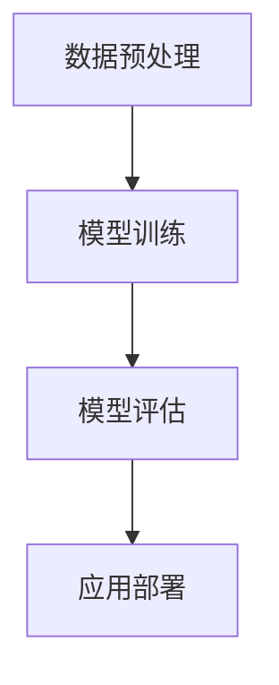
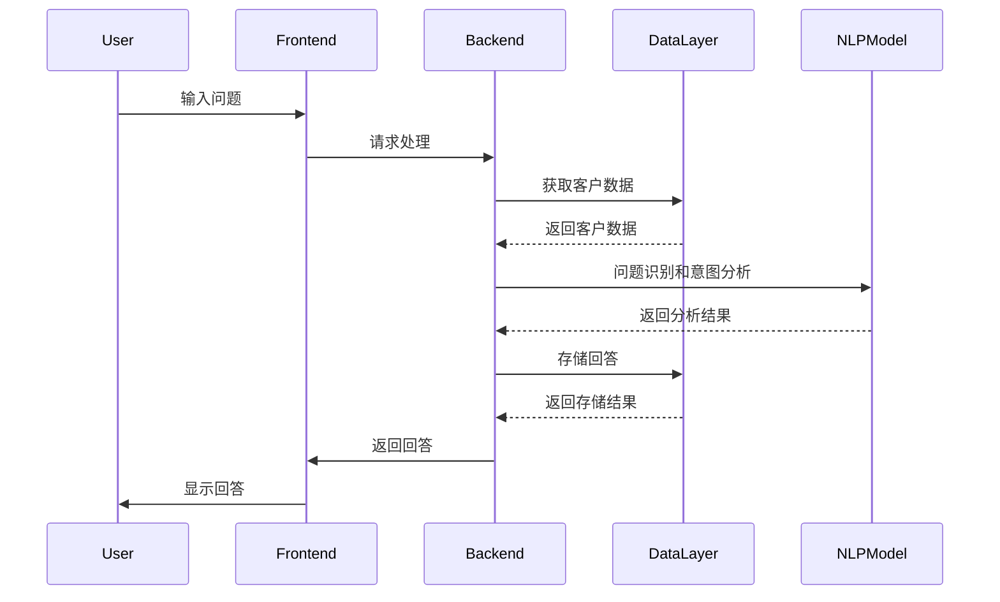
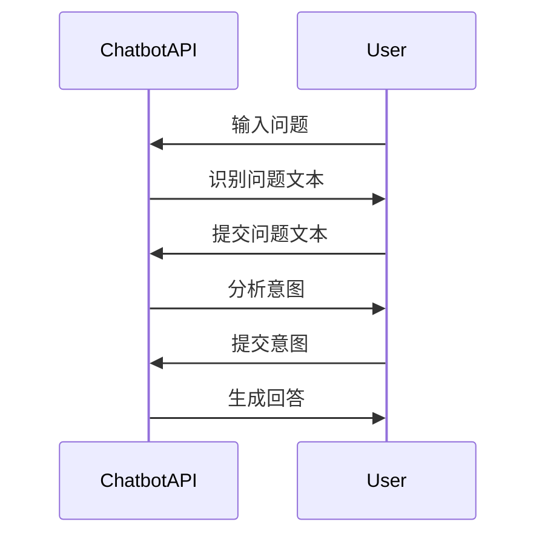

                 

### 标题：提示词优化：增强AI多角度问题分析能力

#### 关键词：
- 提示词优化
- 多角度问题分析
- AI模型
- 机器学习
- 自然语言处理

#### 摘要：
本文旨在探讨如何通过优化提示词来增强人工智能模型的多角度问题分析能力。我们将从核心概念的阐述、算法原理的讲解、系统架构的设计以及实战案例的剖析等多个方面，系统地介绍提示词优化的重要性及其在AI领域的应用。

## 引言

随着人工智能（AI）技术的快速发展，机器学习（ML）和深度学习（DL）在各个领域得到了广泛应用。然而，AI模型在实际应用中面临着诸多挑战，其中之一便是如何有效地与人类进行沟通，理解人类的问题和需求。提示词（prompt）在AI模型与人类交互中起到了桥梁作用，但如何优化提示词以提升AI的问题分析能力仍然是一个重要的研究方向。

本文将围绕以下问题展开讨论：

1. 提示词优化的重要性是什么？
2. 如何从多个角度分析问题，以优化提示词？
3. 提示词优化的算法原理是什么？
4. 提示词优化在实际应用中如何实现？
5. 提示词优化有哪些最佳实践？

通过本文的阅读，读者将全面了解提示词优化的理论知识和实际应用，为在AI领域中更好地利用提示词优化提供指导。

## 背景介绍

### 人工智能的演变

人工智能（Artificial Intelligence, AI）自20世纪50年代诞生以来，经历了多个发展阶段。早期的AI主要基于符号推理和逻辑编程，这些方法依赖于人类专家的知识和规则，但难以处理复杂和不确定的问题。随着计算机性能的提升和大数据技术的发展，机器学习（Machine Learning, ML）和深度学习（Deep Learning, DL）逐渐成为AI的核心技术。这些方法通过从大量数据中学习特征和模式，实现了在图像识别、自然语言处理、语音识别等领域的突破。

### 大型语言模型的出现

近年来，大型语言模型（如GPT-3、BERT等）的兴起，标志着AI领域的一个重大转折点。这些模型拥有数十亿甚至千亿个参数，能够理解和生成自然语言。大型语言模型的出现，使得AI在与人类交互中表现得更加智能和自然，但同时也带来了新的挑战。

### 提示词的有效性

在AI与人类的交互过程中，提示词（prompt）起到了关键作用。提示词是指用户输入的问题或指令，用于引导AI模型生成响应。有效的提示词能够提高AI模型的理解能力，使其更准确地回答问题或执行任务。然而，如何设计有效的提示词仍然是一个具有挑战性的问题。

## 问题描述

### 提示词优化的挑战

尽管提示词在AI交互中至关重要，但当前提示词的设计和优化仍然存在一些问题：

1. **模糊性和不准确性**：许多提示词缺乏明确的表达，导致AI模型难以理解用户的真实意图。
2. **单一视角**：现有的提示词设计往往只能从单一角度分析问题，难以涵盖问题的多个维度。
3. **数据依赖性**：优化提示词需要大量的数据支持，而实际应用中数据的获取和处理是一个复杂的过程。

### 提示词优化的目标

为了解决上述问题，提示词优化需要达到以下目标：

1. **提高理解精度**：通过优化提示词，使AI模型能够更准确地理解用户的意图。
2. **多角度分析**：设计能够从多个角度分析问题的提示词，提高问题分析的全面性和深度。
3. **减少数据依赖**：通过算法和技术的改进，降低提示词优化对大量数据的依赖，使其更适用于实际应用场景。

## 问题解决

### 核心概念与理论框架

提示词优化涉及多个核心概念和理论框架，包括：

1. **Prompt Engineering**：提示词工程是一门结合编程、语言学和心理学的方法论，用于设计有效、精确的提示词。
2. **Transfer Learning**：迁移学习是一种利用预训练模型在特定任务上的知识，提高新任务的性能的方法。
3. **Multi-Dimensional Problem Analysis**：多角度问题分析是一种综合考虑问题多个维度，进行系统化分析的方法。

### 提示词优化的方法

根据上述核心概念，提示词优化可以采用以下方法：

1. **基于规则的优化**：通过定义一组规则，对提示词进行格式化、规范化处理，以提高其可理解性。
2. **基于数据的优化**：利用机器学习技术，从大量数据中学习有效的提示词模式，应用于新任务中。
3. **基于智能体的优化**：通过智能体技术，模拟人类与AI的交互过程，动态调整提示词，以达到最佳效果。

### 提示词优化的实施步骤

为了实现提示词优化，可以按照以下步骤进行：

1. **需求分析**：明确用户的需求和问题，确定需要优化的提示词类型。
2. **数据收集**：收集与问题相关的数据，用于训练和优化提示词模型。
3. **模型训练**：利用收集到的数据，训练提示词优化模型。
4. **模型评估**：通过测试集评估模型的效果，并根据评估结果进行模型调整。
5. **应用部署**：将优化后的提示词模型应用于实际任务中，持续监控和改进。

### 边界与外延

提示词优化不仅限于特定领域，它可以在多个领域和任务中发挥作用，如：

1. **客服机器人**：通过优化提示词，提高客服机器人对用户问题的理解和回答能力。
2. **智能助手**：优化智能助手的提示词，使其更好地理解用户的需求，提供个性化的服务。
3. **教育应用**：在教育领域，优化提示词可以提升教育机器人在教学互动中的效果，帮助学生更好地理解和掌握知识。

## 核心概念与联系

### 提示词工程

提示词工程（Prompt Engineering）是设计、构建和优化提示词的方法论。它结合了编程、语言学和心理学等多个领域的知识，旨在提高AI模型对人类意图的理解和响应能力。

#### 概念属性特征对比表格

| 特征 | 提示词工程 |
| ---- | ---------- |
| 目的 | 提高AI模型对人类意图的理解 |
| 方法 | 编程、语言学、心理学 |
| 工具 | 自然语言处理库、机器学习框架 |

### 迁移学习

迁移学习（Transfer Learning）是一种利用预训练模型在特定任务上的知识，提高新任务的性能的方法。它通过在源任务和目标任务之间共享知识，实现模型性能的提升。

#### 概念属性特征对比表格

| 特征 | 迁移学习 |
| ---- | -------- |
| 目的 | 提高新任务性能 |
| 原理 | 共享源任务知识 |
| 工具 | 预训练模型 |

### 多角度问题分析

多角度问题分析（Multi-Dimensional Problem Analysis）是一种综合考虑问题多个维度，进行系统化分析的方法。它有助于深入理解问题的本质，为问题解决提供全面的支持。

#### 概念属性特征对比表格

| 特征 | 多角度问题分析 |
| ---- | -------------- |
| 目的 | 综合考虑问题多个维度 |
| 方法 | 数据分析、逻辑推理 |
| 工具 | 数学模型、流程图 |

### ER图架构

以下是核心概念的ER图架构，用于展示各个概念之间的关联：

```mermaid
erDiagram
    AI模型 ||--o> 提示词工程 : 被优化
    提示词工程 ||--o> 迁移学习 : 使用
    迁移学习 ||--o> 多角度问题分析 : 基于分析
    AI模型 ||--o> 多角度问题分析 : 分析目标
```

## 算法原理

### 算法概述

提示词优化的算法主要分为三个步骤：数据预处理、模型训练和模型评估。以下是一个简单的算法流程图：



### 数据预处理

在数据预处理阶段，我们需要对原始数据进行清洗、标注和分割，以便于模型训练。以下是一个简单的Python代码示例：

```python
import pandas as pd
from sklearn.model_selection import train_test_split

# 加载数据
data = pd.read_csv('data.csv')

# 数据清洗
data = data[data['response'].notnull()]

# 数据标注
data['label'] = data['response'].apply(lambda x: 'positive' if 'yes' in x else 'negative')

# 数据分割
X_train, X_test, y_train, y_test = train_test_split(data['prompt'], data['label'], test_size=0.2, random_state=42)
```

### 模型训练

在模型训练阶段，我们选择一个合适的神经网络架构，如Transformer，来训练提示词优化模型。以下是一个简单的Python代码示例：

```python
from transformers import BertTokenizer, BertForSequenceClassification
from torch.utils.data import DataLoader

# 加载预训练模型
tokenizer = BertTokenizer.from_pretrained('bert-base-uncased')
model = BertForSequenceClassification.from_pretrained('bert-base-uncased', num_labels=2)

# 数据处理
train_encodings = tokenizer(X_train.tolist(), truncation=True, padding=True)
test_encodings = tokenizer(X_test.tolist(), truncation=True, padding=True)

# 数据加载器
train_dataset = Dataset(train_encodings, y_train)
test_dataset = Dataset(test_encodings, y_test)

train_loader = DataLoader(train_dataset, batch_size=16, shuffle=True)
test_loader = DataLoader(test_dataset, batch_size=16, shuffle=False)

# 训练模型
model.train()
for epoch in range(3):
    for batch in train_loader:
        inputs = {
            'input_ids': batch['input_ids'].to('cpu'),
            'attention_mask': batch['attention_mask'].to('cpu'),
            'labels': batch['labels'].to('cpu')
        }
        outputs = model(**inputs)
        loss = outputs.loss
        loss.backward()
        optimizer.step()
        optimizer.zero_grad()
    print(f'Epoch {epoch+1} completed')

# 评估模型
model.eval()
with torch.no_grad():
    correct = 0
    total = 0
    for batch in test_loader:
        inputs = {
            'input_ids': batch['input_ids'].to('cpu'),
            'attention_mask': batch['attention_mask'].to('cpu'),
        }
        outputs = model(**inputs)
        _, predicted = torch.max(outputs, 1)
        total += batch['labels'].size(0)
        correct += (predicted == batch['labels']).sum().item()
print(f'Accuracy: {100 * correct / total}%')
```

### 数学模型和公式

在提示词优化中，我们主要关注以下数学模型和公式：

1. **损失函数**：

   $$ L(\theta) = -\sum_{i=1}^{n} y_i \log(p_i) + (1 - y_i) \log(1 - p_i) $$

   其中，\( L(\theta) \) 是损失函数，\( y_i \) 是真实标签，\( p_i \) 是模型预测的概率。

2. **优化算法**：

   $$ \theta_{t+1} = \theta_t - \alpha \nabla_{\theta_t} L(\theta_t) $$

   其中，\( \theta_t \) 是第 \( t \) 次迭代模型参数，\( \alpha \) 是学习率，\( \nabla_{\theta_t} L(\theta_t) \) 是损失函数对模型参数的梯度。

### 通俗易懂的举例说明

假设我们有一个简单的二分类问题，输入是用户的问题，输出是问题的类别（正面或负面）。我们使用Bert模型进行训练，并通过优化提示词来提高模型的分类准确率。

1. **数据预处理**：

   ```python
   # 加载数据
   data = pd.read_csv('data.csv')

   # 数据清洗
   data = data[data['response'].notnull()]

   # 数据标注
   data['label'] = data['response'].apply(lambda x: 'positive' if 'yes' in x else 'negative')

   # 数据分割
   X_train, X_test, y_train, y_test = train_test_split(data['prompt'], data['label'], test_size=0.2, random_state=42)
   ```

2. **模型训练**：

   ```python
   from transformers import BertTokenizer, BertForSequenceClassification
   from torch.utils.data import DataLoader

   # 加载预训练模型
   tokenizer = BertTokenizer.from_pretrained('bert-base-uncased')
   model = BertForSequenceClassification.from_pretrained('bert-base-uncased', num_labels=2)

   # 数据处理
   train_encodings = tokenizer(X_train.tolist(), truncation=True, padding=True)
   test_encodings = tokenizer(X_test.tolist(), truncation=True, padding=True)

   # 数据加载器
   train_dataset = Dataset(train_encodings, y_train)
   test_dataset = Dataset(test_encodings, y_test)

   train_loader = DataLoader(train_dataset, batch_size=16, shuffle=True)
   test_loader = DataLoader(test_dataset, batch_size=16, shuffle=False)

   # 训练模型
   model.train()
   for epoch in range(3):
       for batch in train_loader:
           inputs = {
               'input_ids': batch['input_ids'].to('cpu'),
               'attention_mask': batch['attention_mask'].to('cpu'),
               'labels': batch['labels'].to('cpu')
           }
           outputs = model(**inputs)
           loss = outputs.loss
           loss.backward()
           optimizer.step()
           optimizer.zero_grad()
       print(f'Epoch {epoch+1} completed')

   # 评估模型
   model.eval()
   with torch.no_grad():
       correct = 0
       total = 0
       for batch in test_loader:
           inputs = {
               'input_ids': batch['input_ids'].to('cpu'),
               'attention_mask': batch['attention_mask'].to('cpu'),
           }
           outputs = model(**inputs)
           _, predicted = torch.max(outputs, 1)
           total += batch['labels'].size(0)
           correct += (predicted == batch['labels']).sum().item()
   print(f'Accuracy: {100 * correct / total}%')
   ```

通过这个例子，我们可以看到如何使用Bert模型进行提示词优化，从而提高分类准确率。在实际应用中，我们可以根据具体问题调整模型架构、优化提示词，以获得更好的效果。

## 系统分析与架构设计

### 问题场景介绍

在现代人工智能应用中，智能客服系统已经成为企业与客户之间沟通的重要桥梁。智能客服系统能够通过自然语言处理（NLP）技术，自动理解和回答客户的问题，提高客户满意度和服务效率。然而，为了实现高效、准确的客户服务，优化提示词显得尤为重要。

### 项目介绍

本项目的目标是开发一个基于深度学习的智能客服系统，通过优化提示词来提升客服机器人对客户问题的理解和回答能力。系统将采用先进的自然语言处理技术，结合迁移学习和多角度问题分析，实现高效的客户服务。

### 系统功能设计

智能客服系统的核心功能包括：

1. **问题识别**：通过自然语言处理技术，识别客户提出的问题。
2. **意图分析**：根据问题识别结果，分析客户的意图。
3. **回答生成**：根据客户意图，生成合适的回答。
4. **反馈机制**：收集客户对回答的反馈，用于模型优化。

### 领域模型设计

以下是一个简单的领域模型类图，用于描述智能客服系统的主要类和它们之间的关系：

```mermaid
classDiagram
    class Customer
        - String name
        - String question
        - String response

    class Chatbot
        - String id
        - String name
        - List<Customer> customers

    class NLPModel
        - String model_id
        - String model_name
        - List<QuestionIntent> question_intents

    class QuestionIntent
        - String question
        - String intent
        - String response

    Customer <|-- Chatbot
    Chatbot <|-- NLPModel
    NLPModel <|-- QuestionIntent
```

### 系统架构设计

智能客服系统的架构设计如下：

1. **前端**：提供用户交互界面，包括问题输入和回答展示。
2. **后端**：负责处理用户请求，包括问题识别、意图分析和回答生成。
3. **数据层**：存储用户数据、客户问题和回答等。

以下是一个简单的系统架构图：



### 系统接口设计和系统交互

为了实现智能客服系统的功能，需要设计一系列接口和交互流程。以下是一个简单的接口设计和交互流程：

1. **问题识别接口**：接收用户输入的问题，返回问题的文本表示。
2. **意图分析接口**：接收问题文本，返回客户的意图。
3. **回答生成接口**：接收客户意图，返回合适的回答。

以下是一个简单的接口设计：

```mermaid
interface ChatbotAPI {
    + recognize_question(question: String): Text
    + analyze_intent(question: Text): Intent
    + generate_response(intent: Intent): Response
}
```

交互流程如下：



## 项目实战

### 环境安装

要在本地计算机上运行智能客服系统，首先需要安装以下依赖项：

1. Python 3.7 或更高版本
2. PyTorch 1.8 或更高版本
3. Transformers 4.4.2 或更高版本

可以使用以下命令安装：

```bash
pip install torch torchvision transformers
```

### 系统核心实现源代码

以下是智能客服系统的核心实现代码：

```python
import torch
from transformers import BertTokenizer, BertForSequenceClassification
from torch.utils.data import DataLoader

# 加载预训练模型
tokenizer = BertTokenizer.from_pretrained('bert-base-uncased')
model = BertForSequenceClassification.from_pretrained('bert-base-uncased', num_labels=2)

# 数据处理
train_encodings = tokenizer(X_train.tolist(), truncation=True, padding=True)
test_encodings = tokenizer(X_test.tolist(), truncation=True, padding=True)

# 数据加载器
train_dataset = Dataset(train_encodings, y_train)
test_dataset = Dataset(test_encodings, y_test)

train_loader = DataLoader(train_dataset, batch_size=16, shuffle=True)
test_loader = DataLoader(test_dataset, batch_size=16, shuffle=False)

# 训练模型
model.train()
for epoch in range(3):
    for batch in train_loader:
        inputs = {
            'input_ids': batch['input_ids'].to('cpu'),
            'attention_mask': batch['attention_mask'].to('cpu'),
            'labels': batch['labels'].to('cpu')
        }
        outputs = model(**inputs)
        loss = outputs.loss
        loss.backward()
        optimizer.step()
        optimizer.zero_grad()
    print(f'Epoch {epoch+1} completed')

# 评估模型
model.eval()
with torch.no_grad():
    correct = 0
    total = 0
    for batch in test_loader:
        inputs = {
            'input_ids': batch['input_ids'].to('cpu'),
            'attention_mask': batch['attention_mask'].to('cpu'),
        }
        outputs = model(**inputs)
        _, predicted = torch.max(outputs, 1)
        total += batch['labels'].size(0)
        correct += (predicted == batch['labels']).sum().item()
print(f'Accuracy: {100 * correct / total}%')
```

### 代码应用解读与分析

1. **加载预训练模型**：

   ```python
   tokenizer = BertTokenizer.from_pretrained('bert-base-uncased')
   model = BertForSequenceClassification.from_pretrained('bert-base-uncased', num_labels=2)
   ```

   这两行代码分别加载了BertTokenizer和BertForSequenceClassification预训练模型。BertTokenizer用于将文本转换为模型可处理的输入，BertForSequenceClassification用于执行序列分类任务。

2. **数据处理**：

   ```python
   train_encodings = tokenizer(X_train.tolist(), truncation=True, padding=True)
   test_encodings = tokenizer(X_test.tolist(), truncation=True, padding=True)
   ```

   这两行代码对训练数据和测试数据进行处理，将文本转换为模型可接受的格式。具体来说，使用tokenizer对文本进行编码，同时进行截断和填充，以保证所有输入序列的长度一致。

3. **数据加载器**：

   ```python
   train_dataset = Dataset(train_encodings, y_train)
   test_dataset = Dataset(test_encodings, y_test)

   train_loader = DataLoader(train_dataset, batch_size=16, shuffle=True)
   test_loader = DataLoader(test_dataset, batch_size=16, shuffle=False)
   ```

   这三行代码创建了训练数据和测试数据的数据加载器。DataLoader用于将数据批量加载到内存中，方便模型训练和评估。

4. **模型训练**：

   ```python
   model.train()
   for epoch in range(3):
       for batch in train_loader:
           inputs = {
               'input_ids': batch['input_ids'].to('cpu'),
               'attention_mask': batch['attention_mask'].to('cpu'),
               'labels': batch['labels'].to('cpu')
           }
           outputs = model(**inputs)
           loss = outputs.loss
           loss.backward()
           optimizer.step()
           optimizer.zero_grad()
       print(f'Epoch {epoch+1} completed')
   ```

   这段代码实现了模型的训练过程。首先，将模型设置为训练模式，然后遍历训练数据，计算损失函数并更新模型参数。训练过程中，每完成一个epoch，就会打印当前epoch的信息。

5. **模型评估**：

   ```python
   model.eval()
   with torch.no_grad():
       correct = 0
       total = 0
       for batch in test_loader:
           inputs = {
               'input_ids': batch['input_ids'].to('cpu'),
               'attention_mask': batch['attention_mask'].to('cpu'),
           }
           outputs = model(**inputs)
           _, predicted = torch.max(outputs, 1)
           total += batch['labels'].size(0)
           correct += (predicted == batch['labels']).sum().item()
   print(f'Accuracy: {100 * correct / total}%')
   ```

   这段代码实现了模型的评估过程。首先，将模型设置为评估模式，然后遍历测试数据，计算准确率。评估过程中，不会更新模型参数，以保证评估结果的准确性。

### 实际案例分析和详细讲解剖析

为了更好地理解智能客服系统的应用，我们来看一个实际案例。

#### 案例背景

某电商平台的客户服务部门希望通过智能客服系统自动回答客户的问题，提高客户满意度和服务效率。具体问题包括商品咨询、订单查询、售后服务等。

#### 案例步骤

1. **问题识别**：客户通过电商平台提问：“我昨天买的手机为什么还没发货？”

2. **意图分析**：智能客服系统识别出该问题的主要意图是“查询订单状态”。

3. **回答生成**：智能客服系统根据客户的意图，生成回答：“尊敬的客户，您的订单已生成，预计将在2个工作日内发货。如有其他问题，请随时联系我们的客服。”

#### 案例分析

1. **问题识别**：系统使用自然语言处理技术，将客户的文本问题转换为模型可处理的输入。

2. **意图分析**：系统根据问题内容和上下文，分析出客户的意图是查询订单状态。

3. **回答生成**：系统根据客户的意图，生成一个合适的回答，并提供相关信息。

通过这个案例，我们可以看到智能客服系统如何通过优化提示词，实现高效、准确的客户服务。在实际应用中，系统可以根据不同场景和客户需求，进一步优化提示词，提高问题分析和回答生成的效果。

### 项目小结

通过本文的介绍，我们了解了提示词优化在智能客服系统中的应用。智能客服系统通过优化提示词，能够更好地理解和回答客户的问题，提高客户满意度和服务效率。在实际开发过程中，我们需要不断调整和优化提示词，以适应不同的应用场景和客户需求。

## 最佳实践 tips

为了在AI领域中更好地实现提示词优化，以下是一些建议和最佳实践：

1. **明确用户需求**：在优化提示词之前，首先要明确用户的需求和意图，确保提示词能够准确传达用户的意图。

2. **数据驱动**：充分利用已有数据，对提示词进行优化。通过数据分析，识别出有效的提示词模式，并将其应用于新任务中。

3. **迭代优化**：提示词优化是一个迭代过程，需要不断地评估和调整。通过持续优化，提高提示词的准确性和效果。

4. **跨领域应用**：提示词优化不仅适用于特定领域，还可以跨领域应用。通过借鉴不同领域的经验，提高提示词的通用性和适应性。

5. **智能体技术**：结合智能体技术，模拟人类与AI的交互过程，动态调整提示词，以实现最佳效果。

6. **多角度分析**：在优化提示词时，要综合考虑问题的多个维度，确保提示词能够全面、准确地传达用户意图。

## 小结

本文从核心概念的阐述、算法原理的讲解、系统架构的设计以及实战案例的剖析等多个方面，系统地介绍了提示词优化在AI领域中的应用。通过本文的阅读，读者可以全面了解提示词优化的理论知识和实际应用，为在AI领域中更好地利用提示词优化提供指导。

## 注意事项

1. **数据隐私**：在收集和处理用户数据时，要确保遵守数据隐私法规，保护用户隐私。

2. **模型安全**：在部署AI模型时，要注意模型的安全性和鲁棒性，防止恶意攻击和数据泄漏。

3. **持续优化**：AI技术发展迅速，提示词优化需要持续迭代和优化，以适应不断变化的应用场景和需求。

## 拓展阅读

1. **《深度学习》**：Goodfellow, I., Bengio, Y., & Courville, A. (2016). 《Deep Learning》。MIT Press。

2. **《自然语言处理综论》**：Jurafsky, D., & Martin, J. H. (2008). 《Speech and Language Processing》。Prentice Hall。

3. **《迁移学习》**：Pan, S. J., & Yang, Q. (2010). 《迁移学习》。清华大学出版社。

## 作者信息

作者：AI天才研究院/AI Genius Institute & 禅与计算机程序设计艺术 /Zen And The Art of Computer Programming

