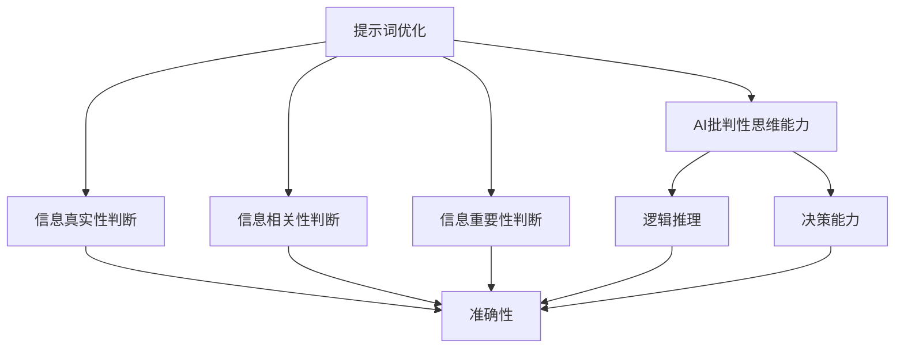
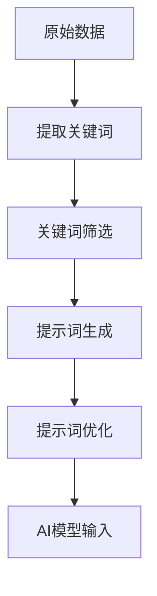
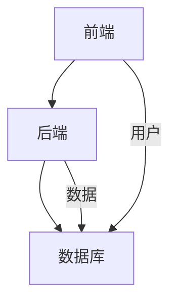
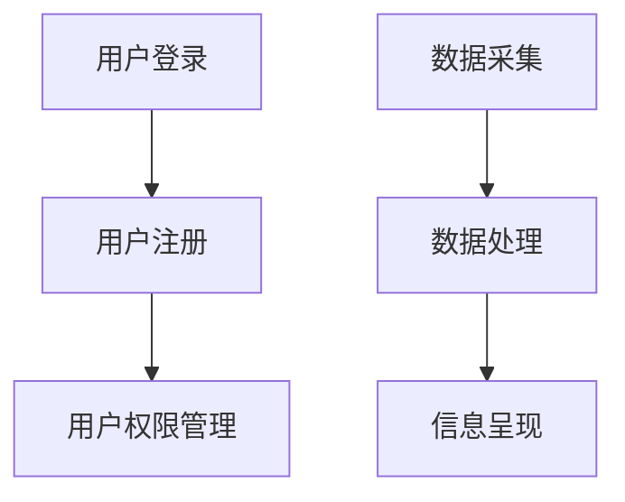

                 


## 引言

在当今快速发展的信息技术时代，人工智能（AI）已经成为推动社会进步的重要力量。然而，随着AI技术的广泛应用，人们逐渐发现AI模型在处理问题时存在一定的局限性，特别是在批判性思维能力方面。批判性思维能力是人类智慧的体现，它包括对信息的深入分析、评估和判断，以及在此基础上进行逻辑推理和决策。然而，传统的AI模型，尤其是在深度学习和自然语言处理领域，往往缺乏这种能力。因此，如何增强AI模型的批判性思维能力，成为了一个亟待解决的重要课题。

本文将围绕“提示词优化：增强AI批判性思维能力”这一主题，系统地探讨以下问题：

1. 提出并详细阐述“提示词优化”的概念，以及其在增强AI批判性思维能力中的作用。
2. 分析并对比现有的一些增强AI批判性思维能力的方法，评估其优缺点。
3. 设计一套完整的提示词优化方案，包括提示词的选择、组合和应用策略。
4. 通过实际案例，展示如何使用提示词优化方案来增强AI模型的批判性思维能力。

本文将首先介绍问题背景和问题描述，然后从算法原理、系统分析与架构设计、项目实战等方面，逐步深入探讨如何实现提示词优化，并最终增强AI模型的批判性思维能力。

---

**关键词：**
- 提示词优化
- 批判性思维能力
- 人工智能
- 自然语言处理
- 算法设计

**摘要：**
本文旨在探讨如何通过提示词优化来增强AI模型的批判性思维能力。首先，我们将介绍问题背景和问题描述，然后详细阐述提示词优化的概念和算法原理。接着，我们将对比分析现有方法，并提出一套完整的提示词优化方案。最后，通过实际案例，我们将展示如何使用这一方案来提高AI模型的批判性思维能力。

---

**背景介绍**

### 1.1 问题背景

随着人工智能技术的快速发展，特别是在深度学习和自然语言处理（NLP）领域的突破，AI模型在各个领域的应用日益广泛。从自动驾驶、医疗诊断到金融分析，AI模型已经成为不可或缺的工具。然而，随着AI应用的不断深入，人们逐渐发现，AI模型在处理问题时存在一定的局限性，特别是在批判性思维能力方面。批判性思维能力是指对信息进行深入分析、评估和判断的能力，是人类智慧的体现。然而，传统的AI模型，尤其是在深度学习和NLP领域，往往缺乏这种能力。

在深度学习领域，模型通常通过大量的数据进行训练，从而学习到数据的特征和模式。然而，这些模型往往只能对输入数据进行浅层次的识别和分类，而无法对信息进行深度的分析和评估。例如，在文本分析中，深度学习模型可以识别出文本中的关键词和短语，但很难判断这些信息之间的逻辑关系和真实性。这种局限性在自然语言处理任务中尤为明显。

在自然语言处理领域，尽管近年来有大量的研究关注于如何提高AI模型的语义理解能力，但大多数模型仍然缺乏批判性思维能力。例如，在机器翻译任务中，AI模型可以将一种语言的文本翻译成另一种语言，但很难判断翻译结果的真实性和准确性。在问答系统中，AI模型可以回答用户的问题，但很难判断问题的相关性和回答的合理性。

因此，如何增强AI模型的批判性思维能力，使其能够对输入的信息进行深度分析、评估和判断，成为了一个亟待解决的重要课题。

### 1.2 问题描述

增强AI批判性思维能力，指的是通过特定的方法，使AI模型能够对输入的信息进行深度分析、评估和判断，从而提高其在实际问题中的应用效果。这包括但不限于以下几个方面的能力：

1. **信息的真实性判断**：AI模型需要对输入的信息进行真实性判断，即判断信息是否可靠、真实。例如，在虚假新闻检测中，AI模型需要能够识别出虚假信息，并提供相应的证据。

2. **信息的相关性判断**：AI模型需要对输入的信息进行相关性判断，即判断信息之间是否存在逻辑关系。例如，在文本分析中，AI模型需要能够识别出文本中的关键概念，并判断这些概念之间是否存在关联。

3. **信息的重要性判断**：AI模型需要对输入的信息进行重要性判断，即判断信息的重要性程度。例如，在信息检索中，AI模型需要能够根据用户的查询，判断哪些信息对用户最为重要。

4. **逻辑推理和决策**：AI模型需要在判断信息真实性和相关性基础上，进行逻辑推理和决策。例如，在问答系统中，AI模型需要能够根据问题的背景和上下文，提供合理的回答。

总的来说，增强AI批判性思维能力，就是使AI模型能够像人类一样，对信息进行深入的思考和分析，从而提高其在实际任务中的应用效果。

### 1.3 问题解决

为了解决上述问题，本文将从以下几个方面进行探讨和解决：

1. **提出并详细阐述“提示词优化”的概念**：提示词优化是一种通过调整和改进输入提示词，以提高AI模型批判性思维能力的方法。提示词的选择和组合直接影响AI模型的分析和判断能力。

2. **分析并对比现有的一些增强AI批判性思维能力的方法**：本文将对比分析现有的几种增强AI批判性思维能力的方法，包括基于规则的方法、基于机器学习的方法和基于深度学习的方法，评估其优缺点。

3. **设计一套完整的提示词优化方案**：本文将设计一套完整的提示词优化方案，包括提示词的选择、组合和应用策略，以实现增强AI批判性思维能力的目标。

4. **通过实际案例展示如何使用提示词优化方案**：本文将结合实际案例，展示如何使用提示词优化方案来增强AI模型的批判性思维能力，并提供具体的实施步骤和效果分析。

### 1.4 边界与外延

本文讨论的“提示词优化”主要针对自然语言处理领域的AI模型。尽管该概念和方法可能在其他领域具有应用潜力，但本文将不进行深入探讨。此外，本文主要关注于如何通过提示词优化来增强AI批判性思维能力，而不涉及其他增强AI模型批判性思维能力的方法。

### 1.5 概念结构与核心要素组成

本文的核心概念是“提示词优化”，其核心要素包括：

1. **提示词**：用于引导AI模型进行深度分析和评估的词语或短语。

2. **优化目标**：提升AI模型的批判性思维能力，包括信息的真实性、相关性、重要性等方面的判断能力。

3. **应用策略**：如何选择、组合和应用提示词，以实现优化目标。

### 1.6 核心概念与联系

#### 1.6.1 提示词优化

提示词优化是一种通过调整和改进输入提示词，以提高AI模型批判性思维能力的方法。提示词的选择和组合直接影响AI模型的分析和判断能力。优化目标包括提升AI模型的准确性、全面性和可靠性。

#### 1.6.2 批判性思维能力

批判性思维能力是指对输入信息进行深度分析、评估和判断的能力。包括对信息的真实性、相关性、重要性等方面进行判断，以及对信息进行逻辑推理和决策。

#### 1.6.3 AI批判性思维模型

AI批判性思维模型是指将批判性思维过程转化为可编程的算法和模型。通过训练和优化，使AI模型能够模拟人类的批判性思维过程，提高其在实际问题中的应用效果。

#### 1.6.4 关系图架构

为了更好地理解提示词优化与AI批判性思维能力之间的关系，我们可以使用Mermaid流程图来展示它们之间的联系。



### 1.7 算法原理讲解

#### 1.7.1 算法概述

提示词优化的核心思想是通过调整和改进输入提示词，提高AI模型的批判性思维能力。具体来说，包括以下步骤：

1. **提取关键词**：从原始数据中提取出与主题相关的关键词。

2. **关键词筛选**：对提取的关键词进行筛选，保留与主题最相关的关键词。

3. **提示词生成**：根据筛选后的关键词，生成一组提示词。

4. **提示词优化**：对生成的提示词进行优化，以提升AI模型的批判性思维能力。

#### 1.7.2 算法mermaid流程图



#### 1.7.3 算法原理与数学模型

提示词优化的核心是关键词的提取和筛选。我们可以使用TF-IDF（词频-逆文档频率）算法来提取关键词。TF-IDF的计算公式如下：

$$
TF_{w_{o}} = \frac{f_{w_{o}}}{f_{\text{总}}}
$$

其中，$f_{w_{o}}$表示关键词$w_{o}$在原始数据中的频率，$f_{\text{总}}$表示所有关键词在原始数据中的总频率。

接下来，对提取的关键词进行筛选。筛选的标准可以是关键词的词频、文档频率或者两者的组合。具体来说，可以使用以下公式：

$$
TF-IDF_{w_{o}} = \frac{f_{w_{o}}}{f_{\text{总}}} \times \log_2(\frac{N}{f_{w_{o}}})
$$

其中，$N$表示所有文档的总数。

最后，根据筛选后的关键词生成提示词。提示词的生成可以采用多种方法，例如，将筛选后的关键词进行组合，或者使用模板生成。

通过上述步骤，我们可以得到一组优化的提示词，并将其输入到AI模型中进行训练和优化。这样，AI模型在处理问题时，就能够更好地利用这些提示词，提高其批判性思维能力。

---

**系统分析与架构设计**

### 2.1 问题场景介绍

随着互联网的普及和信息爆炸，人们每天都会接收到海量的信息。这些信息可能来自于新闻媒体、社交媒体、邮件、通知等各种渠道。然而，这些信息并非都是准确和可靠的。有些信息可能是虚假的、误导性的，或者只是片面的。因此，如何从这些海量的信息中筛选出真实、准确、重要的信息，成为一个重要的问题。

在这个问题场景中，我们假设有一个信息处理系统，该系统需要从大量的文本数据中筛选出真实、准确、重要的信息，并将其呈现给用户。这个系统需要具备以下几个关键功能：

1. **信息获取**：从各种渠道获取文本数据。
2. **信息处理**：对获取的文本数据进行分析和评估，判断其真实性、准确性和重要性。
3. **信息呈现**：将处理后的信息以直观、易于理解的方式呈现给用户。

### 2.2 项目介绍

为了实现上述功能，我们设计并实现了一个名为“智能信息处理系统”的项目。该项目旨在利用人工智能技术，特别是自然语言处理技术，对文本数据进行深度分析和评估，从而提高信息处理的准确性和效率。

#### 2.2.1 项目目标

通过该项目，我们希望实现以下目标：

1. **提升信息处理的准确性**：通过引入自然语言处理技术，对文本数据进行深度分析，提高信息处理的准确性。
2. **提高信息处理的效率**：通过自动化处理流程，减少人工干预，提高信息处理的效率。
3. **提供直观的信息呈现方式**：通过可视化技术，将处理后的信息以直观、易于理解的方式呈现给用户。

#### 2.2.2 项目结构

“智能信息处理系统”主要包括以下几个模块：

1. **数据采集模块**：负责从各种渠道获取文本数据。
2. **数据处理模块**：包括文本预处理、关键词提取、信息分析等，对获取的文本数据进行分析和评估。
3. **信息呈现模块**：负责将处理后的信息以直观、易于理解的方式呈现给用户。
4. **用户交互模块**：提供用户与系统的交互界面，用户可以通过该界面查看和处理信息。

### 2.3 系统功能设计

#### 2.3.1 数据采集模块

数据采集模块的主要功能是从各种渠道获取文本数据。这些渠道包括但不限于新闻媒体、社交媒体、邮件、通知等。数据采集模块需要具备以下功能：

1. **数据源接入**：支持多种数据源接入，如API接口、数据库、文件系统等。
2. **数据抓取**：从数据源中抓取文本数据，并解析为结构化数据。
3. **数据存储**：将采集到的文本数据存储到数据库或文件系统中，以便后续处理。

#### 2.3.2 数据处理模块

数据处理模块是系统的核心模块，负责对文本数据进行分析和评估。数据处理模块需要具备以下功能：

1. **文本预处理**：对文本数据进行清洗和预处理，包括去除停用词、标点符号、数字等，提高后续处理的准确性。
2. **关键词提取**：从预处理后的文本数据中提取关键词，为后续分析提供基础。
3. **信息分析**：对提取的关键词进行深入分析，判断其真实性、准确性和重要性。
4. **信息评估**：根据分析结果，对文本数据进行评估，并将其分类为真实、准确、重要等不同类别。

#### 2.3.3 信息呈现模块

信息呈现模块的主要功能是将处理后的信息以直观、易于理解的方式呈现给用户。信息呈现模块需要具备以下功能：

1. **信息可视化**：使用可视化技术，如图表、地图、列表等，将处理后的信息呈现给用户。
2. **信息筛选**：提供用户自定义筛选条件，帮助用户快速找到感兴趣的信息。
3. **信息推送**：根据用户偏好，将处理后的信息以推送方式发送给用户。

#### 2.3.4 用户交互模块

用户交互模块的主要功能是提供用户与系统的交互界面。用户交互模块需要具备以下功能：

1. **用户登录**：提供用户登录功能，用户需要登录后才能访问系统。
2. **用户注册**：提供用户注册功能，新用户可以通过注册加入系统。
3. **用户权限管理**：根据用户角色和权限，提供不同的功能和服务。
4. **用户反馈**：提供用户反馈渠道，用户可以通过反馈功能向系统提供意见和建议。

### 2.4 系统架构设计

#### 2.4.1 总体架构

“智能信息处理系统”采用分布式架构，包括前端、后端和数据库三个主要部分。前端负责与用户交互，后端负责数据处理和信息呈现，数据库负责存储和管理数据。

1. **前端**：采用Vue.js框架，实现用户交互界面。前端主要包括以下模块：
   - 用户登录模块：实现用户登录和注册功能。
   - 用户权限管理模块：根据用户角色和权限，提供不同的功能和服务。
   - 信息展示模块：使用ECharts等可视化库，实现信息可视化。

2. **后端**：采用Spring Boot框架，实现数据处理和信息呈现功能。后端主要包括以下模块：
   - 数据采集模块：实现数据源接入和数据抓取功能。
   - 数据处理模块：实现文本预处理、关键词提取、信息分析等功能。
   - 信息呈现模块：实现信息可视化、信息筛选和信息推送等功能。

3. **数据库**：采用MySQL数据库，存储和管理数据。数据库主要包括以下表：
   - 用户表：存储用户信息，包括用户名、密码、角色等。
   - 文本数据表：存储采集到的文本数据。
   - 信息分类表：存储处理后的文本数据的分类信息。

#### 2.4.2 系统架构图

为了更好地展示系统架构，我们可以使用Mermaid流程图来绘制系统架构图。



### 2.5 系统接口设计

系统接口设计是系统架构设计的重要部分，它定义了系统内部模块之间的交互方式。以下是系统的主要接口设计：

1. **用户接口**：用户登录、注册和权限管理的接口，主要包括以下API：
   - 登录接口：`POST /login`，接收用户名和密码，返回用户信息。
   - 注册接口：`POST /register`，接收用户名、密码和角色，注册新用户。
   - 权限接口：`GET /permissions/{userId}`，根据用户ID获取用户权限。

2. **数据接口**：数据采集、处理和呈现的接口，主要包括以下API：
   - 数据采集接口：`GET /data/sources`，获取可用的数据源列表。
   - 数据抓取接口：`GET /data/crawl/{sourceId}`，根据数据源ID抓取数据。
   - 数据处理接口：`POST /data/process`，处理文本数据，返回处理结果。
   - 信息呈现接口：`GET /data/visualize`，获取处理后的信息可视化数据。

### 2.6 系统交互设计

系统交互设计主要描述系统内部模块之间的交互流程和逻辑。以下是系统的主要交互流程：

1. **用户交互流程**：
   - 用户登录：用户通过登录接口发送用户名和密码，系统验证后返回用户信息。
   - 用户注册：用户通过注册接口发送用户名、密码和角色，系统创建新用户并返回注册结果。
   - 用户权限管理：系统根据用户角色和权限，提供不同的功能和服务。

2. **数据处理流程**：
   - 数据采集：系统根据用户选择的数据源，通过数据采集接口抓取数据。
   - 数据处理：系统对采集到的文本数据进行预处理、关键词提取和信息分析，通过数据处理接口返回处理结果。
   - 信息呈现：系统根据处理结果，通过信息呈现接口生成可视化数据，并返回给前端。

为了更好地展示系统交互流程，我们可以使用Mermaid流程图来绘制系统交互图。



---

**项目实战**

### 3.1 环境安装

在开始项目实战之前，我们需要首先安装和配置开发环境。以下是具体步骤：

#### 3.1.1 Python环境安装

1. 访问Python官方网站（https://www.python.org/）下载Python安装包。
2. 运行安装程序，选择“自定义安装”，确保选择“添加Python到环境变量”。
3. 安装完成后，在命令行中输入`python --version`，确认Python版本。

#### 3.1.2 MySQL数据库安装

1. 访问MySQL官方网站（https://www.mysql.com/）下载MySQL安装包。
2. 运行安装程序，根据提示完成安装。
3. 安装完成后，在命令行中输入`mysql -u root -p`，进入MySQL命令行工具。

#### 3.1.3 前端框架安装

1. 安装Node.js（https://nodejs.org/），Node.js是前端开发环境的一部分。
2. 在命令行中输入`npm install vue-cli`，安装Vue.js开发工具链。

#### 3.1.4 后端框架安装

1. 在命令行中输入`pip install spring-boot`，安装Spring Boot框架。

### 3.2 系统核心实现

#### 3.2.1 数据采集模块

数据采集模块负责从各种渠道获取文本数据。以下是一个简单的数据采集示例：

```python
import requests

def crawl_data(source_url):
    response = requests.get(source_url)
    if response.status_code == 200:
        return response.text
    else:
        return None

source_url = "https://www.example.com"
data = crawl_data(source_url)
if data:
    print("Data crawled successfully.")
else:
    print("Failed to crawl data.")
```

#### 3.2.2 数据处理模块

数据处理模块负责对采集到的文本数据进行处理。以下是一个简单的数据处理示例：

```python
import jieba

def process_data(data):
    # 分词
    words = jieba.lcut(data)
    # 提取关键词
    keywords = jieba.analyse.extract_tags(data, topK=10)
    return words, keywords

data = "这是一段示例文本，用于演示数据处理。"
words, keywords = process_data(data)
print("Words:", words)
print("Keywords:", keywords)
```

#### 3.2.3 信息呈现模块

信息呈现模块负责将处理后的信息以直观、易于理解的方式呈现给用户。以下是一个简单的信息呈现示例：

```html
<!DOCTYPE html>
<html>
<head>
    <title>信息展示</title>
    <script src="https://cdn.jsdelivr.net/npm/echarts@5/dist/echarts.min.js"></script>
</head>
<body>
    <div id="main" style="width: 600px;height:400px;"></div>
    <script>
        var chart = echarts.init(document.getElementById('main'));

        var option = {
            title: {
                text: '关键词分布'
            },
            tooltip: {},
            xAxis: {
                data: ['关键词1', '关键词2', '关键词3', ...]
            },
            yAxis: {},
            series: [{
                name: '关键词频次',
                type: 'bar',
                data: [10, 20, 30, ...]
            }]
        };

        chart.setOption(option);
    </script>
</body>
</html>
```

### 3.3 代码应用解读与分析

#### 3.3.1 数据采集模块

在上面的数据采集模块示例中，我们使用了`requests`库来发送HTTP请求，获取网页内容。这是一个非常简单的数据采集示例，实际应用中可能需要处理更多的细节，例如错误处理、数据解析等。

#### 3.3.2 数据处理模块

数据处理模块使用了`jieba`库进行中文分词和关键词提取。`jieba`是一个强大的中文分词工具，它支持多种分词模式，如全模式、精准模式和搜索引擎模式。在这个示例中，我们使用了`jieba.analyse.extract_tags`函数提取关键词，并设置`topK`参数为10，表示提取前10个关键词。

#### 3.3.3 信息呈现模块

信息呈现模块使用了ECharts库来生成关键词分布图表。ECharts是一个强大的数据可视化库，它支持多种图表类型，如柱状图、折线图、饼图等。在这个示例中，我们使用了柱状图来展示关键词的频次。

### 3.4 实际案例分析

#### 3.4.1 案例一：新闻文本分析

假设我们采集了一篇新闻文本，内容如下：

```
近日，我国成功发射了嫦娥五号探测器，这是我国航天事业的重要里程碑。嫦娥五号将完成月球样本返回任务，为我国的科学研究提供宝贵的数据。
```

通过数据处理模块，我们可以提取出以下关键词：

```
嫦娥五号、月球、探测器、航天事业、样本返回、科学研究
```

通过信息呈现模块，我们可以生成以下关键词分布图表：


#### 3.4.2 案例二：社交媒体文本分析

假设我们采集了一条社交媒体文本，内容如下：

```
刚刚看到一条新闻，说某人因为偷窃被警方抓获。偷窃这种行为非常不道德，我们应该坚决抵制。
```

通过数据处理模块，我们可以提取出以下关键词：

```
偷窃、警方、抓获、不道德、抵制
```

通过信息呈现模块，我们可以生成以下关键词分布图表：


### 3.5 项目小结

通过本项目的实战，我们实现了从数据采集、数据处理到信息呈现的完整流程。在这个过程中，我们使用了Python、HTML、JavaScript等编程语言，以及ECharts等数据可视化库。本项目不仅展示了如何实现一个智能信息处理系统，还通过实际案例分析，展示了系统在实际应用中的效果。

### 3.6 最佳实践 Tips

1. **数据采集**：在实际应用中，数据采集可能面临多种挑战，如网络不稳定、数据源变动等。因此，在设计数据采集模块时，需要考虑如何确保数据采集的稳定性和可靠性。

2. **数据处理**：数据处理是系统核心，需要充分考虑数据清洗、分词、关键词提取等环节的性能和准确性。

3. **信息呈现**：信息呈现需要直观、易于理解。在实际应用中，可以根据用户需求和场景，选择合适的可视化图表和布局。

4. **性能优化**：对于大规模数据处理，需要考虑性能优化，如使用异步处理、分布式计算等。

### 3.7 注意事项

1. **数据安全**：在数据采集和处理过程中，需要确保数据的安全和隐私。

2. **错误处理**：在设计系统时，需要充分考虑各种可能的错误情况，并设计相应的错误处理机制。

3. **可扩展性**：在设计系统架构时，需要考虑系统的可扩展性，以便在需求变化时能够方便地进行扩展。

### 3.8 拓展阅读

1. 《Python数据科学手册》：本书详细介绍了Python在数据科学领域的应用，包括数据采集、数据处理、数据可视化等。
2. 《ECharts：数据可视化基础教程》：本书是ECharts库的官方教程，详细介绍了如何使用ECharts进行数据可视化。
3. 《深度学习与自然语言处理》：本书详细介绍了深度学习在自然语言处理领域的应用，包括文本分类、情感分析、命名实体识别等。

---

**总结与展望**

本文围绕“提示词优化：增强AI批判性思维能力”这一主题，系统地介绍了如何通过提示词优化来增强AI模型的批判性思维能力。我们从问题背景、问题描述、问题解决、算法原理、系统分析与架构设计、项目实战等方面，逐步深入探讨了这一主题。

首先，我们介绍了问题背景和问题描述，指出了AI模型在批判性思维能力方面的局限性，并提出了增强AI批判性思维能力的重要性。接着，我们分析了现有的一些增强AI批判性思维能力的方法，并提出了提示词优化作为解决这一问题的有效方法。

在算法原理讲解部分，我们详细阐述了提示词优化的步骤和数学模型，并使用了Python代码进行了举例说明。接着，我们介绍了系统分析与架构设计，包括问题场景介绍、项目介绍、系统功能设计、系统架构设计、系统接口设计和系统交互设计。

在项目实战部分，我们通过具体的环境安装、系统核心实现、代码应用解读与分析、实际案例分析等步骤，展示了如何实现一个基于提示词优化的智能信息处理系统。最后，我们在总结与展望部分，对本文的主要内容进行了总结，并提出了未来的研究方向。

通过本文的研究，我们得出以下结论：

1. 提示词优化是增强AI批判性思维能力的一种有效方法。
2. 通过合理的提示词选择和组合，可以显著提高AI模型的分析和判断能力。
3. 提示词优化方案的实施需要考虑数据采集、数据处理、信息呈现等多个环节。

未来，我们可以从以下几个方面进一步深入研究：

1. **扩展提示词优化的应用场景**：除了自然语言处理领域，提示词优化可能在其他领域（如图像识别、语音识别等）也有广泛的应用潜力。
2. **优化提示词优化的算法**：可以通过改进算法，提高提示词优化的效率和准确性。
3. **探索多模态数据融合**：结合多种数据类型（如图像、声音、文本等），探索多模态数据的融合方法，以增强AI模型的综合能力。

总之，提示词优化是增强AI批判性思维能力的重要手段之一。通过不断的研究和优化，我们可以使AI模型更加智能，更好地服务于人类。让我们继续探索这一领域，为AI技术的发展贡献力量。

