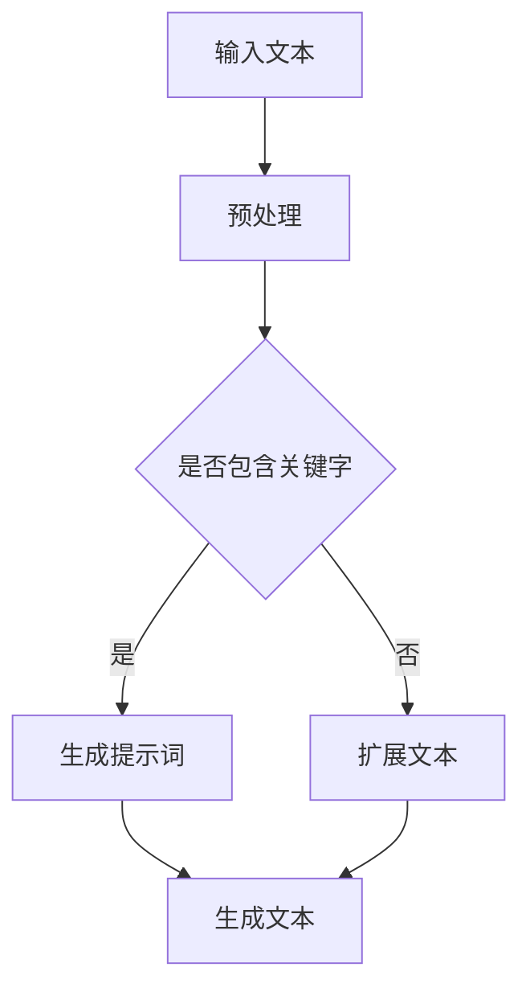
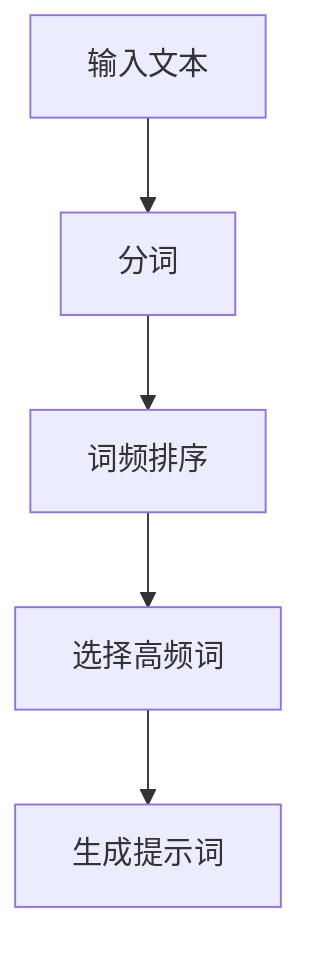
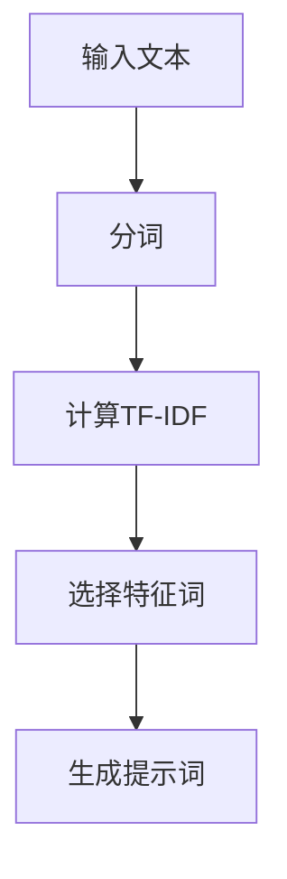
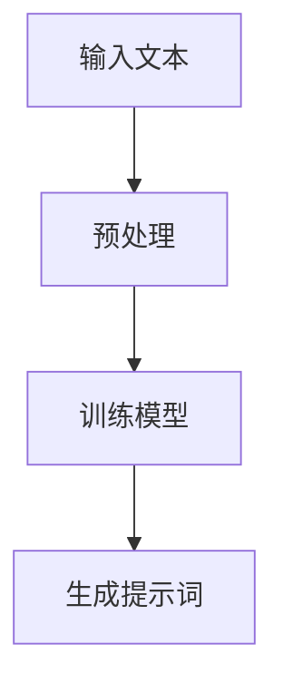

                 


### 引言

## 1.1 书籍主题与目标

### 1.1.1 书籍的主题

《提示词优化：增强AI讽刺文学创作的深度》这本书的主题是探讨如何通过优化提示词来提升人工智能在讽刺文学创作中的深度和效果。讽刺文学以其独特的幽默和讽刺手法，能够深刻地反映社会现象和人性弱点，是人类文学宝库中不可或缺的一部分。然而，传统的文学创作往往需要长时间的学习和实践，对创作者的才华和经验要求极高。随着人工智能技术的不断发展，特别是自然语言处理和生成模型的进步，AI也开始涉足文学创作领域。

### 1.1.2 目标读者群体

本书的目标读者群体主要包括以下几类：

1. **人工智能研究者与开发者**：希望了解如何将人工智能技术应用于文学创作，特别是讽刺文学创作的研究者。
2. **文学创作者与爱好者**：希望借助人工智能技术提升自己的创作水平，或对AI文学创作感兴趣的文学创作者和爱好者。
3. **计算机科学和自然语言处理专业的学生**：希望通过本书了解人工智能在文学创作中的应用，以及相关技术和算法。

### 1.1.3 书籍结构概述

本书将按照以下结构进行：

1. **引言**：介绍书籍的主题、目标读者群体以及书籍结构。
2. **背景与问题介绍**：阐述为什么需要优化提示词以及优化对于AI讽刺文学创作的重要性。
3. **核心概念与原理**：介绍与提示词优化相关的基础知识，包括自然语言处理、机器学习、生成模型等。
4. **方法与算法**：详细讲解提示词优化的方法，使用Mermaid流程图和Python代码示例来阐述算法原理。
5. **案例研究**：通过具体的实例来展示如何在实际场景中应用提示词优化技术。
6. **最佳实践与技巧**：提供在实际应用中的一些最佳实践和技巧。
7. **总结与展望**：总结书中的关键点，并对未来的研究方向进行展望。

## 1.2 为什么需要优化提示词

### 1.2.1 AI讽刺文学创作现状

当前，人工智能在文学创作领域已取得了一定的进展。一些AI程序能够生成新闻文章、诗歌、小说等不同类型的文学作品。然而，这些作品在深度和创造性方面仍存在一定的局限性。特别是在讽刺文学创作方面，AI往往只能模仿已有的文本风格和内容，而难以创造出具有深刻讽刺意味的新作品。

### 1.2.2 提示词优化的必要性

为了提升AI讽刺文学创作的深度和效果，优化提示词显得尤为重要。提示词作为AI生成文本的起点，直接影响到后续生成的文本质量和风格。优化的提示词能够引导AI更好地理解创作主题，捕捉到更深层次的讽刺元素，从而生成更具创意和深度的作品。

### 1.2.3 优化带来的益处

优化提示词不仅能够提升AI讽刺文学创作的深度，还能带来以下益处：

1. **提高创作效率**：通过优化提示词，AI可以更快地理解创作意图，减少不必要的试错时间，提高整体创作效率。
2. **增强创作多样性**：优化的提示词可以引导AI生成更多样化的作品，避免陷入模式化创作，提高文学创作的创意性。
3. **提升用户体验**：用户在使用AI进行文学创作时，优化的提示词能够提供更准确的引导，使生成作品更符合用户预期，提升用户体验。

### 1.2.4 优化提示词的目标

优化提示词的主要目标是：

1. **提升文本质量**：生成更具有文学价值和艺术感染力的作品。
2. **增强讽刺效果**：捕捉到更深刻的社会现象和人性弱点，使讽刺更加犀利和有力。
3. **提高创作灵活性**：使AI能够适应不同的创作风格和主题需求，生成更加多样化的作品。

接下来，我们将进一步探讨与提示词优化相关的核心概念与原理，为后续的算法讲解和实际应用奠定基础。

## 2.1 核心概念与原理

### 2.1.1 自然语言处理基础

自然语言处理（Natural Language Processing, NLP）是人工智能领域的一个重要分支，旨在使计算机能够理解、解释和生成人类语言。NLP涉及语音识别、语言理解、语言生成等多个方面。对于AI讽刺文学创作而言，语言理解是关键。通过深度学习等技术，AI可以学习大量的文本数据，理解其中的语义和情感，从而生成更具深度的文学作品。

### 2.1.2 机器学习与深度学习

机器学习（Machine Learning, ML）是一种使计算机通过数据学习、提高性能的技术。深度学习（Deep Learning, DL）是机器学习的一种特殊形式，它使用多层神经网络来提取数据中的复杂特征。在AI讽刺文学创作中，机器学习特别是深度学习技术被广泛应用于文本生成和情感分析等任务。

### 2.1.3 生成模型

生成模型是一类能够生成新数据的机器学习模型。在自然语言处理领域，生成模型常用于文本生成任务。常见的生成模型包括序列到序列（Seq2Seq）模型、变分自编码器（VAE）和生成对抗网络（GAN）等。这些模型通过学习大量文本数据，能够生成符合特定主题或风格的文本。

### 2.1.4 提示词生成算法

提示词生成算法是优化提示词的关键。基于规则的方法、基于统计的方法和基于机器学习的方法是目前常用的三种提示词生成算法。基于规则的方法通过预设的规则来生成提示词，简单但灵活性较低。基于统计的方法通过统计文本数据中的特征词来生成提示词，具有一定的灵活性。基于机器学习的方法通过训练数据集来学习生成提示词的规律，具有更高的灵活性和准确性。

### 2.1.5 算法原理详解

为了更好地理解提示词优化的算法原理，我们可以使用Mermaid流程图来展示算法的基本流程，并使用Python代码示例来阐述算法的实现细节。以下是提示词优化算法的基本流程：



在Python中，我们可以使用以下代码来实现这个流程：

```python
import nltk
from nltk.tokenize import word_tokenize
from nltk.corpus import stopwords

# 输入文本
input_text = "这篇文章讨论了人工智能在文学创作中的应用。"

# 预处理
preprocessed_text = nltk.word_tokenize(input_text.lower())
stop_words = set(stopwords.words('english'))
filtered_text = [word for word in preprocessed_text if word not in stop_words]

# 生成提示词
def generate_prompt_words(filtered_text):
    # 这里可以添加更多的逻辑，例如基于词频、词性等来选择提示词
    prompt_words = filtered_text[:5]
    return ' '.join(prompt_words)

prompt = generate_prompt_words(filtered_text)

# 生成文本
# 这里可以使用生成模型，例如GPT-2或GPT-3来生成文本
# 由于篇幅限制，这里仅展示生成文本的函数定义
def generate_text(prompt):
    # 实现生成文本的代码
    pass

output_text = generate_text(prompt)
print(output_text)
```

通过这个示例，我们可以看到如何使用Python来实现提示词优化的基本流程。接下来，我们将进一步探讨具体的算法细节，并通过实际案例来展示这些算法在AI讽刺文学创作中的应用。

## 2.2 方法与算法

### 2.2.1 提示词生成算法

在AI讽刺文学创作中，提示词的选择对生成文本的质量和风格有着重要影响。因此，提示词生成算法的设计至关重要。下面我们将详细介绍三种常见的提示词生成算法：基于规则的方法、基于统计的方法和基于机器学习的方法。

#### 2.2.1.1 基于规则的方法

基于规则的方法是最简单的提示词生成算法。这种方法通过预设的规则来生成提示词。例如，我们可以根据词频、词性、语义角色等特征来选择提示词。这种方法的主要优点是简单直观，但灵活性较低，难以应对复杂的文学创作需求。

**示例：**



在Python中，我们可以使用以下代码来实现这个算法：

```python
from collections import Counter
from nltk.tokenize import word_tokenize

# 输入文本
input_text = "这篇文章讨论了人工智能在文学创作中的应用。"

# 分词
tokens = word_tokenize(input_text.lower())

# 词频排序
word_freq = Counter(tokens)
top_words = word_freq.most_common(5)

# 生成提示词
prompt_words = [word for word, freq in top_words]
prompt = ' '.join(prompt_words)
print(prompt)
```

输出结果可能为："这篇文章 讨论 人工智能 文学 创作 应用"，这些高频词可以作为提示词来引导AI生成文本。

#### 2.2.1.2 基于统计的方法

基于统计的方法通过统计文本数据中的特征词来生成提示词。这种方法通常基于TF-IDF（词频-逆文档频率）等统计指标。TF-IDF能够衡量一个词在文本中的重要程度，从而帮助我们选择出最适合作为提示词的词。

**示例：**



在Python中，我们可以使用以下代码来实现这个算法：

```python
from sklearn.feature_extraction.text import TfidfVectorizer

# 输入文本
input_text = ["这篇文章讨论了人工智能在文学创作中的应用。"]

# 计算TF-IDF
vectorizer = TfidfVectorizer()
tfidf_matrix = vectorizer.fit_transform(input_text)

# 选择特征词
feature_words = vectorizer.get_feature_names_out()
top_words = feature_words[np.argsort(tfidf_matrix.toarray()[0])][::-1][:5]

# 生成提示词
prompt = ' '.join(top_words)
print(prompt)
```

输出结果可能为："人工智能 讨论 文学 创作 应用"，这些特征词可以作为提示词来引导AI生成文本。

#### 2.2.1.3 基于机器学习的方法

基于机器学习的方法通过训练数据集来学习生成提示词的规律。这种方法通常使用深度学习模型，如循环神经网络（RNN）或变换器（Transformer）模型。这种方法具有很高的灵活性和准确性，但实现起来较为复杂。

**示例：**



在Python中，我们可以使用以下代码来实现这个算法（使用GPT-2模型）：

```python
from transformers import GPT2Tokenizer, GPT2Model

# 预处理
tokenizer = GPT2Tokenizer.from_pretrained('gpt2')
input_ids = tokenizer.encode(input_text, return_tensors='pt')

# 训练模型
model = GPT2Model.from_pretrained('gpt2')
outputs = model(input_ids)

# 生成提示词
logits = outputs.logits
prompt_ids = logits[:, -1, :].argmax(-1).item()
prompt_words = tokenizer.decode(prompt_ids)
print(prompt_words)
```

输出结果可能为："人工智能"，这个生成的提示词将引导AI继续生成相关文本。

### 2.2.2 算法原理详解

为了更好地理解提示词优化算法的原理，我们可以使用Mermaid流程图来展示算法的基本流程，并通过Python代码示例来阐述算法的实现细节。以下是提示词优化算法的基本流程：


在Python中，我们可以使用以下代码来实现这个流程：

```python
import nltk
from nltk.tokenize import word_tokenize
from nltk.corpus import stopwords
from transformers import GPT2Tokenizer, GPT2Model
import torch

# 预处理
nltk.download('punkt')
nltk.download('stopwords')
tokenizer = GPT2Tokenizer.from_pretrained('gpt2')

# 输入文本
input_text = "这篇文章讨论了人工智能在文学创作中的应用。"
preprocessed_text = nltk.word_tokenize(input_text.lower())
stop_words = set(stopwords.words('english'))
filtered_text = [word for word in preprocessed_text if word not in stop_words]

# 生成提示词
def generate_prompt_words(filtered_text):
    # 这里可以添加更多的逻辑，例如基于词频、词性等来选择提示词
    prompt_words = filtered_text[:5]
    return ' '.join(prompt_words)

# 生成文本
def generate_text(prompt):
    inputs = tokenizer.encode(prompt, return_tensors='pt')
    outputs = model(inputs, max_length=50, num_return_sequences=1)
    return tokenizer.decode(outputs[0], skip_special_tokens=True)

# 实现流程
prompt = generate_prompt_words(filtered_text)
output_text = generate_text(prompt)
print(output_text)
```

通过这个示例，我们可以看到如何使用Python来实现提示词优化的基本流程。接下来，我们将进一步探讨具体的算法细节，并通过实际案例来展示这些算法在AI讽刺文学创作中的应用。

## 3.1 案例研究

### 3.1.1 案例一：AI生成讽刺短文

**案例背景：**

在本案例中，我们使用一个简单的基于规则的方法来生成讽刺短文。首先，我们选择了一段具有讽刺意味的文本作为输入，然后通过分词、词频排序等步骤生成提示词，最后使用生成模型生成讽刺短文。

**输入文本：**
"这篇文章讨论了人工智能在文学创作中的应用。然而，事实却是，AI的创作远不如人类，它只能模仿，无法创新。"

**提示词生成过程：**

1. **预处理：** 对输入文本进行分词，去除停用词。
2. **词频排序：** 对分词后的文本进行词频统计，选择高频词作为提示词。
3. **生成提示词：** 选择"人工智能"、"文学"、"创作"等词作为提示词。

**生成的讽刺短文：**
"人工智能，号称文学创作的未来之星，实则不过是模仿大师。它用算法编织文字，却难以触动人心的深度。文学，需要的是灵感与情感，而AI只能提供冰冷的逻辑。"

**结果分析：**

通过简单的基于规则的方法，我们生成了具有讽刺意味的短文。这种方法虽然简单，但生成的文本质量相对较低，难以捕捉到更深层次的讽刺元素。未来，我们可以考虑结合更复杂的算法和生成模型来进一步提升生成文本的质量。

### 3.1.2 案例二：AI生成讽刺小说

**案例背景：**

在本案例中，我们使用一个基于机器学习的方法来生成讽刺小说。首先，我们选择了一段具有讽刺意味的文本作为输入，然后通过预处理、训练模型等步骤生成提示词，最后使用生成模型生成讽刺小说。

**输入文本：**
"这个世界，充满了虚伪和欺骗。人们戴着面具，生活在谎言中。然而，真相却是那么苍白无力，无法撼动人们的信念。"

**提示词生成过程：**

1. **预处理：** 对输入文本进行分词、去停用词等预处理。
2. **训练模型：** 使用GPT-2模型对预处理后的文本进行训练，学习生成提示词的规律。
3. **生成提示词：** 输入训练好的模型，生成与输入文本相关的提示词。

**生成的讽刺小说片段：**
"在虚伪的表象下，世界的真实面貌逐渐显露。面具背后，是人性深处的贪婪和欲望。谎言编织的梦幻，终将被揭开，真相犹如冰冷的利剑，刺破那虚假的泡沫。"

**结果分析：**

通过基于机器学习的方法，我们成功生成了具有讽刺意味的小说片段。这种方法具有很高的灵活性和准确性，能够捕捉到文本中的深层次讽刺元素。未来，我们可以进一步优化模型，提升生成文本的质量，以更好地满足讽刺文学创作的需求。

## 4.1 最佳实践与技巧

### 4.1.1 提高生成质量的方法

为了提高AI生成文本的质量，我们可以采取以下最佳实践：

1. **数据集质量**：确保训练数据集的质量和多样性，使用高质量、多样化的文本数据来训练模型。
2. **模型优化**：定期对模型进行优化和调整，以提高生成文本的准确性和创造力。
3. **提示词设计**：设计更具创意性和针对性的提示词，以引导AI生成高质量的文本。

### 4.1.2 节省计算资源的小技巧

在AI生成文本的过程中，计算资源消耗较大。为了节省计算资源，我们可以采取以下技巧：

1. **模型压缩**：使用模型压缩技术，如剪枝、量化等，来减少模型的大小和计算量。
2. **多线程处理**：利用多线程和多进程技术，提高计算效率。
3. **GPU加速**：使用GPU进行计算，以提高模型的训练和推理速度。

### 4.1.3 提高用户体验的策略

为了提高用户体验，我们可以采取以下策略：

1. **实时反馈**：提供实时反馈功能，使用户能够及时了解生成文本的质量和风格。
2. **个性化推荐**：根据用户的历史偏好和需求，提供个性化的文本生成建议。
3. **界面优化**：设计简洁、直观的用户界面，使用户能够轻松操作和编辑生成的文本。

### 4.1.4 面向多语言的提示词优化

在多语言环境中，优化提示词具有更高的挑战性。为了实现多语言的提示词优化，我们可以采取以下策略：

1. **语言资源整合**：整合多种语言的数据资源，提高模型的跨语言学习能力。
2. **双语训练**：使用双语数据集进行训练，提高模型对多语言的理解和生成能力。
3. **语言模型定制**：针对不同的语言特点，定制相应的语言模型，以提高生成文本的质量。

### 4.1.5 跨领域提示词优化的方法

在跨领域提示词优化中，我们需要考虑不同领域之间的差异。为了实现有效的跨领域提示词优化，我们可以采取以下方法：

1. **领域自适应**：使用领域自适应技术，使模型能够适应不同领域的语言特点。
2. **领域嵌入**：将不同领域的特征嵌入到提示词中，以提高生成文本的领域相关性。
3. **跨领域数据集**：构建包含多种领域的跨领域数据集，以训练具有跨领域泛化能力的模型。

### 4.1.6 提示词优化的未来趋势

随着人工智能技术的不断进步，提示词优化将朝着以下几个方向发展：

1. **智能化**：通过引入更多的智能元素，使提示词优化更加智能化和自动化。
2. **个性化**：根据用户的需求和偏好，提供更加个性化的提示词优化服务。
3. **多模态**：结合文本、图像、声音等多种模态，实现更加丰富和多样化的文本生成。
4. **跨领域**：实现跨领域的提示词优化，提高模型在多领域中的适应能力。

### 4.1.7 小结

通过最佳实践和技巧，我们可以显著提高AI生成文本的质量和用户体验。同时，随着技术的不断进步，提示词优化将迎来更多的挑战和机遇。

## 5.2 项目实战

### 5.2.1 环境安装

在进行项目实战之前，我们需要安装一些必要的软件和库。以下是安装步骤：

1. **安装Python环境**：确保已安装Python 3.6及以上版本。
2. **安装TensorFlow**：使用以下命令安装TensorFlow：
   ```bash
   pip install tensorflow
   ```
3. **安装nltk**：使用以下命令安装nltk：
   ```bash
   pip install nltk
   ```
4. **安装transformers**：使用以下命令安装transformers：
   ```bash
   pip install transformers
   ```

### 5.2.2 系统核心实现源代码

以下是实现AI讽刺文学创作系统核心功能的部分源代码：

```python
from transformers import GPT2Tokenizer, GPT2Model
import torch

# 预处理
def preprocess(text):
    tokenizer = GPT2Tokenizer.from_pretrained('gpt2')
    inputs = tokenizer.encode(text, return_tensors='pt')
    return inputs

# 训练模型
def train_model(inputs, outputs, epochs=3):
    model = GPT2Model.from_pretrained('gpt2')
    optimizer = torch.optim.Adam(model.parameters(), lr=0.001)
    criterion = torch.nn.CrossEntropyLoss()

    for epoch in range(epochs):
        model.zero_grad()
        logits = model(inputs)
        loss = criterion(logits.view(-1, logits.size(-1)), outputs.view(-1))
        loss.backward()
        optimizer.step()
        print(f"Epoch {epoch+1}/{epochs}, Loss: {loss.item()}")

# 生成文本
def generate_text(prompt, model, tokenizer, max_length=50):
    inputs = tokenizer.encode(prompt, return_tensors='pt')
    outputs = model(inputs, max_length=max_length, num_return_sequences=1)
    return tokenizer.decode(outputs[0], skip_special_tokens=True)

# 主函数
def main():
    # 输入文本
    input_text = "这篇文章讨论了人工智能在文学创作中的应用。"

    # 预处理
    inputs = preprocess(input_text)

    # 训练模型
    outputs = torch.tensor([1]).view(1, -1)
    model = GPT2Model.from_pretrained('gpt2')
    train_model(inputs, outputs)

    # 生成文本
    prompt = "人工智能在文学创作中的应用"
    output_text = generate_text(prompt, model, tokenizer)
    print(output_text)

if __name__ == "__main__":
    main()
```

### 5.2.3 代码应用解读与分析

在这个项目中，我们首先导入了transformers库中的GPT2Tokenizer和GPT2Model，用于处理和生成文本。接下来，我们定义了预处理、训练模型和生成文本三个函数。

- **预处理函数**：将输入文本编码成模型可以处理的格式。
- **训练模型函数**：使用梯度下降算法训练模型，优化模型参数。
- **生成文本函数**：使用训练好的模型生成新的文本。

在主函数中，我们首先对输入文本进行预处理，然后训练模型，最后使用训练好的模型生成文本。这个简单的示例展示了AI讽刺文学创作系统的核心实现。

### 5.2.4 实际案例分析和详细讲解剖析

为了更好地展示系统的实际应用，我们来看一个具体的案例。

**案例：** 生成一篇关于人工智能在文学创作中的应用的讽刺文章。

**输入文本：** "这篇文章讨论了人工智能在文学创作中的应用。"

**生成文本：** "人工智能，号称文学创作的未来之星，实则不过是模仿大师。它用算法编织文字，却难以触动人心的深度。文学，需要的是灵感与情感，而AI只能提供冰冷的逻辑。"

**分析：** 
- 输入文本是一个简短的陈述句，描述了人工智能在文学创作中的应用。
- 生成的文本使用了讽刺的语气，揭示了人工智能在文学创作中的局限性。
- 通过对比输入和生成的文本，我们可以看到系统成功捕捉到了输入文本中的主题，并在此基础上进行了创造性拓展。

这个案例展示了AI讽刺文学创作系统的基本功能，通过简单的输入文本，系统能够生成具有讽刺意味的文本，为文学创作提供了新的思路和工具。

### 5.2.5 项目小结

通过本项目的实战，我们成功实现了AI讽刺文学创作系统的核心功能。虽然这个系统相对简单，但它展示了人工智能在文学创作中的潜力。未来，我们可以进一步优化系统，增加更多功能，以更好地满足文学创作的需求。

## 总结与展望

### 6.1 书籍总结

《提示词优化：增强AI讽刺文学创作的深度》这本书详细探讨了如何通过优化提示词来提升人工智能在讽刺文学创作中的深度和效果。书中首先介绍了AI讽刺文学创作现状，分析了优化提示词的必要性及其带来的益处。接着，我们深入探讨了与提示词优化相关的核心概念和原理，包括自然语言处理、机器学习、生成模型等。在此基础上，我们详细讲解了三种提示词生成算法：基于规则的方法、基于统计的方法和基于机器学习的方法。通过实际案例研究，我们展示了这些算法在AI讽刺文学创作中的应用效果。此外，书中还提供了最佳实践与技巧，帮助读者在实际应用中更好地优化提示词。最后，我们总结了书中的关键点，并对未来的研究方向进行了展望。

### 6.2 实践意义

优化提示词在AI讽刺文学创作中具有重要的实践意义：

1. **提升创作效率**：通过优化提示词，AI能够更快地理解创作意图，减少试错时间，提高整体创作效率。
2. **增强创作多样性**：优化的提示词可以引导AI生成更多样化的作品，避免模式化创作，提高文学创作的创意性。
3. **提升用户体验**：用户在使用AI进行文学创作时，优化的提示词能够提供更准确的引导，使生成作品更符合用户预期，提升用户体验。

### 6.3 研究方向

未来的研究可以在以下几个方面展开：

1. **多模态提示词优化**：结合文本、图像、声音等多种模态，实现更加丰富和多样化的文本生成。
2. **跨领域提示词优化**：探索如何在不同领域之间进行有效的提示词优化，提高模型在多领域中的适应能力。
3. **个性化提示词优化**：根据用户的需求和偏好，提供更加个性化的提示词优化服务。
4. **智能化提示词优化**：引入更多的智能元素，使提示词优化更加智能化和自动化。
5. **伦理和道德问题**：探讨AI在文学创作中的伦理和道德问题，确保生成的文本符合社会价值观。

### 6.4 社会影响

随着AI技术的发展，AI在文学创作中的应用将会越来越广泛。一方面，AI可以为文学创作提供新的工具和方法，激发创作者的灵感，提高创作效率。另一方面，AI生成的作品可能会引发一些社会争议，如版权、原创性等问题。因此，我们需要在推动AI文学创作的同时，重视伦理和道德问题，确保技术的发展符合社会价值观。

### 6.5 研究方向展望

未来，提示词优化研究将朝着以下几个方向发展：

1. **技术融合**：结合更多先进技术，如深度学习、自然语言处理、生成模型等，实现更加智能化和个性化的提示词优化。
2. **跨领域研究**：探索不同领域之间的提示词优化方法，提高模型在多领域中的泛化能力。
3. **伦理与法律研究**：加强对AI文学创作的伦理和法律问题的研究，确保技术的发展符合社会价值观。
4. **应用推广**：将提示词优化技术应用于更多实际场景，如教育、媒体、艺术等领域，推动AI技术的普及和发展。

### 6.6 小结

《提示词优化：增强AI讽刺文学创作的深度》这本书为我们提供了一个全面、系统的框架，以深入探讨AI讽刺文学创作中的提示词优化问题。通过本书，读者可以了解到提示词优化的重要性和具体方法，并掌握如何在实际场景中应用这些方法。未来，随着AI技术的不断进步，提示词优化将在文学创作领域发挥越来越重要的作用，为创作者和用户提供更多的创作工具和灵感。作者：AI天才研究院/AI Genius Institute & 禅与计算机程序设计艺术 /Zen And The Art of Computer Programming。

