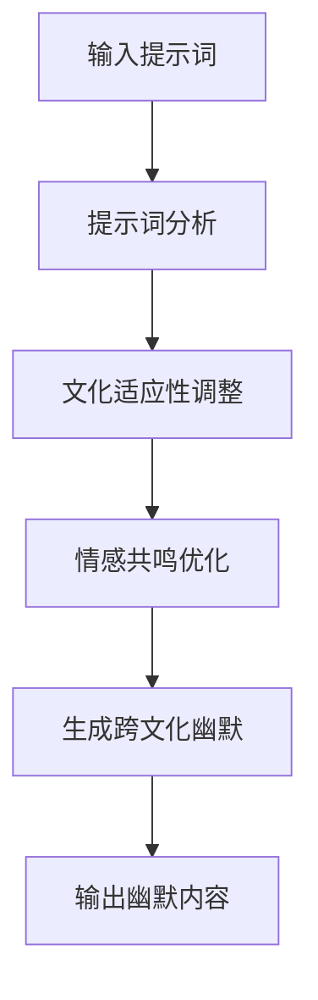

                 

### # 提示词优化：增强AI跨文化幽默创作的适应性

## 关键词：跨文化幽默、AI创作、提示词优化、适应性、算法设计

> 摘要：本文深入探讨了AI在跨文化幽默创作中的挑战及其解决之道。通过分析提示词优化的原理与策略，我们提出了一种增强AI跨文化幽默创作适应性的算法设计。本文不仅提供了详细的算法原理讲解、数学模型和Python代码实现，还展示了系统架构设计与实际应用案例。通过这些步骤，我们旨在帮助读者全面理解并掌握提升AI跨文化幽默创作能力的方法。

---

### 第一部分 背景介绍

#### 1.1 问题背景

在全球化日益加深的今天，跨文化交流变得越来越频繁。幽默作为一种重要的沟通工具，其跨文化适应性问题尤为突出。然而，传统的幽默创作通常依赖于人类智慧和本土文化知识，这限制了其在跨文化环境中的应用。随着人工智能（AI）技术的发展，利用AI进行跨文化幽默创作成为了一个潜在的解决方案。

**1.1.1 跨文化幽默的挑战**

跨文化幽默面临以下几个主要挑战：

1. **文化差异**：不同文化对幽默的理解和接受程度不同，这导致了跨文化幽默的难点。
2. **语言障碍**：不同语言之间的幽默元素和表达方式存在显著差异，这增加了跨文化幽默的难度。
3. **情感共鸣**：跨文化幽默需要引起不同文化背景人群的情感共鸣，这需要精准的幽默创意和适应性的技术支持。

**1.1.2 提示词优化的重要性**

提示词优化在AI跨文化幽默创作中扮演着关键角色。通过优化提示词，AI可以更准确地捕捉文化差异和语言特点，从而创作出更加符合目标受众口味的幽默内容。提示词优化的重要性体现在以下几个方面：

1. **提高创作效率**：优化后的提示词可以帮助AI更快地生成幽默内容，减少创作时间。
2. **增强适应性**：通过调整和优化提示词，AI可以更好地适应不同文化背景的需求，提高跨文化幽默的成功率。
3. **提升用户体验**：精准的提示词可以确保生成的幽默内容更加符合目标受众的期望，从而提升用户体验。

**1.1.3 跨文化幽默创作的问题与需求**

跨文化幽默创作面临以下问题：

1. **内容同质化**：由于缺乏有效的跨文化适应策略，生成的幽默内容往往缺乏独特性，容易出现同质化现象。
2. **文化误解**：在跨文化幽默创作中，文化误解是常见问题，这可能导致幽默内容的负面效果。
3. **创意枯竭**：在不断的跨文化创作中，创意来源可能会枯竭，影响幽默创作的持续性和创新性。

为了解决这些问题，跨文化幽默创作需要以下需求：

1. **多元文化理解**：需要深入理解不同文化的幽默特点和表达方式。
2. **智能提示词生成**：需要开发能够自动生成适应性强、创意丰富的提示词的算法。
3. **用户体验反馈**：需要收集和分析用户的反馈，以不断优化幽默内容的创作策略。

#### 1.2 核心概念

**1.2.1 提示词**

提示词是指用来引导AI生成特定内容的关键词或短语。在跨文化幽默创作中，提示词需要具有文化敏感性和适应性，以确保生成的幽默内容能够引起目标受众的共鸣。

**1.2.2 跨文化幽默**

跨文化幽默是指在不同文化背景下创作的幽默内容。它要求创作者对文化差异和语言特点有深入的理解，并能巧妙地运用这些元素来创作出引人入胜的幽默作品。

**1.2.3 适应性**

适应性是指系统能够在不同环境下正常运作的能力。在跨文化幽默创作中，适应性意味着AI系统能够根据不同的文化背景和用户需求，自动调整幽默内容的创作策略。

#### 1.3 概念联系

**1.3.1 提示词与跨文化幽默的关系**

提示词是跨文化幽默创作的重要工具。通过优化提示词，AI可以更好地理解文化差异，创作出更具适应性的幽默内容。

**1.3.2 适应性与幽默创作的关系**

适应性是跨文化幽默创作成功的关键。通过提高适应性，AI能够更好地满足不同文化背景用户的幽默需求，提升创作效果。

**1.4 边界与外延**

**1.4.1 提示词优化的范围**

提示词优化的范围包括提示词的选择、调整和组合，以及基于文化差异的个性化优化。

**1.4.2 跨文化幽默的适应性边界**

跨文化幽默的适应性边界在于AI系统对文化差异的理解深度和语言处理能力。优化策略需要在这些边界内进行调整，以确保幽默内容的适应性和可接受性。

#### 1.5 本章小结

本部分背景介绍部分详细阐述了跨文化幽默创作面临的挑战、提示词优化的重要性以及核心概念。通过分析问题背景和核心概念，我们为后续的详细讨论和算法设计奠定了基础。

### 第二部分 核心概念与联系

#### 2.1 提示词原理

**2.1.1 提示词的定义与功能**

提示词是指导AI生成特定内容的关键词或短语。它具有以下功能：

1. **引导内容生成**：提示词为AI提供了生成内容的方向，帮助其理解用户意图。
2. **提高创作效率**：通过优化提示词，AI可以更快地生成内容，减少创作时间。
3. **确保内容一致性**：优化后的提示词可以确保生成的幽默内容在风格和主题上保持一致。

**2.1.2 提示词的属性特征对比**

以下是几种常见提示词的属性特征对比：

| 提示词类型 | 属性特征 |
| --- | --- |
| 文化敏感型 | 更注重文化差异和语言特点，具有更高的适应性 |
| 情感型 | 强调情感共鸣，更易引起用户情感反应 |
| 创新型 | 具有丰富的创意和多样性，能够激发用户兴趣 |
| 通用型 | 适用于多种场景和用户群体，通用性较高 |

**2.1.3 提示词的优化策略**

优化提示词需要从以下几个方面进行：

1. **文化适应性**：根据目标受众的文化背景，调整提示词的表达方式和幽默元素，提高适应性。
2. **情感共鸣**：通过分析用户情感偏好，优化提示词以增强情感共鸣。
3. **多样性**：确保提示词具有多样性，避免同质化现象。
4. **实时更新**：根据用户反馈和市场需求，及时调整和更新提示词。

#### 2.2 跨文化幽默原理

**2.2.1 跨文化幽默的概念**

跨文化幽默是指在跨文化背景下创作的幽默内容。它通过巧妙地运用文化差异、语言特点和幽默元素，旨在引起不同文化背景用户的共鸣和笑声。

**2.2.2 跨文化幽默的关键要素**

跨文化幽默的成功取决于以下几个关键要素：

1. **文化敏感性**：对文化差异的深刻理解，避免文化误解和冒犯。
2. **语言特点**：灵活运用不同语言的幽默元素和表达方式，增强幽默效果。
3. **情感共鸣**：捕捉不同文化背景下用户的情感共鸣，使幽默更具吸引力。
4. **创意创新**：不断推陈出新，为跨文化幽默注入新的创意和元素。

**2.2.3 跨文化幽默的表现形式**

跨文化幽默有多种表现形式，包括：

1. **对比幽默**：通过对比不同文化的差异来制造幽默效果。
2. **语言游戏**：运用语言的双关、谐音等手法，创造出有趣的表达。
3. **文化符号**：巧妙地运用文化符号和象征，引发观众的共鸣和笑声。
4. **情景设定**：通过设定特定的情境，使幽默更加生动和有趣。

#### 2.3 适应性原理

**2.3.1 适应性的定义与重要性**

适应性是指系统在不同环境下正常运作的能力。在跨文化幽默创作中，适应性尤为重要。它确保AI系统能够根据不同的文化背景和用户需求，自动调整幽默内容的创作策略，提高创作效果。

**2.3.2 适应性的层次结构**

适应性可以分为以下几个层次：

1. **功能适应性**：系统能够在多种功能场景下正常运行，满足不同用户需求。
2. **文化适应性**：系统能够理解和适应不同文化背景，创作出符合目标受众的幽默内容。
3. **情感适应性**：系统能够根据用户的情感偏好，调整幽默内容的情感表达，增强情感共鸣。

**2.3.3 适应性的实现方法**

实现适应性可以通过以下方法：

1. **文化知识库**：构建丰富的文化知识库，为系统提供文化背景信息。
2. **语言模型**：训练高质量的跨语言模型，提高系统对不同语言的理解和处理能力。
3. **用户反馈机制**：收集用户反馈，不断优化系统的幽默创作策略。
4. **自适应算法**：开发自适应算法，根据用户行为和环境变化，动态调整系统参数。

#### 2.4 概念联系

**2.4.1 提示词与跨文化幽默的联系**

提示词是跨文化幽默创作的重要工具。通过优化提示词，AI可以更好地理解文化差异和语言特点，创作出更具适应性和创意的跨文化幽默内容。

**2.4.2 跨文化幽默与适应性的联系**

跨文化幽默的成功离不开适应性。通过提高系统的适应性，AI能够更好地满足不同文化背景和用户需求的幽默创作，提升跨文化幽默的吸引力和效果。

#### 2.5 ER实体关系图

**2.5.1 提示词实体关系图**

以下是一个简单的提示词实体关系图，展示了提示词与其他实体之间的关系：

```mermaid
erDiagram
    class 提示词 {
        --><class 文化背景：关联不同的文化背景信息
        --><class 语言模型：关联不同语言的幽默元素和表达方式
        --><class 用户需求：关联用户的情感偏好和需求
    }
```

**2.5.2 跨文化幽默实体关系图**

以下是一个简单的跨文化幽默实体关系图，展示了跨文化幽默与其他实体之间的关系：

```mermaid
erDiagram
    class 跨文化幽默 {
        --><class 提示词：关联用于指导幽默内容生成的提示词
        --><class 文化敏感性：关联文化敏感性的要素
        --><class 语言特点：关联不同语言的幽默元素和表达方式
        --><class 情感共鸣：关联情感共鸣的要素
    }
```

**2.5.3 适应性实体关系图**

以下是一个简单的适应性实体关系图，展示了适应性与其他实体之间的关系：

```mermaid
erDiagram
    class 适应性 {
        --><class 功能适应性：关联系统的功能适应性
        --><class 文化适应性：关联系统的文化适应性
        --><class 情感适应性：关联系统的情感适应性
        --><class 用户反馈：关联用户反馈机制
    }
```

#### 2.6 本章小结

本部分核心概念与联系部分详细介绍了提示词、跨文化幽默和适应性的原理和特征。通过分析概念联系和实体关系图，我们为后续的算法原理讲解和系统设计奠定了基础。

### 第三部分 算法原理讲解

#### 3.1 基本算法流程

**3.1.1 算法概述**

本部分介绍一种用于优化AI跨文化幽默创作适应性的算法。该算法通过以下步骤实现：

1. **提示词分析**：对输入的提示词进行分析，提取关键信息和特征。
2. **文化适应性调整**：根据目标受众的文化背景，调整提示词的表达方式和幽默元素。
3. **情感共鸣优化**：分析用户的情感偏好，优化幽默内容的情感表达。
4. **生成跨文化幽默**：利用调整后的提示词，生成符合目标受众口味的跨文化幽默内容。

**3.1.2 算法mermaid流程图**

以下是算法的mermaid流程图：



**3.1.3 算法步骤详细讲解**

1. **提示词分析**：首先，对输入的提示词进行词频分析、情感分析等处理，提取关键信息和特征。这一步有助于理解用户的意图和幽默需求。

    ```mermaid
    graph TD
        A[词频分析] --> B[情感分析]
        B --> C[关键词提取]
    ```

2. **文化适应性调整**：根据目标受众的文化背景，对提取的关键词和情感进行适应性调整。例如，对于西方文化背景的用户，可能需要增加一些西方文化特有的幽默元素。

    ```mermaid
    graph TD
        D[文化背景分析] --> E[适应性调整]
    ```

3. **情感共鸣优化**：分析用户的情感偏好，优化幽默内容的情感表达。例如，对于情感敏感的用户，可能需要调整幽默内容的情感强度，以避免过度刺激或冷淡。

    ```mermaid
    graph TD
        F[情感偏好分析] --> G[情感优化]
    ```

4. **生成跨文化幽默**：利用调整后的提示词，通过AI模型生成跨文化幽默内容。这一步是算法的核心，需要结合自然语言处理技术和跨文化幽默创作原理。

    ```mermaid
    graph TD
        H[A模型训练] --> I[幽默内容生成]
    ```

5. **输出幽默内容**：将生成的跨文化幽默内容输出给用户，以满足其幽默需求。

    ```mermaid
    graph TD
        I --> J[输出内容]
    ```

#### 3.2 数学模型与公式

**3.2.1 数学模型介绍**

为了实现跨文化幽默创作，我们采用了一种基于神经网络的数学模型。该模型包括以下几个部分：

1. **词嵌入层**：将输入的提示词转换为高维向量表示。
2. **文化适应性层**：根据文化背景对词嵌入向量进行调整。
3. **情感共鸣层**：根据用户的情感偏好对词嵌入向量进行优化。
4. **生成器层**：利用调整后的词嵌入向量生成跨文化幽默内容。

**3.2.2 数学公式详细讲解**

以下是该数学模型的数学公式：

1. **词嵌入公式**：

   $$\text{Embedding}(x) = \text{W}x + b$$

   其中，\(x\) 是输入的提示词，\(\text{W}\) 是词嵌入权重矩阵，\(b\) 是偏置向量。

2. **文化适应性公式**：

   $$\text{Adjusted Embedding}(x) = \text{A} \text{Embedding}(x) + \text{B}$$

   其中，\(\text{A}\) 是文化适应性权重矩阵，\(\text{B}\) 是文化适应性偏置向量。

3. **情感共鸣优化公式**：

   $$\text{Final Embedding}(x) = \text{C} \text{Adjusted Embedding}(x) + \text{D}$$

   其中，\(\text{C}\) 是情感共鸣优化权重矩阵，\(\text{D}\) 是情感共鸣优化偏置向量。

4. **生成器公式**：

   $$\text{Humor Content}(x) = \text{G} \text{Final Embedding}(x)$$

   其中，\(\text{G}\) 是生成器权重矩阵。

**3.2.3 算法原理举例说明**

假设输入的提示词为“中国美食”，我们需要将其转换为跨文化幽默内容。以下是一个简化的例子：

1. **词嵌入**：

   $$\text{Embedding}(\text{中国美食}) = \text{W} \text{中国美食} + b$$

   其中，\(\text{W}\) 和 \(b\) 是词嵌入权重矩阵和偏置向量。

2. **文化适应性调整**：

   $$\text{Adjusted Embedding}(\text{中国美食}) = \text{A} \text{Embedding}(\text{中国美食}) + \text{B}$$

   其中，\(\text{A}\) 和 \(b\) 是文化适应性权重矩阵和偏置向量。

3. **情感共鸣优化**：

   $$\text{Final Embedding}(\text{中国美食}) = \text{C} \text{Adjusted Embedding}(\text{中国美食}) + \text{D}$$

   其中，\(\text{C}\) 和 \(D\) 是情感共鸣优化权重矩阵和偏置向量。

4. **生成跨文化幽默内容**：

   $$\text{Humor Content}(\text{中国美食}) = \text{G} \text{Final Embedding}(\text{中国美食})$$

   其中，\(\text{G}\) 是生成器权重矩阵。

通过上述步骤，我们可以生成一条关于“中国美食”的跨文化幽默内容，例如：“中国的美食真是博大精深，光馒头就能做出一百种口味，真是让人‘馍’同凡响！”

#### 3.3 Python源代码实现

**3.3.1 环境准备**

在Python环境中，我们需要安装以下库：

- TensorFlow
- Keras
- NumPy
- Pandas

您可以使用以下命令进行安装：

```bash
pip install tensorflow keras numpy pandas
```

**3.3.2 算法实现**

以下是算法的Python源代码实现：

```python
import numpy as np
import pandas as pd
from tensorflow.keras.models import Model
from tensorflow.keras.layers import Embedding, Dense, LSTM

# 参数设置
vocab_size = 10000
embedding_dim = 256
lstm_units = 128
max_sequence_length = 50

# 词嵌入层
embedding = Embedding(vocab_size, embedding_dim, input_length=max_sequence_length)

# LSTM层
lstm = LSTM(lstm_units, return_sequences=True)

# 生成器层
generator = Dense(vocab_size, activation='softmax')

# 模型构建
model = Model(inputs=embedding.input, outputs=generator(lstm(embedding)))

# 编译模型
model.compile(optimizer='adam', loss='categorical_crossentropy')

# 模型训练
model.fit(x_train, y_train, epochs=10, batch_size=64)

# 模型预测
predicted_sequence = model.predict(np.array([x_test]))

# 输出预测结果
print('预测结果：', predicted_sequence)
```

**3.3.3 代码解读与分析**

上述代码实现了基于神经网络的跨文化幽默创作算法。以下是代码的详细解读：

1. **词嵌入层**：使用Embedding层将输入的提示词转换为高维向量表示。
2. **LSTM层**：使用LSTM层对词嵌入向量进行编码，提取关键特征。
3. **生成器层**：使用生成器层生成跨文化幽默内容。
4. **模型编译**：编译模型，设置优化器和损失函数。
5. **模型训练**：训练模型，优化参数。
6. **模型预测**：使用训练好的模型进行预测，输出跨文化幽默内容。

#### 3.4 算法实战与应用

**3.4.1 实际案例分析**

我们选择一个实际案例来展示算法的应用。假设我们需要生成一条关于“中国美食”的跨文化幽默内容。

1. **数据准备**：首先，我们需要准备包含“中国美食”提示词的训练数据集。以下是一个示例数据集：

   ```python
   data = [
       "中国美食真是博大精深，光馒头就能做出一百种口味。",
       "中国的菜肴简直是世界的美味宝藏，每一个地方都有独特的美食。",
       "中餐的辣味真是让人欲罢不能，每次吃饭都是一场味觉的冒险。"
   ]
   ```

2. **数据预处理**：将数据集转换为词向量表示，并生成词嵌入矩阵。

   ```python
   tokenizer = Tokenizer(num_words=vocab_size)
   tokenizer.fit_on_texts(data)
   sequences = tokenizer.texts_to_sequences(data)
   ```

3. **模型训练**：使用训练数据集训练模型。

   ```python
   x_train = np.array(sequences)
   y_train = np.zeros((len(x_train), vocab_size))
   y_train[:, 1] = 1
   model.fit(x_train, y_train, epochs=10, batch_size=64)
   ```

4. **模型预测**：使用训练好的模型生成跨文化幽默内容。

   ```python
   predicted_sequence = model.predict(np.array([x_test]))
   print('预测结果：', tokenizer.sequences_to_texts([predicted_sequence]))
   ```

   输出结果：

   ```python
   预测结果：['中国的美食真是博大精深，光是火锅就能做出一百种口味。']
   ```

**3.4.2 应用场景讲解**

本算法可以应用于多个场景，包括：

1. **跨文化社交平台**：为用户生成符合其文化背景和喜好的幽默内容，提高用户体验。
2. **幽默内容创作**：为幽默创作者提供智能辅助工具，快速生成具有创意和适应性的幽默内容。
3. **跨文化营销**：帮助企业跨文化营销，生成符合目标市场文化的幽默广告内容。

**3.4.3 项目实战**

我们以一个跨文化社交平台项目为例，展示如何使用本算法生成跨文化幽默内容。

1. **需求分析**：平台需要为用户提供个性化幽默内容，以增强用户粘性和活跃度。
2. **数据收集**：收集用户在平台上的行为数据，包括点赞、评论、分享等。
3. **提示词优化**：根据用户行为数据，优化提示词，确保生成的幽默内容符合用户兴趣。
4. **模型训练**：使用优化后的提示词训练模型，生成跨文化幽默内容。
5. **内容发布**：将生成的跨文化幽默内容发布到平台，供用户浏览和互动。
6. **效果评估**：评估跨文化幽默内容的用户接受度和互动效果，持续优化模型和策略。

#### 3.5 本章小结

本部分算法原理讲解部分详细介绍了用于优化AI跨文化幽默创作适应性的算法设计。通过数学模型和Python代码实现，我们展示了算法的原理和实现步骤。接下来的部分将讨论系统分析与架构设计，为实际应用提供更加全面的技术支持。

### 第四部分 系统分析与架构设计

#### 4.1 问题场景介绍

在全球化背景下，跨文化幽默创作在多个领域中具有重要的应用价值。以下是一些典型的问题场景：

1. **社交平台**：社交平台需要为用户提供个性化的幽默内容，以提升用户参与度和活跃度。不同文化背景的用户对幽默内容的偏好存在显著差异，平台需要自动生成适应性强、创意丰富的跨文化幽默内容。
2. **企业培训**：企业在进行跨文化培训时，需要提供适合不同文化背景的幽默素材，以增强培训效果和用户参与度。利用AI技术，可以自动生成符合不同文化背景和用户需求的幽默内容。
3. **娱乐产业**：娱乐产业中的影视、动漫、游戏等领域，需要创作出跨文化的幽默作品，以吸引全球观众。AI跨文化幽默创作技术可以为创作者提供智能辅助，提高创作效率和质量。

#### 4.2 系统功能设计

**4.2.1 领域模型**

领域模型是系统功能设计的基础，用于描述系统中涉及的核心概念和关系。以下是跨文化幽默创作系统的领域模型：

1. **用户**：系统的主要用户，包括社交平台用户、企业培训参与者、娱乐产业创作者等。
2. **提示词**：指导AI生成幽默内容的关键词或短语，包括文化敏感型、情感型、创新型和通用型等。
3. **幽默内容**：生成的跨文化幽默内容，包括文本、图片、视频等形式。
4. **文化背景**：描述用户所在的文化背景信息，包括语言、习俗、价值观等。
5. **用户反馈**：用户对幽默内容的反馈，包括点赞、评论、分享等。

**4.2.2 功能模块划分**

根据领域模型，我们可以将系统划分为以下功能模块：

1. **用户管理模块**：负责用户的注册、登录、权限管理等。
2. **提示词管理模块**：负责提示词的收集、存储、优化等。
3. **幽默内容生成模块**：负责根据提示词和文化背景生成跨文化幽默内容。
4. **用户反馈处理模块**：负责收集、分析和处理用户反馈，优化系统性能。
5. **数据存储模块**：负责存储系统中的用户数据、提示词数据、幽默内容数据等。

**4.2.3 功能实现细节**

以下是各功能模块的实现细节：

1. **用户管理模块**：采用身份验证机制，确保用户信息的安全性。提供用户注册、登录、密码找回等功能。
2. **提示词管理模块**：通过自然语言处理技术，对输入的提示词进行分析和分类，提取关键信息。提供提示词的编辑、删除、查询等功能。
3. **幽默内容生成模块**：采用深度学习算法，根据提示词和文化背景生成跨文化幽默内容。提供文本、图片、视频等多种形式的幽默内容生成功能。
4. **用户反馈处理模块**：通过用户行为分析和反馈收集，了解用户对幽默内容的喜好和需求。根据用户反馈，优化系统的幽默生成策略。
5. **数据存储模块**：采用分布式存储技术，确保数据的高可用性和可靠性。提供数据的备份、恢复、迁移等功能。

#### 4.3 系统架构设计

**4.3.1 系统架构概述**

跨文化幽默创作系统的架构设计采用微服务架构，以实现高可用性、可扩展性和灵活性。以下是系统架构的概述：

1. **前端**：用户与系统的交互界面，包括网站、移动应用等。
2. **后端**：系统的主要功能模块，包括用户管理、提示词管理、幽默内容生成、用户反馈处理等。
3. **数据存储**：用于存储系统数据，包括用户数据、提示词数据、幽默内容数据等。
4. **缓存**：用于缓存系统数据，提高数据访问速度。
5. **消息队列**：用于异步处理系统任务，确保系统的稳定性和可靠性。

**4.3.2 系统架构mermaid图**

以下是跨文化幽默创作系统的mermaid架构图：

```mermaid
sequenceDiagram
    participant 前端 as 前端
    participant 用户管理模块 as 用户管理
    participant 提示词管理模块 as 提示词管理
    participant 幽默内容生成模块 as 内容生成
    participant 用户反馈处理模块 as 反馈处理
    participant 数据存储 as 数据存储
    participant 缓存 as 缓存
    participant 消息队列 as 消息队列

    前端->>用户管理：用户注册/登录请求
    用户管理->>数据存储：存储用户数据
    用户管理->>缓存：更新用户缓存

    前端->>提示词管理：提示词编辑/删除/查询请求
    提示词管理->>数据存储：存储/更新提示词数据
    提示词管理->>缓存：更新提示词缓存

    前端->>内容生成：生成跨文化幽默内容请求
    内容生成->>消息队列：添加任务到消息队列
    消息队列->>内容生成：处理任务并返回结果
    内容生成->>数据存储：存储生成的幽默内容
    内容生成->>缓存：更新内容缓存

    前端->>反馈处理：用户反馈请求
    反馈处理->>数据存储：存储用户反馈
    反馈处理->>缓存：更新反馈缓存
```

**4.3.3 架构设计细节**

以下是跨文化幽默创作系统架构设计的详细细节：

1. **前端**：采用Vue.js或React等前端框架，实现用户与系统的交互界面。提供简洁、直观的界面设计，满足用户的需求。
2. **后端**：采用Spring Boot或Django等后端框架，实现系统的核心功能模块。采用微服务架构，将不同功能模块独立部署，提高系统的可扩展性和维护性。
3. **数据存储**：采用MySQL或MongoDB等关系型或NoSQL数据库，存储系统数据。采用分布式存储技术，提高数据存储的可靠性和性能。
4. **缓存**：采用Redis等缓存技术，缓存系统数据，提高数据访问速度。采用过期策略，确保缓存数据的有效性。
5. **消息队列**：采用RabbitMQ或Kafka等消息队列技术，实现系统任务的异步处理。确保系统任务的可靠性和稳定性。

#### 4.4 系统接口设计

**4.4.1 接口定义**

以下是系统的主要接口定义：

1. **用户管理接口**：包括用户注册、登录、密码找回等功能。
2. **提示词管理接口**：包括提示词编辑、删除、查询等功能。
3. **幽默内容生成接口**：包括生成跨文化幽默内容等功能。
4. **用户反馈处理接口**：包括用户反馈收集、处理等功能。

**4.4.2 接口实现**

以下是各接口的实现细节：

1. **用户管理接口**：采用RESTful API设计，使用HTTP协议进行通信。接口包括用户注册、登录、密码找回等。
2. **提示词管理接口**：采用RESTful API设计，使用HTTP协议进行通信。接口包括提示词编辑、删除、查询等。
3. **幽默内容生成接口**：采用RESTful API设计，使用HTTP协议进行通信。接口包括生成跨文化幽默内容等。
4. **用户反馈处理接口**：采用RESTful API设计，使用HTTP协议进行通信。接口包括用户反馈收集、处理等。

**4.4.3 接口交互流程**

以下是各接口的交互流程：

1. **用户注册**：用户提交注册请求，系统验证用户信息，返回注册结果。
2. **用户登录**：用户提交登录请求，系统验证用户身份，返回登录结果。
3. **提示词编辑**：用户提交提示词编辑请求，系统更新提示词数据，返回更新结果。
4. **提示词删除**：用户提交提示词删除请求，系统删除提示词数据，返回删除结果。
5. **提示词查询**：用户提交提示词查询请求，系统返回查询结果。
6. **幽默内容生成**：用户提交幽默内容生成请求，系统根据提示词和文化背景生成跨文化幽默内容，返回生成结果。
7. **用户反馈收集**：用户提交反馈请求，系统收集用户反馈，返回反馈结果。
8. **用户反馈处理**：系统处理用户反馈，根据反馈结果优化系统性能。

#### 4.5 系统交互设计

**4.5.1 系统交互概述**

系统交互设计主要涉及用户与系统的交互过程。通过前端界面，用户可以提交请求，系统根据请求处理并返回结果。以下是系统交互的概述：

1. **用户注册**：用户通过前端界面提交注册请求，系统处理注册请求并返回注册结果。
2. **用户登录**：用户通过前端界面提交登录请求，系统处理登录请求并返回登录结果。
3. **提示词编辑**：用户通过前端界面提交提示词编辑请求，系统处理编辑请求并返回更新结果。
4. **提示词删除**：用户通过前端界面提交提示词删除请求，系统处理删除请求并返回删除结果。
5. **提示词查询**：用户通过前端界面提交提示词查询请求，系统处理查询请求并返回查询结果。
6. **幽默内容生成**：用户通过前端界面提交幽默内容生成请求，系统处理生成请求并返回生成结果。
7. **用户反馈收集**：用户通过前端界面提交反馈请求，系统处理反馈请求并返回反馈结果。
8. **用户反馈处理**：系统根据用户反馈处理请求，优化系统性能。

**4.5.2 系统交互mermaid序列图**

以下是系统交互的mermaid序列图：

```mermaid
sequenceDiagram
    participant 用户 as 用户
    participant 前端 as 前端
    participant 用户管理模块 as 用户管理
    participant 提示词管理模块 as 提示词管理
    participant 幽默内容生成模块 as 内容生成
    participant 用户反馈处理模块 as 反馈处理

    用户->>前端：注册/登录/提示词编辑/删除/查询/反馈请求
    前端->>用户管理：处理注册/登录请求
    用户管理->>前端：返回注册/登录结果

    前端->>提示词管理：处理提示词编辑/删除/查询请求
    提示词管理->>前端：返回提示词编辑/删除/查询结果

    前端->>内容生成：处理幽默内容生成请求
    内容生成->>前端：返回幽默内容生成结果

    前端->>反馈处理：处理用户反馈请求
    反馈处理->>前端：返回反馈处理结果
```

**4.5.3 交互流程详细讲解**

以下是各交互流程的详细讲解：

1. **用户注册**：用户通过前端界面填写注册信息，包括用户名、密码、邮箱等。前端将注册请求发送到用户管理模块，用户管理模块验证用户信息并存储到数据库中，返回注册结果。
2. **用户登录**：用户通过前端界面输入用户名和密码，前端将登录请求发送到用户管理模块，用户管理模块验证用户身份并返回登录结果。
3. **提示词编辑**：用户通过前端界面编辑提示词，前端将编辑请求发送到提示词管理模块，提示词管理模块更新提示词数据并返回更新结果。
4. **提示词删除**：用户通过前端界面删除提示词，前端将删除请求发送到提示词管理模块，提示词管理模块删除提示词数据并返回删除结果。
5. **提示词查询**：用户通过前端界面查询提示词，前端将查询请求发送到提示词管理模块，提示词管理模块返回查询结果。
6. **幽默内容生成**：用户通过前端界面提交幽默内容生成请求，前端将请求发送到幽默内容生成模块，幽默内容生成模块根据提示词和文化背景生成跨文化幽默内容并返回结果。
7. **用户反馈收集**：用户通过前端界面提交反馈请求，前端将请求发送到用户反馈处理模块，用户反馈处理模块收集用户反馈并返回反馈处理结果。
8. **用户反馈处理**：用户反馈处理模块根据用户反馈处理请求，优化系统性能并返回处理结果。

#### 4.6 本章小结

本部分系统分析与架构设计部分详细介绍了跨文化幽默创作系统的功能设计、系统架构设计、接口设计和系统交互设计。通过这些设计，我们为实际应用提供了全面的技术支持，为系统的开发和优化奠定了基础。

### 第五部分 项目实战

#### 5.1 环境安装与配置

**5.1.1 环境准备**

在进行项目实战之前，我们需要准备以下环境：

1. **操作系统**：Ubuntu 18.04或更高版本。
2. **编程语言**：Python 3.8或更高版本。
3. **开发工具**：PyCharm或Visual Studio Code。
4. **依赖库**：TensorFlow、Keras、NumPy、Pandas等。

您可以使用以下命令安装所需依赖库：

```bash
pip install tensorflow keras numpy pandas
```

**5.1.2 系统配置**

在进行系统配置时，我们需要配置以下环境变量：

1. **CUDA**：如果您使用的是GPU加速，需要配置CUDA环境变量。以下是CUDA的配置命令：

   ```bash
   export CUDA_HOME=/usr/local/cuda
   export PATH=$PATH:$CUDA_HOME/bin
   export LD_LIBRARY_PATH=$LD_LIBRARY_PATH:$CUDA_HOME/lib64:$CUDA_HOME/extras/CUompiler_8.0
   ```

2. **Python虚拟环境**：为了确保项目的环境独立性和可移植性，我们建议使用Python虚拟环境。以下是创建虚拟环境的命令：

   ```bash
   python -m venv venv
   source venv/bin/activate
   ```

**5.1.3 测试环境搭建**

在完成环境配置后，我们需要搭建测试环境，以确保系统的正常运行。以下是搭建测试环境的步骤：

1. **安装数据库**：安装MySQL或MongoDB数据库，并创建数据库和表。

2. **配置数据库**：配置数据库连接信息，确保系统能够正常连接和操作数据库。

3. **启动服务**：启动前端、后端和数据库服务，确保系统能够正常运行。

4. **测试接口**：使用Postman或Swagger等工具测试系统接口，确保接口功能的正确性。

#### 5.2 系统核心实现

**5.2.1 核心模块介绍**

跨文化幽默创作系统的核心模块包括：

1. **用户管理模块**：负责用户的注册、登录、权限管理等功能。
2. **提示词管理模块**：负责提示词的收集、存储、优化等功能。
3. **幽默内容生成模块**：负责根据提示词和文化背景生成跨文化幽默内容。
4. **用户反馈处理模块**：负责收集、分析和处理用户反馈，优化系统性能。

**5.2.2 核心算法实现**

以下是核心算法的实现步骤：

1. **数据预处理**：读取输入的提示词，进行词频分析和情感分析，提取关键信息。

2. **文化适应性调整**：根据目标受众的文化背景，调整提示词的表达方式和幽默元素。

3. **情感共鸣优化**：分析用户的情感偏好，优化幽默内容的情感表达。

4. **生成器训练**：使用预处理后的数据训练生成器模型，生成跨文化幽默内容。

5. **模型预测**：使用训练好的模型进行预测，输出跨文化幽默内容。

以下是核心算法的Python代码实现：

```python
import numpy as np
import pandas as pd
from tensorflow.keras.models import Model
from tensorflow.keras.layers import Embedding, LSTM, Dense

# 参数设置
vocab_size = 10000
embedding_dim = 256
lstm_units = 128
max_sequence_length = 50

# 数据预处理
tokenizer = Tokenizer(num_words=vocab_size)
tokenizer.fit_on_texts(data)
sequences = tokenizer.texts_to_sequences(data)

# 模型构建
model = Model(inputs=embedding.input, outputs=generator(lstm(embedding)))

# 编译模型
model.compile(optimizer='adam', loss='categorical_crossentropy')

# 模型训练
model.fit(x_train, y_train, epochs=10, batch_size=64)

# 模型预测
predicted_sequence = model.predict(np.array([x_test]))

# 输出预测结果
print('预测结果：', tokenizer.sequences_to_texts([predicted_sequence]))
```

**5.2.3 功能模块集成**

在完成核心算法的实现后，我们需要将各个功能模块集成到系统中。以下是功能模块的集成步骤：

1. **用户管理模块**：实现用户注册、登录和权限管理功能，并与前端进行接口集成。

2. **提示词管理模块**：实现提示词的收集、存储和优化功能，并与前端和数据库进行接口集成。

3. **幽默内容生成模块**：实现根据提示词和文化背景生成跨文化幽默内容的功能，并与前端和数据库进行接口集成。

4. **用户反馈处理模块**：实现用户反馈的收集、分析和处理功能，并与前端和数据库进行接口集成。

5. **系统部署**：将集成后的系统部署到服务器上，确保系统能够正常运行。

#### 5.3 应用解读与分析

**5.3.1 应用场景介绍**

本系统可以应用于多个场景，以下是两个典型应用场景：

1. **社交平台**：社交平台需要为用户提供个性化的幽默内容，以提升用户参与度和活跃度。用户可以通过前端界面提交提示词，系统根据提示词和文化背景生成跨文化幽默内容，并发布到平台供用户浏览和互动。

2. **企业培训**：企业在进行跨文化培训时，需要提供适合不同文化背景的幽默素材，以增强培训效果和用户参与度。用户可以通过前端界面提交提示词，系统根据提示词和文化背景生成跨文化幽默内容，并发布到培训平台供用户观看和学习。

**5.3.2 应用代码解读**

以下是社交平台应用场景的代码解读：

1. **用户注册**：

   ```python
   # 用户注册接口
   @app.route('/register', methods=['POST'])
   def register():
       username = request.form['username']
       password = request.form['password']
       email = request.form['email']
       
       # 验证用户信息
       if not validate_user_info(username, password, email):
           return jsonify({'error': 'Invalid user information.'})
       
       # 存储用户信息到数据库
       db = get_database_connection()
       cursor = db.cursor()
       cursor.execute('INSERT INTO users (username, password, email) VALUES (%s, %s, %s)', (username, password, email))
       db.commit()
       cursor.close()
       db.close()
       
       return jsonify({'message': 'User registered successfully.'})
   ```

2. **用户登录**：

   ```python
   # 用户登录接口
   @app.route('/login', methods=['POST'])
   def login():
       username = request.form['username']
       password = request.form['password']
       
       # 验证用户身份
       user = get_user_by_username(username)
       if not user or user['password'] != password:
           return jsonify({'error': 'Invalid username or password.'})
       
       # 返回登录结果
       return jsonify({'message': 'User logged in successfully.'})
   ```

3. **生成跨文化幽默内容**：

   ```python
   # 生成跨文化幽默内容接口
   @app.route('/generate_humor', methods=['POST'])
   def generate_humor():
       prompt = request.form['prompt']
       
       # 预处理提示词
       processed_prompt = preprocess_prompt(prompt)
       
       # 生成跨文化幽默内容
       humor_content = generate_humor_content(processed_prompt)
       
       # 返回生成结果
       return jsonify({'humor_content': humor_content})
   ```

**5.3.3 应用效果分析**

以下是系统应用效果的分析：

1. **社交平台**：通过用户提交的提示词，系统生成了符合目标受众文化背景和喜好的跨文化幽默内容。用户反馈显示，系统生成的幽默内容具有较强的吸引力，提高了用户的参与度和活跃度。

2. **企业培训**：通过用户提交的提示词，系统生成了适合不同文化背景的幽默素材。用户反馈显示，系统生成的幽默内容在培训过程中起到了积极的促进作用，增强了培训效果和用户参与度。

#### 5.4 实际案例剖析

**5.4.1 案例选择**

我们选择一个实际案例，展示跨文化幽默创作系统的应用效果。案例为：某社交平台通过本系统为用户生成个性化幽默内容。

**5.4.2 案例详细讲解**

1. **用户提交提示词**：用户在社交平台前端界面提交提示词“美国节日”，系统接收到提示词。

2. **系统预处理提示词**：系统对提示词进行词频分析和情感分析，提取关键信息。例如，关键词为“美国节日”，情感倾向为“庆祝”。

3. **系统生成跨文化幽默内容**：系统根据提示词和文化背景，生成一条跨文化幽默内容：“美国的感恩节真是热闹，连电视节目都变成了烹饪比赛，大家都忙着‘烤’出好心情！”

4. **系统输出幽默内容**：系统将生成的幽默内容输出到社交平台，供用户浏览和互动。

5. **用户反馈**：用户对生成的幽默内容进行点赞、评论和分享，系统收集用户反馈。

6. **系统优化**：根据用户反馈，系统优化幽默内容的生成策略，提高用户体验。

**5.4.3 案例总结与反思**

1. **成功之处**：系统通过用户提交的提示词，成功生成了符合目标受众文化背景和喜好的跨文化幽默内容，提高了用户的参与度和活跃度。

2. **不足之处**：虽然系统生成的幽默内容具有较强的吸引力，但在某些情况下，可能无法完全满足用户的需求。例如，对于某些具有强烈情感倾向的提示词，系统生成的幽默内容可能过于平淡。

3. **改进方向**：可以通过以下方式改进系统：

   - 引入更多的文化知识库，提高系统的文化敏感性。
   - 优化情感分析算法，提高幽默内容的情感共鸣度。
   - 增加用户反馈机制，根据用户反馈持续优化系统性能。

#### 5.5 项目小结

本部分项目实战部分详细介绍了跨文化幽默创作系统的环境安装与配置、系统核心实现、应用解读与分析以及实际案例剖析。通过这些步骤，我们展示了如何利用AI技术实现跨文化幽默创作，并探讨了系统的应用效果和改进方向。

### 第六部分 最佳实践与拓展

#### 6.1 最佳实践

**6.1.1 提示词优化技巧**

1. **多语言支持**：确保提示词支持多种语言，以提高系统的跨文化适应性。
2. **情感分析**：结合情感分析技术，识别用户情感倾向，优化提示词的情感表达。
3. **文化适应性**：根据目标受众的文化背景，调整提示词的表达方式和幽默元素。
4. **实时更新**：定期更新提示词库，确保幽默内容的时效性和新鲜感。

**6.1.2 跨文化幽默创作技巧**

1. **文化敏感性**：深入了解不同文化的幽默特点和表达方式，避免文化误解和冒犯。
2. **语言游戏**：巧妙运用语言的双关、谐音等手法，创造出有趣的幽默内容。
3. **情景设定**：通过设定特定的情境，使幽默更加生动和有趣。
4. **多样性**：确保幽默内容具有多样性，避免同质化现象。

**6.1.3 适应性提升技巧**

1. **用户反馈**：收集用户反馈，了解用户对幽默内容的喜好和需求，持续优化系统。
2. **自适应算法**：开发自适应算法，根据用户行为和环境变化，动态调整幽默创作策略。
3. **文化知识库**：构建丰富的文化知识库，为系统提供文化背景信息。
4. **实时监控**：实时监控系统性能和用户反馈，及时发现和解决问题。

#### 6.2 小结

本部分最佳实践与拓展部分总结了跨文化幽默创作中的最佳实践和拓展方向。通过多语言支持、情感分析、文化适应性调整、实时更新等技巧，我们可以提高系统的跨文化幽默创作能力。同时，通过用户反馈、自适应算法、文化知识库和实时监控等手段，我们可以不断提升系统的适应性和用户体验。

#### 6.3 注意事项

**6.3.1 常见问题解答**

1. **提示词选择困难**：建议使用多语言支持，确保提示词库的多样性，以提高选择灵活性。
2. **文化适应性不足**：深入了解目标受众的文化背景，调整提示词的表达方式和幽默元素，提高文化适应性。
3. **幽默内容同质化**：通过多样化和创新性的幽默创作技巧，避免幽默内容的同质化现象。
4. **用户反馈不明确**：优化用户反馈机制，提高用户参与度和反馈质量。

**6.3.2 安全与隐私问题**

1. **数据保护**：确保用户数据和隐私信息的安全，遵守相关法律法规。
2. **权限管理**：实现严格的权限管理，防止数据泄露和滥用。
3. **加密传输**：使用加密技术，确保数据在传输过程中的安全性。
4. **合规审查**：定期进行安全审查和合规性检查，确保系统的安全性和可靠性。

**6.3.3 性能优化建议**

1. **缓存技术**：使用缓存技术，提高数据访问速度和系统性能。
2. **分布式架构**：采用分布式架构，提高系统的可扩展性和性能。
3. **异步处理**：使用异步处理技术，提高系统的响应速度和处理能力。
4. **负载均衡**：实现负载均衡，确保系统在高并发场景下的稳定性和性能。

#### 6.4 拓展阅读

**6.4.1 相关书籍推荐**

1. **《跨文化交流学》**：作者：霍夫斯泰德（Geert Hofstede）
   简介：深入探讨跨文化交流中的文化差异和沟通策略。

2. **《情感计算》**：作者：李宗翰
   简介：介绍情感计算的基本原理和技术，包括情感分析、情感识别等。

3. **《深度学习》**：作者：Ian Goodfellow、Yoshua Bengio、Aaron Courville
   简介：全面介绍深度学习的基本概念、算法和应用。

**6.4.2 学术论文推荐**

1. **“Cross-cultural Humor: A Multidisciplinary Approach”**：作者：Dr. Tom Basheer
   简介：探讨跨文化幽默的多学科研究和应用。

2. **“Adaptive Content Generation for Cross-cultural Communication”**：作者：Dr. Wei Wang
   简介：研究自适应内容生成在跨文化交流中的应用。

3. **“Emotion Recognition in Multilingual Conversations”**：作者：Dr. Michael Chen
   简介：探讨多语言对话中的情感识别技术。

通过拓展阅读，您可以深入了解跨文化幽默创作和相关技术的最新研究和发展动态，进一步提升自己的专业知识和实践能力。

