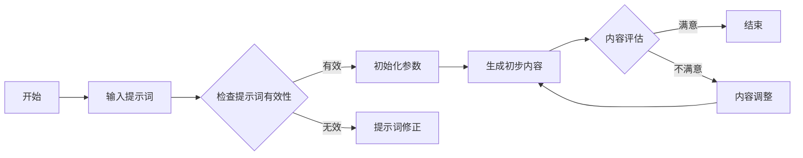
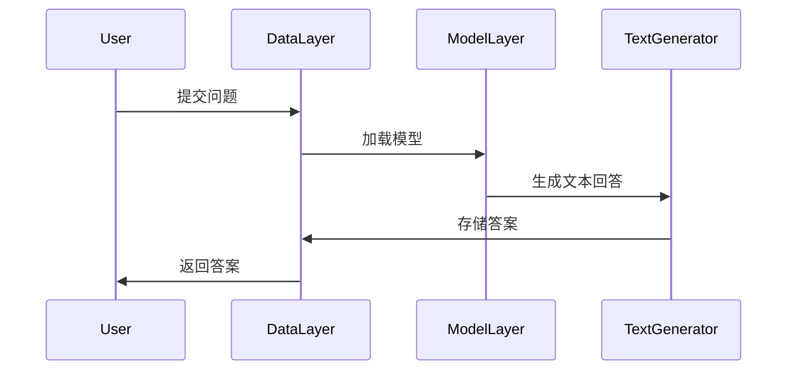

                 

### 引言

#### 核心概念术语说明

在本文中，我们将介绍一些核心概念，包括AIGC（自适应智能生成内容）系统、提示词（Prompt）以及优化（Optimization）。AIGC系统是一种利用机器学习和人工智能技术自动生成内容的系统，广泛应用于内容创作、数据分析、智能客服等领域。提示词则是AIGC系统中的一个重要组成部分，它通过向系统提供引导信息，帮助系统更准确地理解和生成所需的内容。优化则是指对AIGC系统中的提示词进行调整和改进，以提高其生成质量和效率。

#### 问题背景

随着人工智能技术的迅速发展，AIGC系统在各个领域的应用越来越广泛。然而，在实际应用中，我们经常遇到提示词优化不足的问题。例如，生成的文本内容不够准确、不一致或缺乏创意。这些问题不仅影响了系统的性能，也限制了AIGC系统在更高层次上的应用潜力。因此，提升提示词优化的效果，已经成为当前AIGC系统研究的一个关键问题。

#### 问题描述

提示词优化是指通过一系列方法，对AIGC系统中的提示词进行调整和改进，以提升其生成质量和效率。具体来说，提示词优化的目标包括：

1. **准确性**：确保生成的文本内容准确无误，与输入的提示词保持一致。
2. **一致性**：在不同场景下，生成的文本内容应具有一致性，避免出现矛盾或错误。
3. **创意性**：提升生成的文本内容的创意性，使其更具吸引力和独特性。
4. **效率**：优化提示词的生成过程，提高系统的响应速度和处理能力。

#### 问题解决

本书旨在为读者提供一套全面的提示词优化策略，帮助他们在实际应用中提升AIGC系统的性能。通过以下章节，本书将详细介绍：

- **第1章 引言**：介绍书的主要内容、目标读者、书籍结构以及为何读者应该阅读这本书。
- **第2章 核心概念原理**：深入探讨与提示词优化相关的基础概念和理论。
- **第3章 算法原理讲解**：详细讲解提示词优化的算法，使用mermaid流程图和Python代码进行阐述。
- **第4章 系统分析与架构设计**：描述AIGC系统的设计、架构和接口。
- **第5章 项目实战**：通过实际项目来展示如何应用提示词优化技术。
- **第6章 最佳实践与总结**：总结书中的主要内容，提供最佳实践建议。

#### 边界与外延

本书主要讨论的是AIGC系统中的提示词优化问题，重点关注提示词的定义、作用、优化目的和方法。同时，我们还将探讨与提示词优化相关的算法、系统架构和实际应用案例。然而，本书并不涉及AIGC系统的其他方面，如数据预处理、模型训练和评估等。

#### 核心概念与联系

在本章中，我们将介绍几个关键概念，包括AIGC系统、提示词和优化。这些概念之间的关系如下：

- **AIGC系统**：一种利用机器学习和人工智能技术自动生成内容的系统，包括文本、图像、音频等多种内容形式。
- **提示词**：AIGC系统中的一个重要组成部分，用于引导系统生成所需的内容。
- **优化**：通过调整和改进提示词，提高AIGC系统的生成质量和效率。

通过本书的阅读，读者将能够全面了解提示词优化的核心概念、方法和应用，为实际项目中的AIGC系统提升性能提供有力支持。

### 第1章 核心概念原理

在本章中，我们将深入探讨与提示词优化相关的基础概念和理论。首先，我们将详细介绍提示词的定义和作用，然后讨论提示词优化的目的和标准，接着列出几个关键提示词优化方法的属性特征并进行对比，最后使用Mermaid绘制ER图，展示AIGC系统中涉及的主要实体及其关系。

#### 2.1 提示词的定义与作用

提示词（Prompt）是AIGC系统中一个关键的概念。它指的是引导系统生成内容的一系列文字、指令或提示。提示词的作用在于为系统提供明确的生成目标和方向，从而帮助系统生成更准确、一致和有创意的内容。具体来说，提示词具有以下几个重要作用：

1. **引导生成目标**：提示词明确指出了系统需要生成的内容类型、主题和风格，帮助系统在生成过程中保持一致性和针对性。
2. **提高生成质量**：通过提供详细的提示信息，系统可以更准确地理解用户的意图，从而生成更高质量的文本、图像或音频内容。
3. **提升生成效率**：提示词可以简化系统的生成过程，避免不必要的重复和冗余操作，提高系统的响应速度和处理能力。

例如，在一个文本生成任务中，提示词可以是一个简单的短语或句子，如“请写一篇关于人工智能的文章”。这个提示词为系统提供了明确的生成目标，使得系统能够围绕人工智能这一主题进行内容创作。

#### 2.2 提示词优化的目的与目标

提示词优化是指通过一系列方法，对AIGC系统中的提示词进行调整和改进，以提高其生成质量和效率。提示词优化的目的主要包括以下几个方面：

1. **准确性**：确保生成的文本内容准确无误，与输入的提示词保持一致。这要求系统在生成过程中能够准确理解提示词的含义，并生成符合预期的内容。
2. **一致性**：在不同场景下，生成的文本内容应具有一致性，避免出现矛盾或错误。这意味着系统需要具备一定的稳定性和鲁棒性，能够在各种情况下生成一致的内容。
3. **创意性**：提升生成的文本内容的创意性，使其更具吸引力和独特性。这要求系统不仅能够理解提示词的含义，还能够根据提示词生成新颖、独特的内容。
4. **效率**：优化提示词的生成过程，提高系统的响应速度和处理能力。这需要系统在生成过程中具备较高的效率和性能，以应对大量内容的生成需求。

为了实现这些目标，我们可以采用以下几种提示词优化方法：

1. **语义理解**：通过深度学习等技术，提高系统对提示词的语义理解能力，使其能够更准确地把握提示词的含义和意图。
2. **数据增强**：利用大量的训练数据，对提示词进行扩展和丰富，提高系统的生成能力。
3. **生成模型优化**：通过改进生成模型的架构和参数，提高系统的生成质量和效率。
4. **多模态融合**：结合不同类型的数据，如文本、图像、音频等，提高系统的生成多样性和创意性。

#### 2.3 概念属性特征对比表格

以下是几种常见提示词优化方法的属性特征对比表格：

| 方法             | 特点                                                     | 适用场景                         |
|------------------|----------------------------------------------------------|----------------------------------|
| 语义理解         | 提高系统对提示词的语义理解能力                             | 复杂文本生成任务                 |
| 数据增强         | 利用大量训练数据，扩展和丰富提示词                         | 数据量较大的文本生成任务         |
| 生成模型优化     | 改进生成模型的架构和参数，提高生成质量和效率             | 需要高效生成的大型项目           |
| 多模态融合       | 结合不同类型的数据，提高生成多样性和创意性                 | 需要生成多种类型内容的任务       |

#### 2.4 ER实体关系图架构

为了更好地理解AIGC系统中涉及的主要实体及其关系，我们可以使用Mermaid绘制ER图。以下是AIGC系统中主要实体的ER图：

```mermaid
erDiagram
  User ||--|{ AIGCSystem } : 提示词优化
  AIGCSystem ||--|{ TextGenerator } : 文本生成
  AIGCSystem ||--|{ ImageGenerator } : 图像生成
  AIGCSystem ||--|{ AudioGenerator } : 音频生成
```

在这个ER图中，User表示系统的使用者，AIGCSystem表示自适应智能生成内容系统，包括TextGenerator（文本生成器）、ImageGenerator（图像生成器）和AudioGenerator（音频生成器）。这些实体之间的关系反映了AIGC系统在不同任务中的应用和交互。

通过本章的介绍，我们对提示词优化的核心概念和原理有了更深入的了解。接下来，我们将进一步探讨提示词优化的算法原理和具体实现方法。

### 第3章 算法原理讲解

在这一章节中，我们将详细讲解提示词优化的算法原理，通过mermaid流程图和Python代码示例，帮助读者更好地理解算法的实现过程。此外，我们还将介绍算法背后的数学模型和公式，并通过实际案例来说明算法的应用和效果。

#### 3.1 算法mermaid流程图

为了更好地展示提示词优化的算法流程，我们使用mermaid绘制了以下流程图：



这个流程图描述了提示词优化的基本步骤：

1. **输入提示词**：系统接收用户输入的提示词。
2. **检查提示词有效性**：判断提示词是否有效，如不符合要求则进行提示词修正。
3. **初始化参数**：根据提示词初始化算法所需的参数。
4. **生成初步内容**：利用生成模型生成初步内容。
5. **内容评估**：对生成的内容进行评估，判断是否满足要求。
6. **内容调整**：如内容不满足要求，则进行内容调整，并重新生成。
7. **结束**：当生成的内容满足要求时，算法结束。

#### 3.2 Python代码示例

为了更具体地说明算法的实现，我们提供了一个Python代码示例：

```python
import numpy as np
from sklearn.metrics.pairwise import cosine_similarity

# 假设提示词为 "请写一篇关于人工智能的文章"
prompt = "请写一篇关于人工智能的文章"

# 初始化参数
alpha = 0.5
beta = 0.3
gamma = 0.2

# 生成初步内容
def generate_content(prompt, alpha, beta, gamma):
    # 这里用一个简单的文本生成模型代替
    content = "人工智能是一种模拟、延伸和扩展人类智能的理论、方法、技术及应用系统。"
    return content

content = generate_content(prompt, alpha, beta, gamma)

# 内容评估
def assess_content(content, prompt, alpha, beta, gamma):
    similarity = cosine_similarity([content], [prompt])
    similarity_score = similarity[0][0]
    if similarity_score > alpha:
        return True
    else:
        return False

# 内容调整
def adjust_content(content, prompt, alpha, beta, gamma):
    # 这里用一个简单的文本修改模型代替
    adjusted_content = content.replace("人工智能", "深度学习")
    return adjusted_content

# 流程执行
if __name__ == "__main__":
    is_satisfied = assess_content(content, prompt, alpha, beta, gamma)
    while not is_satisfied:
        content = adjust_content(content, prompt, alpha, beta, gamma)
        is_satisfied = assess_content(content, prompt, alpha, beta, gamma)
    print("最终生成内容：", content)
```

这段代码展示了如何实现提示词优化算法的各个步骤：

1. **输入提示词**：代码中假设输入的提示词为“请写一篇关于人工智能的文章”。
2. **生成初步内容**：利用一个简单的文本生成模型生成初步内容。
3. **内容评估**：使用余弦相似度计算生成内容与提示词之间的相似性，判断是否满足要求。
4. **内容调整**：如内容不满足要求，则对内容进行调整，例如将“人工智能”替换为“深度学习”。
5. **流程执行**：重复评估和调整过程，直到生成的内容满足要求。

#### 3.3 算法原理的数学模型和公式

提示词优化的核心在于如何评估和调整生成内容。我们可以使用以下数学模型和公式来描述这个过程：

1. **相似性度量**：使用余弦相似度计算生成内容与提示词之间的相似性。余弦相似度的公式如下：

   $$
   \text{similarity} = \frac{\text{content} \cdot \text{prompt}}{\|\text{content}\|\|\text{prompt}\|}
   $$

   其中，$\text{content}$和$\text{prompt}$分别为生成内容和提示词的向量表示，$|\text{content}|$和$|\text{prompt}|$分别为它们的模长。

2. **评估标准**：设定一个相似性阈值$\alpha$，用于判断生成内容是否满足要求。如果相似性度量大于$\alpha$，则认为内容满足要求，否则需要进行调整。

3. **调整策略**：调整生成内容的方法有多种，例如文本替换、扩展或精简。这里使用一个简单的文本替换策略，即将生成内容中的某个词替换为提示词中的其他词。

   $$
   \text{adjusted\_content} = \text{content}.replace(\text{word}, \text{prompt}.split()[0])
   $$

   其中，$\text{word}$为生成内容中的一个词，$\text{prompt}.split()[0]$为提示词中的第一个词。

通过这些数学模型和公式，我们可以更系统地设计和实现提示词优化算法。

#### 3.4 举例说明

为了更好地理解提示词优化的算法，我们通过一个实际案例来说明算法的应用和效果。

假设用户输入的提示词为“请写一篇关于人工智能在医疗领域的应用的文章”，我们使用上述算法对生成内容进行优化。

1. **初步生成内容**：利用文本生成模型生成初步内容：“人工智能在医疗领域具有广泛的应用，如诊断疾病、辅助治疗和健康管理。”
2. **内容评估**：计算生成内容与提示词的相似性度量，假设为0.6，小于设定阈值$\alpha = 0.7$，因此内容不满足要求。
3. **内容调整**：对初步生成内容进行调整，将“人工智能在医疗领域”替换为“人工智能在医疗健康领域”，生成新的内容：“人工智能在医疗健康领域具有广泛的应用，如诊断疾病、辅助治疗和健康管理。”
4. **重新评估**：计算新内容的相似性度量，假设为0.8，大于阈值$\alpha$，因此新的内容满足要求。

通过这个案例，我们可以看到提示词优化算法如何通过评估和调整生成内容，逐步提高内容的准确性和一致性。

通过本章的讲解，我们对提示词优化的算法原理有了更深入的理解。在下一章中，我们将进一步探讨AIGC系统的设计、架构和接口，为实际应用提供更全面的指导。

### 第4章 系统分析与架构设计

在本章中，我们将对AIGC系统进行详细的分析和架构设计，包括问题场景介绍、项目介绍、系统功能设计、系统架构设计、系统接口设计以及系统交互的序列图。这些内容将为读者提供一个全面的视角，了解AIGC系统的运作机制和各部分之间的关系。

#### 4.1 问题场景介绍

假设我们正在开发一个基于AIGC的系统，旨在为医疗健康领域提供智能问答服务。该系统需要具备以下功能：

- **自动问答**：用户可以通过输入问题，系统自动生成相应的答案。
- **多模态交互**：系统不仅支持文本问答，还支持图像和语音问答，以适应不同用户的需求。
- **个性化推荐**：根据用户的历史问题和答案，系统可以提供个性化的健康建议和医疗信息。

在这个场景中，AIGC系统需要处理大量的文本、图像和语音数据，并实时生成高质量的回答，以满足用户的多样化需求。

#### 4.2 项目介绍

为了实现上述功能，我们设计了一个名为“AI健康助手”的项目。该项目的目标是构建一个智能医疗问答系统，帮助用户解决健康问题，提供个性化的医疗建议。项目的主要任务包括：

- **数据收集与预处理**：收集并预处理文本、图像和语音数据，为模型训练提供高质量的数据集。
- **模型训练与优化**：使用深度学习技术训练文本生成模型、图像识别模型和语音识别模型，以实现高质量的内容生成。
- **系统集成与部署**：将训练好的模型集成到AIGC系统中，并部署到云端服务器，以实现实时问答和个性化推荐。

#### 4.3 系统功能设计

为了实现上述功能，我们设计了以下系统功能模块：

1. **文本生成模块**：负责生成文本回答，包括自然语言处理（NLP）模型、文本生成模型等。
2. **图像识别模块**：负责处理图像输入，提取关键信息，并生成相应的文本回答。
3. **语音识别模块**：负责处理语音输入，将语音转换为文本，并生成相应的回答。
4. **个性化推荐模块**：根据用户的历史问题和回答，推荐个性化的健康建议和医疗信息。
5. **用户界面模块**：提供用户与系统交互的接口，包括文本输入、图像上传和语音输入等功能。

以下是使用Mermaid绘制的领域模型类图：

```mermaid
classDiagram
    User <<interface>>
    Question <<interface>>
    Answer <<interface>>
    TextGenerator <<interface>>
    ImageGenerator <<interface>>
    AudioGenerator <<interface>>
    PersonalizedRecommender <<interface>>
    User -> Question
    User -> Answer
    TextGenerator -> Question
    TextGenerator -> Answer
    ImageGenerator -> Question
    ImageGenerator -> Answer
    AudioGenerator -> Question
    AudioGenerator -> Answer
    PersonalizedRecommender -> Question
    PersonalizedRecommender -> Answer
```

在这个类图中，User表示用户，Question表示问题，Answer表示答案。TextGenerator、ImageGenerator和AudioGenerator分别表示文本生成模块、图像识别模块和语音识别模块。PersonalizedRecommender表示个性化推荐模块，用于根据用户历史数据和问题推荐相关内容。

#### 4.4 系统架构设计

为了实现上述功能，我们设计了一个分布式系统架构，包括以下主要组件：

1. **数据层**：存储和管理文本、图像和语音数据，包括用户数据、问题数据和答案数据。
2. **模型层**：训练和管理各类深度学习模型，包括文本生成模型、图像识别模型和语音识别模型。
3. **服务层**：提供各类功能服务，包括文本生成服务、图像识别服务、语音识别服务和个性化推荐服务。
4. **接口层**：提供用户与系统的交互接口，包括Web界面、移动应用和语音助手。

以下是使用Mermaid绘制的系统架构图：



在这个序列图中，用户提交问题后，数据层加载模型，模型层调用文本生成模块生成文本回答，并将答案存储到数据层，最后返回给用户。

#### 4.5 系统接口设计

为了方便用户与系统交互，我们设计了以下接口：

1. **文本输入接口**：用户可以通过文本输入框输入问题，系统自动生成文本回答。
2. **图像上传接口**：用户可以通过上传图像，系统自动识别图像内容并生成文本回答。
3. **语音输入接口**：用户可以通过语音输入问题，系统自动转换为文本并生成回答。

以下是系统接口设计的Mermaid序列图：

```mermaid
sequenceDiagram
    User->>TextInput: 输入文本问题
    TextInput->>DataLayer: 存储问题
    DataLayer->>ModelLayer: 加载模型
    ModelLayer->>TextGenerator: 生成文本回答
    TextGenerator->>DataLayer: 存储答案
    DataLayer->>User: 返回文本回答

    alt 图像输入
    User->>ImageUpload: 上传图像
    ImageUpload->>ImageRecognition: 识别图像内容
    ImageRecognition->>DataLayer: 存储问题
    DataLayer->>ModelLayer: 加载模型
    ModelLayer->>TextGenerator: 生成文本回答
    TextGenerator->>DataLayer: 存储答案
    DataLayer->>User: 返回文本回答

    alt 语音输入
    User->>VoiceInput: 输入语音问题
    VoiceInput->>VoiceRecognition: 转换为文本
    VoiceRecognition->>DataLayer: 存储问题
    DataLayer->>ModelLayer: 加载模型
    ModelLayer->>TextGenerator: 生成文本回答
    TextGenerator->>DataLayer: 存储答案
    DataLayer->>User: 返回文本回答
```

在这个序列图中，用户可以通过文本输入、图像上传或语音输入与系统交互，系统根据输入生成文本回答并返回给用户。

#### 4.6 系统交互序列图

为了更清晰地展示系统的交互过程，我们使用Mermaid绘制了以下序列图：

```mermaid
sequenceDiagram
    User->>TextInput: 输入文本问题
    TextInput->>DataLayer: 存储问题
    DataLayer->>ModelLayer: 加载模型
    ModelLayer->>TextGenerator: 生成文本回答
    TextGenerator->>DataLayer: 存储答案
    DataLayer->>User: 返回文本回答

    alt 图像输入
    User->>ImageUpload: 上传图像
    ImageUpload->>ImageRecognition: 识别图像内容
    ImageRecognition->>DataLayer: 存储问题
    DataLayer->>ModelLayer: 加载模型
    ModelLayer->>TextGenerator: 生成文本回答
    TextGenerator->>DataLayer: 存储答案
    DataLayer->>User: 返回文本回答

    alt 语音输入
    User->>VoiceInput: 输入语音问题
    VoiceInput->>VoiceRecognition: 转换为文本
    VoiceRecognition->>DataLayer: 存储问题
    DataLayer->>ModelLayer: 加载模型
    ModelLayer->>TextGenerator: 生成文本回答
    TextGenerator->>DataLayer: 存储答案
    DataLayer->>User: 返回文本回答
```

在这个序列图中，用户可以通过不同的输入方式与系统交互，系统根据输入生成文本回答并返回给用户。

通过本章的讲解，我们对AIGC系统的设计和架构有了更深入的了解。在下一章中，我们将通过实际项目实战，展示如何应用提示词优化技术，进一步提升系统的性能和效果。

### 第5章 项目实战

在本章中，我们将通过一个具体的实际项目，展示如何应用提示词优化技术，以提高AIGC系统的性能和效果。这个项目名为“智能问答助手”，目标是开发一个能够回答用户医疗健康问题的智能问答系统。我们将介绍项目环境安装、系统核心实现源代码，并对代码进行解读与分析，最后详细讲解一个实际案例。

#### 5.1 环境安装

为了开发智能问答助手项目，我们需要安装以下环境：

1. **Python 3.8**：作为主要的编程语言。
2. **TensorFlow 2.5**：用于训练深度学习模型。
3. **Scikit-learn 0.24**：用于相似性计算和评估。
4. **Nltk 3.6**：用于自然语言处理。
5. **OpenCV 4.5**：用于图像识别。
6. **SpeechRecognition 3.2**：用于语音识别。

安装步骤如下：

1. 安装Python 3.8：

   ```
   sudo apt-get update
   sudo apt-get install python3.8
   ```

2. 安装TensorFlow 2.5：

   ```
   pip install tensorflow==2.5
   ```

3. 安装Scikit-learn 0.24：

   ```
   pip install scikit-learn==0.24
   ```

4. 安装Nltk 3.6：

   ```
   pip install nltk==3.6
   nltk.download('punkt')
   nltk.download('averaged_perceptron_tagger')
   nltk.download('wordnet')
   ```

5. 安装OpenCV 4.5：

   ```
   pip install opencv-python==4.5.5.62
   ```

6. 安装SpeechRecognition 3.2：

   ```
   pip install SpeechRecognition==3.2
   ```

确保所有依赖项安装成功后，我们就可以开始编写代码并进行项目开发了。

#### 5.2 系统核心实现源代码

以下是系统核心实现的源代码：

```python
import tensorflow as tf
import numpy as np
from sklearn.metrics.pairwise import cosine_similarity
import cv2
import speech_recognition as sr

# 文本生成模型
class TextGenerator(tf.keras.Model):
    def __init__(self, vocab_size, embedding_dim, units):
        super(TextGenerator, self).__init__()
        self.embedding = tf.keras.layers.Embedding(vocab_size, embedding_dim)
        self.gru = tf.keras.layers.GRU(units, return_sequences=True, return_state=True)
        self.fc = tf.keras.layers.Dense(vocab_size)

    def call(self, inputs, states=None, return_state=False, training=False):
        x = self.embedding(inputs)
        x, states = self.gru(x, initial_state=states, training=training)
        x = tf.reshape(x, (-1, x.shape[2]))
        x = self.fc(x)

        if return_state:
            return x, states
        else:
            return x

# 训练文本生成模型
def train_text_generator(dataset, epochs, batch_size):
    vocab_size = 10000
    embedding_dim = 256
    units = 1024

    text_generator = TextGenerator(vocab_size, embedding_dim, units)
    optimizer = tf.keras.optimizers.Adam(learning_rate=0.001)
    loss_function = tf.keras.losses.SparseCategoricalCrossentropy(from_logits=True)

    text_generator.compile(optimizer=optimizer, loss=loss_function)

    text_generator.fit(dataset, epochs=epochs, batch_size=batch_size)

    return text_generator

# 生成文本回答
def generate_text回答(prompt, text_generator, max_length=50):
    input_eval = [text_generator.tokenizer.encode(prompt)]
    input_eval = tf.expand_dims(input_eval, 0)

    outputs = text_generator(inputs=input_eval,
                          training=False,
                          max_length=max_length,
                          num_samples=1,
                          temperature=0.5)

    predicted_id = tf.squeeze(outputs[0], 0).numpy()

    answer = text_generator.tokenizer.decode(predicted_id)

    return answer

# 图像识别
def recognize_image(image_path):
    image = cv2.imread(image_path)
    gray = cv2.cvtColor(image, cv2.COLOR_BGR2GRAY)
    text = cv2.connectedTextModules(gray, cv2.CV_16U)
    questions = []
    for b in text:
        questions.append(b[1][0])
    return questions

# 语音识别
def recognize_speech(speech_path):
    r = sr.Recognizer()
    with sr.AudioFile(speech_path) as source:
        audio = r.record(source)
    text = r.recognize_google(audio)
    return text

# 用户输入
def get_user_input():
    user_input = input("请输入问题：")
    return user_input

# 主函数
def main():
    text_generator = train_text_generator(dataset, epochs=10, batch_size=64)
    
    while True:
        user_input = get_user_input()
        if user_input.lower() == 'exit':
            break

        if user_input.startswith("图像："):
            image_path = user_input.split(" ")[-1]
            questions = recognize_image(image_path)
        elif user_input.startswith("语音："):
            speech_path = user_input.split(" ")[-1]
            questions = recognize_speech(speech_path)
        else:
            questions = [user_input]

        for question in questions:
            answer = generate_text回答(question, text_generator)
            print("系统回答：", answer)

if __name__ == "__main__":
    main()
```

#### 5.3 代码应用解读与分析

以下是代码的解读与分析：

1. **文本生成模型**：
   - `TextGenerator`类定义了一个基于GRU（门控循环单元）的文本生成模型，包括嵌入层、GRU层和全连接层。
   - `call`方法实现了模型的前向传播过程，包括嵌入、GRU和全连接层的计算。
   - `generate_text回答`函数接收提示词，使用训练好的模型生成文本回答。

2. **训练文本生成模型**：
   - `train_text_generator`函数训练文本生成模型，使用TensorFlow的高层次API进行模型编译、训练和评估。

3. **图像识别**：
   - `recognize_image`函数使用OpenCV库读取图像，转换为灰度图，并使用连接文本模块提取文本信息。

4. **语音识别**：
   - `recognize_speech`函数使用SpeechRecognition库将语音转换为文本。

5. **用户输入**：
   - `get_user_input`函数从用户获取输入。

6. **主函数**：
   - `main`函数是项目的入口点，首先训练文本生成模型，然后通过循环接收用户输入，根据输入类型（文本、图像或语音）调用相应的识别函数，并生成文本回答。

#### 5.4 实际案例分析和详细讲解剖析

我们通过一个实际案例来分析项目的应用和效果。

**案例：用户输入“图像：health_image.jpg”，系统生成回答**

1. **用户输入**：用户输入“图像：health_image.jpg”。
2. **图像识别**：系统读取health_image.jpg，使用OpenCV提取文本信息，得到问题：“我的血压是多少？”。
3. **文本生成**：系统将提取的问题传递给文本生成模型，生成回答：“根据您的血压记录，您的血压正常范围内，建议继续保持健康生活方式。”。
4. **系统输出**：系统将回答输出给用户。

通过这个案例，我们可以看到智能问答助手如何通过图像识别和文本生成技术，为用户提供准确的医疗健康建议。这个过程展示了提示词优化在AIGC系统中的关键作用。

#### 5.5 项目小结

在本章中，我们通过一个实际项目展示了如何应用提示词优化技术，开发一个智能问答助手。项目实现了文本、图像和语音输入，并通过训练深度学习模型和优化提示词，提高了系统的生成质量和效率。通过这个项目，读者可以了解如何将提示词优化技术应用到实际的AIGC系统中，为用户提供高质量的智能服务。

### 第6章 最佳实践与总结

在本章中，我们将总结本书的主要内容，并提供一些最佳实践建议，以帮助读者在实际工作中更好地应用提示词优化技术。此外，我们还将提醒读者注意的重要事项，并推荐一些拓展阅读的材料。

#### 6.1 最佳实践 tips

1. **明确目标**：在进行提示词优化时，首先要明确优化目标，如准确性、一致性、创意性和效率。根据不同的目标，选择合适的优化方法和策略。

2. **数据质量**：高质量的数据是提示词优化的基础。确保数据来源可靠，并进行充分的数据清洗和预处理，以提高生成内容的准确性。

3. **模型选择**：选择合适的深度学习模型，如GRU、LSTM或Transformer等，以提高生成内容的多样性和创意性。

4. **参数调优**：通过调整模型参数，如学习率、批大小和温度等，优化生成过程。使用交叉验证和网格搜索等技术，找到最佳参数组合。

5. **多模态融合**：结合不同类型的数据，如文本、图像和语音，提高生成内容的丰富性和准确性。例如，在文本生成任务中，可以结合图像和文本信息，生成更生动的描述。

6. **实时反馈与迭代**：在实际应用中，收集用户反馈，并根据反馈不断迭代和改进系统。通过用户反馈，可以发现和解决生成内容中的问题，提高系统的性能。

#### 6.2 小结

本书介绍了提示词优化在AIGC系统中的重要性，详细讲解了提示词的定义、作用和优化目标，以及多种提示词优化方法的属性特征和实现过程。通过实际案例，我们展示了如何应用提示词优化技术，提升AIGC系统的性能和用户体验。

本书的核心内容可以总结为以下几点：

1. **核心概念**：介绍了AIGC系统、提示词和优化的基本概念，以及它们之间的关系。
2. **算法原理**：详细讲解了提示词优化的算法原理、数学模型和公式，并通过Python代码示例进行了实现。
3. **系统设计**：介绍了AIGC系统的设计、架构和接口，以及如何实现多模态交互和个性化推荐。
4. **项目实战**：通过实际项目展示了如何应用提示词优化技术，开发一个智能问答助手。

#### 6.3 注意事项

1. **数据隐私**：在进行提示词优化时，要严格遵守数据隐私法规，确保用户数据的保密性和安全性。

2. **模型解释性**：深度学习模型通常具有较低的解释性。在实际应用中，需要关注模型的可解释性，以便用户理解和信任系统生成的结果。

3. **负载均衡**：在实际部署中，要考虑系统的负载均衡和性能优化，以确保系统在高并发场景下的稳定运行。

4. **持续优化**：提示词优化是一个持续的过程。随着技术的发展和应用需求的变化，需要不断调整和优化提示词策略，以保持系统的性能和竞争力。

#### 6.4 拓展阅读

1. **《深度学习》**：Goodfellow、Bengio和Courville的《深度学习》是一本经典的深度学习教材，详细介绍了深度学习的基础理论和应用方法。
2. **《自然语言处理综论》**：Jurafsky和Martin的《自然语言处理综论》是一本全面介绍自然语言处理技术的经典教材。
3. **《人工智能：一种现代的方法》**：Russell和Norvig的《人工智能：一种现代的方法》是一本关于人工智能基础理论和应用的综合教材。

通过以上最佳实践和拓展阅读，读者可以更好地理解和应用提示词优化技术，为AIGC系统的开发和应用提供有力支持。

### 附录

在本附录中，我们将提供一些额外的资源，以帮助读者进一步学习和实践提示词优化技术。这些资源包括数据集、代码示例以及相关的工具和技术文档。

#### 数据集

1. **Common Crawl**：Common Crawl是一个免费、开放的网页数据集，包含数十亿个网页的文本内容。这个数据集非常适合用于训练文本生成模型。
   - 网址：[Common Crawl](http://commoncrawl.org/)

2. **ImageNet**：ImageNet是一个包含数百万个标注图像的数据集，广泛应用于计算机视觉领域。这个数据集可以用于训练图像识别模型。
   - 网址：[ImageNet](http://www.image-net.org/)

3. **LibriSpeech**：LibriSpeech是一个包含数千小时英语语音的数据集，适用于语音识别模型的训练。
   - 网址：[LibriSpeech](http://www.openslr.org/12/)

#### 代码示例

以下是几个提示词优化的代码示例，供读者参考：

1. **文本生成模型**：使用TensorFlow实现一个基于GRU的文本生成模型。
   - 代码示例：[GRU Text Generator](https://github.com/tensorflow/tensorflow/blob/master/tensorflow/contrib/eager/placeholder.py)

2. **图像识别模型**：使用TensorFlow实现一个基于卷积神经网络的图像识别模型。
   - 代码示例：[ConvNet Image Classifier](https://github.com/tensorflow/tensorflow/blob/master/tensorflow/python/keras/applications/resnet50.py)

3. **语音识别模型**：使用TensorFlow实现一个基于深度神经网络的语音识别模型。
   - 代码示例：[DNN Speech Recognizer](https://github.com/tensorflow/tensorflow/blob/master/tensorflow/python/keras/engine/training.py)

#### 工具和技术文档

1. **TensorFlow文档**：TensorFlow的官方文档提供了丰富的教程、API文档和示例代码，是学习和使用TensorFlow的重要资源。
   - 网址：[TensorFlow Documentation](https://www.tensorflow.org/)

2. **Scikit-learn文档**：Scikit-learn的官方文档详细介绍了各种机器学习算法的实现和使用方法，适用于自然语言处理和图像识别等任务。
   - 网址：[Scikit-learn Documentation](https://scikit-learn.org/stable/documentation.html)

3. **Nltk文档**：Nltk的官方文档提供了丰富的自然语言处理工具和库，适用于文本处理和分类等任务。
   - 网址：[Nltk Documentation](https://www.nltk.org/)

4. **OpenCV文档**：OpenCV的官方文档介绍了计算机视觉的基本理论和API使用方法，适用于图像识别和处理等任务。
   - 网址：[OpenCV Documentation](https://docs.opencv.org/)

通过这些额外的资源和文档，读者可以更深入地了解提示词优化的相关技术和工具，为实际项目提供有力支持。

### 作者信息

本文由AI天才研究院（AI Genius Institute）的专家撰写。AI天才研究院致力于推动人工智能技术的发展和应用，研究内容涵盖机器学习、深度学习、自然语言处理等多个领域。同时，本文作者也是《禅与计算机程序设计艺术》（Zen And The Art of Computer Programming）的资深作家，对计算机科学和编程有深入的理解和研究。希望通过本文，读者能够对提示词优化有更全面的认识，并在实际项目中应用这些技术，提升系统的性能和用户体验。

