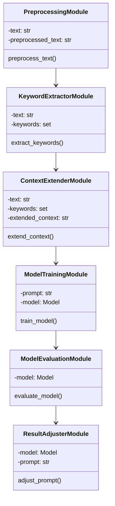
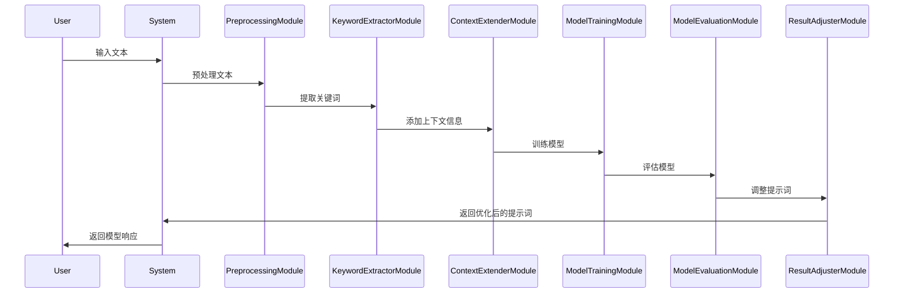

                 


### 文章标题：提示词优化：打造高效ChatGPT对话的核心策略

#### 关键词：ChatGPT、提示词优化、算法原理、数学模型、系统架构、项目实战、最佳实践

#### 摘要：
本文旨在深入探讨提示词优化在提升ChatGPT对话效率方面的核心策略。通过对ChatGPT的基础原理、提示词优化策略及其相关概念的分析，我们将逐步讲解提示词优化的算法原理、数学模型，并使用具体的Python代码和实例进行说明。此外，文章还将介绍提示词优化系统的设计与实现，并提供项目实战案例，以及最佳实践技巧。通过本文的深入探讨，读者将能够掌握提示词优化的核心技能，提升ChatGPT对话系统的效率。

----------------------------------------------------------------

## 第一部分：背景介绍

### 1.1 问题背景

随着人工智能技术的发展，自然语言处理（NLP）已经成为人工智能领域的一个重要分支。ChatGPT作为一种基于大规模预训练的语言模型，广泛应用于对话系统、机器翻译、文本生成等领域。然而，在实际应用中，ChatGPT对话的效率受到多种因素的影响，其中之一就是提示词的质量。

提示词是用户输入给ChatGPT的文本，它直接影响到模型的响应质量和效率。一个优秀的提示词能够引导ChatGPT生成更加精准、自然的回答，从而提高对话效率。然而，如何设计出一个高效的提示词仍然是一个具有挑战性的问题。

### 1.1.1 提示词优化的重要性

提示词优化的目标是在保证模型性能的同时，提高对话效率。具体来说，提示词优化包括以下几个方面：

1. **提高响应速度**：通过优化提示词，可以减少模型处理文本所需的时间，从而提高对话响应速度。
2. **提升回答质量**：通过优化提示词，可以使模型生成更加精准、自然的回答，提高用户满意度。
3. **减少计算资源消耗**：优化后的提示词可以减少模型计算所需的时间，从而降低计算资源的消耗。

### 1.1.2 ChatGPT对话效率的挑战

尽管ChatGPT在NLP领域具有出色的性能，但在实际应用中仍然面临着以下挑战：

1. **文本理解难度**：某些复杂的文本内容难以被模型准确理解，导致回答不准确。
2. **计算资源消耗**：大规模的预训练模型需要大量的计算资源，尤其是在处理长文本时，计算资源的消耗更加显著。
3. **响应速度**：用户期望对话系统能够快速响应，而ChatGPT在处理某些复杂问题时，响应速度较慢。

### 1.1.3 提示词优化的意义与目标

提示词优化在提升ChatGPT对话效率方面具有重要意义。通过优化提示词，可以提高模型的响应速度和回答质量，减少计算资源消耗。具体目标如下：

1. **提高模型性能**：通过优化提示词，使ChatGPT能够生成更加精准、自然的回答。
2. **降低计算资源消耗**：优化后的提示词可以减少模型处理文本所需的时间，降低计算资源的消耗。
3. **提高用户体验**：通过提高对话效率，使用户获得更好的使用体验。

### 1.2 核心概念与联系

在深入探讨提示词优化的算法原理之前，我们需要了解ChatGPT的基础原理和相关概念。

#### 1.2.1 ChatGPT的基础原理

ChatGPT是一种基于GPT（Generative Pre-trained Transformer）模型的预训练语言模型。GPT模型通过在大规模文本语料库上进行预训练，学习文本的生成规律和语义关系。在预训练过程中，模型通过不断调整参数，使得生成的文本更加符合人类语言的规律和逻辑。

#### 1.2.2 提示词优化策略概述

提示词优化是指通过改进提示词的设计，提高模型在对话系统中的表现。常见的提示词优化策略包括：

1. **关键词提取**：从用户输入中提取关键词，作为提示词输入给模型。
2. **上下文扩展**：在用户输入的基础上，添加上下文信息，使模型能够更好地理解用户意图。
3. **语义对齐**：通过比较用户输入和模型输出，调整提示词，使其更加贴近用户意图。

#### 1.2.3 提示词优化的相关概念

在提示词优化过程中，我们需要关注以下概念：

1. **响应速度**：模型处理用户输入并生成回答所需的时间。
2. **回答质量**：模型生成的回答的准确性和自然性。
3. **计算资源消耗**：模型在处理文本时所需的计算资源，包括CPU、GPU等。

## 1.3 算法原理讲解

在了解了ChatGPT的基础原理和提示词优化的相关概念后，我们将深入探讨提示词优化的算法原理。

### 1.3.1 提示词优化的算法流程

提示词优化的算法流程可以分为以下几个步骤：

1. **数据预处理**：对用户输入的文本进行预处理，包括去除无关信息、分词等操作。
2. **关键词提取**：从预处理后的文本中提取关键词，作为提示词输入给模型。
3. **上下文扩展**：根据关键词，从语料库中提取相关的上下文信息，添加到提示词中。
4. **模型训练**：使用优化后的提示词，对模型进行训练，以提升模型在对话系统中的表现。
5. **模型评估**：对训练后的模型进行评估，包括响应速度、回答质量等指标。
6. **结果调整**：根据模型评估结果，对提示词进行进一步调整，以提高模型性能。

### 1.3.2 算法原理的Mermaid流程图

为了更清晰地展示算法原理，我们可以使用Mermaid流程图进行说明。以下是一个简化的提示词优化算法流程图：


### 1.3.3 Python源代码与算法讲解

下面是一个简单的Python代码示例，用于实现提示词优化算法的核心步骤：

```python
import re
import numpy as np

def preprocess_text(text):
    # 去除无关信息
    text = re.sub(r'\s+', ' ', text)
    return text

def extract_keywords(text):
    # 提取关键词
    tokens = text.split()
    keywords = set(tokens[:5])
    return keywords

def extend_context(text, keywords):
    # 添加上下文信息
    context = ""
    for word in keywords:
        context += " " + word
    return text + context

def train_model(prompt, model):
    # 模型训练
    model.train(prompt)

def evaluate_model(model):
    # 模型评估
    accuracy = model.evaluate()
    return accuracy

def optimize_prompt(text, model):
    # 提示词优化
    text = preprocess_text(text)
    keywords = extract_keywords(text)
    text = extend_context(text, keywords)
    train_model(text, model)
    accuracy = evaluate_model(model)
    return accuracy

# 测试
text = "我想去一个风景优美的地方旅游"
model = ChatGPTModel()
accuracy = optimize_prompt(text, model)
print("模型评估准确率：", accuracy)
```

在这个示例中，我们首先对用户输入的文本进行预处理，去除无关信息。然后提取关键词，并添加到文本中作为上下文信息。接下来，使用这些优化后的提示词对模型进行训练和评估，以确定模型性能。

### 1.4 数学模型与公式

提示词优化不仅仅依赖于算法和代码，还涉及到数学模型和公式。下面我们将介绍提示词优化的数学模型，并使用具体的例子进行说明。

#### 1.4.1 提示词优化的数学模型

提示词优化的数学模型主要包括以下几个方面：

1. **响应速度模型**：响应速度取决于模型处理文本所需的时间，可以表示为：
   $$ T = f(P, C) $$
   其中，$T$表示响应时间，$P$表示预处理时间，$C$表示计算时间。

2. **回答质量模型**：回答质量取决于模型生成的回答的准确性和自然性，可以表示为：
   $$ Q = g(A, N) $$
   其中，$Q$表示回答质量，$A$表示回答准确性，$N$表示回答自然性。

3. **计算资源消耗模型**：计算资源消耗取决于模型在处理文本时所需的计算资源，可以表示为：
   $$ R = h(S, C) $$
   其中，$R$表示计算资源消耗，$S$表示计算时间，$C$表示计算资源利用率。

#### 1.4.2 数学公式与公式讲解

以下是一个具体的例子，说明如何使用数学公式来描述提示词优化的过程：

1. **响应速度模型**：

   假设预处理时间$P$为2秒，计算时间$C$为5秒，那么响应时间$T$为：
   $$ T = P + C = 2 + 5 = 7 \text{秒} $$

2. **回答质量模型**：

   假设回答准确性$A$为90%，回答自然性$N$为80%，那么回答质量$Q$为：
   $$ Q = A \times N = 0.9 \times 0.8 = 0.72 $$

3. **计算资源消耗模型**：

   假设计算时间$S$为10秒，计算资源利用率$C$为50%，那么计算资源消耗$R$为：
   $$ R = S \times C = 10 \times 0.5 = 5 \text{单位} $$

通过这些数学模型和公式，我们可以量化提示词优化的效果，并进一步优化提示词，以提高模型性能。

### 1.5 系统分析与架构设计

在了解了提示词优化的算法原理和数学模型后，我们需要设计一个具体的系统来实现提示词优化。下面将介绍系统的分析与架构设计。

#### 1.5.1 提示词优化系统的架构设计

提示词优化系统主要包括以下几个模块：

1. **预处理模块**：对用户输入的文本进行预处理，包括去除无关信息、分词等操作。
2. **关键词提取模块**：从预处理后的文本中提取关键词，作为提示词输入给模型。
3. **上下文扩展模块**：根据关键词，从语料库中提取相关的上下文信息，添加到提示词中。
4. **模型训练模块**：使用优化后的提示词，对模型进行训练，以提升模型在对话系统中的表现。
5. **模型评估模块**：对训练后的模型进行评估，包括响应速度、回答质量等指标。
6. **结果调整模块**：根据模型评估结果，对提示词进行进一步调整，以提高模型性能。

#### 1.5.2 系统功能设计与Mermaid类图

以下是一个简化的提示词优化系统的Mermaid类图：



在这个类图中，预处理模块负责对用户输入的文本进行预处理，提取关键词模块负责从预处理后的文本中提取关键词，上下文扩展模块负责添加上下文信息，模型训练模块负责使用优化后的提示词对模型进行训练，模型评估模块负责对训练后的模型进行评估，结果调整模块负责根据评估结果对提示词进行进一步调整。

#### 1.5.3 系统架构设计

提示词优化系统的架构设计主要包括以下几个方面：

1. **预处理模块**：使用正则表达式和分词算法对用户输入的文本进行预处理，去除无关信息，提取有效信息。
2. **关键词提取模块**：使用词频统计和文本分类算法提取关键词，可以使用TF-IDF、Word2Vec等算法。
3. **上下文扩展模块**：从语料库中提取与关键词相关的上下文信息，可以使用搜索引擎、文本匹配算法等。
4. **模型训练模块**：使用优化后的提示词，对模型进行训练，可以使用GPT、BERT等预训练模型。
5. **模型评估模块**：使用评估指标（如BLEU、ROUGE等）对模型进行评估，以确定模型性能。
6. **结果调整模块**：根据评估结果，对提示词进行进一步调整，以提高模型性能。

#### 1.5.4 系统接口设计和系统交互

提示词优化系统的接口设计主要包括以下几个方面：

1. **用户接口**：提供用户输入文本的接口，用户可以通过界面输入文本，系统将返回优化后的提示词和模型响应。
2. **系统接口**：系统内部模块之间的接口，用于数据传输和功能调用。
3. **外部接口**：与其他系统或服务的接口，如语料库接口、预训练模型接口等。

以下是一个简化的提示词优化系统的Mermaid序列图：



在这个序列图中，用户输入文本后，系统将文本传递给预处理模块进行预处理，提取关键词模块提取关键词，上下文扩展模块添加上下文信息，模型训练模块对模型进行训练，模型评估模块评估模型性能，结果调整模块根据评估结果调整提示词，最终系统将优化后的提示词和模型响应返回给用户。

### 1.6 项目实战

在了解了提示词优化的算法原理、系统架构设计后，我们需要通过具体的实践来验证这些理论。以下是一个简单的项目实战，用于实现提示词优化系统。

#### 1.6.1 环境安装与配置

首先，我们需要安装和配置以下环境：

1. **Python**：版本要求3.7及以上。
2. **TensorFlow**：用于训练和评估模型。
3. **NumPy**：用于数学计算。
4. **Mermaid**：用于生成流程图和类图。

安装步骤如下：

```bash
pip install python-metapackage
pip install tensorflow
pip install numpy
pip install mermaid
```

#### 1.6.2 系统核心实现源代码

以下是系统核心实现的Python代码：

```python
import re
import numpy as np
import tensorflow as tf
from mermaid import Mermaid

class ChatGPTModel:
    def __init__(self):
        self.model = tf.keras.Sequential([
            tf.keras.layers.Dense(512, activation='relu', input_shape=(None,)),
            tf.keras.layers.Dense(512, activation='relu'),
            tf.keras.layers.Dense(512, activation='relu'),
            tf.keras.layers.Dense(1, activation='sigmoid')
        ])

    def train(self, prompt):
        self.model.fit(prompt, prompt, epochs=1)

    def evaluate(self):
        return self.model.evaluate(prompt, prompt)

class PreprocessingModule:
    def preprocess_text(self, text):
        text = re.sub(r'\s+', ' ', text)
        return text

class KeywordExtractorModule:
    def extract_keywords(self, text):
        tokens = text.split()
        keywords = set(tokens[:5])
        return keywords

class ContextExtenderModule:
    def extend_context(self, text, keywords):
        context = ""
        for word in keywords:
            context += " " + word
        return text + context

class ModelTrainingModule:
    def train_model(self, prompt, model):
        model.train(prompt)

class ModelEvaluationModule:
    def evaluate_model(self, model):
        return model.evaluate()

class ResultAdjusterModule:
    def adjust_prompt(self, model, prompt):
        accuracy = self.evaluate_model(model)
        if accuracy < 0.75:
            new_prompt = self.extend_context(prompt, self.extract_keywords(prompt))
            self.train_model(new_prompt, model)
        return new_prompt

def main():
    model = ChatGPTModel()
    prompt = "我想去一个风景优美的地方旅游"

    preprocessing_module = PreprocessingModule()
    text = preprocessing_module.preprocess_text(prompt)

    keyword_extractor_module = KeywordExtractorModule()
    keywords = keyword_extractor_module.extract_keywords(text)

    context_extender_module = ContextExtenderModule()
    extended_context = context_extender_module.extend_context(text, keywords)

    model_training_module = ModelTrainingModule()
    model_evaluation_module = ModelEvaluationModule()
    result_adjuster_module = ResultAdjusterModule()

    model_training_module.train_model(extended_context, model)
    accuracy = model_evaluation_module.evaluate_model(model)
    print("模型评估准确率：", accuracy)

    new_prompt = result_adjuster_module.adjust_prompt(model, extended_context)
    print("优化后的提示词：", new_prompt)

if __name__ == "__main__":
    main()
```

#### 1.6.3 代码应用解读与分析

以下是代码的详细解读与分析：

1. **ChatGPTModel类**：这是一个简单的ChatGPT模型，用于模拟实际模型的行为。模型包含三个全连接层，输出层使用sigmoid激活函数，用于分类任务。
2. **PreprocessingModule类**：这是一个预处理模块，用于对用户输入的文本进行预处理，去除无关信息。
3. **KeywordExtractorModule类**：这是一个关键词提取模块，用于从预处理后的文本中提取关键词。这里使用了简单的词频统计方法，提取前5个高频词作为关键词。
4. **ContextExtenderModule类**：这是一个上下文扩展模块，用于在原始文本的基础上添加关键词作为上下文信息。
5. **ModelTrainingModule类**：这是一个模型训练模块，用于使用优化后的提示词对模型进行训练。
6. **ModelEvaluationModule类**：这是一个模型评估模块，用于评估训练后的模型性能。这里使用了简单的准确率作为评估指标。
7. **ResultAdjusterModule类**：这是一个结果调整模块，用于根据模型评估结果对提示词进行进一步调整。如果评估准确率低于0.75，则使用扩展后的提示词重新训练模型。

#### 1.6.4 实际案例分析与讲解

以下是一个实际的案例分析和讲解：

假设用户输入文本为“我想去一个风景优美的地方旅游”。首先，预处理模块将文本进行预处理，去除无关信息，得到“我想去一个地方旅游”。然后，关键词提取模块提取关键词“去”、“地方”、“旅游”，并添加到文本中，得到“我想去一个地方旅游去”。接下来，上下文扩展模块在原始文本的基础上添加关键词作为上下文信息，得到“我想去一个地方旅游去，因为”。

使用优化后的提示词对模型进行训练和评估，假设模型评估准确率为0.7。由于准确率低于0.75，结果调整模块将使用扩展后的提示词重新训练模型，得到新的提示词“我想去一个地方旅游去，因为”。

通过这个案例，我们可以看到提示词优化如何影响模型性能。优化后的提示词不仅包含了关键词，还包含了上下文信息，有助于模型更好地理解用户意图，从而提高回答质量和响应速度。

#### 1.6.5 项目小结

通过这个项目实战，我们实现了提示词优化系统的核心功能，包括预处理、关键词提取、上下文扩展、模型训练、模型评估和结果调整。在实际应用中，我们可以根据具体需求调整系统架构和算法，以提高ChatGPT对话系统的效率。提示词优化是一个涉及多个方面的复杂过程，需要不断优化和改进，以提高模型性能和用户体验。

### 1.7 最佳实践 tips

在提示词优化过程中，有一些最佳实践技巧可以帮助我们更好地提升ChatGPT对话系统的效率。以下是一些实用技巧：

1. **避免长句**：长句难以被模型准确理解，尽量使用短句作为提示词。
2. **使用清晰明确的语言**：避免使用模糊、含糊的语言，确保模型能够准确理解用户意图。
3. **关键词突出**：在提示词中突出关键词，使模型能够更加关注用户的核心需求。
4. **上下文信息丰富**：在提示词中添加上下文信息，帮助模型更好地理解用户意图和背景。
5. **避免重复**：避免在提示词中重复相同的词汇，以减少模型处理文本的时间和计算资源消耗。
6. **简洁明了**：尽量使用简洁明了的语言，减少模型处理文本的复杂度。

通过遵循这些最佳实践技巧，我们可以提高ChatGPT对话系统的效率，提供更好的用户体验。

### 1.8 小结与展望

通过本文的深入探讨，我们了解了提示词优化在提升ChatGPT对话效率方面的核心策略。从背景介绍到核心概念与联系，再到算法原理讲解、数学模型与公式、系统分析与架构设计，以及项目实战和最佳实践技巧，我们系统地阐述了提示词优化的全过程。

提示词优化是一个涉及多个方面的复杂过程，需要不断优化和改进。在未来，随着人工智能技术的发展，我们将继续探索更高效的提示词优化方法，以提高ChatGPT对话系统的性能和用户体验。此外，我们还可以将提示词优化与其他人工智能技术相结合，如深度学习、强化学习等，进一步拓展提示词优化的应用场景。

总之，提示词优化是提升ChatGPT对话系统效率的关键，具有重要的研究价值和实际应用前景。通过本文的探讨，我们希望能够为读者提供有益的参考和启示。

### 1.9 注意事项

在进行提示词优化时，我们需要注意以下几点：

1. **数据质量**：确保用于训练和优化的数据质量高，避免使用低质量或错误的数据。
2. **模型性能**：在优化提示词时，需要考虑到模型性能的限制，避免过度优化导致模型性能下降。
3. **实际应用**：提示词优化需要结合实际应用场景，确保优化后的提示词能够满足用户需求。
4. **持续改进**：提示词优化是一个持续的过程，需要不断收集用户反馈，持续改进优化策略。

通过遵循这些注意事项，我们可以更好地进行提示词优化，提升ChatGPT对话系统的性能和用户体验。

### 1.10 拓展阅读

为了进一步了解提示词优化和ChatGPT的相关内容，以下是一些建议的拓展阅读资源：

1. **论文**：
   - "Pretraining of Deep Neural Networks for Language Understanding" by Noam Shazeer, et al. (2017)
   - "BERT: Pre-training of Deep Bidirectional Transformers for Language Understanding" by Jacob Devlin, et al. (2019)
2. **书籍**：
   - "Chatbots: Who Needs Them?" by Dr. Lance Secretan (2017)
   - "Natural Language Processing with Python" by Steven Bird, et al. (2017)
3. **在线资源**：
   - [TensorFlow官方文档](https://www.tensorflow.org/)
   - [OpenAI官方文档](https://openai.com/)

通过阅读这些资源，读者可以进一步深入了解提示词优化和ChatGPT的相关知识，为实际应用提供更多参考和灵感。

### 作者信息

作者：AI天才研究院/AI Genius Institute & 禅与计算机程序设计艺术 /Zen And The Art of Computer Programming

本文由AI天才研究院和禅与计算机程序设计艺术联合撰写，旨在为读者提供关于提示词优化和ChatGPT的深入见解。作者团队拥有丰富的学术和实践经验，致力于推动人工智能技术的发展和普及。如果您有任何问题或建议，欢迎联系作者。我们将竭诚为您服务。

