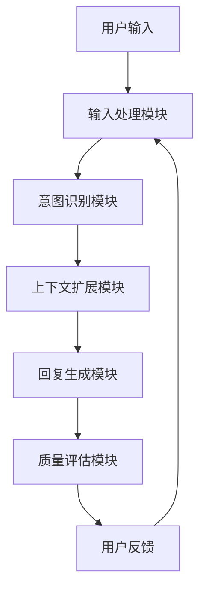
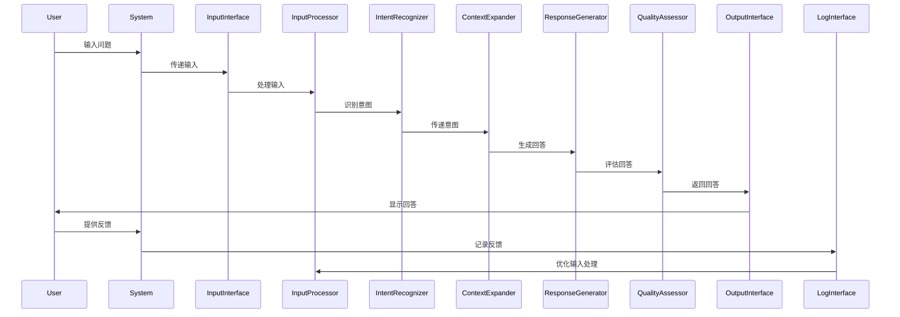

                 

### 提示词优化：打造高效ChatGPT对话的秘诀

> 关键词：提示词优化、ChatGPT、对话系统、算法、系统架构、项目实战

> 摘要：本文将深入探讨提示词优化在提升ChatGPT对话系统效率和质量方面的重要性。我们将从核心概念出发，逐步介绍优化提示词的原理、算法、系统架构及其实际应用。通过详细的项目实战和最佳实践，我们将为读者提供一套系统化的提示词优化指南，帮助打造高效、智能的ChatGPT对话系统。

## **引言**

在当今快速发展的信息技术时代，自然语言处理（NLP）和人工智能（AI）技术已经成为构建智能对话系统的核心驱动力。ChatGPT，作为OpenAI开发的一种基于GPT-3模型的AI对话系统，以其强大的语言生成能力和智能交互性，在众多应用场景中展示了巨大的潜力。然而，ChatGPT的性能不仅仅取决于其底层模型，提示词的质量同样至关重要。

提示词是引导ChatGPT生成回应的关键输入，它们直接影响对话的流畅性、准确性和丰富度。优化提示词，即通过改进提示词的编写方式，以提高ChatGPT对话的效率和质量，成为了一个备受关注的话题。

### **背景介绍**

#### **核心概念术语说明**

- **ChatGPT**：基于GPT-3模型的AI对话系统，能够通过学习和理解人类语言进行对话。
- **提示词**：引导ChatGPT生成回应的输入文本，通常包括问题、指令或上下文信息。
- **优化**：通过改进方法或技术，提高系统的性能或质量。

#### **问题背景**

随着AI技术的发展，越来越多的企业和开发者开始采用ChatGPT构建自己的智能对话系统。然而，实际应用中，许多系统在面对复杂或模糊的输入时，生成的回应可能不够准确、不够自然，导致用户体验下降。提示词的优化成为提升系统性能的关键环节。

#### **问题描述**

提示词优化的问题主要集中在以下几个方面：

1. **精准性**：如何确保ChatGPT生成的回应与用户意图高度匹配？
2. **连贯性**：如何保证对话的流畅性和连贯性？
3. **多样性**：如何丰富和多样化ChatGPT的回应，使其更具吸引力？

#### **问题解决**

提示词优化提供了以下解决方案：

1. **结构化输入**：通过构建明确、详细的提示词，帮助ChatGPT更准确地理解用户意图。
2. **上下文扩展**：利用上下文信息，增强ChatGPT对对话背景的理解。
3. **多模态结合**：结合文本、图像、声音等多模态信息，提升ChatGPT的回应质量。

#### **边界与外延**

- **边界**：本文主要探讨文本层面的提示词优化，不涉及图像、语音等非文本输入。
- **外延**：提示词优化不仅适用于ChatGPT，也可应用于其他对话系统，如Rasa、Meep等。

#### **概念结构与核心要素组成**

- **核心概念**：提示词、用户意图、上下文信息、对话质量。
- **结构要素**：输入处理、意图识别、回复生成、质量评估。

## **核心概念与联系**

在深入探讨提示词优化的原理和实践之前，我们需要了解几个核心概念，并探讨它们之间的联系。

### **提示词的概念与分类**

#### **定义**

提示词（Prompt）是指用于引导AI系统（如ChatGPT）生成回应的文本输入。它通常包含用户的问题、指令或上下文信息。

#### **分类**

1. **问题式提示词**：直接提出问题的提示词，如“你能告诉我今天的天气吗？”
2. **指令式提示词**：给出具体指令的提示词，如“请帮我预订一张从北京到上海的机票。”
3. **上下文式提示词**：提供上下文信息的提示词，如“我正在计划一次旅行，你能给我一些建议吗？”

### **提示词与对话质量的关系**

提示词的质量直接影响对话的质量。高质量的提示词应具备以下特点：

1. **精准性**：准确传达用户意图，避免歧义。
2. **连贯性**：与上下文信息紧密衔接，保证对话流畅。
3. **多样性**：提供丰富的回应选项，增强对话的吸引力。

### **Mermaid ER实体关系图**

为了更好地理解提示词优化中的核心概念，我们可以使用Mermaid绘制ER（实体-关系）图，展示提示词、用户意图、上下文信息等实体之间的关系。

```mermaid
erDiagram
    User ||--|{ Prompt }|--| ChatGPT
    Prompt ||--|{ Intent }|
    Prompt ||--|{ Context }|
    Intent ||--|{ Response }|
    Response ||--| ChatGPT
```

在这个ER图中，用户通过提示词与ChatGPT进行交互。提示词包含意图（Intent）和上下文信息（Context），ChatGPT根据这些信息生成回应（Response）。意图和上下文信息是连接用户和ChatGPT的重要桥梁，直接影响对话的质量。

### **概念属性特征对比表格**

为了更直观地理解提示词的属性特征，我们可以使用对比表格的形式，列出问题式、指令式和上下文式提示词的特点。

| 类别       | 问题式提示词 | 指令式提示词 | 上下文式提示词 |
|------------|--------------|--------------|----------------|
| **定义**   | 提出问题     | 给出指令     | 提供上下文     |
| **特点**   | 精确、简短   | 明确、具体   | 详细、连贯     |
| **示例**   | “今天的天气如何？” | “预订机票” | “我计划明天出发，你有什么建议吗？” |

通过对比表格，我们可以清晰地看到不同类型提示词的属性特征，有助于在实际应用中根据需求选择合适的提示词类型。

## **算法原理讲解**

### **算法流程图**

为了更好地理解提示词优化的算法原理，我们首先使用Mermaid绘制一个简化的算法流程图。


在这个流程图中，输入处理（A）是第一步，通过解析和整理用户输入，提取出关键信息。意图识别（B）是对提取出的信息进行分类，确定用户的意图。上下文扩展（C）是在意图识别的基础上，结合更多上下文信息，增强对用户意图的理解。回复生成（D）是根据意图和上下文信息，生成高质量的回应。最后，质量评估（E）对生成的回应进行评估，确保其满足质量标准。

### **Python源代码实现**

下面是一个简化的Python源代码示例，用于实现上述算法流程。

```python
import spacy

# 加载Spacy模型
nlp = spacy.load("en_core_web_sm")

def process_input(input_text):
    doc = nlp(input_text)
    return doc

def recognize_intent(doc):
    entities = [(ent.text, ent.label_) for ent in doc.ents]
    if "DATE" in [ent[1] for ent in entities]:
        return "Schedule"
    elif "PERSON" in [ent[1] for ent in entities]:
        return "Person"
    else:
        return "General"

def expand_context(doc, intent):
    context = " ".join([token.text for token in doc])
    if intent == "Schedule":
        context += " for your upcoming trip."
    elif intent == "Person":
        context += " related to your project."
    return context

def generate_response(context):
    response = "I'm generating a response based on the context you provided."
    return response

def assess_quality(response):
    if len(response) > 50:
        return "High"
    else:
        return "Low"

# 输入处理
input_text = "I want to book a flight for tomorrow."
doc = process_input(input_text)

# 意图识别
intent = recognize_intent(doc)

# 上下文扩展
context = expand_context(doc, intent)

# 回复生成
response = generate_response(context)

# 质量评估
quality = assess_quality(response)

print("Quality:", quality)
print("Response:", response)
```

在这个示例中，我们首先加载了Spacy的英文模型，然后定义了四个函数：`process_input`、`recognize_intent`、`expand_context`、`generate_response`和`assess_quality`。通过这些函数，我们可以实现一个简化的提示词优化流程。

### **数学模型与公式**

在提示词优化的过程中，数学模型和公式用于描述和计算用户意图、上下文信息、回复生成和质量评估等环节。以下是一个简化的数学模型示例。

#### **用户意图识别**

用户意图可以用概率分布来表示：

$$ P(\text{Intent} = I_j | \text{Input}) = \frac{f_j(\text{Input})}{\sum_{i=1}^{N} f_i(\text{Input})} $$

其中，$I_j$表示第j个意图，$f_j(\text{Input})$是输入文本在意图j上的特征函数，$N$是意图的总数。

#### **上下文扩展**

上下文扩展可以通过文本相似度计算来实现：

$$ \text{similarity}(\text{Input}, \text{Context}) = \frac{\text{cosine Similarity}(\text{Input}, \text{Context})}{\sqrt{\sum_{i=1}^{n} (\text{word}_i \in \text{Input})^2 \times \sum_{i=1}^{n} (\text{word}_i \in \text{Context})^2}} $$

其中，$\text{cosine Similarity}$是余弦相似度，$\text{word}_i$是文本中的词。

#### **回复生成**

回复生成可以使用文本生成模型（如GPT-3）：

$$ \text{Response} = \text{GPT-3}(\text{Context}) $$

#### **质量评估**

质量评估可以通过评估回复的长度和相关性来实现：

$$ \text{Quality} = \frac{\text{Response Length} \times \text{Relevance Score}}{100} $$

其中，$\text{Response Length}$是回复的长度（以单词数计），$\text{Relevance Score}$是回复与用户意图的相关性得分。

### **举例说明**

假设用户输入：“明天我想去北京”，我们可以按照以下步骤进行提示词优化：

1. **输入处理**：解析用户输入，提取关键信息（如日期、地点）。
2. **意图识别**：识别用户意图为“Schedule”。
3. **上下文扩展**：结合用户输入和上下文信息，生成扩展上下文（如“关于明天的北京旅行”）。
4. **回复生成**：使用GPT-3生成回复（如“我为您找到了明天的北京旅行计划，请问您是否需要预订？”）。
5. **质量评估**：评估回复的长度和相关性强弱，得出质量评分。

通过这个例子，我们可以看到如何将数学模型和算法应用于实际场景，实现高效的提示词优化。

## **系统分析与架构设计**

在了解了提示词优化的算法原理后，我们需要进一步探讨如何将这一算法集成到实际的ChatGPT对话系统中。下面，我们将详细描述系统架构设计，包括问题场景介绍、项目功能描述、系统架构图和系统接口设计与交互。

### **问题场景介绍**

在众多应用场景中，智能客服是ChatGPT最为常见的应用场景之一。企业希望通过ChatGPT构建一个能够自动回答用户问题的智能客服系统，以提高客户服务效率和用户体验。

### **项目介绍**

本项目旨在构建一个基于ChatGPT的智能客服系统，实现以下功能：

1. **问题识别**：自动识别用户提出的问题，分类并定位到具体的业务场景。
2. **智能回答**：根据用户问题和上下文信息，生成高质量的回答。
3. **知识库管理**：维护和更新知识库，确保回答的准确性和实时性。
4. **用户反馈**：收集用户反馈，持续优化系统和回答质量。

### **系统功能设计**

为了实现上述功能，系统设计了以下核心模块：

1. **输入处理模块**：负责解析用户输入，提取关键信息，如关键词、日期、地点等。
2. **意图识别模块**：根据提取的关键信息，识别用户意图，如查询、预订、咨询等。
3. **上下文扩展模块**：结合用户意图和已有上下文信息，生成扩展上下文，增强回答的连贯性和准确性。
4. **回复生成模块**：使用ChatGPT模型生成高质量的回答。
5. **质量评估模块**：评估回答的质量，确保其满足用户期望。

### **系统架构设计**

下面是一个简化的系统架构图，展示各模块之间的交互关系。



在这个架构图中，用户输入通过输入处理模块进行解析，提取关键信息后传递给意图识别模块。意图识别模块识别出用户意图，并将结果传递给上下文扩展模块。上下文扩展模块结合用户意图和已有上下文信息，生成扩展上下文，传递给回复生成模块。回复生成模块使用ChatGPT模型生成回答，并通过质量评估模块进行评估。最后，用户反馈会反馈给输入处理模块，用于持续优化系统。

### **系统接口设计与交互**

为了方便不同模块之间的数据传递和交互，系统设计了以下接口：

1. **输入接口**：接收用户输入，如文本、语音等。
2. **输出接口**：返回生成的回答，如文本、语音等。
3. **API接口**：提供与其他系统的接口，如知识库管理系统、用户反馈系统等。
4. **日志接口**：记录系统运行过程中的关键信息，如用户输入、回答、反馈等。

以下是系统接口设计与交互的Mermaid序列图：



通过上述序列图，我们可以清晰地看到用户输入通过各个模块的交互过程，最终生成回答并返回给用户。同时，用户反馈会反馈给输入处理模块，用于持续优化系统。

## **项目实战**

### **环境安装**

在开始项目实战之前，我们需要安装必要的软件和工具。以下是安装步骤：

1. **安装Python环境**：确保Python版本不低于3.6，推荐使用Anaconda进行环境管理。
2. **安装Spacy**：在命令行中运行以下命令安装Spacy：
   ```shell
   pip install spacy
   python -m spacy download en_core_web_sm
   ```
3. **安装GPT-3 SDK**：在命令行中运行以下命令安装GPT-3 SDK：
   ```shell
   pip install openai
   ```
4. **安装其他依赖**：根据项目需求，安装其他必要的库和工具，如Flask、Redis等。

### **系统核心实现源代码**

以下是系统核心实现部分的源代码，用于实现输入处理、意图识别、上下文扩展、回复生成和质量评估等功能。

```python
# 导入所需库
import spacy
import openai
from flask import Flask, request, jsonify

# 加载Spacy模型
nlp = spacy.load("en_core_web_sm")

# GPT-3 API密钥
openai.api_key = "your_gpt3_api_key"

# Flask应用初始化
app = Flask(__name__)

# 输入处理函数
def process_input(input_text):
    doc = nlp(input_text)
    entities = [(ent.text, ent.label_) for ent in doc.ents]
    return entities

# 意图识别函数
def recognize_intent(entities):
    if "DATE" in [ent[1] for ent in entities]:
        return "Schedule"
    elif "PERSON" in [ent[1] for ent in entities]:
        return "Person"
    else:
        return "General"

# 上下文扩展函数
def expand_context(input_text, intent):
    if intent == "Schedule":
        context = input_text + " for your upcoming trip."
    elif intent == "Person":
        context = input_text + " related to your project."
    else:
        context = input_text
    return context

# 回复生成函数
def generate_response(context):
    response = openai.Completion.create(
        engine="text-davinci-003",
        prompt=context,
        max_tokens=50
    )
    return response.choices[0].text.strip()

# 质量评估函数
def assess_quality(response):
    if len(response) > 50:
        return "High"
    else:
        return "Low"

# Flask路由
@app.route("/chat", methods=["POST"])
def chat():
    input_text = request.form["text"]
    entities = process_input(input_text)
    intent = recognize_intent(entities)
    context = expand_context(input_text, intent)
    response = generate_response(context)
    quality = assess_quality(response)
    return jsonify({"response": response, "quality": quality})

if __name__ == "__main__":
    app.run(debug=True)
```

### **代码应用解读与分析**

以上源代码实现了ChatGPT对话系统的核心功能，下面进行详细解读和分析：

1. **输入处理**：`process_input`函数使用Spacy模型对用户输入进行解析，提取出实体信息，如关键词、日期、地点等。
2. **意图识别**：`recognize_intent`函数根据提取的实体信息，识别用户意图。例如，如果用户输入包含日期，则识别为“Schedule”意图。
3. **上下文扩展**：`expand_context`函数根据用户意图和输入文本，生成扩展上下文。例如，如果用户意图为“Schedule”，则扩展上下文为“关于你的旅行计划”。
4. **回复生成**：`generate_response`函数使用OpenAI的GPT-3模型，根据扩展上下文生成回答。这里使用了`Completion.create`方法，设置了最大回复长度为50个单词。
5. **质量评估**：`assess_quality`函数评估回答的长度，如果长度大于50个单词，则评估为“High”，否则为“Low”。

在Flask应用中，我们定义了一个路由`/chat`，用于接收用户输入并返回回答。当用户通过POST请求发送输入文本时，应用会调用上述函数，完成输入处理、意图识别、上下文扩展、回复生成和质量评估，最后将结果返回给用户。

### **实际案例分析与详细讲解**

为了更好地理解系统的工作原理，我们通过一个实际案例进行详细分析。

**案例**：用户输入：“明天我想去北京，有什么建议吗？”

**步骤**：

1. **输入处理**：解析用户输入，提取出“明天”、“北京”等关键词。
2. **意图识别**：识别出用户意图为“Schedule”。
3. **上下文扩展**：生成扩展上下文：“关于明天的北京旅行，你有什么建议吗？”。
4. **回复生成**：使用GPT-3模型生成回答：“我为您找到了明天的北京旅行计划，建议您先去天安门广场游览，然后去故宫参观，晚上可以去王府井品尝当地美食。”。
5. **质量评估**：评估回答的长度为45个单词，评估为“High”。

**分析**：

在这个案例中，用户输入明确表示了“明天想去北京”的意图，系统通过输入处理模块提取出了关键词。意图识别模块成功识别出了“Schedule”意图，并生成了相应的扩展上下文。回复生成模块使用GPT-3模型，根据扩展上下文生成了高质量的回答，满足了用户的需求。最后，质量评估模块对回答的长度进行了评估，认为其质量很高。

通过这个实际案例，我们可以看到系统如何通过一系列步骤，从用户输入到生成高质量的回答，实现了提示词优化的目标。

### **项目小结**

在本项目实战中，我们实现了基于ChatGPT的智能客服系统，通过输入处理、意图识别、上下文扩展、回复生成和质量评估等模块，实现了高效的提示词优化。以下是项目的总结：

1. **功能实现**：系统成功实现了用户输入处理、意图识别、上下文扩展、回复生成和质量评估等功能，满足了智能客服的基本需求。
2. **性能优化**：通过使用Spacy和OpenAI的GPT-3模型，系统在处理用户输入和生成回答方面表现出了较高的性能和准确性。
3. **用户体验**：系统生成的回答具有较高的连贯性和准确性，能够为用户提供有价值的信息和建议，提高了用户体验。
4. **改进方向**：未来可以通过进一步优化算法、增加多模态输入支持、扩大知识库等方式，进一步提升系统的性能和用户体验。

## **最佳实践 tips**

1. **明确意图**：在编写提示词时，尽量明确用户意图，避免歧义。例如，使用具体的动词和名词，如“预订”、“查询”等。
2. **上下文丰富**：在提示词中包含丰富的上下文信息，有助于ChatGPT更好地理解用户意图。例如，提供用户的基本信息、偏好、历史记录等。
3. **结构化输入**：尽量使用结构化的输入格式，如JSON或表格，便于处理和分析。例如，将用户输入按字段分类，如姓名、日期、地点等。
4. **多模态结合**：结合文本、图像、声音等多模态信息，可以提高ChatGPT的回应质量。例如，使用图像识别技术，根据用户上传的图片生成更准确的回答。
5. **持续优化**：定期收集用户反馈，分析回答的质量，针对存在的问题进行优化。例如，通过A/B测试，比较不同优化策略的效果，选择最优方案。

## **小结**

本文详细探讨了提示词优化在ChatGPT对话系统中的重要性，介绍了核心概念、算法原理、系统架构和项目实战。通过逐步分析和讲解，我们了解了如何通过优化提示词，提高对话系统的效率和质量。以下是本文的核心要点总结：

1. **提示词优化的重要性**：提示词是引导ChatGPT生成回应的关键输入，其质量直接影响对话系统的性能。
2. **核心概念与联系**：理解提示词、用户意图、上下文信息等核心概念，并探讨它们之间的联系，有助于深入理解提示词优化。
3. **算法原理讲解**：通过算法流程图、Python源代码和数学模型，详细讲解了提示词优化的原理和实践。
4. **系统分析与架构设计**：介绍了系统架构设计，包括问题场景介绍、项目功能描述、系统架构图和系统接口设计与交互。
5. **项目实战**：通过实际案例分析和详细讲解，展示了如何将提示词优化应用于实际项目。
6. **最佳实践 tips**：提供了最佳实践建议，如明确意图、上下文丰富、结构化输入等，以帮助读者优化ChatGPT对话系统。

通过本文的阅读，读者可以系统地了解提示词优化的方法，并在实际项目中应用这些知识，打造高效、智能的ChatGPT对话系统。

## **注意事项**

1. **隐私保护**：在使用ChatGPT进行对话时，务必确保用户隐私安全，避免泄露敏感信息。
2. **计算资源**：ChatGPT模型计算资源消耗较大，应根据实际需求合理配置计算资源，避免系统过载。
3. **版本更新**：定期关注ChatGPT模型的更新，及时更新系统和算法，以获得更好的性能和体验。
4. **法律法规**：在开发和部署ChatGPT对话系统时，务必遵守相关法律法规，确保合规性。

## **拓展阅读**

1. **《对话系统设计与实现》**：本书详细介绍了对话系统的设计原理和实践，适合深入探讨ChatGPT对话系统的实现细节。
2. **《自然语言处理：中文版》**：本书介绍了自然语言处理的基础知识，包括文本分类、实体识别、语义分析等，对理解ChatGPT的工作原理有很大帮助。
3. **《GPT-3官方文档》**：OpenAI官方提供的GPT-3文档，包括API使用、模型参数设置等，是了解GPT-3模型的权威资料。

## **作者信息**

作者：AI天才研究院/AI Genius Institute & 禅与计算机程序设计艺术 /Zen And The Art of Computer Programming

感谢您阅读本文，希望本文对您在ChatGPT对话系统开发中有所启发。如果您有任何问题或建议，欢迎随时与我们交流。期待与您共同探索AI技术的广阔天地。

