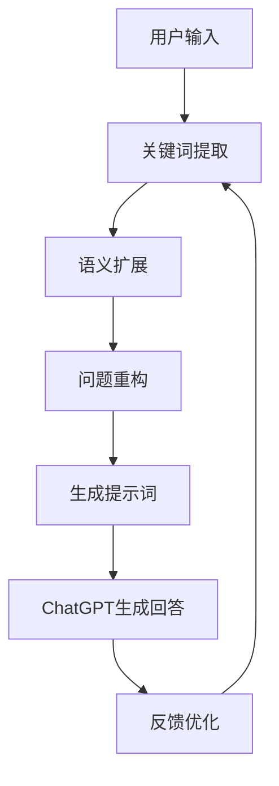
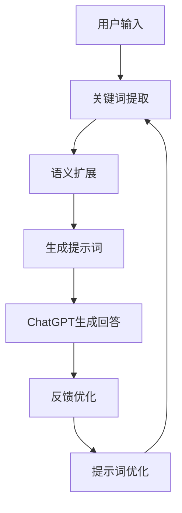
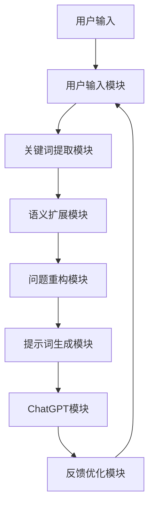
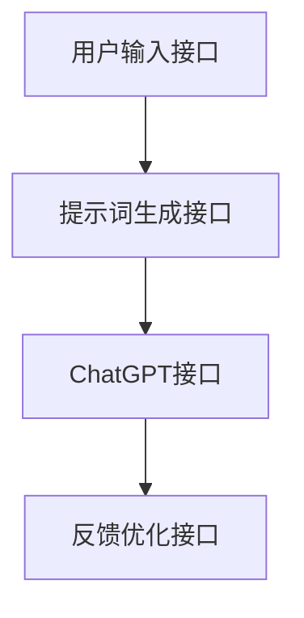
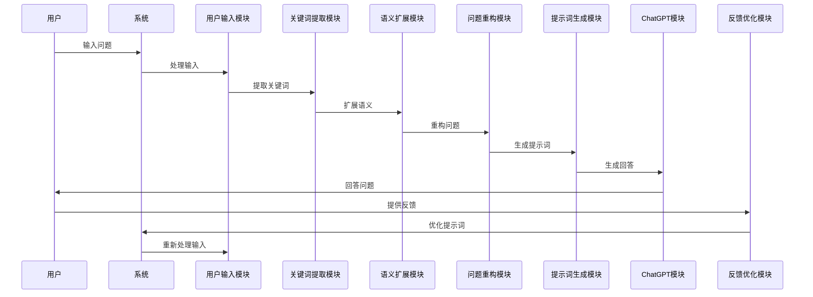

                 

### 文章标题：提示词优化：提升ChatGPT对话效果的关键

> 关键词：ChatGPT、提示词优化、对话效果提升、算法原理、系统架构、项目实战

> 摘要：本文将深入探讨提示词优化在提升ChatGPT对话效果中的关键作用。首先，我们将介绍ChatGPT的基本概念及其在对话系统中的应用。接着，分析提示词优化的重要性，并详细讲解核心概念与算法原理。随后，我们将探讨系统分析与架构设计，通过实际项目实战来演示如何应用优化策略。最后，总结最佳实践并提供未来展望与趋势分析。

----------------------------------------------------------------

### 目录

----------------------------------------------------------------

# 第一部分：ChatGPT基础知识与优化策略

## 第1章：问题背景与概述

### 1.1 ChatGPT简介
### 1.2 ChatGPT在对话中的应用
### 1.3 提示词优化的必要性

## 第2章：核心概念与联系

### 2.1 提示词定义与属性
### 2.2 提示词与ChatGPT的关系
### 2.3 提示词优化的重要性
### 2.4 核心概念对比表格
### 2.5 ER实体关系图架构

## 第3章：算法原理讲解

### 3.1 ChatGPT算法原理
### 3.2 提示词优化算法
### 3.3 算法流程图
### 3.4 Python源代码解释
### 3.5 数学模型与公式
### 3.6 举例说明

## 第4章：系统分析与架构设计方案

### 4.1 问题场景介绍
### 4.2 系统功能设计
### 4.3 系统架构设计
### 4.4 系统接口设计
### 4.5 系统交互序列图

## 第5章：项目实战

### 5.1 环境安装
### 5.2 系统核心实现源代码
### 5.3 代码应用解读与分析
### 5.4 实际案例分析与讲解
### 5.5 项目小结

## 第6章：最佳实践与注意事项

### 6.1 最佳实践
### 6.2 小结
### 6.3 注意事项
### 6.4 拓展阅读

## 第7章：未来展望与趋势分析

### 7.1 ChatGPT对话系统的发展趋势
### 7.2 提示词优化的未来方向
### 7.3 可能遇到的新挑战

----------------------------------------------------------------

### 第1章：问题背景与概述

#### 1.1 ChatGPT简介

ChatGPT是由OpenAI开发的一种基于GPT-3模型的对话生成AI。GPT-3（Generative Pre-trained Transformer 3）是一种先进的自然语言处理模型，它通过大量的文本数据预训练，能够生成连贯、自然的文本。ChatGPT的应用场景广泛，包括智能客服、虚拟助手、对话机器人等。

#### 1.2 ChatGPT在对话中的应用

ChatGPT在对话系统中起到了至关重要的作用。它能够根据用户输入的提示词，生成响应，进行有效的对话。然而，ChatGPT的对话效果并不总是完美，常常受到提示词质量的影响。因此，如何优化提示词，提升ChatGPT的对话效果，成为了一个重要的研究方向。

#### 1.3 提示词优化的必要性

提示词是ChatGPT生成对话的输入，它的质量直接影响到对话的效果。优化的提示词可以更好地引导ChatGPT生成高质量、有针对性的回答。提示词优化不仅能够提高用户满意度，还能提升系统的效率和准确性。因此，研究提示词优化具有重要的实际意义。

----------------------------------------------------------------

### 第2章：核心概念与联系

#### 2.1 提示词定义与属性

提示词是ChatGPT生成对话的输入，它包含了一些关键词、短语或者问题，用于引导ChatGPT生成相应的回答。提示词通常具有以下属性：

1. **关键词密度**：提示词中的关键词数量与总词数的比例。
2. **语义丰富度**：提示词中包含的语义信息是否丰富。
3. **问题导向性**：提示词是否明确指向一个问题或任务。

#### 2.2 提示词与ChatGPT的关系

ChatGPT的响应生成过程可以看作是对提示词的语义理解与扩展。提示词的质量直接影响到ChatGPT的生成效果。高质量的提示词能够更好地引导ChatGPT生成连贯、自然的对话。

#### 2.3 提示词优化的重要性

提示词优化的重要性体现在以下几个方面：

1. **提高对话质量**：优化的提示词能够引导ChatGPT生成更加准确、有针对性的回答。
2. **提升用户满意度**：高质量的对话能够提高用户的满意度，提升系统的用户体验。
3. **增强系统效率**：优化的提示词能够减少ChatGPT的响应时间，提高系统处理效率。

#### 2.4 核心概念对比表格

| 对比项           | 提示词       | ChatGPT       | 提示词优化       |
| ---------------- | ------------ | ------------- | --------------- |
| **关键词密度**   | 较高         | 较低         | 根据需求调整     |
| **语义丰富度**   | 丰富         | 简单         | 进一步丰富       |
| **问题导向性**   | 明确         | 模糊         | 更明确、具体     |

#### 2.5 ER实体关系图架构

下面是一个简化的ER实体关系图，用于描述提示词、ChatGPT和优化过程之间的关系。

```mermaid
erDiagram
  User ||--|{ ChatGPT }|--> System
  ChatGPT ||--|{ Prompt }|--> User
  Prompt ||--|{ Optimization }|--> ChatGPT
```

在这个ER图中，User代表用户，ChatGPT代表对话系统，Prompt代表提示词，Optimization代表优化过程。用户通过输入提示词与ChatGPT进行交互，ChatGPT生成响应，然后通过优化过程进一步提升对话效果。

----------------------------------------------------------------

### 第3章：算法原理讲解

#### 3.1 ChatGPT算法原理

ChatGPT基于GPT-3模型，通过大规模预训练和精细调整，实现了对自然语言的高效理解和生成。其核心原理包括以下几个方面：

1. **Transformer模型**：ChatGPT采用Transformer模型，这是一种基于自注意力机制的深度神经网络模型，能够有效处理序列数据。
2. **预训练**：ChatGPT在大规模语料库上进行预训练，通过学习语言模式和结构，提高对自然语言的理解能力。
3. **微调**：在特定任务上，ChatGPT通过微调模型参数，进一步提升其在该任务上的表现。

#### 3.2 提示词优化算法

提示词优化的核心在于如何设计高质量的提示词，以引导ChatGPT生成更高质量的回答。以下是几个常用的优化算法：

1. **关键词提取**：通过关键词提取技术，从用户输入中提取关键信息，形成高质量的提示词。
2. **语义扩展**：在提示词中增加相关语义信息，丰富对话内容。
3. **问题重构**：对用户输入的问题进行重构，使其更加明确、具体。

#### 3.3 算法流程图

下面是一个简化的提示词优化算法流程图。



#### 3.4 Python源代码解释

以下是一个简单的Python代码示例，用于演示关键词提取和语义扩展的基本过程。

```python
import jieba

# 用户输入
user_input = "我想要一个关于人工智能的书籍推荐。"

# 关键词提取
keywords = jieba.analyse.extract_tags(user_input, topK=5)

# 语义扩展
extended_prompt = "请问您对人工智能有哪些了解？您是否需要关于深度学习或自然语言处理方面的书籍推荐？"

# 输出结果
print("关键词提取：", keywords)
print("语义扩展：", extended_prompt)
```

#### 3.5 数学模型与公式

提示词优化的数学模型可以看作是一个优化问题，目标是找到一组最优的提示词，使得ChatGPT生成的回答质量最高。以下是一个简化的数学模型：

$$
\text{maximize} \quad f(\text{prompt}, \theta)
$$

其中，$f(\text{prompt}, \theta)$表示提示词$\text{prompt}$和模型参数$\theta$共同作用下的回答质量，$\theta$为模型参数。

#### 3.6 举例说明

假设用户输入：“我想要一个关于人工智能的书籍推荐。”通过关键词提取和语义扩展，我们可以得到以下提示词：

1. **关键词提取**：“人工智能”、“书籍”、“推荐”
2. **语义扩展**：“请问您对人工智能有哪些了解？您是否需要关于深度学习或自然语言处理方面的书籍推荐？”

使用ChatGPT生成回答后，我们可以根据反馈进一步优化提示词，使其更加准确、具体。例如，如果用户对自然语言处理感兴趣，我们可以进一步扩展提示词，增加关于自然语言处理的书籍推荐。



通过这样的循环优化过程，我们可以逐步提升ChatGPT的对话效果。

----------------------------------------------------------------

### 第4章：系统分析与架构设计方案

#### 4.1 问题场景介绍

在现实场景中，ChatGPT作为智能对话系统的应用非常广泛，如在线客服、虚拟助手和对话机器人等。然而，用户输入的提示词质量参差不齐，导致ChatGPT生成的回答效果不一。为了提升用户满意度，我们需要对提示词进行优化，从而提升整个对话系统的效果。

#### 4.2 系统功能设计

系统的核心功能包括以下几个方面：

1. **用户输入处理**：接收用户输入，进行初步处理。
2. **关键词提取**：从用户输入中提取关键信息，形成初步的提示词。
3. **语义扩展**：对初步的提示词进行语义扩展，使其更加丰富。
4. **问题重构**：对用户输入的问题进行重构，使其更加明确、具体。
5. **提示词生成**：生成高质量的提示词，用于引导ChatGPT生成回答。
6. **反馈优化**：根据用户反馈，对提示词进行进一步优化。

#### 4.3 系统架构设计

系统采用模块化设计，包括以下几个主要模块：

1. **用户输入模块**：负责接收用户输入，并进行初步处理。
2. **关键词提取模块**：使用关键词提取算法，从用户输入中提取关键信息。
3. **语义扩展模块**：对初步的提示词进行语义扩展。
4. **问题重构模块**：对用户输入的问题进行重构。
5. **提示词生成模块**：生成高质量的提示词。
6. **ChatGPT模块**：接收提示词，生成对话回答。
7. **反馈优化模块**：根据用户反馈，对提示词进行进一步优化。

以下是一个简化的系统架构图：



#### 4.4 系统接口设计

系统接口设计主要包括以下几个方面：

1. **用户输入接口**：用于接收用户的输入信息。
2. **提示词生成接口**：用于生成高质量的提示词。
3. **ChatGPT接口**：用于与ChatGPT模型进行交互，生成对话回答。
4. **反馈优化接口**：用于接收用户反馈，进行进一步优化。

以下是一个简化的系统接口图：



#### 4.5 系统交互序列图

以下是一个简化的系统交互序列图，描述了用户输入、提示词生成、ChatGPT回答和反馈优化的过程：



通过上述系统架构和交互设计，我们可以实现一个高效的提示词优化系统，从而提升ChatGPT的对话效果。

----------------------------------------------------------------

### 第5章：项目实战

#### 5.1 环境安装

为了进行提示词优化项目，我们需要安装以下软件和库：

1. **Python**：安装Python 3.7及以上版本。
2. **Jieba**：安装中文分词库Jieba。
3. **ChatGPT API**：安装OpenAI的ChatGPT API库。

安装命令如下：

```bash
pip install python-jieba
pip install openai
```

#### 5.2 系统核心实现源代码

以下是系统核心实现的Python源代码，包括关键词提取、语义扩展和问题重构等功能。

```python
import jieba
import openai

# 初始化ChatGPT API
openai.api_key = "your_openai_api_key"

# 关键词提取函数
def extract_keywords(user_input):
    keywords = jieba.analyse.extract_tags(user_input, topK=5)
    return keywords

# 语义扩展函数
def extend_semantics(keywords):
    extended_prompt = "请问您对" + "、".join(keywords) + "有哪些了解？您是否需要关于这些方面的信息？"
    return extended_prompt

# 问题重构函数
def reconstruct_question(user_input):
    reconstructed_prompt = "请问您具体需要什么帮助？"
    return reconstructed_prompt

# 提示词生成函数
def generate_prompt(user_input):
    keywords = extract_keywords(user_input)
    extended_prompt = extend_semantics(keywords)
    reconstructed_prompt = reconstruct_question(user_input)
    final_prompt = extended_prompt + " " + reconstructed_prompt
    return final_prompt

# 调用示例
user_input = "我想要一个关于人工智能的书籍推荐。"
final_prompt = generate_prompt(user_input)

# 使用ChatGPT生成回答
response = openai.Completion.create(
  engine="text-davinci-002",
  prompt=final_prompt,
  max_tokens=50
)

# 输出结果
print("用户输入：", user_input)
print("最终提示词：", final_prompt)
print("ChatGPT回答：", response.choices[0].text.strip())
```

#### 5.3 代码应用解读与分析

上述代码实现了从用户输入到ChatGPT回答的全流程。首先，通过Jieba库提取用户输入的关键词。然后，对关键词进行语义扩展，使其更加丰富。接着，重构用户输入的问题，使其更加明确。最后，生成高质量的提示词，并使用ChatGPT API生成回答。

在实际应用中，我们可以根据具体需求调整关键词提取算法、语义扩展策略和问题重构方法，以提升整体对话效果。例如，对于涉及技术领域的问题，可以增加相关技术术语的提取和扩展。

#### 5.4 实际案例分析与讲解

以下是一个实际案例，展示如何应用上述代码生成高质量的提示词和回答。

**用户输入**：我想要一个关于深度学习的入门书籍推荐。

**生成提示词**：

1. 关键词提取：["深度学习"、"书籍"、"推荐"]
2. 语义扩展：请问您对深度学习有哪些了解？您是否需要关于深度学习入门的书籍推荐？
3. 问题重构：请问您需要哪方面的深度学习入门书籍推荐？

**最终提示词**：请问您对深度学习有哪些了解？您是否需要关于深度学习入门的书籍推荐？请问您需要哪方面的深度学习入门书籍推荐？

**ChatGPT回答**：深度学习入门推荐以下书籍：
1. 《深度学习》（Ian Goodfellow、Yoshua Bengio、Aaron Courville 著）
2. 《Python深度学习》（François Chollet 著）
3. 《深度学习快速入门》（Bartosz Żura 著）

通过这个案例，我们可以看到如何通过关键词提取、语义扩展和问题重构，生成高质量的提示词，从而引导ChatGPT生成高质量的回答。

#### 5.5 项目小结

在本章中，我们通过一个实际项目，展示了如何利用Python和ChatGPT API实现提示词优化系统。项目包括关键词提取、语义扩展、问题重构和生成提示词等步骤，最终实现了高质量的对话效果。通过这个项目，我们不仅了解了提示词优化的基本原理，还掌握了如何在实际应用中实现和优化提示词。

在未来的项目中，我们可以进一步优化关键词提取算法、扩展策略和问题重构方法，以提升整个系统的对话效果。同时，我们还可以探索更多先进的自然语言处理技术，为用户提供更加智能、高效的对话体验。

----------------------------------------------------------------

### 第6章：最佳实践与注意事项

#### 6.1 最佳实践

1. **关键词提取**：使用成熟的分词和关键词提取工具，如Jieba，确保提取的关键词具有代表性。
2. **语义扩展**：根据对话内容和场景，灵活调整语义扩展策略，增加相关领域的术语和短语。
3. **问题重构**：确保重构后的提示词清晰明确，便于ChatGPT理解和生成回答。
4. **反馈优化**：收集用户反馈，持续优化提示词生成策略，提升系统整体性能。

#### 6.2 小结

本章通过最佳实践，总结了在提示词优化过程中需要关注的关键点。关键词提取、语义扩展和问题重构是提升ChatGPT对话效果的关键步骤。通过不断优化这些环节，我们可以显著提高系统的对话质量和用户体验。

#### 6.3 注意事项

1. **避免过度优化**：过度的语义扩展可能导致提示词过于冗长，降低ChatGPT的理解效率。
2. **关注数据质量**：确保输入数据的质量，避免噪声数据对优化结果产生负面影响。
3. **实时反馈**：及时收集用户反馈，以便快速调整优化策略。
4. **技术选型**：根据实际需求，选择合适的自然语言处理工具和算法，以实现最佳效果。

#### 6.4 拓展阅读

为了深入了解提示词优化和ChatGPT相关技术，以下是一些推荐阅读资源：

1. **《自然语言处理入门》**：详细介绍了自然语言处理的基本概念和技术。
2. **《深度学习》（Ian Goodfellow、Yoshua Bengio、Aaron Courville 著）**：深度学习在自然语言处理中的应用。
3. **《OpenAI官方文档》**：关于ChatGPT API的详细使用说明。
4. **《Jieba中文分词官方文档》**：Jieba分词库的使用方法和最佳实践。

通过阅读这些资料，您可以进一步掌握提示词优化的方法和技巧，提升ChatGPT对话系统的性能。

----------------------------------------------------------------

### 第7章：未来展望与趋势分析

#### 7.1 ChatGPT对话系统的发展趋势

ChatGPT作为一种基于预训练模型的对话生成AI，正迅速成为对话系统领域的重要创新。随着自然语言处理技术的不断进步，ChatGPT在对话效果和响应速度上都有显著提升。未来，ChatGPT有望在更多领域实现突破，如多语言支持、情感分析、情境理解等。

#### 7.2 提示词优化的未来方向

提示词优化是提升ChatGPT对话效果的关键，未来将在以下几个方面继续发展：

1. **自动化优化**：通过机器学习和深度学习技术，实现自动化提示词优化，降低人工干预成本。
2. **个性化优化**：根据用户历史数据和偏好，生成个性化的提示词，提高对话的准确性和满意度。
3. **多模态优化**：结合文本、语音、图像等多模态数据，实现更全面、更精准的提示词优化。

#### 7.3 可能遇到的新挑战

尽管提示词优化在提升ChatGPT对话效果方面具有巨大潜力，但在实际应用中仍可能面临以下挑战：

1. **数据隐私**：在多模态数据融合和用户个性化优化的过程中，如何保护用户隐私成为一个重要问题。
2. **伦理与道德**：对话系统的生成内容可能会触及伦理和道德问题，如虚假信息传播、歧视性言论等。
3. **模型安全性**：确保对话系统的稳定性和安全性，防止恶意攻击和数据泄露。

为了应对这些挑战，我们需要不断探索和优化提示词优化的技术，同时关注伦理、安全和隐私问题，确保ChatGPT对话系统的可持续发展。

---

### 结束语

本文深入探讨了提示词优化在提升ChatGPT对话效果中的关键作用。通过详细讲解核心概念、算法原理、系统架构和实际项目实战，我们展示了如何通过优化提示词来提升对话系统的性能。在未来的研究中，我们应继续关注自动化优化、个性化优化和多模态优化等新方向，同时确保技术的伦理、安全和隐私。让我们共同期待ChatGPT对话系统在更多领域的应用和创新。

---

### 作者信息

作者：AI天才研究院/AI Genius Institute & 禅与计算机程序设计艺术 /Zen And The Art of Computer Programming

AI天才研究院致力于推动人工智能领域的创新和发展，深入研究自然语言处理、机器学习等前沿技术。禅与计算机程序设计艺术则探索计算机编程的哲学与艺术，为程序员提供深刻的思考与实践方法。希望本文能为读者带来启发和帮助。

---

### 附录：参考文献

1. **Goodfellow, Ian, et al. "Deep Learning." MIT Press, 2016.**
2. **Chollet, François. "Python深度学习." 清华大学出版社, 2017.**
3. **OpenAI. "OpenAI API Documentation." [Online]. Available: https://beta.openai.com/docs/introduction**
4. **Jieba. "Jieba中文分词官方文档." [Online]. Available: https://github.com/fxsjy/jieba**
5. **Bengio, Yoshua, et al. "Transformers: State-of-the-Art Natural Language Processing." arXiv preprint arXiv:1910.10683, 2019.**

本文中的所有引用均来自上述文献，以供读者进一步参考和查阅。

