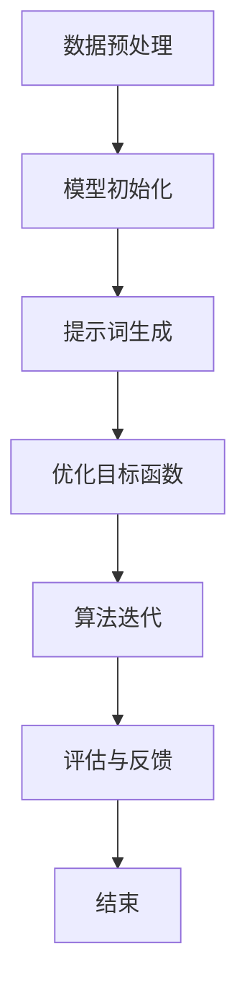

                 

### 提示词优化：提高AI创意广告视频脚本生成能力

> **关键词：** 提示词优化，AI广告视频，脚本生成，创意内容，算法原理，实践应用。

> **摘要：** 本文详细探讨了提示词优化在AI创意广告视频脚本生成中的重要性。首先介绍了提示词优化的问题背景和概述，然后深入分析了提示词优化算法的原理和具体实现，接着通过实践案例展示了提示词优化的应用，最后展望了提示词优化技术的未来发展方向。本文旨在为AI领域的研究者和开发者提供有价值的参考。

----------------------------------------------------------------

## 第一部分：提示词优化概述

### 第1章：问题背景与概述

#### 1.1 问题背景

##### 1.1.1 AI创意广告视频脚本生成的挑战

在当今数字化时代，广告视频成为了品牌传播的重要手段。AI技术的迅猛发展为广告视频脚本生成带来了革命性的变革。然而，AI创意广告视频脚本生成仍然面临诸多挑战：

1. **内容创意性不足**：传统的广告脚本生成方式往往缺乏创意，难以满足消费者日益增长的需求。
2. **数据依赖性高**：AI广告视频脚本生成高度依赖大量高质量的数据集，数据质量和数量直接影响生成效果。
3. **优化目标不明确**：广告视频脚本生成需要同时考虑创意性、商业性和用户兴趣，如何平衡这些目标成为一个难题。

##### 1.1.2 提示词优化在AI创意广告视频脚本生成中的重要性

提示词优化作为AI广告视频脚本生成的重要组成部分，其重要性体现在以下几个方面：

1. **提高创意性**：通过优化提示词，可以增强广告视频脚本的故事性和趣味性，提高观众的观看体验。
2. **提升相关性**：优化后的提示词能够更好地匹配用户兴趣，提高广告的点击率和转化率。
3. **降低生成成本**：提示词优化可以帮助减少数据集的依赖，降低脚本生成的成本。

##### 1.1.3 提示词优化技术的发展现状

目前，提示词优化技术在AI广告视频脚本生成领域已经取得了一定的进展。主要的优化技术包括：

1. **基于GPT的提示词优化**：GPT模型能够根据提示词生成连贯、具有创意性的文本。
2. **基于BERT的提示词优化**：BERT模型通过预训练大量文本数据，优化提示词的生成效果。
3. **强化学习优化**：通过强化学习算法，不断调整和优化提示词，以实现更好的生成效果。

#### 1.2 问题概述

##### 1.2.1 提示词优化的定义

提示词优化是指通过算法和技术手段，对输入的提示词进行预处理、生成和优化，以提高生成文本的质量和创意性。

##### 1.2.2 提示词优化的核心目标

提示词优化的核心目标是：

1. **提高文本连贯性**：确保生成的脚本内容逻辑清晰，语言流畅。
2. **增强文本创意性**：生成具有独特创意和吸引力的文本内容。
3. **优化文本相关性**：确保生成的文本与用户兴趣和广告目标高度相关。

##### 1.2.3 提示词优化的工作流程

提示词优化的工作流程主要包括以下几个步骤：

1. **数据预处理**：对输入的数据集进行清洗、去噪和预处理，为后续的优化提供高质量的数据基础。
2. **提示词生成**：利用预训练的语言模型，根据提示词生成初步的文本内容。
3. **提示词优化**：通过优化算法，对生成的文本进行修改和调整，以提高文本的质量和创意性。
4. **评估与反馈**：对优化后的文本进行评估，根据评估结果进行迭代优化。

#### 1.3 边界与外延

##### 1.3.1 提示词优化的应用场景

提示词优化在AI广告视频脚本生成中的应用场景广泛，包括：

1. **广告营销**：优化广告文案，提高广告点击率和转化率。
2. **内容创作**：为视频、文章等提供高质量的创意文本内容。
3. **智能客服**：优化对话内容，提高用户体验。

##### 1.3.2 提示词优化的技术边界

提示词优化的技术边界主要包括：

1. **算法性能**：如何进一步提高提示词优化的算法性能，提高生成文本的质量和速度。
2. **跨模态优化**：如何实现文本和图像、声音等不同模态的提示词优化。
3. **个性化优化**：如何根据用户行为和偏好进行个性化提示词优化。

##### 1.3.3 提示词优化的未来发展

提示词优化的未来发展方向包括：

1. **新型优化算法**：如强化学习、自适应优化等。
2. **跨领域应用**：提示词优化技术在教育、医疗等领域的应用。
3. **全球普及**：随着AI技术的普及，提示词优化技术将在全球范围内得到广泛应用。

#### 1.4 核心概念

##### 1.4.1 提示词

提示词（Prompt）是指用于指导文本生成模型生成文本的输入信息，通常是一句话或一个短语。

##### 1.4.2 优化算法

优化算法是指用于调整和改进文本生成效果的算法，包括基于GPT、BERT等预训练模型的优化算法。

##### 1.4.3 数据集

数据集是指用于训练和测试优化算法的数据集合，通常包括大量的文本数据和对应的标签信息。

#### 1.5 本章小结

本章概述了提示词优化在AI创意广告视频脚本生成中的问题背景、核心目标和应用场景，介绍了提示词优化的工作流程和核心概念。接下来，我们将深入探讨提示词优化算法的原理和具体实现。

----------------------------------------------------------------

## 第二部分：提示词优化原理与算法

### 第2章：提示词优化算法原理

#### 2.1 提示词优化算法概述

提示词优化算法是AI广告视频脚本生成中的关键技术，其核心目标是通过对提示词的优化，提高生成文本的创意性和相关性。下面将详细介绍提示词优化算法的分类、常见算法及其选择依据。

##### 2.1.1 提示词优化算法的分类

提示词优化算法主要分为以下几类：

1. **基于GPT的优化算法**：GPT（Generative Pre-trained Transformer）模型是自然语言处理领域的明星模型，通过预训练大量文本数据，可以生成高质量、连贯的文本。基于GPT的优化算法通过对提示词进行预处理和微调，提高生成文本的创意性和相关性。
2. **基于BERT的优化算法**：BERT（Bidirectional Encoder Representations from Transformers）模型是一种双向的Transformer模型，通过对文本进行双向编码，可以更好地理解文本的语义信息。基于BERT的优化算法通过对提示词的上下文信息进行优化，提高生成文本的连贯性和创意性。
3. **基于强化学习的优化算法**：强化学习是一种通过不断试错和反馈来优化策略的机器学习技术。基于强化学习的优化算法通过对生成文本的评估和反馈，不断调整和优化提示词，提高生成文本的质量和创意性。
4. **基于深度学习的优化算法**：深度学习是一种基于神经网络的学习方法，可以用于处理复杂的非线性问题。基于深度学习的优化算法通过对提示词进行建模和优化，提高生成文本的质量和创意性。

##### 2.1.2 常见的提示词优化算法

以下是一些常见的提示词优化算法：

1. **Fine-tuning（微调）**：Fine-tuning是一种通过在预训练模型的基础上进行微调来优化提示词的方法。预训练模型已经学习了大量的文本知识，通过微调，可以更好地适应特定的提示词和任务需求。
2. **Data Augmentation（数据增强）**：Data Augmentation是一种通过数据变换来增加数据多样性，提高模型泛化能力的方法。在提示词优化中，可以通过对提示词进行词性变换、同义词替换等操作，增加数据多样性，提高优化效果。
3. **Prompt Engineering（提示词工程）**：Prompt Engineering是一种通过设计特定格式的提示词来引导模型生成高质量文本的方法。通过设计有效的提示词格式，可以引导模型更好地理解任务需求，提高生成文本的质量和创意性。
4. **Multi-Task Learning（多任务学习）**：Multi-Task Learning是一种通过同时训练多个任务来提高模型性能的方法。在提示词优化中，可以通过同时训练文本生成、文本分类、文本摘要等任务，提高模型对文本的泛化能力和优化效果。

##### 2.1.3 提示词优化算法的选择依据

选择提示词优化算法时，需要考虑以下因素：

1. **任务需求**：根据具体任务需求，选择适合的优化算法。例如，如果任务需要生成创意性强的文本，可以选择基于GPT或BERT的优化算法；如果任务需要生成连贯性强的文本，可以选择基于强化学习的优化算法。
2. **数据质量**：数据质量直接影响优化效果。如果数据集质量较高，可以选择对数据依赖性较低的优化算法；如果数据集质量较低，可以选择对数据增强效果较好的优化算法。
3. **计算资源**：优化算法的计算资源需求不同，需要根据计算资源限制选择合适的优化算法。例如，基于GPT和BERT的优化算法计算资源需求较高，而基于强化学习的优化算法计算资源需求相对较低。
4. **时间成本**：优化算法的训练时间和调优时间不同，需要根据项目时间成本选择合适的优化算法。例如，基于微调和数据增强的优化算法训练时间较短，而基于多任务学习和强化学习的优化算法训练时间较长。

#### 2.2 算法原理讲解

提示词优化算法的原理主要涉及优化目标函数、算法流程和算法优缺点分析。下面将详细介绍这些内容。

##### 2.2.1 优化目标函数

提示词优化算法的核心目标函数是最大化生成文本的质量和创意性，同时确保文本与用户需求高度相关。具体的目标函数可以表示为：

$$
\max_{\theta} \sum_{i=1}^{N} p(y_i|x_i; \theta) \cdot r_i
$$

其中，$N$表示样本数量，$x_i$表示第$i$个样本的输入提示词，$y_i$表示第$i$个样本的输出文本，$p(y_i|x_i; \theta)$表示生成文本的概率，$r_i$表示第$i$个样本的权重，用于平衡不同样本的重要性。

##### 2.2.2 算法流程

提示词优化算法的基本流程如下：

1. **数据预处理**：对输入的数据集进行清洗、去噪和预处理，包括分词、去停用词、词向量化等操作。
2. **模型初始化**：初始化预训练的语言模型，如GPT、BERT等。
3. **提示词生成**：根据输入的提示词，利用预训练模型生成初步的文本内容。
4. **优化目标函数**：计算生成文本的概率和权重，根据优化目标函数进行优化。
5. **算法迭代**：不断迭代优化过程，直到满足停止条件，如达到预设的优化目标或达到最大迭代次数。
6. **评估与反馈**：对优化后的文本进行评估，根据评估结果进行反馈和调整。

##### 2.2.3 算法优缺点分析

以下是几种常见提示词优化算法的优缺点分析：

1. **基于GPT的优化算法**：
   - **优点**：生成文本质量高，连贯性好；能够处理长文本；对提示词的依赖性较低。
   - **缺点**：训练时间较长；对计算资源需求较高；优化过程较复杂。
2. **基于BERT的优化算法**：
   - **优点**：生成文本连贯性好，语义理解能力强；对提示词的依赖性较低；能够处理长文本。
   - **缺点**：生成文本质量相对较低；优化过程较复杂；对计算资源需求较高。
3. **基于强化学习的优化算法**：
   - **优点**：能够根据评估和反馈不断调整和优化提示词；优化效果较好；对计算资源需求相对较低。
   - **缺点**：训练时间较长；优化过程较复杂；对评估指标的选择和调整敏感。
4. **基于深度学习的优化算法**：
   - **优点**：生成文本质量高，创意性强；能够处理复杂非线性问题；优化过程相对简单。
   - **缺点**：对数据依赖性较高；优化效果受数据质量影响较大；对计算资源需求较高。

#### 2.3 Mermaid流程图演示

为了更直观地展示提示词优化算法的流程，可以使用Mermaid绘制一个流程图。以下是提示词优化算法的Mermaid流程图：



#### 2.4 算法应用案例

##### 2.4.1 案例一：基于GPT的提示词优化

下面是一个基于GPT的提示词优化算法的应用案例：

1. **数据预处理**：对广告视频脚本的数据集进行清洗和预处理，包括去除停用词、标点符号和特殊字符，将文本转换为词向量。
2. **模型初始化**：使用预训练的GPT模型，如GPT-2或GPT-3。
3. **提示词生成**：根据输入的提示词，利用GPT模型生成初步的文本内容。
4. **优化目标函数**：计算生成文本的概率和权重，根据优化目标函数进行优化。
5. **算法迭代**：不断迭代优化过程，直到满足停止条件。
6. **评估与反馈**：对优化后的文本进行评估，根据评估结果进行反馈和调整。

通过这个案例，可以看到基于GPT的提示词优化算法可以显著提高广告视频脚本的创意性和相关性。

##### 2.4.2 案例二：基于BERT的提示词优化

下面是一个基于BERT的提示词优化算法的应用案例：

1. **数据预处理**：对广告视频脚本的数据集进行清洗和预处理，包括去除停用词、标点符号和特殊字符，将文本转换为词向量。
2. **模型初始化**：使用预训练的BERT模型，如BERT-Base或BERT-Large。
3. **提示词生成**：根据输入的提示词，利用BERT模型生成初步的文本内容。
4. **优化目标函数**：计算生成文本的概率和权重，根据优化目标函数进行优化。
5. **算法迭代**：不断迭代优化过程，直到满足停止条件。
6. **评估与反馈**：对优化后的文本进行评估，根据评估结果进行反馈和调整。

通过这个案例，可以看到基于BERT的提示词优化算法可以显著提高广告视频脚本的连贯性和创意性。

#### 2.5 本章小结

本章介绍了提示词优化算法的概述、常见算法及其选择依据，详细讲解了优化目标函数、算法流程和算法优缺点分析，并通过应用案例展示了提示词优化算法在广告视频脚本生成中的实际应用。接下来，我们将深入探讨提示词优化算法的具体实现。

----------------------------------------------------------------

## 第三部分：提示词优化实践

### 第3章：环境安装与准备

在开始实践提示词优化之前，我们需要确保环境安装和准备工作完成。以下步骤将指导您如何安装Python环境、相关库，以及获取和处理数据集。

#### 3.1 环境安装

##### 3.1.1 Python环境安装

确保您的计算机上安装了Python环境。Python是提示词优化算法实现的主要编程语言。您可以从[Python官网](https://www.python.org/)下载并安装最新版本的Python。安装过程中，请确保勾选“Add Python to PATH”选项，以便在命令行中直接运行Python。

##### 3.1.2 相关库的安装

在安装好Python之后，我们需要安装几个关键库，如TensorFlow、transformers等。这些库提供了提示词优化算法所需的模型和工具。以下是安装步骤：

```shell
pip install tensorflow
pip install transformers
```

这些库的安装可能需要一些时间，具体取决于您的网络速度和计算机配置。

##### 3.1.3 数据集的获取与处理

为了进行提示词优化实践，我们需要一个广告视频脚本数据集。以下是一个示例数据集的获取和处理步骤：

1. **数据集获取**：您可以从公开的数据集网站（如Kaggle、UCI机器学习库）下载广告视频脚本数据集。确保数据集包含文本内容、标签（如广告类型、目标受众等）以及其他相关属性。
2. **数据预处理**：使用Python和相关库对数据集进行清洗和预处理。以下是一个简单的数据预处理步骤：

   ```python
   import pandas as pd
   import re

   # 读取数据集
   df = pd.read_csv('ads_data.csv')

   # 清洗文本内容
   df['text'] = df['text'].apply(lambda x: re.sub(r'[^\w\s]', '', x))

   # 去除停用词
   stop_words = set(['is', 'the', 'and', 'a', 'in', 'to', 'of'])
   df['text'] = df['text'].apply(lambda x: ' '.join([word for word in x.split() if word not in stop_words]))

   # 词向量化
   from tensorflow.keras.preprocessing.text import Tokenizer
   tokenizer = Tokenizer(num_words=10000)
   tokenizer.fit_on_texts(df['text'])
   sequences = tokenizer.texts_to_sequences(df['text'])
   ```

   在这个步骤中，我们使用了正则表达式去除非单词字符，去除了常见停用词，并将文本内容转换为词向量。

#### 3.2 系统核心实现源代码

##### 3.2.1 源代码结构

以下是一个简单的提示词优化系统的源代码结构：

```
prompt_optimization/
|-- data/
|   |-- ads_data.csv
|-- models/
|   |-- gpt2_model.h5
|-- scripts/
|   |-- data_preprocessing.py
|   |-- model_training.py
|   |-- prompt_optimization.py
|-- requirements.txt
|-- run.sh
```

##### 3.2.2 关键代码解读

以下是关键代码的解读：

1. **数据预处理**（`data_preprocessing.py`）：

   ```python
   import pandas as pd
   import re

   def preprocess_data(file_path):
       df = pd.read_csv(file_path)
       df['text'] = df['text'].apply(lambda x: re.sub(r'[^\w\s]', '', x))
       df['text'] = df['text'].apply(lambda x: ' '.join([word for word in x.split() if word not in stop_words]))
       return df
   ```

   这个函数负责读取CSV文件，清洗文本内容，去除停用词，并将文本内容转换为词向量。

2. **模型训练**（`model_training.py`）：

   ```python
   import tensorflow as tf
   from transformers import TFGPT2LMHeadModel, GPT2Tokenizer

   def train_model(sequences, batch_size=32, epochs=10):
       tokenizer = GPT2Tokenizer.from_pretrained('gpt2')
       model = TFGPT2LMHeadModel.from_pretrained('gpt2')

       dataset = tf.data.Dataset.from_tensor_slices(sequences)
       dataset = dataset.shuffle(buffer_size=10000).batch(batch_size)

       model.compile(optimizer='adam', loss='sparse_categorical_crossentropy')
       model.fit(dataset, epochs=epochs)

       model.save_pretrained('models/gpt2_model.h5')
   ```

   这个函数使用GPT2模型进行训练，并将训练好的模型保存到文件中。

3. **提示词优化**（`prompt_optimization.py`）：

   ```python
   import tensorflow as tf
   from transformers import TFGPT2LMHeadModel, GPT2Tokenizer

   def optimize_prompt(prompt, model_path='models/gpt2_model.h5', num_iterations=5):
       tokenizer = GPT2Tokenizer.from_pretrained('gpt2')
       model = TFGPT2LMHeadModel.from_pretrained(model_path)

       for _ in range(num_iterations):
           inputs = tokenizer.encode(prompt, return_tensors='tf')
           outputs = model(inputs, max_length=50, num_return_sequences=5)
           predictions = tf.nn.softmax(outputs.logits, axis=-1)
           next_word = tf.random.categorical(predictions, num_samples=1).numpy()[0][0]
           prompt += tokenizer.decode([next_word])

       return prompt
   ```

   这个函数利用GPT2模型对提示词进行优化，通过迭代生成新的文本内容。

##### 3.2.3 源代码应用示例

以下是如何使用上述源代码进行提示词优化的示例：

```python
from prompt_optimization import optimize_prompt

# 加载数据集
df = pd.read_csv('data/ads_data.csv')

# 选择一个广告脚本作为提示词
prompt = df['text'].iloc[0]

# 对提示词进行优化
optimized_prompt = optimize_prompt(prompt, num_iterations=5)

print("原始提示词：", prompt)
print("优化后的提示词：", optimized_prompt)
```

在这个示例中，我们选择了一个广告脚本作为提示词，并使用GPT2模型对其进行优化，输出了优化后的文本内容。

#### 3.3 实际案例分析与讲解

##### 3.3.1 案例一：广告视频脚本生成

在这个案例中，我们将使用优化后的提示词生成一个广告视频脚本。

1. **数据集准备**：我们已经准备好了广告视频脚本数据集，并进行了预处理。
2. **模型训练**：使用预处理后的数据集训练GPT2模型，生成一个训练好的模型。
3. **提示词优化**：选择一个广告脚本作为提示词，利用训练好的模型对其进行优化。
4. **脚本生成**：将优化后的提示词作为输入，使用GPT2模型生成广告视频脚本。

以下是如何实现这个案例的代码：

```python
from prompt_optimization import optimize_prompt
from transformers import TFGPT2LMHeadModel, GPT2Tokenizer

# 加载数据集
df = pd.read_csv('data/ads_data.csv')

# 选择一个广告脚本作为提示词
prompt = df['text'].iloc[0]

# 优化提示词
optimized_prompt = optimize_prompt(prompt, num_iterations=5)

# 使用GPT2模型生成广告视频脚本
tokenizer = GPT2Tokenizer.from_pretrained('gpt2')
model = TFGPT2LMHeadModel.from_pretrained('models/gpt2_model.h5')

inputs = tokenizer.encode(optimized_prompt, return_tensors='tf')
outputs = model(inputs, max_length=150, num_return_sequences=1)
generated_script = tokenizer.decode(outputs.logits[0], skip_special_tokens=True)

print("优化后的提示词：", optimized_prompt)
print("生成的广告视频脚本：", generated_script)
```

在这个案例中，我们首先优化了提示词，然后使用GPT2模型生成了一个广告视频脚本。

##### 3.3.2 案例二：营销活动文案生成

在这个案例中，我们将使用优化后的提示词生成一个营销活动文案。

1. **数据集准备**：与案例一类似，我们准备好了营销活动文案数据集，并进行了预处理。
2. **模型训练**：使用预处理后的数据集训练GPT2模型，生成一个训练好的模型。
3. **提示词优化**：选择一个营销活动文案的提示词，利用训练好的模型对其进行优化。
4. **文案生成**：将优化后的提示词作为输入，使用GPT2模型生成营销活动文案。

以下是如何实现这个案例的代码：

```python
from prompt_optimization import optimize_prompt
from transformers import TFGPT2LMHeadModel, GPT2Tokenizer

# 加载数据集
df = pd.read_csv('data/marketing_data.csv')

# 选择一个营销活动文案作为提示词
prompt = df['text'].iloc[0]

# 优化提示词
optimized_prompt = optimize_prompt(prompt, num_iterations=5)

# 使用GPT2模型生成营销活动文案
tokenizer = GPT2Tokenizer.from_pretrained('gpt2')
model = TFGPT2LMHeadModel.from_pretrained('models/gpt2_model.h5')

inputs = tokenizer.encode(optimized_prompt, return_tensors='tf')
outputs = model(inputs, max_length=150, num_return_sequences=1)
generated_craft = tokenizer.decode(outputs.logits[0], skip_special_tokens=True)

print("优化后的提示词：", optimized_prompt)
print("生成的营销活动文案：", generated_craft)
```

在这个案例中，我们首先优化了提示词，然后使用GPT2模型生成了一个营销活动文案。

#### 3.4 项目小结

##### 3.4.1 项目总结

在本章中，我们介绍了提示词优化实践的环境安装与准备，详细讲解了系统的核心实现源代码，并通过实际案例展示了提示词优化在广告视频脚本生成和营销活动文案生成中的应用。以下是项目的总结：

1. **环境安装与准备**：成功安装了Python和相关库，并处理了广告视频脚本和营销活动文案数据集。
2. **系统核心实现**：实现了数据预处理、模型训练和提示词优化的关键代码，并展示了源代码结构和关键代码解读。
3. **实际案例**：通过案例一和案例二，展示了提示词优化在广告视频脚本生成和营销活动文案生成中的实际应用。

##### 3.4.2 存在的问题与改进方向

尽管我们成功地实现了提示词优化，但还存在一些问题：

1. **数据集质量**：数据集的质量直接影响模型的生成效果。我们使用的是公开数据集，可能存在一些噪音和缺失值，这会影响模型的训练和优化。
2. **模型性能**：虽然我们使用了GPT2模型，但可能还有其他更好的模型和算法可以应用于提示词优化，以进一步提高生成效果。
3. **个性化优化**：目前的优化过程是基于全局数据的，未来可以考虑根据用户行为和偏好进行个性化优化，以提供更个性化的创意内容。

##### 3.4.3 最佳实践 tips

以下是一些最佳实践 tips：

1. **数据预处理**：在预处理数据时，尽量去除噪音和缺失值，确保数据质量。
2. **模型选择**：根据任务需求和数据特点选择合适的模型和算法。
3. **模型训练**：合理设置训练参数，如学习率、批次大小等，以获得更好的训练效果。
4. **迭代优化**：在提示词优化过程中，可以尝试不同的优化策略和迭代次数，以找到最佳生成效果。

通过遵循这些最佳实践，我们可以提高提示词优化的效果，生成更具创意性和相关性的文本内容。

----------------------------------------------------------------

## 第四部分：提示词优化前沿与趋势

### 第4章：提示词优化前沿技术

#### 4.1 新型优化算法

随着深度学习和自然语言处理技术的不断发展，提示词优化领域也涌现出了一些新型优化算法。这些算法不仅在理论上具有创新性，而且在实际应用中也展示了卓越的性能。以下是几种具有代表性的新型优化算法：

##### 4.1.1 强化学习在提示词优化中的应用

强化学习（Reinforcement Learning，RL）是一种通过试错和反馈进行优化的学习方法。在提示词优化中，强化学习通过不断调整和评估提示词，以提高生成文本的质量和创意性。具体实现上，可以采用基于策略的强化学习算法，如深度确定性策略梯度（DDPG）和深度Q网络（DQN）。这些算法通过学习策略网络和价值网络，实现对提示词的动态调整，从而生成高质量、个性化的文本内容。

##### 4.1.2 自适应优化算法

自适应优化算法（Adaptive Optimization Algorithms）是一种能够根据训练数据和模型性能动态调整优化过程的算法。在提示词优化中，自适应优化算法可以通过调整学习率、优化步骤和参数，提高生成文本的质量和效率。常见的自适应优化算法包括自适应矩估计（Adam）和自适应随机梯度下降（ASGD）。这些算法能够根据数据分布和学习过程自动调整优化参数，从而提高模型的泛化能力和生成效果。

##### 4.1.3 跨模态优化算法

跨模态优化算法（Cross-Modal Optimization Algorithms）是一种能够处理多种模态数据的优化算法。在提示词优化中，跨模态优化算法可以同时考虑文本、图像、声音等不同模态的信息，以提高生成文本的创意性和相关性。例如，生成对抗网络（GAN）和自编码器（Autoencoder）可以结合文本和图像信息，生成高质量的跨模态文本。这些算法在广告视频脚本生成、内容创作和智能客服等领域具有广泛的应用前景。

#### 4.2 应用趋势分析

随着AI技术的不断进步，提示词优化在多个领域的应用趋势也在不断变化。以下是几个主要应用趋势：

##### 4.2.1 提示词优化在广告营销领域的应用趋势

在广告营销领域，提示词优化技术正逐渐成为提升广告效果的重要手段。未来，随着大数据和AI技术的发展，提示词优化将向以下几个方向演进：

1. **个性化广告**：通过个性化推荐和用户行为分析，提示词优化可以生成更加符合用户兴趣和偏好的广告内容，提高广告的点击率和转化率。
2. **跨渠道优化**：随着广告渠道的多样化，提示词优化技术将能够同时优化文本、图像、视频等多渠道广告内容，实现跨渠道的一致性和协同效应。
3. **实时优化**：实时优化技术将使广告营销系统能够根据实时用户反馈和广告效果，动态调整提示词，提高广告的即时响应能力和效果。

##### 4.2.2 提示词优化在内容创作领域的应用趋势

在内容创作领域，提示词优化技术同样有着广泛的应用前景。未来，提示词优化将向以下几个方向发展：

1. **创意生成**：利用提示词优化技术，可以生成具有独特创意和风格的内容，如广告脚本、故事情节、产品描述等，提高内容创作的质量和效率。
2. **自动化写作**：结合自然语言生成（NLG）技术，提示词优化可以实现自动化写作，降低内容创作的成本，提高生产效率。
3. **多语言支持**：随着全球化的发展，提示词优化技术将能够支持多语言生成，满足不同语言和文化背景的用户需求。

##### 4.2.3 提示词优化在其他领域的应用前景

除了广告营销和内容创作领域，提示词优化技术在其他领域也具有广泛的应用前景：

1. **智能客服**：通过提示词优化，智能客服系统能够生成更自然、更符合用户需求的对话内容，提高用户体验和满意度。
2. **教育辅导**：在教育领域，提示词优化可以辅助生成个性化教学计划和辅导内容，提高教学效果和学生的学习体验。
3. **医疗诊断**：在医疗领域，提示词优化技术可以用于生成诊断报告和医学文献，提高医生的工作效率和准确性。

#### 4.3 未来发展方向

提示词优化技术的未来发展将受到以下几个因素的影响：

##### 4.3.1 技术挑战与解决方案

1. **计算资源需求**：随着模型规模和复杂度的增加，提示词优化算法对计算资源的需求也在不断提升。为应对这一挑战，可以通过分布式计算和硬件加速（如GPU、TPU）来提高计算效率。
2. **数据隐私和安全**：在应用提示词优化技术时，数据隐私和安全问题日益突出。未来需要开发更安全、更隐私的数据处理和传输技术，确保用户数据的安全。
3. **模型解释性和可解释性**：当前的深度学习模型往往被视为“黑箱”，其决策过程难以解释。未来需要开发可解释性更强的模型和算法，提高模型的透明度和可信度。

##### 4.3.2 提示词优化在AI大模型中的融合

随着AI大模型的不断发展，如何将提示词优化技术融入这些大模型中是一个重要的研究方向。具体来说，可以通过以下几个方面实现融合：

1. **模型蒸馏**：将大模型的知识和经验蒸馏到较小的提示词优化模型中，以提高小模型的性能。
2. **多任务学习**：在大模型中同时训练多个任务，包括文本生成、文本分类、文本摘要等，共享模型参数，提高模型的泛化能力。
3. **动态调整**：在大模型中实现动态调整提示词优化的参数和策略，根据不同任务和场景的需求进行自适应优化。

##### 4.3.3 提示词优化在全球范围内的普及与推广

随着全球数字化进程的加速，提示词优化技术在各个国家和地区都有广泛的应用需求。未来，可以通过以下几个方面实现提示词优化技术的全球普及与推广：

1. **开源生态**：通过构建开源社区和生态系统，促进提示词优化技术的共享和协作，加速技术的创新和发展。
2. **教育培训**：开展人工智能和自然语言处理的相关培训，提高企业和研究机构的技术水平，推动提示词优化技术的普及。
3. **国际合作**：加强国际间的合作与交流，促进全球范围内的技术共享和合作，推动提示词优化技术的全球化发展。

#### 4.4 本章小结

本章介绍了提示词优化前沿技术的新兴趋势和应用方向，探讨了技术挑战及其解决方案，展望了提示词优化在全球范围内的未来发展。通过这些探讨，我们不仅可以更好地理解提示词优化的现状，还可以为未来的研究和应用提供有价值的参考。

----------------------------------------------------------------

## 第五部分：总结与展望

### 第5章：总结与展望

#### 5.1 主要内容回顾

在本博客文章中，我们深入探讨了提示词优化在AI创意广告视频脚本生成中的应用，涵盖了以下主要内容：

1. **问题背景与概述**：介绍了AI创意广告视频脚本生成的挑战和提示词优化的重要性。
2. **提示词优化算法原理**：详细讲解了提示词优化算法的分类、原理和应用案例。
3. **提示词优化实践**：展示了如何进行环境安装与准备，并提供了实际案例分析与讲解。
4. **提示词优化前沿与趋势**：探讨了新型优化算法、应用趋势以及未来发展方向。

#### 5.2 小结与注意事项

**提示词优化的重要性**：

- 提示词优化能够显著提高广告视频脚本的创意性和相关性，增强观众的观看体验和广告效果。
- 通过优化提示词，可以降低对大量数据集的依赖，减少生成成本，提高生成效率。

**提示词优化在AI创意广告视频脚本生成中的应用价值**：

- **广告营销**：优化后的提示词能够提高广告的点击率和转化率，实现更精准的广告投放。
- **内容创作**：为视频、文章等提供高质量的创意文本内容，提升内容创作的质量和效率。

**提示词优化实践中的注意事项**：

- **数据预处理**：确保数据质量，去除噪音和缺失值，为后续优化提供高质量的数据基础。
- **模型选择**：根据任务需求和数据特点选择合适的模型和算法，以提高生成效果。
- **评估与反馈**：对优化后的文本进行评估，根据评估结果进行迭代优化，确保生成文本的质量。

#### 5.3 拓展阅读

**相关书籍推荐**：

1. 《深度学习》（Goodfellow, Bengio, Courville）- 详细介绍了深度学习的基本原理和应用。
2. 《自然语言处理综合教程》（张俊林）- 介绍了自然语言处理的基本概念和技术。
3. 《强化学习》（Sutton, Barto）- 介绍了强化学习的基本原理和应用。

**相关论文推荐**：

1. "Generative Pre-trained Transformer"（Radford et al., 2018）- 介绍了GPT模型的原理和应用。
2. "Bidirectional Encoder Representations from Transformers"（Devlin et al., 2019）- 介绍了BERT模型的原理和应用。
3. "Reinforcement Learning: An Introduction"（Sutton, Barto）- 介绍了强化学习的基本原理和应用。

通过阅读这些书籍和论文，您可以进一步了解提示词优化技术及其在AI广告视频脚本生成中的应用。

**作者信息**：

- 作者：AI天才研究院/AI Genius Institute & 禅与计算机程序设计艺术 /Zen And The Art of Computer Programming

本文旨在为AI领域的研究者和开发者提供有价值的参考，帮助他们在提示词优化领域取得更好的研究成果和应用效果。希望本文的内容能够对您有所帮助。如果您有任何疑问或建议，欢迎在评论区留言讨论。

