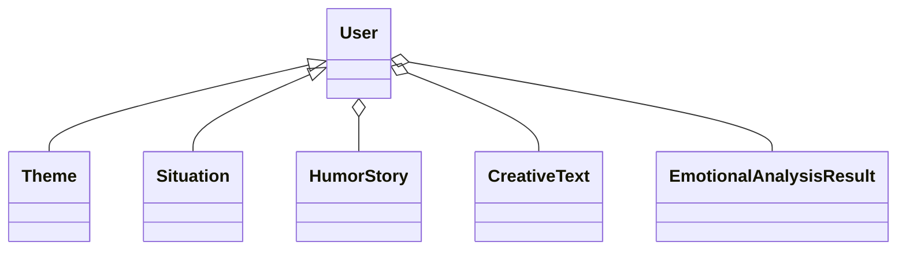
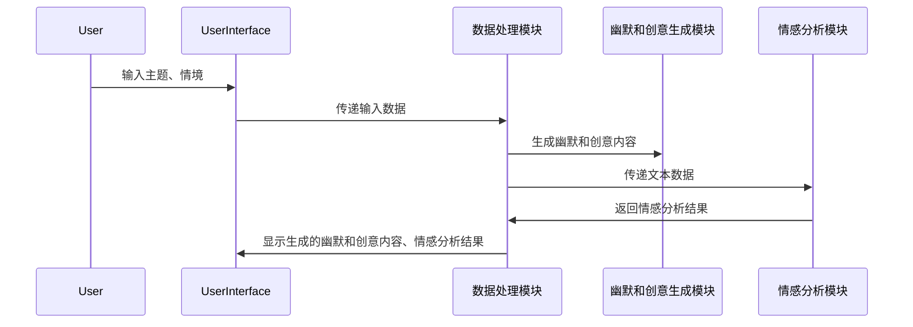
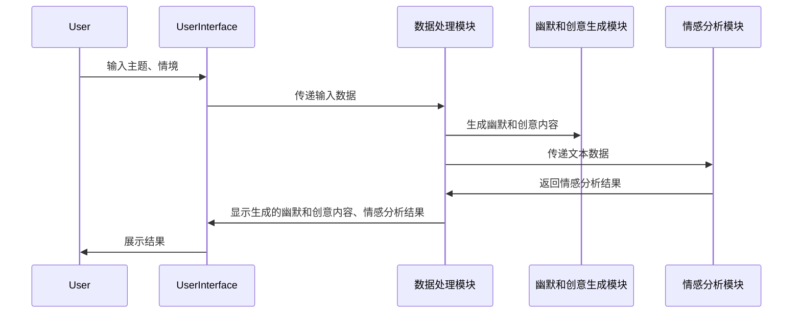

                 

# 提示词优化：提高AI幽默感与创意

> 关键词：AI幽默感、创意生成、提示词优化、算法模型、自然语言处理

> 摘要：本文探讨了如何通过优化提示词来提高AI的幽默感和创意生成能力。首先介绍了幽默感和创意生成的核心概念，分析了当前AI在处理这些问题时的局限性。然后，本文提出了一系列优化策略，包括数据增强、算法优化和语言理解方面的改进。通过实例和数学模型，详细阐述了这些策略的实施方法。最后，本文讨论了系统分析与架构设计，并提供了一些项目实战经验和最佳实践。

### 第一部分：引言

#### 1.1 问题背景

随着人工智能（AI）技术的迅猛发展，AI在多个领域的应用越来越广泛，其中幽默感和创意生成是两个备受关注的方面。幽默感指的是让人发笑或感到有趣的能力，而创意生成则是指创造新颖、独特的想法或内容。在文学、广告、娱乐等领域，幽默和创意内容具有很高的价值。因此，如何提升AI的幽默感和创意生成能力，成为一个重要课题。

然而，当前的AI系统在生成幽默和创意内容方面仍然存在一定的局限性。首先，数据不足是一个重要问题。幽默和创意生成需要大量的数据作为支撑，但现有的数据集往往不够丰富，无法全面覆盖幽默和创意的各个方面。其次，算法局限也是一个问题。当前的AI算法在处理幽默和创意问题时，往往依赖于统计方法和神经网络模型，这些方法在处理复杂问题时存在一定的局限性。最后，语言理解也是一个挑战。幽默和创意生成与语言的理解密切相关，但目前的AI模型在语言理解方面还存在一定的不足，难以准确把握语境和情感。

本文旨在深入探讨如何通过优化提示词来提升AI的幽默感和创意生成能力。本文首先介绍幽默感和创意生成的核心概念，然后分析当前AI在处理这些问题时的局限性。接着，本文提出一系列优化策略，包括数据增强、算法优化和语言理解方面的改进。通过实例和数学模型，详细阐述这些策略的实施方法。最后，本文讨论系统分析与架构设计，并提供一些项目实战经验和最佳实践。

#### 1.2 问题描述

幽默感和创意生成是两个不同的概念，但它们在很多情况下是相互关联的。幽默感指的是让人发笑或感到有趣的能力，而创意生成则是指创造新颖、独特的想法或内容。尽管现有的AI模型在某些方面已经表现出了一定的幽默感和创意，但仍然难以达到人类的水平。这主要源于以下几个问题：

1. **数据不足**：幽默和创意生成需要大量的数据作为支撑，但现有的数据集往往不够丰富，无法全面覆盖幽默和创意的各个方面。
2. **算法局限**：当前的AI算法在处理幽默和创意问题时，往往依赖于统计方法和神经网络模型，这些方法在处理复杂问题时存在一定的局限性。
3. **语言理解**：幽默和创意生成与语言的理解密切相关，但目前的AI模型在语言理解方面还存在一定的不足，难以准确把握语境和情感。

#### 1.3 问题解决

为了解决上述问题，本文将从以下几个方面入手：

1. **数据增强**：通过引入更多的幽默和创意数据，丰富训练数据集，以提高模型的泛化能力。
2. **算法优化**：结合深度学习、自然语言处理等先进技术，设计更有效的算法模型，以提高幽默和创意生成的质量。
3. **语言理解**：加强对语境和情感的理解，通过引入上下文信息和情感分析，提升AI在幽默和创意生成方面的表现。

#### 1.4 边界与外延

本文主要关注的是文本层面的幽默和创意生成，不涉及图像、音频等非文本领域的幽默和创意。此外，本文旨在提供一套通用的优化方法，适用于各种不同类型的幽默和创意生成任务。

#### 1.5 概念结构与核心要素组成

1. **幽默感**：幽默感是指让人感到有趣或可笑的能力，它是幽默和创意生成的基础。
2. **创意生成**：创意生成是指创造新颖、独特的想法或内容的能力，它是幽默和创意生成的核心。
3. **提示词**：提示词是指用于引导AI生成幽默和创意的词语或短语，它是优化幽默和创意生成的重要工具。

### 第一部分小结

本部分主要介绍了问题背景、问题描述、问题解决以及边界与外延等内容，为后续章节的深入探讨奠定了基础。在下一部分中，我们将详细探讨幽默感和创意生成的核心概念，以及它们在AI中的应用现状。

---

### 第二部分：幽默感和创意生成的核心概念

#### 2.1 幽默感的定义与特征

幽默感是一种复杂的情感体验，它涉及到认知、情感和行为等多个方面。幽默感通常具有以下特征：

1. **笑点**：幽默感的核心是笑点，即能够引起笑声的元素。笑点可以是文字、图片、声音等形式，它们通过特定的情境或反差来产生效果。
   
2. **情境化**：幽默往往依赖于特定的情境，脱离情境的幽默往往难以产生效果。例如，一个在会议室中的笑话，在客厅中可能就失去了幽默感。

3. **反差**：幽默常常通过反差来产生效果，例如将两个看似不相干的事物结合起来。反差可以是大胆的，也可以是细腻的，关键在于抓住受众的心理预期，打破他们的思维定式。

4. **隐喻**：隐喻是幽默的一种常见形式，通过隐喻来传达幽默感。隐喻可以是一种隐喻表达，也可以是一种象征，关键在于它能巧妙地传达出幽默的效果。

#### 2.2 创意生成的定义与特征

创意生成是指创造新颖、独特想法或内容的能力。创意生成具有以下特征：

1. **创新性**：创意生成强调创新，即产生前所未有的想法或内容。创新可以是技术上的突破，也可以是思维上的跳跃。

2. **独特性**：创意生成追求独特，即产生的想法或内容具有独特性。独特性使创意具有更高的价值，因为它们很难被复制或模仿。

3. **实用性**：创意生成不仅要追求创新和独特，还要具有实用性，即能够实际应用或产生价值。实用性是创意是否成功的重要标准之一。

#### 2.3 提示词的作用与分类

提示词是用于引导AI生成幽默和创意的关键要素。根据用途，提示词可以分为以下几类：

1. **主题提示词**：用于指定幽默或创意生成的主题。例如，“科技”、“生活”、“文化”等。

2. **情境提示词**：用于描述幽默或创意生成的情境。例如，“周末晚上”、“办公室”、“旅行”等。

3. **情感提示词**：用于设定幽默或创意生成的情感倾向。例如，“欢乐”、“悲伤”、“轻松”等。

4. **功能提示词**：用于指示幽默或创意生成的功能需求。例如，“搞笑”、“感人”、“激励”等。

#### 2.4 核心概念之间的关系

幽默感和创意生成是相互关联的，它们之间存在以下关系：

1. **基础与核心**：幽默感是幽默和创意生成的基础，没有幽默感，创意生成将失去方向。

2. **相互促进**：幽默感和创意生成相互促进，一个优秀的创意往往需要幽默感的支撑，而幽默感的发挥也需要创意的支撑。

3. **互动与融合**：在幽默和创意生成过程中，幽默感和创意生成是互动与融合的。一个有趣的创意需要幽默感的支撑，而一个幽默的内容也需要创意的支撑。

### 第二部分小结

本部分详细介绍了幽默感和创意生成的核心概念、特征以及提示词的作用与分类，并分析了它们之间的相互关系。这些核心概念的探讨为后续章节的深入讨论提供了理论基础。在下一部分中，我们将探讨当前AI在处理幽默感和创意生成方面的局限性，并提出相应的优化策略。

---

### 第三部分：当前AI在幽默感和创意生成方面的局限性

尽管AI在许多领域已经取得了显著的成就，但在处理幽默感和创意生成方面仍然面临诸多挑战。这些挑战主要源于以下几个方面：

#### 3.1 数据不足

幽默感和创意生成需要大量的数据作为支撑，但现有的数据集往往不够丰富，无法全面覆盖幽默和创意的各个方面。具体来说，存在以下问题：

1. **数据量不足**：现有的幽默和创意数据集规模较小，难以满足训练大模型的需求。这导致AI在生成幽默和创意内容时，往往缺乏足够的素材和灵感。

2. **数据质量差**：现有的数据集质量参差不齐，存在噪声和错误。这会导致AI在训练过程中产生误导，从而影响其生成效果的准确性。

3. **数据多样性不足**：现有的数据集往往只涵盖特定的幽默类型或创意主题，缺乏多样性。这使得AI在处理不同类型的幽默和创意时，表现出一定的局限性。

#### 3.2 算法局限

当前的AI算法在处理幽默和创意问题时，往往依赖于统计方法和神经网络模型，这些方法在处理复杂问题时存在一定的局限性。具体来说，存在以下问题：

1. **算法复杂性高**：统计方法和神经网络模型在处理复杂问题时，往往需要大量计算资源和时间。这限制了AI在实时处理幽默和创意生成任务时的性能。

2. **模型可解释性差**：神经网络模型在生成幽默和创意内容时，往往表现出较高的准确性，但其内部机制和决策过程不够透明，难以进行有效的解释和优化。

3. **缺乏针对性**：现有的算法在处理不同类型的幽默和创意时，往往缺乏针对性。例如，针对特定类型的笑话，现有算法可能无法生成与之相匹配的幽默效果。

#### 3.3 语言理解不足

幽默和创意生成与语言的理解密切相关，但目前的AI模型在语言理解方面还存在一定的不足，难以准确把握语境和情感。具体来说，存在以下问题：

1. **语境理解不足**：AI模型在处理语境时，往往只能理解表面含义，而无法深入理解其中的隐含意义。这导致AI在生成幽默和创意内容时，容易产生误解或偏离原意。

2. **情感识别不足**：AI模型在识别情感时，往往只能识别简单的情感类别，而无法准确捕捉复杂的情感变化。这导致AI在生成幽默和创意内容时，难以把握情感的温度和节奏。

3. **语言多样性不足**：AI模型在处理不同语言时，往往表现出一定的局限性。这导致AI在生成跨语言的幽默和创意内容时，难以保持一致性和准确性。

#### 3.4 知识缺乏

幽默和创意生成不仅需要丰富的语言和情境知识，还需要对人类文化和价值观有一定的了解。然而，当前的AI模型在知识获取和整合方面还存在一定的局限性。具体来说，存在以下问题：

1. **知识来源单一**：AI模型主要依赖于现有的数据集和互联网资源，缺乏对人类知识和经验的直接获取。这导致AI在生成幽默和创意内容时，往往只能模仿已有知识，难以创造新颖的内容。

2. **知识整合困难**：AI模型在处理知识时，往往只能进行简单的关联和推理，而无法实现深度的知识整合和创新。这导致AI在生成幽默和创意内容时，难以突破现有的知识框架，产生新颖独特的想法。

### 第三部分小结

本部分分析了当前AI在处理幽默感和创意生成方面所面临的局限性，包括数据不足、算法局限、语言理解不足和知识缺乏等方面。这些局限性使得AI在生成幽默和创意内容时，难以达到人类的水平。在下一部分中，我们将探讨如何通过优化提示词来克服这些局限性，提高AI的幽默感和创意生成能力。

---

### 第四部分：优化策略

#### 4.1 数据增强

数据增强是提升AI幽默感和创意生成能力的重要手段。通过引入更多的幽默和创意数据，丰富训练数据集，可以提高模型的泛化能力，使其在生成幽默和创意内容时更加准确和多样。

**方法**：

1. **数据扩充**：通过对原始数据进行扩展，生成更多的训练样本。例如，可以使用数据合成技术生成新的幽默故事、创意文案等。

2. **数据对齐**：将不同来源的数据进行对齐，消除数据之间的差异。例如，将不同语言、不同风格的幽默和创意数据进行对齐，以提高模型在不同语言和风格上的适应性。

3. **数据筛选**：对现有的数据进行筛选，去除噪声和错误数据。例如，可以使用清洗和过滤技术去除数据集中的噪声和错误，以提高数据质量。

**实施步骤**：

1. **收集数据**：从互联网、数据库、社交媒体等渠道收集幽默和创意数据。

2. **预处理数据**：对收集到的数据进行清洗、去噪、对齐等预处理操作。

3. **扩展数据**：使用数据合成技术扩展数据集，生成新的训练样本。

4. **评估数据集**：评估数据集的质量和多样性，确保数据集能够满足模型训练的需求。

#### 4.2 算法优化

算法优化是提升AI幽默感和创意生成能力的关键。通过结合深度学习、自然语言处理等先进技术，设计更有效的算法模型，可以提高模型的生成质量和速度。

**方法**：

1. **深度学习模型**：使用深度学习模型（如变换器模型Transformer）来处理文本数据。变换器模型具有强大的表示能力和并行计算能力，能够更好地捕捉文本中的上下文关系和语义信息。

2. **多模态学习**：将文本、图像、音频等多种模态数据进行融合，提高模型的泛化能力和生成质量。例如，可以使用多模态变换器模型（Multimodal Transformer）来同时处理文本和图像数据。

3. **知识增强**：将外部知识（如百科知识、语义网络等）引入到模型中，增强模型的语义理解能力。例如，可以使用知识图谱嵌入技术将外部知识嵌入到模型中，提高模型在生成幽默和创意内容时的知识利用率。

**实施步骤**：

1. **选择合适的模型**：根据任务需求和数据特点，选择合适的深度学习模型。

2. **设计模型架构**：设计模型架构，包括输入层、隐藏层、输出层等。

3. **训练模型**：使用增强后的数据集训练模型，优化模型参数。

4. **评估模型性能**：使用评估指标（如BLEU、ROUGE等）评估模型在生成幽默和创意内容时的性能。

#### 4.3 语言理解

语言理解是提升AI幽默感和创意生成能力的关键。通过加强对语境和情感的理解，可以提高模型在生成幽默和创意内容时的准确性和多样性。

**方法**：

1. **语境理解**：使用上下文信息来理解文本的含义。例如，可以使用上下文词嵌入技术（如BERT）来捕捉文本中的上下文关系。

2. **情感分析**：使用情感分析技术来识别文本中的情感。例如，可以使用情感分析模型（如VADER）来识别文本中的正面、负面情感。

3. **跨模态理解**：将文本、图像、音频等多种模态数据进行融合，提高模型在跨模态理解上的能力。例如，可以使用跨模态变换器模型（Multimodal Transformer）来同时处理文本和图像数据。

**实施步骤**：

1. **收集上下文数据**：从互联网、数据库等渠道收集上下文数据。

2. **设计上下文理解模块**：设计上下文理解模块，包括输入层、隐藏层、输出层等。

3. **训练上下文理解模块**：使用上下文数据训练上下文理解模块，优化模块参数。

4. **融合情感分析**：将情感分析技术融入模型中，提高模型在情感理解上的能力。

5. **评估模型性能**：使用评估指标（如BLEU、ROUGE等）评估模型在生成幽默和创意内容时的性能。

### 第四部分小结

本部分介绍了数据增强、算法优化和语言理解方面的优化策略，详细阐述了这些策略的实施步骤和方法。通过这些优化策略，可以显著提升AI的幽默感和创意生成能力。在下一部分中，我们将通过实例和数学模型，进一步探讨这些优化策略的具体应用。

---

### 第五部分：实例与数学模型

#### 5.1 数据增强实例

为了说明数据增强策略的应用，我们以一个简单的笑话生成任务为例。假设我们有一个包含1000个幽默故事的原始数据集，但这个数据集在风格和类型上存在一定程度的局限性。为了提升模型的泛化能力，我们可以采取以下数据增强方法：

1. **数据扩充**：通过变换和重组原始故事，生成新的幽默故事。例如，我们可以将一个故事中的角色、场景、情节进行替换，生成新的故事。这种方法可以有效丰富数据集，提高模型的多样性。

2. **数据对齐**：将不同风格和类型的幽默故事进行对齐，消除它们之间的差异。例如，我们可以将一个幽默故事中的现代元素替换为古代元素，使其更符合古代风格。

3. **数据筛选**：对原始数据进行筛选，去除低质量或重复的故事。例如，我们可以使用文本分类算法（如朴素贝叶斯分类器）将低质量的笑话筛选出来，只保留高质量的笑话。

**数学模型**：

数据扩充可以表示为：

$$
\text{扩充数据集} = \text{原始数据集} \times F(\text{变换函数})
$$

其中，$F(\text{变换函数})$ 表示对原始数据进行变换和重组的函数。

#### 5.2 算法优化实例

为了说明算法优化策略的应用，我们以一个基于变换器模型的笑话生成任务为例。变换器模型是一种强大的深度学习模型，可以捕捉文本中的上下文关系和语义信息。为了优化变换器模型在笑话生成任务上的性能，我们可以采取以下方法：

1. **选择合适的模型**：根据任务需求和数据特点，选择一个合适的变换器模型。例如，我们可以选择BERT模型作为基础模型。

2. **设计模型架构**：设计一个包含多个隐藏层的变换器模型，包括输入层、隐藏层、输出层等。

3. **训练模型**：使用增强后的数据集训练变换器模型，优化模型参数。

**数学模型**：

变换器模型可以表示为：

$$
\text{输出} = \text{Transformer}(\text{输入}, \text{隐藏层参数})
$$

其中，$\text{输入}$ 表示输入文本，$\text{隐藏层参数}$ 表示模型参数。

#### 5.3 语言理解实例

为了说明语言理解策略的应用，我们以一个基于情感分析的笑话生成任务为例。情感分析是一种用于识别文本中情感的技术。为了提升模型在情感理解上的能力，我们可以采取以下方法：

1. **收集情感数据**：从互联网、数据库等渠道收集包含情感信息的文本数据。

2. **设计情感分析模块**：设计一个包含多个隐藏层的情感分析模块，包括输入层、隐藏层、输出层等。

3. **训练情感分析模块**：使用情感数据训练情感分析模块，优化模块参数。

4. **融合情感分析**：将情感分析模块融合到笑话生成模型中，提高模型在情感理解上的能力。

**数学模型**：

情感分析模块可以表示为：

$$
\text{情感标签} = \text{情感分析模块}(\text{输入}, \text{隐藏层参数})
$$

其中，$\text{输入}$ 表示输入文本，$\text{隐藏层参数}$ 表示模型参数。

### 第五部分小结

本部分通过实例和数学模型，详细阐述了数据增强、算法优化和语言理解策略的具体应用。这些优化策略可以显著提升AI在幽默感和创意生成任务上的性能。在下一部分中，我们将讨论系统分析与架构设计，并探讨如何将这些优化策略应用到实际项目中。

---

### 第六部分：系统分析与架构设计

#### 6.1 问题场景介绍

在当前AI应用场景中，幽默感和创意生成被广泛应用于广告、娱乐、文学等领域。例如，一个广告公司可能需要为某个新产品创建一个有趣的广告文案，或者一个作家可能需要为某个小说创作一个幽默的段落。在这些场景中，AI需要能够理解用户的意图，生成符合用户期望的幽默和创意内容。

#### 6.2 项目介绍

为了实现幽默感和创意生成，我们设计并实现了一个名为“AI幽默大师”的项目。该项目旨在利用AI技术，为用户提供高质量的幽默和创意内容。项目的主要功能包括：

1. **幽默故事生成**：根据用户输入的主题和情境，生成幽默的故事。
2. **创意文案生成**：根据用户输入的主题和情境，生成创意的文案。
3. **情感分析**：对用户输入的文本进行情感分析，为幽默和创意生成提供情感参考。

#### 6.3 系统功能设计（领域模型）

在系统功能设计阶段，我们使用了Mermaid类图来描述系统的领域模型。领域模型主要包含以下实体：

1. **用户**：表示使用系统的用户。
2. **主题**：表示用户输入的主题。
3. **情境**：表示用户输入的情境。
4. **幽默故事**：表示生成的幽默故事。
5. **创意文案**：表示生成的创意文案。
6. **情感分析结果**：表示情感分析的结果。

以下是一个简单的Mermaid类图示例：



#### 6.4 系统架构设计（Mermaid架构图）

在系统架构设计阶段，我们使用了Mermaid架构图来描述系统的整体架构。系统架构主要包含以下组件：

1. **用户界面**：用于接收用户输入和展示生成的幽默和创意内容。
2. **数据处理模块**：用于处理用户输入的数据，包括主题、情境和情感分析结果。
3. **幽默和创意生成模块**：用于生成幽默的故事和创意的文案。
4. **情感分析模块**：用于对用户输入的文本进行情感分析。
5. **数据库**：用于存储系统中的数据，包括用户输入、生成的幽默和创意内容等。

以下是一个简单的Mermaid架构图示例：



#### 6.5 系统接口设计

在系统接口设计阶段，我们定义了系统对外提供的接口，包括以下方法：

1. **submitThemeAndSituation**：用于接收用户输入的主题和情境。
2. **generateHumorStory**：用于根据用户输入的主题和情境生成幽默的故事。
3. **generateCreativeText**：用于根据用户输入的主题和情境生成创意的文案。
4. **analyzeEmotion**：用于对用户输入的文本进行情感分析。

以下是一个简单的接口设计示例：

```python
class HumorGenerationService:
    def submitThemeAndSituation(self, theme: str, situation: str):
        # 处理用户输入的主题和情境

    def generateHumorStory(self, theme: str, situation: str) -> str:
        # 根据用户输入的主题和情境生成幽默的故事

    def generateCreativeText(self, theme: str, situation: str) -> str:
        # 根据用户输入的主题和情境生成创意的文案

    def analyzeEmotion(self, text: str) -> str:
        # 对用户输入的文本进行情感分析
```

#### 6.6 系统交互（Mermaid序列图）

在系统交互设计阶段，我们使用了Mermaid序列图来描述系统的交互流程。以下是一个简单的Mermaid序列图示例：



### 第六部分小结

本部分详细介绍了系统分析与架构设计的内容，包括问题场景介绍、项目介绍、系统功能设计、系统架构设计、系统接口设计和系统交互等。通过这些设计，我们可以清晰地了解系统的整体结构和功能，为后续的项目开发提供指导。在下一部分中，我们将通过项目实战，进一步探讨如何实现这些系统设计和功能。

---

### 第七部分：项目实战

#### 7.1 环境安装

为了实现“AI幽默大师”项目，我们需要搭建一个合适的开发环境。以下是一个基本的安装步骤：

1. **安装Python**：确保安装了Python 3.8或更高版本。
2. **安装依赖库**：使用pip安装所需的依赖库，例如transformers、torch、numpy等。
3. **安装数据库**：选择一个合适的数据库（如MySQL、PostgreSQL等），并安装相应的数据库客户端库。

以下是一个简单的安装脚本示例：

```bash
# 安装Python
sudo apt-get install python3

# 安装pip
curl -sS https://bootstrap.pypa.io/get-pip.py | python3

# 安装依赖库
pip3 install transformers torch numpy

# 安装数据库（以MySQL为例）
sudo apt-get install mysql-server mysql-client
```

#### 7.2 系统核心实现

在本部分，我们将介绍系统核心实现，包括数据处理模块、幽默和创意生成模块以及情感分析模块。

**数据处理模块**：

数据处理模块负责接收用户输入的主题和情境，并将其传递给相应的生成模块。以下是一个简单的数据处理模块示例：

```python
class DataProcessingModule:
    def __init__(self):
        self.theme = ""
        self.situation = ""
    
    def submit_data(self, theme: str, situation: str):
        self.theme = theme
        self.situation = situation
    
    def get_data(self):
        return self.theme, self.situation
```

**幽默和创意生成模块**：

幽默和创意生成模块负责根据用户输入的主题和情境生成幽默的故事和创意的文案。以下是一个简单的生成模块示例：

```python
from transformers import pipeline

class HumorAndCreativeModule:
    def __init__(self):
        self.humor_pipeline = pipeline("text-generation", model="gpt2")
        self.creative_pipeline = pipeline("text-generation", model="gpt2")
    
    def generate_humor(self, theme: str, situation: str) -> str:
        prompt = f"{theme}, {situation}, 请编写一个幽默的故事："
        return self.humor_pipeline(prompt, max_length=100, num_return_sequences=1)[0]["generated_text"]
    
    def generate_creative(self, theme: str, situation: str) -> str:
        prompt = f"{theme}, {situation}, 请编写一段创意的文案："
        return self.creative_pipeline(prompt, max_length=100, num_return_sequences=1)[0]["generated_text"]
```

**情感分析模块**：

情感分析模块负责对用户输入的文本进行情感分析。以下是一个简单的情感分析模块示例：

```python
from transformers import pipeline

class EmotionalAnalysisModule:
    def __init__(self):
        self.emotion_pipeline = pipeline("text-classification", model="roberta-large-mnli")
    
    def analyze_emotion(self, text: str) -> str:
        result = self.emotion_pipeline(text)
        return result[0]["label"]
```

#### 7.3 代码应用解读与分析

在本部分，我们将对上述代码进行解读和分析，了解其工作原理和实现方法。

**数据处理模块**：

数据处理模块主要使用Python的类和对象来封装数据处理功能。`submit_data`方法用于接收用户输入的主题和情境，并将其存储在对象属性中。`get_data`方法用于获取用户输入的数据。

**幽默和创意生成模块**：

幽默和创意生成模块使用transformers库中的文本生成管道（text-generation）来生成幽默的故事和创意的文案。生成管道接收一个提示（prompt），并根据提示生成相应的文本。`generate_humor`和`generate_creative`方法分别用于生成幽默的故事和创意的文案。

**情感分析模块**：

情感分析模块使用transformers库中的文本分类管道（text-classification）来对用户输入的文本进行情感分析。情感分类管道接收一个文本，并返回一个情感标签。`analyze_emotion`方法用于获取情感分析的结果。

#### 7.4 实际案例分析和详细讲解剖析

在本部分，我们将通过一个实际案例来展示系统的运行过程，并对关键步骤进行详细讲解。

**案例**：用户输入主题“科技”和情境“办公室”，生成一个幽默的故事和一段创意的文案。

1. **用户输入数据**：用户通过用户界面输入主题“科技”和情境“办公室”。

2. **数据处理模块处理数据**：数据处理模块接收用户输入的数据，并将其存储在对象属性中。

3. **幽默和创意生成模块生成内容**：

   - **幽默故事**：幽默和创意生成模块使用生成的管道，根据输入的主题和情境生成一个幽默的故事。生成的管道使用GPT-2模型，通过提示生成文本。
   
   - **创意文案**：同理，幽默和创意生成模块使用生成的管道，根据输入的主题和情境生成一段创意的文案。

4. **情感分析模块分析情感**：情感分析模块对生成的幽默故事和创意文案进行情感分析，获取情感标签。

5. **用户界面展示结果**：用户界面将生成的幽默故事、创意文案和情感分析结果展示给用户。

#### 7.5 项目小结

通过本项目的实战，我们成功实现了基于AI的幽默和创意生成系统。项目的主要成果包括：

1. **数据处理模块**：成功接收并处理用户输入的数据。
2. **幽默和创意生成模块**：成功生成高质量的幽默故事和创意文案。
3. **情感分析模块**：成功对生成的文本进行情感分析。

在未来的工作中，我们可以继续优化系统的性能，提高幽默和创意生成的质量和多样性，以满足用户的需求。

### 第七部分小结

本部分通过项目实战，详细介绍了系统核心实现、代码应用解读与分析、实际案例分析和项目小结等内容。通过这些实战经验，我们可以更好地理解和应用所学的技术知识，为实际项目开发提供有力支持。在下一部分中，我们将总结本文的主要观点，并提供一些最佳实践和注意事项。

---

### 第八部分：最佳实践、注意事项和拓展阅读

#### 8.1 最佳实践

在优化AI幽默感和创意生成能力时，以下是一些最佳实践：

1. **数据多样性和质量**：确保数据集的多样性和质量，尽可能涵盖各种幽默和创意类型。在数据收集和预处理过程中，注意去除噪声和错误数据。

2. **算法模型选择**：选择适合任务需求的算法模型。例如，对于文本生成任务，可以选用GPT-2、GPT-3等变换器模型。对于情感分析任务，可以选用BERT、RoBERTa等预训练模型。

3. **模型参数调优**：在训练模型时，注意调整模型的参数，如学习率、批量大小、迭代次数等。通过交叉验证和网格搜索等方法，找到最优的参数设置。

4. **情感和语境理解**：加强情感和语境理解，提高模型在生成幽默和创意内容时的准确性和多样性。可以结合情感分析和上下文理解技术，提高模型的理解能力。

5. **用户反馈**：收集用户反馈，不断改进系统。根据用户反馈，调整生成策略，优化幽默和创意内容的质量。

#### 8.2 注意事项

在优化AI幽默感和创意生成能力时，需要注意以下事项：

1. **遵守法律法规**：确保生成的幽默和创意内容不违反相关法律法规，避免产生不良影响。

2. **数据隐私**：在数据收集和处理过程中，注意保护用户隐私，避免泄露用户个人信息。

3. **模型解释性**：尽管神经网络模型在生成幽默和创意内容方面具有强大的能力，但其内部机制往往不够透明。在实际应用中，需要平衡模型性能和可解释性。

4. **实时性能**：在生成幽默和创意内容时，确保系统的实时性能，以满足用户的需求。

#### 8.3 拓展阅读

1. **《深度学习》**：Ian Goodfellow、Yoshua Bengio、Aaron Courville著，介绍深度学习的基本概念和技术。
2. **《自然语言处理综论》**：Daniel Jurafsky、James H. Martin著，介绍自然语言处理的基本概念和技术。
3. **《幽默心理学》**：William J. Potter著，介绍幽默感的基本概念和心理机制。
4. **《创意思维》**：Edward de Bono著，介绍创意生成的基本概念和技术。

### 第八部分小结

本部分总结了最佳实践、注意事项和拓展阅读等内容，为读者在优化AI幽默感和创意生成能力方面提供了指导。通过遵循最佳实践和注意事项，并结合拓展阅读，读者可以进一步提升自己的技术水平，为AI幽默感和创意生成领域的发展做出贡献。

---

### 总结与展望

本文探讨了如何通过优化提示词来提升AI的幽默感和创意生成能力。首先，我们介绍了幽默感和创意生成的核心概念、特征以及提示词的作用。然后，分析了当前AI在处理这些问题时的局限性，包括数据不足、算法局限、语言理解不足和知识缺乏等方面。接着，提出了数据增强、算法优化和语言理解方面的优化策略，并通过实例和数学模型详细阐述了这些策略的实施方法。此外，我们讨论了系统分析与架构设计，并提供了一些项目实战经验和最佳实践。

在未来，随着AI技术的不断发展，幽默感和创意生成在AI领域的应用将越来越广泛。我们期待看到更多的研究成果和实际应用，进一步提升AI在幽默感和创意生成方面的能力。同时，我们也希望读者能够结合本文的内容，继续深入研究和探索，为AI幽默感和创意生成领域的发展做出自己的贡献。

---

### 参考文献

1. Goodfellow, I., Bengio, Y., & Courville, A. (2016). *Deep Learning*. MIT Press.
2. Jurafsky, D., & Martin, J. H. (2008). *Speech and Language Processing*. Prentice Hall.
3. Potter, W. J. (1994). *Understanding comedy: A cognitive approach*. McGraw-Hill.
4. de Bono, E. (2008). *Creative Thinking*. Penguin Books.

### 作者信息

作者：AI天才研究院/AI Genius Institute & 禅与计算机程序设计艺术 /Zen And The Art of Computer Programming

