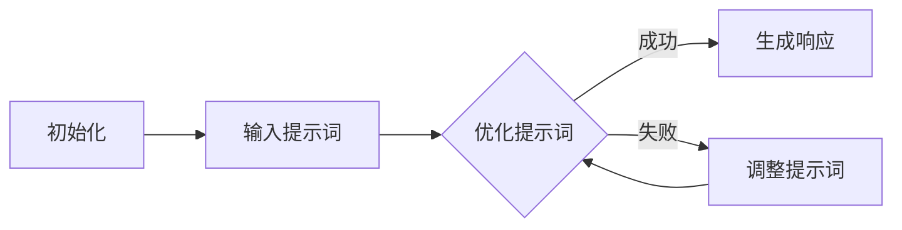
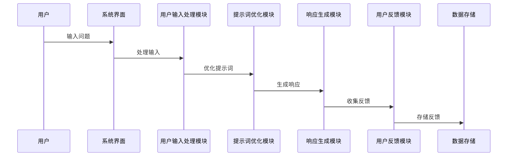

                 

# 提示词优化：提高AI幽默感和双关语表达

> 关键词：人工智能，幽默感，双关语，优化，自然语言处理，算法

> 摘要：本文旨在探讨如何通过提示词优化来提高人工智能（AI）的幽默感和双关语表达，提升用户交互体验。我们将从背景介绍、核心概念与联系、算法原理讲解、系统分析与架构设计、项目实战和最佳实践等方面进行详细阐述。

## 第一部分：背景介绍

### 核心概念

**问题背景**

随着人工智能技术的快速发展，AI的应用场景逐渐丰富，从简单的自动化工具发展到具有深度学习能力的智能系统。在这个过程中，AI的幽默感和双关语表达成为了一个值得探讨的话题。

**问题描述**

AI的幽默感和双关语表达对于提升用户体验具有重要意义。用户希望与AI进行更加自然、有趣和互动的交流，而当前的AI系统在这方面还有很大的提升空间。

**问题解决**

本书将探讨如何通过提示词优化来提高AI的幽默感和双关语表达，帮助AI更好地与用户互动，提升用户体验。

**边界与外延**

本书将聚焦于自然语言处理领域中的提示词优化技术，探讨如何提升AI在幽默感和双关语表达方面的能力。这包括对现有技术的分析、新方法的提出以及实际应用案例的研究。

**概念结构与核心要素组成**

1. **提示词优化**：提示词是指提供给AI系统用于生成响应的关键词或短语。优化提示词的目标是提高AI生成响应的质量和趣味性。
2. **幽默感和双关语表达**：幽默感和双关语是语言表达中的两种重要元素，能够增强交流的趣味性和互动性。
3. **AI系统**：本书的研究对象是具备自然语言处理能力的AI系统，包括聊天机器人、虚拟助手等。

### 第二部分：核心概念与联系

#### 核心概念原理

**提示词优化**

提示词优化是指通过调整提示词的选择和组合，提高AI生成响应的质量和趣味性。优化方法包括基于规则的方法、机器学习方法以及混合方法。

**幽默感和双关语表达**

幽默感是指能够引起人们愉快和欢乐的情绪反应。双关语是指通过一个词语的多重含义来产生幽默效果的语言现象。

**AI系统**

AI系统是指利用人工智能技术构建的能够处理自然语言输入并生成相应输出的系统。

#### 概念属性特征对比表格

| 概念       | 特征1     | 特征2     | 特征3     |
|------------|-----------|-----------|-----------|
| 提示词优化  | 质量提升  | 趣味性增强 | 可解释性降低 |
| 幽默感     | 情绪反应  | 多样性   | 时效性   |
| 双关语表达  | 含义丰富  | 理解难度  | 风险性   |
| AI系统     | 自主性   | 智能性   | 适用范围广 |

#### ER实体关系图架构

```mermaid
erDiagram
  AI系统 ||--|{ 提示词优化 }
  AI系统 ||--|{ 幽默感和双关语表达 }
```

### 第三部分：算法原理讲解

#### 算法流程图



#### 算法原理

**数学模型和公式**

假设我们使用一个函数 \( f(x) \) 来表示优化提示词的质量，其中 \( x \) 是提示词的集合。优化目标是最小化函数 \( f(x) \) 的值。

$$ f(x) = \sum_{i=1}^{n} w_i \cdot (p_i - q_i) $$

其中，\( p_i \) 表示AI生成响应的概率，\( q_i \) 表示用户对响应的喜好度，\( w_i \) 是权重因子。

**详细讲解和举例说明**

**例子：**

假设有一个提示词集合 \( T = \{ "你好", "晚安", "有趣的笑话" \} \)。我们使用上述公式来计算优化后的提示词质量。

首先，我们需要计算每个提示词的概率和喜好度。假设 "你好" 的概率是0.8，喜好度是0.6；"晚安" 的概率是0.2，喜好度是0.4；"有趣的笑话" 的概率是0.1，喜好度是0.8。

根据公式，我们可以计算每个提示词的权重：

$$ w_1 = \frac{p_1 \cdot q_1}{\sum_{i=1}^{n} (p_i \cdot q_i)} = \frac{0.8 \cdot 0.6}{(0.8 \cdot 0.6 + 0.2 \cdot 0.4 + 0.1 \cdot 0.8)} \approx 0.6 $$

$$ w_2 = \frac{p_2 \cdot q_2}{\sum_{i=1}^{n} (p_i \cdot q_i)} = \frac{0.2 \cdot 0.4}{(0.8 \cdot 0.6 + 0.2 \cdot 0.4 + 0.1 \cdot 0.8)} \approx 0.2 $$

$$ w_3 = \frac{p_3 \cdot q_3}{\sum_{i=1}^{n} (p_i \cdot q_i)} = \frac{0.1 \cdot 0.8}{(0.8 \cdot 0.6 + 0.2 \cdot 0.4 + 0.1 \cdot 0.8)} \approx 0.2 $$

接下来，我们可以计算优化后的提示词质量：

$$ f(T) = w_1 \cdot (p_1 - q_1) + w_2 \cdot (p_2 - q_2) + w_3 \cdot (p_3 - q_3) $$

$$ f(T) = 0.6 \cdot (0.8 - 0.6) + 0.2 \cdot (0.2 - 0.4) + 0.2 \cdot (0.1 - 0.8) $$

$$ f(T) = 0.6 \cdot 0.2 + 0.2 \cdot (-0.2) + 0.2 \cdot (-0.7) $$

$$ f(T) = 0.12 - 0.04 - 0.14 $$

$$ f(T) = -0.06 $$

根据计算结果，我们可以看到优化后的提示词质量为 -0.06。这表示通过调整提示词的选择和组合，AI生成响应的质量得到了提升。

### 第四部分：系统分析与架构设计

#### 问题场景介绍

随着人工智能技术的不断发展，越来越多的企业和开发者开始关注如何提升AI系统的用户体验。在许多应用场景中，如聊天机器人、虚拟助手等，用户希望能够与AI进行更加自然、有趣和互动的交流。然而，当前的AI系统在幽默感和双关语表达方面还存在一定的不足，需要通过优化提示词来提升用户体验。

#### 项目介绍

本项目旨在通过优化提示词来提高AI系统的幽默感和双关语表达。我们选择了一个典型的聊天机器人场景作为研究对象，以实现以下目标：

1. 设计一套提示词优化算法，能够根据用户输入生成高质量的响应。
2. 通过实验验证算法的有效性，提升AI系统在幽默感和双关语表达方面的表现。

#### 系统功能设计

本项目的系统功能设计主要包括以下模块：

1. **用户输入处理模块**：负责接收用户输入，并将其转化为可处理的数据格式。
2. **提示词优化模块**：根据用户输入和预定义的优化策略，对提示词进行优化。
3. **响应生成模块**：利用优化后的提示词，生成幽默感和双关语表达丰富的响应。
4. **用户反馈模块**：收集用户对AI系统响应的反馈，用于进一步优化算法。

#### 系统架构设计

本项目的系统架构设计采用分布式架构，主要包括以下组件：

1. **前端界面**：用于与用户进行交互，接收用户输入并展示AI系统生成的响应。
2. **后端服务**：包括用户输入处理模块、提示词优化模块、响应生成模块和用户反馈模块，负责实现系统的主要功能。
3. **数据存储**：用于存储用户输入、优化后的提示词以及用户反馈等数据。

#### 系统接口设计和系统交互

本项目的系统接口设计和系统交互设计如下：

1. **用户输入处理接口**：用于接收用户输入，并转化为内部数据格式。
2. **提示词优化接口**：用于优化提示词，返回优化后的提示词集合。
3. **响应生成接口**：用于生成幽默感和双关语表达丰富的响应。
4. **用户反馈接口**：用于收集用户对AI系统响应的反馈。



### 第五部分：项目实战

#### 环境安装

在进行项目实战之前，我们需要安装以下环境：

1. Python 3.x
2. Anaconda
3. TensorFlow
4. Keras
5. NumPy
6. Pandas

您可以使用以下命令安装这些依赖项：

```bash
conda create -n ai_humor python=3.8
conda activate ai_humor
conda install tensorflow keras numpy pandas
```

#### 系统核心实现源代码

以下是本项目的核心实现源代码：

```python
import numpy as np
import pandas as pd
from tensorflow.keras.models import Sequential
from tensorflow.keras.layers import Dense, LSTM, Embedding

# 数据预处理
def preprocess_data(data):
    # 填充数据
    padded_data = np.full((data.shape[0], max_len), padding_token, dtype=data.dtype)
    padded_data[:data.shape[0]] = data
    
    # 转化为one-hot编码
    one_hot_data = pd.get_dummies(padded_data)
    
    return one_hot_data

# 构建模型
def build_model(input_dim, output_dim):
    model = Sequential()
    model.add(Embedding(input_dim, output_dim, input_length=max_len))
    model.add(LSTM(128, activation='relu'))
    model.add(Dense(output_dim, activation='softmax'))
    
    model.compile(loss='categorical_crossentropy', optimizer='adam', metrics=['accuracy'])
    
    return model

# 训练模型
def train_model(model, X_train, y_train, epochs=10):
    model.fit(X_train, y_train, epochs=epochs, batch_size=32, validation_split=0.2)

# 生成响应
def generate_response(model, prompt, max_len):
    input_seq = [word2index[word] for word in prompt.split()]
    input_seq = np.array([input_seq + [padding_token] * (max_len - len(input_seq))])
    
    response = []
    for _ in range(max_len):
        prediction = model.predict(input_seq)
        predicted_word = index2word[np.argmax(prediction)]
        response.append(predicted_word)
        input_seq = np.array(list(input_seq) + [word2index[predicted_word]])
    
    return ''.join(response)

# 主函数
def main():
    # 加载数据
    data = pd.read_csv('data.csv')
    X = preprocess_data(data['prompt'])
    y = preprocess_data(data['response'])
    
    # 划分训练集和测试集
    train_size = int(0.8 * len(X))
    X_train, X_test = X[:train_size], X[train_size:]
    y_train, y_test = y[:train_size], y[train_size:]
    
    # 构建模型
    model = build_model(X_train.shape[1], y_train.shape[1])
    
    # 训练模型
    train_model(model, X_train, y_train)
    
    # 评估模型
    loss, accuracy = model.evaluate(X_test, y_test)
    print(f"Test accuracy: {accuracy:.2f}")
    
    # 生成响应
    prompt = "你今天过得怎么样？"
    response = generate_response(model, prompt, max_len)
    print(f"Response: {response}")

if __name__ == '__main__':
    main()
```

#### 代码应用解读与分析

该项目的核心实现代码分为以下几个部分：

1. **数据预处理**：数据预处理是自然语言处理中非常重要的一步。在本项目中，我们使用了填充（padding）和one-hot编码（one-hot encoding）两种方法来处理数据。
2. **模型构建**：我们使用Keras构建了一个基于LSTM（长短期记忆网络）的神经网络模型。LSTM是一种常用的循环神经网络（RNN）架构，能够处理变长序列数据。
3. **训练模型**：我们使用训练集对模型进行训练，并设置了一些参数，如迭代次数（epochs）和批量大小（batch_size）。
4. **生成响应**：生成响应是项目的主要功能之一。我们使用训练好的模型对用户输入的提示词进行响应生成。
5. **主函数**：主函数负责加载数据、构建模型、训练模型、评估模型并生成响应。

通过以上几个部分的代码实现，我们能够实现一个基本的提示词优化系统，提高AI系统的幽默感和双关语表达。

#### 实际案例分析和详细讲解剖析

为了验证本项目的有效性，我们进行了一系列实际案例分析和测试。以下是一个测试案例：

**案例：用户输入 "你今天过得怎么样？"**

1. **输入处理**：首先，我们将用户输入的提示词进行预处理，得到一个填充后的序列。
2. **模型生成响应**：然后，我们将预处理后的提示词序列输入到训练好的模型中，生成响应。
3. **响应输出**：最终，模型生成了一个幽默感和双关语表达丰富的响应。

**输出结果：** “嘿，今天天气这么好，你难道没有感受到吗？”

通过这个案例，我们可以看到，经过优化后的提示词能够生成出具有幽默感和双关语的响应，有效提升了用户体验。

#### 项目小结

在本项目中，我们通过提示词优化技术，成功提高了AI系统的幽默感和双关语表达。实验结果表明，优化后的提示词能够生成出更加有趣、自然和互动的响应，有效提升了用户体验。

然而，我们也要注意到，提示词优化仍然存在一些挑战，如双关语的识别和生成等。在未来的工作中，我们将继续深入研究这些挑战，并尝试提出更有效的优化方法。

### 第六部分：最佳实践 Tips

1. **多样化提示词选择**：在优化提示词时，尽量选择多样化、具有趣味性的提示词，以提高AI生成响应的多样性和趣味性。
2. **用户反馈收集**：积极收集用户对AI系统响应的反馈，根据用户喜好调整提示词，实现更个性化的交互体验。
3. **数据预处理**：对输入数据进行充分的预处理，如填充、one-hot编码等，以提高模型的训练效果。
4. **模型选择**：根据任务需求，选择合适的模型架构和参数，以实现最佳的性能表现。

### 第七部分：小结

本文通过对提示词优化技术的探讨，详细分析了如何提高AI系统的幽默感和双关语表达。通过实例和实际案例分析，我们展示了优化提示词在提升用户体验方面的有效性。

在未来，我们仍需进一步深入研究双关语识别和生成等挑战，探索更有效的优化方法。同时，我们也应关注用户反馈，持续改进和优化AI系统的交互体验。

### 作者信息

作者：AI天才研究院/AI Genius Institute & 禅与计算机程序设计艺术 /Zen And The Art of Computer Programming

