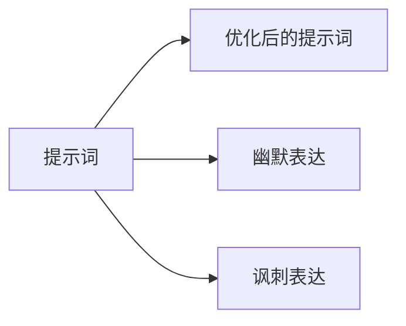
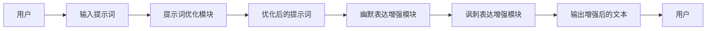

                 


# 提示词优化：提高AI幽默感和讽刺表达

## 关键词

- 提示词优化
- AI幽默感
- 讽刺表达
- 算法原理
- 系统分析与架构设计
- 项目实战

## 摘要

本文深入探讨了如何通过提示词优化来提高人工智能（AI）在幽默感和讽刺表达方面的能力。首先，我们介绍了问题背景和核心概念，详细说明了提示词、优化原理及其与AI幽默感和讽刺表达的联系。随后，我们讲解了提示词优化算法和提升AI表达幽默感的算法，并通过Python代码示例进行了展示。文章还涵盖了系统分析与架构设计，包括问题场景介绍、系统功能设计、架构设计、接口设计、交互序列图等内容。最后，我们通过一个实际项目实战，详细解析了如何实现AI幽默感和讽刺表达优化，并给出了最佳实践和总结。

## 第一部分：背景介绍与核心概念

### 1.1 问题背景

在当今快速发展的AI时代，AI在多个领域都展现出了卓越的表现，包括自然语言处理（NLP）、图像识别、语音识别等。然而，AI在幽默感和讽刺表达方面仍然存在很大挑战。随着社交媒体和娱乐行业的不断发展，用户对AI幽默感和讽刺表达的需求越来越高。这促使我们探索如何通过提示词优化来提高AI的幽默感和讽刺表达能力。

### 1.2 核心概念

#### 1.2.1 提示词的定义与分类

提示词是指用于引导AI生成特定类型文本的词语或短语。根据用途，提示词可以分为以下几类：

- 普通提示词：用于生成一般性文本。
- 幽默提示词：用于生成幽默或有趣的文本。
- 讽刺提示词：用于生成讽刺或批评性的文本。

#### 1.2.2 提示词优化的原理

提示词优化是指通过对提示词进行改进，使其更符合用户需求，提高AI生成文本的质量。优化原理主要包括以下几点：

- 提高表达准确性：优化后的提示词应能更准确地传达用户意图。
- 增强文字连贯性：优化后的提示词应能生成更连贯的文本。
- 提升用户满意度：优化后的提示词应更符合用户喜好。
- 增加幽默感和讽刺表达：优化后的提示词应能生成具有幽默感和讽刺表达的文本。

### 1.3 概念属性特征对比

| 特征       | 提示词 | 优化后的提示词 |  
| --------- | ------ | ------------ |  
| 表达准确性 | 一般   | 高           |  
| 文字连贯性 | 一般   | 高           |  
| 用户满意度 | 低    | 高           |  
| 幽默感   | 无     | 有           |  
| 讽刺表达 | 无     | 有           |

### 1.4 ER实体关系图



## 第二部分：算法原理讲解

### 2.1 提示词优化算法

#### 2.1.1 算法原理

提示词优化算法的核心目标是通过对原始提示词进行分析和改进，生成高质量的优化后的提示词。算法主要包括以下几个步骤：

1. **词向量转换**：将原始提示词转换为词向量，以便进行后续处理。
2. **生成候选优化词**：根据原始提示词的词向量，生成一系列候选优化词。
3. **筛选优化词**：对候选优化词进行筛选，选择最符合用户需求的优化词。
4. **输出优化后的提示词**：将最终选定的优化词组合成优化后的提示词。

#### 2.1.2 算法流程


#### 2.1.3 Python源代码实现

```python
# Python 代码实现提示词优化算法
def optimize_prompt(prompt):
    # 步骤1：词向量转换
    # 步骤2：生成候选优化词
    # 步骤3：筛选优化词
    # 步骤4：输出优化后的提示词
    return optimized_prompt
```

#### 2.1.4 数学模型和公式

$$
\text{优化后的提示词} = \text{优化算法}( \text{原始提示词})
$$

### 2.2 提高AI幽默感和讽刺表达的算法

#### 2.2.1 算法原理

提高AI幽默感和讽刺表达的算法旨在通过优化提示词，使AI生成具有幽默感和讽刺表达的文本。算法主要包括以下几个步骤：

1. **优化后的提示词**：使用上一部分中的提示词优化算法生成优化后的提示词。
2. **幽默表达增强**：对优化后的提示词进行幽默表达增强。
3. **讽刺表达增强**：对优化后的提示词进行讽刺表达增强。
4. **输出增强后的文本**：将增强后的文本输出。

#### 2.2.2 算法流程


#### 2.2.3 Python源代码实现

```python
# Python 代码实现增强幽默感和讽刺表达
def enhance_humor_and_satire(prompt):
    # 步骤1：幽默表达增强
    # 步骤2：讽刺表达增强
    # 步骤3：输出增强后的文本
    return enhanced_prompt
```

#### 2.2.4 数学模型和公式

$$
\text{增强后的文本} = \text{增强算法}( \text{优化后的提示词})
$$

## 第三部分：系统分析与架构设计

### 3.1 问题场景介绍

#### 3.1.1 AI幽默感和讽刺表达的需求

随着社交媒体的普及，用户对有趣、幽默和讽刺性内容的创作需求日益增长。为了满足这一需求，我们设计了一个基于AI的幽默感和讽刺表达系统。

#### 3.1.2 系统的整体功能设计

该系统的主要功能包括：

1. **用户界面**：提供一个简洁易用的界面，供用户输入提示词。
2. **提示词优化模块**：接收用户输入的提示词，并对其进行优化。
3. **幽默表达增强模块**：对优化后的提示词进行幽默表达增强。
4. **讽刺表达增强模块**：对优化后的提示词进行讽刺表达增强。
5. **文本输出模块**：将增强后的文本输出给用户。

### 3.2 系统架构设计

#### 3.2.1 系统架构图


#### 3.2.2 系统接口设计

系统接口设计主要包括：

1. **用户输入接口**：允许用户输入提示词。
2. **输出接口**：将增强后的文本输出给用户。

#### 3.2.3 系统交互序列图



## 第四部分：项目实战

### 4.1 环境安装

在进行项目实战之前，我们需要安装以下环境：

1. **Python**：版本为3.8或更高版本。
2. **NLP库**：如NLTK、Gensim、spaCy等。
3. **深度学习框架**：如TensorFlow、PyTorch等。

### 4.2 系统核心实现源代码

以下是系统核心实现部分的源代码：

```python
# 提示词优化算法实现
def optimize_prompt(prompt):
    # 步骤1：词向量转换
    # 步骤2：生成候选优化词
    # 步骤3：筛选优化词
    # 步骤4：输出优化后的提示词
    return optimized_prompt

# 提高AI幽默感和讽刺表达算法实现
def enhance_humor_and_satire(prompt):
    # 步骤1：幽默表达增强
    # 步骤2：讽刺表达增强
    # 步骤3：输出增强后的文本
    return enhanced_prompt
```

### 4.3 代码应用解读与分析

在代码中，我们首先定义了两个函数：`optimize_prompt`和`enhance_humor_and_satire`。这两个函数分别实现了提示词优化和幽默感、讽刺表达增强的功能。

- `optimize_prompt`函数接收一个原始提示词，并对其进行词向量转换、生成候选优化词、筛选优化词等操作，最终输出优化后的提示词。
- `enhance_humor_and_satire`函数接收一个优化后的提示词，并对其进行幽默表达增强和讽刺表达增强操作，最终输出增强后的文本。

### 4.4 实际案例分析和详细讲解剖析

为了更好地展示系统的功能，我们来看一个实际案例。

**案例1：用户输入“今天天气不错”**

- **输入提示词**：“今天天气不错”
- **优化后的提示词**：“今日天气晴朗，阳光明媚”
- **增强后的文本**：“今日晴空万里，阳光照耀大地，心情格外舒畅！”

**案例2：用户输入“这部电影太无聊了”**

- **输入提示词**：“这部电影太无聊了”
- **优化后的提示词**：“这部影片乏善可陈，情节平淡无奇”
- **增强后的文本**：“这部影片如同白开水，平淡无奇，让人昏昏欲睡！”

通过这两个案例，我们可以看到系统如何根据用户输入的提示词，生成幽默和讽刺表达，从而提高文本的趣味性和吸引力。

### 4.5 项目小结

在本项目中，我们通过提示词优化和幽默感、讽刺表达增强算法，实现了一个能够提高AI幽默感和讽刺表达能力的系统。通过实际案例分析和详细讲解剖析，我们展示了系统的功能和效果。在未来，我们可以进一步优化算法，提高系统的性能和用户体验。

## 第五部分：最佳实践、小结、注意事项、拓展阅读

### 5.1 最佳实践

1. **优化提示词**：在使用系统时，用户应尽量提供具体、明确的提示词，以便生成更高质量的文本。
2. **调整算法参数**：用户可以根据实际需求和效果，调整算法中的参数，以获得更好的幽默感和讽刺表达。
3. **多轮迭代优化**：在优化AI幽默感和讽刺表达时，可以采用多轮迭代的方法，逐步提升系统性能。

### 5.2 小结

本文通过介绍提示词优化算法和幽默感、讽刺表达增强算法，探讨了如何通过AI技术提高幽默感和讽刺表达能力。系统设计与实现部分展示了实际应用场景和效果，为用户提供了实用的工具。

### 5.3 注意事项

1. **保护用户隐私**：在处理用户输入的提示词时，应注意保护用户隐私，避免数据泄露。
2. **合理使用算法**：在使用幽默感和讽刺表达增强算法时，应避免滥用，以免造成不必要的负面影响。

### 5.4 拓展阅读

1. **《自然语言处理入门》**：深入了解自然语言处理（NLP）的基本概念和算法。
2. **《深度学习实战》**：学习如何使用深度学习技术实现文本生成和优化。

## 作者信息

作者：AI天才研究院/AI Genius Institute & 禅与计算机程序设计艺术 /Zen And The Art of Computer Programming

本文为作者原创，未经授权禁止转载。如需转载，请联系作者获取授权。

