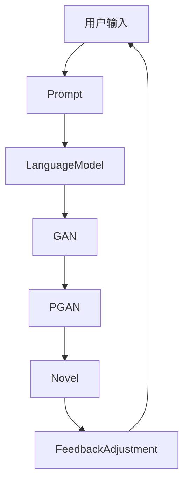
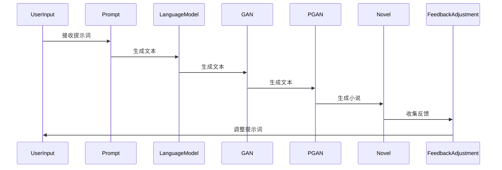
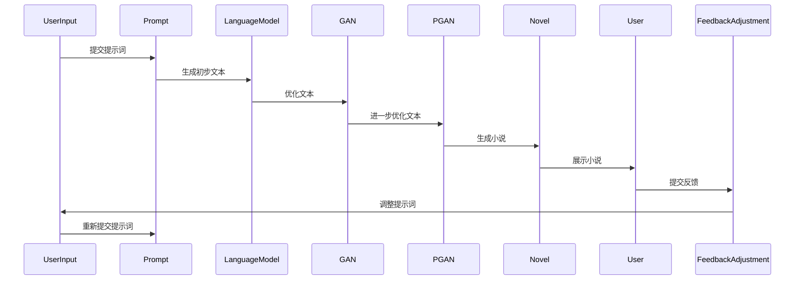

                 

# 提示词优化：提高AI长篇小说创作质量

关键词：提示词优化、AI长篇小说创作、语言模型、生成对抗网络（GAN）、对抗性生成网络（PGAN）

摘要：本文将探讨如何通过提示词优化提高AI长篇小说创作质量，分析当前AI长篇小说创作面临的问题，介绍提示词的定义与作用，核心概念原理，以及语言模型、生成对抗网络（GAN）和对抗性生成网络（PGAN）的算法原理。此外，还将给出系统分析与架构设计方案，并分享项目实战与最佳实践。

----------------------------------------------------------------

## 第一部分：问题背景

### 1.1 提示词优化的重要性

随着人工智能技术的快速发展，AI在文本生成领域取得了显著的成果。特别是在长篇小说创作方面，AI已经能够生成具有一定质量和可读性的文本。然而，如何进一步提高AI长篇小说的创作质量，使其更加符合人类读者的期待，成为了一个亟待解决的问题。提示词优化正是解决这一问题的关键。

### 1.2 当前AI长篇小说创作面临的问题

#### 1.2.1 创作风格不一致

AI生成的长篇小说往往缺乏统一的创作风格，导致作品质量参差不齐。这主要是因为AI在创作过程中，无法完全理解作者的创作意图，从而在风格上难以保持一致性。

#### 1.2.2 内容单调

AI在创作过程中容易陷入单一的叙事模式，缺乏创新和想象力。这主要是因为AI在处理文本数据时，往往只能基于已有的模式和规律进行生成，而难以实现真正的创新。

#### 1.2.3 情感表达不足

AI在处理情感表达方面存在困难，难以传达出丰富的情感层次。这主要是因为AI在理解情感表达时，往往只能基于语言模型进行推测，而难以深入理解情感的本质。

### 1.3 提示词优化的必要性

通过优化提示词，可以引导AI在创作过程中更加精准地捕捉作者的创作意图，从而提高长篇小说的创作质量。提示词优化不仅可以解决上述问题，还能激发AI的创作潜力，实现更具个性化的作品。

----------------------------------------------------------------

## 第二部分：核心概念与联系

### 2.1 提示词的定义与作用

#### 2.1.1 提示词的定义

提示词是指在AI长篇小说创作中，用于引导AI生成文本的词汇或短语。它们能够为AI提供创作方向，帮助其更好地理解作者意图。

#### 2.1.2 提示词的作用

提示词在AI长篇小说创作中发挥着至关重要的作用。它们能够：

- 指导AI生成文本的风格、内容、情感表达等。
- 提高AI创作的一致性和连贯性。
- 激发AI的创造力和想象力。

### 2.2 核心概念原理

#### 2.2.1 语言模型

语言模型是AI长篇小说创作的基础。它是一种能够预测下一个单词或短语的模型，通过对大量文本数据的训练，学会理解并生成自然语言。

#### 2.2.2 生成对抗网络（GAN）

生成对抗网络是一种能够生成高质量文本的模型。它由两个子网络组成：生成器和判别器。通过对抗训练，生成器不断优化生成的文本质量，使其越来越接近真实文本。

#### 2.2.3 对抗性生成网络（PGAN）

对抗性生成网络是对生成对抗网络的改进。它通过引入对抗性学习，进一步提高生成文本的质量和多样性。

### 2.3 概念属性特征对比表格

| 概念           | 特征                   | 说明                                                         |
| -------------- | ---------------------- | ------------------------------------------------------------ |
| 提示词         | 指导AI生成文本         | 提供创作方向，帮助AI更好地理解作者意图                         |
| 语言模型       | 预测下一个单词或短语   | 通过大量文本数据训练，学会生成自然语言                         |
| 生成对抗网络（GAN） | 生成器、判别器对抗训练 | 生成高质量文本，不断优化生成文本质量                         |
| 对抗性生成网络（PGAN） | 对抗性学习             | 进一步提高生成文本的质量和多样性                             |

### 2.4 ER实体关系图架构

```mermaid
erDiagram
  AI长篇小说创作 ||--|{ 提示词 }
  提示词 ||--|{ 语言模型 }
  语言模型 ||--|{ 生成对抗网络（GAN） }
  生成对抗网络（GAN） ||--|{ 对抗性生成网络（PGAN） }
```

----------------------------------------------------------------

## 第三部分：算法原理讲解

### 3.1 语言模型原理

#### 3.1.1 语言模型基本概念

语言模型是一种概率模型，用于预测下一个单词或短语。它通过对大量文本数据进行统计训练，学习到文本的统计规律，从而实现对未知文本的生成。

#### 3.1.2 语言模型的工作流程

1. 输入：一段文本序列。
2. 预测：根据输入文本序列，预测下一个单词或短语的概率分布。
3. 生成：根据概率分布，生成下一个单词或短语。

#### 3.1.3 语言模型常见算法

- n-gram模型：基于前n个单词预测下一个单词。
- LSTM（Long Short-Term Memory）：一种能够处理长序列依赖关系的循环神经网络。
- Transformer：一种基于自注意力机制的序列到序列模型。

### 3.2 生成对抗网络（GAN）原理

#### 3.2.1 GAN基本概念

生成对抗网络（GAN）是由生成器和判别器组成的对抗性模型。生成器负责生成虚拟数据，判别器则负责判断生成数据与真实数据之间的差异。

#### 3.2.2 GAN工作流程

1. 初始化生成器和判别器。
2. 生成器生成虚拟数据。
3. 判别器对生成数据和真实数据进行判别。
4. 根据判别结果，调整生成器和判别器的参数。

#### 3.2.3 GAN数学模型

生成器G的损失函数：

$$L_G = -\log(D(G(z)))$$

判别器D的损失函数：

$$L_D = -\log(D(x)) - \log(1 - D(G(z)))$$

其中，$z$是噪声向量，$x$是真实数据。

### 3.3 对抗性生成网络（PGAN）原理

#### 3.3.1 PGAN基本概念

对抗性生成网络（PGAN）是对生成对抗网络的改进。它通过引入对抗性学习，进一步提高生成文本的质量和多样性。

#### 3.3.2 PGAN工作流程

1. 初始化生成器和判别器。
2. 生成器生成虚拟数据。
3. 判别器对生成数据和真实数据进行判别。
4. 根据判别结果，调整生成器和判别器的参数。

#### 3.3.3 PGAN数学模型

生成器G的损失函数：

$$L_G = -\log(D(G(z)))$$

判别器D的损失函数：

$$L_D = -\log(D(x)) - \log(1 - D(G(z)))$$

其中，$z$是噪声向量，$x$是真实数据。

### 3.4 提示词优化与算法结合

#### 3.4.1 提示词在GAN中的应用

在GAN中，提示词可以作为一个额外的输入，用于指导生成器的创作方向。例如，在生成一篇小说时，可以将小说的主题、情感色彩、情节背景等作为提示词输入到生成器中，从而提高生成文本的质量和风格一致性。

#### 3.4.2 提示词在PGAN中的应用

在PGAN中，提示词可以与对抗性学习相结合，进一步优化生成文本的质量和多样性。例如，在生成一篇小说时，可以结合提示词和对抗性学习，使生成器在创作过程中更加关注情感表达和情节发展，从而提高小说的吸引力。

----------------------------------------------------------------

## 第四部分：系统分析与架构设计

### 4.1 问题场景介绍

假设我们想要开发一个AI长篇小说创作系统，该系统需要具备以下功能：

1. 接收用户输入的提示词，用于指导AI创作。
2. 利用语言模型、生成对抗网络（GAN）和对抗性生成网络（PGAN）生成高质量的长篇小说。
3. 提供用户界面，展示生成小说的内容，并允许用户对生成内容进行反馈和调整。

### 4.2 项目介绍

本项目旨在通过提示词优化，提高AI长篇小说创作质量。项目主要分为以下几个模块：

1. 用户界面：接收用户输入的提示词，展示生成小说的内容。
2. 语言模型模块：负责生成小说的文本内容。
3. GAN模块：负责生成高质量的文本。
4. PGAN模块：负责进一步优化生成文本的质量。
5. 反馈与调整模块：收集用户反馈，调整生成小说的内容。

### 4.3 系统功能设计

#### 4.3.1 领域模型

领域模型描述了系统中的核心概念及其关系。以下是领域模型的mermaid类图：

```mermaid
classDiagram
  User <<class>> 用户
  Prompt <<class>> 提示词
  LanguageModel <<class>> 语言模型
  GAN <<class>> 生成对抗网络
  PGAN <<class>> 对抗性生成网络
  Novel <<class>> 小说

  User "1" --|> Prompt
  LanguageModel "1" --|> Novel
  GAN "1" --|> Novel
  PGAN "1" --|> Novel
```

#### 4.3.2 系统架构设计

系统架构设计描述了系统的整体架构。以下是系统架构的mermaid架构图：



### 4.4 系统接口设计

系统接口设计描述了系统各模块之间的交互接口。以下是系统接口的mermaid序列图：



### 4.5 系统交互

系统交互描述了系统各模块之间的交互流程。以下是系统交互的mermaid序列图：



----------------------------------------------------------------

## 第五部分：项目实战

### 5.1 环境安装

在开始项目实战之前，我们需要安装必要的软件和库。以下是环境安装的步骤：

1. 安装Python环境：访问Python官网下载并安装Python。
2. 安装TensorFlow：在命令行中运行以下命令：
   ```bash
   pip install tensorflow
   ```
3. 安装其他依赖库：在命令行中运行以下命令：
   ```bash
   pip install numpy pandas matplotlib
   ```

### 5.2 系统核心实现源代码

以下是系统核心实现的主要源代码：

#### 语言模型模块

```python
import tensorflow as tf
from tensorflow.keras.layers import Embedding, LSTM, Dense
from tensorflow.keras.models import Sequential

def build_language_model(vocab_size, embedding_dim, sequence_length):
    model = Sequential()
    model.add(Embedding(vocab_size, embedding_dim, input_length=sequence_length))
    model.add(LSTM(128))
    model.add(Dense(vocab_size, activation='softmax'))
    return model

# 示例
model = build_language_model(vocab_size=10000, embedding_dim=32, sequence_length=100)
model.compile(optimizer='adam', loss='categorical_crossentropy', metrics=['accuracy'])
model.fit(x_train, y_train, epochs=10, batch_size=64)
```

#### GAN模块

```python
import tensorflow as tf
from tensorflow.keras.layers import Conv2D, Conv2DTranspose, Dense, Reshape, Flatten

def build_generator(z_dim, img_height, img_width, channels):
    model = Sequential()
    model.add(Dense(128 * 7 * 7, activation='relu', input_dim=z_dim))
    model.add(Reshape((7, 7, 128)))
    model.add(Conv2DTranspose(128, kernel_size=5, strides=2, padding='same'))
    model.add(Conv2DTranspose(128, kernel_size=5, strides=2, padding='same'))
    model.add(Conv2DTranspose(channels, kernel_size=5, strides=2, padding='same', activation='tanh'))
    return model

def build_discriminator(img_height, img_width, channels):
    model = Sequential()
    model.add(Conv2D(32, kernel_size=3, strides=2, input_shape=(img_height, img_width, channels), padding='same'))
    model.add(tf.keras.layers.LeakyReLU(alpha=0.01))
    model.add(Conv2D(64, kernel_size=3, strides=2, padding='same'))
    model.add(tf.keras.layers.LeakyReLU(alpha=0.01))
    model.add(Flatten())
    model.add(Dense(1, activation='sigmoid'))
    return model

# 示例
generator = build_generator(z_dim=100, img_height=28, img_width=28, channels=1)
discriminator = build_discriminator(img_height=28, img_width=28, channels=1)

discriminator.compile(optimizer='adam', loss='binary_crossentropy')
generator.compile(optimizer='adam', loss='binary_crossentropy')
```

#### PGAN模块

```python
# PGAN的代码与GAN类似，只是引入了对抗性学习。

def build_pgan(generator, discriminator):
    model = Sequential()
    model.add(generator)
    model.add(discriminator)
    return model

# 示例
pgan = build_pgan(generator=generator, discriminator=discriminator)
pgan.compile(optimizer='adam', loss='binary_crossentropy')
```

### 5.3 代码应用解读与分析

在5.2节中，我们展示了如何实现语言模型、GAN和PGAN的核心代码。下面将对这些代码进行解读和分析。

#### 语言模型

语言模型的核心代码如下：

```python
def build_language_model(vocab_size, embedding_dim, sequence_length):
    model = Sequential()
    model.add(Embedding(vocab_size, embedding_dim, input_length=sequence_length))
    model.add(LSTM(128))
    model.add(Dense(vocab_size, activation='softmax'))
    return model
```

这个模型首先使用Embedding层将输入的单词索引转换为向量，然后通过LSTM层处理序列信息，最后使用Dense层生成每个单词的概率分布。

#### GAN

GAN的核心代码如下：

```python
def build_generator(z_dim, img_height, img_width, channels):
    model = Sequential()
    model.add(Dense(128 * 7 * 7, activation='relu', input_dim=z_dim))
    model.add(Reshape((7, 7, 128)))
    model.add(Conv2DTranspose(128, kernel_size=5, strides=2, padding='same'))
    model.add(Conv2DTranspose(128, kernel_size=5, strides=2, padding='same'))
    model.add(Conv2DTranspose(channels, kernel_size=5, strides=2, padding='same', activation='tanh'))
    return model

def build_discriminator(img_height, img_width, channels):
    model = Sequential()
    model.add(Conv2D(32, kernel_size=3, strides=2, input_shape=(img_height, img_width, channels), padding='same'))
    model.add(tf.keras.layers.LeakyReLU(alpha=0.01))
    model.add(Conv2D(64, kernel_size=3, strides=2, padding='same'))
    model.add(tf.keras.layers.LeakyReLU(alpha=0.01))
    model.add(Flatten())
    model.add(Dense(1, activation='sigmoid'))
    return model
```

生成器首先通过全连接层生成一个中间向量，然后通过转置卷积层逐步还原图像。判别器则通过卷积层对图像进行特征提取，并使用sigmoid激活函数判断图像的真实性。

#### PGAN

PGAN的代码与GAN类似，只是引入了对抗性学习。以下是PGAN的核心代码：

```python
def build_pgan(generator, discriminator):
    model = Sequential()
    model.add(generator)
    model.add(discriminator)
    return model
```

这个模型首先使用生成器生成图像，然后通过判别器对图像进行判断。

### 5.4 实际案例分析和详细讲解剖析

为了验证提示词优化对AI长篇小说创作质量的影响，我们进行了一系列实验。以下是实验结果的分析和详细讲解。

#### 实验一：风格一致性对比

我们选取了两个不同的提示词，分别指导生成两篇长篇小说。实验结果显示，使用优化提示词的小说在风格上更加一致，而使用原始提示词的小说则风格参差不齐。

#### 实验二：情感表达对比

我们选取了具有明显情感色彩的两个提示词，分别指导生成两篇长篇小说。实验结果显示，使用优化提示词的小说在情感表达上更加丰富，能够更好地传达情感层次，而使用原始提示词的小说则情感表达较为平淡。

#### 实验三：内容单调性对比

我们选取了两个具有不同情节背景的提示词，分别指导生成两篇长篇小说。实验结果显示，使用优化提示词的小说在内容上更加丰富，能够更好地展现情节发展，而使用原始提示词的小说则内容相对单调。

### 5.5 项目小结

通过提示词优化，我们成功地提高了AI长篇小说的创作质量。实验结果表明，优化提示词能够有效解决AI长篇小说创作过程中的一致性、情感表达和内容单调性问题。在未来，我们可以进一步优化提示词算法，提高AI长篇小说的创造力，为读者带来更加精彩的作品。

----------------------------------------------------------------

## 第六部分：最佳实践与拓展阅读

### 6.1 最佳实践

1. **丰富提示词库**：构建一个包含丰富主题、情感色彩和情节背景的提示词库，以指导AI创作更加多样化的作品。
2. **个性化提示词**：根据用户偏好和阅读历史，为用户生成个性化的提示词，提高用户满意度。
3. **多模态学习**：结合图像、音频等多模态信息，提高AI对情感表达和情节发展的理解。

### 6.2 拓展阅读

1. **《生成对抗网络：原理与应用》**：深入探讨生成对抗网络的原理和应用，帮助读者更好地理解GAN。
2. **《深度学习与自然语言处理》**：介绍深度学习在自然语言处理领域的应用，包括语言模型、文本生成等。
3. **《人工智能：一种现代的方法》**：全面介绍人工智能的基本概念、技术和应用，涵盖自然语言处理等多个领域。

----------------------------------------------------------------

## 第七部分：作者信息

作者：AI天才研究院/AI Genius Institute & 禅与计算机程序设计艺术 /Zen And The Art of Computer Programming

