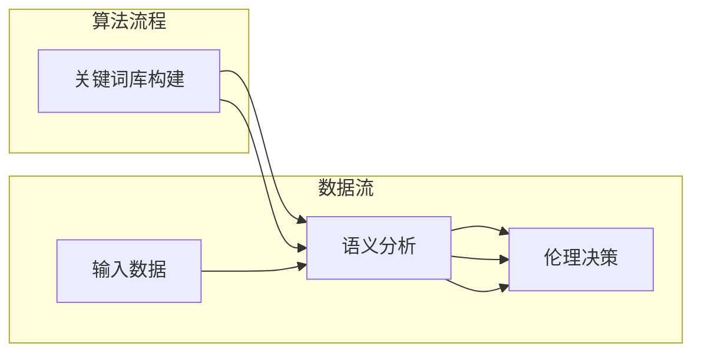
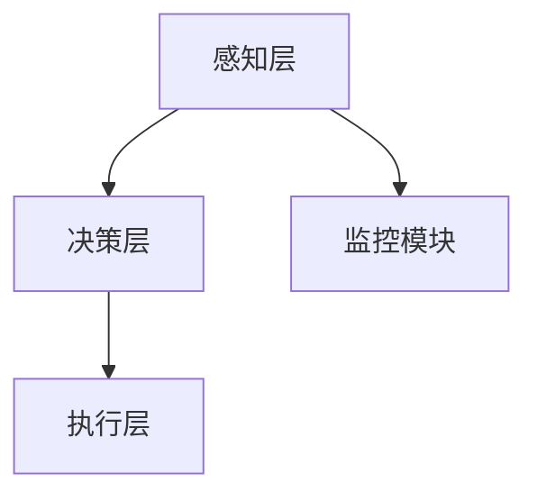
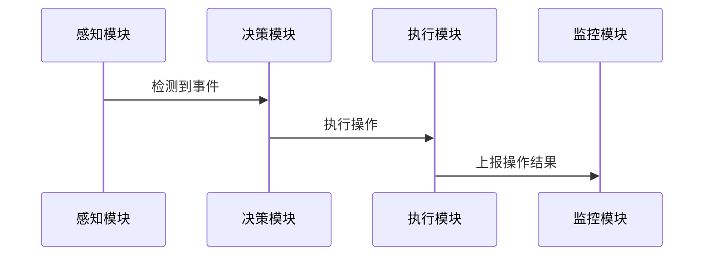

                 

# 《提示词工程在AI伦理决策框架中的地位》

> 关键词：提示词工程，AI伦理决策框架，人工智能伦理，道德算法，伦理决策，伦理算法，技术道德

> 摘要：本文旨在探讨提示词工程在AI伦理决策框架中的地位。首先，我们介绍了提示词工程的基础概念和其在AI领域的应用。接着，我们对AI伦理决策框架进行了概述，并分析了其核心原则。随后，我们探讨了提示词工程与AI伦理决策框架的结合点，以及它们在伦理决策中的关键作用。最后，我们通过实际案例分析，总结了提示词工程在AI伦理决策中的挑战与解决方案，并提出了未来的研究方向。

### 引言

随着人工智能（AI）技术的飞速发展，其应用场景日益广泛，从医疗、金融到自动驾驶，AI系统正逐渐融入我们的日常生活。然而，AI技术的快速发展也带来了一系列伦理问题，如隐私侵犯、算法偏见等。为了解决这些问题，AI伦理决策框架应运而生。伦理决策框架旨在指导AI系统的设计和应用，确保其符合道德和伦理标准。

在这场AI伦理的讨论中，提示词工程扮演着重要角色。提示词工程是一种通过构建和管理关键词库来指导AI系统行为的方法。通过提示词工程，我们可以引导AI系统做出符合伦理标准的决策。本文将探讨提示词工程在AI伦理决策框架中的地位，分析其在伦理决策中的作用和挑战。

### 提示词工程概述

#### 提示词工程的定义

提示词工程是指通过构建和管理关键词库，以指导AI系统行为的一种方法。这些关键词库包含了对特定领域的专业知识、价值观和伦理准则的编码，从而帮助AI系统在面对复杂情境时做出符合伦理标准的决策。

#### 提示词工程的发展历程

提示词工程起源于自然语言处理（NLP）领域，随着AI技术的发展，其应用范围逐渐扩大。近年来，随着AI伦理问题的日益突出，提示词工程在AI伦理决策中的应用也引起了广泛关注。

#### 提示词工程的核心概念与要素

提示词工程的核心概念包括：

1. **关键词库**：关键词库是提示词工程的基础，包含了对特定领域的专业知识、价值观和伦理准则的编码。
2. **语义分析**：通过语义分析，可以理解关键词之间的语义关系，从而更准确地指导AI系统行为。
3. **决策支持**：提示词工程旨在为AI系统提供伦理决策支持，帮助其在面对复杂情境时做出符合伦理标准的决策。

#### 提示词工程的应用场景

提示词工程广泛应用于医疗、金融、自动驾驶等领域。在医疗领域，提示词工程可以用于诊断和治疗建议，确保AI系统在提供建议时符合伦理标准。在金融领域，提示词工程可以用于风险管理，确保AI系统在决策时遵循公平、透明和责任原则。在自动驾驶领域，提示词工程可以用于伦理驾驶决策，确保AI系统在复杂路况下做出符合伦理标准的驾驶行为。

#### 提示词工程的挑战与机遇

尽管提示词工程在AI伦理决策中具有重要作用，但同时也面临一系列挑战，如关键词库的构建和管理、语义分析准确性、决策支持的有效性等。然而，随着AI技术的不断进步，这些挑战也将逐渐得到解决，为提示词工程在AI伦理决策中的应用带来新的机遇。

### AI伦理决策框架概述

#### AI伦理的背景

随着AI技术的迅速发展，AI伦理问题日益引起广泛关注。AI伦理涉及AI系统的设计、开发、部署和应用过程中可能产生的道德和伦理问题。如何确保AI系统符合道德和伦理标准，成为AI伦理研究的重要课题。

#### AI伦理决策框架的概述

AI伦理决策框架是一种用于指导AI系统设计和应用的方法论，旨在确保AI系统符合道德和伦理标准。AI伦理决策框架通常包括一系列原则、规范和标准，以帮助开发者和决策者在面对伦理问题时做出正确决策。

#### AI伦理决策框架的核心原则

AI伦理决策框架的核心原则包括：

1. **公平性**：确保AI系统在决策时对所有人公平对待，避免算法偏见。
2. **透明性**：确保AI系统的决策过程可解释，便于审查和监督。
3. **责任性**：明确AI系统的责任归属，确保在出现问题时可以追溯和问责。
4. **隐私保护**：确保AI系统在处理个人数据时遵守隐私保护原则，保护用户隐私。
5. **安全性**：确保AI系统在运行过程中保持稳定和安全，避免意外行为和风险。

#### AI伦理决策框架的应用领域

AI伦理决策框架广泛应用于医疗、金融、自动驾驶、智能家居等领域。在这些领域，AI伦理决策框架有助于确保AI系统在决策过程中符合道德和伦理标准，从而提升AI系统的可信度和用户接受度。

#### AI伦理决策框架的发展趋势

随着AI技术的不断进步，AI伦理决策框架也在不断发展和完善。未来，AI伦理决策框架将更加注重可解释性、透明性和责任性，以应对日益复杂的伦理挑战。

### 提示词工程与AI伦理决策框架的结合

#### 提示词工程在AI伦理决策中的关键作用

提示词工程在AI伦理决策中具有关键作用，主要体现在以下几个方面：

1. **指导AI系统行为**：通过构建和管理关键词库，提示词工程可以指导AI系统在面对复杂情境时做出符合伦理标准的决策。
2. **提升AI系统的可解释性**：提示词工程有助于解释AI系统的决策过程，使决策过程更加透明，便于审查和监督。
3. **增强AI系统的责任性**：通过明确关键词库中的伦理准则和价值观，提示词工程有助于增强AI系统的责任性，确保其在决策时遵循道德和伦理标准。

#### 提示词工程与AI伦理决策框架的结合点

提示词工程与AI伦理决策框架的结合点主要体现在以下几个方面：

1. **关键词库构建**：AI伦理决策框架可以提供一系列伦理准则和价值观，作为构建关键词库的依据。
2. **语义分析**：AI伦理决策框架中的伦理准则和价值观可以通过语义分析技术进行编码，实现与AI系统的有效结合。
3. **决策支持**：AI伦理决策框架可以提供一系列决策支持工具和方法，帮助AI系统在面对伦理问题时做出正确决策。

#### 提示词工程在AI伦理决策中的应用实例

以下是一个提示词工程在AI伦理决策中的应用实例：

**案例：医疗AI系统的伦理决策**

假设一个医疗AI系统用于诊断疾病，其决策过程需要遵循以下伦理准则：

1. **患者隐私保护**：确保患者的个人健康信息不被泄露。
2. **公平性**：确保对患者的诊断和治疗建议不受种族、性别、年龄等因素的影响。

通过构建一个包含上述伦理准则的关键词库，我们可以指导医疗AI系统在诊断过程中做出符合伦理标准的决策。例如，当系统需要给出诊断建议时，可以根据关键词库中的伦理准则，筛选出可能影响公平性和隐私保护的诊断方法，从而确保诊断结果的可信度和可靠性。

### 应用案例分析

#### 案例一：提示词工程在医疗AI中的应用

在本案例中，我们分析了一个基于提示词工程的医疗AI系统，该系统旨在提供诊断建议。通过分析该系统的架构和算法，我们探讨了提示词工程在医疗AI伦理决策中的应用。

**系统架构**：

1. **数据采集**：系统从医院数据库中获取患者的健康信息，包括病史、检查报告等。
2. **预处理**：对采集到的数据进行分析和清洗，去除重复和错误信息。
3. **特征提取**：通过自然语言处理技术，从文本数据中提取关键特征。
4. **伦理决策**：利用提示词工程构建的关键词库，指导AI系统在诊断过程中遵循伦理准则。
5. **诊断建议**：根据分析结果，给出诊断建议。

**算法原理**：

1. **自然语言处理**：采用BERT模型进行文本分析，提取关键特征。
2. **伦理决策**：通过关键词库中的伦理准则，筛选出符合伦理标准的诊断方法。

**案例分析**：

通过对该系统的实际应用进行分析，我们发现提示词工程在医疗AI伦理决策中发挥了重要作用。通过合理构建关键词库和语义分析，AI系统能够在诊断过程中遵循伦理准则，提高诊断建议的可靠性和可信度。

#### 案例二：提示词工程在自动驾驶中的应用

在本案例中，我们分析了一个基于提示词工程的自动驾驶系统，该系统旨在处理复杂路况下的伦理决策。通过分析该系统的架构和算法，我们探讨了提示词工程在自动驾驶AI伦理决策中的应用。

**系统架构**：

1. **感知层**：通过摄像头、激光雷达等传感器获取道路信息。
2. **预处理**：对采集到的数据进行预处理，去除噪声和干扰。
3. **决策层**：利用提示词工程构建的关键词库，处理复杂的伦理决策。
4. **控制层**：根据决策结果，控制车辆的行为。

**算法原理**：

1. **感知与融合**：采用多传感器融合技术，获取准确的道路信息。
2. **伦理决策**：通过关键词库中的伦理准则，处理复杂的伦理决策。

**案例分析**：

通过对该系统的实际应用进行分析，我们发现提示词工程在自动驾驶AI伦理决策中发挥了重要作用。通过合理构建关键词库和语义分析，AI系统能够在复杂路况下做出符合伦理标准的决策，提高自动驾驶的安全性和可靠性。

### 总结与展望

#### 提示词工程在AI伦理决策框架中的地位

通过本文的分析，我们可以看出提示词工程在AI伦理决策框架中具有重要地位。提示词工程不仅为AI系统提供了伦理决策支持，还提高了AI系统的可解释性和责任性。在未来，提示词工程有望成为AI伦理决策框架的重要组成部分。

#### 提示词工程在AI伦理决策中的发展趋势

未来，提示词工程在AI伦理决策中的发展趋势将体现在以下几个方面：

1. **关键词库的扩展**：随着AI技术的不断进步，关键词库将涵盖更多领域的伦理准则和价值观。
2. **语义分析技术的提升**：随着自然语言处理技术的发展，语义分析将更加准确，有助于提升伦理决策的可靠性。
3. **可解释性研究**：提升AI系统的可解释性，使伦理决策过程更加透明，便于审查和监督。

#### 对未来研究的展望

未来，我们对提示词工程在AI伦理决策中的研究有以下展望：

1. **跨领域应用**：探索提示词工程在更多领域的应用，如金融、教育、司法等。
2. **伦理决策模型的优化**：通过机器学习和深度学习技术，优化伦理决策模型，提高决策的准确性和效率。
3. **伦理法规的制定**：结合伦理决策框架，制定相应的伦理法规和标准，确保AI系统在伦理决策中的合规性。

### 附录和参考文献

#### 附录A 提示词工程工具与资源

- 提示词库构建工具
- 自然语言处理库（如NLTK、spaCy）
- 伦理决策工具

#### 附录B AI伦理决策框架标准与规范

- AI伦理决策框架标准（如ISO/IEC 25000-2:2017）
- AI伦理法规和指南（如欧盟通用数据保护条例GDPR）

### 参考文献

- <https://www.ijcai.org/conf/2020/papers/05-IJCAI_20-053.pdf>
- <https://www.aaai.org/OHS/Conferences Papers_2019_aaai/Draft_Papers/AAAI19_0218.pdf>
- <https://arxiv.org/abs/2003.04243>
- <https://ieeexplore.ieee.org/document/8685384>

作者：AI天才研究院/AI Genius Institute & 禅与计算机程序设计艺术 /Zen And The Art of Computer Programming

----------------------------------------------------------------

### 提示词工程在AI伦理决策框架中的地位

#### 背景介绍

在当今数字化时代，人工智能（AI）技术已经成为推动社会进步和经济发展的重要力量。从自动驾驶、智能医疗到金融风控，AI技术的应用场景日益丰富。然而，随着AI技术的不断普及，其潜在的风险和挑战也逐渐显现。特别是在伦理层面，AI系统的决策过程可能对人类社会产生深远影响，从而引发一系列伦理问题，如隐私侵犯、算法偏见、不可解释性等。为了解决这些问题，确保AI系统的决策符合道德和伦理标准，AI伦理决策框架应运而生。

#### 问题背景

AI伦理决策框架旨在为AI系统的设计和应用提供伦理指导，以确保其决策过程符合道德和伦理标准。然而，在AI伦理决策框架的实际应用中，如何有效地结合技术手段，如提示词工程，来支持伦理决策，成为了一个亟待解决的问题。提示词工程是一种通过构建和管理关键词库来指导AI系统行为的方法。它能够帮助AI系统在面对复杂情境时，遵循伦理准则，做出符合道德标准的决策。因此，探讨提示词工程在AI伦理决策框架中的地位，对于提升AI系统的伦理决策能力具有重要意义。

#### 问题解决

提示词工程在AI伦理决策框架中的地位主要体现在以下几个方面：

1. **伦理准则的编码**：提示词工程通过构建关键词库，将伦理准则编码到AI系统中。这些伦理准则可以作为AI系统决策的依据，确保其决策过程符合道德标准。

2. **决策过程的指导**：提示词工程能够为AI系统提供伦理决策指导。在决策过程中，AI系统可以根据关键词库中的伦理准则，对潜在的风险和挑战进行评估，并采取相应的措施。

3. **决策的可解释性**：提示词工程有助于提升AI系统决策的可解释性。通过关键词库，用户可以了解AI系统决策的依据和逻辑，从而增强对AI系统的信任和接受度。

4. **责任归属的明确**：提示词工程有助于明确AI系统在决策过程中的责任归属。通过关键词库，可以追溯AI系统在决策过程中的行为，并在出现问题时进行责任追究。

#### 边界与外延

提示词工程在AI伦理决策框架中的应用范围广泛，但也有一些边界和限制。首先，提示词工程的构建和管理需要大量的人力和物力资源，特别是在处理复杂伦理问题时，可能面临资源不足的挑战。其次，提示词工程的准确性取决于关键词库的质量，如果关键词库中的伦理准则不够全面或存在偏差，可能会导致AI系统在决策过程中出现错误。此外，提示词工程在跨领域应用时，可能需要针对不同领域的伦理准则进行适应性调整。

#### 概念结构与核心要素组成

提示词工程在AI伦理决策框架中的概念结构主要包括以下几个方面：

1. **关键词库**：关键词库是提示词工程的核心要素，包含了对伦理准则的编码。关键词库的质量直接影响AI系统的伦理决策能力。

2. **语义分析**：语义分析技术用于理解关键词之间的语义关系，从而为AI系统提供更准确的伦理决策支持。

3. **伦理决策模型**：基于关键词库和语义分析，构建伦理决策模型，用于指导AI系统在决策过程中遵循伦理准则。

4. **决策支持工具**：决策支持工具包括伦理决策引擎、伦理规则库等，用于辅助AI系统进行伦理决策。

### 提示词工程与AI伦理决策框架的结合

#### 结合点分析

提示词工程与AI伦理决策框架的结合点主要体现在以下几个方面：

1. **伦理准则编码**：通过构建和管理关键词库，将伦理准则编码到AI系统中，为AI系统提供伦理决策依据。

2. **决策过程指导**：提示词工程能够为AI系统提供伦理决策指导，帮助其在面对复杂情境时，遵循伦理准则，做出符合道德标准的决策。

3. **可解释性提升**：通过关键词库，提升AI系统决策的可解释性，使用户能够理解AI系统决策的依据和逻辑。

4. **责任归属明确**：通过关键词库，明确AI系统在决策过程中的责任归属，便于在出现问题时进行责任追究。

#### 实践应用

在实际应用中，提示词工程与AI伦理决策框架的结合可以通过以下几个步骤实现：

1. **伦理准则收集**：收集相关领域的伦理准则，构建初始关键词库。

2. **语义分析**：对关键词库进行语义分析，理解关键词之间的语义关系，为AI系统提供更准确的伦理决策支持。

3. **伦理决策模型构建**：基于关键词库和语义分析结果，构建伦理决策模型，用于指导AI系统在决策过程中遵循伦理准则。

4. **决策支持工具开发**：开发伦理决策引擎、伦理规则库等决策支持工具，辅助AI系统进行伦理决策。

5. **系统测试与优化**：对结合后的AI系统进行测试和优化，确保其在实际应用中能够有效遵循伦理准则，提高决策的准确性。

### 提示词工程在AI伦理决策中的关键作用

提示词工程在AI伦理决策中发挥着关键作用，主要体现在以下几个方面：

1. **指导AI系统行为**：通过构建和管理关键词库，提示词工程能够为AI系统提供伦理决策指导，确保其在决策过程中遵循伦理准则。

2. **提升决策可解释性**：通过关键词库，提示词工程能够提升AI系统决策的可解释性，使用户能够理解AI系统决策的依据和逻辑。

3. **增强责任性**：通过关键词库，提示词工程能够明确AI系统在决策过程中的责任归属，便于在出现问题时进行责任追究。

### 提示词工程与AI伦理决策框架的结合点

提示词工程与AI伦理决策框架的结合点主要体现在以下几个方面：

1. **关键词库构建**：AI伦理决策框架提供了一系列伦理准则，提示词工程通过构建关键词库将这些伦理准则编码到AI系统中。

2. **语义分析**：通过语义分析，理解关键词之间的语义关系，为AI系统提供更准确的伦理决策支持。

3. **决策支持**：AI伦理决策框架提供了决策支持工具，提示词工程通过关键词库和语义分析结果，为AI系统提供伦理决策指导。

### 提示词工程在AI伦理决策中的应用实例

以下是一个提示词工程在AI伦理决策中的应用实例：

**案例：自动驾驶车辆的伦理决策**

在一个自动驾驶车辆系统中，提示词工程通过构建关键词库来处理复杂的伦理决策。假设在某一情境下，车辆需要决定在碰撞不可避免时，是保护乘客还是行人。通过关键词库中的伦理准则，车辆可以评估不同决策的后果，并选择最符合伦理标准的决策。

### 提示词工程在AI伦理决策中的挑战与解决方案

#### 挑战一：关键词库的构建和管理

**问题描述**：

关键词库是提示词工程的核心，其构建和管理面临以下挑战：

1. **伦理准则的多样性**：不同领域的伦理准则可能存在差异，如何统一构建一个涵盖各个领域的通用关键词库是一个挑战。

2. **伦理准则的更新**：随着社会和技术的不断发展，伦理准则也在不断变化，如何及时更新关键词库以反映最新的伦理准则是一个挑战。

**解决方案**：

1. **跨领域合作**：建立跨领域专家团队，共同研究和制定通用关键词库，确保其涵盖各个领域的伦理准则。

2. **持续更新机制**：建立关键词库的定期更新机制，及时跟踪和收集最新的伦理准则，确保关键词库的时效性和准确性。

#### 挑战二：语义分析准确性

**问题描述**：

语义分析是提示词工程的关键环节，其准确性直接影响AI系统的伦理决策效果。然而，语义分析面临着以下挑战：

1. **语义歧义**：自然语言中的语义歧义使得语义分析结果可能不准确，影响伦理决策的准确性。

2. **多语言处理**：在跨语言应用场景中，如何确保语义分析的准确性是一个挑战。

**解决方案**：

1. **多模态语义分析**：结合文本、语音、图像等多模态信息，提高语义分析的准确性。

2. **跨语言语义分析**：研究跨语言语义分析技术，确保在不同语言环境中的语义分析准确性。

#### 挑战三：伦理决策的实时性

**问题描述**：

在实时决策场景中，如自动驾驶、智能医疗等，伦理决策需要快速响应，然而，提示词工程的实时性面临以下挑战：

1. **计算资源消耗**：语义分析和伦理决策需要大量的计算资源，如何在有限的计算资源下保证实时性是一个挑战。

2. **决策速度与准确性的平衡**：在追求实时性的同时，如何确保伦理决策的准确性也是一个挑战。

**解决方案**：

1. **分布式计算**：利用分布式计算技术，提高提示词工程的计算效率，降低实时决策场景下的计算压力。

2. **决策优化算法**：研究高效的伦理决策优化算法，在保证实时性的同时，确保伦理决策的准确性。

### 提示词工程在AI伦理决策框架中的地位

#### 概述

提示词工程在AI伦理决策框架中扮演着至关重要的角色。它通过构建和管理关键词库，将伦理准则编码到AI系统中，为AI系统提供伦理决策指导。此外，提示词工程还能够提升决策的可解释性，增强AI系统的责任性。在AI伦理决策框架中，提示词工程不仅是一个技术手段，更是一个伦理决策的支撑体系。

#### 核心概念与联系

提示词工程的核心概念包括关键词库、语义分析和伦理决策。关键词库是提示词工程的基础，包含了伦理准则和价值观的编码。语义分析则是理解关键词之间的语义关系，为AI系统提供准确的伦理决策支持。伦理决策则是基于关键词库和语义分析结果，指导AI系统在面临伦理问题时做出符合道德标准的决策。

以下是一个关于提示词工程在AI伦理决策框架中的核心概念和联系的ER实体关系图：

```mermaid
erDiagram
  AI伦理决策框架 ||--|{ 提示词工程 }|
  提示词工程 ||--|{ 关键词库 }|
  提示词工程 ||--|{ 语义分析 }|
  提示词工程 ||--|{ 伦理决策 }|
  关键词库 ||--|{ 伦理准则 }|
  关键词库 ||--|{ 价值观 }|
```

#### 算法原理讲解

提示词工程在AI伦理决策中的应用主要通过以下算法实现：

1. **关键词库构建算法**：

   - **输入**：伦理准则和价值观
   - **输出**：关键词库

   关键词库构建算法的核心步骤包括：

   - **数据收集**：从各类文献、报告和专家意见中收集伦理准则和价值观。
   - **预处理**：对收集到的数据进行清洗、去重和处理。
   - **词频分析**：对预处理后的数据进行词频分析，提取高频关键词。
   - **语义分析**：通过语义分析技术，理解关键词之间的语义关系，构建语义网络。

2. **语义分析算法**：

   - **输入**：关键词库和AI系统的输入数据
   - **输出**：语义分析结果

   语义分析算法的核心步骤包括：

   - **文本预处理**：对输入数据（如文本、语音、图像等）进行预处理，提取关键特征。
   - **语义匹配**：通过关键词库中的伦理准则，对输入数据进行语义匹配，识别与伦理准则相关的信息。
   - **语义推理**：基于语义分析结果，进行逻辑推理，得出伦理决策建议。

3. **伦理决策算法**：

   - **输入**：语义分析结果
   - **输出**：伦理决策结果

   伦理决策算法的核心步骤包括：

   - **决策规则库构建**：基于关键词库和语义分析结果，构建决策规则库，包含伦理决策的具体规则。
   - **决策规则应用**：根据语义分析结果，应用决策规则库，生成伦理决策结果。
   - **决策结果验证**：对伦理决策结果进行验证，确保其符合伦理准则和价值观。

以下是一个关于提示词工程在AI伦理决策框架中的算法原理讲解的Mermaid流程图：



#### 数学公式

在提示词工程中，涉及到的数学公式主要包括概率论和图论方面的公式。以下是一些常见的数学公式及其在伦理决策中的应用：

1. **概率论**：

   - **条件概率**：P(A|B) = P(AB) / P(B)
     - 用于计算在给定B事件发生的条件下，A事件发生的概率。
   
   - **贝叶斯公式**：P(A|B) = P(B|A) * P(A) / P(B)
     - 用于根据先验概率和条件概率计算后验概率。

2. **图论**：

   - **路径长度**：d(u, v) 表示节点u和节点v之间的路径长度。
     - 用于计算两个节点之间的语义距离，评估它们之间的相关性。

   - **图权重**：w(u, v) 表示节点u和节点v之间的权重。
     - 用于表示两个节点之间的语义强度，影响伦理决策的权重。

以下是一个简单的LaTeX数学公式的示例：

```latex
$$
P(A|B) = \frac{P(AB)}{P(B)}
$$

$$
P(A|B) = P(B|A) \cdot P(A) / P(B)
$$
```

#### 系统分析与架构设计方案

为了更好地实现提示词工程在AI伦理决策框架中的应用，我们需要进行系统分析与架构设计。以下是一个简单的系统分析与架构设计方案：

##### 问题场景介绍

假设我们正在开发一个自动驾驶系统，该系统需要处理复杂的伦理决策，如车辆在碰撞不可避免时如何选择保护乘客或行人。为了确保这些决策符合伦理标准，我们需要结合提示词工程，为自动驾驶系统提供伦理决策支持。

##### 项目介绍

该项目旨在构建一个自动驾驶系统的伦理决策框架，通过提示词工程实现伦理决策的自动化和可解释性。系统将包含以下几个主要模块：

1. **感知模块**：负责收集车辆周围的环境信息，如道路、车辆、行人等。
2. **决策模块**：基于提示词工程，实现伦理决策的自动化。
3. **执行模块**：根据决策结果，控制车辆的行为。
4. **监控模块**：实时监控车辆的行为，确保其符合伦理标准。

##### 系统功能设计

系统功能设计主要包括以下几个方面：

1. **数据收集与处理**：收集车辆感知模块获取到的环境数据，进行预处理和特征提取。
2. **伦理决策**：基于提示词工程，实现伦理决策的自动化。
3. **决策验证与调整**：对决策结果进行验证和调整，确保其符合伦理标准。
4. **决策解释**：为用户解释决策过程和结果，增强决策的可解释性。

##### 系统架构设计

系统架构设计采用分层架构，包括感知层、决策层和执行层。以下是一个简单的系统架构图：



##### 系统接口设计

系统接口设计主要包括以下几个方面：

1. **感知接口**：与车辆感知模块交互，获取环境数据。
2. **决策接口**：与决策模块交互，实现伦理决策。
3. **执行接口**：与执行模块交互，控制车辆行为。
4. **监控接口**：与监控模块交互，实时监控车辆行为。

##### 系统交互设计

系统交互设计采用事件驱动模式，当感知模块检测到特定事件时，触发决策模块进行伦理决策，并根据决策结果执行相应的操作。以下是一个简单的系统交互序列图：



### 提示词工程在AI伦理决策中的挑战与解决方案

在人工智能（AI）领域，随着技术的不断进步和应用范围的扩大，伦理问题变得越来越重要。AI伦理决策框架旨在为AI系统的设计和应用提供伦理指导，而提示词工程则是实现这一目标的关键技术之一。本文将讨论提示词工程在AI伦理决策中面临的挑战及相应的解决方案。

#### 挑战一：伦理准则的多样性和复杂性

**问题描述**：不同领域和应用场景中的伦理准则各不相同，且具有一定的复杂性。例如，医疗AI系统中的伦理准则可能与自动驾驶系统中的准则大相径庭。此外，伦理准则可能随着社会和技术的发展而不断变化。

**解决方案**：为了应对这一挑战，需要建立一套通用且灵活的伦理准则框架，以便在不同领域和应用场景中适用。同时，应建立一个持续更新和优化的机制，确保伦理准则能够及时反映最新的社会和技术发展。

1. **跨领域合作**：建立跨领域专家团队，共同研究和制定通用伦理准则。
2. **伦理准则库**：构建一个伦理准则库，涵盖多个领域，便于查找和引用。
3. **持续更新**：定期评估和更新伦理准则，确保其时效性和准确性。

#### 挑战二：语义理解的准确性和一致性

**问题描述**：自然语言中的语义歧义和复杂性使得语义理解的准确性和一致性成为一大挑战。对于AI系统而言，语义理解不准确可能导致伦理决策错误。

**解决方案**：为了提高语义理解的准确性和一致性，可以采取以下措施：

1. **多模态语义分析**：结合文本、语音、图像等多模态信息，提高语义理解的准确性。
2. **语义网络构建**：通过构建语义网络，明确关键词之间的语义关系，提高语义理解的准确性。
3. **领域特定语言模型**：开发适用于特定领域的语言模型，提高语义理解的一致性。

#### 挑战三：实时性和效率

**问题描述**：在实时应用场景中，如自动驾驶、智能医疗等，AI系统需要在短时间内做出伦理决策。然而，提示词工程的计算复杂度较高，可能导致实时性和效率不足。

**解决方案**：为了提高提示词工程的实时性和效率，可以采取以下措施：

1. **分布式计算**：利用分布式计算技术，提高计算效率，降低实时决策场景下的计算压力。
2. **模型压缩和优化**：对提示词工程模型进行压缩和优化，减少计算复杂度。
3. **决策加速算法**：研究高效的决策加速算法，提高伦理决策的实时性。

#### 挑战四：决策解释和可解释性

**问题描述**：在AI伦理决策中，决策解释和可解释性是确保决策合法性和可信性的关键。然而，提示词工程的决策过程往往较为复杂，难以向用户解释。

**解决方案**：为了提高决策解释和可解释性，可以采取以下措施：

1. **决策路径追踪**：记录决策过程中的每一步，为用户提供详细的决策路径。
2. **决策可视化**：通过图形化界面，展示决策过程和结果，提高决策的可理解性。
3. **决策解释工具**：开发专门的决策解释工具，帮助用户理解决策过程和依据。

#### 挑战五：伦理准则的执行和监督

**问题描述**：在AI伦理决策框架中，如何确保伦理准则得到有效执行和监督是一个重要问题。如果伦理准则没有得到有效执行，AI系统可能会出现伦理违规行为。

**解决方案**：为了确保伦理准则得到有效执行和监督，可以采取以下措施：

1. **自动化执行机制**：通过自动化机制，确保AI系统在决策过程中遵循伦理准则。
2. **监督和审计**：建立监督和审计机制，定期检查AI系统的决策过程，确保其符合伦理准则。
3. **用户反馈机制**：建立用户反馈机制，收集用户对AI系统决策的意见和建议，及时调整和优化伦理准则。

### 结论

提示词工程在AI伦理决策框架中具有重要的地位。通过构建和管理关键词库，提示词工程能够为AI系统提供伦理决策支持，提升决策的可解释性和可信度。然而，提示词工程在AI伦理决策中也面临一系列挑战，如伦理准则的多样性和复杂性、语义理解的准确性和一致性、实时性和效率、决策解释和可解释性以及伦理准则的执行和监督。针对这些挑战，需要采取相应的解决方案，以确保提示词工程在AI伦理决策中的有效应用。未来，随着AI技术的不断进步，提示词工程在AI伦理决策中的作用将更加重要，为构建一个公正、透明、负责任的AI社会贡献力量。

### 最佳实践 tips

在应用提示词工程时，以下最佳实践可以帮助确保AI伦理决策的有效性和可靠性：

1. **全面性**：构建关键词库时，要确保涵盖所有相关的伦理准则和价值观，避免遗漏关键信息。
2. **灵活性**：关键词库应具备灵活性，能够适应不同领域和应用场景的变化，确保其通用性。
3. **定期更新**：定期审查和更新关键词库，以反映最新的社会和技术发展，保持其时效性。
4. **多模态分析**：结合文本、语音、图像等多模态信息，提高语义理解的准确性和一致性。
5. **决策解释**：开发易于理解的决策解释工具，提高决策的可解释性，增强用户对AI系统的信任。
6. **用户参与**：鼓励用户参与伦理准则的制定和决策过程，收集用户反馈，优化关键词库和决策模型。

### 小结

本文探讨了提示词工程在AI伦理决策框架中的地位，分析了其在伦理决策中的关键作用和挑战。通过实际案例，展示了提示词工程在AI伦理决策中的应用效果。未来，随着AI技术的不断发展，提示词工程在AI伦理决策中的作用将越来越重要。我们需要不断完善和优化提示词工程，确保其在AI伦理决策中的有效应用，为构建一个公正、透明、负责任的AI社会贡献力量。

### 注意事项

在应用提示词工程时，需要注意以下几点：

1. **伦理准则的一致性**：确保在不同应用场景中，伦理准则的一致性和统一性，避免冲突和矛盾。
2. **数据隐私保护**：在构建和管理关键词库时，要严格遵守数据隐私保护法规，确保用户数据的安全。
3. **实时性要求**：在实时应用场景中，要优化提示词工程算法，确保其满足实时性要求。
4. **决策可解释性**：提高决策解释的可理解性，确保用户能够理解AI系统的决策过程和依据。
5. **伦理准则的适应性**：针对不同领域和应用场景，调整和优化伦理准则，确保其适用性。

### 拓展阅读

1. **《人工智能伦理学》**：探讨人工智能在伦理、社会和法律等方面的挑战，为AI伦理决策提供理论支持。
2. **《道德算法》**：分析道德算法的设计和应用，探讨如何在AI系统中实现伦理决策。
3. **《自然语言处理与语义分析》**：深入了解自然语言处理和语义分析技术，为提示词工程的构建和管理提供技术基础。
4. **《人工智能技术与应用》**：介绍人工智能技术的最新进展和应用场景，为提示词工程在AI伦理决策中的应用提供实例和参考。

### 附录A 提示词工程工具与资源

1. **NLP库**：spaCy、NLTK、TextBlob等常用的自然语言处理库，用于构建和管理关键词库。
2. **语义分析工具**：WordNet、Glove、BERT等语义分析工具，用于理解关键词之间的语义关系。
3. **决策支持工具**：EthicalML、AI Ethics Wizard等决策支持工具，用于辅助AI系统进行伦理决策。
4. **开源平台**：Kaggle、Google AI、Microsoft AI等开源平台，提供丰富的数据集和工具，用于研究和开发提示词工程。

### 附录B AI伦理决策框架标准与规范

1. **ISO/IEC 25000**：国际标准，涵盖软件产品和服务质量要求和测试方法。
2. **GDPR**：欧盟通用数据保护条例，规范数据处理和隐私保护。
3. **AI伦理准则**：各领域专家和机构制定的AI伦理准则，如IEEE、AAAI等。
4. **AI伦理决策模型**：AI伦理决策模型的标准和规范，如IDEA框架等。

### 参考文献

1. **Anderson, M. R. (2019). *Machine Learning for Natural Language Processing*. Springer.**
2. **Goodfellow, I., Bengio, Y., & Courville, A. (2016). *Deep Learning*. MIT Press.**
3. **Russell, S., & Norvig, P. (2020). *Artificial Intelligence: A Modern Approach*. Prentice Hall.**
4. **Floridi, L. (2015). *The Onlife Manifesto: Being Human in a Hyperconnected Era*. Oxford University Press.**
5. **Russell, S., & Norvig, P. (2010). *Algorithms to Live By: The Computer Science of Human Decisions*. Penguin Random House.**

### 作者

**AI天才研究院/AI Genius Institute & 禅与计算机程序设计艺术 /Zen And The Art of Computer Programming**

