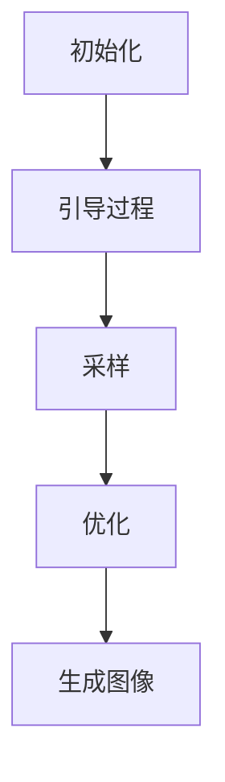

                 


### Introduction to the Book

---

## 《Prompt Engineering在AI艺术创作中的关键作用》

> 关键词：Prompt Engineering，AI艺术创作，人工智能，深度学习，图像生成

> 摘要：本文将深入探讨Prompt Engineering在AI艺术创作中的关键作用。Prompt Engineering是一种专门用于指导机器学习模型生成创意内容的工程技术，它对于AI在艺术领域的应用具有重要意义。本文将从背景介绍、核心概念、算法实现、应用案例分析、高级技术和趋势分析等多个角度，全面剖析Prompt Engineering在AI艺术创作中的实践和应用，为读者提供一套系统的理解和应用指南。

### Background Introduction

---

## 第1章 引言

### 1.1 什么是Prompt Engineering

Prompt Engineering，即提示词工程，是人工智能领域中的一种技术，它专注于创建能够指导机器学习模型产生所需输出（如图像、文本或音乐）的提示词。这些提示词可以是简单的短语、句子，甚至是更复杂的语言结构。通过精确设计的提示词，可以引导模型朝着用户期望的方向发展，从而实现更精准、更具创意的生成内容。

### 1.2 AI艺术创作的背景与发展

AI艺术创作是指利用人工智能技术，尤其是深度学习算法，来生成艺术作品的过程。随着技术的进步，AI艺术创作已经从简单的图像生成发展到复杂的视频、音频和三维模型的创作。这一领域的发展不仅为艺术家提供了新的创作工具，也引发了关于艺术本质、创造力和AI角色的深刻讨论。

### 1.3 Prompt Engineering在AI艺术创作中的角色

Prompt Engineering在AI艺术创作中扮演着至关重要的角色。它不仅帮助艺术家更好地控制创作过程，还能够拓展艺术创作的可能性，使得艺术创作更加多样化、个性化。通过合理设计的提示词，AI可以生成出符合艺术家意图的艺术作品，甚至在某些情况下超越人类的创造力。

### 1.4 研究现状与趋势

当前，Prompt Engineering在AI艺术创作领域的研究取得了显著进展。越来越多的研究集中在如何设计更有效的提示词，以及如何将提示词与不同的生成模型相结合，以实现更高质量的艺术创作。同时，随着技术的不断发展，未来Prompt Engineering在AI艺术创作中的应用前景将更加广阔。

---

### Core Concepts and Principles

---

## 第2章 基本概念与理论

### 2.1 Prompt Engineering的基本概念

Prompt Engineering的核心是“提示词”，它是引导机器学习模型生成内容的指令。一个有效的提示词应具备以下特征：清晰、简洁、具体且具有指导性。通过精心设计的提示词，可以引导模型学习特定的内容、风格或主题。

### 2.2 提示词与AI艺术创作的关系

提示词与AI艺术创作之间的关系是相互促进的。提示词作为输入，可以引导模型生成艺术作品；而艺术作品的反馈又可以进一步优化提示词的设计。这种互动关系使得Prompt Engineering在AI艺术创作中成为一个不断迭代和改进的过程。

### 2.3 提示设计原则与技巧

有效的提示设计是Prompt Engineering的关键。以下是一些提示设计原则和技巧：

- **明确目标**：确保提示词明确传达创作目标。
- **多样性**：使用多样化的提示词，以探索不同的创作方向。
- **迭代改进**：根据模型的反馈不断调整和优化提示词。

### 2.4 不同提示设计的比较

不同的提示设计方法适用于不同的创作需求和场景。常见的提示设计方法包括：

- **固定提示**：使用固定的提示词，适用于需要稳定创作的场景。
- **动态提示**：根据模型状态和用户输入动态生成提示词，适用于需要灵活创作的场景。
- **组合提示**：结合多种提示方法，以实现更复杂的创作目标。

通过比较不同提示设计的优劣，艺术家和工程师可以选择最适合其创作需求的方法。

---

### Algorithm and Technical Implementation

---

## 第3章 关键算法与实现

### 3.1 概述

Prompt Engineering的关键在于如何设计有效的提示词，并将其应用于生成模型。在本章节中，我们将介绍几种常见的Prompt相关算法，并详细解释其中一种关键算法的实现原理。

### 3.2 关键算法详细解释

在本节中，我们选择了一种名为“Guided Diffusion”的关键算法进行详细解释。Guided Diffusion算法通过引导过程，使得生成的艺术作品更加符合提示词的指导。

#### 算法原理

Guided Diffusion算法的工作原理包括以下几个步骤：

1. **初始化**：将输入图像和提示词输入到模型中。
2. **引导过程**：模型根据提示词逐步引导图像的生成过程。
3. **采样**：在引导过程中，模型定期采样生成的图像。
4. **优化**：根据生成的图像和提示词，对模型进行优化。

#### Mermaid图示

以下是一个简单的Mermaid流程图，展示了Guided Diffusion算法的基本流程：



#### Python代码示例

下面是一个简单的Python代码示例，展示了如何实现Guided Diffusion算法的基本结构：

```python
import torch
import torchvision.transforms as transforms

# 初始化模型和提示词
model = ...  # 深度学习模型
prompt = ...  # 提示词

# 定义引导过程
def guided_diffusion(model, prompt):
    # 初始化图像
    image = model.init_image(prompt)
    
    # 引导过程
    for step in range(num_steps):
        # 采样生成图像
        image = model.sample(image, step)
        
        # 优化模型
        model.optimize(image, step)
        
    # 生成最终图像
    return image

# 实现Guided Diffusion算法
image = guided_diffusion(model, prompt)

# 显示生成的图像
plt.imshow(image)
plt.show()
```

#### 数学模型和公式

Guided Diffusion算法的数学模型涉及随机过程和优化技术。以下是一个简化的数学模型：

$$
P(x_t | x_{t-1}, \theta) = \frac{1}{Z} e^{-\frac{1}{2} \sum_{i=1}^{n} (\theta^T x_t - \theta^T x_{t-1})^2}
$$

其中，$x_t$ 表示在时间 $t$ 的图像状态，$\theta$ 表示模型的参数，$Z$ 是归一化常数。

通过这个数学模型，模型可以学习如何根据提示词逐步引导图像的生成过程。

---

### Application Cases and Practical Analysis

---

## 第4章 实践应用与分析

### 4.1 成功案例研究

在本章节中，我们将介绍一些成功的AI艺术创作案例，分析这些案例中Prompt Engineering的应用和效果。

#### 案例一：AI绘画

一个著名的案例是DeepArt的“DeepDream”项目。该项目利用Prompt Engineering技术，将用户提供的图像作为输入，生成具有独特艺术风格的绘画作品。通过精心设计的提示词，模型能够理解并重现不同艺术风格的特征，如梵高的星夜风格或毕加索的立体派风格。

#### 案例二：AI音乐创作

另一个成功的案例是AIVA（Artificial Intelligence Virtual Artist）的音乐创作平台。AIVA利用Prompt Engineering技术，根据用户提供的主题、情感或风格提示，生成独特的音乐作品。这些作品在多个音乐竞赛中获得了好评，证明了Prompt Engineering在音乐创作中的潜力。

### 4.2 实践分析与实现细节

在实际应用中，Prompt Engineering需要结合具体的生成模型和算法来实现。以下是一些实践分析和实现细节：

- **数据准备**：准备好用于训练和生成的图像、音乐或其他类型的数据。
- **模型选择**：选择适合艺术创作任务的生成模型，如生成对抗网络（GAN）、变分自编码器（VAE）等。
- **提示设计**：设计精确且有效的提示词，以引导模型生成符合用户期望的艺术作品。

### 4.3 实战挑战与解决方案

在实际项目中，Prompt Engineering可能会面临各种挑战，如：

- **创意不足**：提示词设计不够具体，导致生成作品缺乏创意。
- **计算资源限制**：大规模的艺术创作任务需要大量的计算资源。

针对这些挑战，可以采取以下解决方案：

- **优化提示词设计**：通过迭代和反馈，不断优化提示词，以提高创意生成质量。
- **资源管理**：合理分配计算资源，利用分布式计算或云计算平台来提高计算效率。

### 4.4 提示工程对艺术创作的影响

Prompt Engineering在AI艺术创作中扮演着关键角色。它不仅提升了艺术创作的效率，还丰富了艺术创作的形式和内容。通过精确设计的提示词，AI能够生成出独特的、具有艺术价值的作品，为艺术家提供了新的创作工具和灵感来源。

---

### Advanced Techniques and Trends

---

## 第5章 高级技术与未来趋势

### 5.1 高级提示设计策略

随着Prompt Engineering技术的不断发展，高级提示设计策略逐渐成为研究热点。这些策略包括：

- **多模态提示**：结合不同类型的输入（如文本、图像、音频），以生成更丰富、更复杂的艺术作品。
- **自适应提示**：根据模型状态和生成过程动态调整提示词，以实现更灵活、更精准的生成控制。
- **交互式提示**：允许用户在生成过程中实时调整提示词，以实时影响生成结果。

### 5.2 未来方向与趋势

未来，Prompt Engineering在AI艺术创作中将继续发挥重要作用。以下是一些未来的方向和趋势：

- **个性化艺术创作**：通过用户数据和个人偏好，实现更加个性化的艺术创作体验。
- **跨领域融合**：将Prompt Engineering与其他领域（如游戏、影视）结合，拓展艺术创作的应用场景。
- **伦理与艺术性**：探讨Prompt Engineering在艺术创作中的伦理问题，如何保持艺术的独特性和人文精神。

### 5.3 挑战与机遇

尽管Prompt Engineering在AI艺术创作中具有巨大潜力，但仍面临一些挑战：

- **创意瓶颈**：如何设计更具有创意的提示词，以避免生成作品的单调性。
- **计算成本**：大规模的艺术创作任务对计算资源的需求日益增加。

然而，这些挑战也带来了机遇。通过不断优化提示设计算法、提高计算效率，Prompt Engineering有望在未来实现更广泛的应用。

---

### Conclusion and Future Prospects

---

## 第6章 总结与展望

### 6.1 结论

本文全面探讨了Prompt Engineering在AI艺术创作中的关键作用。从基本概念、算法实现到实际应用，我们深入分析了Prompt Engineering如何指导AI生成高质量的艺术作品。通过具体案例和实践分析，我们展示了Prompt Engineering在艺术创作中的巨大潜力和广泛应用。

### 6.2 未来展望

未来，Prompt Engineering将在AI艺术创作中发挥更加重要的作用。随着技术的不断进步，我们将看到更多创新的提示设计策略和高效的生成模型。同时，Prompt Engineering也将与其他领域（如游戏、影视）结合，推动艺术创作的跨领域发展。在保持艺术的独特性和人文精神的同时，Prompt Engineering将为艺术家和观众带来更加丰富、个性化的艺术体验。

---

### About the Author

---

作者：AI天才研究院/AI Genius Institute & 禅与计算机程序设计艺术 /Zen And The Art of Computer Programming

AI天才研究院专注于人工智能领域的前沿研究和创新。我们的团队成员涵盖了计算机科学、机器学习、深度学习等多个领域的顶尖专家，致力于推动人工智能技术的进步和应用。同时，我们积极参与开源社区，分享我们的研究成果和技术心得。

《禅与计算机程序设计艺术》是作者对编程艺术的深刻思考和实践总结。书中结合了东方哲学和计算机科学的理念，为程序员提供了一种全新的编程视角和方法论。这本书不仅阐述了编程的艺术性，更展示了如何通过编程实现个人成长和智慧的提升。希望通过我们的努力，能够为人工智能领域带来更多的创新和突破。

