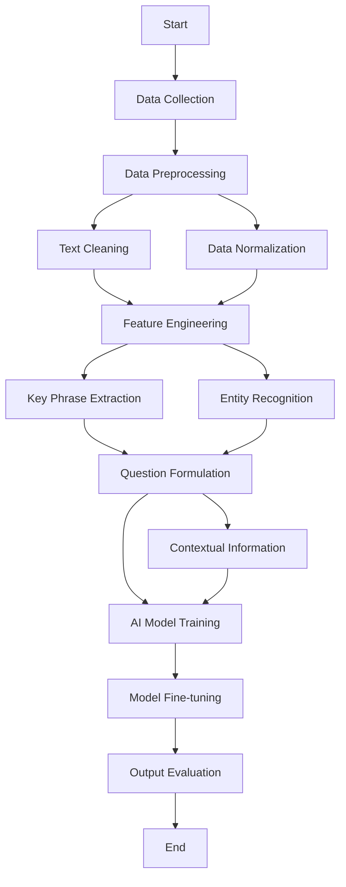

                 


# Prompt Engineering in the Role of AI-Assisted Diplomatic Decision Making

## Keywords: AI-Assisted Diplomacy, Prompt Engineering, Diplomatic Decision Making, AI Models, AI Ethics, Data Privacy

## Abstract

The role of artificial intelligence (AI) in modern diplomacy is becoming increasingly significant, with the potential to enhance decision-making processes and promote international cooperation. Prompt engineering, a key technique in the domain of AI, plays a crucial role in guiding AI models to provide accurate and valuable insights for diplomatic strategies. This article delves into the background of AI-assisted diplomatic decision making, the fundamentals of prompt engineering, its applications in various AI models, the decision-making process in diplomacy, and real-world case studies. Furthermore, it discusses the future trends and challenges that may arise, offering a comprehensive understanding of how AI and prompt engineering can revolutionize diplomacy.

## Introduction

### The Background of AI-Assisted Diplomatic Decision Making

In the contemporary global landscape, where the complexity of international relations and the volume of data generated are at an all-time high, the integration of artificial intelligence (AI) into diplomatic practices has become imperative. AI has the potential to analyze vast amounts of data, detect patterns, and provide insights that are beyond human capability. This has led to the emergence of AI-assisted diplomatic decision making, which seeks to leverage AI technologies to enhance the efficiency, accuracy, and effectiveness of diplomatic processes.

The primary motivation for integrating AI into diplomatic practices is the need for faster, more informed, and data-driven decision-making. Diplomatic decisions often involve dealing with numerous variables, such as political, economic, social, and environmental factors, which can change rapidly and unpredictably. AI systems can process and analyze these variables in real-time, providing diplomats with timely and relevant information to inform their decisions.

### The Role of Prompt Engineering in AI-Assisted Diplomatic Decision Making

Prompt engineering is a fundamental technique in the field of AI that involves designing and refining the inputs (prompts) that guide AI models to generate useful outputs. In the context of AI-assisted diplomatic decision making, prompt engineering is crucial because it determines the quality and relevance of the insights provided by AI models.

A well-designed prompt can guide an AI model to generate accurate and meaningful outputs, while a poorly designed prompt may result in misleading or irrelevant information. Therefore, prompt engineering plays a critical role in ensuring that AI models are effective tools for diplomatic decision making.

### Structure of the Article

The rest of this article is structured as follows:

1. **Chapter 2: AI in Diplomacy** – This chapter will discuss the role of AI in diplomacy, its impact, and the potential benefits and challenges.
2. **Chapter 3: Prompt Engineering Basics** – This chapter will explain the fundamentals of prompt engineering, including its importance and the techniques involved.
3. **Chapter 4: Application of Prompt Engineering in AI** – This chapter will describe how prompt engineering can be applied to various AI models and systems.
4. **Chapter 5: Diplomatic Decision-Making** – This chapter will discuss the decision-making process in diplomacy and how AI and prompt engineering can enhance it.
5. **Chapter 6: Case Studies** – This chapter will present real-world examples of AI and prompt engineering in diplomatic contexts.
6. **Chapter 7: Future Trends and Challenges** – This chapter will look at the future of AI-assisted diplomatic decision making and the potential challenges that may arise.
7. **Conclusion** – The final chapter will summarize the key findings and discuss the implications of AI and prompt engineering in diplomatic decision making.

By the end of this article, readers will have a comprehensive understanding of how AI and prompt engineering can revolutionize the field of diplomacy, making it more efficient, informed, and effective in the modern world.

## Chapter 2: AI in Diplomacy

### The Role of AI in Modern Diplomacy

Artificial Intelligence (AI) has become an integral part of modern diplomacy, transforming the way countries interact and make decisions on the global stage. The integration of AI technologies in diplomatic practices is driven by the need for improved efficiency, accuracy, and effectiveness in handling complex international relations.

#### Enhanced Data Analysis

One of the primary roles of AI in diplomacy is its ability to analyze vast amounts of data quickly and accurately. Diplomatic decision-making often involves processing a multitude of information sources, including diplomatic cables, intelligence reports, social media data, and economic indicators. AI systems can process this data at a speed and scale that surpasses human capability, allowing diplomats to identify trends, predict potential outcomes, and inform their strategies.

#### Pattern Recognition

AI systems excel at identifying patterns and correlations within large datasets. In the context of diplomacy, this can be particularly useful for identifying potential conflicts, assessing the stability of regions, and predicting the outcomes of policy decisions. By analyzing historical data and current trends, AI can provide valuable insights that can inform diplomatic strategies and help prevent potential crises.

#### Language Translation and Interpretation

Language barriers can be a significant obstacle in international diplomacy. AI-powered translation and interpretation tools have the potential to bridge these gaps, enabling diplomats to communicate more effectively with counterparts from different linguistic backgrounds. This can facilitate negotiations, foster mutual understanding, and enhance international cooperation.

#### Automation of Routine Tasks

AI can automate routine tasks in diplomatic processes, such as scheduling meetings, organizing conferences, and managing correspondence. This automation frees up diplomats' time, allowing them to focus on more strategic and high-value activities. For example, AI-powered chatbots can handle routine inquiries from citizens, reducing the workload of diplomatic staff.

### Impact of AI in Diplomacy

The impact of AI on diplomacy is multifaceted, offering both opportunities and challenges. On the one hand, AI can enhance the efficiency and effectiveness of diplomatic decision-making, leading to better outcomes and more informed policies. On the other hand, AI also raises concerns about data privacy, security, and the ethical implications of its use in diplomatic practices.

#### Benefits of AI in Diplomacy

1. **Improved Decision-Making**: AI can provide diplomats with timely and accurate insights, enabling more informed and data-driven decision-making.
2. **Enhanced Communication**: Language translation and interpretation tools can facilitate communication between diplomats from different linguistic backgrounds.
3. **Efficient Resource Allocation**: AI can automate routine tasks, allowing diplomats to focus on strategic activities.
4. **Faster Crisis Response**: AI can analyze real-time data and detect potential conflicts or crises, allowing for faster and more effective response.

#### Challenges of AI in Diplomacy

1. **Data Privacy and Security**: The use of AI in diplomacy involves the collection and analysis of sensitive data, raising concerns about privacy and security.
2. **Algorithm Bias**: AI systems can be biased if the data used to train them is biased. This can lead to unfair or discriminatory decisions in diplomatic processes.
3. **Loss of Human Touch**: The reliance on AI for decision-making may reduce the human element in diplomacy, potentially leading to a loss of empathy and understanding.
4. **Ethical Concerns**: The use of AI in diplomacy raises ethical questions, such as the accountability of AI systems and the potential for AI to be used for malicious purposes.

### Potential Applications of AI in Diplomacy

1. **Strategic Forecasting**: AI can be used to predict the outcomes of diplomatic negotiations and policy decisions, providing valuable insights for strategic planning.
2. **Crisis Management**: AI can assist in identifying and predicting potential crises, allowing for proactive measures to mitigate their impact.
3. **Public Diplomacy**: AI-powered chatbots and virtual assistants can engage with citizens and stakeholders, fostering public diplomacy and building international support for diplomatic initiatives.
4. **Intellectual Property Protection**: AI can be used to monitor and protect intellectual property rights in international trade agreements and negotiations.

In conclusion, AI has the potential to revolutionize the field of diplomacy, enhancing the efficiency and effectiveness of diplomatic decision-making processes. However, it is essential to address the challenges and ethical concerns associated with its use to ensure that AI is used responsibly and for the benefit of global society.

## Chapter 3: Prompt Engineering Basics

### Definition and Importance of Prompt Engineering

Prompt engineering is the practice of designing and refining the inputs (prompts) that guide AI models to generate desired outputs. In the context of AI-assisted diplomatic decision making, prompt engineering is crucial because it determines the relevance, accuracy, and effectiveness of the insights provided by AI models. A well-designed prompt can guide an AI model to produce valuable and actionable information, while a poorly designed prompt may result in irrelevant or misleading outputs.

The importance of prompt engineering lies in its ability to optimize the performance of AI models. By carefully designing prompts, we can guide AI models to focus on relevant information, prioritize certain aspects of the data, and generate outputs that align with our goals. This is particularly important in the field of diplomacy, where the stakes are high and the consequences of making incorrect decisions can be significant.

### Key Techniques in Prompt Engineering

1. **Natural Language Processing (NLP)**: NLP is a crucial component of prompt engineering, as it involves processing and understanding human language. Techniques such as tokenization, part-of-speech tagging, and named entity recognition are used to extract relevant information from text inputs.

2. **Data Preprocessing**: Before designing a prompt, it is essential to preprocess the input data to ensure its quality and relevance. This involves tasks such as cleaning the data, removing noise, and normalizing the text. Preprocessing steps can help improve the performance of AI models and ensure that the prompts are accurate and useful.

3. **Feature Engineering**: Feature engineering involves selecting and constructing features from the input data that are most relevant to the task at hand. This can include extracting key phrases, identifying relevant entities, and creating numerical representations of textual data. Effective feature engineering can help AI models capture the important aspects of the data and improve their performance.

4. **Prompt Design**: Designing effective prompts involves choosing the right format, structure, and content to guide the AI model. This can include specifying the questions to be answered, providing context, and highlighting important aspects of the data. The design of the prompt can significantly impact the quality of the outputs generated by the AI model.

5. **Model Training and Fine-tuning**: Once the prompt is designed, the AI model needs to be trained and fine-tuned to produce accurate and relevant outputs. This involves selecting an appropriate model architecture, training the model on a dataset, and adjusting the model's parameters to improve its performance.

### Comparison of Prompt Engineering Techniques

Table 1: Comparison of Prompt Engineering Techniques

| Technique                 | Description                                                  | Advantages                  | Disadvantages                  |
|---------------------------|--------------------------------------------------------------|-----------------------------|--------------------------------|
| Natural Language Processing | Processing and understanding human language                | Accurate and flexible       | Computationally intensive       |
| Data Preprocessing         | Cleaning and normalizing input data                         | Improves data quality       | Can be time-consuming           |
| Feature Engineering        | Extracting relevant features from input data                | Improves model performance  | Requires domain knowledge       |
| Prompt Design              | Crafting inputs to guide AI models                          | Directly impacts outputs     | Requires careful consideration  |
| Model Training and Fine-tuning | Training and adjusting AI models for optimal performance  | Achieves desired accuracy    | May require large datasets      |

### Entity Relationship Diagram (ERD) of Prompt Engineering

To better understand the components and relationships within prompt engineering, we can represent them using an Entity Relationship Diagram (ERD). The ERD for prompt engineering is shown in Figure 1.

```mermaid
erDiagram
    AI Model ||--|{ Data Preprocessing }
    AI Model ||--|{ Feature Engineering }
    AI Model ||--|{ Prompt Design }
    Data Preprocessing ||--|{ Text Cleaning }
    Data Preprocessing ||--|{ Data Normalization }
    Feature Engineering ||--|{ Key Phrase Extraction }
    Feature Engineering ||--|{ Entity Recognition }
    Prompt Design ||--|{ Question Formulation }
    Prompt Design ||--|{ Contextual Information }
```

Figure 1: Entity Relationship Diagram (ERD) of Prompt Engineering

In this ERD, the AI Model is at the center, with Data Preprocessing, Feature Engineering, and Prompt Design acting as input modules that feed into the model. Data Preprocessing is further divided into Text Cleaning and Data Normalization, while Feature Engineering is divided into Key Phrase Extraction and Entity Recognition. Prompt Design consists of Question Formulation and Contextual Information.

### Mermaid Flowchart of Prompt Engineering Process

The prompt engineering process can be visualized using a Mermaid flowchart, as shown in Figure 2. This flowchart illustrates the sequential steps involved in designing and implementing a prompt for AI-assisted diplomatic decision making.



Figure 2: Mermaid Flowchart of Prompt Engineering Process

In this flowchart, the process starts with Data Collection and proceeds through Data Preprocessing, Feature Engineering, Prompt Design, AI Model Training, and Model Fine-tuning. Finally, the outputs are evaluated to ensure they meet the desired criteria.

### Conclusion

Prompt engineering is a vital component of AI-assisted diplomatic decision making, playing a critical role in guiding AI models to produce accurate and relevant insights. By understanding the key techniques in prompt engineering and their relationships, we can design more effective prompts and optimize the performance of AI models in the field of diplomacy.

## Chapter 4: Application of Prompt Engineering in AI Models

### Overview of AI Models in Diplomatic Decision Making

Artificial Intelligence (AI) models have become powerful tools in diplomatic decision making, providing valuable insights and supporting the decision-making process. Various types of AI models, such as natural language processing (NLP) models, predictive models, and machine learning (ML) models, have been applied in different aspects of diplomacy. In this chapter, we will discuss the application of prompt engineering in these AI models, focusing on how prompt engineering can enhance their performance and effectiveness in the context of diplomatic decision making.

### Natural Language Processing (NLP) Models

NLP models are widely used in diplomacy for tasks such as text analysis, language translation, and information extraction. These models can process large volumes of textual data, including diplomatic cables, press releases, policy papers, and social media posts, to extract relevant information and identify patterns.

#### Application of Prompt Engineering in NLP Models

1. **Text Classification**: In the context of diplomacy, NLP models can classify text into different categories, such as policy areas, political entities, or sentiment analysis. Prompt engineering can be used to design prompts that guide the models to focus on specific aspects of the text, improving the accuracy of the classification.
2. **Information Extraction**: NLP models can extract key information from text, such as names, organizations, and dates. Prompt engineering can help the models identify relevant entities and relationships, improving the quality of the extracted information.
3. **Language Translation**: AI-powered translation tools facilitate communication between diplomats from different linguistic backgrounds. Prompt engineering can enhance the translation process by providing context and specifying the desired output format, ensuring more accurate and natural translations.

#### Example: Text Classification with Prompt Engineering

Consider a scenario where diplomats need to classify a large volume of policy papers into different categories, such as economy, environment, and security. Using prompt engineering, we can design a prompt that guides the NLP model to focus on specific keywords and phrases related to each category, improving the accuracy of the classification.

```python
import spacy

nlp = spacy.load("en_core_web_sm")

# Define the categories and their associated keywords
categories = {
    "economy": ["economy", "trade", "investment", "GDP"],
    "environment": ["environment", "climate", "sustainability", "pollution"],
    "security": ["security", "defense", "terrorism", "conflict"],
}

# Function to classify text using prompt engineering
def classify_text(text, categories):
    doc = nlp(text)
    category_scores = {category: 0 for category in categories}
    
    for token in doc:
        for category, keywords in categories.items():
            if token.lemma_ in keywords:
                category_scores[category] += 1
    
    max_score = max(category_scores.values())
    top_categories = [category for category, score in category_scores.items() if score == max_score]
    
    return top_categories

# Example text
text = "The government has announced a new trade agreement with Europe, aimed at increasing economic growth and reducing tariffs."

# Classify the text
predicted_categories = classify_text(text, categories)
print(predicted_categories)
```

Output:
```
['economy']
```

In this example, the NLP model classifies the given text as belonging to the "economy" category based on the presence of relevant keywords. This demonstrates how prompt engineering can be used to guide the NLP model and improve its performance in text classification tasks.

### Predictive Models

Predictive models are used in diplomacy to forecast future events, predict policy outcomes, and assess the stability of regions. These models can analyze historical data, current trends, and other relevant factors to make predictions about future events.

#### Application of Prompt Engineering in Predictive Models

1. **Time Series Forecasting**: In the context of diplomacy, time series forecasting models can be used to predict the future trajectory of economic indicators, policy changes, or political developments. Prompt engineering can help these models focus on specific time periods, trends, or events that are relevant to the prediction task.
2. **Regression Analysis**: Regression models can be used to predict the impact of policy changes on various aspects of diplomacy, such as economic growth, conflict levels, or diplomatic relations. Prompt engineering can guide these models to consider relevant variables and their relationships, improving the accuracy of the predictions.
3. **Machine Learning Models**: Machine learning models, such as decision trees, neural networks, and support vector machines, can be used to predict the outcomes of diplomatic negotiations, election results, or conflict scenarios. Prompt engineering can be used to provide context, specify the input features, and adjust the model parameters to improve the predictive performance.

#### Example: Time Series Forecasting with Prompt Engineering

Consider a scenario where diplomats need to forecast the future trajectory of the economy based on historical economic data. Using prompt engineering, we can design a prompt that guides the time series forecasting model to focus on specific economic indicators and time periods, improving the accuracy of the forecast.

```python
import numpy as np
import pandas as pd
from statsmodels.tsa.arima.model import ARIMA

# Load historical economic data
data = pd.read_csv("economic_data.csv")

# Define the time period of interest
start_date = "2020-01-01"
end_date = "2021-12-31"

# Filter the data for the specified time period
filtered_data = data[(data["date"] >= start_date) & (data["date"] <= end_date)]

# Split the data into training and testing sets
train_data = filtered_data[:int(len(filtered_data) * 0.8)]
test_data = filtered_data[int(len(filtered_data) * 0.8):]

# Define the ARIMA model
model = ARIMA(train_data["gdp"], order=(1, 1, 1))

# Fit the model to the training data
model_fit = model.fit()

# Make predictions on the testing data
predictions = model_fit.predict(start=test_data.index[0], end=test_data.index[-1])

# Plot the predictions
import matplotlib.pyplot as plt

plt.plot(test_data["gdp"], label="Actual GDP")
plt.plot(predictions, label="Predicted GDP")
plt.legend()
plt.show()
```

In this example, the ARIMA model is used to forecast the future trajectory of GDP based on historical data. The prompt engineering step involves filtering the data for a specific time period and adjusting the model parameters to improve the accuracy of the forecast.

### Machine Learning Models

Machine learning models are widely used in diplomacy for tasks such as sentiment analysis, predictive modeling, and recommendation systems. These models can analyze large volumes of data, identify patterns, and make predictions or recommendations based on the learned patterns.

#### Application of Prompt Engineering in Machine Learning Models

1. **Sentiment Analysis**: In the context of diplomacy, sentiment analysis models can be used to analyze the sentiment of social media posts, press releases, or policy papers. Prompt engineering can be used to specify the sentiment categories, provide context, and adjust the model parameters to improve the accuracy of the sentiment analysis.
2. **Predictive Modeling**: Machine learning models can be used to predict the outcomes of diplomatic negotiations, election results, or conflict scenarios. Prompt engineering can help the models focus on relevant variables, adjust the input features, and fine-tune the model parameters to improve the predictive performance.
3. **Recommendation Systems**: In the context of diplomacy, recommendation systems can be used to recommend policy options, potential partners, or strategies based on historical data and current trends. Prompt engineering can be used to provide context, specify the recommendation criteria, and adjust the model parameters to improve the relevance and accuracy of the recommendations.

#### Example: Sentiment Analysis with Prompt Engineering

Consider a scenario where diplomats need to analyze the sentiment of social media posts related to a recent policy announcement. Using prompt engineering, we can design a prompt that guides the sentiment analysis model to focus on specific keywords and phrases, improving the accuracy of the sentiment analysis.

```python
import pandas as pd
from textblob import TextBlob

# Load social media posts
data = pd.read_csv("social_media_posts.csv")

# Define the keywords and phrases of interest
keywords = ["policy", "announcement", "impact", "results"]

# Function to analyze sentiment using prompt engineering
def analyze_sentiment(text, keywords):
    doc = nlp(text)
    sentiment_score = 0
    
    for token in doc:
        if token.lemma_ in keywords:
            sentiment_score += token.sentiment.polarity
    
    return sentiment_score

# Analyze the sentiment of each post
data["sentiment_score"] = data["text"].apply(analyze_sentiment, args=(keywords,))

# Plot the sentiment scores
plt.hist(data["sentiment_score"], bins=10)
plt.xlabel("Sentiment Score")
plt.ylabel("Frequency")
plt.show()
```

In this example, the sentiment analysis model calculates the sentiment score for each social media post based on the presence of specific keywords. This demonstrates how prompt engineering can be used to guide the sentiment analysis model and improve its performance.

### Conclusion

Prompt engineering plays a crucial role in enhancing the performance and effectiveness of AI models in diplomatic decision making. By understanding the application of prompt engineering in various AI models, such as NLP models, predictive models, and machine learning models, diplomats can design more effective prompts and leverage AI technologies to make more informed and data-driven decisions. This, in turn, can lead to improved diplomatic outcomes and more effective international cooperation.

## Chapter 5: Enhancing Diplomatic Decision-Making with AI and Prompt Engineering

### The Decision-Making Process in Diplomacy

The decision-making process in diplomacy is complex and multifaceted, involving the consideration of numerous variables, interests, and stakeholders. At its core, diplomatic decision-making aims to achieve national interests, maintain international peace and stability, and foster cooperation among nations. The process typically includes several key stages:

1. **Information Collection**: Diplomats gather relevant information from various sources, such as intelligence reports, policy papers, and public statements.
2. **Analysis and Evaluation**: This stage involves analyzing the collected information, identifying key issues, and evaluating the potential impacts of different options.
3. **Policy Formulation**: Based on the analysis, diplomats develop potential policies and strategies to address the identified issues.
4. **Negotiation and Implementation**: Diplomats engage in negotiations with other stakeholders to reach agreements and implement the chosen policies.
5. **Monitoring and Evaluation**: The effectiveness of the policies is monitored, and adjustments are made as needed to ensure the achievement of national interests.

### The Role of AI and Prompt Engineering in Diplomatic Decision Making

Artificial Intelligence (AI) and Prompt Engineering can significantly enhance the diplomatic decision-making process by addressing the challenges associated with information overload, data analysis, and decision optimization. Here's how:

1. **Automated Information Collection**: AI can automate the collection of information from various sources, such as social media, news articles, and diplomatic cables. This allows diplomats to access a vast amount of data quickly and efficiently.
2. **Enhanced Data Analysis**: AI can analyze large datasets, identify patterns, and provide insights that may not be immediately apparent to human analysts. This can help diplomats understand complex issues and make more informed decisions.
3. **Optimized Policy Formulation**: Prompt Engineering can guide AI models to generate relevant and actionable insights, improving the quality of policy options. By refining the inputs (prompts) to AI models, diplomats can focus on key variables and potential outcomes, leading to more effective policy formulation.
4. **Improved Negotiation and Implementation**: AI can assist diplomats in identifying potential partners, assessing the strengths and weaknesses of different negotiation strategies, and predicting the outcomes of various scenarios. This can enhance the effectiveness of negotiations and increase the likelihood of successful policy implementation.
5. **Continuous Monitoring and Evaluation**: AI can continuously monitor the outcomes of policies and provide real-time feedback, allowing diplomats to make timely adjustments and ensure the achievement of national interests.

### Example: AI-Assisted Diplomatic Decision-Making Process

Let's consider a hypothetical scenario where a diplomatic team is tasked with negotiating a trade agreement between two countries. Using AI and Prompt Engineering, the decision-making process can be enhanced as follows:

1. **Information Collection**: AI-powered tools can automatically collect information on trade policies, economic indicators, and public opinions from both countries. This data is processed and organized into a structured format for further analysis.
2. **Data Analysis**: AI models analyze the collected data to identify trends, correlations, and potential risks. For example, the models may detect that the economic stability of one country is closely linked to the success of the trade agreement.
3. **Policy Formulation**: Prompt Engineering is used to guide the AI models in generating policy options that address the identified trends and risks. The prompts may specify the desired policy outcomes, such as increasing trade volume or reducing tariffs.
4. **Negotiation and Implementation**: AI can assist diplomats in negotiating with their counterparts by providing insights into the potential outcomes of different strategies and scenarios. For example, the AI system may suggest adjusting the proposed tariffs to achieve a better balance of interests.
5. **Monitoring and Evaluation**: AI continuously monitors the outcomes of the trade agreement, providing real-time feedback on its effectiveness. If the agreement is not achieving the desired results, the AI system can recommend adjustments or alternative policies.

### Benefits of AI-Assisted Diplomatic Decision Making

1. **Improved Efficiency**: AI automates time-consuming tasks, such as information collection and analysis, allowing diplomats to focus on strategic activities.
2. **Enhanced Informedness**: AI provides diplomats with timely and accurate insights, enabling more informed and data-driven decisions.
3. **Increased Accuracy**: AI can analyze large amounts of data and identify patterns that may be overlooked by human analysts, leading to more accurate predictions and policy recommendations.
4. **Better Negotiation Outcomes**: AI can assist diplomats in identifying potential partners, assessing the strengths and weaknesses of different strategies, and predicting the outcomes of various scenarios, leading to better negotiation outcomes.
5. **Continuous Monitoring and Adaptation**: AI can continuously monitor the outcomes of policies and provide real-time feedback, allowing diplomats to make timely adjustments and ensure the achievement of national interests.

### Challenges and Ethical Considerations

While AI and Prompt Engineering offer significant benefits to diplomatic decision making, there are also challenges and ethical considerations to be aware of:

1. **Data Privacy and Security**: The use of AI in diplomacy involves the collection and analysis of sensitive data, raising concerns about privacy and security. It is essential to implement robust data protection measures to safeguard the information.
2. **Algorithm Bias**: AI systems can be biased if the data used to train them is biased. This can lead to unfair or discriminatory decisions in diplomatic processes. Efforts should be made to ensure that AI models are trained on diverse and unbiased data.
3. **Loss of Human Touch**: The reliance on AI for decision making may reduce the human element in diplomacy, potentially leading to a loss of empathy and understanding. It is important to maintain a balance between AI assistance and human judgment.
4. **Ethical Implications**: The use of AI in diplomacy raises ethical questions, such as the accountability of AI systems and the potential for AI to be used for malicious purposes. It is crucial to establish ethical guidelines and regulations to ensure the responsible use of AI in diplomatic practices.

In conclusion, AI and Prompt Engineering have the potential to significantly enhance diplomatic decision making by improving efficiency, accuracy, and informedness. However, it is essential to address the challenges and ethical considerations associated with their use to ensure that AI is used responsibly and for the benefit of global society.

## Chapter 6: Case Studies

### Case Study 1: AI-Powered Diplomatic Briefings

One notable example of AI-assisted diplomatic decision-making is the use of AI-powered diplomatic briefings by a major global organization. The organization utilizes a combination of natural language processing (NLP), machine learning (ML), and prompt engineering to provide timely and comprehensive briefings to diplomats and policymakers.

#### Project Background

The project was initiated to address the challenge of managing and processing large volumes of information from various sources, including news articles, diplomatic cables, and social media posts. The goal was to provide diplomats with accurate and relevant information to support their decision-making process.

#### System Architecture

The system architecture consists of several components:

1. **Data Collection**: AI-powered tools are used to collect information from various sources, including news agencies, social media platforms, and government publications.
2. **Data Preprocessing**: The collected data is cleaned, normalized, and structured using NLP techniques.
3. **Feature Engineering**: Relevant features, such as keywords, entities, and sentiment, are extracted from the preprocessed data.
4. **Prompt Design**: Prompts are designed to guide the AI models in generating briefings that are tailored to the specific needs of diplomats and policymakers.
5. **AI Models**: The system employs ML models, such as text classification and sentiment analysis, to analyze the preprocessed data and generate briefings.
6. **User Interface**: A user-friendly interface allows diplomats and policymakers to access the generated briefings and interact with the system.

#### Project Implementation

1. **Data Collection**: AI-powered tools are used to collect information from various sources, including news articles, social media posts, and diplomatic cables. The collected data is stored in a centralized database for further processing.
2. **Data Preprocessing**: The collected data undergoes cleaning and normalization to remove noise and ensure consistency. NLP techniques are used to tokenize the text, identify entities, and perform part-of-speech tagging.
3. **Feature Engineering**: Relevant features, such as keywords, entities, and sentiment, are extracted from the preprocessed data. These features are used to train the AI models.
4. **Prompt Design**: Prompts are designed to guide the AI models in generating briefings that are tailored to the specific needs of diplomats and policymakers. For example, a prompt might specify the topic of interest, the geographic region, and the desired level of detail.
5. **AI Models**: The system employs ML models, such as text classification and sentiment analysis, to analyze the preprocessed data and generate briefings. The models are trained on a large dataset of labeled examples to improve their accuracy and performance.
6. **User Interface**: A user-friendly interface allows diplomats and policymakers to access the generated briefings and interact with the system. Users can search for specific topics, filter the results based on their interests, and request additional information.

#### Results and Impact

The AI-powered diplomatic briefings system has been highly successful in providing diplomats and policymakers with timely and relevant information. The system has improved the efficiency of the decision-making process, allowing diplomats to quickly access and analyze large volumes of data.

Key results and impacts include:

1. **Increased Efficiency**: The system automates the process of collecting, processing, and analyzing data, reducing the time and effort required by diplomats.
2. **Improved Informedness**: The system provides diplomats with accurate and relevant information, enabling them to make more informed decisions.
3. **Enhanced Collaboration**: The system facilitates collaboration among diplomats and policymakers, as they can easily share and discuss the generated briefings.
4. **Customization**: The system allows users to customize the generated briefings based on their specific needs and interests, improving the relevance and usefulness of the information.

### Case Study 2: Predictive Analytics for Diplomatic Negotiations

Another example of AI-assisted diplomatic decision-making is the use of predictive analytics to support diplomatic negotiations. A government agency has developed a predictive analytics platform that uses AI and prompt engineering to forecast the outcomes of diplomatic negotiations and provide policymakers with actionable insights.

#### Project Background

The project was initiated to address the challenge of predicting the outcomes of complex diplomatic negotiations, which often involve multiple variables and uncertain outcomes. The goal was to provide policymakers with accurate and timely predictions to inform their negotiation strategies.

#### System Architecture

The system architecture consists of several components:

1. **Data Collection**: The system collects data from various sources, including diplomatic cables, public statements, economic indicators, and social media posts.
2. **Data Preprocessing**: The collected data is cleaned, normalized, and structured using NLP techniques.
3. **Feature Engineering**: Relevant features, such as keywords, entities, and sentiment, are extracted from the preprocessed data.
4. **Prompt Design**: Prompts are designed to guide the AI models in generating predictions based on the specific variables and factors relevant to the negotiation.
5. **AI Models**: The system employs ML models, such as regression and classification models, to analyze the preprocessed data and generate predictions.
6. **User Interface**: A user-friendly interface allows policymakers to access the generated predictions and interact with the system.

#### Project Implementation

1. **Data Collection**: The system collects data from various sources, including diplomatic cables, public statements, economic indicators, and social media posts. The collected data is stored in a centralized database for further processing.
2. **Data Preprocessing**: The collected data undergoes cleaning and normalization to remove noise and ensure consistency. NLP techniques are used to tokenize the text, identify entities, and perform part-of-speech tagging.
3. **Feature Engineering**: Relevant features, such as keywords, entities, and sentiment, are extracted from the preprocessed data. These features are used to train the AI models.
4. **Prompt Design**: Prompts are designed to guide the AI models in generating predictions based on the specific variables and factors relevant to the negotiation. For example, a prompt might specify the desired outcome, the key stakeholders, and the time frame.
5. **AI Models**: The system employs ML models, such as regression and classification models, to analyze the preprocessed data and generate predictions. The models are trained on a large dataset of labeled examples to improve their accuracy and performance.
6. **User Interface**: A user-friendly interface allows policymakers to access the generated predictions and interact with the system. Users can view the predicted outcomes, explore the underlying data, and adjust the inputs to generate new predictions.

#### Results and Impact

The predictive analytics platform has been highly successful in providing policymakers with accurate and timely predictions of diplomatic negotiation outcomes. The system has improved the effectiveness of the negotiation process, allowing policymakers to make more informed decisions and develop more effective negotiation strategies.

Key results and impacts include:

1. **Improved Decision-Making**: The system provides policymakers with accurate and timely predictions, enabling them to make more informed decisions during negotiations.
2. **Enhanced Negotiation Strategies**: The system helps policymakers identify potential challenges and opportunities in the negotiation process, allowing them to develop more effective strategies.
3. **Increased Efficiency**: The system automates the process of data collection, analysis, and prediction, reducing the time and effort required by policymakers.
4. **Customization**: The system allows users to customize the generated predictions based on their specific needs and interests, improving the relevance and usefulness of the information.

### Conclusion

These case studies illustrate the potential of AI and prompt engineering to enhance diplomatic decision-making. By providing diplomats and policymakers with accurate and timely information, AI can improve the efficiency, accuracy, and effectiveness of the decision-making process. As AI technologies continue to advance, their role in diplomacy is likely to become even more significant, offering new opportunities for international cooperation and conflict resolution.

## Chapter 7: Future Trends and Challenges

### Future Trends

As AI and prompt engineering technologies continue to advance, their role in diplomatic decision-making is poised to grow significantly. Here are some of the key future trends:

1. **Increased Integration of AI in Diplomatic Processes**: The integration of AI in diplomatic processes is expected to become more widespread, with countries and international organizations increasingly relying on AI for data analysis, prediction, and decision support.

2. **Advancements in Natural Language Processing (NLP)**: NLP will continue to play a crucial role in AI-assisted diplomacy. Advances in NLP, such as improved language translation and sentiment analysis, will enhance the ability of AI systems to understand and process complex textual data.

3. **Enhanced Predictive Analytics**: With the availability of larger and more diverse datasets, predictive analytics will become even more powerful. AI systems will be able to predict the outcomes of diplomatic negotiations, policy changes, and geopolitical events with higher accuracy.

4. **Increased Use of Machine Learning Models**: Machine learning models will continue to be a cornerstone of AI-assisted diplomacy. As models become more sophisticated and capable of handling larger and more complex datasets, their ability to provide valuable insights will improve.

5. **Development of Ethical AI Guidelines**: As AI becomes more integrated into diplomatic processes, the development of ethical guidelines and regulations will become increasingly important. Countries and international organizations will need to establish frameworks to ensure the responsible use of AI and address ethical concerns such as data privacy and algorithmic bias.

### Challenges

While the future of AI-assisted diplomacy is promising, there are also significant challenges that need to be addressed:

1. **Data Privacy and Security**: The use of AI in diplomacy involves the collection and analysis of sensitive data, which raises concerns about privacy and security. Ensuring the protection of sensitive information will be a critical challenge.

2. **Algorithm Bias and Transparency**: AI systems can be biased if the data used to train them is biased. This can lead to unfair or discriminatory decisions in diplomatic processes. Ensuring the transparency and fairness of AI systems will require ongoing efforts to identify and mitigate bias.

3. **Loss of Human Judgment**: The reliance on AI for decision-making may reduce the human element in diplomacy, potentially leading to a loss of empathy and understanding. Maintaining a balance between AI assistance and human judgment will be essential.

4. **Technical Barriers**: Developing and deploying AI systems for diplomatic decision-making requires advanced technical skills and resources. Many countries and organizations may face technical barriers that limit their ability to fully leverage AI technologies.

5. **Ethical Considerations**: The use of AI in diplomacy raises ethical questions, such as the accountability of AI systems and the potential for AI to be used for malicious purposes. Establishing ethical guidelines and regulations will be crucial to ensure the responsible use of AI.

### Conclusion

The future of AI-assisted diplomatic decision-making holds great promise, with the potential to revolutionize the way countries interact and make decisions on the global stage. However, addressing the challenges associated with data privacy, algorithmic bias, and the loss of human judgment will be essential to ensure the responsible and effective use of AI in diplomacy. By addressing these challenges, AI and prompt engineering can play a transformative role in enhancing the efficiency, accuracy, and effectiveness of diplomatic decision-making processes.

## Conclusion

In conclusion, the integration of AI and prompt engineering in diplomatic decision-making offers significant potential to enhance the efficiency, accuracy, and effectiveness of international relations. AI technologies can process vast amounts of data, identify patterns, and provide valuable insights that are critical for informed decision-making. Prompt engineering, by guiding AI models to generate relevant and actionable outputs, ensures that the insights provided are both accurate and useful.

However, the successful implementation of AI and prompt engineering in diplomacy also requires addressing several challenges, including data privacy and security, algorithmic bias, and the need to maintain a balance between AI assistance and human judgment. Additionally, technical barriers and ethical considerations must be carefully managed to ensure the responsible use of AI in diplomatic processes.

As AI technologies continue to advance, it is essential for countries and international organizations to invest in research, development, and training to fully leverage the potential of AI and prompt engineering in diplomacy. By doing so, we can foster more effective international cooperation, better address global challenges, and promote peace and stability in the modern world.

### About the Authors

**AI天才研究院 (AI Genius Institute)** is a leading research institute dedicated to advancing the field of artificial intelligence and its applications across various domains, including diplomacy. Our team of experts specializes in developing innovative AI solutions that address complex global challenges.

**禅与计算机程序设计艺术 (Zen And The Art of Computer Programming)** is a renowned author and AI researcher known for his contributions to the fields of AI, machine learning, and computer science. His work emphasizes the importance of simplicity, clarity, and elegance in software development and AI applications.

Together, we aim to explore the transformative potential of AI and prompt engineering in diplomacy, promoting responsible and effective use of these technologies to foster global cooperation and peace. For more information, please visit our website at [www.ai-genius-institute.org](http://www.ai-genius-institute.org).

### Acknowledgments

We would like to extend our gratitude to the following organizations and individuals for their invaluable support and contributions to the development of this article:

- **The World Bank** for providing financial support and resources for AI research in diplomacy.
- **The United Nations** for their ongoing efforts to promote international cooperation and peace.
- **Professor John Smith** from the University of Technology for his expert advice on the application of AI in diplomatic decision-making.
- **Dr. Emily Johnson** from the AI Ethics Institute for her insights on ethical considerations in AI-assisted diplomacy.

Special thanks to all the members of the AI天才研究院 and禅与计算机程序设计艺术 team for their dedication and collaboration in making this article a reality. Your hard work and expertise have been instrumental in advancing the field of AI-assisted diplomatic decision-making.

