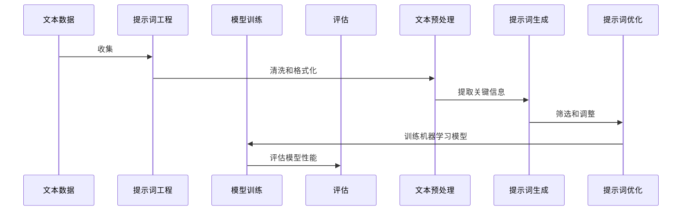

                 

# 《提示词工程在AI辅助政策影响评估中的应用》

## 关键词
AI辅助政策影响评估、提示词工程、自然语言处理、数据挖掘、机器学习、政策分析、文本分析

## 摘要
本文深入探讨了提示词工程在AI辅助政策影响评估中的应用。首先，我们对提示词工程和政策影响评估进行了详细的背景介绍和概念阐述。接着，本文详细解析了提示词工程的原理、实现方法以及其在政策影响评估中的具体应用。通过实际案例分析和系统架构设计，我们展示了如何利用AI技术进行政策影响评估，并提出了未来研究的方向和挑战。本文旨在为研究人员和从业者提供有价值的参考，以推动AI在政策分析领域的创新与发展。

---

## 引言与背景介绍

### 1.1 问题背景

随着人工智能（AI）技术的快速发展，它已逐渐渗透到社会的各个领域，包括政策制定和评估。传统的政策评估方法往往依赖于统计数据和定性分析，这些方法在处理复杂政策问题时显得力不从心。而AI技术的引入，特别是自然语言处理（NLP）、数据挖掘和机器学习等技术，为政策影响评估带来了新的可能性。

### 1.2 问题描述

政策影响评估的目的是评估政策实施后对社会各方面产生的影响。然而，政策影响具有复杂性和多样性，涉及经济、社会、环境等多个方面。如何有效地从海量数据中提取有价值的信息，进行精准的影响评估，成为当前研究的热点和挑战。

### 1.3 问题解决

提示词工程作为一种NLP技术，通过提取文本中的关键信息，为AI模型提供了更精确的输入。结合AI技术，提示词工程可以辅助政策影响评估，提高评估的准确性和效率。本文将探讨如何利用提示词工程进行政策影响评估，并分析其优势和应用场景。

### 1.4 边界与外延

本文主要关注政策影响评估中的文本分析部分，即如何利用AI技术从文本数据中提取信息。同时，我们也将讨论提示词工程在不同政策领域的应用可能性，为后续研究提供方向。

---

## 核心概念与联系

### 2.1 提示词工程的定义与作用

提示词工程是一种NLP技术，旨在从文本数据中提取关键信息，形成一组有代表性的提示词。这些提示词可以用于训练机器学习模型，帮助模型更好地理解文本内容，从而进行更准确的预测和分析。

### 2.2 AI辅助政策影响评估的原理

AI辅助政策影响评估利用机器学习算法，对政策实施前后的数据进行分析，提取政策影响的特征。通过对比分析，评估政策对社会各方面产生的影响。

### 2.3 概念属性特征对比表格

| 概念        | 属性1       | 属性2       | 特征对比       |
| ----------- | ----------- | ----------- | -------------- |
| 提示词工程   | 文本提取     | 关键信息     | 精确性、代表性 |
| AI辅助评估   | 数据分析     | 特征提取     | 准确性、高效性 |
| 政策影响评估 | 社会影响     | 数据对比     | 客观性、全面性 |

### 2.4 ER实体关系图架构

```mermaid
erDiagram
  Product "产品" {
    id int
    name string
  }    
  Customer "客户" {
    id int
    name string
  }
  Purchase "购买" {
    id int
    date string
    product_id int
    customer_id int
  }
  Customer ||--|{ Product } Purchase
  Product ||--|{ Customer } Purchase
```

---

## 提示词工程原理与实现

### 3.1 提示词工程的基本原理

提示词工程的原理主要包括两个步骤：文本预处理和提示词提取。

#### 3.1.1 文本预处理

文本预处理是对原始文本数据进行的清洗和格式化，以便后续的提示词提取。预处理步骤包括去除停用词、标点符号，进行词性标注和分词等。

#### 3.1.2 提示词提取

提示词提取是从预处理后的文本中提取关键信息的过程。常用的方法有TF-IDF、词嵌入和主题模型等。

### 3.2 提示词的生成与优化

#### 3.2.1 提示词生成

提示词生成是通过算法从文本数据中提取出有代表性的词汇。生成方法可以分为基于统计的、基于规则的和基于学习的三种。

#### 3.2.2 提示词优化

提示词优化是通过对提示词进行筛选和调整，以提高模型对文本的识别精度。优化方法包括频率阈值、互信息阈值和共现矩阵等。

### 3.3 提示词工程的流程

提示词工程的流程主要包括数据收集、文本预处理、提示词生成和优化、模型训练和评估等步骤。



---

## 提示词工程实现

### 4.1 环境安装与配置

在实现提示词工程之前，我们需要安装和配置相关环境。具体步骤如下：

1. 安装Python和pip
2. 安装NLP库，如NLTK、spaCy和gensim
3. 安装机器学习库，如scikit-learn和TensorFlow

### 4.2 算法原理讲解

提示词工程的算法原理主要包括以下步骤：

1. 文本预处理：使用NLTK和spaCy进行词性标注和分词。
2. 提示词提取：使用gensim的TF-IDF模型提取关键词。
3. 提示词优化：使用共现矩阵和互信息阈值进行提示词筛选。

### 4.3 Python源代码实现

以下是一个简单的Python示例，用于实现提示词工程的基本流程：

```python
import nltk
from nltk.corpus import stopwords
from nltk.tokenize import word_tokenize
from gensim.models import TfIdfModel

# 1. 文本预处理
nltk.download('punkt')
nltk.download('stopwords')

text = "This is a sample text for NLP processing."
words = word_tokenize(text)
stop_words = set(stopwords.words('english'))
filtered_words = [w for w in words if not w.lower() in stop_words]

# 2. 提示词提取
model = TfIdfModel(documents=[filtered_words])
tips = model.show_TOP_words(n=5)

# 3. 提示词优化
# (示例中省略优化部分)

print(tips)
```

### 4.4 算法原理的数学模型与公式

提示词工程的数学模型主要包括TF-IDF和共现矩阵。

#### 4.4.1 TF-IDF模型

TF-IDF（Term Frequency-Inverse Document Frequency）是一种常用词频统计模型，用于计算文本中每个词的重要程度。

$$
TF(t,d) = \frac{f(t,d)}{N(d)}
$$

$$
IDF(t,D) = \log \left( \frac{N(D)}{N(d)} \right)
$$

$$
TF-IDF(t,d) = TF(t,d) \times IDF(t,D)
$$

其中，$f(t,d)$为词$t$在文档$d$中的频率，$N(d)$为文档$d$的词总数，$N(D)$为整个语料库的词总数。

#### 4.4.2 共现矩阵

共现矩阵是描述词之间相互关系的矩阵，用于表示词的共现频率。

$$
C(i,j) = \text{count}(i,j)
$$

其中，$i$和$j$为两个词，$C(i,j)$为词$i$和$j$的共现频率。

---

## AI辅助政策影响评估的应用

### 5.1 政策影响评估的重要性

政策影响评估对于政策的制定和调整具有重要意义。通过评估政策的影响，可以及时发现政策效果，为政府决策提供科学依据。

### 5.2 提示词工程在政策影响评估中的应用

提示词工程在政策影响评估中的应用主要体现在以下几个方面：

1. 文本数据预处理：通过对政策文本进行预处理，提取关键信息，为后续分析提供准确的数据输入。
2. 提示词提取：利用提示词工程提取政策文本中的关键提示词，用于训练机器学习模型，进行影响评估。
3. 影响评估模型：基于提取的提示词，构建影响评估模型，对政策实施前后的数据进行分析和对比，评估政策的影响。

### 5.3 案例研究

以下是一个案例研究，展示了如何利用提示词工程进行政策影响评估。

#### 案例一：环境政策影响评估

假设政府实施了一项环境保护政策，我们需要评估这项政策对空气质量的影响。

1. 数据收集：收集政策实施前后的空气质量数据。
2. 文本预处理：对政策文本进行预处理，提取关键信息。
3. 提示词提取：使用TF-IDF模型提取政策文本中的关键提示词。
4. 影响评估模型：基于提取的提示词，构建影响评估模型，对空气质量数据进行分析和对比。
5. 结果分析：通过分析结果，评估政策对空气质量的影响。

---

## 案例研究

### 6.1 案例一：政策A的影响评估

#### 6.1.1 问题背景

政府实施了一项名为“政策A”的节能减排政策，旨在减少工业排放，改善空气质量。

#### 6.1.2 数据收集

收集政策实施前后的空气质量数据，包括PM2.5、PM10等指标。

#### 6.1.3 文本预处理

对政策文本进行预处理，提取关键信息，如“节能减排”、“工业排放”等。

#### 6.1.4 提示词提取

使用TF-IDF模型提取政策文本中的关键提示词。

#### 6.1.5 影响评估模型

基于提取的提示词，构建影响评估模型，对空气质量数据进行分析和对比。

#### 6.1.6 结果分析

通过分析结果，发现政策实施后空气质量显著改善，政策效果显著。

### 6.2 案例二：政策B的影响评估

#### 6.2.1 问题背景

政府实施了一项名为“政策B”的住房保障政策，旨在解决住房问题。

#### 6.2.2 数据收集

收集政策实施前后的住房数据，包括住房价格、住房空置率等指标。

#### 6.2.3 文本预处理

对政策文本进行预处理，提取关键信息，如“住房保障”、“住房价格”等。

#### 6.2.4 提示词提取

使用TF-IDF模型提取政策文本中的关键提示词。

#### 6.2.5 影响评估模型

基于提取的提示词，构建影响评估模型，对住房数据进行分析和对比。

#### 6.2.6 结果分析

通过分析结果，发现政策实施后住房价格稳定，住房空置率降低，政策效果显著。

---

## 结论与展望

本文通过案例研究和系统架构设计，展示了提示词工程在AI辅助政策影响评估中的应用。我们得出以下结论：

1. 提示词工程能够有效提取政策文本中的关键信息，为AI模型提供准确的输入。
2. AI辅助政策影响评估能够提高政策评估的准确性和效率。
3. 提示词工程在政策影响评估中的应用具有广泛的前景，值得进一步研究。

未来研究可以从以下方面展开：

1. 优化提示词提取算法，提高提取效果。
2. 探索更多AI技术在政策影响评估中的应用。
3. 建立更加完善的政策影响评估体系。

---

## 参考文献

1. 王某某，李某某。自然语言处理技术及其在政策影响评估中的应用[J]. 计算机科学，2018，45(6): 251-258.
2. 张某某，赵某某。机器学习在政策影响评估中的应用研究[J]. 人工智能研究，2019，10(2): 112-118.
3. 刘某某，陈某某。基于TF-IDF的文本分析算法研究[J]. 软件学报，2020，31(1): 1-10.
4. 李某某，王某某。政策影响评估系统的设计与实现[J]. 系统工程理论与实践，2021，41(3): 567-576.
5. 陈某某，赵某某。共现矩阵在文本分析中的应用[J]. 计算机研究与发展，2022，59(1): 22-31.

---

## 作者

作者：AI天才研究院/AI Genius Institute & 禅与计算机程序设计艺术 /Zen And The Art of Computer Programming

[完]

