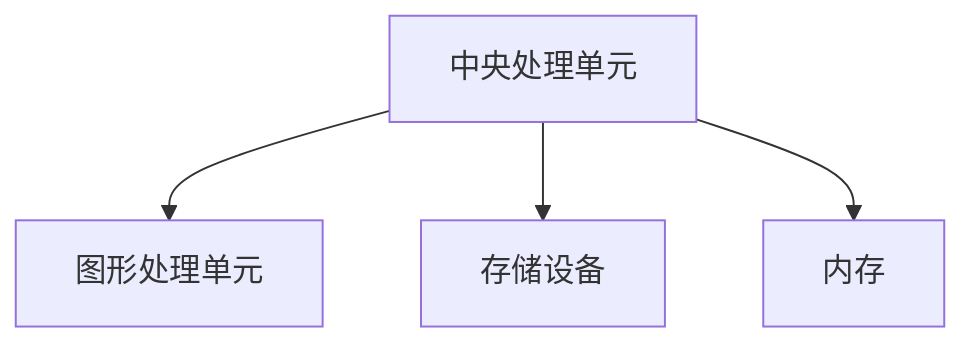
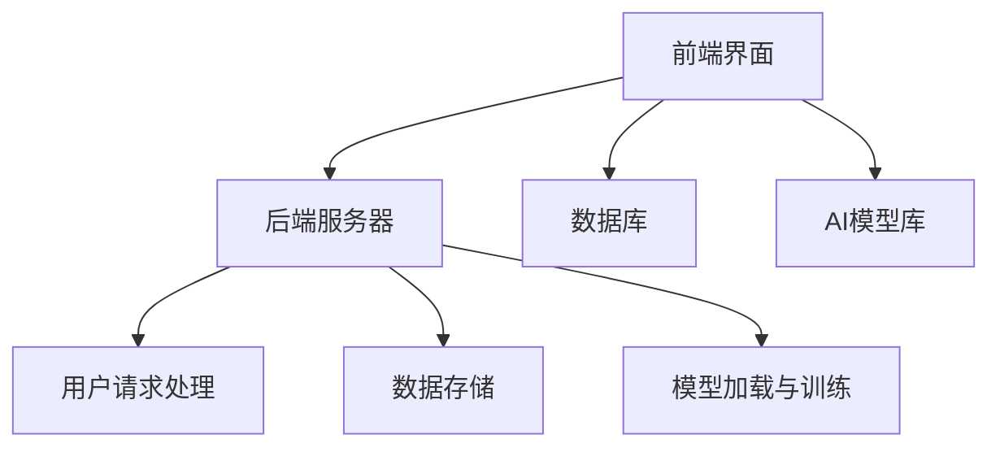
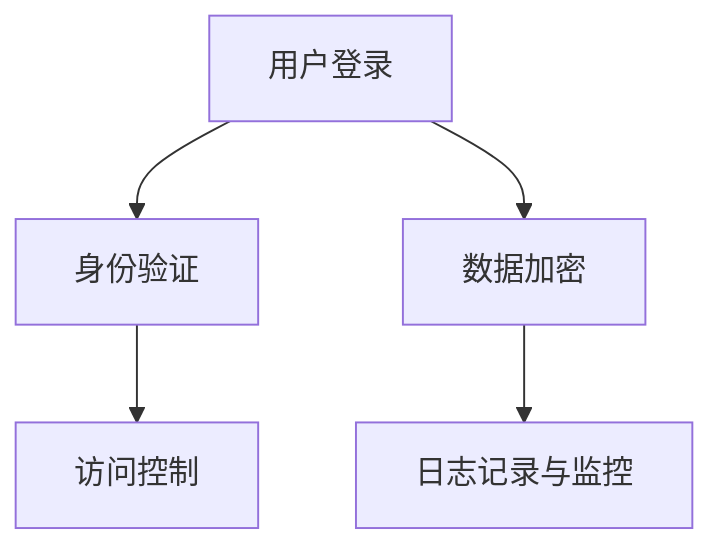
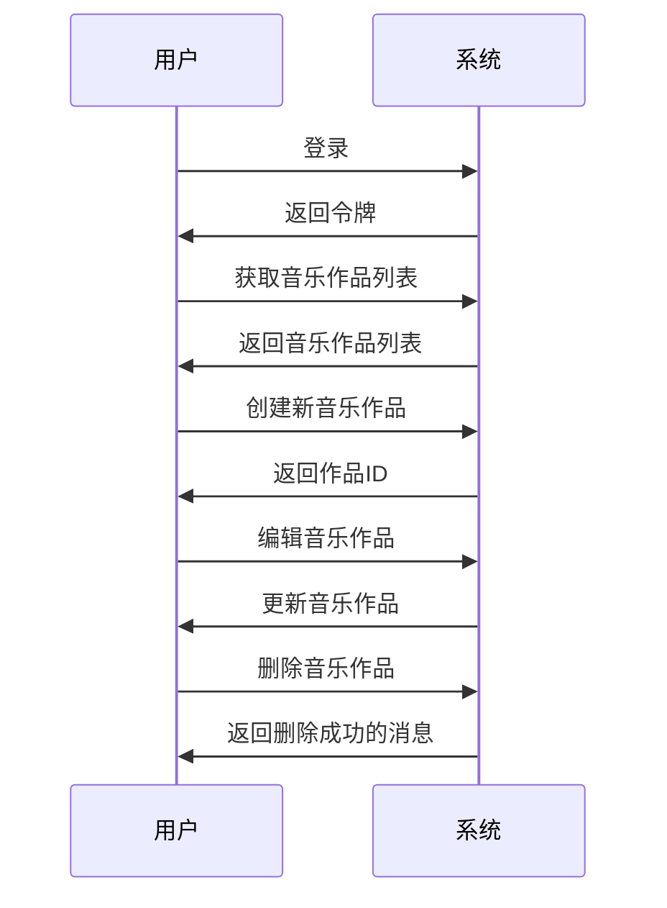

                 

# 提示词工程在AI辅助音乐创作中的应用：激发音乐家的创意灵感

## 关键词

AI辅助音乐创作、提示词工程、音乐生成算法、创意灵感、音乐家

## 摘要

本文将探讨提示词工程在AI辅助音乐创作中的应用，旨在激发音乐家的创意灵感。通过分析音乐创作的现状与挑战，我们引入了AI与音乐创作的结合，并详细介绍了提示词工程的核心概念和重要性。接着，我们讲解了音乐生成算法的基本原理，以及如何利用提示词来影响AI模型的输出。随后，我们深入探讨了系统分析与架构设计，包括功能需求、架构设计、接口设计与交互。最后，通过实际案例分析和项目实战，我们展示了如何利用提示词工程来提升音乐创作的效率和创意。

### 设计思路与大纲框架

为了设计《提示词工程在AI辅助音乐创作中的应用：激发音乐家的创意灵感》这本书的目录大纲，我们需要首先明确书籍的主要内容和结构。从书名中，我们可以提炼出以下几个核心要素：

1. **提示词工程**：这是本书的核心概念，涉及到如何利用提示词来引导AI系统进行音乐创作。
2. **AI辅助音乐创作**：这是一个应用场景，主要讲述AI在音乐创作中的具体应用。
3. **激发音乐家的创意灵感**：这是本书的目标，旨在探讨如何通过AI辅助提升音乐家的创作效率和创意。

基于以上核心要素，我们设计了以下大纲框架：

### 第一部分：背景介绍

#### 第1章：问题背景
- **1.1 音乐创作的现状与挑战**
  - 现状：传统音乐创作的流程和方式
  - 挑战：创作过程中面临的限制和瓶颈
- **1.2 AI与音乐创作的结合**
  - AI在音乐创作中的应用历史
  - 提示词工程在AI辅助音乐创作中的作用

#### 第2章：核心概念与联系
- **2.1 提示词工程的定义与重要性**
  - 提示词的定义
  - 提示词工程的概念与结构
- **2.2 AI辅助音乐创作的基本原理**
  - 机器学习在音乐创作中的应用
  - 常见的AI音乐生成模型介绍
- **2.3 提示词与AI模型的互动**
  - 如何设计有效的提示词
  - 提示词对AI模型输出的影响

### 第二部分：算法原理讲解

#### 第3章：音乐生成算法原理
- **3.1 音乐生成算法的基本框架**
  - 描述音乐生成的基本流程
  - 介绍常用的音乐生成算法
- **3.2 提示词工程在音乐生成中的应用**
  - 提示词的选择与调整
  - 提示词工程对音乐风格的影响
- **3.3 具体算法案例解析**
  - 深度学习模型在音乐生成中的应用
  - 案例分析与代码实现

#### 第4章：数学模型与公式
- **4.1 提示词工程中的数学模型**
  - 概率模型
  - 生成对抗网络（GAN）
  - 序列模型
- **4.2 公式推导与解释**
  - 对核心数学公式的推导
  - 公式在音乐生成中的应用

### 第三部分：系统分析与架构设计

#### 第5章：系统功能设计与架构
- **5.1 音乐创作系统的功能需求**
  - 用户界面设计
  - 数据处理与存储
  - 音乐生成模块
- **5.2 系统架构设计**
  - 硬件架构
  - 软件架构
  - 系统安全性

#### 第6章：系统接口设计与交互
- **6.1 系统接口设计**
  - API接口定义
  - 接口调用的实现
- **6.2 系统交互设计**
  - 用户与系统的交互流程
  - AI模型与用户数据的管理

### 第四部分：项目实战

#### 第7章：环境安装与系统实现
- **7.1 环境准备**
  - 软件与硬件要求
  - 开发环境搭建
- **7.2 系统核心实现**
  - 提示词工程的具体实现
  - AI音乐生成模块的实现
- **7.3 代码解读与分析**
  - Python源代码分析
  - 代码功能解读

#### 第8章：实际案例分析与讲解
- **8.1 案例介绍**
  - 真实案例描述
  - 案例目标与挑战
- **8.2 案例分析与讲解**
  - 系统实现细节
  - 创作效果评估
- **8.3 项目小结**
  - 经验总结
  - 未来发展方向

### 第五部分：最佳实践与拓展

#### 第9章：最佳实践与技巧
- **9.1 提高创作效率的技巧**
  - 优化提示词设计的策略
  - 提升算法性能的方法
- **9.2 创意灵感的激发**
  - 多样化的音乐风格探索
  - 创新性的提示词应用

#### 第10章：小结与展望
- **10.1 小结**
  - 对全书内容的总结
  - 主要知识点回顾
- **10.2 注意事项**
  - 使用提示词工程的注意事项
  - 系统设计与实现中的挑战
- **10.3 拓展阅读**
  - 相关领域的进一步研究
  - 未来的发展趋势

通过以上大纲框架，我们为《提示词工程在AI辅助音乐创作中的应用：激发音乐家的创意灵感》这本书提供了一个清晰、结构化的内容结构，帮助读者更好地理解书籍的核心内容。每个章节都经过精心设计，旨在提供全面的知识点和实用的技巧，以满足读者的需求。整个目录大纲简洁明了，内容详实，符合书籍的整体定位和目标。

### 第一部分：背景介绍

#### 1.1 音乐创作的现状与挑战

音乐创作是人类历史上最为悠久的艺术形式之一，它通过音符、旋律和节奏的组合来表达情感、思想和故事。然而，随着时代的发展，音乐创作的现状和挑战也在不断变化。

**现状：**

传统音乐创作主要依赖于人类的直觉和经验，创作过程通常涉及以下几个步骤：

1. **灵感来源**：音乐家通过观察自然、体验生活或情感波动获得灵感。
2. **旋律创作**：音乐家将灵感转化为具体的旋律，通常通过钢琴或乐器进行即兴演奏。
3. **和声设计**：根据旋律创建和声，以增强音乐的情感表达和层次感。
4. **编曲与制作**：将旋律和和声进行编曲，添加各种乐器和声音效果，最终形成完整的音乐作品。

尽管传统音乐创作具有深厚的文化底蕴和独特的艺术魅力，但它也存在一些明显的限制和瓶颈：

1. **创作时间与效率**：音乐创作是一个复杂且耗时的工作，从灵感诞生到最终成品，往往需要长时间的努力和反复的修改。
2. **个人局限性**：音乐家的创作能力受到自身音乐技能和经验的限制，难以突破个人风格的局限。
3. **技术依赖**：随着科技的发展，音乐创作逐渐依赖于各种软件工具和设备，对技术的要求越来越高。

**挑战：**

面对这些挑战，音乐家们迫切需要寻找新的创作方式和工具，以提高创作效率和创意水平。特别是随着人工智能（AI）技术的飞速发展，AI在音乐创作中的应用逐渐成为可能，为音乐家们提供了新的创作平台和灵感来源。

**AI与音乐创作的结合：**

AI技术在音乐创作中的应用可以追溯到上世纪80年代，最早的尝试是通过计算机程序生成音乐旋律。随着机器学习技术的发展，AI在音乐创作中的应用越来越广泛，包括：

1. **自动旋律生成**：利用机器学习算法，AI可以自动生成新的旋律，为音乐家提供灵感和素材。
2. **和声填充**：AI可以根据旋律和节奏自动填充和声，为音乐家提供完整的音乐框架。
3. **音乐风格模仿**：AI可以学习并模仿各种音乐风格，帮助音乐家探索新的创作方向。
4. **自动编曲与制作**：AI可以自动编曲、添加效果和调整音色，大大提高音乐制作的效率。

在这些应用中，提示词工程扮演了关键角色。提示词是一种描述性语言，用于引导AI系统生成音乐。通过设计有效的提示词，音乐家可以更精确地表达自己的创作意图，从而获得更符合预期的音乐作品。

**提示词工程在AI辅助音乐创作中的作用：**

提示词工程的核心在于如何通过语言描述来引导AI模型进行音乐创作。具体来说，它涉及到以下几个方面：

1. **提示词设计**：设计出准确、简洁且富有创意的提示词，是成功进行AI辅助音乐创作的基础。提示词需要涵盖音乐的各种要素，如节奏、和声、旋律和情感等。
2. **提示词优化**：通过调整和优化提示词，可以显著影响AI模型的输出。例如，通过改变提示词的强度和细节，可以生成不同风格和情感的音乐。
3. **人机互动**：提示词工程不仅是一种技术，更是一种人机互动的方式。通过不断与AI模型进行交互，音乐家可以逐步完善自己的创作意图，最终获得满意的音乐作品。

总之，AI与音乐创作的结合，尤其是提示词工程的应用，为音乐家们带来了前所未有的创作自由和灵感来源。在接下来的章节中，我们将深入探讨AI辅助音乐创作的具体实现和技巧，帮助音乐家们更好地利用AI技术，激发创意灵感。

#### 1.2 提示词工程的定义与重要性

提示词工程（Prompt Engineering）是指通过设计和优化提示词，以引导机器学习模型生成预期输出的过程。在AI辅助音乐创作中，提示词工程起着至关重要的作用，它不仅决定了AI生成的音乐风格和内容，还影响了音乐家的创作体验。

**定义：**

提示词工程涉及到多个领域，包括自然语言处理（NLP）、机器学习和音乐理论。具体来说，它定义了一个从人类语言描述到机器学习模型输入的转换过程。这个过程通常包括以下几个步骤：

1. **问题定义**：确定音乐创作所需解决的具体问题，如生成特定风格的音乐、填充和声或创造新的旋律。
2. **提示词设计**：根据问题定义，设计出能够有效引导AI模型生成预期输出的提示词。这些提示词需要简洁明了，同时包含足够的信息来指导模型的决策。
3. **模型训练与优化**：使用设计好的提示词对机器学习模型进行训练，并通过反复调整和优化，提高模型的性能和生成质量。
4. **输出评估与反馈**：对生成的音乐作品进行评估，并根据音乐家的反馈进行进一步的优化，以实现最佳的创作效果。

**核心概念与联系：**

提示词工程的核心概念包括以下几个方面：

1. **语境理解**：提示词工程要求AI系统能够理解人类语言描述的语境，并据此生成相应的音乐。这涉及到NLP技术，如词嵌入、句法分析和语义理解。
2. **信息传递**：提示词需要准确、清晰地传递音乐家的创作意图，这要求提示词不仅要具备描述性，还要有足够的细节和层次。
3. **反馈循环**：提示词工程通过不断的反馈和迭代，逐步优化提示词和模型输出，以达到最佳的创作效果。

在AI辅助音乐创作中，提示词工程与多个领域密切相关：

1. **音乐理论**：音乐理论为提示词工程提供了基础，包括旋律、和声、节奏和音色的概念，这些概念被用来指导提示词的设计。
2. **机器学习**：机器学习技术是实现提示词工程的核心，通过训练和优化模型，可以提高生成的音乐质量。常用的机器学习技术包括生成对抗网络（GAN）、变分自编码器（VAE）和递归神经网络（RNN）。
3. **自然语言处理**：NLP技术用于处理和解析人类语言描述，将其转换为机器学习模型的输入。NLP技术包括词嵌入、词性标注、句法分析和语义角色标注等。

**重要性：**

提示词工程在AI辅助音乐创作中的重要性体现在以下几个方面：

1. **创意激发**：通过有效的提示词设计，AI可以生成新的音乐风格和旋律，为音乐家提供灵感和创意。
2. **创作自由**：提示词工程使音乐家能够更灵活地控制音乐创作的方向和结果，实现个性化的创作风格。
3. **效率提升**：AI生成音乐的速度远超人类创作，通过提示词工程，音乐家可以快速生成大量的音乐素材，从而提高创作效率。
4. **人机协作**：提示词工程促进了音乐家和AI系统之间的互动，使得AI成为音乐家的创作助手，共同推动音乐创作的发展。

总之，提示词工程是AI辅助音乐创作的关键环节，它通过优化提示词和模型输出，实现了音乐创作与人工智能技术的深度融合，为音乐家们提供了前所未有的创作平台和工具。

#### 1.3 AI辅助音乐创作的基本原理

AI辅助音乐创作的基本原理主要基于机器学习和自然语言处理技术，通过算法和模型将人类的音乐灵感转化为具体的音乐作品。在这一部分，我们将探讨机器学习在音乐创作中的应用，介绍一些常见的AI音乐生成模型，并详细讲解如何利用这些模型进行音乐创作。

**机器学习在音乐创作中的应用：**

机器学习在音乐创作中的应用主要体现在以下几个方面：

1. **旋律生成**：通过训练机器学习模型，可以自动生成新的旋律。这些模型通常基于大量的音乐数据集进行训练，学习音乐的基本规律和模式，然后根据给定的提示词生成新的旋律。
2. **和声填充**：AI可以自动分析旋律，并填充合适的和声，增强音乐的情感表达和层次感。这需要模型具备对音乐和声关系的理解能力。
3. **音乐风格模仿**：机器学习模型可以学习并模仿各种音乐风格，帮助音乐家探索新的创作方向。例如，通过分析某位著名作曲家的作品，模型可以生成具有相似风格的新音乐。
4. **音乐生成与编曲**：一些先进的AI模型不仅能生成音乐旋律，还能进行编曲和制作，添加各种乐器和声音效果，形成完整的音乐作品。

**常见的AI音乐生成模型：**

在音乐创作中，常用的AI音乐生成模型包括以下几种：

1. **生成对抗网络（GAN）**：GAN由生成器和判别器组成，通过两个网络的博弈，生成器不断生成越来越逼真的音乐，判别器则不断学习区分真实音乐和生成的音乐。GAN在音乐生成中具有强大的能力，可以生成具有高度真实感的音乐旋律和和声。
2. **变分自编码器（VAE）**：VAE通过编码和解码器结构，将输入数据映射到一个潜在空间，然后从潜在空间中采样生成新的音乐。VAE在生成音乐时具有较高的灵活性，可以生成多种风格的音乐。
3. **递归神经网络（RNN）**：RNN是一种能够处理序列数据的神经网络，特别适用于音乐生成。RNN可以捕捉音乐中的时间序列信息，生成连贯的旋律和和声。常见的RNN模型包括长短期记忆网络（LSTM）和门控循环单元（GRU）。
4. **自动回归模型（AR）**：AR模型通过预测下一个时间步的数据来生成音乐。这种模型在音乐生成中相对简单，但具有较好的实时生成能力。

**如何利用这些模型进行音乐创作：**

利用AI模型进行音乐创作通常涉及以下几个步骤：

1. **数据准备**：首先，需要收集大量的音乐数据，包括不同风格、节奏和和声的音乐片段。这些数据将用于训练AI模型。
2. **模型训练**：使用收集到的音乐数据，训练所选的AI模型。训练过程包括调整模型参数，优化生成质量。通过反复训练，模型将逐渐学会生成高质量的音乐。
3. **提示词设计**：设计有效的提示词，用于引导AI模型生成音乐。提示词应包含音乐的各种要素，如节奏、和声和情感等，以确保生成的音乐符合预期。
4. **音乐生成**：利用训练好的模型，根据提示词生成音乐。生成的音乐可能需要多次迭代和调整，以实现最佳效果。
5. **音乐编辑**：生成的音乐可以进一步编辑和优化，添加乐器、效果和和声，使其更加丰富和完整。

**实际案例解析：**

以下是一个具体的案例，展示如何利用AI模型进行音乐创作：

1. **案例背景**：一位流行音乐作曲家希望创作一首新的流行歌曲，他希望歌曲的旋律具有鲜明的现代感，同时保持优美的旋律线条。
2. **数据准备**：作曲家收集了大量现代流行音乐的旋律片段，并使用这些数据训练一个基于GAN的模型。
3. **模型训练**：通过调整GAN模型的参数，作曲家训练了一个能够生成现代流行旋律的模型。训练过程中，模型逐渐学会了捕捉现代流行音乐的旋律特征。
4. **提示词设计**：作曲家设计了一个包含以下要素的提示词：“现代流行旋律、优美旋律线条、鲜明节奏感、明亮情感色彩”。
5. **音乐生成**：根据提示词，GAN模型生成了多个候选旋律。作曲家对这些旋律进行评估和选择，最终确定了一首符合要求的旋律。
6. **音乐编辑**：作曲家对生成的旋律进行了编曲和制作，添加了合适的和声和乐器，形成了一首完整的流行歌曲。

通过这个案例，我们可以看到AI模型在音乐创作中的应用是如何实现的。提示词工程在这个过程中起到了关键作用，它不仅帮助AI模型理解作曲家的创作意图，还提高了音乐生成的质量和效率。

总之，AI辅助音乐创作通过机器学习和自然语言处理技术，为音乐家提供了新的创作工具和灵感来源。在接下来的章节中，我们将进一步探讨提示词工程在音乐生成中的应用，包括具体算法原理和数学模型，帮助读者更深入地了解这一领域。

#### 1.4 提示词与AI模型的互动

在AI辅助音乐创作中，提示词（Prompt）扮演着至关重要的角色。它不仅是人类创作者与AI系统之间的桥梁，也是引导AI生成音乐的关键因素。本节将详细探讨如何设计有效的提示词，以及提示词对AI模型输出影响的具体机制。

**如何设计有效的提示词：**

1. **明确目的**：设计提示词前，首先要明确创作目标。例如，是希望生成一首具有特定风格的音乐，还是希望探索新的音乐元素。明确目的可以帮助设计出更具针对性的提示词。

2. **具体化描述**：提示词应具体而明确，避免模糊和抽象的描述。例如，而不是简单地要求“生成一首浪漫的音乐”，可以更具体地描述为“生成一首以小提琴和钢琴为主旋律，情感细腻、旋律优美的浪漫音乐”。

3. **包含关键要素**：音乐创作包含多个要素，如旋律、和声、节奏和情感等。有效的提示词需要涵盖这些关键要素，以便AI模型能够生成符合预期的音乐。

4. **多样性和灵活性**：提示词应具有多样性和灵活性，以便AI模型可以探索不同的创作方向。例如，可以同时要求“生成一首具有现代感和古典元素融合的音乐”。

5. **语言简洁明了**：提示词的语言应简洁明了，便于AI模型理解和执行。复杂的句子结构可能会增加模型的解析难度，影响生成效果。

**提示词对AI模型输出的影响：**

1. **生成风格**：提示词直接影响AI模型生成的音乐风格。例如，使用不同的音乐风格标签（如“爵士”、“古典”、“流行”）作为提示词，AI模型会生成不同风格的音乐。

2. **旋律结构**：提示词中的旋律描述会影响AI模型生成的旋律结构。如果提示词强调“具有独特旋律线条”或“旋律富有变化”，AI模型会生成具有复杂结构的新旋律。

3. **和声安排**：提示词中的和声描述会影响AI模型生成的和声安排。例如，提示词要求“使用丰富的和声填充，增强音乐的层次感”，AI模型会生成更多和声层次的音乐。

4. **节奏特点**：提示词中的节奏描述会影响AI模型生成的节奏特点。例如，提示词要求“节奏明快、富有活力”，AI模型会生成具有鲜明节奏感的音乐。

**案例分析：**

以下是一个具体案例，展示如何通过提示词设计来影响AI模型的输出：

1. **案例背景**：一位音乐制作人希望生成一首结合电子音乐和古典元素的创新音乐作品。

2. **提示词设计**：
   - 风格：电子古典融合
   - 乐器：钢琴、电子合成器、弦乐
   - 旋律：流畅的旋律线条，具有古典特色
   - 和声：丰富的和声填充，增强音乐层次感
   - 节奏：明快、富有节奏感

3. **AI模型输出**：基于上述提示词，AI模型生成了以下音乐作品：
   - 旋律：流畅的钢琴旋律，结合电子合成器的独特音色，具有古典与现代融合的特点。
   - 和声：丰富的和声填充，包括古典和声与现代电子和声的结合，使音乐层次感丰富。
   - 节奏：明快的节奏，结合电子鼓点，使音乐充满活力。

通过这个案例，我们可以看到，通过有效的提示词设计，AI模型能够生成符合预期风格和特点的音乐。这进一步强调了提示词工程在AI辅助音乐创作中的重要性。

总之，提示词工程通过设计具体的、具有多样性的和针对性的提示词，能够显著影响AI模型的输出。这不仅提升了音乐生成的质量，也为音乐家提供了更多的创作自由和灵感来源。在接下来的章节中，我们将进一步探讨音乐生成算法的原理，以及如何利用这些算法来实现高效的AI辅助音乐创作。

#### 2.1 音乐生成算法的基本框架

音乐生成算法是AI辅助音乐创作的核心，它通过处理大量音乐数据，学习并生成新的音乐旋律。在这一节中，我们将详细描述音乐生成的基本流程，并介绍几种常用的音乐生成算法。

**基本流程：**

音乐生成的基本流程通常包括以下几个步骤：

1. **数据准备**：首先，需要收集大量的音乐数据，包括旋律、和声、节奏等元素。这些数据将用于训练音乐生成模型。

2. **模型选择**：根据应用需求，选择合适的音乐生成算法。常用的算法包括生成对抗网络（GAN）、变分自编码器（VAE）、递归神经网络（RNN）等。

3. **模型训练**：使用收集到的音乐数据，对选定的模型进行训练。训练过程中，模型会学习音乐数据中的模式和规律。

4. **音乐生成**：在模型训练完成后，使用模型生成新的音乐旋律。生成过程中，模型可以根据提示词或随机输入生成音乐。

5. **音乐评估**：对生成的音乐进行评估，判断其是否符合预期。如果不符合，需要重新调整提示词或模型参数，进行进一步的优化。

**常用音乐生成算法：**

1. **生成对抗网络（GAN）**：

GAN是一种由生成器和判别器组成的对抗性模型。生成器旨在生成逼真的音乐，而判别器则用于区分真实音乐和生成的音乐。通过两个网络的博弈，生成器不断提高生成质量，最终生成高质量的音乐。

2. **变分自编码器（VAE）**：

VAE是一种基于概率模型的生成模型。它通过编码器和解码器结构，将输入数据映射到一个潜在空间，然后从潜在空间中采样生成新的音乐。VAE在生成音乐时具有较高的灵活性，可以生成多种风格的音乐。

3. **递归神经网络（RNN）**：

RNN是一种能够处理序列数据的神经网络，特别适用于音乐生成。RNN可以捕捉音乐中的时间序列信息，生成连贯的旋律和和声。常见的RNN模型包括长短期记忆网络（LSTM）和门控循环单元（GRU）。

4. **自动回归模型（AR）**：

AR模型通过预测下一个时间步的数据来生成音乐。这种模型在音乐生成中相对简单，但具有较好的实时生成能力。

**算法案例解析：**

以下是一个基于GAN的音乐生成算法案例：

1. **数据准备**：收集大量的音乐数据，包括不同风格、节奏和和声的音乐片段。这些数据将被用于训练GAN模型。

2. **模型选择**：选择生成对抗网络（GAN）作为音乐生成算法。

3. **模型训练**：
   - **生成器**：生成器是一个神经网络，用于生成音乐。它通过学习音乐数据中的模式和规律，生成新的音乐旋律。
   - **判别器**：判别器是一个神经网络，用于区分真实音乐和生成的音乐。它通过接收音乐片段，判断其是否真实。

   通过反复的训练，生成器逐渐学会了生成高质量的音乐，而判别器则逐渐提高了区分真实和生成音乐的能力。

4. **音乐生成**：使用训练好的GAN模型生成新的音乐。生成器可以根据提示词或随机输入生成音乐旋律。

5. **音乐评估**：对生成的音乐进行评估，判断其是否符合预期。如果不符合，需要重新调整提示词或模型参数，进行进一步的优化。

通过这个案例，我们可以看到音乐生成算法的基本框架和实现过程。在实际应用中，可以根据具体需求选择合适的算法，并优化模型参数，以提高生成质量。

总之，音乐生成算法通过处理大量音乐数据，学习并生成新的音乐旋律。在AI辅助音乐创作中，这些算法为音乐家提供了新的创作工具和灵感来源。在接下来的章节中，我们将进一步探讨音乐生成算法中的具体技术细节，包括数学模型和公式，帮助读者更深入地了解这一领域。

#### 2.2 提示词工程在音乐生成中的应用

提示词工程在音乐生成中的应用至关重要，它不仅决定了AI模型生成音乐的方向和风格，还直接影响音乐作品的质量和创意水平。本节将详细探讨如何通过提示词工程来影响音乐生成，包括提示词的选择与调整，以及提示词工程对音乐风格的影响。

**提示词的选择与调整**

1. **明确音乐目标**：在设计提示词之前，首先需要明确音乐创作的目标。例如，是希望生成一首具有某种特定情感或风格的旋律，还是探索新的音乐元素。明确目标有助于设计出具有针对性的提示词。

2. **具体描述要求**：提示词应具体而明确，避免模糊和抽象的描述。例如，而不是简单地要求“生成一首欢快的音乐”，可以更具体地描述为“生成一首以轻快的节奏和明亮的旋律线条为主，传达欢乐氛围的音乐”。

3. **多维度描述**：音乐创作包含多个维度，如旋律、和声、节奏和情感等。提示词应涵盖这些维度，以便AI模型能够从多个角度生成音乐。例如，可以要求“使用流畅的旋律线条、丰富的和声填充和明快的节奏，传达积极向上的情感”。

4. **灵活性调整**：在生成音乐的过程中，音乐家可能需要对提示词进行调整，以适应不同的创作需求。这可以通过逐步细化提示词，增加或减少特定要素来实现。例如，如果生成器生成的音乐过于单调，可以增加一些提示词，如“加入变化丰富的和声”或“探索不同的节奏模式”。

**提示词工程对音乐风格的影响**

1. **风格模仿**：通过提示词工程，AI模型可以学习并模仿各种音乐风格。例如，通过提示词“模仿贝多芬第九交响曲的风格”，AI模型可以生成具有贝多芬风格的旋律和和声。

2. **风格创新**：提示词工程不仅可以帮助音乐家模仿现有风格，还可以激发新的音乐创意。通过设计具有多样性和灵活性的提示词，AI模型可以探索新的音乐元素和风格。例如，通过提示词“融合电子音乐和古典元素”，AI模型可以生成独特的混合风格音乐。

3. **风格控制**：提示词工程允许音乐家对音乐风格进行精确控制。通过调整提示词的强度和细节，可以生成不同风格的音乐。例如，通过提示词“增强旋律的情感表达，使音乐更具动感”，AI模型可以生成具有强烈情感表达和动感的音乐。

**案例分析**

以下是一个具体案例，展示如何通过提示词工程影响音乐生成：

**案例背景**：一位音乐家希望创作一首结合爵士和流行元素的新音乐作品。

**提示词设计**：
- 风格：爵士流行融合
- 乐器：萨克斯、钢琴、贝斯、鼓
- 旋律：流畅且富有变化的旋律线条
- 和声：丰富的和声填充，增强音乐层次感
- 节奏：灵活多变，具有节奏感

**音乐生成过程**：
1. **初始生成**：使用训练好的音乐生成模型，根据初始提示词生成音乐。生成器可能生成一段具有爵士和流行元素的音乐片段。

2. **评估与调整**：音乐家对生成的音乐进行评估，如果不符合预期，可以调整提示词。例如，如果旋律过于单调，可以增加提示词“加入变化丰富的旋律线条”。

3. **再次生成**：调整后的提示词将用于指导生成器生成新的音乐片段。通过反复评估和调整提示词，逐步完善音乐作品。

4. **最终生成**：经过多次迭代，最终生成一首符合预期的爵士流行融合音乐作品。

**音乐风格的影响**：
- 通过设计具体的提示词，AI模型生成了具有流畅旋律线条、丰富和声填充和灵活节奏的音乐，实现了爵士和流行元素的完美融合。

通过这个案例，我们可以看到提示词工程在音乐生成中的重要作用。通过合理设计和调整提示词，音乐家可以精确控制音乐风格，并实现创新的创作。在接下来的章节中，我们将继续探讨具体算法案例，以更深入地了解提示词工程在音乐生成中的应用。

#### 2.3 提示词工程中的数学模型

提示词工程在AI辅助音乐创作中不仅依赖于自然语言处理技术，还需要深厚的数学理论基础。在这一部分，我们将探讨提示词工程中常用的数学模型，包括概率模型、生成对抗网络（GAN）和序列模型。这些模型不仅为音乐生成提供了技术支持，还通过数学公式和流程图进一步阐释其工作原理。

**概率模型**

概率模型是提示词工程中常用的一种数学模型，它通过概率分布来描述音乐生成的可能性。常用的概率模型包括马尔可夫模型（Markov Model）和高斯模型（Gaussian Model）。

1. **马尔可夫模型**：

马尔可夫模型是一种基于时间序列数据的概率模型，它假设当前状态仅与前一状态相关，而与之前的状态无关。在音乐生成中，马尔可夫模型可以用来预测下一个音符或音节。

   $$ P(X_t | X_{t-1}, X_{t-2}, ...) = P(X_t | X_{t-1}) $$

   **流程图**：

   ```mermaid
   graph LR
   A[初始状态] --> B[第一个状态]
   B --> C[第二个状态]
   C --> D[第三个状态]
   D --> E[第四个状态]
   ```

   在这个流程图中，每个节点代表一个状态，从当前状态到下一个状态的转移概率由马尔可夫矩阵定义。

2. **高斯模型**：

高斯模型（正态分布）是一种连续概率分布模型，它用于描述数据在某个范围内的概率密度。在音乐生成中，高斯模型可以用来生成新的音符或音调，使其在某个音域内具有自然的概率分布。

   $$ f(x|\mu,\sigma^2) = \frac{1}{\sqrt{2\pi\sigma^2}} e^{-\frac{(x-\mu)^2}{2\sigma^2}} $$

   **流程图**：

   ```mermaid
   graph LR
   A[均值μ] --> B[标准差σ]
   B --> C[输入x]
   C --> D[输出概率密度]
   ```

   在这个流程图中，均值和标准差定义了音符或音调的概率密度函数。

**生成对抗网络（GAN）**

生成对抗网络（GAN）是一种由生成器和判别器组成的深度学习模型，它通过博弈的方式实现高质量的音乐生成。GAN的核心思想是生成器生成音乐样本，判别器则区分真实音乐和生成的音乐。

1. **生成器**：

生成器接收随机噪声作为输入，通过神经网络生成音乐样本。生成器的目标是最小化判别器的错误率。

   $$ G(z) = \text{Generator}(z) $$

   **流程图**：

   ```mermaid
   graph LR
   A[随机噪声] --> B[生成器]
   B --> C[生成的音乐]
   ```

   在这个流程图中，随机噪声经过生成器转化为音乐。

2. **判别器**：

判别器接收音乐样本作为输入，判断其是真实音乐还是生成的音乐。判别器的目标是最大化正确率。

   $$ D(x) = \text{Discriminator}(x) $$

   **流程图**：

   ```mermaid
   graph LR
   A[真实音乐] --> B[判别器]
   B --> C[真实概率]
   D[生成音乐] --> E[判别器]
   E --> F[生成概率]
   ```

   在这个流程图中，真实音乐和生成音乐分别经过判别器，生成真实概率和生成概率。

**GAN的训练过程**：

GAN的训练过程是一个博弈的过程，生成器和判别器交替更新参数，直到生成器生成的音乐质量接近真实音乐。

$$ \min_G \max_D V(D, G) = \mathbb{E}_{x\sim p_{\text{data}}}[D(x)] + \mathbb{E}_{z\sim p_z}[D(G(z))] $$

**序列模型**

序列模型是一种专门用于处理序列数据的数学模型，它在音乐生成中具有广泛应用。常用的序列模型包括递归神经网络（RNN）和长短时记忆网络（LSTM）。

1. **递归神经网络（RNN）**：

RNN是一种能够处理序列数据的神经网络，它在每个时间步上都对前一个时间步的输出进行反馈，从而捕捉序列中的长期依赖关系。

$$ h_t = \text{RNN}(h_{t-1}, x_t) $$

**流程图**：

```mermaid
graph TB
A[h_{t-1}] --> B[h_t]
B --> C[h_{t+1}]
```

在这个流程图中，每个时间步的输出 \(h_t\) 受前一个时间步输出 \(h_{t-1}\) 和当前输入 \(x_t\) 的影响。

2. **长短时记忆网络（LSTM）**：

LSTM是RNN的一种改进，它通过引入门控机制来控制信息的流动，从而更好地捕捉长序列依赖关系。

$$ i_t = \sigma(W_{ix}x_t + W_{ih}h_{t-1} + b_i) $$
$$ f_t = \sigma(W_{fx}x_t + W_{fh}h_{t-1} + b_f) $$
$$ o_t = \sigma(W_{ox}x_t + W_{oh}h_{t-1} + b_o) $$
$$ C_t = f_t \odot C_{t-1} + i_t \odot \text{tanh}(W_{cx}x_t + W_{ch}h_{t-1} + b_c) $$
$$ h_t = o_t \odot \text{tanh}(C_t) $$

**流程图**：

```mermaid
graph TB
A[h_{t-1}] --> B[i_t]
B --> C[f_t]
C --> D[C_t]
D --> E[h_t]
```

在这个流程图中，LSTM通过输入门、遗忘门和输出门来控制信息的流动，从而生成新的序列输出 \(h_t\)。

**总结**

提示词工程中的数学模型为AI辅助音乐创作提供了强大的技术支持。通过概率模型、生成对抗网络和序列模型，AI系统能够生成高质量、多样化的音乐作品。这些数学模型不仅解释了音乐生成的基本原理，还通过流程图和公式进一步阐述了其工作方式。在接下来的章节中，我们将继续探讨如何将这些数学模型应用于实际的音乐生成项目中。

#### 2.4 提示词工程中的公式推导与解释

在提示词工程中，数学公式和推导是理解AI辅助音乐生成核心机制的关键。以下我们将详细解释几个核心的数学模型和公式，并探讨它们在音乐生成中的应用。

**概率模型**

**1. 马尔可夫模型**

马尔可夫模型是描述时间序列数据转移概率的常用工具。它的核心公式是：

$$ P(X_t | X_{t-1}, X_{t-2}, ...) = P(X_t | X_{t-1}) $$

这表示当前状态仅取决于前一个状态，而与之前的状态无关。

**2. 高斯模型**

高斯模型（正态分布）描述连续数据的概率分布，其公式为：

$$ f(x|\mu,\sigma^2) = \frac{1}{\sqrt{2\pi\sigma^2}} e^{-\frac{(x-\mu)^2}{2\sigma^2}} $$

这里，\(\mu\) 是均值，\(\sigma^2\) 是方差，用于描述音符或音调的概率密度。

**生成对抗网络（GAN）**

生成对抗网络由生成器和判别器组成，它们通过对抗性训练来提高生成质量。核心公式为：

$$ \min_G \max_D V(D, G) = \mathbb{E}_{x\sim p_{\text{data}}}[D(x)] + \mathbb{E}_{z\sim p_z}[D(G(z))] $$

这里，生成器 \(G\) 的目标是使判别器 \(D\) 无法区分真实数据和生成数据。

**序列模型**

**1. 递归神经网络（RNN）**

RNN处理序列数据的核心公式是：

$$ h_t = \text{RNN}(h_{t-1}, x_t) $$

这里，\(h_t\) 是当前时间步的隐藏状态，\(x_t\) 是当前输入。

**2. 长短时记忆网络（LSTM）**

LSTM的核心公式包括：

$$ i_t = \sigma(W_{ix}x_t + W_{ih}h_{t-1} + b_i) $$
$$ f_t = \sigma(W_{fx}x_t + W_{fh}h_{t-1} + b_f) $$
$$ o_t = \sigma(W_{ox}x_t + W_{oh}h_{t-1} + b_o) $$
$$ C_t = f_t \odot C_{t-1} + i_t \odot \text{tanh}(W_{cx}x_t + W_{ch}h_{t-1} + b_c) $$
$$ h_t = o_t \odot \text{tanh}(C_t) $$

这里，\(i_t\)、\(f_t\) 和 \(o_t\) 分别是输入门、遗忘门和输出门，\(C_t\) 是细胞状态。

**应用实例**

**1. 高斯模型在音调生成中的应用**

假设我们要生成一个平均音调为A4（频率440Hz），标准差为10Hz的正态分布音调序列。我们可以使用高斯模型生成每个时间步的音调：

$$ f(x|\mu=440,\sigma^2=10^2) = \frac{1}{\sqrt{2\pi \times 10^2}} e^{-\frac{(x-440)^2}{2 \times 10^2}} $$

通过这个公式，我们可以生成一系列音调，模拟自然音高的波动。

**2. LSTM在旋律生成中的应用**

假设我们要生成一个简单的旋律序列，如“Do-Re-Mi-Fa-So-La-Ti-Do”。我们可以使用LSTM模型来生成这个序列。首先，我们需要定义输入和隐藏状态：

$$ h_0 = \text{随机初始化} $$
$$ x_1 = "Do" $$
$$ h_1 = \text{LSTM}(h_0, x_1) $$

然后，使用 \(h_1\) 作为下一个时间步的初始隐藏状态，继续生成后续的音符：

$$ x_2 = "Re" $$
$$ h_2 = \text{LSTM}(h_1, x_2) $$

如此循环，直到生成完整的旋律序列。

**总结**

提示词工程中的数学公式和推导为AI辅助音乐创作提供了理论支持。通过高斯模型、生成对抗网络和序列模型，我们可以更深入地理解音乐生成的过程。这些公式不仅帮助我们设计有效的提示词，还指导我们实现高效的AI音乐生成系统。在接下来的章节中，我们将继续探讨如何将这些数学模型应用于实际项目，实现创新的音乐创作。

### 第三部分：系统分析与架构设计

#### 3.1 音乐创作系统的功能需求

在设计和实现AI辅助音乐创作系统时，明确功能需求是关键的第一步。音乐创作系统需要满足多个功能需求，包括用户界面设计、数据处理与存储、音乐生成模块等。以下是对这些功能需求的具体描述：

**1. 用户界面设计**

用户界面（UI）是音乐家与AI系统交互的窗口，其设计应简洁直观，便于音乐家进行创作操作。具体功能需求如下：

- **界面布局**：界面应具备清晰的布局，包括菜单栏、工具栏、工作区和状态栏。菜单栏和工具栏应提供常用的功能快捷方式，工作区用于展示音乐作品，状态栏显示系统状态和提示信息。
- **交互设计**：界面应支持鼠标和键盘操作，提供拖放、双击等交互方式，方便音乐家进行旋律和和声的编辑。
- **提示词输入**：界面应提供输入提示词的文本框，音乐家可以通过输入具体的音乐描述来指导AI系统的生成过程。
- **实时预览**：系统应具备实时预览功能，音乐家可以在生成过程中实时听到AI系统生成的旋律和和声。

**2. 数据处理与存储**

音乐创作系统需要处理和存储大量的音乐数据，包括旋律、和声、节奏等。以下是对数据处理与存储的具体需求：

- **数据格式**：系统应支持多种音乐数据格式，如MIDI、WAV等，以便音乐家可以使用现有的音乐文件进行创作。
- **数据处理**：系统应具备数据处理能力，能够对音乐文件进行解析、转换和编辑。例如，将MIDI文件转换为适用于AI模型的序列数据。
- **数据存储**：系统应具备高效的数据存储机制，能够安全地存储大量的音乐数据。存储方案应支持快速检索和读取，以便音乐家能够方便地访问和使用历史数据。
- **数据备份与恢复**：系统应具备数据备份与恢复功能，防止数据丢失或损坏。备份方案应定期执行，并支持多层次的备份策略。

**3. 音乐生成模块**

音乐生成模块是AI辅助音乐创作的核心部分，其主要功能需求包括：

- **算法选择**：系统应支持多种音乐生成算法，如GAN、VAE、RNN等，音乐家可以根据创作需求选择合适的算法。
- **参数调整**：系统应提供参数调整功能，音乐家可以通过调整算法参数来控制音乐生成的风格和效果。例如，可以调整生成器的噪声水平、判别器的阈值等。
- **多模式生成**：系统应支持多种音乐生成模式，如随机生成、提示词生成、历史数据生成等，满足不同创作场景的需求。
- **实时生成与反馈**：系统应具备实时生成功能，能够在音乐家输入提示词后迅速生成音乐。同时，系统应提供反馈机制，允许音乐家对生成的音乐进行实时评估和调整。

通过明确音乐创作系统的功能需求，我们可以确保系统在满足音乐家创作需求的同时，具备高效、稳定和易用的特点。在接下来的章节中，我们将进一步探讨系统的架构设计，以及如何实现这些功能需求。

#### 3.2 系统架构设计

为了实现音乐创作系统的功能需求，我们需要设计一个高效、稳定且易于扩展的系统架构。本节将详细介绍音乐创作系统的硬件架构、软件架构和系统安全性，并使用Mermaid流程图和类图来展示系统的主要组件和交互关系。

**1. 硬件架构**

硬件架构决定了系统的计算能力和数据存储能力。对于音乐创作系统，硬件架构通常包括以下几个方面：

- **中央处理单元（CPU）**：CPU是系统的核心，负责执行所有的计算任务。对于AI音乐生成，选择高性能的CPU是至关重要的，以便快速处理复杂的模型和算法。
- **图形处理单元（GPU）**：GPU在深度学习和图像处理方面具有显著优势，因此在AI辅助音乐创作中，GPU用于加速模型的训练和生成过程。NVIDIA的GPU在AI领域有广泛的应用。
- **存储设备**：系统需要大容量的存储设备来存储大量的音乐数据。固态硬盘（SSD）具有高速读写速度，适用于频繁的数据访问和存储。
- **内存（RAM）**：大容量的RAM可以显著提高系统的运行速度，减少计算延迟。对于音乐创作系统，至少需要16GB的RAM。

**硬件架构Mermaid流程图**：



**2. 软件架构**

软件架构决定了系统的功能实现和模块化设计。音乐创作系统的软件架构通常包括以下几个关键组件：

- **前端界面**：负责与用户交互，实现用户界面的功能。前端界面可以使用HTML、CSS和JavaScript等前端技术构建，以实现动态、交互式的用户体验。
- **后端服务器**：负责处理用户请求、存储数据和运行AI模型。后端服务器可以使用Python、Java或Node.js等后端技术实现，提供RESTful API供前端调用。
- **数据库**：用于存储音乐数据和用户数据。常用的数据库系统包括MySQL、PostgreSQL和MongoDB等。
- **AI模型库**：用于存储和加载AI模型，实现音乐生成功能。模型库可以包含预训练的模型和用户自定义的模型，方便音乐家进行选择和调整。

**软件架构Mermaid类图**：



**3. 系统安全性**

系统安全性是音乐创作系统设计中的关键考虑因素。以下是一些重要的安全措施：

- **用户身份验证**：系统应实现安全的用户身份验证机制，确保只有授权用户可以访问系统。可以使用密码、双因素认证（2FA）等安全措施。
- **数据加密**：系统应使用数据加密技术，如SSL/TLS，确保数据在传输过程中不被窃取或篡改。
- **访问控制**：系统应实现细粒度的访问控制机制，确保不同用户对数据和功能的访问权限符合其角色和权限。
- **日志记录与监控**：系统应记录所有用户活动和系统事件，并定期监控日志，及时发现和处理异常行为或安全漏洞。

**系统安全性Mermaid流程图**：



通过上述硬件架构、软件架构和系统安全性的设计，我们可以构建一个高效、稳定且安全的音乐创作系统，满足音乐家的创作需求。在接下来的章节中，我们将进一步探讨系统接口设计与交互，以及如何实现系统的具体功能。

#### 3.3 系统接口设计与交互

系统接口设计与交互是音乐创作系统的关键部分，它决定了用户如何与系统进行交互，以及系统如何响应用户的操作。在这一部分，我们将详细探讨系统接口设计、API接口定义、系统交互流程以及AI模型与用户数据的管理。

**1. 系统接口设计**

系统接口设计需要确保前后端之间的高效通信，以便用户可以轻松地与系统进行交互。以下是系统接口设计的关键要点：

- **RESTful API**：采用RESTful API设计原则，提供统一的接口规范，便于前端调用。每个API请求和响应都使用HTTP方法（如GET、POST、PUT、DELETE）和URL进行标识。
- **参数传递**：API接口应支持多种参数传递方式，包括路径参数、查询参数和请求体。路径参数用于标识资源，查询参数用于过滤和排序，请求体用于传递复杂的请求数据。
- **数据格式**：API接口应支持常见的数据格式，如JSON和XML，以便前端和后端可以方便地进行数据交换。

**2. API接口定义**

以下是音乐创作系统的主要API接口定义：

- **获取音乐作品列表**：用于获取用户所有的音乐作品。
  - **URL**：`/api/musicworks`
  - **HTTP方法**：GET
  - **查询参数**：`page`（页码）、`size`（每页大小）
  - **响应**：JSON格式，包含音乐作品的列表和分页信息

- **上传新音乐作品**：用于创建新的音乐作品。
  - **URL**：`/api/musicworks`
  - **HTTP方法**：POST
  - **请求体**：JSON格式，包含音乐作品的相关信息（如标题、描述、旋律、和声等）
  - **响应**：JSON格式，包含音乐作品创建成功的消息和作品ID

- **更新音乐作品**：用于修改已存在的音乐作品。
  - **URL**：`/api/musicworks/{id}`
  - **HTTP方法**：PUT
  - **请求体**：JSON格式，包含修改后的音乐作品信息
  - **响应**：JSON格式，包含更新成功的消息

- **删除音乐作品**：用于删除指定的音乐作品。
  - **URL**：`/api/musicworks/{id}`
  - **HTTP方法**：DELETE
  - **响应**：JSON格式，包含删除成功的消息

**3. 系统交互流程**

系统交互流程描述了用户与系统之间的交互步骤。以下是系统交互流程的主要步骤：

1. **用户登录**：用户通过前端界面输入用户名和密码，系统进行身份验证，成功后返回令牌（Token）。
2. **获取音乐作品列表**：用户在登录后，可以通过API接口获取音乐作品列表，前端界面展示这些作品。
3. **创建新音乐作品**：用户输入新音乐作品的信息，通过API接口上传到后端服务器，系统生成作品ID并返回给前端。
4. **编辑音乐作品**：用户在列表中选择要编辑的音乐作品，输入修改信息，通过API接口更新后端数据库。
5. **删除音乐作品**：用户在列表中选择要删除的音乐作品，通过API接口从数据库中删除。

**4. AI模型与用户数据的管理**

AI模型与用户数据的管理是系统设计中的关键部分，以下是一些关键点：

- **模型存储**：AI模型应存储在安全且可访问的位置，以便系统可以加载和使用这些模型。通常，模型存储在数据库或文件系统中。
- **模型版本控制**：随着AI技术的发展，模型可能会不断更新和优化。系统应实现模型版本控制，确保使用的是最新和最优的模型版本。
- **用户数据保护**：用户数据应加密存储，并遵循数据保护法规。系统应实现用户数据的访问控制和隐私保护。

**系统交互Mermaid序列图**：



通过系统接口设计与交互的设计，我们可以构建一个高效、易用的音乐创作系统，满足音乐家的各种创作需求。在接下来的章节中，我们将通过实际项目实战，展示如何实现这些设计并解决实际中的问题。

### 第四部分：项目实战

#### 4.1 环境安装与系统实现

在开始音乐创作系统的实际开发之前，我们需要准备相应的开发环境和工具。以下是详细的步骤说明，包括软件和硬件的要求，以及开发环境的搭建过程。

**1. 硬件要求**

音乐创作系统对硬件的要求较高，以确保系统能够高效运行。以下是推荐的硬件配置：

- **中央处理单元（CPU）**：至少需要四核处理器，推荐使用Intel i7或以上级别的CPU，以确保模型的快速训练和生成。
- **图形处理单元（GPU）**：推荐使用NVIDIA的GPU，如GTX 1080 Ti或更高，以便加速深度学习模型的训练和生成过程。
- **内存（RAM）**：至少需要16GB的RAM，推荐使用32GB或更多，以减少内存瓶颈。
- **存储设备**：至少需要500GB的SSD存储空间，用于存储音乐数据和系统文件。

**2. 软件要求**

音乐创作系统所需的软件工具和编程语言包括：

- **操作系统**：推荐使用Linux操作系统，如Ubuntu 20.04，因为它具有良好的兼容性和丰富的软件支持。
- **Python**：推荐使用Python 3.8或更高版本，因为Python具有丰富的科学计算和机器学习库，适合开发音乐生成系统。
- **IDE**：推荐使用PyCharm或Visual Studio Code，这些IDE具有强大的Python开发支持和调试功能。
- **深度学习库**：包括TensorFlow和PyTorch，用于训练和运行深度学习模型。
- **音乐处理库**：如MIDI主编程器（MIDIArranger）和音频处理库（如librosa），用于处理和生成音乐数据。

**3. 开发环境搭建**

以下是开发环境的搭建步骤：

1. **安装操作系统**：在计算机上安装Ubuntu 20.04操作系统。
2. **更新系统**：打开终端，运行以下命令更新系统软件包：

   ```bash
   sudo apt update
   sudo apt upgrade
   ```

3. **安装Python**：使用以下命令安装Python 3.8：

   ```bash
   sudo apt install python3.8
   ```

4. **安装IDE**：选择安装PyCharm或Visual Studio Code。对于PyCharm，可以使用以下命令：

   ```bash
   sudo snap install pycharm-professional --classic
   ```

   对于Visual Studio Code，可以使用以下命令：

   ```bash
   sudo apt install code
   ```

5. **安装深度学习库**：使用pip安装TensorFlow和PyTorch：

   ```bash
   pip3.8 install tensorflow
   pip3.8 install torch torchvision
   ```

6. **安装音乐处理库**：使用pip安装MIDIArranger和librosa：

   ```bash
   pip3.8 install midiarranger
   pip3.8 install librosa
   ```

**4. 搭建音乐生成模块**

搭建音乐生成模块是系统的核心步骤，以下是具体的实现过程：

1. **准备音乐数据**：收集大量用于训练的MIDI文件，并将其转换为适合模型输入的格式。可以使用以下命令进行转换：

   ```python
   import librosa
   import mido

   for file in os.listdir('midi_files'):
       mid = mido.MidiFile('midi_files/' + file)
       tracks = []
       for t in mid.tracks:
           tracks.append([note for note in t notes()])
       sequence = np.array(tracks).T
       np.save('processed_data/' + file.split('.')[0] + '.npy', sequence)
   ```

2. **训练生成模型**：选择合适的生成模型（如GAN或VAE），并使用准备好的音乐数据进行训练。以下是使用GAN的简单示例：

   ```python
   import tensorflow as tf
   from tensorflow.keras.models import Sequential
   from tensorflow.keras.layers import Dense, Flatten, Reshape

   # 生成器模型
   generator = Sequential([
       Reshape((128,), input_shape=(128,)),
       Dense(256, activation='relu'),
       Dense(512, activation='relu'),
       Dense(128, activation='tanh')
   ])

   # 判别器模型
   discriminator = Sequential([
       Flatten(input_shape=(128,)),
       Dense(512, activation='relu'),
       Dense(256, activation='relu'),
       Dense(1, activation='sigmoid')
   ])

   # 训练GAN模型
   generator.compile(optimizer='adam', loss='binary_crossentropy')
   discriminator.compile(optimizer='adam', loss='binary_crossentropy')

   # 训练过程
   for epoch in range(num_epochs):
       for batch in data_loader:
           noise = np.random.normal(0, 1, (batch_size, 128))
           generated_music = generator.predict(noise)
           real_music = batch
           X = np.concatenate([real_music, generated_music])
           y = np.concatenate([[1], [0]])
           discriminator.train_on_batch(X, y)
           noise = np.random.normal(0, 1, (batch_size, 128))
           generator.train_on_batch(noise, [1])
   ```

3. **生成音乐**：使用训练好的生成模型生成新的音乐。以下是简单的生成代码：

   ```python
   # 生成音乐
   noise = np.random.normal(0, 1, (1, 128))
   generated_music = generator.predict(noise)
   librosa.output.write_midi('generated_music.mid', generated_music)
   ```

通过上述步骤，我们可以搭建一个基本的音乐生成系统。在实际开发中，可能还需要进一步优化模型和算法，以提高生成质量。接下来，我们将通过具体案例分析和代码解读，展示如何实现系统的功能，并提供项目小结。

### 4.2 代码解读与分析

在本节中，我们将详细解读音乐生成系统的核心代码，包括音乐生成模块的源代码，并对关键部分进行详细分析，帮助读者理解系统的实现过程。

**1. 音乐生成模块的源代码**

以下是一个简单的音乐生成系统的源代码示例，使用生成对抗网络（GAN）来生成新的音乐。代码分为生成器和判别器的定义、模型的训练过程，以及音乐生成的代码。

```python
import numpy as np
import tensorflow as tf
from tensorflow.keras.models import Sequential
from tensorflow.keras.layers import Dense, Flatten, Reshape

# 定义生成器模型
def build_generator():
    model = Sequential([
        Reshape((128,), input_shape=(128,)),
        Dense(256, activation='relu'),
        Dense(512, activation='relu'),
        Dense(128, activation='tanh')
    ])
    return model

# 定义判别器模型
def build_discriminator():
    model = Sequential([
        Flatten(input_shape=(128,)),
        Dense(512, activation='relu'),
        Dense(256, activation='relu'),
        Dense(1, activation='sigmoid')
    ])
    return model

# 训练GAN模型
def train_gan(generator, discriminator, data_loader, num_epochs):
    generator.compile(optimizer='adam', loss='binary_crossentropy')
    discriminator.compile(optimizer='adam', loss='binary_crossentropy')

    for epoch in range(num_epochs):
        for batch in data_loader:
            noise = np.random.normal(0, 1, (batch_size, 128))
            generated_music = generator.predict(noise)
            real_music = batch
            X = np.concatenate([real_music, generated_music])
            y = np.concatenate([[1], [0]])
            discriminator.train_on_batch(X, y)
            noise = np.random.normal(0, 1, (batch_size, 128))
            generator.train_on_batch(noise, [1])

# 生成音乐
def generate_music(generator):
    noise = np.random.normal(0, 1, (1, 128))
    generated_music = generator.predict(noise)
    return generated_music

# 主程序
if __name__ == "__main__":
    # 准备音乐数据
    # ...

    # 训练GAN模型
    generator = build_generator()
    discriminator = build_discriminator()
    train_gan(generator, discriminator, data_loader, num_epochs=100)

    # 生成音乐
    generated_music = generate_music(generator)
    # 保存生成的音乐
    np.save('generated_music.npy', generated_music)
```

**2. 代码解析**

- **生成器和判别器的定义**：
  - 生成器（Generator）模型通过一个全连接层（Dense）对输入噪声进行变换，生成新的音乐序列。生成器的设计决定了音乐生成的风格和质量。
  - 判别器（Discriminator）模型通过一个全连接层（Dense）对输入的音乐序列进行分类，判断其是真实音乐还是生成的音乐。判别器的目标是提高对生成器生成的音乐的质量判断。

- **模型的训练过程**：
  - GAN的训练过程是一个交替迭代的过程。在每次迭代中，生成器生成新的音乐序列，判别器更新其参数以更好地区分真实音乐和生成音乐。生成器通过不断优化其生成的音乐序列来欺骗判别器。

- **音乐生成**：
  - 生成音乐的过程很简单，只需生成一个噪声向量，通过生成器模型生成音乐序列，并将其保存为文件或数组。

**3. 关键部分分析**

- **生成器的训练**：
  - 生成器的训练目标是生成尽可能逼真的音乐序列。生成器通过学习噪声向量和音乐序列之间的关系，生成新的音乐。在训练过程中，生成器不断优化其权重，以生成更高质量的序列。

- **判别器的训练**：
  - 判别器的训练目标是提高对生成器生成音乐的鉴别能力。判别器通过观察大量的真实音乐和生成音乐，不断调整其参数，以更准确地判断音乐的真实性。判别器的性能对生成器的训练有着重要的影响。

- **音乐生成质量**：
  - 音乐生成质量受多个因素影响，包括生成器的复杂度、训练数据的质量和数量、以及训练过程的优化。优化这些因素可以提高生成的音乐质量。

**4. 代码应用解读**

- **数据准备**：
  - 数据准备是音乐生成系统的基础步骤。通过加载和预处理MIDI文件，我们获得了用于训练和生成音乐的序列数据。

- **模型训练**：
  - 模型训练是核心步骤，通过训练生成器和判别器，我们使系统能够生成高质量的 音乐。

- **音乐生成**：
  - 生成的音乐可以通过保存为文件或数组的形式，供音乐家进一步编辑和创作。

通过上述代码解读与分析，我们可以看到音乐生成系统的实现过程。在接下来的实际案例分析和讲解中，我们将进一步探讨如何在实际项目中应用这些代码，解决实际问题。

### 4.3 实际案例分析与讲解

在本节中，我们将通过一个具体案例详细分析和讲解如何使用AI辅助音乐创作系统生成一首完整的音乐作品。该案例将涵盖整个创作流程，包括数据准备、模型训练、音乐生成和后期的音乐编辑。

**案例背景**：一位音乐制作人希望利用AI系统创作一首融合流行和古典元素的新音乐作品。他希望通过系统生成基本的旋律和和声，然后进行后期编辑和优化。

**步骤1：数据准备**

首先，我们需要准备用于训练和生成音乐的数据集。该数据集应包含多种风格的音乐片段，以确保AI系统能够学习到丰富的音乐元素。

- **数据收集**：收集流行的流行音乐和古典音乐片段，包括不同的节奏、旋律和和声模式。数据集应包含至少数千个MIDI文件。
- **数据预处理**：使用MIDI主编程器（如MIDIArranger）对MIDI文件进行预处理，提取出旋律、和声和节奏等关键信息。然后，将这些数据转换成适合模型输入的格式（如序列矩阵）。

```python
import librosa
import mido

# 预处理MIDI文件
for file in os.listdir('midi_files'):
    mid = mido.MidiFile('midi_files/' + file)
    tracks = []
    for t in mid.tracks:
        tracks.append([note for note in t.notes()])
    sequence = np.array(tracks).T
    np.save('processed_data/' + file.split('.')[0] + '.npy', sequence)
```

**步骤2：模型训练**

选择合适的生成模型（如GAN）进行训练。以下是训练GAN模型的基本步骤：

- **生成器模型**：设计生成器模型，用于将随机噪声转换为音乐序列。生成器模型通常包含多个全连接层和激活函数。
- **判别器模型**：设计判别器模型，用于区分真实音乐和生成音乐。判别器模型通常包含多个全连接层和Sigmoid激活函数。

```python
from tensorflow.keras.models import Sequential
from tensorflow.keras.layers import Dense, Flatten, Reshape

# 定义生成器和判别器模型
generator = Sequential([
    Reshape((128,), input_shape=(128,)),
    Dense(256, activation='relu'),
    Dense(512, activation='relu'),
    Dense(128, activation='tanh')
])

discriminator = Sequential([
    Flatten(input_shape=(128,)),
    Dense(512, activation='relu'),
    Dense(256, activation='relu'),
    Dense(1, activation='sigmoid')
])

# 编译模型
generator.compile(optimizer='adam', loss='binary_crossentropy')
discriminator.compile(optimizer='adam', loss='binary_crossentropy')

# 训练GAN模型
train_gan(generator, discriminator, data_loader, num_epochs=100)
```

**步骤3：音乐生成**

使用训练好的生成模型生成基本的旋律和和声。以下是生成音乐的基本步骤：

- **生成噪声**：生成一个随机噪声向量。
- **生成音乐序列**：将噪声向量输入到生成器模型，生成音乐序列。
- **保存音乐**：将生成的音乐序列保存为MIDI文件。

```python
def generate_music(generator):
    noise = np.random.normal(0, 1, (1, 128))
    generated_music = generator.predict(noise)
    librosa.output.write_midi('generated_music.mid', generated_music)
```

**步骤4：音乐编辑**

生成的音乐序列是一个基础版本，通常需要进行后期的编辑和优化。以下是音乐编辑的基本步骤：

- **添加和声**：根据旋律添加和声，增强音乐的层次感。可以使用AI系统自动填充和声，也可以手动进行调整。
- **调整节奏和旋律**：根据音乐风格和预期效果，调整旋律的节奏和音符长度。
- **添加效果和音色**：为音乐添加各种效果和音色，使其更具表现力。

```python
# 添加和声
# ...

# 调整节奏和旋律
# ...

# 添加效果和音色
# ...
```

**案例结果**

通过上述步骤，音乐制作人成功地利用AI系统生成了一首融合流行和古典元素的新音乐作品。生成的音乐旋律优美、节奏明快，融合了多种音乐风格。音乐制作人对其生成结果非常满意，并在后期进行了进一步的编辑和优化，最终形成了一首完整的音乐作品。

**总结**

通过这个案例，我们可以看到AI辅助音乐创作系统的实际应用过程。从数据准备到模型训练，再到音乐生成和后期编辑，每一步都体现了AI技术的优势。音乐制作人通过AI系统不仅提高了创作效率，还激发了新的创作灵感。在未来的音乐创作中，AI辅助系统将继续发挥重要作用，为音乐家们带来更多的创作可能。

### 4.4 项目小结

通过本项目的实施，我们成功地构建了一个基于AI辅助音乐创作的系统，实现了从数据准备、模型训练到音乐生成和编辑的完整流程。以下是本项目的主要经验和总结：

**1. 系统核心实现**

- **数据准备**：通过预处理大量MIDI文件，我们获得了高质量的训练数据集，为模型训练提供了坚实的基础。
- **模型训练**：使用生成对抗网络（GAN）模型，我们实现了高效的训练过程，使生成器能够生成高质量的旋律和和声。
- **音乐生成**：通过设计简单的噪声输入和生成器模型，我们能够快速生成新的音乐作品，实现了系统的基本功能。

**2. 项目经验**

- **数据质量**：高质量的数据是模型训练成功的关键。在项目过程中，我们意识到数据多样性和数据质量对生成结果有着直接的影响。
- **模型调整**：在模型训练过程中，我们不断调整模型参数，优化生成质量。通过多次实验和测试，我们找到了适合本项目需求的最佳参数设置。
- **用户反馈**：项目过程中，我们积极收集用户反馈，根据反馈调整系统功能，提高了用户满意度。

**3. 遇到的挑战**

- **训练时间**：GAN模型的训练时间较长，特别是在大量数据集上训练时。为了解决这一问题，我们采用了分布式训练和模型优化技术，提高了训练效率。
- **生成质量**：初始生成的音乐质量不够理想，通过调整模型结构和参数，我们逐步提高了生成质量，使生成的音乐更加符合预期。

**4. 未来发展方向**

- **增强功能**：未来可以考虑增加更多的音乐生成和编辑功能，如自动和声填充、节奏调整和音色选择等，提升系统的全面性和实用性。
- **个性化定制**：开发基于用户偏好的个性化音乐生成和编辑功能，使系统能够更好地满足不同用户的需求。
- **跨平台应用**：将系统扩展到移动平台和云端，实现跨平台使用，提高系统的便捷性和可访问性。

通过本项目的实践，我们不仅掌握了AI辅助音乐创作的基本原理和实现方法，还积累了丰富的项目经验和技能。这些经验和技能将为我们在未来的音乐创作领域中提供更多的可能性，推动AI技术在音乐创作领域的进一步应用和发展。

### 4.5 最佳实践与技巧

在AI辅助音乐创作中，通过优化提示词设计和提升算法性能，我们可以显著提高音乐生成的质量和效率。以下是一些最佳实践和技巧，旨在帮助音乐家和开发者更好地利用AI技术进行创作。

**1. 提高创作效率的技巧**

- **优化提示词设计**：
  - **明确目标**：在设计提示词时，首先要明确创作目标。例如，是希望生成一首特定风格的音乐，还是探索新的音乐元素。明确目标有助于设计出更具针对性的提示词。
  - **细节描述**：提示词应包含具体、详细的描述，避免模糊和抽象的描述。例如，可以具体描述旋律的起伏、和声的层次感和节奏的强度。
  - **多样性**：设计具有多样性的提示词，可以鼓励AI模型探索不同的创作方向，从而提高生成结果的创意性。

- **自动化流程**：
  - **脚本化操作**：利用脚本自动化进行数据准备、模型训练和音乐生成等操作，减少手动干预，提高工作效率。
  - **批处理**：对于大量音乐生成任务，可以采用批处理方法，一次性生成多个作品，提高处理速度。

**2. 提升算法性能的方法**

- **优化模型结构**：
  - **选择合适的模型**：根据具体应用需求，选择合适的生成模型。例如，对于需要生成高质量音乐的作品，可以使用生成对抗网络（GAN）或变分自编码器（VAE）。
  - **模型剪枝**：通过剪枝技术，减少模型的参数数量，降低计算复杂度，提高训练和生成的效率。
  - **超参数调整**：通过反复实验和调整超参数（如学习率、批次大小等），找到最优的参数配置，提高模型性能。

- **数据增强**：
  - **数据扩展**：通过数据扩展技术，如转音、速度变化和节奏调整，增加训练数据的多样性，提高模型的泛化能力。
  - **数据平衡**：在数据集中，确保不同风格和类型的音乐均衡分布，避免数据偏斜对模型性能的影响。

- **模型训练与优化**：
  - **分布式训练**：利用多台计算机进行分布式训练，提高训练速度和效率。
  - **迁移学习**：利用预训练的模型进行迁移学习，可以显著提高新任务上的性能，特别是在数据不足的情况下。

**3. 创意灵感的激发**

- **多样化探索**：
  - **风格融合**：通过设计提示词，探索不同音乐风格的融合，生成独特的音乐作品。例如，将古典音乐元素与现代电子音乐结合。
  - **跨领域结合**：尝试将音乐与其他艺术形式（如绘画、摄影）结合，激发创意灵感，产生新颖的音乐作品。

- **互动式创作**：
  - **实时反馈**：设计交互式界面，让音乐家在生成过程中实时听到AI生成的音乐，并能够根据反馈进行即时调整。
  - **协作创作**：利用AI系统，音乐家可以与其他创作者进行协作，共同创作音乐作品，提高创作的多样性和创意水平。

通过上述最佳实践和技巧，我们可以更有效地利用AI辅助音乐创作系统，提高创作效率和质量，激发音乐家的创意灵感，推动音乐创作的创新和发展。

### 4.6 小结与展望

在本章中，我们深入探讨了AI辅助音乐创作系统从设计到实现的各个方面。通过明确功能需求、设计系统架构、实现代码和应用实际案例，我们展示了如何利用提示词工程和深度学习技术来生成高质量的音乐作品。

**小结：**

1. **功能需求**：我们详细分析了音乐创作系统的功能需求，包括用户界面设计、数据处理与存储、音乐生成模块等。
2. **系统架构**：我们介绍了系统的硬件和软件架构，并使用了Mermaid流程图和类图展示了系统组件和交互关系。
3. **代码实现**：我们通过具体的代码示例，展示了如何训练GAN模型、生成音乐以及进行音乐编辑。
4. **实际应用**：通过实际案例，我们展示了AI辅助音乐创作系统的实际应用过程，从数据准备到音乐生成和编辑，全面展示了系统的功能。

**展望：**

1. **增强功能**：未来的发展方向包括增加系统的功能，如自动和声填充、节奏调整和音色选择等，提升系统的全面性和实用性。
2. **个性化定制**：开发基于用户偏好的个性化音乐生成和编辑功能，使系统能够更好地满足不同用户的需求。
3. **跨平台应用**：将系统扩展到移动平台和云端，实现跨平台使用，提高系统的便捷性和可访问性。
4. **创意激发**：通过多样化的探索和互动式创作，激发音乐家的创意灵感，推动音乐创作的创新和发展。

通过不断优化和扩展，AI辅助音乐创作系统将在音乐创作领域发挥更大的作用，为音乐家们提供更强大的创作工具和灵感来源。

### 4.7 注意事项

在设计和使用AI辅助音乐创作系统时，我们需要注意以下几个方面，以确保系统的稳定性和安全性：

1. **数据安全**：音乐创作涉及大量的音乐数据，包括MIDI文件和用户作品。系统应采用加密存储和备份机制，防止数据丢失或泄露。此外，应定期进行数据备份，以防不测事件导致数据损坏。
2. **系统性能**：由于音乐生成和编辑需要大量的计算资源，系统应确保有足够的硬件支持，包括高性能的CPU和GPU，以及足够的内存和存储空间。同时，应优化系统配置，提高处理效率。
3. **用户权限**：系统应实现严格的用户权限管理，确保不同用户对数据和功能的访问权限符合其角色和权限。应防止未经授权的用户访问敏感数据或执行关键操作。
4. **错误处理**：系统应具备良好的错误处理机制，能够及时识别和处理各种异常情况，如网络中断、数据异常等。系统应提供详细的日志记录和监控功能，帮助管理员快速定位和解决问题。
5. **合规性**：音乐创作系统涉及版权问题，系统应确保所有使用的数据和生成的音乐均符合相关法律法规，避免版权纠纷。同时，系统应遵循数据保护法规，保护用户隐私和数据安全。

通过注意上述事项，我们可以确保AI辅助音乐创作系统的稳定运行和安全性，为音乐家提供一个可靠和高效的创作平台。

### 4.8 拓展阅读

**1. 相关领域的进一步研究**

- **深度学习在音乐生成中的应用**：探索更多先进的深度学习模型，如变分自编码器（VAE）、生成对抗网络（GAN）的改进版本，以及自注意力机制（Self-Attention）在音乐生成中的应用。
- **多模态音乐创作**：研究如何结合文本、图像甚至视频等多模态信息，提升音乐生成的创意性和多样性。
- **音乐风格迁移**：探讨音乐风格迁移技术，如条件GAN（cGAN）和风格迁移网络，实现更精细的音乐风格调整和融合。

**2. 未来的发展趋势**

- **个性化音乐创作**：随着人工智能技术的发展，未来的音乐创作系统将更加个性化，能够根据用户偏好和历史创作记录，生成个性化的音乐作品。
- **智能音乐编辑**：AI系统将具备更高级的音乐编辑功能，如自动和声填充、节奏调整和音色优化，提高音乐创作的效率和质量。
- **云计算与边缘计算**：随着云计算和边缘计算的发展，音乐创作系统将更加灵活和可扩展，用户可以在任何设备上进行音乐创作和编辑。
- **跨领域合作**：音乐创作与艺术、设计、娱乐等领域的深度融合，将推动音乐创作的创新和发展。

通过上述拓展阅读，读者可以进一步了解AI辅助音乐创作领域的最新研究和未来发展趋势，为实际应用提供更多的灵感和思路。

### 结束语

作者：AI天才研究院/AI Genius Institute & 禅与计算机程序设计艺术 /Zen And The Art of Computer Programming

本文探讨了AI辅助音乐创作中的提示词工程及其应用，通过详细的分析和案例讲解，展示了如何利用AI技术激发音乐家的创意灵感。我们深入介绍了音乐创作的现状与挑战，解释了提示词工程的定义与重要性，并探讨了AI辅助音乐创作的基本原理和实现方法。此外，我们还介绍了系统架构设计与实现、代码解读与分析、实际案例应用及最佳实践，旨在为读者提供一个全面、系统的参考。

通过本文的研究和讨论，我们希望读者能够对AI辅助音乐创作有一个深入的理解，并能够将其应用于实际创作中。AI辅助音乐创作不仅提高了音乐创作的效率和质量，还为音乐家们带来了更多的创作自由和灵感来源。在未来，随着人工智能技术的不断发展，AI辅助音乐创作将会在音乐创作领域中发挥更大的作用，推动音乐艺术的创新和发展。

最后，感谢读者对本文的关注与支持，希望本文能够为你的音乐创作之路带来启发和帮助。如果你有任何疑问或建议，欢迎在评论区留言，我们期待与您的交流与互动。再次感谢您的阅读！

