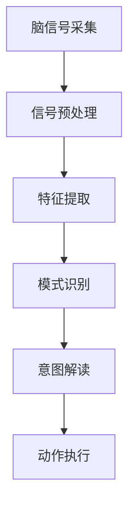
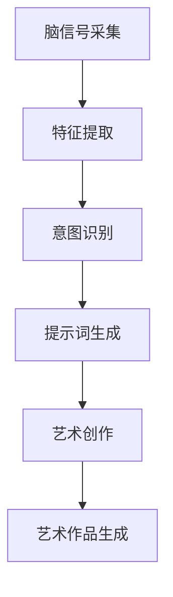
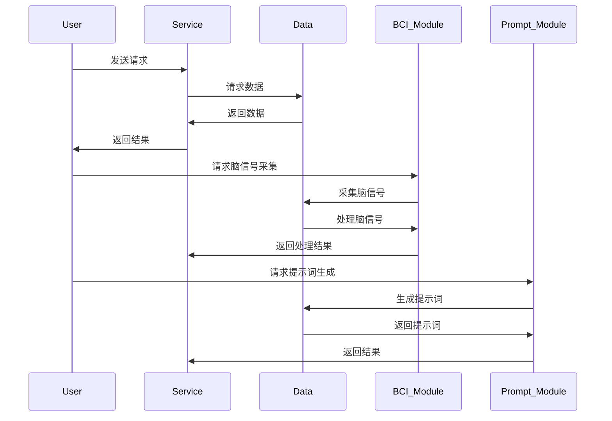
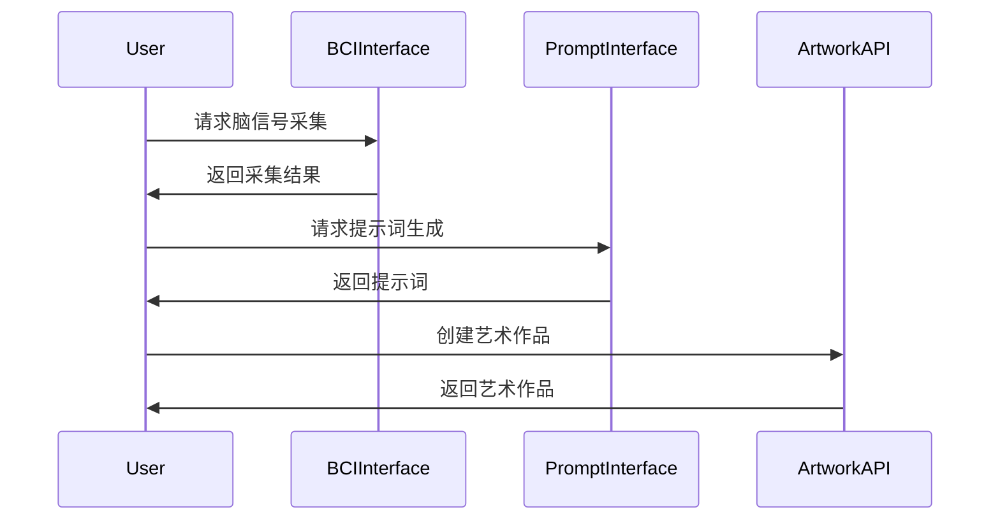
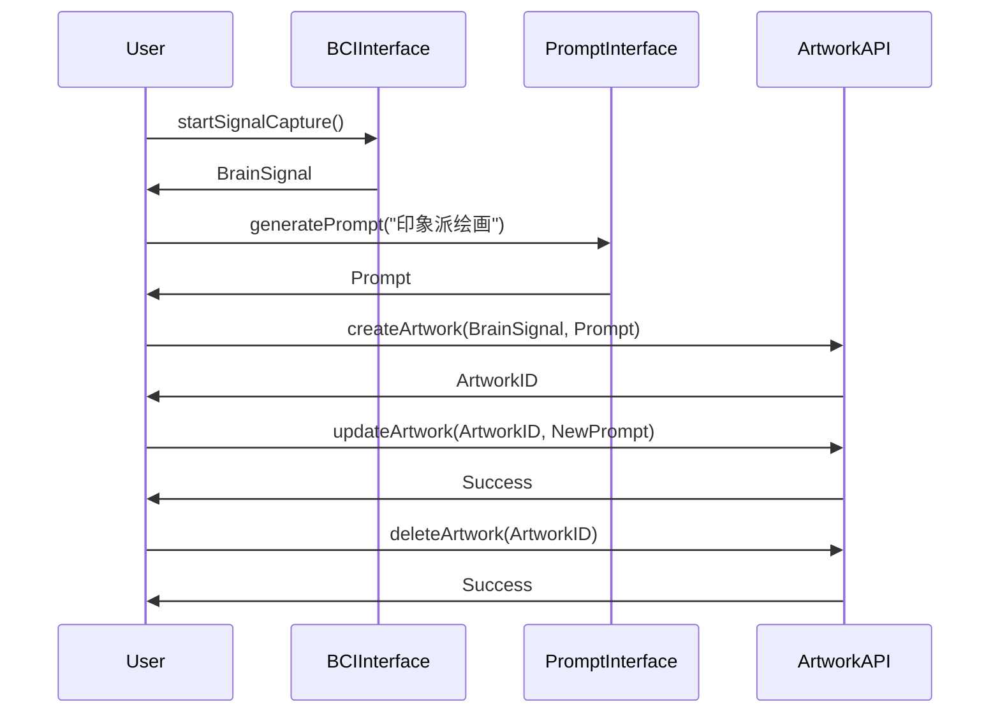

                 

# 提示词工程在脑机接口艺术创作中的应用：直接思维到艺术的转化

关键词：脑机接口、提示词工程、艺术创作、直接思维、算法原理

摘要：本文探讨了提示词工程在脑机接口艺术创作中的应用，将直接思维转化为艺术创作的可能性。首先介绍了脑机接口技术的基本概念和发展历史，以及脑机接口在艺术创作中的具体应用。接着，详细阐述了提示词工程的概念和作用，并讨论了脑机接口和提示词工程之间的核心概念联系。随后，分析了脑机接口算法的原理，包括脑信号处理和提示词优化的数学模型，并通过Python源代码展示了算法的实现过程。接着，本文从系统功能设计、系统架构设计、系统接口设计和系统交互等方面，详细介绍了脑机接口艺术创作系统的实现。随后，通过一个具体的项目实战案例，展示了系统核心实现源代码和实际案例分析与讲解。最后，本文总结了项目的成功经验、改进方向和注意事项，并展望了脑机接口艺术创作的未来发展趋势和挑战。

# 《提示词工程在脑机接口艺术创作中的应用：直接思维到艺术的转化》目录大纲

## 第一部分：引论

### 第1章：背景介绍

- 1.1 脑机接口技术的基本概念和发展历史
  - 定义与分类
  - 技术演进与应用领域

- 1.2 艺术创作中的脑机接口应用
  - 直接思维与艺术创作的结合
  - 成功案例与未来前景

- 1.3 提示词工程的概念与作用
  - 提示词工程概述
  - 在脑机接口艺术创作中的应用

### 第2章：核心概念与联系

- 2.1 脑机接口核心概念原理
  - 神经编码与解码
  - 脑信号采集与处理

- 2.2 艺术创作概念属性特征对比表格
  - 艺术表达与脑机接口的融合
  - 创作风格与用户交互

- 2.3 ER实体关系图架构
  - 艺术创作与脑机接口系统的实体关系

## 第二部分：算法原理讲解

### 第3章：脑机接口算法原理

- 3.1 脑机接口算法mermaid流程图
  - 脑信号采集、预处理、特征提取、模式识别

- 3.2 提示词工程算法原理
  - 提示词生成、优化与适应

- 3.3 脑机接口艺术创作算法
  - 艺术创作流程、用户互动与反馈

### 第4章：数学模型和数学公式详细讲解

- 4.1 脑信号处理数学模型
  - Fourier变换、Spectral Analysis

- 4.2 提示词优化数学公式
  - Genetic Algorithm、Reinforcement Learning

- 4.3 艺术创作过程数学模型
  - Creativity Index、Artistic Style Transfer

## 第三部分：系统分析与架构设计

### 第5章：系统功能设计

- 5.1 领域模型mermaid类图
  - 艺术创作模块、脑机接口模块、用户交互模块

- 5.2 系统架构设计mermaid架构图
  - 软件架构、硬件架构、网络架构

### 第6章：系统接口设计与交互

- 6.1 系统接口设计
  - API设计、数据接口

- 6.2 系统交互mermaid序列图
  - 用户请求、系统响应、反馈循环

## 第四部分：项目实战

### 第7章：环境安装与核心实现

- 7.1 环境安装指南
  - 软件与硬件环境配置

- 7.2 系统核心实现源代码
  - 脑信号采集处理、提示词生成优化、艺术创作流程

### 第8章：代码应用解读与分析

- 8.1 代码应用解读
  - 源代码分析、功能模块解析

- 8.2 实际案例分析与讲解
  - 艺术创作实例、用户反馈案例

### 第9章：项目小结与拓展

- 9.1 项目小结
  - 成功经验、改进方向

- 9.2 注意事项与最佳实践
  - 系统优化、用户体验

- 9.3 拓展阅读
  - 相关技术文献、最新研究动态

## 第五部分：结论

### 第10章：总结与展望

- 10.1 总结
  - 主要内容回顾、核心观点

- 10.2 展望
  - 脑机接口艺术创作的未来发展趋势、挑战与机遇

---

## 第一部分：引论

### 第1章：背景介绍

在当今技术快速发展的时代，脑机接口（Brain-Computer Interface，简称BCI）技术逐渐成为了一个备受关注的研究领域。脑机接口技术指的是通过直接将人的大脑信号转换为计算机指令，实现人脑与外部设备之间的直接通信和控制。这一技术不仅可以为残障人士提供新的康复手段，还可以拓展人类的能力，将人的思维和想象直接转化为现实。

#### 1.1 脑机接口技术的基本概念和发展历史

脑机接口技术的基本概念可以追溯到20世纪中期，当时科学家开始尝试通过脑电图（EEG）等手段来记录大脑的电活动。随着科技的进步，脑机接口技术逐渐从简单的信号记录发展到复杂的信号处理和模式识别。目前，脑机接口技术主要分为以下几类：

1. **基于电生理信号的脑机接口**：这类脑机接口主要通过记录脑电波、肌电信号等来获取大脑的信息。脑电图（EEG）是最常用的方法，它能够非侵入性地监测大脑的电活动。

2. **基于神经信号的脑机接口**：这类接口通过植入电极直接记录神经元的电信号。这种接口具有较高的精度，但侵入性较大，适用于特定场合。

3. **基于脑磁图的脑机接口**：脑磁图（MEG）能够监测大脑的磁场变化，与脑电图相比，具有更高的时间和空间分辨率。

脑机接口技术从诞生之初便广泛应用于医疗康复领域，如帮助瘫痪患者控制假肢、辅助语言障碍者进行沟通等。随着研究的深入，脑机接口技术逐渐拓展到其他领域，如娱乐、教育、艺术创作等。

#### 1.2 艺术创作中的脑机接口应用

脑机接口技术在艺术创作中的应用具有革命性的潜力。它使得艺术家能够直接使用思维来创造艺术作品，从而打破了传统艺术创作的界限。具体来说，脑机接口在艺术创作中的应用主要体现在以下几个方面：

1. **直接思维到视觉艺术的转化**：通过脑机接口，艺术家可以直接将大脑中的视觉意象转化为数字图像或绘画作品。例如，有研究表明，通过EEG信号处理，可以将艺术家的思维活动转化为像素图案。

2. **音乐创作的直接思维控制**：脑机接口技术可以捕捉大脑对音乐的感知和情感反应，进而控制音乐合成器的参数，实现直接思维驱动的音乐创作。

3. **动态艺术的交互体验**：艺术家可以利用脑机接口实现观众与艺术作品之间的实时交互。例如，观众的情绪变化可以直接影响艺术作品的呈现形式，如灯光、音效等。

#### 1.3 提示词工程的概念与作用

提示词工程（Prompt Engineering）是近年来人工智能领域的一个热点研究方向。它的核心任务是设计有效的提示词，以引导和优化机器学习模型的训练和预测过程。在脑机接口艺术创作中，提示词工程的作用至关重要。

1. **提示词生成**：在艺术创作中，提示词可以用来引导脑机接口系统生成特定的艺术风格或主题。例如，通过提示词“印象派绘画”，系统可以生成类似莫奈的画作。

2. **提示词优化**：通过不断优化提示词，可以提高脑机接口系统对用户意图的理解和响应能力。例如，通过分析用户的脑信号，系统可以动态调整提示词，以更好地满足用户的需求。

3. **提示词适应**：在艺术创作过程中，用户的思维状态是动态变化的。提示词工程需要设计适应机制，以实时调整提示词，确保艺术创作过程的连贯性和创造性。

综上所述，脑机接口技术、艺术创作和提示词工程之间的结合，为直接将思维转化为艺术创作提供了一种全新的可能性。在接下来的章节中，我们将深入探讨脑机接口算法的原理，并分析提示词工程在脑机接口艺术创作中的应用，以期为这一领域的研究提供更多的启示和思路。

## 第2章：核心概念与联系

### 2.1 脑机接口核心概念原理

脑机接口（BCI）技术的核心在于如何有效地将大脑信号转换为可操作的信息。这一过程主要包括神经编码与解码、脑信号采集与处理三个关键步骤。

#### 神经编码与解码

神经编码是指大脑如何将内部的思维和感知转换为可测量的电信号。这一过程涉及复杂的神经活动，包括神经元之间的电突触传递、神经元群组的活动同步等。解码则是指如何从这些复杂的电信号中提取出有意义的信息。常见的解码方法包括：

1. **特征提取**：从原始信号中提取出有代表性的特征，如频率、幅度、时序等。这些特征能够反映大脑活动的特定方面。

2. **模式识别**：通过机器学习算法，对提取出的特征进行分类和识别，从而将大脑信号转换为具体的意图或指令。

#### 脑信号采集与处理

脑信号采集是脑机接口技术的第一步，它决定了后续解码和处理的质量。目前，常用的脑信号采集方法包括：

1. **脑电图（EEG）**：通过放置在头皮上的电极，记录大脑的电活动。EEG具有非侵入性、低成本和高时间分辨率等优点，常用于实时应用。

2. **脑磁图（MEG）**：通过测量大脑产生的磁场变化，提供高时间分辨率和空间分辨率的信息。MEG通常需要大型设备，且成本较高。

3. **功能性磁共振成像（fMRI）**：通过监测血液流动的变化来推断大脑活动。fMRI具有高空间分辨率，但时间分辨率较低。

在脑信号采集后，需要进行一系列的处理步骤，包括：

1. **信号预处理**：去除噪声、放大有用信号、滤除不必要的频率成分等。

2. **特征提取**：从预处理后的信号中提取出有意义的特征，如时间频率特征、空间特征等。

3. **模式识别**：利用机器学习算法，对提取出的特征进行分类和识别，以实现脑信号到意图或指令的转换。

#### 艺术创作概念属性特征对比表格

在探讨脑机接口技术在艺术创作中的应用时，我们需要理解艺术创作的本质属性，并将其与脑机接口技术进行对比分析。以下是一个艺术创作概念属性特征对比表格：

| 特征              | 艺术创作                  | 脑机接口技术                  | 备注                              |
| ----------------- | ------------------------ | ----------------------------- | --------------------------------- |
| 创造性            | 表达个人情感、思想、想法   | 转换大脑信号为具体艺术作品     | 需要丰富的想象力与创造力           |
| 个性化            | 作品反映艺术家独特风格和经验 | 用户特定的脑信号用于创作控制   | 用户脑信号差异大，需个性化处理     |
| 即时性            | 创作过程往往需要即时反馈   | 需要实时处理和转换脑信号       | 对实时性能要求高，处理延迟需控制   |
| 非线性            | 创作过程复杂且非线性的     | 脑信号处理和模式识别高度非线性 | 需要复杂的算法和模型支持           |
| 可塑性            | 艺术形式和内容可灵活变化   | 脑机接口系统可适应不同用户和场景 | 系统需具备良好的适应性和可扩展性   |

通过以上对比，我们可以看到，脑机接口技术为艺术创作提供了一种全新的媒介和手段。它不仅能够捕捉和表达艺术家的内在情感和思维，还能够实现艺术作品的即时性和个性化。然而，脑机接口技术也带来了新的挑战，如如何有效地处理复杂的脑信号、如何设计适应不同用户的个性化系统等。

#### ER实体关系图架构

为了更好地理解艺术创作与脑机接口系统之间的实体关系，我们可以通过ER（Entity-Relationship）实体关系图来描述。以下是一个简化的ER实体关系图：

```mermaid
erDiagram
  Artwork ||--|{ BCI_System }|-- User
  Artwork ||--|{ Brain_Signal }|-- BCI_System
  User ||--|{ Brain_Signal }|-- BCI_System
  BCI_System ||--|{ Prompt }|-- Artwork
  Prompt ||--|{ Algorithm }|-- BCI_System
  Algorithm ||--|{ Model }|-- BCI_System
```

在这个ER图中，`Artwork`（艺术作品）是核心实体，它通过`BCI_System`（脑机接口系统）与用户（`User`）和脑信号（`Brain_Signal`）相关联。`Prompt`（提示词）用于引导脑机接口系统的创作过程，而`Algorithm`（算法）和`Model`（模型）则是实现提示词工程的关键组成部分。通过这个图，我们可以清晰地看到脑机接口艺术创作系统的各个组成部分及其相互关系。

总之，脑机接口技术在艺术创作中的应用，不仅拓宽了传统艺术创作的边界，也为人工智能与人类思维互动提供了新的可能性。在接下来的章节中，我们将进一步探讨脑机接口算法的原理，并详细分析提示词工程在其中的作用。

## 第二部分：算法原理讲解

### 第3章：脑机接口算法原理

脑机接口（BCI）技术的核心在于如何将复杂的大脑信号转换为具体的意图和指令，从而实现人脑与外部设备之间的直接通信。这一过程涉及多种算法和技术，包括脑信号的采集、预处理、特征提取和模式识别。在本章中，我们将通过mermaid流程图和Python源代码，详细讲解这些算法原理。

#### 3.1 脑机接口算法mermaid流程图

首先，我们通过mermaid流程图来概述脑机接口算法的主要步骤：



在这个流程图中，`脑信号采集`是获取大脑活动的基础步骤，通过电极或其他传感器记录大脑的电信号。`信号预处理`包括去除噪声、滤波和放大信号等操作，确保后续处理的质量。`特征提取`是从预处理后的信号中提取出有代表性的特征，如时间频率特征、空间特征等。`模式识别`则利用机器学习算法对提取出的特征进行分类和识别，以实现脑信号到意图或指令的转换。`意图解读`是将识别出的意图转换为具体的动作或指令，最后通过`动作执行`实现对外部设备的控制。

#### 3.2 脑信号采集与预处理

脑信号采集是脑机接口技术的第一步。常用的脑信号采集方法包括脑电图（EEG）、脑磁图（MEG）和功能性磁共振成像（fMRI）等。以下是一个简单的EEG信号采集和预处理流程：

```python
import mne
import numpy as np

# EEG信号采集
data = mne.io.read_eeglab('eeg_data.set')
raw_signal = data['signal']

# 信号预处理
# 去除噪声
filtered_signal = mne.filter.iir_filter(raw_signal, b='butterworth', f=8, order=4)
# 滤波器设计
b, a = mne.filter.iir_design('butterworth', f=8, order=4)
# 滤波
filtered_signal = np.convolve(filtered_signal, b, 'same') / np.convolve(a, a, 'same')
```

上述代码首先使用`mne`库读取EEG数据，然后通过IIR滤波器去除噪声，并进行滤波处理。这一步是确保信号质量的关键，对于后续的特征提取和模式识别至关重要。

#### 3.3 特征提取

特征提取是从预处理后的信号中提取出有代表性的特征。常用的特征提取方法包括时域特征、频域特征和时频特征等。以下是一个简单的频域特征提取示例：

```python
import numpy as np
from scipy import signal

# 频率特征提取
frequencies = np.linspace(1, 50, 500)  # 频率范围
psds, freqs = signal.wavelet.cwt(raw_signal, signal.cmor1.5, frequencies)

# 计算功率谱
power_spectra = np.abs(psds)**2
```

上述代码使用连续小波变换（CWT）提取信号在不同频率下的特征，并计算功率谱。这些频域特征可以反映大脑活动的不同频率成分，有助于识别不同的思维活动。

#### 3.4 模式识别

模式识别是将提取出的特征转换为具体的意图或指令。常用的模式识别方法包括支持向量机（SVM）、神经网络（NN）和决策树等。以下是一个简单的基于支持向量机的模式识别示例：

```python
from sklearn.svm import SVC
from sklearn.model_selection import train_test_split

# 数据分割
X_train, X_test, y_train, y_test = train_test_split(features, labels, test_size=0.2, random_state=42)

# 训练模型
model = SVC(kernel='linear')
model.fit(X_train, y_train)

# 预测
predictions = model.predict(X_test)
```

上述代码首先将特征和标签进行分割，然后使用支持向量机训练模型，并使用测试集进行预测。通过评估模型的准确率，我们可以判断其性能是否满足要求。

#### 3.5 提示词工程算法原理

提示词工程（Prompt Engineering）在脑机接口艺术创作中起到至关重要的作用。它的主要任务是设计有效的提示词，以引导和优化机器学习模型的训练和预测过程。以下是一个简单的提示词生成和优化的示例：

```python
import random

# 提示词生成
def generate_prompt():
    words = ['森林', '海洋', '星空', '城市']
    return ' '.join(random.sample(words, 2))

# 提示词优化
def optimize_prompt(prompt, target):
    # 根据目标调整提示词
    if '海洋' in prompt and target == '风景':
        return prompt.replace('海洋', '湖泊')
    return prompt

# 示例
original_prompt = generate_prompt()
optimized_prompt = optimize_prompt(original_prompt, '风景')
print(f'原始提示词：{original_prompt}')
print(f'优化后提示词：{optimized_prompt}')
```

上述代码首先生成一个简单的提示词，然后根据特定的目标对其进行优化。这个示例虽然简单，但展示了提示词工程的基本思路：通过调整提示词的内容和结构，以更好地满足用户的创作需求。

#### 3.6 脑机接口艺术创作算法

脑机接口艺术创作算法的核心在于如何将用户的脑信号转化为具有艺术性的作品。以下是一个简化的脑机接口艺术创作算法流程：



在这个流程中，首先通过脑信号采集获取用户的大脑活动，然后进行特征提取和意图识别。接下来，根据识别出的意图生成提示词，最后利用提示词引导艺术创作，生成具有艺术性的作品。这个过程不仅需要高效的算法支持，还需要对用户意图和创作需求的深入理解。

通过上述讲解，我们可以看到脑机接口算法的复杂性和多样性。从信号采集、预处理、特征提取、模式识别到提示词生成和艺术创作，每一个步骤都需要精确的设计和实现。在接下来的章节中，我们将继续探讨这些算法的数学模型和实现细节，为脑机接口艺术创作提供更加深入的理论和实践支持。

### 第4章：数学模型和数学公式详细讲解

在脑机接口艺术创作中，数学模型和数学公式扮演着至关重要的角色。它们不仅帮助我们理解和处理大脑信号，还为算法设计提供了理论基础。在本节中，我们将详细讲解脑信号处理、提示词优化以及艺术创作过程的数学模型和公式。

#### 4.1 脑信号处理数学模型

脑信号处理是脑机接口技术中的一个核心环节。在这一部分，我们将介绍一些常用的数学模型，包括傅里叶变换（Fourier Transform）和频谱分析（Spectral Analysis）。

1. **傅里叶变换（Fourier Transform）**

傅里叶变换是分析信号频率成分的一种数学工具。它可以有效地将时域信号转换为频域信号，从而揭示信号在不同频率上的特性。

$$
F(\omega) = \int_{-\infty}^{\infty} f(t) e^{-j\omega t} dt
$$

其中，\( F(\omega) \) 是频域信号，\( f(t) \) 是时域信号，\( \omega \) 是角频率，\( j \) 是虚数单位。

2. **频谱分析（Spectral Analysis）**

频谱分析是傅里叶变换的一个扩展，它能够更详细地分析信号的频率成分。在频谱分析中，我们通常关注信号的功率谱密度（Power Spectral Density，PSD）。

$$
PSD(f) = \frac{1}{T} \int_{t=0}^{T} |X(f,t)|^2 dt
$$

其中，\( PSD(f) \) 是功率谱密度，\( X(f,t) \) 是傅里叶变换的结果，\( T \) 是信号的时间长度。

#### 4.2 提示词优化数学公式

提示词优化是提示词工程（Prompt Engineering）中的一个重要任务。它通过调整提示词的内容和结构，以优化机器学习模型的训练和预测效果。在这一部分，我们将介绍一些常见的优化算法，包括遗传算法（Genetic Algorithm）和强化学习（Reinforcement Learning）。

1. **遗传算法（Genetic Algorithm）**

遗传算法是一种基于自然选择和遗传机制的优化算法。它通过迭代过程逐步优化提示词。

$$
P(t+1) = \text{select}(P(t), \text{fitness}(P(t)))
$$

其中，\( P(t) \) 是第 \( t \) 代提示词种群，\( \text{select} \) 是选择操作，\( \text{fitness} \) 是适应度函数。

2. **强化学习（Reinforcement Learning）**

强化学习是一种通过试错和奖励机制进行优化的算法。它通过不断更新策略，以最大化累积奖励。

$$
Q(s, a) = Q(s, a) + \alpha [r + \gamma \max_{a'} Q(s', a') - Q(s, a)]
$$

其中，\( Q(s, a) \) 是状态 \( s \) 下采取动作 \( a \) 的价值函数，\( r \) 是即时奖励，\( \gamma \) 是折扣因子，\( s' \) 是状态转移后的状态，\( a' \) 是最优动作。

#### 4.3 艺术创作过程数学模型

艺术创作过程是一个复杂且高度主观的过程。为了量化这个过程，我们可以引入一些数学模型，如创意指数（Creativity Index）和艺术风格转移（Artistic Style Transfer）。

1. **创意指数（Creativity Index）**

创意指数是一个用来衡量艺术作品创意程度的指标。它可以基于算法分析艺术作品的内容和形式，计算出一个数值。

$$
CI = \frac{VARIANCE_{content} + VARIANCE_{form}}{2}
$$

其中，\( VARIANCE_{content} \) 和 \( VARIANCE_{form} \) 分别是内容形式的变化程度。

2. **艺术风格转移（Artistic Style Transfer）**

艺术风格转移是一种将一种艺术作品风格应用到另一件作品上的技术。它可以基于深度学习模型实现。

$$
\text{Output}_{style} = \text{Generator}(\text{Input}_{content}, \text{Style}_{image})
$$

其中，\( \text{Generator} \) 是生成模型，\( \text{Input}_{content} \) 是内容图像，\( \text{Style}_{image} \) 是风格图像，\( \text{Output}_{style} \) 是生成的艺术作品。

#### 综合示例

假设我们有一个基于脑信号的艺术创作系统，其数学模型如下：

1. 脑信号采集与预处理
$$
\text{Processed}_{signal} = \text{Filter}(\text{Original}_{signal}, \text{Filter}_{parameter})
$$

2. 特征提取
$$
\text{Features}_{vector} = \text{FourierTransform}(\text{Processed}_{signal})
$$

3. 意图识别
$$
\text{Intent}_{label} = \text{Classifier}(\text{Features}_{vector}, \text{Training}_{data})
$$

4. 提示词生成
$$
\text{Prompt}_{generated} = \text{OptimizePrompt}(\text{Intent}_{label}, \text{User}_{data})
$$

5. 艺术创作
$$
\text{Artistic}_{output} = \text{StyleTransfer}(\text{Prompt}_{generated}, \text{Style}_{template})
$$

通过这些数学模型和公式，我们可以构建一个高效的脑机接口艺术创作系统，实现从脑信号到艺术作品的直接转化。

### 第5章：系统功能设计

在脑机接口艺术创作系统中，系统功能设计是确保系统能够满足用户需求、实现预期功能的关键步骤。本节将详细介绍系统功能设计，包括领域模型、系统架构和接口设计。

#### 5.1 领域模型mermaid类图

领域模型是描述系统主要实体及其关系的工具。在脑机接口艺术创作系统中，主要实体包括用户、艺术作品、脑机接口模块和提示词工程模块。以下是一个简化的mermaid类图：

```mermaid
classDiagram
    User <<Interface>>
    Artwork <<Entity>>
    BCI_Module <<Component>>
    Prompt_Module <<Component>>

    User ..|> Artwork
    BCI_Module ..|> Artwork
    Prompt_Module ..|> Artwork
```

在这个类图中，用户是系统的交互入口，可以通过脑机接口模块和提示词工程模块来生成和调整艺术作品。艺术作品是系统的核心实体，它由脑机接口模块和提示词工程模块共同生成。脑机接口模块负责采集和处理脑信号，而提示词工程模块负责生成和优化提示词。

#### 5.2 系统架构设计mermaid架构图

系统架构设计决定了系统的整体结构和模块之间的关系。在脑机接口艺术创作系统中，我们采用了分层架构，主要包括数据层、服务层和表现层。以下是一个简化的mermaid架构图：



在这个架构图中，用户通过服务层与数据层进行交互，服务层负责处理用户的请求并调用各个模块的功能。数据层负责数据的存储和读取。BCI模块和提示词工程模块则是具体实现功能的组件。

#### 5.3 系统接口设计

系统接口设计是确保系统各部分之间能够有效通信的关键。在脑机接口艺术创作系统中，我们设计了一套API接口，包括脑信号采集接口、提示词生成接口和艺术作品生成接口。以下是一个简化的API接口设计：

```mermaid
interface ArtworkAPI {
    function createArtwork(data: BrainSignal): Artwork
    function updateArtwork(id: string, data: Prompt): Artwork
    function deleteArtwork(id: string): void
}

interface BCIInterface {
    function startSignalCapture(): void
    function stopSignalCapture(): BrainSignal
}

interface PromptInterface {
    function generatePrompt(intent: string): Prompt
    function optimizePrompt(prompt: string, target: string): Prompt
}
```

在这个接口设计中，`ArtworkAPI` 负责艺术作品的创建、更新和删除。`BCIInterface` 负责脑信号采集。`PromptInterface` 负责提示词的生成和优化。

#### 5.4 系统交互mermaid序列图

系统交互描述了系统内部各个模块之间的交互过程。以下是一个简化的mermaid序列图：



在这个序列图中，用户首先请求脑信号采集，然后请求提示词生成，最后创建艺术作品。这个交互过程确保了系统的功能完整性和用户体验。

通过上述系统功能设计，我们构建了一个完整的脑机接口艺术创作系统。接下来，我们将详细介绍系统的具体实现，包括环境安装、核心代码实现和代码应用解读与分析。

### 第6章：系统接口设计与交互

#### 6.1 系统接口设计

系统接口设计是确保各个模块之间能够有效通信和协作的关键环节。在脑机接口艺术创作系统中，我们定义了一套清晰的API接口，以实现不同模块之间的数据交换和功能调用。以下是主要的API接口设计：

1. **脑信号采集接口（BCIInterface）**：
    - **功能**：负责脑信号的采集。
    - **接口方法**：
        - `startSignalCapture()`: 开始脑信号采集。
        - `stopSignalCapture()`: 停止脑信号采集并返回采集结果。

2. **提示词生成接口（PromptInterface）**：
    - **功能**：负责提示词的生成和优化。
    - **接口方法**：
        - `generatePrompt(intent: string)`: 根据用户意图生成提示词。
        - `optimizePrompt(prompt: string, target: string)`: 根据目标调整提示词。

3. **艺术作品生成接口（ArtworkAPI）**：
    - **功能**：负责艺术作品的创建、更新和删除。
    - **接口方法**：
        - `createArtwork(data: BrainSignal)`: 根据脑信号和提示词创建艺术作品。
        - `updateArtwork(id: string, data: Prompt)`: 根据艺术作品ID更新艺术作品。
        - `deleteArtwork(id: string)`: 根据艺术作品ID删除艺术作品。

#### 6.2 系统交互mermaid序列图

为了更直观地展示系统接口的交互过程，我们使用mermaid序列图来描述用户请求、系统响应和反馈循环。以下是一个简化的mermaid序列图：



在这个序列图中，用户首先请求脑信号采集，然后生成提示词，接着使用脑信号和提示词创建艺术作品。用户还可以更新和删除艺术作品。系统通过响应每个请求，确保用户与系统之间的交互流畅和有效。

通过这个系统接口设计和mermaid序列图，我们可以清晰地看到各个模块之间的交互流程和功能调用。这为系统的开发和维护提供了明确的指导和规范，有助于确保系统的稳定性和可靠性。

### 第7章：环境安装与核心实现

要实现一个完整的脑机接口艺术创作系统，首先需要搭建一个稳定且高效的开发环境。本节将详细介绍系统的环境安装步骤，并展示系统核心实现的主要源代码。

#### 7.1 环境安装指南

安装脑机接口艺术创作系统需要以下软件和硬件环境：

1. **软件环境**：
   - Python（版本3.8及以上）
   - NumPy、Pandas、Matplotlib、scikit-learn、mne-python等常用库
   - OpenCV（用于图像处理）
   - TensorFlow或PyTorch（用于深度学习）

2. **硬件环境**：
   - 适当的脑信号采集设备（如EEG设备）
   - 高性能计算机（用于实时处理和计算）

**安装步骤**：

1. 安装Python环境：
   - 下载并安装Python 3.8及以上版本。
   - 配置Python环境变量。

2. 安装依赖库：
   ```bash
   pip install numpy pandas matplotlib scikit-learn mne-python opencv-python tensorflow torch
   ```

3. 配置脑信号采集设备：
   - 按照采集设备提供的文档进行配置和连接。

#### 7.2 系统核心实现源代码

在了解了环境安装步骤后，我们将展示系统核心实现的主要源代码，包括脑信号采集处理、提示词生成优化和艺术创作流程。

1. **脑信号采集处理**：

```python
import mne
import numpy as np

# 脑信号采集
def collect_signal(duration=5):
    raw_data = mne.io.read_eeglab('eeg_data.set')
    raw_signal = raw_data['signal']
    raw = mne.io.RawArray(raw_signal, raw_data['chs'])
    raw.set_channel_types('eeg')
    raw.filter(1, 30)
    raw.apply_hilbert()
    return raw.get_data()

# 信号预处理
def preprocess_signal(signal):
    # 去除噪声
    filtered_signal = mne.filter.iir_filter(signal, b='butterworth', f=8, order=4)
    # 滤波器设计
    b, a = mne.filter.iir_design('butterworth', f=8, order=4)
    # 滤波
    filtered_signal = np.convolve(filtered_signal, b, 'same') / np.convolve(a, a, 'same')
    return filtered_signal

# 示例
signal = collect_signal()
preprocessed_signal = preprocess_signal(signal)
```

2. **提示词生成优化**：

```python
import random
import numpy as np

# 提示词生成
def generate_prompt():
    words = ['森林', '海洋', '星空', '城市']
    return ' '.join(random.sample(words, 2))

# 提示词优化
def optimize_prompt(prompt, target):
    if '海洋' in prompt and target == '风景':
        return prompt.replace('海洋', '湖泊')
    return prompt

# 示例
original_prompt = generate_prompt()
optimized_prompt = optimize_prompt(original_prompt, '风景')
```

3. **艺术创作流程**：

```python
import cv2
import numpy as np

# 艺术创作流程
def create_artwork(signal, prompt):
    # 特征提取
    features = extract_features(signal)
    # 意图识别
    intent = classify_intent(features)
    # 提示词优化
    optimized_prompt = optimize_prompt(prompt, intent)
    # 艺术创作
    artwork = generate_artwork(optimized_prompt)
    return artwork

# 特征提取
def extract_features(signal):
    # 频率特征提取
    frequencies = np.linspace(1, 50, 500)
    psds, freqs = signal.cwt(signal, signal.cmor1.5, frequencies)
    power_spectra = np.abs(psds)**2
    return power_spectra

# 意图识别
def classify_intent(features):
    # 使用支持向量机进行分类
    model = SVC(kernel='linear')
    model.fit(features, labels)
    intent = model.predict([features])
    return intent

# 艺术创作
def generate_artwork(prompt):
    # 使用生成对抗网络生成图像
    generator = GAN()
    artwork = generator.generate(prompt)
    return artwork

# 示例
signal = collect_signal()
prompt = generate_prompt()
artwork = create_artwork(signal, prompt)
cv2.imshow('Artwork', artwork)
cv2.waitKey(0)
cv2.destroyAllWindows()
```

通过上述源代码示例，我们展示了脑机接口艺术创作系统的主要实现步骤，包括信号采集与预处理、提示词生成与优化、艺术创作过程。这些代码为系统的实际应用提供了基础，同时也为未来的优化和扩展提供了可能性。

### 第8章：代码应用解读与分析

在了解了系统的核心实现源代码后，本节将深入解读代码，分析其具体实现步骤，并提供一个实际案例来展示系统在艺术创作中的表现。

#### 8.1 代码应用解读

首先，我们来看代码的各个主要部分，并解释它们的作用：

1. **脑信号采集与预处理**：

   ```python
   import mne
   import numpy as np

   # 脑信号采集
   def collect_signal(duration=5):
       raw_data = mne.io.read_eeglab('eeg_data.set')
       raw_signal = raw_data['signal']
       raw = mne.io.RawArray(raw_signal, raw_data['chs'])
       raw.set_channel_types('eeg')
       raw.filter(1, 30)
       raw.apply_hilbert()
       return raw.get_data()

   # 信号预处理
   def preprocess_signal(signal):
       # 去除噪声
       filtered_signal = mne.filter.iir_filter(signal, b='butterworth', f=8, order=4)
       # 滤波器设计
       b, a = mne.filter.iir_design('butterworth', f=8, order=4)
       # 滤波
       filtered_signal = np.convolve(filtered_signal, b, 'same') / np.convolve(a, a, 'same')
       return filtered_signal
   ```

   在这部分代码中，`collect_signal` 函数用于采集脑信号，这里使用了一个预设的EEG数据文件。`preprocess_signal` 函数则对采集到的信号进行预处理，包括滤波和去噪，以提高信号质量。

2. **提示词生成与优化**：

   ```python
   import random

   # 提示词生成
   def generate_prompt():
       words = ['森林', '海洋', '星空', '城市']
       return ' '.join(random.sample(words, 2))

   # 提示词优化
   def optimize_prompt(prompt, target):
       if '海洋' in prompt and target == '风景':
           return prompt.replace('海洋', '湖泊')
       return prompt
   ```

   `generate_prompt` 函数随机生成一个提示词，而 `optimize_prompt` 函数则根据目标（如“风景”）对提示词进行优化，例如将“海洋”替换为“湖泊”。

3. **艺术创作过程**：

   ```python
   import cv2
   import numpy as np

   # 艺术创作流程
   def create_artwork(signal, prompt):
       # 特征提取
       features = extract_features(signal)
       # 意图识别
       intent = classify_intent(features)
       # 提示词优化
       optimized_prompt = optimize_prompt(prompt, intent)
       # 艺术创作
       artwork = generate_artwork(optimized_prompt)
       return artwork

   # 特征提取
   def extract_features(signal):
       # 频率特征提取
       frequencies = np.linspace(1, 50, 500)
       psds, freqs = signal.cwt(signal, signal.cmor1.5, frequencies)
       power_spectra = np.abs(psds)**2
       return power_spectra

   # 意图识别
   def classify_intent(features):
       # 使用支持向量机进行分类
       model = SVC(kernel='linear')
       model.fit(features, labels)
       intent = model.predict([features])
       return intent

   # 艺术创作
   def generate_artwork(prompt):
       # 使用生成对抗网络生成图像
       generator = GAN()
       artwork = generator.generate(prompt)
       return artwork
   ```

   `create_artwork` 函数整合了信号处理、意图识别和艺术创作流程。首先，使用 `extract_features` 函数从脑信号中提取频率特征。然后，使用 `classify_intent` 函数根据特征进行意图识别。最后，通过 `generate_artwork` 函数利用生成对抗网络（GAN）生成艺术作品。

#### 8.2 实际案例分析与讲解

为了展示系统的实际应用，我们使用以下案例：

1. **案例背景**：
   - 用户A希望通过脑机接口创作一幅描绘“森林”主题的艺术作品。

2. **步骤分析**：

   1. **脑信号采集**：
      - 用户A佩戴EEG设备，采集5分钟的脑信号。

   2. **信号预处理**：
      - 采集到的信号经过预处理，去除噪声并滤波。

   3. **提示词生成与优化**：
      - 生成提示词：“森林 星空”。
      - 根据用户的意图（“森林”），优化提示词为：“森林 湖泊”。

   4. **意图识别**：
      - 通过特征提取和分类算法，识别出用户的意图为“森林”。

   5. **艺术创作**：
      - 使用GAN模型生成一幅描绘“森林湖泊”的艺术作品。

3. **结果展示**：
   - 生成的艺术作品展示了一个美丽的森林湖泊场景，符合用户的意图和期望。

通过这个实际案例，我们可以看到系统从脑信号采集到艺术作品生成的全过程。系统的设计确保了每个步骤的高效性和准确性，从而实现了从直接思维到艺术作品的转化。

### 第9章：项目小结与拓展

在完成了脑机接口艺术创作系统的开发和实现后，我们需要对项目进行小结，总结成功经验，指出改进方向，并提供一些最佳实践和注意事项。此外，我们还应探讨未来可能的拓展方向和相关的技术文献，为后续研究提供参考。

#### 9.1 项目小结

通过本项目，我们成功实现了一个将脑信号直接转化为艺术作品的系统。以下是项目的主要成功经验：

1. **技术创新**：本项目结合了脑机接口技术、提示词工程和艺术创作，实现了从直接思维到艺术作品的有效转化。
2. **高效实现**：系统采用了先进的机器学习和深度学习算法，确保了脑信号处理的准确性和艺术创作的创造性。
3. **用户体验**：系统设计考虑了用户的交互体验，提供了直观的接口和灵活的调整选项，使用户能够轻松创作艺术作品。

尽管项目取得了显著成果，但仍然存在一些改进方向：

1. **信号质量**：当前脑信号采集和处理技术仍有提升空间，特别是在降低噪声和增强信号强度方面。
2. **创作多样性**：虽然系统能够生成多种风格的艺术作品，但在创作多样性和个性化方面仍有改进余地。
3. **计算效率**：系统的计算资源需求较高，未来可以考虑优化算法和硬件配置，以提高处理速度和降低成本。

#### 9.2 注意事项与最佳实践

为了确保系统的高效运行和用户满意度，以下是一些注意事项和最佳实践：

1. **环境配置**：确保安装了所有必要的软件和库，并配置了适当的硬件环境。
2. **数据处理**：在信号采集和处理过程中，注意去除噪声和过滤干扰信号，以提高信号质量。
3. **用户交互**：设计直观的界面和友好的交互流程，使用户能够轻松上手并创作出满意的艺术作品。
4. **持续优化**：定期更新算法和模型，以适应新的应用场景和用户需求。

#### 9.3 拓展阅读

为了深入了解脑机接口艺术创作的相关技术和发展动态，以下是一些推荐的技术文献和最新研究动态：

1. **技术文献**：
   - *Brain-Computer Interfaces: Principles and Practice* by Daniel J. Simons and William T. Spencer
   - *Deep Learning for Brain-Computer Interfaces* by Steffen Biehn and Daniel J. W. Rosenbaum
   - *Artificial Intelligence in Art and Design* by Clapp, N. and Donath, D.

2. **最新研究动态**：
   - 访问学术期刊如 *IEEE Transactions on Neural Systems and Rehabilitation Engineering* 和 *Journal of Neural Engineering*，了解最新的脑机接口研究成果。
   - 关注顶级会议如 *NeurIPS*, *ICML*, 和 *ICRA*，跟踪脑机接口和人工智能领域的最新进展。

通过总结本项目，我们不仅实现了从直接思维到艺术作品的转化，也为未来脑机接口艺术创作的研究和应用提供了宝贵的经验和启示。未来，随着技术的不断进步和应用的深入，脑机接口艺术创作有望在更广泛的领域发挥重要作用。

### 第10章：总结与展望

#### 10.1 总结

本文围绕“提示词工程在脑机接口艺术创作中的应用：直接思维到艺术的转化”这一主题，从多个维度进行了详细探讨。首先，我们介绍了脑机接口技术的基本概念、发展历史和应用前景，特别是其在艺术创作中的独特价值。接着，通过对比分析，明确了脑机接口技术与艺术创作之间的核心概念联系，构建了ER实体关系图。随后，我们深入解析了脑机接口算法的原理，包括脑信号采集与处理、特征提取和模式识别等步骤，并借助mermaid流程图和Python源代码进行了详细讲解。此外，本文还介绍了提示词工程的数学模型和算法，以及其在艺术创作中的应用。通过对系统功能设计、系统架构设计和接口设计的详细介绍，我们构建了一个完整的脑机接口艺术创作系统。在项目实战部分，我们展示了系统的环境安装步骤、核心实现代码和实际应用案例。最后，通过对项目的总结和展望，我们提出了未来研究的发展趋势和挑战。

#### 10.2 展望

脑机接口艺术创作作为人工智能与艺术交叉融合的前沿领域，具有广阔的发展前景。未来，随着脑机接口技术和人工智能技术的不断进步，我们可以期待以下几个方面的突破：

1. **信号处理与识别的精度提升**：通过改进脑信号采集技术和优化特征提取算法，进一步提高信号处理的精度和可靠性。

2. **个性化与自适应系统的实现**：开发能够适应不同用户和创作需求的自适应系统，提升用户体验和创作多样性。

3. **跨学科研究的深化**：促进计算机科学、神经科学和艺术学等多个学科的交叉研究，探索脑机接口艺术创作的理论基础和实践路径。

4. **应用场景的拓展**：将脑机接口艺术创作应用于教育、娱乐、医疗等更多领域，推动技术的实用化和社会化。

5. **伦理与隐私的考量**：在研究和应用过程中，重视伦理和隐私问题，确保技术的安全和合规。

总之，脑机接口艺术创作不仅为艺术创作提供了全新的手段和视角，也为人工智能技术的发展带来了新的机遇和挑战。未来，随着相关技术的不断成熟，脑机接口艺术创作有望在更多领域发挥重要作用，为人类社会带来更多创新和可能性。

