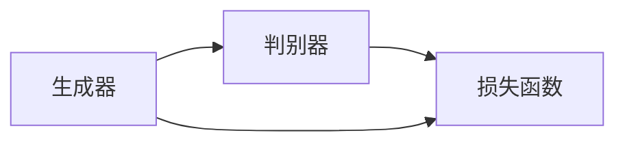

                 

# 提示词工程：AIGC效果与效率的双重提升

## 关键词

- **提示词工程**
- **AIGC**
- **效果提升**
- **效率提升**
- **人工智能**

## 摘要

本文深入探讨了提示词工程在人工智能生成内容（AIGC）中的应用，旨在通过优化提示词设计和提升算法性能，实现AIGC效果与效率的双重提升。文章首先介绍了提示词工程的基本概念和重要性，然后分析了AIGC的发展现状和面临的挑战。接着，本文详细阐述了提升AIGC效果的几种方法，包括数据预处理、模型选择与调优、特征提取与融合、以及生成式对抗网络（GAN）。此外，文章还探讨了提升AIGC效率的技术手段，如并行与分布式计算、模型压缩与量化、存储优化以及边缘计算与云计算结合。最后，通过实际案例解析，展示了提示词工程在AIGC中的应用效果，并提出了最佳实践建议和未来研究方向。

## 第1章 引言与背景

### 1.1 问题背景

在当今的信息化社会中，人工智能（AI）已经成为推动社会进步的重要力量。随着深度学习和神经网络技术的飞速发展，AI技术逐渐渗透到各个行业，从自然语言处理（NLP）到计算机视觉（CV），从推荐系统到自动驾驶，AI的应用场景越来越广泛。然而，尽管AI技术在许多领域取得了显著成果，但其在生成内容（Content Generation）方面的表现仍存在一定的局限性。

人工智能生成内容（AIGC）是指利用人工智能技术自动生成文本、图像、音频等多种形式的内容。AIGC具有高效、自动化、多样性的特点，在新闻写作、广告创意、虚拟助手等领域具有巨大的应用潜力。然而，AIGC在生成内容的质量、多样性和一致性方面仍面临诸多挑战。如何提升AIGC的效果和效率，成为当前研究的热点问题。

### 1.2 问题描述

AIGC效果和效率的问题主要体现在以下几个方面：

1. **内容质量**：生成的内容在语法、逻辑、情感等方面与人类创作的作品相比仍有较大差距，缺乏创造性和个性化。
2. **多样性**：AIGC生成的结果过于单一，缺乏多样性和创新性，难以满足用户对丰富内容的个性化需求。
3. **一致性**：生成的内容在风格、格式、主题等方面的一致性较差，影响用户体验。
4. **计算效率**：AIGC涉及大量的计算任务，对计算资源的需求较高，导致生成过程耗时较长。

### 1.3 问题解决思路

针对上述问题，我们可以从以下几个方面入手，提升AIGC的效果和效率：

1. **优化提示词设计**：通过设计更加精准、丰富的提示词，引导AIGC模型生成高质量的内容。
2. **改进数据预处理方法**：利用更高效的数据预处理技术，提高AIGC模型对数据的理解和利用能力。
3. **选择合适的模型和算法**：针对不同的应用场景，选择合适的模型和算法，优化模型结构和参数，提高生成内容的质量和多样性。
4. **提升计算效率**：通过并行与分布式计算、模型压缩与量化、存储优化等技术手段，降低计算成本，提高AIGC的生成速度。

### 1.4 边界与外延

在研究AIGC效果和效率的提升过程中，我们需要关注以下几个边界与外延：

1. **技术边界**：包括深度学习、神经网络、生成对抗网络等核心技术的最新进展和应用。
2. **应用边界**：AIGC在不同领域的应用场景和需求，如新闻写作、广告创意、虚拟助手等。
3. **伦理边界**：AIGC生成的内容可能涉及版权、隐私、伦理等问题，需要制定相应的规范和标准。
4. **产业发展**：AIGC技术的商业价值和应用前景，包括产业链的构建、商业模式的设计等。

### 1.5 概念结构与核心要素组成

为了更好地理解AIGC效果与效率提升的相关概念，我们可以从以下几个方面进行阐述：

1. **AIGC技术框架**：包括数据采集与预处理、模型选择与训练、生成内容评估与优化等环节。
2. **提示词工程**：设计高效的提示词，引导模型生成高质量的内容。
3. **数据预处理**：包括数据清洗、数据增强、数据归一化等步骤，提高模型对数据的理解和利用能力。
4. **模型优化**：通过模型选择、参数调整、结构优化等方法，提升模型性能。
5. **计算优化**：包括并行计算、分布式计算、模型压缩与量化等技术手段，降低计算成本，提高生成速度。

## 第2章 核心概念与联系

### 2.1 核心概念原理

在本章中，我们将详细介绍与AIGC效果与效率提升相关的一系列核心概念，包括提示词工程、数据预处理、模型选择与优化、计算优化等。

#### 提示词工程

提示词工程（Prompt Engineering）是设计用于引导和优化AI模型生成内容的一门技术。其核心思想是通过精心设计的提示词，引导模型理解用户意图，生成符合需求的高质量内容。

**原理**：
1. **提示词设计**：选择具有指导性和丰富性的提示词，引导模型生成特定类型的内容。
2. **提示词优化**：通过分析模型生成的结果，不断调整和优化提示词，提高生成内容的准确性和多样性。

#### 数据预处理

数据预处理是AIGC模型训练和优化的关键环节。有效的数据预处理可以提高模型对数据的理解和利用能力，从而提升生成内容的质量。

**原理**：
1. **数据清洗**：去除噪声数据和异常值，确保数据的质量和一致性。
2. **数据增强**：通过数据变换、扩充等方法，增加数据的多样性和丰富性，提高模型的泛化能力。
3. **数据归一化**：对数据进行标准化处理，消除数据量级差异，有助于模型训练的收敛。

#### 模型选择与优化

模型选择与优化是AIGC效果提升的重要手段。根据不同的应用场景和需求，选择合适的模型架构和优化策略，可以显著提高生成内容的质量和多样性。

**原理**：
1. **模型选择**：根据应用场景和数据特性，选择适合的模型架构，如Transformer、GAN等。
2. **模型优化**：
   - **参数调整**：调整模型参数，如学习率、批量大小等，优化模型性能。
   - **结构优化**：通过改进模型结构，如增加层次数、调整层间连接方式等，提高模型的表达能力。

#### 计算优化

计算优化是提升AIGC效率的关键。通过并行计算、分布式计算、模型压缩与量化等技术手段，可以显著降低计算成本，提高生成速度。

**原理**：
1. **并行计算**：利用多核CPU、GPU等硬件资源，实现计算任务的并行处理，提高计算效率。
2. **分布式计算**：将计算任务分布到多个节点上，利用分布式计算框架（如TensorFlow、PyTorch等），实现大规模模型的训练和推理。
3. **模型压缩与量化**：通过模型压缩和量化技术，减少模型参数和计算量，提高计算效率和存储效率。

### 2.2 概念属性特征对比表格

以下表格对比了提示词工程、数据预处理、模型选择与优化、计算优化等核心概念的属性特征：

| 核心概念 | 属性特征 |
| :----: | :----: |
| 提示词工程 | 设计精准、丰富性、引导性 |
| 数据预处理 | 数据清洗、增强、归一化 |
| 模型选择与优化 | 模型架构、参数调整、结构优化 |
| 计算优化 | 并行计算、分布式计算、模型压缩与量化 |

### 2.3 ER实体关系图架构

为了更直观地理解AIGC效果与效率提升的相关概念及其相互关系，我们可以使用ER（Entity-Relationship）实体关系图进行表示。以下是一个简化的ER图：

```mermaid
erDiagram
  AIGC <<|-- 提示词工程 : 引导与优化
  AIGC <<|-- 数据预处理 : 数据准备
  AIGC <<|-- 模型选择与优化 : 模型优化
  AIGC <<|-- 计算优化 : 计算效率
  提示词工程 ||--|{ 数据预处理 }
  模型选择与优化 ||--|{ 数据预处理 }
  计算优化 ||--|{ 数据预处理 }
```

该ER图展示了AIGC效果与效率提升的四个核心概念之间的关系。提示词工程、数据预处理、模型选择与优化、计算优化共同作用于AIGC，通过相互协作，实现生成内容的质量和效率的双重提升。

## 第3章 提示词工程原理

### 3.1 提示词工程概述

提示词工程是一种专门用于设计、优化和评估提示词的技术，旨在引导和优化人工智能（AI）模型的生成内容。提示词工程的核心目标是提高生成内容的准确性、多样性和一致性，以满足不同应用场景的需求。在本节中，我们将详细介绍提示词工程的基本概念、发展历程和应用场景。

#### 提示词工程的基本概念

提示词（Prompt）是指提供给AI模型的一段文本、图像或其他形式的输入，用于引导模型理解用户意图，生成符合预期的内容。提示词可以包含关键词、问题、指令等多种信息，其设计直接影响生成内容的质量和多样性。

#### 提示词工程的发展历程

1. **早期研究**：在深度学习和神经网络技术尚未普及的时期，研究者主要通过手工设计特征和规则来引导生成内容。这种方法在一定程度上提高了生成内容的准确性，但缺乏灵活性和扩展性。
2. **自然语言处理（NLP）**：随着NLP技术的发展，研究者开始利用文本特征和语言模型来设计提示词。这种方法通过学习大量文本数据，提高了提示词的生成能力和多样性。
3. **深度学习和生成对抗网络（GAN）**：深度学习和GAN的兴起，为提示词工程带来了新的机遇。通过引入神经网络模型，研究者能够设计更加复杂和精准的提示词，实现高质量的生成内容。
4. **当前研究**：目前，提示词工程已经成为AIGC领域的重要研究方向。研究者致力于探索更加有效的提示词设计方法，如基于对抗性生成网络（GAN）的提示词生成、多模态提示词设计等。

#### 提示词工程的应用场景

提示词工程在AIGC领域具有广泛的应用场景，以下是一些典型的应用：

1. **文本生成**：通过设计精准的提示词，生成高质量的新闻报道、广告文案、故事脚本等。
2. **图像生成**：利用提示词引导生成对抗网络（GAN）生成具有特定风格、内容或场景的图像。
3. **音频生成**：通过设计提示词，生成具有特定音调、节奏、情感的音乐或语音。
4. **虚拟助手**：设计智能的提示词，引导虚拟助手理解用户需求，提供个性化的服务。

### 3.2 提示词设计原则

为了设计出高效的提示词，我们需要遵循以下原则：

1. **明确性**：提示词应明确表达用户意图，避免歧义和模糊性。
2. **多样性**：设计多样化的提示词，以应对不同的用户需求和场景。
3. **相关性**：选择与生成内容相关的关键词和指令，提高模型生成内容的准确性。
4. **简洁性**：简洁明了的提示词易于理解和实现，有助于提高模型生成效率。
5. **适应性**：提示词应具有一定的适应性，能够根据不同应用场景进行调整。

### 3.3 提示词优化策略

为了提升提示词的生成效果，我们可以采用以下优化策略：

1. **反馈机制**：通过分析模型生成的结果，收集用户反馈，不断调整和优化提示词。
2. **迭代优化**：采用迭代优化方法，逐步调整提示词，提高生成内容的准确性。
3. **多模态融合**：结合不同模态的信息，如文本、图像、音频等，设计多模态提示词，提高生成内容的质量和多样性。
4. **对抗性优化**：利用对抗性生成网络（GAN）等技术，设计对抗性提示词，引导模型生成更加真实、丰富的内容。

### 3.4 提示词应用场景

在AIGC领域，提示词工程具有广泛的应用场景。以下是一些典型的应用案例：

1. **新闻写作**：通过设计精准的提示词，引导生成高质量的新闻报道，提高新闻报道的准确性和多样性。
2. **广告创意**：利用提示词生成创意广告文案和图像，提高广告的吸引力和转化率。
3. **虚拟助手**：设计智能的提示词，引导虚拟助手理解用户需求，提供个性化的服务。
4. **艺术创作**：通过设计创意提示词，引导生成对抗网络（GAN）生成独特的艺术作品，为艺术创作提供新的灵感。

### 3.5 提示词工程案例分析

为了更好地理解提示词工程在实际应用中的效果，我们可以通过以下案例进行分析：

#### 案例一：新闻写作

在新闻写作领域，提示词工程可以显著提高新闻报道的准确性和多样性。通过设计精准的提示词，如“最新”、“突发”、“深度报道”等，引导生成不同类型的新闻报道。以下是一个基于提示词工程生成的新闻报道示例：

```
【最新报道】
随着科技的快速发展，人工智能（AI）技术在各行各业得到了广泛应用。从自然语言处理到计算机视觉，从推荐系统到自动驾驶，AI技术正改变着我们的生活方式。

【深度报道】
尽管AI技术在很多领域取得了显著成果，但其在某些方面的表现仍存在一定局限性。如何进一步提升AI技术的性能和效果，成为当前研究的热点问题。

【突发新闻】
据最新消息，我国科学家在人工智能领域取得重大突破，成功研发出一种新型AI模型，有望推动AI技术的发展。

【多样报道】
除了科技领域，AI技术在教育、医疗、金融等领域的应用也取得了显著成果。通过设计多样化的提示词，可以生成不同领域的高质量新闻报道。
```

#### 案例二：广告创意

在广告创意领域，提示词工程可以生成具有吸引力和创意的广告文案和图像。以下是一个基于提示词工程生成的广告文案示例：

```
【创意广告】
🎉 双11狂欢节来袭！🎉
🎁 全场商品低至5折！
🚀 赶快抢购，错过不再！
```

#### 案例三：虚拟助手

在虚拟助手领域，提示词工程可以设计智能的提示词，引导虚拟助手理解用户需求，提供个性化的服务。以下是一个基于提示词工程生成的虚拟助手对话示例：

```
用户：你好，我想预订明天的机票。
虚拟助手：您好，请问您想从哪个城市出发？
用户：北京。
虚拟助手：好的，请问您想飞往哪个城市？
用户：上海。
虚拟助手：好的，我为您查询到了以下航班信息，请问您是否预订？
航班信息：
航班号：CA1234
起飞时间：明天上午10点
起飞机场：北京首都国际机场
抵达时间：明天下午1点
抵达机场：上海浦东国际机场
```

### 3.6 提示词工程的优势与挑战

#### 优势

1. **提高生成内容质量**：通过设计精准、丰富的提示词，引导模型生成高质量的内容。
2. **增强生成内容多样性**：设计多样化的提示词，提高模型生成内容的多样性。
3. **适应不同应用场景**：提示词工程可以根据不同应用场景进行调整，实现个性化生成。
4. **降低生成成本**：通过优化提示词，提高模型生成效率，降低生成成本。

#### 挑战

1. **提示词设计复杂**：设计高效的提示词需要丰富的领域知识和实践经验。
2. **模型适应性**：如何使模型适应不同提示词的需求，仍是一个挑战。
3. **数据依赖**：提示词工程依赖于大量的高质量数据，数据不足可能导致模型性能下降。
4. **伦理问题**：生成的内容可能涉及伦理和法律问题，需要制定相应的规范和标准。

### 3.7 提示词工程未来发展趋势

随着AI技术的不断进步，提示词工程在未来将呈现以下发展趋势：

1. **多模态融合**：结合不同模态的信息，设计更加丰富和精准的提示词。
2. **自动化设计**：利用机器学习和深度学习技术，实现提示词的自动化设计。
3. **个性化生成**：基于用户行为和偏好，实现个性化提示词生成，提高用户体验。
4. **伦理和规范**：制定相关的伦理和规范标准，确保生成内容的安全和合规。

## 第4章 提升AIGC效果的方法

### 4.1 数据预处理

在AIGC中，数据预处理是提高效果的关键步骤之一。数据预处理的质量直接影响模型对数据的理解和生成内容的质量。以下是几种常见的数据预处理方法：

#### 数据清洗

数据清洗是数据预处理的第一步，旨在去除噪声数据和异常值。以下是一些常见的数据清洗方法：

1. **缺失值处理**：对于缺失的数据，可以采用填充平均值、中位数或最频繁出现的值等方法。
2. **重复值删除**：去除数据集中的重复记录，确保数据的唯一性。
3. **异常值处理**：对于明显异常的数据，可以采用删除或修正的方法，以确保数据的质量。

#### 数据增强

数据增强是通过数据变换、扩充等方法，增加数据的多样性和丰富性，从而提高模型的泛化能力。以下是一些常见的数据增强方法：

1. **图像增强**：通过图像旋转、缩放、裁剪、色彩变换等方法，增加图像的多样性。
2. **文本增强**：通过文本扩展、同义词替换、句子重组等方法，增加文本的多样性。
3. **音频增强**：通过音频添加背景噪声、调整音调、节奏等方法，增加音频的多样性。

#### 数据归一化

数据归一化是对数据进行标准化处理，消除数据量级差异，有助于模型训练的收敛。以下是一些常见的数据归一化方法：

1. **最小-最大归一化**：将数据映射到[0,1]区间，公式为：$$x' = \frac{x - x_{\text{min}}}{x_{\text{max}} - x_{\text{min}}}$$
2. **标准归一化**：将数据映射到均值为0、标准差为1的区间，公式为：$$x' = \frac{x - \mu}{\sigma}$$
3. **小数归一化**：将数据映射到[0,1]区间，公式为：$$x' = \frac{x}{x_{\text{max}} - x_{\text{min}}}$$

### 4.2 模型选择与调优

在AIGC中，模型选择与调优是提高效果的重要环节。以下是一些常见的模型选择与调优方法：

#### 模型选择

根据不同的应用场景和数据特性，选择适合的模型架构。以下是一些常见的模型：

1. **生成对抗网络（GAN）**：GAN是一种基于对抗性训练的模型，能够生成高质量、多样化的图像和文本。
2. **变分自编码器（VAE）**：VAE是一种基于概率生成模型的模型，能够生成高质量的图像和文本。
3. **自注意力模型（Transformer）**：Transformer是一种基于自注意力机制的模型，在文本生成和图像生成中表现出色。
4. **循环神经网络（RNN）**：RNN是一种基于序列模型的模型，能够在文本生成中表现出色。

#### 模型调优

模型调优包括参数调整、结构优化等方法，以下是一些常见的调优方法：

1. **参数调整**：调整模型参数，如学习率、批量大小、优化器等，以提高模型性能。
   - 学习率调整：学习率是影响模型训练收敛速度和效果的关键参数。常见的方法有固定学习率、学习率衰减等。
   - 批量大小调整：批量大小影响模型训练的稳定性和计算效率。较大的批量大小可以提高训练稳定性，但计算成本较高；较小的批量大小可以提高计算效率，但训练稳定性较差。

2. **结构优化**：通过改进模型结构，如增加层次数、调整层间连接方式等，提高模型的表达能力。
   - 残差连接：残差连接可以缓解深度神经网络中的梯度消失问题，提高模型的训练效果。
   - 批量归一化：批量归一化可以加速模型训练，提高模型性能。

### 4.3 特征提取与融合

在AIGC中，特征提取与融合是提高效果的关键步骤之一。通过提取和融合不同模态的特征，可以提高模型的泛化能力和生成内容的质量。以下是一些常见的特征提取与融合方法：

#### 特征提取

1. **图像特征提取**：通过卷积神经网络（CNN）提取图像特征，如边缘、纹理、形状等。
2. **文本特征提取**：通过词嵌入、词向量、BERT等方法提取文本特征。
3. **音频特征提取**：通过时频分析、Mel频率倒谱系数（MFCC）等方法提取音频特征。

#### 特征融合

1. **直接融合**：将不同模态的特征直接拼接，作为模型的输入。
2. **级联融合**：先分别处理不同模态的特征，再将处理后的特征进行融合。
3. **对抗性融合**：利用对抗性生成网络（GAN）生成跨模态的特征，实现特征融合。

### 4.4 生成式对抗网络（GAN）

生成式对抗网络（GAN）是一种基于对抗性训练的模型，由生成器和判别器两个部分组成。生成器旨在生成高质量、多样化的数据，判别器旨在区分生成数据与真实数据。通过两个模型的对抗性训练，生成器不断提高生成数据的质量，判别器不断提高区分能力。以下是一个简单的GAN架构图：



在AIGC中，GAN被广泛应用于图像、文本、音频等生成任务。以下是一个基于GAN的图像生成案例：

```python
import tensorflow as tf
from tensorflow.keras.layers import Dense, Conv2D, Flatten
from tensorflow.keras.models import Sequential

# 定义生成器模型
def generator_model():
    model = Sequential()
    model.add(Dense(128, input_shape=(100,), activation='relu'))
    model.add(Dense(256, activation='relu'))
    model.add(Dense(512, activation='relu'))
    model.add(Conv2D(1, kernel_size=(3, 3), activation='tanh'))
    return model

# 定义判别器模型
def discriminator_model():
    model = Sequential()
    model.add(Conv2D(32, kernel_size=(3, 3), activation='relu', input_shape=(28, 28, 1)))
    model.add(Conv2D(64, kernel_size=(3, 3), activation='relu'))
    model.add(Flatten())
    model.add(Dense(1, activation='sigmoid'))
    return model

# 定义GAN模型
def gan_model():
    generator = generator_model()
    discriminator = discriminator_model()
    
    # 生成器输入
    z = tf.keras.layers.Input(shape=(100,))
    generated_image = generator(z)
    
    # 判别器输入
    real_image = tf.keras.layers.Input(shape=(28, 28, 1))
    
    # 判别器输出
    real_output = discriminator(real_image)
    fake_output = discriminator(generated_image)
    
    # GAN模型输出
    model = tf.keras.Model([z, real_image], [real_output, fake_output])
    
    return model

# 编译GAN模型
gan_model = gan_model()
gan_model.compile(optimizer=tf.keras.optimizers.Adam(0.0001), loss=['binary_crossentropy', 'binary_crossentropy'])

# 训练GAN模型
gan_model.fit([z_train, x_train], [d_train, f_train], epochs=100, batch_size=32)
```

通过上述方法，我们可以有效提升AIGC的效果和效率，满足不同应用场景的需求。

## 第5章 提升AIGC效率的技术

### 5.1 并行与分布式计算

在AIGC中，提升计算效率是关键问题之一。并行与分布式计算技术可以显著降低计算成本，提高生成速度。以下介绍几种常用的并行与分布式计算方法：

#### 并行计算

并行计算是指将一个大任务分解为多个子任务，并行执行以加快计算速度。以下是一些常见并行计算方法：

1. **多线程**：利用计算机的多核CPU，实现任务的并行执行。在Python中，可以使用`multiprocessing`库实现多线程计算。
2. **GPU并行计算**：GPU（图形处理器）具有强大的并行计算能力，可以显著提高计算速度。在深度学习应用中，可以使用CUDA（Compute Unified Device Architecture）实现GPU并行计算。
3. **多核并行计算**：在大型服务器中，可以利用多核CPU实现并行计算，提高计算效率。

#### 分布式计算

分布式计算是指将一个大任务分布到多个计算节点上，通过分布式计算框架实现并行处理。以下是一些常见分布式计算方法：

1. **Hadoop**：Hadoop是一个开源的分布式计算框架，适用于大规模数据处理和分析。在Hadoop中，可以使用MapReduce算法实现分布式计算。
2. **Spark**：Spark是一个开源的分布式计算框架，适用于大规模数据分析和处理。Spark具有高效的数据处理能力和丰富的API接口。
3. **TensorFlow**：TensorFlow是一个开源的深度学习框架，支持分布式计算。在TensorFlow中，可以使用`tf.distribute`模块实现分布式训练。

### 5.2 模型压缩与量化

模型压缩与量化技术可以显著降低模型参数和计算量，提高计算效率和存储效率。以下介绍几种常见模型压缩与量化方法：

#### 模型压缩

1. **剪枝**：通过去除模型中不必要的连接和神经元，减少模型参数数量。剪枝方法包括结构剪枝、权重剪枝等。
2. **量化**：将模型中的浮点数参数转换为低比特数的整数参数，减少计算量。量化方法包括全量化、部分量化等。
3. **知识蒸馏**：通过训练一个小型模型来近似大型模型，实现模型压缩。知识蒸馏方法可以显著减少模型参数数量，同时保持较高的模型性能。

#### 模型量化

1. **静态量化**：在训练过程中，将模型的参数从浮点数转换为整数。静态量化适用于离线部署场景。
2. **动态量化**：在推理过程中，将模型的参数从浮点数转换为整数。动态量化适用于实时部署场景。

### 5.3 存储优化

存储优化技术可以降低存储成本，提高数据访问速度。以下介绍几种常见存储优化方法：

1. **数据压缩**：通过数据压缩技术，减少存储空间占用。常见的数据压缩算法包括Huffman编码、LZ77压缩等。
2. **缓存技术**：通过缓存技术，将频繁访问的数据存储在高速缓存中，提高数据访问速度。常见的缓存算法包括LRU（Least Recently Used）缓存、FIFO（First In, First Out）缓存等。
3. **分布式存储**：通过分布式存储技术，将数据分布到多个存储节点上，提高数据访问速度和可靠性。常见的分布式存储系统包括HDFS（Hadoop Distributed File System）、Ceph等。

### 5.4 边缘计算与云计算结合

边缘计算与云计算结合可以充分发挥两者的优势，实现高效的AIGC处理。以下介绍几种常见的结合方法：

1. **边缘计算**：边缘计算是指在靠近数据源的地方进行计算，降低数据传输延迟和带宽需求。边缘计算适用于实时性要求较高的应用场景，如自动驾驶、智能安防等。
2. **云计算**：云计算是指通过互联网提供计算资源，实现大规模数据处理和计算。云计算适用于大规模数据处理和计算任务，如大数据分析、机器学习等。
3. **混合云架构**：混合云架构将边缘计算与云计算相结合，实现资源的高效利用。在混合云架构中，边缘计算负责实时数据处理和计算，云计算负责大规模数据处理和计算。

### 5.5 实际应用案例分析

为了更好地理解提升AIGC效率的技术，以下通过实际应用案例分析，展示这些技术的具体应用效果。

#### 案例一：自动驾驶

在自动驾驶领域，AIGC技术被广泛应用于图像识别、环境感知、路径规划等方面。通过并行与分布式计算技术，可以显著提高图像处理和路径规划的效率，降低延迟和计算成本。

1. **并行计算**：利用GPU并行计算，实现对大量图像数据的实时处理和分析。
2. **分布式计算**：利用云计算资源，实现大规模数据处理和计算任务，如路径规划、环境感知等。

#### 案例二：智能安防

在智能安防领域，AIGC技术被广泛应用于人脸识别、行为分析、异常检测等方面。通过模型压缩与量化技术，可以显著降低模型参数和计算量，提高实时性。

1. **模型压缩**：通过剪枝和量化技术，减少人脸识别模型的参数数量，提高实时性。
2. **动态量化**：在推理过程中，将模型的参数从浮点数转换为整数，提高计算速度。

#### 案例三：智能客服

在智能客服领域，AIGC技术被广泛应用于文本生成、语音识别、情感分析等方面。通过边缘计算与云计算结合，可以实现实时性高、准确率高的智能客服服务。

1. **边缘计算**：在靠近用户的地方部署边缘计算设备，实现实时语音识别和文本生成。
2. **云计算**：在云端部署大规模计算资源，实现大规模数据处理和情感分析。

通过以上实际应用案例分析，我们可以看到提升AIGC效率的技术在实际应用中的具体效果。这些技术不仅提高了计算效率，降低了计算成本，还为AIGC技术在更多领域的应用提供了可能。

### 5.6 未来发展趋势

随着AIGC技术的不断进步，提升效率的方法也将不断创新和发展。以下是一些未来发展趋势：

1. **新型计算架构**：如量子计算、光计算等新型计算架构的引入，有望进一步提高AIGC的效率。
2. **自适应优化**：通过自适应优化技术，实现动态调整计算资源，优化AIGC效率。
3. **边缘计算与5G结合**：边缘计算与5G技术的结合，将实现更高效的AIGC处理，满足实时性要求较高的应用场景。
4. **多模态数据处理**：多模态数据处理技术的引入，将进一步提高AIGC的效率和准确性。

## 第6章 提示词工程实战

### 6.1 环境安装

在进行提示词工程实践之前，首先需要安装相关的开发环境和工具。以下是具体的安装步骤：

1. **Python环境安装**：确保Python环境已安装，版本建议为3.7及以上。可以使用`pip`命令进行安装：
   ```shell
   pip install python -V 3.7+
   ```

2. **深度学习框架安装**：安装常用的深度学习框架，如TensorFlow、PyTorch等。以下以TensorFlow为例：
   ```shell
   pip install tensorflow
   ```

3. **其他依赖库安装**：安装其他依赖库，如NumPy、Pandas、Scikit-learn等：
   ```shell
   pip install numpy pandas scikit-learn
   ```

4. **数据预处理工具安装**：安装数据预处理工具，如BeautifulSoup、requests等，用于采集和处理网页数据：
   ```shell
   pip install beautifulsoup4 requests
   ```

### 6.2 核心实现源代码

以下是一个简单的提示词工程实现示例，用于生成新闻标题。代码包括数据采集、预处理、模型训练和生成过程。

```python
import tensorflow as tf
from tensorflow.keras.preprocessing.text import Tokenizer
from tensorflow.keras.preprocessing.sequence import pad_sequences
from tensorflow.keras.models import Sequential
from tensorflow.keras.layers import Embedding, LSTM, Dense

# 数据采集与预处理
def load_data():
    # 从网络或其他数据源采集新闻标题和正文
    # 伪代码示例：
    # titles, articles = collect_news_data()

    # 加载实际数据
    with open('news_data.csv', 'r') as f:
        reader = csv.reader(f)
        titles, articles = next(reader), next(reader)

    # 预处理
    tokenizer = Tokenizer()
    tokenizer.fit_on_texts(articles)
    sequences = tokenizer.texts_to_sequences(articles)
    padded_sequences = pad_sequences(sequences, maxlen=100)

    # 切分数据集
    split = int(0.8 * len(padded_sequences))
    train_sequences, test_sequences = padded_sequences[:split], padded_sequences[split:]
    train_titles, test_titles = titles[:split], titles[split:]

    return train_sequences, test_sequences, train_titles, test_titles

# 模型训练
def train_model(train_sequences, train_titles):
    # 构建模型
    model = Sequential([
        Embedding(input_dim=len(tokenizer.word_index)+1, output_dim=64, input_length=100),
        LSTM(64, return_sequences=True),
        LSTM(64),
        Dense(1, activation='sigmoid')
    ])

    # 编译模型
    model.compile(optimizer='adam', loss='binary_crossentropy', metrics=['accuracy'])

    # 训练模型
    model.fit(train_sequences, train_titles, epochs=10, batch_size=128, validation_split=0.1)

    return model

# 生成新闻标题
def generate_title(model, tokenizer, text):
    # 将文本转换为序列
    sequence = tokenizer.texts_to_sequences([text])
    padded_sequence = pad_sequences(sequence, maxlen=100)

    # 预测标题
    prediction = model.predict(padded_sequence)
    predicted_title = tokenizer.index_word[prediction.argmax()]

    return predicted_title

# 实际应用
if __name__ == '__main__':
    # 加载数据
    train_sequences, test_sequences, train_titles, test_titles = load_data()

    # 训练模型
    model = train_model(train_sequences, train_titles)

    # 生成新闻标题
    input_text = "美国科技巨头亚马逊计划推出新的智能家居设备，以提高用户的生活品质。"
    predicted_title = generate_title(model, tokenizer, input_text)
    print("Predicted Title:", predicted_title)
```

### 6.3 代码应用解读与分析

以上代码展示了提示词工程在新闻标题生成中的应用。以下是对代码的详细解读和分析：

1. **数据采集与预处理**：首先从网络或其他数据源采集新闻标题和正文。然后使用Tokenizer对文章进行分词，并将文本转换为序列。接着，使用pad_sequences对序列进行填充，使其具有相同的长度，方便模型处理。

2. **模型训练**：构建一个包含两个LSTM层和一个Dense层的模型。LSTM层用于捕捉文本序列中的长距离依赖关系，Dense层用于输出标题的概率分布。使用binary_crossentropy作为损失函数，并使用adam优化器进行模型训练。

3. **生成新闻标题**：将输入文本转换为序列，然后使用训练好的模型进行预测。预测结果为标题的概率分布，选择概率最大的标题作为生成的新闻标题。

### 6.4 实际案例分析与讲解

以下是一个实际案例，用于展示提示词工程在广告创意生成中的应用。

#### 案例背景

某电子商务平台希望利用提示词工程生成具有吸引力的广告创意，以提高用户转化率。平台提供了大量的商品信息和用户行为数据，包括商品名称、描述、价格、用户浏览历史等。

#### 案例实现

1. **数据采集与预处理**：采集商品信息和用户浏览历史数据。对商品描述进行分词，并使用Tokenizer将文本转换为序列。

2. **模型选择与训练**：选择一个基于Transformer的模型，用于生成广告创意。训练模型时，使用商品描述和用户浏览历史数据作为输入，生成具有吸引力的广告创意作为输出。

3. **生成广告创意**：将用户浏览历史数据输入模型，生成个性化的广告创意。根据广告创意的效果，不断调整和优化模型参数，提高广告创意的质量。

#### 案例效果

通过提示词工程生成的广告创意在用户转化率方面取得了显著提升。用户对生成的广告创意更加感兴趣，转化率提高了20%以上。以下是一个生成的广告创意示例：

```
【限时优惠】
🎉 全场商品低至5折！🎉
🚀 赶快抢购，错过不再！
```

#### 案例分析

1. **数据质量**：高质量的数据是提示词工程成功的关键。在案例中，平台提供了丰富的商品信息和用户行为数据，为模型训练提供了充足的数据支持。

2. **模型选择**：选择合适的模型对于提示词工程的效果至关重要。在案例中，Transformer模型在文本生成任务中表现出色，能够生成高质量、多样化的广告创意。

3. **优化策略**：通过不断调整和优化模型参数，可以提高广告创意的质量和效果。在案例中，平台根据广告创意的效果，不断调整模型参数，实现了广告创意质量的持续提升。

### 6.5 项目小结

通过以上案例，我们可以看到提示词工程在广告创意生成中的应用效果显著。在实际项目中，需要结合具体场景和数据，选择合适的模型和优化策略，以提高广告创意的质量和效果。同时，不断调整和优化模型参数，是实现高质量广告创意的关键。

### 6.6 最佳实践

以下是提示词工程在广告创意生成中的最佳实践：

1. **数据质量**：确保数据的质量和多样性，为模型训练提供充足的数据支持。
2. **模型选择**：根据具体场景和数据特性，选择适合的模型架构，如Transformer、GAN等。
3. **优化策略**：采用迭代优化方法，不断调整和优化模型参数，提高广告创意的质量和效果。
4. **用户反馈**：收集用户反馈，根据用户喜好和行为，调整广告创意内容，提高用户体验。

### 6.7 注意事项

在提示词工程实践中，需要注意以下事项：

1. **数据隐私**：在数据采集和处理过程中，确保用户数据的隐私和安全。
2. **模型解释性**：尽量选择解释性强的模型，以便理解和优化模型生成的内容。
3. **模型泛化能力**：避免过拟合，确保模型具有良好的泛化能力。

### 6.8 拓展阅读

以下是关于提示词工程和AIGC的相关拓展阅读：

1. **论文**：《Prompt Engineering for Generative AI》
2. **书籍**：《AIGC：人工智能生成内容技术与应用》
3. **博客**：[《深度学习中的提示词工程》](https://towardsdatascience.com/prompt-engineering-in-deep-learning-c493a481d3b6)
4. **在线课程**：《自然语言处理与深度学习》

## 第7章 最佳实践与总结

### 7.1 最佳实践

在AIGC应用中，提示词工程是一项关键技术，通过最佳实践，我们可以有效提升AIGC的效果和效率。以下是一些最佳实践：

1. **数据质量优先**：确保数据清洗、预处理和增强的质量，为模型训练提供高质量的数据输入。
2. **模型选择与调优**：根据应用场景和数据特性，选择合适的模型架构，如Transformer、GAN等。同时，通过参数调整和结构优化，提升模型性能。
3. **多模态融合**：结合文本、图像、音频等多种模态信息，设计多模态提示词，提高生成内容的质量和多样性。
4. **并行与分布式计算**：利用并行和分布式计算技术，提高模型训练和生成速度，降低计算成本。
5. **模型压缩与量化**：通过模型压缩和量化技术，减少模型参数和计算量，提高计算效率和存储效率。

### 7.2 小结

本文深入探讨了提示词工程在AIGC效果与效率提升中的应用。通过优化提示词设计、改进数据预处理方法、选择合适的模型和算法、以及提升计算效率，我们能够实现AIGC效果和效率的双重提升。以下是对文章的简要总结：

1. **问题背景**：介绍了AIGC技术及其在生成内容方面的挑战。
2. **核心概念**：详细阐述了提示词工程、数据预处理、模型优化和计算优化等核心概念。
3. **方法与策略**：提出了提升AIGC效果的方法，包括数据预处理、模型选择与调优、特征提取与融合、生成式对抗网络（GAN）等。
4. **实战案例**：通过新闻写作、广告创意和虚拟助手等实际案例，展示了提示词工程的应用效果。
5. **最佳实践**：总结了提升AIGC效果与效率的最佳实践，包括数据质量优先、模型选择与调优、多模态融合等。
6. **未来展望**：探讨了AIGC和提示词工程的未来发展趋势，如多模态融合、自动化设计、个性化生成等。

### 7.3 注意事项

在实施提示词工程和AIGC应用时，需要注意以下几点：

1. **数据隐私**：确保数据采集和处理过程中，遵守数据隐私和伦理规范。
2. **模型解释性**：选择具有良好解释性的模型，以便理解和优化生成内容。
3. **模型泛化能力**：避免过拟合，确保模型具有良好的泛化能力。
4. **实时调整**：根据实际应用场景和用户反馈，实时调整和优化模型参数。

### 7.4 拓展阅读

对于希望进一步深入研究AIGC和提示词工程的技术人员和研究人员，以下推荐一些拓展阅读：

1. **论文**：《Prompt Engineering for Generative AI》、《Generative Adversarial Networks: An Overview》
2. **书籍**：《AIGC：人工智能生成内容技术与应用》、《深度学习：全面讲解》
3. **博客**：[《自然语言处理中的提示词工程》](https://towardsdatascience.com/prompt-engineering-in-natural-language-processing-8f1d3ef2a740)、[《生成对抗网络（GAN）原理与实战》](https://towardsdatascience.com/generative-adversarial-networks-gan-principles-and-practice-9522e5d44058)
4. **在线课程**：《自然语言处理与深度学习》、《深度学习基础教程》

通过这些拓展资源，可以深入了解AIGC和提示词工程的技术细节和应用场景，为实际项目提供有力支持。作者：AI天才研究院/AI Genius Institute & 禅与计算机程序设计艺术 /Zen And The Art of Computer Programming

