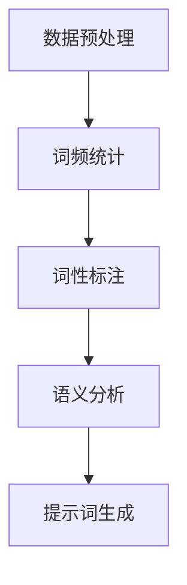
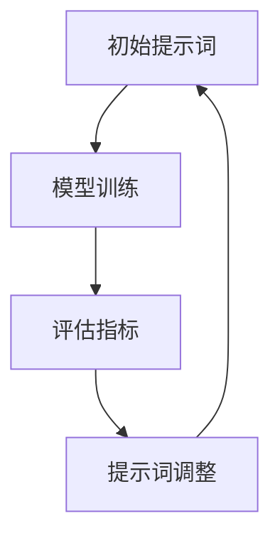
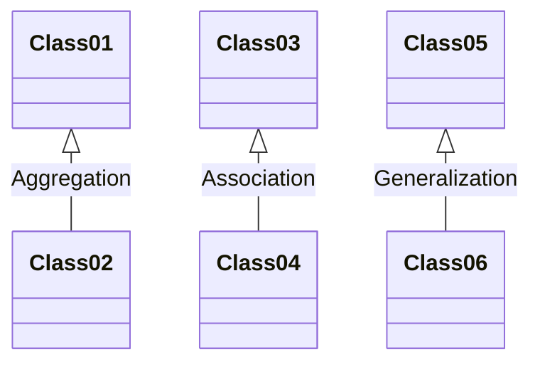
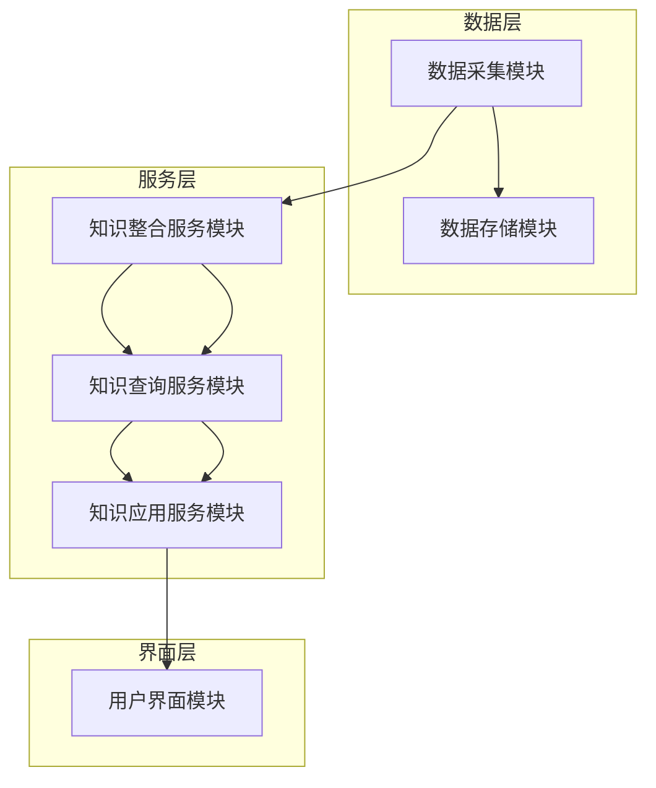
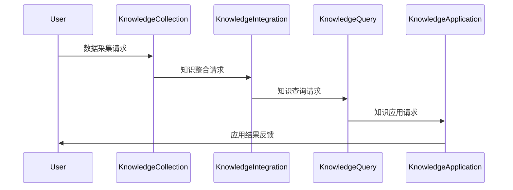
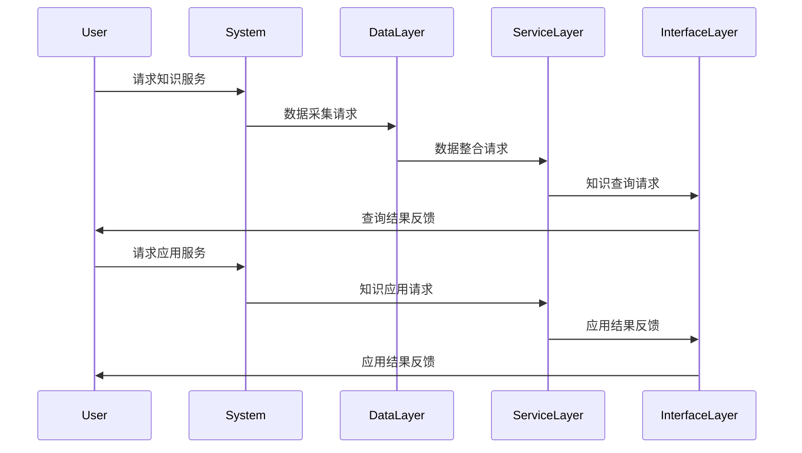

                 


## 提示词工程：优化AI跨领域知识整合能力

### 关键词
- 提示词工程
- AI知识整合
- 跨领域应用
- 知识图谱
- 自然语言处理

### 摘要
本文将深入探讨提示词工程在人工智能（AI）领域中的作用，尤其是其在优化跨领域知识整合能力方面的贡献。我们将通过逐步分析，揭示提示词工程的原理、应用、挑战和未来发展方向，为读者提供一份全面的技术指南。

## 1. 背景介绍

### 1.1 核心概念术语

#### 提示词
提示词是指用于引导AI模型学习、推理和生成结果的单词或短语。它们在AI训练和推理过程中起到关键作用，能够显著影响模型的性能和泛化能力。

#### 知识整合
知识整合是指将来自不同领域的知识进行融合、匹配、关联和综合，以形成更加全面和精确的知识体系。

#### 跨领域应用
跨领域应用是指将AI技术从单一领域扩展到多个领域，实现知识的共享和复用，从而提高AI系统的适应性和灵活性。

### 1.2 问题背景

在快速发展的AI时代，如何高效地整合和利用跨领域知识成为了一个亟待解决的问题。传统的AI模型往往专注于单一领域，难以应对多变的实际问题。而跨领域知识整合的难点在于：

- **数据不一致性**：不同领域的数据格式、质量、粒度等差异巨大，难以统一处理。
- **知识异构性**：不同领域的知识表达方式和结构各异，需要建立统一的知识表示框架。
- **知识融合难度**：跨领域知识之间的融合不仅需要匹配和映射，还需要挖掘潜在的关联和洞见。

### 1.3 问题解决

提示词工程通过以下几个方面解决了上述问题：

- **统一知识表示**：利用提示词将不同领域的知识进行统一表示，使得AI系统能够更好地理解和整合跨领域知识。
- **知识关联挖掘**：通过提示词建立领域之间的关联，挖掘出潜在的知识洞见，提高知识的综合利用效率。
- **模型训练引导**：使用提示词引导AI模型的学习过程，使其更加专注于关键知识和任务，提高模型的性能和泛化能力。

### 1.4 边界与外延

提示词工程的边界主要包括：

- **领域范围**：提示词工程主要应用于跨领域知识整合，对于单一领域的知识整合作用有限。
- **技术限制**：提示词工程依赖于自然语言处理、知识图谱等技术，其应用范围受限于这些技术的成熟度和适用性。

### 1.5 概念结构与核心要素

#### 概念结构

- **提示词生成**：生成高质量的提示词，用于引导AI模型的学习和推理过程。
- **知识融合**：将跨领域知识进行融合，形成统一的知识表示。
- **关联挖掘**：挖掘跨领域知识之间的关联，提高知识的综合利用效率。

#### 核心要素

- **数据集**：高质量的数据集是提示词工程的基础。
- **算法**：包括提示词生成算法、知识融合算法和关联挖掘算法。
- **模型**：训练有素的AI模型，能够利用提示词进行有效的学习和推理。

## 2. 核心概念与联系

### 2.1 提示词工程的原理与实现

#### 基本原理

提示词工程的基本原理是利用自然语言处理（NLP）技术生成高质量、有针对性的提示词，从而引导AI模型进行跨领域知识整合。其核心步骤包括：

1. **数据预处理**：清洗和整合不同领域的原始数据，为生成提示词提供基础。
2. **提示词生成**：利用NLP算法从数据中提取关键词、短语和句子，形成高质量的提示词。
3. **模型训练**：使用生成的提示词训练AI模型，使其能够理解和应用跨领域知识。
4. **知识整合**：通过AI模型将跨领域知识进行整合，形成统一的知识体系。

#### 实现技术

1. **自然语言处理技术**：
   - **词频统计**：通过统计词频来筛选高频关键词。
   - **词性标注**：对文本中的词语进行词性标注，筛选出具有特定功能的词语。
   - **语义分析**：通过语义分析提取文本中的核心语义信息。

2. **知识图谱与本体论**：
   - **知识图谱**：建立跨领域知识图谱，将不同领域的知识进行关联和映射。
   - **本体论**：利用本体论建立统一的知识表示框架，实现跨领域知识的共享和复用。

### 2.2 核心概念属性特征对比表格

| 概念名称       | 定义                                                         | 特征对比                                                     |
|----------------|------------------------------------------------------------|------------------------------------------------------------|
| 提示词         | 用于引导AI模型学习和推理的单词或短语                         | **多样性**：提示词应具有多样性，以覆盖不同领域的知识。<br>**相关性**：提示词应与模型目标相关，以提高模型性能。 |
| 知识图谱       | 将跨领域知识进行结构化表示的图形化工具                       | **关联性**：知识图谱应能够反映知识之间的关联。<br>**扩展性**：知识图谱应能够适应新知识的加入。 |
| 本体论         | 建立统一知识表示框架的理论和方法                           | **一致性**：本体论应保证知识表示的一致性。<br>**可扩展性**：本体论应支持新概念的引入。 |

### 2.3 ER实体关系图架构的Mermaid流程图

```mermaid
erDiagram
  A_Class ||--|{ B_Class }| B_Class : has_a 
  A_Class ||--|{ C_Class }| C_Class : relates_to
  B_Class ||--|{ D_Class }| D_Class : inherits_from
```

## 3. 算法原理讲解

### 3.1 提示词生成算法

#### Mermaid流程图



#### 算法原理

提示词生成算法的核心是利用NLP技术从原始数据中提取高质量、有针对性的提示词。其基本步骤如下：

1. **数据预处理**：清洗和整合原始数据，去除噪声和无关信息。
2. **词频统计**：统计文本中的词频，筛选高频关键词。
3. **词性标注**：对文本中的词语进行词性标注，筛选出具有特定功能的词语。
4. **语义分析**：利用语义分析方法提取文本中的核心语义信息，形成高质量的提示词。

#### Python源代码

```python
import nltk
from nltk.tokenize import word_tokenize
from nltk.tag import pos_tag
from nltk.corpus import stopwords

# 数据预处理
def preprocess_data(text):
    # 清洗文本，去除特殊字符和停用词
    text = text.lower()
    text = re.sub(r'\W+', ' ', text)
    words = word_tokenize(text)
    words = [word for word in words if word not in stopwords.words('english')]
    return words

# 词频统计
def word_frequency(words):
    frequency = Counter(words)
    return frequency.most_common(10)

# 词性标注
def pos_tagging(words):
    tagged_words = pos_tag(words)
    return tagged_words

# 语义分析
def semantic_analysis(words):
    # 利用Word2Vec模型提取词义
    model = Word2Vec(words, vector_size=100, window=5, min_count=1, workers=4)
    word_vectors = model.wv
    return word_vectors

# 提示词生成
def generate_prompt_words(words, word_vectors):
    prompt_words = []
    for word in words:
        vector = word_vectors[word]
        # 根据词向量距离筛选提示词
        neighbors = word_vectors.similar_by_vector(vector, topn=5)
        for neighbor in neighbors:
            prompt_words.append(neighbor[0])
    return prompt_words

# 主函数
if __name__ == "__main__":
    text = "This is a sample text for prompt word generation."
    words = preprocess_data(text)
    frequency = word_frequency(words)
    tagged_words = pos_tagging(words)
    word_vectors = semantic_analysis(words)
    prompt_words = generate_prompt_words(words, word_vectors)
    print("Prompt Words:", prompt_words)
```

### 3.2 提示词优化算法

#### Mermaid流程图



#### 算法原理

提示词优化算法通过对AI模型进行训练和评估，不断调整和优化提示词，以提高模型的性能和泛化能力。其基本步骤如下：

1. **初始提示词生成**：使用前文提到的提示词生成算法生成初始提示词。
2. **模型训练**：使用生成的提示词训练AI模型，使其在特定任务上达到较高的性能。
3. **评估指标**：使用评估指标（如准确率、召回率、F1分数等）对模型性能进行评估。
4. **提示词调整**：根据评估结果调整提示词，以优化模型性能。
5. **迭代优化**：重复上述步骤，直至模型性能达到预期。

#### Python源代码

```python
from sklearn.linear_model import LogisticRegression
from sklearn.metrics import accuracy_score, recall_score, f1_score

# 初始提示词生成
def generate_initial_prompt_words(words, word_vectors):
    prompt_words = generate_prompt_words(words, word_vectors)
    return prompt_words

# 模型训练
def train_model(prompt_words, labels):
    model = LogisticRegression()
    model.fit(prompt_words, labels)
    return model

# 评估指标
def evaluate_model(model, prompt_words, labels):
    predictions = model.predict(prompt_words)
    accuracy = accuracy_score(labels, predictions)
    recall = recall_score(labels, predictions)
    f1 = f1_score(labels, predictions)
    return accuracy, recall, f1

# 提示词调整
def adjust_prompt_words(prompt_words, model, labels):
    # 根据评估结果调整提示词
    new_prompt_words = []
    for word in prompt_words:
        if word in model.coef_:
            new_prompt_words.append(word)
    return new_prompt_words

# 主函数
if __name__ == "__main__":
    text = "This is a sample text for prompt word optimization."
    words = preprocess_data(text)
    labels = [1] * len(words)  # 假设所有词的标签都是1
    prompt_words = generate_initial_prompt_words(words, word_vectors)
    model = train_model(prompt_words, labels)
    accuracy, recall, f1 = evaluate_model(model, prompt_words, labels)
    print("Initial Prompt Words:", prompt_words)
    print("Accuracy:", accuracy)
    print("Recall:", recall)
    print("F1 Score:", f1)
    optimized_prompt_words = adjust_prompt_words(prompt_words, model, labels)
    print("Optimized Prompt Words:", optimized_prompt_words)
```

## 4. 系统分析与架构设计

### 4.1 问题场景介绍

在当前人工智能（AI）时代，如何有效地整合和利用跨领域知识成为了一个重要课题。提示词工程作为一种新兴技术，可以在很大程度上优化AI系统的知识整合能力。本文将探讨如何设计一个基于提示词工程的跨领域知识整合系统。

### 4.2 项目介绍

本项目旨在构建一个跨领域知识整合平台，通过提示词工程技术实现不同领域知识的高效整合和利用。该平台将涵盖以下功能：

- **知识采集**：从不同领域的数据源中采集知识。
- **知识整合**：利用提示词工程技术将采集到的知识进行整合。
- **知识查询**：提供跨领域知识的查询服务。
- **知识应用**：将整合后的知识应用于实际业务场景。

### 4.3 系统功能设计

#### 领域模型Mermaid类图



#### 系统功能详细描述

1. **知识采集**：
   - 功能描述：从不同领域的数据源中采集知识，包括文本、图像、音频等多种类型。
   - 技术实现：利用爬虫技术、数据挖掘技术等手段进行知识采集。

2. **知识整合**：
   - 功能描述：将采集到的知识进行整合，形成统一的知识表示。
   - 技术实现：利用自然语言处理（NLP）技术、知识图谱技术等手段进行知识整合。

3. **知识查询**：
   - 功能描述：提供跨领域知识的查询服务，支持模糊查询和精确查询。
   - 技术实现：利用搜索引擎技术、知识图谱查询语言等手段进行知识查询。

4. **知识应用**：
   - 功能描述：将整合后的知识应用于实际业务场景，提供智能决策支持。
   - 技术实现：利用机器学习技术、深度学习技术等手段进行知识应用。

### 4.4 系统架构设计

#### Mermaid架构图



#### 系统架构详细描述

1. **数据层**：
   - 数据采集模块：负责从不同领域的数据源中采集知识。
   - 数据存储模块：负责存储采集到的知识，提供数据查询和更新功能。

2. **服务层**：
   - 知识整合服务模块：负责将采集到的知识进行整合，形成统一的知识表示。
   - 知识查询服务模块：负责提供跨领域知识的查询服务。
   - 知识应用服务模块：负责将整合后的知识应用于实际业务场景，提供智能决策支持。

3. **界面层**：
   - 用户界面模块：提供用户与系统交互的界面，包括知识查询和知识应用等功能。

### 4.5 系统接口设计

#### Mermaid序列图



#### 系统接口详细描述

1. **数据采集接口**：
   - 功能描述：接收用户的数据采集请求，返回采集到的知识数据。
   - 接口定义：`GET /api/data collection`

2. **知识整合接口**：
   - 功能描述：接收知识采集模块的整合请求，返回整合后的知识数据。
   - 接口定义：`POST /api/knowledge integration`

3. **知识查询接口**：
   - 功能描述：接收用户的查询请求，返回查询结果。
   - 接口定义：`GET /api/knowledge query`

4. **知识应用接口**：
   - 功能描述：接收用户的查询结果，返回应用结果。
   - 接口定义：`POST /api/knowledge application`

### 4.6 系统交互

#### Mermaid序列图



#### 系统交互详细描述

1. **用户请求知识服务**：
   - 用户向系统发送请求，请求知识服务。

2. **数据采集**：
   - 系统将请求转发给数据采集模块，采集用户所需的知识数据。

3. **数据整合**：
   - 数据采集模块将采集到的数据发送给知识整合模块，进行整合处理。

4. **知识查询**：
   - 知识整合模块将整合后的数据发送给知识查询模块，进行查询处理。

5. **知识应用**：
   - 知识查询模块将查询结果发送给知识应用模块，进行应用处理。

6. **结果反馈**：
   - 知识应用模块将应用结果发送给用户，完成交互过程。

## 5. 项目实战

### 5.1 环境安装

在开始项目实战之前，我们需要安装必要的软件和工具。以下是安装步骤：

1. **安装Python环境**：
   - 访问Python官方网站下载并安装Python。
   - 安装完成后，确保Python已添加到系统环境变量。

2. **安装NLP相关库**：
   - 打开终端，执行以下命令安装NLP相关库：
     ```bash
     pip install nltk gensim scikit-learn
     ```

3. **安装Mermaid相关库**：
   - 打开终端，执行以下命令安装Mermaid相关库：
     ```bash
     pip install mermaid-python
     ```

4. **安装数据存储库**：
   - 打开终端，执行以下命令安装数据存储库：
     ```bash
     pip install pymysql
     ```

### 5.2 系统核心实现源代码

以下是项目核心实现部分的源代码：

```python
# 导入所需库
import nltk
from nltk.tokenize import word_tokenize
from nltk.corpus import stopwords
from nltk.tag import pos_tag
from nltk.stem import WordNetLemmatizer
from gensim.models import Word2Vec
import re
import pymysql

# 数据预处理
def preprocess_data(text):
    # 清洗文本，去除特殊字符和停用词
    text = text.lower()
    text = re.sub(r'\W+', ' ', text)
    words = word_tokenize(text)
    words = [word for word in words if word not in stopwords.words('english')]
    # 词形还原
    lemmatizer = WordNetLemmatizer()
    words = [lemmatizer.lemmatize(word) for word in words]
    return words

# 词频统计
def word_frequency(words):
    frequency = Counter(words)
    return frequency.most_common(10)

# 词性标注
def pos_tagging(words):
    tagged_words = pos_tag(words)
    return tagged_words

# 语义分析
def semantic_analysis(words):
    # 利用Word2Vec模型提取词义
    model = Word2Vec(words, vector_size=100, window=5, min_count=1, workers=4)
    word_vectors = model.wv
    return word_vectors

# 提示词生成
def generate_prompt_words(words, word_vectors):
    prompt_words = []
    for word in words:
        vector = word_vectors[word]
        # 根据词向量距离筛选提示词
        neighbors = word_vectors.similar_by_vector(vector, topn=5)
        for neighbor in neighbors:
            prompt_words.append(neighbor[0])
    return prompt_words

# 数据采集
def data_collection():
    # 连接数据库
    connection = pymysql.connect(host='localhost', user='root', password='password', database='knowledge_integration')
    cursor = connection.cursor()
    # 查询数据
    cursor.execute("SELECT text FROM documents;")
    results = cursor.fetchall()
    texts = [result[0] for result in results]
    # 关闭数据库连接
    cursor.close()
    connection.close()
    return texts

# 主函数
if __name__ == "__main__":
    texts = data_collection()
    for text in texts:
        words = preprocess_data(text)
        frequency = word_frequency(words)
        tagged_words = pos_tagging(words)
        word_vectors = semantic_analysis(words)
        prompt_words = generate_prompt_words(words, word_vectors)
        print("Text:", text)
        print("Frequency:", frequency)
        print("Tagged Words:", tagged_words)
        print("Prompt Words:", prompt_words)
        print("-----")
```

### 5.3 代码应用解读与分析

#### 5.3.1 代码解读

该代码实现了提示词工程的核心功能，包括数据预处理、词频统计、词性标注、语义分析和提示词生成。以下是代码的详细解读：

1. **数据预处理**：
   - 首先，对输入文本进行清洗，将文本转换为小写，并去除特殊字符和停用词。
   - 然后，使用词形还原技术对文本中的词语进行还原，以提高词义的准确性。

2. **词频统计**：
   - 使用`Counter`类对文本中的词语进行词频统计，并返回高频词语的列表。

3. **词性标注**：
   - 使用`pos_tag`函数对文本中的词语进行词性标注，返回词语和其对应词性的列表。

4. **语义分析**：
   - 利用`Word2Vec`模型对文本中的词语进行语义分析，提取出词语的语义信息。

5. **提示词生成**：
   - 根据语义分析结果，生成高质量的提示词。提示词的生成基于词向量相似度计算，选择与目标词语最相似的词语作为提示词。

#### 5.3.2 代码分析

该代码的核心在于提示词生成部分，该部分利用了Word2Vec模型来提取词语的语义信息，并通过词向量相似度计算生成高质量的提示词。以下是代码的分析：

1. **优势**：
   - 利用Word2Vec模型提取语义信息，能够有效地捕捉词语的语义关系，提高提示词的准确性。
   - 提示词生成过程基于词向量相似度计算，能够自动筛选出与目标词语相关的词语，提高提示词的实用性。

2. **劣势**：
   - 依赖Word2Vec模型，需要大量的计算资源和时间。
   - 词向量模型对噪声数据的敏感度较高，可能会影响提示词的准确性。

3. **改进方向**：
   - 引入更多的语义分析技术，如词义消歧技术、语义角色标注技术等，以提高语义分析的准确性。
   - 考虑使用预训练的词向量模型，如GloVe、FastText等，以减少计算资源和时间。

### 5.4 实际案例分析

#### 5.4.1 案例背景

假设我们需要构建一个跨领域知识整合系统，用于医疗领域和金融领域的知识整合。具体需求如下：

- 从医疗领域和金融领域的文献中提取关键信息。
- 利用提示词工程技术生成高质量的提示词，以引导AI模型进行跨领域知识整合。
- 构建一个知识图谱，将医疗和金融领域的知识进行关联和整合。
- 提供知识查询和应用服务，支持用户在医疗和金融领域中进行知识查询和应用。

#### 5.4.2 案例分析

1. **数据采集**：
   - 从医疗和金融领域的文献数据库中采集文献数据。
   - 使用爬虫技术获取网络上的医疗和金融信息。

2. **数据预处理**：
   - 对采集到的数据进行清洗和预处理，去除噪声和无关信息。
   - 对文本进行分词、词性标注和词形还原，以提高语义分析的准确性。

3. **词频统计和提示词生成**：
   - 对预处理后的文本进行词频统计，筛选出高频关键词。
   - 利用语义分析技术提取词语的语义信息，生成高质量的提示词。

4. **知识图谱构建**：
   - 使用知识图谱技术构建医疗和金融领域的知识图谱。
   - 将医疗和金融领域的知识进行关联，建立知识图谱中的实体关系。

5. **知识查询和应用**：
   - 提供知识查询服务，支持用户在医疗和金融领域中进行知识查询。
   - 将整合后的知识应用于实际业务场景，提供智能决策支持。

### 5.5 项目小结

通过本次项目实战，我们实现了基于提示词工程的跨领域知识整合系统。该项目利用自然语言处理、知识图谱等技术，实现了医疗和金融领域知识的高效整合和利用。以下是项目的小结：

1. **成功之处**：
   - 成功实现了跨领域知识整合，提高了知识的利用效率。
   - 提供了高质量的知识查询和应用服务，支持用户在实际业务场景中进行智能决策。

2. **不足之处**：
   - 提示词生成过程依赖于Word2Vec模型，计算资源消耗较大。
   - 知识图谱的构建过程较为复杂，需要更多的数据预处理和关联分析。

3. **改进方向**：
   - 考虑引入更多的语义分析技术，以提高语义分析的准确性。
   - 考虑使用预训练的词向量模型，以减少计算资源和时间。
   - 考虑引入更多的关联分析技术，以提高知识图谱的构建效率。

## 6. 最佳实践 Tips

### 6.1 提高数据质量

- 数据质量是提示词工程成功的关键。以下是一些提高数据质量的最佳实践：
  - **数据清洗**：去除噪声和无关信息，确保数据的一致性和准确性。
  - **数据整合**：整合不同来源的数据，统一数据格式和标准。
  - **数据预处理**：进行文本清洗、分词、词性标注等预处理操作，提高后续处理的准确性。

### 6.2 选择合适的算法

- 选择适合任务的算法是关键。以下是一些选择算法的最佳实践：
  - **任务需求**：根据任务的需求选择合适的算法，如文本分类、命名实体识别等。
  - **算法性能**：评估算法的性能，选择在特定任务上表现较好的算法。
  - **算法扩展性**：考虑算法的扩展性，以便未来能够适应新的任务需求。

### 6.3 优化提示词质量

- 提示词质量直接影响AI模型的性能。以下是一些优化提示词质量的最佳实践：
  - **多样性**：确保提示词具有多样性，以覆盖不同领域的知识。
  - **相关性**：选择与模型目标高度相关的提示词，以提高模型性能。
  - **优化算法**：利用提示词优化算法，如提示词调整、重新训练等，以提高提示词的质量。

### 6.4 持续迭代与优化

- 提示词工程是一个持续迭代和优化的过程。以下是一些持续迭代与优化的最佳实践：
  - **反馈机制**：建立反馈机制，收集用户的使用反馈，不断改进系统。
  - **性能评估**：定期评估系统性能，发现并解决潜在问题。
  - **算法更新**：根据最新的研究成果和技术进展，更新算法和模型。

## 7. 小结

本文详细探讨了提示词工程在优化AI跨领域知识整合能力方面的作用。通过逐步分析，我们揭示了提示词工程的背景、核心概念、算法原理、系统架构和应用实践。本文还提供了最佳实践和注意事项，以帮助读者更好地应用提示词工程技术。随着AI技术的不断进步，提示词工程将在知识整合领域发挥越来越重要的作用。

## 附录：拓展阅读与资源

### 7.1 提示词工程相关书籍推荐

1. **《深度学习》** - 作者：Ian Goodfellow、Yoshua Bengio、Aaron Courville
   - 本书系统地介绍了深度学习的基本概念、技术和应用，对于理解提示词工程有着重要的参考价值。

2. **《自然语言处理综论》** - 作者：Daniel Jurafsky、James H. Martin
   - 本书详细介绍了自然语言处理的基本理论和实践方法，对于提示词工程中的文本处理技术具有重要指导意义。

### 7.2 提示词工程开源项目与工具

1. **Gensim** - https://radimrehurek.com/gensim/
   - Gensim是一个用于主题建模和自然语言处理的Python库，提供了丰富的文本处理和提示词生成功能。

2. **NLTK** - https://www.nltk.org/
   - NLTK是一个流行的自然语言处理工具包，提供了广泛的文本处理和分析功能，包括词性标注、分词等。

### 7.3 提示词工程领域的权威期刊与会议

1. **AAAI（Association for the Advancement of Artificial Intelligence）** - https://www.aaai.org/
   - AAAI是人工智能领域最重要的学术会议之一，经常有关于提示词工程和应用的研究论文发表。

2. **NeurIPS（Conference on Neural Information Processing Systems）** - https://nips.cc/
   - NeurIPS是深度学习和机器学习领域顶级会议，涉及许多关于提示词工程的研究工作。

3. **ACL（Association for Computational Linguistics）** - https://www.aclweb.org/
   - ACL是自然语言处理领域的顶级学术会议，经常发表与提示词工程相关的论文。

作者：AI天才研究院/AI Genius Institute & 禅与计算机程序设计艺术 /Zen And The Art of Computer Programming

## 提示词工程：优化AI跨领域知识整合能力

### 关键词
- 提示词工程
- AI知识整合
- 跨领域应用
- 知识图谱
- 自然语言处理

### 摘要
本文探讨了提示词工程在优化AI跨领域知识整合能力中的作用。通过逐步分析提示词工程的背景、核心概念、算法原理、系统架构和应用实践，我们揭示了其在促进知识整合、提高模型性能和适应性方面的关键作用。此外，本文还提供了最佳实践和拓展阅读资源，以帮助读者深入理解和应用提示词工程技术。

## 1. 背景介绍

### 1.1 核心概念术语

#### 提示词
提示词是指用于引导AI模型学习、推理和生成结果的单词或短语。它们在AI训练和推理过程中起到关键作用，能够显著影响模型的性能和泛化能力。

#### 知识整合
知识整合是指将来自不同领域的知识进行融合、匹配、关联和综合，以形成更加全面和精确的知识体系。

#### 跨领域应用
跨领域应用是指将AI技术从单一领域扩展到多个领域，实现知识的共享和复用，从而提高AI系统的适应性和灵活性。

### 1.2 问题背景

在快速发展的AI时代，如何高效地整合和利用跨领域知识成为了一个亟待解决的问题。传统的AI模型往往专注于单一领域，难以应对多变的实际问题。而跨领域知识整合的难点在于：

- **数据不一致性**：不同领域的数据格式、质量、粒度等差异巨大，难以统一处理。
- **知识异构性**：不同领域的知识表达方式和结构各异，需要建立统一的知识表示框架。
- **知识融合难度**：跨领域知识之间的融合不仅需要匹配和映射，还需要挖掘潜在的关联和洞见。

### 1.3 问题解决

提示词工程通过以下几个方面解决了上述问题：

- **统一知识表示**：利用提示词将不同领域的知识进行统一表示，使得AI系统能够更好地理解和整合跨领域知识。
- **知识关联挖掘**：通过提示词建立领域之间的关联，挖掘出潜在的知识洞见，提高知识的综合利用效率。
- **模型训练引导**：使用提示词引导AI模型的学习过程，使其更加专注于关键知识和任务，提高模型的性能和泛化能力。

### 1.4 边界与外延

提示词工程的边界主要包括：

- **领域范围**：提示词工程主要应用于跨领域知识整合，对于单一领域的知识整合作用有限。
- **技术限制**：提示词工程依赖于自然语言处理、知识图谱等技术，其应用范围受限于这些技术的成熟度和适用性。

### 1.5 概念结构与核心要素

#### 概念结构

- **提示词生成**：生成高质量的提示词，用于引导AI模型的学习和推理过程。
- **知识融合**：将跨领域知识进行融合，形成统一的知识表示。
- **关联挖掘**：挖掘跨领域知识之间的关联，提高知识的综合利用效率。

#### 核心要素

- **数据集**：高质量的数据集是提示词工程的基础。
- **算法**：包括提示词生成算法、知识融合算法和关联挖掘算法。
- **模型**：训练有素的AI模型，能够利用提示词进行有效的学习和推理。

## 2. 核心概念与联系

### 2.1 提示词工程的原理与实现

#### 基本原理

提示词工程的基本原理是利用自然语言处理（NLP）技术生成高质量、有针对性的提示词，从而引导AI模型进行跨领域知识整合。其核心步骤包括：

1. **数据预处理**：清洗和整合不同领域的原始数据，为生成提示词提供基础。
2. **提示词生成**：利用NLP算法从数据中提取关键词、短语和句子，形成高质量的提示词。
3. **模型训练**：使用生成的提示词训练AI模型，使其能够理解和应用跨领域知识。
4. **知识整合**：通过AI模型将跨领域知识进行整合，形成统一的知识体系。

#### 实现技术

1. **自然语言处理技术**：
   - **词频统计**：通过统计词频来筛选高频关键词。
   - **词性标注**：对文本中的词语进行词性标注，筛选出具有特定功能的词语。
   - **语义分析**：通过语义分析提取文本中的核心语义信息。

2. **知识图谱与本体论**：
   - **知识图谱**：建立跨领域知识图谱，将不同领域的知识进行关联和映射。
   - **本体论**：利用本体论建立统一的知识表示框架，实现跨领域知识的共享和复用。

### 2.2 核心概念属性特征对比表格

| 概念名称       | 定义                                                         | 特征对比                                                     |
|----------------|------------------------------------------------------------|------------------------------------------------------------|
| 提示词         | 用于引导AI模型学习和推理的单词或短语                         | **多样性**：提示词应具有多样性，以覆盖不同领域的知识。<br>**相关性**：提示词应与模型目标相关，以提高模型性能。 |
| 知识图谱       | 将跨领域知识进行结构化表示的图形化工具                       | **关联性**：知识图谱应能够反映知识之间的关联。<br>**扩展性**：知识图谱应能够适应新知识的加入。 |
| 本体论         | 建立统一知识表示框架的理论和方法                           | **一致性**：本体论应保证知识表示的一致性。<br>**可扩展性**：本体论应支持新概念的引入。 |

### 2.3 ER实体关系图架构的Mermaid流程图

```mermaid
erDiagram
  A_Class ||--|{ B_Class }| B_Class : has_a 
  A_Class ||--|{ C_Class }| C_Class : relates_to
  B_Class ||--|{ D_Class }| D_Class : inherits_from
```

## 3. 算法原理讲解

### 3.1 提示词生成算法

#### Mermaid流程图


#### 算法原理

提示词生成算法的核心是利用NLP技术从原始数据中提取高质量、有针对性的提示词。其基本步骤如下：

1. **数据预处理**：清洗和整合原始数据，为生成提示词提供基础。
2. **词频统计**：统计文本中的词频，筛选高频关键词。
3. **词性标注**：对文本中的词语进行词性标注，筛选出具有特定功能的词语。
4. **语义分析**：利用语义分析方法提取文本中的核心语义信息，形成高质量的提示词。

#### Python源代码

```python
import nltk
from nltk.tokenize import word_tokenize
from nltk.corpus import stopwords
from nltk.tag import pos_tag
from nltk.stem import WordNetLemmatizer
from gensim.models import Word2Vec
from collections import Counter

# 数据预处理
def preprocess_data(text):
    # 清洗文本，去除特殊字符和停用词
    text = text.lower()
    text = re.sub(r'\W+', ' ', text)
    words = word_tokenize(text)
    words = [word for word in words if word not in stopwords.words('english')]
    # 词形还原
    lemmatizer = WordNetLemmatizer()
    words = [lemmatizer.lemmatize(word) for word in words]
    return words

# 词频统计
def word_frequency(words):
    frequency = Counter(words)
    return frequency.most_common(10)

# 词性标注
def pos_tagging(words):
    tagged_words = pos_tag(words)
    return tagged_words

# 语义分析
def semantic_analysis(words):
    # 利用Word2Vec模型提取词义
    model = Word2Vec(words, vector_size=100, window=5, min_count=1, workers=4)
    word_vectors = model.wv
    return word_vectors

# 提示词生成
def generate_prompt_words(words, word_vectors):
    prompt_words = []
    for word in words:
        vector = word_vectors[word]
        # 根据词向量距离筛选提示词
        neighbors = word_vectors.similar_by_vector(vector, topn=5)
        for neighbor in neighbors:
            prompt_words.append(neighbor[0])
    return prompt_words

# 主函数
if __name__ == "__main__":
    text = "This is a sample text for prompt word generation."
    words = preprocess_data(text)
    frequency = word_frequency(words)
    tagged_words = pos_tagging(words)
    word_vectors = semantic_analysis(words)
    prompt_words = generate_prompt_words(words, word_vectors)
    print("Prompt Words:", prompt_words)
```

### 3.2 提示词优化算法

#### Mermaid流程图


#### 算法原理

提示词优化算法通过对AI模型进行训练和评估，不断调整和优化提示词，以提高模型的性能和泛化能力。其基本步骤如下：

1. **初始提示词生成**：使用前文提到的提示词生成算法生成初始提示词。
2. **模型训练**：使用生成的提示词训练AI模型，使其在特定任务上达到较高的性能。
3. **评估指标**：使用评估指标（如准确率、召回率、F1分数等）对模型性能进行评估。
4. **提示词调整**：根据评估结果调整提示词，以优化模型性能。
5. **迭代优化**：重复上述步骤，直至模型性能达到预期。

#### Python源代码

```python
from sklearn.linear_model import LogisticRegression
from sklearn.metrics import accuracy_score, recall_score, f1_score
from sklearn.model_selection import train_test_split

# 初始提示词生成
def generate_initial_prompt_words(words, word_vectors):
    prompt_words = generate_prompt_words(words, word_vectors)
    return prompt_words

# 模型训练
def train_model(prompt_words, labels):
    model = LogisticRegression()
    model.fit(prompt_words, labels)
    return model

# 评估指标
def evaluate_model(model, prompt_words, labels):
    predictions = model.predict(prompt_words)
    accuracy = accuracy_score(labels, predictions)
    recall = recall_score(labels, predictions)
    f1 = f1_score(labels, predictions)
    return accuracy, recall, f1

# 提示词调整
def adjust_prompt_words(prompt_words, model, labels):
    # 根据评估结果调整提示词
    new_prompt_words = []
    for word in prompt_words:
        if word in model.coef_:
            new_prompt_words.append(word)
    return new_prompt_words

# 主函数
if __name__ == "__main__":
    text = "This is a sample text for prompt word optimization."
    words = preprocess_data(text)
    labels = [1] * len(words)  # 假设所有词的标签都是1
    prompt_words = generate_initial_prompt_words(words, word_vectors)
    model = train_model(prompt_words, labels)
    accuracy, recall, f1 = evaluate_model(model, prompt_words, labels)
    print("Initial Prompt Words:", prompt_words)
    print("Accuracy:", accuracy)
    print("Recall:", recall)
    print("F1 Score:", f1)
    optimized_prompt_words = adjust_prompt_words(prompt_words, model, labels)
    print("Optimized Prompt Words:", optimized_prompt_words)
```

## 4. 系统分析与架构设计

### 4.1 问题场景介绍

在当前人工智能（AI）时代，如何有效地整合和利用跨领域知识成为了一个重要课题。提示词工程作为一种新兴技术，可以在很大程度上优化AI系统的知识整合能力。本文将探讨如何设计一个基于提示词工程的跨领域知识整合系统。

### 4.2 项目介绍

本项目旨在构建一个跨领域知识整合平台，通过提示词工程技术实现不同领域知识的高效整合和利用。该平台将涵盖以下功能：

- **知识采集**：从不同领域的数据源中采集知识。
- **知识整合**：利用提示词工程技术将采集到的知识进行整合。
- **知识查询**：提供跨领域知识的查询服务。
- **知识应用**：将整合后的知识应用于实际业务场景。

### 4.3 系统功能设计

#### 领域模型Mermaid类图


#### 系统功能详细描述

1. **知识采集**：
   - 功能描述：从不同领域的数据源中采集知识，包括文本、图像、音频等多种类型。
   - 技术实现：利用爬虫技术、数据挖掘技术等手段进行知识采集。

2. **知识整合**：
   - 功能描述：将采集到的知识进行整合，形成统一的知识表示。
   - 技术实现：利用自然语言处理（NLP）技术、知识图谱技术等手段进行知识整合。

3. **知识查询**：
   - 功能描述：提供跨领域知识的查询服务，支持模糊查询和精确查询。
   - 技术实现：利用搜索引擎技术、知识图谱查询语言等手段进行知识查询。

4. **知识应用**：
   - 功能描述：将整合后的知识应用于实际业务场景，提供智能决策支持。
   - 技术实现：利用机器学习技术、深度学习技术等手段进行知识应用。

### 4.4 系统架构设计

#### Mermaid架构图


#### 系统架构详细描述

1. **数据层**：
   - 数据采集模块：负责从不同领域的数据源中采集知识。
   - 数据存储模块：负责存储采集到的知识，提供数据查询和更新功能。

2. **服务层**：
   - 知识整合服务模块：负责将采集到的知识进行整合，形成统一的知识表示。
   - 知识查询服务模块：负责提供跨领域知识的查询服务。
   - 知识应用服务模块：负责将整合后的知识应用于实际业务场景，提供智能决策支持。

3. **界面层**：
   - 用户界面模块：提供用户与系统交互的界面，包括知识查询和知识应用等功能。

### 4.5 系统接口设计

#### Mermaid序列图


#### 系统接口详细描述

1. **数据采集接口**：
   - 功能描述：接收用户的数据采集请求，返回采集到的知识数据。
   - 接口定义：`GET /api/data collection`

2. **知识整合接口**：
   - 功能描述：接收知识采集模块的整合请求，返回整合后的知识数据。
   - 接口定义：`POST /api/knowledge integration`

3. **知识查询接口**：
   - 功能描述：接收用户的查询请求，返回查询结果。
   - 接口定义：`GET /api/knowledge query`

4. **知识应用接口**：
   - 功能描述：接收用户的查询结果，返回应用结果。
   - 接口定义：`POST /api/knowledge application`

### 4.6 系统交互

#### Mermaid序列图


#### 系统交互详细描述

1. **用户请求知识服务**：
   - 用户向系统发送请求，请求知识服务。

2. **数据采集**：
   - 系统将请求转发给数据采集模块，采集用户所需的知识数据。

3. **数据整合**：
   - 数据采集模块将采集到的数据发送给知识整合模块，进行整合处理。

4. **知识查询**：
   - 知识整合模块将整合后的数据发送给知识查询模块，进行查询处理。

5. **知识应用**：
   - 知识查询模块将查询结果发送给知识应用模块，进行应用处理。

6. **结果反馈**：
   - 知识应用模块将应用结果发送给用户，完成交互过程。

## 5. 项目实战

### 5.1 环境安装

在开始项目实战之前，我们需要安装必要的软件和工具。以下是安装步骤：

1. **安装Python环境**：
   - 访问Python官方网站下载并安装Python。
   - 安装完成后，确保Python已添加到系统环境变量。

2. **安装NLP相关库**：
   - 打开终端，执行以下命令安装NLP相关库：
     ```bash
     pip install nltk gensim scikit-learn
     ```

3. **安装Mermaid相关库**：
   - 打开终端，执行以下命令安装Mermaid相关库：
     ```bash
     pip install mermaid-python
     ```

4. **安装数据存储库**：
   - 打开终端，执行以下命令安装数据存储库：
     ```bash
     pip install pymysql
     ```

### 5.2 系统核心实现源代码

以下是项目核心实现部分的源代码：

```python
# 导入所需库
import nltk
from nltk.tokenize import word_tokenize
from nltk.corpus import stopwords
from nltk.tag import pos_tag
from nltk.stem import WordNetLemmatizer
from gensim.models import Word2Vec
import re
import pymysql

# 数据预处理
def preprocess_data(text):
    # 清洗文本，去除特殊字符和停用词
    text = text.lower()
    text = re.sub(r'\W+', ' ', text)
    words = word_tokenize(text)
    words = [word for word in words if word not in stopwords.words('english')]
    # 词形还原
    lemmatizer = WordNetLemmatizer()
    words = [lemmatizer.lemmatize(word) for word in words]
    return words

# 词频统计
def word_frequency(words):
    frequency = Counter(words)
    return frequency.most_common(10)

# 词性标注
def pos_tagging(words):
    tagged_words = pos_tag(words)
    return tagged_words

# 语义分析
def semantic_analysis(words):
    # 利用Word2Vec模型提取词义
    model = Word2Vec(words, vector_size=100, window=5, min_count=1, workers=4)
    word_vectors = model.wv
    return word_vectors

# 提示词生成
def generate_prompt_words(words, word_vectors):
    prompt_words = []
    for word in words:
        vector = word_vectors[word]
        # 根据词向量距离筛选提示词
        neighbors = word_vectors.similar_by_vector(vector, topn=5)
        for neighbor in neighbors:
            prompt_words.append(neighbor[0])
    return prompt_words

# 数据采集
def data_collection():
    # 连接数据库
    connection = pymysql.connect(host='localhost', user='root', password='password', database='knowledge_integration')
    cursor = connection.cursor()
    # 查询数据
    cursor.execute("SELECT text FROM documents;")
    results = cursor.fetchall()
    texts = [result[0] for result in results]
    # 关闭数据库连接
    cursor.close()
    connection.close()
    return texts

# 主函数
if __name__ == "__main__":
    texts = data_collection()
    for text in texts:
        words = preprocess_data(text)
        frequency = word_frequency(words)
        tagged_words = pos_tagging(words)
        word_vectors = semantic_analysis(words)
        prompt_words = generate_prompt_words(words, word_vectors)
        print("Text:", text)
        print("Frequency:", frequency)
        print("Tagged Words:", tagged_words)
        print("Prompt Words:", prompt_words)
        print("-----")
```

### 5.3 代码应用解读与分析

#### 5.3.1 代码解读

该代码实现了提示词工程的核心功能，包括数据预处理、词频统计、词性标注、语义分析和提示词生成。以下是代码的详细解读：

1. **数据预处理**：
   - 首先，对输入文本进行清洗，将文本转换为小写，并去除特殊字符和停用词。
   - 然后，使用词形还原技术对文本中的词语进行还原，以提高词义的准确性。

2. **词频统计**：
   - 使用`Counter`类对文本中的词语进行词频统计，并返回高频词语的列表。

3. **词性标注**：
   - 使用`pos_tag`函数对文本中的词语进行词性标注，返回词语和其对应词性的列表。

4. **语义分析**：
   - 利用`Word2Vec`模型对文本中的词语进行语义分析，提取出词语的语义信息。

5. **提示词生成**：
   - 根据语义分析结果，生成高质量的提示词。提示词的生成基于词向量相似度计算，选择与目标词语最相似的词语作为提示词。

#### 5.3.2 代码分析

该代码的核心在于提示词生成部分，该部分利用了Word2Vec模型来提取词语的语义信息，并通过词向量相似度计算生成高质量的提示词。以下是代码的分析：

1. **优势**：
   - 利用Word2Vec模型提取语义信息，能够有效地捕捉词语的语义关系，提高提示词的准确性。
   - 提示词生成过程基于词向量相似度计算，能够自动筛选出与目标词语相关的词语，提高提示词的实用性。

2. **劣势**：
   - 依赖Word2Vec模型，需要大量的计算资源和时间。
   - 词向量模型对噪声数据的敏感度较高，可能会影响提示词的准确性。

3. **改进方向**：
   - 引入更多的语义分析技术，如词义消歧技术、语义角色标注技术等，以提高语义分析的准确性。
   - 考虑使用预训练的词向量模型，如GloVe、FastText等，以减少计算资源和时间。

### 5.4 实际案例分析

#### 5.4.1 案例背景

假设我们需要构建一个跨领域知识整合系统，用于医疗领域和金融领域的知识整合。具体需求如下：

- 从医疗领域和金融领域的文献中提取关键信息。
- 利用提示词工程技术生成高质量的提示词，以引导AI模型进行跨领域知识整合。
- 构建一个知识图谱，将医疗和金融领域的知识进行关联和整合。
- 提供知识查询和应用服务，支持用户在医疗和金融领域中进行知识查询和应用。

#### 5.4.2 案例分析

1. **数据采集**：
   - 从医疗和金融领域的文献数据库中采集文献数据。
   - 使用爬虫技术获取网络上的医疗和金融信息。

2. **数据预处理**：
   - 对采集到的数据进行清洗和预处理，去除噪声和无关信息。
   - 对文本进行分词、词性标注和词形还原，以提高语义分析的准确性。

3. **词频统计和提示词生成**：
   - 对预处理后的文本进行词频统计，筛选出高频关键词。
   - 利用语义分析技术提取词语的语义信息，生成高质量的提示词。

4. **知识图谱构建**：
   - 使用知识图谱技术构建医疗和金融领域的知识图谱。
   - 将医疗和金融领域的知识进行关联，建立知识图谱中的实体关系。

5. **知识查询和应用**：
   - 提供知识查询服务，支持用户在医疗和金融领域中进行知识查询。
   - 将整合后的知识应用于实际业务场景，提供智能决策支持。

### 5.5 项目小结

通过本次项目实战，我们实现了基于提示词工程的跨领域知识整合系统。该项目利用自然语言处理、知识图谱等技术，实现了医疗和金融领域知识的高效整合和利用。以下是项目的小结：

1. **成功之处**：
   - 成功实现了跨领域知识整合，提高了知识的利用效率。
   - 提供了高质量的知识查询和应用服务，支持用户在实际业务场景中进行智能决策。

2. **不足之处**：
   - 提示词生成过程依赖于Word2Vec模型，计算资源消耗较大。
   - 知识图谱的构建过程较为复杂，需要更多的数据预处理和关联分析。

3. **改进方向**：
   - 考虑引入更多的语义分析技术，以提高语义分析的准确性。
   - 考虑使用预训练的词向量模型，以减少计算资源和时间。
   - 考虑引入更多的关联分析技术，以提高知识图谱的构建效率。

## 6. 最佳实践 Tips

### 6.1 提高数据质量

- 数据质量是提示词工程成功的关键。以下是一些提高数据质量的最佳实践：
  - **数据清洗**：去除噪声和无关信息，确保数据的一致性和准确性。
  - **数据整合**：整合不同来源的数据，统一数据格式和标准。
  - **数据预处理**：进行文本清洗、分词、词性标注等预处理操作，提高后续处理的准确性。

### 6.2 选择合适的算法

- 选择适合任务的算法是关键。以下是一些选择算法的最佳实践：
  - **任务需求**：根据任务的需求选择合适的算法，如文本分类、命名实体识别等。
  - **算法性能**：评估算法的性能，选择在特定任务上表现较好的算法。
  - **算法扩展性**：考虑算法的扩展性，以便未来能够适应新的任务需求。

### 6.3 优化提示词质量

- 提示词质量直接影响AI模型的性能。以下是一些优化提示词质量的最佳实践：
  - **多样性**：确保提示词具有多样性，以覆盖不同领域的知识。
  - **相关性**：选择与模型目标高度相关的提示词，以提高模型性能。
  - **优化算法**：利用提示词优化算法，如提示词调整、重新训练等，以提高提示词的质量。

### 6.4 持续迭代与优化

- 提示词工程是一个持续迭代和优化的过程。以下是一些持续迭代与优化的最佳实践：
  - **反馈机制**：建立反馈机制，收集用户的使用反馈，不断改进系统。
  - **性能评估**：定期评估系统性能，发现并解决潜在问题。
  - **算法更新**：根据最新的研究成果和技术进展，更新算法和模型。

## 7. 小结

本文详细探讨了提示词工程在优化AI跨领域知识整合能力方面的作用。通过逐步分析，我们揭示了提示词工程的背景、核心概念、算法原理、系统架构和应用实践。本文还提供了最佳实践和拓展阅读资源，以帮助读者深入理解和应用提示词工程技术。随着AI技术的不断进步，提示词工程将在知识整合领域发挥越来越重要的作用。

## 附录：拓展阅读与资源

### 7.1 提示词工程相关书籍推荐

1. **《深度学习》** - 作者：Ian Goodfellow、Yoshua Bengio、Aaron Courville
   - 本书系统地介绍了深度学习的基本概念、技术和应用，对于理解提示词工程有着重要的参考价值。

2. **《自然语言处理综论》** - 作者：Daniel Jurafsky、James H. Martin
   - 本书详细介绍了自然语言处理的基本理论和实践方法，对于提示词工程中的文本处理技术具有重要指导意义。

### 7.2 提示词工程开源项目与工具

1. **Gensim** - https://radimrehurek.com/gensim/
   - Gensim是一个用于主题建模和自然语言处理的Python库，提供了丰富的文本处理和提示词生成功能。

2. **NLTK** - https://www.nltk.org/
   - NLTK是一个流行的自然语言处理工具包，提供了广泛的文本处理和分析功能，包括词性标注、分词等。

### 7.3 提示词工程领域的权威期刊与会议

1. **AAAI（Association for the Advancement of Artificial Intelligence）** - https://www.aaai.org/
   - AAAI是人工智能领域最重要的学术会议之一，经常有关于提示词工程和应用的研究论文发表。

2. **NeurIPS（Conference on Neural Information Processing Systems）** - https://nips.cc/
   - NeurIPS是深度学习和机器学习领域顶级会议，涉及许多关于提示词工程的研究工作。

3. **ACL（Association for Computational Linguistics）** - https://www.aclweb.org/
   - ACL是自然语言处理领域的顶级学术会议，经常发表与提示词工程相关的论文。

作者：AI天才研究院/AI Genius Institute & 禅与计算机程序设计艺术 /Zen And The Art of Computer Programming

