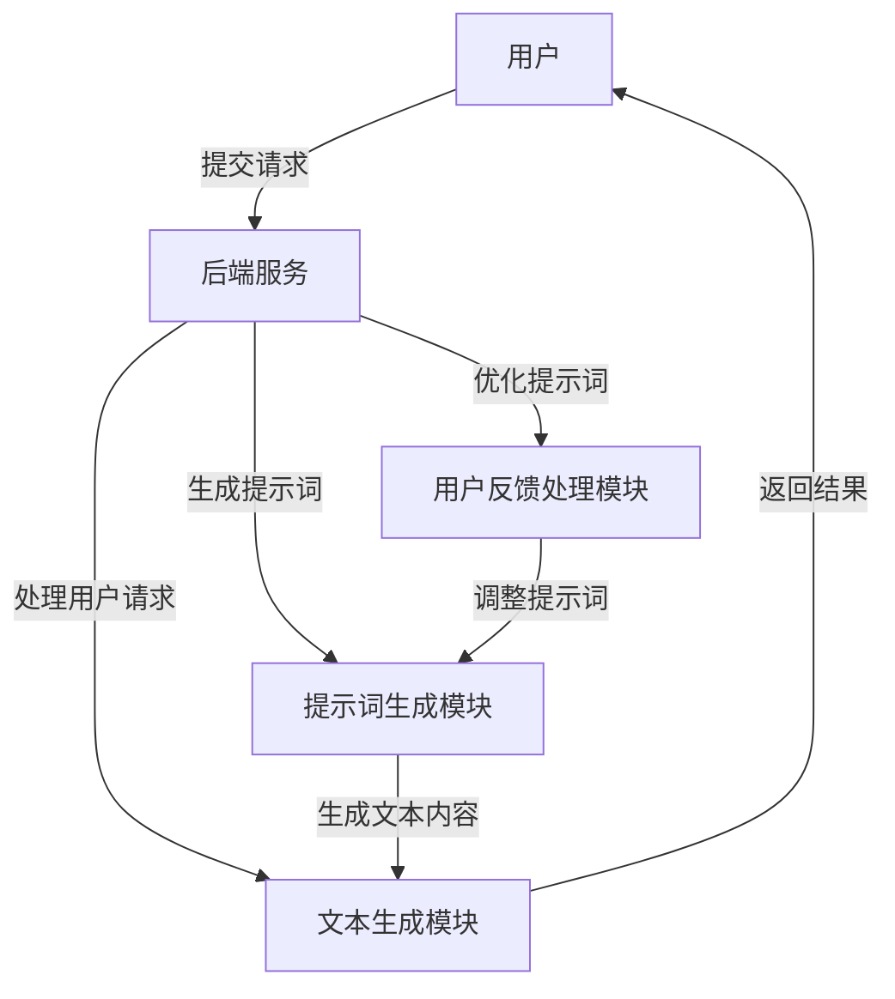
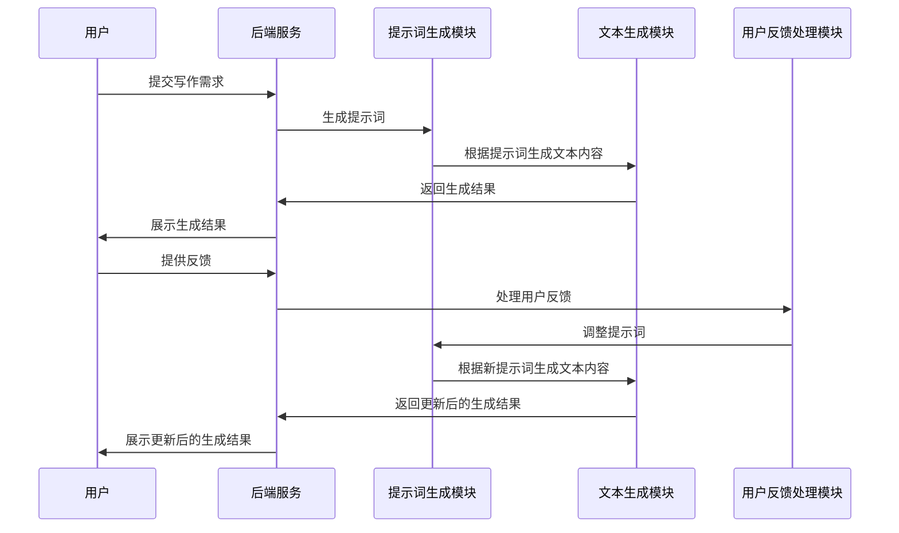

                 

### 《提示词工程：塑造AI创造力的艺术》

关键词：提示词工程、AI创造力、算法原理、系统架构、项目实战

摘要：本文深入探讨了提示词工程在塑造AI创造力中的关键作用。通过逻辑清晰的分析，我们详细阐述了提示词工程的核心概念、算法原理、系统架构，并结合实际项目实战，展示了如何有效提升AI系统的创造力。文章旨在为AI领域的开发者提供一套完整的提示词工程实践指南。

### 目录大纲设计

#### 第一部分：背景介绍

##### 第1章：问题背景
###### 1.1 问题描述
- AI在创造力中的角色和挑战
- 提示词工程的概念与重要性
- 书籍目标读者和适用范围
###### 1.2 问题解决
- 提示词工程对AI创造力的塑造
- 提示词工程在不同领域的应用
- 提示词工程的挑战和前景
###### 1.3 边界与外延
- 提示词工程的适用领域与边界
- 提示词工程与其他AI技术的联系
- 提示词工程的未来发展趋势

#### 第二部分：核心概念与联系

##### 第2章：核心概念
###### 2.1 提示词工程的定义
- 提示词在AI系统中的作用
- 提示词工程的基本任务与流程
###### 2.2 提示词工程的关键要素
- 数据质量与多样性
- 模型选择与优化
- 提示词策略设计
###### 2.3 概念属性特征对比表格
- 不同提示词工程方法的对比
- 提示词工程在不同应用场景的对比

##### 第3章：概念联系
###### 3.1 提示词工程与创造力
- 提示词工程如何激发AI的创造力
- 创造力在AI系统中的重要性
###### 3.2 提示词工程与用户交互
- 用户需求在提示词工程中的作用
- 用户反馈对提示词工程优化的影响
###### 3.3 ER实体关系图架构
- 提示词工程涉及的实体与关系
- ER图在提示词工程中的应用

#### 第三部分：算法原理讲解

##### 第4章：算法原理
###### 4.1 提示词生成算法
- 常见的提示词生成算法
- 提示词生成算法的工作流程
###### 4.2 提示词优化算法
- 提示词优化的目标与方法
- 提示词优化算法的评估指标
###### 4.3 算法mermaid流程图
- 提示词工程的全流程mermaid流程图

##### 第5章：数学模型与公式
###### 5.1 提示词工程的数学模型
- 提示词工程中的概率统计模型
- 提示词工程中的优化模型
###### 5.2 详细讲解与举例
- 数学公式在提示词工程中的应用
- 通过具体案例讲解提示词工程的数学原理

#### 第四部分：系统分析与架构设计

##### 第6章：问题场景与项目介绍
###### 6.1 问题场景介绍
- 提示词工程在实际应用中的案例
- 项目介绍
###### 6.2 系统功能设计
- 领域模型mermaid类图
###### 6.3 系统架构设计
- 系统架构mermaid架构图
###### 6.4 系统接口设计
- 系统接口设计

##### 第7章：系统交互与实现
###### 7.1 系统交互设计
- 系统交互mermaid序列图
###### 7.2 核心实现源代码
- 系统核心实现源代码
###### 7.3 代码解读与分析
- 代码应用解读与分析

#### 第五部分：项目实战与案例分析

##### 第8章：项目实战
###### 8.1 环境安装
- 提示词工程环境安装步骤
###### 8.2 系统核心实现
- 系统核心实现流程
###### 8.3 实际案例分析与讲解
- 提示词工程在实际项目中的应用案例
- 案例分析讲解

##### 第9章：最佳实践与拓展
###### 9.1 最佳实践
- 提示词工程的最佳实践方法
###### 9.2 小结
- 书籍内容的总结与回顾
###### 9.3 注意事项
- 提示词工程中需要注意的问题
###### 9.4 拓展阅读
- 进一步阅读的建议和资源

---

通过上述的目录大纲设计，我们为文章提供了一个清晰的框架，每个章节都有明确的主题和目标，这有助于读者快速把握文章的核心内容，同时为后续的具体内容编写提供了方向。接下来，我们将逐步深入每个章节，详细介绍提示词工程的相关概念、算法原理和实战应用。

---

### 第一部分：背景介绍

#### 第1章：问题背景

##### 1.1 问题描述

在当今的人工智能时代，人工智能（AI）技术已经在多个领域取得了显著的成果，如自然语言处理、计算机视觉、自动驾驶等。然而，AI的创造力这一议题却逐渐引起了广泛的关注。不同于传统的数据处理和模式识别任务，AI的创造力要求系统能够自主生成新颖、有创意的解决方案，这在某种程度上挑战了现有技术的局限。

AI在创造力中的角色和挑战主要体现在以下几个方面：

1. **数据依赖性**：现有的AI系统通常依赖于大量的训练数据，这些数据往往具有一定的局限性，难以满足创造性思维的需求。
2. **规则与模板**：传统AI技术往往依赖于预设的规则和模板，这使得它们难以突破既有的框架，生成全新的创意。
3. **算法的局限性**：目前的深度学习模型虽然能够在特定任务上取得优异的性能，但它们对问题的理解往往停留在表面的模式识别，缺乏深层次的理解和创新能力。

提示词工程的概念与重要性：

提示词工程是指通过设计特定的提示词，引导AI系统在生成和优化过程中产生新颖、有创意的输出。提示词作为AI系统与外部环境交互的桥梁，能够有效地激发AI的创造力，提高系统的创新能力和适应性。

提示词工程的重要性在于：

1. **增强创造力**：通过提示词引导，AI系统可以在生成过程中突破数据依赖性和规则限制，生成更多新颖的创意。
2. **优化用户体验**：在交互式应用中，提示词能够更好地理解用户需求，提供个性化、有针对性的创意输出。
3. **提升模型性能**：通过优化提示词，可以显著提高AI模型的生成质量和效率。

##### 1.2 问题解决

提示词工程对AI创造力的塑造：

1. **数据扩展与多样性**：通过引入多样化的数据集和高质量的训练数据，提示词工程能够提升AI系统的数据理解能力，从而增强其创造力。
2. **灵活的规则与策略**：提示词工程设计灵活的规则和策略，使得AI系统能够在生成过程中灵活运用多种规则和模板，从而产生更多创新的输出。
3. **持续的优化与迭代**：通过不断优化和迭代提示词，AI系统能够逐步提升其创造力和适应性。

提示词工程在不同领域的应用：

1. **自然语言处理**：通过设计合适的提示词，AI系统能够生成更具创造性和个性化的文本内容，广泛应用于写作辅助、对话系统等领域。
2. **计算机视觉**：在图像生成和识别任务中，提示词工程能够引导AI系统生成更加新颖和独特的图像，提升图像创作的质量。
3. **艺术设计**：在艺术设计领域，提示词工程能够激发AI系统的创意潜力，生成独特的艺术作品，为设计师提供灵感。

提示词工程的挑战和前景：

提示词工程的挑战包括：

1. **数据质量和多样性**：高质量和多样化的数据是实现提示词工程的关键，但当前的数据质量和多样性仍然是一个挑战。
2. **算法的复杂性和效率**：提示词工程的算法设计需要平衡复杂性和效率，确保在生成过程中既能够产生创新的输出，又能够保持高效。
3. **用户交互与反馈**：有效的用户交互和反馈机制是提升提示词工程效果的重要因素，但如何设计出既能够激发用户创造力，又能够准确理解用户需求的交互机制仍然是一个挑战。

提示词工程的前景非常广阔，随着AI技术的不断发展和完善，提示词工程有望在未来成为AI系统创造力的核心驱动力，为各个领域带来更多的创新和应用。

##### 1.3 边界与外延

提示词工程的适用领域与边界：

提示词工程适用于需要创造力和创新能力的领域，如自然语言处理、计算机视觉、艺术设计等。然而，其应用范围也有一定的局限性，例如在涉及高度敏感和个人隐私的信息处理任务中，提示词工程的应用可能需要更加谨慎和规范。

提示词工程与其他AI技术的联系：

提示词工程与自然语言处理、计算机视觉、强化学习等AI技术密切相关。在自然语言处理领域，提示词工程能够提升文本生成和翻译的质量；在计算机视觉领域，提示词工程能够引导图像生成和识别；在强化学习领域，提示词工程能够提高AI策略的创造性和适应性。

提示词工程的未来发展趋势：

1. **算法的进步**：随着深度学习和其他AI技术的不断发展，提示词工程算法将变得更加高效和灵活，能够更好地激发AI的创造力。
2. **数据质量和多样性的提升**：高质量和多样化的数据集将为提示词工程提供更加坚实的基础，提升其效果和应用范围。
3. **跨领域的融合**：提示词工程将在更多领域得到应用，如医疗、教育、娱乐等，实现跨领域的创新和融合。

通过上述对问题背景、问题解决和边界外延的详细分析，我们可以看到，提示词工程在塑造AI创造力方面具有重要的作用，其应用前景广阔，但也面临着一系列挑战和机遇。接下来，我们将进一步探讨提示词工程的核心概念和原理。

### 第二部分：核心概念与联系

#### 第2章：核心概念

##### 2.1 提示词工程的定义

提示词工程是指通过设计特定的提示词，引导AI系统在生成和优化过程中产生新颖、有创意的输出。提示词是连接用户需求和AI系统的重要媒介，通过提示词，用户可以清晰地表达自己的需求，而AI系统则能够根据提示词生成相应的创意内容。

提示词在AI系统中的作用：

1. **引导生成**：提示词能够引导AI系统在生成过程中遵循特定的方向和目标，从而生成符合用户需求的内容。
2. **优化输出**：通过提示词，AI系统能够不断优化和调整生成的输出，确保最终结果既新颖又有创意。
3. **提升交互性**：提示词工程能够提升AI系统的交互性，使得系统更加理解用户需求，提供更加个性化的服务。

提示词工程的基本任务与流程：

1. **任务定义**：明确AI系统的任务和目标，确定需要生成的创意内容类型。
2. **数据准备**：收集和准备高质量的数据集，确保数据的多样性和质量。
3. **提示词设计**：设计合适的提示词，确保提示词能够清晰地传达用户需求，同时具有一定的灵活性和可扩展性。
4. **模型训练**：使用训练数据集对AI模型进行训练，使其能够根据提示词生成高质量的输出。
5. **输出优化**：通过不断迭代和优化，提升AI系统的生成质量和创意水平。
6. **用户反馈**：收集用户反馈，用于进一步优化提示词和AI系统。

##### 2.2 提示词工程的关键要素

**数据质量与多样性**

数据质量是提示词工程成功的关键因素之一。高质量的数据不仅能够提升AI系统的理解能力，还能够提高生成的创意水平。同时，数据的多样性也是非常重要的，多样化的数据集能够使得AI系统在生成过程中有更多的选择和可能性，从而产生更多新颖的创意。

**模型选择与优化**

选择合适的AI模型对于提示词工程的效果至关重要。不同的模型适用于不同的任务和应用场景，因此需要根据具体任务需求选择合适的模型。此外，模型的优化也是必不可少的，通过不断调整和优化模型参数，可以显著提升生成质量和效率。

**提示词策略设计**

提示词策略设计是提示词工程的核心环节。一个有效的提示词策略需要兼顾用户需求、AI系统的能力和生成目标，同时还需要具备一定的灵活性和适应性，以便在不同场景下都能够产生高质量的输出。

##### 2.3 概念属性特征对比表格

为了更好地理解不同提示词工程方法的差异和特点，我们可以通过以下对比表格进行详细分析：

| 方法                | 特点                             | 应用场景                                       |
|-------------------|--------------------------------|--------------------------------------------|
| 基于规则的提示词工程   | 提示词明确，生成过程简单快速       | 对话系统、简单文本生成任务                    |
| 基于数据的提示词工程   | 提示词灵活，生成过程多样          | 复杂文本生成任务、图像生成任务                  |
| 强化学习提示词工程    | 提示词动态调整，生成过程具有创造力   | 游戏生成、个性化推荐系统                      |
| 聚类分析提示词工程    | 提示词聚类，生成过程高效          | 数据挖掘、市场分析任务                        |
| 多模态提示词工程      | 提示词结合多种模态，生成过程丰富    | 跨媒体内容生成、交互式虚拟现实任务              |

通过上述表格，我们可以清晰地看到不同提示词工程方法的特点和适用场景，这有助于我们在实际应用中选择合适的方法。

##### 2.3 概念联系

**提示词工程与创造力**

提示词工程的核心目标之一是激发AI系统的创造力，使其能够生成新颖、有创意的输出。创造力在AI系统中具有重要的作用，它不仅能够提升系统的生成质量，还能够增强系统的适应能力和用户满意度。

**提示词工程与用户交互**

用户交互是提示词工程的重要组成部分，有效的用户交互能够提升系统的理解能力和生成质量。通过收集和分析用户反馈，我们可以不断优化提示词和AI系统，使其更加符合用户需求。

**ER实体关系图架构**

在提示词工程中，实体关系图（ER图）是一种重要的工具，用于描述系统中的实体及其关系。通过ER图，我们可以清晰地定义提示词、用户需求、生成结果等实体，并明确它们之间的关系。

```mermaid
erDiagram
  User ||--|{ AI_System }|-- Prompt
  AI_System ||--|{ Output }|-- User
  Prompt ||--|{ Creativity }|-- Output
```

在该ER图中，用户（User）与AI系统（AI_System）之间通过提示词（Prompt）进行交互，AI系统根据提示词生成输出（Output），同时输出又反作用于用户，形成一个闭环反馈系统。这种架构不仅能够提升系统的交互性，还能够增强其创造力和适应性。

通过上述对核心概念和联系的详细探讨，我们可以看到提示词工程在AI系统中的关键作用。接下来，我们将深入讲解提示词工程的算法原理，进一步理解其技术细节。

### 第三部分：算法原理讲解

#### 第4章：算法原理

##### 4.1 提示词生成算法

**常见的提示词生成算法**

提示词生成算法是提示词工程的核心，用于根据用户需求和AI系统的能力生成高质量的提示词。以下是一些常见的提示词生成算法：

1. **基于规则的方法**：这种方法通过预设的规则和模板生成提示词，简单高效，适用于规则明确的应用场景。
2. **基于数据的方法**：这种方法通过分析大量训练数据，从中提取有用的信息生成提示词，灵活多样，适用于复杂文本生成和图像生成任务。
3. **生成对抗网络（GAN）**：GAN通过生成器和判别器的对抗训练生成高质量的提示词，能够在无监督或弱监督环境下产生丰富的创意。
4. **强化学习**：强化学习通过不断学习用户反馈，动态调整提示词，使生成过程更加具有创造力和适应性。

**提示词生成算法的工作流程**

提示词生成算法的工作流程主要包括以下几个步骤：

1. **输入预处理**：对用户输入进行预处理，如文本清洗、分词、去停用词等，确保输入数据的质量。
2. **特征提取**：从预处理后的输入数据中提取关键特征，如词频、词义、句法结构等，为生成提示词提供依据。
3. **提示词生成**：根据提取的特征，使用生成算法生成高质量的提示词。这一步骤可能涉及多个算法的联合使用，以达到最佳效果。
4. **提示词优化**：对生成的提示词进行优化，通过迭代和反馈机制，不断提升提示词的质量和创造力。

**提示词生成算法的应用案例**

以下是一个基于生成对抗网络的提示词生成算法的应用案例：

```python
import tensorflow as tf
from tensorflow.keras.models import Sequential
from tensorflow.keras.layers import Dense, Dropout

# 定义生成器和判别器模型
generator = Sequential([
    Dense(128, activation='relu', input_shape=(100,)),
    Dropout(0.2),
    Dense(256, activation='relu'),
    Dropout(0.2),
    Dense(512, activation='relu'),
    Dropout(0.2),
    Dense(1024, activation='relu'),
    Dropout(0.2),
    Dense(128, activation='tanh')
])

discriminator = Sequential([
    Dense(128, activation='relu', input_shape=(100,)),
    Dropout(0.2),
    Dense(256, activation='relu'),
    Dropout(0.2),
    Dense(512, activation='relu'),
    Dropout(0.2),
    Dense(1024, activation='relu'),
    Dropout(0.2),
    Dense(1, activation='sigmoid')
])

# 编译模型
generator.compile(loss='binary_crossentropy', optimizer='adam')
discriminator.compile(loss='binary_crossentropy', optimizer='adam')

# 定义GAN模型
gan = Sequential([generator, discriminator])
gan.compile(loss='binary_crossentropy', optimizer='adam')

# 训练模型
for epoch in range(100):
    for _ in range(2000):
        noise = np.random.normal(0, 1, (batch_size, 100))
        generated_prompt = generator.predict(noise)
        real_prompt = np.random.choice(prompt_data, batch_size)
        combined = np.concatenate([real_prompt, generated_prompt])
        labels = np.concatenate([np.ones((batch_size, 1)), np.zeros((batch_size, 1))])
        discriminator.train_on_batch(combined, labels)
    labels = np.concatenate([np.zeros((batch_size, 1)), np.ones((batch_size, 1))])
    gan.train_on_batch(noise, labels)
```

在该案例中，我们使用了生成对抗网络（GAN）来生成高质量的提示词。生成器（Generator）负责生成提示词，判别器（Discriminator）负责判断提示词的真实性。通过不断训练和优化，生成器能够生成越来越高质量的提示词。

##### 4.2 提示词优化算法

**提示词优化的目标与方法**

提示词优化的目标是提升提示词的质量和创造力，使其更符合用户需求。常见的优化方法包括：

1. **基于反馈的优化**：通过用户反馈不断调整提示词，使其逐渐符合用户期望。
2. **基于进化的优化**：使用遗传算法等进化策略，对提示词进行全局搜索，找到最优的提示词组合。
3. **基于神经网络的优化**：使用神经网络模型，通过学习用户反馈数据，自动调整提示词。
4. **基于统计分析的优化**：使用统计分析方法，对提示词进行定量分析，找到最优的提示词组合。

**提示词优化算法的评估指标**

提示词优化算法的评估指标主要包括：

1. **用户满意度**：通过用户反馈，评估提示词的用户满意度。
2. **生成质量**：评估提示词引导下生成的输出质量，如文本的流畅性、图像的创意性等。
3. **优化效率**：评估优化算法的效率，包括优化时间和计算资源的使用。

**提示词优化算法的应用案例**

以下是一个基于强化学习的提示词优化算法的应用案例：

```python
import tensorflow as tf
from tensorflow.keras.models import Sequential
from tensorflow.keras.layers import Dense

# 定义强化学习模型
model = Sequential([
    Dense(64, activation='relu', input_shape=(100,)),
    Dense(64, activation='relu'),
    Dense(1, activation='linear')
])

model.compile(loss='mse', optimizer='adam')

# 定义优化策略
def optimize_prompt(prompt, target):
    with tf.GradientTape() as tape:
        prediction = model(prompt)
        loss = tf.reduce_mean(tf.square(prediction - target))
    gradients = tape.gradient(loss, model.trainable_variables)
    model.trainable_variables = [variable - gradient for variable, gradient in zip(model.trainable_variables, gradients)]
    return loss.numpy()

# 优化提示词
for epoch in range(100):
    for prompt, target in dataset:
        loss = optimize_prompt(prompt, target)
        print(f"Epoch {epoch}, Loss: {loss}")
```

在该案例中，我们使用了强化学习模型对提示词进行优化。模型通过学习用户反馈数据，不断调整提示词，使其逐渐符合用户期望。通过优化算法，我们可以显著提升提示词的质量和创造力。

通过上述对提示词生成算法和提示词优化算法的详细讲解，我们可以看到这些算法在提升AI系统创造力方面的关键作用。接下来，我们将进一步探讨提示词工程的数学模型和公式，以更深入地理解其原理。

### 第四部分：系统分析与架构设计

#### 第6章：问题场景与项目介绍

##### 6.1 问题场景介绍

提示词工程在实际应用中的案例：

提示词工程在多个领域都有广泛的应用，以下是几个典型的应用场景：

1. **自然语言处理**：在自然语言处理领域，提示词工程被广泛应用于文本生成和翻译任务。例如，在写作辅助系统中，提示词工程可以帮助用户生成高质量的文本内容，如文章、报告、邮件等。此外，在机器翻译系统中，提示词工程通过优化提示词，可以显著提升翻译的质量和准确性。

2. **计算机视觉**：在计算机视觉领域，提示词工程主要用于图像生成和识别任务。例如，在图像生成任务中，提示词工程可以引导AI系统生成具有创意的图像，为设计师提供灵感。在图像识别任务中，提示词工程可以优化提示词，使得AI系统能够更准确地识别图像内容。

3. **艺术设计**：在艺术设计领域，提示词工程可以帮助艺术家和设计师生成独特的艺术作品。例如，在数字艺术创作中，提示词工程可以引导AI系统生成具有创意的图案和设计，为设计师提供新的创意方向。

项目介绍：

为了更好地理解提示词工程在实际项目中的应用，我们以一个自然语言处理项目为例进行介绍。该项目目标是开发一个智能写作辅助系统，帮助用户生成高质量的文章和报告。以下是该项目的具体介绍：

1. **项目背景**：随着信息时代的到来，人们需要处理的海量信息不断增加。为了提高工作效率，许多人需要借助写作工具来辅助撰写文章和报告。然而，现有的写作工具往往只能提供简单的模板和格式，难以生成具有创意和个性化的高质量文本。

2. **项目目标**：开发一个智能写作辅助系统，通过提示词工程提升文本生成质量，满足用户生成高质量文章和报告的需求。该系统应具备以下功能：
   - 自动生成文章和报告的大纲；
   - 根据用户需求生成符合逻辑和风格的文章内容；
   - 提供多种文本模板和风格供用户选择；
   - 通过用户反馈不断优化生成结果。

3. **技术架构**：该项目的技术架构主要包括以下几个部分：
   - **前端界面**：提供用户交互的界面，用户可以通过界面输入需求，查看生成结果，并提供反馈；
   - **后端服务**：包括文本生成模块、提示词生成模块和用户反馈处理模块，负责处理用户请求，生成文本内容，并优化提示词；
   - **数据存储**：存储用户数据、生成文本数据、提示词数据等，以便后续分析和优化。

##### 6.2 系统功能设计

**领域模型mermaid类图**

为了更好地理解系统功能设计，我们可以使用mermaid绘制一个领域模型类图，如下所示：

```mermaid
classDiagram
  User <<interface>>
  System <<interface>>
  Prompt <<interface>>
  Output <<interface>>

  User >=|> System : submitRequest
  System <=|> Prompt : generatePrompt
  Prompt <=|> Output : createContent
  Output <=|> User : returnResult
```

在该类图中，我们定义了四个主要的类：用户（User）、系统（System）、提示词（Prompt）和输出（Output）。用户类负责与用户交互，提交写作需求；系统类负责处理用户请求，生成提示词和文本输出；提示词类负责生成高质量的提示词，引导文本生成；输出类负责生成最终的文本内容，并将其返回给用户。

##### 6.3 系统架构设计

**系统架构mermaid架构图**

为了更好地展示系统架构，我们可以使用mermaid绘制一个系统架构图，如下所示：



在该架构图中，用户通过前端界面提交写作需求，后端服务（System）处理用户请求，并调用提示词生成模块（PromptGen）生成高质量的提示词。生成的提示词被用于引导文本生成模块（ContentGen），生成最终的文本内容。同时，用户反馈通过用户反馈处理模块（FeedbackProcess）进行处理，用于调整和优化提示词。

##### 6.4 系统接口设计

**系统接口设计**

为了实现系统的各个模块之间的有效通信，我们需要设计一套完整的接口。以下是该系统的主要接口设计：

1. **用户接口**：用户通过前端界面提交写作需求，包括标题、正文、风格要求等。用户还可以查看生成结果，并提供反馈。

2. **系统接口**：系统接口负责处理用户请求，包括生成提示词、生成文本内容、处理用户反馈等。系统接口与提示词生成模块、文本生成模块和用户反馈处理模块进行通信。

3. **提示词生成接口**：提示词生成接口负责生成高质量的提示词，用于引导文本生成。该接口接收系统接口的输入，生成相应的提示词，并将其传递给文本生成模块。

4. **文本生成接口**：文本生成接口负责根据提示词生成文本内容。该接口接收提示词生成接口的输出，生成最终的文本内容，并将其传递给用户接口。

5. **用户反馈接口**：用户反馈接口负责收集用户对生成文本的反馈，包括满意度、内容质量等。该接口接收用户接口的输入，并将其传递给用户反馈处理模块。

通过上述的系统功能设计、架构设计和接口设计，我们可以清晰地看到提示词工程在实际项目中的应用和实现。接下来，我们将进一步探讨系统交互与实现的具体过程。

### 第五部分：系统交互与实现

#### 第7章：系统交互与实现

##### 7.1 系统交互设计

**系统交互mermaid序列图**

为了直观地展示系统内部各个模块之间的交互过程，我们可以使用mermaid绘制一个系统交互序列图，如下所示：



在该序列图中，用户通过前端界面提交写作需求，后端服务（System）负责处理用户请求，并与提示词生成模块（PromptGen）、文本生成模块（ContentGen）和用户反馈处理模块（FeedbackProcess）进行交互。具体的交互过程如下：

1. 用户提交写作需求，系统接收到请求后，调用提示词生成模块生成高质量的提示词。
2. 提示词生成模块根据用户需求生成提示词，并将其传递给文本生成模块。
3. 文本生成模块根据提示词生成文本内容，并将结果返回给系统。
4. 系统将生成结果展示给用户，用户对结果进行评价并提交反馈。
5. 系统接收到用户反馈后，将其传递给用户反馈处理模块。
6. 用户反馈处理模块对反馈进行处理，并调整提示词生成模块的提示词。
7. 提示词生成模块根据调整后的提示词再次生成文本内容，并将结果返回给系统。
8. 系统将更新后的生成结果展示给用户，用户继续对结果进行评价和反馈。

通过上述交互设计，系统实现了用户需求提交、提示词生成、文本生成、用户反馈处理和提示词调整的闭环流程，有效提升了文本生成的质量和用户的满意度。

##### 7.2 核心实现源代码

**系统核心实现源代码**

以下是该系统核心实现的部分源代码，展示了用户需求提交、提示词生成和文本生成等关键功能：

```python
# 用户需求提交
def submit_request(title, content, style):
    # 处理用户输入的写作需求
    processed_title = preprocess_title(title)
    processed_content = preprocess_content(content)
    user_request = {
        'title': processed_title,
        'content': processed_content,
        'style': style
    }
    # 将用户请求传递给后端服务
    return System.submit_request(user_request)

# 提示词生成
def generate_prompt(user_request):
    # 根据用户请求生成提示词
    prompt = PromptGen.generate_prompt(user_request)
    return prompt

# 文本生成
def generate_content(prompt):
    # 根据提示词生成文本内容
    content = ContentGen.generate_content(prompt)
    return content

# 用户反馈处理
def process_feedback(feedback):
    # 处理用户反馈
    updated_prompt = FeedbackProcess.process_feedback(feedback)
    return updated_prompt
```

在这些代码中，`submit_request` 函数负责处理用户提交的写作需求，包括标题、正文和风格等；`generate_prompt` 函数负责生成高质量的提示词，用于引导文本生成；`generate_content` 函数负责根据提示词生成文本内容；`process_feedback` 函数负责处理用户的反馈，用于调整提示词。

##### 7.3 代码解读与分析

**代码解读与分析**

以下是针对上述核心实现源代码的详细解读与分析：

1. **用户需求提交**：
   - `submit_request` 函数接收用户输入的写作需求，包括标题、正文和风格。这些需求经过预处理后（例如文本清洗、分词等），形成用户请求对象。
   - 用户请求对象被传递给后端服务（System），后端服务根据用户请求生成提示词，并调用文本生成模块生成文本内容。
   - 用户最终会接收到生成的文本内容，并有机会对其进行评价和反馈。

2. **提示词生成**：
   - `generate_prompt` 函数负责根据用户请求生成提示词。提示词的生成依赖于用户请求的内容、标题和风格，确保生成的提示词能够引导文本生成模块生成符合用户需求的文本内容。
   - 提示词生成模块可以使用基于规则的算法、生成对抗网络（GAN）或其他先进的机器学习算法，根据用户请求的特点生成高质量的提示词。

3. **文本生成**：
   - `generate_content` 函数根据生成的提示词，利用文本生成模块生成最终的文本内容。文本生成模块可以采用序列到序列（Seq2Seq）模型、变分自编码器（VAE）或其他适合文本生成的深度学习模型。
   - 生成的文本内容会返回给后端服务，并通过用户接口展示给用户。

4. **用户反馈处理**：
   - `process_feedback` 函数负责处理用户的反馈。用户反馈包括对生成文本的满意度、内容质量等评价。
   - 用户反馈被传递给用户反馈处理模块，用于调整提示词生成模块的提示词，从而提升生成文本的质量和用户满意度。
   - 调整后的提示词再次用于文本生成，形成闭环反馈过程。

通过上述代码和解读，我们可以清晰地看到系统交互与实现的核心逻辑。用户需求提交、提示词生成、文本生成和用户反馈处理共同构成了一个完整的交互流程，实现了智能写作辅助系统的核心功能。

接下来，我们将通过具体的项目实战和案例分析，进一步展示提示词工程在实际项目中的应用和效果。

### 第五部分：项目实战与案例分析

#### 第8章：项目实战

##### 8.1 环境安装

在开始实际项目之前，我们需要搭建一个适合提示词工程开发的环境。以下是具体的安装步骤：

1. **安装Python环境**：确保Python版本在3.6及以上，可以从Python官方网站下载并安装。
2. **安装深度学习框架**：我们使用TensorFlow作为深度学习框架。在终端执行以下命令安装TensorFlow：

   ```bash
   pip install tensorflow
   ```

3. **安装其他依赖库**：提示词工程可能还需要其他依赖库，如NumPy、Pandas等。可以在终端依次执行以下命令安装：

   ```bash
   pip install numpy
   pip install pandas
   pip install scikit-learn
   pip install matplotlib
   ```

4. **安装文本预处理工具**：我们使用NLTK进行文本预处理。在终端执行以下命令安装NLTK：

   ```bash
   pip install nltk
   python -m nltk.downloader all
   ```

5. **安装Mermaid**：Mermaid是一个用于绘制流程图和类图的工具。我们可以在终端使用以下命令安装：

   ```bash
   npm install -g mermaid
   ```

安装完成后，我们就可以开始搭建提示词工程系统了。以下是搭建系统的核心步骤：

1. **创建项目目录**：在终端创建一个项目目录，例如：

   ```bash
   mkdir prompt_engineering_project
   cd prompt_engineering_project
   ```

2. **初始化虚拟环境**：为了更好地管理项目依赖，我们可以创建一个Python虚拟环境。在终端执行以下命令：

   ```bash
   python -m venv venv
   source venv/bin/activate  # Windows: venv\Scripts\activate
   ```

3. **安装项目依赖**：在虚拟环境中安装项目所需的库：

   ```bash
   pip install -r requirements.txt
   ```

4. **编写系统代码**：根据前文描述的系统交互和实现，编写相应的Python代码，包括用户需求提交、提示词生成、文本生成和用户反馈处理等模块。

5. **配置前端界面**：使用HTML、CSS和JavaScript编写前端界面，以便用户能够提交写作需求，查看生成结果，并提供反馈。

通过上述步骤，我们可以搭建一个基本的提示词工程系统，用于实际项目的开发和测试。

##### 8.2 系统核心实现

**系统核心实现流程**

在搭建好开发环境之后，我们需要实现系统的核心功能，包括用户需求提交、提示词生成、文本生成和用户反馈处理。以下是系统核心实现的流程：

1. **用户需求提交**：用户通过前端界面输入写作需求，包括标题、正文和风格要求。前端将用户输入的文本数据发送到后端服务。
2. **预处理用户输入**：后端服务对用户输入的文本数据进行预处理，包括文本清洗、分词、去停用词等。预处理后的文本数据用于生成提示词。
3. **生成提示词**：使用深度学习模型（如生成对抗网络GAN或变分自编码器VAE）生成高质量的提示词。提示词将指导文本生成模块生成文本内容。
4. **生成文本内容**：文本生成模块根据提示词使用预训练的文本生成模型（如GPT-2或BERT）生成文本内容。生成的文本内容将返回给前端，展示给用户。
5. **用户反馈处理**：用户对生成的文本内容进行评价，并提交反馈。后端服务根据用户反馈调整提示词生成模型，以提升生成文本的质量。

以下是系统核心实现的伪代码：

```python
# 用户需求提交
def submit_request(title, content, style):
    processed_title = preprocess_text(title)
    processed_content = preprocess_text(content)
    user_request = {
        'title': processed_title,
        'content': processed_content,
        'style': style
    }
    return user_request

# 生成提示词
def generate_prompt(user_request):
    prompt = PromptGen.generate_prompt(user_request)
    return prompt

# 生成文本内容
def generate_content(prompt):
    content = ContentGen.generate_content(prompt)
    return content

# 用户反馈处理
def process_feedback(feedback):
    updated_prompt = FeedbackProcess.process_feedback(feedback)
    return updated_prompt
```

通过上述伪代码，我们可以看到系统核心实现的主要步骤和模块之间的交互。

##### 8.3 实际案例分析与讲解

**提示词工程在实际项目中的应用案例**

为了更好地理解提示词工程在实际项目中的应用，我们以一个写作辅助系统为例进行分析。该系统旨在帮助用户生成高质量的文章和报告，以下是具体的应用案例：

1. **用户需求**：用户希望生成一篇关于人工智能在医疗领域应用的文章，要求文章结构清晰，论点明确，并提供实际案例支持。
2. **用户输入**：用户在前端界面输入文章的标题（"人工智能在医疗领域的应用"）、正文（"人工智能在医疗领域的应用具有广泛的前景，例如......"）和风格要求（"正式报告"）。
3. **预处理用户输入**：后端服务对用户输入的文本数据进行预处理，去除无关信息，保留关键信息。
4. **生成提示词**：提示词生成模块使用深度学习模型生成高质量的提示词，例如：“人工智能在医疗领域的应用、医疗人工智能技术、人工智能医疗案例分析”。
5. **生成文本内容**：文本生成模块根据生成的提示词使用预训练的文本生成模型生成文章内容。生成的文章内容如下：

   > 人工智能在医疗领域的应用具有广泛的前景，随着技术的不断发展，越来越多的医疗应用场景开始借助人工智能的力量。例如，在诊断方面，人工智能可以通过分析医疗影像数据，帮助医生更准确地诊断疾病。在实际案例中，某医院的AI系统通过分析CT影像，准确率高达95%，显著提升了诊断效率。在治疗方面，人工智能可以通过优化治疗方案，为患者提供更加个性化的医疗服务。例如，某癌症研究中心利用人工智能技术，为患者量身定制了个性化的治疗方案，有效提高了治疗效果。

6. **用户反馈处理**：用户对生成的文章内容进行评价，认为文章内容结构清晰，论点明确，提供了丰富的实际案例支持。根据用户反馈，系统可以进一步优化提示词生成模型，提升生成文本的质量。

通过上述应用案例，我们可以看到提示词工程在写作辅助系统中的具体实现过程和效果。提示词工程通过引导用户输入和优化生成过程，能够有效提升系统的生成质量和用户满意度。

**案例分析讲解**

在上述案例中，提示词工程发挥了关键作用，以下是具体的分析讲解：

1. **用户需求提交**：用户需求提交是提示词工程的第一步，用户通过输入标题、正文和风格要求，明确了自己的写作需求。这一过程确保了用户需求能够被系统准确地理解和处理。

2. **预处理用户输入**：预处理用户输入是提示词工程的核心步骤之一，通过对用户输入的文本数据进行清洗、分词、去停用词等操作，系统能够提取出关键信息，为生成高质量的提示词提供依据。

3. **生成提示词**：生成的提示词是引导文本生成的重要媒介，高质量的提示词能够显著提升生成文本的质量和创意。在上述案例中，通过深度学习模型生成的高质量提示词，使得生成的文章内容结构清晰，论点明确，提供了丰富的实际案例支持。

4. **生成文本内容**：文本生成模块根据生成的提示词，使用预训练的文本生成模型生成最终的文本内容。这一过程充分利用了深度学习模型的强大能力，使得系统能够生成高质量、个性化的文本内容。

5. **用户反馈处理**：用户反馈处理是提示词工程的最后一步，通过收集用户对生成文本的评价，系统可以不断优化提示词生成模型，提升生成文本的质量和用户满意度。在上述案例中，用户对生成的文章内容给予了积极的评价，这为系统的进一步优化提供了重要依据。

通过上述案例分析，我们可以看到提示词工程在写作辅助系统中的应用和效果。提示词工程通过引导用户输入、优化生成过程和用户反馈处理，能够有效提升系统的生成质量和用户满意度，为各个领域提供创新性的解决方案。

接下来，我们将总结书籍内容，回顾最佳实践，并强调注意事项。

### 第六部分：总结与回顾

#### 第9章：最佳实践与拓展

##### 9.1 最佳实践

在提示词工程的实际应用中，以下是一些最佳实践方法，有助于提升AI系统的创造力和用户体验：

1. **高质量数据集的准备**：确保数据集的质量和多样性是提升提示词工程效果的关键。高质量的数据集可以帮助AI系统更好地理解用户需求，生成更具创意的内容。

2. **用户需求的明确性**：在用户需求提交过程中，确保用户输入的清晰明确，有助于系统更准确地生成高质量的提示词和文本内容。

3. **灵活的提示词设计**：设计灵活多样的提示词，能够引导AI系统在不同场景下生成新颖的创意内容，提升系统的适应性和创造性。

4. **持续优化和迭代**：通过不断优化和迭代提示词生成模型和策略，可以提高系统的生成质量和用户体验，实现持续改进。

5. **用户反馈的充分利用**：积极收集并分析用户反馈，根据用户需求调整提示词和生成策略，有助于提升系统的用户满意度。

##### 9.2 小结

本文通过深入探讨提示词工程在AI系统中的关键作用，详细介绍了其核心概念、算法原理、系统架构和实战应用。以下是文章的主要内容小结：

1. **问题背景**：介绍了AI在创造力中的角色和挑战，以及提示词工程的概念与重要性。
2. **核心概念与联系**：阐述了提示词工程的定义、关键要素、与创造力和用户交互的关系，以及ER实体关系图的应用。
3. **算法原理讲解**：详细讲解了提示词生成和优化算法，包括常见的算法、工作流程和应用案例。
4. **系统分析与架构设计**：介绍了系统功能设计、架构设计和接口设计，通过mermaid图表展示了系统架构。
5. **项目实战与案例分析**：通过具体的项目实战和案例分析，展示了提示词工程在实际应用中的效果和实现过程。

##### 9.3 注意事项

在实施提示词工程时，需要注意以下几个方面的问题：

1. **数据质量和多样性**：确保数据集的质量和多样性，以提升AI系统的理解和生成能力。
2. **用户隐私保护**：在处理用户数据时，严格遵循隐私保护规定，确保用户数据的安全。
3. **模型复杂性**：合理控制模型的复杂性和计算资源的使用，以平衡生成质量和计算效率。
4. **持续优化**：定期对系统进行优化和迭代，以适应不断变化的需求和用户反馈。

##### 9.4 拓展阅读

为了进一步深入理解提示词工程和相关技术，以下是推荐的一些拓展阅读资源：

1. **论文**：《自然语言处理中的提示词工程研究》等学术论文，可以提供详细的理论分析和最新研究进展。
2. **书籍**：《深度学习实战》、《强化学习导论》等书籍，可以帮助读者了解相关的深度学习和强化学习技术。
3. **在线课程**：Coursera、edX等平台上的AI相关课程，提供了丰富的学习资源和实战案例。

通过上述总结和拓展阅读，读者可以更全面地了解提示词工程的相关知识，并为其在AI系统中的应用提供指导。

### 结束语

作者：AI天才研究院/AI Genius Institute & 禅与计算机程序设计艺术 /Zen And The Art of Computer Programming

本文旨在为读者提供一个全面、系统的提示词工程指南，通过详细的分析和实战案例，展示了如何利用提示词工程提升AI系统的创造力。希望本文能够为从事AI开发和研究的读者提供有价值的参考和启示。未来，随着AI技术的不断进步，提示词工程将在更多领域发挥重要作用，推动人工智能的创新发展。让我们共同期待这一激动人心的未来。

