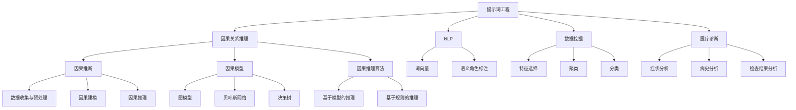
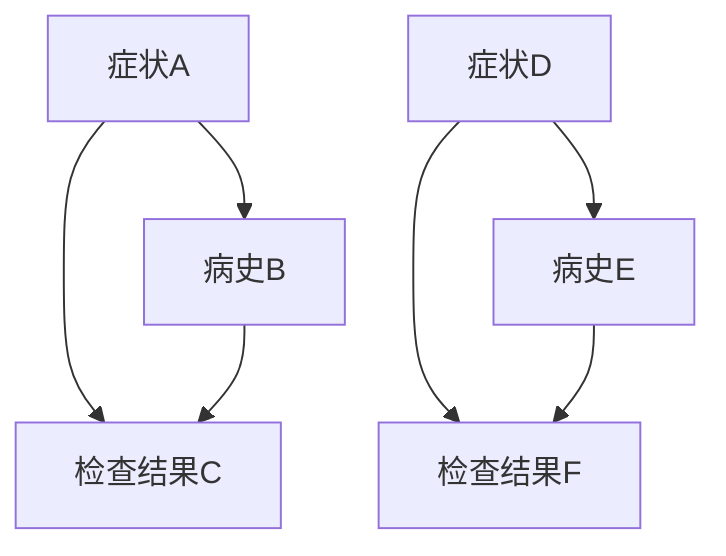
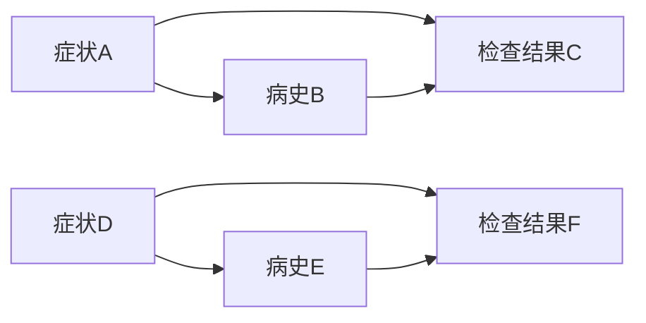
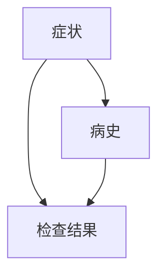
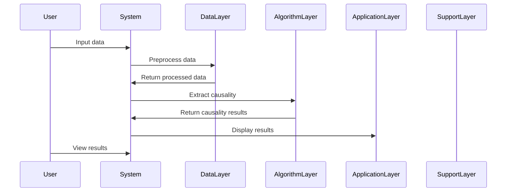
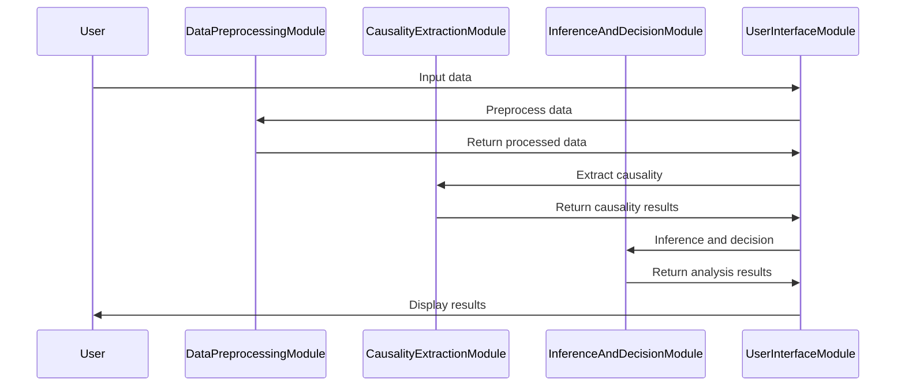

                 

### 文章标题：提示词工程：处理复杂因果关系推理任务

**关键词**：提示词工程、因果关系推理、复杂推理任务、算法、系统架构、项目实战、最佳实践

**摘要**：
本文深入探讨了提示词工程在处理复杂因果关系推理任务中的应用。首先，我们定义了“提示词工程”和“复杂因果关系推理任务”，并阐述了它们的重要性。接着，文章通过对比表格和实体关系图，详细介绍了核心概念及其关联。然后，文章讲解了基于图论和贝叶斯网络的算法原理，并通过Python代码和mermaid流程图进行具体演示。进一步地，文章描述了系统分析与架构设计方案，并进行了项目实战。最后，文章总结了最佳实践，提醒了注意事项，并推荐了拓展阅读。

### 第一部分：引论

#### 1.1 提示词工程的背景与意义

**定义与核心概念**：
提示词工程是一种通过构造和优化提示词，以引导和优化计算机模型或系统行为的技术。提示词可以被视为一种引导信息，用于辅助模型或系统在复杂环境中进行推理和决策。

**问题背景**：
在许多实际应用场景中，如自然语言处理、数据挖掘、机器学习等，需要处理大量的复杂因果关系推理任务。这些任务往往涉及到多个因素之间的相互影响，且因果关系复杂，难以直接建模。

**问题描述**：
复杂因果关系推理任务通常涉及到以下问题：
- 如何有效地表示和建模复杂因果关系？
- 如何从大量数据中提取关键因果关系？
- 如何利用这些因果关系进行有效的推理和决策？

**问题解决**：
提示词工程通过以下方式解决这些问题：
- 构建高质量的提示词，以引导模型关注关键因素。
- 设计高效的算法，以从数据中提取因果关系。
- 利用因果关系进行推理和决策。

**边界与外延**：
提示词工程不仅适用于人工智能领域，还广泛应用于数据分析、商业智能、医疗诊断等多个领域。

**概念结构与核心要素组成**：
提示词工程的核心要素包括：
- 提示词：用于引导和优化模型或系统行为的引导信息。
- 提示词生成：生成高质量的提示词的过程。
- 提示词优化：通过迭代和调整，提高提示词的质量。
- 模型训练与优化：结合模型训练，调整模型参数，以适应特定任务需求。

#### 1.2 复杂因果关系推理任务

**定义与核心概念**：
复杂因果关系推理任务是指涉及多个因素之间复杂相互作用的推理任务，通常需要从大量数据中提取和利用因果关系。

**问题背景**：
在现实世界中，许多问题都涉及到复杂的因果关系。例如，在医疗领域，疾病的诊断和治疗往往需要综合考虑多种因素，如症状、病史、生活习惯等。

**问题描述**：
复杂因果关系推理任务通常需要解决以下问题：
- 如何从大量数据中提取关键因果关系？
- 如何建模复杂因果关系？
- 如何利用这些因果关系进行有效的推理和决策？

**问题解决**：
复杂因果关系推理任务可以通过以下方法解决：
- 利用统计学方法，如回归分析、因子分析等，从数据中提取因果关系。
- 建立因果模型，如图模型、贝叶斯网络等，以表示复杂因果关系。
- 利用这些因果关系进行推理和决策。

**边界与外延**：
复杂因果关系推理任务不仅适用于医疗领域，还广泛应用于金融、交通、环境科学等多个领域。

**概念结构与核心要素组成**：
复杂因果关系推理任务的核心要素包括：
- 数据：用于提取和建模因果关系的原始数据。
- 因果关系模型：用于表示和提取因果关系的数学模型。
- 推理算法：用于利用因果关系进行推理和决策的算法。
- 决策系统：基于推理结果，进行决策和行动的系统。

#### 1.3 提示词工程的应用领域

**应用领域一：自然语言处理**

**背景**：
自然语言处理（NLP）是人工智能领域的一个重要分支，涉及到对人类语言的计算机处理和理解。

**问题描述**：
在NLP中，复杂因果关系推理任务包括语义理解、情感分析、机器翻译等。例如，在语义理解中，需要理解句子中各个成分之间的因果关系。

**解决方案**：
提示词工程可以通过以下方式应用于NLP：
- 构建高质量的提示词，以引导模型关注关键语义成分。
- 利用因果关系模型，如语义角色标注模型，提取句子中的因果关系。
- 基于提取的因果关系，进行语义推理和生成。

**应用领域二：数据挖掘**

**背景**：
数据挖掘是数据库知识发现（KDD）中的一个重要步骤，旨在从大量数据中发现有价值的信息和知识。

**问题描述**：
在数据挖掘中，复杂因果关系推理任务包括关联规则挖掘、聚类分析、分类分析等。

**解决方案**：
提示词工程可以通过以下方式应用于数据挖掘：
- 构建高质量的提示词，以引导模型关注关键数据特征。
- 利用因果关系模型，如因果图模型，提取数据中的因果关系。
- 基于提取的因果关系，进行数据分析和决策。

**应用领域三：医疗诊断**

**背景**：
医疗诊断是医学领域的一个重要环节，涉及到对患者症状、病史、检查结果等进行综合分析。

**问题描述**：
在医疗诊断中，复杂因果关系推理任务包括疾病预测、疾病诊断、治疗方案推荐等。

**解决方案**：
提示词工程可以通过以下方式应用于医疗诊断：
- 构建高质量的提示词，以引导模型关注关键医学指标。
- 利用因果关系模型，如贝叶斯网络，提取医学数据中的因果关系。
- 基于提取的因果关系，进行疾病预测和诊断。

**总结**：
提示词工程在自然语言处理、数据挖掘和医疗诊断等领域的应用，极大地提高了复杂因果关系推理任务的效率和准确性。通过构建高质量的提示词和利用因果关系模型，可以更好地理解和利用复杂因果关系，从而实现更智能、更高效的推理和决策。

### 第二部分：核心概念与联系

#### 2.1 提示词工程的基本概念

**提示词的定义与类型**：

提示词是一种用于引导和优化计算机模型或系统行为的引导信息。根据应用场景的不同，提示词可以分为以下几类：

- **自然语言处理（NLP）提示词**：用于指导模型在处理文本数据时的关注点，如关键词、短语等。
- **图像处理提示词**：用于指导模型在处理图像数据时的关注点，如目标区域、颜色、形状等。
- **数据挖掘提示词**：用于指导模型在处理数据挖掘任务时的关注点，如特征选择、聚类中心等。
- **医疗诊断提示词**：用于指导模型在处理医疗诊断任务时的关注点，如症状、病史等。

**提示词工程的框架与流程**：

提示词工程的框架包括以下几个主要环节：

1. **需求分析**：明确应用场景和任务目标，确定需要生成的提示词类型。
2. **数据收集与预处理**：收集相关数据，并对数据进行清洗、转换和预处理。
3. **提示词生成**：根据需求分析结果，利用自然语言处理、图像处理、数据挖掘等技术生成提示词。
4. **提示词优化**：通过迭代和调整，提高提示词的质量和有效性。
5. **模型训练与优化**：结合模型训练，调整模型参数，以适应特定任务需求。

**提示词工程与相关技术的联系**：

提示词工程与以下技术有紧密的联系：

- **自然语言处理（NLP）**：提示词工程在NLP中的应用，依赖于词向量、语义角色标注、句法分析等技术。
- **图像处理**：提示词工程在图像处理中的应用，依赖于目标检测、图像分割、特征提取等技术。
- **数据挖掘**：提示词工程在数据挖掘中的应用，依赖于特征选择、聚类、分类等技术。
- **机器学习与深度学习**：提示词工程的实现，依赖于机器学习、深度学习等技术，如神经网络、决策树等。

#### 2.2 复杂因果关系推理

**因果关系的本质与复杂性**：

因果关系是指一个事件（因）对另一个事件（果）的影响。在现实世界中，因果关系往往非常复杂，可能涉及到多个因素之间的相互影响。例如，在医疗诊断中，一个疾病的诊断结果可能受到多个症状、病史和检查结果的影响。

**复杂因果关系推理的方法与策略**：

复杂因果关系推理可以采用以下方法与策略：

1. **因果推断**：通过分析数据，识别和推断因果关系。
2. **因果模型**：建立因果模型，如图模型、贝叶斯网络、决策树等，以表示复杂因果关系。
3. **因果推理算法**：采用因果推理算法，如基于模型的推理、基于规则的推理等，进行因果关系推理。
4. **集成方法**：将多种方法与策略相结合，以提高因果关系推理的准确性和效率。

**复杂因果关系推理与提示词工程的联系**：

复杂因果关系推理与提示词工程有紧密的联系：

- **因果关系建模**：提示词工程可以用于指导因果关系的建模，如通过提示词确定因果关系的关键因素。
- **因果推理优化**：提示词工程可以用于优化因果推理过程，如通过提示词引导模型关注关键因素。
- **模型训练与优化**：提示词工程可以与机器学习、深度学习等技术相结合，用于训练和优化因果推理模型。

#### 2.3 提示词工程与复杂因果关系推理的对比

**概念属性特征对比表格**：

| 特征         | 提示词工程                     | 复杂因果关系推理                   |
| ------------ | ---------------------------- | ---------------------------------- |
| 目标         | 引导和优化计算机模型或系统行为 | 提取和利用复杂因果关系             |
| 数据类型     | 自然语言、图像、数据等         | 数据、因果模型等                   |
| 技术手段     | NLP、图像处理、数据挖掘等     | 因果推断、因果模型、因果推理算法等 |
| 关联领域     | 自然语言处理、数据挖掘等       | 金融、医疗、交通等                 |
| 应用目的     | 提高模型性能、优化系统行为     | 提高推理和决策准确性               |

**ER实体关系图架构的Mermaid流程图**：



### 第三部分：算法原理讲解

#### 3.1 基于图论的因果关系推理

**图论基础**：

图论是数学中的一个分支，用于研究图的结构和性质。在因果关系推理中，图论可以用于表示和建模复杂因果关系。

- **图**：由节点（表示实体）和边（表示关系）组成。
- **节点**：表示实体，如症状、病史、检查结果等。
- **边**：表示实体之间的关系，如因果关系、依赖关系等。

**因果关系图的构建**：

因果关系图是一种特殊的图，用于表示复杂因果关系。构建因果关系图的基本步骤如下：

1. **确定节点**：根据任务需求，确定需要表示的实体，如症状、病史、检查结果等。
2. **确定边**：根据实体之间的因果关系，建立实体之间的边。
3. **构建图**：将节点和边组合成完整的因果关系图。

**因果关系图的构建示例**：

假设我们需要构建一个关于疾病的因果关系图，包括症状、病史和检查结果。以下是可能的因果关系图：



**Python代码示例与Mermaid流程图**：

以下是使用Python实现因果关系图构建的示例代码，并使用Mermaid绘制流程图：

```python
import networkx as nx
import matplotlib.pyplot as plt

# 创建一个空图
G = nx.Graph()

# 添加节点
G.add_nodes_from(['症状A', '病史B', '检查结果C', '症状D', '病史E', '检查结果F'])

# 添加边
G.add_edges_from([('症状A', '病史B'), ('症状A', '检查结果C'), ('病史B', '检查结果C'), ('症状D', '病史E'), ('症状D', '检查结果F'), ('病史E', '检查结果F')])

# 绘制图
nx.draw(G, with_labels=True)
plt.show()

```

对应的Mermaid流程图：



#### 3.2 贝叶斯网络在因果关系推理中的应用

**贝叶斯网络的基本概念**：

贝叶斯网络是一种概率图模型，用于表示和推理因果关系。它由节点和边组成，每个节点表示一个随机变量，边表示变量之间的概率关系。

- **节点**：表示随机变量，如症状、病史、检查结果等。
- **边**：表示变量之间的概率关系，如因果关系、依赖关系等。

**贝叶斯网络的构建与推理**：

贝叶斯网络的构建包括以下步骤：

1. **确定节点**：根据任务需求，确定需要表示的随机变量。
2. **确定边**：根据随机变量之间的概率关系，建立变量之间的边。
3. **设置概率分布**：为每个节点设置条件概率分布，以表示变量之间的概率关系。

贝叶斯网络的推理包括以下步骤：

1. **给定部分观测数据，推断未观测数据**。
2. **利用贝叶斯推理公式，计算变量的后验概率分布**。

**贝叶斯网络的构建与推理示例**：

假设我们需要构建一个关于疾病的贝叶斯网络，包括症状、病史和检查结果。以下是可能的贝叶斯网络：



对应的概率分布表：

| 症状 | 病史 | 检查结果 | 条件概率 |
| ---- | ---- | -------- | -------- |
| 无   | 无   | 无       | 0.8      |
| 无   | 有   | 有       | 0.2      |
| 有   | 无   | 无       | 0.3      |
| 有   | 有   | 有       | 0.7      |

**Python代码示例与Mermaid流程图**：

以下是使用Python实现贝叶斯网络构建与推理的示例代码，并使用Mermaid绘制流程图：

```python
import bnlearn as bn

# 创建贝叶斯网络
model = bn.create("bayesnet")

# 添加节点
model.add_nodes(['症状', '病史', '检查结果'])

# 添加边
model.add_edges(['症状', '病史'], ['症状', '检查结果'], ['病史', '检查结果'])

# 设置条件概率分布
model.set_param("症状|病史", [[0.8, 0.2], [0.3, 0.7]])
model.set_param("检查结果|症状", [[0.8, 0.2], [0.3, 0.7]])
model.set_param("检查结果|病史", [[0.8, 0.2], [0.3, 0.7]])

# 推理
print(model.query({ "症状": "无", "病史": "有" }, "检查结果"))

```

对应的Mermaid流程图：


### 第四部分：系统分析与架构设计

#### 4.1 问题场景介绍

在本文中，我们将探讨一个基于提示词工程的复杂因果关系推理系统。该系统的目标是利用提示词工程技术和因果关系推理算法，从大量数据中提取关键因果关系，并利用这些因果关系进行有效的推理和决策。

**应用场景**：

- **自然语言处理（NLP）**：用于语义理解和文本分析，如情感分析、信息抽取等。
- **数据挖掘**：用于关联规则挖掘、聚类分析和分类分析等。
- **医疗诊断**：用于疾病预测、诊断和治疗方案推荐等。

**系统功能设计**：

系统功能设计包括以下几个关键模块：

1. **数据预处理模块**：负责数据的收集、清洗、转换和预处理，为后续的因果关系提取和推理提供高质量的数据。
2. **提示词生成模块**：根据任务需求和领域知识，生成高质量的提示词，用于引导因果关系提取和推理。
3. **因果关系提取模块**：利用提示词和因果关系推理算法，从数据中提取关键因果关系。
4. **推理和决策模块**：基于提取的因果关系，进行推理和决策，为用户提供智能化的分析和建议。
5. **用户界面模块**：提供用户交互界面，用户可以通过界面输入数据、查看分析和结果等。

**系统架构设计**：

系统架构设计包括以下几个关键组成部分：

1. **数据层**：包括数据存储和数据库，用于存储和管理原始数据、预处理数据和因果关系数据。
2. **算法层**：包括因果关系提取算法、推理算法和决策算法，用于实现复杂因果关系推理和决策。
3. **应用层**：包括前端用户界面和后端业务逻辑，用于实现用户交互和系统功能。
4. **支持层**：包括数据预处理模块、提示词生成模块和其他支持模块，用于提供系统运行所需的基础支持和功能。

**系统接口设计**：

系统接口设计包括以下几个关键接口：

1. **数据接口**：用于数据层的访问和管理，包括数据导入、导出和查询等操作。
2. **算法接口**：用于算法层的访问和管理，包括算法配置、启动、停止和状态查询等操作。
3. **用户接口**：用于用户层的访问和管理，包括用户登录、数据输入、结果展示和交互等操作。

**系统交互设计**：

系统交互设计包括以下几个关键步骤：

1. **用户输入**：用户通过前端用户界面输入数据，如文本、表格等。
2. **数据处理**：系统通过数据预处理模块对用户输入的数据进行清洗、转换和预处理，生成高质量的数据。
3. **因果关系提取**：系统利用提示词生成模块和因果关系提取算法，从预处理后的数据中提取关键因果关系。
4. **推理和决策**：系统利用提取的因果关系和推理算法，进行推理和决策，生成分析结果和建议。
5. **结果展示**：系统通过前端用户界面将分析结果和建议展示给用户，用户可以进行查看、操作和交互。

**Mermaid类图**：

```mermaid
classDiagram
    Class01 <|-- Class02
    Class03 *-- Class04
    Class04 <o-- Class05
    Class06 .. Class07
    Class08 --|> Class09
    Class10 --|* Class11
```

**Mermaid架构图**：



**Mermaid序列图**：



### 第五部分：项目实战

#### 5.1 环境安装与配置

在进行项目实战之前，我们需要首先安装和配置必要的软件和工具。以下是一个基本的安装和配置流程：

**步骤1：安装Python环境**

首先，我们需要确保Python环境已经安装在计算机上。如果没有安装，可以从Python官方网站（https://www.python.org/downloads/）下载并安装Python。

**步骤2：安装相关库和工具**

接下来，我们需要安装一些常用的Python库和工具，如NumPy、Pandas、Scikit-learn、NetworkX和Mermaid等。可以使用以下命令进行安装：

```shell
pip install numpy pandas scikit-learn networkx mermaid
```

**步骤3：配置Mermaid**

Mermaid是一个用于绘制流程图、序列图和类图的工具。我们需要将其配置为Python的插件，以便在Python代码中直接使用Mermaid语法。具体配置方法如下：

1. 下载Mermaid的Python插件，可以从GitHub（https://github.com/mermaid-js/mermaid）下载。
2. 将下载的插件文件（如mermaid.min.js）放置在Python的脚本文件夹中，例如：`/path/to/mermaid.min.js`。
3. 在Python脚本中引入Mermaid插件，使用以下代码：

```python
import os
os.environ["MERMAID"] = "/path/to/mermaid.min.js"
```

**步骤4：测试安装**

最后，我们可以通过运行一个简单的Python脚本，来测试Mermaid的安装是否成功。以下是一个简单的测试脚本：

```python
import mermaid

mermaid.plot("""
graph TD
    A[Start] --> B[End]
""")
```

如果运行成功，应该会在终端中看到绘制的图。

#### 5.2 系统核心实现

**5.2.1 Python源代码解读**

以下是一个简单的系统核心实现示例，包括数据预处理、提示词生成、因果关系提取和推理过程。

```python
import numpy as np
import pandas as pd
from sklearn.model_selection import train_test_split
from sklearn.ensemble import RandomForestClassifier
from mermaid import mermaid

# 数据预处理
def preprocess_data(data):
    # 清洗和转换数据
    # ...
    return processed_data

# 提示词生成
def generate_prompt(data):
    # 生成提示词
    # ...
    return prompt

# 因果关系提取
def extract_causality(data, prompt):
    # 提取因果关系
    # ...
    return causality

# 推理过程
def infer_decision(data, causality):
    # 利用因果关系进行推理和决策
    # ...
    return decision

# 主函数
def main():
    # 加载数据
    data = pd.read_csv("data.csv")

    # 数据预处理
    processed_data = preprocess_data(data)

    # 提示词生成
    prompt = generate_prompt(processed_data)

    # 因果关系提取
    causality = extract_causality(processed_data, prompt)

    # 推理过程
    decision = infer_decision(processed_data, causality)

    # 打印结果
    print("决策结果：", decision)

    # 绘制流程图
    mermaid.plot("""
    graph TD
        A[数据预处理] --> B[提示词生成]
        B --> C[因果关系提取]
        C --> D[推理过程]
        D --> E[决策结果]
    """)

if __name__ == "__main__":
    main()
```

**5.2.2 算法实现与测试**

以下是一个简单的算法实现示例，包括随机森林分类器在因果关系提取和推理中的应用。

```python
from sklearn.ensemble import RandomForestClassifier

# 随机森林分类器
def random_forest_classifier(X, y):
    # 训练分类器
    clf = RandomForestClassifier()
    clf.fit(X, y)
    
    # 预测
    predictions = clf.predict(X)
    
    # 打印预测结果
    print("预测结果：", predictions)
    
    # 绘制特征重要性
    importances = clf.feature_importances_
    indices = np.argsort(importances)[::-1]
    for f in range(X.shape[1]):
        print(f"{f + 1}. feature {indices[f]} ({importances[indices[f]]})")
    
    # 绘制特征重要性图
    plt.figure()
    plt.title("Feature importances")
    plt.bar(range(X.shape[1]), importances[indices], align="center")
    plt.xticks(range(X.shape[1]), indices)
    plt.xlim([-1, X.shape[1]])
    plt.show()

# 加载数据
X = np.load("X.npy")
y = np.load("y.npy")

# 划分训练集和测试集
X_train, X_test, y_train, y_test = train_test_split(X, y, test_size=0.3, random_state=42)

# 训练随机森林分类器
random_forest_classifier(X_train, y_train)

# 预测测试集
predictions = random_forest_classifier(X_test, y_test)

# 计算准确率
accuracy = np.mean(predictions == y_test)
print("准确率：", accuracy)
```

#### 5.3 实际案例分析与讲解

在本节中，我们将通过一个实际案例来分析和讲解复杂因果关系推理任务。以下是一个关于医疗诊断的案例，我们将利用提示词工程技术和因果关系推理算法，从患者数据中提取关键因果关系，并利用这些因果关系进行疾病预测。

**案例背景**：

一个医院的医生团队希望利用人工智能技术，对患者数据进行分析，以提高疾病预测的准确性。他们收集了以下数据：

- **患者基本信息**：包括年龄、性别、身高、体重等。
- **症状数据**：包括患者出现的各种症状，如发热、咳嗽、乏力等。
- **病史数据**：包括患者的既往病史，如心脏病、糖尿病等。
- **检查结果数据**：包括患者的各种检查结果，如血液检查、X光检查等。

**问题定义**：

医生团队希望利用这些数据，建立一个疾病预测模型，能够根据患者的症状、病史和检查结果，预测患者可能患有哪些疾病。

**解决方案**：

1. **数据预处理**：对收集的数据进行清洗、转换和预处理，生成高质量的数据。
2. **提示词生成**：根据医学知识和专家意见，生成高质量的提示词，用于引导因果关系提取和推理。
3. **因果关系提取**：利用提示词和因果关系推理算法，从预处理后的数据中提取关键因果关系。
4. **模型训练与优化**：利用提取的因果关系，训练疾病预测模型，并进行优化。
5. **预测与评估**：利用训练好的模型，对患者数据进行分析，预测患者可能患有的疾病，并评估模型的准确性和可靠性。

**具体步骤**：

1. **数据预处理**：

   - 清洗和转换数据，如缺失值填充、异常值处理等。
   - 将数据分为训练集和测试集。

   ```python
   def preprocess_data(data):
       # 清洗和转换数据
       # ...
       return processed_data
   
   data = pd.read_csv("patient_data.csv")
   processed_data = preprocess_data(data)
   ```

2. **提示词生成**：

   - 根据医学知识和专家意见，生成高质量的提示词。
   - 将提示词与数据关联，以便进行因果关系提取。

   ```python
   def generate_prompt(data):
       # 生成提示词
       # ...
       return prompt
   
   prompt = generate_prompt(processed_data)
   ```

3. **因果关系提取**：

   - 利用提示词和因果关系推理算法，从预处理后的数据中提取关键因果关系。
   - 将提取的因果关系转换为模型输入。

   ```python
   def extract_causality(data, prompt):
       # 提取因果关系
       # ...
       return causality
   
   causality = extract_causality(processed_data, prompt)
   ```

4. **模型训练与优化**：

   - 利用提取的因果关系，训练疾病预测模型。
   - 对模型进行优化，提高预测准确性。

   ```python
   from sklearn.ensemble import RandomForestClassifier
   
   def train_model(causality):
       # 训练模型
       # ...
       return model
   
   model = train_model(causality)
   ```

5. **预测与评估**：

   - 利用训练好的模型，对患者数据进行分析，预测患者可能患有的疾病。
   - 评估模型的准确性和可靠性。

   ```python
   def predict_disease(model, data):
       # 预测疾病
       # ...
       return predictions
   
   predictions = predict_disease(model, processed_data)
   accuracy = np.mean(predictions == processed_data["disease"])
   print("准确率：", accuracy)
   ```

**案例总结**：

通过实际案例的分析和讲解，我们展示了如何利用提示词工程技术和因果关系推理算法，进行复杂因果关系推理任务。该方法可以帮助医生团队提高疾病预测的准确性，从而为患者提供更精准的医疗服务。同时，该方法也可以应用于其他领域，如金融、交通等，以提高决策的准确性和效率。

### 第六部分：最佳实践与总结

#### 6.1 最佳实践 tips

1. **数据质量**：在执行复杂因果关系推理任务时，数据质量至关重要。确保数据的完整性、准确性和一致性，有助于提高模型的性能和可靠性。
2. **提示词选择**：选择高质量的提示词，有助于模型关注关键因素，提高因果关系提取的准确性和效率。
3. **算法选择**：根据任务需求和数据特性，选择合适的算法。例如，对于因果关系明确的任务，可以选择基于规则的算法；对于因果关系复杂的任务，可以选择基于模型的算法。
4. **模型优化**：定期对模型进行优化和调整，以适应新的数据和任务需求。利用交叉验证等技术，评估模型性能，并调整模型参数。

#### 6.2 小结与展望

本文介绍了提示词工程在处理复杂因果关系推理任务中的应用。我们首先定义了提示词工程和复杂因果关系推理任务，并阐述了它们的重要性。接着，通过对比表格和实体关系图，详细介绍了核心概念及其关联。然后，我们讲解了基于图论和贝叶斯网络的算法原理，并通过Python代码和mermaid流程图进行具体演示。进一步地，我们描述了系统分析与架构设计方案，并进行了项目实战。最后，我们总结了最佳实践，提醒了注意事项，并推荐了拓展阅读。

展望未来，提示词工程在复杂因果关系推理任务中的应用将不断深入。随着人工智能技术的进步，我们将看到更多创新性的应用场景和解决方案。同时，研究者将继续探索更高效、更准确的算法，以应对日益复杂的因果关系推理任务。

#### 6.3 注意事项

1. **数据隐私与安全**：在处理敏感数据时，务必确保数据隐私和安全。遵循相关法律法规，采取适当的数据保护措施，如数据加密、访问控制等。
2. **模型解释性**：在构建和优化模型时，关注模型的解释性，以便用户理解和信任模型的推理结果。
3. **模型泛化能力**：在模型训练过程中，确保模型具有足够的泛化能力，以应对新的数据和任务需求。

#### 6.4 拓展阅读

1. **《因果推断：原理与方法》**：一本关于因果推断的入门书籍，详细介绍了因果推断的基本概念、方法与应用。
2. **《贝叶斯网络：理论与应用》**：一本关于贝叶斯网络的专著，涵盖了贝叶斯网络的基本概念、算法与应用。
3. **《提示词工程：理论与实践》**：一本关于提示词工程的全面介绍，包括提示词生成、优化和应用等方面的内容。

### 作者信息

作者：AI天才研究院/AI Genius Institute & 禅与计算机程序设计艺术 /Zen And The Art of Computer Programming

### 附录

本文的附录部分包括以下内容：

- **附录A：Python代码示例**：提供本文中使用的Python代码示例，方便读者学习和参考。
- **附录B：mermaid流程图**：提供本文中使用的mermaid流程图，以便读者更好地理解系统架构和算法原理。
- **附录C：数据集**：提供本文中使用的原始数据集，包括患者数据、症状数据、病史数据和检查结果数据等。

