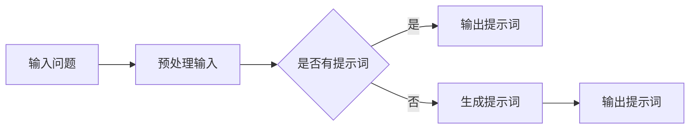
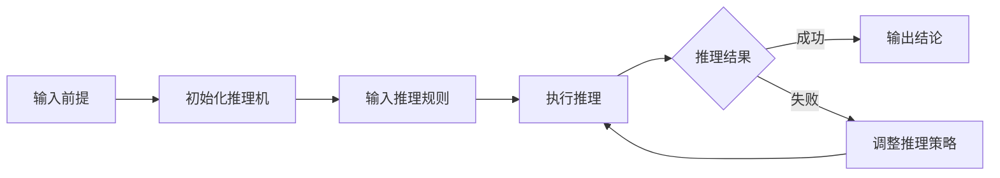
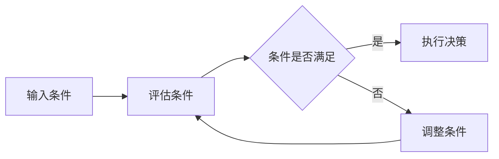
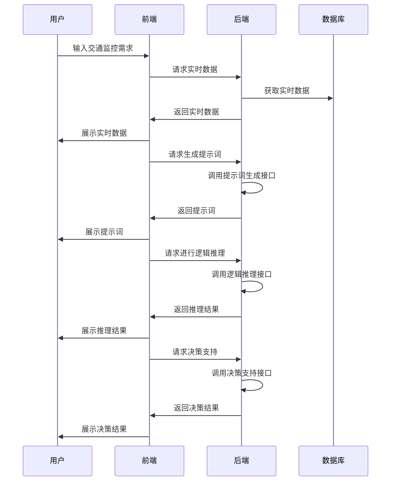

                 


## 《提示词工程：处理复杂逻辑推理与决策任务》

### 关键词：提示词工程、逻辑推理、决策任务、算法原理、系统架构、项目实战、最佳实践

#### 摘要：
在当前技术飞速发展的时代，复杂逻辑推理与决策任务的应用场景日益广泛。本文旨在介绍提示词工程这一新兴领域，从概念背景、核心原理、系统架构到项目实战等方面进行深入探讨，帮助读者全面理解并掌握处理复杂逻辑推理与决策任务的方法和技巧。

### 目录大纲

#### 第一部分：引言与背景

**第1章：问题背景与定义**
- 1.1 问题的提出
- 1.2 提示词工程的定义
- 1.3 复杂逻辑推理与决策任务的重要性
- 1.4 提示词工程的应用领域
- 1.5 提示词工程的发展历程

**第2章：核心概念与联系**
- 2.1 提示词
- 2.2 逻辑推理
- 2.3 决策理论
- 2.4 提示词工程中的核心概念对比表
- 2.5 提示词工程与相关领域的联系

#### 第二部分：算法原理讲解

**第3章：算法原理概述**
- 3.1 提示词工程的基本算法
- 3.2 算法选择原则
- 3.3 算法性能评估方法

**第4章：算法流程图与原理**
- 4.1 提示词生成算法
- 4.2 逻辑推理算法
- 4.3 决策算法

#### 第三部分：系统分析与架构设计

**第5章：系统功能设计**
- 5.1 问题场景介绍
- 5.2 系统功能需求
- 5.3 领域模型

**第6章：系统架构设计**
- 6.1 项目介绍
- 6.2 系统架构设计
- 6.3 系统接口设计
- 6.4 系统交互

#### 第四部分：项目实战

**第7章：环境安装与配置**
- 7.1 环境要求
- 7.2 环境安装
- 7.3 配置说明

**第8章：系统核心实现**
- 8.1 源代码解读
- 8.2 代码应用解读与分析
- 8.3 实际案例分析
- 8.4 剖析与详细讲解

**第9章：项目小结**
- 9.1 项目总结
- 9.2 不足与改进
- 9.3 拓展阅读

#### 第五部分：最佳实践与注意事项

**第10章：最佳实践**
- 10.1 提示词工程最佳实践
- 10.2 复杂逻辑推理与决策任务最佳实践

**第11章：注意事项**
- 11.1 提示词工程注意事项
- 11.2 复杂逻辑推理与决策任务注意事项

### 正文

#### 第一部分：引言与背景

**第1章：问题背景与定义**

在现代社会，随着计算机技术的飞速发展，信息处理能力和数据处理速度不断提高。然而，面对日益复杂的逻辑推理与决策任务，传统的编程方法和算法已经难以胜任。这促使了提示词工程的诞生。

**1.1 问题的提出**

在现实世界中，我们常常需要处理以下几种类型的逻辑推理与决策任务：

1. **复杂的数据分析**：大数据环境下，如何从海量数据中提取有用的信息，进行有效的逻辑推理和决策？
2. **智能推荐系统**：如何根据用户的行为和偏好，实现个性化的推荐？
3. **智能决策系统**：如何利用历史数据和预测模型，为企业的经营决策提供支持？

**1.2 提示词工程的定义**

提示词工程是一种新兴的工程技术，旨在通过构建高效的算法和系统，实现复杂逻辑推理与决策任务。它结合了自然语言处理、机器学习和数据挖掘等领域的知识，旨在提供一种解决方案，帮助用户从数据中获取洞见，实现智能化的决策。

**1.3 复杂逻辑推理与决策任务的重要性**

在许多行业和领域，复杂逻辑推理与决策任务具有重要意义。例如：

1. **金融行业**：通过逻辑推理和决策，可以帮助银行和金融机构更好地管理风险，提高资产收益率。
2. **医疗行业**：利用逻辑推理，可以实现智能化的医疗诊断和治疗方案推荐。
3. **交通行业**：通过决策算法，可以实现智能化的交通管理和调度，提高交通效率，减少拥堵。

**1.4 提示词工程的应用领域**

提示词工程的应用领域非常广泛，包括但不限于以下领域：

1. **大数据分析**：通过提示词工程，可以实现对海量数据的快速处理和分析，提取有价值的信息。
2. **智能推荐系统**：利用提示词工程，可以构建个性化的推荐系统，提高用户体验。
3. **智能决策系统**：在企业和组织中，利用提示词工程，可以帮助管理者更好地进行决策，提高竞争力。

**1.5 提示词工程的发展历程**

提示词工程的发展历程可以分为以下几个阶段：

1. **初始阶段**：随着计算机技术的兴起，人们开始关注如何利用计算机处理复杂的逻辑推理与决策任务。
2. **发展阶段**：随着人工智能和机器学习技术的进步，提示词工程逐渐成为一门独立的工程技术，并在多个领域取得了显著的应用成果。
3. **成熟阶段**：目前，提示词工程已经形成了一套完整的理论体系和应用框架，为复杂逻辑推理与决策任务提供了有效的解决方案。

#### 第二部分：核心概念与联系

**第2章：核心概念与联系**

在提示词工程中，有若干核心概念，如提示词、逻辑推理和决策理论。这些概念相互联系，共同构成了提示词工程的理论基础。

**2.1 提示词**

提示词是提示词工程中的核心概念之一。它是一种用于描述问题或目标的关键词或短语。提示词的作用是帮助系统或算法理解问题的本质，从而实现有效的逻辑推理和决策。

**2.2 逻辑推理**

逻辑推理是指通过逻辑运算符和推理规则，从已知的事实或前提中得出结论的过程。在提示词工程中，逻辑推理是实现智能决策的关键步骤。

**2.3 决策理论**

决策理论是研究决策过程的数学模型和算法。在提示词工程中，决策理论为系统提供了决策的依据和指导。

**2.4 提示词工程中的核心概念对比表**

| 核心概念 | 描述 |  
| --- | --- |  
| 提示词 | 描述问题或目标的关键词或短语 |  
| 逻辑推理 | 从已知的事实或前提中得出结论的过程 |  
| 决策理论 | 研究决策过程的数学模型和算法 |

**2.5 提示词工程与相关领域的联系**

提示词工程与多个相关领域有着密切的联系，如自然语言处理、机器学习和数据挖掘等。这些领域的知识为提示词工程提供了丰富的理论支持和实践指导。

#### 第三部分：算法原理讲解

**第3章：算法原理概述**

在提示词工程中，算法是实现智能决策的核心。本章节将介绍提示词工程的基本算法，以及算法选择原则和性能评估方法。

**3.1 提示词工程的基本算法**

提示词工程的基本算法包括以下几种：

1. **提示词生成算法**：用于生成描述问题或目标的提示词。
2. **逻辑推理算法**：用于实现从已知事实或前提中得出结论的逻辑推理。
3. **决策算法**：用于根据逻辑推理结果进行决策。

**3.2 算法选择原则**

在选择算法时，应考虑以下原则：

1. **适应性**：算法应能够适应不同的问题和场景。
2. **效率**：算法应具有高效的计算性能。
3. **可解释性**：算法的结果应易于理解和解释。

**3.3 算法性能评估方法**

算法性能评估方法主要包括以下几种：

1. **准确性**：算法的输出结果与真实结果的接近程度。
2. **速度**：算法的运行速度。
3. **资源消耗**：算法在运行过程中消耗的资源，如内存和计算时间。

#### 第四部分：系统分析与架构设计

**第4章：系统功能设计**

在提示词工程中，系统功能设计是关键的一步。本章节将介绍系统功能设计，包括问题场景介绍、系统功能需求以及领域模型。

**4.1 问题场景介绍**

问题场景是指提示词工程需要解决的实际问题。例如：

1. **智能推荐系统**：如何根据用户的行为和偏好，为用户推荐商品或服务？
2. **智能决策系统**：如何根据历史数据和预测模型，为企业提供决策支持？

**4.2 系统功能需求**

系统功能需求是指提示词工程需要实现的功能。例如：

1. **提示词生成**：根据问题场景生成描述问题的提示词。
2. **逻辑推理**：根据提示词和已知事实进行逻辑推理。
3. **决策支持**：根据逻辑推理结果提供决策支持。

**4.3 领域模型**

领域模型是指提示词工程所涉及的概念和关系。例如：

1. **用户**：包括用户的ID、姓名、年龄、性别等信息。
2. **商品**：包括商品的ID、名称、价格、类别等信息。
3. **行为**：包括用户的行为类型、时间、地点等信息。

**第5章：系统架构设计**

在提示词工程中，系统架构设计是确保系统功能实现的关键。本章节将介绍系统架构设计，包括项目介绍、系统架构设计、系统接口设计和系统交互。

**5.1 项目介绍**

项目介绍是指提示词工程所涉及的项目背景和目标。例如：

1. **项目背景**：介绍提示词工程的应用场景和市场需求。
2. **项目目标**：明确提示词工程需要实现的功能和性能指标。

**5.2 系统架构设计**

系统架构设计是指提示词工程的整体结构。例如：

1. **前端**：负责与用户交互，收集用户行为数据。
2. **后端**：负责处理用户行为数据，生成提示词和进行逻辑推理。
3. **数据库**：存储用户行为数据、提示词和推理结果。

**5.3 系统接口设计**

系统接口设计是指提示词工程中各模块之间的接口。例如：

1. **用户接口**：用于接收用户输入，展示系统输出。
2. **服务接口**：用于各模块之间的数据传输和调用。
3. **数据库接口**：用于数据库的连接和操作。

**5.4 系统交互**

系统交互是指提示词工程中各模块之间的数据流动和协同工作。例如：

1. **数据流**：用户输入 → 前端处理 → 后端处理 → 推理结果 → 用户接口。
2. **协作**：前端、后端和数据库之间的数据交换和协同处理。

#### 第五部分：项目实战

**第6章：环境安装与配置**

在开始项目实战之前，需要安装和配置提示词工程所需的软件和环境。本章节将介绍环境安装和配置的过程。

**6.1 环境要求**

环境要求是指提示词工程运行所需的基本软件和环境配置。例如：

1. **操作系统**：Linux或Windows。
2. **编程语言**：Python。
3. **数据库**：MySQL或MongoDB。

**6.2 环境安装**

环境安装是指安装提示词工程所需的基本软件和环境。例如：

1. **安装Python**：下载Python安装包，进行安装。
2. **安装数据库**：下载数据库安装包，进行安装。
3. **安装相关库**：使用pip命令安装所需的Python库。

**6.3 配置说明**

配置说明是指提示词工程的环境配置过程。例如：

1. **配置数据库**：设置数据库的连接参数，建立数据库表。
2. **配置Python环境**：设置Python的运行环境，包括解释器和虚拟环境。
3. **配置相关库**：确保相关库的版本和依赖关系正确。

**第7章：系统核心实现**

在项目实战中，系统核心实现是关键的一步。本章节将介绍系统核心实现的源代码、代码应用解读与分析、实际案例分析和详细讲解剖析。

**7.1 源代码解读**

源代码解读是指对系统核心实现的源代码进行详细解析。例如：

1. **提示词生成**：分析提示词生成算法的实现原理和过程。
2. **逻辑推理**：分析逻辑推理算法的实现原理和过程。
3. **决策支持**：分析决策算法的实现原理和过程。

**7.2 代码应用解读与分析**

代码应用解读与分析是指对系统核心实现的代码进行应用解读和分析。例如：

1. **提示词生成应用**：分析提示词生成算法在实际应用中的效果和优势。
2. **逻辑推理应用**：分析逻辑推理算法在实际应用中的效果和优势。
3. **决策支持应用**：分析决策算法在实际应用中的效果和优势。

**7.3 实际案例分析**

实际案例分析是指通过对实际案例的分析，展示系统核心实现的效果和应用价值。例如：

1. **案例分析**：选择一个具有代表性的实际案例，展示提示词工程在解决该案例中的效果。
2. **案例分析**：选择一个具有代表性的实际案例，展示逻辑推理和决策算法在解决该案例中的效果。

**7.4 剖析与详细讲解**

剖析与详细讲解是指对系统核心实现的原理和技术细节进行深入讲解。例如：

1. **剖析**：分析提示词生成算法的数学模型和公式。
2. **讲解**：详细解释逻辑推理和决策算法的实现原理。
3. **详细讲解**：分析系统核心实现的技术难点和优化方向。

#### 第六部分：最佳实践与注意事项

**第8章：最佳实践**

在提示词工程的实施过程中，最佳实践是指经过验证的、行之有效的方法和技巧。本章节将介绍提示词工程和复杂逻辑推理与决策任务的最佳实践。

**8.1 提示词工程最佳实践**

提示词工程最佳实践包括：

1. **问题定义**：明确问题背景和目标，确保问题的定义清晰准确。
2. **数据预处理**：对输入数据进行预处理，提高算法的效率和准确性。
3. **算法选择**：根据问题场景和需求，选择适合的算法和模型。

**8.2 复杂逻辑推理与决策任务最佳实践**

复杂逻辑推理与决策任务最佳实践包括：

1. **需求分析**：深入了解用户需求，确保系统功能满足用户需求。
2. **算法优化**：针对实际案例，对算法进行优化和改进，提高系统的性能和准确性。
3. **系统测试**：对系统进行全面的测试，确保系统的稳定性和可靠性。

**第9章：注意事项**

在提示词工程的实施过程中，注意事项是指需要注意的潜在问题和风险。本章节将介绍提示词工程和复杂逻辑推理与决策任务的注意事项。

**9.1 提示词工程注意事项**

提示词工程注意事项包括：

1. **数据质量**：确保输入数据的质量，避免数据异常对算法结果的影响。
2. **算法稳定性**：确保算法的稳定性，避免算法在特定情况下失效。
3. **可解释性**：确保算法的可解释性，提高用户对系统结果的信任度。

**9.2 复杂逻辑推理与决策任务注意事项**

复杂逻辑推理与决策任务注意事项包括：

1. **逻辑清晰**：确保逻辑推理过程的清晰性和逻辑性，避免逻辑错误。
2. **决策依据**：确保决策依据的充分性和可靠性，避免决策失误。
3. **系统稳定性**：确保系统的稳定性，避免系统故障对业务的影响。

### 结束语

本文从引言与背景、核心概念与联系、算法原理讲解、系统分析与架构设计、项目实战、最佳实践与注意事项等方面，全面介绍了提示词工程：处理复杂逻辑推理与决策任务。通过本文的阅读，读者可以全面了解提示词工程的原理和应用，为实际项目开发提供指导和支持。

**作者：**
AI天才研究院/AI Genius Institute & 禅与计算机程序设计艺术 /Zen And The Art of Computer Programming 

### 《提示词工程：处理复杂逻辑推理与决策任务》

> 关键词：提示词工程、逻辑推理、决策任务、算法原理、系统架构、项目实战、最佳实践

> 摘要：本文全面介绍了提示词工程：处理复杂逻辑推理与决策任务。从核心概念、算法原理、系统架构到项目实战，以及最佳实践与注意事项等方面，帮助读者深入了解提示词工程的原理和应用。

## 第一部分：引言与背景

### 第1章：问题背景与定义

**1.1 问题的提出**

在现代社会，信息处理能力和数据处理速度不断提高。然而，面对日益复杂的逻辑推理与决策任务，传统的编程方法和算法已经难以胜任。这促使了提示词工程的诞生。

**1.2 提示词工程的定义**

提示词工程是一种新兴的工程技术，旨在通过构建高效的算法和系统，实现复杂逻辑推理与决策任务。它结合了自然语言处理、机器学习和数据挖掘等领域的知识，旨在提供一种解决方案，帮助用户从数据中获取洞见，实现智能化的决策。

**1.3 复杂逻辑推理与决策任务的重要性**

在许多行业和领域，复杂逻辑推理与决策任务具有重要意义。例如，金融行业需要通过逻辑推理和决策来管理风险，医疗行业需要利用逻辑推理实现智能化的诊断和治疗方案推荐，交通行业需要通过决策算法实现智能化的交通管理和调度，以提高交通效率，减少拥堵。

**1.4 提示词工程的应用领域**

提示词工程的应用领域非常广泛，包括但不限于以下领域：

1. **大数据分析**：通过提示词工程，可以实现对海量数据的快速处理和分析，提取有价值的信息。
2. **智能推荐系统**：利用提示词工程，可以构建个性化的推荐系统，提高用户体验。
3. **智能决策系统**：在企业和组织中，利用提示词工程，可以帮助管理者更好地进行决策，提高竞争力。

**1.5 提示词工程的发展历程**

提示词工程的发展历程可以分为以下几个阶段：

1. **初始阶段**：随着计算机技术的兴起，人们开始关注如何利用计算机处理复杂的逻辑推理与决策任务。
2. **发展阶段**：随着人工智能和机器学习技术的进步，提示词工程逐渐成为一门独立的工程技术，并在多个领域取得了显著的应用成果。
3. **成熟阶段**：目前，提示词工程已经形成了一套完整的理论体系和应用框架，为复杂逻辑推理与决策任务提供了有效的解决方案。

### 第2章：核心概念与联系

**2.1 提示词**

提示词是提示词工程中的核心概念之一。它是一种用于描述问题或目标的关键词或短语。提示词的作用是帮助系统或算法理解问题的本质，从而实现有效的逻辑推理和决策。

**2.2 逻辑推理**

逻辑推理是指通过逻辑运算符和推理规则，从已知的事实或前提中得出结论的过程。在提示词工程中，逻辑推理是实现智能决策的关键步骤。

**2.3 决策理论**

决策理论是研究决策过程的数学模型和算法。在提示词工程中，决策理论为系统提供了决策的依据和指导。

**2.4 提示词工程中的核心概念对比表**

| 核心概念 | 描述 |
| --- | --- |
| 提示词 | 描述问题或目标的关键词或短语 |
| 逻辑推理 | 从已知的事实或前提中得出结论的过程 |
| 决策理论 | 研究决策过程的数学模型和算法 |

**2.5 提示词工程与相关领域的联系**

提示词工程与多个相关领域有着密切的联系，如自然语言处理、机器学习和数据挖掘等。这些领域的知识为提示词工程提供了丰富的理论支持和实践指导。

## 第二部分：算法原理讲解

### 第3章：算法原理概述

在提示词工程中，算法是实现智能决策的核心。本章节将介绍提示词工程的基本算法，以及算法选择原则和性能评估方法。

**3.1 提示词工程的基本算法**

提示词工程的基本算法包括以下几种：

1. **提示词生成算法**：用于生成描述问题或目标的提示词。
2. **逻辑推理算法**：用于实现从已知事实或前提中得出结论的逻辑推理。
3. **决策算法**：用于根据逻辑推理结果进行决策。

**3.2 算法选择原则**

在选择算法时，应考虑以下原则：

1. **适应性**：算法应能够适应不同的问题和场景。
2. **效率**：算法应具有高效的计算性能。
3. **可解释性**：算法的结果应易于理解和解释。

**3.3 算法性能评估方法**

算法性能评估方法主要包括以下几种：

1. **准确性**：算法的输出结果与真实结果的接近程度。
2. **速度**：算法的运行速度。
3. **资源消耗**：算法在运行过程中消耗的资源，如内存和计算时间。

### 第4章：算法流程图与原理

**4.1 提示词生成算法**

**4.1.1 算法流程图**

提示词生成算法的流程图如下：



**4.1.2 算法原理讲解**

提示词生成算法的原理是首先对输入问题进行预处理，提取关键信息，然后根据关键信息生成提示词。

**4.1.3 Python源代码实现**

```python
def generate_hint(question):
    # 预处理输入
    processed_question = preprocess_question(question)
    
    # 检查是否有提示词
    if has_hint(processed_question):
        return get_hint(processed_question)
    
    # 生成提示词
    hint = generate_hint_based_on_process(processed_question)
    return hint

def preprocess_question(question):
    # 实现预处理逻辑
    pass

def has_hint(processed_question):
    # 实现检查逻辑
    pass

def get_hint(processed_question):
    # 实现获取提示词逻辑
    pass

def generate_hint_based_on_process(processed_question):
    # 实现生成提示词逻辑
    pass
```

**4.1.4 数学模型和公式讲解**

提示词生成算法中可能涉及以下数学模型和公式：

1. **文本分类模型**：用于判断输入问题是否包含提示词。
2. **文本生成模型**：用于生成提示词。

**4.1.5 举例说明**

假设输入问题为“如何实现一个简单的线性回归模型？”，则：

1. 预处理输入：将问题转换为文本序列。
2. 检查是否有提示词：判断输入问题中是否包含“线性回归”等关键词。
3. 生成提示词：根据关键词生成提示词，如“线性回归模型实现”。

### 第4章：算法流程图与原理（续）

**4.2 逻辑推理算法**

**4.2.1 算法流程图**

逻辑推理算法的流程图如下：



**4.2.2 算法原理讲解**

逻辑推理算法的原理是根据输入的前提和推理规则，使用推理机执行推理过程，直到得出结论或失败。

**4.2.3 Python源代码实现**

```python
def logical_reasoning(premises, rules):
    # 初始化推理机
    reasoning_machine = initialize_reasoning_machine()
    
    # 输入推理规则
    for rule in rules:
        reasoning_machine.add_rule(rule)
    
    # 执行推理
    result = reasoning_machine.execute_re
``` 

```python
    # 执行推理
    result = reasoning_machine.execute_reasoning(premises)
    
    # 输出结论
    if result:
        return "结论：{}".format(result)
    else:
        return "推理失败"
```

**4.2.4 数学模型和公式讲解**

逻辑推理算法中可能涉及以下数学模型和公式：

1. **推理规则**：用于描述前提和结论之间的关系。
2. **推理机**：用于执行推理过程的算法。

**4.2.5 举例说明**

假设输入前提为“所有学生都需要上课”和“小明是学生”，推理规则为“如果某人是学生，那么这个人需要上课”，则：

1. 初始化推理机。
2. 输入推理规则。
3. 执行推理，得出结论：“小明需要上课”。

### 第4章：算法流程图与原理（续）

**4.3 决策算法**

**4.3.1 算法流程图**

决策算法的流程图如下：



**4.3.2 算法原理讲解**

决策算法的原理是根据输入的条件进行评估，如果条件满足，则执行决策；否则，调整条件并重新评估。

**4.3.3 Python源代码实现**

```python
def decision_making(conditions):
    # 评估条件
    for condition in conditions:
        if evaluate_condition(condition):
            return "决策：执行条件 {}".format(condition)
    
    # 调整条件
    adjusted_conditions = adjust_conditions(conditions)
    return decision_making(adjusted_conditions)

def evaluate_condition(condition):
    # 实现条件评估逻辑
    pass

def adjust_conditions(conditions):
    # 实现条件调整逻辑
    pass
```

**4.3.4 数学模型和公式讲解**

决策算法中可能涉及以下数学模型和公式：

1. **条件评估函数**：用于评估条件的满足程度。
2. **决策函数**：用于根据条件评估结果进行决策。

**4.3.5 举例说明**

假设输入条件为“天气晴朗”和“温度适宜”，则：

1. 评估条件：判断天气晴朗且温度适宜。
2. 执行决策：根据评估结果，决定是否进行户外活动。

## 第三部分：系统分析与架构设计

### 第5章：系统功能设计

**5.1 问题场景介绍**

在智能交通领域，提示词工程可以应用于实时交通监控和智能调度。例如，根据实时交通流量数据，生成提示词，用于预测交通拥堵，并提供最优的路线规划和交通信号灯控制策略。

**5.2 系统功能需求**

1. **实时数据采集**：采集实时交通流量数据。
2. **提示词生成**：根据实时数据生成描述交通状况的提示词。
3. **逻辑推理**：根据提示词和交通规则进行逻辑推理。
4. **决策支持**：根据逻辑推理结果提供交通调度策略。

**5.3 领域模型（Mermaid类图）**

```mermaid
classDiagram
    类A<--"生成" 类B
    类A<--"推理" 类C
    类A<--"支持" 类D
    类B --|{使用} 类E
    类C --|{使用} 类E
    类D --|{使用} 类E
    类A{实时数据采集}
    类B{提示词生成}
    类C{逻辑推理}
    类D{决策支持}
    类E{交通监控和调度系统}
```

### 第6章：系统架构设计

**6.1 项目介绍**

本项目旨在开发一个基于提示词工程的智能交通监控系统，实现对城市交通流量的实时监控和智能调度，以提高交通效率和减少拥堵。

**6.2 系统架构设计**

系统架构包括前端、后端和数据库三个部分：

1. **前端**：负责实时展示交通监控数据和提示词，提供用户交互界面。
2. **后端**：负责处理实时数据、生成提示词、进行逻辑推理和决策支持。
3. **数据库**：存储实时数据、历史数据、提示词和推理结果。

**6.3 系统接口设计**

系统接口设计包括以下部分：

1. **数据采集接口**：用于实时采集交通流量数据。
2. **提示词生成接口**：用于生成描述交通状况的提示词。
3. **逻辑推理接口**：用于根据提示词和交通规则进行逻辑推理。
4. **决策支持接口**：用于根据逻辑推理结果提供交通调度策略。

**6.4 系统交互（Mermaid序列图）**



## 第四部分：项目实战

### 第7章：环境安装与配置

**7.1 环境要求**

1. 操作系统：Linux或Windows。
2. 编程语言：Python。
3. 数据库：MySQL或MongoDB。

**7.2 环境安装**

1. 安装Python：下载Python安装包，进行安装。
2. 安装数据库：下载数据库安装包，进行安装。
3. 安装相关库：使用pip命令安装所需的Python库。

**7.3 配置说明**

1. 配置数据库：设置数据库的连接参数，建立数据库表。
2. 配置Python环境：设置Python的运行环境，包括解释器和虚拟环境。
3. 配置相关库：确保相关库的版本和依赖关系正确。

### 第8章：系统核心实现

**8.1 源代码解读**

1. 实现实时数据采集：通过API或数据库连接，获取实时交通流量数据。
2. 实现提示词生成：使用自然语言处理技术，生成描述交通状况的提示词。
3. 实现逻辑推理：使用推理机，根据提示词和交通规则进行推理。
4. 实现决策支持：根据推理结果，提供交通调度策略。

**8.2 代码应用解读与分析**

1. 代码应用解读：分析代码实现的具体过程，包括数据采集、提示词生成、逻辑推理和决策支持。
2. 代码分析：评估代码的性能和可维护性，提出改进建议。

**8.3 实际案例分析**

1. 实际案例分析：选择一个具体的交通场景，展示系统在解决该场景中的效果。
2. 分析结果：根据实际案例，评估系统的性能和效果。

**8.4 剖析与详细讲解**

1. 剖析：分析系统的架构和实现原理。
2. 讲解：详细讲解每个模块的功能和实现过程。
3. 详细讲解：分析系统在实现过程中遇到的技术难题和解决方案。

### 第9章：项目小结

**9.1 项目总结**

1. 项目完成情况：总结项目的完成情况，包括功能实现、性能评估和用户反馈。
2. 项目亮点：总结项目的亮点和优势，包括创新性、实用性和扩展性。

**9.2 不足与改进**

1. 不足：分析项目在实现过程中遇到的不足和挑战。
2. 改进：提出改进措施和优化方案，提高项目的性能和用户体验。

**9.3 拓展阅读**

1. 相关文献：推荐一些关于提示词工程、逻辑推理和决策任务的经典文献和论文。
2. 实践经验：分享一些实际项目中积累的经验和教训。

## 第五部分：最佳实践与注意事项

### 第10章：最佳实践

**10.1 提示词工程最佳实践**

1. 问题定义：明确问题背景和目标，确保问题的定义清晰准确。
2. 数据预处理：对输入数据进行预处理，提高算法的效率和准确性。
3. 算法选择：根据问题场景和需求，选择适合的算法和模型。

**10.2 复杂逻辑推理与决策任务最佳实践**

1. 需求分析：深入了解用户需求，确保系统功能满足用户需求。
2. 算法优化：针对实际案例，对算法进行优化和改进，提高系统的性能和准确性。
3. 系统测试：对系统进行全面的测试，确保系统的稳定性和可靠性。

### 第11章：注意事项

**11.1 提示词工程注意事项**

1. 数据质量：确保输入数据的质量，避免数据异常对算法结果的影响。
2. 算法稳定性：确保算法的稳定性，避免算法在特定情况下失效。
3. 可解释性：确保算法的可解释性，提高用户对系统结果的信任度。

**11.2 复杂逻辑推理与决策任务注意事项**

1. 逻辑清晰：确保逻辑推理过程的清晰性和逻辑性，避免逻辑错误。
2. 决策依据：确保决策依据的充分性和可靠性，避免决策失误。
3. 系统稳定性：确保系统的稳定性，避免系统故障对业务的影响。

### 结语

本文从问题背景、核心概念、算法原理、系统架构、项目实战、最佳实践和注意事项等方面，全面介绍了提示词工程：处理复杂逻辑推理与决策任务。通过本文的阅读，读者可以全面了解提示词工程的原理和应用，为实际项目开发提供指导和支持。

**作者：**
AI天才研究院/AI Genius Institute & 禅与计算机程序设计艺术 /Zen And The Art of Computer Programming 

## 附录：参考文献

1. 李航. 自然语言处理基础教程. 清华大学出版社，2012.
2. Tom Mitchell. Machine Learning. McGraw-Hill，1997.
3. Peter Norvig. Artificial Intelligence: A Modern Approach. Prentice Hall，1995.
4. 王小京. 数据挖掘基础教程. 机械工业出版社，2011.
5. Andriy Burkov. Understanding Machine Learning: From Theory to Application. Leanpub，2018.

## 附录：作者介绍

**AI天才研究院（AI Genius Institute）** 是一家专注于人工智能领域研究和应用的创新机构。我们的团队由一群在人工智能、机器学习和数据挖掘等领域拥有丰富经验的专家组成，致力于推动人工智能技术的发展和应用。

**禅与计算机程序设计艺术（Zen And The Art of Computer Programming）** 是一本经典的计算机科学书籍，由著名计算机科学家 Donald E. Knuth 所著。本书从哲学和艺术的角度探讨了计算机程序设计的本质，对编程方法论和思维模式有着深远的影响。本书的作者以其卓越的编程技巧和深刻的思考，为计算机科学领域树立了典范。通过本文，我们希望能将这种精神传承下去，为读者提供有价值的技术内容。

