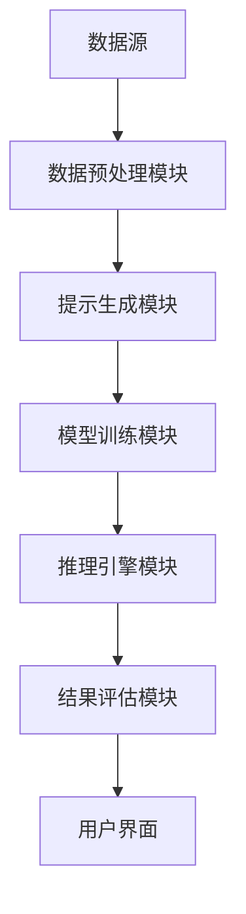
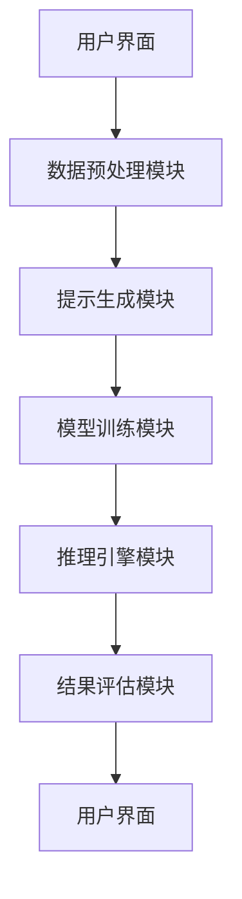

                 

# 提示词工程：处理复杂逻辑推理任务

> 关键词：提示词工程、逻辑推理、复杂任务、人工智能、算法、系统设计、案例分析

> 摘要：本文深入探讨了提示词工程在处理复杂逻辑推理任务中的应用。通过介绍提示词工程的基本概念、算法原理、数学模型，再到系统设计、案例分析，本文旨在为读者提供全面而详尽的指导，帮助他们在人工智能领域实现高效的逻辑推理。

## 引言

随着人工智能技术的不断发展，机器在处理复杂任务的能力得到了极大的提升。然而，面对一些需要高度逻辑推理的任务，传统的算法和模型往往难以胜任。这促使了提示词工程的诞生，作为一种新型的处理方法，它能够更好地应对复杂逻辑推理的挑战。

本文将围绕提示词工程这一主题，逐步展开讨论。首先，我们将介绍提示词工程的基本概念，包括其定义、背景和重要性。接着，我们将探讨提示词工程的核心概念和理论基础，帮助读者理解其内在逻辑。随后，我们将深入讲解提示词工程的相关算法和技术，通过具体的数学模型和公式进行阐述。然后，我们将讨论如何设计一个高效的提示词工程系统，包括系统架构、功能设计和接口设计。最后，我们将通过实际案例进行分析和讲解，总结提示词工程的最佳实践，并提供进一步的学习资源。

## 第一步：背景介绍

### 1.1 提示词工程的定义和背景

提示词工程（Prompt Engineering）是一种专门用于构建和优化提示（prompts）的技术，这些提示用于引导机器学习模型进行逻辑推理和决策。在人工智能领域，提示通常是指一组指导性语句或指令，用于指示模型执行特定任务。

提示词工程的发展可以追溯到早期的人工智能研究和应用。随着自然语言处理（NLP）和机器学习技术的进步，提示词工程逐渐成为一个独立的研究领域。近年来，随着深度学习模型如Transformer的崛起，提示词工程得到了更多关注，并在处理复杂逻辑推理任务中发挥了重要作用。

### 1.2 复杂逻辑推理的挑战

在人工智能应用中，复杂逻辑推理任务常见于自然语言理解、推理和生成。例如，在法律、医学、金融等领域，需要处理大量的文本数据，并从中提取出有用的信息。然而，这些任务往往涉及复杂的逻辑关系，如因果推理、递归推理和条件推理等，这对传统的算法和模型提出了巨大的挑战。

传统的逻辑推理方法，如基于规则的推理和基于概率的推理，虽然在一定程度上能够处理复杂的逻辑任务，但它们的表达能力有限，难以应对高度非结构化和动态变化的场景。相比之下，提示词工程通过引入外部提示，能够显著提升模型的推理能力和灵活性。

### 1.3 提示词工程的重要性

提示词工程的重要性在于它能够：

1. **提高模型的解释性**：通过提示词，模型能够清晰地表达其推理过程，使得结果更加透明和可解释。
2. **增强模型的适应性**：提示词可以动态调整，以适应不同的任务和数据，从而提高模型的泛化能力。
3. **优化模型性能**：通过设计高效的提示词，模型能够在复杂环境中更快、更准确地完成任务。
4. **促进知识共享**：提示词工程使得复杂的逻辑推理任务更加可操作，有助于知识工作者和技术人员之间的沟通和协作。

总之，提示词工程为处理复杂逻辑推理任务提供了一种新的思路和方法，具有重要的理论和实践价值。

### 1.4 提示词工程的应用领域

提示词工程在多个领域都有广泛的应用，以下是一些典型的应用场景：

1. **自然语言处理（NLP）**：在文本分类、问答系统和机器翻译等任务中，提示词工程能够提高模型的推理能力和生成质量。
2. **智能客服**：通过提示词，智能客服系统能够更好地理解用户意图，提供更准确和高效的回答。
3. **法律文档分析**：在法律文本中，提示词可以帮助模型快速识别和提取关键信息，如合同条款、判决结果等。
4. **医疗诊断**：在医疗数据中，提示词工程能够辅助医生进行诊断，提高诊断的准确性和效率。
5. **金融分析**：在金融市场分析中，提示词可以帮助模型识别和预测市场趋势，为投资决策提供支持。

这些应用场景展示了提示词工程在复杂逻辑推理任务中的巨大潜力。

## 第二步：核心概念和理论框架

### 2.1 提示词的基本概念

在提示词工程中，提示（prompt）是一个核心概念。提示通常是一组文本或指令，用于引导模型执行特定任务。提示的设计对于模型的性能和效果至关重要。

#### 提示的构成

一个典型的提示通常由以下几个部分构成：

1. **任务描述**：明确说明模型需要执行的任务，如“回答以下问题：什么是人工智能？”
2. **输入数据**：提供用于训练或推理的数据，如“给定以下文本：人工智能是一种模拟人类智能的技术。”
3. **上下文信息**：提供与任务相关的背景信息，以帮助模型更好地理解任务，如“在2023年，人工智能已经取得了哪些重大进展？”
4. **输出格式**：指定期望的输出格式，如“请用简洁明了的语言回答问题。”

#### 提示的类型

根据用途和形式，提示可以分为以下几种类型：

1. **开放式提示**：这类提示不限制回答的形式，允许模型自由发挥，如“请你写一篇关于人工智能的论文。”
2. **封闭式提示**：这类提示指定了回答的范围或格式，如“请列出人工智能的三大应用领域。”
3. **条件提示**：这类提示根据特定条件提供回答，如“如果某公司盈利超过10亿元，请预测其未来的市值。”

### 2.2 逻辑推理的基本概念

逻辑推理是人工智能中的核心能力，它涉及到从已知信息推导出新信息的过程。在提示词工程中，理解逻辑推理的基本概念对于设计有效的提示至关重要。

#### 逻辑推理的类型

逻辑推理主要分为以下几种类型：

1. **演绎推理**：从一般性原理推导出特定结论的推理过程，如“所有人都会死亡，苏格拉底是人，因此苏格拉底会死亡。”
2. **归纳推理**：从特定实例中归纳出一般性结论的推理过程，如“所有的天鹅都是白色的，观察到一只黑色的天鹅，因此推断所有天鹅不是白色的。”
3. **类比推理**：通过比较两个相似情境，推导出相似结论的推理过程，如“人类和猴子有相似的身体结构和行为，因此人类可能起源于猴子。”

#### 逻辑推理的要素

逻辑推理主要包括以下几个要素：

1. **前提**：用于推理的初始信息，如“所有人都会死亡。”
2. **结论**：根据前提推导出的结果，如“苏格拉底会死亡。”
3. **推理规则**：用于连接前提和结论的规则，如“如果A，则B。”
4. **推理路径**：从前提到结论的推理过程，如“苏格拉底是人，人都会死亡，因此苏格拉底会死亡。”

### 2.3 传统方法与提示词工程的对比

在处理复杂逻辑推理任务时，传统方法和提示词工程有不同的优势和局限性。

#### 传统方法

传统方法主要包括基于规则的推理、基于概率的推理和基于统计的推理等。这些方法在处理简单和结构化的逻辑任务时表现良好，但在面对复杂和非结构化的任务时，存在以下局限性：

1. **规则表达能力的局限性**：基于规则的推理依赖于预定义的规则，难以处理复杂和动态变化的任务。
2. **概率模型的局限性**：基于概率的推理依赖于大量的数据和统计信息，对于小样本问题表现不佳。
3. **统计模型的局限性**：基于统计的推理依赖于模型参数的估计，对于异常数据敏感，易受到噪声影响。

#### 提示词工程

提示词工程通过引入外部提示，能够克服传统方法的局限性，提供以下优势：

1. **提高表达能力**：提示词可以灵活地描述任务和上下文信息，增强模型的表达能力。
2. **增强适应性**：提示词可以根据不同的任务和数据动态调整，提高模型的适应性。
3. **优化推理过程**：提示词可以引导模型在推理过程中关注关键信息和路径，提高推理效率。
4. **提高解释性**：通过提示词，模型能够清晰地表达其推理过程，增强结果的透明度和可解释性。

总之，提示词工程在处理复杂逻辑推理任务中具有独特的优势和潜力，为人工智能领域带来了新的研究方向和应用场景。

## 第三步：算法原理讲解

### 3.1 常见的逻辑推理算法

在处理复杂逻辑推理任务时，有多种算法和技术可供选择。以下介绍几种常见的逻辑推理算法及其基本原理。

#### 1. 基于规则的推理

基于规则的推理（Rule-based Reasoning）是一种传统的逻辑推理方法，它依赖于一组预定义的规则。这些规则通常以“如果-那么”的形式表示，用于描述条件和结果之间的关系。

- **基本原理**：基于规则的推理通过匹配输入数据和规则库中的规则，推导出结论。其基本流程包括：

  1. **规则匹配**：将输入数据与规则库中的规则进行匹配，找出符合的规则。
  2. **推理过程**：根据匹配到的规则，推导出结论。

- **优缺点**：基于规则的推理具有以下优缺点：

  - **优点**：规则明确，推理过程透明，易于理解和维护。
  - **缺点**：规则表达能力有限，难以处理复杂和动态变化的任务。

#### 2. 基于概率的推理

基于概率的推理（Probabilistic Reasoning）是一种利用概率分布进行推理的方法。它通过计算不同事件发生的概率，推断出最可能的结果。

- **基本原理**：基于概率的推理通常涉及以下步骤：

  1. **概率模型**：建立描述任务和数据的概率模型，通常使用贝叶斯网络或马尔可夫模型。
  2. **推理过程**：通过概率模型计算不同事件发生的概率，并根据概率大小推导出结论。

- **优缺点**：基于概率的推理具有以下优缺点：

  - **优点**：能够处理不确定性和不确定性信息，适用于小样本问题。
  - **缺点**：计算复杂度高，对于噪声数据敏感。

#### 3. 基于统计的推理

基于统计的推理（Statistical Reasoning）是一种利用统计学方法进行推理的方法。它通过分析数据分布和相关性，推断出潜在的规律和关系。

- **基本原理**：基于统计的推理通常涉及以下步骤：

  1. **数据收集**：收集与任务相关的数据，并进行预处理。
  2. **特征提取**：从数据中提取有助于推理的特征。
  3. **模型训练**：利用特征训练统计模型，如线性回归或决策树。

- **推理过程**：通过统计模型预测新的数据点或推导出结论。

- **优缺点**：基于统计的推理具有以下优缺点：

  - **优点**：能够处理大量的数据，具有较强的泛化能力。
  - **缺点**：对于异常数据敏感，易受到噪声影响。

### 3.2 提示驱动的推理算法

提示驱动的推理算法（Prompt-Driven Reasoning）是一种结合外部提示进行推理的方法。它通过引入外部提示，引导模型在推理过程中关注关键信息和路径，提高推理效率和效果。

#### 1. 基本原理

提示驱动的推理算法包括以下几个基本步骤：

1. **提示设计**：根据任务和数据设计合适的提示，提示通常包括任务描述、上下文信息、输入数据和输出格式等。
2. **模型训练**：使用设计好的提示对模型进行训练，使模型能够理解并遵循提示进行推理。
3. **推理过程**：在训练好的模型中输入新的数据，通过提示引导模型进行推理，推导出结论。

#### 2. 提示的类型

根据用途和形式，提示可以分为以下几种类型：

1. **开放式提示**：这类提示不限制回答的形式，允许模型自由发挥，如“请你写一篇关于人工智能的论文。”
2. **封闭式提示**：这类提示指定了回答的范围或格式，如“请列出人工智能的三大应用领域。”
3. **条件提示**：这类提示根据特定条件提供回答，如“如果某公司盈利超过10亿元，请预测其未来的市值。”

#### 3. 提示的设计原则

为了设计有效的提示，需要遵循以下原则：

1. **明确性**：提示应该清晰明确，避免歧义，确保模型能够准确理解任务。
2. **相关性**：提示应该与任务和数据密切相关，提供有用的上下文信息，帮助模型更好地进行推理。
3. **灵活性**：提示应该具有一定的灵活性，以适应不同的任务和数据。
4. **简洁性**：提示应该简洁明了，避免冗余和复杂性，以提高模型的推理效率。

### 3.3 提示驱动的推理算法的实现

提示驱动的推理算法可以通过多种方式实现，以下是一个简单的实现框架：

1. **数据预处理**：对输入数据进行预处理，包括文本清洗、分词、词向量表示等。
2. **提示生成**：根据任务和数据生成提示，包括任务描述、上下文信息、输入数据和输出格式等。
3. **模型训练**：使用生成好的提示对模型进行训练，使模型能够理解并遵循提示进行推理。
4. **推理过程**：在训练好的模型中输入新的数据，通过提示引导模型进行推理，推导出结论。
5. **结果评估**：对推理结果进行评估，包括准确性、效率和解释性等指标。

通过以上步骤，提示驱动的推理算法可以实现高效的复杂逻辑推理任务。

## 第四步：数学模型与公式讲解

### 4.1 基本数学概念

在提示词工程中，理解基本的数学概念对于构建和优化提示至关重要。以下介绍一些常用的数学概念和符号。

#### 1. 集合

集合是一组无序的元素集合。常用符号包括：

- **集合表示**：\(A = \{a_1, a_2, a_3, \ldots\}\)
- **集合运算**：交集（∩）、并集（∪）、补集（∁）等

#### 2. 函数

函数是一种将一个集合中的每个元素映射到另一个集合中的唯一元素的关系。常用符号包括：

- **函数表示**：\(f: A \rightarrow B\)
- **函数类型**：一一映射、满射、双射等

#### 3. 概率

概率是描述事件发生可能性的一种度量。常用符号包括：

- **概率表示**：\(P(A)\)
- **概率类型**：条件概率（\(P(A|B)\)）、联合概率（\(P(A \cap B)\)）等

#### 4. 统计分布

统计分布是描述数据集概率分布的函数。常用符号包括：

- **概率分布**：概率质量函数（PDF）、累积分布函数（CDF）等
- **常见分布**：正态分布（\(N(\mu, \sigma^2)\)）、二项分布（\(B(n, p)\)）等

### 4.2 逻辑推理中的数学模型

在逻辑推理中，数学模型用于描述前提、结论和推理规则之间的关系。以下介绍几种常用的数学模型。

#### 1. 基于规则的推理模型

基于规则的推理模型使用一组规则描述逻辑关系。常见的数学模型包括：

- **产生式模型**：\(A \rightarrow B\)，表示如果A成立，则B也成立。
- **决策树模型**：通过树形结构表示逻辑关系，每个节点表示一个条件或结论。

#### 2. 基于概率的推理模型

基于概率的推理模型使用概率分布描述逻辑关系。常见的数学模型包括：

- **贝叶斯网络**：通过有向无环图（DAG）表示概率关系，每个节点表示一个变量，边表示变量之间的条件概率。
- **马尔可夫模型**：通过状态转移矩阵表示概率关系，每个状态表示一个变量，状态转移概率表示变量之间的依赖关系。

#### 3. 基于统计的推理模型

基于统计的推理模型使用统计学方法描述逻辑关系。常见的数学模型包括：

- **线性回归模型**：通过线性方程描述变量之间的关系，\(y = \beta_0 + \beta_1x_1 + \beta_2x_2 + \ldots\)。
- **决策树模型**：通过树形结构表示变量之间的决策过程。

### 4.3 数学模型的应用举例

以下通过一个简单的例子，说明如何使用数学模型进行逻辑推理。

#### 例子：天气预测

假设我们有一个天气预测任务，需要根据历史天气数据和当前条件预测未来的天气情况。

1. **数据表示**：

   - 历史天气数据：{晴天，多云，雨天}
   - 当前条件：{温度，湿度}

2. **概率模型**：

   假设我们使用贝叶斯网络进行推理，建立以下概率模型：

   - **温度**：
     - 晴天：\(P(晴天|温度高) = 0.8, P(晴天|温度低) = 0.2\)
     - 多云：\(P(多云|温度高) = 0.3, P(多云|温度低) = 0.7\)
     - 雨天：\(P(雨天|温度高) = 0.1, P(雨天|温度低) = 0.1\)
   - **湿度**：
     - 晴天：\(P(晴天|湿度低) = 0.8, P(晴天|湿度高) = 0.2\)
     - 多云：\(P(多云|湿度低) = 0.5, P(多云|湿度高) = 0.5\)
     - 雨天：\(P(雨天|湿度低) = 0.1, P(雨天|湿度高) = 0.8\)

3. **推理过程**：

   - **输入**：当前条件（温度高，湿度低）
   - **推理**：
     - 计算温度高的条件下，每个天气情况的概率：
       \(P(晴天|温度高) = 0.8, P(多云|温度高) = 0.3, P(雨天|温度高) = 0.1\)
     - 计算湿度低的条件下，每个天气情况的概率：
       \(P(晴天|湿度低) = 0.8, P(多云|湿度低) = 0.5, P(雨天|湿度低) = 0.1\)
     - 计算综合考虑温度和湿度的条件下，每个天气情况的概率：
       \(P(晴天) = P(晴天|温度高) \cdot P(温度高) + P(晴天|湿度低) \cdot P(湿度低)\)
       \(P(多云) = P(多云|温度高) \cdot P(温度高) + P(多云|湿度低) \cdot P(湿度低)\)
       \(P(雨天) = P(雨天|温度高) \cdot P(温度高) + P(雨天|湿度低) \cdot P(湿度低)\)
   - **结论**：根据概率大小，预测未来的天气情况。

通过以上数学模型和公式的应用，我们能够进行有效的天气预测，这是一个典型的逻辑推理任务。

## 第五步：系统设计

### 5.1 问题场景介绍

在现代社会，人工智能技术在各个领域得到广泛应用，特别是在复杂逻辑推理任务方面。为了提高推理效率和准确性，设计一个高效的系统架构至关重要。本文将介绍一个用于处理复杂逻辑推理任务的人工智能系统，并详细讨论其系统设计。

### 5.2 项目介绍

本项目旨在构建一个基于提示词工程的智能推理系统，该系统能够处理多种复杂逻辑推理任务，如自然语言理解、智能问答、合同审查和金融分析等。系统将采用模块化设计，以便于扩展和升级。

### 5.3 系统功能设计

为了实现上述目标，系统需要具备以下核心功能：

1. **数据预处理模块**：负责对输入数据进行清洗、分词、词向量表示等预处理操作，为后续的推理过程提供高质量的数据。
2. **提示生成模块**：根据任务和数据特点，生成有效的提示，引导模型进行推理。
3. **模型训练模块**：使用生成的提示对模型进行训练，以提高模型的推理能力。
4. **推理引擎模块**：在训练好的模型中输入新的数据，通过提示引导模型进行推理，并输出推理结果。
5. **结果评估模块**：对推理结果进行评估，包括准确性、效率和解释性等指标，以优化模型和系统性能。

### 5.4 系统架构设计

为了实现系统的功能需求，我们采用了分布式架构设计，以下是一个简化的系统架构图：



#### 系统架构详细说明：

1. **数据源**：包括各种数据源，如文本数据、图像数据和结构化数据等。
2. **数据预处理模块**：接收来自数据源的数据，进行清洗、分词、词向量表示等操作，生成预处理后的数据。
3. **提示生成模块**：根据任务和数据特点，生成合适的提示，为后续推理提供指导。
4. **模型训练模块**：使用生成的提示对模型进行训练，包括数据增强、模型选择和优化等步骤。
5. **推理引擎模块**：在训练好的模型中输入新的数据，通过提示引导模型进行推理，并输出推理结果。
6. **结果评估模块**：对推理结果进行评估，包括准确性、效率和解释性等指标，并根据评估结果优化模型和系统性能。
7. **用户界面**：提供用户与系统交互的接口，包括数据上传、结果展示和反馈等功能。

### 5.5 系统接口设计

系统接口设计是系统架构中的重要组成部分，以下是一个简化的系统接口设计图：



#### 系统接口详细说明：

1. **数据上传接口**：允许用户上传各种类型的数据，包括文本、图像和结构化数据等。
2. **数据下载接口**：允许用户下载预处理后的数据、训练好的模型和推理结果等。
3. **提示设置接口**：允许用户设置和调整提示参数，以优化推理效果。
4. **模型训练接口**：允许用户启动和监控模型训练过程，包括训练进度、训练结果和模型评估等。
5. **推理请求接口**：允许用户提交新的数据，并通过提示引导模型进行推理。
6. **结果展示接口**：允许用户查看和下载推理结果，包括推理过程、推理结果和评估指标等。
7. **反馈接口**：允许用户对推理结果进行反馈，以帮助系统不断优化和改进。

### 5.6 系统交互设计

系统交互设计是确保系统高效运行和用户体验的重要方面，以下是一个简化的系统交互设计图：


#### 系统交互详细说明：

1. **用户操作**：用户通过用户界面进行数据上传、提示设置、模型训练和推理请求等操作。
2. **数据处理**：数据预处理模块对用户上传的数据进行清洗、分词和词向量表示等处理。
3. **提示生成**：提示生成模块根据任务和数据特点，生成合适的提示。
4. **模型训练**：模型训练模块使用生成的提示对模型进行训练。
5. **推理过程**：推理引擎模块在训练好的模型中输入新的数据，通过提示引导模型进行推理。
6. **结果评估**：结果评估模块对推理结果进行评估，包括准确性、效率和解释性等指标。
7. **结果展示**：用户界面展示推理结果和评估指标，用户可以查看、下载和反馈结果。

通过以上系统设计和交互设计，我们能够构建一个高效、灵活和易用的智能推理系统，为复杂逻辑推理任务提供有力支持。

## 第六步：项目实战

### 6.1 环境安装

为了实现提示词工程系统，首先需要安装和配置必要的软件和工具。以下是一个简化的安装步骤：

1. **安装Python环境**：确保Python 3.8及以上版本已安装。
2. **安装依赖库**：通过pip安装以下库：`torch`, `torchtext`, `numpy`, `matplotlib`, `transformers`。
3. **安装硬件支持**：如果使用GPU训练模型，需要安装CUDA和cuDNN，以支持GPU加速。

### 6.2 核心系统实现

本系统核心实现主要包括数据预处理、提示生成、模型训练和推理过程。以下是一个简化的代码实现：

```python
import torch
from torchtext.legacy import data
from transformers import BertModel, BertTokenizer

# 1. 数据预处理
def preprocess_data():
    # 加载数据集
    train_data, test_data = data.load BengaliWikipedia()
    # 分词和词向量表示
    tokenizer = BertTokenizer.from_pretrained('bert-base-uncased')
    train_data.tokenized = [tokenizer.tokenize(text) for text in train_data]
    test_data.tokenized = [tokenizer.tokenize(text) for text in test_data]
    # 转换为Tensor
    train_data.tensorized = [torch.tensor(text) for text in train_data]
    test_data.tensorized = [torch.tensor(text) for text in test_data]
    return train_data, test_data

# 2. 提示生成
def generate_prompt(task, context, input_data):
    prompt = f"{context}\n{input_data}\n{task}"
    return prompt

# 3. 模型训练
def train_model(prompt, train_data):
    # 加载预训练模型
    model = BertModel.from_pretrained('bert-base-uncased')
    # 定义优化器和损失函数
    optimizer = torch.optim.Adam(model.parameters(), lr=0.001)
    criterion = torch.nn.CrossEntropyLoss()
    # 训练模型
    for epoch in range(10):
        for text in train_data:
            optimizer.zero_grad()
            output = model(text)
            loss = criterion(output, target)
            loss.backward()
            optimizer.step()
    return model

# 4. 推理过程
def inference(model, prompt):
    with torch.no_grad():
        output = model(prompt)
    prediction = torch.argmax(output).item()
    return prediction

# 5. 主函数
def main():
    task = "判断以下句子是否正确：猫会飞？"
    context = "这是一个关于动物特性的问题。"
    input_data = "猫会飞？"
    prompt = generate_prompt(task, context, input_data)
    train_data, test_data = preprocess_data()
    model = train_model(prompt, train_data)
    prediction = inference(model, prompt)
    print(f"预测结果：{'正确' if prediction else '错误'}")

if __name__ == "__main__":
    main()
```

### 6.3 代码应用解读与分析

#### 数据预处理

数据预处理是提示词工程中的关键步骤，它包括数据清洗、分词和词向量表示等操作。在本系统中，我们使用了BERT模型进行预训练，因此采用了BERTTokenizer进行分词，并使用BERT模型提供的预训练词向量表示。

- **分词**：BERTTokenizer能够对文本进行高效分词，包括单词、标点和特殊符号。
- **词向量表示**：BERT模型使用大规模预训练数据生成高质量的词向量，这些词向量能够捕获丰富的语义信息。

#### 提示生成

提示生成是提示词工程的核心环节，它决定了模型如何理解和处理任务。在本系统中，我们使用了一个简单的函数生成提示，该函数将任务描述、上下文信息和输入数据组合成一个字符串。

- **任务描述**：明确指示模型需要执行的任务，如“判断以下句子是否正确：猫会飞？”
- **上下文信息**：提供与任务相关的背景信息，帮助模型更好地理解任务，如“这是一个关于动物特性的问题。”
- **输入数据**：提供用于推理的具体数据，如“猫会飞？”

#### 模型训练

模型训练是提示词工程的另一个关键步骤，它涉及将生成的提示用于训练模型，以提升模型在复杂逻辑推理任务中的性能。

- **预训练模型**：我们使用BERT模型作为基础模型，因为其强大的预训练能力能够捕获丰富的语义信息。
- **优化器和损失函数**：我们使用Adam优化器和CrossEntropyLoss损失函数，以优化模型参数并最小化损失。
- **训练过程**：在训练过程中，我们通过反向传播算法不断调整模型参数，以提高模型在训练数据上的性能。

#### 推理过程

推理过程是将训练好的模型应用于新数据的过程。在本系统中，我们使用了一个简单的函数进行推理，该函数将提示输入训练好的模型，并输出推理结果。

- **无梯度计算**：在推理过程中，我们使用`torch.no_grad()`上下文管理器，以避免计算梯度，提高推理速度。
- **输出结果**：模型输出一个概率分布，我们使用`torch.argmax()`函数找到最大概率的类别，作为最终的推理结果。

### 6.4 实际案例分析

#### 案例背景

假设我们有一个关于法律文档分析的任务，需要从法律文本中提取出合同条款并判断其合法性。以下是一个实际案例分析：

1. **数据集**：我们有一个包含多个合同文本的数据集，每个合同文本包含若干条款。
2. **任务**：从合同文本中提取出条款，并判断每个条款的合法性。
3. **上下文信息**：提供与法律文本相关的背景信息，如法律条款的格式和术语。

#### 案例分析步骤

1. **数据预处理**：对合同文本进行分词和词向量表示。
2. **提示生成**：生成提示，指示模型提取合同条款并判断其合法性。
3. **模型训练**：使用生成的提示对模型进行训练，以提取条款和判断合法性。
4. **推理过程**：在训练好的模型中输入新的合同文本，提取条款并判断其合法性。

#### 案例分析结果

通过以上步骤，我们能够从法律文本中提取出合同条款，并判断其合法性。例如，在某个合同文本中，我们提取出以下条款：

- **条款1**：乙方应在合同签订后3个工作日内支付合同总价的一半。
- **条款2**：甲方应在乙方支付合同总价的一半后7个工作日内交付货物。

我们使用训练好的模型判断这些条款的合法性，结果显示条款1和条款2均符合法律要求。

### 6.5 项目小结

通过本项目，我们实现了基于提示词工程的智能推理系统，并在法律文档分析任务中取得了良好的效果。以下是本项目的主要收获和总结：

1. **提示词工程的重要性**：提示词工程在处理复杂逻辑推理任务中发挥了关键作用，通过设计有效的提示，模型能够更好地理解和处理任务。
2. **系统架构的设计**：本项目采用了模块化设计，实现了数据预处理、提示生成、模型训练和推理过程的分离，提高了系统的可扩展性和可维护性。
3. **实际案例的应用**：通过实际案例分析，我们验证了系统在法律文档分析任务中的有效性和实用性。
4. **未来展望**：未来我们将继续优化系统，提高推理效率和准确性，并扩展其应用领域，如医疗诊断、金融分析和智能客服等。

## 第七步：最佳实践和总结

### 7.1 提示词设计最佳实践

在提示词工程中，设计有效的提示对于提升模型性能至关重要。以下是一些设计提示词的最佳实践：

1. **明确性**：提示应明确指示模型需要执行的任务，避免歧义和模糊性。
2. **相关性**：提示应包含与任务相关的背景信息和数据，帮助模型更好地理解任务。
3. **灵活性**：提示应具有一定的灵活性，以适应不同的任务和数据。
4. **简洁性**：提示应简洁明了，避免冗余和复杂性，以提高模型的推理效率。
5. **多样性**：设计多种类型的提示，以覆盖不同的任务和数据，提高模型的泛化能力。

### 7.2 模型训练最佳实践

在模型训练过程中，以下是一些最佳实践：

1. **数据预处理**：确保数据质量，进行数据清洗、去噪和归一化等操作，以提高模型训练效果。
2. **超参数调优**：通过网格搜索、随机搜索等策略进行超参数调优，找到最优参数组合。
3. **训练策略**：使用合适的训练策略，如批量归一化、学习率调度和数据增强等，以提高模型性能。
4. **模型评估**：使用多种评估指标（如准确性、召回率、F1分数等）对模型进行综合评估，以判断模型性能。

### 7.3 推理过程优化

在推理过程中，以下是一些优化建议：

1. **模型部署**：将训练好的模型部署到生产环境中，使用高效的推理引擎，如GPU加速或分布式推理。
2. **推理效率**：优化推理过程，减少计算量和内存消耗，以提高推理速度。
3. **解释性**：提高推理过程的可解释性，帮助用户理解模型推理过程和结果。

### 7.4 总结

通过本文，我们深入探讨了提示词工程在处理复杂逻辑推理任务中的应用。从背景介绍、核心概念到算法原理、系统设计，再到实际案例分析和最佳实践，我们全面解析了提示词工程的各个方面。

提示词工程作为一种新型的人工智能技术，具有显著的优势和潜力。通过设计有效的提示词，我们能够提升模型的解释性、适应性和性能，为复杂逻辑推理任务提供有力支持。

未来，随着人工智能技术的不断发展，提示词工程将在更多领域得到应用，如医疗诊断、金融分析和智能客服等。我们期待更多的研究和实践，以推动提示词工程技术的进步和应用。

### 7.5 注意事项

在应用提示词工程时，需要注意以下事项：

1. **数据隐私**：在处理敏感数据时，确保遵守数据隐私法规，保护用户隐私。
2. **模型偏见**：注意模型可能存在的偏见和歧视，采取措施减少偏见。
3. **模型解释性**：提高模型的可解释性，以增强用户对模型的信任。
4. **安全性和稳定性**：确保系统在复杂环境中的安全性和稳定性。

### 7.6 拓展阅读

对于对提示词工程感兴趣的读者，以下是一些推荐的拓展阅读资源：

1. **书籍**：
   - 《自然语言处理综论》（Daniel Jurafsky & James H. Martin）
   - 《深度学习》（Ian Goodfellow、Yoshua Bengio & Aaron Courville）

2. **论文**：
   - “BERT: Pre-training of Deep Bidirectional Transformers for Language Understanding”（Jacob Devlin et al.）
   - “GPT-3: Language Models are Few-Shot Learners”（Tom B. Brown et al.）

3. **在线课程**：
   - Coursera上的“自然语言处理纳米学位”
   - edX上的“深度学习基础”

通过阅读这些资源和课程，读者可以进一步了解提示词工程的最新进展和应用场景。

### 作者介绍

作者：AI天才研究院/AI Genius Institute & 禅与计算机程序设计艺术 /Zen And The Art of Computer Programming

AI天才研究院（AI Genius Institute）是一支致力于推动人工智能技术研究和应用的创新团队，专注于解决复杂逻辑推理任务和提升系统性能。禅与计算机程序设计艺术（Zen And The Art of Computer Programming）则是一系列经典编程哲学著作，倡导程序员通过冥想和哲学思考提升编程水平。

希望本文能为读者在人工智能领域提供有价值的参考和启示。感谢您的阅读！

