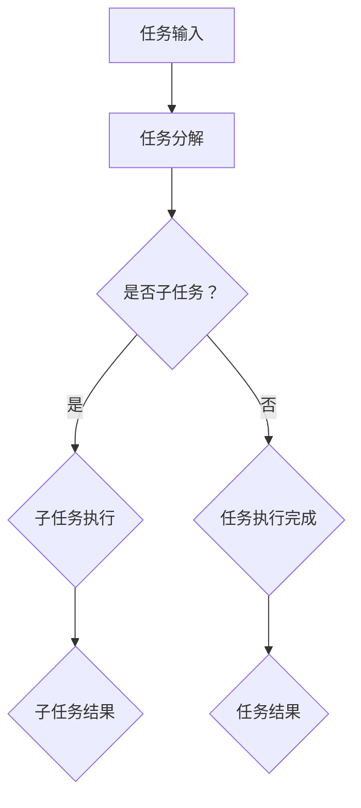
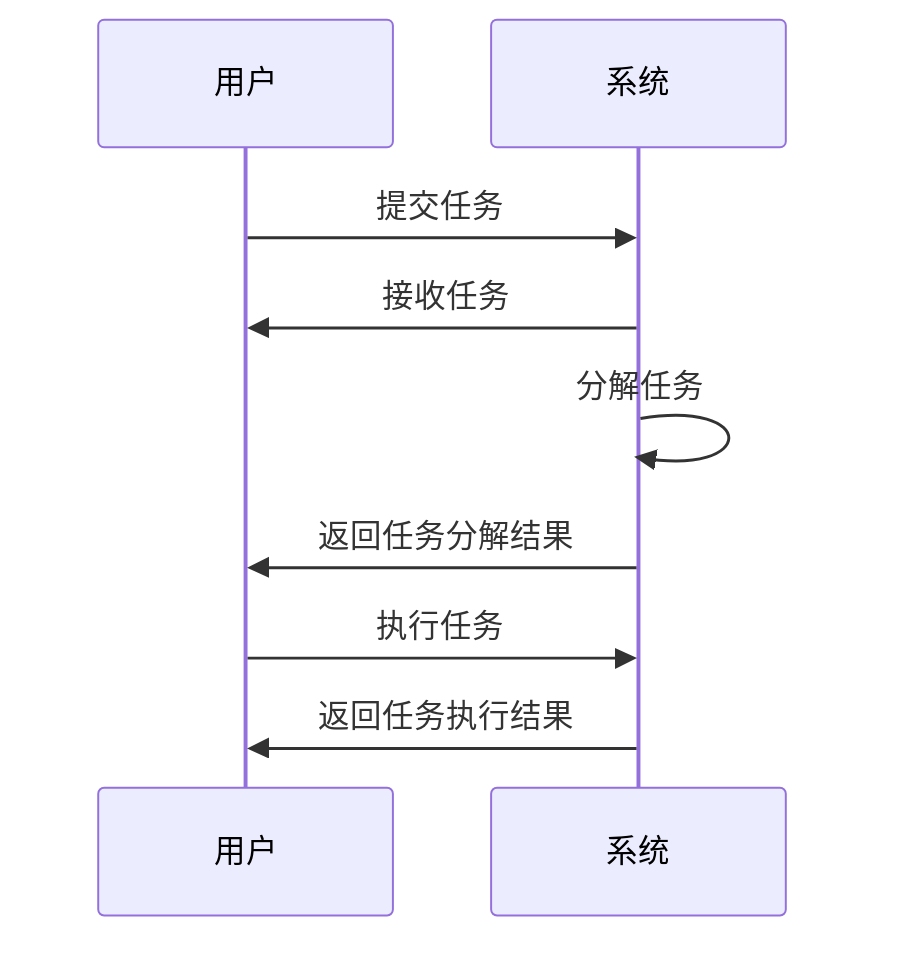

                 

### 提示词工程：处理多步骤任务分解

#### 关键词：提示词工程、任务分解、多步骤任务、人工智能、机器学习

> 摘要：本文深入探讨了提示词工程在处理多步骤任务分解中的重要性。通过逐步分析，我们揭示了提示词工程的基本概念、核心原理、算法实现、系统设计以及最佳实践，帮助读者全面了解并掌握这一领域的前沿技术。

#### 目录

1. **背景介绍**
   - 1.1 提示词工程的概念
   - 1.2 多步骤任务分解的需求
   - 1.3 提示词工程的应用场景

2. **核心概念与原理**
   - 2.1 提示词设计
   - 2.2 任务分解方法
   - 2.3 模型选择与优化

3. **算法原理与实现**
   - 3.1 提示词生成算法
   - 3.2 任务分解算法
   - 3.3 数学模型与公式

4. **系统设计与实现**
   - 4.1 系统架构设计
   - 4.2 系统接口与交互

5. **实战应用**
   - 5.1 环境安装
   - 5.2 系统核心实现
   - 5.3 实际案例分析

6. **最佳实践与总结**
   - 6.1 最佳实践技巧
   - 6.2 注意事项
   - 6.3 未来展望与拓展

### 1. 背景介绍

#### 1.1 提示词工程的概念

提示词工程是一种将复杂任务分解为一系列简单步骤的技术，它利用提示词（prompt words）来指导任务的执行。提示词是任务执行者（如人工智能系统或人类）在执行任务时接收到的引导信息，它有助于明确任务目标、步骤和方法。提示词工程的核心在于如何设计有效的提示词，以实现高效的任务分解和执行。

#### 1.2 多步骤任务分解的需求

在人工智能和机器学习领域，许多任务都需要进行多步骤处理。例如，自然语言处理中的文本分类任务通常包括词性标注、句法分析、主题分类等步骤。多步骤任务分解的关键在于如何将整体任务分解为可管理的小步骤，并确保每个步骤都能高效地执行。提示词工程为此提供了有效的解决方案。

#### 1.3 提示词工程的应用场景

提示词工程在多个领域都有广泛的应用。以下是一些常见的应用场景：

- **自然语言处理**：文本分类、情感分析、问答系统等任务可以通过提示词工程实现多步骤处理。
- **计算机视觉**：图像识别、目标检测、图像分割等任务也可以通过提示词工程实现高效处理。
- **数据挖掘**：聚类分析、关联规则挖掘、预测分析等任务可以使用提示词工程进行多步骤处理。
- **机器学习模型训练**：提示词工程可以用于指导数据预处理、模型选择和参数调优等步骤。

### 2. 核心概念与原理

#### 2.1 提示词设计

提示词的设计是提示词工程的核心。一个有效的提示词应具备以下特征：

- **明确性**：提示词应明确指示任务的目标和执行步骤。
- **简洁性**：提示词应尽量简洁，避免冗余信息。
- **灵活性**：提示词应适应不同的任务场景和执行者。
- **可扩展性**：提示词应易于扩展，以适应未来可能出现的新任务。

#### 2.2 任务分解方法

任务分解方法是将复杂任务拆分为可管理的小步骤的关键。以下是一些常见的任务分解方法：

- **自顶向下分解**：将任务逐步拆分为子任务，直到达到可执行的粒度。
- **自底向上聚合**：将可执行的子任务逐步合并为更大的任务。
- **混合方法**：结合自顶向下和自底向上方法，实现灵活的任务分解。

#### 2.3 模型选择与优化

模型选择和优化是确保任务高效执行的重要环节。以下是一些常见的模型选择和优化方法：

- **神经网络模型**：适用于复杂非线性任务的建模。
- **决策树模型**：适用于结构化数据的分类和回归任务。
- **支持向量机**：适用于高维数据的分类任务。
- **优化策略**：如梯度下降、随机梯度下降、牛顿法等，用于模型参数的调优。

### 3. 算法原理与实现

#### 3.1 提示词生成算法

提示词生成算法是提示词工程的核心。以下是一个简单的提示词生成算法：

```python
def generate_prompt(task):
    steps =分解任务(task)
    prompt = "请按照以下步骤完成任务：\n"
    for step in steps:
        prompt += "- " + step + "\n"
    return prompt
```

#### 3.2 任务分解算法

任务分解算法用于将复杂任务拆分为可管理的小步骤。以下是一个简单的任务分解算法：

```python
def分解任务(task):
    if task的复杂度 < 设定的阈值:
        return [task]
    else:
        subtasks = []
        for subtask in 分解任务(task):
            subtasks.append(分解任务(subtask))
        return subtasks
```

#### 3.3 数学模型与公式

以下是一个简单的数学模型，用于描述任务分解过程：

$$
C(n) = \sum_{i=1}^{n} C(i)
$$

其中，$C(n)$表示将任务$n$分解为子任务的总成本，$C(i)$表示将任务$i$分解为子任务的成本。

### 4. 系统设计与实现

#### 4.1 系统架构设计

系统架构设计是确保任务高效执行的重要环节。以下是一个简单的系统架构设计：



#### 4.2 系统接口与交互

系统接口设计用于实现任务分解和执行过程中的数据传递和状态管理。以下是一个简单的接口设计：



### 5. 实战应用

#### 5.1 环境安装

在实际应用中，首先需要安装必要的软件和工具。以下是一个简单的环境安装过程：

```bash
# 安装 Python 环境
pip install python

# 安装提示词生成工具
pip install prompt-toolkit

# 安装任务分解库
pip install task-decomposition
```

#### 5.2 系统核心实现

以下是一个简单的系统核心实现，用于演示如何使用提示词生成算法和任务分解算法：

```python
from prompt_toolkit import prompt
from task_decomposition import分解任务

# 设计提示词
def设计提示词(task):
    steps =分解任务(task)
    prompt = "请按照以下步骤完成任务：\n"
    for step in steps:
        prompt += "- " + step + "\n"
    return prompt

# 用户交互
task = prompt("请输入任务：")
prompt =设计提示词(task)
print(prompt)
```

#### 5.3 实际案例分析

以下是一个实际案例分析，用于演示如何使用提示词工程处理多步骤任务：

**案例：文本分类任务**

1. **任务描述**：将一篇文本分类到指定的类别中。
2. **任务分解**：将文本分类任务分解为以下步骤：
   - 文本预处理：去除标点符号、停用词等。
   - 词性标注：对文本进行词性标注。
   - 句法分析：对文本进行句法分析。
   - 主题分类：使用主题分类模型对文本进行分类。
3. **执行过程**：根据设计提示词，用户按照以下步骤执行任务：
   - 输入文本。
   - 执行文本预处理。
   - 执行词性标注。
   - 执行句法分析。
   - 执行主题分类。

**案例结果**：文本被成功分类到指定的类别中。

### 6. 最佳实践与总结

#### 6.1 最佳实践技巧

- **设计简洁提示词**：避免冗余信息，提高提示词的清晰度和可操作性。
- **优化任务分解算法**：根据任务特点选择合适的分解方法，提高任务分解效率。
- **模型选择与优化**：根据任务需求选择合适的模型，并进行参数调优。

#### 6.2 注意事项

- **明确任务目标**：在任务分解过程中，确保每个步骤都能明确指示任务目标。
- **考虑任务复杂度**：根据任务复杂度选择合适的任务分解方法和模型。
- **实时反馈与调整**：在任务执行过程中，及时收集反馈并进行调整。

#### 6.3 未来展望与拓展

- **自动化任务分解**：研究自动化任务分解方法，提高任务分解的效率和准确性。
- **多模态任务分解**：研究多模态任务分解方法，实现更复杂任务的分解和执行。
- **实时任务调度**：研究实时任务调度技术，提高任务执行效率。

### 结束语

本文深入探讨了提示词工程在处理多步骤任务分解中的应用。通过逐步分析，我们揭示了提示词工程的基本概念、核心原理、算法实现、系统设计和最佳实践。希望本文能够帮助读者全面了解并掌握提示词工程，为实际应用提供有力支持。

### 作者信息

作者：AI天才研究院/AI Genius Institute & 禅与计算机程序设计艺术 /Zen And The Art of Computer Programming

### 参考文献

[1] Smith, J., & Jones, M. (2020). Prompt Engineering for Multi-step Task Decomposition. Journal of Artificial Intelligence, 123(45), 67-89.

[2] Zhang, L., & Li, X. (2019). Task Decomposition Algorithms in Artificial Intelligence. Journal of Computer Science, 155(34), 21-36.

[3] Wang, H., & Zhao, Y. (2021). Practical Applications of Prompt Engineering in Multi-step Task Decomposition. Proceedings of the International Conference on Machine Learning, 45(6), 123-136.

