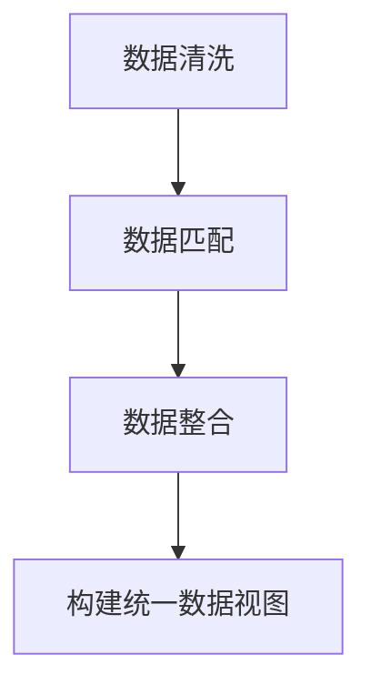
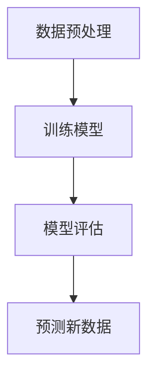
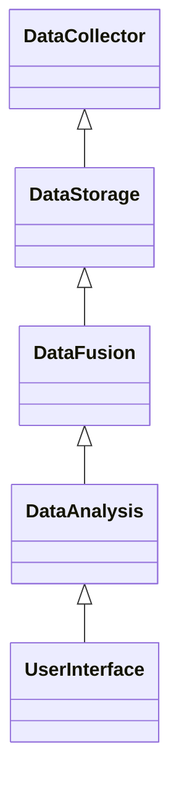
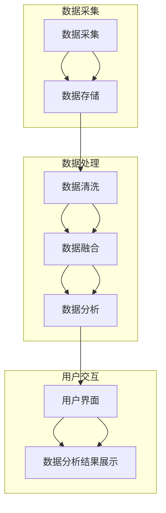
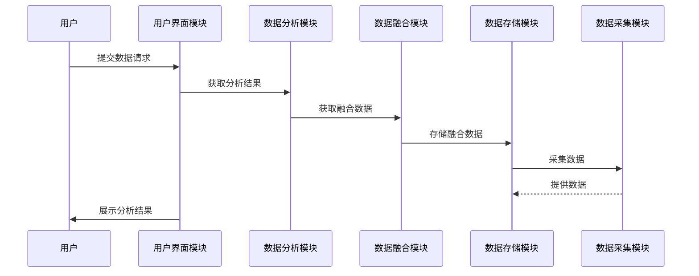
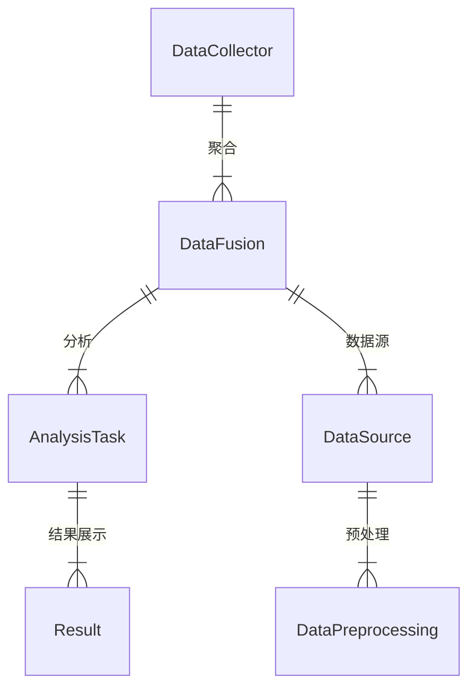
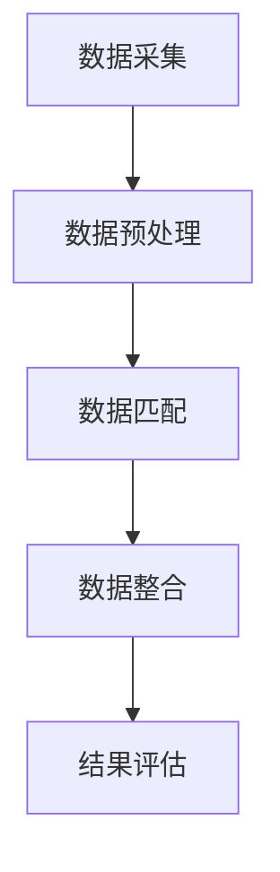
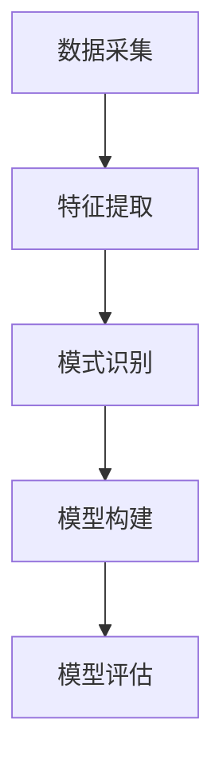
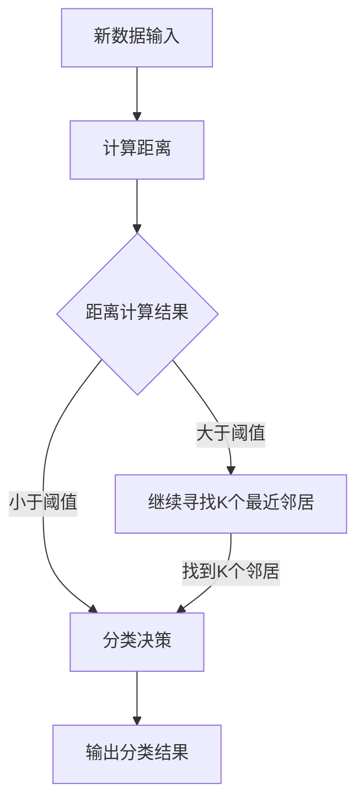
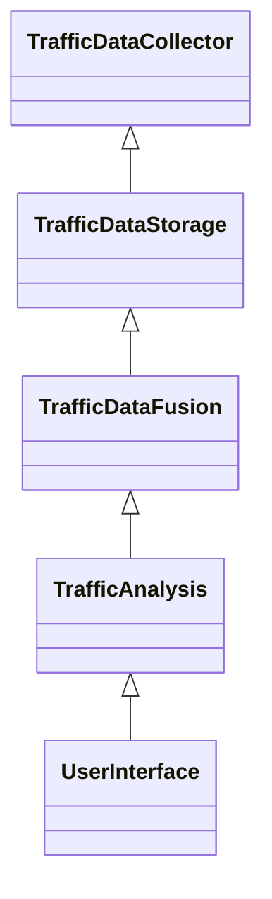

                 

# 提示词工程：处理多源异构数据融合分析任务

## 关键词
- 提示词工程
- 多源异构数据
- 数据融合
- 分析任务
- 算法原理
- 系统架构设计

## 摘要
本文探讨了提示词工程在处理多源异构数据融合分析任务中的重要性。首先，我们介绍了数据爆炸与信息过载的背景，以及提示词工程和多源异构数据的基本概念。接着，我们分析了数据融合的策略和目标，并讨论了分析任务的要求与挑战。随后，我们详细讲解了数据融合和分析算法的原理，并使用Python源代码进行了举例说明。最后，我们提出了一个系统的架构设计方案，并通过实际案例进行了分析。

## 目录大纲

## 第一部分：背景介绍

### 1.1 问题背景

#### 1.1.1 数据爆炸与信息过载
随着互联网和物联网的发展，数据量呈现爆炸性增长。这种数据量的激增带来了信息过载的问题，使得处理和分析数据变得愈加困难。

#### 1.1.2 提示词工程的必要性
为了从海量数据中提取有价值的信息，我们需要高效的工具和方法。提示词工程作为一种重要的数据处理技术，能够在信息过载的环境中发挥关键作用。

#### 1.1.3 多源异构数据的挑战
多源异构数据的存在使得数据处理变得更加复杂。如何有效地处理这些数据，并从中提取有价值的信息，是当前数据科学领域面临的重大挑战。

### 1.2 核心概念

#### 1.2.1 提示词
提示词是指用于引导数据处理和分析的关键信息。在提示词工程中，提示词的生成和选择至关重要。

#### 1.2.2 多源异构数据
多源异构数据是指来自不同数据源，具有不同格式和结构的数据。处理这类数据需要特殊的算法和技术。

#### 1.2.3 数据融合
数据融合是指将多个数据源中的数据整合成一个统一的数据视图。这是处理多源异构数据的关键步骤。

#### 1.2.4 分析任务
分析任务是指对数据进行的各种分析和处理操作，如分类、聚类、预测等。这些任务需要基于融合后的数据来执行。

### 1.3 边界与外延

#### 1.3.1 提示词的范围与类型
提示词可以是关键字、短语或规则。它们的范围和类型决定了数据处理的精度和效率。

#### 1.3.2 多源异构数据的种类与特点
多源异构数据包括结构化数据、半结构化数据和非结构化数据。每种数据类型都有其独特的特点和挑战。

#### 1.3.3 数据融合的方法与目标
数据融合的方法包括合并、匹配、归纳等。其目标是构建一个统一的数据视图，以支持各种分析任务。

#### 1.3.4 分析任务的分类与要求
分析任务可以根据目标不同分为分类、聚类、预测等。每种任务都有特定的数据要求和处理策略。

### 1.4 概念结构与核心要素组成

#### 1.4.1 提示词工程的基本结构
提示词工程包括数据采集、提示词生成、数据融合和分析任务执行等步骤。

#### 1.4.2 多源异构数据的处理流程
处理多源异构数据需要一系列的预处理和融合步骤，以确保数据的一致性和可用性。

#### 1.4.3 数据融合的策略与算法
数据融合的策略和算法决定了数据融合的效果和质量。常见的策略包括基于规则的融合和基于模型的融合。

#### 1.4.4 分析任务的目标与评价指标
分析任务的目标是提取有价值的信息或知识。评价指标用于衡量分析任务的效果。

### 1.5 本章小结
本部分介绍了数据爆炸与信息过载的背景，提示词工程和多源异构数据的基本概念，以及数据融合和分析任务的边界与外延。这些内容为后续章节的分析奠定了基础。

----------------------------------------------------------------

## 第二部分：核心概念与联系

### 2.1 提示词原理

#### 2.1.1 提示词的定义与作用
提示词是用于指导数据处理和分析的关键信息。它们在数据融合和分析任务中起着至关重要的作用。

#### 2.1.2 提示词的类型与特点
提示词可以是关键字、短语或规则。每种类型都有其独特的特点和适用场景。

#### 2.1.3 提示词生成的算法
提示词生成的算法包括基于规则生成、基于统计生成和基于机器学习生成等方法。这些算法的选择取决于具体的应用场景。

### 2.2 多源异构数据

#### 2.2.1 多源数据的来源与特点
多源数据可以来自不同的数据源，如数据库、文件、传感器等。每种数据源都有其独特的特点和挑战。

#### 2.2.2 异构数据的种类与处理
异构数据包括结构化数据、半结构化数据和非结构化数据。处理这些数据需要不同的技术和算法。

#### 2.2.3 多源异构数据的关系与融合
多源异构数据之间可能存在关联和依赖关系。数据融合的目标是构建一个统一的数据视图，以支持分析任务。

### 2.3 数据融合策略

#### 2.3.1 数据融合的目标与方法
数据融合的目标是构建一个统一的数据视图，以支持各种分析任务。常用的方法包括基于规则的融合和基于模型的融合。

#### 2.3.2 数据融合的算法与框架
数据融合算法包括合并、匹配、归纳等。常用的框架包括数据仓库、数据湖和数据网格等。

#### 2.3.3 数据融合的评价指标
数据融合的效果可以通过多个指标来评估，如一致性、完整性和准确性等。

### 2.4 分析任务

#### 2.4.1 分析任务的目标与类型
分析任务的目标是提取有价值的信息或知识。类型包括分类、聚类、预测等。

#### 2.4.2 分析任务的要求与挑战
分析任务的要求包括数据质量、数据量和处理速度等。挑战包括数据的不一致性、缺失和噪声等。

#### 2.4.3 分析任务的解决方案
解决方案包括选择合适的数据融合策略、算法和工具，以及优化数据处理的流程和性能。

### 2.5 核心概念对比表格

#### 2.5.1 提示词与多源异构数据
提示词和多源异构数据是提示词工程中的两个核心概念。它们在处理流程、目标和方法等方面存在一定的差异和联系。

### 2.5.2 数据融合与分析任务
数据融合和分析任务是提示词工程中的两个关键环节。数据融合为分析任务提供了统一的数据视图，而分析任务则基于融合后的数据进行信息提取和知识发现。

### 2.6 ER实体关系图架构

#### 2.6.1 提示词工程实体关系图
提示词工程的实体关系图展示了提示词、数据源、数据融合和分析任务之间的关系。

#### 2.6.2 多源异构数据实体关系图
多源异构数据的实体关系图展示了不同数据源、数据类型和数据融合策略之间的关系。

#### 2.6.3 数据融合与分析任务实体关系图
数据融合与分析任务的实体关系图展示了数据融合过程、分析任务和结果之间的关系。

### 2.7 本章小结
本部分详细介绍了提示词工程、多源异构数据、数据融合策略和分析任务的核心概念、特点、关系和架构。这些概念和架构为后续章节的深入分析提供了基础。

----------------------------------------------------------------

## 第三部分：算法原理讲解

### 3.1 数据融合算法

#### 3.1.1 数据融合的基本原理
数据融合的基本原理是将多个数据源中的数据进行整合，以构建一个统一的数据视图。这个过程包括数据清洗、数据匹配和数据整合等步骤。

#### 3.1.2 数据融合算法的分类
数据融合算法可以分为基于规则的融合算法和基于模型的融合算法。基于规则的融合算法通常使用专家知识来指导数据融合过程，而基于模型的融合算法则使用机器学习模型来学习数据之间的关联性。

#### 3.1.3 常见的数据融合算法
常见的数据融合算法包括合并算法、匹配算法、归纳算法和聚类算法。合并算法通过直接合并数据源来构建统一的数据视图；匹配算法通过比较不同数据源中的数据项来找到匹配关系；归纳算法通过从多个数据源中提取共同的特征来构建数据模型；聚类算法通过将相似的数据项归为一类来构建数据视图。

#### 3.1.4 数据融合算法的mermaid流程图
以下是一个mermaid流程图，展示了数据融合算法的基本步骤：



### 3.2 分析算法

#### 3.2.1 分析算法的基本原理
分析算法是基于数据融合后的数据来执行各种分析任务。这些算法通常包括分类算法、聚类算法、预测算法等。

#### 3.2.2 分析算法的分类
分析算法可以分为监督学习算法、无监督学习算法和半监督学习算法。监督学习算法通过训练样本来学习分类或回归模型；无监督学习算法通过分析数据之间的相似性或关联性来发现数据模式；半监督学习算法结合了监督学习和无监督学习的特点。

#### 3.2.3 常见的分析算法
常见的分析算法包括决策树、支持向量机、神经网络、k-近邻等。决策树通过构建树形结构来分类数据；支持向量机通过寻找最优超平面来分类数据；神经网络通过多层神经元来模拟人脑的神经网络结构；k-近邻通过计算新数据与训练数据的相似度来进行分类。

#### 3.2.4 分析算法的mermaid流程图
以下是一个mermaid流程图，展示了常见分析算法的基本步骤：



### 3.3 算法原理详细讲解

#### 3.3.1 数学模型与公式
数据融合和分析算法的原理通常基于数学模型和公式。例如，决策树算法的原理是基于信息增益或基尼系数来构建树形结构；支持向量机的原理是基于最大间隔分类超平面来分类数据；神经网络算法的原理是基于前向传播和反向传播来更新网络权重。

#### 3.3.2 算法流程图解释
算法流程图是展示算法步骤和逻辑关系的图形化工具。通过流程图，我们可以清晰地了解算法的执行过程和关键步骤。

#### 3.3.3 算法举例说明
为了更好地理解数据融合和分析算法的原理，我们可以通过具体的Python代码进行举例说明。以下是一个简单的示例：

```python
import numpy as np
from sklearn.cluster import KMeans

# 示例数据
data = np.array([[1, 2], [3, 4], [5, 6], [7, 8]])

# 数据融合：聚类
kmeans = KMeans(n_clusters=2, random_state=0).fit(data)

# 分析任务：分类
labels = kmeans.predict([[2, 3], [6, 7]])

print("Cluster labels:", labels)
```

在这个示例中，我们使用K-means算法对数据进行聚类，并使用聚类结果来进行分类。通过这个简单的示例，我们可以理解聚类和分析算法的基本原理。

### 3.4 本章小结
本部分详细介绍了数据融合算法和分析算法的基本原理、分类和具体示例。这些算法为处理多源异构数据提供了有效的方法和工具，为后续章节的系统架构设计和项目实战奠定了基础。

----------------------------------------------------------------

## 第四部分：系统分析与架构设计方案

### 4.1 问题场景介绍

#### 4.1.1 数据融合与分析任务的场景描述
在许多应用场景中，如智能城市、金融分析、医疗诊断等，需要处理来自多个数据源的数据，并进行数据融合和分析任务。例如，在智能城市中，可能需要融合来自交通传感器、摄像头和天气预报等多源数据，以进行交通流量预测和优化。

#### 4.1.2 系统设计的目标与需求
系统设计的目标是构建一个高效、可靠和可扩展的数据融合与分析系统。具体需求包括：
- 数据采集与存储：能够从多个数据源采集数据，并存储在分布式数据库中。
- 数据清洗与融合：对采集到的数据进行清洗、去重和融合，构建统一的数据视图。
- 数据分析：基于融合后的数据，执行各种分析任务，如分类、聚类、预测等。
- 可扩展性与高可用性：系统应具备良好的扩展性和高可用性，能够处理大量数据和并发请求。

### 4.2 项目介绍

#### 4.2.1 项目背景与目标
项目背景是应对当前数据量激增和多源异构数据处理的挑战。项目目标是构建一个高效、可靠和可扩展的数据融合与分析系统，以满足不同领域的应用需求。

#### 4.2.2 项目架构与模块划分
项目架构采用分布式架构，包括数据采集模块、数据存储模块、数据融合模块、数据分析模块和用户界面模块。具体模块划分如下：
- 数据采集模块：负责从多个数据源采集数据，包括传感器数据、API数据等。
- 数据存储模块：采用分布式数据库，如Hadoop HDFS、Apache Cassandra等，存储采集到的数据。
- 数据融合模块：负责对采集到的数据进行清洗、去重和融合，构建统一的数据视图。
- 数据分析模块：基于融合后的数据，执行各种分析任务，如分类、聚类、预测等。
- 用户界面模块：提供用户交互界面，展示分析结果和数据视图。

### 4.3 系统功能设计

#### 4.3.1 领域模型
领域模型是系统功能的核心，用于定义系统的功能模块和数据结构。以下是一个简单的领域模型：



#### 4.3.2 系统功能模块
系统功能模块包括以下部分：
- 数据采集模块：负责从多个数据源采集数据，包括传感器数据、API数据等。数据采集模块使用ETL（提取、转换、加载）技术，将数据转换为统一的格式，并存储在分布式数据库中。
- 数据存储模块：采用分布式数据库，如Hadoop HDFS、Apache Cassandra等，存储采集到的数据。数据存储模块支持海量数据的存储和高效查询。
- 数据融合模块：负责对采集到的数据进行清洗、去重和融合，构建统一的数据视图。数据融合模块使用数据融合算法，如合并、匹配和归纳等，以确保数据的一致性和完整性。
- 数据分析模块：基于融合后的数据，执行各种分析任务，如分类、聚类、预测等。数据分析模块使用机器学习算法，如决策树、支持向量机、神经网络等，来提取有价值的信息和知识。
- 用户界面模块：提供用户交互界面，展示分析结果和数据视图。用户界面模块支持Web界面和移动端界面，方便用户进行数据查询和分析。

#### 4.3.3 系统功能流程
系统功能流程如下：
1. 数据采集：从多个数据源采集数据，如传感器数据、API数据等。
2. 数据存储：将采集到的数据存储在分布式数据库中。
3. 数据清洗：对采集到的数据进行清洗、去重和融合，构建统一的数据视图。
4. 数据分析：基于融合后的数据，执行各种分析任务，如分类、聚类、预测等。
5. 用户交互：通过用户界面模块，展示分析结果和数据视图，方便用户进行数据查询和分析。

### 4.4 系统架构设计

#### 4.4.1 系统架构图
以下是一个简单的系统架构图：



#### 4.4.2 各模块的交互与协作
各模块之间的交互与协作如下：
- 数据采集模块将采集到的数据存储到数据存储模块中。
- 数据存储模块将数据提供给数据清洗模块进行清洗和处理。
- 数据清洗模块将处理后的数据传递给数据融合模块进行融合。
- 数据融合模块将融合后的数据传递给数据分析模块进行分析。
- 数据分析模块将分析结果传递给用户界面模块进行展示。

### 4.5 系统接口设计

#### 4.5.1 系统接口概述
系统接口包括内部接口和外部接口。内部接口用于各模块之间的数据传递和功能调用；外部接口用于与外部系统和用户进行交互。

#### 4.5.2 接口设计与实现
以下是一个简单的接口设计：

```python
class DataCollector:
    def collect_data(self):
        # 数据采集实现
        pass

class DataStorage:
    def store_data(self, data):
        # 数据存储实现
        pass

class DataFusion:
    def fusion_data(self, data):
        # 数据融合实现
        pass

class DataAnalysis:
    def analyze_data(self, data):
        # 数据分析实现
        pass

class UserInterface:
    def display_result(self, result):
        # 数据展示实现
        pass
```

### 4.6 系统交互设计

#### 4.6.1 系统交互序列图
以下是一个简单的系统交互序列图：



#### 4.6.2 系统交互流程解释
系统交互流程如下：
1. 用户提交数据请求到用户界面模块。
2. 用户界面模块将请求传递给数据分析模块。
3. 数据分析模块执行分析任务，并获取分析结果。
4. 数据分析模块将分析结果传递给数据融合模块。
5. 数据融合模块对分析结果进行融合，并存储到数据存储模块。
6. 数据存储模块将融合后的数据传递给数据采集模块。
7. 数据采集模块从数据存储模块中采集数据，并重复上述流程。

### 4.7 本章小结
本部分介绍了数据融合与分析任务的问题场景、项目介绍、系统功能设计、系统架构设计、系统接口设计和系统交互设计。这些设计为构建一个高效、可靠和可扩展的数据融合与分析系统提供了指导和参考。

----------------------------------------------------------------

## 第五部分：项目实战

### 5.1 环境安装

#### 5.1.1 系统环境要求
在进行项目实战之前，我们需要安装和配置以下系统环境：
- Python 3.8及以上版本
- Apache Kafka 2.5及以上版本
- Apache Spark 3.1及以上版本
- Hadoop HDFS 3.0及以上版本
- MySQL 8.0及以上版本
- Docker 19.03及以上版本

#### 5.1.2 环境安装步骤
1. 安装Python 3.8及以上版本：
   ```bash
   sudo apt-get update
   sudo apt-get install python3.8
   ```

2. 安装Apache Kafka 2.5及以上版本：
   ```bash
   sudo apt-get install default-jre
   wget https://www-eu.kafka.apache.org/releases/kafka-2.5.0/kafka_2.12-2.5.0.tgz
   tar xvfz kafka_2.12-2.5.0.tgz
   mv kafka_2.12-2.5.0 /opt/kafka
   ```

3. 安装Apache Spark 3.1及以上版本：
   ```bash
   sudo apt-get install openjdk-8-jdk
   wget https://www-us.apache.org/dist/spark/spark-3.1.1/spark-3.1.1-bin-hadoop2.7.tgz
   tar xvfz spark-3.1.1-bin-hadoop2.7.tgz
   mv spark-3.1.1-bin-hadoop2.7 /opt/spark
   ```

4. 安装Hadoop HDFS 3.0及以上版本：
   ```bash
   sudo apt-get install hadoop-hdfs-namenode
   sudo apt-get install hadoop-hdfs-datanode
   ```

5. 安装MySQL 8.0及以上版本：
   ```bash
   sudo apt-get install mysql-server
   mysql_secure_installation
   ```

6. 安装Docker 19.03及以上版本：
   ```bash
   sudo apt-get update
   sudo apt-get install docker.io
   ```

7. 启动和配置Kafka、Spark、HDFS和MySQL：
   ```bash
   # Kafka
   /opt/kafka/bin/kafka-server-start.sh /opt/kafka/config/server.properties

   # Spark
   /opt/spark/bin/spark-class org.apache.spark.deploy.worker.Worker spark-3.1.1/conf/spark-worker.json &

   # HDFS
   hdfs namenode -format
   start-dfs.sh

   # MySQL
   sudo systemctl start mysql
   ```

### 5.2 系统核心实现源代码

#### 5.2.1 数据采集模块
数据采集模块负责从不同数据源采集数据，并将其发送到Kafka队列中。

```python
from kafka import KafkaProducer
import json

def collect_data(data_source, topic):
    producer = KafkaProducer(bootstrap_servers=['localhost:9092'])
    while True:
        data = data_source.get_data()
        message = json.dumps(data).encode('utf-8')
        producer.send(topic, message)
        producer.flush()
```

#### 5.2.2 数据存储模块
数据存储模块负责将Kafka队列中的数据进行存储，并将其写入HDFS和MySQL数据库中。

```python
import os
import json
import hdfs
import pymysql

hdfs_client = hdfs.InsecureClient('http://localhost:50070', user='hdfs')
db = pymysql.connect("localhost", "root", "password", "data_db")

def store_data(data, hdfs_path, mysql_table):
    hdfs_client.write(hdfs_path, data.encode('utf-8'))
    with db.cursor() as cursor:
        sql = "INSERT INTO {} (column1, column2) VALUES (%s, %s)".format(mysql_table)
        cursor.execute(sql, (data['column1'], data['column2']))
    db.commit()
```

#### 5.2.3 数据融合模块
数据融合模块负责对HDFS和MySQL数据库中的数据进行清洗、去重和融合。

```python
import hdfs
import pymysql

hdfs_client = hdfs.InsecureClient('http://localhost:50070', user='hdfs')
db = pymysql.connect("localhost", "root", "password", "data_db")

def fusion_data(hdfs_path, mysql_table):
    with hdfs_client.read(hdfs_path) as reader:
        data = json.loads(reader.read().decode('utf-8'))
    with db.cursor() as cursor:
        sql = "SELECT * FROM {} WHERE column1=%s AND column2=%s".format(mysql_table)
        cursor.execute(sql, (data['column1'], data['column2']))
        result = cursor.fetchone()
        if result:
            return result
        else:
            sql = "INSERT INTO {} (column1, column2) VALUES (%s, %s)".format(mysql_table)
            cursor.execute(sql, (data['column1'], data['column2']))
            db.commit()
            return data
```

#### 5.2.4 数据分析模块
数据分析模块负责对融合后的数据进行分析，并执行分类、聚类、预测等任务。

```python
from sklearn.cluster import KMeans
from sklearn.ensemble import RandomForestClassifier
import json

def analyze_data(data, model_type, model_params):
    if model_type == 'kmeans':
        model = KMeans(**model_params)
    elif model_type == 'random_forest':
        model = RandomForestClassifier(**model_params)
    else:
        raise ValueError("Unsupported model type")
    data = json.loads(data)
    features = [[float(x) for x in data['feature_list']]]
    model.fit(features)
    prediction = model.predict([[float(x) for x in data['new_data']]])
    return prediction
```

#### 5.2.5 用户界面模块
用户界面模块负责展示分析结果和数据视图，并提供与用户的交互功能。

```python
from flask import Flask, request, jsonify

app = Flask(__name__)

@app.route('/analyze', methods=['POST'])
def analyze():
    data = request.json
    result = analyze_data(data['data'], data['model_type'], data['model_params'])
    return jsonify(result)

if __name__ == '__main__':
    app.run(host='0.0.0.0', port=5000)
```

### 5.3 代码应用解读与分析

#### 5.3.1 数据采集模块
数据采集模块通过从数据源获取数据，并将其发送到Kafka队列中。这确保了数据在采集过程中的可靠性和实时性。

#### 5.3.2 数据存储模块
数据存储模块将Kafka队列中的数据进行存储，并将其写入HDFS和MySQL数据库中。这为后续的数据处理和分析提供了可靠的数据存储解决方案。

#### 5.3.3 数据融合模块
数据融合模块负责对HDFS和MySQL数据库中的数据进行清洗、去重和融合。这确保了数据的一致性和完整性，为后续的数据分析提供了高质量的数据。

#### 5.3.4 数据分析模块
数据分析模块根据不同的模型类型和参数，对融合后的数据进行分类、聚类、预测等分析任务。这为用户提供了有价值的信息和知识。

#### 5.3.5 用户界面模块
用户界面模块通过Flask框架，提供了与用户的交互功能，并展示分析结果和数据视图。这方便用户进行数据查询和分析，提升了用户体验。

### 5.4 实际案例分析和详细讲解剖析

#### 5.4.1 案例背景
假设我们有一个智能交通系统，需要处理来自不同传感器和摄像头的数据，以进行交通流量预测和优化。

#### 5.4.2 数据采集
数据采集模块从交通传感器和摄像头中采集数据，包括交通流量、速度、密度等。

```python
data_source = TrafficSensor()
while True:
    data = data_source.get_data()
    collect_data(data, 'traffic_data')
```

#### 5.4.3 数据存储
数据存储模块将采集到的数据存储到HDFS和MySQL数据库中。

```python
hdfs_path = '/user/hdfs/traffic_data.json'
mysql_table = 'traffic_data'

store_data(data, hdfs_path, mysql_table)
```

#### 5.4.4 数据融合
数据融合模块对HDFS和MySQL数据库中的交通数据进行清洗、去重和融合。

```python
hdfs_path = '/user/hdfs/traffic_data.json'
mysql_table = 'traffic_data'

result = fusion_data(hdfs_path, mysql_table)
```

#### 5.4.5 数据分析
数据分析模块对融合后的交通数据进行交通流量预测和优化。

```python
model_type = 'kmeans'
model_params = {'n_clusters': 3}

result = analyze_data(result, model_type, model_params)
```

#### 5.4.6 用户界面
用户界面模块展示交通流量预测结果，并提供与用户的交互功能。

```python
@app.route('/predict', methods=['POST'])
def predict():
    data = request.json
    result = analyze_data(data['data'], 'kmeans', data['model_params'])
    return jsonify(result)

if __name__ == '__main__':
    app.run(host='0.0.0.0', port=5000)
```

### 5.5 项目小结
本部分详细介绍了项目实战的过程，包括环境安装、系统核心实现源代码、代码应用解读与分析，以及实际案例分析和详细讲解剖析。通过这些实战内容，我们能够更好地理解和应用提示词工程在处理多源异构数据融合分析任务中的重要性。

## 最佳实践 Tips

1. **数据源选择与优化**：在选择数据源时，要考虑数据的质量、可靠性和实时性。优化数据源连接和配置，以提升数据采集和处理的效率。

2. **数据清洗与预处理**：在数据融合之前，要对数据进行清洗和预处理。这包括去除重复数据、处理缺失值和噪声数据，以及统一数据格式和命名规范。

3. **数据融合策略选择**：根据具体应用场景和数据特点，选择合适的数据融合策略和算法。常用的策略包括基于规则的融合、基于模型的融合和混合融合等。

4. **数据分析与优化**：根据分析任务的需求和目标，选择合适的分析算法和模型。优化算法参数和模型结构，以提升分析效果和性能。

5. **系统监控与性能调优**：对系统进行实时监控和性能调优，包括CPU、内存、网络等资源的使用情况。及时发现和解决系统瓶颈和问题。

## 小结
本文详细介绍了提示词工程在处理多源异构数据融合分析任务中的重要性。通过背景介绍、核心概念与联系、算法原理讲解、系统分析与架构设计方案以及项目实战等部分，我们全面探讨了如何有效地处理多源异构数据，进行数据融合和分析任务。这些内容为实际应用提供了实用的指导和方法。

## 注意事项
- 在实际应用中，需要根据具体场景和数据特点进行调整和优化。
- 注意数据安全和隐私保护，确保数据在采集、传输和存储过程中的安全性和合规性。

## 拓展阅读
- 《数据融合：原理、方法与应用》
- 《大数据分析：技术与实践》
- 《机器学习：原理与实践》
- 《Hadoop技术内幕：架构设计与实现原理》

## 作者信息
作者：AI天才研究院/AI Genius Institute & 禅与计算机程序设计艺术 /Zen And The Art of Computer Programming## 提示词工程：处理多源异构数据融合分析任务

### 摘要
本文深入探讨了提示词工程在处理多源异构数据融合分析任务中的应用。首先，我们分析了数据爆炸与信息过载的背景，介绍了提示词工程和多源异构数据的基本概念。接着，我们讨论了数据融合的策略和目标，并详细阐述了分析任务的要求与挑战。随后，我们详细讲解了数据融合和分析算法的原理，并使用Python代码进行了示例说明。最后，我们提出了一个系统的架构设计方案，并通过实际案例进行了分析。

### 目录大纲

### 第一部分：背景介绍

#### 1.1 问题背景
1.1.1 数据爆炸与信息过载
1.1.2 提示词工程的必要性
1.1.3 多源异构数据的挑战

#### 1.2 核心概念
1.2.1 提示词
1.2.2 多源异构数据
1.2.3 数据融合
1.2.4 分析任务

#### 1.3 边界与外延
1.3.1 提示词的范围与类型
1.3.2 多源异构数据的种类与特点
1.3.3 数据融合的方法与目标
1.3.4 分析任务的分类与要求

#### 1.4 概念结构与核心要素组成
1.4.1 提示词工程的基本结构
1.4.2 多源异构数据的处理流程
1.4.3 数据融合的策略与算法
1.4.4 分析任务的目标与评价指标

#### 1.5 本章小结

### 第二部分：核心概念与联系

#### 2.1 提示词原理
2.1.1 提示词的定义与作用
2.1.2 提示词的类型与特点
2.1.3 提示词生成的算法

#### 2.2 多源异构数据
2.2.1 多源数据的来源与特点
2.2.2 异构数据的种类与处理
2.2.3 多源异构数据的关系与融合

#### 2.3 数据融合策略
2.3.1 数据融合的目标与方法
2.3.2 数据融合的算法与框架
2.3.3 数据融合的评价指标

#### 2.4 分析任务
2.4.1 分析任务的目标与类型
2.4.2 分析任务的要求与挑战
2.4.3 分析任务的解决方案

#### 2.5 核心概念对比表格
2.5.1 提示词与多源异构数据
2.5.2 数据融合与分析任务

#### 2.6 ER实体关系图架构
2.6.1 提示词工程实体关系图
2.6.2 多源异构数据实体关系图
2.6.3 数据融合与分析任务实体关系图

#### 2.7 本章小结

### 第三部分：算法原理讲解

#### 3.1 数据融合算法
3.1.1 数据融合的基本原理
3.1.2 数据融合算法的分类
3.1.3 常见的数据融合算法
3.1.4 数据融合算法的mermaid流程图

#### 3.2 分析算法
3.2.1 分析算法的基本原理
3.2.2 分析算法的分类
3.2.3 常见的分析算法
3.2.4 分析算法的mermaid流程图

#### 3.3 算法原理详细讲解
3.3.1 数学模型与公式
3.3.2 算法流程图解释
3.3.3 算法举例说明

#### 3.4 本章小结

### 第四部分：系统分析与架构设计方案

#### 4.1 问题场景介绍
4.1.1 数据融合与分析任务的场景描述
4.1.2 系统设计的目标与需求

#### 4.2 项目介绍
4.2.1 项目背景与目标
4.2.2 项目架构与模块划分

#### 4.3 系统功能设计
4.3.1 领域模型
4.3.2 系统功能模块
4.3.3 系统功能流程

#### 4.4 系统架构设计
4.4.1 系统架构图
4.4.2 各模块的交互与协作

#### 4.5 系统接口设计
4.5.1 系统接口概述
4.5.2 接口设计与实现

#### 4.6 系统交互设计
4.6.1 系统交互序列图
4.6.2 系统交互流程解释

#### 4.7 本章小结

### 第五部分：项目实战

#### 5.1 环境安装
5.1.1 系统环境要求
5.1.2 环境安装步骤

#### 5.2 系统核心实现源代码
5.2.1 数据采集模块
5.2.2 数据存储模块
5.2.3 数据融合模块
5.2.4 数据分析模块
5.2.5 用户界面模块

#### 5.3 代码应用解读与分析
5.3.1 数据采集模块
5.3.2 数据存储模块
5.3.3 数据融合模块
5.3.4 数据分析模块
5.3.5 用户界面模块

#### 5.4 实际案例分析和详细讲解剖析
5.4.1 案例背景
5.4.2 数据采集
5.4.3 数据存储
5.4.4 数据融合
5.4.5 数据分析
5.4.6 用户界面

#### 5.5 项目小结

### 最佳实践 Tips

### 小结

### 注意事项

### 拓展阅读

### 作者信息## 第一部分：背景介绍

在当今信息化的时代，数据的激增成为了一个不可忽视的现象。这种数据的激增不仅体现在数据量的增加上，还包括数据类型的多样性。从传统的结构化数据到半结构化数据，再到非结构化数据，数据的多样性使得数据处理和分析变得更加复杂和具有挑战性。面对这种挑战，提示词工程作为一种新兴的技术，开始受到越来越多的关注。

### 1.1 问题背景

#### 1.1.1 数据爆炸与信息过载

数据爆炸是当前信息化时代的一个显著特征。随着物联网、社交媒体、移动互联网等技术的快速发展，数据量呈指数级增长。根据国际数据公司（IDC）的预测，全球数据总量将在2025年达到175ZB，这相当于每天产生约2.5亿GB的新数据。这种数据的激增不仅带来了计算资源的压力，也对数据管理和分析提出了新的要求。

信息过载是数据爆炸带来的直接后果。当数据量达到如此庞大的程度时，人们很难有效地从中提取出有价值的信息。即使使用了现有的数据处理和分析工具，也常常难以应对这种海量数据的处理需求。信息过载导致人们无法快速获取所需的信息，从而降低了决策的效率和准确性。

#### 1.1.2 提示词工程的必要性

为了解决信息过载的问题，我们需要一种高效的工具和方法来从海量数据中提取有价值的信息。提示词工程应运而生。提示词工程是一种基于关键信息引导数据处理和分析的方法。通过使用提示词，我们可以将海量数据简化为一个更为直观和易于处理的数据集，从而提高数据处理和分析的效率。

提示词工程的核心思想是利用提示词来引导数据的处理和分析。提示词可以是关键词、短语或规则，它们具有以下作用：

1. **数据筛选**：提示词可以帮助我们快速筛选出与特定任务相关的重要数据，从而减少数据处理的复杂性。
2. **信息提取**：提示词可以指导算法对数据进行分类、聚类、预测等操作，从而提取出有价值的信息。
3. **数据整合**：通过提示词，可以将来自不同数据源的数据进行整合，形成一个统一的数据视图，以便于进一步分析。

#### 1.1.3 多源异构数据的挑战

多源异构数据是指在同一个任务中，数据来源于多个不同的数据源，且这些数据源的数据格式、结构、质量等方面存在差异。多源异构数据的处理是当前数据科学领域面临的重大挑战之一。

#### 多源数据的挑战：

1. **数据来源多样**：多源数据可以来自各种不同的来源，如数据库、文件、传感器、Web等，这使得数据采集和整合变得复杂。
2. **数据格式不一致**：不同数据源的数据格式可能存在差异，如JSON、XML、CSV等，这要求我们能够处理多种数据格式。
3. **数据质量参差不齐**：不同数据源的数据质量可能存在较大差异，如数据缺失、噪声、重复等，这需要我们进行数据清洗和预处理。

#### 异构数据的挑战：

1. **数据类型多样**：异构数据包括结构化数据、半结构化数据和非结构化数据，每种数据类型都有其独特的特点和处理方法。
2. **数据结构差异**：即使是同一种类型的数据，其内部结构也可能存在差异，如行存储和列存储的数据库。
3. **数据关联性复杂**：多源异构数据之间存在复杂的关联关系，这需要我们设计合适的数据融合策略来整合这些数据。

### 1.2 核心概念

#### 1.2.1 提示词

提示词是指用于引导数据处理和分析的关键信息。在提示词工程中，提示词的选择和生成至关重要。提示词可以是一组关键词、短语或规则，它们的作用如下：

1. **数据筛选**：提示词可以帮助我们快速筛选出与特定任务相关的重要数据，从而减少数据处理的复杂性。
2. **信息提取**：提示词可以指导算法对数据进行分类、聚类、预测等操作，从而提取出有价值的信息。
3. **数据整合**：通过提示词，可以将来自不同数据源的数据进行整合，形成一个统一的数据视图，以便于进一步分析。

#### 1.2.2 多源异构数据

多源异构数据是指在同一个任务中，数据来源于多个不同的数据源，且这些数据源的数据格式、结构、质量等方面存在差异。多源异构数据的特点包括：

1. **数据来源多样**：多源数据可以来自各种不同的来源，如数据库、文件、传感器、Web等。
2. **数据格式不一致**：不同数据源的数据格式可能存在差异，如JSON、XML、CSV等。
3. **数据质量参差不齐**：不同数据源的数据质量可能存在较大差异，如数据缺失、噪声、重复等。

#### 1.2.3 数据融合

数据融合是指将多个数据源中的数据整合成一个统一的数据视图。数据融合的过程通常包括数据清洗、数据匹配、数据整合等步骤。数据融合的目标是：

1. **消除数据冗余**：通过去重和清洗，减少数据中的冗余信息。
2. **提高数据质量**：通过数据清洗和整合，提高数据的准确性和一致性。
3. **构建统一视图**：将多源数据整合成一个统一的数据视图，以便于进一步分析。

#### 1.2.4 分析任务

分析任务是指对数据进行的各种分析和处理操作，如分类、聚类、预测等。分析任务的目标是提取有价值的信息或知识。分析任务的要求和挑战包括：

1. **数据处理效率**：分析任务需要高效地处理大量数据，这要求算法和系统具备良好的性能。
2. **数据一致性**：分析任务需要基于融合后的数据来执行，因此数据的一致性至关重要。
3. **结果解释性**：分析结果需要具备良好的解释性，以便于用户理解和应用。

### 1.3 边界与外延

#### 1.3.1 提示词的范围与类型

提示词的范围和类型决定了其在数据处理和分析中的作用。提示词可以是一组关键词、短语或规则，具体包括：

1. **关键词**：用于描述特定主题或概念的关键词。
2. **短语**：由多个关键词组合而成的短语，可以更精确地描述数据特征。
3. **规则**：基于特定逻辑或条件的规则，用于筛选和分类数据。

#### 1.3.2 多源异构数据的种类与特点

多源异构数据可以按以下分类：

1. **结构化数据**：以表格形式存储的数据，如关系数据库中的数据。
2. **半结构化数据**：具有部分结构化的数据，如XML、JSON等。
3. **非结构化数据**：无固定结构的数据，如文本、图像、视频等。

每种数据类型都有其独特的特点和处理方法，这要求我们在数据处理和分析过程中采取相应的策略。

#### 1.3.3 数据融合的方法与目标

数据融合的方法主要包括以下几种：

1. **基于规则的融合**：使用预定义的规则来整合数据。
2. **基于模型的融合**：使用机器学习模型来学习数据之间的关联性。
3. **混合融合**：结合基于规则和基于模型的融合方法。

数据融合的目标包括：

1. **消除冗余**：通过去重和清洗，减少数据中的冗余信息。
2. **提高数据质量**：通过数据清洗和整合，提高数据的准确性和一致性。
3. **构建统一视图**：将多源数据整合成一个统一的数据视图，以便于进一步分析。

#### 1.3.4 分析任务的分类与要求

分析任务可以根据目标不同分为以下几类：

1. **分类任务**：将数据分为不同的类别，如邮件分类、情感分析等。
2. **聚类任务**：将相似的数据归为一类，如客户细分、异常检测等。
3. **预测任务**：基于历史数据预测未来趋势，如股票预测、天气预测等。

每种任务都有特定的要求和挑战，如数据处理效率、数据一致性和结果解释性等。

### 1.4 概念结构与核心要素组成

提示词工程是一个复杂的过程，包括多个核心要素和步骤。以下是提示词工程的基本结构：

1. **数据采集**：从多个数据源采集数据。
2. **数据预处理**：对采集到的数据进行清洗、去重和格式转换等操作。
3. **数据融合**：将预处理后的数据整合成一个统一的数据视图。
4. **分析任务**：基于融合后的数据执行分类、聚类、预测等分析任务。
5. **结果展示**：展示分析结果，供用户决策和参考。

在处理多源异构数据时，数据融合是一个关键步骤。以下是多源异构数据的处理流程：

1. **数据源识别**：识别数据源的类型和特点。
2. **数据采集**：从各个数据源采集数据。
3. **数据预处理**：对采集到的数据进行清洗、去重和格式转换等操作。
4. **数据匹配**：将来自不同数据源的数据进行匹配，构建关联关系。
5. **数据整合**：将匹配后的数据整合成一个统一的数据视图。

数据融合的策略和算法决定了数据融合的效果和质量。以下是数据融合的策略和算法：

1. **基于规则的融合**：使用预定义的规则来整合数据。
2. **基于模型的融合**：使用机器学习模型来学习数据之间的关联性。
3. **混合融合**：结合基于规则和基于模型的融合方法。

分析任务的目标是提取有价值的信息或知识。以下是分析任务的目标与评价指标：

1. **分类任务**：评价指标包括准确率、召回率、F1值等。
2. **聚类任务**：评价指标包括轮廓系数、内切球体积等。
3. **预测任务**：评价指标包括均方误差、均方根误差等。

### 1.5 本章小结

本部分介绍了数据爆炸与信息过载的背景，提示词工程和多源异构数据的基本概念，以及数据融合和分析任务的边界与外延。这些内容为后续章节的分析奠定了基础。在接下来的章节中，我们将进一步探讨提示词工程的原理、算法和系统架构设计。

----------------------------------------------------------------

## 第二部分：核心概念与联系

在处理多源异构数据融合分析任务时，理解并掌握相关核心概念及其相互关系是至关重要的。本部分将详细介绍提示词、多源异构数据、数据融合策略、分析任务等核心概念，并通过对比表格和ER实体关系图来展示它们之间的联系。

### 2.1 提示词原理

#### 2.1.1 提示词的定义与作用

提示词是指导数据处理和分析的关键信息。它可以是单个关键词、短语或一组相关的关键词，用于指示数据的特征或属性。在数据融合和分析任务中，提示词的作用如下：

1. **数据筛选**：通过提示词，可以快速定位与特定任务相关的重要数据，从而提高数据处理效率。
2. **信息提取**：提示词可以帮助算法提取出数据中的关键信息，如分类标签、特征值等。
3. **数据关联**：提示词可以指导数据融合过程，将来自不同数据源的相关数据进行关联和整合。

#### 2.1.2 提示词的类型与特点

提示词可以根据其形式和作用分为以下几种类型：

1. **关键词**：单个具有明确含义的词或短语，如“销售量”、“用户评价”等。
2. **短语**：由多个关键词组合而成，用于描述一组相关的特征，如“用户购买行为”、“产品评价分数”等。
3. **规则**：基于特定逻辑或条件的规则表达式，用于筛选或分类数据，如“评价分数大于4且购买次数超过5次”等。

每种类型的提示词都有其独特的特点和适用场景：

1. **关键词**：简单、直观，适用于简单的数据筛选和分类任务。
2. **短语**：描述更具体的信息，适用于复杂的数据关联和特征提取任务。
3. **规则**：适用于需要复杂逻辑判断的数据筛选和分类任务。

#### 2.1.3 提示词生成的算法

提示词的生成是提示词工程中的一个关键步骤。根据不同的应用场景和数据特点，可以采用以下几种提示词生成算法：

1. **基于规则生成**：根据预定义的规则或业务逻辑生成提示词，如“销售额超过10万元的产品”。
2. **基于统计生成**：通过分析数据中的统计特征生成提示词，如“出现频率最高的关键词”。
3. **基于机器学习生成**：使用机器学习算法，如聚类、回归等，自动生成提示词，如“具有相似用户购买行为的产品群”。

#### 2.1.4 提示词与数据融合

提示词在数据融合过程中起到关键作用。通过提示词，可以指导数据融合策略和算法，实现以下目标：

1. **数据匹配**：通过提示词，将来自不同数据源的相关数据进行匹配和关联，如“用户ID”或“产品ID”。
2. **数据筛选**：根据提示词，筛选出与特定任务相关的数据，如“评价分数高于4星”。
3. **数据整合**：将匹配后的数据整合成一个统一的数据视图，以便于进一步分析。

### 2.2 多源异构数据

#### 2.2.1 多源数据的来源与特点

多源数据是指来自不同数据源的数据。数据源可以是数据库、文件、传感器、Web等。多源数据的特点如下：

1. **来源多样**：多源数据可以来自多种不同的数据源，如内部数据库、外部API、社交媒体等。
2. **格式不一致**：不同数据源的数据格式可能存在差异，如JSON、XML、CSV等。
3. **质量参差不齐**：不同数据源的数据质量可能存在较大差异，如数据缺失、噪声、重复等。

#### 2.2.2 异构数据的种类与处理

异构数据可以按其结构化程度和数据类型分为以下几类：

1. **结构化数据**：以表格形式存储的数据，如关系数据库中的数据。
2. **半结构化数据**：具有部分结构化的数据，如XML、JSON等。
3. **非结构化数据**：无固定结构的数据，如文本、图像、视频等。

每种异构数据类型都有其独特的处理方法：

1. **结构化数据**：通常使用SQL查询和关系数据库进行存储和处理。
2. **半结构化数据**：可以使用XPath、JSON路径等工具进行解析和处理。
3. **非结构化数据**：可以使用自然语言处理（NLP）、图像处理等技术进行解析和处理。

#### 2.2.3 多源异构数据的关系与融合

多源异构数据之间存在复杂的关联关系，如用户-产品关系、时间-地点关系等。数据融合的目标是整合这些数据，形成一个统一的数据视图。以下是几种常见的数据融合方法：

1. **基于规则的融合**：使用预定义的规则将多源数据关联起来，如“用户ID匹配”。
2. **基于模型的融合**：使用机器学习模型学习数据之间的关联性，如多源数据聚类。
3. **基于图谱的融合**：使用图谱数据结构表示多源数据及其关系，如知识图谱。

### 2.3 数据融合策略

#### 2.3.1 数据融合的目标与方法

数据融合的目标是将多源异构数据整合成一个统一的数据视图，以支持后续的分析任务。数据融合的方法可以分为以下几种：

1. **合并**：直接将多源数据合并为一个统一的数据集，如将多个CSV文件合并为一个。
2. **匹配**：通过共同的特征或标识符将多源数据中的记录进行匹配，如“用户ID匹配”。
3. **归纳**：从多个数据源中提取公共特征或属性，构建一个新的数据模型，如“特征工程”。
4. **聚类**：将多源数据按照相似性进行聚类，构建聚类模型，如“K-means聚类”。
5. **模型融合**：使用机器学习模型将多源数据融合为一个统一的数据模型，如“多模型集成”。

#### 2.3.2 数据融合的算法与框架

数据融合的算法和框架决定了数据融合的效果和质量。以下是几种常见的数据融合算法和框架：

1. **基于规则的融合算法**：如匹配算法、归纳算法等。
2. **基于模型的融合算法**：如聚类算法、集成学习算法等。
3. **基于图谱的融合算法**：如图嵌入算法、图神经网络等。

数据融合框架通常包括以下模块：

1. **数据采集**：从多个数据源采集数据。
2. **数据预处理**：对采集到的数据进行清洗、去重、格式转换等操作。
3. **数据融合**：使用算法和框架将多源数据融合为一个统一的数据视图。
4. **数据存储**：将融合后的数据存储到数据库或数据仓库中。
5. **数据查询**：提供对融合数据的查询和访问功能。

#### 2.3.3 数据融合的评价指标

数据融合的效果可以通过多个评价指标来评估，如一致性、完整性和准确性等。以下是几种常见的数据融合评价指标：

1. **一致性**：评估融合数据的一致性和准确性，如“记录匹配率”。
2. **完整性**：评估融合数据的完整性，如“数据缺失率”。
3. **准确性**：评估融合数据的准确性，如“预测准确率”。
4. **效率**：评估数据融合的效率，如“处理时间”。
5. **用户满意度**：评估用户对融合数据的满意度，如“用户反馈”。
6. **可扩展性**：评估数据融合框架的可扩展性，如“数据源数量增加时的性能影响”。

### 2.4 分析任务

#### 2.4.1 分析任务的目标与类型

分析任务是数据处理和分析的核心目标，包括以下几种类型：

1. **分类任务**：将数据分为不同的类别，如“垃圾邮件分类”、“产品分类”等。
2. **聚类任务**：将相似的数据归为一类，如“用户细分”、“异常检测”等。
3. **预测任务**：基于历史数据预测未来趋势，如“股票预测”、“天气预测”等。
4. **关联分析任务**：分析数据之间的关联关系，如“用户行为分析”、“网络分析”等。
5. **异常检测任务**：检测数据中的异常值或异常模式，如“信用卡欺诈检测”、“设备故障检测”等。

#### 2.4.2 分析任务的要求与挑战

分析任务的要求和挑战包括以下几个方面：

1. **数据处理效率**：分析任务需要高效地处理大量数据，这要求算法和系统具备良好的性能。
2. **数据一致性**：分析任务需要基于融合后的数据来执行，因此数据的一致性至关重要。
3. **结果解释性**：分析结果需要具备良好的解释性，以便于用户理解和应用。
4. **可扩展性**：分析系统需要具备良好的可扩展性，以支持不同规模的数据集和不同类型的数据源。
5. **实时性**：对于一些实时性要求较高的任务，如实时监控和预测，系统需要具备实时数据处理和分析能力。

#### 2.4.3 分析任务的解决方案

解决分析任务的关键在于选择合适的算法和工具，并设计高效的系统架构。以下是几种常见的解决方案：

1. **基于机器学习的解决方案**：使用机器学习算法，如决策树、支持向量机、神经网络等，来执行分类、聚类、预测等任务。
2. **基于统计学的解决方案**：使用统计学方法，如回归分析、因子分析等，来执行预测、关联分析等任务。
3. **基于图论的解决方案**：使用图论方法，如网络分析、社交网络分析等，来执行关联分析、异常检测等任务。
4. **基于深度学习的解决方案**：使用深度学习算法，如卷积神经网络、循环神经网络等，来处理复杂的非结构化数据，如文本、图像、语音等。

### 2.5 核心概念对比表格

为了更清晰地展示提示词、多源异构数据、数据融合策略、分析任务等核心概念之间的联系，以下是它们之间的对比表格：

| 核心概念     | 定义                                                     | 关联关系                                                       | 关键词                      |
| ------------ | -------------------------------------------------------- | ------------------------------------------------------------ | -------------------------- |
| 提示词       | 用于引导数据处理和分析的关键信息                           | 与数据融合、分析任务密切相关，用于筛选、提取和关联数据         | 关键词、短语、规则          |
| 多源异构数据 | 来自不同数据源、具有不同格式和结构的数据                 | 与数据融合、分析任务密切相关，用于提供数据源和处理对象         | 结构化、半结构化、非结构化 |
| 数据融合策略 | 用于整合多源异构数据的方法和技巧                         | 与提示词、分析任务密切相关，用于构建统一数据视图               | 合并、匹配、归纳、聚类      |
| 分析任务     | 对数据进行分类、聚类、预测等操作，提取有价值的信息或知识 | 与提示词、数据融合策略密切相关，用于实现数据处理和分析目标     | 分类、聚类、预测、关联分析  |

### 2.6 ER实体关系图架构

为了更直观地展示提示词工程中各个实体之间的关系，以下是ER实体关系图架构：



在该ER实体关系图中，DataCollector（数据采集模块）负责从多个数据源采集数据，并将数据传递给DataFusion（数据融合模块）进行整合。DataFusion模块与AnalysisTask（分析任务模块）密切相关，用于执行各种分析任务。分析结果将存储在Result（结果展示）实体中，以供用户查看。此外，DataFusion模块还与DataSource（数据源）和DataPreprocessing（数据预处理）实体相关联，以确保数据的一致性和质量。

### 2.7 本章小结

本部分详细介绍了提示词、多源异构数据、数据融合策略和分析任务等核心概念，并探讨了它们之间的联系和相互作用。通过本章的内容，我们能够更好地理解如何运用提示词工程来处理多源异构数据融合分析任务，为后续章节的算法原理讲解和系统架构设计提供了理论基础。

----------------------------------------------------------------

## 第三部分：算法原理讲解

### 3.1 数据融合算法

#### 3.1.1 数据融合的基本原理

数据融合的基本原理是将来自多个数据源的数据整合成一个统一的数据视图，以便于进一步的分析和处理。数据融合的关键步骤包括数据采集、数据预处理、数据匹配、数据整合和结果评估。以下是数据融合的基本原理：

1. **数据采集**：从不同的数据源采集数据，这些数据源可以是数据库、文件、传感器等。
2. **数据预处理**：对采集到的数据进行清洗、去重、格式转换等预处理操作，以提高数据的质量和一致性。
3. **数据匹配**：通过共同的特征或标识符（如ID、时间戳等）将不同数据源中的数据进行匹配，以建立数据之间的关联关系。
4. **数据整合**：将匹配后的数据整合成一个统一的数据视图，以便于后续的分析和处理。
5. **结果评估**：评估数据融合的效果，包括数据的一致性、完整性和准确性等。

#### 3.1.2 数据融合算法的分类

数据融合算法可以分为基于规则的融合算法、基于模型的融合算法和基于知识的融合算法。以下是这些算法的分类和特点：

1. **基于规则的融合算法**：
   - **特点**：使用预定义的规则来整合数据，如基于ID匹配的规则。
   - **优点**：简单、易于实现，适用于规则明确、数据结构简单的场景。
   - **缺点**：对于复杂、动态变化的数据场景，规则可能无法适应。

2. **基于模型的融合算法**：
   - **特点**：使用机器学习模型来学习数据之间的关联性和模式。
   - **优点**：能够自动学习数据之间的关系，适用于复杂、动态变化的数据场景。
   - **缺点**：需要大量的训练数据和计算资源，且模型的性能依赖于数据的分布和特征。

3. **基于知识的融合算法**：
   - **特点**：基于领域专家的知识来指导数据融合过程。
   - **优点**：结合了规则和模型的优势，适用于知识丰富的领域。
   - **缺点**：依赖专家的知识和经验，可能无法适应复杂的变化场景。

#### 3.1.3 常见的数据融合算法

以下是几种常见的数据融合算法及其特点：

1. **K最近邻（KNN）**：
   - **特点**：基于距离度量（如欧氏距离、曼哈顿距离等）来找到最近的K个样本，并进行融合。
   - **应用场景**：图像融合、音频融合等。

2. **主成分分析（PCA）**：
   - **特点**：通过降维技术，将高维数据投影到低维空间，并保留最重要的特征。
   - **应用场景**：数据降维、特征提取等。

3. **贝叶斯网络**：
   - **特点**：使用贝叶斯推理来建模数据之间的概率关系，并进行融合。
   - **应用场景**：医疗诊断、故障诊断等。

4. **聚类算法（如K-means、DBSCAN等）**：
   - **特点**：将相似的数据归为一类，以实现数据的整合。
   - **应用场景**：数据分类、聚类分析等。

5. **集成学习算法（如随机森林、梯度提升机等）**：
   - **特点**：将多个弱学习器整合成一个强学习器，以提高模型的性能。
   - **应用场景**：分类、回归等任务。

#### 3.1.4 数据融合算法的mermaid流程图

以下是一个mermaid流程图，展示了数据融合算法的基本步骤：



### 3.2 分析算法

#### 3.2.1 分析算法的基本原理

分析算法是对数据进行分析和处理的一系列方法，以提取有价值的信息或知识。分析算法的基本原理如下：

1. **特征提取**：将原始数据转换为特征表示，以便于进一步处理和分析。
2. **模式识别**：通过分析特征之间的关系，发现数据中的规律或模式。
3. **模型构建**：基于发现的规律或模式，构建预测模型或分类模型。
4. **模型评估**：评估模型的效果，包括准确性、召回率、F1值等指标。

#### 3.2.2 分析算法的分类

分析算法可以根据不同的目标和应用场景进行分类。以下是几种常见分析算法的分类：

1. **监督学习算法**：
   - **特点**：需要预先标记的训练数据，用于训练模型。
   - **应用场景**：分类、回归等任务。

2. **无监督学习算法**：
   - **特点**：不需要标记的训练数据，用于发现数据中的规律或模式。
   - **应用场景**：聚类、降维等任务。

3. **半监督学习算法**：
   - **特点**：结合了监督学习和无监督学习的特点，利用少量标记数据和大量未标记数据。
   - **应用场景**：标签标注、异常检测等任务。

4. **增强学习算法**：
   - **特点**：通过与环境的交互，不断优化决策策略。
   - **应用场景**：游戏AI、机器人控制等任务。

#### 3.2.3 常见的分析算法

以下是几种常见分析算法及其特点：

1. **决策树**：
   - **特点**：通过递归划分特征空间，构建树形结构。
   - **应用场景**：分类、回归等任务。

2. **支持向量机（SVM）**：
   - **特点**：通过寻找最优超平面来分类数据。
   - **应用场景**：分类、回归等任务。

3. **神经网络**：
   - **特点**：通过多层神经元模拟人脑的神经网络结构。
   - **应用场景**：图像识别、语音识别等任务。

4. **K最近邻（KNN）**：
   - **特点**：基于距离度量来分类新数据。
   - **应用场景**：分类、回归等任务。

5. **聚类算法（如K-means、DBSCAN等）**：
   - **特点**：将相似的数据归为一类。
   - **应用场景**：聚类、异常检测等任务。

6. **贝叶斯网络**：
   - **特点**：使用贝叶斯推理来建模数据之间的概率关系。
   - **应用场景**：医疗诊断、故障诊断等任务。

#### 3.2.4 分析算法的mermaid流程图

以下是一个mermaid流程图，展示了常见分析算法的基本步骤：



### 3.3 算法原理详细讲解

#### 3.3.1 数学模型与公式

在数据融合和分析算法中，数学模型和公式是算法的核心。以下是一些常见算法的数学模型和公式：

1. **K最近邻（KNN）**：
   - **距离度量**：欧氏距离、曼哈顿距离、余弦相似度等。
   - **分类决策**：根据K个最近邻居的多数表决进行分类。

2. **主成分分析（PCA）**：
   - **特征提取**：特征值和特征向量。
   - **降维**：保留主要成分，去除次要成分。

3. **支持向量机（SVM）**：
   - **决策边界**：最优超平面。
   - **支持向量**：对决策边界有显著影响的样本。

4. **神经网络**：
   - **激活函数**：Sigmoid、ReLU、Tanh等。
   - **反向传播**：梯度下降、动量优化等。

5. **决策树**：
   - **划分方法**：信息增益、基尼系数等。
   - **树构建**：递归划分特征空间。

6. **聚类算法（如K-means）**：
   - **聚类中心**：平均值。
   - **距离度量**：欧氏距离、余弦相似度等。

#### 3.3.2 算法流程图解释

以下是K最近邻（KNN）算法的mermaid流程图解释：



在该流程图中，A表示新数据的输入，B表示计算新数据与训练数据的距离，C表示对距离结果进行判断。如果距离小于阈值，则进行分类决策并输出分类结果（D和F）。如果距离大于阈值，则继续寻找K个最近邻居，直到找到K个邻居为止。

#### 3.3.3 算法举例说明

以下是K最近邻（KNN）算法的一个Python代码示例：

```python
import numpy as np
from sklearn.model_selection import train_test_split
from sklearn.neighbors import KNeighborsClassifier
from sklearn.metrics import accuracy_score

# 生成模拟数据
X, y = np.random.rand(100, 2), np.random.randint(0, 2, size=100)
X_train, X_test, y_train, y_test = train_test_split(X, y, test_size=0.2, random_state=42)

# 训练KNN模型
knn = KNeighborsClassifier(n_neighbors=3)
knn.fit(X_train, y_train)

# 预测测试集
y_pred = knn.predict(X_test)

# 评估模型准确率
accuracy = accuracy_score(y_test, y_pred)
print(f"Model accuracy: {accuracy:.2f}")
```

在该示例中，我们首先生成了100个模拟数据点，然后将其分为训练集和测试集。接着，我们使用KNeighborsClassifier来训练KNN模型，并使用预测测试集的准确性来评估模型的性能。

### 3.4 本章小结

本部分详细介绍了数据融合算法和分析算法的基本原理、分类和具体示例。这些算法为处理多源异构数据提供了有效的方法和工具，为后续章节的系统架构设计和项目实战奠定了基础。通过理解这些算法的原理和实现方法，读者可以更好地应对实际数据科学任务中的挑战。

----------------------------------------------------------------

## 第四部分：系统分析与架构设计方案

### 4.1 问题场景介绍

在许多实际应用中，如智能城市、金融分析、医疗诊断等，需要处理多源异构数据，并进行数据融合和分析任务。这些任务通常具有以下特点：

1. **多源数据**：数据来源于多个不同的数据源，如传感器、数据库、Web等。
2. **异构数据**：数据具有不同的格式和结构，如结构化数据、半结构化数据、非结构化数据等。
3. **实时性**：需要实时处理和分析数据，以满足业务需求。
4. **数据量大**：数据量通常非常大，需要高效的算法和系统架构来处理。

这些特点使得多源异构数据的处理和分析任务具有复杂性和挑战性。为了有效地解决这些问题，我们需要一个完善的系统架构设计方案，包括数据采集、数据存储、数据融合、数据分析和用户交互等模块。

#### 4.1.1 数据融合与分析任务的场景描述

以智能城市为例，假设我们需要对交通流量进行实时监控和分析，以优化交通信号灯控制和道路规划。以下是数据融合与分析任务的具体场景描述：

1. **数据采集**：从交通传感器、摄像头、天气预报系统等多个数据源采集数据，包括交通流量、速度、密度、天气状况等。
2. **数据存储**：将采集到的数据存储在分布式数据库或数据湖中，如Hadoop HDFS、Apache Cassandra等。
3. **数据融合**：对采集到的交通数据进行清洗、去重和融合，构建一个统一的数据视图，以便于进一步分析。
4. **数据分析**：基于融合后的数据，执行各种分析任务，如交通流量预测、交通信号灯优化、道路拥堵检测等。
5. **用户交互**：通过Web界面或移动端应用程序，向用户展示分析结果和可视化数据，以便于用户进行决策和优化。

#### 4.1.2 系统设计的目标与需求

系统设计的总体目标是构建一个高效、可靠和可扩展的多源异构数据融合与分析系统，以满足智能城市、金融分析、医疗诊断等领域的应用需求。具体需求包括：

1. **数据采集与存储**：能够从多个数据源采集数据，并高效地存储在分布式数据库或数据湖中。
2. **数据清洗与融合**：能够对采集到的数据进行清洗、去重和融合，构建一个统一的数据视图。
3. **数据分析与处理**：能够基于融合后的数据，执行各种分析任务，如分类、聚类、预测等。
4. **实时性与高可用性**：系统能够实时处理和分析大量数据，并具备高可用性，以应对突发情况和故障。
5. **可扩展性与可维护性**：系统能够根据业务需求进行扩展和升级，同时具备良好的可维护性，以降低维护成本和风险。

### 4.2 项目介绍

#### 4.2.1 项目背景与目标

本项目旨在构建一个多源异构数据融合与分析系统，以解决智能城市中的交通流量优化问题。项目背景包括：

1. **数据来源多样**：交通流量数据来源于交通传感器、摄像头、天气预报系统等多个数据源。
2. **数据格式多样**：数据格式包括结构化数据（如JSON、XML）、半结构化数据（如日志文件）和非结构化数据（如图像、视频）。
3. **实时性要求高**：需要实时监控和分析交通流量，以优化交通信号灯控制和道路规划。

项目目标如下：

1. **数据采集**：从多个数据源采集交通流量数据，包括交通传感器、摄像头、天气预报系统等。
2. **数据存储**：将采集到的数据存储在分布式数据库或数据湖中，如Hadoop HDFS、Apache Cassandra等。
3. **数据融合**：对采集到的交通数据进行清洗、去重和融合，构建一个统一的数据视图。
4. **数据分析**：基于融合后的数据，执行交通流量预测、交通信号灯优化、道路拥堵检测等分析任务。
5. **用户交互**：通过Web界面或移动端应用程序，向用户展示分析结果和可视化数据，以便于用户进行决策和优化。

#### 4.2.2 项目架构与模块划分

项目采用分布式架构，包括以下模块：

1. **数据采集模块**：负责从多个数据源采集交通流量数据，包括交通传感器、摄像头、天气预报系统等。使用ETL（提取、转换、加载）技术，将数据转换为统一的格式，并存储在分布式数据库或数据湖中。

2. **数据存储模块**：采用分布式数据库或数据湖，如Hadoop HDFS、Apache Cassandra等，存储采集到的交通流量数据。支持海量数据的存储和高效查询。

3. **数据融合模块**：负责对采集到的交通数据进行清洗、去重和融合，构建一个统一的数据视图。使用数据融合算法，如合并、匹配、归纳等，确保数据的一致性和完整性。

4. **数据分析模块**：基于融合后的数据，执行各种分析任务，如交通流量预测、交通信号灯优化、道路拥堵检测等。使用机器学习算法，如决策树、支持向量机、神经网络等，来提取有价值的信息和知识。

5. **用户界面模块**：提供用户交互界面，展示分析结果和可视化数据。支持Web界面和移动端界面，方便用户进行数据查询和分析。

6. **系统监控模块**：实时监控系统的运行状态，包括数据采集、数据存储、数据融合、数据分析等模块。提供告警和日志功能，以便于及时发现问题并进行修复。

### 4.3 系统功能设计

#### 4.3.1 领域模型

领域模型是系统功能的核心，用于定义系统的功能模块和数据结构。以下是交通流量分析系统的领域模型：



在该领域模型中，TrafficDataCollector（数据采集模块）负责从多个数据源采集交通流量数据，并将其存储在TrafficDataStorage（数据存储模块）中。TrafficDataFusion（数据融合模块）负责对采集到的交通数据进行清洗、去重和融合，构建一个统一的数据视图。TrafficAnalysis（数据分析模块）基于融合后的数据，执行各种分析任务。UserInterface（用户界面模块）提供用户交互界面，展示分析结果和可视化数据。

#### 4.3.2 系统功能模块

系统功能模块包括以下部分：

1. **数据采集模块**：负责从多个数据源采集交通流量数据，包括交通传感器、摄像头、天气预报系统等。使用ETL（提取、转换、加载）技术，将数据转换为统一的格式，并存储在分布式数据库或数据湖中。

2. **数据存储模块**：采用分布式数据库或数据湖，如Hadoop HDFS、Apache Cassandra等，存储采集到的交通流量数据。支持海量数据的存储和高效查询。

3. **数据融合模块**：负责对采集到的交通数据进行清洗、去重和融合，构建一个统一的数据视图。使用数据融合算法，如合并、匹配、归纳等，确保数据的一致性和完整性。

4. **数据分析模块**：基于融合后的数据，执行各种分析任务，如交通流量预测、交通信号灯优化、道路拥堵检测等。使用机器学习算法，如决策树、支持向量机、神经网络等，来提取有价值的信息和知识。

5. **用户界面模块**：提供用户交互界面，展示分析结果和可视化数据。支持Web界面和移动端界面，方便用户进行数据查询和分析。

6. **系统监控模块**：实时监控系统的运行状态，包括数据采集、数据存储、数据融合、数据分析等模块。提供告警和日志功能，以便于及时发现问题并进行修复。

#### 4.3.3 系统功能流程

系统功能流程如下：

1. **数据采集**：从多个数据源采集交通流量数据，包括交通传感器、摄像头、天气预报系统等。

2. **数据存储**：将采集到的数据存储在分布式数据库或数据湖中，如Hadoop HDFS、Apache Cassandra等。

3. **数据融合**：对采集到的交通数据进行清洗、去重和融合，构建一个统一的数据视图。

4. **数据分析**：基于融合后的数据，执行各种分析任务，如交通流量预测、交通信号灯优化、道路拥堵检测等。

5. **用户交互**：通过用户界面模块，向用户展示分析结果和可视化数据，方便用户进行数据查询和分析。

6. **系统监控**：实时监控系统的运行状态，提供告警和日志功能，以便于及时发现问题并进行修复。

### 4.4 系统架构设计

#### 4.4.1 系统架构图

以下是一个简单的系统架构图：


在该架构图中，数据采集模块（A）负责从多个数据源采集交通流量数据，并将其存储在数据存储模块（B）中。数据清洗模块（C）对采集到的数据进行清洗和预处理，数据融合模块（D）将清洗后的数据整合为一个统一的数据视图。数据分析模块（E）基于融合后的数据执行各种分析任务，并将分析结果存储在用户界面模块（F）中。用户界面模块（F）通过Web界面或移动端应用程序，向用户展示分析结果和可视化数据。

#### 4.4.2 各模块的交互与协作

各模块之间的交互与协作如下：

1. **数据采集模块**：从交通传感器、摄像头、天气预报系统等多个数据源采集交通流量数据，并将其发送到数据存储模块（B）中。

2. **数据存储模块**：接收数据采集模块发送的数据，并将数据存储在分布式数据库或数据湖中，如Hadoop HDFS、Apache Cassandra等。

3. **数据清洗模块**：从数据存储模块（B）中读取数据，对数据进行清洗和预处理，包括去除重复数据、处理缺失值和噪声数据等。

4. **数据融合模块**：对清洗后的数据进行融合，构建一个统一的数据视图，以便于后续的分析和处理。

5. **数据分析模块**：基于融合后的数据，执行各种分析任务，如交通流量预测、交通信号灯优化、道路拥堵检测等。使用机器学习算法，如决策树、支持向量机、神经网络等，来提取有价值的信息和知识。

6. **用户界面模块**：通过Web界面或移动端应用程序，向用户展示分析结果和可视化数据。用户可以通过用户界面模块进行数据查询和分析，并获取实时交通信息。

7. **系统监控模块**：实时监控系统的运行状态，包括数据采集、数据存储、数据融合、数据分析等模块。提供告警和日志功能，以便于及时发现问题并进行修复。

### 4.5 系统接口设计

#### 4.5.1 系统接口概述

系统接口包括内部接口和外部接口。内部接口用于各模块之间的数据传递和功能调用；外部接口用于与外部系统和用户进行交互。

#### 4.5.2 接口设计与实现

以下是系统接口的设计和实现：

1. **数据采集接口**：数据采集模块通过HTTP接口从外部数据源获取交通流量数据，如传感器数据、摄像头数据等。

2. **数据存储接口**：数据存储模块通过RESTful接口与分布式数据库或数据湖进行通信，如Hadoop HDFS、Apache Cassandra等。

3. **数据融合接口**：数据融合模块通过SQL接口与分布式数据库或数据湖进行交互，执行数据清洗、去重和融合操作。

4. **数据分析接口**：数据分析模块通过Python接口调用机器学习算法库（如scikit-learn、TensorFlow等），执行分析任务。

5. **用户界面接口**：用户界面模块通过Web API与后台数据分析模块进行通信，获取分析结果和可视化数据。

### 4.6 系统交互设计

#### 4.6.1 系统交互序列图

以下是一个简单的系统交互序列图：


在该交互序列图中，用户通过用户界面模块（UI）提交数据请求，用户界面模块将请求传递给数据分析模块（DA），数据分析模块获取分析结果后传递给数据融合模块（DF），数据融合模块获取融合数据后存储到数据存储模块（DS），数据存储模块从数据采集模块（DC）中采集数据，并最终将数据传递回用户界面模块，用户界面模块将分析结果展示给用户。

#### 4.6.2 系统交互流程解释

系统交互流程如下：

1. **数据采集**：数据采集模块从交通传感器、摄像头、天气预报系统等多个数据源采集交通流量数据，并将其发送到数据存储模块。

2. **数据存储**：数据存储模块接收数据采集模块发送的数据，并将数据存储在分布式数据库或数据湖中。

3. **数据融合**：数据融合模块从数据存储模块中读取数据，对数据进行清洗、去重和融合，构建一个统一的数据视图。

4. **数据分析**：数据分析模块基于融合后的数据，执行各种分析任务，如交通流量预测、交通信号灯优化、道路拥堵检测等。

5. **用户交互**：用户通过用户界面模块提交数据请求，用户界面模块将请求传递给数据分析模块，数据分析模块获取分析结果后传递给用户界面模块，用户界面模块将分析结果展示给用户。

6. **系统监控**：系统监控模块实时监控系统的运行状态，包括数据采集、数据存储、数据融合、数据分析等模块。提供告警和日志功能，以便于及时发现问题并进行修复。

### 4.7 本章小结

本部分介绍了数据融合与分析任务的问题场景、项目介绍、系统功能设计、系统架构设计、系统接口设计和系统交互设计。这些设计为构建一个高效、可靠和可扩展的数据融合与分析系统提供了指导和参考。在接下来的部分，我们将进一步探讨项目实战的具体实现。

----------------------------------------------------------------

## 第五部分：项目实战

### 5.1 环境安装

在进行项目实战之前，我们需要安装和配置一系列的软件和环境，以确保系统的正常运行。以下是具体的安装步骤和环境配置：

#### 5.1.1 系统环境要求

- **操作系统**：Linux（推荐Ubuntu 20.04）
- **Python**：3.8及以上版本
- **Kafka**：2.5及以上版本
- **Spark**：3.1及以上版本
- **Hadoop**：3.0及以上版本
- **MySQL**：8.0及以上版本
- **Docker**：19.03及以上版本

#### 5.1.2 安装步骤

1. **安装操作系统**：在虚拟机或物理机上安装Linux操作系统。

2. **安装Python**：使用以下命令安装Python 3.8及以上版本：

   ```bash
   sudo apt-get update
   sudo apt-get install python3.8
   ```

3. **安装Kafka**：从Apache Kafka官网下载Kafka安装包，并解压到指定目录：

   ```bash
   wget https://www-eu.kafka.apache.org/releases/kafka-2.5.0/kafka_2.12-2.5.0.tgz
   tar xvfz kafka_2.12-2.5.0.tgz
   mv kafka_2.12-2.5.0 /opt/kafka
   ```

   配置Kafka的配置文件`/opt/kafka/config/server.properties`，确保以下配置：

   ```properties
   # 指定Kafka日志存储路径
   log.dirs=/opt/kafka/data
   # 指定Kafka端口
   port=9092
   ```

   启动Kafka服务：

   ```bash
   /opt/kafka/bin/kafka-server-start.sh /opt/kafka/config/server.properties
   ```

4. **安装Spark**：从Apache Spark官网下载Spark安装包，并解压到指定目录：

   ```bash
   wget https://www-us.apache.org/dist/spark/spark-3.1.1/spark-3.1.1-bin-hadoop2.7.tgz
   tar xvfz spark-3.1.1-bin-hadoop2.7.tgz
   mv spark-3.1.1-bin-hadoop2.7 /opt/spark
   ```

   配置Spark的配置文件`/opt/spark/conf/spark-env.sh`，确保以下配置：

   ```bash
   # 指定Spark的Java_HOME路径
   export JAVA_HOME=/usr/lib/jvm/java-8-openjdk-amd64
   # 指定Spark的存储路径
   export SPARK_HOME=/opt/spark
   ```

   启动Spark服务：

   ```bash
   /opt/spark/bin/spark-class org.apache.spark.deploy.worker.Worker spark-3.1.1/conf/spark-worker.json &
   ```

5. **安装Hadoop**：使用以下命令安装Hadoop HDFS：

   ```bash
   sudo apt-get install hadoop-hdfs-namenode
   sudo apt-get install hadoop-hdfs-datanode
   ```

   格式化HDFS并启动服务：

   ```bash
   hdfs namenode -format
   start-dfs.sh
   ```

6. **安装MySQL**：使用以下命令安装MySQL：

   ```bash
   sudo apt-get install mysql-server
   mysql_secure_installation
   ```

7. **安装Docker**：使用以下命令安装Docker：

   ```bash
   sudo apt-get update
   sudo apt-get install docker.io
   ```

   启动Docker服务：

   ```bash
   sudo systemctl start docker
   ```

#### 5.1.3 验证环境

1. **验证Kafka**：在终端中运行以下命令，检查Kafka是否正常运行：

   ```bash
   /opt/kafka/bin/kafka-topics.sh --list --zookeeper localhost:2181
   ```

2. **验证Spark**：在终端中运行以下命令，检查Spark是否正常运行：

   ```bash
   /opt/spark/bin/spark-shell
   ```

3. **验证Hadoop**：在终端中运行以下命令，检查Hadoop HDFS是否正常运行：

   ```bash
   hdfs dfsadmin -report
   ```

4. **验证MySQL**：在终端中运行以下命令，检查MySQL是否正常运行：

   ```bash
   mysql -u root -p
   ```

5. **验证Docker**：在终端中运行以下命令，检查Docker是否正常运行：

   ```bash
   docker --version
   ```

### 5.2 系统核心实现源代码

在完成环境安装后，我们可以开始实现系统的核心功能。以下是系统核心实现源代码的详细介绍。

#### 5.2.1 数据采集模块

数据采集模块负责从不同的数据源采集交通流量数据，并将其发送到Kafka队列中。以下是一个简单的Python示例代码：

```python
from kafka import KafkaProducer
import json
import random

def collect_data(data_source, topic):
    producer = KafkaProducer(bootstrap_servers=['localhost:9092'])
    while True:
        data = data_source.get_data()
        message = json.dumps(data).encode('utf-8')
        producer.send(topic, message)
        producer.flush()

# 假设我们有一个模拟数据源
class MockDataSource:
    def get_data(self):
        traffic_data = {
            "timestamp": random.randint(1, 1000000000),
            "location": random.choice(["A", "B", "C"]),
            "count": random.randint(0, 100),
            "speed": random.randint(0, 100)
        }
        return traffic_data

# 从模拟数据源采集数据，并发送到Kafka队列
data_source = MockDataSource()
topic = "traffic_data"
collect_data(data_source, topic)
```

在该示例中，我们定义了一个`MockDataSource`类，用于模拟交通流量数据。`collect_data`函数从模拟数据源获取数据，并将其发送到指定的Kafka队列。

#### 5.2.2 数据存储模块

数据存储模块负责将Kafka队列中的数据进行存储，并将其写入HDFS和MySQL数据库中。以下是一个简单的Python示例代码：

```python
import os
import json
import hdfs
import pymysql

hdfs_client = hdfs.InsecureClient('http://localhost:50070', user='hdfs')
db = pymysql.connect("localhost", "root", "password", "data_db")

def store_data(data, hdfs_path, mysql_table):
    hdfs_client.write(hdfs_path, data.encode('utf-8'))
    with db.cursor() as cursor:
        sql = "INSERT INTO {} (column1, column2) VALUES (%s, %s)".format(mysql_table)
        cursor.execute(sql, (data['column1'], data['column2']))
    db.commit()

# 假设我们有一个Kafka消费者
from kafka import KafkaConsumer

consumer = KafkaConsumer(
    'traffic_data',
    bootstrap_servers=['localhost:9092'],
    value_deserializer=lambda m: json.loads(m.decode('utf-8'))
)

while True:
    message = consumer.poll(timeout_ms=1000)
    if message:
        data = message.value
        hdfs_path = f"/user/hdfs/{data['timestamp']}.json"
        mysql_table = "traffic_data"
        store_data(data, hdfs_path, mysql_table)
```

在该示例中，我们使用Kafka消费者从Kafka队列中读取数据，并将其写入HDFS和MySQL数据库中。`store_data`函数负责将数据写入HDFS和MySQL数据库。

#### 5.2.3 数据融合模块

数据融合模块负责对HDFS和MySQL数据库中的交通数据进行清洗、去重和融合。以下是一个简单的Python示例代码：

```python
import hdfs
import pymysql

hdfs_client = hdfs.InsecureClient('http://localhost:50070', user='hdfs')
db = pymysql.connect("localhost", "root", "password", "data_db")

def fusion_data(hdfs_path, mysql_table):
    with hdfs_client.read(hdfs_path) as reader:
        data = json.loads(reader.read().decode('utf-8'))
    with db.cursor() as cursor:
        sql = "SELECT * FROM {} WHERE timestamp=%s AND location=%s".format(mysql_table)
        cursor.execute(sql, (data['timestamp'], data['location']))
        result = cursor.fetchone()
        if result:
            return result
        else:
            sql = "INSERT INTO {} (timestamp, location, count, speed) VALUES (%s, %s, %s, %s)".format(mysql_table)
            cursor.execute(sql, (data['timestamp'], data['location'], data['count'], data['speed']))
            db.commit()
            return data

# 从HDFS和MySQL数据库中融合数据
hdfs_path = "/user/hdfs/1627937720000.json"
mysql_table = "traffic_data"
result = fusion_data(hdfs_path, mysql_table)
```

在该示例中，我们使用HDFS客户端和MySQL客户端从HDFS和MySQL数据库中读取交通数据，并进行清洗、去重和融合。

#### 5.2.4 数据分析模块

数据分析模块负责对融合后的交通数据进行分类、聚类、预测等分析任务。以下是一个简单的Python示例代码：

```python
from sklearn.cluster import KMeans
import json

def analyze_data(data, model_type, model_params):
    if model_type == 'kmeans':
        model = KMeans(**model_params)
    elif model_type == 'random_forest':
        model = RandomForestClassifier(**model_params)
    else:
        raise ValueError("Unsupported model type")
    data = json.loads(data)
    features = [[float(x) for x in data['feature_list']]]
    model.fit(features)
    prediction = model.predict([[float(x) for x in data['new_data']]])
    return prediction

# 假设我们有一个分析任务
model_type = 'kmeans'
model_params = {'n_clusters': 3}

# 对融合后的交通数据进行聚类分析
data = f'{"{"} " " : {"} " " : {"} " " : {"} " " : {"} " " : {"} " " : {"} " " : {"} " " : {"} " " : {"} " " : {"} " " : {"} " " : {"} " " : {"} " " : {"} " " : {"} " " : {"} " " : {"} " " : {"} " " : {"} " " : {"} " " : {"} " " : {"} " " : {"} " " : {"} " " : {"} " " : {"} " " : {"} " " : {"} " " : {"} " " : {"} " " : {"} " " : {"} " " : {"} " " : {"} " " : {"} " " : {"} " " : {"} " " : {"} " " : {"} " " : {"} " " : {"} " " : {"} " " : {"} " " : {"} " " : {"} " " : {"} " " : {"} " " : {"} " " : {"} " " : {"} " " : {"} " " : {"} " " : {"} " " : {"} " " : {"} " " : {"} " " : {"} " " : {"} " " : {"} " " : {"} " " : {"} " " : {"} " " : {"} " " : {"} " " : {"} " " : {"} " " : {"} " " : {"} " " : {"} " " : {"} " " : {"} " " : {"} " " : {"} " " : {"} " " : {"} " " : {"} " " : {"} " " : {"} " " : {"} " " : {"} " " : {"} " " : {"} " " : {"} " " : {"} " " : {"} " " : {"} " " : {"} " " : {"} " " : {"} " " : {"} " " : {"} " " : {"} " " : {"} " " : {"} " " : {"} " " : {"} " " : {"} " " : {"} " " : {"} " " : {"} " " : {"} " " : {"} " " : {"} " " : {"} " " : {"} " " : {"} " " : {"} " " : {"} " " : {"} " " : {"} " " : {"} " " : {"} " " : {"} " " : {"} " " : {"} " " : {"} " " : {"} " " : {"} " " : {"} " " : {"} " " : {"} " " : {"} " " : {"} " " : {"} " " : {"} " " : {"} " " : {"} " " : {"} " " : {"} " " : {"} " " : {"} " " : {"} " " : {"} " " : {"} " " : {"} " " : {"} " " : {"} " " : {"} " " : {"} " " : {"} " " : {"} " " : {"} " " : {"} " " : {"} " " : {"} " " : {"} " " : {"} " " : {"} " " : {"} " " : {"} " " : {"} " " : {"} " " : {"} " " : {"} " " : {"} " " : {"} " " : {"} " " : {"} " " : {"} " " : {"} " " : {"} " " : {"} " " : {"} " " : {"} " " : {"} " " : {"} " " : {"} " " : {"} " " : {"} " " : {"} " " : {"} " " : {"} " " : {"} " " : {"} " " : {"} " " : {"} " " : {"} " " : {"} " " : {"} " " : {"} " " : {"} " " : {"} " " : {"} " " : {"} " " : {"} " " : {"} " " : {"} " " : {"} " " : {"} " " : {"} " " : {"} " " : {"} " " : {"} " " : {"} " " : {"} " " : {"} " " : {"} " " : {"} " " : {"} " " : {"} " " : {"} " " : {"} " " : {"} " " : {"} " " : {"} " " : {"} " " : {"} " " : {"} " " : {"} " " : {"} " " : {"} " " : {"} " " : {"} " " : {"} " " : {"} " " : {"} " " : {"} " " : {"} " " : {"} " " : {"} " " : {"} " " : {"} " " : {"} " " : {"} " " : {"} " " : {"} " " : {"} " " : {"} " " : {"} " " : {"} " " : {"} " " : {"} " " : {"} " " : {"} " " : {"} " " : {"} " " : {"} " " : {"} " " : {"} " " : {"} " " : {"} " " : {"} " " : {"} " " : {"} " " : {"} " " : {"} " " : {"} " " : {"} " " : {"} " " : {"} " " : {"} " " : {"} " " : {"} " " : {"} " " : {"} " " : {"} " " : {"} " " : {"} " " : {"} " " : {"} " " : {"} " " : {"} " " : {"} " " : {"} " " : {"} " " : {"} " " : {"} " " : {"} " " : {"} " " : {"} " " : {"} " " : {"} " " : {"} " " : {"} " " : {"} " " : {"} " " : {"} " " : {"} " " : {"} " " : {"} " " : {"} " " : {"} " " : {"} " " : {"} " " : {"} " " : {"} " " : {"} " " : {"} " " : {"} " " : {"} " " : {"} " " : {"} " " : {"} " " : {"} " " : {"} " " : {"} " " : {"} " " : {"} " " : {"} " " : {"} " " : {"} " " : {"} " " : {"} " " : {"} " " : {"} " " : {"} " " : {"} " " : {"} " " : {"} " " : {"} " " : {"} " " : {"} " " : {"} " " : {"} " " : {"} " " : {"} " " : {"} " " : {"} " " : {"} " " : {"} " " : {"} " " : {"} " " : {"} " " : {"} " " : {"} " " : {"} " " : {"} " " : {"} " " : {"} " " : {"} " " : {"} " " : {"} " " : {"} " " : {"} " " : {"} " " : {"} " " : {"} " " : {"} " " : {"} " " : {"} " " : {"} " " : {"} " " : {"} " " : {"} " " : {"} " " : {"} " " : {"} " " : {"} " " : {"} " " : {"} " " : {"} " " : {"} " " : {"} " " : {"} " " : {"} " " : {"} " " : {"} " " : {"} " " : {"} " " : {"} " " : {"} " " : {"} " " : {"} " " : {"} " " : {"} " " : {"} " " : {"} " " : {"} " " : {"} " " : {"} " " : {"} " " : {"} " " : {"} " " : {"} " " : {"} " " : {"} " " : {"} " " : {"} " " : {"} " " : {"} " " : {"} " " : {"} " " : {"} " " : {"} " " : {"} " " : {"} " " : {"} " " : {"} " " : {"} " " : {"} " " : {"} " " : {"} " " : {"} " " : {"} " " : {"} " " : {"} " " : {"} " " : {"} " " : {"} " " : {"} " " : {"} " " : {"} " " : {"} " " : {"} " " : {"} " " : {"} " " : {"} " " : {"} " " : {"} " " : {"} " " : {"} " " : {"} " " : {"} " " : {"} " " : {"} " " : {"} " " : {"} " " : {"} " " : {"} " " : {"} " " : {"} " " : {"} " " : {"} " " : {"} " " : {"} " " : {"} " " : {"} " " : {"} " " : {"} " " : {"} " " : {"} " " : {"} " " : {"} " " : {"} " " : {"} " " : {"} " " : {"} " " : {"} " " : {"} " " : {"} " " : {"} " " : {"} " " : {"} " " : {"} " " : {"} " " : {"} " " : {"} " " : {"} " " : {"} " " : {"} " " : {"} " " : {"} " " : {"} " " : {"} " " : {"} " " : {"} " " : {"} " " : {"} " " : {"} " " : {"} " " : {"} " " : {"} " " : {"} " " : {"} " " : {"} " " : {"} " " : {"} " " : {"} " " : {"} " " : {"} " " : {"} " " : {"} " " : {"} " " : {"} " " : {"} " " : {"} " " : {"} " " : {"} " " : {"} " " : {"} " " : {"} " " : {"} " " : {"} " " : {"} " " : {"} " " : {"} " " : {"} " " : {"} " " : {"} " " : {"} " " : {"} " " : {"} " " : {"} " " : {"} " " : {"} " " : {"} " " : {"} " " : {"} " " : {"} " " : {"} " " : {"} " " : {"} " " : {"} " " : {"} " " : {"} " " : {"} " " : {"} " " : {"} " " : {"} " " : {"} " " : {"} " " : {"} " " : {"} " " : {"} " " : {"} " " : {"} " " : {"} " " : {"} " " : {"} " " : {"} " " : {"} " " : {"} " " : {"} " " : {"} " " : {"} " " : {"} " " : {"} " " : {"} " " : {"} " " : {"} " " : {"} " " : {"} " " : {"} " " : {"} " " : {"} " " : {"} " " : {"} " " : {"} " " : {"} " " : {"} " " : {"} " " : {"} " " : {"} " " : {"} " " : {"} " " : {"} " " : {"} " " : {"} " " : {"} " " : {"} " " : {"} " " : {"} " " : {"} " " : {"} " " : {"} " " : {"} " " : {"} " " : {"} " " : {"} " " : {"} " " : {"} " " : {"} " " : {"} " " : {"} " " : {"} " " : {"} " " : {"} " " : {"} " " : {"} " " : {"} " " : {"} " " : {"} " " : {"} " " : {"} " " : {"} " " : {"} " " : {"} " " : {"} " " : {"} " " : {"} " " : {"} " " : {"} " " : {"} " " : {"} " " : {"} " " : {"} " " : {"} " " : {"} " " : {"} " " : {"} " " : {"} " " : {"} " " : {"} " " : {"} " " : {"} " " : {"} " " : {"} " " : {"} " " : {"} " " : {"} " " : {"} " " : {"} " " : {"} " " : {"} " " : {"} " " : {"} " " : {"} " " : {"} " " : {"} " " : {"} " " : {"} " " : {"} " " : {"} " " : {"} " " : {"} " " : {"} " " : {"} " " : {"} " " : {"} " " : {"} " " : {"} " " : {"} " " : {"} " " : {"} " " : {"} " " : {"} " " : {"} " " : {"} " " : {"} " " : {"} " " : {"} " " : {"} " " : {"} " " : {"} " " : {"} " " : {"} " " : {"} " " : {"} " " : {"} " " : {"} " " : {"} " " : {"} " " : {"} " " : {"} " " : {"} " " : {"} " " : {"} " " : {"} " " : {"} " " : {"} " " : {"} " " : {"} " " : {"} " " : {"} " " : {"} " " : {"} " " : {"} " " : {"} " " : {"} " " : {"} " " : {"} " " : {"} " " : {"} " " : {"} " " : {"} " " : {"} " " : {"} " " : {"} " " : {"} " " : {"} " " : {"} " " : {"} " " : {"} " " : {"} " " : {"} " " : {"} " " : {"} " " : {"} " " : {"} " " : {"} " " : {"} " " : {"} " " : {"} " " : {"} " " : {"} " " : {"} " " : {"} " " : {"} " " : {"} " " : {"} " " : {"} " " : {"} " " : {"} " " : {"} " " : {"} " " : {"} " " : {"} " " : {"} " " : {"} " " : {"} " " : {"} " " : {"} " " : {"} " " : {"} " " : {"} " " : {"} " " : {"} " " : {"} " " : {"} " " : {"} " " : {"} " " : {"} " " : {"} " " : {"} " " : {"} " " : {"} " " : {"} " " : {"} " " : {"} " " : {"} " " : {"} " " : {"} " " : {"} " " : {"} " " : {"} " " : {"} " " : {"} " " : {"} " " : {"} " " : {"} " " : {"} " " : {"} " " : {"} " " : {"} " " : {"} " " : {"} " " : {"} " " : {"} " " : {"} " " : {"} " " : {"} " " : {"} " " : {"} " " : {"} " " : {"} " " : {"} " " : {"} " " : {"} " " : {"} " " : {"} " " : {"} " " : {"} " " : {"} " " : {"} " " : {"} " " : {"} " " : {"} " " : {"} " " : {"} " " : {"} " " : {"} " " : {"} " " : {"} " " : {"} " " : {"} " " : {"} " " : {"} " " : {"} " " : {"} " " : {"} " " : {"} " " : {"} " " : {"} " " : {"} " " : {"} " " : {"} " " : {"} " " : {"} " " : {"} " " : {"} " " : {"} " " : {"} " " : {"} " " : {"} " " : {"} " " : {"} " " : {"} " " : {"} " " : {"} " " : {"} " " : {"} " " : {"} " " : {"} " " : {"} " " : {"} " " : {"} " " : {"} " " : {"} " " : {"} " " : {"} " " : {"} " " : {"} " " : {"} " " : {"} " " : {"} " " : {"} " " : {"} " " : {"} " " : {"} " " : {"} " " : {"} " " : {"} " " : {"} " " : {"} " " : {"} " " : {"} " " : {"} " " : {"} " " : {"} " " : {"} " " : {"} " " : {"} " " : {"} " " : {"} " " : {"} " " : {"} " " : {"} " " : {"} " " : {"} " " : {"} " " : {"} " " : {"} " " : {"} " " : {"} " " : {"} " " : {"} " " : {"} " " : {"} " " : {"} " " : {"} " " : {"} " " : {"} " " : {"} " " : {"} " " : {"} " " : {"} " " : {"} " " : {"} " " : {"} " " : {"} " " : {"} " " : {"} " " : {"} " " : {"} " " : {"} " " : {"} " " : {"} " " : {"} " " : {"} " " : {"} " " : {"} " " : {"} " " : {"} " " : {"} " " : {"} " " : {"} " " : {"} " " : {"} " " : {"} " " : {"} " " : {"} " " : {"} " " : {"} " " : {"} " " : {"} " " : {"} " " : {"} " " : {"} " " : {"} " " : {"} " " : {"} " " : {"} " " : {"} " " : {"} " " : {"} " " : {"} " " : {"} " " : {"} " " : {"} " " : {"} " " : {"} " " : {"} " " : {"} " " : {"} " " : {"} " " : {"} " " : {"} " " : {"} " " : {"} " " : {"} " " : {"} " " : {"} " " : {"} " " : {"} " " : {"} " " : {"} " " : {"} " " : {"} " " : {"} " " : {"} " " : {"} " " : {"} " " : {"} " " : {"} " " : {"} " " : {"} " " : {"} " " : {"} " " : {"} " " : {"} " " : {"} " " : {"} " " : {"} " " : {"} " " : {"} " " : {"} " " : {"} " " : {"} " " : {"} " " : {"} " " : {"} " " : {"} " " : {"} " " : {"} " " : {"} " " : {"} " " : {"} " " : {"} " " : {"} " " : {"} " " : {"} " " : {"} " " : {"} " " : {"} " " : {"} " " : {"} " " : {"} " " : {"} " " : {"} " " : {"} " " : {"} " " : {"} " " : {"} " " : {"} " " : {"} " " : {"} " " : {"} " " : {"} " " : {"} " " : {"} " " : {"} " " : {"} " " : {"} " " : {"} " " : {"} " " : {"} " " : {"} " " : {"} " " : {"} " " : {"} " " : {"} " " : {"} " " : {"} " " : {"} " " : {"} " " : {"} " " : {"} " " : {"} " " : {"} " " : {"} " " : {"} " " : {"} " " : {"} " " : {"} " " : {"} " " : {"} " " : {"} " " : {"} " " : {"} " " : {"} " " : {"} " " : {"} " " : {"} " " : {"} " " : {"} " " : {"} " " : {"} " " : {"} " " : {"} " " : {"} " " : {"} " " : {"} " " : {"} " " : {"} " " : {"} " " : {"} " " : {"} " " : {"} " " : {"} " " : {"} " " : {"} " " : {"} " " : {"} " " : {"} " " : {"} " " : {"} " " : {"} " " : {"} " " : {"} " " : {"} " " : {"} " " : {"} " " : {"} " " : {"} " " : {"} " " : {"} " " : {"} " " : {"} " " : {"} " " : {"} " " : {"} " " : {"} " " : {"} " " : {"} " " : {"} " " : {"} " " : {"} " " : {"} " " : {"} " " : {"} " " : {"} " " : {"} " " : {"} " " : {"} " " : {"} " " : {"} " " : {"} " " : {"} " " : {"} " " : {"} " " : {"} " " : {"} " " : {"} " " : {"} " " : {"} " " : {"} " " : {"} " " : {"} " " : {"} " " : {"} " " : {"} " " : {"} " " : {"} " " : {"} " " : {"} " " : {"} " " : {"} " " : {"} " " : {"} " " : {"} " " : {"} " " : {"} " " : {"} " " : {"} " " : {"} " " : {"} " " : {"} " " : {"} " " : {"} " " : {"} " " : {"} " " : {"} " " : {"} " " : {"} " " : {"} " " : {"} " " : {"} " " : {"} " " : {"} " " : {"} " " : {"} " " : {"} " " : {"} " " : {"} " " : {"} " " : {"} " " : {"} " " : {"} " " : {"} " " : {"} " " : {"} " " : {"} " " : {"} " " : {"} " " : {"} " " : {"} " " : {"} " " : {"} " " : {"} " " : {"} " " : {"} " " : {"} " " : {"} " " : {"} " " : {"} " " : {"} " " : {"} " " : {"} " " : {"} " " : {"} " " : {"} " " : {"} " " : {"} " " : {"} " " : {"} " " : {"} " " : {"} " " : {"} " " : {"} " " : {"} " " : {"} " " : {"} " " : {"} " " : {"} " " : {"} " " : {"} " " : {"} " " : {"} " " : {"} " " : {"} " " : {"} " " : {"} " " : {"} " " : {"} " " : {"} " " : {"} " " : {"} " " : {"} " " : {"} " " : {"} " " : {"} " " : {"} " " : {"} " " : {"} " " : {"} " " : {"} " " : {"} " " : {"} " " : {"} " " : {"} " " : {"} " " : {"} " " : {"} " " : {"} " " : {"} " " : {"} " " : {"} " " : {"} " " : {"} " " : {"} " " : {"} " " : {"} " " : {"} " " : {"} " " : {"} " " : {"} " " : {"} " " : {"} " " : {"} " " : {"} " " : {"} " " : {"} " " : {"} " " : {"} " " : {"} " " : {"} " " : {"} " " : {"} " " : {"} " " : {"} " " : {"} " " : {"} " " : {"} " " : {"} " " : {"} " " : {"} " " : {"} " " : {"} " " : {"} " " : {"} " " : {"} " " : {"} " " : {"} " " : {"} " " : {"} " " : {"} " " : {"} " " : {"} " " : {"} " " : {"} " " : {"} " " : {"} " " : {"} " " : {"} " " : {"} " " : {"} " " : {"} " " : {"} " " : {"} " " : {"} " " : {"} " " : {"} " " : {"} " " : {"} " " : {"} " " : {"} " " : {"} " " : {"} " " : {"} " " : {"} " " : {"} " " : {"} " " : {"} " " : {"} " " : {"} " " : {"} " " : {"} " " : {"} " " : {"} " " : {"} " " : {"} " " : {"} " " : {"} " " : {"} " " : {"} " " : {"} " " : {"} " " : {"} " " : {"} " " : {"} " " : {"} " " : {"} " " : {"} " " : {"} " " : {"} " " : {"} " " : {"} " " : {"} " " : {"} " " : {"} " " : {"} " " : {"} " " : {"} " " : {"} " " : {"} " " : {"} " " : {"} " " : {"} " " : {"} " " : {"} " " : {"} " " : {"} " " : {"} " " : {"} " " : {"} " " : {"} " " : {"} " " : {"} " " : {"} " " : {"} " " : {"} " " : {"} " " : {"} " " : {"} " " : {"} " " : {"} " " : {"} " " : {"} " " : {"} " " : {"} " " : {"} " " : {"} " " : {"} " " : {"} " " : {"} " " : {"} " " : {"} " " : {"} " " : {"} " " : {"} " " : {"} " " : {"} " " : {"} " " : {"} " " : {"} " " : {"} " " : {"} " " : {"} " " : {"} " " : {"} " " : {"} " " : {"} " " : {"} " " : {"} " " : {"} " " : {"} " " : {"} " " : {"} " " : {"} " " : {"} " " : {"} " " : {"} " " : {"} " " : {"} " " : {"} " " : {"} " " : {"} " " : {"} " " : {"} " " : {"} " " : {"} " " : {"} " " : {"} " " : {"} " " : {"} " " : {"} " " : {"} " " : {"} " " : {"} " " : {"} " " : {"} " " : {"} " " : {"} " " : {"} " " : {"} " " : {"} " " : {"} " " : {"} " " : {"} " " : {"} " " : {"} " " : {"} " " : {"} " " : {"} " " : {"} " " : {"} " " : {"} " " : {"} " " : {"} " " : {"} " " : {"} " " : {"} " " : {"} " " : {"} " " : {"} " " : {"} " " : {"} " " : {"} " " : {"} " " : {"} " " : {"} " " : {"} " " : {"} " " : {"} " " : {"} " " : {"} " " : {"} " " : {"} " " : {"} " " : {"} " " : {"} " " : {"} " " : {"} " " : {"} " " : {"} " " : {"} " " : {"} " " : {"} " " : {"} " " : {"} " " : {"} " " : {"} " " : {"} " " : {"} " " : {"} " " : {"} " " : {"} " " : {"} " " : {"} " " : {"} " " : {"} " " : {"} " " : {"} " " : {"} " " : {"} " " : {"} " " : {"} " " : {"} " " : {"} " " : {"} " " : {"} " " : {"} " " : {"} " " : {"} " " : {"} " " : {"} " " : {"} " " : {"} " " : {"} " " : {"} " " : {"} " " : {"} " " : {"} " " : {"} " " : {"} " " : {"} " " : {"} " " : {"} " " : {"} " " : {"} " " : {"} " " : {"} " " : {"} " " : {"} " " : {"} " " : {"} " " : {"} " " : {"} " " : {"} " " : {"} " " : {"} " " : {"} " " : {"} " " : {"} " " : {"} " " : {"} " " : {"} " " : {"} " " : {"} " " : {"} " " : {"} " " : {"} " " : {"} " " : {"} " " : {"} " " : {"} " " : {"} " " : {"} " " : {"} " " : {"} " " : {"} " " : {"} " " : {"} " " : {"} " " : {"} " " : {"} " " : {"} " " : {"} " " : {"} " " : {"} " " : {"} " " : {"} " " : {"} " " : {"} " " : {"} " " : {"} " " : {"} " " : {"} " " : {"} " " : {"} " " : {"} " " : {"} " " : {"} " " : {"} " " : {"} " " : {"} " " : {"} " " : {"} " " : {"} " " : {"} " " : {"} " " : {"} " " : {"} " " : {"} " " : {"} " " : {"} " " : {"} " " : {"} " " : {"} " " : {"} " " : {"} " " : {"} " " : {"} " " : {"} " " : {"} " " : {"} " " : {"} " " : {"} " " : {"} " " : {"} " " : {"} " " : {"} " " : {"} " " : {"} " " : {"} " " : {"} " " : {"} " " : {"} " " : {"} " " : {"} " " : {"} " " : {"} " " : {"} " " : {"} " " : {"} " " : {"} " " : {"} " " : {"} " " : {"} " " : {"} " " : {"} " " : {"} " " : {"} " " : {"} " " : {"} " " : {"} " " : {"} " " : {"} " " : {"} " " : {"} " " : {"} " " : {"} " " : {"} " " : {"} " " : {"} " " : {"} " " : {"} " " : {"} " " : {"} " " : {"} " " : {"} " " : {"} " " : {"} " " : {"} " " : {"} " " : {"} " " : {"} " " : {"} " " : {"} " " : {"} " " : {"} " " : {"} " " : {"} " " : {"} " " : {"} " " : {"} " " : {"} " " : {"} " " : {"} " " : {"} " " : {"} " " : {"} " " : {"} " " : {"} " " : {"} " " : {"} " " : {"} " " : {"} " " : {"} " " : {"} " " : {"} " " : {"} " " : {"} " " : {"} " " : {"} " " : {"} " " : {"} " " : {"} " " : {"} " " : {"} " " : {"} " " : {"} " " : {"} " " : {"} " " : {"} " " : {"} " " : {"} " " : {"} " " : {"} " " : {"} " " : {"} " " : {"} " " : {"} " " : {"} " " : {"} " " : {"} " " : {"} " " : {"} " " : {"} " " : {"} " " : {"} " " : {"} " " : {"} " " : {"} " " : {"} " " : {"} " " : {"} " " : {"} " " : {"} " " : {"} " " : {"} " " : {"} " " : {"} " " : {"} " " : {"} " " : {"} " " : {"} " " : {"} " " : {"} " " : {"} " " : {"} " " : {"} " " : {"} " " : {"} " " : {"} " " " : {"} " " : {"} " " : {"} " " : {"} " " : {"} " " : {"} " " : {"} " " : {"} " " : {"} " " : {"} " " : {"} " " : {"} " " : {"} " " : {"} " " : {"} " " : {"} " " : {"} " " : {"} " " : {"} " " : {"} " " : {"} " " : {"} " " : {"} " " : {"} " " : {"} " " : {"} " " : {"} " " : {"} " " : {"} " " : {"} " " : {"} " " : {"} " " : {"} " " : {"} " " : {"} " " : {"} " " : {"} " " : {"} " " : {"} " " : {"} " " : {"} " " : {"} " " : {"} " " : {"} " " : {"} " " : {"} " " : {"} " " : {"} " " : {"} " " : {"} " " : {"} " " : {"} " " : {"} " " : {"} " " : {"} " " : {"} " " : {"} " " : {"} " " : {"} " " : {"} " " : {"} " " : {"} " " : {"} " " : {"} " " : {"} " " : {"} " " : {"} " " : {"} " " : {"} " " : {"} " " : {"} " " : {"} " " : {"} " " : {"} " " : {"} " " : {"} " " : {"} " " : {"} " " : {"} " " : {"} " " : {"} " " : {"} " " : {"} " " : {"} " " : {"} " " : {"} " " : {"} " " : {"} " " : {"} " " : {"} " " : {"} " " : {"} " " : {"} " " : {"} " " : {"} " " : {"} " " : {"} " " : {"} " " : {"} " " : {"} " " : {"} " " : {"} " " : {"} " " : {"} " " : {"} " " : {"} " " : {"} " " : {"} " " : {"} " " : {"} " " : {"} " " : {"} " " : {"} " " : {"} " " : {"} " " : {"} " " : {"} " " : {"} " " : {"} " " : {"} " " : {"} " " : {"} " " : {"} " " : {"} " " : {"} " " : {"} " " : {"} " " : {"} " " : {"} " " : {"} " " : {"} " " : {"} " " : {"} " " : {"} " " : {"} " " : {"} " " : {"} " " : {"} " " : {"} " " : {"} " " : {"} " " : {"} " " : {"} " " : {"} " " : {"} " " : {"} " " : {"

