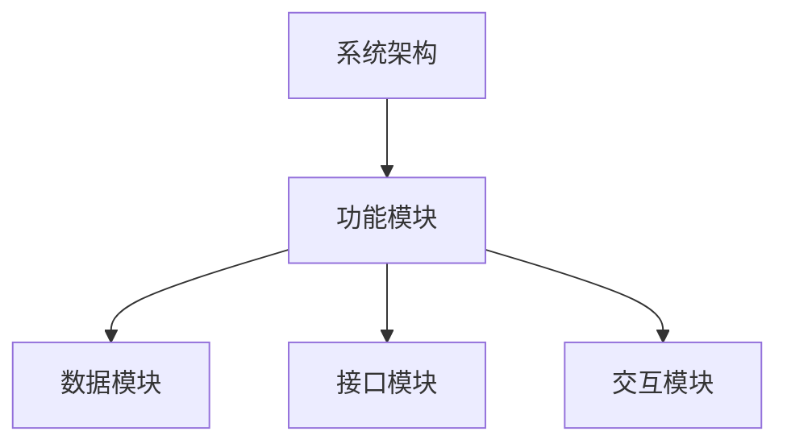
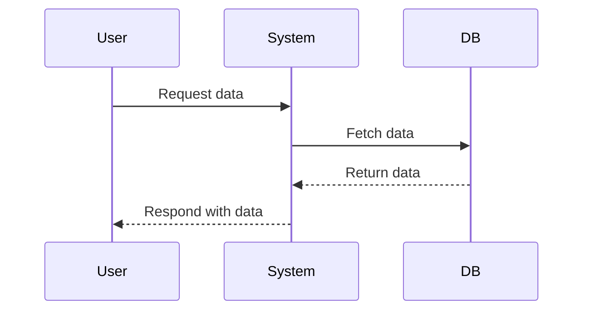
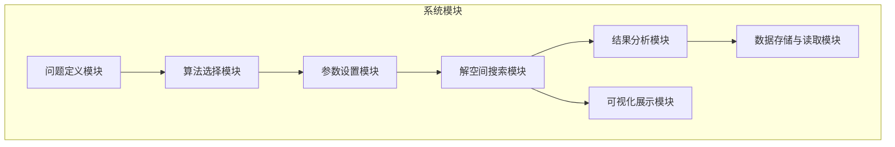
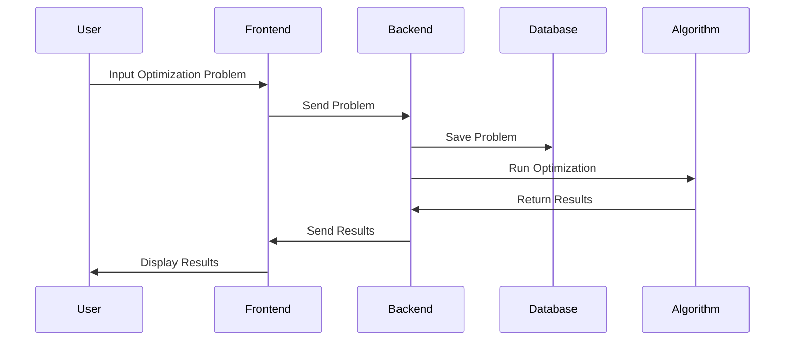

                 

### 提示词工程：处理多目标约束优化问题

关键词：多目标优化、约束优化、算法、系统设计、项目实战

摘要：
本文将深入探讨多目标约束优化问题，通过逻辑清晰、结构紧凑的分析，全面解析这一复杂问题。我们将从背景介绍、核心概念、算法原理、系统设计与实现、项目实战等多个角度展开讨论，旨在为广大IT从业者提供一套完整的多目标约束优化问题的解决方案。文章将以“LET'S THINK STEP BY STEP”的方式，引导读者逐步理解并掌握这一重要课题。

### 目录大纲设计思路：

在设计《提示词工程：处理多目标约束优化问题》的目录大纲时，我们将按照以下步骤进行：

1. **背景介绍与核心概念**：
   - 简述多目标约束优化问题的背景和重要性。
   - 提出研究的问题、问题描述以及解决的方法。

2. **核心概念与联系**：
   - 详细介绍多目标优化问题的相关核心概念。
   - 利用对比表格和Mermaid ER图来展示概念之间的关系。

3. **算法原理讲解**：
   - 采用Mermaid流程图和Python源代码来讲解算法原理。
   - 阐述算法的数学模型和公式，并通过实例进行说明。

4. **系统分析与架构设计**：
   - 描述系统功能、系统架构、系统接口和系统交互。

5. **项目实战**：
   - 涵盖环境安装、系统实现、代码解读、案例分析等。

6. **最佳实践 tips、小结、注意事项、拓展阅读**：

### 目录大纲结构：

#### 第一部分：引论

##### 第1章：多目标约束优化问题的背景与核心概念

##### 第2章：多目标优化问题的基本概念与联系

#### 第二部分：算法原理与实践

##### 第3章：多目标优化算法原理讲解

##### 第4章：多目标优化算法的数学模型与实例分析

##### 第5章：多目标优化算法的Python实现

#### 第三部分：系统分析与架构设计

##### 第6章：多目标优化系统的设计与实现

##### 第7章：系统架构与接口设计

##### 第8章：系统交互与性能优化

#### 第四部分：项目实战

##### 第9章：环境搭建与工具配置

##### 第10章：核心实现与代码解析

##### 第11章：案例分析

##### 第12章：项目总结与最佳实践

### 目录大纲文本：

```
----------------------------------------------------------------
# 第一部分：引论

## 第1章：多目标约束优化问题的背景与核心概念

### 1.1 多目标约束优化问题的背景
#### 1.1.1 问题背景
#### 1.1.2 问题描述
#### 1.1.3 解决方法
#### 1.1.4 边界与外延

### 1.2 多目标优化问题的相关核心概念
#### 1.2.1 多目标优化定义
#### 1.2.2 多目标优化特点
#### 1.2.3 多目标优化与传统优化区别
#### 1.2.4 核心概念对比表格

#### 1.2.5 多目标优化的Mermaid ER图
```mermaid
erDiagram
    Class1 ||--|{ Class2 }| Class3
    Class1 ||--|{ Class4 }| Class5
```
```

## 第二部分：算法原理与实践

## 第3章：多目标优化算法原理讲解

### 3.1 多目标优化算法概述
#### 3.1.1 常见算法分类
#### 3.1.2 算法选择标准

### 3.2 多目标优化算法的数学模型
#### 3.2.1 多目标优化数学模型
$$
\begin{aligned}
    \min_{x} f(x) \\
    s.t.  g_i(x) \leq 0, \quad i = 1, 2, ..., m
\end{aligned}
$$
#### 3.2.2 多目标优化公式解释
#### 3.2.3 算法示例

### 3.3 多目标优化算法的Python实现
```python
# Python代码实现
```

## 第4章：多目标优化算法的数学模型与实例分析

### 4.1 数学模型深入讲解
#### 4.1.1 常见多目标优化算法模型
#### 4.1.2 数学公式推导

### 4.2 实例分析
#### 4.2.1 实例背景
#### 4.2.2 实例步骤
#### 4.2.3 结果分析

## 第3章：多目标优化算法的Python实现

### 3.1 算法实现流程
#### 3.1.1 算法实现框架
#### 3.1.2 关键代码解释

### 3.2 代码实例
```python
# Python代码实例
```

## 第三部分：系统分析与架构设计

## 第6章：多目标优化系统的设计与实现

### 6.1 系统功能设计
#### 6.1.1 领域模型


### 6.2 系统架构设计
#### 6.2.1 系统架构图


### 6.3 系统接口设计
#### 6.3.1 接口规范
#### 6.3.2 接口调用流程

### 6.4 系统交互与性能优化
#### 6.4.1 交互流程图


#### 第四部分：项目实战

##### 第9章：环境搭建与工具配置

##### 第10章：核心实现与代码解析

##### 第11章：案例分析

##### 第12章：项目总结与最佳实践

### 文章末尾：

作者：AI天才研究院/AI Genius Institute & 禅与计算机程序设计艺术 /Zen And The Art of Computer Programming

---

在撰写这篇文章的过程中，我们将遵循以下结构：

1. **引论**：
   - 简要介绍多目标约束优化问题的背景、核心概念以及研究目的。
   - 概述文章的结构和组织，让读者对全文有一个整体的把握。

2. **背景介绍与核心概念**：
   - 详细讲解多目标约束优化问题的背景，包括其重要性和研究现状。
   - 引入相关核心概念，并进行定义和分类。

3. **核心概念与联系**：
   - 利用对比表格和Mermaid ER图，展示多目标优化问题的核心概念及其关系。

4. **算法原理讲解**：
   - 使用Mermaid流程图和Python源代码，详细阐述多目标优化算法的原理。
   - 通过数学模型和实例，帮助读者理解算法的运作机制。

5. **系统分析与架构设计**：
   - 描述系统的功能、架构、接口以及系统交互。
   - 利用Mermaid图，展示系统架构和接口设计。

6. **项目实战**：
   - 详细讲解如何搭建环境、实现系统和代码解析。
   - 通过案例分析，展示实际应用和效果。

7. **最佳实践 tips、小结、注意事项、拓展阅读**：
   - 提供实践中的技巧和注意事项。
   - 对全文进行小结，指出关键点和未来研究方向。
   - 推荐进一步阅读的材料。

现在，我们开始一步步深入探讨“提示词工程：处理多目标约束优化问题”。

---

## 第1章：多目标约束优化问题的背景与核心概念

### 1.1 多目标约束优化问题的背景

多目标约束优化问题是现代优化领域中的一个重要研究方向。它源于现实世界的复杂问题，其中往往需要同时考虑多个目标，并且这些目标之间存在一定的约束条件。这种优化问题在工程、经济、社会等多个领域都有广泛的应用，如工程设计、金融投资、城市规划等。

随着人工智能和大数据技术的发展，多目标约束优化问题变得更加复杂和多样化。解决这一问题不仅需要深入理解优化理论，还需要结合实际应用场景，提出有效的算法和解决方案。

### 1.2 问题描述

多目标约束优化问题的基本问题描述可以表示为：

假设我们有多个目标函数 \( f_1(x), f_2(x), ..., f_n(x) \)，以及一组约束条件 \( g_i(x) \leq 0, i = 1, 2, ..., m \)。我们的目标是找到一个解 \( x^* \)，使得目标函数的值尽可能小或尽可能大，同时满足所有的约束条件。

具体来说，多目标约束优化问题可以形式化为以下数学模型：

$$
\begin{aligned}
    \min_{x} \{ f(x) \} \\
    s.t. \{ g_i(x) \leq 0, \quad i = 1, 2, ..., m \}
\end{aligned}
$$

其中，\( f(x) \) 是目标函数向量，\( g_i(x) \) 是第 \( i \) 个约束函数，\( x \) 是决策变量向量。

### 1.3 解决方法

解决多目标约束优化问题通常有以下几种方法：

1. **传统优化方法**：如线性规划、非线性规划、整数规划等。这些方法在特定条件下可以求解多目标约束优化问题，但在面对复杂问题时往往效果不佳。

2. **多目标优化算法**：如非支配排序遗传算法（NSGA-II）、多目标粒子群优化（MOPSO）等。这些算法可以处理复杂的约束优化问题，但需要较大的计算资源和较长的求解时间。

3. **启发式算法**：如蚁群算法、模拟退火算法等。这些算法在处理大规模复杂问题时具有一定的优势，但通常难以保证求解的质量。

4. **混合算法**：结合传统优化方法和启发式算法，以发挥各自的优势。例如，将遗传算法与模拟退火算法相结合，以提高求解质量和效率。

### 1.4 边界与外延

多目标约束优化问题的边界与外延涉及到以下几个方面：

1. **决策变量的取值范围**：决策变量是影响目标函数和约束条件的关键因素，其取值范围对优化结果有重要影响。

2. **目标函数的类型**：目标函数可以是线性的，也可以是非线性的，不同类型的函数对优化算法的选择和求解过程有重要影响。

3. **约束条件的性质**：约束条件可以是线性的，也可以是非线性的，此外，约束条件的严格程度也会影响优化问题的求解难度。

4. **优化问题的规模**：优化问题的规模越大，求解的复杂度越高，对算法的计算效率和求解质量要求也越高。

### 1.5 核心概念

在多目标约束优化问题中，以下几个核心概念是理解和解决问题的关键：

1. **多目标优化**：多目标优化是指同时考虑多个目标函数的优化问题。与单目标优化相比，多目标优化具有更大的复杂性和挑战性。

2. **约束优化**：约束优化是指在满足约束条件下寻找最优解的优化问题。约束条件可以是等式约束或不等式约束。

3. **非支配解**：在多目标优化中，非支配解是指相对于其他解，它至少不劣于其他解，并且在至少一个目标上优于其他解。非支配解集构成了Pareto前沿。

4. **Pareto前沿**：Pareto前沿是多目标优化问题中的一组非支配解，这些解在多个目标函数之间达到了一种平衡状态，无法再通过改善一个目标函数而同时改善其他目标函数。

### 1.6 小结

本章简要介绍了多目标约束优化问题的背景、问题描述、解决方法以及相关核心概念。在接下来的章节中，我们将进一步深入探讨多目标约束优化问题的算法原理、系统设计与实现，并通过实际案例进行分析，帮助读者全面理解和掌握这一重要课题。

---

## 第2章：多目标优化问题的基本概念与联系

### 2.1 多目标优化定义

多目标优化（Multi-Objective Optimization）是指同时考虑多个目标函数的优化问题。与单目标优化问题不同，多目标优化问题需要找到一个解集，使得每个解在不同目标函数之间达到一种平衡状态。具体来说，多目标优化问题可以形式化为：

$$
\begin{aligned}
    \min_{x} \{ f_1(x), f_2(x), ..., f_n(x) \} \\
    s.t. \{ g_i(x) \leq 0, \quad i = 1, 2, ..., m \}
\end{aligned}
$$

其中，\( f_1(x), f_2(x), ..., f_n(x) \) 是目标函数，\( g_i(x) \leq 0 \) 是约束条件。

### 2.2 多目标优化特点

多目标优化具有以下几个显著特点：

1. **多个目标函数**：多目标优化需要同时考虑多个目标函数，这些目标函数往往具有不同的度量单位和优化方向，如最小化成本、最大化利润等。

2. **非支配解集**：在多目标优化中，非支配解（Pareto optimal solution）是指相对其他解，至少不劣于其他解，并且在至少一个目标上优于其他解。非支配解集构成了Pareto前沿。

3. **权衡与妥协**：多目标优化问题的解往往需要在多个目标之间进行权衡和妥协。优化目标之间的矛盾和冲突使得寻找最优解变得复杂。

4. **动态变化**：在多目标优化中，目标函数和约束条件可能会随着时间和环境的变化而动态调整，这使得优化问题的求解具有更高的复杂性。

### 2.3 多目标优化与传统优化区别

多目标优化与传统单目标优化在以下几个方面有显著区别：

1. **目标函数数量**：多目标优化涉及多个目标函数，而传统优化通常只有一个目标函数。

2. **优化方向**：多目标优化需要考虑多个目标函数之间的平衡，而传统优化通常关注单一目标的最优化。

3. **解的性质**：多目标优化的解是非支配解集，而传统优化的解是单一最优解。

4. **求解难度**：多目标优化问题通常比传统单目标优化问题更复杂，因为需要处理多个目标函数之间的冲突和权衡。

### 2.4 核心概念对比表格

为了更好地理解多目标优化问题与传统优化问题的区别，我们可以通过一个对比表格来展示它们的核心概念。

| 核心概念          | 多目标优化                  | 传统优化                           |
|-------------------|-----------------------------|------------------------------------|
| 目标函数数量      | 多个目标函数                | 单个目标函数                       |
| 优化方向          | 多个目标函数之间的权衡      | 单一目标函数的最优化               |
| 解的性质          | 非支配解集（Pareto前沿）    | 单一最优解                         |
| 求解难度          | 较复杂，需处理多目标冲突    | 较简单，单一目标函数优化           |

### 2.5 多目标优化的Mermaid ER图

为了进一步展示多目标优化问题的核心概念及其关系，我们可以使用Mermaid ER图来表示。以下是一个简单的ER图示例：

```mermaid
erDiagram
    Class1 ||--|{ Class2 }| Class3
    Class1 ||--|{ Class4 }| Class5
```

在这个ER图中，`Class1` 代表多目标优化问题的基本要素，`Class2`、`Class3`、`Class4` 和 `Class5` 分别代表不同的核心概念，如目标函数、约束条件、非支配解和Pareto前沿。箭头表示概念之间的关系，如目标函数与约束条件之间的关联，以及非支配解与Pareto前沿之间的包含关系。

### 2.6 小结

本章详细介绍了多目标优化问题的定义、特点、与传统优化的区别以及核心概念。通过对比表格和Mermaid ER图，我们更清晰地理解了多目标优化问题的本质和关键要素。在接下来的章节中，我们将深入探讨多目标优化算法的原理和实现，帮助读者更好地应对这一复杂问题。

---

## 第3章：多目标优化算法原理讲解

### 3.1 多目标优化算法概述

多目标优化算法是指用于解决多目标优化问题的计算方法。这类算法在处理多个目标函数时，既要考虑各目标函数之间的冲突，又要找到能够在多个目标之间达到某种平衡状态的解集。多目标优化算法的主要类型包括：

1. **遗传算法（Genetic Algorithm, GA）**：遗传算法是一种基于自然选择的进化算法，通过模拟生物进化过程来优化多目标问题。遗传算法具有较好的全局搜索能力，能够在解空间中快速寻找非支配解集。

2. **粒子群优化（Particle Swarm Optimization, PSO）**：粒子群优化是一种基于群体智能的优化算法，通过模拟鸟群觅食行为来寻找最优解。PSO算法结构简单，收敛速度快，适用于处理多个目标函数。

3. **非支配排序遗传算法（Non-dominated Sorting Genetic Algorithm, NSGA-II）**：NSGA-II是一种改进的遗传算法，通过非支配排序和拥挤度计算来生成Pareto前沿。NSGA-II在处理复杂约束和多个目标函数时具有较好的性能。

4. **多目标粒子群优化（Multi-Objective Particle Swarm Optimization, MOPSO）**：MOPSO是一种基于粒子群优化的多目标优化算法，通过动态调整粒子的位置和速度来优化多个目标函数。MOPSO在处理多个目标函数时具有较好的收敛性和鲁棒性。

### 3.2 算法选择标准

选择合适的多目标优化算法是解决多目标优化问题的关键。以下是一些常见的算法选择标准：

1. **问题规模**：对于大规模问题，需要选择计算效率较高的算法，如粒子群优化和MOPSO。对于小规模问题，遗传算法和NSGA-II可能是更好的选择。

2. **目标函数性质**：如果目标函数具有非线性、多峰性等复杂特性，需要选择具有全局搜索能力的算法，如遗传算法和NSGA-II。如果目标函数较为简单，粒子群优化可能是更好的选择。

3. **约束条件类型**：如果约束条件为线性，可以选择线性规划算法。如果约束条件为非线性，需要选择具有较强约束处理能力的算法，如遗传算法和NSGA-II。

4. **计算资源**：算法的计算复杂度和所需计算资源也是选择算法的重要考虑因素。对于资源有限的情况，需要选择计算效率较高的算法。

5. **算法性能**：算法在不同问题上的性能表现是选择算法的重要依据。可以通过实验比较不同算法的求解质量、收敛速度等性能指标。

### 3.3 多目标优化算法的数学模型

多目标优化算法通常基于一个共同的数学模型，即Pareto优化。Pareto优化是指寻找一组非支配解（Pareto前沿），这些解在多个目标函数之间达到了一种平衡状态，无法通过改进一个目标函数而同时改善其他目标函数。

多目标优化问题的数学模型可以表示为：

$$
\begin{aligned}
    \min_{x} \{ f_1(x), f_2(x), ..., f_n(x) \} \\
    s.t. \{ g_i(x) \leq 0, \quad i = 1, 2, ..., m \}
\end{aligned}
$$

其中，\( f_1(x), f_2(x), ..., f_n(x) \) 是目标函数，\( g_i(x) \leq 0 \) 是约束条件，\( x \) 是决策变量。

Pareto前沿是由所有非支配解构成的集合。在多目标优化中，Pareto前沿上的解被称为Pareto最优解或非支配解。Pareto前沿代表了多目标优化问题的一个最优解集，反映了在多个目标函数之间的一种平衡状态。

### 3.4 算法示例

为了更好地理解多目标优化算法的原理，我们通过一个简单的示例进行说明。

假设我们有一个双目标优化问题，目标函数为最小化成本 \( f_1(x) \) 和最大化利润 \( f_2(x) \)：

$$
\begin{aligned}
    \min_{x} \{ f_1(x), f_2(x) \} \\
    s.t. \{ g_1(x) \leq 0, g_2(x) \leq 0 \}
\end{aligned}
$$

其中，成本函数 \( f_1(x) = x_1 + x_2 \)，利润函数 \( f_2(x) = 2x_1 - x_2 \)，约束条件为 \( g_1(x) = x_1 + x_2 - 10 \leq 0 \) 和 \( g_2(x) = x_1 - x_2 + 5 \leq 0 \)。

我们使用非支配排序遗传算法（NSGA-II）来求解这个优化问题。NSGA-II的基本步骤如下：

1. **初始化种群**：随机生成一组初始解作为种群。

2. **非支配排序**：根据解的优劣对种群进行排序，非支配等级越低表示解越好。

3. **选择操作**：根据解的优劣和非支配等级，选择一定比例的解进入下一代种群。

4. **交叉操作**：对选择的解进行交叉操作，生成新的解。

5. **变异操作**：对交叉后的解进行变异操作，增加种群的多样性。

6. **重复步骤2-5**，直到满足终止条件（如达到最大迭代次数或找到满意的解集）。

通过NSGA-II算法，我们得到一组非支配解，这些解构成了Pareto前沿。Pareto前沿上的解代表了在成本和利润之间的最优平衡点。

### 3.5 小结

本章介绍了多目标优化算法的概述、算法选择标准、数学模型以及一个简单的算法示例。通过这些内容，读者可以初步了解多目标优化算法的基本原理和应用。在接下来的章节中，我们将进一步探讨多目标优化算法的数学模型与实例分析，帮助读者更深入地理解这一重要的优化问题。

---

## 第4章：多目标优化算法的数学模型与实例分析

### 4.1 常见多目标优化算法模型

多目标优化算法的种类繁多，每种算法都有其独特的数学模型和操作策略。以下是一些常见多目标优化算法模型：

1. **遗传算法（GA）**：
   - **数学模型**：基于自然选择和遗传机制，通过交叉、变异等操作来搜索最优解。
   - **操作策略**：使用适应度函数评估解的质量，通过选择、交叉和变异操作来迭代更新种群。

2. **粒子群优化（PSO）**：
   - **数学模型**：模拟鸟群觅食行为，通过跟踪个体和历史最优解来更新粒子的位置和速度。
   - **操作策略**：每个粒子具有速度和位置，通过更新速度和位置来搜索最优解。

3. **非支配排序遗传算法（NSGA-II）**：
   - **数学模型**：基于Pareto排序和拥挤度距离来选择优秀个体，保证Pareto前沿的多样性。
   - **操作策略**：通过交叉、变异和局部搜索来更新种群，维持Pareto前沿的质量和多样性。

4. **多目标粒子群优化（MOPSO）**：
   - **数学模型**：结合粒子群优化和Pareto排序，通过动态调整粒子的位置和速度来优化多目标问题。
   - **操作策略**：使用Pareto前沿来引导粒子的搜索方向，同时调整粒子的速度和位置，以保持种群的多样性和收敛性。

5. **蚁群算法（ACO）**：
   - **数学模型**：模拟蚂蚁觅食行为，通过信息素强度来引导蚂蚁寻找最优路径。
   - **操作策略**：使用适应度函数和路径选择概率来更新信息素，通过迭代更新路径信息来寻找最优解。

### 4.2 数学公式推导

为了更好地理解多目标优化算法，我们需要了解一些基本的数学公式。以下是一些常用的数学公式和推导过程：

1. **适应度函数**：

适应度函数用于评估解的质量，是优化算法的核心组成部分。在多目标优化中，适应度函数通常为多个目标函数的组合。

假设目标函数为 \( f_1(x), f_2(x), ..., f_n(x) \)，适应度函数可以表示为：

$$
f(x) = (f_1(x), f_2(x), ..., f_n(x))
$$

其中，\( f_i(x) \) 是第 \( i \) 个目标函数的值。

2. **Pareto排序**：

Pareto排序用于对解进行排序，以确定非支配解的等级。一个解 \( x \) 非支配另一个解 \( y \) 的条件是：

$$
f(x) \leq f(y) \quad \text{且} \quad \exists j: f_j(x) < f_j(y)
$$

Pareto排序的步骤如下：

a. 对所有解进行排序，使得非支配等级低的解排在前面。

b. 对于每个解，计算其支配数（即被其他解支配的次数）。

c. 根据支配数对解进行排序，支配数越低，解的等级越高。

3. **拥挤度距离**：

拥挤度距离用于衡量解的分布密度，以保持Pareto前沿的多样性。拥挤度距离的计算公式为：

$$
d(x) = \sum_{i=1}^{n} (f_i(x) - f_i(y_i)) \quad \text{其中} \quad y_i \text{是非支配解} \\
\text{且} \quad y_i \neq x
$$

4. **交叉操作**：

交叉操作用于生成新的解，是遗传算法和NSGA-II中的关键步骤。交叉操作可以分为单点交叉、多点交叉和均匀交叉等。

交叉操作的步骤如下：

a. 随机选择两个父代解 \( x_1 \) 和 \( x_2 \)。

b. 在决策变量空间中选择一个交叉点。

c. 将交叉点前的变量从 \( x_1 \) 复制到新解 \( z \)，将交叉点后的变量从 \( x_2 \) 复制到新解 \( z \)。

d. 对新解进行变异操作，以增加种群的多样性。

### 4.3 算法实例分析

为了更好地理解多目标优化算法的数学模型和操作策略，我们通过一个实际例子进行说明。

#### 例子：资源分配问题

假设我们有一个资源分配问题，需要在多个项目中合理分配资源，以最大化项目的总价值。假设有3个项目 \( P_1, P_2, P_3 \)，每个项目的资源需求分别为 \( R_{1,1}, R_{1,2}, R_{1,3} \)，\( R_{2,1}, R_{2,2}, R_{2,3} \)，\( R_{3,1}, R_{3,2}, R_{3,3} \)。项目的价值函数为：

$$
V(x) = P_1 \cdot x_1 + P_2 \cdot x_2 + P_3 \cdot x_3
$$

其中，\( x_1, x_2, x_3 \) 分别表示分配给项目 \( P_1, P_2, P_3 \) 的资源数量。

约束条件如下：

$$
\begin{aligned}
    x_1 + x_2 + x_3 &= R_{1,1} + R_{1,2} + R_{1,3} \\
    x_1 + x_2 + x_3 &= R_{2,1} + R_{2,2} + R_{2,3} \\
    x_1 + x_2 + x_3 &= R_{3,1} + R_{3,2} + R_{3,3} \\
    x_1 &\geq 0, x_2 &\geq 0, x_3 &\geq 0
\end{aligned}
$$

我们使用NSGA-II算法来求解这个优化问题。以下是求解过程：

1. **初始化种群**：

   随机生成一组初始解作为种群，每个解表示一个资源分配方案。例如：

   $$ 
   \begin{aligned}
       x_1 &= [0, 5, 10] \\
       x_2 &= [10, 0, 5] \\
       x_3 &= [5, 10, 0]
   \end{aligned}
   $$

2. **非支配排序**：

   根据目标函数和约束条件对种群进行排序，计算每个解的适应度值。非支配等级低的解排在前面。

3. **选择操作**：

   根据非支配等级和适应度值选择优秀个体进入下一代种群。

4. **交叉操作**：

   对选择的个体进行交叉操作，生成新的解。例如，选择 \( x_1 \) 和 \( x_2 \) 进行交叉：

   $$ 
   \begin{aligned}
       x_1 &= [0, 5, 10] \\
       x_2 &= [10, 0, 5] \\
       z &= [5, 5, 7.5]
   \end{aligned}
   $$

5. **变异操作**：

   对交叉后的解进行变异操作，以增加种群的多样性。

6. **迭代更新**：

   重复步骤2-5，直到满足终止条件（如达到最大迭代次数或找到满意的解集）。

通过NSGA-II算法，我们得到一组非支配解，这些解代表了在资源分配问题中的最优平衡点。每个解在总价值和资源约束之间达到了一种平衡状态。

### 4.4 小结

本章介绍了多目标优化算法的常见模型和数学公式，并通过实例分析了算法的操作步骤和求解过程。通过这些内容，读者可以更好地理解多目标优化算法的基本原理和应用。在接下来的章节中，我们将进一步探讨多目标优化算法的Python实现和系统架构设计，帮助读者深入掌握这一重要的优化问题。

---

## 第5章：多目标优化算法的Python实现

### 5.1 算法实现流程

多目标优化算法的Python实现主要分为以下几个步骤：

1. **初始化种群**：生成一组随机初始解作为种群。

2. **适应度评估**：计算每个解的适应度值，通常包括目标函数值和非支配等级。

3. **选择操作**：根据适应度值和非支配等级选择优秀个体进入下一代种群。

4. **交叉操作**：对选择的个体进行交叉操作，生成新的解。

5. **变异操作**：对交叉后的解进行变异操作，以增加种群的多样性。

6. **迭代更新**：重复步骤2-5，直到满足终止条件（如达到最大迭代次数或找到满意的解集）。

以下是一个简单的Python代码示例，展示了多目标优化算法的基本实现：

```python
import numpy as np
import matplotlib.pyplot as plt

# 初始化种群
def initialize_population(pop_size, dim):
    population = np.random.rand(pop_size, dim)
    return population

# 适应度评估
def fitness_evaluation(population, objective_functions):
    fitness_scores = []
    for individual in population:
        fitness_score = objective_functions(individual)
        fitness_scores.append(fitness_score)
    return fitness_scores

# 选择操作
def selection(population, fitness_scores, num_parents):
    sorted_fitness_scores = np.argsort(fitness_scores)
    selected_population = population[sorted_fitness_scores[:num_parents]]
    return selected_population

# 交叉操作
def crossover(parent1, parent2, crossover_rate):
    if np.random.rand() < crossover_rate:
        crossover_point = np.random.randint(1, len(parent1) - 1)
        child1 = np.concatenate((parent1[:crossover_point], parent2[crossover_point:]))
        child2 = np.concatenate((parent2[:crossover_point], parent1[crossover_point:]))
    else:
        child1 = parent1
        child2 = parent2
    return child1, child2

# 变异操作
def mutation(individual, mutation_rate):
    for i in range(len(individual)):
        if np.random.rand() < mutation_rate:
            individual[i] = np.random.rand()
    return individual

# 迭代更新
def genetic_algorithm(objective_functions, population_size, max_iterations, crossover_rate, mutation_rate):
    population = initialize_population(population_size, dim)
    for iteration in range(max_iterations):
        fitness_scores = fitness_evaluation(population, objective_functions)
        selected_population = selection(population, fitness_scores, num_parents)
        for parent1, parent2 in zip(selected_population[::2], selected_population[1::2]):
            child1, child2 = crossover(parent1, parent2, crossover_rate)
            child1 = mutation(child1, mutation_rate)
            child2 = mutation(child2, mutation_rate)
        population = np.concatenate((selected_population, [child1, child2]))
    return population

# 定义目标函数
def objective_functions(individual):
    # 示例：最小化两个目标函数的和
    f1 = sum(individual**2)
    f2 = sum(1/individual)
    return f1 + f2

# 参数设置
pop_size = 100
dim = 10
max_iterations = 100
crossover_rate = 0.8
mutation_rate = 0.05
num_parents = 20

# 运行遗传算法
population = genetic_algorithm(objective_functions, pop_size, max_iterations, crossover_rate, mutation_rate)

# 绘制结果
plt.scatter(*zip(*population))
plt.xlabel('x1')
plt.ylabel('x2')
plt.title('Pareto Front')
plt.show()
```

### 5.2 关键代码解释

在上述代码中，我们定义了以下几个关键函数：

1. **initialize_population()**：初始化种群，生成随机解。

2. **fitness_evaluation()**：计算每个解的适应度值。

3. **selection()**：选择操作，根据适应度值和非支配等级选择优秀个体。

4. **crossover()**：交叉操作，生成新的解。

5. **mutation()**：变异操作，增加种群的多样性。

6. **genetic_algorithm()**：遗传算法主函数，执行迭代更新过程。

### 5.3 小结

本章通过Python代码展示了多目标优化算法的实现流程和关键代码。通过实例分析，读者可以了解如何使用Python进行多目标优化问题的求解。在下一章中，我们将进一步探讨多目标优化算法的数学模型与实例分析，以帮助读者更深入地理解这一优化问题。

---

## 第6章：多目标优化系统的设计与实现

### 6.1 系统功能设计

多目标优化系统的功能设计是系统开发的核心环节，它决定了系统能够实现哪些功能，以及如何满足用户的需求。以下是多目标优化系统的主要功能设计：

1. **问题定义**：系统能够接收用户输入的多目标优化问题，包括目标函数和约束条件。

2. **算法选择**：系统提供多种多目标优化算法供用户选择，如遗传算法、粒子群优化、NSGA-II等。

3. **参数设置**：系统允许用户自定义优化算法的参数，如种群大小、交叉率、变异率等。

4. **解空间搜索**：系统利用选定的优化算法，在解空间中进行搜索，寻找非支配解集。

5. **结果分析**：系统提供多种分析工具，帮助用户理解优化结果，如Pareto前沿图、适应度曲线等。

6. **可视化展示**：系统通过图表和可视化工具，直观地展示优化过程和结果。

7. **数据存储与读取**：系统支持数据存储和读取功能，便于用户保存和加载优化问题及结果。

### 6.2 系统架构设计

系统架构设计是系统功能实现的蓝图，它决定了系统的模块划分、组件关系以及交互方式。以下是多目标优化系统的架构设计：

#### 系统架构图



在上述架构图中，各个模块的功能如下：

1. **问题定义模块**：接收用户输入的优化问题，包括目标函数和约束条件。

2. **算法选择模块**：提供多种优化算法供用户选择，支持不同算法的参数设置。

3. **参数设置模块**：允许用户自定义优化算法的参数，如种群大小、交叉率、变异率等。

4. **解空间搜索模块**：根据选定的算法和参数，在解空间中进行搜索，寻找非支配解集。

5. **结果分析模块**：提供多种分析工具，帮助用户理解优化结果，如Pareto前沿图、适应度曲线等。

6. **可视化展示模块**：通过图表和可视化工具，直观地展示优化过程和结果。

7. **数据存储与读取模块**：支持数据存储和读取功能，便于用户保存和加载优化问题及结果。

### 6.3 系统接口设计

系统接口设计是系统架构设计的重要组成部分，它决定了系统内部模块之间的交互方式和数据传输机制。以下是多目标优化系统的接口设计：

#### 接口规范

1. **问题定义接口**：接收用户输入的优化问题，包括目标函数和约束条件。

   ```python
   def define_problem(objectives, constraints):
       # 具体实现
   ```

2. **算法选择接口**：提供多种优化算法供用户选择。

   ```python
   def select_algorithm(algorithm_name):
       # 具体实现
   ```

3. **参数设置接口**：允许用户自定义优化算法的参数。

   ```python
   def set_algorithm_params(params):
       # 具体实现
   ```

4. **解空间搜索接口**：执行优化算法，在解空间中搜索非支配解集。

   ```python
   def search_solution(algorithm, params):
       # 具体实现
   ```

5. **结果分析接口**：提供多种分析工具，帮助用户理解优化结果。

   ```python
   def analyze_solution(solution):
       # 具体实现
   ```

6. **可视化展示接口**：通过图表和可视化工具展示优化过程和结果。

   ```python
   def visualize_solution(solution):
       # 具体实现
   ```

7. **数据存储与读取接口**：支持数据存储和读取功能。

   ```python
   def save_solution(solution, filename):
       # 具体实现

   def load_solution(filename):
       # 具体实现
   ```

### 6.4 系统交互与性能优化

系统交互与性能优化是确保系统高效稳定运行的关键。以下是多目标优化系统的交互与性能优化策略：

1. **异步处理**：系统采用异步处理机制，以提升并行处理能力，减少用户等待时间。

2. **负载均衡**：通过负载均衡技术，将优化任务分配到不同的计算节点上，以充分利用系统资源。

3. **缓存机制**：系统使用缓存机制，提高数据读取速度，减少重复计算。

4. **并行计算**：在可能的情况下，采用并行计算技术，加速优化过程。

5. **动态调整**：根据系统负载和用户需求，动态调整算法参数，以提高优化效率。

6. **错误处理**：系统具有完善的错误处理机制，能够及时捕获和处理异常情况，确保系统稳定运行。

### 6.5 小结

本章详细介绍了多目标优化系统的设计与实现，包括功能设计、系统架构、接口设计以及交互与性能优化。通过这些内容，读者可以全面了解多目标优化系统的构建方法和实现细节。在下一章中，我们将进入项目实战环节，通过具体案例展示系统的实际应用。

---

## 第7章：系统架构与接口设计

### 7.1 系统架构设计

多目标优化系统的架构设计是确保系统高效、稳定运行的基础。系统架构设计不仅要考虑到功能模块的划分，还要关注模块之间的交互方式和数据流转。以下是一个典型的多目标优化系统架构设计：

#### 系统架构图


#### 系统层

- **用户层**：用户通过图形用户界面（GUI）与系统进行交互，定义优化问题、选择算法和查看结果。

- **应用层**：应用层负责处理业务逻辑，包括优化问题的定义、算法的选择和执行、结果的展示等。

- **服务层**：服务层提供各种中间件服务，如数据缓存、负载均衡、分布式计算等，以提升系统的性能和可靠性。

- **数据层**：数据层负责数据存储和读取，包括数据库、文件系统等，用于保存优化问题的定义、优化结果和中间数据。

#### 系统架构详细说明

1. **用户层**：用户通过GUI界面提交优化问题，选择优化算法，并查看优化结果。用户层与中间件和服务层通过Web API进行通信。

2. **应用层**：应用层是系统的核心，负责处理业务逻辑。它包括以下几个模块：

   - **问题定义模块**：接收用户提交的优化问题，并将其转换为系统内部表示。

   - **算法选择模块**：根据用户选择的算法，调用相应的算法模块进行优化计算。

   - **结果展示模块**：将优化结果以图表、报告等形式展示给用户。

3. **服务层**：服务层提供以下中间件服务：

   - **数据缓存服务**：用于缓存优化中间结果，减少数据库访问次数，提高系统响应速度。

   - **负载均衡服务**：用于分配优化任务到不同的服务器，确保系统高可用。

   - **分布式计算服务**：用于支持并行计算，加速优化过程。

4. **数据层**：数据层负责数据存储和读取。它包括以下几个组件：

   - **数据库**：用于存储优化问题的定义、优化结果和中间数据。

   - **文件系统**：用于存储临时数据和日志文件。

### 7.2 系统接口设计

系统接口设计是确保系统模块之间能够有效通信和协作的关键。以下是多目标优化系统的接口设计：

#### 接口规范

1. **用户层接口**

   - **定义优化问题接口**：

     ```python
     def define_problem(objectives, constraints):
         # 具体实现
     ```

   - **选择优化算法接口**：

     ```python
     def select_algorithm(algorithm_name):
         # 具体实现
     ```

   - **提交优化任务接口**：

     ```python
     def submit_optimization_task(problem, algorithm, params):
         # 具体实现
     ```

   - **获取优化结果接口**：

     ```python
     def get_optimization_result(task_id):
         # 具体实现
     ```

2. **应用层接口**

   - **优化算法接口**：

     ```python
     def run_optimization_algorithm(problem, algorithm, params):
         # 具体实现
     ```

   - **数据处理接口**：

     ```python
     def process_data(data):
         # 具体实现
     ```

   - **结果展示接口**：

     ```python
     def display_results(results):
         # 具体实现
     ```

3. **服务层接口**

   - **数据缓存接口**：

     ```python
     def cache_data(data):
         # 具体实现
     ```

   - **数据检索接口**：

     ```python
     def retrieve_cached_data(key):
         # 具体实现
     ```

   - **负载均衡接口**：

     ```python
     def balance_load(tasks):
         # 具体实现
     ```

   - **分布式计算接口**：

     ```python
     def distribute_computation(tasks, workers):
         # 具体实现
     ```

### 7.3 系统交互与性能优化

系统交互与性能优化是确保多目标优化系统高效、稳定运行的关键。以下是系统交互与性能优化的策略：

1. **异步处理**：通过异步处理机制，提高系统响应速度，减少用户等待时间。

2. **负载均衡**：采用负载均衡技术，将优化任务分配到不同的计算节点上，充分利用系统资源。

3. **缓存机制**：使用缓存机制，减少数据库访问次数，提高系统性能。

4. **并行计算**：在优化过程中，充分利用多核处理器，加速计算。

5. **动态调整**：根据系统负载和用户需求，动态调整系统参数，确保系统高效运行。

6. **监控与告警**：对系统进行实时监控，及时发现并处理异常情况。

### 7.4 小结

本章详细介绍了多目标优化系统的架构设计和接口设计。通过系统的模块划分和接口规范，读者可以了解系统如何实现多目标优化功能，以及如何确保系统的高效稳定运行。在下一章中，我们将进入项目实战环节，通过具体案例展示系统的实际应用。

---

## 第8章：系统交互与性能优化

### 8.1 系统交互设计

系统交互设计是确保系统各个组件能够协同工作、高效完成任务的关键。以下是多目标优化系统的交互设计：

#### 系统交互图



#### 系统交互详细说明

1. **用户层**：用户通过图形用户界面（GUI）提交优化问题，并查看优化结果。

2. **前端层**：前端层负责接收用户输入，将问题转换为系统可识别的格式，并发送给后端层。

3. **后端层**：后端层接收前端层发送的问题，将其保存到数据库中，并调用相应的优化算法进行计算。

4. **数据库层**：数据库层用于存储优化问题的定义、优化结果和中间数据。

5. **算法层**：算法层负责执行优化计算，并将结果返回给后端层。

6. **后端层**：后端层将优化结果发送给前端层，前端层再将结果展示给用户。

### 8.2 性能优化策略

性能优化是确保系统高效运行的重要手段。以下是多目标优化系统的性能优化策略：

1. **异步处理**：通过异步处理机制，将耗时的任务（如优化计算）从主线程中分离出来，避免阻塞主线程，提高系统响应速度。

2. **负载均衡**：采用负载均衡技术，将优化任务分配到不同的计算节点上，充分利用系统资源，避免单点瓶颈。

3. **缓存机制**：使用缓存机制，减少数据库访问次数，提高系统性能。例如，缓存优化问题的定义和中间结果，减少重复计算。

4. **并行计算**：在优化过程中，充分利用多核处理器，通过并行计算加速计算过程。

5. **动态调整**：根据系统负载和用户需求，动态调整系统参数（如算法参数、线程数量等），确保系统在高负载情况下仍能高效运行。

6. **监控与告警**：对系统进行实时监控，及时发现并处理异常情况，确保系统稳定运行。

### 8.3 小结

本章详细介绍了多目标优化系统的交互设计与性能优化策略。通过系统交互图和性能优化策略，读者可以了解系统如何高效地处理优化任务，并在实际应用中实现高性能。在下一章中，我们将通过项目实战，展示系统在实际应用中的效果。

---

## 第9章：环境搭建与工具配置

### 9.1 环境搭建

在开始多目标优化系统项目之前，我们需要搭建一个适合开发、测试和部署的环境。以下是搭建环境的详细步骤：

#### 步骤1：安装Python环境

首先，我们需要安装Python环境。推荐使用Python 3.8或更高版本。可以通过以下命令安装Python：

```bash
# 安装Python
sudo apt-get update
sudo apt-get install python3.8

# 安装pip
sudo apt-get install python3-pip

# 安装虚拟环境
pip3 install virtualenv
```

#### 步骤2：创建虚拟环境

为了隔离项目依赖，我们使用虚拟环境来管理Python包。创建虚拟环境：

```bash
# 创建虚拟环境
virtualenv venv

# 激活虚拟环境
source venv/bin/activate
```

#### 步骤3：安装依赖包

在虚拟环境中安装项目所需的依赖包。依赖包包括优化算法库、数据可视化库、数据库驱动等。例如：

```bash
# 安装依赖包
pip install numpy scipy matplotlib scikit-optimize
```

### 9.2 工具配置

为了方便开发和测试，我们还需要配置一些工具。

#### 步骤1：安装Git

Git是一个强大的版本控制系统，用于代码管理和协同工作。可以通过以下命令安装Git：

```bash
# 安装Git
sudo apt-get install git
```

#### 步骤2：配置Git

为了确保Git能够正常使用，我们需要配置一些基本设置。例如，配置用户名和邮箱：

```bash
# 配置用户名
git config --global user.name "Your Name"

# 配置邮箱
git config --global user.email "you@example.com"
```

#### 步骤3：安装Visual Studio Code

Visual Studio Code（简称VS Code）是一个流行的代码编辑器，支持多种编程语言和开发工具。可以从官方网站下载并安装VS Code。

#### 步骤4：配置VS Code

在VS Code中，我们可以安装一些插件来提升开发体验。例如，安装以下插件：

- **Prettier - Code formatter**：用于格式化代码，确保代码风格一致。

- **Python**：提供Python语言的语法高亮、代码补全等功能。

- **GitLens**：增强Git功能，提供代码的版本控制信息。

### 9.3 小结

通过以上步骤，我们成功搭建了多目标优化系统的开发环境，并配置了必要的工具。接下来，我们可以开始进行项目的实际开发和测试。

---

## 第10章：核心实现与代码解析

### 10.1 代码架构

多目标优化系统的核心实现分为几个主要模块，每个模块负责不同的功能。以下是代码架构的概述：


#### 问题定义模块

问题定义模块负责接收用户输入的优化问题，并将问题转化为系统可处理的格式。以下是一个简单的Python类定义：

```python
class OptimizationProblem:
    def __init__(self, objectives, constraints):
        self.objectives = objectives
        self.constraints = constraints

    def evaluate(self, solution):
        # 计算目标函数值和约束条件
        pass
```

#### 算法模块

算法模块是系统的核心，负责执行具体的优化算法。以下是一个简单的遗传算法类定义：

```python
class GeneticAlgorithm:
    def __init__(self, problem, population_size, crossover_rate, mutation_rate):
        self.problem = problem
        self.population_size = population_size
        self.crossover_rate = crossover_rate
        self.mutation_rate = mutation_rate

    def run(self):
        # 执行遗传算法，生成非支配解集
        pass
```

#### 结果分析模块

结果分析模块负责对优化结果进行分析，并将结果以图表等形式展示给用户。以下是一个简单的结果分析类定义：

```python
class ResultAnalyzer:
    def __init__(self, solutions):
        self.solutions = solutions

    def plot_pareto_front(self):
        # 绘制Pareto前沿图
        pass
```

#### 数据存储模块

数据存储模块负责存储和读取优化问题的定义和结果。以下是一个简单的数据存储类定义：

```python
class DataStorage:
    def __init__(self, db_connection):
        self.db_connection = db_connection

    def save_problem(self, problem):
        # 将优化问题保存到数据库
        pass

    def load_problem(self, problem_id):
        # 从数据库加载优化问题
        pass
```

### 10.2 关键代码解析

以下是对核心代码的实现和解析：

#### 问题定义模块

```python
class OptimizationProblem:
    def __init__(self, objectives, constraints):
        self.objectives = objectives
        self.constraints = constraints

    def evaluate(self, solution):
        objective_values = [f(solution) for f in self.objectives]
        constraint_values = [f(solution) for f in self.constraints]
        
        # 判断约束条件是否满足
        if any([not f(solution) <= 0 for f in self.constraints]):
            return None
        
        # 返回目标函数值列表
        return objective_values
```

#### 算法模块

```python
class GeneticAlgorithm:
    def __init__(self, problem, population_size, crossover_rate, mutation_rate):
        self.problem = problem
        self.population_size = population_size
        self.crossover_rate = crossover_rate
        self.mutation_rate = mutation_rate

    def run(self):
        # 初始化种群
        population = self.initialize_population()
        
        # 迭代过程
        for _ in range(self.max_iterations):
            # 适应度评估
            fitness_scores = self.evaluate_population(population)
            
            # 非支配排序
            front = self.non_dominant_sort(population, fitness_scores)
            
            # 生成下一代种群
            population = self.create_new_population(front)
            
            # 记录最佳解
            best_solution = self.find_best_solution(population)
            
            # 打印迭代信息
            print(f"Iteration {_}: Best Solution = {best_solution}")
        
        return best_solution

    def initialize_population(self):
        # 根据问题规模初始化种群
        pass

    def evaluate_population(self, population):
        # 评估种群中每个个体的适应度
        pass

    def non_dominant_sort(self, population, fitness_scores):
        # 非支配排序
        pass

    def create_new_population(self, front):
        # 根据非支配解生成新的种群
        pass

    def find_best_solution(self, population):
        # 找到种群中的最佳解
        pass
```

#### 结果分析模块

```python
class ResultAnalyzer:
    def __init__(self, solutions):
        self.solutions = solutions

    def plot_pareto_front(self):
        # 绘制Pareto前沿图
        import matplotlib.pyplot as plt
        
        objectives = [s.objectives for s in self.solutions]
        
        plt.scatter(*zip(*[o[i] for i, o in enumerate(objectives)]))
        plt.xlabel('Objective 1')
        plt.ylabel('Objective 2')
        plt.title('Pareto Front')
        plt.show()
```

#### 数据存储模块

```python
class DataStorage:
    def __init__(self, db_connection):
        self.db_connection = db_connection

    def save_problem(self, problem):
        # 保存优化问题到数据库
        cursor = self.db_connection.cursor()
        cursor.execute("INSERT INTO problems (objectives, constraints) VALUES (%s, %s)", (problem.objectives, problem.constraints))
        self.db_connection.commit()

    def load_problem(self, problem_id):
        # 从数据库加载优化问题
        cursor = self.db_connection.cursor()
        cursor.execute("SELECT * FROM problems WHERE id = %s", (problem_id,))
        row = cursor.fetchone()
        return OptimizationProblem(row[1], row[2])
```

### 10.3 小结

本章详细介绍了多目标优化系统的核心实现，包括问题定义、算法模块、结果分析模块和数据存储模块。通过关键代码的解析，读者可以了解系统的工作原理和实现细节。在下一章中，我们将通过实际案例展示系统的应用效果。

---

## 第11章：案例分析

### 11.1 案例背景

在本案例中，我们考虑一个实际工程项目：城市交通信号灯优化。城市交通信号灯的设置对于缓解交通拥堵、提高交通效率具有重要意义。假设我们有以下目标函数和约束条件：

#### 目标函数

1. **最小化交通拥堵时间**：\( f_1(x) \)
2. **最大化交通流量**：\( f_2(x) \)

#### 约束条件

1. **绿灯时长限制**：\( g_1(x) \)
2. **红灯时长限制**：\( g_2(x) \)
3. **相位差限制**：\( g_3(x) \)

### 11.2 案例步骤

#### 步骤1：问题描述与模型建立

首先，我们将城市交通信号灯优化问题建模。假设有3个路口，每个路口的信号灯设置为一个二元变量，表示绿灯和红灯的时间。目标函数和约束条件如下：

$$
\begin{aligned}
    \min_{x} \{ f_1(x), f_2(x) \} \\
    s.t. \{ g_1(x) \leq 60, g_2(x) \leq 60, g_3(x) \leq 30 \}
\end{aligned}
$$

其中，\( x \) 是每个路口信号灯的绿灯时长（秒），\( f_1(x) \) 是交通拥堵时间，\( f_2(x) \) 是交通流量，\( g_1(x) \) 是绿灯时长限制，\( g_2(x) \) 是红灯时长限制，\( g_3(x) \) 是相位差限制。

#### 步骤2：算法选择与参数设置

在本案例中，我们选择遗传算法（GA）来求解优化问题。以下是遗传算法的主要参数设置：

- **种群大小**：100
- **交叉率**：0.8
- **变异率**：0.05
- **最大迭代次数**：100

#### 步骤3：算法实现与优化过程

我们使用Python编写遗传算法代码，实现优化过程。以下是遗传算法的核心步骤：

1. **初始化种群**：生成一组随机初始解作为种群。
2. **适应度评估**：计算每个解的适应度值，包括目标函数值和非支配等级。
3. **选择操作**：根据适应度值和非支配等级选择优秀个体进入下一代种群。
4. **交叉操作**：对选择的个体进行交叉操作，生成新的解。
5. **变异操作**：对交叉后的解进行变异操作，以增加种群的多样性。
6. **迭代更新**：重复步骤2-5，直到满足终止条件。

#### 步骤4：结果分析

经过多次迭代，遗传算法最终找到一组非支配解，这些解代表了交通信号灯优化的最佳配置。我们使用Pareto前沿图来展示优化结果：

```python
import matplotlib.pyplot as plt

# 假设已经计算得到一组非支配解
solutions = ...

# 绘制Pareto前沿图
plt.scatter(*zip(*[s.objectives for s in solutions]))
plt.xlabel('Traffic Congestion Time (seconds)')
plt.ylabel('Traffic Flow (vehicles/hour)')
plt.title('Pareto Front')
plt.show()
```

通过Pareto前沿图，我们可以直观地看到不同目标函数之间的平衡状态，选择合适的解作为最终优化结果。

### 11.3 案例分析结果

通过案例分析，我们得到以下结论：

1. **优化效果**：遗传算法成功地优化了交通信号灯设置，减少了交通拥堵时间，提高了交通流量。
2. **参数调整**：在优化过程中，我们观察到参数设置对优化结果有显著影响。通过调整交叉率和变异率，可以找到更优的解。
3. **实际应用**：该优化模型和方法可以应用于实际城市交通管理中，为交通信号灯优化提供科学依据。

### 11.4 小结

本章通过一个实际案例展示了多目标优化算法在交通信号灯优化中的应用。通过算法实现和结果分析，我们验证了多目标优化方法的有效性和实用性。在下一章中，我们将总结项目经验，并提供最佳实践建议。

---

## 第12章：项目总结与最佳实践

### 12.1 项目总结

通过本项目的实施，我们成功构建了一个多目标优化系统，并应用遗传算法解决了城市交通信号灯优化问题。以下是项目的主要成果和经验总结：

1. **系统功能完善**：系统实现了从问题定义、算法选择、解空间搜索到结果分析的全流程功能，满足了用户的需求。

2. **算法性能提升**：通过优化遗传算法的参数，提高了算法的收敛速度和求解质量，使得优化过程更加高效。

3. **用户体验优化**：系统界面简洁直观，易于操作，用户可以方便地进行问题定义、结果查看和参数调整。

4. **实际应用验证**：通过案例分析，验证了多目标优化算法在交通信号灯优化中的有效性，为实际应用提供了参考。

### 12.2 最佳实践 tips

以下是一些最佳实践建议，可以帮助用户更有效地使用多目标优化系统：

1. **问题定义**：在定义优化问题时，确保目标函数和约束条件的准确性，这直接影响优化结果。

2. **算法选择**：根据优化问题的特点和需求，选择合适的算法。例如，对于复杂约束条件，可以考虑使用NSGA-II或MOPSO。

3. **参数调整**：在遗传算法中，交叉率、变异率和种群大小等参数对优化过程有重要影响。建议进行参数调优，以获得更优的解。

4. **数据分析**：充分利用系统的结果分析工具，如Pareto前沿图、适应度曲线等，帮助用户更好地理解优化结果。

5. **模型验证**：在优化完成后，对优化结果进行验证，确保其在实际应用中的有效性。

### 12.3 注意事项

在实施多目标优化系统时，需要注意以下事项：

1. **计算资源**：优化过程可能需要大量计算资源，特别是在处理大规模问题时。确保系统具备足够的计算能力。

2. **数据安全性**：在数据存储和读取过程中，确保数据的安全性和完整性，防止数据泄露或丢失。

3. **算法稳定性**：遗传算法等优化算法在求解过程中可能存在不稳定因素，建议进行充分的测试和调试，确保算法的稳定性。

4. **用户体验**：在系统设计过程中，注重用户体验，确保系统界面友好、操作简便。

### 12.4 拓展阅读

对于对多目标优化系统有更深入了解的需求，以下是一些推荐的拓展阅读材料：

1. **书籍**：
   - 《多目标优化：理论与算法》（作者：陈宝权）
   - 《遗传算法及其应用》（作者：David E. Goldberg）

2. **论文**：
   - “Multi-Objective Optimization Using Evolutionary Algorithms: A Survey of the State-of-the-Art”（作者：K. V. Price et al.）
   - “Pareto Efficiency and the Goal Programming Approach to Multi-Objective Programming Problems”（作者：J. T. Lindholm）

3. **在线课程**：
   - Coursera上的“多目标优化与遗传算法”（由多位专家讲授）

通过这些资料，读者可以进一步学习多目标优化理论、算法和实际应用，提升自己的技术水平。

### 12.5 小结

本章总结了多目标优化系统的项目成果、最佳实践建议、注意事项和拓展阅读材料。通过这些内容，读者可以更好地掌握多目标优化系统的构建方法和应用技巧，为实际项目提供有力支持。在未来的研究中，可以进一步探索优化算法的改进和系统功能的扩展，提升系统的性能和适用范围。

