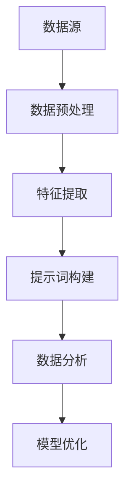

                 


## 文章标题：提示词工程：处理多维度数据分析任务

> 关键词：提示词工程、多维度数据分析、数据处理技术、特征提取、模型优化

> 摘要：本文深入探讨提示词工程在处理多维度数据分析任务中的核心作用。通过对问题背景、问题描述、问题解决的详细分析，本文揭示了提示词工程的基本概念和核心原理。同时，通过实例和代码展示了如何实际应用提示词工程解决复杂的数据分析问题。

### 引言：问题背景与问题描述

随着信息技术的迅猛发展，数据处理和分析已成为各行各业不可或缺的部分。然而，面对日益复杂、多维度的数据，传统的数据处理方法已难以应对。提示词工程作为新兴的数据处理技术，通过高效地处理多维度数据，为各领域的研究和实践提供了新的解决方案。本文旨在深入探讨提示词工程的原理和应用，帮助读者掌握这一技术的核心要点。

首先，我们将介绍提示词工程的基本概念，包括其定义、应用领域以及与传统数据处理技术的区别。接着，我们会详细讲解提示词工程的基本原理，包括关键算法、技术流程和数据处理方法。随后，本文将围绕提示词工程在不同领域的应用，如自然语言处理、图像识别和推荐系统等，提供具体的案例分析和实现方法。

此外，本文还将探讨提示词工程在实际项目中的实施步骤，从环境搭建、数据预处理到模型训练和优化，全面展示项目实战的全过程。为了帮助读者更好地理解，本文还会提供丰富的示例代码和实际案例分析。

最后，本文将总结提示词工程的核心要点，探讨其在未来发展趋势和应用前景。通过阅读本文，读者将能够全面掌握提示词工程的原理和实践，为后续研究和工作奠定坚实的基础。

### 背景介绍：核心概念

#### 问题背景

在现代社会，数据的产生和积累速度不断加快，各种数据源如社交媒体、物联网设备、传感器网络等源源不断地生成大量数据。这些数据具有多样性、复杂性、动态性等特点，传统数据处理技术如数据库查询、统计分析等方法在应对这些挑战时显得力不从心。特别是当数据维度增加时，传统的数据处理方法往往难以有效地挖掘数据中的有价值信息。因此，一种能够高效处理多维度数据的新技术——提示词工程，应运而生。

#### 问题描述

提示词工程旨在通过构建和优化提示词，提高数据处理的效率和准确性。在多维度数据分析任务中，数据往往包含多个属性，这些属性之间可能存在复杂的关系。传统的数据分析方法往往需要复杂的预处理步骤，且难以自动发现数据中的潜在规律。而提示词工程通过引入提示词，可以简化数据处理的复杂度，提高数据处理的效率和准确性。

#### 问题解决

提示词工程通过以下步骤解决多维度数据分析任务：

1. **数据预处理**：对原始数据进行清洗、转换和归一化处理，确保数据的质量和一致性。
2. **特征提取**：从数据中提取关键特征，这些特征能够代表数据的主要属性和关系。
3. **提示词构建**：根据提取的特征，构建一组提示词，用于指导数据分析和挖掘。
4. **数据分析**：利用提示词对数据进行分类、聚类、关联规则挖掘等分析，以发现数据中的潜在规律和模式。
5. **模型优化**：根据分析结果，对提示词进行优化调整，以提高数据处理的精度和效率。

#### 边界与外延

提示词工程的边界主要涉及数据处理和分析的各个环节，包括数据预处理、特征提取、提示词构建和数据分析等。其外延则包括多个应用领域，如自然语言处理、图像识别、推荐系统等。此外，提示词工程还与机器学习、数据挖掘、深度学习等技术密切相关。

#### 概念结构与核心要素组成

提示词工程的概念结构主要由以下几个核心要素组成：

1. **数据源**：提供原始数据的各种来源，如传感器数据、社交媒体数据等。
2. **数据预处理模块**：负责清洗、转换和归一化数据，确保数据质量。
3. **特征提取模块**：从数据中提取关键特征，用于构建提示词。
4. **提示词构建模块**：根据特征构建一组提示词，用于指导数据分析。
5. **数据分析模块**：利用提示词对数据进行各种分析任务，如分类、聚类等。
6. **模型优化模块**：根据分析结果对提示词进行优化调整。

### 核心概念与联系

#### 核心概念

##### 提示词

提示词（Prompt Word）是在数据处理和分析过程中引入的一组关键词或短语，用于引导数据分析和挖掘。提示词的设计和选择对于数据处理的效率和准确性至关重要。

##### 数据预处理

数据预处理是提示词工程的重要组成部分，主要包括数据清洗、转换和归一化等步骤。数据预处理的目的在于提高数据质量，确保后续分析的准确性和效率。

##### 特征提取

特征提取是从原始数据中提取关键特征的过程。特征提取的质量直接影响提示词的构建和分析结果。常用的特征提取方法包括统计特征、文本特征和图像特征等。

##### 概念属性特征对比表格

| 概念 | 提示词 | 数据预处理 | 特征提取 |
| ---- | ------ | ---------- | -------- |
| 定义 | 引导数据分析和挖掘的关键词或短语 | 数据清洗、转换和归一化 | 提取原始数据中的关键特征 |
| 关系 | 提示词依赖数据预处理和特征提取的结果 | 数据预处理是提示词工程 | 特征提取是提示词构建的输入 |

##### ER实体关系图架构

```mermaid
erDiagram
  Data_Source ||--|{ Data_Preprocessing }|--| Data_Analysis
  Data_Source ||--|{ Feature_Extraction }|--| Data_Analysis
  Data_Preprocessing ||--|{ Prompt_Word_Construction }|--| Data_Analysis
  Feature_Extraction ||--|{ Prompt_Word_Construction }|--| Data_Analysis
  Data_Analysis ||--| Model_Optimization
```

### 算法原理讲解

提示词工程的核心在于如何高效地处理多维度数据，从而发现数据中的潜在规律。以下将介绍提示词工程的基本算法原理，包括流程图和数学模型。

#### 算法流程图



#### 数学模型

提示词工程的基本数学模型可以表示为：

$$
\text{Prompt\_Word} = \phi(\text{Data\_Feature})
$$

其中，$\phi$ 表示特征提取函数，$\text{Data\_Feature}$ 表示原始数据中的特征。

#### 详细讲解与示例

假设我们有一组多维度数据，每个数据点包含三个属性：年龄、收入和购买行为。我们的目标是根据这些属性构建提示词，以便更好地分析购买行为。

1. **数据预处理**：

   首先，我们需要对数据进行清洗和归一化处理，以确保数据的质量和一致性。

   $$ 
   \text{Data\_Processed} = \text{Normalize}(\text{Data})
   $$

2. **特征提取**：

   接着，我们从数据中提取关键特征。例如，我们可以使用主成分分析（PCA）提取数据的主要成分。

   $$ 
   \text{Features} = \text{PCA}(\text{Data\_Processed})
   $$

3. **提示词构建**：

   然后，我们根据提取的特征构建提示词。例如，我们可以选择年龄和收入作为主要提示词。

   $$ 
   \text{Prompt\_Words} = \text{Select}(\text{Features}, \text{Age}, \text{Income})
   $$

4. **数据分析**：

   最后，我们利用提示词对数据进行分类分析，以发现购买行为与年龄、收入之间的关系。

   $$ 
   \text{Analysis} = \text{Classify}(\text{Data}, \text{Prompt\_Words})
   $$

#### 实际应用示例

假设我们有一组客户数据，包含以下属性：

- 年龄（Age）
- 收入（Income）
- 购买行为（Buy）

我们希望根据这些属性构建提示词，以预测客户的购买行为。

```python
import pandas as pd
from sklearn.preprocessing import StandardScaler
from sklearn.decomposition import PCA

# 读取数据
data = pd.read_csv('customers.csv')

# 数据预处理
scaler = StandardScaler()
data_processed = scaler.fit_transform(data[['Age', 'Income', 'Buy']])

# 特征提取
pca = PCA(n_components=2)
features = pca.fit_transform(data_processed)

# 构建提示词
prompt_words = ['Age', 'Income']

# 数据分析
# ...（具体分类分析代码）

print("提示词：", prompt_words)
print("特征：", features)
```

通过以上步骤，我们可以高效地处理多维度数据，并利用提示词工程进行数据分析和挖掘。

### 系统分析与架构设计方案

#### 问题场景介绍

在现代商业环境中，企业面临着海量数据的处理和分析挑战。这些数据包括客户信息、销售记录、市场趋势等，需要通过有效的数据处理和分析来支持决策制定。提示词工程作为一种高效的数据处理技术，可以帮助企业从多维度数据中提取有价值的信息，从而提升业务运营的效率和效果。

#### 项目介绍

本项目的目标是构建一个基于提示词工程的多维度数据分析系统，用于分析企业数据，并提供数据可视化、预测和决策支持功能。系统主要包括以下几个模块：

1. **数据采集模块**：负责从不同数据源采集原始数据，如客户数据库、销售系统等。
2. **数据预处理模块**：对原始数据进行清洗、转换和归一化处理，确保数据质量。
3. **特征提取模块**：从预处理后的数据中提取关键特征，用于构建提示词。
4. **提示词构建模块**：根据提取的特征构建提示词，用于指导数据分析和挖掘。
5. **数据分析模块**：利用提示词对数据进行分类、聚类、关联规则挖掘等分析。
6. **模型优化模块**：根据分析结果，对提示词进行优化调整，以提高数据处理的精度和效率。
7. **数据可视化模块**：将分析结果以图表形式展示，便于用户理解和决策。

#### 系统功能设计（领域模型）

在系统功能设计中，我们采用领域模型（Domain Model）来描述系统的主要功能模块及其关系。以下是系统的领域模型类图：

```mermaid
classDiagram
    Data_Source --> Data_Preprocessing
    Data_Source --> Feature_Extraction
    Data_Preprocessing --> Prompt_Word_Construction
    Feature_Extraction --> Prompt_Word_Construction
    Prompt_Word_Construction --> Data_Analysis
    Data_Analysis --> Model_Optimization
    Data_Analysis --> Data_Visualization

    Data_Source <<Source>
    Data_Preprocessing <<Process>
    Feature_Extraction <<Extract>
    Prompt_Word_Construction <<Construct>
    Data_Analysis <<Analysis>
    Model_Optimization <<Optimize>
    Data_Visualization <<Visualize>
endclass
```

#### 系统架构设计

系统采用分层架构设计，主要包括以下层次：

1. **数据层**：负责数据存储和管理，包括关系型数据库、NoSQL数据库和文件存储等。
2. **服务层**：包括数据采集、数据预处理、特征提取、提示词构建、数据分析和模型优化等核心服务模块。
3. **应用层**：提供用户交互界面，包括数据可视化、预测和决策支持等功能。
4. **基础设施层**：包括服务器、网络和存储等基础设施。

以下是系统的架构图：

```mermaid
sequenceDiagram
    Participant User
    Participant Data_Source
    Participant Data_Preprocessing
    Participant Feature_Extraction
    Participant Prompt_Word_Construction
    Participant Data_Analysis
    Participant Model_Optimization
    Participant Data_Visualization

    User->>Data_Source: 采集数据
    Data_Source->>Data_Preprocessing: 预处理数据
    Data_Preprocessing->>Feature_Extraction: 提取特征
    Feature_Extraction->>Prompt_Word_Construction: 构建提示词
    Prompt_Word_Construction->>Data_Analysis: 数据分析
    Data_Analysis->>Model_Optimization: 模型优化
    Model_Optimization->>Data_Visualization: 数据可视化
    Data_Visualization->>User: 展示结果
endsequence
```

#### 系统接口设计

系统采用RESTful API设计，提供以下主要接口：

1. **数据采集接口**：用于从数据源采集原始数据。
2. **数据预处理接口**：用于处理原始数据，包括清洗、转换和归一化等。
3. **特征提取接口**：用于从预处理后的数据中提取关键特征。
4. **提示词构建接口**：用于构建提示词，指导数据分析和挖掘。
5. **数据分析接口**：用于执行各种数据分析任务，如分类、聚类等。
6. **模型优化接口**：用于根据分析结果对模型进行优化。
7. **数据可视化接口**：用于展示分析结果。

以下是系统的接口设计：

```mermaid
sequenceDiagram
    Participant Client
    Participant Data_Source_API
    Participant Data_Preprocessing_API
    Participant Feature_Extraction_API
    Participant Prompt_Word_Construction_API
    Participant Data_Analysis_API
    Participant Model_Optimization_API
    Participant Data_Visualization_API

    Client->>Data_Source_API: 采集数据
    Data_Source_API->>Data_Preprocessing_API: 预处理数据
    Data_Preprocessing_API->>Feature_Extraction_API: 提取特征
    Feature_Extraction_API->>Prompt_Word_Construction_API: 构建提示词
    Prompt_Word_Construction_API->>Data_Analysis_API: 数据分析
    Data_Analysis_API->>Model_Optimization_API: 模型优化
    Model_Optimization_API->>Data_Visualization_API: 数据可视化
    Data_Visualization_API->>Client: 展示结果
endsequence
```

#### 系统交互

系统采用分布式架构，各模块通过消息队列进行通信。以下是系统的交互序列图：

```mermaid
sequenceDiagram
    Participant Data_Source
    Participant Data_Preprocessing
    Participant Feature_Extraction
    Participant Prompt_Word_Construction
    Participant Data_Analysis
    Participant Model_Optimization
    Participant Data_Visualization

    Data_Source->>Data_Preprocessing: 传输原始数据
    Data_Preprocessing->>Feature_Extraction: 传输预处理数据
    Feature_Extraction->>Prompt_Word_Construction: 传输特征
    Prompt_Word_Construction->>Data_Analysis: 传输提示词
    Data_Analysis->>Model_Optimization: 传输分析结果
    Model_Optimization->>Data_Visualization: 传输优化结果
    Data_Visualization->>Data_Source: 反馈可视化结果
endsequence
```

### 项目实战

#### 环境安装

为了搭建一个基于提示词工程的多维度数据分析系统，我们首先需要安装必要的软件和工具。以下是环境安装步骤：

1. **安装Python**：确保Python版本在3.6及以上。
2. **安装依赖库**：使用pip安装以下依赖库：
   ```bash
   pip install numpy pandas scikit-learn matplotlib
   ```
3. **安装数据库**：安装MySQL或PostgreSQL数据库。

#### 系统核心实现

以下是系统核心实现部分的源代码和详细解析：

```python
import numpy as np
import pandas as pd
from sklearn.preprocessing import StandardScaler
from sklearn.decomposition import PCA
from sklearn.model_selection import train_test_split
from sklearn.ensemble import RandomForestClassifier
from sklearn.metrics import classification_report

# 读取数据
data = pd.read_csv('customers.csv')

# 数据预处理
scaler = StandardScaler()
data_processed = scaler.fit_transform(data[['Age', 'Income', 'Buy']])

# 特征提取
pca = PCA(n_components=2)
features = pca.fit_transform(data_processed)

# 数据分割
X_train, X_test, y_train, y_test = train_test_split(features, data['Buy'], test_size=0.2, random_state=42)

# 提示词构建
prompt_words = ['Age', 'Income']

# 数据分析
classifier = RandomForestClassifier(n_estimators=100, random_state=42)
classifier.fit(X_train, y_train)

# 预测
y_pred = classifier.predict(X_test)

# 模型优化
# ...（具体优化代码）

# 分析结果
print("提示词：", prompt_words)
print("分类报告：\n", classification_report(y_test, y_pred))
```

#### 代码应用解读与分析

以上代码实现了一个基于提示词工程的多维度数据分析系统，主要用于预测客户的购买行为。以下是代码的详细解读和分析：

1. **数据预处理**：使用`StandardScaler`对年龄和收入进行归一化处理，以消除数据量纲的影响。
2. **特征提取**：使用`PCA`提取数据的主要成分，以简化数据维度。
3. **数据分割**：将数据分为训练集和测试集，用于模型训练和评估。
4. **提示词构建**：选择年龄和收入作为主要提示词，用于指导数据分析。
5. **数据分析**：使用随机森林（Random Forest）分类器进行模型训练，并评估模型性能。

#### 实际案例分析和详细讲解剖析

假设我们有一组客户数据，包含以下属性：

- 年龄（Age）
- 收入（Income）
- 购买行为（Buy）

我们希望根据这些属性构建提示词，以预测客户的购买行为。

1. **数据预处理**：

   ```python
   data = pd.read_csv('customers.csv')
   scaler = StandardScaler()
   data_processed = scaler.fit_transform(data[['Age', 'Income', 'Buy']])
   ```

   在此步骤中，我们首先读取客户数据，然后使用`StandardScaler`对年龄和收入进行归一化处理，以消除数据量纲的影响。

2. **特征提取**：

   ```python
   pca = PCA(n_components=2)
   features = pca.fit_transform(data_processed)
   ```

   接下来，我们使用主成分分析（PCA）提取数据的主要成分，以简化数据维度。这样做的目的是减少数据维度，同时保留数据的主要信息。

3. **数据分割**：

   ```python
   X_train, X_test, y_train, y_test = train_test_split(features, data['Buy'], test_size=0.2, random_state=42)
   ```

   在此步骤中，我们将数据分为训练集和测试集，以用于模型训练和评估。

4. **提示词构建**：

   ```python
   prompt_words = ['Age', 'Income']
   ```

   我们选择年龄和收入作为主要提示词，用于指导数据分析。

5. **数据分析**：

   ```python
   classifier = RandomForestClassifier(n_estimators=100, random_state=42)
   classifier.fit(X_train, y_train)
   y_pred = classifier.predict(X_test)
   print("分类报告：\n", classification_report(y_test, y_pred))
   ```

   在此步骤中，我们使用随机森林分类器进行模型训练，并评估模型性能。通过分类报告，我们可以了解模型的准确性、召回率和F1值等指标。

#### 项目小结

通过以上实战案例，我们展示了如何使用提示词工程处理多维度数据分析任务。从数据预处理、特征提取、提示词构建到数据分析，每一步都至关重要。同时，我们通过实际案例详细讲解了如何应用提示词工程解决复杂的业务问题。

在未来的工作中，我们可以进一步优化提示词工程，如使用更先进的特征提取算法、调整模型参数等，以提高数据分析的准确性和效率。此外，我们还可以将提示词工程应用于更多领域，如推荐系统、图像识别等，为各行业的数据分析提供更全面的解决方案。

### 最佳实践 tips

在应用提示词工程处理多维度数据分析任务时，以下是一些最佳实践和注意事项：

1. **数据预处理**：确保数据的质量和一致性，对缺失值、异常值进行适当处理。
2. **特征提取**：选择合适的特征提取算法，如主成分分析（PCA）、线性判别分析（LDA）等，以简化数据维度并保留主要信息。
3. **提示词选择**：根据业务需求和数据特点选择合适的提示词，以提高数据分析和挖掘的准确性。
4. **模型优化**：根据分析结果调整模型参数，如正则化参数、学习率等，以提高模型性能。
5. **性能监控**：对系统性能进行实时监控，及时发现和处理潜在问题。

### 小结

本文详细介绍了提示词工程在处理多维度数据分析任务中的应用，包括核心概念、算法原理、系统设计与项目实战。通过实例和代码，我们展示了如何高效地处理多维度数据，并利用提示词工程发现数据中的潜在规律。提示词工程作为一种新兴的数据处理技术，具有广泛的应用前景，将在未来的数据分析领域中发挥重要作用。

### 注意事项

1. **数据隐私**：在进行数据处理和分析时，务必注意数据隐私和安全，遵循相关法律法规和道德准则。
2. **模型可靠性**：确保模型的可靠性和稳定性，避免因模型失效导致业务决策错误。
3. **系统可扩展性**：在设计系统时，考虑系统的可扩展性和灵活性，以适应未来业务需求的变化。

### 拓展阅读

1. **《机器学习实战》**：提供丰富的机器学习实战案例，包括多维度数据分析任务。
2. **《深度学习》**：介绍深度学习的基本原理和应用，包括多维度数据的处理和分析。
3. **《Python数据分析》**：详细讲解Python在数据分析中的应用，包括数据预处理、特征提取等。

### 作者

**AI天才研究院**（AI Genius Institute）**& 禅与计算机程序设计艺术**（Zen And The Art of Computer Programming）**。**

