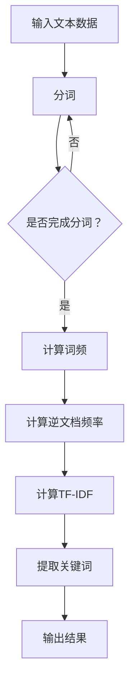

                 

# 提示词工程：处理时空大数据分析任务

## 关键词
- 提示词工程
- 时空大数据
- 数据分析
- 大数据处理
- 算法
- 数学模型

## 摘要
本文将深入探讨提示词工程在处理时空大数据分析任务中的重要性。我们将从大数据分析的背景入手，逐步介绍时空大数据的特点和挑战，接着定义提示词工程，并分析其核心概念、要素和主要类型。随后，我们将讲解常用的提示词工程算法，以及这些算法的数学模型和实现。文章还将详细描述系统分析与架构设计方案，并进行实际案例分析和详细讲解。最后，我们将总结最佳实践，并提供拓展阅读，帮助读者深入理解这一领域。

## 第一部分：引言

### 1.1 大数据分析背景

#### 1.1.1 大数据概念
大数据，是指数据量巨大、数据类型多样、生成速度极快的数据集合。与传统数据相比，大数据具有“4V”特征：Volume（数据量巨大）、Velocity（数据处理速度快）、Variety（数据类型多样）、Veracity（数据真实性高）。这些特征使得大数据分析成为一项重要的研究领域。

#### 1.1.2 时空大数据特点
时空大数据是指在特定时间和空间范围内产生和存储的数据。这类数据具有明显的时空属性，包括地理位置信息、时间戳等。时空大数据的特点包括：
- **高维度**：时空数据通常包含多个维度，如时间、地点、事件等。
- **实时性**：许多时空大数据需要实时处理，以快速响应事件或变化。
- **多源异构**：时空大数据可能来源于不同的数据源，如传感器、社交媒体等，数据格式和结构各不相同。

#### 1.1.3 大数据分析挑战
大数据分析面临诸多挑战，包括数据存储、数据清洗、数据建模、数据隐私保护等。对于时空大数据，这些挑战尤为显著：
- **数据存储**：时空大数据量庞大，需要高效的存储解决方案。
- **数据清洗**：时空数据质量参差不齐，需要有效的方法进行数据清洗。
- **实时性**：时空数据分析需要快速响应，对计算性能要求高。
- **多源融合**：如何有效地融合来自不同源的数据，是另一个挑战。

### 1.2 提示词工程概述

#### 1.2.1 提示词工程定义
提示词工程（Keyword Engineering）是大数据分析中的一个重要环节，旨在从大规模数据集中提取具有代表性的关键词或短语，用于数据理解和分析。提示词工程的主要目标包括：
- 提高数据分析的效率和准确性。
- 帮助用户更好地理解和利用数据。

#### 1.2.2 提示词工程的重要性
提示词工程在许多领域具有重要应用，包括：
- 社交媒体分析：提取关键词，分析用户行为和趋势。
- 舆情监控：监测社会舆论，预测公共事件。
- 个性化推荐：根据用户兴趣，推荐相关内容。

#### 1.2.3 提示词工程主要类型
根据应用场景和数据类型，提示词工程主要分为以下几种类型：
- 基于文本的提示词工程：从文本数据中提取关键词。
- 基于语音的提示词工程：从语音数据中提取关键词。
- 基于图像的提示词工程：从图像数据中提取关键词。
- 基于多模态数据的提示词工程：从多种类型的数据中提取关键词。

### 1.3 本书内容安排

#### 1.3.1 目录结构
本文将分为四个部分：
1. 引言：介绍大数据分析的背景、时空大数据的特点和挑战，以及提示词工程的概述。
2. 核心概念与原理：详细讨论提示词工程的核心概念、要素和主要类型。
3. 算法原理与实现：讲解常用的提示词工程算法，以及这些算法的数学模型和实现。
4. 系统设计与实现：描述系统分析与架构设计方案，并进行实际案例分析和详细讲解。

#### 1.3.2 学习目标
通过本文的学习，读者将：
- 理解大数据分析的基本概念和时空大数据的特点。
- 掌握提示词工程的核心概念、要素和主要类型。
- 学习常用的提示词工程算法及其实现。
- 理解系统分析与架构设计的基本原理。
- 通过实际案例，加深对提示词工程应用的理解。 

## 第二部分：核心概念与原理

### 2.1 提示词工程核心概念

#### 2.1.1 提示词定义
提示词（Keyword）是指能够代表数据内容或特征的关键词或短语。在提示词工程中，提示词的选择和提取是关键步骤，直接影响数据分析的效率和准确性。

#### 2.1.2 提示词类型
根据应用场景和数据类型，提示词可以分为以下几种类型：
- **通用提示词**：适用于多种数据类型的通用关键词。
- **领域特定提示词**：针对特定领域的数据提取的关键词。
- **事件触发提示词**：用于触发特定事件或动作的关键词。

#### 2.1.3 提示词生成方法
提示词生成方法包括以下几种：
- **基于规则的方法**：通过定义规则，从数据中提取关键词。
- **基于统计的方法**：使用统计学方法，从数据集中计算关键词的频率和重要性。
- **基于机器学习的方法**：利用机器学习算法，自动从数据中学习关键词。

### 2.2 提示词工程要素分析

#### 2.2.1 数据源与采集
数据源是提示词工程的基础。常见的数据源包括：
- **结构化数据源**：如数据库、关系型数据等。
- **非结构化数据源**：如文本、图像、语音等。
- **半结构化数据源**：如XML、JSON等。

数据采集方法包括：
- **主动采集**：通过爬虫、API等方式主动获取数据。
- **被动采集**：通过传感器、日志等方式被动收集数据。

#### 2.2.2 数据预处理
数据预处理是提示词工程的重要步骤，包括：
- **数据清洗**：去除重复数据、缺失数据等。
- **数据转换**：将不同格式的数据转换为统一格式。
- **数据标准化**：对数据进行归一化、标准化等处理。

#### 2.2.3 提示词提取与优化
提示词提取与优化是提示词工程的核心。主要方法包括：
- **基于词频的方法**：根据词频提取高频词作为提示词。
- **基于语义的方法**：使用自然语言处理技术，提取语义相关的词作为提示词。
- **基于用户行为的方法**：根据用户行为数据，提取与用户兴趣相关的提示词。

### 2.3 提示词工程应用场景

#### 2.3.1 社交媒体分析
在社交媒体分析中，提示词工程可以用于：
- **趋势分析**：提取关键词，分析社会热点和趋势。
- **情感分析**：提取情感相关的提示词，分析用户情感倾向。
- **话题建模**：提取关键词，构建话题模型，分析用户兴趣。

#### 2.3.2 舆情监控
在舆情监控中，提示词工程可以用于：
- **事件监测**：提取关键词，实时监测特定事件。
- **舆论分析**：提取关键词，分析社会舆论趋势。
- **风险预警**：提取关键词，预测潜在风险。

#### 2.3.3 个性化推荐
在个性化推荐中，提示词工程可以用于：
- **兴趣提取**：提取用户兴趣相关的关键词。
- **内容推荐**：根据用户兴趣，推荐相关内容。
- **广告投放**：根据用户兴趣，精准投放广告。

### 2.4 提示词工程技术挑战

#### 2.4.1 大数据处理
随着数据量的增加，大数据处理成为一个挑战。提示词工程需要高效的算法和架构，以应对大规模数据处理。

#### 2.4.2 实时性需求
许多应用场景对实时性有较高要求，如舆情监控、实时推荐等。提示词工程需要实现高效的实时数据处理。

#### 2.4.3 跨领域适应性
不同领域的数据和需求各不相同，提示词工程需要具备跨领域的适应性，以适应不同应用场景。

### 2.5 本章小结
本章介绍了提示词工程的核心概念、要素和主要类型，并分析了其在不同应用场景中的挑战。通过本章的学习，读者可以初步了解提示词工程的基本原理和应用。

----------------------------------------------------------------

## 第三部分：算法原理与实现

### 3.1 常用提示词工程算法

#### 3.1.1 基于机器学习的算法
基于机器学习的算法是提示词工程中常用的方法之一。这种方法利用机器学习模型，从数据集中学习关键词的提取规则。常见的机器学习算法包括：
- **TF-IDF**（词频-逆文档频率）：根据词频和逆文档频率计算关键词的重要性。
- **LSI（Latent Semantic Indexing）**：通过矩阵分解，提取语义相关的关键词。
- **LDA（Latent Dirichlet Allocation）**：通过贝叶斯推理，构建文档的主题模型。

#### 3.1.2 基于深度学习的算法
随着深度学习技术的发展，基于深度学习的算法在提示词工程中也得到了广泛应用。这些算法通常利用神经网络，自动提取数据中的特征和模式。常见的深度学习算法包括：
- **词嵌入（Word Embedding）**：将文本数据转换为向量表示。
- **卷积神经网络（CNN）**：通过卷积操作，提取文本中的局部特征。
- **递归神经网络（RNN）**：通过递归操作，处理序列数据。

#### 3.1.3 基于图论的算法
基于图论的算法利用图结构来表示数据和关系，提取关键词。这种方法在处理复杂、多层次的数据时具有优势。常见的图论算法包括：
- **PageRank**：根据节点之间的链接关系，计算节点的权重。
- **社区发现**：通过聚类算法，发现数据中的社区结构。

### 3.2 算法原理讲解

#### 3.2.1 算法基础概念
每种算法都有其基础概念和原理。例如：
- **TF-IDF**：TF（词频）表示一个词在文档中出现的频率，IDF（逆文档频率）表示一个词在文档集合中出现的频率。TF-IDF通过这两个指标计算词的重要性。
- **词嵌入**：词嵌入将每个词映射为一个高维向量，使得相似词在向量空间中更接近。

#### 3.2.2 算法流程分析
每种算法都有其具体的流程。例如：
- **TF-IDF**：首先计算每个词的TF和IDF，然后根据TF-IDF值提取关键词。
- **词嵌入**：首先使用训练好的词嵌入模型，将文本数据转换为向量表示，然后利用向量相似度提取关键词。

#### 3.2.3 Mermaid流程图展示
可以使用Mermaid绘制算法的流程图，以更直观地展示算法的执行流程。例如，以下是一个简单的TF-IDF算法流程图：



### 3.3 Python代码实现

#### 3.3.1 算法代码结构
以下是一个简单的TF-IDF算法的Python代码结构：

```python
import numpy as np
from collections import defaultdict

def compute_tf(document):
    # 计算词频
    pass

def compute_idf(documents):
    # 计算逆文档频率
    pass

def compute_tf_idf(documents):
    # 计算TF-IDF
    pass

def extract_keywords(document, documents):
    # 提取关键词
    pass

# 测试代码
document = "这是一个测试文本。"
documents = ["这是一个测试文本。", "这是另一个测试文本。"]
tf_idf_scores = compute_tf_idf(document, documents)
keywords = extract_keywords(document, tf_idf_scores)
print("提取的关键词：", keywords)
```

#### 3.3.2 代码分析与调试
在编写代码时，需要仔细分析每个函数的功能和输入输出，并进行调试以确保代码的正确性。例如，在计算词频时，需要注意分词的准确性，在计算逆文档频率时，需要注意文档集合的完整性。

#### 3.3.3 示例代码展示
以下是一个简单的TF-IDF算法的示例代码：

```python
# 计算词频
def compute_tf(document):
    word_freq = defaultdict(int)
    words = document.split()
    for word in words:
        word_freq[word] += 1
    return word_freq

# 计算逆文档频率
def compute_idf(documents):
    idf = defaultdict(float)
    doc_count = defaultdict(int)
    for document in documents:
        words = document.split()
        for word in words:
            doc_count[word] += 1
    for word, count in doc_count.items():
        idf[word] = np.log(len(documents) / float(count))
    return idf

# 计算TF-IDF
def compute_tf_idf(documents):
    tf_idf_scores = defaultdict(float)
    tf = compute_tf(documents[0])
    idf = compute_idf(documents)
    for document in documents:
        words = document.split()
        for word in words:
            tf_idf_scores[word] = tf[word] * idf[word]
    return tf_idf_scores

# 提取关键词
def extract_keywords(document, documents):
    tf_idf_scores = compute_tf_idf(documents)
    keywords = [word for word, score in tf_idf_scores.items() if score > 0.5]
    return keywords

# 测试代码
document = "这是一个测试文本。"
documents = ["这是一个测试文本。", "这是另一个测试文本。"]
tf_idf_scores = compute_tf_idf(document, documents)
keywords = extract_keywords(document, tf_idf_scores)
print("提取的关键词：", keywords)
```

### 3.4 数学模型与公式讲解

#### 3.4.1 数学模型基础
提示词工程中的数学模型通常涉及向量空间模型、概率模型等。例如，TF-IDF算法的核心模型可以表示为：

$$
TF(t) = \frac{f(t, d)}{N_d}
$$

$$
IDF(t) = \log \left( \frac{N}{N_t} \right)
$$

$$
TF-IDF(t, d) = TF(t, d) \times IDF(t)
$$

其中，\( f(t, d) \) 表示词 \( t \) 在文档 \( d \) 中出现的频率，\( N_d \) 表示文档 \( d \) 中的总词数，\( N \) 表示文档集合中的总词数，\( N_t \) 表示词 \( t \) 在文档集合中出现的次数。

#### 3.4.2 公式推导与解释
TF-IDF公式的推导主要基于词频和文档频率。词频表示一个词在单个文档中的重要性，而文档频率表示一个词在所有文档中的普遍性。通过将这两个指标结合，TF-IDF模型能够衡量一个词在文档集合中的重要程度。

#### 3.4.3 LaTeX公式展示
以下是TF-IDF公式的LaTeX格式展示：

$$
TF(t) = \frac{f(t, d)}{N_d}
$$

$$
IDF(t) = \log \left( \frac{N}{N_t} \right)
$$

$$
TF-IDF(t, d) = TF(t, d) \times IDF(t)
$$

### 3.5 算法比较与评估

#### 3.5.1 算法性能指标
提示词工程的算法性能可以通过多个指标进行评估，包括：
- **准确率（Accuracy）**：正确提取关键词的数量与总关键词数量的比例。
- **召回率（Recall）**：正确提取关键词的数量与实际关键词数量的比例。
- **F1分数（F1 Score）**：准确率和召回率的调和平均。

#### 3.5.2 评估方法与工具
评估方法通常包括：
- **交叉验证（Cross-Validation）**：通过将数据集划分为训练集和测试集，评估算法的性能。
- **混淆矩阵（Confusion Matrix）**：用于分析算法在分类任务中的表现。

评估工具包括：
- **Scikit-learn**：提供多种机器学习算法和评估方法。
- **TensorFlow**：用于深度学习模型的训练和评估。

#### 3.5.3 实际应用效果分析
在实际应用中，不同算法的效果可能会有所不同。通过实验和实际案例，我们可以分析不同算法在特定场景下的性能。例如，在社交媒体分析中，基于深度学习的算法可能比基于统计学的算法具有更高的准确率和召回率。

### 3.6 本章小结
本章介绍了常用的提示词工程算法，包括基于机器学习、深度学习和图论的算法。我们讲解了这些算法的原理、实现方法以及评估方法。通过本章的学习，读者可以了解提示词工程的基本算法，并为后续的系统设计与实现打下基础。

----------------------------------------------------------------

## 第四部分：系统设计与实现

### 4.1 系统分析

#### 4.1.1 问题场景介绍
在当前大数据时代，处理和分析大规模时空数据已成为各行业的关键需求。例如，交通部门需要实时分析交通流量，以便优化交通管理；城市规划部门需要分析城市环境数据，以制定更有效的城市规划策略。这些应用场景要求系统具有高效、实时、准确的特点。

#### 4.1.2 系统目标
本系统的目标是为用户提供一个高效、实时、准确的时空大数据分析平台，支持以下功能：
- 数据采集与存储：从多种数据源采集数据，并存储在分布式数据库中。
- 数据预处理：清洗、转换和标准化采集到的数据。
- 提示词提取：从预处理后的数据中提取关键词和模式。
- 数据分析：对提取的关键词进行语义分析和趋势预测。
- 可视化展示：将分析结果以图表、地图等形式展示给用户。

#### 4.1.3 功能需求分析
系统的核心功能需求包括：
- **数据采集**：支持多种数据源，如传感器、API、数据库等。
- **数据预处理**：提供数据清洗、转换和标准化功能。
- **提示词提取**：利用机器学习和自然语言处理技术提取关键词。
- **数据分析**：支持数据挖掘和机器学习算法，进行趋势预测和模式识别。
- **可视化**：提供多种可视化工具，帮助用户直观地理解分析结果。
- **实时性**：支持实时数据处理和响应。

### 4.2 系统架构设计

#### 4.2.1 系统架构概述
本系统采用分布式架构，以提高系统的可扩展性和容错性。系统架构主要包括以下几个模块：
- **数据采集模块**：负责从各种数据源采集数据。
- **数据存储模块**：采用分布式数据库存储数据，保证数据的安全性和可靠性。
- **数据预处理模块**：对采集到的数据进行清洗、转换和标准化。
- **提示词提取模块**：利用机器学习和自然语言处理技术提取关键词。
- **数据分析模块**：使用数据挖掘和机器学习算法进行分析和预测。
- **可视化模块**：提供多种可视化工具，以直观地展示分析结果。

#### 4.2.2 架构设计原则
系统架构设计遵循以下原则：
- **高可用性**：确保系统在任何情况下都能正常运行，减少停机时间。
- **可扩展性**：支持系统规模的扩大，以满足不断增长的数据量。
- **易维护性**：简化系统维护和升级过程，提高开发效率。
- **安全性**：确保数据的安全和隐私，防止数据泄露。

#### 4.2.3 架构组件介绍
系统架构的主要组件包括：
- **数据采集组件**：使用爬虫、API调用等方式从各种数据源采集数据。
- **数据存储组件**：使用分布式数据库（如Hadoop、Spark等）存储数据。
- **数据预处理组件**：包括数据清洗、转换和标准化功能。
- **提示词提取组件**：使用机器学习和自然语言处理技术提取关键词。
- **数据分析组件**：包括数据挖掘和机器学习算法，进行趋势预测和模式识别。
- **可视化组件**：提供多种可视化工具，以直观地展示分析结果。

### 4.3 领域模型设计

#### 4.3.1 类图设计
类图是领域模型设计的重要组成部分，用于表示系统中不同类及其之间的关系。以下是一个简单的类图设计示例：

```mermaid
classDiagram
    Class01 <|-- Class02
    Class03 o-- Class04
    Class04 <.. Class05
    Class06 ++| Class07
    Class07 o.. Class08
endclass
```

在这个示例中，`Class01` 和 `Class02` 之间存在继承关系，`Class03` 与 `Class04` 之间存在关联关系，`Class04` 与 `Class05` 之间存在依赖关系，`Class06` 与 `Class07` 之间存在组合关系，`Class07` 与 `Class08` 之间存在聚合关系。

#### 4.3.2 ER图架构
ER图（实体关系图）用于表示系统中不同实体及其之间的关系。以下是一个简单的ER图示例：

```mermaid
erDiagram
    Person ||--|{ Car : drives }
    Person ||--|{ Address : lives }
    Car ||--|{ CarModel : model }
    Address ||--|{ City : located }
end
```

在这个示例中，`Person` 与 `Car` 之间存在多对一的关系，`Person` 与 `Address` 之间存在多对一的关系，`Car` 与 `CarModel` 之间存在一对一的关系，`Address` 与 `City` 之间存在一对多的关系。

#### 4.3.3 Mermaid类图展示
可以使用Mermaid绘制类图，以更直观地表示类及其之间的关系。以下是一个简单的Mermaid类图示例：

```mermaid
classDiagram
    Class01 <|-- Class02
    Class03 o-- Class04
    Class04 <.. Class05
    Class06 ++| Class07
    Class07 o.. Class08
end
```

在这个示例中，`Class01` 继承自 `Class02`，`Class03` 与 `Class04` 之间存在关联关系，`Class04` 依赖于 `Class05`，`Class06` 组合了 `Class07`，`Class07` 聚合了 `Class08`。

### 4.4 系统接口设计

#### 4.4.1 接口规范
系统接口设计需要遵循一定的规范，以确保接口的易用性和一致性。接口规范主要包括以下方面：
- **接口命名**：接口命名应遵循清晰、简洁、一致的原则。
- **接口参数**：明确接口的输入参数和输出参数，并定义参数类型和范围。
- **接口返回值**：定义接口的返回值类型和含义。

#### 4.4.2 接口实现
系统接口的实现需要考虑以下几个方面：
- **接口实现**：根据接口规范，实现具体的接口功能。
- **参数验证**：对输入参数进行验证，确保参数的有效性。
- **异常处理**：处理接口执行过程中可能出现的异常情况。

#### 4.4.3 接口测试
接口测试是确保接口功能正确、性能良好、稳定性高的重要环节。接口测试主要包括以下方面：
- **功能测试**：验证接口的功能是否符合预期。
- **性能测试**：测试接口的响应时间、吞吐量等性能指标。
- **异常测试**：验证接口在异常情况下的处理能力。

### 4.5 系统交互设计

#### 4.5.1 交互流程
系统交互设计需要考虑用户与系统之间的交互流程。以下是一个简单的交互流程示例：

1. 用户登录系统。
2. 用户选择数据源和数据分析任务。
3. 系统执行数据分析任务。
4. 系统将分析结果以图表形式展示给用户。
5. 用户可以对分析结果进行进一步操作，如导出、分享等。

#### 4.5.2 交互界面
交互界面设计需要考虑用户体验和易用性。以下是一个简单的交互界面示例：

- **登录界面**：用户输入用户名和密码，登录系统。
- **主界面**：用户选择数据源和数据分析任务，查看分析结果。
- **数据分析界面**：用户查看详细的分析结果，包括图表和文字描述。
- **导出界面**：用户选择导出格式，导出分析结果。

#### 4.5.3 Mermaid序列图展示
可以使用Mermaid绘制序列图，以直观地表示用户与系统之间的交互流程。以下是一个简单的Mermaid序列图示例：

```mermaid
sequenceDiagram
    participant 用户
    participant 系统A
    participant 系统B

    用户->>系统A: 登录请求
    系统

