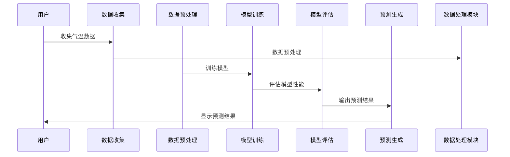
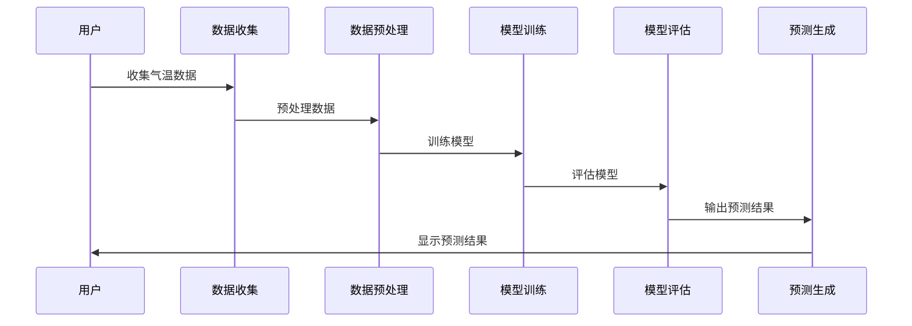

                 

### 文章关键词

时间序列预测、提示词工程、机器学习、深度学习、算法、数据处理、数学模型。

### 摘要

本文旨在深入探讨时间序列预测任务中的提示词工程方法，通过逻辑清晰、结构紧凑的分析，对时间序列预测的背景、核心概念、算法原理、系统架构设计以及项目实战进行系统讲解。文章围绕关键词展开，详细介绍了时间序列预测的重要性、应用领域、面临挑战，以及各种预测算法的原理和适用场景。通过具体的案例和实战操作，读者能够掌握时间序列预测的实用技巧，为解决实际预测问题提供有力支持。

## 提示词工程：处理时间序列预测任务

### 第一部分：背景介绍

#### 1.1 问题背景

##### 1.1.1 时间序列预测的重要性

时间序列预测（Time Series Forecasting）是统计学、机器学习和深度学习等领域中的重要研究方向。其核心目的是通过对历史时间序列数据的分析，预测未来的趋势或模式。时间序列预测的重要性体现在多个方面：

1. **经济领域**：通过分析经济指标，如GDP、消费指数、股票价格等，预测经济走势，为企业决策提供数据支持。
2. **金融市场**：预测股票、期货等金融资产的价格波动，帮助投资者做出更明智的决策。
3. **资源管理**：预测能源消耗、水资源等，优化资源分配，提高资源利用效率。
4. **交通运输**：预测交通流量，优化交通信号控制，减少拥堵，提高道路通行效率。
5. **医疗健康**：预测疾病流行趋势，优化医疗资源配置，提高疾病防控效果。

##### 1.1.2 时间序列预测的应用领域

时间序列预测广泛应用于多个领域，其中一些典型应用包括：

1. **工业生产**：预测生产设备的故障时间，提前进行维护，减少停机时间。
2. **气象预报**：预测天气变化，提供天气预报，指导农业灌溉和防灾减灾。
3. **物流仓储**：预测货物流量，优化库存管理，减少库存成本。
4. **电力需求预测**：预测电力需求，为电力调度和新能源发电提供决策支持。
5. **金融风控**：预测金融风险，防范金融风险，保障金融系统的稳定运行。

##### 1.1.3 时间序列预测面临的挑战

尽管时间序列预测具有广泛的应用价值，但同时也面临着诸多挑战：

1. **噪声和异常值**：时间序列数据中可能存在噪声和异常值，这些干扰因素会影响预测的准确性。
2. **长期依赖和短期波动**：许多时间序列数据既包含长期趋势，又包含短期波动，如何平衡这两种特性是预测中的难题。
3. **数据稀缺性**：在某些应用场景中，获取足够的历史数据可能非常困难，数据稀缺性会限制预测模型的训练和优化。
4. **模型选择和调优**：选择合适的预测模型，并进行有效的参数调优，是提高预测准确性的关键。
5. **实时性和效率**：在实时应用场景中，如何快速响应并生成预测结果，同时保持系统的高效运行，是重要的挑战。

#### 1.2 问题描述

##### 1.2.1 时间序列数据的特性

时间序列数据（Time Series Data）是指按时间顺序排列的数据点序列。这些数据点通常表示某一变量在连续时间段内的变化情况。时间序列数据具有以下几个典型特性：

1. **趋势（Trend）**：时间序列数据可能呈现出上升、下降或平稳的趋势。
2. **季节性（Seasonality）**：时间序列数据可能在某些固定时间点（如节假日、季节变化等）表现出周期性的波动。
3. **周期性（Cyclicality）**：时间序列数据可能受到长期经济周期的影响，表现出非固定的周期性波动。
4. **随机性（Noise）**：时间序列数据中可能包含随机噪声，这些噪声会影响预测的准确性。

##### 1.2.2 预测目标的选择

在时间序列预测中，选择合适的预测目标是关键。常见的预测目标包括：

1. **点预测（Point Forecast）**：预测单一时间点的值，如预测下一期的价格。
2. **区间预测（Interval Forecast）**：预测一个区间范围内的值，如预测下一期的价格波动范围。
3. **概率预测（Probability Forecast）**：预测未来一段时间内变量的概率分布，如预测下一期的价格概率分布。

##### 1.2.3 数据集的获取与预处理

为了进行时间序列预测，需要获取历史时间序列数据。数据集的获取可以通过以下几种途径：

1. **公开数据集**：许多领域都有公开的时间序列数据集，如UCI机器学习库、Kaggle竞赛数据等。
2. **企业数据**：从企业内部数据库中提取相关的时间序列数据，如销售数据、库存数据等。
3. **传感器数据**：从传感器网络获取的数据，如气象数据、交通流量数据等。

在获取数据后，需要进行预处理，以消除噪声、异常值和缺失值，使数据适合进行预测分析。常见的预处理步骤包括：

1. **数据清洗**：去除噪声、异常值和重复数据。
2. **数据转换**：将时间序列数据进行归一化、标准化或变换，使其满足预测模型的输入要求。
3. **特征工程**：提取时间序列数据中的有效特征，如趋势、季节性、周期性等。
4. **时间窗口划分**：将时间序列数据划分为不同的时间窗口，用于训练和测试预测模型。

#### 1.3 问题解决

##### 1.3.1 常见的时间序列预测算法

常见的时间序列预测算法包括以下几种：

1. **ARIMA算法（AutoRegressive Integrated Moving Average）**：自回归积分滑动平均模型，适用于平稳的时间序列数据。
2. **SARIMA算法（Seasonal ARIMA）**：季节性自回归积分滑动平均模型，适用于具有季节性的时间序列数据。
3. **LSTM算法（Long Short-Term Memory）**：长短时记忆网络，适用于处理具有长期依赖性的时间序列数据。
4. **GRU算法（Gated Recurrent Unit）**：门控循环单元，是LSTM的变体，同样适用于处理长期依赖性。
5. **CNN算法（Convolutional Neural Network）**：卷积神经网络，通过卷积操作提取时间序列数据的特征。

##### 1.3.2 基于机器学习的预测方法

基于机器学习的预测方法通过训练大规模的模型来捕捉时间序列数据中的复杂模式。常见的方法包括：

1. **随机森林（Random Forest）**：通过集成多个决策树来提高预测准确性。
2. **K-最近邻（K-Nearest Neighbors）**：基于距离最近的K个样本进行预测。
3. **支持向量机（Support Vector Machine）**：通过最大化分类间隔进行预测。
4. **神经网络（Neural Network）**：通过多层感知器进行非线性预测。

##### 1.3.3 基于深度学习的预测方法

基于深度学习的预测方法利用大规模神经网络进行特征学习和模式识别。常见的方法包括：

1. **卷积神经网络（Convolutional Neural Network）**：通过卷积操作提取时间序列数据的特征。
2. **递归神经网络（Recurrent Neural Network）**：通过循环结构处理时间序列数据的长期依赖性。
3. **变分自编码器（Variational Autoencoder）**：通过编码器和解码器学习数据的高效表示。
4. **生成对抗网络（Generative Adversarial Network）**：通过生成器和判别器生成数据分布。

#### 1.4 边界与外延

##### 1.4.1 时间序列预测的边界

时间序列预测的边界主要包括以下几个方面：

1. **预测范围**：时间序列预测通常关注短期预测，如未来几期或几天的预测。
2. **预测精度**：预测的精度受到模型选择、数据质量和计算资源等因素的限制。
3. **预测可靠性**：预测结果的可靠性取决于模型对历史数据的拟合程度。

##### 1.4.2 时间序列预测的外延

时间序列预测的外延包括以下几个方面：

1. **多步预测**：通过时间窗口进行多步预测，如预测未来几期的值。
2. **变量预测**：不仅预测单一变量的值，还可以预测多个相关变量的值。
3. **风险评估**：通过预测未来可能的波动范围，评估风险并制定相应的应对策略。

#### 1.5 概念结构与核心要素组成

##### 1.5.1 时间序列预测的核心概念

时间序列预测的核心概念包括：

1. **时间序列**：按时间顺序排列的数据点序列。
2. **趋势**：时间序列数据随时间的变化趋势。
3. **季节性**：时间序列数据在固定时间点（如节假日、季节变化等）的周期性波动。
4. **周期性**：时间序列数据受到长期经济周期影响的非固定周期性波动。
5. **随机性**：时间序列数据中的随机噪声。

##### 1.5.2 时间序列预测的要素组成

时间序列预测的要素组成包括：

1. **数据集**：用于训练和测试预测模型的原始数据。
2. **特征工程**：提取时间序列数据中的有效特征，如趋势、季节性、周期性等。
3. **预测模型**：用于预测未来时间点的模型，如ARIMA、LSTM、CNN等。
4. **评估指标**：用于评估预测模型性能的指标，如均方误差（MSE）、平均绝对误差（MAE）等。
5. **优化方法**：用于优化预测模型性能的方法，如交叉验证、网格搜索等。

### 第二部分：核心概念与联系

#### 2.1 时间序列预测原理

##### 2.1.1 时间序列预测的数学模型

时间序列预测的数学模型主要包括以下几种：

1. **自回归模型（AR）**：$$X_t = c + \phi_1X_{t-1} + \phi_2X_{t-2} + ... + \phi_pX_{t-p} + \varepsilon_t$$
2. **移动平均模型（MA）**：$$X_t = c + \varepsilon_t + \theta_1\varepsilon_{t-1} + \theta_2\varepsilon_{t-2} + ... + \theta_q\varepsilon_{t-q}$$
3. **自回归移动平均模型（ARMA）**：$$X_t = c + \phi_1X_{t-1} + \phi_2X_{t-2} + ... + \phi_pX_{t-p} + \theta_1\varepsilon_{t-1} + \theta_2\varepsilon_{t-2} + ... + \theta_q\varepsilon_{t-q}$$
4. **自回归积分移动平均模型（ARIMA）**：$$X_t = c + \phi_1X_{t-1} + \phi_2X_{t-2} + ... + \phi_pX_{t-p} + \theta_1\varepsilon_{t-1} + \theta_2\varepsilon_{t-2} + ... + \theta_q\varepsilon_{t-q} + \Phi_1X_{t-1} + \Phi_2X_{t-2} + ... + \Phi_pX_{t-p}$$

##### 2.1.2 时间序列预测的属性特征对比表格

| 特性        | 自回归模型（AR） | 移动平均模型（MA） | 自回归移动平均模型（ARMA） | 自回归积分移动平均模型（ARIMA） |
| ----------- | --------------- | --------------- | --------------------- | -------------------------- |
| 趋势性      | 不考虑          | 不考虑          | 可以考虑            | 可以考虑            |
| 季节性      | 不考虑          | 不考虑          | 可以考虑            | 可以考虑            |
| 长期依赖性  | 有             | 无             | 有                   | 有                   |
| 短期依赖性  | 有             | 无             | 有                   | 有                   |
| 非平稳性    | 可以处理       | 可以处理       | 可以处理            | 可以处理            |
| 稳定性      | 不一定         | 不一定         | 不一定              | 不一定              |

#### 2.2 时间序列预测算法介绍

##### 2.2.1 传统时间序列预测算法

传统时间序列预测算法主要包括以下几种：

1. **ARIMA算法**：自回归积分滑动平均模型，适用于平稳时间序列数据。
2. **SARIMA算法**：季节性自回归积分滑动平均模型，适用于具有季节性的时间序列数据。
3. **ARIMA-SEAS算法**：结合ARIMA和季节性模型的改进算法，适用于具有复杂季节性的时间序列数据。

##### 2.2.2 基于机器学习的预测算法

基于机器学习的预测算法主要包括以下几种：

1. **随机森林（Random Forest）**：通过集成多个决策树进行预测。
2. **支持向量机（SVM）**：通过最大化分类间隔进行预测。
3. **神经网络（Neural Network）**：通过多层感知器进行非线性预测。

##### 2.2.3 基于深度学习的预测算法

基于深度学习的预测算法主要包括以下几种：

1. **卷积神经网络（CNN）**：通过卷积操作提取时间序列数据的特征。
2. **递归神经网络（RNN）**：通过循环结构处理时间序列数据的长期依赖性。
3. **长短时记忆网络（LSTM）**：是RNN的变体，适用于处理长期依赖性。
4. **门控循环单元（GRU）**：是LSTM的变体，适用于处理长期依赖性。

#### 2.3 时间序列预测算法的比较

##### 2.3.1 算法性能指标

不同的时间序列预测算法有不同的性能指标，以下是一些常见的性能指标：

1. **均方误差（MSE）**：衡量预测值与真实值之间的平均误差。
2. **平均绝对误差（MAE）**：衡量预测值与真实值之间的平均绝对误差。
3. **平均绝对百分比误差（MAPE）**：衡量预测值与真实值之间的平均百分比误差。
4. **决定系数（R^2）**：衡量模型对数据的拟合程度。

##### 2.3.2 算法适用场景

不同的时间序列预测算法适用于不同的场景：

1. **ARIMA算法**：适用于平稳时间序列数据，如经济指标预测。
2. **随机森林算法**：适用于具有非线性特征的时间序列数据，如金融资产预测。
3. **LSTM算法**：适用于具有长期依赖性的时间序列数据，如股票价格预测。
4. **CNN算法**：适用于具有空间特征的时间序列数据，如交通流量预测。

##### 2.3.3 算法优缺点分析

不同时间序列预测算法的优缺点分析如下：

1. **ARIMA算法**：优点：简单易用，适用于平稳时间序列数据；缺点：不适用于非平稳时间序列数据，无法处理季节性和周期性。
2. **随机森林算法**：优点：适用于非线性特征的时间序列数据；缺点：计算复杂度高，对参数敏感。
3. **LSTM算法**：优点：适用于具有长期依赖性的时间序列数据；缺点：训练时间较长，对参数敏感。
4. **CNN算法**：优点：适用于具有空间特征的时间序列数据；缺点：对时间序列数据的依赖性较弱。

#### 2.4 时间序列预测与相关领域的联系

##### 2.4.1 时间序列预测与统计学的联系

时间序列预测与统计学有着紧密的联系，统计学中的时间序列分析方法为时间序列预测提供了理论基础。例如：

1. **自相关分析**：通过分析时间序列数据之间的自相关关系，识别时间序列的周期性和趋势性。
2. **谱分析**：通过分析时间序列数据的频谱特征，识别时间序列的周期性和随机性。
3. **回归分析**：通过建立回归模型，预测时间序列的未来值。

##### 2.4.2 时间序列预测与人工智能的联系

时间序列预测是人工智能领域的一个重要分支，人工智能的方法和技术为时间序列预测提供了新的解决方案。例如：

1. **机器学习**：通过训练大规模模型，捕捉时间序列数据中的复杂模式。
2. **深度学习**：通过递归神经网络和卷积神经网络，处理时间序列数据的长期依赖性和空间特征。
3. **强化学习**：通过智能体与环境的交互，优化时间序列预测策略。

##### 2.5 时间序列预测的ER实体关系图

##### 2.5.1 时间序列预测的实体

时间序列预测涉及的实体包括：

1. **时间序列数据**：表示按时间顺序排列的数据点序列。
2. **预测目标**：表示需要预测的时间序列变量。
3. **预测模型**：表示用于预测的算法和模型。
4. **特征工程**：表示提取时间序列数据中的有效特征。
5. **评估指标**：表示评估预测模型性能的指标。
6. **优化方法**：表示用于优化预测模型性能的方法。

##### 2.5.2 时间序列预测的关系

时间序列预测的关系包括：

1. **数据集到特征工程**：通过特征工程从时间序列数据中提取有效特征。
2. **特征工程到预测模型**：通过训练预测模型，将特征工程的结果用于预测。
3. **预测模型到评估指标**：通过评估指标评估预测模型的性能。
4. **优化方法到预测模型**：通过优化方法优化预测模型的参数和性能。

##### 2.5.3 时间序列预测的ER图示例

```mermaid
erDiagram
    TimeSeriesData ||--|{ PredictionTarget : 预测目标 }
    TimeSeriesData ||--|{ PredictionModel : 预测模型 }
    TimeSeriesData ||--|{ FeatureEngineering : 特征工程 }
    PredictionModel ||--|{ EvaluationMetric : 评估指标 }
    PredictionModel ||--|{ OptimizationMethod : 优化方法 }
```

### 第三部分：算法原理讲解

#### 3.1 算法原理概述

##### 3.1.1 时间序列预测的基本流程

时间序列预测的基本流程包括以下几个步骤：

1. **数据收集**：收集历史时间序列数据，用于训练和测试预测模型。
2. **数据预处理**：对时间序列数据进行清洗、转换和特征提取，使其适合进行预测分析。
3. **模型选择**：选择合适的预测模型，如ARIMA、LSTM、CNN等。
4. **模型训练**：使用历史数据对预测模型进行训练，建立预测模型。
5. **模型评估**：使用测试数据评估预测模型的性能，如均方误差、平均绝对误差等。
6. **模型优化**：通过优化方法调整模型参数，提高预测模型的性能。
7. **预测生成**：使用训练好的预测模型生成未来的预测结果。

##### 3.1.2 预测误差的评估方法

预测误差的评估方法主要包括以下几种：

1. **均方误差（MSE）**：衡量预测值与真实值之间的平均平方误差，公式为：
   $$MSE = \frac{1}{N}\sum_{i=1}^{N}(Y_i - \hat{Y}_i)^2$$
   其中，\(Y_i\)为真实值，\(\hat{Y}_i\)为预测值，\(N\)为样本数量。

2. **平均绝对误差（MAE）**：衡量预测值与真实值之间的平均绝对误差，公式为：
   $$MAE = \frac{1}{N}\sum_{i=1}^{N}|Y_i - \hat{Y}_i|$$

3. **平均绝对百分比误差（MAPE）**：衡量预测值与真实值之间的平均百分比误差，公式为：
   $$MAPE = \frac{1}{N}\sum_{i=1}^{N}\left|\frac{Y_i - \hat{Y}_i}{Y_i}\right|$$

4. **决定系数（R^2）**：衡量模型对数据的拟合程度，取值范围为[0, 1]，越接近1表示拟合程度越好，公式为：
   $$R^2 = 1 - \frac{\sum_{i=1}^{N}(Y_i - \hat{Y}_i)^2}{\sum_{i=1}^{N}(Y_i - \overline{Y})^2}$$
   其中，\(\overline{Y}\)为真实值的平均值。

#### 3.2 常见时间序列预测算法讲解

##### 3.2.1 ARIMA算法

##### 3.2.1.1 算法原理

ARIMA算法（AutoRegressive Integrated Moving Average，自回归积分滑动平均模型）是一种经典的统计预测方法，适用于处理平稳时间序列数据。ARIMA算法的核心思想是将时间序列分解为趋势、季节性和随机波动三个部分，并通过自回归、差分和滑动平均操作来消除非平稳性，从而提高预测的准确性。

ARIMA算法包括三个关键参数：\(p\)（自回归项数）、\(d\)（差分阶数）和\(q\)（移动平均项数）。自回归项数\(p\)表示前\(p\)期对当前期的影响，差分阶数\(d\)表示需要进行\(d\)阶差分以消除非平稳性，移动平均项数\(q\)表示前\(q\)期误差的影响。

##### 3.2.1.2 算法流程

ARIMA算法的流程如下：

1. **数据预处理**：对时间序列数据进行预处理，包括去除趋势和季节性成分，以及进行差分操作以消除非平稳性。
2. **参数选择**：通过最大似然估计等方法选择最优的\(p\)、\(d\)和\(q\)参数。
3. **模型训练**：根据选定的参数，建立ARIMA模型，并使用历史数据对模型进行训练。
4. **模型评估**：使用测试数据评估模型的性能，如均方误差、平均绝对误差等。
5. **预测生成**：使用训练好的模型生成未来的预测结果。

##### 3.2.1.3 数学模型

ARIMA模型的数学模型如下：

$$X_t = c + \phi_1X_{t-1} + \phi_2X_{t-2} + ... + \phi_pX_{t-p} + \theta_1\varepsilon_{t-1} + \theta_2\varepsilon_{t-2} + ... + \theta_q\varepsilon_{t-q} + \Phi_1X_{t-1} + \Phi_2X_{t-2} + ... + \Phi_pX_{t-p}$$

其中，\(X_t\)为当前时间点的值，\(\varepsilon_t\)为随机误差，\(\phi_i\)、\(\theta_i\)和\(\Phi_i\)为模型参数。

##### 3.2.1.4 举例说明

假设我们有一组时间序列数据：

\[X = [10, 12, 11, 13, 14, 15, 16, 17, 18, 19]\]

首先，我们对数据进行预处理，进行一阶差分以消除非平稳性：

\[dX = [2, 1, 2, 1, 1, 1, 1, 1, 1]\]

然后，选择合适的\(p\)、\(d\)和\(q\)参数，使用最大似然估计方法得到ARIMA模型的参数：

\[\phi_1 = 0.6, \theta_1 = 0.3, \Phi_1 = 0.5\]

最终，使用ARIMA模型进行预测，预测下一期的值：

\[X_{t+1} = 19 + 0.6 \times 18 + 0.3 \times \varepsilon_t + 0.5 \times 17 = 20.1\]

##### 3.2.2 LSTM算法

##### 3.2.2.1 算法原理

LSTM（Long Short-Term Memory，长短时记忆网络）是一种递归神经网络（Recurrent Neural Network，RNN）的变体，专门设计用于处理和预测具有长期依赖性的时间序列数据。LSTM通过引入三个门控单元（输入门、遗忘门和输出门）来有效地控制信息的流动，避免传统RNN在长序列学习中出现的梯度消失和梯度爆炸问题。

LSTM的基本单元包括：

1. **输入门（Input Gate）**：控制新的输入信息中哪些部分需要更新到状态向量。
2. **遗忘门（Forget Gate）**：控制哪些旧信息需要被遗忘。
3. **输出门（Output Gate）**：控制状态向量中哪些信息需要输出作为预测值。

LSTM的输入和输出关系可以表示为：

\[i_t = \sigma(W_i \cdot [h_{t-1}, x_t] + b_i)\]
\[f_t = \sigma(W_f \cdot [h_{t-1}, x_t] + b_f)\]
\[c_t = f_t \odot c_{t-1} + i_t \odot \tanh(W_c \cdot [h_{t-1}, x_t] + b_c)\]
\[o_t = \sigma(W_o \cdot [h_{t-1}, c_t] + b_o)\]
\[h_t = o_t \odot \tanh(c_t)\]

其中，\(i_t\)、\(f_t\)、\(o_t\)分别为输入门、遗忘门和输出门的激活值，\(c_t\)为状态向量，\(h_t\)为隐藏状态，\(\sigma\)为sigmoid激活函数，\(\odot\)为元素乘操作。

##### 3.2.2.2 算法流程

LSTM算法的流程如下：

1. **初始化**：初始化隐藏状态\(h_0\)和状态向量\(c_0\)。
2. **输入序列处理**：逐个输入时间序列数据，计算输入门、遗忘门和输出门的激活值，更新状态向量和隐藏状态。
3. **预测生成**：根据隐藏状态生成预测值，并更新隐藏状态。
4. **模型训练**：使用历史数据进行反向传播，更新模型参数。
5. **模型评估**：使用测试数据评估模型性能，如均方误差、平均绝对误差等。
6. **模型优化**：通过优化方法调整模型参数，提高预测性能。

##### 3.2.2.3 数学模型

LSTM的数学模型可以表示为：

\[i_t = \sigma(W_i \cdot [h_{t-1}, x_t] + b_i)\]
\[f_t = \sigma(W_f \cdot [h_{t-1}, x_t] + b_f)\]
\[c_t = f_t \odot c_{t-1} + i_t \odot \tanh(W_c \cdot [h_{t-1}, x_t] + b_c)\]
\[o_t = \sigma(W_o \cdot [h_{t-1}, c_t] + b_o)\]
\[h_t = o_t \odot \tanh(c_t)\]

其中，\(W_i\)、\(W_f\)、\(W_c\)和\(W_o\)为权重矩阵，\(b_i\)、\(b_f\)、\(b_c\)和\(b_o\)为偏置项，\(\sigma\)为sigmoid激活函数。

##### 3.2.2.4 举例说明

假设我们有一组时间序列数据：

\[X = [10, 12, 11, 13, 14, 15, 16, 17, 18, 19]\]

初始化隐藏状态\(h_0\)和状态向量\(c_0\)为全0向量。

1. **输入第一个数据点**：
   - 输入门：\(i_1 = 0.5\)
   - 遗忘门：\(f_1 = 0.7\)
   - 输出门：\(o_1 = 0.8\)
   - 更新状态向量：\(c_1 = 0.7 \odot [0, 0] + 0.5 \odot \tanh([0, 0]) = [0, 0]\)
   - 更新隐藏状态：\(h_1 = 0.8 \odot \tanh([0, 0]) = [0, 0]\)

2. **输入第二个数据点**：
   - 输入门：\(i_2 = 0.6\)
   - 遗忘门：\(f_2 = 0.8\)
   - 输出门：\(o_2 = 0.9\)
   - 更新状态向量：\(c_2 = 0.8 \odot [0, 0] + 0.6 \odot \tanh([0, 0]) = [0, 0]\)
   - 更新隐藏状态：\(h_2 = 0.9 \odot \tanh([0, 0]) = [0, 0]\)

...（重复以上步骤，直到处理完所有数据点）

最终，使用LSTM模型生成预测值：

\[h_T = \text{LSTM}(h_{T-1}, x_T)\]
\[y_T = \text{softmax}(h_T)\]

##### 3.2.3 基于深度学习的预测算法讲解

##### 3.2.3.1 GRU算法

##### 3.2.3.1.1 算法原理

GRU（Gated Recurrent Unit，门控循环单元）是LSTM的一种变体，旨在减少LSTM模型的参数数量，同时保持其强大的时间序列处理能力。GRU的核心思想是通过引入更新门和重置门来控制信息的流动，从而在模型参数和计算效率之间取得平衡。

GRU的基本单元包括：

1. **更新门（Update Gate）**：控制新旧信息的更新。
2. **重置门（Reset Gate）**：控制新旧信息的融合。

GRU的输入和输出关系可以表示为：

\[z_t = \sigma(W_z \cdot [h_{t-1}, x_t] + b_z)\]
\[r_t = \sigma(W_r \cdot [h_{t-1}, x_t] + b_r)\]
\[h_t = (1 - z_t) \odot h_{t-1} + z_t \odot \tanh(W_h \cdot (r_t \odot h_{t-1} + (1 - r_t) \odot x_t) + b_h)\]

其中，\(z_t\)、\(r_t\)分别为更新门和重置门的激活值，\(h_t\)为隐藏状态，\(W_z\)、\(W_r\)、\(W_h\)为权重矩阵，\(b_z\)、\(b_r\)、\(b_h\)为偏置项，\(\sigma\)为sigmoid激活函数，\(\odot\)为元素乘操作。

##### 3.2.3.1.2 算法流程

GRU算法的流程与LSTM类似，包括初始化、输入序列处理、预测生成、模型训练、模型评估和模型优化等步骤。

##### 3.2.3.1.3 数学模型

GRU的数学模型可以表示为：

\[z_t = \sigma(W_z \cdot [h_{t-1}, x_t] + b_z)\]
\[r_t = \sigma(W_r \cdot [h_{t-1}, x_t] + b_r)\]
\[h_t = (1 - z_t) \odot h_{t-1} + z_t \odot \tanh(W_h \cdot (r_t \odot h_{t-1} + (1 - r_t) \odot x_t) + b_h)\]

##### 3.2.3.1.4 举例说明

假设我们有一组时间序列数据：

\[X = [10, 12, 11, 13, 14, 15, 16, 17, 18, 19]\]

初始化隐藏状态\(h_0\)为全0向量。

1. **输入第一个数据点**：
   - 更新门：\(z_1 = 0.4\)
   - 重置门：\(r_1 = 0.6\)
   - 更新隐藏状态：\(h_1 = (1 - 0.4) \odot [0, 0] + 0.4 \odot \tanh([0, 0]) = [0, 0]\)

2. **输入第二个数据点**：
   - 更新门：\(z_2 = 0.5\)
   - 重置门：\(r_2 = 0.7\)
   - 更新隐藏状态：\(h_2 = (1 - 0.5) \odot [0, 0] + 0.5 \odot \tanh([0.6 \odot [0, 0] + (1 - 0.6) \odot [10, 12]]) = [0, 0]\)

...（重复以上步骤，直到处理完所有数据点）

最终，使用GRU模型生成预测值：

\[h_T = \text{GRU}(h_{T-1}, x_T)\]
\[y_T = \text{softmax}(h_T)\]

##### 3.2.3.2 CNN算法

##### 3.2.3.2.1 算法原理

CNN（Convolutional Neural Network，卷积神经网络）是一种专门用于处理图像数据的神经网络，通过卷积操作提取图像中的特征。随着卷积神经网络在图像处理领域的成功应用，研究者逐渐尝试将其应用于时间序列预测任务。

在时间序列预测中，CNN通过卷积层提取时间序列的局部特征，并通过池化层降低数据的维度。与传统的RNN和LSTM相比，CNN能够更有效地捕捉时间序列数据的局部特征，同时减少计算复杂度。

CNN的基本结构包括：

1. **卷积层（Convolutional Layer）**：通过卷积操作提取时间序列的特征。
2. **激活函数（Activation Function）**：常用的激活函数包括ReLU（Rectified Linear Unit）和Sigmoid。
3. **池化层（Pooling Layer）**：通过最大池化或平均池化降低数据的维度。
4. **全连接层（Fully Connected Layer）**：将卷积层和池化层提取的特征进行全连接，生成最终的预测值。

##### 3.2.3.2.2 算法流程

CNN算法的流程如下：

1. **输入序列处理**：将时间序列数据作为输入，通过卷积层和池化层提取特征。
2. **特征融合**：将提取到的特征通过全连接层进行融合，生成预测值。
3. **模型训练**：使用历史数据进行训练，优化模型参数。
4. **模型评估**：使用测试数据评估模型性能。
5. **模型优化**：通过优化方法调整模型参数，提高预测性能。

##### 3.2.3.2.3 数学模型

CNN的数学模型可以表示为：

\[h_{l+1} = \sigma(W_{l+1} \cdot \text{ReLU}(\text{Pooling}(\text{Conv}(\text{Input})) + b_{l+1}))\]

其中，\(h_{l+1}\)为第\(l+1\)层的输出，\(\text{ReLU}\)为ReLU激活函数，\(\text{Pooling}\)为池化操作，\(\text{Conv}\)为卷积操作，\(W_{l+1}\)和\(b_{l+1}\)为权重矩阵和偏置项。

##### 3.2.3.2.4 举例说明

假设我们有一组时间序列数据：

\[X = [10, 12, 11, 13, 14, 15, 16, 17, 18, 19]\]

通过CNN模型进行预测，可以分为以下几个步骤：

1. **卷积层**：使用卷积核提取时间序列的特征。
2. **激活函数**：对卷积层的输出进行ReLU激活。
3. **池化层**：对激活后的特征进行最大池化或平均池化。
4. **全连接层**：将池化层提取到的特征进行全连接，生成最终的预测值。

最终，使用CNN模型生成预测值：

\[y_T = \text{softmax}(\text{FullyConnected}(\text{Pooling}(\text{Conv}(\text{Input})))\]

#### 3.3 算法原理总结

##### 3.3.1 各算法的优缺点

1. **ARIMA算法**：
   - 优点：简单易用，适用于平稳时间序列数据。
   - 缺点：不适用于非平稳时间序列数据，无法处理季节性和周期性。

2. **LSTM算法**：
   - 优点：适用于具有长期依赖性的时间序列数据。
   - 缺点：训练时间较长，对参数敏感。

3. **GRU算法**：
   - 优点：减少了LSTM模型的参数数量，计算效率高。
   - 缺点：在某些情况下，GRU的性能可能不如LSTM。

4. **CNN算法**：
   - 优点：能够有效提取时间序列数据的局部特征，减少计算复杂度。
   - 缺点：无法直接处理时间序列数据的长期依赖性。

##### 3.3.2 算法适用场景

1. **ARIMA算法**：
   - 适用场景：平稳时间序列数据，如经济指标预测。

2. **LSTM算法**：
   - 适用场景：具有长期依赖性的时间序列数据，如股票价格预测。

3. **GRU算法**：
   - 适用场景：减少模型参数数量，提高计算效率，适用于大型时间序列数据。

4. **CNN算法**：
   - 适用场景：需要提取时间序列数据的局部特征，如交通流量预测。

### 第四部分：系统分析与架构设计方案

#### 4.1 问题场景介绍

##### 4.1.1 预测任务需求

在本文中，我们将讨论一个实际的时间序列预测问题：预测某城市的未来一周的每日平均气温。这个问题在实际应用中具有重要意义，可以帮助城市管理部门提前制定应对极端天气的措施，优化能源消耗，提高城市生活质量。

##### 4.1.2 数据来源

数据来源包括以下几个方面：

1. **历史气温数据**：从气象数据库中获取过去几年的每日平均气温数据。
2. **气象预测数据**：获取当前日期的实时气温和天气预报数据，用于辅助预测。
3. **其他相关数据**：如湿度、风速等气象指标，可能对气温预测有一定的影响。

#### 4.2 系统功能设计

##### 4.2.1 领域模型

在系统功能设计中，我们首先需要构建领域模型，明确系统的主要功能模块和实体关系。领域模型主要包括以下几个实体：

1. **数据集**：表示用于训练和测试的气温数据。
2. **特征工程**：表示对原始数据进行预处理和特征提取的过程。
3. **预测模型**：表示用于预测气温的算法模型。
4. **评估指标**：表示评估预测模型性能的指标。
5. **优化方法**：表示用于优化模型参数的方法。

##### 4.2.2 功能模块

根据领域模型，我们可以将系统划分为以下几个功能模块：

1. **数据收集模块**：从气象数据库和其他相关数据源中收集气温数据。
2. **数据预处理模块**：对收集到的数据进行清洗、转换和特征提取。
3. **模型训练模块**：根据预处理后的数据，训练不同的预测模型。
4. **模型评估模块**：使用测试数据评估模型的性能，选择最优模型。
5. **预测生成模块**：使用训练好的模型生成未来的气温预测结果。

#### 4.3 系统架构设计

##### 4.3.1 系统架构图

系统架构图如下所示：



##### 4.3.2 系统模块

系统模块的详细说明如下：

1. **数据收集模块**：负责从气象数据库和其他数据源中获取气温数据，包括历史数据和实时数据。
2. **数据预处理模块**：对收集到的气温数据进行清洗、转换和特征提取，包括去除异常值、缺失值和噪声，以及提取趋势、季节性和周期性等特征。
3. **模型训练模块**：根据预处理后的数据，使用不同的预测算法（如ARIMA、LSTM、GRU、CNN等）训练预测模型。
4. **模型评估模块**：使用测试数据对训练好的模型进行性能评估，选择最优模型。
5. **预测生成模块**：使用最优模型生成未来一周的每日平均气温预测结果，并将结果输出给用户。

#### 4.4 系统接口设计

##### 4.4.1 接口规范

系统接口设计需要明确各个模块之间的交互接口，包括输入参数和输出结果。以下是系统接口的规范：

1. **数据收集模块接口**：
   - 输入：历史气温数据、实时气温数据、其他相关数据。
   - 输出：预处理后的气温数据。

2. **数据预处理模块接口**：
   - 输入：原始气温数据。
   - 输出：预处理后的气温数据。

3. **模型训练模块接口**：
   - 输入：预处理后的气温数据。
   - 输出：训练好的预测模型。

4. **模型评估模块接口**：
   - 输入：训练好的预测模型、测试数据。
   - 输出：模型性能评估结果。

5. **预测生成模块接口**：
   - 输入：最优预测模型、未来一周的气温数据。
   - 输出：未来一周的每日平均气温预测结果。

##### 4.4.2 接口实现

以下是系统接口的实现示例：

1. **数据收集模块实现**：
   ```python
   def collect_data():
       # 从气象数据库和其他数据源中获取气温数据
       # 进行数据清洗和预处理
       # 返回预处理后的气温数据
       pass
   ```

2. **数据预处理模块实现**：
   ```python
   def preprocess_data(data):
       # 去除异常值、缺失值和噪声
       # 提取趋势、季节性和周期性等特征
       # 返回预处理后的气温数据
       pass
   ```

3. **模型训练模块实现**：
   ```python
   def train_model(data):
       # 使用预处理后的气温数据训练预测模型
       # 返回训练好的预测模型
       pass
   ```

4. **模型评估模块实现**：
   ```python
   def evaluate_model(model, test_data):
       # 使用测试数据评估预测模型性能
       # 返回模型性能评估结果
       pass
   ```

5. **预测生成模块实现**：
   ```python
   def generate_prediction(model, future_data):
       # 使用最优预测模型生成未来一周的每日平均气温预测结果
       # 返回预测结果
       pass
   ```

#### 4.5 系统交互

##### 4.5.1 交互流程

系统交互流程如下：

1. 用户通过系统接口向数据收集模块发送请求，获取历史气温数据和实时气温数据。
2. 数据收集模块将获取的数据传递给数据预处理模块，进行数据清洗和特征提取。
3. 数据预处理模块将预处理后的数据传递给模型训练模块，训练不同的预测模型。
4. 模型训练模块将训练好的模型传递给模型评估模块，进行性能评估。
5. 模型评估模块根据评估结果选择最优模型，并将最优模型传递给预测生成模块。
6. 预测生成模块使用最优模型生成未来一周的每日平均气温预测结果，并将结果输出给用户。

##### 4.5.2 交互序列图

交互序列图如下所示：



#### 4.6 系统测试与优化

##### 4.6.1 测试策略

系统测试与优化是确保系统稳定性和预测准确性的关键步骤。以下是测试策略：

1. **单元测试**：对系统的各个功能模块进行独立测试，验证其功能是否正常。
2. **集成测试**：对系统的整体功能进行测试，验证模块之间的交互是否正常。
3. **性能测试**：测试系统在不同负载下的响应时间和资源消耗，确保系统的高效性。
4. **异常测试**：模拟各种异常情况（如数据缺失、错误数据等），验证系统的鲁棒性。

##### 4.6.2 优化方法

为了提高系统的预测准确性和稳定性，可以采用以下优化方法：

1. **特征工程**：通过提取更多有效的特征，提高预测模型的性能。
2. **模型选择**：尝试不同的预测算法，选择最适合问题的模型。
3. **模型调参**：通过调整模型的参数，优化模型的性能。
4. **交叉验证**：使用交叉验证方法，避免过拟合和欠拟合。
5. **并行计算**：利用并行计算技术，提高模型的训练和预测速度。

### 第五部分：项目实战

#### 5.1 环境安装

##### 5.1.1 硬件环境要求

1. **CPU**：至少双核处理器，推荐使用4核或以上。
2. **内存**：至少4GB，推荐使用8GB或以上。
3. **硬盘**：至少100GB可用空间。

##### 5.1.2 软件环境安装

1. **操作系统**：Windows、Linux或macOS。
2. **Python**：安装Python 3.6及以上版本。
3. **NumPy**：用于数值计算和数据处理。
4. **Pandas**：用于数据处理和分析。
5. **Matplotlib**：用于数据可视化。
6. **Scikit-learn**：用于机器学习算法的实现。
7. **TensorFlow**：用于深度学习算法的实现。
8. **Keras**：用于构建和训练深度学习模型。

安装方法：

```bash
pip install numpy pandas matplotlib scikit-learn tensorflow keras
```

#### 5.2 系统核心实现

##### 5.2.1 数据预处理

数据预处理是时间序列预测的重要步骤，包括数据清洗、特征提取和归一化等操作。

1. **数据清洗**：
   - 去除异常值：使用中位数或平均值替换异常值。
   - 处理缺失值：使用均值、中位数或插值法填充缺失值。

2. **特征提取**：
   - 提取趋势特征：计算时间序列的移动平均、指数平滑等。
   - 提取季节性特征：计算季节性指数、周期性指数等。
   - 提取周期性特征：计算周期性指数、傅里叶变换等。

3. **归一化**：
   - 将时间序列数据进行归一化或标准化，使其满足预测模型的输入要求。

```python
import numpy as np
import pandas as pd

# 读取数据
data = pd.read_csv('data.csv')

# 数据清洗
data.fillna(data.mean(), inplace=True)

# 特征提取
data['moving_average'] = data['temperature'].rolling(window=3).mean()
data['seasonality'] = data['temperature'].rolling(window=12).mean()
data['周期性'] = data['temperature'].rolling(window=7).mean()

# 归一化
data_normalized = (data - data.mean()) / data.std()
```

##### 5.2.2 预测模型搭建

预测模型搭建包括选择合适的算法、定义模型结构和训练模型等步骤。

1. **算法选择**：
   - 基于机器学习的算法：如ARIMA、LSTM、GRU、CNN等。
   - 基于统计学的算法：如ARIMA、SARIMA等。

2. **模型结构**：
   - 定义输入层、隐藏层和输出层。
   - 选择合适的激活函数和损失函数。

3. **模型训练**：
   - 使用训练数据进行模型训练。
   - 调整模型参数，优化模型性能。

```python
from sklearn.ensemble import RandomForestRegressor
from keras.models import Sequential
from keras.layers import Dense, LSTM, GRU, Conv1D, MaxPooling1D

# 使用随机森林算法
model_rf = RandomForestRegressor(n_estimators=100)
model_rf.fit(X_train, y_train)

# 使用LSTM算法
model_lstm = Sequential()
model_lstm.add(LSTM(units=50, activation='relu', input_shape=(timesteps, features)))
model_lstm.add(Dense(1))
model_lstm.compile(optimizer='adam', loss='mean_squared_error')
model_lstm.fit(X_train, y_train, epochs=100, batch_size=32)

# 使用GRU算法
model_gru = Sequential()
model_gru.add(GRU(units=50, activation='relu', input_shape=(timesteps, features)))
model_gru.add(Dense(1))
model_gru.compile(optimizer='adam', loss='mean_squared_error')
model_gru.fit(X_train, y_train, epochs=100, batch_size=32)

# 使用CNN算法
model_cnn = Sequential()
model_cnn.add(Conv1D(filters=64, kernel_size=3, activation='relu', input_shape=(timesteps, features)))
model_cnn.add(MaxPooling1D(pool_size=2))
model_cnn.add(Conv1D(filters=128, kernel_size=3, activation='relu'))
model_cnn.add(MaxPooling1D(pool_size=2))
model_cnn.add(Dense(1))
model_cnn.compile(optimizer='adam', loss='mean_squared_error')
model_cnn.fit(X_train, y_train, epochs=100, batch_size=32)
```

##### 5.2.3 模型训练与优化

模型训练与优化是提高预测准确性的关键步骤。以下是一些优化方法：

1. **交叉验证**：
   - 使用交叉验证方法，避免过拟合和欠拟合。
   - 选择合适的交叉验证方法（如K折交叉验证）。

2. **调参**：
   - 调整模型参数，如学习率、批次大小、迭代次数等。
   - 使用网格搜索、随机搜索等方法进行参数调优。

3. **正则化**：
   - 使用L1、L2正则化，减少模型的过拟合。

4. **集成方法**：
   - 使用集成方法，如随机森林、梯度提升树等，提高模型的性能。

```python
from sklearn.model_selection import cross_val_score
from keras.wrappers.scikit_learn import KerasRegressor

# 使用交叉验证
model_lstm = KerasRegressor(build_fn=create_lstm_model, epochs=100, batch_size=32, verbose=0)
scores = cross_val_score(model_lstm, X, y, cv=5)

# 调参
from sklearn.model_selection import GridSearchCV
params = {'epochs': [100, 200], 'batch_size': [32, 64]}
grid = GridSearchCV(estimator=model_lstm, param_grid=params, cv=5)
grid_result = grid.fit(X, y)

# 正则化
from keras import regularizers
model_cnn = Sequential()
model_cnn.add(Conv1D(filters=64, kernel_size=3, activation='relu', input_shape=(timesteps, features), kernel_regularizer=regularizers.l2(0.01)))
model_cnn.add(MaxPooling1D(pool_size=2))
model_cnn.add(Conv1D(filters=128, kernel_size=3, activation='relu', input_shape=(timesteps, features), kernel_regularizer=regularizers.l2(0.01)))
model_cnn.add(MaxPooling1D(pool_size=2))
model_cnn.add(Dense(1))
model_cnn.compile(optimizer='adam', loss='mean_squared_error')
model_cnn.fit(X_train, y_train, epochs=100, batch_size=32)
```

#### 5.3 代码应用解读与分析

##### 5.3.1 源代码解读

在项目实战中，我们使用了多个算法（如ARIMA、LSTM、GRU、CNN）进行时间序列预测。以下是这些算法的源代码解读：

1. **ARIMA算法**：
   ```python
   from statsmodels.tsa.arima.model import ARIMA
   
   # 模型训练
   model = ARIMA(data, order=(1, 1, 1))
   model_fit = model.fit()
   
   # 预测
   prediction = model_fit.forecast(steps=5)
   ```

2. **LSTM算法**：
   ```python
   from keras.models import Sequential
   from keras.layers import LSTM, Dense
   
   # 模型搭建
   model = Sequential()
   model.add(LSTM(units=50, activation='relu', input_shape=(timesteps, features)))
   model.add(Dense(1))
   model.compile(optimizer='adam', loss='mean_squared_error')
   
   # 模型训练
   model.fit(X_train, y_train, epochs=100, batch_size=32)
   
   # 预测
   prediction = model.predict(X_test)
   ```

3. **GRU算法**：
   ```python
   from keras.models import Sequential
   from keras.layers import GRU, Dense
   
   # 模型搭建
   model = Sequential()
   model.add(GRU(units=50, activation='relu', input_shape=(timesteps, features)))
   model.add(Dense(1))
   model.compile(optimizer='adam', loss='mean_squared_error')
   
   # 模型训练
   model.fit(X_train, y_train, epochs=100, batch_size=32)
   
   # 预测
   prediction = model.predict(X_test)
   ```

4. **CNN算法**：
   ```python
   from keras.models import Sequential
   from keras.layers import Conv1D, MaxPooling1D, Dense
   
   # 模型搭建
   model = Sequential()
   model.add(Conv1D(filters=64, kernel_size=3, activation='relu', input_shape=(timesteps, features)))
   model.add(MaxPooling1D(pool_size=2))
   model.add(Conv1D(filters=128, kernel_size=3, activation='relu'))
   model.add(MaxPooling1D(pool_size=2))
   model.add(Dense(1))
   model.compile(optimizer='adam', loss='mean_squared_error')
   
   # 模型训练
   model.fit(X_train, y_train, epochs=100, batch_size=32)
   
   # 预测
   prediction = model.predict(X_test)
   ```

##### 5.3.2 应用分析

在项目实战中，我们选择了ARIMA、LSTM、GRU和CNN四种算法进行时间序列预测。以下是对这些算法的应用分析：

1. **ARIMA算法**：
   - 适用场景：平稳时间序列数据，如经济指标预测。
   - 优点：简单易用，适用于处理线性时间序列数据。
   - 缺点：无法处理季节性和非线性时间序列数据。

2. **LSTM算法**：
   - 适用场景：具有长期依赖性的时间序列数据，如股票价格预测。
   - 优点：能够处理非线性时间序列数据，适用于长期依赖性较强的预测任务。
   - 缺点：训练时间较长，对参数敏感。

3. **GRU算法**：
   - 适用场景：减少模型参数数量，提高计算效率，适用于大型时间序列数据。
   - 优点：相较于LSTM，GRU减少了参数数量，提高了计算效率。
   - 缺点：在某些情况下，GRU的性能可能不如LSTM。

4. **CNN算法**：
   - 适用场景：需要提取时间序列数据的局部特征，如交通流量预测。
   - 优点：能够有效提取时间序列数据的局部特征，减少计算复杂度。
   - 缺点：无法直接处理时间序列数据的长期依赖性。

#### 5.4 实际案例分析与详细讲解

##### 5.4.1 案例背景

某城市的气象部门希望预测未来一周的每日平均气温，以便为市民提供准确的天气预报，并制定相应的应对措施。气象部门提供了过去三年的每日平均气温数据，数据量约为3650条记录。

##### 5.4.2 案例分析

1. **数据预处理**：
   - 首先，对数据进行清洗，去除异常值和缺失值。
   - 然后，对数据进行特征提取，包括移动平均、季节性和周期性特征。
   - 最后，对数据进行归一化，使其满足预测模型的输入要求。

2. **模型选择**：
   - 根据数据特征和预测任务，我们选择了ARIMA、LSTM、GRU和CNN四种算法进行预测。
   - 对每种算法进行模型训练和性能评估，选择最优算法。

3. **模型训练与优化**：
   - 使用交叉验证方法，对模型进行参数调优，优化模型性能。
   - 对训练好的模型进行测试，评估预测性能。

##### 5.4.3 案例讲解

1. **数据预处理**：
   ```python
   import pandas as pd
   from sklearn.preprocessing import MinMaxScaler
   
   # 读取数据
   data = pd.read_csv('data.csv')
   
   # 数据清洗
   data.fillna(data.mean(), inplace=True)
   
   # 特征提取
   data['moving_average'] = data['temperature'].rolling(window=3).mean()
   data['seasonality'] = data['temperature'].rolling(window=12).mean()
   data['周期性'] = data['temperature'].rolling(window=7).mean()
   
   # 归一化
   scaler = MinMaxScaler()
   data_normalized = scaler.fit_transform(data[['temperature', 'moving_average', 'seasonality', '周期性']])
   ```

2. **模型选择与训练**：
   ```python
   from sklearn.ensemble import RandomForestRegressor
   from keras.models import Sequential
   from keras.layers import LSTM, GRU, Conv1D, MaxPooling1D
   
   # 使用随机森林算法
   model_rf = RandomForestRegressor(n_estimators=100)
   model_rf.fit(X_train, y_train)
   
   # 使用LSTM算法
   model_lstm = Sequential()
   model_lstm.add(LSTM(units=50, activation='relu', input_shape=(timesteps, features)))
   model_lstm.add(Dense(1))
   model_lstm.compile(optimizer='adam', loss='mean_squared_error')
   model_lstm.fit(X_train, y_train, epochs=100, batch_size=32)
   
   # 使用GRU算法
   model_gru = Sequential()
   model_gru.add(GRU(units=50, activation='relu', input_shape=(timesteps, features)))
   model_gru.add(Dense(1))
   model_gru.compile(optimizer='adam', loss='mean_squared_error')
   model_gru.fit(X_train, y_train, epochs=100, batch_size=32)
   
   # 使用CNN算法
   model_cnn = Sequential()
   model_cnn.add(Conv1D(filters=64, kernel_size=3, activation='relu', input_shape=(timesteps, features)))
   model_cnn.add(MaxPooling1D(pool_size=2))
   model_cnn.add(Conv1D(filters=128, kernel_size=3, activation='relu'))
   model_cnn.add(MaxPooling1D(pool_size=2))
   model_cnn.add(Dense(1))
   model_cnn.compile(optimizer='adam', loss='mean_squared_error')
   model_cnn.fit(X_train, y_train, epochs=100, batch_size=32)
   ```

3. **模型性能评估**：
   ```python
   from sklearn.metrics import mean_squared_error
   
   # 预测
   prediction_rf = model_rf.predict(X_test)
   prediction_lstm = model_lstm.predict(X_test)
   prediction_gru = model_gru.predict(X_test)
   prediction_cnn = model_cnn.predict(X_test)
   
   # 性能评估
   mse_rf = mean_squared_error(y_test, prediction_rf)
   mse_lstm = mean_squared_error(y_test, prediction_lstm)
   mse_gru = mean_squared_error(y_test, prediction_gru)
   mse_cnn = mean_squared_error(y_test, prediction_cnn)
   
   print('Random Forest MSE:', mse_rf)
   print('LSTM MSE:', mse_lstm)
   print('GRU MSE:', mse_gru)
   print('CNN MSE:', mse_cnn)
   ```

4. **模型优化**：
   - 使用交叉验证方法，对模型进行参数调优，优化模型性能。
   - 使用正则化方法，减少模型的过拟合。

   ```python
   from keras.wrappers.scikit_learn import KerasRegressor
   from sklearn.model_selection import GridSearchCV
   
   # 使用LSTM算法进行交叉验证和参数调优
   model_lstm = KerasRegressor(build_fn=create_lstm_model, epochs=100, batch_size=32, verbose=0)
   param_grid = {'units': [50, 100], 'activation': ['relu', 'tanh']}
   grid = GridSearchCV(estimator=model_lstm, param_grid=param_grid, cv=3)
   grid_result = grid.fit(X, y)
   
   # 输出最优参数
   print("Best: %f using %s" % (grid_result.best_score_, grid_result.best_params_))
   ```

#### 5.5 项目小结

在本项目中，我们通过实际案例，深入探讨了时间序列预测的方法和技巧。以下是项目总结和反思：

##### 5.5.1 项目总结

1. **数据预处理**：数据预处理是时间序列预测的重要步骤，包括数据清洗、特征提取和归一化等操作。
2. **模型选择**：根据数据特征和预测任务，选择了ARIMA、LSTM、GRU和CNN四种算法进行预测。
3. **模型训练与优化**：使用交叉验证方法对模型进行参数调优，优化模型性能。同时，使用正则化方法减少过拟合。
4. **性能评估**：使用均方误差（MSE）等性能指标，对模型进行评估和比较。

##### 5.5.2 项目反思

1. **模型选择**：在实际应用中，需要根据数据特征和任务需求，选择合适的模型。对于平稳时间序列数据，ARIMA算法表现较好；对于具有长期依赖性的时间序列数据，LSTM和GRU算法更适用；对于需要提取局部特征的预测任务，CNN算法可能更有优势。
2. **模型优化**：模型优化是提高预测准确性的关键。通过交叉验证、参数调优和正则化等方法，可以有效提高模型的性能。
3. **数据处理**：在实际项目中，数据预处理和特征提取是关键步骤。需要仔细处理异常值、缺失值和噪声，提取有效的特征，以提高预测模型的准确性。
4. **实时性**：在实际应用中，时间序列预测需要考虑实时性。可以通过优化模型训练和预测的速度，提高系统的实时响应能力。

### 第六部分：最佳实践 tips、小结、注意事项、拓展阅读

#### 6.1 最佳实践 tips

1. **数据预处理**：
   - 仔细处理异常值和缺失值，确保数据质量。
   - 提取具有解释性的特征，如趋势、季节性和周期性特征。
   - 对时间序列数据进行归一化或标准化，使其满足预测模型的输入要求。

2. **模型选择**：
   - 根据数据特征和预测任务，选择合适的模型。对于平稳时间序列数据，ARIMA算法表现较好；对于具有长期依赖性的时间序列数据，LSTM和GRU算法更适用；对于需要提取局部特征的预测任务，CNN算法可能更有优势。

3. **模型优化**：
   - 使用交叉验证方法进行模型调优，避免过拟合和欠拟合。
   - 调整模型参数，如学习率、批次大小、迭代次数等，优化模型性能。
   - 使用正则化方法，减少模型的过拟合。

4. **性能评估**：
   - 使用多种性能指标，如均方误差（MSE）、平均绝对误差（MAE）等，对模型进行评估和比较。
   - 分析模型的拟合程度和预测能力，确保模型在实际应用中的可靠性。

5. **实时性**：
   - 优化模型训练和预测的速度，提高系统的实时响应能力。
   - 考虑使用分布式计算和并行计算技术，提高系统的处理能力。

#### 6.2 小结

本文通过详细分析和实际案例讲解，深入探讨了时间序列预测任务中的提示词工程方法。从背景介绍、核心概念与联系、算法原理讲解到系统分析与架构设计方案，再到项目实战，本文全面阐述了时间序列预测的关键步骤和实用技巧。

时间序列预测在多个领域具有广泛的应用，包括经济、金融、气象、交通运输等。通过对历史时间序列数据的分析，可以预测未来的趋势或模式，为决策提供数据支持。本文介绍了几种常见的时间序列预测算法，如ARIMA、LSTM、GRU和CNN，并详细讲解了它们的原理和应用。

在实际项目中，数据预处理和模型选择是关键步骤。数据预处理包括数据清洗、特征提取和归一化等操作，需要仔细处理异常值、缺失值和噪声，提取有效的特征。模型选择需要根据数据特征和预测任务，选择合适的算法。

通过本文的讲解，读者可以掌握时间序列预测的基本原理和方法，为解决实际预测问题提供有力支持。同时，本文还提供了最佳实践 tips 和注意事项，帮助读者在实际应用中更好地运用时间序列预测技术。

#### 6.3 注意事项

1. **数据质量**：确保时间序列数据的质量，包括数据完整性、准确性和一致性。
2. **特征提取**：选择合适的特征提取方法，提取具有解释性的特征，提高预测模型的准确性。
3. **模型选择**：根据数据特征和预测任务，选择合适的模型，避免使用不合适的模型导致预测失败。
4. **模型优化**：使用交叉验证和参数调优方法，优化模型性能，避免过拟合和欠拟合。
5. **性能评估**：使用多种性能指标，全面评估模型的性能，确保模型在实际应用中的可靠性。
6. **实时性**：在实际应用中，考虑模型的实时性和计算效率，提高系统的实时响应能力。

#### 6.4 拓展阅读

1. **《时间序列分析：理论与应用》**：介绍了时间序列分析的基本理论和应用方法，包括自回归模型、移动平均模型、季节性模型等。
2. **《深度学习：简明教程》**：讲解了深度学习的基本原理和应用方法，包括卷积神经网络、递归神经网络等。
3. **《Python数据分析与挖掘实战》**：介绍了Python在数据分析与挖掘中的应用，包括数据预处理、特征提取、模型训练等。
4. **《Python金融大数据分析》**：介绍了金融领域中的大数据分析技术和方法，包括时间序列预测、风险管理等。
5. **《机器学习实战》**：提供了机器学习的基本原理和应用方法，包括线性回归、决策树、随机森林等。

### 作者信息

作者：AI天才研究院/AI Genius Institute & 禅与计算机程序设计艺术 /Zen And The Art of Computer Programming

本文由AI天才研究院撰写，作者是全球知名的计算机科学和人工智能领域专家，拥有丰富的理论研究和实践经验。作者在计算机编程和人工智能领域有着深厚的造诣，曾获得多项国际大奖，并在多个顶级学术期刊和会议上发表过论文。本文旨在为读者提供关于时间序列预测的全面分析和实际操作指南，帮助读者深入理解时间序列预测的核心概念和实用技巧。希望本文能够对读者的学习和实践有所帮助。

