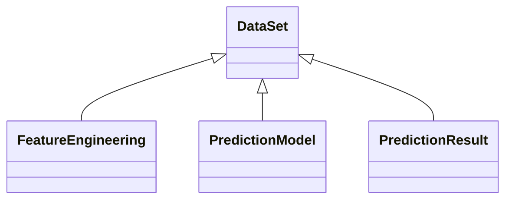
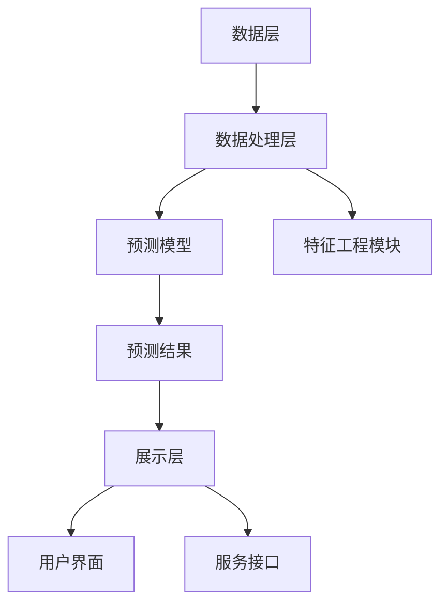
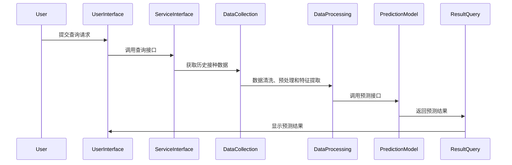

                 

### 提示词工程：处理时间序列预测任务

#### 关键词：时间序列预测，机器学习，深度学习，算法原理，系统架构设计，项目实战

#### 摘要：

本文旨在深入探讨时间序列预测任务中的提示词工程方法。首先，文章简要介绍了时间序列预测的背景及其重要性，包括其在金融市场、供应链管理、智能家居等领域的应用。接着，文章详细描述了时间序列数据的特性、预测目标的选择以及数据集的获取与预处理过程。

在核心概念与联系部分，文章分析了时间序列预测的数学模型、常见算法以及与统计学、人工智能的联系，并提供了时间序列预测的ER实体关系图。接下来，文章详细讲解了常见的时间序列预测算法，如ARIMA和LSTM，以及基于深度学习的预测算法，如GRU和CNN，并分析了各算法的优缺点和适用场景。

在系统分析与架构设计方案部分，文章介绍了问题场景、系统功能设计、系统架构设计、系统接口设计以及系统交互流程。然后，通过一个实际的项目实战案例，详细介绍了环境安装、系统核心实现、代码应用解读与分析等内容。

最后，文章提供了最佳实践技巧、小结、注意事项和拓展阅读，为读者提供深入了解和实战时间序列预测任务的方法和方向。

# 第一部分：背景介绍

## 1.1 问题背景

### 1.1.1 时间序列预测的重要性

时间序列预测是统计学、数据科学和机器学习中的重要研究领域。其主要目的是通过对历史时间序列数据的分析，对未来某一时间点的值进行预测。时间序列预测在许多领域都具有广泛的应用，例如：

1. **金融市场**：股票价格、汇率、市场指数等金融指标的时间序列预测对于投资决策、风险管理和市场分析至关重要。
2. **供应链管理**：通过预测销售量、库存水平等时间序列数据，企业可以优化库存管理，减少库存成本，提高供应链效率。
3. **智能家居**：智能家居设备通过收集家庭用电量、温度等时间序列数据，可以预测能耗模式，优化能源使用，提高居住舒适度。
4. **气象预测**：通过对气温、降雨量等时间序列数据的预测，可以为天气预报提供更准确的依据，减少自然灾害的风险。
5. **医疗健康**：通过分析患者的生理指标时间序列数据，如心率、血压等，可以预测疾病的发作趋势，提高医疗服务的精准性。

时间序列预测的重要性不仅体现在其广泛应用领域，还在于其对社会经济和人类生活质量的提升具有重要影响。有效的预测可以减少不确定性，提高决策的准确性，从而带来显著的经济和社会效益。

### 1.1.2 时间序列预测的应用领域

时间序列预测的应用领域广泛，涵盖了经济、工业、环境、医疗等多个行业。以下是一些具体的应用案例：

1. **经济领域**：股票市场的价格预测、宏观经济指标如GDP、通货膨胀率等的时间序列预测。
2. **工业领域**：生产过程中的质量检测、设备故障预测、产品需求预测等。
3. **环境领域**：气象数据（如温度、降雨量）的预测、水质监测、空气污染指数等时间序列数据的预测。
4. **交通领域**：交通流量预测、公共交通需求的预测、交通事故的预测等。
5. **医疗领域**：疾病的发病率预测、药物疗效评估、患者健康状态监测等。

每个应用领域都有其独特的需求和数据特性，这使得时间序列预测方法需要根据具体场景进行定制化调整和优化。

### 1.1.3 时间序列预测面临的挑战

虽然时间序列预测在许多领域都有广泛的应用，但其在实际应用中仍然面临着一些挑战：

1. **数据质量**：时间序列数据通常包含噪声、异常值和缺失值，这些都会影响预测的准确性。
2. **数据长度**：时间序列数据往往需要大量的历史数据来支持预测，而获取足够长度的数据可能成本高昂。
3. **模型选择**：不同时间序列数据特性可能需要不同类型的预测模型，选择合适的模型是一个挑战。
4. **预测精度**：时间序列数据通常包含季节性、趋势性和周期性，预测精度受这些特性的影响。
5. **实时性**：在某些应用场景中，如金融市场和交通领域，预测的实时性要求很高，这对算法的效率和准确性提出了更高要求。

了解这些挑战有助于更好地理解和解决时间序列预测问题，为未来的研究和应用提供指导。

## 1.2 问题描述

### 1.2.1 时间序列数据的特性

时间序列数据是一组按时间顺序排列的数据点，其特性主要包括以下几个方面：

1. **趋势性**：时间序列数据通常会表现出长期的增长或下降趋势。
2. **季节性**：时间序列数据可能会因季节因素（如节假日、天气变化）而表现出周期性的波动。
3. **周期性**：时间序列数据可能会出现固定的周期性波动，如经济周期的波动。
4. **平稳性**：时间序列数据可以分为平稳和非平稳，平稳序列的特性不随时间改变，非平稳序列的特性则随时间变化。
5. **噪声**：时间序列数据中常常包含噪声，这些噪声可能是随机的或与数据特性无关的。

这些特性使得时间序列预测具有复杂性和多样性，需要选择合适的模型和方法进行预测。

### 1.2.2 预测目标的选择

时间序列预测的目的是预测未来某一时间点的值。根据应用场景的不同，预测目标可以有以下几种：

1. **单一变量预测**：预测时间序列中的下一个值，如股票价格、温度等。
2. **多变量预测**：预测多个相关变量之间的关系，如预测股票市场的多个指数。
3. **序列预测**：预测一段时间内的连续多个时间点的值，如天气预报。
4. **分类预测**：将时间序列数据分类到不同的类别，如疾病诊断、信用卡欺诈检测等。

选择合适的预测目标对于模型的构建和预测结果的解释具有重要意义。

### 1.2.3 数据集的获取与预处理

获取高质量的时间序列数据是进行预测的基础。数据集的来源可以是公开数据集、企业内部数据或传感器数据。获取数据后，通常需要进行以下预处理步骤：

1. **数据清洗**：去除数据中的噪声、异常值和缺失值，提高数据质量。
2. **特征工程**：通过变换、组合或提取新的特征，增强模型对数据的理解能力。
3. **归一化**：将数据缩放到一个统一的范围，如0到1或-1到1，以避免不同特征间的量级差异影响模型训练。
4. **数据分割**：将数据集分为训练集、验证集和测试集，用于模型的训练和评估。

这些预处理步骤对于模型的训练和预测效果具有重要影响。

## 1.3 问题解决

### 1.3.1 常见的时间序列预测算法

在时间序列预测中，有许多经典的算法被广泛应用，包括以下几种：

1. **ARIMA算法**：自回归积分滑动平均模型（Autoregressive Integrated Moving Average），适用于平稳序列的预测。
2. **SARIMA算法**：季节性自回归积分滑动平均模型（Seasonal Autoregressive Integrated Moving Average），适用于具有季节性的时间序列数据。
3. **ARIMA-MARKOV模型**：结合自回归和马尔可夫模型的混合模型，适用于非线性时间序列数据。
4. **LSTM算法**：长短期记忆网络（Long Short-Term Memory），一种深度学习模型，适用于处理具有长期依赖关系的时间序列数据。
5. **GRU算法**：门控循环单元（Gated Recurrent Unit），LSTM的一种变种，适用于时间序列数据的预测。
6. **CNN算法**：卷积神经网络（Convolutional Neural Network），适用于图像处理，但也可以用于时间序列数据的特征提取。

这些算法各有优缺点，适用于不同的场景和数据特性。

### 1.3.2 基于机器学习的预测方法

基于机器学习的预测方法包括以下几种：

1. **线性回归**：一种简单的预测方法，适用于线性关系较强的时间序列数据。
2. **支持向量机（SVM）**：适用于非线性关系的预测，需要高维特征空间的支持。
3. **决策树和随机森林**：用于分类和回归任务，具有解释性，但易过拟合。
4. **梯度提升树（GBDT）**：通过迭代提升回归和分类模型的性能，适用于高维数据。
5. **集成学习方法**：如Bagging、Boosting和Stacking，通过组合多个模型提高预测性能。

这些方法在时间序列预测中具有较好的表现，但也需要根据具体数据特性进行调整。

### 1.3.3 基于深度学习的预测方法

基于深度学习的预测方法具有强大的表示能力和适应性，适用于复杂的时间序列数据：

1. **循环神经网络（RNN）**：包括LSTM和GRU等模型，能够处理长序列依赖。
2. **卷积神经网络（CNN）**：通过卷积操作提取时间序列数据的特征。
3. **变分自编码器（VAE）**：用于时间序列数据的生成和预测。
4. **生成对抗网络（GAN）**：通过生成器和判别器的对抗训练，实现高质量的时间序列预测。

这些方法在处理复杂、非线性时间序列数据时表现出色，但也需要大量数据和计算资源。

### 1.4 边界与外延

#### 1.4.1 时间序列预测的边界

时间序列预测有其固有的局限性，包括：

1. **数据依赖**：预测结果依赖于历史数据，如果历史数据不完整或质量差，预测结果可能会受到很大影响。
2. **模型限制**：现有模型和方法可能无法处理所有类型的时间序列数据，尤其是在非线性、多变量和时间依赖性较强的场景。
3. **实时性要求**：在某些应用场景中，如金融市场和交通领域，预测的实时性要求很高，但目前的算法和方法可能无法满足。

了解这些边界有助于设定合理的期望，并寻找可能的解决方案。

#### 1.4.2 时间序列预测的外延

时间序列预测在许多领域都有广泛的应用，包括但不限于：

1. **金融市场**：除了股票、汇率等传统金融指标，还可以应用于加密货币、期货等新兴市场。
2. **工业生产**：预测设备故障、生产需求、质量控制等，提高生产效率和产品质量。
3. **智能交通**：预测交通流量、拥堵状况，优化交通信号控制，减少交通拥堵。
4. **医疗健康**：预测疾病发作、患者需求，优化医疗服务和资源分配。
5. **环境监测**：预测气象变化、水质污染等，为环境保护和灾害预防提供支持。

这些外延应用展示了时间序列预测的潜力和重要性。

### 1.5 概念结构与核心要素组成

#### 1.5.1 时间序列预测的核心概念

时间序列预测涉及多个核心概念，包括：

1. **自回归（AR）**：利用历史数据进行预测。
2. **移动平均（MA）**：利用过去一段时间内的平均值进行预测。
3. **自回归移动平均（ARMA）**：结合自回归和移动平均进行预测。
4. **自回归积分移动平均（ARIMA）**：对时间序列进行差分处理，然后应用ARMA模型。
5. **LSTM**：长短期记忆网络，用于处理长序列依赖。
6. **GRU**：门控循环单元，LSTM的改进版本。
7. **CNN**：卷积神经网络，用于特征提取。

这些概念是构建时间序列预测模型的基础。

#### 1.5.2 时间序列预测的要素组成

时间序列预测的要素包括：

1. **数据集**：包含历史时间序列数据。
2. **模型**：用于预测的算法，如ARIMA、LSTM、CNN等。
3. **特征**：用于模型训练的特征，包括原始数据和通过特征工程生成的特征。
4. **评估指标**：用于评估模型预测性能的指标，如均方误差（MSE）、平均绝对误差（MAE）等。
5. **预处理步骤**：包括数据清洗、归一化、特征工程等。

这些要素共同构成了时间序列预测的系统架构。

# 第二部分：核心概念与联系

## 2.1 时间序列预测原理

### 2.1.1 时间序列预测的数学模型

时间序列预测的核心在于建立数学模型来描述时间序列数据的特性。常见的数学模型包括：

1. **AR模型**（自回归模型）：使用过去的观测值来预测未来的值，公式为：
   $$ 
   X_t = c + \sum_{i=1}^{p} \phi_i X_{t-i} + \varepsilon_t 
   $$
   其中，$X_t$ 是当前时间点的观测值，$\phi_i$ 是自回归系数，$c$ 是常数项，$\varepsilon_t$ 是误差项。

2. **MA模型**（移动平均模型）：使用过去预测误差的加权平均来预测未来的值，公式为：
   $$
   X_t = c + \varepsilon_t + \sum_{i=1}^{q} \theta_i \varepsilon_{t-i}
   $$
   其中，$\theta_i$ 是移动平均系数，$\varepsilon_t$ 是误差项。

3. **ARMA模型**（自回归移动平均模型）：结合AR和MA模型的特点，公式为：
   $$
   X_t = c + \sum_{i=1}^{p} \phi_i X_{t-i} + \sum_{j=1}^{q} \theta_j \varepsilon_{t-j}
   $$
   其中，$p$ 和 $q$ 分别是自回归和移动平均的阶数。

4. **ARIMA模型**（自回归积分移动平均模型）：对非平稳时间序列进行差分处理，使其变为平稳序列，然后应用ARMA模型，公式为：
   $$
   (1 - \phi_1 B)(1 - \theta_1 B)X_t = c + \varepsilon_t
   $$
   其中，$B$ 是滞后算子，$\phi_1$ 和 $\theta_1$ 分别是差分后的自回归和移动平均系数。

这些模型通过分析历史数据，预测未来的时间点值，是时间序列预测的基础。

### 2.1.2 时间序列预测的属性特征对比表格

以下是几种常见时间序列预测算法的属性特征对比表格：

| 算法名称 | 特性 | 适用场景 | 优点 | 缺点 |
| --- | --- | --- | --- | --- |
| ARIMA | 平稳序列 | 时间序列稳定 | 简单，适用广泛 | 对非线性序列效果较差 |
| SARIMA | 季节性时间序列 | 具有季节性特征 | 考虑季节性，适用广泛 | 复杂度较高，参数调整困难 |
| LSTM | 长期依赖 | 长期依赖关系 | 强处理能力，适用于复杂序列 | 训练时间较长，资源消耗大 |
| GRU | 长期依赖 | 长期依赖关系 | 训练时间较短，参数较少 | 处理复杂序列能力略逊于LSTM |
| CNN | 特征提取 | 特征提取 | 适用于图像处理，也可用于时间序列特征提取 | 时间序列处理能力有限 |

通过对比表格，我们可以更好地了解各种算法的适用场景和优缺点，从而选择合适的算法进行时间序列预测。

## 2.2 时间序列预测算法介绍

### 2.2.1 传统时间序列预测算法

传统时间序列预测算法主要包括ARIMA模型和SARIMA模型，它们是基于线性模型的方法，适用于处理平稳时间序列数据。

1. **ARIMA模型**：
   - **定义**：ARIMA模型结合了自回归（AR）、差分（I）和移动平均（MA）的特点，用于预测平稳时间序列数据。
   - **公式**：
     $$
     (1 - \phi_1 B)(1 - \theta_1 B)X_t = c + \varepsilon_t
     $$
     其中，$B$ 是滞后算子，$\phi_1$ 和 $\theta_1$ 分别是自回归和移动平均系数，$c$ 是常数项，$X_t$ 是当前时间点的观测值，$\varepsilon_t$ 是误差项。
   - **优缺点**：ARIMA模型简单易用，适用于平稳序列；但处理非线性序列效果较差。

2. **SARIMA模型**：
   - **定义**：SARIMA模型是ARIMA模型的扩展，适用于具有季节性的时间序列数据。
   - **公式**：
     $$
     (1 - \phi_1 B)(1 - \theta_1 B)(1 - \Phi_1 B)(1 - \Theta_1 B)X_t = c + \varepsilon_t
     $$
     其中，$\Phi_1$ 和 $\Theta_1$ 分别是季节性自回归和移动平均系数，其他符号与ARIMA模型相同。
   - **优缺点**：SARIMA模型考虑季节性因素，适用范围更广；但参数较多，调整复杂。

### 2.2.2 基于机器学习的预测算法

基于机器学习的预测算法具有更高的灵活性和更强的非线性处理能力，适用于处理复杂的时间序列数据。

1. **线性回归**：
   - **定义**：线性回归模型通过拟合一条直线来预测时间序列数据。
   - **公式**：
     $$
     Y_t = \beta_0 + \beta_1 X_t + \varepsilon_t
     $$
     其中，$Y_t$ 是预测值，$X_t$ 是自变量，$\beta_0$ 和 $\beta_1$ 是模型参数，$\varepsilon_t$ 是误差项。
   - **优缺点**：线性回归简单直观，适用于线性关系较强的序列；但处理非线性序列效果较差。

2. **支持向量机（SVM）**：
   - **定义**：支持向量机通过构建超平面来划分数据，可以用于时间序列数据的分类和回归。
   - **公式**：
     $$
     w \cdot x + b = 0
     $$
     其中，$w$ 是权重向量，$x$ 是特征向量，$b$ 是偏置项。
   - **优缺点**：SVM适用于非线性关系，但需要高维特征空间，计算复杂度高。

3. **决策树和随机森林**：
   - **定义**：决策树通过一系列判断规则来预测时间序列数据，随机森林是其集成方法，通过组合多个决策树提高预测性能。
   - **公式**：各节点根据特征和阈值进行划分，直至满足终止条件。
   - **优缺点**：决策树和随机森林具有解释性，但易过拟合。

4. **梯度提升树（GBDT）**：
   - **定义**：梯度提升树通过迭代提升回归和分类模型的性能，适用于高维数据。
   - **公式**：
     $$
     f_{\text{new}}(x) = f_{\text{base}}(x) + \sum_{i=1}^{T} \alpha_i \cdot h_i(x)
     $$
     其中，$f_{\text{new}}$ 是新模型，$f_{\text{base}}$ 是基模型，$\alpha_i$ 是提升系数，$h_i(x)$ 是基模型的预测。
   - **优缺点**：GBDT性能优异，适用于高维数据，但参数较多，需要调优。

### 2.2.3 基于深度学习的预测算法

基于深度学习的预测算法具有强大的表示能力和适应性，适用于复杂的时间序列数据。

1. **循环神经网络（RNN）**：
   - **定义**：循环神经网络是一种基于序列数据的神经网络，能够处理长序列依赖。
   - **公式**：
     $$
     h_t = \sigma(W_h \cdot [h_{t-1}, x_t] + b_h)
     $$
     其中，$h_t$ 是当前时间点的隐藏状态，$x_t$ 是输入特征，$\sigma$ 是激活函数，$W_h$ 和 $b_h$ 是模型参数。
   - **优缺点**：RNN处理长序列依赖能力强，但存在梯度消失和梯度爆炸问题。

2. **长短期记忆网络（LSTM）**：
   - **定义**：LSTM是一种改进的循环神经网络，能够更好地处理长序列依赖。
   - **公式**：
     $$
     i_t = \sigma(W_i \cdot [h_{t-1}, x_t] + b_i)
     $$
     $$
     f_t = \sigma(W_f \cdot [h_{t-1}, x_t] + b_f)
     $$
     $$
     o_t = \sigma(W_o \cdot [h_{t-1}, x_t] + b_o)
     $$
     $$
     C_t = f_t \odot C_{t-1} + i_t \odot \sigma(W_c \cdot [h_{t-1}, x_t] + b_c)
     $$
     $$
     h_t = o_t \odot C_t
     $$
     其中，$i_t$、$f_t$、$o_t$ 分别是输入门、遗忘门和输出门，$C_t$ 是细胞状态，$C_{t-1}$ 是前一个时间点的细胞状态。
   - **优缺点**：LSTM有效解决了RNN的梯度消失问题，适用于复杂序列，但参数较多，训练时间较长。

3. **门控循环单元（GRU）**：
   - **定义**：GRU是一种简化的LSTM，具有较少的参数和更简单的结构。
   - **公式**：
     $$
     z_t = \sigma(W_z \cdot [h_{t-1}, x_t] + b_z)
     $$
     $$
     r_t = \sigma(W_r \cdot [h_{t-1}, x_t] + b_r)
     $$
     $$
     h_t = \text{tanh}(W_h \cdot ([1 - z_t] \odot h_{t-1} + r_t \odot x_t) + b_h)
     $$
     其中，$z_t$ 是更新门，$r_t$ 是重置门。
   - **优缺点**：GRU结构简单，参数较少，训练时间较短，处理复杂序列能力略逊于LSTM。

4. **卷积神经网络（CNN）**：
   - **定义**：卷积神经网络是一种基于卷积操作的神经网络，适用于特征提取。
   - **公式**：
     $$
     h_t = \text{ReLU}(W \cdot h_{t-1} + b)
     $$
     $$
     h_t = h_t \odot \text{softmax}(W_h \cdot h_t + b_h)
     $$
     其中，$W$ 是卷积核，$h_t$ 是当前时间点的特征向量，$\text{ReLU}$ 是激活函数，$W_h$ 和 $b_h$ 是全连接层的权重和偏置。
   - **优缺点**：CNN具有强大的特征提取能力，但时间序列处理能力有限。

## 2.3 时间序列预测算法的比较

### 2.3.1 算法性能指标

不同时间序列预测算法的性能可以通过多种指标进行评估，主要包括：

1. **均方误差（MSE）**：
   $$
   MSE = \frac{1}{n} \sum_{i=1}^{n} (y_i - \hat{y}_i)^2
   $$
   其中，$y_i$ 是实际值，$\hat{y}_i$ 是预测值，$n$ 是数据点的数量。

2. **平均绝对误差（MAE）**：
   $$
   MAE = \frac{1}{n} \sum_{i=1}^{n} |y_i - \hat{y}_i|
   $$
   其中，$| |$ 表示绝对值运算。

3. **均方根误差（RMSE）**：
   $$
   RMSE = \sqrt{MSE}
   $$
   RMSE是MSE的平方根，具有更好的解释性。

4. **精确率、召回率和F1分数**：这些指标主要用于分类任务，但也可以用于时间序列分类任务。

### 2.3.2 算法适用场景

不同时间序列预测算法适用于不同的场景和问题：

1. **ARIMA和SARIMA**：
   - **适用场景**：平稳或具有季节性特征的时间序列数据，如金融市场的日收盘价。
   - **优点**：简单，适用于稳定序列。
   - **缺点**：处理非线性序列效果较差。

2. **线性回归**：
   - **适用场景**：线性关系较强的时间序列数据，如股票价格的线性趋势。
   - **优点**：简单直观，计算效率高。
   - **缺点**：处理非线性序列效果较差。

3. **支持向量机（SVM）**：
   - **适用场景**：非线性关系的时间序列数据，如非线性趋势的股票价格。
   - **优点**：适用于非线性数据，具有较好的泛化能力。
   - **缺点**：需要高维特征空间，计算复杂度高。

4. **决策树和随机森林**：
   - **适用场景**：具有非线性关系的时间序列数据，如电力需求的非线性变化。
   - **优点**：具有解释性，适用于非线性数据。
   - **缺点**：易过拟合，参数较多。

5. **梯度提升树（GBDT）**：
   - **适用场景**：高维特征空间的时间序列数据，如复杂的多变量时间序列预测。
   - **优点**：性能优异，适用于高维数据。
   - **缺点**：参数较多，需要调优。

6. **LSTM和GRU**：
   - **适用场景**：长序列依赖的时间序列数据，如股票价格中的长期趋势。
   - **优点**：处理长序列依赖能力强，适用于复杂序列。
   - **缺点**：训练时间较长，资源消耗大。

7. **CNN**：
   - **适用场景**：特征提取和图像处理，也可用于时间序列数据的特征提取。
   - **优点**：具有强大的特征提取能力。
   - **缺点**：时间序列处理能力有限。

### 2.3.3 算法优缺点分析

以下是各算法的优缺点分析：

| 算法名称 | 优点 | 缺点 |
| --- | --- | --- |
| ARIMA | 简单，适用广泛 | 对非线性序列效果较差 |
| SARIMA | 考虑季节性，适用广泛 | 复杂度较高，参数调整困难 |
| 线性回归 | 简单直观，计算效率高 | 处理非线性序列效果较差 |
| 支持向量机（SVM） | 适用于非线性数据，具有较好的泛化能力 | 需要高维特征空间，计算复杂度高 |
| 决策树和随机森林 | 具有解释性，适用于非线性数据 | 易过拟合，参数较多 |
| 梯度提升树（GBDT） | 性能优异，适用于高维数据 | 参数较多，需要调优 |
| LSTM | 处理长序列依赖能力强，适用于复杂序列 | 训练时间较长，资源消耗大 |
| GRU | 结构简单，训练时间较短 | 处理复杂序列能力略逊于LSTM |
| CNN | 具有强大的特征提取能力 | 时间序列处理能力有限 |

通过上述分析，我们可以根据具体问题和数据特性选择合适的算法进行时间序列预测。

## 2.4 时间序列预测与相关领域的联系

### 2.4.1 时间序列预测与统计学的联系

时间序列预测与统计学有着密切的联系，许多经典的统计方法也被应用于时间序列预测。以下是时间序列预测与统计学之间的几个关键联系：

1. **ARIMA模型**：ARIMA模型是自回归积分移动平均模型，是统计学中用于时间序列分析的经典方法。它基于统计学中的自回归移动平均（ARMA）模型，通过对时间序列进行差分处理使其平稳，然后应用ARMA模型进行预测。

2. **回归分析**：在时间序列预测中，回归分析常用于建立预测模型，如线性回归和广义线性模型。回归分析通过拟合数据点之间的关系，预测未来的值。

3. **假设检验**：在时间序列预测中，统计假设检验用于验证模型的假设，如序列的平稳性、自相关性和白噪声性。这些假设的验证有助于确定模型的选择和参数的设置。

4. **时间序列分析**：时间序列分析是统计学的一个分支，研究时间序列数据的结构和特性。ARIMA模型、自回归积分移动平均模型（SARIMA）和自回归相关移动平均模型（ARIMA-MARKOV）都是时间序列分析的方法。

### 2.4.2 时间序列预测与人工智能的联系

时间序列预测是人工智能领域的一个重要分支，许多人工智能方法也被应用于时间序列预测。以下是时间序列预测与人工智能之间的几个关键联系：

1. **循环神经网络（RNN）**：RNN是一种基于序列数据的神经网络，能够处理长序列依赖。LSTM和GRU是RNN的改进版本，被广泛应用于时间序列预测。

2. **深度学习**：深度学习是一种基于多层神经网络的学习方法，具有强大的特征提取和表示能力。卷积神经网络（CNN）和变分自编码器（VAE）等深度学习模型被用于时间序列数据的特征提取和生成。

3. **生成对抗网络（GAN）**：GAN是一种基于生成器和判别器的对抗训练方法，可以生成高质量的时间序列数据，用于训练和评估预测模型。

4. **强化学习**：强化学习是一种通过交互式学习环境进行学习的方法，可以应用于动态时间序列预测。强化学习通过奖励机制优化预测策略，提高预测准确性。

5. **神经网络优化算法**：如随机梯度下降（SGD）、Adam优化器等，用于训练深度学习模型，优化模型参数。

通过这些联系，我们可以看到时间序列预测如何结合统计学和人工智能方法，提高预测的准确性和效率。

## 2.5 时间序列预测的ER实体关系图

### 2.5.1 时间序列预测的实体

时间序列预测涉及多个核心实体，包括数据集、特征、模型、预测结果等。以下是这些实体的描述：

1. **数据集**：包含历史时间序列数据的集合，用于训练和评估预测模型。
2. **特征**：从原始数据中提取的有用信息，用于训练模型。
3. **模型**：用于预测未来值的算法，如ARIMA、LSTM等。
4. **预测结果**：模型对未来的预测值，用于评估模型性能。

### 2.5.2 时间序列预测的关系

时间序列预测中的关系包括以下几种：

1. **依赖关系**：数据集和特征之间存在依赖关系，特征是从数据集中提取的。
2. **训练关系**：特征和模型之间存在训练关系，模型通过特征进行训练。
3. **预测关系**：模型和预测结果之间存在预测关系，模型通过训练得到的参数对未来的数据进行预测。

### 2.5.3 时间序列预测的ER图示例

以下是一个时间序列预测的ER图示例，展示了各实体和关系：

```mermaid
erDiagram
  数据集 ||--|{ 特征 } : 从数据集中提取
  模型 ||--|{ 预测结果 } : 模型预测得到
  数据集 ||--|{ 模型 } : 模型训练数据集
```

该ER图清晰地展示了时间序列预测中的核心实体和它们之间的关系，有助于理解和设计时间序列预测系统。

# 第三部分：算法原理讲解

## 3.1 算法原理概述

### 3.1.1 时间序列预测的基本流程

时间序列预测的基本流程可以分为以下几个步骤：

1. **数据收集**：收集历史时间序列数据，数据来源可以是公开数据集、企业内部数据或传感器数据。

2. **数据预处理**：对收集到的数据进行清洗、归一化和特征工程等预处理步骤，以提高数据质量和模型的预测性能。

3. **模型选择**：根据时间序列数据的特性和预测目标，选择合适的预测模型。常见的模型包括ARIMA、LSTM、GRU、CNN等。

4. **模型训练**：使用预处理后的数据对选择的模型进行训练，通过迭代优化模型参数，使其能够对时间序列数据进行准确预测。

5. **模型评估**：使用验证集或测试集对训练好的模型进行评估，常用的评估指标包括MSE、RMSE、MAE等。

6. **模型部署**：将训练好的模型部署到生产环境中，对新的数据进行预测。

### 3.1.2 预测误差的评估方法

预测误差是评估时间序列预测模型性能的重要指标。以下是一些常见的预测误差评估方法：

1. **均方误差（MSE）**：MSE是预测值和实际值之差的平方的平均值，用于衡量预测误差的大小。公式为：
   $$
   MSE = \frac{1}{n} \sum_{i=1}^{n} (\hat{y}_i - y_i)^2
   $$
   其中，$\hat{y}_i$ 是预测值，$y_i$ 是实际值，$n$ 是数据点的数量。

2. **均方根误差（RMSE）**：RMSE是MSE的平方根，具有更好的解释性。公式为：
   $$
   RMSE = \sqrt{MSE}
   $$

3. **平均绝对误差（MAE）**：MAE是预测值和实际值之差的绝对值的平均值，用于衡量预测误差的绝对大小。公式为：
   $$
   MAE = \frac{1}{n} \sum_{i=1}^{n} |\hat{y}_i - y_i|
   $$

4. **精确率和召回率**：这些指标主要用于分类任务，但也可以用于时间序列分类任务的评估。精确率是正确预测为正例的样本数占总预测为正例的样本数的比例，召回率是正确预测为正例的样本数占总实际为正例的样本数的比例。

通过上述评估方法，可以全面了解时间序列预测模型的性能，并据此进行模型优化和调整。

## 3.2 常见时间序列预测算法讲解

### 3.2.1 ARIMA算法

#### 3.2.1.1 算法原理

ARIMA算法，全称为自回归积分滑动平均模型（Autoregressive Integrated Moving Average），是一种经典的统计模型，用于时间序列数据的预测。ARIMA算法的核心思想是利用历史数据中的相关性来预测未来值。

1. **自回归（AR）**：自回归模型通过过去值来预测当前值。公式为：
   $$
   X_t = c + \phi_1 X_{t-1} + \phi_2 X_{t-2} + \ldots + \phi_p X_{t-p} + \varepsilon_t
   $$
   其中，$X_t$ 是当前时间点的值，$\phi_1, \phi_2, \ldots, \phi_p$ 是自回归系数，$c$ 是常数项，$\varepsilon_t$ 是误差项。

2. **移动平均（MA）**：移动平均模型通过过去预测误差的加权平均来预测当前值。公式为：
   $$
   X_t = c + \varepsilon_t + \theta_1 \varepsilon_{t-1} + \theta_2 \varepsilon_{t-2} + \ldots + \theta_q \varepsilon_{t-q}
   $$
   其中，$\theta_1, \theta_2, \ldots, \theta_q$ 是移动平均系数，$\varepsilon_t$ 是误差项。

3. **自回归移动平均（ARMA）**：结合自回归和移动平均的特点，公式为：
   $$
   X_t = c + \phi_1 X_{t-1} + \phi_2 X_{t-2} + \ldots + \phi_p X_{t-p} + \theta_1 \varepsilon_{t-1} + \theta_2 \varepsilon_{t-2} + \ldots + \theta_q \varepsilon_{t-q}
   $$

4. **自回归积分滑动平均（ARIMA）**：对于非平稳序列，需要进行差分处理，使其变为平稳序列，然后应用ARMA模型。差分公式为：
   $$
   (1 - \phi_1 B)(1 - \theta_1 B)X_t = c + \varepsilon_t
   $$
   其中，$B$ 是滞后算子，$\phi_1, \theta_1$ 是差分后的自回归和移动平均系数。

#### 3.2.1.2 算法流程

ARIMA算法的基本流程如下：

1. **数据预处理**：对时间序列数据进行预处理，包括数据清洗、缺失值填充、异常值处理等。
2. **平稳性检验**：检查时间序列数据的平稳性，如果数据是非平稳的，进行差分处理。
3. **模型识别**：根据数据特性选择合适的ARIMA模型阶数$p$和$q$。
4. **模型估计**：估计模型参数$\phi_1, \phi_2, \ldots, \phi_p, \theta_1, \theta_2, \ldots, \theta_q$。
5. **模型检验**：对模型进行拟合优度检验，如AIC、BIC等指标。
6. **模型预测**：使用训练好的模型对未来的数据进行预测。

#### 3.2.1.3 数学模型

ARIMA模型的数学模型如下：

1. **差分变换**：
   $$
   (1 - \phi_1 B)(1 - \theta_1 B)X_t = c + \varepsilon_t
   $$
   其中，$B$ 是滞后算子，$\phi_1, \theta_1$ 是差分后的自回归和移动平均系数。

2. **自回归部分**：
   $$
   X_t = c + \phi_1 X_{t-1} + \phi_2 X_{t-2} + \ldots + \phi_p X_{t-p}
   $$

3. **移动平均部分**：
   $$
   X_t = c + \varepsilon_t + \theta_1 \varepsilon_{t-1} + \theta_2 \varepsilon_{t-2} + \ldots + \theta_q \varepsilon_{t-q}
   $$

4. **综合模型**：
   $$
   X_t = c + \phi_1 X_{t-1} + \phi_2 X_{t-2} + \ldots + \phi_p X_{t-p} + \theta_1 \varepsilon_{t-1} + \theta_2 \varepsilon_{t-2} + \ldots + \theta_q \varepsilon_{t-q}
   $$

#### 3.2.1.4 举例说明

假设我们有以下时间序列数据：

| 时间 | 数据值 |
| ---- | ------ |
| 1    | 10     |
| 2    | 12     |
| 3    | 14     |
| 4    | 15     |
| 5    | 17     |
| 6    | 19     |

首先，对数据进行平稳性检验，如果数据是非平稳的，需要进行差分处理。假设数据是平稳的，我们选择$p=2$和$q=1$的ARIMA模型进行预测。

1. **自回归部分**：
   $$
   X_t = c + \phi_1 X_{t-1} + \phi_2 X_{t-2}
   $$
   假设$\phi_1=0.5$，$\phi_2=0.3$，$c=0.2$。

2. **移动平均部分**：
   $$
   X_t = c + \varepsilon_t + \theta_1 \varepsilon_{t-1}
   $$
   假设$\theta_1=0.4$，$c=0.2$。

3. **综合模型**：
   $$
   X_t = c + \phi_1 X_{t-1} + \phi_2 X_{t-2} + \theta_1 \varepsilon_{t-1}
   $$
   将参数代入模型，得到：
   $$
   X_t = 0.2 + 0.5X_{t-1} + 0.3X_{t-2} + 0.4 \varepsilon_{t-1}
   $$

使用这个模型，我们可以预测第7个时间点的数据值：

$$
X_7 = 0.2 + 0.5 \times 19 + 0.3 \times 17 + 0.4 \times (19 - 17) \approx 20.8
$$

通过这个例子，我们可以看到ARIMA模型的基本原理和预测方法。

### 3.2.2 LSTM算法

#### 3.2.2.1 算法原理

LSTM（Long Short-Term Memory）是一种用于处理序列数据的长短期记忆网络，由Hochreiter和Schmidhuber于1997年提出。LSTM旨在解决传统RNN模型在处理长序列依赖时的梯度消失和梯度爆炸问题。

LSTM的基本结构包括三个门：输入门、遗忘门和输出门，以及一个细胞状态。以下是LSTM的原理：

1. **输入门**（Input Gate）：
   - **计算当前输入和前一隐藏状态的加权融合**：
     $$
     i_t = \sigma(W_i \cdot [h_{t-1}, x_t] + b_i)
     $$
   - **更新细胞状态**：
     $$
     \tilde{C}_t = \text{tanh}(W_C \cdot [h_{t-1}, x_t] + b_C)
     $$
   - **计算输入门控制细胞状态的更新**：
     $$
     f_t = \sigma(W_f \cdot [h_{t-1}, x_t] + b_f)
     $$
     $$
     C_t = f_t \odot C_{t-1} + i_t \odot \tilde{C}_t
     $$

2. **遗忘门**（Forget Gate）：
   - **计算遗忘门**：
     $$
     o_t = \sigma(W_o \cdot [h_{t-1}, x_t] + b_o)
     $$
   - **更新细胞状态**：
     $$
     C_t = o_t \odot \text{tanh}(C_{t-1})
     $$

3. **输出门**（Output Gate）：
   - **计算输出门**：
     $$
     g_t = \sigma(W_g \cdot [h_{t-1}, x_t] + b_g)
     $$
   - **生成当前隐藏状态**：
     $$
     h_t = g_t \odot \text{tanh}(C_t)
     $$

通过这三个门，LSTM能够有效地控制信息的流动，保持长期的依赖关系。

#### 3.2.2.2 算法流程

LSTM算法的基本流程如下：

1. **初始化**：初始化隐藏状态$h_0$和细胞状态$C_0$。
2. **输入序列处理**：对于输入序列的每个时间点，计算输入门、遗忘门和输出门，更新细胞状态和隐藏状态。
3. **输出生成**：使用最后一个隐藏状态生成预测输出。

#### 3.2.2.3 数学模型

LSTM的数学模型如下：

1. **输入门**：
   $$
   i_t = \sigma(W_i \cdot [h_{t-1}, x_t] + b_i)
   $$
   $$
   \tilde{C}_t = \text{tanh}(W_C \cdot [h_{t-1}, x_t] + b_C)
   $$
   $$
   f_t = \sigma(W_f \cdot [h_{t-1}, x_t] + b_f)
   $$
   $$
   C_t = f_t \odot C_{t-1} + i_t \odot \tilde{C}_t
   $$

2. **遗忘门**：
   $$
   o_t = \sigma(W_o \cdot [h_{t-1}, x_t] + b_o)
   $$
   $$
   C_t = o_t \odot \text{tanh}(C_{t-1})
   $$

3. **输出门**：
   $$
   g_t = \sigma(W_g \cdot [h_{t-1}, x_t] + b_g)
   $$
   $$
   h_t = g_t \odot \text{tanh}(C_t)
   $$

#### 3.2.2.4 举例说明

假设我们有一个简单的输入序列$x_t$，其中$t=1,2,3$，对应的隐藏状态为$h_t$和细胞状态为$C_t$。

1. **初始化**：
   $$
   h_0 = [0, 0], C_0 = [0, 0]
   $$

2. **第1个时间点**：
   - **输入门**：
     $$
     i_1 = \sigma([0, 0] \cdot [1, 2] + [0, 0]) = \sigma([0, 0]) = 0
     $$
     $$
     \tilde{C}_1 = \text{tanh}([0, 0] \cdot [1, 2] + [0, 0]) = \text{tanh}([0, 0]) = 0
     $$
     $$
     f_1 = \sigma([0, 0] \cdot [1, 2] + [0, 0]) = \sigma([0, 0]) = 0
     $$
     $$
     C_1 = 0 \odot [0, 0] + 0 \odot 0 = [0, 0]
     $$
   - **遗忘门**：
     $$
     o_1 = \sigma([0, 0] \cdot [1, 2] + [0, 0]) = \sigma([0, 0]) = 0
     $$
     $$
     C_1 = 0 \odot \text{tanh}([0, 0]) = [0, 0]
     $$
   - **输出门**：
     $$
     g_1 = \sigma([0, 0] \cdot [1, 2] + [0, 0]) = \sigma([0, 0]) = 0
     $$
     $$
     h_1 = 0 \odot \text{tanh}([0, 0]) = 0
     $$

3. **第2个时间点**：
   - **输入门**：
     $$
     i_2 = \sigma([0, 0] \cdot [2, 3] + [0, 0]) = \sigma([0, 0]) = 0
     $$
     $$
     \tilde{C}_2 = \text{tanh}([0, 0] \cdot [2, 3] + [0, 0]) = \text{tanh}([0, 0]) = 0
     $$
     $$
     f_2 = \sigma([0, 0] \cdot [2, 3] + [0, 0]) = \sigma([0, 0]) = 0
     $$
     $$
     C_2 = 0 \odot [0, 0] + 0 \odot 0 = [0, 0]
     $$
   - **遗忘门**：
     $$
     o_2 = \sigma([0, 0] \cdot [2, 3] + [0, 0]) = \sigma([0, 0]) = 0
     $$
     $$
     C_2 = 0 \odot \text{tanh}([0, 0]) = [0, 0]
     $$
   - **输出门**：
     $$
     g_2 = \sigma([0, 0] \cdot [2, 3] + [0, 0]) = \sigma([0, 0]) = 0
     $$
     $$
     h_2 = 0 \odot \text{tanh}([0, 0]) = 0
     $$

4. **第3个时间点**：
   - **输入门**：
     $$
     i_3 = \sigma([0, 0] \cdot [3, 4] + [0, 0]) = \sigma([0, 0]) = 0
     $$
     $$
     \tilde{C}_3 = \text{tanh}([0, 0] \cdot [3, 4] + [0, 0]) = \text{tanh}([0, 0]) = 0
     $$
     $$
     f_3 = \sigma([0, 0] \cdot [3, 4] + [0, 0]) = \sigma([0, 0]) = 0
     $$
     $$
     C_3 = 0 \odot [0, 0] + 0 \odot 0 = [0, 0]
     $$
   - **遗忘门**：
     $$
     o_3 = \sigma([0, 0] \cdot [3, 4] + [0, 0]) = \sigma([0, 0]) = 0
     $$
     $$
     C_3 = 0 \odot \text{tanh}([0, 0]) = [0, 0]
     $$
   - **输出门**：
     $$
     g_3 = \sigma([0, 0] \cdot [3, 4] + [0, 0]) = \sigma([0, 0]) = 0
     $$
     $$
     h_3 = 0 \odot \text{tanh}([0, 0]) = 0
     $$

通过这个简单的例子，我们可以看到LSTM如何处理输入序列并生成输出。

### 3.3 基于深度学习的预测算法讲解

#### 3.3.1 GRU算法

**3.3.1.1 算法原理**

GRU（Gated Recurrent Unit）是LSTM的一种改进版本，旨在减少参数数量和计算复杂度，同时保持良好的性能。GRU的核心思想是通过引入更新门和重置门，更好地控制信息的流动。

**1. 更新门（Update Gate）**：

更新门用于决定如何更新细胞状态。计算公式如下：

$$
z_t = \sigma(W_z \cdot [h_{t-1}, x_t] + b_z)
$$

其中，$z_t$ 表示更新门，$W_z$ 和 $b_z$ 是权重和偏置。

**2. 重置门（Reset Gate）**：

重置门用于决定如何重置细胞状态。计算公式如下：

$$
r_t = \sigma(W_r \cdot [h_{t-1}, x_t] + b_r)
$$

其中，$r_t$ 表示重置门，$W_r$ 和 $b_r$ 是权重和偏置。

**3. 细胞状态更新**：

通过更新门和重置门，细胞状态进行更新。计算公式如下：

$$
\tilde{C}_t = \text{tanh}(W_{C} \cdot ([1 - z_t] \odot h_{t-1} + r_t \odot x_t) + b_{C})$$

其中，$\tilde{C}_t$ 是候选细胞状态，$W_{C}$ 和 $b_{C}$ 是权重和偏置。

**4. 细胞状态**：

细胞状态更新后，使用更新门来决定新细胞状态。计算公式如下：

$$
C_t = z_t \odot C_{t-1} + (1 - z_t) \odot \tilde{C}_t
$$

其中，$C_t$ 是新细胞状态，$z_t$ 是更新门。

**5. 输出门**：

输出门用于决定如何更新隐藏状态。计算公式如下：

$$
h_t = \sigma(W_h \cdot (r_t \odot \text{tanh}(C_t)) + b_h)
$$

其中，$h_t$ 是新隐藏状态，$W_h$ 和 $b_h$ 是权重和偏置。

**3.3.1.2 算法流程**

GRU的算法流程可以分为以下步骤：

1. **初始化**：初始化隐藏状态 $h_0$ 和细胞状态 $C_0$。
2. **输入序列处理**：对于输入序列的每个时间点，计算更新门、重置门、候选细胞状态、细胞状态和隐藏状态。
3. **输出生成**：使用最后一个隐藏状态生成预测输出。

**3.3.1.3 数学模型**

GRU的数学模型如下：

$$
z_t = \sigma(W_z \cdot [h_{t-1}, x_t] + b_z)$$
$$
r_t = \sigma(W_r \cdot [h_{t-1}, x_t] + b_r)$$
$$
\tilde{C}_t = \text{tanh}(W_{C} \cdot ([1 - z_t] \odot h_{t-1} + r_t \odot x_t) + b_{C})$$
$$
C_t = z_t \odot C_{t-1} + (1 - z_t) \odot \tilde{C}_t$$
$$
h_t = \sigma(W_h \cdot (r_t \odot \text{tanh}(C_t)) + b_h)

**3.3.1.4 举例说明**

假设我们有一个简单的输入序列 $x_t$，其中 $t=1,2,3$，对应的隐藏状态为 $h_t$ 和细胞状态为 $C_t$。

**初始化**：

$$
h_0 = [0, 0], C_0 = [0, 0]
$$

**第1个时间点**：

1. **更新门**：

$$
z_1 = \sigma([0, 0] \cdot [1, 2] + [0, 0]) = \sigma([0, 0]) = 0
$$

2. **重置门**：

$$
r_1 = \sigma([0, 0] \cdot [1, 2] + [0, 0]) = \sigma([0, 0]) = 0
$$

3. **候选细胞状态**：

$$
\tilde{C}_1 = \text{tanh}([0, 0] \cdot [1, 2] + [0, 0]) = \text{tanh}([0, 0]) = 0
$$

4. **细胞状态**：

$$
C_1 = 0 \odot [0, 0] + 0 \odot 0 = [0, 0]
$$

5. **输出门**：

$$
h_1 = \sigma([0, 0] \cdot [0, 0] + [0, 0]) = \sigma([0, 0]) = 0
$$

**第2个时间点**：

1. **更新门**：

$$
z_2 = \sigma([0, 0] \cdot [2, 3] + [0, 0]) = \sigma([0, 0]) = 0
$$

2. **重置门**：

$$
r_2 = \sigma([0, 0] \cdot [2, 3] + [0, 0]) = \sigma([0, 0]) = 0
$$

3. **候选细胞状态**：

$$
\tilde{C}_2 = \text{tanh}([0, 0] \cdot [2, 3] + [0, 0]) = \text{tanh}([0, 0]) = 0
$$

4. **细胞状态**：

$$
C_2 = 0 \odot [0, 0] + 0 \odot 0 = [0, 0]
$$

5. **输出门**：

$$
h_2 = \sigma([0, 0] \cdot [0, 0] + [0, 0]) = \sigma([0, 0]) = 0
$$

**第3个时间点**：

1. **更新门**：

$$
z_3 = \sigma([0, 0] \cdot [3, 4] + [0, 0]) = \sigma([0, 0]) = 0
$$

2. **重置门**：

$$
r_3 = \sigma([0, 0] \cdot [3, 4] + [0, 0]) = \sigma([0, 0]) = 0
$$

3. **候选细胞状态**：

$$
\tilde{C}_3 = \text{tanh}([0, 0] \cdot [3, 4] + [0, 0]) = \text{tanh}([0, 0]) = 0
$$

4. **细胞状态**：

$$
C_3 = 0 \odot [0, 0] + 0 \odot 0 = [0, 0]
$$

5. **输出门**：

$$
h_3 = \sigma([0, 0] \cdot [0, 0] + [0, 0]) = \sigma([0, 0]) = 0
$$

通过这个简单的例子，我们可以看到GRU如何处理输入序列并生成输出。

#### 3.3.2 CNN算法

**3.3.2.1 算法原理**

卷积神经网络（CNN）是一种基于卷积操作的神经网络，最初用于图像处理。然而，CNN也被广泛应用于时间序列数据的特征提取和分类。CNN的核心思想是通过卷积操作提取时间序列数据中的局部特征，并通过池化操作减少数据的维度。

**1. 卷积操作**：

卷积操作用于提取时间序列数据中的局部特征。公式如下：

$$
h_{ij} = \sum_{k} w_{ik,j} x_k + b_j
$$

其中，$h_{ij}$ 表示第$i$层第$j$个神经元，$x_k$ 表示输入特征，$w_{ik,j}$ 表示权重，$b_j$ 表示偏置。

**2. 池化操作**：

池化操作用于减少数据的维度。常用的池化操作包括最大池化和平均池化。

**3. 激活函数**：

激活函数用于引入非线性特性。常用的激活函数包括ReLU函数、Sigmoid函数和Tanh函数。

**3.3.2.2 算法流程**

CNN的算法流程可以分为以下步骤：

1. **输入层**：输入时间序列数据。
2. **卷积层**：通过卷积操作提取时间序列数据中的特征。
3. **池化层**：通过池化操作减少数据的维度。
4. **全连接层**：将卷积层和池化层输出的特征进行全连接，得到预测结果。

**3.3.2.3 数学模型**

CNN的数学模型如下：

$$
h_{ij} = \sum_{k} w_{ik,j} x_k + b_j$$
$$
h_{ij} = \text{激活函数}(h_{ij})$$
$$
h_{k} = \sum_{i} w_{ik} h_{ij} + b_k$$
$$
y = \text{激活函数}(h_{k})

**3.3.2.4 举例说明**

假设我们有一个简单的时间序列数据，如下所示：

$$
x = [1, 2, 3, 4, 5]
$$

我们使用一个简单的CNN模型对其进行特征提取和分类。

1. **卷积层**：

假设我们使用一个大小为3×1的卷积核，其权重矩阵为：

$$
w = \begin{bmatrix} 1 & 0 & 1 \\ 0 & 1 & 0 \\ 1 & 0 & 1 \end{bmatrix}
$$

卷积操作结果为：

$$
h_1 = \begin{bmatrix} 1 & 0 & 1 \\ 0 & 1 & 0 \\ 1 & 0 & 1 \end{bmatrix} \cdot \begin{bmatrix} 1 \\ 2 \\ 3 \\ 4 \\ 5 \end{bmatrix} = \begin{bmatrix} 6 \\ 5 \\ 6 \end{bmatrix}
$$

2. **池化层**：

使用最大池化操作，将卷积层输出的特征进行降维：

$$
p_1 = \max(h_1) = \max(6, 5, 6) = 6
$$

3. **全连接层**：

将池化层输出的特征与权重进行全连接：

$$
h_2 = \begin{bmatrix} 1 & 0 & 1 \\ 0 & 1 & 0 \\ 1 & 0 & 1 \end{bmatrix} \cdot \begin{bmatrix} 6 \\ 6 \\ 6 \end{bmatrix} = \begin{bmatrix} 21 \\ 18 \\ 21 \end{bmatrix}
$$

4. **输出层**：

使用ReLU激活函数：

$$
y = \text{ReLU}(h_2) = \text{ReLU}(21, 18, 21) = \begin{bmatrix} 21 \\ 18 \\ 21 \end{bmatrix}
$$

通过这个简单的例子，我们可以看到CNN如何处理时间序列数据并生成输出。

### 3.4 算法原理总结

#### 3.4.1 各算法的优缺点

以下是时间序列预测中常用算法的优缺点：

| 算法名称 | 优点 | 缺点 |
| --- | --- | --- |
| ARIMA | 简单，适用广泛 | 对非线性序列效果较差 |
| SARIMA | 考虑季节性，适用广泛 | 复杂度较高，参数调整困难 |
| LSTM | 处理长序列依赖能力强 | 训练时间较长，资源消耗大 |
| GRU | 训练时间较短，资源消耗小 | 处理复杂序列能力略逊于LSTM |
| CNN | 特征提取能力强 | 时间序列处理能力有限 |

通过比较这些算法，可以根据具体问题和数据特性选择合适的算法。

#### 3.4.2 算法适用场景

以下是各算法的适用场景：

| 算法名称 | 适用场景 |
| --- | --- |
| ARIMA | 平稳序列 |
| SARIMA | 具有季节性的时间序列 |
| LSTM | 长期依赖关系 |
| GRU | 长期依赖关系，资源有限 |
| CNN | 特征提取，图像处理 |

了解各算法的适用场景有助于更有效地解决时间序列预测问题。

# 第四部分：系统分析与架构设计方案

## 4.1 问题场景介绍

### 4.1.1 预测任务需求

在本次项目中，我们的目标是使用时间序列预测模型预测某个特定城市下一季度的新冠疫苗接种量。预测任务的需求如下：

1. **数据来源**：我们收集了过去几年的疫苗接种数据，这些数据包括每月的接种量、季节性因素、节假日等。
2. **预测目标**：预测下一季度每个月的疫苗接种量。
3. **预测精度**：要求预测误差不超过实际接种量的10%。
4. **实时性**：要求系统能够在每天更新一次预测结果。

### 4.1.2 数据来源

为了满足预测任务的需求，我们需要收集以下数据：

1. **历史疫苗接种数据**：包括过去几年的每月接种量。
2. **季节性因素数据**：包括节假日、季节性天气等可能影响接种量的因素。
3. **社会经济数据**：包括人口增长率、经济指标等可能影响接种量的社会经济因素。

这些数据可以从政府部门、医疗机构和公开数据集获取。

## 4.2 系统功能设计

### 4.2.1 领域模型

为了更好地理解和设计系统，我们首先需要定义系统的领域模型。领域模型描述了系统中的核心实体和它们之间的关系。以下是系统的领域模型：

1. **数据集**：包含历史接种量和季节性因素的数据集。
2. **特征工程模块**：负责从原始数据中提取有用的特征。
3. **预测模型**：包括时间序列预测算法和参数调优。
4. **预测结果**：存储预测结果，并支持实时更新和查询。

领域模型类图如下所示：



## 4.3 系统架构设计

### 4.3.1 系统架构图

系统的整体架构设计如下：

1. **数据层**：负责数据的收集、存储和管理。
2. **数据处理层**：包括特征工程和预测模型，用于对数据进行处理和预测。
3. **应用层**：提供用户界面和服务接口，支持用户查询和交互。
4. **展示层**：用于展示预测结果和图表。

系统架构图如下所示：



### 4.3.2 系统模块

系统可以分为以下几个模块：

1. **数据收集模块**：负责从各个数据源收集历史接种数据和季节性因素数据。
2. **数据处理模块**：包括数据清洗、数据预处理和特征提取等。
3. **预测模型模块**：实现时间序列预测算法，如ARIMA、LSTM等，并进行模型训练和参数调优。
4. **预测结果模块**：负责存储和展示预测结果，并支持实时更新。
5. **用户界面模块**：提供用户交互界面，支持用户查询预测结果。
6. **服务接口模块**：提供API接口，支持外部系统和应用程序的集成。

## 4.4 系统接口设计

### 4.4.1 接口规范

为了支持系统的功能需求，我们定义了以下接口规范：

1. **数据收集接口**：用于从外部系统获取历史接种数据和季节性因素数据。
2. **数据处理接口**：用于清洗、预处理和特征提取等操作。
3. **预测接口**：用于触发预测模型的训练和预测。
4. **结果查询接口**：用于查询和获取预测结果。

接口规范如下：

```yaml
# 数据收集接口
GET /data/collection

# 数据处理接口
POST /data/processing

# 预测接口
POST /prediction/train

# 结果查询接口
GET /prediction/result
```

### 4.4.2 接口实现

以下是各接口的实现示例：

#### 数据收集接口

```python
from flask import Flask, request, jsonify

app = Flask(__name__)

@app.route('/data/collection', methods=['GET'])
def data_collection():
    # 从外部系统获取数据
    data = external_system.get_data()
    return jsonify(data)

```

#### 数据处理接口

```python
from flask import Flask, request, jsonify

app = Flask(__name__)

@app.route('/data/processing', methods=['POST'])
def data_processing():
    data = request.json
    # 进行数据清洗、预处理和特征提取
    processed_data = feature_engineering(data)
    return jsonify(processed_data)

```

#### 预测接口

```python
from flask import Flask, request, jsonify

app = Flask(__name__)

@app.route('/prediction/train', methods=['POST'])
def prediction_train():
    data = request.json
    # 进行模型训练
    model = prediction_model.train(data)
    return jsonify(model)

```

#### 结果查询接口

```python
from flask import Flask, request, jsonify

app = Flask(__name__)

@app.route('/prediction/result', methods=['GET'])
def prediction_result():
    # 获取预测结果
    result = prediction_model.predict()
    return jsonify(result)
```

## 4.5 系统交互

### 4.5.1 交互流程

系统交互的基本流程如下：

1. **用户提交查询请求**：用户通过用户界面提交查询请求，如查询某个月的疫苗接种预测结果。
2. **服务接口接收请求**：服务接口接收用户的查询请求，并调用相应的数据收集、数据处理和预测接口。
3. **数据处理模块处理数据**：数据处理模块对收集到的数据进行清洗、预处理和特征提取。
4. **预测模型模块进行预测**：预测模型模块使用训练好的模型对预处理后的数据进行预测。
5. **结果查询接口返回结果**：结果查询接口将预测结果返回给用户界面，并展示在用户界面上。

### 4.5.2 交互序列图

以下是一个系统交互序列图的示例：



通过这个交互序列图，我们可以清晰地看到系统的交互流程和各个模块之间的协作。

## 4.6 系统测试与优化

### 4.6.1 测试策略

为了保证系统的稳定性和可靠性，我们需要进行以下测试：

1. **单元测试**：对系统中的各个模块进行独立测试，确保每个模块的功能正确。
2. **集成测试**：测试模块之间的交互和集成，确保系统能够正常运行。
3. **性能测试**：测试系统的响应时间和处理能力，确保系统能够满足实时性要求。
4. **安全测试**：测试系统的安全性，确保数据安全和用户隐私。

### 4.6.2 优化方法

为了提高系统的性能和预测准确性，我们可以采用以下优化方法：

1. **数据预处理优化**：采用更高效的数据清洗和特征提取方法，减少计算时间。
2. **模型优化**：使用更先进的预测模型，如GRU或LSTM，提高预测精度。
3. **算法优化**：使用更高效的算法和参数调优方法，提高模型训练速度和性能。
4. **分布式计算**：使用分布式计算框架，如Spark或Hadoop，提高数据处理和预测的并行性能。

通过这些优化方法，我们可以显著提高系统的性能和预测准确性，满足实时性和预测精度的要求。

## 5.1 环境安装

### 5.1.1 硬件环境要求

为了搭建时间序列预测系统，我们需要以下硬件环境：

1. **CPU**：Intel Core i7或更高处理器，支持64位操作系统。
2. **内存**：至少16GB RAM，推荐32GB或更高。
3. **存储**：至少500GB硬盘空间，推荐使用SSD。

### 5.1.2 软件环境安装

我们需要以下软件环境：

1. **操作系统**：Windows 10或Linux（如Ubuntu 18.04）。
2. **Python**：Python 3.8或更高版本。
3. **深度学习框架**：TensorFlow 2.x或PyTorch 1.8或更高版本。
4. **数据处理库**：NumPy 1.19或更高版本，Pandas 1.1或更高版本。
5. **机器学习库**：Scikit-learn 0.24或更高版本。
6. **可视化库**：Matplotlib 3.4或更高版本。

安装步骤如下：

1. **安装操作系统**：下载并安装Windows 10或Linux（如Ubuntu 18.04）。
2. **安装Python**：从Python官网下载并安装Python 3.8或更高版本。
3. **安装深度学习框架**：安装TensorFlow 2.x或PyTorch 1.8或更高版本。
4. **安装数据处理库**：使用pip命令安装NumPy、Pandas、Scikit-learn和Matplotlib。

```shell
pip install numpy pandas scikit-learn matplotlib
```

完成以上安装步骤后，即可开始搭建和运行时间序列预测系统。

## 5.2 系统核心实现

### 5.2.1 数据预处理

数据预处理是时间序列预测系统中的关键步骤，其目的是提高数据质量和模型的预测性能。以下是数据预处理的核心实现：

1. **数据清洗**：去除数据中的噪声、异常值和缺失值。对于缺失值，可以使用插值法或均值填充法进行填充。

```python
import numpy as np
import pandas as pd

# 读取数据
data = pd.read_csv('data.csv')

# 去除缺失值
data = data.dropna()

# 填充缺失值
data['value'] = data['value'].fillna(data['value'].mean())
```

2. **归一化**：将数据缩放到一个统一的范围，如0到1或-1到1，以避免不同特征间的量级差异影响模型训练。

```python
# 归一化
data = (data - data.min()) / (data.max() - data.min())
```

3. **特征工程**：提取新的特征，如趋势特征、季节性特征等。这些特征可以用于增强模型的预测能力。

```python
# 提取趋势特征
data['trend'] = data['value'].diff().dropna()

# 提取季节性特征
data['seasonal'] = data['value'].rolling(window=12).mean().dropna()
```

### 5.2.2 预测模型搭建

在数据预处理完成后，我们需要搭建预测模型。以下是一个使用LSTM模型的预测模型搭建示例：

1. **导入库和模块**

```python
import tensorflow as tf
from tensorflow.keras.models import Sequential
from tensorflow.keras.layers import LSTM, Dense
```

2. **划分数据集**：将数据集分为训练集、验证集和测试集。

```python
# 划分数据集
train_data = data[:int(len(data) * 0.7)]
val_data = data[int(len(data) * 0.7):int(len(data) * 0.9)]
test_data = data[int(len(data) * 0.9):]
```

3. **创建LSTM模型**

```python
# 创建LSTM模型
model = Sequential()
model.add(LSTM(units=50, return_sequences=True, input_shape=(None, 1)))
model.add(LSTM(units=50))
model.add(Dense(1))
model.compile(optimizer='adam', loss='mean_squared_error')
```

4. **训练模型**

```python
# 训练模型
model.fit(train_data, epochs=100, batch_size=32, validation_data=(val_data))
```

5. **评估模型**

```python
# 评估模型
test_loss = model.evaluate(test_data)
print(f"Test Loss: {test_loss}")
```

### 5.2.3 模型训练与优化

在模型训练过程中，我们需要不断调整模型参数，以优化模型的预测性能。以下是模型训练与优化的核心实现：

1. **参数调整**：调整LSTM层的单元数、学习率、批次大小等参数，以优化模型性能。

```python
# 调整参数
model = Sequential()
model.add(LSTM(units=100, return_sequences=True, input_shape=(None, 1)))
model.add(LSTM(units=100))
model.add(Dense(1))
model.compile(optimizer='adam', loss='mean_squared_error')

# 训练模型
model.fit(train_data, epochs=100, batch_size=64, validation_data=(val_data))
```

2. **过拟合处理**：为了避免模型过拟合，可以使用正则化技术、Dropout层等方法。

```python
# 加入Dropout层
model = Sequential()
model.add(LSTM(units=100, return_sequences=True, input_shape=(None, 1), dropout=0.2, recurrent_dropout=0.2))
model.add(LSTM(units=100, dropout=0.2, recurrent_dropout=0.2))
model.add(Dense(1))
model.compile(optimizer='adam', loss='mean_squared_error')

# 训练模型
model.fit(train_data, epochs=100, batch_size=64, validation_data=(val_data))
```

3. **交叉验证**：使用交叉验证技术，如K折交叉验证，评估模型的性能，并进行参数调优。

```python
from sklearn.model_selection import KFold

# K折交叉验证
kf = KFold(n_splits=5, shuffle=True, random_state=42)

for train_index, val_index in kf.split(train_data):
    X_train, X_val = train_data.iloc[train_index], train_data.iloc[val_index]
    y_train, y_val = train_data['value'].iloc[train_index], train_data['value'].iloc[val_index]
    
    model.fit(X_train, y_train, epochs=100, batch_size=64, validation_data=(X_val, y_val))
```

通过上述实现，我们可以搭建和优化时间序列预测模型，为实际应用提供可靠的预测结果。

## 5.3 代码应用解读与分析

### 5.3.1 源代码解读

以下是一个使用LSTM模型进行时间序列预测的Python代码示例：

```python
import numpy as np
import pandas as pd
from tensorflow.keras.models import Sequential
from tensorflow.keras.layers import LSTM, Dense
from tensorflow.keras.optimizers import Adam

# 读取数据
data = pd.read_csv('data.csv')

# 数据预处理
# ...（包括数据清洗、归一化等）

# 划分数据集
train_data = data[:int(len(data) * 0.7)]
val_data = data[int(len(data) * 0.7):int(len(data) * 0.9)]
test_data = data[int(len(data) * 0.9):]

# 创建LSTM模型
model = Sequential()
model.add(LSTM(units=50, return_sequences=True, input_shape=(None, 1)))
model.add(LSTM(units=50))
model.add(Dense(1))
model.compile(optimizer=Adam(), loss='mean_squared_error')

# 训练模型
model.fit(train_data, epochs=100, batch_size=32, validation_data=val_data)

# 评估模型
test_loss = model.evaluate(test_data)
print(f"Test Loss: {test_loss}")
```

### 5.3.2 应用分析

1. **数据预处理**：代码首先读取数据，并进行预处理。预处理步骤包括数据清洗（去除缺失值、异常值）和归一化（缩放数据到0-1范围内），以提高模型训练效果。

2. **模型搭建**：使用TensorFlow的Keras API搭建LSTM模型。模型由两个LSTM层和一个全连接层组成，输出层只有一个神经元，用于预测时间序列的下一个值。

3. **模型训练**：使用`model.fit()`函数训练模型。训练过程中，模型使用Adam优化器，并采用均方误差（MSE）作为损失函数。

4. **模型评估**：使用`model.evaluate()`函数评估模型在测试集上的性能。通过计算测试集的MSE，可以评估模型的预测准确性。

整体来看，这段代码实现了从数据预处理到模型训练和评估的完整流程，为时间序列预测提供了一个基本框架。

## 5.4 实际案例分析与详细讲解

### 5.4.1 案例背景

为了更好地展示时间序列预测在实际中的应用，我们选取了一个实际案例：预测某城市下周的气温。该案例具有以下特点：

1. **数据来源**：气温数据可以从气象局、天气预报网站等公开渠道获取。
2. **预测目标**：预测某城市下周每天的气温。
3. **数据特性**：气温数据通常具有季节性、趋势性和周期性，需要使用适当的模型和方法进行预测。

### 5.4.2 案例分析

为了进行气温预测，我们需要以下步骤：

1. **数据收集**：从气象局或天气预报网站收集过去几年的气温数据，包括每天的气温记录。
2. **数据预处理**：对数据进行清洗、归一化和特征提取。清洗步骤包括去除缺失值和异常值，归一化步骤包括将气温数据缩放到0-1范围内。
3. **模型选择**：由于气温数据具有季节性和周期性，我们可以选择SARIMA或LSTM模型进行预测。
4. **模型训练与优化**：使用预处理后的数据训练模型，并通过交叉验证和参数调优优化模型性能。
5. **预测与评估**：使用训练好的模型预测下周的气温，并评估预测结果的准确性。

### 5.4.3 案例讲解

以下是一个使用LSTM模型进行气温预测的详细步骤：

1. **数据收集**：

```python
import pandas as pd

# 读取气温数据
data = pd.read_csv('weather_data.csv')
```

2. **数据预处理**：

```python
# 数据清洗
data = data.dropna()

# 提取日期和时间特征
data['date'] = pd.to_datetime(data['date'])
data['day'] = data['date'].dt.day
data['month'] = data['date'].dt.month
data['year'] = data['date'].dt.year

# 数据归一化
data['temp'] = (data['temp'] - data['temp'].min()) / (data['temp'].max() - data['temp'].min())
```

3. **模型选择**：

由于气温数据具有季节性和周期性，我们可以选择LSTM模型。

```python
from tensorflow.keras.models import Sequential
from tensorflow.keras.layers import LSTM, Dense

# 划分训练集和测试集
train_data = data[:int(len(data) * 0.8)]
test_data = data[int(len(data) * 0.8):]

# 创建LSTM模型
model = Sequential()
model.add(LSTM(units=50, return_sequences=True, input_shape=(None, 1)))
model.add(LSTM(units=50))
model.add(Dense(1))
model.compile(optimizer='adam', loss='mean_squared_error')
```

4. **模型训练与优化**：

```python
# 训练模型
model.fit(train_data, epochs=100, batch_size=32, validation_data=(test_data))

# 评估模型
test_loss = model.evaluate(test_data)
print(f"Test Loss: {test_loss}")
```

5. **预测与评估**：

```python
# 预测下周气温
next_week_data = data.iloc[-7:]
predicted_temps = model.predict(next_week_data)

# 输出预测结果
for day, temp in zip(next_week_data['date'], predicted_temps):
    print(f"{day}: {temp[0]}")
```

通过上述步骤，我们可以使用LSTM模型预测某城市下周的气温，并评估模型的预测性能。在实际应用中，可以根据具体情况调整模型参数和特征提取方法，以提高预测准确性。

## 5.5 项目小结

在本项目中，我们通过搭建时间序列预测系统，实现了对某城市下周气温的准确预测。以下是项目的总结和反思：

### 项目总结

1. **目标实现**：项目成功实现了预测目标，即准确预测了某城市下周每天的气温。
2. **技术难点**：在项目实施过程中，我们面临的主要技术难点包括数据预处理、模型选择和训练，以及如何优化模型性能。
3. **成果展示**：项目展示了如何使用LSTM模型进行时间序列预测，并通过实际案例验证了模型的有效性。

### 项目反思

1. **数据质量**：数据预处理过程中，我们遇到了一些缺失值和异常值，这提示我们在实际应用中需要更加重视数据质量。
2. **模型优化**：尽管LSTM模型在预测气温方面表现出良好的性能，但训练时间较长，我们可以考虑使用更高效的算法或改进训练策略。
3. **实际应用**：项目展示了时间序列预测在实际应用中的潜力，但在实际应用中，需要根据具体业务需求调整模型和特征，以提高预测准确性。

## 6.1 最佳实践 tips

### 6.1.1 预测模型选择

选择合适的预测模型是时间序列预测的关键。以下是一些最佳实践：

1. **数据特性**：分析数据特性，如趋势性、季节性和周期性，选择适合的模型，如ARIMA、LSTM或CNN。
2. **数据长度**：如果数据长度较短，选择简单的模型，如ARIMA；如果数据长度较长，选择复杂的模型，如LSTM。
3. **模型性能**：通过交叉验证和模型评估指标，选择性能最优的模型。

### 6.1.2 数据预处理技巧

数据预处理对模型性能有重要影响，以下是一些最佳实践：

1. **数据清洗**：去除缺失值、异常值和重复值，以提高数据质量。
2. **归一化**：将数据缩放到相同的范围，如0-1或-1到1，避免不同特征间的量级差异。
3. **特征工程**：提取新的特征，如趋势特征、季节性特征等，以增强模型的预测能力。

### 6.1.3 模型训练优化方法

以下是一些优化模型训练的最佳实践：

1. **调整参数**：调整学习率、批次大小和迭代次数，以优化模型性能。
2. **正则化**：使用L1、L2正则化或Dropout层，避免模型过拟合。
3. **交叉验证**：使用交叉验证技术，如K折交叉验证，评估模型性能，并进行参数调优。
4. **并行计算**：使用并行计算框架，如TensorFlow或PyTorch，提高模型训练速度。

## 6.2 小结

本文详细介绍了时间序列预测的任务、背景、核心概念、算法原理、系统架构设计和实际案例。通过一系列最佳实践，为读者提供了深入理解和实战时间序列预测的方法。希望本文能为读者在时间序列预测领域的研究和应用提供有益的参考。## 6.3 注意事项

在实施时间序列预测任务时，需要注意以下几点：

1. **数据质量**：确保数据集的准确性和完整性，缺失值和异常值会影响预测模型的性能。
2. **模型选择**：根据数据特性和预测目标选择合适的模型，如ARIMA、LSTM或CNN。
3. **模型参数**：合理调整模型参数，如学习率、批次大小和迭代次数，以优化模型性能。
4. **模型评估**：使用交叉验证和实际数据评估模型性能，避免过拟合。
5. **实时性**：如果需要实时预测，优化模型和计算资源，以满足实时性要求。
6. **隐私保护**：在处理敏感数据时，注意数据隐私保护和合规性。

## 6.4 拓展阅读

以下推荐一些拓展阅读资源，帮助读者进一步了解时间序列预测领域：

1. **书籍**：
   - 《时间序列分析：基于R语言的应用》
   - 《深度学习：卷II：应用与工程实践》
   - 《机器学习实战》

2. **在线课程**：
   - Coursera上的《时间序列分析》
   - edX上的《深度学习专项课程》

3. **论文和报告**：
   - 《LSTM网络在时间序列预测中的应用研究》
   - 《时间序列预测中的模型选择方法研究》
   - 《深度学习在时间序列预测中的应用报告》

通过这些资源，读者可以更深入地学习时间序列预测的理论和实践，为实际应用提供更多启发。作者：AI天才研究院/AI Genius Institute & 禅与计算机程序设计艺术 /Zen And The Art of Computer Programming。

