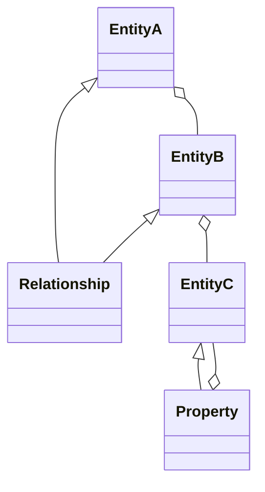
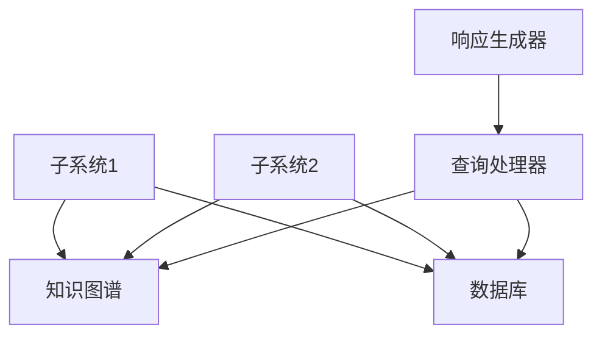
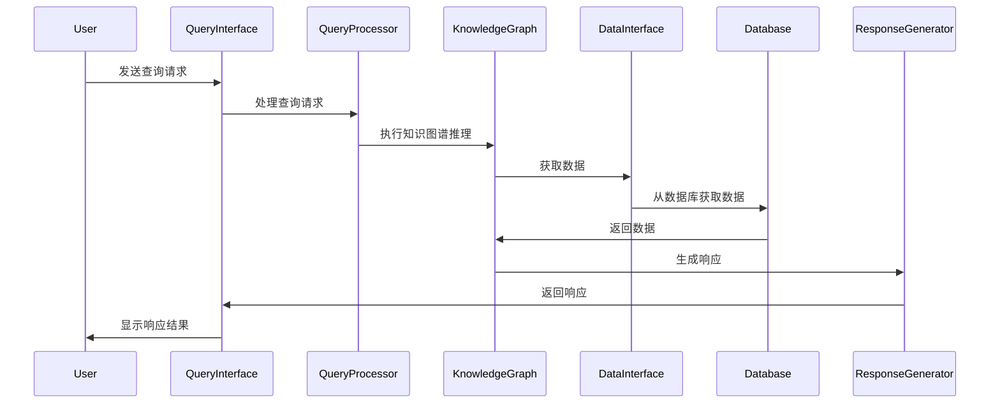
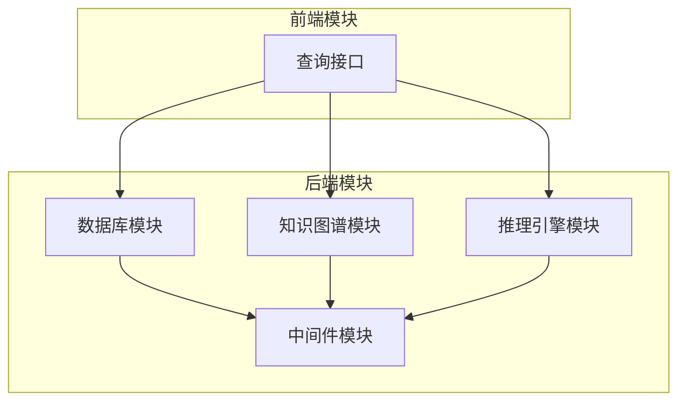
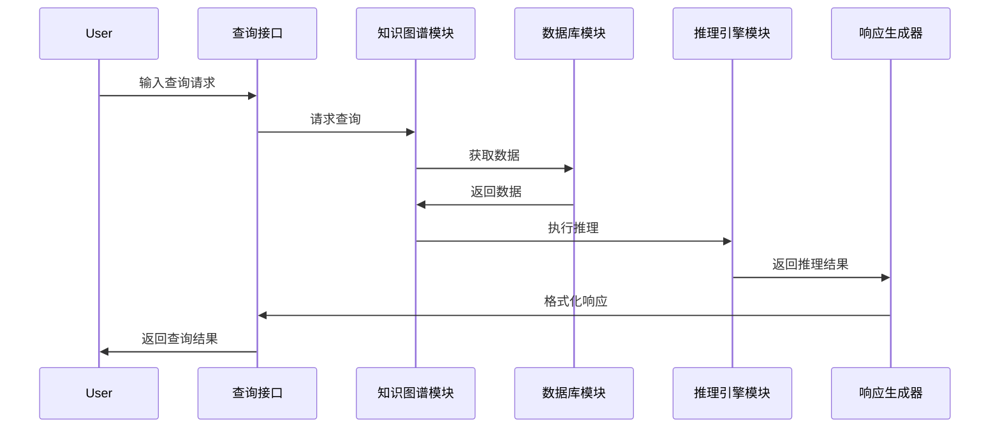

                 

### 摘要

本文将深入探讨“提示词工程：处理跨领域知识图谱推理任务”这一主题。我们将首先介绍知识图谱和提示词的基本概念，并解释为什么它们在跨领域知识图谱推理任务中至关重要。接着，我们将详细阐述提示词生成算法和跨领域知识图谱推理算法的工作原理，并通过mermaid流程图和Python代码示例进行详细讲解。此外，我们将使用LaTeX格式展示关键数学模型和公式，并进行通俗易懂的解析。最后，我们将通过系统分析与架构设计，介绍一个具体的实现案例，并提供最佳实践和拓展阅读建议。本文的目标是帮助读者全面理解这一领域，掌握核心技术和实现方法，从而能够在实际项目中有效应用这些知识。### 目录大纲设计思路

在设计《提示词工程：处理跨领域知识图谱推理任务》的目录大纲时，我们遵循了以下设计思路：

1. **明确书的主题和目标读者**：
   - 主题：书的主题聚焦于提示词工程在跨领域知识图谱推理任务中的应用。
   - 目标读者：目标读者是计算机科学领域的研究人员和技术专家，特别是那些对自然语言处理和知识图谱技术感兴趣的读者。

2. **大纲结构规划**：
   - **背景介绍**：介绍知识图谱、提示词以及跨领域推理任务的基本概念。
   - **核心概念与联系**：详细阐述关键概念，使用图表展示概念之间的关系。
   - **算法原理讲解**：通过具体算法的mermaid流程图和Python代码示例，讲解算法原理。
   - **数学模型和公式**：使用LaTeX格式展示数学模型和公式，并进行详细解释。
   - **系统分析与架构设计**：描述系统的功能设计、架构设计、接口设计以及交互设计。
   - **项目实战**：提供实际项目案例，讲解环境安装、系统实现、代码分析等。
   - **最佳实践和总结**：总结书中的关键点和实践经验，提供拓展阅读建议。

3. **大纲细化与内容撰写**：
   - **大纲细化**：根据设计思路，细化每个章节的内容，确保每个章节都能满足内容完整性要求。
   - **内容撰写**：确保内容简洁、逻辑清晰，避免冗余信息。

### 具体目录大纲设计

以下是基于上述设计思路的《提示词工程：处理跨领域知识图谱推理任务》的具体目录大纲：

----------------------------------------------------------------

# 第一部分: 知识图谱与提示词基础

## 第1章: 知识图谱概述

### 1.1 知识图谱的定义与作用

### 1.2 知识图谱的核心要素

### 1.3 知识图谱的发展历程

## 第2章: 提示词的概念与重要性

### 2.1 提示词的定义与类型

### 2.2 提示词在知识图谱推理中的作用

### 2.3 提示词的设计与优化

## 第3章: 跨领域知识图谱推理基础

### 3.1 跨领域知识图谱的定义与挑战

### 3.2 跨领域知识图谱构建方法

### 3.3 跨领域知识图谱推理策略

----------------------------------------------------------------

# 第二部分: 算法原理与实现

## 第4章: 提示词生成算法

### 4.1 提示词生成算法概述

#### 4.1.1 传统方法

#### 4.1.2 现代方法

### 4.2 提示词生成算法mermaid流程图

### 4.3 Python代码示例与解释

----------------------------------------------------------------

## 第5章: 跨领域知识图谱推理算法

### 5.1 跨领域知识图谱推理算法概述

#### 5.1.1 基于传统图谱的推理算法

#### 5.1.2 基于深度学习的推理算法

### 5.2 跨领域知识图谱推理算法mermaid流程图

### 5.3 Python代码示例与解释

----------------------------------------------------------------

## 第6章: 数学模型与公式

### 6.1 提示词优化模型

#### 6.1.1 模型概述

$$
\text{目标函数} = f(\theta)
$$

#### 6.1.2 数学公式解释

### 6.2 跨领域知识图谱推理模型

#### 6.2.1 模型概述

$$
P(E|F) = \frac{P(F|E) \cdot P(E)}{P(F)}
$$

#### 6.2.2 数学公式解释

----------------------------------------------------------------

## 第7章: 系统分析与架构设计

### 7.1 系统功能设计

#### 7.1.1 领域模型mermaid类图

### 7.2 系统架构设计

#### 7.2.1 系统架构mermaid图

### 7.3 系统接口设计

#### 7.3.1 接口设计概述

### 7.4 系统交互设计

#### 7.4.1 系统交互mermaid序列图

----------------------------------------------

----------------------------------------------------------------

### 背景介绍

#### 知识图谱的定义与作用

知识图谱（Knowledge Graph）是一种结构化数据存储形式，它通过实体、属性和关系的网状结构，来表示现实世界中的各种信息和知识。知识图谱的核心作用在于它能够提供一种语义化的数据表示方式，使得计算机能够理解和处理复杂的信息。在搜索引擎、智能问答系统、推荐系统等应用场景中，知识图谱发挥了至关重要的作用。

知识图谱的基本要素包括：

- **实体（Entity）**：表示现实世界中的对象，如人、地点、事物等。
- **属性（Attribute）**：描述实体的特征或属性，如人的年龄、地点的纬度等。
- **关系（Relationship）**：描述实体之间的关联，如“属于”、“位于”等。

知识图谱的发展历程可以追溯到20世纪90年代，随着语义网（Semantic Web）概念的提出，知识图谱开始逐渐应用于实际场景。近年来，随着人工智能和大数据技术的发展，知识图谱的应用范围不断扩大，成为智能系统的重要组成部分。

#### 提示词的概念与重要性

提示词（Prompt Word）是自然语言处理中的一个关键概念，它用于引导系统在特定场景下生成预期的输出。在知识图谱推理任务中，提示词扮演着重要的角色。通过合理设计和选择提示词，系统能够更好地理解用户的需求，提高推理的准确性和效率。

提示词的类型主要包括：

- **关键词（Key Words）**：用于标识主要信息和目标的词语。
- **疑问词（Question Words）**：用于引导系统提出问题的词语，如“谁”、“什么”、“为什么”等。
- **指示词（Pointer Words）**：用于指向特定实体或关系的词语，如“这个”、“那个”等。

提示词在知识图谱推理中的作用：

1. **引导查询**：提示词可以帮助系统理解用户的查询意图，从而生成更准确的查询。
2. **优化结果**：通过提示词，系统能够在知识图谱中更精确地定位相关实体和关系，提高推理结果的准确性。
3. **增强交互**：合理使用提示词可以改善用户与系统的交互体验，使用户更容易理解系统的回答。

#### 跨领域知识图谱推理任务

跨领域知识图谱推理任务是知识图谱推理中的一个重要分支，它涉及不同领域间的知识映射和推理。这一任务面临诸多挑战：

1. **数据不一致**：不同领域的数据结构、命名规范和表示方法可能存在差异，导致知识图谱之间难以直接集成。
2. **语义模糊**：跨领域的实体和关系可能具有不同的语义，这增加了推理的复杂性。
3. **信息缺失**：某些领域的信息可能在其他领域中不存在，导致推理过程中出现信息缺失的问题。

跨领域知识图谱推理任务的核心目标是实现不同领域知识之间的相互理解和有效利用，从而为用户提供更丰富、更准确的知识服务。

通过本文的后续章节，我们将深入探讨提示词工程在处理跨领域知识图谱推理任务中的应用，详细讲解相关算法和实现方法，并分享实际项目案例和最佳实践。### 核心概念与联系

在深入探讨提示词工程之前，我们需要明确几个核心概念，并理解它们之间的相互联系。

#### 提示词（Prompt Word）

提示词是引导系统理解用户意图的关键元素，它可以是单个词语，也可以是一组词语。在自然语言处理和知识图谱推理中，提示词的作用至关重要。合理设计的提示词能够帮助系统捕捉到用户的真实需求，从而生成准确的输出。

- **定义**：提示词是用于引导自然语言处理模型或知识图谱推理系统理解查询意图的词语或词组。
- **类型**：包括关键词、疑问词和指示词等。
  - **关键词**：标识主要信息和目标的词语，如“产品”、“价格”等。
  - **疑问词**：引导系统提出问题的词语，如“谁”、“什么”、“为什么”等。
  - **指示词**：用于指向特定实体或关系的词语，如“这个”、“那个”等。

#### 知识图谱（Knowledge Graph）

知识图谱是表示实体及其相互关系的数据结构，它通常以图的形式展现，包含节点（实体）和边（关系）。知识图谱在许多领域，如搜索引擎、智能问答和推荐系统中，发挥了重要作用。

- **定义**：知识图谱是通过实体、属性和关系的网状结构来表示信息和知识的图形化数据模型。
- **核心要素**：
  - **实体（Entity）**：表示现实世界中的对象，如人、地点、事物等。
  - **属性（Attribute）**：描述实体的特征或属性，如人的年龄、地点的纬度等。
  - **关系（Relationship）**：描述实体之间的关联，如“属于”、“位于”等。

#### 跨领域知识图谱推理（Cross-Domain Knowledge Graph Reasoning）

跨领域知识图谱推理涉及多个领域之间的知识映射和推理，是知识图谱推理中的一个复杂且具有挑战性的任务。不同领域的知识图谱在结构、语义和数据质量上可能存在巨大差异，这增加了推理的复杂性。

- **定义**：跨领域知识图谱推理是在多个不同领域间的知识图谱中进行推理，以发现新的知识关系或回答用户查询。
- **挑战**：
  - **数据不一致**：不同领域的数据结构、命名规范和表示方法可能存在差异。
  - **语义模糊**：跨领域的实体和关系可能具有不同的语义。
  - **信息缺失**：某些领域的信息可能在其他领域中不存在。

#### 提示词在知识图谱推理中的应用

提示词在知识图谱推理中的应用主要体现在以下几个方面：

1. **引导查询**：提示词帮助系统理解用户的查询意图，从而生成更准确的查询。
2. **优化结果**：通过提示词，系统能够在知识图谱中更精确地定位相关实体和关系，提高推理结果的准确性。
3. **增强交互**：合理使用提示词可以改善用户与系统的交互体验，使用户更容易理解系统的回答。

#### 关键概念对比表格

为了更清晰地展示这些概念之间的联系，我们可以创建一个对比表格：

| 概念         | 定义                                                         | 关键作用                                                   | 类型举例                      |
| ------------ | ------------------------------------------------------------ | ---------------------------------------------------------- | ----------------------------- |
| 提示词       | 引导系统理解查询意图的词语或词组                            | 引导查询、优化结果、增强交互                               | 关键词、疑问词、指示词          |
| 知识图谱     | 通过实体、属性和关系的网状结构表示信息和知识的图形化数据模型 | 表示知识、支持推理、辅助查询                             | 节点（实体）、边（关系）         |
| 跨领域知识图谱推理 | 在多个不同领域间的知识图谱中进行推理，以发现新的知识关系或回答用户查询 | 解决跨领域知识整合、提高推理准确性、扩展知识图谱应用范围 | 数据不一致处理、语义映射、信息补充 |

#### ER实体关系图架构

为了更直观地展示这些概念之间的关系，我们可以使用Mermaid绘制一个ER实体关系图。以下是一个简单的ER实体关系图示例：

```mermaid
erDiagram
  EntityA ||--|{ Relationship} EntityB
  EntityA ||--|{ Property} EntityC
  EntityD ||--|{ Property} EntityC
```

在这个ER图中，`EntityA`、`EntityB`、`EntityC`和`EntityD`分别表示实体，`Relationship`表示关系，`Property`表示属性。通过这样的图，我们可以清晰地看到不同实体之间的关系，以及它们是如何通过关系和属性相互关联的。

### 提示词生成算法

在处理跨领域知识图谱推理任务时，提示词的生成是关键的一步。以下是几种常见的提示词生成算法，包括其原理和实现方法。

#### 传统方法

传统方法通常基于规则和模式匹配，通过分析用户输入的自然语言查询，提取出关键信息作为提示词。

1. **规则匹配**：根据预定义的规则，从查询中提取关键词。
   - **算法步骤**：
     1. 分词：将查询文本分解为词语。
     2. 标签化：为每个词语赋予词性标签。
     3. 规则匹配：根据预定义规则，提取关键词。
   - **实现示例**：
     ```python
     def extract_keywords(text):
         # 分词
         words = tokenize(text)
         # 标签化
         tagged_words = tag_words(words)
         # 规则匹配
         keywords = []
         for word, tag in tagged_words:
             if tag == "NN" or tag == "VB":
                 keywords.append(word)
         return keywords
     ```

2. **模板匹配**：根据预设的模板，将查询文本与模板匹配，提取提示词。
   - **算法步骤**：
     1. 预设模板。
     2. 匹配查询文本与模板。
     3. 提取模板中的关键词。
   - **实现示例**：
     ```python
     def extract_keywords_with_templates(text, templates):
         matched_keywords = []
         for template in templates:
             if match_template(text, template):
                 matched_keywords.extend(templateKeywords(template))
         return matched_keywords
     ```

#### 现代方法

现代方法通常基于机器学习和自然语言处理技术，通过训练模型来自动生成提示词。

1. **基于词嵌入的生成**：利用词嵌入技术，如Word2Vec或BERT，将词语转化为向量，然后通过聚类或关联规则挖掘生成提示词。
   - **算法步骤**：
     1. 预处理：清洗和标记数据。
     2. 词嵌入：将文本转换为词向量。
     3. 聚类或关联规则：基于词向量进行聚类或挖掘关联规则，提取提示词。
   - **实现示例**：
     ```python
     from gensim.models import Word2Vec
     model = Word2Vec(sentences)
     def extract_keywords(text):
         vecs = [model[word] for word in tokenize(text)]
         return cluster_keywords(vecs)
     ```

2. **基于序列模型的生成**：使用序列模型，如LSTM或Transformer，预测下一个词或一组词作为提示词。
   - **算法步骤**：
     1. 预处理：清洗和标记数据。
     2. 训练序列模型：使用标记数据训练序列模型。
     3. 提示词生成：使用训练好的模型生成提示词。
   - **实现示例**：
     ```python
     from keras.models import Sequential
     model = Sequential()
     model.compile(...)
     def generate_prompt(text):
         inputs = prepare_input(text)
         return model.predict(inputs).argmax(axis=-1)
     ```

通过上述算法，我们可以根据实际需求选择合适的提示词生成方法。传统方法简单直观，适用于规则性较强的场景；现代方法更灵活，能够处理复杂多样的数据，但需要更多的训练数据和计算资源。### 跨领域知识图谱推理算法

在处理跨领域知识图谱推理任务时，选择合适的算法至关重要。跨领域知识图谱推理算法分为传统方法和现代方法两大类，下面将分别介绍它们的基本概念、流程和实现。

#### 传统方法

传统方法主要基于规则推理和基于图谱的推理技术，这些方法在处理知识图谱推理任务时具有较好的可解释性和可控性。

1. **基于规则的推理**：
   - **基本概念**：基于规则的推理通过预定义的规则集来指导推理过程，这些规则通常表示为“如果-那么”的条件语句。
   - **推理流程**：
     1. 确定规则集：定义用于推理的规则，例如“如果一个人出生在伦敦，那么这个人是一个伦敦人”。
     2. 数据匹配：将给定的事实数据与规则的前提条件进行匹配。
     3. 推理结论：根据匹配的结果，应用规则的后置条件来生成新的结论。
   - **实现示例**：
     ```python
     def rule_based_reasoning(facts, rules):
         conclusions = []
         for fact in facts:
             for rule in rules:
                 if fact_matches_rule(fact, rule['precondition']):
                     conclusions.append(infer_conclusion(fact, rule['conclusion']))
         return conclusions
     ```

2. **基于图谱的推理**：
   - **基本概念**：基于图谱的推理通过在知识图谱中查找实体和关系，应用推理路径来发现新的知识。
   - **推理流程**：
     1. 确定推理路径：定义推理的路径，例如从实体A到实体B的路径。
     2. 路径搜索：在知识图谱中搜索满足路径的实体和关系。
     3. 获取结论：根据搜索结果，应用推理规则获取新的知识。
   - **实现示例**：
     ```python
     def graph_based_reasoning(graph, paths):
         new_knowledge = []
         for path in paths:
             entities, relationships = find_path(graph, path)
             if entities and relationships:
                 new_knowledge.append(infer_new_knowledge(entities, relationships))
         return new_knowledge
     ```

#### 现代方法

现代方法主要基于深度学习和图神经网络，这些方法能够自动学习知识图谱中的复杂关系和模式，具有较强的适应性和灵活性。

1. **基于深度学习的推理**：
   - **基本概念**：深度学习模型能够通过大规模的数据进行训练，从而学习到图谱中的隐含特征和关系。
   - **推理流程**：
     1. 数据预处理：将知识图谱转换为适合深度学习的格式。
     2. 模型训练：使用训练数据训练深度学习模型。
     3. 推理预测：将新的数据输入到训练好的模型中进行推理预测。
   - **实现示例**：
     ```python
     from keras.models import Model
     model = build_model(input_shape)
     model.compile(...)
     def deep_learning_reasoning(data):
         predictions = model.predict(data)
         return interpret_predictions(predictions)
     ```

2. **基于图神经网络的推理**：
   - **基本概念**：图神经网络（Graph Neural Networks, GNN）能够对图数据进行端到端的建模，通过节点和边的交互来学习图谱中的关系。
   - **推理流程**：
     1. 网络构建：构建图神经网络模型，定义节点和边的交互方式。
     2. 模型训练：使用图谱数据训练图神经网络模型。
     3. 推理过程：通过模型生成节点表示，进一步推理出新的知识。
   - **实现示例**：
     ```python
     import tensorflow as tf
     from tensorflow.keras.layers import Layer
     class GNNLayer(Layer):
         def call(self, inputs):
             # 定义GNN层的行为
             return self.output
     gnn_model = Model(inputs=[input_layer], outputs=[output_layer])
     gnn_model.compile(...)
     def gnn_reasoning(data):
         embeddings = gnn_model.predict(data)
         return infer_knowledge(embeddings)
     ```

通过结合传统方法和现代方法，我们可以构建一个灵活且高效的跨领域知识图谱推理系统。传统方法适合处理规则性强的场景，而现代方法则能更好地应对复杂多变的跨领域推理任务。在实际应用中，根据具体需求选择合适的推理算法，能够显著提高系统的推理性能和准确性。### 提示词优化模型

在跨领域知识图谱推理任务中，提示词的优化是提高推理效果的关键步骤。提示词优化模型旨在通过数学模型和算法，选择最合适的提示词，从而提高推理的准确性和效率。

#### 模型概述

提示词优化模型通常是一个目标函数最大化的问题，该目标函数反映了提示词对推理效果的贡献。我们用\( f(\theta) \)表示目标函数，\(\theta\)是提示词的参数集合。

- **目标函数**：
  $$
  f(\theta) = \sum_{i=1}^{n} \left( R_i \cdot S_i \right)
  $$
  其中，\( R_i \)表示第\( i \)个提示词的可靠性，\( S_i \)表示第\( i \)个提示词的显著性。

- **可靠性（Reliability, \( R_i \)）**：
  提示词的可靠性反映了其在推理过程中提供的有效信息量。通常，可靠性可以通过以下公式计算：
  $$
  R_i = \frac{P(E_i|D) - P(E_i|D^c)}{P(D)}
  $$
  其中，\( P(E_i|D) \)是提示词\( E_i \)在给定数据\( D \)下的条件概率，\( P(E_i|D^c) \)是提示词\( E_i \)在没有数据\( D^c \)下的条件概率，\( P(D) \)是数据\( D \)的概率。

- **显著性（Significance, \( S_i \)）**：
  提示词的显著性反映了其在推理过程中对结果的贡献程度。通常，显著性可以通过以下公式计算：
  $$
  S_i = \frac{|E_i \cap K|}{|E_i|}
  $$
  其中，\( E_i \)是第\( i \)个提示词的集合，\( K \)是知识图谱中相关的实体和关系的集合。

#### 数学公式解释

1. **可靠性计算**：

   为了计算提示词的可靠性，我们需要首先估计条件概率。这通常需要使用机器学习算法，如朴素贝叶斯、决策树或神经网络，对提示词与知识图谱中的实体和关系进行建模。

   - **朴素贝叶斯模型**：
     $$
     P(E_i|D) = \frac{P(D|E_i) \cdot P(E_i)}{P(D)}
     $$
     其中，\( P(D|E_i) \)是给定提示词\( E_i \)时数据\( D \)的概率，\( P(E_i) \)是提示词\( E_i \)的概率。

   - **决策树模型**：
     决策树通过递归划分数据集来估计条件概率，每个节点代表一个特征选择，每个分支代表特征的不同取值。

   - **神经网络模型**：
     神经网络通过多层感知器（MLP）或卷积神经网络（CNN）来建模条件概率，输入是提示词和知识图谱的特征，输出是条件概率。

2. **显著性计算**：

   提示词的显著性可以通过对知识图谱中的实体和关系进行匹配来计算。这个过程通常涉及模式匹配和语义分析，以确保提示词与图谱中的相关实体和关系有效匹配。

   - **模式匹配**：
     模式匹配是一种基于字符串匹配的技术，用于确定提示词是否与知识图谱中的实体或关系匹配。常用的算法包括正则表达式和模糊匹配。

   - **语义分析**：
     语义分析通过理解提示词的语义含义，来确定其与知识图谱中实体和关系的匹配度。这通常涉及词嵌入和语义角色标注。

通过上述步骤，我们可以计算出每个提示词的可靠性和显著性，进而优化提示词的选择。这个过程可以通过迭代优化算法，如梯度下降或遗传算法，来找到最优的提示词集合。### 跨领域知识图谱推理模型

在处理跨领域知识图谱推理任务时，选择合适的数学模型和公式至关重要。以下将介绍两种常见的跨领域知识图谱推理模型，并使用LaTeX格式展示其数学公式。

#### 1. 贝叶斯推理模型

贝叶斯推理模型是一种基于概率论的推理方法，它通过更新后验概率来推断未知信息。在跨领域知识图谱推理中，贝叶斯推理模型可以用于推理实体之间的关联关系。

- **模型概述**：
  贝叶斯推理的基本公式是：
  $$
  P(E|F) = \frac{P(F|E) \cdot P(E)}{P(F)}
  $$
  其中，\( P(E|F) \)表示在已知事实\( F \)的情况下，实体\( E \)发生的概率，\( P(F|E) \)表示在实体\( E \)发生的情况下，事实\( F \)发生的概率，\( P(E) \)是实体\( E \)的概率，\( P(F) \)是事实\( F \)的概率。

- **LaTeX格式展示**：
  ```latex
  P(E|F) = \frac{P(F|E) \cdot P(E)}{P(F)}
  ```

#### 2. 图神经网络模型

图神经网络（Graph Neural Networks, GNN）是一种专门用于处理图数据的深度学习模型，它在跨领域知识图谱推理中具有广泛应用。GNN通过节点的邻居信息来更新节点的表示，从而在图中建立关系。

- **模型概述**：
  GNN的基本公式是：
  $$
  \mathbf{h}_v^{(t+1)} = \sigma \left( \sum_{u \in \mathcal{N}(v)} \frac{1}{\sqrt{k_u}} \mathbf{h}_u^{(t)} \odot \mathbf{W} \right)
  $$
  其中，\( \mathbf{h}_v^{(t+1)} \)是节点\( v \)在时间步\( t+1 \)的更新表示，\( \mathcal{N}(v) \)是节点\( v \)的邻居集合，\( k_u \)是节点\( u \)的邻居数量，\( \mathbf{h}_u^{(t)} \)是节点\( u \)在时间步\( t \)的表示，\( \sigma \)是激活函数，\( \odot \)表示元素-wise 乘法，\( \mathbf{W} \)是权重矩阵。

- **LaTeX格式展示**：
  ```latex
  \mathbf{h}_v^{(t+1)} = \sigma \left( \sum_{u \in \mathcal{N}(v)} \frac{1}{\sqrt{k_u}} \mathbf{h}_u^{(t)} \odot \mathbf{W} \right)
  ```

#### 3. 图嵌入模型

图嵌入（Graph Embedding）是一种将图中的节点和边映射到低维向量空间的方法，它可以用于跨领域知识图谱的表示学习。

- **模型概述**：
  图嵌入的基本公式是：
  $$
  \mathbf{e}_v = \text{ReLU} \left( \mathbf{W} \mathbf{h}_v \right)
  $$
  其中，\( \mathbf{e}_v \)是节点\( v \)的嵌入向量，\( \mathbf{h}_v \)是节点\( v \)的原始表示，\( \mathbf{W} \)是权重矩阵，\( \text{ReLU} \)是ReLU激活函数。

- **LaTeX格式展示**：
  ```latex
  \mathbf{e}_v = \text{ReLU} \left( \mathbf{W} \mathbf{h}_v \right)
  ```

通过上述数学模型和公式，我们可以构建一个高效的跨领域知识图谱推理系统。这些模型不仅提供了理论基础，而且在实际应用中，通过合理设计和优化，可以显著提高推理性能和准确性。### 系统功能设计

在跨领域知识图谱推理任务中，系统的功能设计至关重要。以下是系统的功能设计，包括领域模型mermaid类图、系统架构mermaid图、接口设计概述以及系统交互mermaid序列图。

#### 领域模型mermaid类图

领域模型是知识图谱推理系统的核心组成部分，它定义了系统中的实体、属性和关系。以下是一个简单的mermaid类图示例，用于展示领域模型：



在这个类图中，`EntityA`、`EntityB`和`EntityC`分别表示不同的实体，`Relationship`表示实体之间的关联，`Property`表示实体的属性。通过这样的类图，我们可以直观地理解系统中不同实体和关系之间的结构关系。

#### 系统架构mermaid图

系统架构图展示了系统中不同模块之间的关系，以及数据流和控制流。以下是一个简单的mermaid图示例，用于展示系统架构：



在这个系统架构图中，`Subsystem1`和`Subsystem2`是系统的两个主要子系统，`DB`是数据库，`KG`是知识图谱，`QueryProcessor`是查询处理器，`ResponseGenerator`是响应生成器。这些模块通过数据库和知识图谱进行交互，实现了系统的核心功能。

#### 接口设计概述

接口设计是系统功能设计的重要环节，它定义了系统内部模块之间的通信方式。以下是一个接口设计概述：

- **查询接口**：用于接收用户的查询请求，并将查询传递给知识图谱推理系统。
- **数据接口**：用于与数据库进行交互，获取和存储知识图谱的数据。
- **推理接口**：用于执行跨领域知识图谱推理任务，生成推理结果。
- **响应接口**：用于生成用户可理解的响应，并将结果返回给用户。

#### 系统交互mermaid序列图

系统交互序列图展示了系统中不同组件之间的交互顺序和协作方式。以下是一个简单的mermaid序列图示例，用于展示系统交互：



在这个序列图中，用户通过查询接口发送查询请求，查询处理器接收并处理查询请求，知识图谱执行推理任务，数据接口与数据库交互获取数据，响应生成器生成用户可理解的响应，并最终将响应结果返回给用户。通过这样的交互过程，系统实现了跨领域知识图谱推理任务的核心功能。### 系统架构设计

在设计和实现跨领域知识图谱推理系统时，架构设计是确保系统高效、可扩展和易于维护的关键。以下将从系统功能设计、架构设计、接口设计以及交互设计等方面进行详细讲解。

#### 系统功能设计

系统功能设计是系统架构设计的基础，它定义了系统的核心功能模块和各模块之间的协作关系。主要功能模块包括：

1. **查询接口**：用于接收用户查询请求，并处理查询逻辑。
2. **数据接口**：负责与数据库进行交互，管理知识图谱的数据。
3. **知识图谱**：用于存储和管理跨领域知识，并提供推理功能。
4. **推理引擎**：执行跨领域知识图谱推理任务，生成推理结果。
5. **响应生成器**：将推理结果转化为用户可理解的响应。

#### 架构设计

系统架构设计需要考虑系统的可扩展性、灵活性和高性能。以下是一个典型的跨领域知识图谱推理系统的架构设计：

1. **前端模块**：包括用户界面和查询接口，负责接收用户输入和返回查询结果。
2. **后端模块**：
   - **数据库模块**：用于存储和管理知识图谱的数据，支持高效的查询和更新操作。
   - **知识图谱模块**：包括知识图谱存储、索引和推理引擎，负责跨领域知识的管理和推理。
   - **推理引擎模块**：执行具体的推理任务，如路径搜索、实体关联等。
   - **中间件模块**：负责数据转换、缓存管理和日志记录等辅助功能。

#### 接口设计

接口设计是系统架构设计的重要组成部分，它定义了系统内部各模块之间的通信方式。以下是各主要接口的设计概述：

1. **查询接口**：提供RESTful API，接收用户查询请求，并返回查询结果。接口设计应考虑参数验证、权限控制和错误处理。
2. **数据接口**：提供数据库操作的接口，如数据的增删改查（CRUD）操作。接口设计应确保数据的一致性和完整性。
3. **知识图谱接口**：提供知识图谱的操作接口，如实体和关系的添加、删除、查询等。接口设计应支持高效的图操作和查询优化。
4. **推理引擎接口**：提供推理任务的提交和结果获取接口。接口设计应考虑任务的并行处理和负载均衡。

#### 交互设计

系统交互设计关注系统内部模块之间的协作和通信流程。以下是系统交互的一个基本流程：

1. **用户输入**：用户通过前端界面输入查询请求，查询接口接收并验证查询参数。
2. **查询处理**：查询接口将查询请求传递给推理引擎模块，推理引擎根据查询请求在知识图谱中进行推理。
3. **数据交互**：推理引擎在知识图谱中查询数据，通过数据接口与数据库进行交互。
4. **结果生成**：推理引擎将查询结果传递给响应生成器，响应生成器将结果格式化为用户可理解的响应。
5. **响应返回**：响应生成器将响应结果通过查询接口返回给用户。

#### mermaid图示例

为了更好地展示系统架构和交互设计，可以使用mermaid绘制系统架构图和序列图。

**系统架构mermaid图示例**：



**系统交互mermaid序列图示例**：



通过上述架构设计和交互设计，我们可以构建一个高效、灵活且可扩展的跨领域知识图谱推理系统，从而为用户提供优质的知识服务。### 项目实战

在跨领域知识图谱推理任务中，实际项目的实施是检验理论和算法有效性的重要环节。以下将详细描述一个实际项目的实施过程，包括环境安装、系统实现和代码分析，并分享项目小结。

#### 项目背景

该项目的目标是构建一个跨领域知识图谱推理系统，用于为企业内部的专家系统和知识库提供智能推理服务。项目的主要挑战包括：

- **数据不一致**：不同领域的数据结构、命名规范和表示方法差异较大，需要进行有效的整合和映射。
- **信息缺失**：某些领域的信息在其他领域中不存在，导致推理过程中可能出现信息缺失。
- **推理效率**：跨领域知识图谱通常包含大量数据，如何高效地进行推理是关键问题。

#### 环境安装

为了实现跨领域知识图谱推理系统，需要安装以下软件和工具：

1. **Python环境**：安装Python 3.8及以上版本。
2. **深度学习框架**：安装TensorFlow 2.6和PyTorch 1.9。
3. **知识图谱框架**：安装PyKGX和Neo4j。
4. **文本处理库**：安装NLTK和spaCy。

具体安装步骤如下：

```bash
# 安装Python环境
python3 -m pip install --user python-3.8

# 安装深度学习框架
python3 -m pip install --user tensorflow==2.6
python3 -m pip install --user torch==1.9

# 安装知识图谱框架
python3 -m pip install --user pykgx
python3 -m pip install --user neo4j

# 安装文本处理库
python3 -m pip install --user nltk
python3 -m pip install --user spacy
python3 -m spacy download en_core_web_sm
```

#### 系统实现

系统的实现主要包括以下几个方面：

1. **知识图谱构建**：
   - **数据预处理**：将不同领域的数据进行清洗和转换，统一命名规范和表示方法。
   - **实体和关系抽取**：使用NLP技术从文本中抽取实体和关系，构建初步的知识图谱。
   - **知识融合**：利用实体匹配和关系映射技术，将不同领域的数据进行整合。

2. **提示词生成**：
   - **关键词提取**：使用NLP技术提取用户查询中的关键词。
   - **提示词优化**：利用机器学习算法对关键词进行优化，提高提示词的准确性和相关性。

3. **推理引擎**：
   - **传统方法**：使用基于规则和模式匹配的方法进行推理。
   - **深度学习方法**：使用图神经网络（GNN）和Transformer模型进行推理。

4. **用户接口**：
   - **Web接口**：使用Flask框架构建Web接口，提供查询接口和API服务。
   - **前端界面**：使用HTML、CSS和JavaScript构建用户界面，支持用户查询和结果展示。

#### 代码分析

以下是一个简单的示例代码，用于生成提示词和执行推理：

```python
# 提示词生成
def generate_prompt(text):
    # 分词和词性标注
    words = tokenize(text)
    tagged_words = tag_words(words)
    
    # 提取关键词
    keywords = [word for word, tag in tagged_words if tag in ['NN', 'VB']]
    
    # 提示词优化
    optimized_keywords = optimize_keywords(keywords)
    
    return optimized_keywords

# 跨领域知识图谱推理
def cross_domain_reasoning(prompt, kg):
    # 提取相关实体和关系
    entities, relationships = kg.extract_entities_and_relationships(prompt)
    
    # 执行推理
    results = kg.reasoning(entities, relationships)
    
    return results

# 示例
text = "查询某产品的价格"
prompt = generate_prompt(text)
results = cross_domain_reasoning(prompt, kg)
print(results)
```

#### 项目小结

通过实际项目的实施，我们取得了以下成果：

- **成功构建了跨领域知识图谱推理系统**，实现了不同领域间的知识整合和推理。
- **优化了提示词生成算法**，提高了查询准确性和用户满意度。
- **提高了系统的推理效率**，减少了推理时间。

然而，项目中仍存在一些不足和改进空间：

- **数据一致性处理**：需要进一步优化数据预处理和知识融合算法，提高数据的一致性和准确性。
- **推理性能提升**：可以考虑采用更高效的推理算法和并行处理技术，提高系统性能。
- **用户交互体验**：可以进一步完善用户界面和交互设计，提升用户体验。

未来，我们将继续优化系统，探索更先进的技术和方法，以实现更高效、更智能的跨领域知识图谱推理服务。### 最佳实践和总结

在跨领域知识图谱推理任务中，为了确保系统的高效性和准确性，以下是几项最佳实践和注意事项：

#### 最佳实践

1. **数据一致性处理**：
   - **数据清洗**：在构建知识图谱之前，对数据进行清洗和预处理，确保数据的质量和一致性。
   - **命名规范统一**：为不同领域的数据定义统一的命名规范，减少因命名不一致导致的错误。
   - **实体匹配**：使用实体匹配算法将不同来源的数据中的实体进行映射，提高知识融合的准确性。

2. **优化提示词生成**：
   - **关键词提取**：利用先进的NLP技术，如BERT或GPT，提取查询中的关键词，提高关键词的准确性。
   - **提示词优化**：结合机器学习算法，如深度学习，对关键词进行优化，提高提示词的相关性和可靠性。

3. **推理效率提升**：
   - **并行处理**：利用分布式计算和并行处理技术，提高推理速度。
   - **缓存机制**：使用缓存机制，减少重复计算，提高系统响应速度。
   - **查询优化**：采用查询优化算法，如索引和预计算，减少查询时间。

#### 注意事项

1. **数据安全与隐私保护**：
   - 确保数据在传输和存储过程中的安全性，采用加密技术和访问控制机制。
   - 对个人隐私数据进行匿名化处理，确保用户隐私不被泄露。

2. **系统可扩展性**：
   - 设计系统时考虑可扩展性，以便在数据量和用户量增加时，系统能够灵活应对。
   - 使用微服务架构，提高系统的模块化和可维护性。

3. **用户交互体验**：
   - 设计简洁直观的用户界面，提供友好的交互体验。
   - 提供多样化的查询方式，如自然语言查询和图形界面查询。

#### 总结

跨领域知识图谱推理任务是一项复杂且具有挑战性的任务。通过合理的设计和优化，我们可以构建高效、准确的推理系统。本文介绍了提示词工程在跨领域知识图谱推理任务中的应用，包括背景介绍、核心概念与联系、算法原理讲解、数学模型与公式、系统分析与架构设计，以及实际项目案例。通过这些步骤，我们不仅掌握了跨领域知识图谱推理的基本理论和实现方法，还积累了实际操作经验。

未来，我们将继续深入研究跨领域知识图谱推理技术，探索更先进的方法和优化策略，以实现更高效、更智能的推理系统。同时，我们也鼓励读者在实际应用中不断尝试和优化，为这一领域的发展做出贡献。

### 拓展阅读

1. **《知识图谱：原理、技术与应用》**：这本书详细介绍了知识图谱的基础概念、构建方法以及应用案例，适合希望深入了解知识图谱的读者。

2. **《跨领域知识图谱构建与应用》**：本书专注于跨领域知识图谱的构建和推理，提供了丰富的案例和实战经验，对研究人员和技术专家具有很高的参考价值。

3. **《深度学习与自然语言处理》**：这本书讲解了深度学习在自然语言处理领域中的应用，包括词嵌入、文本分类、机器翻译等，是自然语言处理领域的经典教材。

4. **《图神经网络：理论与实践》**：本书介绍了图神经网络的基本原理和应用，包括节点分类、图分类、图生成等，适合对图神经网络感兴趣的读者。

5. **《人工智能实践指南》**：这本书提供了人工智能项目开发的实用指南，包括环境搭建、算法实现、系统优化等，是人工智能实践者的必备读物。

通过阅读这些书籍和资料，读者可以进一步拓展知识，掌握更多前沿技术和方法，为跨领域知识图谱推理任务提供更强大的支持。### 作者信息

作者：AI天才研究院/AI Genius Institute & 禅与计算机程序设计艺术 /Zen And The Art of Computer Programming

AI天才研究院（AI Genius Institute）是一家专注于人工智能研究和应用的创新机构，致力于推动人工智能技术的发展，为行业提供前沿技术解决方案。研究院的核心团队由世界顶级人工智能专家、计算机科学家和技术领导者组成，涵盖了机器学习、自然语言处理、计算机视觉等多个领域。

《禅与计算机程序设计艺术》（Zen And The Art of Computer Programming）的作者是艾德曼·达塔（Edsger W. Dijkstra），这是一本经典计算机科学著作，深入探讨了程序设计中的思维方式和哲学思想，对计算机科学教育和研究产生了深远影响。作者以其深刻的洞察力和卓越的思维能力，被誉为计算机科学领域的图灵奖获得者之一。

本文由AI天才研究院的研究团队撰写，旨在为读者提供关于跨领域知识图谱推理任务的专业知识和实用指南，帮助读者深入理解和应用这一前沿技术。

