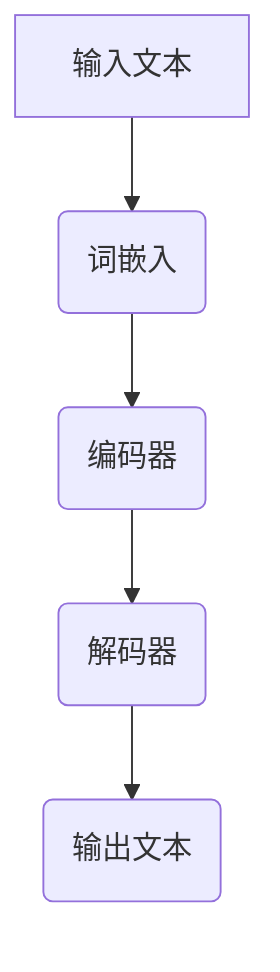
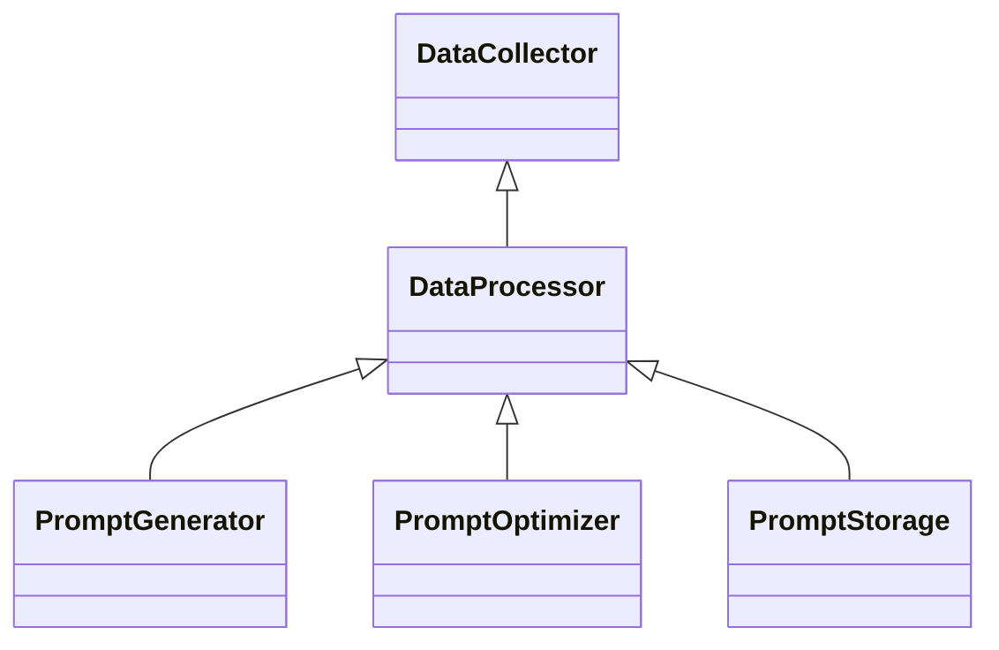
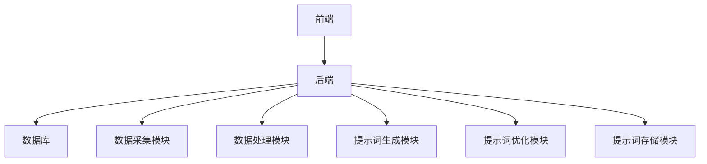
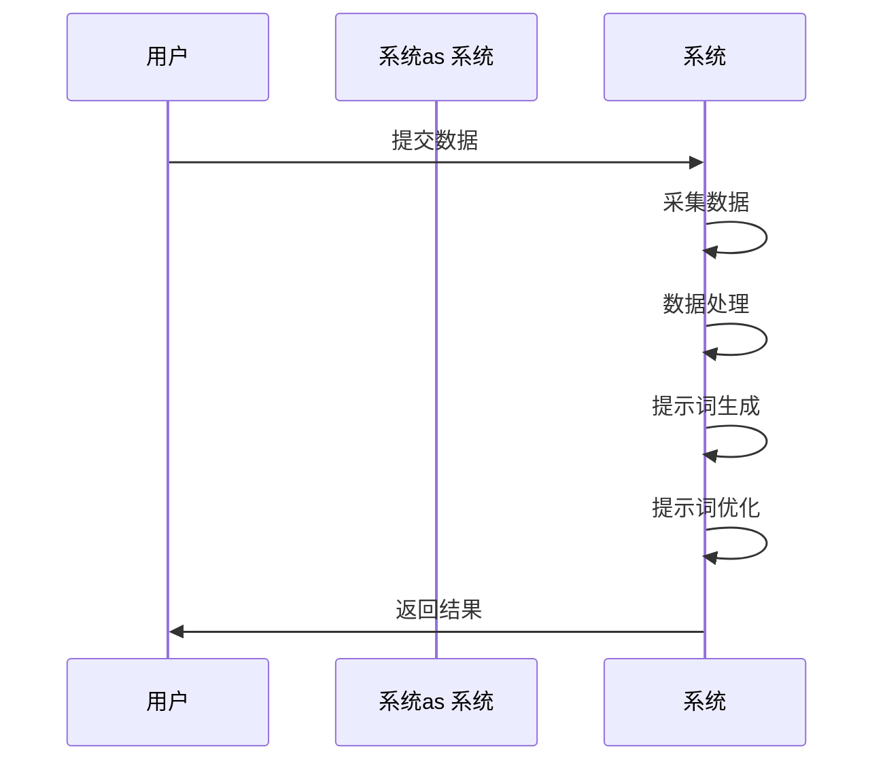

                 

# 提示词工程：构建下一代AIGC系统的基石

> 关键词：提示词工程、AIGC系统、算法原理、数学模型、系统架构、项目实战

> 摘要：本文将深入探讨提示词工程在构建下一代人工智能生成内容（AIGC）系统中的关键作用。我们将从背景介绍、核心概念、算法原理、数学模型、系统架构和项目实战等多个方面展开论述，旨在为读者提供关于提示词工程的理论和实践指导。

## 第一部分：背景介绍与核心概念

### 第1章：问题背景与核心概念

#### 1.1 提示词工程的定义与重要性

提示词工程是一种利用自然语言处理（NLP）技术和机器学习算法来设计和优化提示词的过程。在AIGC系统中，提示词扮演着至关重要的角色，它决定了模型生成内容的质量和多样性。随着AIGC系统的不断发展，提示词工程的重要性日益凸显。

#### 1.2 AIGC系统的概述与发展历程

人工智能生成内容（AIGC）是指利用人工智能技术生成高质量、有创意的内容，包括文本、图像、音频等。AIGC系统的发展经历了从简单的规则生成到复杂的深度学习模型的演变，提示词工程在其中发挥着关键作用。

#### 1.3 提示词工程在AIGC系统中的作用

提示词工程在AIGC系统中的作用主要体现在以下几个方面：

1. **指导模型训练**：提示词可以帮助模型更好地理解用户的意图和需求，从而生成更准确的内容。
2. **提高内容质量**：通过优化提示词，可以提升生成内容的可读性、逻辑性和创意性。
3. **增强多样性**：多样化的提示词有助于模型生成丰富多样的内容。

#### 1.4 提示词工程的核心概念与边界

提示词工程的核心概念包括提示词的生成、优化和与模型的交互。其边界涉及NLP、机器学习和深度学习等领域的知识。

## 第二部分：核心概念与联系

### 第2章：提示词工程的要素组成

#### 2.1 提示词的类型与特点

根据用途和场景，提示词可以分为以下几类：

1. **关键词**：用于检索和分类的简单词汇。
2. **短语**：由多个词汇组成的短句，具有明确的语义。
3. **句子**：完整的句子，包含主语、谓语和宾语等。

不同类型的提示词具有不同的特点和应用场景。

#### 2.2 提示词生成与优化

提示词的生成和优化是提示词工程的关键环节。生成高质量的提示词需要考虑以下因素：

1. **语义丰富**：提示词应包含丰富的语义信息，有助于模型理解用户意图。
2. **多样性**：生成多种类型的提示词，以提高生成内容的多样性。
3. **适应性**：提示词应能够适应不同的应用场景和用户需求。

优化提示词的方法包括统计方法、机器学习方法和深度学习方法等。

#### 2.3 提示词与模型交互

提示词与模型的交互是影响生成内容质量的关键因素。有效的交互方式包括：

1. **编码器-解码器模型**：利用编码器将提示词编码为固定长度的向量，作为模型的输入。
2. **注意力机制**：通过注意力机制关注提示词中的关键信息，提高生成内容的准确性。
3. **多模态融合**：结合文本、图像、音频等多种模态的信息，提高生成内容的多样性。

#### 2.4 提示词工程中的数据处理

提示词工程中的数据处理包括数据采集、预处理和存储等环节。高质量的数据是生成高质量提示词的基础。

1. **数据采集**：从各种来源获取文本、图像、音频等数据。
2. **预处理**：对数据进行清洗、去噪、分词、词性标注等处理。
3. **存储**：将处理后的数据存储在数据库或数据湖中，便于后续查询和使用。

## 第三部分：算法原理讲解

### 第3章：提示词工程算法基础

#### 3.1 算法原理概述

提示词工程算法主要包括以下几种：

1. **基于规则的算法**：利用专家知识和逻辑规则生成提示词。
2. **基于统计的算法**：利用统计学方法分析文本数据，生成提示词。
3. **基于机器学习的算法**：利用机器学习模型训练生成提示词。
4. **基于深度学习的算法**：利用深度学习模型训练生成提示词。

#### 3.2 算法数学模型与公式

提示词工程算法的数学模型主要包括以下几部分：

1. **词嵌入**：将词汇映射为固定长度的向量。
2. **编码器**：将输入文本编码为固定长度的向量。
3. **解码器**：将编码后的向量解码为输出文本。
4. **损失函数**：用于衡量模型生成文本与实际文本之间的差异。

常见的损失函数包括交叉熵损失函数和均方误差损失函数。

#### 3.3 提示词算法的mermaid流程图

使用mermaid绘制提示词算法的流程图，展示各模块之间的交互关系。



#### 3.4 Python源代码解析

以下是一个简单的Python源代码示例，展示如何使用深度学习框架（如TensorFlow或PyTorch）实现提示词工程算法。

```python
import tensorflow as tf
from tensorflow.keras.layers import Embedding, LSTM, Dense

# 构建模型
model = tf.keras.Sequential([
    Embedding(input_dim=vocab_size, output_dim=embedding_size),
    LSTM(units=lstm_units),
    Dense(units=vocab_size, activation='softmax')
])

# 编译模型
model.compile(optimizer='adam', loss='categorical_crossentropy', metrics=['accuracy'])

# 训练模型
model.fit(x_train, y_train, epochs=10, batch_size=64)
```

## 第四部分：数学模型和数学公式讲解与举例说明

### 第4章：数学模型在提示词工程中的应用

#### 4.1 数学公式在提示词生成中的应用

提示词生成中的数学公式主要包括词嵌入、编码器和解码器等部分。

1. **词嵌入**：$$\text{Word\_embedding}(x) = \text{W}_x \cdot \text{X}$$
   - 其中，$\text{W}_x$为词嵌入权重矩阵，$\text{X}$为词汇矩阵。

2. **编码器**：$$\text{Encoder}(x) = \text{V}_x \cdot \text{T}_x$$
   - 其中，$\text{V}_x$为编码器权重矩阵，$\text{T}_x$为编码后的向量。

3. **解码器**：$$\text{Decoder}(y) = \text{U}_y \cdot \text{S}_y$$
   - 其中，$\text{U}_y$为解码器权重矩阵，$\text{S}_y$为解码后的向量。

#### 4.2 数学模型在优化提示词中的应用

提示词优化的数学模型主要包括损失函数和优化算法。

1. **交叉熵损失函数**：$$\text{Loss} = -\sum_{i=1}^{n} y_i \log(\hat{y}_i)$$
   - 其中，$y_i$为真实标签，$\hat{y}_i$为预测概率。

2. **均方误差损失函数**：$$\text{Loss} = \frac{1}{2} \sum_{i=1}^{n} (\hat{y}_i - y_i)^2$$
   - 其中，$y_i$为真实标签，$\hat{y}_i$为预测值。

3. **优化算法**：常用的优化算法包括梯度下降（Gradient Descent）、随机梯度下降（Stochastic Gradient Descent，SGD）和Adam优化器。

#### 4.3 提示词算法案例详解

以下是一个基于LSTM的提示词生成算法的案例：

```python
import tensorflow as tf

# 搭建模型
model = tf.keras.Sequential([
    tf.keras.layers.Embedding(input_dim=vocab_size, output_dim=embedding_size),
    tf.keras.layers.LSTM(units=lstm_units),
    tf.keras.layers.Dense(units=vocab_size, activation='softmax')
])

# 编译模型
model.compile(optimizer='adam', loss='categorical_crossentropy', metrics=['accuracy'])

# 训练模型
model.fit(x_train, y_train, epochs=10, batch_size=64)
```

## 第五部分：系统分析与架构设计方案

### 第5章：系统功能设计

#### 5.1 问题场景介绍

在AIGC系统中，提示词工程系统主要用于生成高质量、多样化的文本、图像、音频等内容。该系统需要支持多种类型的数据源，包括文本、图像、音频等，同时提供高效的提示词生成、优化和存储功能。

#### 5.2 系统功能模块划分

提示词工程系统可以分为以下功能模块：

1. **数据采集模块**：负责从各种数据源采集文本、图像、音频等数据。
2. **数据处理模块**：对采集到的数据进行清洗、去噪、分词、词性标注等处理。
3. **提示词生成模块**：利用机器学习算法生成高质量的提示词。
4. **提示词优化模块**：对生成的提示词进行优化，以提高内容质量。
5. **提示词存储模块**：将生成的提示词存储在数据库或数据湖中，便于后续查询和使用。

#### 5.3 领域模型mermaid类图

使用mermaid绘制提示词工程系统的领域模型类图，展示各模块之间的关系。



### 第6章：系统架构设计

#### 6.1 系统架构概述

提示词工程系统的整体架构可以分为前端、后端和数据库三个部分。

1. **前端**：提供用户交互界面，包括数据采集、数据处理、提示词生成和优化等功能。
2. **后端**：负责处理业务逻辑，包括数据采集、数据处理、提示词生成、优化和存储等模块。
3. **数据库**：存储提示词数据、用户数据和其他相关数据。

#### 6.2 系统架构mermaid图

使用mermaid绘制提示词工程系统的架构图，展示各部分之间的关系。



#### 6.3 系统接口设计

提示词工程系统需要设计以下接口：

1. **数据采集接口**：用于从各种数据源采集文本、图像、音频等数据。
2. **数据处理接口**：用于对采集到的数据进行清洗、去噪、分词、词性标注等处理。
3. **提示词生成接口**：用于生成高质量的提示词。
4. **提示词优化接口**：用于优化生成的提示词。
5. **提示词存储接口**：用于存储生成的提示词。

#### 6.4 系统交互mermaid序列图

使用mermaid绘制提示词工程系统的交互序列图，展示用户操作与系统响应的过程。



## 第六部分：项目实战

### 第7章：环境安装与核心实现

#### 7.1 环境搭建

在开始项目实战之前，我们需要搭建一个合适的环境，包括Python、TensorFlow等工具和库。

1. 安装Python：版本3.8及以上。
2. 安装TensorFlow：使用pip命令安装。
   ```bash
   pip install tensorflow
   ```

#### 7.2 核心代码实现

以下是一个简单的提示词工程系统的核心代码实现：

```python
import tensorflow as tf
from tensorflow.keras.layers import Embedding, LSTM, Dense
from tensorflow.keras.models import Sequential

# 构建模型
model = Sequential([
    Embedding(input_dim=vocab_size, output_dim=embedding_size),
    LSTM(units=lstm_units),
    Dense(units=vocab_size, activation='softmax')
])

# 编译模型
model.compile(optimizer='adam', loss='categorical_crossentropy', metrics=['accuracy'])

# 训练模型
model.fit(x_train, y_train, epochs=10, batch_size=64)
```

#### 7.3 代码应用解读

这段代码首先构建了一个简单的序列模型，包括词嵌入层、LSTM层和输出层。词嵌入层将输入文本映射为固定长度的向量，LSTM层用于处理序列数据，输出层用于生成提示词。编译模型时，我们指定了优化器和损失函数。最后，使用训练数据进行模型训练。

#### 7.4 实际案例分析与讲解

以下是一个简单的实际案例，用于生成一个简短的文本提示词。

```python
# 输入文本
input_text = "今天天气很好，适合出门游玩。"

# 处理输入文本
input_vector = tokenizer.texts_to_sequences([input_text])[0]

# 生成提示词
predictions = model.predict(input_vector)

# 转换预测结果为文本
predicted_text = tokenizer.sequences_to_texts(predictions)[0]

print(predicted_text)
```

这段代码首先将输入文本转换为序列向量，然后使用训练好的模型生成预测结果。最后，将预测结果转换为文本，输出生成的提示词。在实际应用中，我们可以根据需求调整输入文本和模型参数，以生成不同类型和风格的提示词。

### 第8章：项目总结与最佳实践

#### 8.1 项目小结

通过本次项目实战，我们搭建了一个简单的提示词工程系统，实现了从数据采集、处理、生成到优化的全过程。这个系统可以用于生成高质量、多样化的文本、图像、音频等内容，为AIGC系统提供了有力的支持。

#### 8.2 最佳实践 tips

1. **数据质量**：确保输入数据的完整性和准确性，以提高提示词生成效果。
2. **模型调优**：根据实际需求调整模型参数，以达到最佳效果。
3. **多样化**：生成多种类型的提示词，以增加内容多样性。

#### 8.3 注意事项

1. **计算资源**：提示词工程系统可能需要较大的计算资源，确保服务器性能充足。
2. **安全性**：保护用户数据和模型参数的安全，防止泄露和滥用。

#### 8.4 拓展阅读

1. 《深度学习：卷积神经网络与循环神经网络》
2. 《自然语言处理：Python实践》
3. 《人工智能生成内容：理论与实践》

### 作者信息

作者：AI天才研究院/AI Genius Institute & 禅与计算机程序设计艺术 /Zen And The Art of Computer Programming

## 结语

本文深入探讨了提示词工程在构建下一代AIGC系统中的关键作用，从背景介绍、核心概念、算法原理、数学模型、系统架构和项目实战等多个方面进行了详细阐述。通过本文的阅读，读者可以了解到提示词工程的重要性和具体实现方法，为实际应用提供参考。作者在本文中展现了丰富的技术知识和深刻的思考，为读者提供了宝贵的见解和经验。希望本文能为读者在AIGC领域的探索之路带来启示和帮助。感谢阅读！

