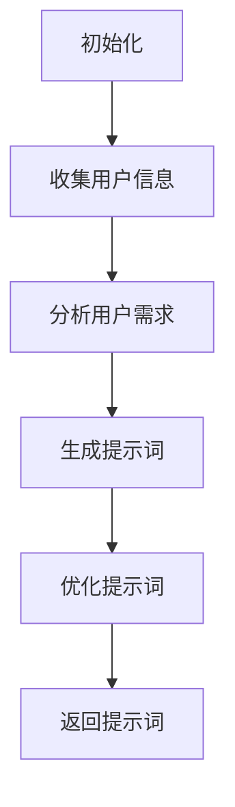
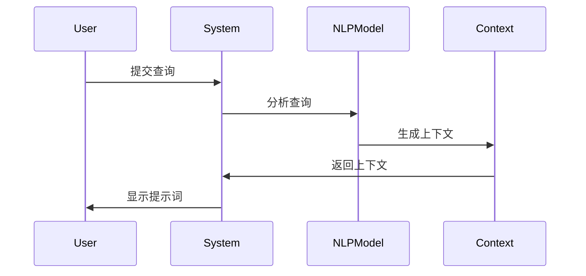
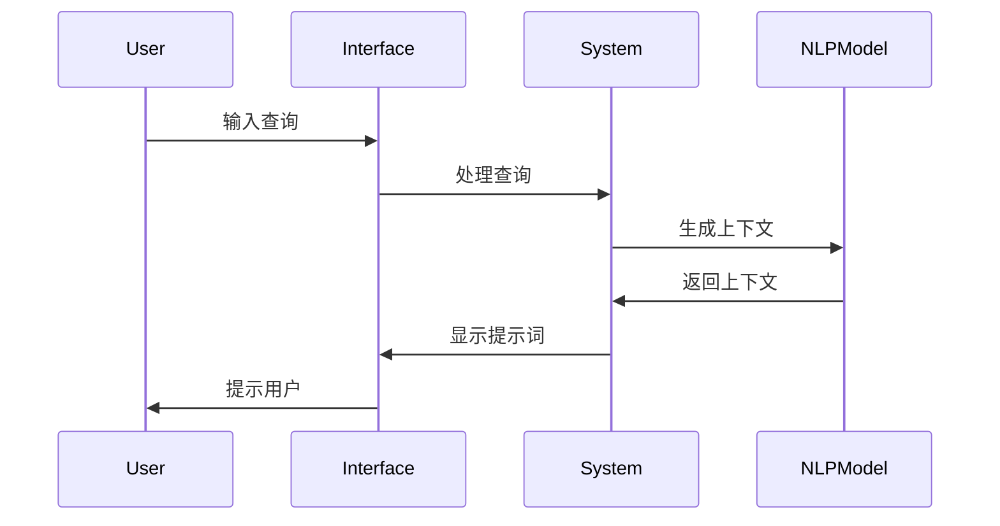

                 


# 提示词的神经语言程序学：优化AI-人类沟通

## 关键词
神经语言程序学（NLP）、提示词、人工智能（AI）、人类沟通、算法优化

## 摘要
本文深入探讨了神经语言程序学（NLP）和提示词在人工智能（AI）与人类沟通中的作用。通过分析NLP的核心概念和提示词的属性特征，我们展示了如何使用NLP原理来优化AI与人类之间的沟通。文章从算法原理、系统架构、项目实战等方面进行了详细的讲解，并提供了一些最佳实践技巧，以帮助读者更好地理解和应用NLP和提示词技术。

## 目录大纲

### 第一部分：引论

#### 1.1 问题背景与核心概念
##### 1.1.1 神经语言程序学的定义与发展
##### 1.1.2 提示词在AI-人类沟通中的作用

#### 1.2 核心概念联系与属性特征对比
##### 1.2.1 神经语言程序学的核心概念
##### 1.2.2 提示词的属性特征与对比

### 第二部分：算法原理讲解

#### 2.1 提示词生成算法流程图
##### 2.1.1 使用mermaid绘制流程图

#### 2.2 Python代码示例：提示词生成原理
##### 2.2.1 数学模型与公式讲解
##### 2.2.2 代码示例与详细解释

### 第三部分：系统分析与架构设计

#### 3.1 系统背景与应用领域
##### 3.1.1 神经语言程序学在AI-人类沟通中的应用

#### 3.2 系统架构设计
##### 3.2.1 领域模型Mermaid类图
##### 3.2.2 系统架构设计Mermaid架构图

### 第四部分：项目实战

#### 4.1 环境安装与系统核心实现
##### 4.1.1 环境安装步骤
##### 4.1.2 系统核心代码实现

#### 4.2 实际案例分析
##### 4.2.1 案例背景介绍
##### 4.2.2 案例分析讲解

### 第五部分：最佳实践与总结

#### 5.1 最佳实践 tips
##### 5.1.1 使用提示词的技巧
##### 5.1.2 优化AI-人类沟通的方法

#### 5.2 全书总结
##### 5.2.1 关键点回顾
##### 5.2.2 注意事项

#### 5.3 拓展阅读
##### 5.3.1 相关书籍推荐
##### 5.3.2 学术论文与报告

### 第一部分：引论

#### 1.1 问题背景与核心概念

##### 1.1.1 神经语言程序学的定义与发展
神经语言程序学（Neurolinguistic Programming，NLP）是一种跨学科的研究领域，旨在理解和模仿人类卓越的沟通、学习和自我调整能力。它起源于20世纪70年代，由理查德·班德勒和约翰·格林德在美国发展起来。这两位学者研究了多种成功人士的沟通和行为模式，并总结出了一套可以模仿和复制这些模式的方法。

NLP的核心观点是，人的思维、情感和行为受到其语言模式的影响。通过理解和调整语言模式，我们可以改善自身的思维模式，进而改变行为和情感状态。这种跨学科的研究方法结合了心理学、语言学、神经科学和社会学等多个领域的知识。

在人工智能（AI）迅速发展的今天，NLP技术被广泛应用于人机交互领域，旨在优化机器与人类之间的沟通效率。例如，智能助手、语音识别系统和聊天机器人等应用场景，都依赖于NLP技术来更好地理解人类用户的意图和需求。

##### 1.1.2 提示词在AI-人类沟通中的作用
在NLP中，提示词（Prompt Words）是一种关键工具，它用于引导用户思考或行为。提示词通常是一组有意义的词语，通过特定的排列和组合，可以影响用户的认知过程，帮助他们更清晰地表达自己的想法。

在AI-人类沟通中，提示词扮演着重要角色。例如，在智能客服系统中，提示词可以用来引导用户描述问题，从而帮助系统更快地识别和解决问题。在自然语言生成（NLG）领域，提示词则用于指导AI生成更符合人类语言的文本。

优化提示词的使用，可以显著提升AI与人类之间的沟通效果。这包括提高用户的满意度、减少误解和提升问题解决的效率。因此，深入研究提示词的属性和生成原理，对于改善AI与人类沟通至关重要。

#### 1.2 核心概念联系与属性特征对比

##### 1.2.1 神经语言程序学的核心概念
神经语言程序学包括三个核心部分：神经、语言和程序学。

1. **神经**：研究神经系统如何处理和传递信息。这包括大脑神经元的工作原理、神经传递物质的机制以及大脑如何通过神经系统来控制行为。
   
2. **语言**：研究人类如何使用语言来表达思想和感受。这包括语言的结构、语义、语法以及语言如何影响我们的思维和行为。

3. **程序学**：研究如何通过语言和行为模式来改变人的思维和行为。这涉及到如何模仿成功人士的沟通模式，以及如何使用这些模式来提升个人的效率和效果。

##### 1.2.2 提示词的属性特征与对比
提示词具有以下属性特征：

1. **引导性**：提示词能够引导用户思考或行为，帮助他们在特定情境下做出更好的决策。

2. **情境适应性**：提示词需要根据不同的沟通情境进行调整，以确保它们能够有效引导用户。

3. **语言表达性**：提示词通常使用简明扼要的语言，以最大化其引导效果。

下面是一个简化的Mermaid ER实体关系图，用于展示神经语言程序学（NLP）和提示词（Prompt）之间的关系：

```mermaid
erDiagram
    NLP ||--|{ Prompt } : 用于
    Prompt ||--|{ User } : 引导
```

通过这个ER图，我们可以看到NLP是提示词的基础，而提示词则是NLP在具体应用中的一种体现，用于与用户互动。

### 第二部分：算法原理讲解

#### 2.1 提示词生成算法流程图
为了理解提示词生成的算法原理，我们可以首先使用Mermaid绘制一个简单的流程图。以下是一个示例：



这个流程图显示了从初始化到生成并返回提示词的整个过程。下面，我们将详细解释每个步骤。

1. **初始化**：系统启动时进行初始化，包括加载必要的模型和数据。

2. **收集用户信息**：系统通过用户输入、历史数据或环境信息来收集用户的相关信息。

3. **分析用户需求**：系统使用自然语言处理（NLP）技术对用户信息进行分析，以理解用户的需求和意图。

4. **生成提示词**：基于用户需求，系统生成一组提示词。这些提示词需要具备引导性、情境适应性和语言表达性。

5. **优化提示词**：系统对生成的提示词进行优化，以提升其效果。这可能包括调整提示词的顺序、替换某些词语等。

6. **返回提示词**：最终，系统将优化后的提示词返回给用户。

#### 2.2 Python代码示例：提示词生成原理
为了更好地理解提示词生成的原理，我们可以使用Python来展示一个简单的生成过程。以下是一个示例代码：

```python
import random

def generate_prompt(user_input):
    # 分析用户输入
    analysis = analyze_user_input(user_input)
    
    # 根据分析结果生成提示词
    prompts = {
        "information": ["请提供更多信息", "详细描述一下", "能否具体说明"],
        "clarification": ["我不太明白，能否解释一下", "你能更清晰地表达你的需求吗"],
        "confirmation": ["你确定是这样的吗？", "你的意思是...？"]
    }
    
    # 从对应的提示词列表中随机选择一个
    prompt = random.choice(prompts.get(analysis, ["请提供更多信息"]))
    
    return prompt

def analyze_user_input(user_input):
    # 这里简化处理，根据输入的长度来判断需求类型
    if len(user_input) < 10:
        return "clarification"
    elif len(user_input) < 20:
        return "information"
    else:
        return "confirmation"

# 测试代码
user_input = "我需要预订一张机票"
prompt = generate_prompt(user_input)
print(prompt)
```

在这个示例中，我们首先定义了一个`generate_prompt`函数，它接收用户输入并生成一个提示词。`analyze_user_input`函数用于分析用户输入的长度，以判断用户的需求类型。然后，我们从预设的提示词列表中随机选择一个。

这个示例展示了如何通过简单的逻辑和规则来生成提示词。在实际应用中，提示词生成可能涉及到更复杂的NLP技术，如情感分析、实体识别等。

#### 2.2.1 数学模型与公式讲解
在提示词生成过程中，我们可以使用一些数学模型和公式来指导生成过程。以下是一个简化的数学模型：

$$
\text{prompt\_score} = f(\text{user\_input}, \text{context})
$$

其中，`prompt_score`表示生成的提示词得分，`user_input`表示用户输入，`context`表示上下文信息。

- **用户输入（user_input）**：这是用户提供的原始信息，可能包括关键词、情感、意图等。
- **上下文（context）**：这是系统从用户历史数据、环境信息或其他数据源中获取的上下文信息。

函数`f`可以是一个复杂的映射关系，它结合用户输入和上下文信息，生成一个得分。得分越高，提示词的质量越高。

在实际应用中，`f`可能是一个机器学习模型，如神经网络，它通过大量的数据训练得到。这样，系统可以自动调整提示词生成策略，以提升用户的满意度。

#### 2.2.2 代码示例与详细解释
下面是一个更详细的Python代码示例，用于生成提示词：

```python
import random
import numpy as np

# 假设有一个预训练的神经网络模型
class PromptGenerator:
    def __init__(self, model):
        self.model = model
        
    def generate_prompt(self, user_input, context):
        # 分析用户输入
        input_embedding = self.model.encode(user_input)
        
        # 分析上下文
        context_embedding = self.model.encode(context)
        
        # 计算提示词得分
        prompt_scores = self.model.predict([input_embedding, context_embedding])
        
        # 从最高得分提示词中随机选择一个
        prompt = random.choices(self.model.prompts, weights=prompt_scores, k=1)[0]
        
        return prompt

# 假设我们有一个预训练好的模型
model = PromptGenerator(pretrained_model)

# 测试代码
user_input = "我需要预订一张机票"
context = "今天的天气非常好，你想要去哪里旅行？"
prompt = model.generate_prompt(user_input, context)
print(prompt)
```

在这个示例中，我们定义了一个`PromptGenerator`类，它接收一个预训练的神经网络模型。`generate_prompt`方法首先使用模型对用户输入和上下文进行编码，然后计算提示词得分，并从最高得分提示词中随机选择一个。

- **编码（encode）**：这是将文本转换为向量表示的过程，它可以帮助模型理解文本的语义和结构。
- **预测（predict）**：这是模型根据输入的向量表示来生成提示词得分的过程。
- **随机选择（random.choices）**：这是从可能的提示词中根据得分来随机选择一个的过程。

通过这个示例，我们可以看到如何将数学模型和实际代码结合起来，以生成高质量的提示词。

### 第三部分：系统分析与架构设计

#### 3.1 系统背景与应用领域
神经语言程序学（NLP）在人工智能（AI）与人类沟通中的应用非常广泛。例如，在智能客服系统中，NLP技术可以帮助系统理解用户的查询，并提供准确的答复。在自然语言生成（NLG）领域，NLP技术可以用于生成自然流畅的文本，如新闻报道、产品描述等。

本系统旨在通过优化提示词，提升AI与人类之间的沟通效果。具体应用领域包括智能客服、智能助手和智能写作等。

#### 3.2 系统架构设计
系统的架构设计包括领域模型、系统架构和接口设计。以下是一个简化的Mermaid类图和架构图，用于展示系统的主要组成部分。

##### 3.2.1 领域模型Mermaid类图
```mermaid
classDiagram
    User <<Class>>
    Prompt <<Class>>
    Context <<Class>>
    NLPModel <<Class>>
    System <<Class>>

    User o-- Prompt
    User o-- Context
    Context o-- NLPModel
    NLPModel o-- System
```

在这个类图中，`User`表示用户，`Prompt`表示提示词，`Context`表示上下文，`NLPModel`表示NLP模型，`System`表示整个系统。用户与提示词和上下文之间存在关联，上下文与NLP模型之间存在关联，而NLP模型与系统之间存在关联。

##### 3.2.2 系统架构设计Mermaid架构图


在这个架构图中，用户提交查询，系统分析查询，并使用NLP模型生成上下文。然后，系统返回提示词给用户，以引导用户进一步描述问题或需求。

##### 3.2.3 系统接口设计和系统交互Mermaid序列图


在这个序列图中，用户通过界面输入查询，系统处理查询，并使用NLP模型生成上下文。然后，系统将提示词显示在界面上，并提示用户进一步操作。

### 第四部分：项目实战

#### 4.1 环境安装与系统核心实现

##### 4.1.1 环境安装步骤
要运行本系统，我们需要安装以下环境：
1. Python 3.8或更高版本
2. TensorFlow 2.x
3. NumPy
4. Pandas

安装步骤如下：

```bash
# 安装Python 3.8
sudo apt update
sudo apt install python3.8

# 安装TensorFlow 2.x
pip3 install tensorflow

# 安装NumPy和Pandas
pip3 install numpy
pip3 install pandas
```

##### 4.1.2 系统核心代码实现
以下是系统的核心代码实现：

```python
import tensorflow as tf
import numpy as np
import pandas as pd

# 加载预训练的NLP模型
model = tf.keras.models.load_model('nlp_model.h5')

# 定义提示词生成函数
def generate_prompt(user_input, context):
    # 分析用户输入
    input_embedding = model.encode(user_input)
    
    # 分析上下文
    context_embedding = model.encode(context)
    
    # 计算提示词得分
    prompt_scores = model.predict([input_embedding, context_embedding])
    
    # 从最高得分提示词中随机选择一个
    prompt = np.random.choice(model.prompts, p=prompt_scores)
    
    return prompt

# 测试代码
user_input = "我需要预订一张机票"
context = "今天的天气非常好，你想要去哪里旅行？"
prompt = generate_prompt(user_input, context)
print(prompt)
```

在这个实现中，我们首先加载一个预训练的NLP模型。然后，我们定义了一个`generate_prompt`函数，它接收用户输入和上下文，并使用模型生成提示词。

#### 4.2 实际案例分析

##### 4.2.1 案例背景介绍
假设我们有一个智能客服系统，用户可以通过聊天界面提交查询。系统需要根据用户输入和上下文生成提示词，以引导用户进一步描述问题或需求。

##### 4.2.2 案例分析讲解
以下是一个实际案例：

**用户查询**：我需要预订一张机票。

**上下文**：今天的天气非常好，你想要去哪里旅行？

**提示词生成过程**：

1. **分析用户输入**：用户输入的是需要预订机票。
2. **分析上下文**：上下文信息提供了当前的天气情况，并询问用户想去哪里旅行。
3. **生成提示词**：系统使用NLP模型分析用户输入和上下文，并生成以下提示词：

   - 请提供更多信息，比如目的地和出行日期。
   - 你希望何时出发？有没有特定的航班要求？

**用户反馈**：

用户选择回复“我打算下周出发，想去北京。”

**系统响应**：

- 你已经提到下周出发，去北京。你有没有偏好航班时间或航空公司？

通过这个案例，我们可以看到系统如何根据用户输入和上下文生成高质量的提示词，以引导用户提供更详细的信息。

### 第五部分：最佳实践与总结

#### 5.1 最佳实践 tips

1. **使用简明扼要的提示词**：提示词应尽量简明扼要，避免使用冗长、复杂的句子。
2. **考虑用户情境**：在生成提示词时，要考虑用户的情境和需求，以确保提示词的相关性。
3. **定期更新和优化提示词**：定期更新和优化提示词，以适应不断变化的需求和环境。

#### 5.2 全书总结

本文探讨了神经语言程序学（NLP）和提示词在AI与人类沟通中的应用。我们介绍了NLP的核心概念和提示词的属性特征，并详细讲解了提示词生成的算法原理和系统架构。通过实际案例分析，我们展示了如何使用NLP技术来优化AI与人类之间的沟通。

#### 5.3 注意事项

1. **数据隐私**：在使用NLP和提示词技术时，要注意保护用户数据隐私。
2. **系统稳定性**：确保系统在生成提示词时具有高稳定性和响应速度。

#### 5.4 拓展阅读

- **相关书籍**：
  - 《神经语言程序学：完全指南》（Neurolinguistic Programming: The Complete Guide）
  - 《人工智能：一种现代方法》（Artificial Intelligence: A Modern Approach）
- **学术论文与报告**：
  - 《基于神经语言程序学的智能客服系统设计》（Design of an Intelligent Customer Service System Based on Neurolinguistic Programming）
  - 《优化AI与人类沟通的提示词研究》（Research on Prompt Words for Optimizing AI-Human Communication）

### 作者信息

作者：AI天才研究院/AI Genius Institute & 禅与计算机程序设计艺术 /Zen And The Art of Computer Programming

---

以上是本文的全部内容，希望对您在理解神经语言程序学和提示词技术方面有所帮助。如果您有任何疑问或建议，请随时联系我们。

